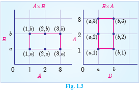

# 1.3 Cartesian Product

### Illustration 1

Let us consider the following two sets.

A is the set of 3 vegetables and B is the set of 4 fruits. That is,
- A = {carrot, brinjal, ladies finger} 
- B = {apple, orange, grapes, strawberry}

What are the possible ways of choosing a vegetable with a fruit?

We can select them in 12 distinct pairs as given below:

(c,a), (c,o), (c,g), (c,s), (b,a), (b,o), (b,g), (b,s), (l,a), (l,o), (l,g), (l,s)

This collection represents the **cartesian product** of the set of vegetables and set of fruits.

### Definition

If A and B are two non-empty sets, then the set of all ordered pairs (a,b) such that a ∈ A, b ∈ B is called the **Cartesian Product** of A and B, and is denoted by A × B.

Thus, **A × B = {(a,b) | a ∈ A, b ∈ B}** (read as A cross B).

Also note that **A × ∅ = ∅**

---

### Note

- **A × B** is the set of all possible ordered pairs between the elements of A and B such that the first coordinate is an element of A and the second coordinate is an element of B.
- **B × A** is the set of all possible ordered pairs between the elements of A and B such that the first coordinate is an element of B and the second coordinate is an element of A.
- In general **(a,b) ≠ (b,a)**, in particular, if a = b, then (a,b) = (b,a).
- The "cartesian product" is also referred as "cross product".

---

### Illustration 2

Let A = {1, 2, 3} and B = {a, b}. Write A × B and B × A?

**A × B** = {1, 2, 3} × {a, b} = {(1,a), (1,b), (2,a), (2,b), (3,a), (3,b)}

**B × A** = {a, b} × {1, 2, 3} = {(a,1), (a,2), (a,3), (b,1), (b,2), (b,3)}

### Thinking Corner

**When will A × B be equal to B × A?**

### Note

In general **A × B ≠ B × A**, but **n(A × B) = n(B × A)**

If n(A) = p and n(B) = q, then **n(A × B) = pq**

A × B = ∅ if and only if A = ∅ or B = ∅

---

### Recall of standard infinite sets

| Set | Symbol | Definition |
|-----|--------|------------|
| Natural Numbers | ℕ | {1, 2, 3, 4, ...} |
| Whole Numbers | W | {0, 1, 2, 3, ...} |
| Integers | ℤ | {..., -2, -1, 0, 1, 2, ...} |
| Rational Numbers | ℚ | {p/q \| p,q ∈ ℤ, q ≠ 0} |
| Real Numbers | ℝ | ℚ ∪ ℚ' (where ℚ' is the set of all irrational numbers) |

---

### Illustration 3

For example, let A be the set of numbers in the interval [3,5] and B be the set of numbers in the interval [2,3]. Then the Cartesian product A × B corresponds to the rectangular region shown in the Fig. 1.4. It consists of all points (x,y) within the region.

---

### Progress Check

1. For any two non-empty sets A and B, A × B is called as _____.
2. If n(A × B) = 20 and n(A) = 5 then n(B) is _____.
3. If A = {-1, 1} and B = {-1, 1} then geometrically describe the set of points of A × B.
4. If A, B are the line segments given by the intervals (–4, 3) and (–2, 3) respectively, represent the cartesian product of A and B.

---

### Note

The set of all points in the cartesian plane can be viewed as the set of all ordered pairs (x,y) where x, y are real numbers. In fact, ℝ × ℝ is the set of all points which we call as the cartesian plane.

---

### Activity 1

Let A = {x | x ∈ ℕ, x ≤ 4}, B = {y | y ∈ ℕ, y < 3}

Represent A × B and B × A in a graph sheet. Can you see the difference between A × B and B × A?

---

### Example 1.1

If A = {1, 3, 5} and B = {2, 3} then:
(i) find A × B and B × A
(ii) Is A × B = B × A? If not why?
(iii) Show that n(A × B) = n(B × A) = n(A) × n(B)

**Solution**

Given that A = {1, 3, 5} and B = {2, 3}

**(i)** 
- A × B = {1, 3, 5} × {2, 3} = {(1,2), (1,3), (3,2), (3,3), (5,2), (5,3)} ... (1)
- B × A = {2, 3} × {1, 3, 5} = {(2,1), (2,3), (2,5), (3,1), (3,3), (3,5)} ... (2)

**(ii)** From (1) and (2) we conclude that A × B ≠ B × A as (1,2) ≠ (2,1) and (1,3) ≠ (3,1), etc.

**(iii)** n(A) = 3; n(B) = 2

From (1) and (2) we observe that, n(A × B) = n(B × A) = 6;

We see that, n(A) × n(B) = 3 × 2 = 6 and n(B) × n(A) = 2 × 3 = 6

Hence, **n(A × B) = n(B × A) = n(A) × n(B) = 6**

---

### Example 1.2

If A × B = {(3,2), (3,4), (5,2), (5,4)} then find A and B.

**Solution**

A × B = {(3,2), (3,4), (5,2), (5,4)}

A = set of all first coordinates of elements of A × B = {3, 5}

B = set of all second coordinates of elements of A × B = {2, 4}

Thus **A = {3, 5}** and **B = {2, 4}**

---

### Example 1.3

Let A = {x ∈ ℕ | 1 < x < 4}, B = {x ∈ W | 0 ≤ x < 2} and C = {x ∈ ℕ | x < 3}. Then verify that:
(i) A × (B ∪ C) = (A × B) ∪ (A × C)
(ii) A × (B ∩ C) = (A × B) ∩ (A × C)

**Solution**

A = {x ∈ ℕ | 1 < x < 4} = {2, 3}

B = {x ∈ W | 0 ≤ x < 2} = {0, 1}

C = {x ∈ ℕ | x < 3} = {1, 2}

**(i)** B ∪ C = {0, 1} ∪ {1, 2} = {0, 1, 2}

A × (B ∪ C) = {2, 3} × {0, 1, 2} = {(2,0), (2,1), (2,2), (3,0), (3,1), (3,2)} ... (1)

A × B = {2, 3} × {0, 1} = {(2,0), (2,1), (3,0), (3,1)}

A × C = {2, 3} × {1, 2} = {(2,1), (2,2), (3,1), (3,2)}

(A × B) ∪ (A × C) = {(2,0), (2,1), (3,0), (3,1)} ∪ {(2,1), (2,2), (3,1), (3,2)}
= {(2,0), (2,1), (2,2), (3,0), (3,1), (3,2)} ... (2)

From (1) and (2), **A × (B ∪ C) = (A × B) ∪ (A × C)** is verified.

**(ii)** B ∩ C = {0, 1} ∩ {1, 2} = {1}

A × (B ∩ C) = {2, 3} × {1} = {(2,1), (3,1)} ... (3)

(A × B) ∩ (A × C) = {(2,0), (2,1), (3,0), (3,1)} ∩ {(2,1), (2,2), (3,1), (3,2)}
= {(2,1), (3,1)} ... (4)

From (3) and (4), **A × (B ∩ C) = (A × B) ∩ (A × C)** is verified.

---

### Note

The above two verified properties are called **distributive property** of cartesian product over union and intersection respectively. In fact, for any three sets A, B, C we have:
- (i) A × (B ∪ C) = (A × B) ∪ (A × C)
- (ii) A × (B ∩ C) = (A × B) ∩ (A × C)

---

## 1.3.1 Cartesian Product of three Sets

If A, B, C are three non-empty sets then the cartesian product of three sets is the set of all possible ordered triplets given by:

**A × B × C = {(a, b, c) for all a ∈ A, b ∈ B, c ∈ C}**

### Illustration for Geometrical understanding

Let A = B = C = {0, 1}

A × B = {0, 1} × {0, 1} = {(0,0), (0,1), (1,0), (1,1)}

Representing A × B in the XY-plane we get a picture shown in Fig. 1.5.

(A × B) × C = {(0,0), (0,1), (1,0), (1,1)} × {0, 1}
= {(0,0,0), (0,0,1), (0,1,0), (0,1,1), (1,0,0), (1,0,1), (1,1,0), (1,1,1)}

Representing A × B × C in the XYZ-space we get a picture as shown in Fig. 1.6.

Thus, A × B represent vertices of a **square** in two dimensions and A × B × C represent vertices of a **cube** in three dimensions.

### Note

In general if we join the cartesian product of two non-empty sets provides a shape in two dimensions and similarly cartesian product of three non-empty sets provide an object in three dimensions.

---

## Exercise 1.1

1. Find A × B, A × A and B × A
   - (i) A = {2, -2, 3} and B = {1, -4}
   - (ii) A = B = {p, q}
   - (iii) A = {m, n}; B = ∅

2. Let A = {1, 3} and B = {x | x is a prime number less than 10}. Find A × B and B × A.

3. If B × A = {(-2,3), (-2,4), (0,3), (0,4), (3,3), (3,4)} find A and B.

4. If A = {5, 6}, B = {4, 5, 6}, C = {5, 6, 7}, Show that A × A = (B × B) ∩ (C × C).

5. Given A = {1, 2, 3}, B = {2, 3, 5}, C = {3, 4} and D = {1, 3, 5}, check if (A ∩ C) × (B ∩ D) = (A × B) ∩ (C × D) is true?

6. Let A = {x ∈ W | x < 2}, B = {x ∈ ℕ | 1 < x ≤ 4} and C = {3, 5}. Verify that:
   - (i) A × (B ∪ C) = (A × B) ∪ (A × C)
   - (ii) A × (B ∩ C) = (A × B) ∩ (A × C)
   - (iii) (A ∪ B) × C = (A × C) ∪ (B × C)

7. Let A = The set of all natural numbers less than 8, B = The set of all prime numbers less than 8, C = The set of even prime number. Verify that:
   - (i) (A ∩ B) × C = (A × C) ∩ (B × C)
   - (ii) A × (B - C) = (A × B) - (A × C)

---
