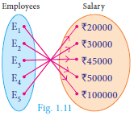
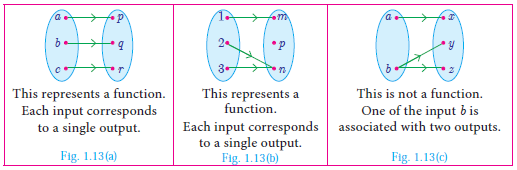
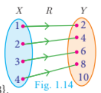
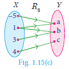

## 1.5 Functions

Among several relations that exist between two non-empty sets, some special relations are important for further exploration. Such relations are called **"Functions"**.

### Illustration 8

A company has 5 employees in different categories. If we consider their salary distribution for a month as shown by arrow diagram in Fig. 1.11, we see that there is only one salary associated for every employee of the company.

Here are various real life situations illustrating some special relations:

1. Consider the set A of all of your classmates; corresponding to each student, there is only one age.
2. You go to a shop to buy a book. If you take out a book, there is only one price corresponding to it; it does not have two prices corresponding to it (of course, many books may have the same price).
3. You are aware of Boyle's law. Corresponding to a given value of pressure P, there is only one value of volume V.
4. In Economics, the quantity demanded can be expressed as Q = 360 - 4P, where P is the price of the commodity. We see that for each value of P, there is only one value of Q.

We often come across certain relations, in which, **for each element of a set A, there is only one corresponding element of a set B**. Such relations are called **functions**. We usually use the symbol **f** to denote a functional relation.

---

### Definition

A relation f between two non-empty sets X and Y is called a **function from X to Y** if, for each x ∈ X there exists **only one** y ∈ Y such that (x, y) ∈ f.

That is, **f = {(x, y)} for all x ∈ X, y ∈ Y**

A function f from X to Y is written as **f: X → Y**.

Comparing the definitions of relation and function, we see that **every function is a relation**. Thus, functions are subsets of relations and relations are subsets of cartesian product.

A function f can be thought as a mechanism (or device), which gives a unique output f(x) to every input x.

---

### Note

If f: X → Y is a function then:

- A function is also called as a **mapping** or **transformation**.
- The set X is called the **domain** of the function f and the set Y is called its **co-domain**.
- If f(a) = b, then b is called **'image'** of a under f and a is called a **'pre-image'** of b.
- The set of all images of the elements of X under f is called the **'range'** of f.
- f: X → Y is a function only if:
  1. every element in the domain of f has an image.
  2. the image is unique.
- If A and B are finite sets such that n(A) = p, n(B) = q then the total number of functions that exist from A to B is **q^p**.
- In this chapter we always consider f to be a **real valued function**.

---

### Describing domain of a function

**(i)** Let f(x) = 1/(x+1). If x = -1 then f(–1) is not defined. Hence f is defined for all real numbers except at x = -1. So, domain of f = ℝ - {-1}.

**(ii)** Let f(x) = 1/(x² - 5x + 6); If x = 2, 3 then f(2) and f(3) are not defined. Hence f is defined for all real numbers except at x = 2 and 3. So, domain of f = ℝ - {2, 3}.

---

### Progress Check

1. Relations are subsets of ____. Functions are subsets of ____.
2. True or False: All the elements of a relation should have images.
3. True or False: All the elements of a function should have images.
4. True or False: If R: A → B is a relation then the domain of R = A.
5. If f: ℕ → ℕ is defined as f(x) = x² the image of 1 and 2 are ____ and ____.
6. What is the difference between relation and function?
7. Let A and B be two non-empty finite sets. Then which one among the following two collection is large?
   - (i) The number of relations between A and B.
   - (ii) The number of functions between A and B.

---

### Illustration 9 - Testing for functions

#### Representation by Arrow diagram

| Diagram | Description |
|---------|-------------|
| **Fig. 1.13(a)** | This represents a **function**. Each input corresponds to a single output. |
| **Fig. 1.13(b)** | This represents a **function**. Each input corresponds to a single output. |
| **Fig. 1.13(c)** | This is **not a function**. One of the input b is associated with two outputs. |

Functions play very important role in the understanding of higher ideas in mathematics. They are basic tools to convert from one form to another form. In this sense, functions are widely applied in Engineering Sciences.

---

### Note

The range of a function is a subset of its co-domain.

---

### Example 1.6

Let X = {1, 2, 3, 4} and Y = {2, 4, 6, 8, 10} and R = {(1,2), (2,4), (3,6), (4,8)}.

Show that R is a function and find its domain, co-domain and range?

**Solution**

Pictorial representation of R is given in Fig. 1.14. From the diagram, we see that for each x ∈ X, there exists only one y ∈ Y. Thus all elements in X have only one image in Y. Therefore R is a function.

- **Domain** X = {1, 2, 3, 4}
- **Co-domain** Y = {2, 4, 6, 8, 10}
- **Range of R** = {2, 4, 6, 8}

---

### Example 1.7

A relation f: X → Y is defined by f(x) = x² - 2 where, X = {-2, -1, 0, 3} and Y = ℝ.

(i) List the elements of f
(ii) Is f a function?

**Solution**

f(x) = x² - 2 where X = {-2, -1, 0, 3}

- f(-2) = (-2)² - 2 = 2
- f(-1) = (-1)² - 2 = -1
- f(0) = (0)² - 2 = -2
- f(3) = (3)² - 2 = 7

Therefore **f = {(-2, 2), (-1, -1), (0, -2), (3, 7)}**

**(ii)** We note that each element in the domain of f has a unique image. Therefore, **f is a function**.

---

### Thinking Corner

Is the relation representing the association between planets and their respective moons a function?

---

### Example 1.8

If X = {-5, 1, 3, 4} and Y = {a, b, c}, then which of the following relations are functions from X to Y?

(i) R₁ = {(-5,a), (1,a), (3,b)}
(ii) R₂ = {(-5,b), (1,b), (3,a), (4,c)}
(iii) R₃ = {(-5,a), (1,a), (3,b), (4,c), (1,b)}

**Solution**

**(i)** R₁ = {(-5,a), (1,a), (3,b)}

R₁ is **not a function** as 4 ∈ X does not have an image in Y.

**(ii)** R₂ = {(-5,b), (1,b), (3,a), (4,c)}

R₂ is **a function** as each element of X has a unique image in Y.

**(iii)** R₃ = {(-5,a), (1,a), (3,b), (4,c), (1,b)}

R₃ is **not a function** as 1 ∈ X has two images a ∈ Y and b ∈ Y. Note that the image of an element should always be unique.

---

### Example 1.9

Given f(x) = 2x - x², find:
(i) f(1)
(ii) f(x+1)
(iii) f(x) + f(1)

**Solution**

**(i)** x = 1, we get:
f(1) = 2(1) - (1)² = 2 - 1 = **1**

**(ii)** x = x+1, we get:
f(x+1) = 2(x+1) - (x+1)² = 2x + 2 - (x² + 2x + 1) = **-x² + 1**

**(iii)** f(x) + f(1) = (2x - x²) + 1 = **-x² + 2x + 1**

[Note that f(x+1) ≠ f(x) + f(1). In general f(a+b) is not equal to f(a) + f(b)]

---

## Exercise 1.3

1. Let f = {(x, y) | x, y ∈ ℕ, y = 2x} be a relation on ℕ. Find the domain, co-domain and range. Is this relation a function?

2. Let X = {3, 4, 6, 8}. Determine whether the relation R = {(x, f(x)) | x ∈ X, f(x) = x² + 1} is a function from X to ℕ.

3. Given the function f: x → x² - 5x + 6, evaluate:
   - (i) f(-1)
   - (ii) f(2a)
   - (iii) f(2)
   - (iv) f(x-1)

4. A graph representing the function f(x) is given in Fig. 1.16. It is clear that f(9) = 2.
   

   

   (i) Find the following values of the function:
   - (a) f(0)
   - (b) f(7)
   - (c) f(2)
   - (d) f(10)
   
   (ii) For what value of x is f(x) = 1?
   
   (iii) Describe the following:
   - (a) Domain
   - (b) Range
   
   (iv) What is the image of 6 under f?

5. Let f(x) = 2x + 5. If x ≠ 0 then find [f(x+2) - f(2)]/x.

6. A function f is defined by f(x) = 2x - 3
   - (i) find [f(0) + f(1)]/2
   - (ii) find x such that f(x) = 0
   - (iii) find x such that f(x) = x
   - (iv) find x such that f(x) = f(1-x)

7. An open box is to be made from a square piece of material, 24cm on a side, by cutting equal squares from the corners and turning up the sides as shown (Fig. 1.17). Express the volume V of the box as a function of x.

8. A function f is defined by f(x) = 3 - 2x. Find x such that f(x²) = (f(x))².

9. A plane is flying at a speed of 500 km per hour. Express the distance 'd' travelled by the plane as function of time t in hours.

10. The data in the adjacent table depicts the length of a person's forehand and their corresponding height. Based on this data, a student finds a relationship between the height (y) and the forehand length (x) as y = ax + b, where a, b are constants.

| Length 'x' of forehand (in cm) | Height 'y' (in inches) |
|-------------------------------|------------------------|
| 35 | 56 |
| 45 | 65 |
| 50 | 69.5 |
| 55 | 74 |

   (i) Check if this relation is a function.
   (ii) Find a and b.
   (iii) Find the height of a person whose forehand length is 40 cm.
   (iv) Find the length of forehand of a person if the height is 53.3 inches.

---
