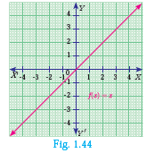

<<<<<<< HEAD
## 1.10.1 Linear Function

A function f: ℝ → ℝ defined by **f(x) = mx + c, m ≠ 0** is called a **linear function**. Geometrically this represents a straight line in the graph.

Some Specific Linear Functions and their graphs:

| No. | Function | Domain and Definition | Graph |
|-----|----------|----------------------|------|
| 1 | The identity function | f: ℝ → ℝ defined by f(x) = x | |
| 2 | Additive inverse function | f: ℝ → ℝ defined by f(x) = -x | |

---

## 1.10.2 Modulus or Absolute valued Function

f: [0, ∞) → [0, ∞) defined by:

f(x) = |x| = { x;   x ≥ 0
             { -x;  x < 0

---

### Note

- Modulus function is **not a linear function** but it is composed of two linear functions x and –x.
- Linear functions are always **one-one functions** and has applications in Cryptography as well as in several branches of Science and Technology.

---

## 1.10.3 Quadratic Function

A function f: ℝ → ℝ defined by **f(x) = ax² + bx + c, (a ≠ 0)** is called a **quadratic function**.

Some specific quadratic functions and their graphs:

| Function, Domain, Range and Definition | Description | Graph |
|----------------------------------------|-------------|-------|
| f: ℝ → ℝ defined by f(x) = x², x ∈ ℝ; f(x) ∈ [0, ∞) | Parabola opening upward ||
| f: ℝ → ℝ defined by f(x) = -x², x ∈ ℝ; f(x) ∈ (-∞, 0] | Parabola opening downward ||

---

## 1.10.4 Cubic Function

A function f: ℝ → ℝ defined by **f(x) = ax³ + bx² + cx + d, (a ≠ 0)** is called a **cubic function**.

The graph of f(x) = x³ is shown in Fig. 1.48.

---

## 1.10.5 Reciprocal Function

A function f: ℝ - {0} → ℝ defined by **f(x) = 1/x** is called a **reciprocal function**.

---

## 1.10.6 Constant Function

A function f: ℝ → ℝ defined by **f(x) = c, ∀ x ∈ ℝ** is called a **constant function**.

---

### Progress Check

1. Is a constant function a linear function?
2. Is quadratic function a one – one function?
3. Is cubic function a one – one function?
4. Is the reciprocal function a bijection?
5. If f: A → B is a constant function, then the range of f will have ____ elements.

---

## Exercise 1.5

1. Using the functions f and g given below, find f∘g and g∘f. Check whether f∘g = g∘f.
   - (i) f(x) = x - 6, g(x) = x²
   - (ii) f(x) = 2/x, g(x) = 2x² - 1
   - (iii) f(x) = (x + 6)/3, g(x) = 3 - x
   - (iv) f(x) = 3 + x, g(x) = x - 4
   - (v) f(x) = 4x² - 1, g(x) = 1 + x

2. Find the value of k such that f∘g = g∘f
   - (i) f(x) = 3x + 2, g(x) = 6x - k
   - (ii) f(x) = 2x - k, g(x) = 4x + 5

3. If f(x) = 2x - 1, g(x) = (x + 1)/2, show that f∘g = g∘f = x

4. If f(x) = x² - 1, g(x) = x - 2 find a, if g∘f(a) = 1.

5. Let A, B, C ⊆ ℕ and a function f: A → B be defined by f(x) = 2x + 1 and g: B → C be defined by g(x) = x². Find the range of f∘g and g∘f.

6. Let f(x) = x² - 1. Find (i) f∘f (ii) f∘f∘f

7. If f: ℝ → ℝ and g: ℝ → ℝ are defined by f(x) = x⁵ and g(x) = x⁴ then check if f, g are one-one and f∘g is one-one?

8. Consider the functions f(x), g(x), h(x) as given below. Show that (f∘g)∘h = f∘(g∘h) in each case.
   - (i) f(x) = x - 1, g(x) = 3x + 1 and h(x) = x²
   - (ii) f(x) = x², g(x) = 2x and h(x) = x + 4
   - (iii) f(x) = x - 4, g(x) = x² and h(x) = 3x - 5

9. Let f = {(-1, 3), (0, -1), (2, -9)} be a linear function from ℤ into ℤ. Find f(x).

10. In electrical circuit theory, a circuit C(t) is called a linear circuit if it satisfies the superposition principle given by C(at₁ + bt₂) = aC(t₁) + bC(t₂), where a, b are constants. Show that the circuit C(t) = 3t is linear.

---

## Multiple Choice Questions

## Exercise 1.6

1. If n(A × B) = 6 and A = {1, 3} then n(B) is
   - (A) 1
   - (B) 2
   - (C) 3
   - (D) 6

2. A = {a, b, p}, B = {2, 3}, C = {p, q, r, s} then n[(A ∪ C) × B] is
   - (A) 8
   - (B) 20
   - (C) 12
   - (D) 16

3. If A = {1, 2}, B = {1, 2, 3, 4}, C = {5, 6} and D = {5, 6, 7, 8} then state which of the following statement is true.
   - (A) (A × C) ⊂ (B × D)
   - (B) (B × D) ⊂ (A × C)
   - (C) (A × B) ⊂ (A × D)
   - (D) (D × A) ⊂ (B × A)

4. If there are 1024 relations from a set A = {1, 2, 3, 4, 5} to a set B, then the number of elements in B is
   - (A) 3
   - (B) 2
   - (C) 4
   - (D) 8

5. The range of the relation R = {(x, x²) | x is a prime number less than 13} is
   - (A) {2, 3, 5, 7}
   - (B) {2, 3, 5, 7, 11}
   - (C) {4, 9, 25, 49, 121}
   - (D) {1, 4, 9, 25, 49, 121}

6. If the ordered pairs (a + 2, 4) and (5, 2a + b) are equal then (a, b) is
   - (A) (2, -2)
   - (B) (5, 1)
   - (C) (2, 3)
   - (D) (3, -2)

7. Let n(A) = m and n(B) = n then the total number of non-empty relations that can be defined from A to B is
   - (A) mn
   - (B) n^m
   - (C) 2^(mn) - 1
   - (D) 2mn

8. If {(a, b), (8, 6)} represents an identity function, then the value of a and b are respectively
   - (A) (8, 6)
   - (B) (8, 8)
   - (C) (6, 8)
   - (D) (6, 6)

9. Let A = {1, 2, 3, 4} and B = {4, 8, 9, 10}. A function f: A → B given by f = {(1,4), (2,8), (3,9), (4,10)} is a
   - (A) Many-one function
   - (B) Identity function
   - (C) One-to-one function
   - (D) Into function

10. If f(x) = 2x² and g(x) = 1/(3x), then f∘g is
    - (A) 3/(2x²)
    - (B) 2/(3x²)
    - (C) 2/(9x²)
    - (D) 1/(6x²)

11. If f: A → B is a bijective function and if n(B) = 7, then n(A) is equal to
    - (A) 7
    - (B) 49
    - (C) 1
    - (D) 14

12. Let f and g be two functions given by
    - f = {(0,1), (2,0), (3,-4), (4,2), (5,7)}
    - g = {(0,2), (1,0), (2,4), (-4,2), (7,0)}
    
    then the range of f∘g is
    - (A) {0, 2, 3, 4, 5}
    - (B) {-4, 1, 0, 2, 7}
    - (C) {1, 2, 3, 4, 5}
    - (D) {0, 1, 2}

13. Let f(x) = √(1 + x²) then
    - (A) f(xy) = f(x)·f(y)
    - (B) f(xy) ≥ f(x)·f(y)
    - (C) f(xy) ≤ f(x)·f(y)
    - (D) None of these

14. If g = {(1, 1), (2, 3), (3, 5), (4, 7)} is a function given by g(x) = αx + β then the values of α and β are
    - (A) (-1, 2)
    - (B) (2, -1)
    - (C) (-1, -2)
    - (D) (1, 2)

15. f(x) = (x + 1)³ - (x - 1)³ represents a function which is
    - (A) linear
    - (B) cubic
    - (C) reciprocal
    - (D) quadratic

---

## Unit Exercise - 1

1. If the ordered pairs (x² - 3x, y² + 4y) and (-2, 5) are equal, then find x and y.

2. The cartesian product A × A has 9 elements among which (–1, 0) and (0, 1) are found. Find the set A and the remaining elements of A × A.

3. Given that:
f(x) = { √(x-1);   x ≥ 1
{ 4;        x < 1
plain
Copy

Find:
- (i) f(0)
- (ii) f(3)
- (iii) f(a + 1) in terms of a (Given that a ≥ 0)

4. Let A = {9, 10, 11, 12, 13, 14, 15, 16, 17} and let f: A → ℕ be defined by f(n) = the highest prime factor of n ∈ A. Write f as a set of ordered pairs and find the range of f.

5. Find the domain of the function f(x) = √(1 + √(1 - √(1 - x²))).

6. If f(x) = x², g(x) = 3x and h(x) = x - 2, Prove that (f∘g)∘h = f∘(g∘h).

7. Let A = {1, 2} and B = {1, 2, 3, 4}, C = {5, 6} and D = {5, 6, 7, 8}. Verify whether A × C is a subset of B × D?

8. If f(x) = (x - 1)/(x + 1), x ≠ -1 show that f(f(x)) = -1/x, provided x ≠ 0.

9. The functions f and g are defined by f(x) = 6x + 8; g(x) = (x - 2)/3
   - (i) Calculate the value of g∘g(1/2)
   - (ii) Write an expression for g∘f(x) in its simplest form.

10. Write the domain of the following real functions:
    - (i) f(x) = (x + 2)/(x² - 9)
    - (ii) p(x) = -5/(4x² + 1)
    - (iii) g(x) = √(x - 2)
    - (iv) h(x) = x + 6

---

## Points to Remember

- The Cartesian Product of A with B is defined as **A × B = {(a, b) | for all a ∈ A, b ∈ B}**
- A relation R from A to B is always a subset of A × B. That is **R ⊆ A × B**
- A relation R from X to Y is a function if for every x ∈ X there exists only one y ∈ Y.
- A function can be represented by:
  - (i) an arrow diagram
  - (ii) a tabular form
  - (iii) a set of ordered pairs
  - (iv) a graphical form

- Some types of functions:
  - (i) One-one function
  - (ii) Onto function
  - (iii) Many-one function
  - (iv) Into function

- **Identity function:** f(x) = x
- **Reciprocal function:** f(x) = 1/x
- **Constant function:** f(x) = c
- **Linear function:** f(x) = ax + b, a ≠ 0
- **Quadratic function:** f(x) = ax² + bx + c, a ≠ 0
- **Cubic function:** f(x) = ax³ + bx² + cx + d, a ≠ 0

- For three non-empty sets A, B and C, if f: A → B and g: B → C are two functions, then the composition of f and g is a function g∘f: A → C will be defined as **g∘f(x) = g(f(x))** for all x ∈ A.

- If f and g are any two functions, then in general, **f∘g ≠ g∘f**
- If f, g and h are any three functions, then **f∘(g∘h) = (f∘g)∘h**

---

## ICT CORNER

### ICT 1.1

**Step 1:** Open the Browser type the URL Link given below (or) Scan the QR Code. GeoGebra work book named "Relations and Functions–X" will open. In the left side of the work book there are many activity related to Relations and Functions chapter. Select the work sheet "Functions Identification"

**Step 2:** In the given worksheet click on the check boxes corresponding to each function on left hand side. You can see the graph of respective function on Right hand side. Analyse each graph and then click "New Functions" and continue till you understand.

### ICT 1.2

**Step 1:** Open the Browser type the URL Link given below (or) Scan the QR Code. GeoGebra work book named "Relations and Functions–X" will open. In the left side of the work book there are many activity related to Relations and Functions chapter. Select the work sheet "Composition of Functions"

**Step 2:** In the given worksheet click on the check boxes corresponding to each function on left hand side. You can see the graph of respective function on Right hand side. Analyse each graph and then click "New Functions" and continue till you understand.

You can repeat the same steps for other activities

**URL:** https://www.geogebra.org/m/jfr2zzgy#chapter/356191

---
=======
TBD
>>>>>>> 15f6ef76085591e823daf71800df63727236033b
