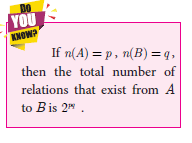

# Relations
Many day-to-day occurrences involve two objects that are connected with each otherby some rule of correspondence. We say that the two objects are related under the specified rule. How shall we represent it? Here are some examples,
|Relationship         | Expressing usung the symbol R       | Representation as ordered pair |
|---------------------|-------------------|----------|
| New Delhi is the capital of India       | New Delhi R India      | (New Delhi, India) |
| Line AB is perpendicular to line XY        | line AB R line XY      |(line AB, line XY) |
| –1 is greater than –5       | –1 R –5      | (–1, –5) |
|ℓ is a line of symmetry for DPQR | ℓ R △PQR    | (ℓ, △PQR )  |

How are New Delhi and India related? We may expect the response, “New Delhi is the capital of India”. But there are several ways in which ‘New Delhi’ and‘India’ are related. Here are some possible answers.

* New Delhi is the capital of India.
* New Delhi is in the northern part of India.
* New Delhi is one of the largest cities of India etc.,

So, when we wish to specify a particular relation, providing only one ordered pair (New Delhi, India) it may not be practically helpful. If we ask the relation in the following
set of ordered pairs,
{(New Delhi, India), (Washington, USA), (Beijing, China), (London, U.K.), (Kathmandu, Nepal)} then specifying the relation is easy.
 

**Illustration 4**

Let us define a relation between heights of corresponding students.

  
 
R = {(heights, students)}

> **Definition**
> Let A and B be any two non-empty sets. A ‘relation’ R from A to B is a subset of
AxB satisfying some specified conditions. If x ∈ A is related to y ∈ B through R , then
we write it as x R y if and only if (x,y) ∈  R.

 
The domain of the relation  R ={x ∈ A | x Ry, for some y ∈ B} 
The co-domain of the relation R is B
The range of the relation R ={y ∈ B | xRy, for some x ∈ A} 
From these definitions, we note that domain of R U A , co-domain
of R = B and range of R U B .

> 
**Illustration 5**

Let A = {1,2,3,4,5} and B = {Mathi, Arul, John} 
A relation R between the above sets A and B can be represented by an arrow diagram (Fig. 1.8).

  

Then, domain of R = {1,2,3,4} range of R = {Mathi, Arul, John}= co-domain of R . 
Note that domain of R is a proper subset of A.

> Activity 2
> Let A and B be the set of lines in xy-plane such that A consists of lines parallel to
X-axis. For x ∈  A, y ∈  B , let R be a relation from A to B defined by xRy if x is perpendicular to y. Find the elements of B using a graph sheet.

**Illustration 6**

Let A = {1,3,5,7} and B = {4,8}. If R is a relation defined by “is less than” from A to B, then 1R4 ( 1 is less than 4). Similarly, it is observed that 1R8, 3R4, 3R8,
5R8, 7R8 Equivalently R= {(1,4), (1,8), (3,4), (3,8), (5,8), (7,8)}

> Note
> In the above illustration A×B = {(1,4), (1,8), (3,4), (3,8), (5,4), (5,8), (7,4),(7,8)}
R = {(1,4), (1,8), (3,4), (3,8), (5,8), (7,8)} We see that R is a subset of AxB .

**Illustration 7**

In a particular area of a town, let us consider ten families A, B, C, D, E, F, G, H, I and J with two children. Among 
these, families B, F, I have two girls; D, G, J have one boy and one girl; the remaining have two boys. Let us define a relation
R by xRy, where x denote the number of boys and y denote the family with x number of boys. Represent this situation as
a relation through ordered pairs and arrow diagram. Since the domain of the relation R is concerned about
the number of boys, and we are considering families with two children, the domain of R will consist of three elements given by {0,1,2}, where 0, 1, 2 represent the number of boys say no, one, two boys respectively. We note that families
with two girls are the ones with no boys. Hence the relation R is given by R = {(0,B),(0,F),(0,I ),(1,D),(1,G),(1,J ),(2,A),(2,C),(2,E),(2,H)} This relation is shown in an arrow diagram (Fig.1.9).

**Example 1.4**
Let A = {3,4,7,8} and B = {1,7,10}. Which of the following sets are relations
from A to B?
(i) R_1 ={(3,7), (4,7), (7,10), (8,1)} (ii) R2= {(3,1), (4,12)}
(iii) R3= {(3,7), (4,10), (7,7), (7,8), (8,11), (8,7), (8,10)}

**Solution**
 AUB = {(3,1), (3,7), (3,10), (4,1), (4,7), (4,10), (7,1), (7,7), (7,10), (8,1), (8,7), (8,10)}

(i) We note that, R1 ⊆ A×B . Thus, R1 is a relation from A to B.
(ii) Here, (4,12) ∈ R_1 , but (4,12)  ∉ A×B . So, R2 is not a relation from A to B.
(iii) Here, (7, 8) ∈ R_3 , but (7, 8) ∉ A×B . So, R3 is not a relation from A to B.

> Note
>* A relation may be represented algebraically either by the roster method or by the set builder method.
> * An arrow diagram is a visual representation of a relation.

**Example 1.5**
 The arrow diagram shows (Fig.1.10) a relationship between the sets P and Q. Write the relation in (i) Set builder form (ii) Roster form (iii) What is the domain and range of R. 

**Solution**
 

(i) Set builder form of R = {(x,y) | y = x −2, x ∈  P,y ∈ Q}

(ii) Roster form R = {(5, 3),(6, 4),(7,5)}

(iii) Domain of R = {5,6,7} and range of R = {3,4,5}

         

Exercise 1.2

* Let A = {1,2,3,7} and B = {3,0,–1,7}, which of the following are relation from A to B ?
(i) R1 = {(2,1), (7,1)} (ii) R2= {(–1,1)}
(iii) R3 = {(2,–1), (7,7), (1,3)} (iv) R4= {(7,–1), (0,3), (3,3), (0,7)}

* Let A={1,2,3,4,...,45} and R be the relation defined as “is square of a number” on A.
Write R as a subset of AxA. Also, find the domain and range of R.

* A Relation R is given by the set {(x,y) /y=x + 3, x ∈  {0,1,2, 3, 4,5}}. Determine its domain and range.

* Represent each of the given relations by (a) an arrow diagram, (b) a graph and (c) a set
in roster form, wherever possible.
(i) {(x,y)|x = 2y, x∈  {2,3,4,5}, y ∈  {1,2,3,4}}
(ii) {(x,y)|y = x+3, x, y are natural numbers < 10}
* A company has four categories of employees given by Assistants (A), Clerks (C), Managers (M) and an Executive Officer (E). The company provide ₹10,000, ₹25,000, ₹50,000 and ₹1,00,000 as salaries to the people who work in the categories A, C, M and E respectively. If A1, A2, A3, A4 and A5 were Assistants; C1, C2, C3, C4 were Clerks; M1, M2, M3 were managers and E1, E2 were Executive officers and if the relation R is defined by xRy, where x is the salary given to person y, express the relation R through an ordered pair and an arrow diagram.

