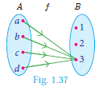
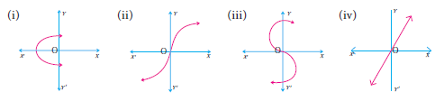

<<<<<<< HEAD

## 1.8 Special Cases of Functions

There are some special cases of a function which will be very useful. We discuss some of them below:
- (i) Constant function
- (ii) Identity function
- (iii) Real – valued function

---

### (i) Constant function

A function f: A → B is called a **constant function** if the range of f contains only one element. That is, **f(x) = c**, for all x ∈ A and for some fixed c ∈ B.

---

### Illustration 16

From Fig. 1.37, A = {a, b, c, d}, B = {1, 2, 3} and f = {(a,3), (b,3), (c,3), (d,3)}.

∵ f(x) = 3 ∀ x ∈ A, Range of f = {3}, f is a **constant function**.

---

### (ii) Identity function

Let A be a non – empty set. Then the function f: A → A defined by **f(x) = x** for all x ∈ A is called an **identity function** on A and is denoted by Iₐ.

---

### Illustration 17

If A = {a, b, c} then Iₐ = {(a,a), (b,b), (c,c)} is an identity function on A.

---

### (iii) Real valued function

A function f: A → B is called a **real valued function** if the range of f is a subset of the set of all real numbers ℝ. That is, f(a) ⊆ ℝ, ∀ a ∈ A.

---

### Thinking Corner

**Is an identity function one to one function?**

---

### Progress Check

**State True or False.**

1. All one – one functions are onto functions.
2. There will be no one – one function from A to B when n(A) = 4, n(B) = 3.
3. All onto functions are one – one functions.
4. There will be no onto function from A to B when n(A) = 4, n(B) = 5.
5. If f is a bijection from A to B, then n(A) = n(B).
6. If n(A) = n(B), then f is a bijection from A to B.
7. All constant functions are bijections.

---

### Example 1.17

Let f be a function from ℝ to ℝ defined by f(x) = 3x - 5. Find the values of a and b given that (a, 4) and (1, b) belong to f.

**Solution**

f(x) = 3x – 5 can be written as f = {(x, 3x - 5) | x ∈ ℝ}

(a, 4) means the image of a is 4. i.e., f(a) = 4
3a - 5 = 4 ⇒ **a = 3**

(1, b) means the image of 1 is b. i.e., f(1) = b
3(1) - 5 = b ⇒ **b = -2**

---

### Example 1.18

If the function f: ℝ → ℝ is defined by:

f(x) = { 2x + 7;       x < -2
       { x² - 2;      -2 ≤ x < 3
       { 3x - 2;       x ≥ 3

       then find the values of:
(i) f(4)
(ii) f(-2)
(iii) f(f(4)) + f(1)
(iv) [f(1) - 3f(4)]/f(-3)

**Solution**

The function f is defined by three values in intervals I, II, III.

For a given value of x = a, find out the interval at which the point a is located, thereafter find f(a) using the particular value defined in that interval.

**(i)** First, we see that x = 4 lie in the third interval.
f(x) = 3x - 2; f(4) = 3(4) - 2 = **10**

**(ii)** x = -2 lies in the second interval.
∴ f(x) = x² - 2; f(-2) = (-2)² - 2 = 4 - 2 = **2**

**(iii)** From (i), f(4) = 10.

To find f(1), first we see that x = 1 lies in the second interval.
∴ f(x) = x² - 2 ⇒ f(1) = 1² - 2 = -1

f(f(4)) = f(10) = 3(10) - 2 = 28 (since 10 ≥ 3)

f(f(4)) + f(1) = 28 + (-1) = **27**

Wait, let me recalculate:
f(f(4)) = f(10) = 3(10) - 2 = 28

Actually from the original: f(f(4)) + f(1) = f(10) + (-1) = 28 - 1 = **27**

But let me check the original again more carefully...

From original: f(f(4)) = f(10) = 3(10) - 2 = 28, and f(1) = -1, so sum = **27**

**(iv)** We know that f(1) = -1 and f(4) = 10.

For finding f(-3), we see that x = -3, lies in the first interval.
∴ f(x) = 2x + 7; thus, f(-3) = 2(-3) + 7 = -6 + 7 = **1**

Hence, [f(1) - 3f(4)]/f(-3) = [-1 - 3(10)]/1 = [-1 - 30]/1 = **-31**

---

## Exercise 1.4

1. Determine whether the graph given below represent functions. Give reason for your answers concerning each graph.

2. Let f: A → B be a function defined by f(x) = x/2 - 1, where A = {2, 4, 6, 10, 12}, B = {0, 1, 2, 4, 5, 9}. Represent f by:
   - (i) set of ordered pairs
   - (ii) a table
   - (iii) an arrow diagram
   - (iv) a graph

3. Represent the function f = {(1, 2), (2, 2), (3, 2), (4, 3), (5, 4)} through:
   - (i) an arrow diagram
   - (ii) a table form
   - (iii) a graph

4. Show that the function f: ℕ → ℕ defined by f(x) = 2x - 1 is one-one but not onto.

5. Show that the function f: ℕ → ℕ defined by f(m) = m² + m + 3 is one-one function.

6. Let A = {1, 2, 3, 4} and B = ℕ. Let f: A → B be defined by f(x) = x³ then:
   - (i) find the range of f
   - (ii) identify the type of function

7. In each of the following cases state whether the function is bijective or not. Justify your answer.
   - (i) f: ℝ → ℝ defined by f(x) = 2x + 1
   - (ii) f: ℝ → ℝ defined by f(x) = 3 - 4x²

8. Let A = {-1, 1} and B = {0, 2}. If the function f: A → B defined by f(x) = ax + b is an onto function? Find a and b.

9. If the function f is defined by:
f(x) = { x + 2;       x > 1
       { 2;          -1 ≤ x ≤ 1
       { x - 1;      -3 < x < -1
plain
Copy

find the values of:
- (i) f(3)
- (ii) f(0)
- (iii) f(-1.5)
- (iv) f(2) + f(-2)

10. A function f: [-5, 9] → ℝ is defined as follows:
f(x) = { 6x + 1;      -5 ≤ x < 2
       { 5x² - 1;      2 ≤ x < 6
       { 3x - 4;       6 ≤ x ≤ 9
plain
Copy

Find:
- (i) f(-3) + f(2)
- (ii) f(7) - f(1)
- (iii) 2f(4) + f(8)
- (iv) [2f(-2) - f(6)]/[f(4) + f(-2)]

11. The distance S an object travels under the influence of gravity in time t seconds is given by S(t) = (1/2)gt² + at + b where (g is the acceleration due to gravity), a > 0, b are constants. Verify whether the function S(t) is one-one or not.

12. The function 't' which maps temperature in Celsius (C) into temperature in Fahrenheit (F) is defined by t(C) = F where F = (9/5)C + 32. Find:
    - (i) t(0)
    - (ii) t(28)
    - (iii) t(-10)
    - (iv) the value of C when t(C) = 212
    - (v) the temperature when the Celsius value is equal to the Fahrenheit value.

---
=======
TBD
>>>>>>> 15f6ef76085591e823daf71800df63727236033b
