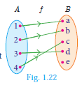
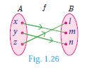
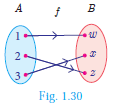
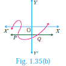

# Types of Functions

In this section, we will discuss the following types of functions with suitable examples.

(i) one - one
(ii) many - one
(iii) onto
(iv) into

## One-one Function

Let us assume that we have a cell phone with proper working condition. If you make a usual call to your friend then you can make only one call at a time (Fig.1.21).

If we treat making calls as a function, then it will be one - one. 
  

A function f: A -> B is called one - one function if distinct elements of A have distinct images in B.

A one-one function is also called an injection.

Equivalently,

If for all a_{1}, a_{2} in A, f(a_{1})=f(a_{2}) implies  a_{1}=a_{2}, then f is called one - one function. 

**Illustration 10**


A=\{1,2,3,4\} \text { and } B=\{a, b, c, d, e\}


(i) Let f={(1, a),(2, b),(3, d),(4, c)}

In Fig. 1.22, for different elements in $A$, there are different images in $B$.

Hence f is a one - one function.

(ii) Let g={(1, b),(2, b),(3, c),(4, e)}

g is a function from A to B such that g(1)=g(2)=b, but 1 eq 2. Thus two distinct elements 1 and 2 in the first set A have same image b the second set in B (Fig.1.23). Hence, g is not a one-one function.

##  Many - one function

In a theatre complex three films F_{1}, F_{2}, F_{3} are shown. Seven persons (P_{1} to P_{7}) arrive at the theatre and buy tickets as shown (Fig.1.24).

If the selection of films is considered as a relation, then this is a function which is many-one, since more than one person may choose to watch the same film.

> A function f: A-> B is called many-one function if two or more elements of A have same image in B.

In other words, a function f: A -> B is called many-one if f it is not one-one.

**Illustration 11**
Let A={1,2,3,4} and B={a, b, c}, f={(1, a),(2, a),(3, b),(4, c)}
Then f is a function from A to B in which different elements 1 and 2 of A have the same image a in B. Hence f is a many - one function.

## Onto function

In a mobile phone assume that there are 3 persons in the contact. If every person in the contact receives a call, then the function representing making calls will be onto. (Fig.1.25)

> A function f: A -> B is said to be onto function if the range of f is equal to the co-domain of f.

In other words, every element in the co-domain B has a pre-image in the domain A.

An onto function is also called a surjection.

> Note: 
> If f: A -> B is an onto function then, the range of f=B.

 **Illustration 12**
Let A={x, y, z}, B={l, m, n};
Range of f={l, m, n}=B (Fig.1.26)

Hence f is an onto function.

## Into function
In a home appliance showroom, the products television, air conditioner, washing machine and water heater were provided with 20% discount as new year sale offer. If the selection of the above products by the three customers C_{1}, C_{2}, C_{3} is considered as a function then the following diagram (Fig.1.27) will represent an into function.

During winter season customers usually do not prefer buying air conditioner. Here air conditioner is not chosen by any customer. This is an example of into function.

A function f: A -> B is called an into function if there exists atleast one element in B which is not the image of any element of A.

That is the range of f is a proper subset of the co-domain of f.

In other words, a function f: A -> B is called 'into' if it is not 'onto'.

**Illustration 13**
Let A={1,2,3,4} and B={w, x, y, z}, f={(1, w),(2, z),(3, x)}

Here, range of f={w, x, z}  subset B(Fig.1.28)

therefore f is a into function.

Note that y in B is not an image of any element in A.

## Bijection

Consider the circle where each letter of the English alphabet is changed from inner portion to a letter in the outer portion. Thus A -> D, B -> E, C -> F, Z -> C. We call this circle as 'cipher circle'. (Fig.1.29) In this way if we try to change the word 'HELLO' then it will become 'KHOOR'. Now using the same circle if we substitute for each outer letter the corresponding inner letter we will get back the word 'HELLO'. 

This process of converting Fig. 1.29 from one form to an other form and receiving back the required information is called bijection. This process is widely used in the study of secret codes called cryptography.

> If a function f: A -> B is both one-one and onto, then f is called a bijection from A to B.

Illustration 14

| one to one and onto function (Bijection) |  
| :--- | 
|   Distinct elements of A have distinct images  in B and every element in B has a pre-image   in A.  
 | 

Illustration 15

>Note
>A one - one and onto function is also called a one-one correspondence.

> Thinking Corner
> Can there be a one to many function?

To determine whether the given function is one-one or not the following test may help us.

## Horizontal Line Test

Previously we have seen the vertical line test. Now let us see the horizontal line test. "A function represented in a graph is one-one, if every horizontal line intersects the curve in at most one point".

Example 1.12 Using horizontal line test (Fig. 1.35 (a), 1.35 (b), 1.35 (c)), determine which of the following functions are one - one.
 

Solution The curves in Fig.1.35 (a) and Fig.1.35 (c) represent a one-one function as the horizontal lines meet the curves in only one point P.

The curve in Fig. 1.35 (b) does not represent a one-one function, since, the horizontal line intersects the curve at two points P and Q.

Example 1.13 Let A={1,2,3}, B={4,5,6,7} and f={(1,4),(2,5),(3,6)} be a function from A to B. Show that f is one - one but not onto function.

Solution A={1,2,3}, B={4,5,6,7} ; f={(1,4),(2,5),(3,6)}

Then f is a function from A to B and for different elements in A, there are different images in B. Hence f is one-one function. Note that the element 7 in the co-domain does not have any pre-image in the domain. Hence f is not onto (Fig.1.36). 

therefore f is one-one but not an onto function.

Example 1.14 If A={-2,-1,0,1,2} and f: A -> B is an onto function defined by f(x)=x^{2}+x+1 then find B.

Solution Given  A={-2,-1,0,1,2} and f(x)=x^{2}+x+1.


\begin{aligned}
f(-2) & =(-2)^{2}+(-2)+1=3 ; \\
f(-1) & =(-1)^{2}+(-1)+1=1 \\
f(0) & =0^{2}+0+1=1 ; \\
f(1) & =1^{2}+1+1=3 \\
f(2) & =2^{2}+2+1=7 \\
\therefore B & =\{1,3,7\} .
\end{aligned}


**Example 1.15** Let f be a function f: b{N} -> b{N} be defined by f(x)=3 x+2, x in b{N}

(i) Find the images of 1, 2,3

(ii) Find the pre-images of 29, 53

(ii) Identify the type of function

**Solution** The function f: b{N} -> b{N} is defined by f(x)=3 x+2

(i) If x=1,  f(1)=3(1)+2=5

If x=2, f(2)=3(2)+2=8

If x=3, f(3)=3(3)+2=11

The images of 1, 2, 3 are 5, 8, 11 respectively.

(ii) If x is the pre-image of 29 , then f(x)=29. Hence 3x+2=29

3x=27 -> x=9.

Similarly, if x is the pre-image of 53 , then f(x)=53. Hence 3x+2=53

3x=51 -> x=17.

Thus the pre-images of 29 and 53 are 9 and 17 respectively.

(iii) Since different elements of b{N} have different images in the co-domain, the function f is one - one function.

The co-domain of f is b{N}.

But the range of f={5,8,11,14,17, ldots} is a proper subset of N.

therefore f is not an onto function. That is, f is an into function.

Thus f is one - one and into function.

Example 1.16 Forensic scientists can determine the height (in cm) of a person based on the length of the thigh bone. They usually do so using the function h(b)=2.47 b+54.10 where b is the length of the thigh bone.

(i) Verify the function h is one - one or not.

(ii) Also find the height of a person if the length of his thigh bone is 50 cm.

(iii) Find the length of the thigh bone if the height of a person is 147.96cm.

Solution (i) To check if h is one - one, we assume that h(b_{1})=h(b_{2}).

Then we get, 2.47 b_{1}+54.10=2.47 b_{2}+54.10


\begin{aligned}
2 \cdot 47 b_{1} & =2 \cdot 47 b_{2} \\
\Rightarrow b_{1} & =b_{2}
\end{aligned}


Thus, ht(b_{1})=h(b_{2}) -> b_{1}=b_{2}. So, the function h is one - one.

(ii) If the length of the thigh bone b=50, then the height is h(50)=(2.47x50)+54.10=177.6cm.

(iii) If the height of a person is 147.9cm, then h(b)=147.96 and so the length of the thigh bone is given by


\begin{aligned}
2 \cdot 47 b+54 \cdot 10 & =147 \cdot 96 \\
\Rightarrow 2 \cdot 47 b & =147 \cdot 96-54 \cdot 10=93 \cdot 86 \\
b & =\frac{93 \cdot 86}{2 \cdot 47}=38
\end{aligned}


Therefore, the length of the thigh bone is 38cm .

