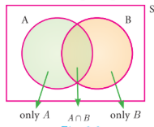
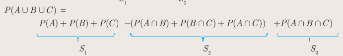
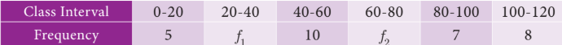
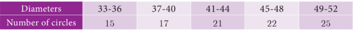
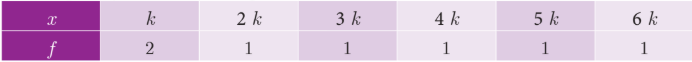

### 8.6 Addition Theorem of Probability

(i) If \(A\) and \(B\) are any two events then

\[
P(A \cup B) = P(A) + P(B) - P(A \cap B)
\]

(ii) If \(A, B\) and \(C\) are any three events then

\[
P(A \cup B \cup C) = P(A) + P(B) + P(C) - P(A \cap B) - P(B \cap C) - P(A \cap C) + P(A \cap B \cap C)
\]

---

## Proof

(i) Let \(A\) and \(B\) be any two events of a random experiment with sample space \(S\).

Fig.8.9

From the Venn diagram, we have the events only \(A\), \(A \cap B\) and only \(B\) are mutually exclusive and their union is \(A \cup B\).

Therefore,

\[
P(A \cup B) = P[(\text{only } A) \cup (A \cap B) \cup (\text{only } B)]
\]

\[
= P(\text{only } A) + P(A \cap B) + P(\text{only } B)
\]

\[
= [P(A) - P(A \cap B)] + P(A \cap B) + [P(B) - P(A \cap B)]
\]

\[
P(A \cup B) = P(A) + P(B) - P(A \cap B)
\]

(ii) Let \(A, B, C\) are any three events of a random experiment with sample space \(S\).

\[
D =B ∪ C
\]

\[
P(A \cup B \cup C) = P(A \cup D)
\]

\[
= P(A) + P(D) - P(A \cap D)
\]

\[
= P(A) + P(B \cup C) - P[A \cap (B \cup C)]
\]

\[
= P(A) + P(B) + P(C) - P(B \cap C) - P[(A \cap B) \cup (A \cap C)]
\]

\[
= P(A) + P(B) + P(C) - P(B \cap C) - P(A \cap B) - P(A \cap C) + P[(A \cap B) \cap (A \cap C)]
\]

\[
P(A \cup B \cup C) = P(A) + P(B) + P(C) - P(A \cap B) - P(B \cap C) - P(C \cap A) + P(A \cap B \cap C)
\]

---
**Activity 5**

The addition theorem of probability can be written easily using the following way.

\[
P(A \cup B) = S_1 - S_2
\]

\[
P(A \cup B \cup C) = S_1 - S_2 + S_3
\]

Where \(S_1 \to\) Sum of probability of events taken one at a time.

\(S_2 \to\) Sum of probability of events taken two at a time.

\(S_3 \to\) Sum of probability of events taken three at a time.

\[
P(A \cup B) = \underbrace{P(A) + P(B)}_{S_1} - \underbrace{P(A \cap B)}_{S_2}
\]

Find the probability of \(P(A \cup B \cup C \cup D)\) using the above way. Can you find a pattern for the number of terms in the formula?

---

**Example 8.25** If \(P(A) = 0.37\), \(P(B) = 0.42\), \(P(A \cap B) = 0.09\) then find \(P(A \cup B)\).

**Solution** \(P(A) = 0.37\), \(P(B) = 0.42\), \(P(A \cap B) = 0.09\).

\[
P(A \cup B) = P(A) + P(B) - P(A \cap B)
\]

\[
= 0.37 + 0.42 - 0.09 = 0.7
\]

---

**Thinking Corner**

$P(A \cup B) + P(A \cap B)$ is _______.

---
**Example 8.26** A flower is selected at random from a basket containing 80 yellow, 70 red and 50 white flowers. Find the probability of selecting a yellow or red flower.

## Solution

Total number of flowers \(n(S) = 80 + 70 + 50 = 200\).

No. of yellow flowers \(n(Y) = 80 \Rightarrow P(Y) = \frac{n(Y)}{n(S)} = \frac{80}{200}\).

No. of red flowers \(n(R) = 70 \Rightarrow P(R) = \frac{n(R)}{n(S)} = \frac{70}{200}\).

Y and R are mutually exclusive.

\[
P(Y \cup R) = P(Y) + P(R)
\]

Probability of drawing either a yellow or red flower

\[
P(Y \cup R) = \frac{80}{200} + \frac{70}{200} = \frac{150}{200} = \frac{3}{4}
\]

---

**Example 8.27** Two dice are rolled together. Find the probability of getting a doublet or sum of faces as 4.

**Solution** When two dice are rolled together, there will be \(6 \times 6 = 36\) outcomes. Let \(S\) be the sample space. Then \(n(S) = 36\).

Let \(A\) be the event of getting a doublet and \(B\) be the event of getting face sum 4.

Then \(A = \{(1,1), (2,2), (3,3), (4,4), (5,5), (6,6)\}\).

\(B = \{(1,3), (2,2), (3,1)\}\).

\(\therefore A \cap B = \{(2,2)\}\).

Then, \(n(A) = 6\), \(n(B) = 3\), \(n(A \cap B) = 1\).

\[
P(A) = \frac{n(A)}{n(S)} = \frac{6}{36}
\]

\[
P(B) = \frac{n(B)}{n(S)} = \frac{3}{36}
\]

\[
P(A \cap B) = \frac{n(A \cap B)}{n(S)} = \frac{1}{36}
\]

\(\therefore P\) (getting a doublet or a total of 4) \(= P(A \cup B)\)

\[
P(A \cup B) = P(A) + P(B) - P(A \cap B)
\]

\[
= \frac{6}{36} + \frac{3}{36} - \frac{1}{36} = \frac{8}{36} = \frac{2}{9}
\]

Hence, the required probability is \(\frac{2}{9}\).

---

**Example 8.28** If \(A\) and \(B\) are two events such that \(P(A) = \frac{1}{4}\), \(P(B) = \frac{1}{2}\) and \(P(A \text{ and } B) = \frac{1}{8}\), find (i) \(P(A \text{ or } B)\) (ii) \(P(\text{not } A \text{ and not } B)\).

**Solution** (i) \(P(A \text{ or } B) = P(A \cup B)\)

\[
= P(A) + P(B) - P(A \cap B)
\]

\[
= \frac{1}{4} + \frac{1}{2} - \frac{1}{8} = \frac{5}{8}
\]

(ii) \(P(\text{not } A \text{ and not } B) = P(\bar{A} \cap \bar{B})\)

\[
= P(\overline{A \cup B}) = 1 - P(A \cup B)
\]

\[
= 1 - \frac{5}{8} = \frac{3}{8}
\]

---

**Example 8.29** In an apartment, in selecting a house from door numbers 1 to 100 randomly, find the probability of getting the door number of the house to be an even number or a perfect square number or a perfect cube number.

## Solution

Total number of houses \(n(S) = 100\).

Let \(A\) be the event of getting door number even.

\(A = \{2, 4, 6, 8, \ldots, 100\}\), \(n(A) = 50\), \(P(A) = \frac{50}{100}\).

Let \(B\) be the event of getting door number perfect square.

\(B = \{1, 4, 9, 16, 25, 36, 49, 64, 81, 100\}\), \(n(B) = 10\), \(P(B) = \frac{10}{100}\).

Let \(C\) be the event of getting door number perfect cube.

\(C = \{1, 8, 27, 64\}\), \(n(C) = 4\), \(P(C) = \frac{4}{100}\).

\(P(A \cap B) = P(\text{getting even perfect square number}) = \frac{5}{100}\).

\(P(B \cap C) = P(\text{getting a perfect square and perfect cube number}) = \frac{2}{100}\).

\(P(A \cap C) = P(\text{getting even perfect cube number}) = \frac{2}{100}\).

\(P(A \cap B \cap C) = P(\text{getting even perfect square and perfect cube number}) = \frac{1}{100}\).

Required probability

\[
P(A \cup B \cup C) = P(A) + P(B) + P(C) - P(A \cap B) - P(B \cap C) - P(A \cap C) + P(A \cap B \cap C)
\]

\[
= \frac{50}{100} + \frac{10}{100} + \frac{4}{100} - \frac{5}{100} - \frac{2}{100} - \frac{2}{100} + \frac{1}{100}
\]

\[
= \frac{56}{100} = \frac{14}{25}
\]

---

**Example 8.30** In a class of 50 students, 28 opted for NCC, 30 opted for NSS and 18 opted both NCC and NSS. One of the students is selected at random. Find the probability that

(i) The student opted for NCC but not NSS.

(ii) The student opted for NSS but not NCC.

(iii) The student opted for exactly one of them.

**Solution** Total number of students \(n(S) = 50\).

Let \(A\) and \(B\) be the events of students opted for NCC and NSS respectively.

\(n(A) = 28, n(B) = 30, n(A \cap B) = 18\).

\[
P(A) = \frac{28}{50}, \quad P(B) = \frac{30}{50}, \quad P(A \cap B) = \frac{18}{50}
\]

(i) Probability of the students opted for NCC but not NSS

\[
P(A \cap \bar{B}) = P(A) - P(A \cap B) = \frac{28}{50} - \frac{18}{50} = \frac{1}{5}
\]

(ii) Probability of the students opted for NSS but not NCC

\[
P(\bar{A} \cap B) = P(B) - P(A \cap B) = \frac{30}{50} - \frac{18}{50} = \frac{6}{25}
\]

(iii) Probability of the students opted for exactly one of them

\[
= P[(A \cap \bar{B}) \cup (\bar{A} \cap B)]
\]

\[
= P(A \cap \bar{B}) + P(\bar{A} \cap B) = \frac{1}{5} + \frac{6}{25} = \frac{11}{25}
\]

(Note that \((A \cap \bar{B})\) and \((\bar{A} \cap B)\) are mutually exclusive events)

---

**Example 8.31** \(A\) and \(B\) are two candidates seeking admission to IIT. The probability that A getting selected is 0.5 and the probability that both \(A\) and \(B\) getting selected is 0.3. Prove that the probability of \(B\) being selected is atmost 0.8.

**Solution** \(P(A) = 0.5\), \(P(A \cap B) = 0.3\).

We have \(P(A \cup B) \leq 1\).

\[
P(A) + P(B) - P(A \cap B) \leq 1
\]

\[
0.5 + P(B) - 0.3 \leq 1
\]

\[
P(B) \leq 1 - 0.2 = 0.8
\]

Therefore, probability of \(B\) getting selected is atmost 0.8.

---

## Exercise 8.4

1. If \(P(A) = \frac{2}{3}\), \(P(B) = \frac{2}{5}\), \(P(A \cup B) = \frac{1}{3}\) then find \(P(A \cap B)\).

2. \(A\) and \(B\) are two events such that, \(P(A) = 0.42\), \(P(B) = 0.48\), and \(P(A \cap B) = 0.16\). Find

(i) \(P(\text{not } A)\)

(ii) \(P(\text{not } B)\)

(iii) \(P(A \text{ or } B)\)

3. If \(A\) and \(B\) are two mutually exclusive events of a random experiment and \(P(\text{not } A) = 0.45\), \(P(A \cup B) = 0.65\), then find \(P(B)\).

4. The probability that atleast one of \(A\) and \(B\) occur is 0.6. If \(A\) and \(B\) occur simultaneously with probability 0.2, then find \(P(\bar{A}) + P(\bar{B})\).

5. The probability of happening of an event \(A\) is 0.5 and that of \(B\) is 0.3. If \(A\) and \(B\) are mutually exclusive events, then find the probability that neither \(A\) nor \(B\) happen.

6. Two dice are rolled once. Find the probability of getting an even number on the first die or a total of face sum 8.

7. A box contains cards numbered 3, 5, 7, 9, ... 35, 37. A card is drawn at random from the box. Find the probability that the drawn card have either multiples of 7 or a prime number.

8. Three unbiased coins are tossed once. Find the probability of getting atmost 2 tails or atleast 2 heads.

9. The probability that a person will get an electrification contract is \(\frac{3}{5}\) and the probability that he will not get plumbing contract is \(\frac{5}{8}\). The probability of getting atleast one contract is \(\frac{5}{7}\). What is the probability that he will get both?

10. In a town of 8000 people, 1300 are over 50 years and 3000 are females. It is known that \(30\%\) of the females are over 50 years. What is the probability that a chosen individual from the town is either a female or over 50 years?

11. A coin is tossed thrice. Find the probability of getting exactly two heads or atleast one tail or two consecutive heads.

12. If \(A\), \(B\), \(C\) are any three events such that probability of \(B\) is twice as that of probability of \(A\) and probability of \(C\) is thrice as that of probability of \(A\) and if \(P(A \cap B) = \frac{1}{6}\), \(P(B \cap C) = \frac{1}{4}\), \(P(A \cap C) = \frac{1}{8}\), \(P(A \cup B \cup C) = \frac{9}{10}\), \(P(A \cap B \cap C) = \frac{1}{15}\), then find \(P(A)\), \(P(B)\) and \(P(C)\).

13. In a class of 35, students are numbered from 1 to 35. The ratio of boys to girls is 4:3. The roll numbers of students begin with boys and end with girls. Find the probability that a student selected is either a boy with prime roll number or a girl with composite roll number or an even roll number.

---

## Multiple Choice Questions

1. Which of the following is not a measure of dispersion?

(A) Range
(B) Standard deviation
(C) Arithmetic mean
(D) Variance

2. The range of the data 8, 8, 8, 8, 8, 8, 8, 3, 8 is

(A) 0
(B) 1
(C) 8
(D) 3

3. The sum of all deviations of the data from its mean is

(A) Always positive
(B) always negative
(C) zero
(D) non-zero integer

4. The mean of 100 observations is 40 and their standard deviation is 3. The sum of squares of all observations is

(A) 40000
(B) 160900
(C) 160000
(D) 30000

5. Variance of first 20 natural numbers is

(A) 32.25
(B) 44.25
(C) 33.25
(D) 30

6. The standard deviation of a data is 3. If each value is multiplied by 5 then the new variance is

(A) 3
(B) 15
(C) 5
(D) 225

7. If the standard deviation of \(x\), \(y\), \(z\) is \(p\) then the standard deviation of \(3x + 5\), \(3y + 5\), \(3z + 5\) is

(A) \(3p + 5\)
(B) \(3p\)
(C) \(p + 5\)
(D) \(9p + 15\)

8. If the mean and coefficient of variation of a data are 4 and \(87.5\%\) then the standard deviation is

(A) 3.5
(B) 3
(C) 4.5
(D) 2.5

9. Which of the following is incorrect?

(A) \(P(A) > 1\)
(B) \(0 \leq P(A) \leq 1\)
(C) \(P(\phi) = 0\)
(D) \(P(A) + P(\bar{A}) = 1\)

10. The probability a red marble selected at random from a jar containing \(p\) red, \(q\) blue and \(r\) green marbles is

(A) \(\frac{q}{p+q+r}\)
(B) \(\frac{p}{p+q+r}\)
(C) \(\frac{p+q}{p+q+r}\)
(D) \(\frac{p+r}{p+q+r}\)

11. A page is selected at random from a book. The probability that the digit at units place of the page number chosen is less than 7 is

(A) \(\frac{3}{10}\)
(B) \(\frac{7}{10}\)
(C) \(\frac{3}{9}\)
(D) \(\frac{7}{9}\)

12. The probability of getting a job for a person is \(\frac{x}{3}\). If the probability of not getting the job is \(\frac{2}{3}\) then the value of \(x\) is

(A) 2
(B) 1
(C) 3
(D) 1.5

13. Kamalam went to play a lucky draw contest. 135 tickets of the lucky draw were sold. If the probability of Kamalam winning is \(\frac{1}{9}\), then the number of tickets bought by Kamalam is

(A) 5
(B) 10
(C) 15
(D) 20

14. If a letter is chosen at random from the English alphabets \(\{a, b, \ldots, z\}\), then the probability that the letter chosen precedes \(x\) is

(A) \(\frac{12}{13}\)
(B) \(\frac{1}{13}\)
(C) \(\frac{23}{26}\)
(D) \(\frac{3}{26}\)

15. A purse contains 10 notes of ₹2000, 15 notes of ₹500, and 25 notes of ₹200. One note is drawn at random. What is the probability that the note is either a ₹500 note or ₹200 note?

(A) \(\frac{1}{5}\)
(B) \(\frac{3}{10}\)
(C) \(\frac{2}{3}\)
(D) \(\frac{4}{5}\)

---

## Unit Exercise - 8

1. The mean of the following frequency distribution is 62.8 and the sum of all frequencies is 50. Compute the missing frequencies \(f_1\) and \(f_2\).

2. The diameter of circles (in mm) drawn in a design are given below.

Calculate the standard deviation.

3. The frequency distribution is given below.

In the table, \(k\) is a positive integer, has a variance of 160. Determine the value of \(k\).

4. The standard deviation of some temperature data in degree celsius (\(^\circ C\)) is 5. If the data were converted into degree Fahrenheit (\(^\circ F\)) then what is the variance?

5. If for a distribution, \(\sum (x - 5) = 3\), \(\sum (x - 5)^2 = 43\), and total number of observations is 18, find the mean and standard deviation.

6. Prices of peanut packets in various places of two cities are given below. In which city, prices were more stable?

7. If the range and coefficient of range of the data are 20 and 0.2 respectively, then find the largest and smallest values of the data.

8. If two dice are rolled, then find the probability of getting the product of face value 6 or the difference of face values 5.

9. In a two children family, find the probability that there is at least one girl in a family.

10. A bag contains 5 white and some black balls. If the probability of drawing a black ball from the bag is twice the probability of drawing a white ball then find the number of black balls.

11. The probability that a student will pass the final examination in both English and Tamil is 0.5 and the probability of passing neither is 0.1. If the probability of passing the English examination is 0.75, what is the probability of passing the Tamil examination?

---

## Points to Remember

Range \(= L - S\) (\(L\) - Largest value, \(S\) - Smallest value)

Coefficient of range \(= \frac{L - S}{L + S}\)

Variance \(\sigma^2 = \frac{\sum_{i=1}^n (x_i - \bar{x})^2}{n}\)

Standard deviation \(\sigma = \sqrt{\frac{\sum (x_i - \bar{x})^2}{n}}\)

**Standard deviation (ungrouped data)**

(i) Direct method \(\sigma = \sqrt{\frac{\sum x_i^2}{n} - \left(\frac{\sum x_i}{n}\right)^2}\)

(ii) Mean method \(\sigma = \sqrt{\frac{\sum d_i^2}{n}}\)

(iii) Assumed mean method \(\sigma = \sqrt{\frac{\sum d_i^2}{n} - \left(\frac{\sum d_i}{n}\right)^2}\)

(iv) Step deviation method \(\sigma = c \times \sqrt{\frac{\sum d_i^2}{n} - \left(\frac{\sum d_i}{n}\right)^2}\)

Standard deviation of first \(n\) natural numbers \(\sigma = \sqrt{\frac{n^2 - 1}{12}}\)

**Standard deviation (grouped data)**

(i) Mean method \(\sigma = \sqrt{\frac{\sum f_i d_i^2}{N}}\)

(ii) Assumed mean method \(\sigma = \sqrt{\frac{\sum f_i d_i^2}{N} - \left(\frac{\sum f_i d_i}{N}\right)^2}\)

(iii) Step deviation method \(\sigma = C \times \sqrt{\frac{\sum f_i d_i^2}{N} - \left(\frac{\sum f_i d_i}{N}\right)^2}\)

Coefficient of variation \(\text{C.V.} = \frac{\sigma}{\bar{x}} \times 100\%\)

If the C.V. value is less, then the observations of corresponding data are consistent. If the C.V. value is more then the observations of corresponding are inconsistent.

In a random experiment, the set of all outcomes are known but exact outcome is not known.

The set of all possible outcomes is called sample space.

\(A, B\) are said to be mutually exclusive events if \(A \cap B = \phi\).

Probability of event \(E\) is \(P(E) = \frac{n(E)}{n(S)}\).

(i) The probability of sure event is 1 and the probability of impossible event is 0.

(ii) \(0 \leq P(E) \leq 1\)

(iii) \(P(\bar{E}) = 1 - P(E)\)

If \(A\) and \(B\) are mutually exclusive events then \(P(A \cup B) = P(A) + P(B)\).

(i) \(P(A \cap \bar{B}) = P(\text{only } A) = P(A) - P(A \cap B)\)

(ii) \(P(\bar{A} \cap B) = P(\text{only } B) = P(B) - P(A \cap B)\)

\(P(A \cup B) = P(A) + P(B) - P(A \cap B)\), for any two events \(A, B\).

For any three events \(A, B, C\):

\[
P(A \cup B \cup C) = P(A) + P(B) + P(C) - P(A \cap B) - P(B \cap C) - P(C \cap A) + P(A \cap B \cap C)
\]

---

## ICT CORNER

### ICT 8.1

**Step 1:** Open the Browser type the URL Link given below (or) Scan the QR Code. Chapter named "Probability" will open. Select the work sheet "Probability Addition law".

**Step 2:** In the given worksheet you can change the question by clicking on "New Problem". Move the slider to see the steps.

### ICT 8.2

**Step 1:** Open the Browser type the URL Link given below (or) Scan the QR Code. Chapter named "Probability" will open. Select the work sheet "Addition law Mutually Exclusive".

**Step 2:** In the given worksheet you can change the question by clicking on "New Problem". Click on the check boxes to see the respective answer.

You can repeat the same steps for other activities.

**https://www.geogebra.org/m/jfr2zzgy#chapter/359554** or Scan the QR Code.

---

*End of Chapter 8*
