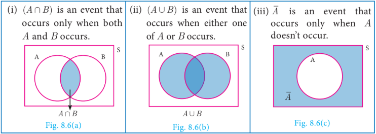
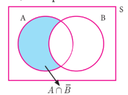
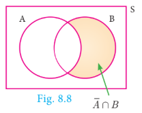

### 8.5 Algebra of Events

In a random experiment, let S be the sample space. Let \(A \subseteq S\) and \(B \subseteq S\) be the events in S. We say that

---

**Note**

\(A \cap \bar{A} = \phi\), \(A \cup \bar{A} = S\).

If \(A, B\) are mutually exclusive events, then

\[
P(A \cup B) = P(A) + P(B)
\]

\(P\) (Union of mutually exclusive events) \(= \sum\) (Probability of events).

---

## Theorem 1

If \(A\) and \(B\) are two events associated with a random experiment, then prove that

\[
P(A \cap \bar{B}) = P(\text{only } A) = P(A) - P(A \cap B)
\]

\[
P(\bar{A} \cap B) = P(\text{only } B) = P(B) - P(A \cap B)
\]

---

##### Proof

(i) By Distributive property of sets,

\[
(A \cap B) \cup (A \cap \bar{B}) = A \cap (B \cup \bar{B}) = A \cap S = A
\]

\[
(A \cap B) \cap (A \cap \bar{B}) = A \cap (B \cap \bar{B}) = A \cap \phi = \phi
\]

Fig.8.7

Therefore, the events \(A \cap B\) and \(A \cap \bar{B}\) are mutually exclusive whose union is \(A\).

\[
P(A) = P[(A \cap B) \cup (A \cap \bar{B})]
\]

\[
P(A) = P(A \cap B) + P(A \cap \bar{B})
\]

\[
P(A \cap \bar{B}) = P(A) - P(A \cap B)
\]

\[
P(A \cap \bar{B}) = P(\text{only } A) = P(A) - P(A \cap B)
\]

(ii) By Distributive property of sets,

\[
(A \cap B) \cup (\bar{A} \cap B) = (A \cup \bar{A}) \cap B = S \cap B = B
\]

\[
(A \cap B) \cap (\bar{A} \cap B) = (A \cap \bar{A}) \cap B = \phi \cap B = \phi
\]

Fig.8.8

Therefore, the events \(A \cap B\) and \(\bar{A} \cap B\) are mutually exclusive whose union is \(B\).

\[
P(B) = P[(A \cap B) \cup (\bar{A} \cap B)]
\]

\[
P(B) = P(A \cap B) + P(\bar{A} \cap B)
\]

\[
P(\bar{A} \cap B) = P(B) - P(A \cap B)
\]

That is,

\[
P(\bar{A} \cap B) = P(\text{only } B) = P(B) - P(A \cap B)
\]

---

##### Progress Check

1. \(P(\text{only } A) =\) ______.

2. \(P(\bar{A} \cap B) =\) ______.

3. \(A \cap B\) and \(\bar{A} \cap B\) are ______ events.

4. \(P(\bar{A} \cap \bar{B}) =\) ______.

5. If \(A\) and \(B\) are mutually exclusive events then \(P(A \cap B) =\) ______.

6. If \(P(A \cap B) = 0.3\), \(P(\bar{A} \cap B) = 0.45\) then \(P(B) =\) ______.

---
