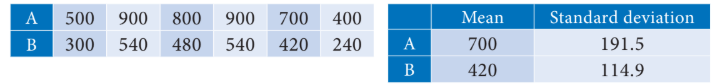
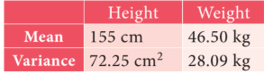
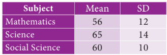

### 8.3 Coefficient of Variation

Comparison of two data in terms of measures of central tendencies and dispersions in some cases will not be meaningful, because the variables in the data may not have same units of measurement.

For example consider the two data:

Here we cannot compare the standard deviations \(1.5\) kg and \(£21.60\). For comparing two or more data for corresponding changes the relative measure of standard deviation, called "Coefficient of variation" is used.

Coefficient of variation of a data is obtained by dividing the standard deviation by the arithmetic mean. It is usually expressed in terms of percentage. This concept is suggested by one of the most prominent Statistician Karl Pearson.

Thus, coefficient of variation of first data \((\text{C.V}_1) = \frac{\sigma_1}{\bar{x}_1} \times 100\%\)

coefficient of variation of second data \((\text{C.V}_2) = \frac{\sigma_2}{\bar{x}_2} \times 100\%\)

The data with lesser coefficient of variation is more consistent or stable than the other data.

Consider the two data:

If we compare the mean and standard deviation of the two data, we think that the two datas are entirely different. But mean and standard deviation of \(B\) are \(60\%\) of that of \(A\). Because of the smaller mean the smaller standard deviation led to the misinterpretation.

To compare the dispersion of two data:

\[
\text{Coefficient of variation} = \frac{\sigma}{\bar{x}} \times 100\%
\]

The coefficient of variation of \(A = \frac{191.5}{700} \times 100\% = 27.4\%\)

The coefficient of variation of \(B = \frac{114.9}{420} \times 100\% = 27.4\%\)

Thus the two data have equal coefficient of variation. Since the data have equal coefficient of variation values, we can conclude that one data depends on the other. But the data values of \(B\) are exactly \(60\%\) of the corresponding data values of \(A\). So they are very much related. Thus, we get a confusing situation.

To get clear picture of the given data, we can find their coefficient of variation. This is why we need coefficient of variation.

---

##### Progress Check

1. Coefficient of variation is a relative measure of ______.

2. When the standard deviation is divided by the mean we get ______.

3. The coefficient of variation depends upon ______ and ______.

4. If the mean and standard deviation of a data are 8 and 2 respectively then the coefficient of variation is ______.

5. When comparing two data, the data with ______ coefficient of variation is inconsistent.

---

**Example 8.15** The mean of a data is 25.6 and its coefficient of variation is 18.75. Find the standard deviation.

**Solution** Mean \(\bar{x} = 25.6\), Coefficient of variation, C.V. \(= 18.75\).

\[
\text{C.V.} = \frac{\sigma}{\bar{x}} \times 100\%
\]

\[
18.75 = \frac{\sigma}{25.6} \times 100 \Rightarrow \sigma = 4.8
\]

---

**Example 8.16** The following table gives the values of mean and variance of heights and weights of the 10th standard students of a school.

Which is more varying than the other?

**Solution** For comparing two data, first we have to find their coefficient of variations.

Mean \(\bar{x}_1 = 155\) cm, variance \(\sigma_1^2 = 72.25\) cm\(^2\).

Therefore standard deviation \(\sigma_1 = 8.5\).

Coefficient of variation \(C.V._1 = \frac{\sigma_1}{\bar{x}_1} \times 100\% = \frac{8.5}{155} \times 100\% = 5.48\%\) (for heights)

Mean \(\bar{x}_2 = 46.50\) kg, Variance \(\sigma_2^2 = 28.09\) kg\(^2\).

Standard deviation \(\sigma_2 = 5.3\) kg.

Coefficient of variation \(C.V._2 = \frac{\sigma_2}{\bar{x}_2} \times 100\% = \frac{5.3}{46.50} \times 100\% = 11.40\%\) (for weights)

Height is more consistent.

---

## Exercise 8.2

1. The standard deviation and mean of a data are 6.5 and 12.5 respectively. Find the coefficient of variation.

2. The standard deviation and coefficient of variation of a data are 1.2 and 25.6 respectively. Find the value of mean.

3. If the mean and coefficient of variation of a data are 15 and 48 respectively, then find the value of standard deviation.

4. If \(n = 5\), \(\bar{x} = 6\), \(\sum x^2 = 765\), then calculate the coefficient of variation.

5. Find the coefficient of variation of 24, 26, 33, 37, 29, 31.

6. The time taken (in minutes) to complete a homework by 8 students in a day are given by 38, 40, 47, 46, 43, 49, 53. Find the coefficient of variation.

7. The total marks scored by two students Sathya and Vidhya in 5 subjects are 460 and 480 with standard deviation 4.6 and 2.4 respectively. Who is more consistent in performance?

8. The mean and standard deviation of marks obtained by 40 students of a class in three subjects Mathematics, Science and Social Science are given below.

Which of the three subjects shows more consistent and which shows less consistent in marks?

---