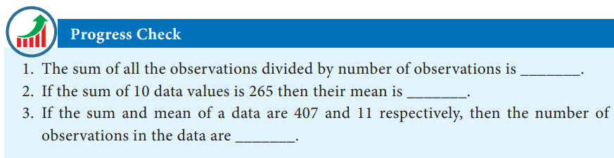

# Statistics and Probability

> "Life is a School of Probability" - Walter Bagehot

Prasanta Chandra Mahalanobis, born at Kolkata, was an Indian statistician who devised a measure of comparison between two data sets. He introduced innovative techniques for conducting large-scale sample surveys and calculated acreages and crop yields by using the method of random sampling. For his pioneering work, he was awarded the Padma Vibhushan, one of India's highest honours, by the Indian government in 1968 and he is hailed as "Father of Indian Statistics". The Government of India has designated 29th June every year, coinciding with his birth anniversary, as "National Statistics Day".

---

## Learning Outcomes

- To recall the measures of central tendency.
- To recall mean for ungrouped and grouped data.
- To understand the concept of dispersion.
- To understand and compute range, standard deviation, variance and coefficient of variation.
- To understand random experiments, sample space and use of a tree diagram.
- To define and describe different types of events of a random experiment.
- To understand addition theorem of probability and apply it in solving some simple problems.

---

## 8.1 Introduction

'STATISTICS' is derived from the Latin word 'status' which means a political state. Today, statistics has become an integral part of everyone's life, unavoidable whether making a plan for our future, doing a business, a marketing research or preparing economic reports. It is also extensively used in opinion polls, doing advanced research. The study of statistics is concerned with scientific methods for collecting, organising, summarising, presenting, analysing data and making meaningful decisions. In earlier classes we have studied about collection of data, presenting the data in tabular form, graphical form and calculating the Measures of Central Tendency. Now, in this class, let us study about the Measures of Dispersion.

---

## Recall

### Measures of Central Tendency

It is often convenient to have one number that represent the whole data. Such a number is called a Measures of Central Tendency.

The Measures of Central Tendency usually will be near to the middle value of the data. For a given data there exist several types of measures of central tendencies.

The most common among them are

- Arithmetic Mean
- Median
- Mode

> **Note**
>
> - **Data** : The numerical representation of facts is called data.
> - **Observation** : Each entry in the data is called an observation.
> - **Variable** : The quantities which are being considered in a survey are called variables. Variables are generally denoted by xᵢ, i = 1, 2, 3, …, n.
> - **Frequencies** : The number of times, a variable occurs in a given data is called the frequency of that variable. Frequencies are generally denoted as fᵢ, i = 1, 2, 3, …, n.

In this class we have to recall the Arithmetic Mean.

> **Thinking Corner**
>
> 1. Does the mean, median and mode are same for a given data?
> 2. What is the difference between the arithmetic mean and average?

---

### Arithmetic Mean

The Arithmetic Mean or Mean of the given values is sum of all the observations divided by the total number of observations. It is denoted by x̄ (pronounced as x bar)

x̄ = Sum of all the observations / Number of observations

> **Thinking Corner**
>
> The mean of n observations is x̄, if first term is increased by 1 second term is increased by 2 and so on. What will be the new mean?

---

### Methods of finding Mean

**Ungrouped data**

Direct Method:

x̄ = (Σxᵢ) / n, where i = 1 to n

**Grouped data**

Direct Method:

x̄ = (Σxᵢfᵢ) / (Σfᵢ), where i = 1 to n

Assumed Mean Method:

x̄ = A + (Σfᵢdᵢ) / (Σfᵢ), where dᵢ = xᵢ − A

Step Deviation Method:

x̄ = A + C × (Σfᵢdᵢ) / (Σfᵢ), where dᵢ = (xᵢ − A) / C

We apply the respective formulae depending upon the information provided in the problem.

---

> **Progress Check**
>
> 1. The sum of all the observations divided by number of observations is \_\_\_\_\_\_\_.
> 2. If the sum of 10 data values is 265 then their mean is \_\_\_\_\_\_\_.
> 3. If the sum and mean of a data are 407 and 11 respectively, then the number of observations in the data are \_\_\_\_\_\_\_.

