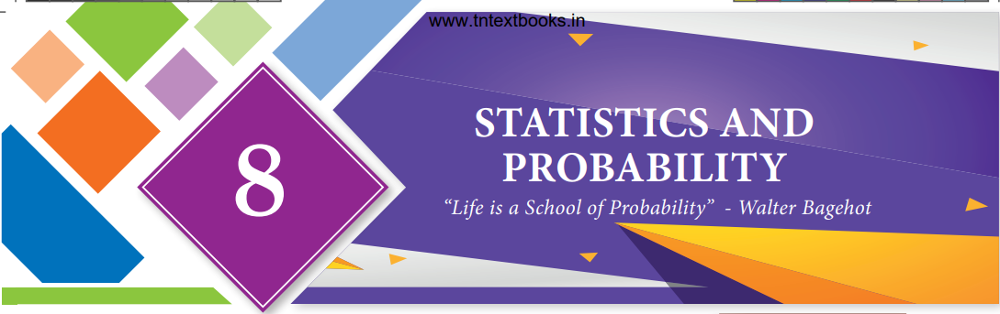
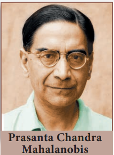

# 8. Statistics and Probability

> "Life is a School of Probability" - Walter Bagehot

---

**Prasanta Chandra Mahalanobis**, born at Kolkata, was an Indian statistician who devised a measure of comparison between two data sets. He introduced innovative techniques for conducting large-scale sample surveys and calculated acreages and crop yields by using the method of random sampling. For his pioneering work, he was awarded the Padma Vibhushan, one of India's highest honours, by the Indian government in 1968 and he is hailed as "Father of Indian Statistics". The Government of India has designated 29th June every year, coinciding with his birth anniversary, as "National Statistics Day".

---

## Learning Outcomes

- To recall the measures of central tendency.
- To recall mean for ungrouped and grouped data.
- To understand the concept of dispersion.
- To understand and compute range, standard deviation, variance and coefficient of variation.
- To understand random experiments, sample space and use of a tree diagram.
- To define and describe different types of events of a random experiment.
- To understand addition theorem of probability and apply it in solving some simple problems.