# Chapter 8

## STATISTICS AND PROBABILITY

"Life is a School of Probability" - Walter Bagehot

Prasanta Chandra Mahalanobis, born at Kolkata, was an Indian statistician who devised a measure of comparison between two data sets. He introduced innovative techniques for conducting large-scale sample surveys and calculated acreages and crop yields by using the method of random sampling. For his pioneering work, he was awarded the Padma Vibhushan, one of India's highest honours, by the Indian government in 1968 and he is hailed as "Father of Indian Statistics". The Government of India has designated 29th June every year, coinciding with his birth anniversary, as "National Statistics Day".

<center>

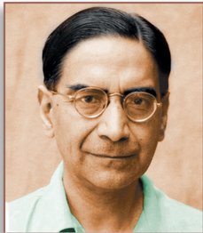

Prasanta Chandra Mahalanobis (1893 - 1972)
</center>

---

## Learning Outcomes

To recall the measures of central tendency. To recall mean for ungrouped and grouped data. To understand the concept of dispersion. To understand and compute range, standard deviation, variance and coefficient of variation. To understand random experiments, sample space and use of a tree diagram. To define and describe different types of events of a random experiment. To understand addition theorem of probability and apply it in solving some simple problems.

---

### 8.1 Introduction


'STATISTICS' is derived from the Latin word 'status' which means a political state. Today, statistics has become an integral part of everyone's life, unavoidable whether making a plan for our future, doing a business, a marketing research or preparing economic reports. It is also extensively used in opinion polls, doing advanced research. The study of statistics is concerned with scientific methods for collecting, organising, summarising, presenting, analysing data and making meaningful decisions. In earlier classes we have studied about collection of data, presenting the data in tabular form, graphical form and calculating the Measures of Central Tendency. Now, in this class, let us study about the Measures of Dispersion.

**Recall**

**Measures of Central Tendency**

It is often convenient to have one number that represent the whole data. Such a number is called a Measures of Central Tendency.

The Measures of Central Tendency usually will be near to the middle value of the data. For a given data there exist several types of measures of central tendencies.

The most common among them are

- Arithmetic Mean · Median · Mode

**Note**

- ¾ Data :
- ¾ Observation :
- ¾ Variable :
- ¾ Frequencies :

In this class we have to recall the Arithmetic Mean.

**Arithmetic Mean**

**Thinking Corner**

- Does the mean, median and mode are same for a given data?
- What is the difference between the arithmetic mean and average?

The numerical representation of facts is called data.

Each entry in the data is called an observation.

The quantities which are being considered in a survey are called variables. Variables are generally denoted by xi xi, i = 1,2,3,…,n .

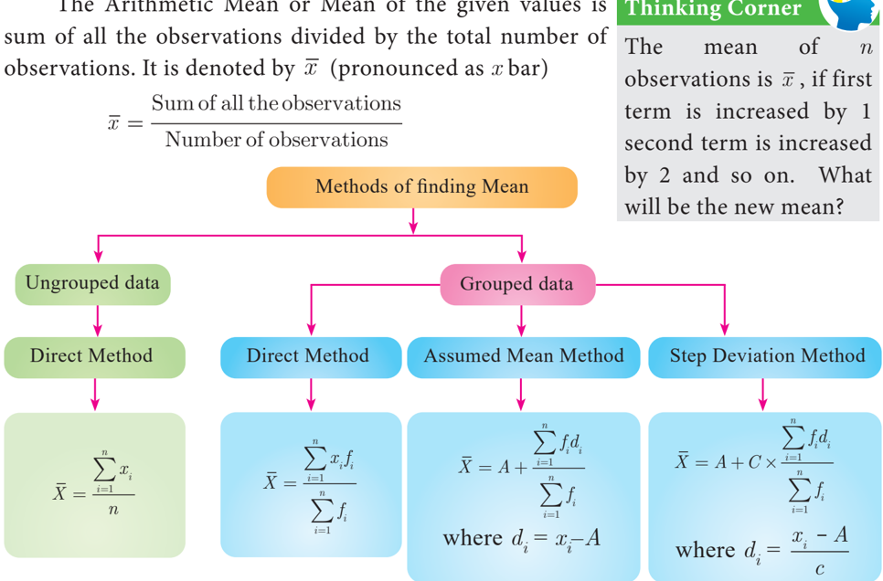

We apply the respective formulae depending upon the information provided in the problem.

**Progress Check**

- The sum of all the observations divided by number of observations is _______.
- If the sum of 10 data values is 265 then their mean is _______.
- If the sum and mean of a data are 407 and 11 respectively, then the number of observations in the data are _______.

### 8.2 Measures of Dispersion

The following data provide the runs scored by two batsmen in the last 10 matches.

Batsman A: 25 , 20 , 45 , 93 , 8 , 14 , 32 , 87 , 72 , 4

Batsman B: 33 , 50 , 47 , 38 , 45 , 40 , 36 , 48 , 37 , 26

10

10

The mean of both datas are same (40), but they differ significantly.

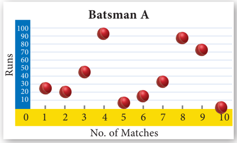

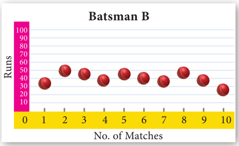

From the above diagrams, we see that runs of batsman B are grouped around the mean. But the runs of batsman A are scattered from 0 to 100, though they both have same mean.

Thus, some additional statistical information may be required to determine how the values are spread in data. For this, we shall discuss Measures of Dispersion .

Dispersion is a measure which gives an idea about the scatteredness of the values.

Measures of Variation (or) Dispersion of a data provide an idea of how observations spread out (or) scattered throughout the data.

**Different Measures of Dispersion are**

- Mean deviation
- Range
- Standard deviation
- Variance
- Quartile deviation
- Coefficient of Variation

#### 8.2.1 Range

The difference between the largest value and the smallest value is called Range.

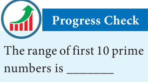

where L - Largest value; S - Smallest value

Example 8.1 Find the range and coefficient of range of the following data: 25, 67, 48, 53, 18, 39, 44 .

Largest value L = 67; Smallest value S =18

*Example 8.2 Find the range of the following distribution.*

|  |  |  |  |  |  |  | \n |
| --- | --- | --- | --- | --- | --- | --- | \n |
| Age (in years) | 16 - 18 | 18 - 20 | 20 - 22 | 22 - 24 | 24 - 26 | 26 - 28 | \n |
| Number of students | 0 | 4 | 6 | 8 | 2 | 2 |  |

Here Largest value L = 28

**Note**

Smallest value S = 16 Range R =−L −LS

If the frequency of initial class is zero, then the next class will be considered for the calculation of range.

Example 8.3 The range of a set of data is 13.67 and the largest value is 70.08. Find the smallest value.

**Note**

Solution

The range of a set of data does not give the clear idea about the dispersion of the data from measures of Central Tendency. For this, we need a measure which depend upon the deviation from the measures of Central Tendency.

Therefore, the smallest value is 56.41 .

#### 8.2.2 Deviations from the mean

#### 8.2.3 Squares of deviations from the mean

10th 304 Standard Mathematics

#### 8.2.4 Variance

The mean of the squares of the deviations from the mean is called Variance . It is denoted by s 2 (read as sigma square).

#### 8.2.5 Standard Deviation

The positive square root of Variance is called Standard deviation. That is, standard deviation is the positive square root of the mean of the squares of deviations of the given values from their mean. It is denoted by s .

gives a clear idea about how far the values are spreading or deviating from the mean.

Standard deviation s

Karl Pearson was the first person to use the word standard deviation. German mathematician Gauss used the word Mean error.

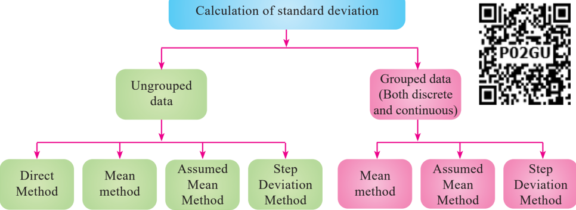

**Calculation of Standard Deviation for ungrouped data**

**(i) Direct Method**

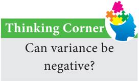

Note

The standard deviation and mean have same units in which the data are given.

Standard deviation,

**Note**

- ¾ While computing standard deviation, arranging data in ascending order is not mandatory.
- ¾ If the data values are given directly then to find standard deviation we can use the

- ¾ If the data values are not given directly but the squares of the deviations from the mean of each observation is given then to find standard deviation we can use the

*Example 8.4 The number of televisions sold in each day of a week are 13, 8, 4, 9, 7, 12, 10. Find its standard deviation.*

|  |  |
| --- | --- |
| x i | x i 2 |
| 13 | 169 |
| 8 | 64 |
| 4 | 16 |
| 9 | 81 |
| 7 | 49 |
| 12 | 144 |
| 10 | 100 |
| Σx i  = | 63 Σx i 2  =  623 |

**Standard deviation**

Solution

**Thinking Corner**

Can the standard deviation be more than the variance?

**Progress Check**

If the variance is 0.49 then the standard deviation is _____.

**(ii) Mean method**

Another convenient way of finding standard deviation is to use the following formula.

Example 8.5 The amount of rainfall in a particular season for 6 days are given as 17.8 cm, 19.2 cm, 16.3 cm, 12.5 cm, 12.8 cm and 11.4 cm. Find its standard deviation. Solution Arranging the numbers in ascending order we get, 11 . 4 , 12 . 5 , 12 . 8 , 16 . 3 , 17 . 8 , 19 . 2. Number of observations n = 6

10th 306 Standard Mathematics

|  |  |  |
| --- | --- | --- |
| x i | $$ \begin{array}{l} d _ {i} = x _ {i} - \bar {x} \\ = x - 1 5 \\ \end{array} $$ $$ \begin{array}{l} d _ {i} = x _ {i} - \bar {x} \\ = x - 1 5 \\ \end{array} $$ $$ \begin{array}{l} d _ {i} = x _ {i} - \bar {x} \\ = x - 1 5 \\ \end{array} $$ $$ \begin{array}{l} d _ {i} = x _ {i} - \bar {x} \\ = x - 1 5 \\ \end{array} $$ $$ \begin{array}{l} d _ {i} = x _ {i} - \bar {x} \\ = x - 1 5 \\ \end{array} $$ $$ \begin{array}{l} d _ {i} = x _ {i} - \bar {x} \\ = x - 1 5 \\ \end{array} $$ $$ \begin{array}{l} d _ {i} = x _ {i} - \bar {x} \\ = x - 1 5 \\ \end{array} $$ $$ \begin{array}{l} d _ {i} = x _ {i} - \bar {x} \\ = x - 1 5 \\ \end{array} $$ $$ \begin{array}{l} d _ {i} = x _ {i} - \bar {x} \\ = x - 1 5 \\ \end{array} $$ $$ \begin{array}{l} d _ {i} = x _ {i} - \bar {x} \\ = x - 1 5 \\ \end{array} $$ $$ \begin{array}{l} d _ {i} = x _ {i} - \bar {x} \\ = x - 1 5 \\ \end{array} $$ $$ \begin{array}{l} d _ {i} = x _ {i} - \bar {x} \\ = x - 1 | di di 2 |
| 11 . 4 | – 3 . 6 | 12 . 96 |
| 12 . 5 | – 2 . 5 | 6 . 25 |
| 12 . 8 | – 2 . 2 | 4 . 84 |
| 16 . 3 | 1 . 3 | 1 . 69 |
| 17 . 8 | 2 . 8 | 7 . 84 |
| 19 . 2 | 4 . 2 | 17 . 64 |
| [ ] [ ] --- [ ] [ ] --- [ ] [ ] --- [ ] [ ] --- [ ] [ ] --- [ ] [ ] --- [ ] [ ] --- [ ] [ ] --- [ ] [ ] --- [ ] [ ] --- [ ] [ ] --- [ ] [ ] --- [ ] [ ] --- [ ] [ ] --- [ ] [ ] --- [ ] [ ] --- [ ] [ ] --- [ ] [ ] --- [ ] [ ] --- [ ] [ ] --- [ ] [ ] --- [ ] [ ] --- [ ] [ ] --- [ ] [ ] --- [ ] [ ] --- [ ] [ ] --- [ ] [ ] --- [ ] [ ] --- [ ] [ ] --- [ ] [ ] --- [ ] [ ] --- [ ] [ ] --- [ ] [ ] --- [ ] [ ] --- [ ] [ ] --- [ ] [ ] --- [ ] [ ] --- [ ] [ ] --- [ ] [ ] --- [ ] [ ] --- [ ] [ ] --- [ ] [ ] --- [ ] [ ] --- [ ] [ ] --- [ ] [ ] --- [ ] [ ] --- [ ] [ ] --- [ ] [ ] --- [ ] [ ] --- [ ] [ ] --- [ ] [ ] --- [ ] [ ] --- [ ] [ ] --- [ ] [ ] --- [ ] [ ] --- [ ] [ ] --- [ ] [ | [ ] 2 --- [ ] 2 --- [ ] 2 --- [ ] 2 --- [ ] 2 --- [ ] 2 --- [ ] 2 --- [ ] 2 --- [ ] 2 --- [ ] 2 --- [ ] 2 --- [ ] 2 --- [ ] 2 --- [ ] 2 --- [ ] 2 --- [ ] 2 --- [ ] 2 --- [ ] 2 --- [ ] 2 --- [ ] 2 --- [ ] 2 --- [ ] 2 --- [ ] 2 --- [ ] 2 --- [ ] 2 --- [ ] 2 --- [ ] 2 --- [ ] 2 --- [ ] 2 --- [ ] 2 --- [ ] 2 --- [ ] 2 --- [ ] 2 --- [ ] 2 --- [ ] 2 --- [ ] 2 --- [ ] 2 --- [ ] 2 --- [ ] 2 --- [ ] 2 --- [ ] 2 --- [ ] 2 --- [ ] 2 --- [ ] 2 --- [ ] 2 --- [ ] 2 --- [ ] 2 --- [ ] 2 --- [ ] 2 --- [ ] 2 --- [ ] 2 --- [ ] 2 --- [ ] 2 --- [ ] 2 --- [ ] 2 --- [ ] 2 --- [ ] 2 --- [ ] 2 --- [ ] 2 --- [ ] 2 --- [ ] 2 --- [ ] 2 --- [ | Σdi di 2  =  51 . 22 |

**(iii) Assumed Mean method**

When the mean value is not an integer (since calculations are very tedious in decimal form) then it is better to use the assumed mean method to find the standard deviation .

Standard deviation s

**Thinking Corner**

For any collection of n values, can you find the value of

Example 8.6 The marks scored by 10 students in a class test are 25, 29, 30, 33, 35, 37, 38, 40, 44, 48. Find the standard deviation.

The mean of marks is 35 . 9 which is not an integer. Hence we take assumed mean, A = 35 , n = 10 .

|  |  |  |
| --- | --- | --- |
| x i | dx i= dx ii  x =−  A dx i= dx ii  x =−  35 | di di 2 |
| 25 | – 10 | 100 |
| 29 | – 6 | 36 |
| 30 | – 5 | 25 |
| 33 | – 2 | 4 |
| 35 | 0 | 0 |
| 37 | 2 | 4 |
| 38 | 3 | 9 |
| 40 | 5 | 25 |
| 44 | 9 | 81 |
| 48 | 13 | 169 |
| $$\sum$$ $$\sum$$ $$\sum$$ $$\sum$$ $$\sum$$ $$\sum$$ $$\sum$$ $$\sum$$ $$\sum$$ $$\sum$$ $$\sum$$ $$\sum$$ $$\sum$$ $$\sum$$ $$\sum$$ $$\sum$$ $$\sum$$ $$\sum$$ $$\sum$$ $$\sum$$ $$\sum$$ $$\sum$$ $$\sum$$ $$\sum$$ $$\sum$$ $$\sum$$ $$\sum$$ $$\sum$$ $$\sum$$ $$\sum$$ $$\sum$$ $$\sum$$ $$\sum$$ $$\sum$$ $$\sum$$ $$\sum$$ $$\sum$$ $$\sum$$ $$\sum$$ $$\sum$$ $$\sum$$ $$\sum$$ $$\sum$$ $$\sum$$ $$\sum$$ $$\sum$$ $$\sum$$ $$\sum$$ $$\sum$$ $$\sum$$ $$\sum$$ $$\sum$$ $$\sum$$ $$\sum$$ $$\sum$$ $$\sum$$ $$\sum$$ $$\sum$$ $$\sum$$ $$\sum$$ $$\sum$$ $$\sum$$ $$\sum$$ $$\sum$$ $$\sum$$ $$\sum$$ $$\sum$$ $$\sum$$ $$\sum$$ $$\sum$$ $$\sum$$ $$\sum$$ $$\sum$$ $$\sum$$ $$\sum$$ $$\sum$$ $$\sum$$ $$\sum$$ $$\sum$$ $$\sum$$ $$\sum$$ $$\sum$$ $$\sum$$ $$\sum$$ | Σdi  di  =  9 | Σdi di 2  =  453 |

**Standard deviation**

**(ii) Step deviation method**

Let c be the common divisor of xA i - i - .

**Note**

We can use any of the above methods for finding the standard deviation

**Activity 1**

Find the standard deviation of the marks obtained by you in all five subjects in the quarterly examination and in the midterm test separately. What do you observe from your results.

10th 308 Standard Mathematics

Example 8.7 The amount that the children have spent for purchasing some eatables in one day trip of a school are 5, 10, 15, 20, 25, 30, 35, 40. Using step deviation method, find the standard deviation of the amount they have spent.

We note that all the observations are divisible by 5. Hence we can use the step deviation method. Let the Assumed mean A = 20 , n = 8 .

|  |  |  |  |
| --- | --- | --- | --- |
| x i | dx i= dx ii  x =−  A dx i= dx ii  x =− 20 | $$ \begin{array}{l} d _ {i} = \frac {x _ {i} - A}{c} \\ c = 5 \\ \end{array} $$ $$ \begin{array}{l} d _ {i} = \frac {x _ {i} - A}{c} \\ c = 5 \\ \end{array} $$ $$ \begin{array}{l} d _ {i} = \frac {x _ {i} - A}{c} \\ c = 5 \\ \end{array} $$ $$ \begin{array}{l} d _ {i} = \frac {x _ {i} - A}{c} \\ c = 5 \\ \end{array} $$ $$ \begin{array}{l} d _ {i} = \frac {x _ {i} - A}{c} \\ c = 5 \\ \end{array} $$ $$ \begin{array}{l} d _ {i} = \frac {x _ {i} - A}{c} \\ c = 5 \\ \end{array} $$ $$ \begin{array}{l} d _ {i} = \frac {x _ {i} - A}{c} \\ c = 5 \\ \end{array} $$ $$ \begin{array}{l} d _ {i} = \frac {x _ {i} - A}{c} \\ c = 5 \\ \end{array} $$ $$ \begin{array}{l} d _ {i} = \frac {x _ {i} - A}{c} \\ c = 5 \\ \end{array} $$ $$ \begin{array}{l} d _ {i} = \frac {x _ {i} - A}{c} \\ c = 5 \\ \end{array} $$ $$ \begin{array}{l} d _ {i} = \frac {x _ {i} - A}{c} \\ c = 5 \\ \end{array} $$ $$ \begin{array}{l} d _ {i} = \frac {x _ {i} - A}{c} \\ c = 5 \\ \end{array} $$ $$ \begin{array}{l} | di di 2 |
| 5 | – 15 | – 3 | 9 |
| 10 | – 10 | – 2 | 4 |
| 15 | – 5 | – 1 | 1 |
| 20 | 0 | 0 | 0 |
| 25 | 5 | 1 | 1 |
| 30 | 10 | 2 | 4 |
| 35 | 15 | 3 | 9 |
| 40 | 20 | 4 | 16 |
| [ ] [ ] --- [ ] [ ] --- [ ] [ ] --- [ ] [ ] --- [ ] [ ] --- [ ] [ ] --- [ ] [ ] --- [ ] [ ] --- [ ] [ ] --- [ ] [ ] --- [ ] [ ] --- [ ] [ ] --- [ ] [ ] --- [ ] [ ] --- [ ] [ ] --- [ ] [ ] --- [ ] [ ] --- [ ] [ ] --- [ ] [ ] --- [ ] [ ] --- [ ] [ ] --- [ ] [ ] --- [ ] [ ] --- [ ] [ ] --- [ ] [ ] --- [ ] [ ] --- [ ] [ ] --- [ ] [ ] --- [ ] [ ] --- [ ] [ ] --- [ ] [ ] --- [ ] [ ] --- [ ] [ ] --- [ ] [ ] --- [ ] [ ] --- [ ] [ ] --- [ ] [ ] --- [ ] [ ] --- [ ] [ ] --- [ ] [ ] --- [ ] [ ] --- [ ] [ ] --- [ ] [ ] --- [ ] [ ] --- [ ] [ ] --- [ ] [ ] --- [ ] [ ] --- [ ] [ ] --- [ ] [ ] --- [ ] [ ] --- [ ] [ ] --- [ ] [ ] --- [ ] [ ] --- [ ] [ ] --- [ ] [ ] --- [ ] [ ] --- [ ] [ | \| --- \| --- \| --- \| --- \| --- \| --- \| --- \| --- \| --- \| --- \| --- \| --- \| --- \| --- \| --- \| --- \| --- \| --- \| --- \| --- \| --- \| --- \| --- \| --- \| --- \| --- \| --- \| --- \| --- \| --- \| --- \| --- \| --- \| --- \| --- \| --- \| --- \| --- \| --- \| --- \| --- \| --- \| --- \| --- \| --- \| --- \| --- \| --- \| --- \| --- \| --- \| --- \| --- \| --- \| --- \| --- \| --- \| --- \| --- \| --- \| --- \| --- \| --- \| --- \| --- \| --- \| --- \| --- \| --- \| --- \| --- \| --- \| --- \| --- \| --- \| --- \| --- \| --- \| --- \| --- \| --- \| --- \| --- \| --- \| --- | Σdi  di  =  4 | Σdi di 2  =  44 |

Standard deviation

*Example 8.8 Find the standard deviation of the following data 7, 4, 8, 10, 11. Add 3 to all the values then find the standard deviation for the new values.*

Arranging the values in ascending order we get, 4, 7, 8, 10, 11 and n = 5

| x i | x i 2 | \n |
| --- | --- | \n |
| 4 | 16 | \n |
| 7 | 49 | \n |
| 8 | 64 | \n |
| 10 | 100 | \n |
| 11 = | 121 2  = |  |

|  |  |
| --- | --- |
| x i | x i 2 |
| 7 | 49 |
| 10 | 100 |
| 11 | 121 |
| 13 | 169 |
| 14 | 196 |
| Σx i  =  55 | Σx i 2  =  635 |

**Standard deviation**

When we add 3 to all the values, we get the new values as 7,10,11,13,14.

**Standard deviation**

We see that the standard deviation will not change when we add some fixed constant k to all the values.

Example 8.9 Find the standard deviation of the data 2, 3, 5, 7, 8. Multiply each data by 4. Find the standard deviation of the new values.

Solution Given, n = 5

|  |  |
| --- | --- |
| x i | x i 2 |
| 2 | 4 |
| 3 | 9 |
| 5 | 25 |
| 7 | 49 |
| 8 | 64 |
| Σx i  =  25 | Σx i 2  =  151 |

When we multiply each data by 4, we get the new values as 8, 12, 20, 28, 32.

|  |  |
| --- | --- |
| x i | x i 2 |
| 8 | 64 |
| 12 | 144 |
| 20 | 400 |
| 28 | 784 |
| 32 | 1024 |
| Σx i  = | 100 Σx i 2  =  2416 |

We see that when we multiply each data by some fixed constant k the standard deviation also get multiplied by k .

Example 8.10 Find the mean and variance of the first n natural numbers.

**Sumofall theobservations**

Solution

**Calculation of Standard deviation for grouped data**

10th 310 Standard Mathematics

Example 8.11 48 students were asked to write the total number of hours per week they spent on watching television. With this information find the standard deviation of hours spent for watching television.

|  |  |  |  |  |  |  | \n |
| --- | --- | --- | --- | --- | --- | --- | \n |
| x  6 | 7 | 8 | 9 | 10 | 11 | 12 | \n |
| f  3 | 6 | 9 | 13 | 8 | 5 | 4 |  |

**Solution**

|  |  |  |  |  |  |
| --- | --- | --- | --- | --- | --- |
| x i | $f_{i}$ <table><tr><td>$f_{i}$</td></tr></table> <table><tr><td>$f_{i}$</td></tr></table> <table><tr><td>$f_{i}$</td></tr></table> <table><tr><td>$f_{i}$</td></tr></table> <table><tr><td>$f_{i}$</td></tr></table> <table><tr><td>$f_{i}$</td></tr></table> <table><tr><td>$f_{i}$</td></tr></table> <table><tr><td>$f_{i}$</td></tr></table> <table><tr><td>$f_{i}$</td></tr></table> <table><tr><td>$f_{i}$</td></tr></table> <table><tr><td>$f_{i}$</td></tr></table> <table><tr><td>$f_{i}$</td></tr></table> <table><tr><td>$f_{i}$</td></tr></table> <table><tr><td>$f_{i}$</td></tr></table> <table><tr><td>$f_{i}$</td></tr></table> <table><tr><td>$f_{i}$</td></tr></table> <table><tr><td>$f_{i}$</td></tr></table> <table><tr><td>$f_{i}$</td></tr></table> <table><tr><td>$f_{i}$</td></tr></table> <table><tr><td>$f_{i}$</td></tr></table> <table><tr><td>$f_{i}$</td></tr></table> <table><tr><td>$f_{i}$</td></tr></table> <table><tr><td>$f_{i}$</td></tr></table> <table><tr><td>$f_{i}$</td></tr></table> <table><tr><td>$f_{i}$ | xfii  fii | $d_{i}=x_{i}-\overline{x}$ --- ```text d_{i}=x_{i}-\overline{x} ``` --- ```text d_{i}=x_{i}-\overline{x} ``` --- ```text d_{i}=x_{i}-\overline{x} ``` --- ```text d_{i}=x_{i}-\overline{x} ``` --- ```text d_{i}=x_{i}-\overline{x} ``` --- ```text d_{i}=x_{i}-\overline{x} ``` --- ```text d_{i}=x_{i}-\overline{x} ``` --- ```text d_{i}=x_{i}-\overline{x} ``` --- ```text d_{i}=x_{i}-\overline{x} ``` --- ```text d_{i}=x_{i}-\overline{x} ``` --- ```text d_{i}=x_{i}-\overline{x} ``` --- ```text d_{i}=x_{i}-\overline{x} ``` --- ```text d_{i}=x_{i}-\overline{x} ``` --- ```text d_{i}=x_{i}-\overline{x} ``` --- ```text d_{i}=x_{i}-\overline{x} ``` --- ```text d_{i}=x_{i}-\overline{x} ``` --- ```text d_{i}=x_{i}-\overline{x} ``` --- ```text d_{i}=x_{i}-\overline{x} ``` --- ```text d_{i}=x_{i}-\overline{x} ``` --- ```text d_{i}=x_{i}-\overline{x} ``` --- ```text d_{i}=x_{i}-\overline{x} ``` --- ```text d_{i}=x_{i}-\overline{x} ``` --- ```text d | di di 2 | fdii fdii 2 |
| 6 | 3 | 18 | – 3 | 9 | 27 |
| 7 | 6 | 42 | – 2 | 4 | 24 |
| 8 | 9 | 72 | – 1 | 1 | 9 |
| 9 | 13 | 117 | 0 | 0 | 0 |
| 10 | 8 | 80 | 1 | 1 | 8 |
| 11 | 5 | 55 | 2 | 4 | 20 |
| 12 | 4 | 48 | 3 | 9 | 36 |
| \| \| $N=$ \| \| :--- \| :--- \| \| \| \| \| \| \| \| \| \| \| \| \| \| \| \| \| \| \| \| \| \| \| \| \| \| \| \| \| \| \| \| \| \| \| \| \| \| \| \| \| \| \| \| \| \| \| \| \| \| \| \| \| \| \| \| \| \| \| \| \| \| \| \| \| \| \| \| \| \| \| \| \| \| \| \| \| \| \| \| \| \| \| \| \| \| \| \| \| \| \| \| \| \| \| \| \| \| \| \| \| \| \| \| \| \| \| \| \| \| \| \| \| \| \| \| \| \| \| \| \| \| \| \| \| \| \| \| \| \| \| \| \| \| \| \| \| \| \| \| \| \| \| \| \| \| \| \| \| \| \| \| \| \| \| \| \| \| \| \| \| \| \| \| \| \| \| \| \| \| \| \| \| \| \| \| \| \| \| \| \| \| \| \| \| \| \| \| \| \| \| \| \| \| \| \| \| \| \| \| \| \| \| \| \| \| \| \| \| \| \| \| \| \| \| \| \| \| \| \| \| \| \| \| \| \| \| \| \| \| \| \| \| \| \| \| \| \| \| \| \| \| \| \| \| \| \| \| \| \| \| \| \| \| \| \| \| \| \| \| \| \| \| \| \| \| \| \| \| \| \| \| \| \| \| \| \| \| \| \| \| \| \| \| \| \| \| \| \| \| \| \| \| | N = 48 | Σxfii  fii  =  432 | Σdi  di  =  0 | $$\sum f_{i}$$ ```markdown ``` ``` ``` ``` ``` ``` ``` ``` ``` ``` ``` ``` ``` ``` ``` ``` ``` ``` ``` ``` ``` ``` ``` ``` ``` ``` ``` ``` ``` ``` ``` ``` ``` ``` ``` ``` ``` ``` ``` ``` ``` ``` ``` ``` ``` ``` ``` ``` ``` ``` ``` ``` ``` ``` ``` ``` ``` ``` ``` ``` ``` ``` ``` ``` ``` ``` ``` ``` ``` ``` ``` ``` ``` ``` ``` ``` ``` ``` ``` ``` ``` ``` ``` ``` ``` ``` ``` ``` ``` ``` ``` ``` ``` ``` ``` ``` ``` ``` ``` ``` ``` ``` ``` ``` ``` ``` ``` ``` ``` ``` ``` ``` ``` ``` ``` ``` ``` ``` ``` ``` ``` ``` ``` ``` ``` ``` ``` ``` ``` ``` ``` ``` ``` ``` ``` ``` ``` ``` ``` ``` ``` ``` ``` ``` ``` ``` ``` ``` ``` ``` ``` ``` ``` ``` ``` ``` ``` ``` ``` ``` ``` ``` ``` ``` | Σfdii fdii 2  =  124 |

**(ii)Assumed Mean method**

Mean

Standard deviation

Example 8.12 The marks scored by the students in a slip test are given below. Find the standard deviation of their marks.

|  |  |  |  |  | \n |
| --- | --- | --- | --- | --- | \n |
| x  4 | 6 | 8 | 10 | 12 | \n |
| f  7 | 3 | 5 | 9 | 5 |  |

Let the assumed mean, A = 8

|  |  |  |  |  |
| --- | --- | --- | --- | --- |
| x i | \| $f_i$ --- ```text \| $f_i$ ``` ``` ``` ``` ``` ``` ``` ``` ``` ``` ``` ``` ``` ``` ``` ``` ``` ``` ``` ``` ``` ``` ``` ``` ``` ``` ``` ``` ``` ``` ``` ``` ``` ``` ``` ``` ``` ``` ``` ``` ``` ``` ``` ``` ``` ``` ``` ``` ``` ``` ``` ``` ``` ``` ``` ``` ``` ``` ``` ``` ``` ``` ``` ``` ``` ``` ``` ``` ``` ``` ``` ``` ``` ``` ``` ``` ``` ``` ``` ``` ``` ``` ``` ``` ``` ``` ``` ``` ``` ``` ``` ``` ``` ``` ``` ``` ``` ``` ``` ``` ``` ``` ``` ``` ``` ``` ``` ``` ``` ``` ``` ``` ``` ``` ``` ``` ``` ``` ``` ``` ``` ``` ``` ``` ``` ``` ``` ``` ``` ``` ``` ``` ``` ``` ``` ``` ``` ``` ``` ``` ``` ``` ``` ``` ``` ``` ``` ``` ``` ``` ``` ``` ``` ``` ``` ``` ``` ``` ``` ``` ``` | dx i= dx ii  x =− A | fdii  fdii | fdii fdii 2 |
| 4 | 7 | – 4 | – 28 | 112 |
| 6 | 3 | – 2 | – 6 | 12 |
| 8 | 5 | 0 | 0 | 0 |
| 10 | 9 | 2 | 18 | 36 |
| 12 | 5 | 4 | 20 | 80 |
| \| \| $N=$ \| \| :--- \| :--- \| \| \| \| \| \| \| \| \| \| \| \| \| \| \| \| \| \| \| \| \| \| \| \| \| \| \| \| \| \| \| \| \| \| \| \| \| \| \| \| \| \| \| \| \| \| \| \| \| \| \| \| \| \| \| \| \| \| \| \| \| \| \| \| \| \| \| \| \| \| \| \| \| \| \| \| \| \| \| \| \| \| \| \| \| \| \| \| \| \| \| \| \| \| \| \| \| \| \| \| \| \| \| \| \| \| \| \| \| \| \| \| \| \| \| \| \| \| \| \| \| \| \| \| \| \| \| \| \| \| \| \| \| \| \| \| \| \| \| \| \| \| \| \| \| \| \| \| \| \| \| \| \| \| \| \| \| \| \| \| \| \| \| \| \| \| \| \| \| \| \| \| \| \| \| \| \| \| \| \| \| \| \| \| \| \| \| \| \| \| \| \| \| \| \| \| \| \| \| \| \| \| \| \| \| \| \| \| \| \| \| \| \| \| \| \| \| \| \| \| \| \| \| \| \| \| \| \| \| \| \| \| \| \| \| \| \| \| \| \| \| \| \| \| \| \| \| \| \| \| \| \| \| \| \| \| \| \| \| \| \| \| \| \| \| \| \| \| \| \| \| \| \| \| \| \| \| \| \| \| \| \| \| \| \| \| \| \| \| \| \| \| \| | N = 29 | $$\sum f_{i}$$ ```markdown ``` ``` ``` ``` ``` ``` ``` ``` ``` ``` ``` ``` ``` ``` ``` ``` ``` ``` ``` ``` ``` ``` ``` ``` ``` ``` ``` ``` ``` ``` ``` ``` ``` ``` ``` ``` ``` ``` ``` ``` ``` ``` ``` ``` ``` ``` ``` ``` ``` ``` ``` ``` ``` ``` ``` ``` ``` ``` ``` ``` ``` ``` ``` ``` ``` ``` ``` ``` ``` ``` ``` ``` ``` ``` ``` ``` ``` ``` ``` ``` ``` ``` ``` ``` ``` ``` ``` ``` ``` ``` ``` ``` ``` ``` ``` ``` ``` ``` ``` ``` ``` ``` ``` ``` ``` ``` ``` ``` ``` ``` ``` ``` ``` ``` ``` ``` ``` ``` ``` ``` ``` ``` ``` ``` ``` ``` ``` ``` ``` ``` ``` ``` ``` ``` ``` ``` ``` ``` ``` ``` ``` ``` ``` ``` ``` ``` ``` ``` ``` ``` ``` ``` ``` ``` ``` ``` ``` ``` ``` ``` ``` ``` ``` ``` | Σfdii  fdii  = | 4 Σfdii fdii 2  =  240 |

**Calculation of Standard deviation for continuous frequency distribution**

**(i) Mean method**

Standard deviation

x = Middle value of the i th class.

**(ii) Shortcut method (or) Step deviation method**

*Example 8.13 Marks of the students in a particular subject of a class are given below. Find its standard deviation.*

|  |  |  |  |  |  |  |  | \n |
| --- | --- | --- | --- | --- | --- | --- | --- | \n |
| Marks | 0-10 | 10-20 | 20-30 | 30-40 | 40-50 | 50-60 | 60-70 | \n |
| Number of students | 8 | 12 | 17 | 14 | 9 | 7 | 4 |  |

Let the assumed mean, A = 35 , c = 10

|  |  |  |  |  |  |  |
| --- | --- | --- | --- | --- | --- | --- |
| Marks | Mid value  () xi i | fi  fi | d i  =   x i –A | $d_{i}=\frac{x_{i}-A}{c}$ <table><tr><td>$d_{i}=\frac{x_{i}-A}{c}$</td></tr></table> <hr></hr> <table><tr><td>$d_{i}=\frac{x_{i}-A}{c}$</td></tr></table> <hr></hr> <table><tr><td>$d_{i}=\frac{x_{i}-A}{c}$</td></tr></table> <hr></hr> <table><tr><td>$d_{i}=\frac{x_{i}-A}{c}$</td></tr></table> <hr></hr> <table><tr><td>$d_{i}=\frac{x_{i}-A}{c}$</td></tr></table> <hr></hr> <table><tr><td>$d_{i}=\frac{x_{i}-A}{c}$</td></tr></table> <hr></hr> <table><tr><td>$d_{i}=\frac{x_{i}-A}{c}$</td></tr></table> <hr></hr> <table><tr><td>$d_{i}=\frac{x_{i}-A}{c}$</td></tr></table> <hr></hr> <table><tr><td>$d_{i}=\frac{x_{i}-A}{c}$</td></tr></table> <hr></hr> <table><tr><td>$d_{i}=\frac{x_{i}-A}{c}$</td></tr></table> <hr></hr> <table><tr><td>$d_{i}=\frac{x_{i}-A}{c}$</td></tr></table> <hr></hr> <table><tr><td>$d_{i}=\frac{x_{i}-A}{c}$</td></tr></table> <hr></hr> <table><tr><td>$d_{i}=\frac{x_{i}-A}{c}$</td></tr></ | fdii  fdii | fdii fdii 2 |
| 0 - 10 10 - 20 20 - 30 30 - 40 40 - 50 50 - 60 60 - 70 | 5 15 25 35 45 55 65 | 8 12 17 14 9 7 4 | - 30 - 20 - 10 0 10 20 30 | – 3 – 2 – 1 0 1 2 3 | – 24 – 24 – 17 0 9 14 12 =− 30 | 72 48 17 0 9 28 36 2 |
| \| 50-60 \| \| \| :--- \| :--- \| \| 60-70 \| \| \| \| \| \| \| \| \| \| \| \| \| \| \| \| \| \| \| \| \| \| \| \| \| \| \| \| \| \| \| \| \| \| \| \| \| \| \| \| \| \| \| \| \| \| \| \| \| \| \| \| \| \| \| \| \| \| \| \| \| \| \| \| \| \| \| \| \| \| \| \| \| \| \| \| \| \| \| \| \| \| \| \| \| \| \| \| \| \| \| \| \| \| \| \| \| \| \| \| \| \| \| \| \| \| \| \| \| \| \| \| \| \| \| \| \| \| \| \| \| \| \| \| \| \| \| \| \| \| \| \| \| \| \| \| \| \| \| \| \| \| \| \| \| \| \| \| \| \| \| \| \| \| \| \| \| \| \| \| \| \| \| \| \| \| \| \| \| \| \| \| \| \| \| \| \| \| \| \| \| \| \| \| \| \| \| \| \| \| \| \| \| \| \| \| \| \| \| \| \| \| \| \| \| \| \| \| \| \| \| \| \| \| \| \| \| \| \| \| \| \| \| \| \| \| \| \| \| \| \| \| \| \| \| \| \| \| \| | <table><tr><td>55<br>65</td><td></td></tr><tr><td></td><td>M</td></tr></table> <table><tr><td>55<br>65</td><td></td></tr><tr><td></td><td>M</td></tr></table> <table><tr><td>55<br>65</td><td></td></tr><tr><td></td><td>M</td></tr></table> <table><tr><td>55<br>65</td><td></td></tr><tr><td></td><td>M</td></tr></table> <table><tr><td>55<br>65</td><td></td></tr><tr><td></td><td>M</td></tr></table> <table><tr><td>55<br>65</td><td></td></tr><tr><td></td><td>M</td></tr></table> <table><tr><td>55<br>65</td><td></td></tr><tr><td></td><td>M</td></tr></table> <table><tr><td>55<br>65</td><td></td></tr><tr><td></td><td>M</td></tr></table> <table><tr><td>55<br>65</td><td></td></tr><tr><td></td><td>M</td></tr></table> <table><tr><td>55<br>65</td><td></td></tr><tr><td></td><td>M</td></tr></table> <table><tr><td>55<br>65</td><td></td></tr><tr><td></td><td>M</td></tr></table> <table><tr><td>55<br>65</td><td></td></tr><tr | N = 71 | \| 20 \| \| \| :--- \| :--- \| \| 30 \| \| \| \| \| \| \| \| \| \| \| \| \| \| \| \| \| \| \| \| \| \| \| \| \| \| \| \| \| \| \| \| \| \| \| \| \| \| \| \| \| \| \| \| \| \| \| \| \| \| \| \| \| \| \| \| \| \| \| \| \| \| \| \| \| \| \| \| \| \| \| \| \| \| \| \| \| \| \| \| \| \| \| \| \| \| \| \| \| \| \| \| \| \| \| \| \| \| \| \| \| \| \| \| \| \| \| \| \| \| \| \| \| \| \| \| \| \| \| \| \| \| \| \| \| \| \| \| \| \| \| \| \| \| \| \| \| \| \| \| \| \| \| \| \| \| \| \| \| \| \| \| \| \| \| \| \| \| \| \| \| \| \| \| \| \| \| \| \| \| \| \| \| \| \| \| \| \| \| \| \| \| \| \| \| \| \| \| \| \| \| \| \| \| \| \| \| \| \| \| \| \| \| \| \| \| \| \| \| \| \| \| \| \| \| \| \| \| \| \| \| \| \| \| \| \| \| \| \| \| \| \| \| \| \| \| \| \| \| \| \| \| | <table><tr><td>2</td><td></td></tr><tr><td>3</td><td></td></tr><tr><td></td><td>Σf</td></tr></table> <table><tr><td>2</td><td></td></tr><tr><td>3</td><td></td></tr><tr><td></td><td>Σf</td></tr></table> <table><tr><td>2</td><td></td></tr><tr><td>3</td><td></td></tr><tr><td></td><td>Σf</td></tr></table> <table><tr><td>2</td><td></td></tr><tr><td>3</td><td></td></tr><tr><td></td><td>Σf</td></tr></table> <table><tr><td>2</td><td></td></tr><tr><td>3</td><td></td></tr><tr><td></td><td>Σf</td></tr></table> <table><tr><td>2</td><td></td></tr><tr><td>3</td><td></td></tr><tr><td></td><td>Σf</td></tr></table> <table><tr><td>2</td><td></td></tr><tr><td>3</td><td></td></tr><tr><td></td><td>Σf</td></tr></table> <table><tr><td>2</td><td></td></tr><tr><td>3</td><td></td></tr><tr><td></td><td>Σf</td></tr></table> <table><tr><td>2</td><td></td></tr><tr><td>3</td><td></td></tr><tr><td></td><td>Σf</td></tr></table> <table><tr><td>2 | Σfdii  fdii | Σfdii fdii =  210 |

**Thinking Corner**

- The standard deviation of a data is 2.8, if 5 is added to all the data values then the new standard deviation is ___.
- If S is the standard deviation of values p , q, r then standard deviation of p–3, q–3, r–3 is ___.

Example 8.14 The mean and standard deviation of 15 observations are found to be 10 and 5 respectively. On rechecking it was found that one of the observation with value 8 was incorrect. Calculate the correct mean and standard deviation if the correct observation value was 23?

10th 312 Standard Mathematics

- Find the range and coefficient of range of the following data.
- (i) 63, 89, 98, 125, 79, 108, 117, 68
- (ii) 43.5, 13.6, 18.9, 38.4, 61.4, 29.8
- If the range and the smallest value of a set of data are 36.8 and 13.4 respectively, then find the largest value.
- Calculate the range of the following data.

|  |  |  |  |  |  | \n |
| --- | --- | --- | --- | --- | --- | \n |
| Income | 400-450 | 450-500 | 500-550 | 550-600 | 600-650 | \n |
| Number of workers | 8 | 12 | 30 | 21 | 6 |  |

- A teacher asked the students to complete 60 pages of a record note book. Eight students have completed only 32, 35, 37, 30, 33, 36, 35 and 37 pages. Find the standard deviation of the pages completed by them.
- Find the variance and standard deviation of the wages of 9 workers given below: ₹310, ₹290, ₹320, ₹280, ₹300, ₹290, ₹320, ₹310, ₹280 .
- A wall clock strikes the bell once at 1 o' clock, 2 times at 2 o' clock, 3 times at 3 o' clock and so on. How many times will it strike in a particular day. Find the standard deviation of the number of strikes the bell make a day.
- Find the standard deviation of first 21 natural numbers.
- If the standard deviation of a data is 4.5 and if each value of the data is decreased by 5, then find the new standard deviation.
- If the standard deviation of a data is 3.6 and each value of the data is divided by 3, then find the new variance and new standard deviation.
- The rainfall recorded in various places of five districts in a week are given below. Find its standard deviation.

|  |  |  |  |  |  |  | \n |
| --- | --- | --- | --- | --- | --- | --- | \n |
| Rainfall (in mm) | 45 | 50 | 55 | 60 | 65 | 70 | \n |
| Number of places | 5 | 13 | 4 | 9 | 5 | 4 |  |

- In a study about viral fever, the number of people affected in a town were noted as Find its standard deviation.

| Age in years | 0-10 | 10-20 | 20-30 | 30-40 | 40-50 | 50-60 | 60-70 | \n |
| --- | --- | --- | --- | --- | --- | --- | --- | \n |
| Number of people affected | 3 | 5 | 16 | 18 | 12 | 7 | 4 |  |

- The measurements of the diameters (in cms) of the plates prepared in a factory are given below. Find its standard deviation.

|  |  |  |  |  |  |  | \n |
| --- | --- | --- | --- | --- | --- | --- | \n |
| Diameter (cm) | 21-24 | 25-28 | 29-32 | 33-36 | 37-40 | 41-44 | \n |
| Number of plates | 15 | 18 | 20 | 16 | 8 | 7 |  |

- The time taken by 50 students to complete a 100 meter race are given below. Find its standard deviation.

|  |  |  |  |  |  | \n |
| --- | --- | --- | --- | --- | --- | \n |
| Time taken (sec) | 8.5-9.5 | 9.5-10.5 | 10.5-11.5 | 11.5-12.5 | 12.5-13.5 | \n |
| Number of students | 6 | 8 | 17 | 10 | 9 |  |

- For a group of 100 candidates the mean and standard deviation of their marks were found to be 60 and 15 respectively. Later on it was found that the scores 45 and 72 were wrongly entered as 40 and 27. Find the correct mean and standard deviation.
- The mean and variance of seven observations are 8 and 16 respectively. If five of these are 2, 4, 10, 12 and 14, then find the remaining two observations.

### 8.3 Coefficient of Variation

Comparison of two data in terms of measures of central tendencies and dispersions in some cases will not be meaningful, because the variables in the data may not have same units of measurement.

For example consider the two data

|  | Weight | Price | \n |
| --- | --- | --- | \n |
| Mean | 8 kg | ₹ 85 | \n |
| Standard deviation | 1.5 kg | ₹ 21.60 |  |

Here we cannot compare the standard deviations 1 . 5kg and ₹21 . 60. For comparing two or more data for corresponding changes the relative measure of standard deviation, called "Coefficient of variation" is used.

Coefficient of variation of a data is obtained by dividing the standard deviation by the arithmetic mean. It is usually expressed in terms of percentage. This concept is suggested by one of the most prominent Statistician Karl Pearson .

The data with lesser coefficient of variation is more consistent or stable than the other data.

**Consider the two data**

|  |  |  |  |  |  |  |  |  |  | \n |
| --- | --- | --- | --- | --- | --- | --- | --- | --- | --- | \n |
| A | 500 | 900 | 800 | 900 | 700 | 400 |  | Mean | Standard deviation | \n |
| B | 300 | 540 | 480 | 540 | 420 | 240 | A | 700 | 191.5 | \n |
|  |  |  |  |  |  |  | B | 420 | 114.9 |  |

If we compare the mean and standard deviation of the two data, we think that the two datas are entirely different. But mean and standard deviation of B are 60% of that of A . Because of the smaller mean the smaller standard deviation led to the misinterpretation.

10th 314 Standard Mathematics

Thus the two data have equal coefficient of variation. Since the data have equal coefficient of variation values, we can conclude that one data depends on the other. But the data values of B are exactly 60% of the corresponding data values of A. So they are very much related. Thus, we get a confusing situation.

To get clear picture of the given data, we can find their coefficient of variation. This is why we need coefficient of variation.

**Progress Check**

- Coefficient of variation is a relative measure of .
- When the standard deviation is divided by the mean we get .
- The coefficient of variation depends upon and .
- If the mean and standard deviation of a data are 8 and 2 respectively then the coefficient of variation is .
- When comparing two data, the data with coefficient of variation is inconsistent.

Example 8.15 The mean of a data is 25.6 and its coefficient of variation is 18.75. Find the standard deviation.

Mean x = 25 . 6 , Coefficient of variation, C.V. = 18.75

Example 8.16 The following table gives the values of mean and variance of heights and weights of the 10th standard students of a school.

|  | Height | Weight | \n |
| --- | --- | --- | \n |
| Mean | 155 cm | 46.50 kg | \n |
| Variance | 72.25 cm 2 | 28.09 kg |  |

Which is more varying than the other?

For comparing two data, first we have to find their coefficient of variations

Mean x 1 = 155cm, variance s 1 2 = 72 . 25 cm 2

Therefore standard deviation s 1 = 85. .

Mean x 2 = 46.50 kg, Variance s 2 2 = 28.09 kg 2

Standard deviation s 2 = 5.3 kg

Height is more consistent.


- The standard deviation and mean of a data are 6.5 and 12.5 respectively. Find the coefficient of variation.
- The standard deviation and coefficient of variation of a data are 1.2 and 25.6 respectively. Find the value of mean.
- If the mean and coefficient of variation of a data are 15 and 48 respectively, then find the value of standard deviation.
- If n = 5 , x = 6 , Σx 2 = 765 , then calculate the coefficient of variation.
- Find the coefficient of variation of 24, 26, 33, 37, 29, 31.
- The time taken (in minutes) to complete a homework by 8 students in a day are given by 38, 40, 47, 44, 46, 43, 49, 53. Find the coefficient of variation.
- The total marks scored by two students Sathya and Vidhya in 5 subjects are 460 and 480 with standard deviation 4.6 and 2.4 respectively. Who is more consistent in performance?
- The mean and standard deviation of marks obtained by 40 students of a class in three subjects Mathematics, Science and Social Science are given below.

| Subject | Mean | SD | \n |
| --- | --- | --- | \n |
| Mathematics | 56 | 12 | \n |
| Science | 65 | 14 | \n |
| Social Science | 60 | 10 |  |

### 8.4 Probability

Few centuries ago, gambling and gaming were considered to be fashionable and became widely popular among many men. As the games became more complicated, players were interested in knowing the chances of winning or losing a game from a given situation. In 1654, Chevalier de Mere, a French nobleman with a taste of gambling, wrote a letter to one of the prominent mathematician of the time, Blaise Pascal, seeking his advice about how much dividend he would get for a gambling game played by paying money. Pascal worked this problem mathematically but thought of sharing this problem and see how his good friend and

Which of the three subjects shows more consistent and which shows less consistent in marks?

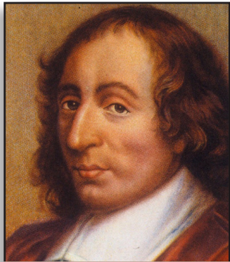

mathematician Pierre de Fermat could solve. Their subsequent correspondences on the issue represented the birth of Probability Theory as a new branch of mathematics.

**Random Experiment**

A random experiment is an experiment in which

- (i) The set of all possible outcomes are known (ii)Exact outcome is not known.

10th 316 Standard Mathematics

Example : 1. Tossing a coin. 2. Rolling a die.

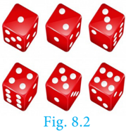

**Sample space**

The set of all possible outcomes in a random experiment is called a sample space. It is generally denoted by S .

Example : When we roll a die, the possible outcomes are the face numbers 1,2,3,4,5,6 of the die. Therefore the sample space is S = {1,2,3,4,5,6}

Sample point Each element of a sample space is called a sample point .

#### 8.4.1 Tree diagram

Tree diagram allow us to see visually all possible outcomes of an random experiment. Each branch in a tree diagram represent a possible outcome.

**Illustration**

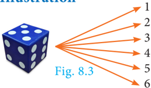

(i) When we throw a die, then from the tree diagram (Fig.8.3),

the sample space can be written as S = {1,2,3,4,5,6}

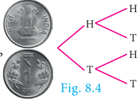

- (ii) When we toss two coins, then from the tree diagram (Fig.8.4),

the sample space can be written as S={HH,HT,TH,TT}

**Progress Check**

- An experiment in which a particular outcome cannot be predicted is called _______.
- The set of all possible outcomes is called _______.

Example 8.17 Express the sample space for rolling two dice using tree diagram.

When we roll two dice, since each die contain 6 faces marked with 1,2,3,4,5,6 the tree diagram will look like

Hence, the sample space can be written as

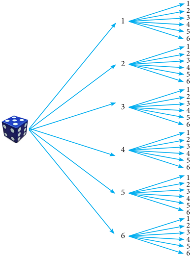

(3,1),(3,2),(3,3),(3,4),(3,5),(3,6)

(4,1),(4,2),(4,3),(4,4),(4,5),(4,6)

(5,1),(5,2),(5,3),(5,4),(5,5),(5,6)

(6,1),(6,2),(6,3),(6,4),(6,5),(6,6)}

Event: In a random experiment, each possible outcome is called an event. Thus, an event will be a subset of the sample space.

Example : Getting two heads when we toss two coins is an event.

Trial :Performing an experiment once is called a trial .

Example :When we toss a coin thrice, then each toss of a coin is a trial.

| Events | Explanation | Example | \n |
| --- | --- | --- | \n |
| Equally likely  events | Two or more events are said to be  equally likely if each one of them  has an equal chance of occurring. | Head and tail are equally likely  events in tossing a coin . | \n |
| Certain events | In an experiment, the event  which surely occur is called  certain event . | When we roll a die, the event of  getting any natural number from  one to six is a certain event. | \n |
|  | Impossible events In an experiment if an event  has no scope to occur then it is  called an impossible event . | When we toss two coins, the  event of getting three heads is  an impossible event. | \n |
| Mutually  exclusive events | Two or more events are said to  be mutually exclusive if they  don’t have common sample  points. i.e., events A, B are said  to be mutually exclusive if  AB ∩= f  . | When we roll a die the events of  getting odd numbers and even  numbers are mutually exclusive  events. | \n |
|  | Exhaustive events The collection of events whose  union is the whole sample space  are called exhaustive events . | When we toss a coin twice, the  collection of events of getting  two heads, exactly one head, no  head are exhaustive events. | \n |
| Complementary  events | The complement of an event A is  the event representing collection  of sample points not in A. It is  denoted A ¢   or A c   or A The event A and its complement  A ¢   are mutually exclusive and  exhaustive. | When we roll a die, the event  ‘rolling a 5 or 6’ and the event  of rolling a 1, 2, 3 or 4 are  complementary events. |  |

**Note**

Elementary event: If an event E consists of only one outcome then it is called an elementary event .

10th 318 Standard Mathematics

In 1713, Bernoulli was the first to recognise the wide-range applicability of probability in fields outside gambling

#### 8.4.2 Probability of an Event

In a random experiment, let S be the sample space and ES Í . Then if E is an event , the probability of occurrence of E is defined as

This way of defining the probability is applicable only to finite sample spaces. So in this chapter, we will be dealing problems only with finite sample spaces.

- ¾ Since E is a subset of S and f is a subset of any set,

Therefore, the probability value always lies from 0 to 1 .

- ¾ The complement event of E is E .

Let PE ( m n E () = (where m is the number of favourable outcomes of E and n is the total number of possible outcomes).

PE( E E() = Number of outcomes unfavourable to occuranceof

Number of all possibleoutcomes

- ¾ P(E) + P(E)=1

**Progress Check**

Which of the following values cannot be a probability of an event?

- (b) 0.5
- (d) 1
- (a) –0.0001
- (c) 1.001
- (g) 152 -
- (h) 31+ 4 +
- (f) 0.253
- (e) 20%

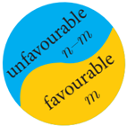

Example 8.18 A bag contains 5 blue balls and 4 green balls. A ball is drawn at random from the bag. Find the probability that the ball drawn is (i) blue (ii) not blue.

Total number of possible outcomes n(S) =+54 = 9

- (i) Let A be the event of getting a blue ball.

Number of favourable outcomes for the event A . Therefore, n(A) = 5

Probability that the ball drawn is blue. Therefore, PA ( nA( nS ( A () A() S () == 5 9

- (ii) A will be the event of not getting a blue ball. So PA() =−11 PA() =− = 5 9 4 9

Example 8.19 Two dice are rolled. Find the probability that the sum of outcomes is (i) equal to 4 (ii) greater than 10 (iii) less than 13

When we roll two dice, the sample space is given by

- (i) Let A be the event of getting the sum of outcome values equal to 4 .

Probability of getting the sum of outcomes equal to 4 is PA ( nA( nS ( A () A() S () == = 3 36 1 12

- (ii) Let B be the event of getting the sum of outcome values greater than 10.

Probability of getting the sum of outcomes greater than 10 is PB ( nB( nS ( B () B() S () == = 3 36 1 12

- (iii) Let C be the event of getting the sum of outcomes less than 13. Here all the outcomes have the sum value less than 13. Hence CS = = .

Probability of getting the total value less than 13 is PC ( nC( nS ( C () C() S () == = 36 36 1 .

Example 8.20 Two coins are tossed together. What is the probability of getting different faces on the coins?

When two coins are tossed together, the sample space is

Let A be the event of getting different faces on the coins.

10th 320 Standard Mathematics

Example 8.21 What is the probability that a leap year selected at random will contain 53 saturdays.

A leap year has 366 days. So it has 52 full weeks and 2 days. 52 Saturdays must be in 52 full weeks.

The possible chances for the remaining two days will be the sample space.

**Thinking Corner**

Let A be the event of getting 53 rd Saturday.

What will be the probability that a nonleap year will have 53 Saturdays?

Example 8.22 A die is rolled and a coin is tossed simultaneously. Find the probability that the die shows an odd number and the coin shows a head.

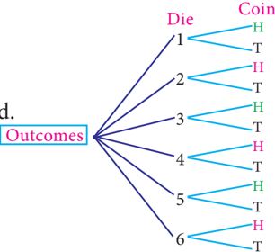

Solution Sample space

Let A be the event of getting an odd number and a head.

**Activity 3**

**Activity 4**

Collect the details and find the probabilities of

There are three routes R1 R1, R2 R2 and R3 R3 from Madhu's home to her place of work. There are four parking lots P1 P1, P2 P2, P3 P3, P4 P4 and three entrances B1 B1, B2 B2, B3 B3 into the office building. There are two elevators E1 E1 and E2 E2 to her floor. Using the tree diagram explain how many ways can she reach her office?

- (i) selecting a boy from your class.
- (ii) selecting a girl from your class.
- (iii) selecting a student from tenth standard in your school.
- (iv) selecting a boy from tenth standard in your school.
- (v) selecting a girl from tenth standard in your school.

Example 8.23 A bag contains 6 green balls, some black and red balls. Number of black balls is as twice as the number of red balls. Probability of getting a green ball is thrice the probability of getting a red ball. Find (i) number of black balls (ii) total number of balls.

Number of green balls is nG() = 6

Let number of red balls is nR() = x

Therefore, number of black balls is nB() = 2x

Total number of ballsnS() =++ 62 xx =+63x

=×3 PR()

- (i) Number of black balls=×= 22 4
- (ii) Total number of balls=+63() ×= 212

Example 8.24 A game of chance consists of spinning an arrow which is equally likely to come to rest pointing to one of the numbers 1, 2, 3, …12. What is the probability that it will point to (i) 7 (ii) a prime number (iii) a composite number? 12 1 11

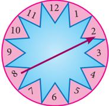

Sample space S = {1,2,3,4,5,6,7,8,9,10,11,12}; n(S) = 12

- (i) Let A be the event of resting in 7 . n (A)=1

*Fig. 8.5*

- (ii) Let B be the event that the arrow will come to rest in a prime number.

- (iii) Let C be the event that arrow will come to rest in a composite number.

Thinking Corner

What is the complement event of an impossible event?

Exercise 8 . 3

- Write the sample space for tossing three coins using tree diagram.
- Write the sample space for selecting two balls at a time from a bag containing 6 balls numbered 1 to 6 (using tree diagram).
- If A is an event of a random experiment such that P(A) : PA()=17:15 and n(S)=640 then find (i) PA() (ii) n(A).
- A coin is tossed thrice. What is the probability of getting two consecutive tails?
- At a fete, cards bearing numbers 1 to 1000, one number on one card are put in a box. Each player selects one card at random and that card is not replaced. If the selected card has a perfect square number greater than 500, the player wins a prize. What is the probability that (i) the first player wins a prize (ii) the second player wins a prize, if the first has won?
- A bag contains 12 blue balls and x red balls. If one ball is drawn at random (i) what is the probability that it will be a red ball? (ii) If 8 more red balls are put in the bag, and if the probability of drawing a red ball will be twice that of the probability in (i), then find x. x.
- Two unbiased dice are rolled once. Find the probability of getting
- (i) a doublet (equal numbers on both dice)
- (ii) the product as a prime number
- (iii) the sum as a prime number
- (iv) the sum as 1

10th 322 Standard Mathematics

- Three fair coins are tossed together. Find the probability of getting
- (i) all heads
- (ii) atleast one tail
- (iii) atmost one head
- (iv) atmost two tails
- A bag contains 5 red balls, 6 white balls, 7 green balls, 8 black balls. One ball is drawn at random from the bag. Find the probability that the ball drawn is
- (i) white
- (ii) black or red
- (iii) not white
- (iv) neither white nor black
- In a box there are 20 non-defective and some defective bulbs. If the probability that a bulb selected at random from the box found to be defective is 3 8 then, find the number of defective bulbs.
- Some boys are playing a game, in which the stone thrown by them landing in a circular region (given in the figure) is considered as win and landing other than the circular region is considered as loss. What is the probability to win the game? (π = 3.14)

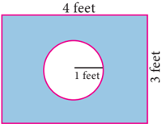

- Two customers Priya and Amuthan are visiting a particular shop in the same week (Monday to Saturday). Each is equally likely to visit the shop on any one day as on another day. What is the probability that both will visit the shop on
- (i) the same day

(ii) different days (iii) consecutive days?

- In a game, the entry fee is ₹150. The game consists of tossing a coin 3 times. Dhana bought a ticket for entry . If one or two heads show, she gets her entry fee back. If she throws 3 heads, she receives double the entry fees. Otherwise she will lose. Find the probability that she (i) gets double entry fee (ii) just gets her entry fee (iii) loses the entry fee.

### 8.5 Algebra of Events

In a random experiment, let S be the sample space. Let AS Í and BS Í be the events in S. We say that

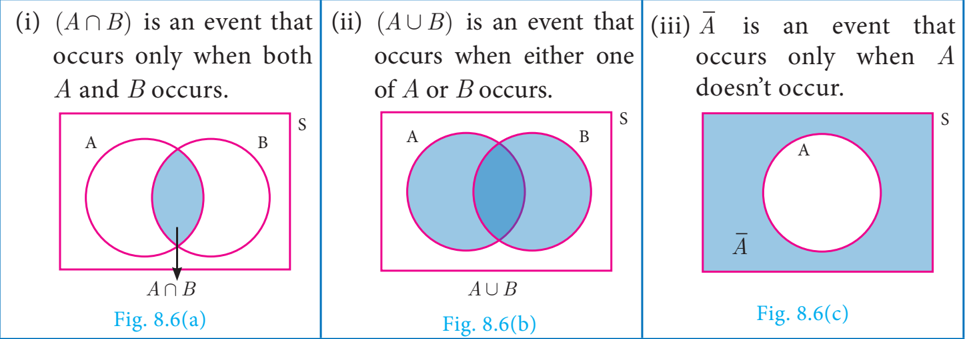

- AA∪= S
- If A, B are mutually exclusive events, then PA() ∪= BP() AP + () B
- P (Union of mutually exclusive events)= ∑( Probability of events)

**Thorem 1**

If A and B are two events associated with a random experiment, then prove that

**Proof**

- (i) By Distributive property of sets,

Therefore, the events AB Ç and AB Ç are mutually exclusive whose union is A .

Therefore,

Therefore,

- (ii) By Distributive property of sets,

Therefore, the events AB Ç and AB Ç are mutually exclusive whose union is B .

Therefore,

That is, PA() Ç B = P(only B) =− PB() PA() ∩ B

**Progress Check**

- P(only A)=
- PA() ∩= B ________.
- ________.
- AB Ç and AB Ç are _______ events.
- PA() ∩= B ________.
- If A and B are mutually exclusive events then PA() ∩= B _______.
- If PA() ∩= B

10th 324 Standard Mathematics

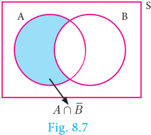

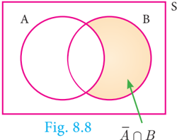

### 8.6 Addition Theorem of Probability

- (i) If A and B are any two events then

**Proof**

- (i) Let A and B be any two events of a random experiment with sample space S .

From the Venn diagram, we have the events only A , AB Ç and only B are mutually exclusive and their union is AB È

- (ii) Let A, B, C are any three events of a random experiment with sample space S .

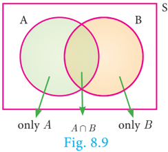

**Activity 5**

The addition theorem of probability can be written easily using the following way.

Where S1 S1 ® Sum of probability of events taken one at a time.

S2 S2 ® Sum of probability of events taken two at a time.

S 3 ® Sum of probability of events taken three at a time.

−∩ PC() AP +∩ () AB ∩C

Find the probability of PA() ÈÈÈ BC D ) D using the above way. Can you find a pattern for the number of terms in the formula?

Example 8.25 If P(A). = 037 , P(B). = 042 , PA() ∩= B 00. . 9 then find PA() È B .

Solution

Example 8.26 A flower is selected at random from a basket containing 80 yellow, 70 red and 50 white flowers. Find the probability of selecting a yellow or red flower?

**Solution:**

80

70

200

Transcribe only the visible text in the original language/script. Do not translate, transliterate, summarize, or normalize the language. Preserve the exact words, script, punctuation, capitalization, and line content. ```markdown ``` ``` ``` ``` ``` ``` ``` ``` ``` ``` ``` ``` ``` ``` ``` ``` ``` ``` ``` ``` ``` ``` ``` ``` ``` ``` ``` ``` ``` ``` ``` ``` ``` ``` ``` ``` ``` ``` ``` ``` ``` ``` ``` ``` ``` ``` ``` ``` ``` ``` ``` ``` ``` ``` ``` ``` ``` ``` ``` ``` ``` ``` ``` ``` ``` ``` ``` ``` ``` ``` ``` ``` ``` ``` ``` ``` ``` ``` ``` ``` ``` ``` ``` ``` ``` ``` ``` ``` ``` ``` ``` ``` ``` ``` ``` ``` ``` ``` ``` ``` ``` ``` ``` ``` ``` ``` ``` ``` ``` ``` ``` ``` ``` ``` ``` ``` ``` ``` ``` ``` ``` ``` ``` ``` ``` ``` ``` ``` ``` ``` ``` ``` ``` ``` ``` ``` ``` ``` ``` ``` ``` ``` ``` ``` ``` ``` ``` ``` ``` ``` ``` ``` ```

```markdown ``` ``` ``` ``` ``` ``` ``` ``` ``` ``` ``` ``` ``` ``` ``` ``` ``` ``` ``` ``` ``` ``` ``` ``` ``` ``` ``` ``` ``` ``` ``` ``` ``` ``` ``` ``` ``` ``` ``` ``` ``` ``` ``` ``` ``` ``` ``` ``` ``` ``` ``` ``` ``` ``` ``` ``` ``` ``` ``` ``` ``` ``` ``` ``` ``` ``` ``` ``` ``` ``` ``` ``` ``` ``` ``` ``` ``` ``` ``` ``` ``` ``` ``` ``` ``` ``` ``` ``` ``` ``` ``` ``` ``` ``` ``` ``` ``` ``` ``` ``` ``` ``` ``` ``` ``` ``` ``` ``` ``` ``` ``` ``` ``` ``` ``` ``` ``` ``` ``` ``` ``` ``` ``` ``` ``` ``` ``` ``` ``` ``` ``` ``` ``` ``` ``` ``` ``` ``` ``` ``` ``` ``` ``` ``` ``` ``` ``` ``` ``` ``` ``` ``` ``` ``` ``` ``` ``` ``` ``` ``` ``` ``` ``` ``` ``` ``` ``` ``` ``` ```

Example 8.27 Two dice are rolled together. Find the probability of getting a doublet or sum of faces as 4 .

When two dice are rolled together, there will be 6×6 = 36 outcomes. Let S be the sample space. Then nS()= 36

Let A be the event of getting a doublet and B be the event of getting face sum 4 .

Then

Then, nA() = 6 , nB() = 3 , nA() ∩= B 1 .

\ P (getting a doublet or a total of 4) = PA() È B

Hence, the required probability is 2 9 .

10th 326 Standard Mathematics

Example 8.28 If A and B are two events such thatPA() = 1 4 , PB() = 1 2 and P(A and B)= 1 8 , find (i) P(A or B) (ii) P(not A and not B).

Example 8.29 In an apartment, in selecting a house from door numbers 1 to 100 randomly, find the probability of getting the door number of the house to be an even number or a perfect square number or a perfect cube number

**Solution:**

Total number of houses nS()=100

Let A be the event of getting door number even.

Let B be the event of getting door number perfect square.

Let C be the event of getting door number perfect cube.

PA() ∩= BP [getting even perfect square number] = 5 100

PB() ∩= CP [getting a perfect square and perfect cube number] = 2 100

PA() ∩∩ BC = P [getting even perfect square and perfect cube number] = 1 100

Required probability

Example 8.30 In a class of 50 students, 28 opted for NCC, 30 opted for NSS and 18 opted both NCC and NSS. One of the students is selected at random. Find the probability that

- (i) The student opted for NCC but not NSS.
- (ii) The student opted for NSS but not NCC.
- (iii) The student opted for exactly one of them.

Total number of students nS() = 50 .

Let A and B be the events of students opted for NCC and NSS respectively.

- (iii) Probability of the students opted for exactly one of them

(Note that () ABÇÇ ,(AB) are mutually exclusive events)

Example 8.31 A and B are two candidates seeking admission to IIT. The probability that A getting selected is 0.5 and the probability that both A and B getting selected is 0.3. Prove that the probability of B being selected is atmost 0.8.

Solution

We have

Therefore, probability of B getting selected is atmost 0.8 .

10th 328 Standard Mathematics


- If PA() = 2 3 , PB() = 2 5 , PA() ∪= B 1 3 then find PA() Ç B .
- A and B are two events such that, PA() = 04. 4., 2 2 PB() = 04. . 8 , andPA() ∩= B 01. . 6 . Find (i) P, P, (not A) (ii) P, P, (not B) (iii) P, P, (A or B)
- If A and B are two mutually exclusive events of a random experiment and P(not A) = 0.45, PA() È B =0.65, then find PB() .
- The probability that atleast one of A and B occur is 0.6. If A and B occur simultaneously with probability 0.2, then find PA() + PB() .
- The probability of happening of an event A is 0.5 and that of B is 0.3. If A and B are mutually exclusive events, then find the probability that neither A nor B happen.
- Two dice are rolled once. Find the probability of getting an even number on the first die or a total of face sum 8 .
- A box contains cards numbered 3, 5, 7, 9, … 35, 37. A card is drawn at random from the box. Find the probability that the drawn card have either multiples of 7 or a prime number.
- Three unbiased coins are tossed once. Find the probability of getting atmost 2 tails or atleast 2 heads.
- The probability that a person will get an electrification contract is 3 5 and the probability that he will not get plumbing contract is 5 8 . The probability of getting atleast one contract is 5 7 . What is the probability that he will get both?
- In a town of 8000 people, 1300 are over 50 years and 3000 are females. It is known that 30% of the females are over 50 years. What is the probability that a chosen individual from the town is either a female or over 50 years?
- A coin is tossed thrice. Find the probability of getting exactly two heads or atleast one tail or two consecutive heads.
- If A, B, C are any three events such that probability of B is twice as that of probability of A and probability of C is thrice as that of probability of A and if PA() ∩= B 1 6 ,

- , then find
- In a class of 35, students are numbered from 1 to 35. The ratio of boys to girls is 4:3 . The roll numbers of students begin with boys and end with girls. Find the probability that a student selected is either a boy with prime roll number or a girl with composite roll number or an even roll number.


**Multiple choice questions**

- Which of the following is not a measure of dispersion?
- (B) Standard deviation
- (A) Range
- (C) Arithmetic mean
- (D) Variance
- The range of the data 8, 8, 8, 8, 8. . . 8 is
- (A) 0
- (B) 1
- (C) 8
- (D) 3
- The sum of all deviations of the data from its mean is

(A) Always positive (B) always negative (C) zero

- (D) non-zero integer
- The mean of 100 observations is 40 and their standard deviation is 3. The sum of squares of all observations is
- (A) 40000
- (B) 160900
- (C) 160000
- (D) 30000
- Variance of first 20 natural numbers is
- (A) 32.25
- (B) 44.25
- (C) 33.25
- (D) 30
- The standard deviation of a data is 3. If each value is multiplied by 5 then the new variance is
- (A) 3
- (B) 15
- (C) 5
- (D) 225
- If the standard deviation of x, y, z is p then the standard deviation of 35 x + , 35 y + , 35 z + is
- (A) 35 p +
- (B) 3p
- (C) p + 5
- (D) 91 p + 5
8. If the mean and coefficient of variation of a data are 4 and 87.5% then the standard deviation is
- (A) 3.5
- (B) 3
- (C) 4.5
- (D) 2.5
- Which of the following is incorrect?
- (A) PA() > 1
- (B) 01 ££ PA()
- (C) P() f = 0
- (D) PA() += PA() 1
- The probability a red marble selected at random from a jar containing p red, q blue and r green marbles is
- (A) q pq ++ r
- (B) p pq ++ r
11. A page is selected at random from a book. The probability that the digit at units place of the page number chosen is less than 7 is
- (B) 7 10
- (D) 7 9
- (A) 3 10
- (C) 3 9
12. The probability of getting a job for a person is x 3 . If the probability of not getting the then the value of x is
- job is 2 3
- (A) 2
- (B) 1
- (C) 3
- (D) 1.5

10th 330 Standard Mathematics

- Kamalam went to play a lucky draw contest. 135 tickets of the lucky draw were sold. If the probability of Kamalam winning is 1 9 , then the number of tickets bought by Kamalam is
- (A) 5
- (B) 10
- (C) 15
- (D) 20
14. If a letter is chosen at random from the English alphabets {a,b,...,z}, then the probability that the letter chosen precedes x
- (A) 12 13
- (B) 1 13
- (C) 23 26
- (D) 3 26
15. A purse contains 10 notes of ₹2000 , 15 notes of ₹500, and 25 notes of ₹200. One note is drawn at random. What is the probability that the note is either a ₹500 note or ₹200 note?
- (A) 1 5
- (B) 3 10
- (C) 2 3

**Unit Exercise - 8**

- (D) 4 5


|  |  |  |  |  |  |  | \n |
| --- | --- | --- | --- | --- | --- | --- | \n |
| Class Interval | 0-20 | 20-40 | 40-60 | 60-80 | 80-100 | 100-120 | \n |
| Frequency | 5 | f1  f1 | 10 | f2  f2 | 7 | 8 |  |

- The diameter of circles (in mm) drawn in a design are given below.

|  |  |  |  |  |  | \n |
| --- | --- | --- | --- | --- | --- | \n |
| Diameters | 33-36 | 37-40 | 41-44 | 45-48 | 49-52 | \n |
| Number of circles | 15 | 17 | 21 | 22 | 25 |  |

Calculate the standard deviation.

- The frequency distribution is given below.

|  |  |  |  |  |  |  | \n |
| --- | --- | --- | --- | --- | --- | --- | \n |
| x  k | 2 k | 3 k | 4 k |  | 5 k | 6 k | \n |
| f  2 | 1 |  | 1 | 1 | 1 | 1 |  |

In the table, k is a positive integer, has a varience of 160. Determine the value of k .

- The standard deviation of some temperature data in degree celsius ( o C) is 5. If the data were converted into degree Farenheit ( o F) then what is the variance?
- If for a distribution, ∑∑ () xx −= 53,( −= 54 ), 3 2 2 and total number of observations is 18, find the mean and standard deviation.
- Prices of peanut packets in various places of two cities are given below. In which city, prices were more stable?

|  |  |  |  |  |  | \n |
| --- | --- | --- | --- | --- | --- | \n |
| Prices in city A | 20 | 22 | 19 | 23 | 16 | \n |
| Prices in city B | 10 | 20 | 18 | 12 | 15 |  |

- If the range and coefficient of range of the data are 20 and 0.2 respectively, then find the largest and smallest values of the data.

- If two dice are rolled, then find the probability of getting the product of face value 6 or the difference of face values 5 .
- In a two children family, find the probability that there is at least one girl in a family.
- A bag contains 5 white and some black balls. If the probability of drawing a black ball from the bag is twice the probability of drawing a white ball then find the number of black balls.
- The probability that a student will pass the final examination in both English and Tamil is 0.5 and the probability of passing neither is 0.1. If the probability of passing the English examination is 0.75, what is the probability of passing the Tamil examination?

**Points to Remember**

- z Range = L – S (L - Largest value, S - Smallest value)

- z Standard deviation (ungrouped data)

- z Standard deviation of first n natural numbers s = n − 2 1 12
- z Standard deviation (grouped data)

- z If the C.V. value is less, then the observations of corresponding data are consistent. If the C.V. value is more then the observations of corresponding are inconsistent.
- z In a random experiment, the set of all outcomes are known but exact outcome is not known.
- z The set of all possible outcomes is called sample space.

- z A, B are said to be mutually exclusive events if AB ∩= f
- (i) The probability of sure event is 1 and the probability of impossible event is 0 .

- z If A and B are mutually exclusive events thenPA() ∪= BP() AP + () B .
- z (i) PA() Ç B = P(onlyA) = PA()–PA() Ç B

- z PA() È B = PA()+PB()–PA() Ç B , for any two events A, B .
- For any three events A, B, C PA() ÈÈ BC =++ PA() PB() PB() PC()−∩ PA() BP −∩ () BC
- z

**ICT CORNER**

**ICT 8.1**

Open the Browser type the URL Link given below (or) Scan the QR Code. Chapter named "Probability" will open. Select the work sheet " Probability Addition law "

In the given worksheet you can change the question by clicking on "New Problem". Move the slider to see the steps.

**Step 1**

**ICT 8.2**

**Expected results**

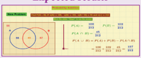

Open the Browser type the URL Link given below (or) Scan the QR Code. Chapter named "Probability" will open. Select the work sheet " Addition law Mutually Exclusive"

In the given worksheet you can change the question by clicking on "New Problem". Click on the check boxes to see the respective answer.

**Step 2**

You can repeat the same steps for other activities

https://www.geogebra.org/m/jfr2zzgy#chapter/359554 or Scan the QR Code.

**Expected results**
