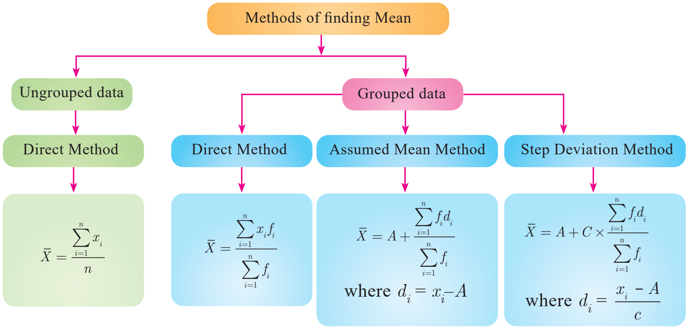
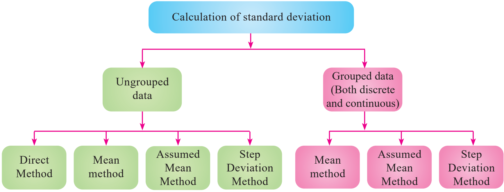
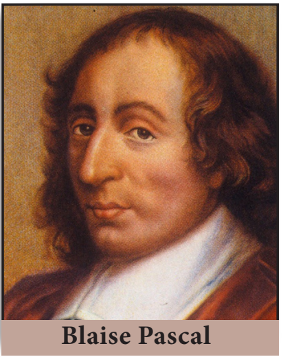
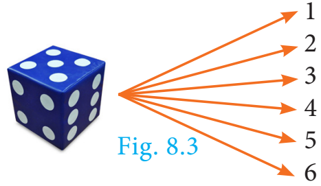
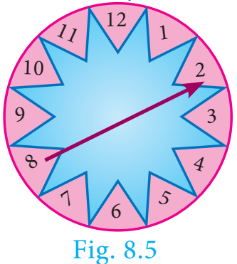
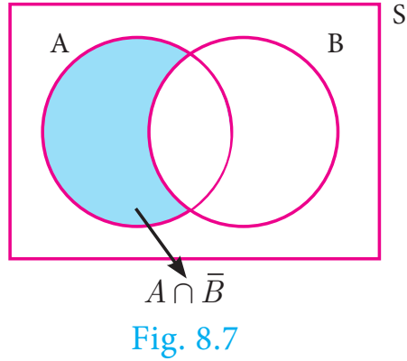
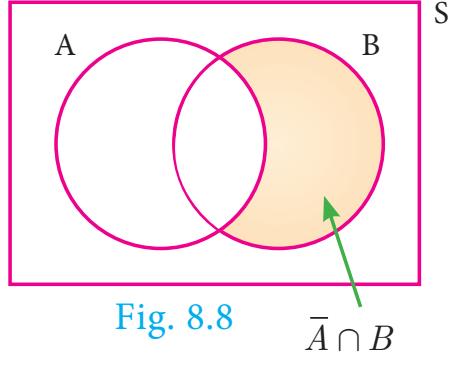
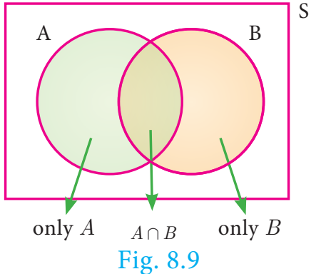

# 8 Statistics and Probability

> “Life is a School of Probability” — Walter Bagehot

Prasanta Chandra Mahalanobis, born at Kolkata, was an Indian statistician who devised a measure of comparison between two data sets. He introduced innovative techniques for conducting large-scale sample surveys and calculated acreages and crop yields by using the method of random sampling. For his pioneering work, he was awarded the Padma Vibhushan, one of India’s highest honours, by the Indian government in 1968 and he is hailed as “Father of Indian Statistics”. The Government of India has designated 29th June every year, coinciding with his birth anniversary, as “National Statistics Day”.

## Learning Outcomes

- To recall the measures of central tendency.
- To recall mean for ungrouped and grouped data.
- To understand the concept of dispersion.
- To understand and compute range, standard deviation, variance and coefficient of variation.
- To understand random experiments, sample space and use of a tree diagram.
- To define and describe different types of events of a random experiment.
- To understand addition theorem of probability and apply it in solving some simple problems.

## 8.1 Introduction

‘STATISTICS’ is derived from the Latin word ‘status’ which means a political state. Today, statistics has become an integral part of everyone’s life, unavoidable whether making a plan for our future, doing a business, a marketing research or preparing economic reports. It is also extensively used in opinion polls, doing advanced research. The study of statistics is concerned with scientific methods for collecting, organising, summarising, presenting, analysing data and making meaningful decisions. In earlier classes we have studied about collection of data, presenting the data in tabular form, graphical form and calculating the Measures of Central Tendency. Now, in this class, let us study about the Measures of Dispersion.

### Recall

##### Measures of Central Tendency

It is often convenient to have one number that represent the whole data. Such a number is called a Measures of Central Tendency.

The Measures of Central Tendency usually will be near to the middle value of the data. For a given data there exist several types of measures of central tendencies.

The most common among them are

- Arithmetic Mean
- Median
- Mode

> **Thinking Corner**
>
> 1. Does the mean, median and mode are same for a given data?
> 2. What is the difference between the arithmetic mean and average?

> **Note**
>
> - **Data:** The numerical representation of facts is called data.
> - **Observation:** Each entry in the data is called an observation.
> - **Variable:** The quantities which are being considered in a survey are called variables. Variables are generally denoted by $x_i$, $i=1,2,3,\ldots,n$.
> - **Frequencies:** The number of times, a variable occurs in a given data is called the frequency of that variable. Frequencies are generally denoted as $f_i$, $i=1,2,3,\ldots,n$.

In this class we have to recall the Arithmetic Mean.

##### Arithmetic Mean

The Arithmetic Mean or Mean of the given values is sum of all the observations divided by the total number of observations. It is denoted by $\bar x$ (pronounced as $x$ bar)

$$
\bar x=\frac{\text{Sum of all the observations}}{\text{Number of observations}}
$$

> **Thinking Corner**
>
> The mean of $n$ observations is $\bar x$, if first term is increased by 1 second term is increased by 2 and so on. What will be the new mean?

We apply the respective formulae depending upon the information provided in the problem.

> **Progress Check**
>
> 1. The sum of all the observations divided by number of observations is _______.
> 2. If the sum of 10 data values is 265 then their mean is _______.
> 3. If the sum and mean of a data are 407 and 11 respectively, then the number of observations in the data are _______.

## 8.2 Measures of Dispersion

The following data provide the runs scored by two batsmen in the last 10 matches.

Batsman A: 25, 20, 45, 93, 8, 14, 32, 87, 72, 4

Batsman B: 33, 50, 47, 38, 45, 40, 36, 48, 37, 26

$$
\text{Mean of Batsman A}=\frac{25+20+45+93+8+14+32+87+72+4}{10}=40
$$

$$
\text{Mean of Batsman B}=\frac{33+50+47+38+45+40+36+48+37+26}{10}=40
$$

The mean of both datas are same (40), but they differ significantly.

From the above diagrams, we see that runs of batsman $B$ are grouped around the mean. But the runs of batsman $A$ are scattered from 0 to 100, though they both have same mean.

Thus, some additional statistical information may be required to determine how the values are spread in data. For this, we shall discuss Measures of Dispersion.

Dispersion is a measure which gives an idea about the scatteredness of the values.

Measures of Variation (or) Dispersion of a data provide idea of how observations spread out (or) scattered throughout the data.

##### Different Measures of Dispersion are

1. Range
2. Mean deviation
3. Quartile deviation
4. Standard deviation
5. Variance
6. Coefficient of Variation

### 8.2.1 Range

The difference between the largest value and the smallest value is called Range.

$$
\text{Range }R=L-S
$$

$$
\text{Coefficient of range}=\frac{L-S}{L+S}
$$

where $L$ - Largest value; $S$ - Smallest value

> **Progress Check**
>
> The range of first 10 prime numbers is _______.

#### Example 8.1

Find the range and coefficient of range of the following data: 25, 67, 48, 53, 18, 39, 44.

**Solution** Largest value $L=67$; Smallest value $S=18$

$$
\text{Range }R=L-S=67-18=49
$$

$$
\text{Coefficient of range}=\frac{L-S}{L+S}
$$

$$
\text{Coefficient of range}=\frac{67-18}{67+18}=\frac{49}{85}=0.576
$$

#### Example 8.2

Find the range of the following distribution.

| Age (in years) | 16–18 | 18–20 | 20–22 | 22–24 | 24–26 | 26–28 |
| --- | --- | --- | --- | --- | --- | --- |
| Number of students | 0 | 4 | 6 | 8 | 2 | 2 |

**Solution** Here Largest value $L=28$

Smallest value $S=16$

$$
\text{Range }R=L-S
$$

$$
R=28-16=12\text{ Years}
$$

> **Note**
>
> If the frequency of initial class is zero, then the next class will be considered for the calculation of range.

#### Example 8.3

The range of a set of data is 13.67 and the largest value is 70.08. Find the smallest value.

**Solution**

$$
\begin{aligned}
\text{Range }R&=13.67\\
\text{Largest value }L&=70.08\\
\text{Range }R&=L-S\\
13.67&=70.08-S\\
S&=70.08-13.67=56.41
\end{aligned}
$$

Therefore, the smallest value is 56.41.

> **Note**
>
> The range of a set of data does not give the clear idea about the dispersion of the data from measures of Central Tendency. For this, we need a measure which depend upon the deviation from the measures of Central Tendency.

### 8.2.2 Deviations from the mean

For a given data with $n$ observations $x_1,x_2,\ldots,x_n$, the deviations from the mean $\bar x$ are $x_1-\bar x$, $x_2-\bar x$, $\ldots$, $x_n-\bar x$.

### 8.2.3 Squares of deviations from the mean

The squares of deviations from the mean $\bar x$ of the observations $x_1,x_2,\ldots,x_n$ are

$$
(x_1-\bar x)^2,(x_2-\bar x)^2,\ldots,(x_n-\bar x)^2\text{ or }\sum_{i=1}^n(x_i-\bar x)^2
$$

> **Note**
>
> We note that $(x_i-\bar x)\ge0$ for all observations $x_i$, $i=1,2,3,\ldots,n$. If the deviations from the mean $(x_i-\bar x)$ are small, then the squares of the deviations will be very small.

### 8.2.4 Variance

The mean of the squares of the deviations from the mean is called Variance. It is denoted by $\sigma^2$ (read as sigma square).

$$
\begin{aligned}
\text{Variance}&=\text{Mean of squares of deviations}\\
&=\frac{(x_1-\bar x)^2+(x_2-\bar x)^2+\cdots+(x_n-\bar x)^2}{n}
\end{aligned}
$$

$$
\text{Variance }\sigma^2=\frac{\sum_{i=1}^n(x_i-\bar x)^2}{n}
$$

> **Thinking Corner**
>
> Can variance be negative?

### 8.2.5 Standard Deviation

The positive square root of Variance is called Standard deviation. That is, standard deviation is the positive square root of the mean of the squares of deviations of the given values from their mean. It is denoted by $\sigma$.

Standard deviation gives a clear idea about how far the values are spreading or deviating from the mean.

$$
\text{Standard deviation }\sigma=\sqrt{\frac{\sum_{i=1}^n(x_i-\bar x)^2}{n}}
$$

> **Do You Know?**
>
> Karl Pearson was the first person to use the word standard deviation. German mathematician Gauss used the word Mean error.

##### Calculation of Standard Deviation for ungrouped data

**(i) Direct Method**

$$
\begin{aligned}
\text{Standard deviation }\sigma&=\sqrt{\frac{\sum(x_i-\bar x)^2}{n}}\\
&=\sqrt{\frac{\sum(x_i^2-2x_i\bar x+\bar x^2)}{n}}\\
&=\sqrt{\frac{\sum x_i^2}{n}-2\bar x\frac{\sum x_i}{n}+\frac{\bar x^2}{n}\times(1+1+\cdots\text{ to }n\text{ times})}\\
&=\sqrt{\frac{\sum x_i^2}{n}-2\bar x\times\bar x+\frac{\bar x^2}{n}\times n}\\
&=\sqrt{\frac{\sum x_i^2}{n}-2\bar x^2+\bar x^2}=\sqrt{\frac{\sum x_i^2}{n}-\bar x^2}
\end{aligned}
$$

$$
\text{Standard deviation, }\sigma=\sqrt{\frac{\sum x_i^2}{n}-\left(\frac{\sum x_i}{n}\right)^2}
$$

> **Note**
>
> The standard deviation and mean have same units in which the data are given.

> **Note**
>
> - While computing standard deviation, arranging data in ascending order is not mandatory.
> - If the data values are given directly then to find standard deviation we can use the formula $\sigma=\sqrt{\dfrac{\sum x_i^2}{n}-\left(\dfrac{\sum x_i}{n}\right)^2}$.
> - If the data values are not given directly but the squares of the deviations from the mean of each observation is given then to find standard deviation we can use the formula $\sigma=\sqrt{\dfrac{\sum(x_i-\bar x)^2}{n}}$.

#### Example 8.4

The number of televisions sold in each day of a week are 13, 8, 4, 9, 7, 12, 10. Find its standard deviation.

**Solution**

| $x_i$ | $x_i^2$ |
| --- | --- |
| 13 | 169 |
| 8 | 64 |
| 4 | 16 |
| 9 | 81 |
| 7 | 49 |
| 12 | 144 |
| 10 | 100 |
| $\sum x_i=63$ | $\sum x_i^2=623$ |

Standard deviation

$$
\begin{aligned}
\sigma&=\sqrt{\frac{\sum x_i^2}{n}-\left(\frac{\sum x_i}{n}\right)^2}\\
&=\sqrt{\frac{623}{7}-\left(\frac{63}{7}\right)^2}\\
&=\sqrt{89-81}=\sqrt8
\end{aligned}
$$

Hence, $\sigma\simeq2.83$

> **Thinking Corner**
>
> Can the standard deviation be more than the variance?

> **Progress Check**
>
> If the variance is 0.49 then the standard deviation is _____.

**(ii) Mean method**

Another convenient way of finding standard deviation is to use the following formula.

$$
\text{Standard deviation (by mean method) }\sigma=\sqrt{\frac{\sum(x_i-\bar x)^2}{n}}
$$

If $d_i=x_i-\bar x$ are the deviations, then $\sigma=\sqrt{\dfrac{\sum d_i^2}{n}}$

#### Example 8.5

The amount of rainfall in a particular season for 6 days are given as 17.8 cm, 19.2 cm, 16.3 cm, 12.5 cm, 12.8 cm and 11.4 cm. Find its standard deviation.

**Solution** Arranging the numbers in ascending order we get, 11.4, 12.5, 12.8, 16.3, 17.8, 19.2. Number of observations $n=6$

$$
\text{Mean}=\frac{11.4+12.5+12.8+16.3+17.8+19.2}{6}=\frac{90}{6}=15
$$

| $x_i$ | $d_i=x_i-\bar x=x-15$ | $d_i^2$ |
| --- | --- | --- |
| 11.4 | $-3.6$ | 12.96 |
| 12.5 | $-2.5$ | 6.25 |
| 12.8 | $-2.2$ | 4.84 |
| 16.3 | 1.3 | 1.69 |
| 17.8 | 2.8 | 7.84 |
| 19.2 | 4.2 | 17.64 |
| | | $\sum d_i^2=51.22$ |

$$
\text{Standard deviation }\sigma=\sqrt{\frac{\sum d_i^2}{n}}=\sqrt{\frac{51.22}{6}}=\sqrt{8.53}
$$

Hence, $\sigma\simeq2.9$

**(iii) Assumed Mean method**

When the mean value is not an integer (since calculations are very tedious in decimal form) then it is better to use the assumed mean method to find the standard deviation.

Let $x_1,x_2,x_3,\ldots,x_n$ be the given data values and let $\bar x$ be their mean.

Let $d_i$ be the deviation of $x_i$ from the assumed mean $A$, which is usually the middle value or near the middle value of the given data.

$$
d_i=x_i-A\text{ gives, }x_i=d_i+A\qquad\cdots(1)
$$

$$
\begin{aligned}
\sum d_i&=\sum(x_i-A)\\
&=\sum x_i-(A+A+A+\cdots\text{ to }n\text{ times})\\
\sum d_i&=\sum x_i-A\times n\\
\frac{\sum d_i}{n}&=\frac{\sum x_i}{n}-A\\
\bar d&=\bar x-A\text{ (or) }\bar x=\bar d+A\qquad\cdots(2)
\end{aligned}
$$

$$
\begin{aligned}
\text{Standard deviation }\sigma&=\sqrt{\frac{\sum(x_i-\bar x)^2}{n}}=\sqrt{\frac{\sum(d_i+A-\bar d-A)^2}{n}}\quad\text{(using (1) and (2))}\\
&=\sqrt{\frac{\sum(d_i-\bar d)^2}{n}}=\sqrt{\frac{\sum(d_i^2-2d_i\times\bar d+\bar d^2)}{n}}\\
&=\sqrt{\frac{\sum d_i^2}{n}-2\bar d\frac{\sum d_i}{n}+\frac{\bar d^2}{n}(1+1+1+\cdots\text{ to }n\text{ times})}\\
&=\sqrt{\frac{\sum d_i^2}{n}-2\bar d\times\bar d+\frac{\bar d^2}{n}\times n}\quad\text{(since }\bar d\text{ is a constant)}\\
&=\sqrt{\frac{\sum d_i^2}{n}-\bar d^2}
\end{aligned}
$$

$$
\text{Standard deviation }\sigma=\sqrt{\frac{\sum d_i^2}{n}-\left(\frac{\sum d_i}{n}\right)^2}
$$

> **Thinking Corner**
>
> For any collection of $n$ values, can you find the value of
>
> (i) $\sum(x_i-\bar x)$ (ii) $(\sum x_i)-\bar x$

#### Example 8.6

The marks scored by 10 students in a class test are 25, 29, 30, 33, 35, 37, 38, 40, 44, 48. Find the standard deviation.

**Solution** The mean of marks is 35.9 which is not an integer. Hence we take assumed mean, $A=35$, $n=10$.

| $x_i$ | $d_i=x_i-A$, $d_i=x_i-35$ | $d_i^2$ |
| --- | --- | --- |
| 25 | $-10$ | 100 |
| 29 | $-6$ | 36 |
| 30 | $-5$ | 25 |
| 33 | $-2$ | 4 |
| 35 | 0 | 0 |
| 37 | 2 | 4 |
| 38 | 3 | 9 |
| 40 | 5 | 25 |
| 44 | 9 | 81 |
| 48 | 13 | 169 |
| | $\sum d_i=9$ | $\sum d_i^2=453$ |

Standard deviation

$$
\begin{aligned}
\sigma&=\sqrt{\frac{\sum d_i^2}{n}-\left(\frac{\sum d_i}{n}\right)^2}\\
&=\sqrt{\frac{453}{10}-\left(\frac9{10}\right)^2}\\
&=\sqrt{45.3-0.81}\\
&=\sqrt{44.49}\\
\sigma&\simeq6.67
\end{aligned}
$$

**(ii) Step deviation method**

Let $x_1,x_2,x_3,\ldots,x_n$ be the given data. Let $A$ be the assumed mean.

Let $c$ be the common divisor of $x_i-A$.

$$
\begin{aligned}
\text{Let }d_i&=\frac{x_i-A}{c}\\
\text{Then }x_i&=d_ic+A\qquad\cdots(1)\\
\sum x_i&=\sum(d_ic+A)=c\sum d_i+A\times n\\
\frac{\sum x_i}{n}&=c\frac{\sum d_i}{n}+A\\
\bar x&=c\bar d+A\qquad\cdots(2)\\
x_i-\bar x&=cd_i+A-c\bar d-A=c(d_i-\bar d)\quad\text{(using (1) and (2))}
\end{aligned}
$$

$$
\sigma=\sqrt{\frac{\sum(x_i-\bar x)^2}{n}}=\sqrt{\frac{\sum(c(d_i-\bar d))^2}{n}}=\sqrt{\frac{c^2\sum(d_i-\bar d)^2}{n}}
$$

$$
\sigma=c\times\sqrt{\frac{\sum d_i^2}{n}-\left(\frac{\sum d_i}{n}\right)^2}
$$

> **Note**
>
> We can use any of the above methods for finding the standard deviation

> **Activity 1**
>
> Find the standard deviation of the marks obtained by you in all five subjects in the quarterly examination and in the midterm test separately. What do you observe from your results.

#### Example 8.7

The amount that the children have spent for purchasing some eatables in one day trip of a school are 5, 10, 15, 20, 25, 30, 35, 40. Using step deviation method, find the standard deviation of the amount they have spent.

**Solution** We note that all the observations are divisible by 5. Hence we can use the step deviation method. Let the Assumed mean $A=20$, $n=8$.

| $x_i$ | $d_i=x_i-A$, $d_i=x_i-20$ | $d_i=\frac{x_i-A}{c}$, $c=5$ | $d_i^2$ |
|---|---|---|---|
| 5 | −15 | −3 | 9 |
| 10 | −10 | −2 | 4 |
| 15 | −5 | −1 | 1 |
| 20 | 0 | 0 | 0 |
| 25 | 5 | 1 | 1 |
| 30 | 10 | 2 | 4 |
| 35 | 15 | 3 | 9 |
| 40 | 20 | 4 | 16 |
| | | $\sum d_i=4$ | $\sum d_i^2=44$ |

Standard deviation

$$
\sigma=\sqrt{\frac{\sum d_i^2}{n}-\left(\frac{\sum d_i}{n}\right)^2}\times c
$$

$$
=\sqrt{\frac{44}{8}-\left(\frac{4}{8}\right)^2}\times5=\sqrt{\frac{11}{2}-\frac14}\times5
$$

$$
=\sqrt{5.5-0.25}\times5=2.29\times5
$$

$$
\sigma\simeq11.45
$$

#### Example 8.8

Find the standard deviation of the following data 7, 4, 8, 10, 11. Add 3 to all the values then find the standard deviation for the new values.

**Solution** Arranging the values in ascending order we get, 4, 7, 8, 10, 11 and $n=5$.

| $x_i$ | $x_i^2$ |
|---|---|
| 4 | 16 |
| 7 | 49 |
| 8 | 64 |
| 10 | 100 |
| 11 | 121 |
| $\sum x_i=40$ | $\sum x_i^2=350$ |

Standard deviation

$$
\sigma=\sqrt{\frac{\sum x_i^2}{n}-\left(\frac{\sum x_i}{n}\right)^2}
=\sqrt{\frac{350}{5}-\left(\frac{40}{5}\right)^2}
$$

$$
\sigma=\sqrt6\simeq2.45
$$

When we add 3 to all the values, we get the new values as 7, 10, 11, 13, 14.

| $x_i$ | $x_i^2$ |
|---|---|
| 7 | 49 |
| 10 | 100 |
| 11 | 121 |
| 13 | 169 |
| 14 | 196 |
| $\sum x_i=55$ | $\sum x_i^2=635$ |

Standard deviation

$$
\sigma=\sqrt{\frac{\sum x_i^2}{n}-\left(\frac{\sum x_i}{n}\right)^2}
=\sqrt{\frac{635}{5}-\left(\frac{55}{5}\right)^2}
$$

$$
\sigma=\sqrt6\simeq2.45
$$

> We see that the standard deviation will not change when we add some fixed constant $k$ to all the values.

#### Example 8.9

Find the standard deviation of the data 2, 3, 5, 7, 8. Multiply each data by 4. Find the standard deviation of the new values.

**Solution** Given, $n=5$.

| $x_i$ | $x_i^2$ |
|---|---|
| 2 | 4 |
| 3 | 9 |
| 5 | 25 |
| 7 | 49 |
| 8 | 64 |
| $\sum x_i=25$ | $\sum x_i^2=151$ |

Standard deviation

$$
\sigma=\sqrt{\frac{\sum x_i^2}{n}-\left(\frac{\sum x_i}{n}\right)^2}
$$

$$
\sigma=\sqrt{\frac{151}{5}-\left(\frac{25}{5}\right)^2}=\sqrt{30.2-25}=\sqrt{5.2}\simeq2.28
$$

When we multiply each data by 4, we get the new values as 8, 12, 20, 28, 32.

| $x_i$ | $x_i^2$ |
|---|---|
| 8 | 64 |
| 12 | 144 |
| 20 | 400 |
| 28 | 784 |
| 32 | 1024 |
| $\sum x_i=100$ | $\sum x_i^2=2416$ |

Standard deviation

$$
\sigma=\sqrt{\frac{\sum x_i^2}{n}-\left(\frac{\sum x_i}{n}\right)^2}
=\sqrt{\frac{2416}{5}-\left(\frac{100}{5}\right)^2}=\sqrt{483.2-400}=\sqrt{83.2}
$$

$$
\sigma=\sqrt{16\times5.2}=4\sqrt{5.2}\simeq9.12
$$

> We see that when we multiply each data by some fixed constant $k$ the standard deviation also get multiplied by $k$.

#### Example 8.10

Find the mean and variance of the first $n$ natural numbers.

**Solution**

$$
\text{Mean }\bar{x}=\frac{\text{Sum of all the observations}}{\text{Number of observations}}
$$

$$
=\frac{\sum x_i}{n}=\frac{1+2+3+\cdots+n}{n}=\frac{n(n+1)}{2\times n}
$$

$$
\text{Mean }\bar{x}=\frac{n+1}{2}
$$

$$
\text{Variance }\sigma^2=\frac{\sum x_i^2}{n}-\left(\frac{\sum x_i}{n}\right)^2
$$

$$
\left[\sum x_i^2=1^2+2^2+3^2+\cdots+n^2,\quad(\sum x_i)^2=(1+2+3+\cdots+n)^2\right]
$$

$$
=\frac{n(n+1)(2n+1)}{6\times n}-\left[\frac{n(n+1)}{2\times n}\right]^2
$$

$$
=\frac{2n^2+3n+1}{6}-\frac{n^2+2n+1}{4}
$$

$$
\text{Variance }\sigma^2=\frac{4n^2+6n+2-3n^2-6n-3}{12}=\frac{n^2-1}{12}.
$$

##### Calculation of Standard deviation for grouped data

**(i) Mean method**

$$
\text{Standard deviation }\sigma=\sqrt{\frac{\sum f_i(x_i-\bar{x})^2}{N}}
$$

$$
d_i=x_i-\bar{x}
$$

$$
\sigma=\sqrt{\frac{\sum f_id_i^2}{N}},\quad\text{where, }N=\sum_{i=1}^{n}f_i
$$

> ($f_i$ are frequency values of the corresponding data points $x_i$)

#### Example 8.11

48 students were asked to write the total number of hours per week they spent on watching television. With this information find the standard deviation of hours spent for watching television.

| $x$ | 6 | 7 | 8 | 9 | 10 | 11 | 12 |
|---|---|---|---|---|---|---|---|
| $f$ | 3 | 6 | 9 | 13 | 8 | 5 | 4 |

**Solution**

| $x_i$ | $f_i$ | $x_if_i$ | $d_i=x_i-\bar{x}$ | $d_i^2$ | $f_id_i^2$ |
|---|---|---|---|---|---|
| 6 | 3 | 18 | −3 | 9 | 27 |
| 7 | 6 | 42 | −2 | 4 | 24 |
| 8 | 9 | 72 | −1 | 1 | 9 |
| 9 | 13 | 117 | 0 | 0 | 0 |
| 10 | 8 | 80 | 1 | 1 | 8 |
| 11 | 5 | 55 | 2 | 4 | 20 |
| 12 | 4 | 48 | 3 | 9 | 36 |
| | $N=48$ | $\sum x_if_i=432$ | $\sum d_i=0$ | | $\sum f_id_i^2=124$ |

Mean

$$
\bar{x}=\frac{\sum x_if_i}{N}=\frac{432}{48}=9\quad(\because N=\sum f_i)
$$

Standard deviation

$$
\sigma=\sqrt{\frac{\sum f_id_i^2}{N}}=\sqrt{\frac{124}{48}}=\sqrt{2.58}
$$

$$
\sigma\simeq1.6
$$

**(ii) Assumed Mean method**

Let $x_1,x_2,x_3,\ldots x_n$ be the given data with frequencies $f_1,f_2,f_3,\ldots f_n$ respectively. Let $\bar{x}$ be their mean and $A$ be the assumed mean.

$$
d_i=x_i-A
$$

$$
\text{Standard deviation, }\sigma=\sqrt{\frac{\sum f_id_i^2}{N}-\left(\frac{\sum f_id_i}{N}\right)^2}
$$

#### Example 8.12

The marks scored by the students in a slip test are given below. Find the standard deviation of their marks.

| $x$ | 4 | 6 | 8 | 10 | 12 |
|---|---|---|---|---|---|
| $f$ | 7 | 3 | 5 | 9 | 5 |

**Solution** Let the assumed mean, $A=8$.

| $x_i$ | $f_i$ | $d_i=x_i-A$ | $f_id_i$ | $f_id_i^2$ |
|---|---|---|---|---|
| 4 | 7 | −4 | −28 | 112 |
| 6 | 3 | −2 | −6 | 12 |
| 8 | 5 | 0 | 0 | 0 |
| 10 | 9 | 2 | 18 | 36 |
| 12 | 5 | 4 | 20 | 80 |
| | $N=29$ | | $\sum f_id_i=4$ | $\sum f_id_i^2=240$ |

Standard deviation

$$
\sigma=\sqrt{\frac{\sum f_id_i^2}{N}-\left(\frac{\sum f_id_i}{N}\right)^2}
$$

$$
=\sqrt{\frac{240}{29}-\left(\frac{4}{29}\right)^2}=\sqrt{\frac{240\times29-16}{29\times29}}
$$

$$
\sigma=\sqrt{\frac{6944}{29\times29}}\Rightarrow\sigma\simeq2.87
$$

##### Calculation of Standard deviation for continuous frequency distribution

**(i) Mean method**

$$
\text{Standard deviation }\sigma=\sqrt{\frac{\sum f_i(x_i-\bar{x})^2}{N}}
$$

where, $x_i=$ Middle value of the $i$th class. $f_i=$ Frequency of the $i$th class.

**(ii) Shortcut method (or) Step deviation method**

To make the calculation simple, we provide the following formula. Let $A$ be the assumed mean, $x_i$ be the middle value of the $i$th class and $c$ is the width of the class interval.

$$
d_i=\frac{x_i-A}{c}
$$

$$
\sigma=c\times\sqrt{\frac{\sum f_id_i^2}{N}-\left(\frac{\sum f_id_i}{N}\right)^2}
$$

#### Example 8.13

Marks of the students in a particular subject of a class are given below. Find its standard deviation.

| Marks | 0–10 | 10–20 | 20–30 | 30–40 | 40–50 | 50–60 | 60–70 |
|---|---|---|---|---|---|---|---|
| Number of students | 8 | 12 | 17 | 14 | 9 | 7 | 4 |

**Solution** Let the assumed mean, $A=35$, $c=10$.

| Marks | Mid value $(x_i)$ | $f_i$ | $d_i=x_i-A$ | $d_i=\frac{x_i-A}{c}$ | $f_id_i$ | $f_id_i^2$ |
|---|---|---|---|---|---|---|
| 0–10 | 5 | 8 | −30 | −3 | −24 | 72 |
| 10–20 | 15 | 12 | −20 | −2 | −24 | 48 |
| 20–30 | 25 | 17 | −10 | −1 | −17 | 17 |
| 30–40 | 35 | 14 | 0 | 0 | 0 | 0 |
| 40–50 | 45 | 9 | 10 | 1 | 9 | 9 |
| 50–60 | 55 | 7 | 20 | 2 | 14 | 28 |
| 60–70 | 65 | 4 | 30 | 3 | 12 | 36 |
| | | $N=71$ | | | $\sum f_id_i=-30$ | $\sum f_id_i^2=210$ |

$$
\text{Standard deviation }\sigma=c\times\sqrt{\frac{\sum f_id_i^2}{N}-\left(\frac{\sum f_id_i}{N}\right)^2}
$$

$$
\sigma=10\times\sqrt{\frac{210}{71}-\left(-\frac{30}{71}\right)^2}=10\times\sqrt{\frac{210}{71}-\frac{900}{5041}}
$$

$$
=10\times\sqrt{2.779};\quad\sigma\simeq16.67
$$

> **Thinking Corner**
>
> 1. The standard deviation of a data is 2.8, if 5 is added to all the data values then the new standard deviation is ___.
> 2. If $S$ is the standard deviation of values $p,q,r$ then standard deviation of $p-3,q-3,r-3$ is ___.

#### Example 8.14

The mean and standard deviation of 15 observations are found to be 10 and 5 respectively. On rechecking it was found that one of the observation with value 8 was incorrect. Calculate the correct mean and standard deviation if the correct observation value was 23?

**Solution** $n=15$, $\bar{x}=10$, $\sigma=5$;

$$
\bar{x}=\frac{\sum x}{n};\quad\sum x=15\times10=150
$$

Wrong observation value $=8$, Correct observation value $=23$.

$$
\text{Correct total}=150-8+23=165
$$

$$
\text{Correct mean }\bar{x}=\frac{165}{15}=11
$$

$$
\text{Standard deviation }\sigma=\sqrt{\frac{\sum x^2}{n}-\left(\frac{\sum x}{n}\right)^2}
$$

$$
\text{Incorrect value of }\sigma=5=\sqrt{\frac{\sum x^2}{15}-(10)^2}
$$

$$
25=\frac{\sum x^2}{15}-100\Rightarrow\frac{\sum x^2}{15}=125
$$

$$
\text{Incorrect value of }\sum x^2=1875
$$

$$
\text{Correct value of }\sum x^2=1875-8^2+23^2=2340
$$

$$
\text{Correct standard deviation }\sigma=\sqrt{\frac{2340}{15}-(11)^2}
$$

$$
\sigma=\sqrt{156-121}=\sqrt{35}\quad\sigma\simeq5.9
$$

### Exercise 8.1

1. Find the range and coefficient of range of the following data.

   (i) 63, 89, 98, 125, 79, 108, 117, 68

   (ii) 43.5, 13.6, 18.9, 38.4, 61.4, 29.8

2. If the range and the smallest value of a set of data are 36.8 and 13.4 respectively, then find the largest value.

3. Calculate the range of the following data.

   | Income | 400–450 | 450–500 | 500–550 | 550–600 | 600–650 |
   |---|---|---|---|---|---|
   | Number of workers | 8 | 12 | 30 | 21 | 6 |

4. A teacher asked the students to complete 60 pages of a record note book. Eight students have completed only 32, 35, 37, 30, 33, 36, 35 and 37 pages. Find the standard deviation of the pages completed by them.

5. Find the variance and standard deviation of the wages of 9 workers given below: ₹310, ₹290, ₹320, ₹280, ₹300, ₹290, ₹320, ₹310, ₹280.

6. A wall clock strikes the bell once at 1 o’ clock, 2 times at 2 o’ clock, 3 times at 3 o’ clock and so on. How many times will it strike in a particular day. Find the standard deviation of the number of strikes the bell make a day.

7. Find the standard deviation of first 21 natural numbers.

8. If the standard deviation of a data is 4.5 and if each value of the data is decreased by 5, then find the new standard deviation.

9. If the standard deviation of a data is 3.6 and each value of the data is divided by 3, then find the new variance and new standard deviation.

10. The rainfall recorded in various places of five districts in a week are given below. Find its standard deviation.

    | Rainfall (in mm) | 45 | 50 | 55 | 60 | 65 | 70 |
    |---|---|---|---|---|---|---|
    | Number of places | 5 | 13 | 4 | 9 | 5 | 4 |

11. In a study about viral fever, the number of people affected in a town were noted as Find its standard deviation.

    | Age in years | 0–10 | 10–20 | 20–30 | 30–40 | 40–50 | 50–60 | 60–70 |
    |---|---|---|---|---|---|---|---|
    | Number of people affected | 3 | 5 | 16 | 18 | 12 | 7 | 4 |

12. The measurements of the diameters (in cms) of the plates prepared in a factory are given below. Find its standard deviation.

    | Diameter (cm) | 21–24 | 25–28 | 29–32 | 33–36 | 37–40 | 41–44 |
    |---|---|---|---|---|---|---|
    | Number of plates | 15 | 18 | 20 | 16 | 8 | 7 |

13. The time taken by 50 students to complete a 100 meter race are given below. Find its standard deviation.

    | Time taken (sec) | 8.5–9.5 | 9.5–10.5 | 10.5–11.5 | 11.5–12.5 | 12.5–13.5 |
    |---|---|---|---|---|---|
    | Number of students | 6 | 8 | 17 | 10 | 9 |

14. For a group of 100 candidates the mean and standard deviation of their marks were found to be 60 and 15 respectively. Later on it was found that the scores 45 and 72 were wrongly entered as 40 and 27. Find the correct mean and standard deviation.

15. The mean and variance of seven observations are 8 and 16 respectively. If five of these are 2, 4, 10, 12 and 14, then find the remaining observations.

## 8.3 Coefficient of Variation

Comparison of two data in terms of measures of central tendencies and dispersions in some cases will not be meaningful, because the variables in the data may not have same units of measurement.

For example consider the two data

| | Weight | Price |
|---|---|---|
| Mean | 8 kg | ₹85 |
| Standard deviation | 1.5 kg | ₹21.60 |

Here we cannot compare the standard deviations 1.5kg and ₹21.60. For comparing two or more data for corresponding changes the relative measure of standard deviation, called “Coefficient of variation” is used.

Coefficient of variation of a data is obtained by dividing the standard deviation by the arithmetic mean. It is usually expressed in terms of percentage. This concept is suggested by one of the most prominent Statistician Karl Pearson.

$$
\text{Thus, coefficient of variation of first data }(\mathrm{C.V.}_1)=\frac{\sigma_1}{\bar{x}_1}\times100\%
$$

$$
\text{coefficient of variation of second data }(\mathrm{C.V.}_2)=\frac{\sigma_2}{\bar{x}_2}\times100\%
$$

> The data with lesser coefficient of variation is more consistent or stable than the other data.

Consider the two data

| | | | | | | |
|---|---|---|---|---|---|---|
| A | 500 | 900 | 800 | 900 | 700 | 400 |
| B | 300 | 540 | 480 | 540 | 420 | 240 |

| | Mean | Standard deviation |
|---|---|---|
| A | 700 | 191.5 |
| B | 420 | 114.9 |

If we compare the mean and standard deviation of the two data, we think that the two datas are entirely different. But mean and standard deviation of $B$ are 60% of that of $A$. Because of the smaller mean the smaller standard deviation led to the misinterpretation.

$$
\text{To compare the dispersion of two data, coefficient of variation}=\frac{\sigma}{\bar{x}}\times100\%
$$

$$
\text{The coefficient of variation of }A=\frac{191.5}{700}\times100\%=27.4\%
$$

$$
\text{The coefficient of variation of }B=\frac{114.9}{420}\times100\%=27.4\%
$$

Thus the two data have equal coefficient of variation. Since the data have equal coefficient of variation values, we can conclude that one data depends on the other. But the data values of $B$ are exactly 60% of the corresponding data values of $A$. So they are very much related. Thus, we get a confusing situation.

To get clear picture of the given data, we can find their coefficient of variation. This is why we need coefficient of variation.

> **Progress Check**
>
> 1. Coefficient of variation is a relative measure of ________.
> 2. When the standard deviation is divided by the mean we get ________.
> 3. The coefficient of variation depends upon ________ and ________.
> 4. If the mean and standard deviation of a data are 8 and 2 respectively then the coefficient of variation is ________.
> 5. When comparing two data, the data with ________ coefficient of variation is inconsistent.

#### Example 8.15

The mean of a data is 25.6 and its coefficient of variation is 18.75. Find the standard deviation.

**Solution** Mean $\bar{x}=25.6$, Coefficient of variation, C.V. $=18.75$.

$$
\text{Coefficient of variation, C.V.}=\frac{\sigma}{\bar{x}}\times100\%
$$

$$
18.75=\frac{\sigma}{25.6}\times100\Rightarrow\sigma=4.8
$$

#### Example 8.16

The following table gives the values of mean and variance of heights and weights of the 10th standard students of a school.

| | Height | Weight |
|---|---|---|
| **Mean** | 155 cm | 46.50 kg |
| **Variance** | 72.25 cm$^2$ | 28.09 kg |

Which is more varying than the other?

**Solution** For comparing two data, first we have to find their coefficient of variations.

Mean $\bar{x}_1=155$cm, variance $\sigma_1^2=72.25\text{ cm}^2$.

Therefore standard deviation $\sigma_1=8.5$.

$$
\text{Coefficient of variation }\mathrm{C.V.}_1=\frac{\sigma_1}{\bar{x}_1}\times100\%
$$

$$
\mathrm{C.V.}_1=\frac{8.5}{155}\times100\%=5.48\%\quad\text{(for heights)}
$$

Mean $\bar{x}_2=46.50\text{ kg}$, Variance $\sigma_2^2=28.09\text{ kg}^2$.

Standard deviation $\sigma_2=5.3\text{ kg}$.

$$
\text{Coefficient of variation }\mathrm{C.V.}_2=\frac{\sigma_2}{\bar{x}_2}\times100\%
$$

$$
\mathrm{C.V.}_2=\frac{5.3}{46.50}\times100\%=11.40\%\quad\text{(for weights)}
$$

$$
\mathrm{C.V.}_1=5.48\%\text{ and }\mathrm{C.V.}_2=11.40\%
$$

Height is more consistent.

### Exercise 8.2

1. The standard deviation and mean of a data are 6.5 and 12.5 respectively. Find the coefficient of variation.

2. The standard deviation and coefficient of variation of a data are 1.2 and 25.6 respectively. Find the value of mean.

3. If the mean and coefficient of variation of a data are 15 and 48 respectively, then find the value of standard deviation.

4. If $n=5$, $\bar{x}=6$, $\sum x^2=765$, then calculate the coefficient of variation.

5. Find the coefficient of variation of 24, 26, 33, 37, 29, 31.

6. The time taken (in minutes) to complete a homework by 8 students in a day are given by 38, 40, 47, 44, 46, 43, 49, 53. Find the coefficient of variation.

7. The total marks scored by two students Sathya and Vidhya in 5 subjects are 460 and 480 with standard deviation 4.6 and 2.4 respectively. Who is more consistent in performance?

8. The mean and standard deviation of marks obtained by 40 students of a class in three subjects Mathematics, Science and Social Science are given below.

   | Subject | Mean | SD |
   |---|---|---|
   | Mathematics | 56 | 12 |
   | Science | 65 | 14 |
   | Social Science | 60 | 10 |

   Which of the three subjects shows more consistent and which shows less consistent in marks?

## 8.4 Probability

Few centuries ago, gambling and gaming were considered to be fashionable and became widely popular among many men. As the games became more complicated, players were interested in knowing the chances of winning or losing a game from a given situation. In 1654, Chevalier de Mere, a French nobleman with a taste of gambling, wrote a letter to one of the prominent mathematician of the time, Blaise Pascal, seeking his advice about how much dividend he would get for a gambling game played by paying money. Pascal worked this problem mathematically but thought of sharing this problem and see how his good friend and mathematician Pierre de Fermat could solve. Their subsequent correspondences on the issue represented the birth of Probability Theory as a new branch of mathematics.

##### Random Experiment

A random experiment is an experiment in which

(i) The set of all possible outcomes are known

(ii) Exact outcome is not known.

**Example:** 1. Tossing a coin. 2. Rolling a die.

##### Sample space

The set of all possible outcomes in a random experiment is called a sample space. It is generally denoted by $S$.

**Example:** When we roll a die, the possible outcomes are the face numbers 1, 2, 3, 4, 5, 6 of the die. Therefore the sample space is $S=\{1,2,3,4,5,6\}$.

**Sample point** Each element of a sample space is called a sample point.

### 8.4.1 Tree diagram

Tree diagram allow us to see visually all possible outcomes of an random experiment. Each branch in a tree diagram represent a possible outcome.

##### Illustration

(i) When we throw a die, then from the tree diagram (Fig.8.3), the sample space can be written as $S=\{1,2,3,4,5,6\}$.

(ii) When we toss two coins, then from the tree diagram (Fig.8.4), the sample space can be written as $S=\{HH,HT,TH,TT\}$.

> **Progress Check**
>
> 1. An experiment in which a particular outcome cannot be predicted is called ________.
> 2. The set of all possible outcomes is called ________.

#### Example 8.17

Express the sample space for rolling two dice using tree diagram.

**Solution** When we roll two dice, since each die contain 6 faces marked with 1, 2, 3, 4, 5, 6 the tree diagram will look like

Hence, the sample space can be written as

$$
S=\left\{\begin{array}{l}
(1,1),(1,2),(1,3),(1,4),(1,5),(1,6),\\
(2,1),(2,2),(2,3),(2,4),(2,5),(2,6),\\
(3,1),(3,2),(3,3),(3,4),(3,5),(3,6),\\
(4,1),(4,2),(4,3),(4,4),(4,5),(4,6),\\
(5,1),(5,2),(5,3),(5,4),(5,5),(5,6),\\
(6,1),(6,2),(6,3),(6,4),(6,5),(6,6)
\end{array}\right\}
$$

**Event:** In a random experiment, each possible outcome is called an event. Thus, an event will be a subset of the sample space.

**Example:** Getting two heads when we toss two coins is an event.

**Trial:** Performing an experiment once is called a trial.

**Example:** When we toss a coin thrice, then each toss of a coin is a trial.

| Events | Explanation | Example |
|---|---|---|
| Equally likely events | Two or more events are said to be equally likely if each one of them has an equal chance of occurring. | Head and tail are equally likely events in tossing a coin. |
| Certain events | In an experiment, the event which surely occur is called certain event. | When we roll a die, the event of getting any natural number from one to six is a certain event. |
| Impossible events | In an experiment if an event has no scope to occur then it is called an impossible event. | When we toss two coins, the event of getting three heads is an impossible event. |
| Mutually exclusive events | Two or more events are said to be mutually exclusive if they don't have common sample points. i.e., events $A$, $B$ are said to be mutually exclusive if $A\cap B=\phi$. | When we roll a die the events of getting odd numbers and even numbers are mutually exclusive events. |
| Exhaustive events | The collection of events whose union is the whole sample space are called exhaustive events. | When we toss a coin twice, the collection of events of getting two heads, exactly one head, no head are exhaustive events. |
| Complementary events | The complement of an event $A$ is the event representing collection of sample points not in $A$. It is denoted $A'$ or $A^c$ or $\overline A$. The event $A$ and its complement $A'$ are mutually exclusive and exhaustive. | When we roll a die, the event 'rolling a 5 or 6' and the event of rolling a 1, 2, 3 or 4 are complementary events. |

> **Note**
>
> **Elementary event:** If an event $E$ consists of only one outcome then it is called an elementary event.

> **Do You Know?**
>
> In 1713, Bernoulli was the first to recognise the wide-range applicability of probability in fields outside gambling

### 8.4.2 Probability of an Event

In a random experiment, let $S$ be the sample space and $E\subseteq S$. Then if $E$ is an event, the probability of occurrence of $E$ is defined as

$$
P(E)=\frac{\text{Number of outcomes favourable to occurrence of }E}{\text{Number of all possible outcomes}}=\frac{n(E)}{n(S)}
$$

This way of defining the probability is applicable only to finite sample spaces. So in this chapter, we will be dealing problems only with finite sample spaces.

> **Note**
>
> - $P(E)=\dfrac{n(E)}{n(S)}$
> - $P(S)=\dfrac{n(S)}{n(S)}=1$. The probability of sure event is 1.
> - $P(\phi)=\dfrac{n(\phi)}{n(s)}=\dfrac{0}{n(s)}=0$. The probability of impossible event is 0.
> - Since $E$ is a subset of $S$ and $\phi$ is a subset of any set,
>
>  $$
>  \phi\subseteq E\subseteq S
>  $$
>
>  $$
>  P(\phi)\leq P(E)\leq P(S)
>  $$
>
>  $$
>  0\leq P(E)\leq1
>  $$
>
>  Therefore, the probability value always lies from 0 to 1.
> - The complement event of $E$ is $\overline E$.
>
>  Let $P(E)=\dfrac mn$ (where $m$ is the number of favourable outcomes of $E$ and $n$ is the total number of possible outcomes).
>
>  $$
>  P(\overline E)=\frac{\text{Number of outcomes unfavourable to occurrence of }E}{\text{Number of all possible outcomes}}
>  $$
>
>  $$
>  P(\overline E)=\frac{n-m}{n}=1-\frac mn
>  $$
>
>  $$
>  P(\overline E)=1-P(E)
>  $$
>
>  
>
> - $P(E)+P(\overline E)=1$

> **Progress Check**
>
> Which of the following values cannot be a probability of an event?
>
> (a) $-0.0001$　(b) $0.5$　(c) $1.001$　(d) $1$
>
> (e) $20\%$　(f) $0.253$　(g) $\dfrac{1-\sqrt5}{2}$　(h) $\dfrac{\sqrt3+1}{4}$

#### Example 8.18

A bag contains 5 blue balls and 4 green balls. A ball is drawn at random from the bag. Find the probability that the ball drawn is (i) blue (ii) not blue.

**Solution**

Total number of possible outcomes $n(S)=5+4=9$

(i) Let $A$ be the event of getting a blue ball.

Number of favourable outcomes for the event $A$. Therefore, $n(A)=5$

Probability that the ball drawn is blue. Therefore,

$$
P(A)=\frac{n(A)}{n(S)}=\frac59
$$

(ii) $\overline A$ will be the event of not getting a blue ball. So

$$
P(\overline A)=1-P(A)=1-\frac59=\frac49
$$

#### Example 8.19

Two dice are rolled. Find the probability that the sum of outcomes is (i) equal to 4 (ii) greater than 10 (iii) less than 13

**Solution**

When we roll two dice, the sample space is given by

$$
\begin{aligned}
S=\{&(1,1),(1,2),(1,3),(1,4),(1,5),(1,6),\\
&(2,1),(2,2),(2,3),(2,4),(2,5),(2,6),\\
&(3,1),(3,2),(3,3),(3,4),(3,5),(3,6),\\
&(4,1),(4,2),(4,3),(4,4),(4,5),(4,6),\\
&(5,1),(5,2),(5,3),(5,4),(5,5),(5,6),\\
&(6,1),(6,2),(6,3),(6,4),(6,5),(6,6)\};\quad n(S)=36
\end{aligned}
$$

(i) Let $A$ be the event of getting the sum of outcome values equal to 4.

Then $A=\{(1,3),(2,2),(3,1)\}$; $n(A)=3$.

Probability of getting the sum of outcomes equal to 4 is

$$
P(A)=\frac{n(A)}{n(S)}=\frac3{36}=\frac1{12}
$$

(ii) Let $B$ be the event of getting the sum of outcome values greater than 10.

Then $B=\{(5,6),(6,5),(6,6)\}$; $n(B)=3$

Probability of getting the sum of outcomes greater than 10 is

$$
P(B)=\frac{n(B)}{n(S)}=\frac3{36}=\frac1{12}
$$

(iii) Let $C$ be the event of getting the sum of outcomes less than 13. Here all the outcomes have the sum value less than 13. Hence $C=S$.

Therefore, $n(C)=n(S)=36$

Probability of getting the total value less than 13 is

$$
P(C)=\frac{n(C)}{n(S)}=\frac{36}{36}=1.
$$

#### Example 8.20

Two coins are tossed together. What is the probability of getting different faces on the coins?

**Solution**

When two coins are tossed together, the sample space is

$$
S=\{HH,HT,TH,TT\};\quad n(S)=4
$$

Let $A$ be the event of getting different faces on the coins.

$$
A=\{HT,TH\};\qquad n(A)=2
$$

Probability of getting different faces on the coins is

$$
P(A)=\frac{n(A)}{n(S)}=\frac24=\frac12
$$

#### Example 8.21

What is the probability that a leap year selected at random will contain 53 saturdays.

**Solution**

A leap year has 366 days. So it has 52 full weeks and 2 days. 52 Saturdays must be in 52 full weeks.

The possible chances for the remaining two days will be the sample space.

$$
S=\{\text{Sun-Mon, Mon-Tue, Tue-Wed, Wed-Thu, Thu-Fri, Fri-Sat, Sat-Sun}\}
$$

$$
n(S)=7
$$

Let $A$ be the event of getting $53^{\text{rd}}$ Saturday.

Then $A=\{\text{Fri-Sat, Sat-Sun}\}$; $n(A)=2$

> **Thinking Corner**
>
> What will be the probability that a non-leap year will have 53 Saturdays?

Probability of getting 53 Saturdays in a leap year is

$$
P(A)=\frac{n(A)}{n(S)}=\frac27
$$

#### Example 8.22

A die is rolled and a coin is tossed simultaneously. Find the probability that the die shows an odd number and the coin shows a head.

**Solution**

Sample space

$$
S=\{1H,1T,2H,2T,3H,3T,4H,4T,5H,5T,6H,6T\};
$$

$$
n(S)=12
$$

Let $A$ be the event of getting an odd number and a head.

$$
A=\{1H,3H,5H\};\quad n(A)=3
$$

$$
P(A)=\frac{n(A)}{n(S)}=\frac3{12}=\frac14
$$

> **Activity 3**
>
> There are three routes $R_1$, $R_2$ and $R_3$ from Madhu's home to her place of work. There are four parking lots $P_1$, $P_2$, $P_3$, $P_4$ and three entrances $B_1$, $B_2$, $B_3$ into the office building. There are two elevators $E_1$ and $E_2$ to her floor. Using the tree diagram explain how many ways she can reach her office?

> **Activity 4**
>
> Collect the details and find the probabilities of
>
> (i) selecting a boy from your class.
>
> (ii) selecting a girl from your class.
>
> (iii) selecting a student from tenth standard in your school.
>
> (iv) selecting a boy from tenth standard in your school.
>
> (v) selecting a girl from tenth standard in your school.

#### Example 8.23

A bag contains 6 green balls, some black and red balls. Number of black balls is as twice as the number of red balls. Probability of getting a green ball is thrice the probability of getting a red ball. Find (i) number of black balls (ii) total number of balls.

**Solution**

Number of green balls is $n(G)=6$

Let number of red balls is $n(R)=x$

Therefore, number of black balls is $n(B)=2x$

Total number of balls $n(S)=6+x+2x=6+3x$

It is given that, $P(G)=3\times P(R)$

$$
\frac6{6+3x}=3\times\frac{x}{6+3x}
$$

$3x=6$ gives, $x=2$

(i) Number of black balls $=2\times2=4$

(ii) Total number of balls $=6+(3\times2)=12$

#### Example 8.24

A game of chance consists of spinning an arrow which is equally likely to come to rest pointing to one of the numbers 1, 2, 3, ...12. What is the probability that it will point to (i) 7 (ii) a prime number (iii) a composite number?

**Solution**

Sample space $S=\{1,2,3,4,5,6,7,8,9,10,11,12\}$; $n(S)=12$

(i) Let $A$ be the event of resting in 7. $n(A)=1$

$$
P(A)=\frac{n(A)}{n(S)}=\frac1{12}
$$

(ii) Let $B$ be the event that the arrow will come to rest in a prime number.

$$
B=\{2,3,5,7,11\};\quad n(B)=5
$$

$$
P(B)=\frac{n(B)}{n(S)}=\frac5{12}
$$

(iii) Let $C$ be the event that arrow will come to rest in a composite number.

$$
C=\{4,6,8,9,10,12\};\quad n(C)=6
$$

$$
P(C)=\frac{n(C)}{n(S)}=\frac6{12}=\frac12
$$

> **Thinking Corner**
>
> What is the complement event of an impossible event?

### Exercise 8.3

1. Write the sample space for tossing three coins using tree diagram.

2. Write the sample space for selecting two balls at a time from a bag containing 6 balls numbered 1 to 6 (using tree diagram).

3. If $A$ is an event of a random experiment such that $P(A):P(\overline A)=17:15$ and $n(S)=640$ then find (i) $P(\overline A)$ (ii) $n(A)$.

4. A coin is tossed thrice. What is the probability of getting two consecutive tails?

5. At a fete, cards bearing numbers 1 to 1000, one number on one card are put in a box. Each player selects one card at random and that card is not replaced. If the selected card has a perfect square number greater than 500, the player wins a prize. What is the probability that (i) the first player wins a prize (ii) the second player wins a prize, if the first has won?

6. A bag contains 12 blue balls and $x$ red balls. If one ball is drawn at random (i) what is the probability that it will be a red ball? (ii) If 8 more red balls are put in the bag, and if the probability of drawing a red ball will be twice that of the probability in (i), then find $x$.

7. Two unbiased dice are rolled once. Find the probability of getting

   (i) a doublet (equal numbers on both dice)

   (ii) the product as a prime number

   (iii) the sum as a prime number

   (iv) the sum as 1

8. Three fair coins are tossed together. Find the probability of getting

   (i) all heads

   (ii) atleast one tail

   (iii) atmost one head

   (iv) atmost two tails

9. A bag contains 5 red balls, 6 white balls, 7 green balls, 8 black balls. One ball is drawn at random from the bag. Find the probability that the ball drawn is

   (i) white

   (ii) black or red

   (iii) not white

   (iv) neither white nor black

10. In a box there are 20 non-defective and some defective bulbs. If the probability that a bulb selected at random from the box found to be defective is $\dfrac38$ then, find the number of defective bulbs.

11. Some boys are playing a game, in which the stone thrown by them landing in a circular region (given in the figure) is considered as win and landing other than the circular region is considered as loss. What is the probability to win the game? $(\pi=3.14)$

    

12. Two customers Priya and Amuthan are visiting a particular shop in the same week (Monday to Saturday). Each is equally likely to visit the shop on any one day as on another day. What is the probability that both will visit the shop on

    (i) the same day　(ii) different days　(iii) consecutive days?

13. In a game, the entry fee is ₹150. The game consists of tossing a coin 3 times. Dhana bought a ticket for entry. If one or two heads show, she gets her entry fee back. If she throws 3 heads, she receives double the entry fees. Otherwise she will lose. Find the probability that she (i) gets double entry fee (ii) just gets her entry fee (iii) loses the entry fee.

## 8.5 Algebra of Events

In a random experiment, let $S$ be the sample space. Let $A\subseteq S$ and $B\subseteq S$ be the events in $S$. We say that

(i) $(A\cap B)$ is an event that occurs only when both $A$ and $B$ occurs.

(ii) $(A\cup B)$ is an event that occurs when either one of $A$ or $B$ occurs.

(iii) $\overline A$ is an event that occurs only when $A$ doesn't occur.

> **Note**
>
> - $A\cap\overline A=\phi$
> - $A\cup\overline A=S$
> - If $A$, $B$ are mutually exclusive events, then $P(A\cup B)=P(A)+P(B)$
> - $P(\text{Union of mutually exclusive events})=\sum(\text{Probability of events})$

##### Theorem 1

If $A$ and $B$ are two events associated with a random experiment, then prove that

(i) $P(A\cap\overline B)=P(\text{only }A)=P(A)-P(A\cap B)$

(ii) $P(\overline A\cap B)=P(\text{only }B)=P(B)-P(A\cap B)$

**Proof**

(i) By Distributive property of sets,

1. $(A\cap B)\cup(A\cap\overline B)=A\cap(B\cup\overline B)=A\cap S=A$

2. $(A\cap B)\cap(A\cap\overline B)=A\cap(B\cap\overline B)=A\cap\phi=\phi$

Therefore, the events $A\cap B$ and $A\cap\overline B$ are mutually exclusive whose union is $A$.

Therefore,

$$
P(A)=P\left[(A\cap B)\cup(A\cap\overline B)\right]
$$

$$
P(A)=P(A\cap B)+P(A\cap\overline B)
$$

Therefore,

$$
P(A\cap\overline B)=P(A)-P(A\cap B)
$$

That is, $P(A\cap\overline B)=P(\text{only }A)=P(A)-P(A\cap B)$

(ii) By Distributive property of sets,

1. $(A\cap B)\cup(\overline A\cap B)=(A\cup\overline A)\cap B=S\cap B=B$

2. $(A\cap B)\cap(\overline A\cap B)=(A\cap\overline A)\cap B=\phi\cap B=\phi$

Therefore, the events $A\cap B$ and $\overline A\cap B$ are mutually exclusive whose union is $B$.

$$
P(B)=P\left[(A\cap B)\cup(\overline A\cap B)\right]
$$

$$
P(B)=P(A\cap B)+P(\overline A\cap B)
$$

Therefore,

$$
P(\overline A\cap B)=P(B)-P(A\cap B)
$$

That is, $P(\overline A\cap B)=P(\text{only }B)=P(B)-P(A\cap B)$

> **Progress Check**
>
> 1. $P(\text{only }A)=$ ________.
>
> 2. $P(\overline A\cap B)=$ ________.
>
> 3. $A\cap B$ and $\overline A\cap B$ are _______ events.
>
> 4. $P(\overline A\cap\overline B)=$ ________.
>
> 5. If $A$ and $B$ are mutually exclusive events then $P(A\cap B)=$ _______.
>
> 6. If $P(A\cap B)=0.3$, $P(\overline A\cap B)=0.45$ then $P(B)=$ ______.

## 8.6 Addition Theorem of Probability

(i) If $A$ and $B$ are any two events then

$$
P(A\cup B)=P(A)+P(B)-P(A\cap B)
$$

(ii) If $A$, $B$ and $C$ are any three events then

$$
\begin{aligned}
P(A\cup B\cup C)={}&P(A)+P(B)+P(C)-P(A\cap B)-P(B\cap C)\\
&-P(A\cap C)+P(A\cap B\cap C)
\end{aligned}
$$

**Proof**

(i) Let $A$ and $B$ be any two events of a random experiment with sample space $S$.

From the Venn diagram, we have the events only $A$, $A\cap B$ and only $B$ are mutually exclusive and their union is $A\cup B$

Therefore,

$$
\begin{aligned}
P(A\cup B)&=P\left[(\text{only }A)\cup(A\cap B)\cup(\text{only }B)\right]\\
&=P(\text{only }A)+P(A\cap B)+P(\text{only }B)\\
&=[P(A)-P(A\cap B)]+P(A\cap B)+[P(B)-P(A\cap B)]
\end{aligned}
$$

$$
P(A\cup B)=P(A)+P(B)-P(A\cap B)
$$

(ii) Let $A$, $B$, $C$ are any three events of a random experiment with sample space $S$.

Let $D=B\cup C$

$$
\begin{aligned}
P(A\cup B\cup C)&=P(A\cup D)\\
&=P(A)+P(D)-P(A\cap D)\\
&=P(A)+P(B\cup C)-P[A\cap(B\cup C)]\\
&=P(A)+P(B)+P(C)-P(B\cap C)-P[(A\cap B)\cup(A\cap C)]\\
&=P(A)+P(B)+P(C)-P(B\cap C)-P(A\cap B)-P(A\cap C)+P[(A\cap B)\cap(A\cap C)]
\end{aligned}
$$

$$
\begin{aligned}
P(A\cup B\cup C)={}&P(A)+P(B)+P(C)-P(A\cap B)-P(B\cap C)\\
&-P(C\cap A)+P(A\cap B\cap C)
\end{aligned}
$$

> **Activity 5**
>
> The addition theorem of probability can be written easily using the following way.
>
> $$
> P(A\cup B)=S_1-S_2
> $$
>
> $$
> P(A\cup B\cup C)=S_1-S_2+S_3
> $$
>
> Where $S_1\rightarrow$ Sum of probability of events taken one at a time.
>
> $S_2\rightarrow$ Sum of probability of events taken two at a time.
>
> $S_3\rightarrow$ Sum of probability of events taken three at a time.
>
> $$
> P(A\cup B)=\underbrace{P(A)+P(B)}_{S_1}-\underbrace{P(A\cap B)}_{S_2}
> $$
>
> $$
> \begin{aligned}
> P(A\cup B\cup C)={}&\underbrace{P(A)+P(B)+P(C)}_{S_1}\\
> &-\underbrace{(P(A\cap B)+P(B\cap C)+P(A\cap C))}_{S_2}+\underbrace{P(A\cap B\cap C)}_{S_3}
> \end{aligned}
> $$
>
> Find the probability of $P(A\cup B\cup C\cup D)$ using the above way. Can you find a pattern for the number of terms in the formula?

#### Example 8.25

If $P(A)=0.37$, $P(B)=0.42$, $P(A\cap B)=0.09$ then find $P(A\cup B)$.

**Solution**

$$
P(A)=0.37,\quad P(B)=0.42,\quad P(A\cap B)=0.09
$$

$$
P(A\cup B)=P(A)+P(B)-P(A\cap B)
$$

$$
P(A\cup B)=0.37+0.42-0.09=0.7
$$

#### Example 8.26

A flower is selected at random from a basket containing 80 yellow, 70 red and 50 white flowers. Find the probability of selecting a yellow or red flower?

**Solution:**

Total number of flowers $n(S)=80+70+50=200$

No. of yellow flowers $n(Y)=80$.

$$
\therefore P(Y)=\frac{n(Y)}{n(S)}=\frac{80}{200}
$$

No. of red flowers $n(R)=70$.

$$
\therefore P(R)=\frac{n(R)}{n(S)}=\frac{70}{200}
$$

> **Thinking Corner**
>
> $P(A\cup B)+P(A\cap B)$ is ______.

$Y$ and $R$ are mutually exclusive $P(Y\cup R)=P(Y)+P(R)$

Probability of drawing either a yellow or red flower

$$
P(Y\cup R)=\frac{80}{200}+\frac{70}{200}=\frac{150}{200}=\frac34
$$

#### Example 8.27

Two dice are rolled together. Find the probability of getting a doublet or sum of faces as 4.

**Solution** When two dice are rolled together, there will be $6\times6=36$ outcomes. Let $S$ be the sample space. Then $n(S)=36$

Let $A$ be the event of getting a doublet and $B$ be the event of getting face sum 4.

Then

$$
A=\{(1,1),(2,2),(3,3),(4,4),(5,5),(6,6)\}
$$

$$
B=\{(1,3),(2,2),(3,1)\}
$$

$$
\therefore A\cap B=\{(2,2)\}
$$

Then, $n(A)=6$, $n(B)=3$, $n(A\cap B)=1$.

$$
P(A)=\frac{n(A)}{n(S)}=\frac6{36}
$$

$$
P(B)=\frac{n(B)}{n(S)}=\frac3{36}
$$

$$
P(A\cap B)=\frac{n(A\cap B)}{n(S)}=\frac1{36}
$$

$$
\therefore P(\text{getting a doublet or a total of 4})=P(A\cup B)
$$

$$
\begin{aligned}
P(A\cup B)&=P(A)+P(B)-P(A\cap B)\\
&=\frac6{36}+\frac3{36}-\frac1{36}=\frac8{36}=\frac29
\end{aligned}
$$

Hence, the required probability is $\frac29$.

#### Example 8.28

If $A$ and $B$ are two events such that $P(A)=\frac14$, $P(B)=\frac12$ and $P(A\text{ and }B)=\frac18$, find (i) $P(A\text{ or }B)$ (ii) $P(\text{not }A\text{ and not }B)$.

**Solution**

(i)

$$
\begin{aligned}
P(A\text{ or }B)&=P(A\cup B)\\
&=P(A)+P(B)-P(A\cap B)
\end{aligned}
$$

$$
P(A\text{ or }B)=\frac14+\frac12-\frac18=\frac58
$$

(ii)

$$
\begin{aligned}
P(\text{not }A\text{ and not }B)&=P(\overline A\cap\overline B)\\
&=P(\overline{A\cup B})\\
&=1-P(A\cup B)
\end{aligned}
$$

$$
P(\text{not }A\text{ and not }B)=1-\frac58=\frac38
$$

#### Example 8.29

In an apartment, in selecting a house from door numbers 1 to 100 randomly, find the probability of getting the door number of the house to be an even number or a perfect square number or a perfect cube number.

**Solution:**

Total number of houses $n(S)=100$

Let $A$ be the event of getting door number even.

$$
A=\{2,4,6,8,\ldots,100\}
$$

$$
n(A)=50
$$

$$
P(A)=\frac{n(A)}{n(S)}=\frac{50}{100}
$$

Let $B$ be the event of getting door number perfect square.

$$
B=\{1,4,9,16,25,36,49,64,81,100\}
$$

$$
\therefore n(B)=10
$$

$$
P(B)=\frac{n(B)}{n(S)}=\frac{10}{100}
$$

Let $C$ be the event of getting door number perfect cube.

$$
C=\{1,8,27,64\}
$$

$$
\therefore n(C)=4
$$

$$
P(C)=\frac{n(C)}{n(S)}=\frac4{100}
$$

$$
P(A\cap B)=P[\text{getting even perfect square number}]=\frac5{100}
$$

$$
P(B\cap C)=P[\text{getting a perfect square and perfect cube number}]=\frac2{100}
$$

$$
P(A\cap C)=P[\text{getting even perfect cube number}]=\frac2{100}
$$

$$
P(A\cap B\cap C)=P[\text{getting even perfect square and perfect cube number}]=\frac1{100}
$$

Required probability

$$
\begin{aligned}
P(A\cup B\cup C)&=P(A)+P(B)+P(C)-P(A\cap B)-P(B\cap C)-P(A\cap C)+P(A\cap B\cap C)\\
&=\frac{50}{100}+\frac{10}{100}+\frac4{100}-\frac5{100}-\frac2{100}-\frac2{100}+\frac1{100}\\
&=\frac{65}{100}-\frac9{100}=\frac{56}{100}=\frac{14}{25}
\end{aligned}
$$

#### Example 8.30

In a class of 50 students, 28 opted for NCC, 30 opted for NSS and 18 opted both NCC and NSS. One of the students is selected at random. Find the probability that

(i) The student opted for NCC but not NSS.

(ii) The student opted for NSS but not NCC.

(iii) The student opted for exactly one of them.

**Solution** Total number of students $n(S)=50$.

Let $A$ and $B$ be the events of students opted for NCC and NSS respectively.

$$
n(A)=28,\quad n(B)=30,\quad n(A\cap B)=18
$$

$$
P(A)=\frac{n(A)}{n(S)}=\frac{28}{50};\quad P(B)=\frac{n(B)}{n(S)}=\frac{30}{50}
$$

$$
P(A\cap B)=\frac{n(A\cap B)}{n(S)}=\frac{18}{50}
$$

(i) Probability of the students opted for NCC but not NSS

$$
P(A\cap\overline B)=P(A)-P(A\cap B)=\frac{28}{50}-\frac{18}{50}=\frac15
$$

(ii) Probability of the students opted for NSS but not NCC.

$$
P(\overline A\cap B)=P(B)-P(A\cap B)=\frac{30}{50}-\frac{18}{50}=\frac6{25}
$$

(iii) Probability of the students opted for exactly one of them

$$
\begin{aligned}
&=P[(A\cap\overline B)\cup(\overline A\cap B)]\\
&=P(A\cap\overline B)+P(\overline A\cap B)=\frac15+\frac6{25}=\frac{11}{25}
\end{aligned}
$$

(Note that $(A\cap\overline B),(\overline A\cap B)$ are mutually exclusive events)

#### Example 8.31

$A$ and $B$ are two candidates seeking admission to IIT. The probability that $A$ getting selected is 0.5 and the probability that both $A$ and $B$ getting selected is 0.3. Prove that the probability of $B$ being selected is atmost 0.8.

**Solution**

$$
P(A)=0.5,\quad P(A\cap B)=0.3
$$

We have

$$
\begin{aligned}
P(A\cup B)&\leq1\\
P(A)+P(B)-P(A\cap B)&\leq1\\
0.5+P(B)-0.3&\leq1\\
P(B)&\leq1-0.2\\
P(B)&\leq0.8
\end{aligned}
$$

Therefore, probability of $B$ getting selected is atmost 0.8.

### Exercise 8.4

1. If $P(A)=\frac23$, $P(B)=\frac25$, $P(A\cup B)=\frac13$ then find $P(A\cap B)$.

2. $A$ and $B$ are two events such that, $P(A)=0.42$, $P(B)=0.48$, and $P(A\cap B)=0.16$. Find (i) $P(\text{not }A)$ (ii) $P(\text{not }B)$ (iii) $P(A\text{ or }B)$

3. If $A$ and $B$ are two mutually exclusive events of a random experiment and $P(\text{not }A)=0.45$, $P(A\cup B)=0.65$, then find $P(B)$.

4. The probability that atleast one of $A$ and $B$ occur is 0.6. If $A$ and $B$ occur simultaneously with probability 0.2, then find $P(\overline A)+P(\overline B)$.

5. The probability of happening of an event $A$ is 0.5 and that of $B$ is 0.3. If $A$ and $B$ are mutually exclusive events, then find the probability that neither $A$ nor $B$ happen.

6. Two dice are rolled once. Find the probability of getting an even number on the first die or a total of face sum 8.

7. A box contains cards numbered $3,5,7,9,\ldots,35,37$. A card is drawn at random from the box. Find the probability that the drawn card have either multiples of 7 or a prime number.

8. Three unbiased coins are tossed once. Find the probability of getting atmost 2 tails or atleast 2 heads.

9. The probability that a person will get an electrification contract is $\frac35$ and the probability that he will not get plumbing contract is $\frac58$. The probability of getting atleast one contract is $\frac57$. What is the probability that he will get both?

10. In a town of 8000 people, 1300 are over 50 years and 3000 are females. It is known that 30% of the females are over 50 years. What is the probability that a chosen individual from the town is either a female or over 50 years?

11. A coin is tossed thrice. Find the probability of getting exactly two heads or atleast one tail or two consecutive heads.

12. If $A,B,C$ are any three events such that probability of $B$ is twice as that of probability of $A$ and probability of $C$ is thrice as that of probability of $A$ and if $P(A\cap B)=\frac16$, $P(B\cap C)=\frac14$, $P(A\cap C)=\frac18$, $P(A\cup B\cup C)=\frac9{10}$, $P(A\cap B\cap C)=\frac1{15}$, then find $P(A),P(B)$ and $P(C)$?

13. In a class of 35, students are numbered from 1 to 35. The ratio of boys to girls is 4:3. The roll numbers of students begin with boys and end with girls. Find the probability that a student selected is either a boy with prime roll number or a girl with composite roll number or an even roll number.

### Exercise 8.5

##### Multiple choice questions

1. Which of the following is not a measure of dispersion?

   (A) Range (B) Standard deviation (C) Arithmetic mean (D) Variance

2. The range of the data $8,8,8,8,8,\ldots,8$ is

   (A) 0 (B) 1 (C) 8 (D) 3

3. The sum of all deviations of the data from its mean is

   (A) Always positive (B) always negative (C) zero (D) non-zero integer

4. The mean of 100 observations is 40 and their standard deviation is 3. The sum of squares of all observations is

   (A) 40000 (B) 160900 (C) 160000 (D) 30000

5. Variance of first 20 natural numbers is

   (A) 32.25 (B) 44.25 (C) 33.25 (D) 30

6. The standard deviation of a data is 3. If each value is multiplied by 5 then the new variance is

   (A) 3 (B) 15 (C) 5 (D) 225

7. If the standard deviation of $x,y,z$ is $p$ then the standard deviation of $3x+5$, $3y+5$, $3z+5$ is

   (A) $3p+5$ (B) $3p$ (C) $p+5$ (D) $9p+15$

8. If the mean and coefficient of variation of a data are 4 and 87.5% then the standard deviation is

   (A) 3.5 (B) 3 (C) 4.5 (D) 2.5

9. Which of the following is incorrect?

   (A) $P(A)>1$ (B) $0\leq P(A)\leq1$ (C) $P(\phi)=0$ (D) $P(A)+P(\overline A)=1$

10. The probability a red marble selected at random from a jar containing $p$ red, $q$ blue and $r$ green marbles is

    (A) $\frac{q}{p+q+r}$ (B) $\frac{p}{p+q+r}$ (C) $\frac{p+q}{p+q+r}$ (D) $\frac{p+r}{p+q+r}$

11. A page is selected at random from a book. The probability that the digit at units place of the page number chosen is less than 7 is

    (A) $\frac3{10}$ (B) $\frac7{10}$ (C) $\frac39$ (D) $\frac79$

12. The probability of getting a job for a person is $\frac x3$. If the probability of not getting the job is $\frac23$ then the value of $x$ is

    (A) 2 (B) 1 (C) 3 (D) 1.5

13. Kamalam went to play a lucky draw contest. 135 tickets of the lucky draw were sold. If the probability of Kamalam winning is $\frac19$, then the number of tickets bought by Kamalam is

    (A) 5 (B) 10 (C) 15 (D) 20

14. If a letter is chosen at random from the English alphabets $\{a,b,\ldots,z\}$, then the probability that the letter chosen precedes $x$

    (A) $\frac{12}{13}$ (B) $\frac1{13}$ (C) $\frac{23}{26}$ (D) $\frac3{26}$

15. A purse contains 10 notes of ₹2000, 15 notes of ₹500, and 25 notes of ₹200. One note is drawn at random. What is the probability that the note is either a ₹500 note or ₹200 note?

    (A) $\frac15$ (B) $\frac3{10}$ (C) $\frac23$ (D) $\frac45$

### Unit Exercise - 8

1. The mean of the following frequency distribution is 62.8 and the sum of all frequencies is 50. Compute the missing frequencies $f_1$ and $f_2$.

   | Class Interval | 0–20 | 20–40 | 40–60 | 60–80 | 80–100 | 100–120 |
   |---|---|---|---|---|---|---|
   | Frequency | 5 | $f_1$ | 10 | $f_2$ | 7 | 8 |

2. The diameter of circles (in mm) drawn in a design are given below.

   | Diameters | 33–36 | 37–40 | 41–44 | 45–48 | 49–52 |
   |---|---|---|---|---|---|
   | Number of circles | 15 | 17 | 21 | 22 | 25 |

   Calculate the standard deviation.

3. The frequency distribution is given below.

   | $x$ | $k$ | $2k$ | $3k$ | $4k$ | $5k$ | $6k$ |
   |---|---|---|---|---|---|---|
   | $f$ | 2 | 1 | 1 | 1 | 1 | 1 |

   In the table, $k$ is a positive integer, has a varience of 160. Determine the value of $k$.

4. The standard deviation of some temperature data in degree celsius (°C) is 5. If the data were converted into degree Farenheit (°F) then what is the variance?

5. If for a distribution, $\sum(x-5)=3$, $\sum(x-5)^2=43$, and total number of observations is 18, find the mean and standard deviation.

6. Prices of peanut packets in various places of two cities are given below. In which city, prices were more stable?

   | Prices in city A | 20 | 22 | 19 | 23 | 16 |
   |---|---|---|---|---|---|
   | Prices in city B | 10 | 20 | 18 | 12 | 15 |

7. If the range and coefficient of range of the data are 20 and 0.2 respectively, then find the largest and smallest values of the data.

8. If two dice are rolled, then find the probability of getting the product of face value 6 or the difference of face values 5.

9. In a two children family, find the probability that there is at least one girl in a family.

10. A bag contains 5 white and some black balls. If the probability of drawing a black ball from the bag is twice the probability of drawing a white ball then find the number of black balls.

11. The probability that a student will pass the final examination in both English and Tamil is 0.5 and the probability of passing neither is 0.1. If the probability of passing the English examination is 0.75, what is the probability of passing the Tamil examination?

### Points to Remember

- Range $=L-S$ ($L$ - Largest value, $S$ - Smallest value)

- Coefficient of range $=\frac{L-S}{L+S}$; Variance $\sigma^2=\frac{\sum_{i=1}^n(x_i-\overline x)^2}{n}$

- Standard deviation $\sigma=\sqrt{\frac{\sum(x_i-\overline x)^2}{n}}$

- Standard deviation (ungrouped data)

  (i) Direct method

  $$
  \sigma=\sqrt{\frac{\sum x_i^2}{n}-\left(\frac{\sum x_i}{n}\right)^2}
  $$

  (ii) Mean method

  $$
  \sigma=\sqrt{\frac{\sum d_i^2}{n}}
  $$

  (iii) Assumed mean method

  $$
  \sigma=\sqrt{\frac{\sum d_i^2}{n}-\left(\frac{\sum d_i}{n}\right)^2}
  $$

  (iv) Step deviation method

  $$
  \sigma=c\times\sqrt{\frac{\sum d_i^2}{n}-\left(\frac{\sum d_i}{n}\right)^2}
  $$

- Standard deviation of first $n$ natural numbers

  $$
  \sigma=\sqrt{\frac{n^2-1}{12}}
  $$

- Standard deviation (grouped data)

  (i) Mean method

  $$
  \sigma=\sqrt{\frac{\sum f_i d_i^2}{N}}
  $$

  (ii) Assumed mean method

  $$
  \sigma=\sqrt{\frac{\sum f_i d_i^2}{N}-\left(\frac{\sum f_i d_i}{N}\right)^2}
  $$

  (iii) Step deviation method

  $$
  \sigma=C\times\sqrt{\frac{\sum f_i d_i^2}{N}-\left(\frac{\sum f_i d_i}{N}\right)^2}
  $$

- Coefficient of variation

  $$
  \text{C.V}=\frac{\sigma}{\overline x}\times100\%
  $$

- If the C.V. value is less, then the observations of corresponding data are consistent. If the C.V. value is more then the observations of corresponding data are inconsistent.

- In a random experiment, the set of all outcomes are known but exact outcome is not known.

- The set of all possible outcomes is called sample space.

- $A,B$ are said to be mutually exclusive events if $A\cap B=\phi$

- Probability of event $E$ is $P(E)=\frac{n(E)}{n(S)}$

  (i) The probability of sure event is 1 and the probability of impossible event is 0.

  (ii) $0\leq P(E)\leq1$; (iii) $P(\overline E)=1-P(E)$

- If $A$ and $B$ are mutually exclusive events then $P(A\cup B)=P(A)+P(B)$.

- (i) $P(A\cap\overline B)=P(\text{only }A)=P(A)-P(A\cap B)$

  (ii) $P(\overline A\cap B)=P(\text{only }B)=P(B)-P(A\cap B)$

- $P(A\cup B)=P(A)+P(B)-P(A\cap B)$, for any two events $A,B$.

- For any three events $A,B,C$

  $$
  P(A\cup B\cup C)=P(A)+P(B)+P(C)-P(A\cap B)-P(B\cap C)-P(C\cap A)+P(A\cap B\cap C)
  $$

### ICT CORNER

##### ICT 8.1

**Step 1:** Open the Browser type the URL Link given below (or) Scan the QR Code. Chapter named “Probability” will open. Select the work sheet “Probability Addition law”

**Step 2:** In the given worksheet you can change the question by clicking on “New Problem”. Move the slider to see the steps.

##### ICT 8.2

**Step 1:** Open the Browser type the URL Link given below (or) Scan the QR Code. Chapter named “Probability” will open. Select the work sheet “Addition law Mutually Exclusive”

**Step 2:** In the given worksheet you can change the question by clicking on “New Problem”. Click on the check boxes to see the respective answer.

*You can repeat the same steps for other activities*

[https://www.geogebra.org/m/jfr2zzgy#chapter/359554](https://www.geogebra.org/m/jfr2zzgy#chapter/359554)

or Scan the QR Code.
