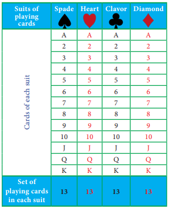
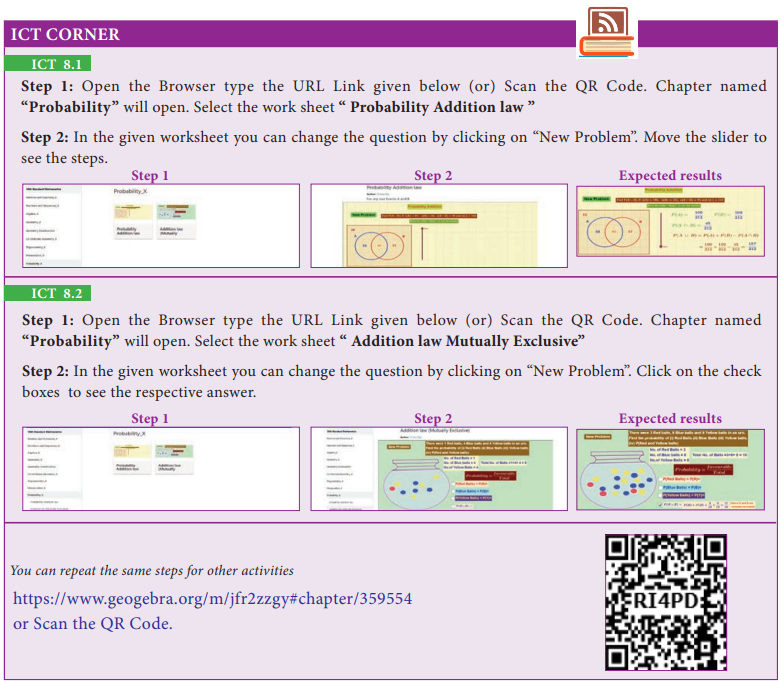

# 8.5 Algebra of Events

In a random experiment, let S be the sample space. Let A ⊆ S and B ⊆ S be the events in S. We say that

**(i)** (A ∩ B) is an event that occurs only when both A and B occurs.

**(ii)** (A ∪ B) is an event that occurs when either one of A or B occurs.

**(iii)** Ā is an event that occurs only when A doesn't occur.

---

> **Note**
>
> - A ∩ Ā = ϕ
> - A ∪ Ā = S
> - If A, B are mutually exclusive events, then P(A ∪ B) = P(A) + P(B)
> - P(Union of mutually exclusive events) = ∑(Probability of events)

---

## Theorem 1

If A and B are two events associated with a random experiment, then prove that

**(i)** P(A ∩ B̄) = P(only A) = P(A) − P(A ∩ B)

**(ii)** P(Ā ∩ B) = P(only B) = P(B) − P(A ∩ B)

### Proof

**(i)** By Distributive property of sets,

1. (A ∩ B) ∪ (A ∩ B̄) = A ∩ (B ∪ B̄) = A ∩ S = A

2. (A ∩ B) ∩ (A ∩ B̄) = A ∩ (B ∩ B̄) = A ∩ ϕ = ϕ

Therefore, the events A ∩ B and A ∩ B̄ are mutually exclusive whose union is A.

Therefore, P(A) = P[(A ∩ B) ∪ (A ∩ B̄)]

P(A) = P(A ∩ B) + P(A ∩ B̄)

Therefore, **P(A ∩ B̄) = P(A) − P(A ∩ B)**

That is, P(A ∩ B̄) = P(only A) = P(A) − P(A ∩ B)

**(ii)** By Distributive property of sets,

1. (A ∩ B) ∪ (Ā ∩ B) = (A ∪ Ā) ∩ B = S ∩ B = B

2. (A ∩ B) ∩ (Ā ∩ B) = (A ∩ Ā) ∩ B = ϕ ∩ B = ϕ

Therefore, the events A ∩ B and Ā ∩ B are mutually exclusive whose union is B.

P(B) = P[(A ∩ B) ∪ (Ā ∩ B)]

P(B) = P(A ∩ B) + P(Ā ∩ B)

Therefore, **P(Ā ∩ B) = P(B) − P(A ∩ B)**

That is, P(Ā ∩ B) = P(only B) = P(B) − P(A ∩ B)

---

> **Progress Check**
>
> 1. P(only A) = \_\_\_\_\_\_\_\_.
> 2. P(Ā ∩ B) = \_\_\_\_\_\_\_\_.
> 3. A ∩ B and Ā ∩ B are \_\_\_\_\_\_\_ events.
> 4. P(Ā ∩ B̄) = \_\_\_\_\_\_\_\_.
> 5. If A and B are mutually exclusive events then P(A ∩ B) = \_\_\_\_\_\_\_.
> 6. If P(A ∩ B) = 0.3, P(Ā ∩ B) = 0.45 then P(B) = \_\_\_\_\_\_\_.

---

# 8.6 Addition Theorem of Probability

**(i)** If A and B are any two events then

**P(A ∪ B) = P(A) + P(B) − P(A ∩ B)**

**(ii)** If A, B and C are any three events then

**P(A ∪ B ∪ C) = P(A) + P(B) + P(C) − P(A ∩ B) − P(B ∩ C) − P(A ∩ C) + P(A ∩ B ∩ C)**

---

### Proof

**(i)** Let A and B be any two events of a random experiment with sample space S.

From the Venn diagram, we have the events only A, A ∩ B and only B are mutually exclusive and their union is A ∪ B.

Therefore,

P(A ∪ B) = P[(only A) ∪ (A ∩ B) ∪ (only B)]

= P(only A) + P(A ∩ B) + P(only B)

= [P(A) − P(A ∩ B)] + P(A ∩ B) + [P(B) − P(A ∩ B)]

**P(A ∪ B) = P(A) + P(B) − P(A ∩ B)**

**(ii)** Let A, B, C be any three events of a random experiment with sample space S.

Let D = B ∪ C

P(A ∪ B ∪ C) = P(A ∪ D)

= P(A) + P(D) − P(A ∩ D)

= P(A) + P(B ∪ C) − P[A ∩ (B ∪ C)]

= P(A) + P(B) + P(C) − P(B ∩ C) − [P(A ∩ B) ∪ P(A ∩ C)]

= P(A) + P(B) + P(C) − P(B ∩ C) − P(A ∩ B) − P(A ∩ C) + P[(A ∩ B) ∩ (Ā ∩ C)]

**P(A ∪ B ∪ C) = P(A) + P(B) + P(C) − P(A ∩ B) − P(B ∩ C) − P(C ∩ A) + P(A ∩ B ∩ C)**

---

> **Activity 5**
>
> The addition theorem of probability can be written easily using the following way.
>
> P(A ∪ B) = S₁ − S₂
>
> P(A ∪ B ∪ C) = S₁ − S₂ + S₃
>
> Where S₁ → Sum of probability of events taken one at a time.
>
> S₂ → Sum of probability of events taken two at a time.
>
> S₃ → Sum of probability of events taken three at a time.
>
> P(A ∪ B) = [P(A) + P(B)] − [P(A ∩ B)]
>
> P(A ∪ B ∪ C) = [P(A) + P(B) + P(C)] − [(P(A ∩ B) + P(B ∩ C) + P(A ∩ C))] + [P(A ∩ B ∩ C)]
>
> Find the probability of P(A ∪ B ∪ C ∪ D) using the above way. Can you find a pattern for the number of terms in the formula?

---

## Examples

### Example 8.25

If P(A) = 0.37, P(B) = 0.42, P(A ∩ B) = 0.09 then find P(A ∪ B).

**Solution**

P(A) = 0.37, P(B) = 0.42, P(A ∩ B) = 0.09

P(A ∪ B) = P(A) + P(B) − P(A ∩ B)

P(A ∪ B) = 0.37 + 0.42 − 0.09 = **0.70**

---

### Example 8.26

A flower is selected at random from a basket containing 80 yellow, 70 red and 50 white flowers. Find the probability of selecting a yellow or red flower?

**Solution:**

Total number of flowers n(S) = 80 + 70 + 50 = 200

No. of yellow flowers n(Y) = 80 ∴ P(Y) = n(Y) / n(S) = 80/200

No. of red flowers n(R) = 70 ∴ P(R) = n(R) / n(S) = 70/200

Y and R are mutually exclusive → P(Y ∪ R) = P(Y) + P(R)

Probability of drawing either a yellow or red flower:

P(Y ∪ R) = 80/200 + 70/200 = 150/200 = **3/4**

> **Thinking Corner**
>
> P(A ∪ B) + P(A ∩ B) is \_\_\_\_\_.

---

### Example 8.27

Two dice are rolled together. Find the probability of getting a doublet or sum of faces as 4.

**Solution**

When two dice are rolled together, there will be 6 × 6 = 36 outcomes. Let S be the sample space. Then n(S) = 36.

Let A be the event of getting a doublet and B be the event of getting face sum 4.

Then A = {(1,1), (2,2), (3,3), (4,4), (5,5), (6,6)}

B = {(1,3), (2,2), (3,1)}

∴ A ∩ B = {(2,2)}

Then, n(A) = 6, n(B) = 3, n(A ∩ B) = 1.

P(A) = n(A) / n(S) = 6/36

P(B) = n(B) / n(S) = 3/36

P(A ∩ B) = n(A ∩ B) / n(S) = 1/36

∴ P(getting a doublet or a total of 4) = P(A ∪ B)

P(A ∪ B) = P(A) + P(B) − P(A ∩ B)

= 6/36 + 3/36 − 1/36 = 8/36 = **2/9**

Hence, the required probability is **2/9**.

---

### Example 8.28

If A and B are two events such that P(A) = 1/4, P(B) = 1/2 and P(A and B) = 1/8, find (i) P(A or B)  (ii) P(not A and not B).

**Solution**

**(i)** P(A or B) = P(A ∪ B)

= P(A) + P(B) − P(A ∩ B)

P(A or B) = 1/4 + 1/2 − 1/8 = **5/8**

**(ii)** P(not A and not B) = P(Ā ∩ B̄)

= P(overline{A ∪ B})

= 1 − P(A ∪ B)

P(not A and not B) = 1 − 5/8 = **3/8**

---

### Example 8.29

In an apartment, in selecting a house from door numbers 1 to 100 randomly, find the probability of getting the door number of the house to be an even number or a perfect square number or a perfect cube number.

**Solution:**

Total number of houses n(S) = 100

Let A be the event of getting door number even.

A = {2, 4, 6, 8, ... 100}, n(A) = 50, P(A) = 50/100

Let B be the event of getting door number perfect square.

B = {1, 4, 9, 16, 25, 36, 49, 64, 81, 100}, n(B) = 10, P(B) = 10/100

Let C be the event of getting door number perfect cube.

C = {1, 8, 27, 64}, n(C) = 4, P(C) = 4/100

P(A ∩ B) = P[getting even perfect square number] = 5/100

P(B ∩ C) = P[getting a perfect square and perfect cube number] = 2/100

P(A ∩ C) = P[getting even perfect cube number] = 2/100

P(A ∩ B ∩ C) = P[getting even perfect square and perfect cube number] = 1/100

**Required probability:**

P(A ∪ B ∪ C) = P(A) + P(B) + P(C) − P(A ∩ B) − P(B ∩ C) − P(A ∩ C) + P(A ∩ B ∩ C)

= 50/100 + 10/100 + 4/100 − 5/100 − 2/100 − 2/100 + 1/100

= 65/100 − 9/100 = 56/100 = **14/25**

---

### Example 8.30

In a class of 50 students, 28 opted for NCC, 30 opted for NSS and 18 opted both NCC and NSS. One of the students is selected at random. Find the probability that

(i) The student opted for NCC but not NSS.
(ii) The student opted for NSS but not NCC.
(iii) The student opted for exactly one of them.

**Solution**

Total number of students n(S) = 50.

Let A and B be the events of students opted for NCC and NSS respectively.

n(A) = 28, n(B) = 30, n(A ∩ B) = 18

P(A) = n(A) / n(S) = 28/50 ;  P(B) = n(B) / n(S) = 30/50

P(A ∩ B) = n(A ∩ B) / n(S) = 18/50

**(i)** Probability of the students opted for NCC but not NSS

P(A ∩ B̄) = P(A) − P(A ∩ B) = 28/50 − 18/50 = **1/5**

**(ii)** Probability of the students opted for NSS but not NCC.

P(Ā ∩ B) = P(B) − P(A ∩ B) = 30/50 − 18/50 = **6/25**

**(iii)** Probability of the students opted for exactly one of them

= P[(A ∩ B̄) ∪ (Ā ∩ B)]

= P(A ∩ B̄) + P(Ā ∩ B) = 1/5 + 6/25 = **11/25**

(Note that (A ∩ B̄), (Ā ∩ B) are mutually exclusive events)

---

### Example 8.31

A and B are two candidates seeking admission to IIT. The probability that A getting selected is 0.5 and the probability that both A and B getting selected is 0.3. Prove that the probability of B being selected is atmost 0.8.

**Solution**

P(A) = 0.5, P(A ∩ B) = 0.3

We have P(A ∪ B) ≤ 1

P(A) + P(B) − P(A ∩ B) ≤ 1

0.5 + P(B) − 0.3 ≤ 1

P(B) ≤ 1 − 0.2

**P(B) ≤ 0.8**

Therefore, probability of B getting selected is atmost 0.8.

---

## Exercise 8.4

1. If P(A) = 2/3, P(B) = 2/5, P(A ∪ B) = 1/3 then find P(A ∩ B).

2. A and B are two events such that, P(A) = 0.42, P(B) = 0.48, and P(A ∩ B) = 0.16. Find (i) P(not A)  (ii) P(not B)  (iii) P(A or B)

3. If A and B are two mutually exclusive events of a random experiment and P(not A) = 0.45, P(A ∪ B) = 0.65, then find P(B).

4. The probability that atleast one of A and B occur is 0.6. If A and B occur simultaneously with probability 0.2, then find P(Ā) + P(B̄).

5. The probability of happening of an event A is 0.5 and that of B is 0.3. If A and B are mutually exclusive events, then find the probability that neither A nor B happen.

6. Two dice are rolled once. Find the probability of getting an even number on the first die or a total of face sum 8.

7. A box contains cards numbered 3, 5, 7, 9, … 35, 37. A card is drawn at random from the box. Find the probability that the drawn card have either multiples of 7 or a prime number.

8. Three unbiased coins are tossed once. Find the probability of getting atmost 2 tails or atleast 2 heads.

9. The probability that a person will get an electrification contract is 3/5 and the probability that he will not get plumbing contract is 5/8. The probability of getting atleast one contract is 5/7. What is the probability that he will get both?

10. In a town of 8000 people, 1300 are over 50 years and 3000 are females. It is known that 30% of the females are over 50 years. What is the probability that a chosen individual from the town is either a female or over 50 years?

11. A coin is tossed thrice. Find the probability of getting exactly two heads or atleast one tail or two consecutive heads.

12. If A, B, C are any three events such that probability of B is twice as that of probability of A and probability of C is thrice as that of probability of A and if P(A ∩ B) = 1/6, P(B ∩ C) = 1/4, P(A ∩ C) = 1/8, P(A ∪ B ∪ C) = 9/10, P(A ∩ B ∩ C) = 1/15, then find P(A), P(B) and P(C).

13. In a class of 35, students are numbered from 1 to 35. The ratio of boys to girls is 4:3. The roll numbers of students begin with boys and end with girls. Find the probability that a student selected is either a boy with prime roll number or a girl with composite roll number or an even roll number.

---

## Points to Remember

- A, B are said to be mutually exclusive events if A ∩ B = ϕ

- Probability of event E is P(E) = n(E) / n(S)

  - (i) The probability of sure event is 1 and the probability of impossible event is 0.
  - (ii) 0 ≤ P(E) ≤ 1
  - (iii) P(Ē) = 1 − P(E)

- If A and B are mutually exclusive events then P(A ∪ B) = P(A) + P(B).

- (i) P(A ∩ B̄) = P(only A) = P(A) − P(A ∩ B)

  (ii) P(Ā ∩ B) = P(only B) = P(B) − P(A ∩ B)

- P(A ∪ B) = P(A) + P(B) − P(A ∩ B), for any two events A, B.

- For any three events A, B, C:

  P(A ∪ B ∪ C) = P(A) + P(B) + P(C) − P(A ∩ B) − P(B ∩ C) − P(C ∩ A) + P(A ∩ B ∩ C)