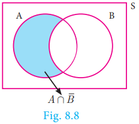

# 8.5 Algebra of Events

In a random experiment, let S be the sample space. Let A ⊆ S and B ⊆ S be the events in S. We say that

---

**(i)** (A ∩ B) is an event that occurs only when both A and B occurs.

---

**(ii)** (A ∪ B) is an event that occurs when either one of A or B occurs.

---

**(iii)** Ā is an event that occurs only when A doesn't occur.

---

> **Note**
>
> - A ∩ Ā = ϕ
> - A ∪ Ā = S
> - If A, B are mutually exclusive events, then P(A ∪ B) = P(A) + P(B)
> - P(Union of mutually exclusive events) = ∑(Probability of events)

---

## Theorem 1

If A and B are two events associated with a random experiment, then prove that

**(i)** P(A ∩ B̄) = P(only A) = P(A) − P(A ∩ B)

**(ii)** P(Ā ∩ B) = P(only B) = P(B) − P(A ∩ B)

### Proof

**(i)** By Distributive property of sets,

1. (A ∩ B) ∪ (A ∩ B̄) = A ∩ (B ∪ B̄) = A ∩ S = A

2. (A ∩ B) ∩ (A ∩ B̄) = A ∩ (B ∩ B̄) = A ∩ ϕ = ϕ

Therefore, the events A ∩ B and A ∩ B̄ are mutually exclusive whose union is A.

Therefore, P(A) = P[(A ∩ B) ∪ (A ∩ B̄)]

P(A) = P(A ∩ B) + P(A ∩ B̄)

Therefore, **P(A ∩ B̄) = P(A) − P(A ∩ B)**

That is, P(A ∩ B̄) = P(only A) = P(A) − P(A ∩ B)

**(ii)** By Distributive property of sets,

1. (A ∩ B) ∪ (Ā ∩ B) = (A ∪ Ā) ∩ B = S ∩ B = B

2. (A ∩ B) ∩ (Ā ∩ B) = (A ∩ Ā) ∩ B = ϕ ∩ B = ϕ

Therefore, the events A ∩ B and Ā ∩ B are mutually exclusive whose union is B.

P(B) = P[(A ∩ B) ∪ (Ā ∩ B)]

P(B) = P(A ∩ B) + P(Ā ∩ B)

Therefore, **P(Ā ∩ B) = P(B) − P(A ∩ B)**

That is, P(Ā ∩ B) = P(only B) = P(B) − P(A ∩ B)

---

> **Progress Check**
>
> 1. P(only A) = \_\_\_\_\_\_\_\_.
> 2. P(Ā ∩ B) = \_\_\_\_\_\_\_\_.
> 3. A ∩ B and Ā ∩ B are \_\_\_\_\_\_\_ events.
> 4. P(Ā ∩ B̄) = \_\_\_\_\_\_\_\_.
> 5. If A and B are mutually exclusive events then P(A ∩ B) = \_\_\_\_\_\_\_.
> 6. If P(A ∩ B) = 0.3, P(Ā ∩ B) = 0.45 then P(B) = \_\_\_\_\_\_\_.