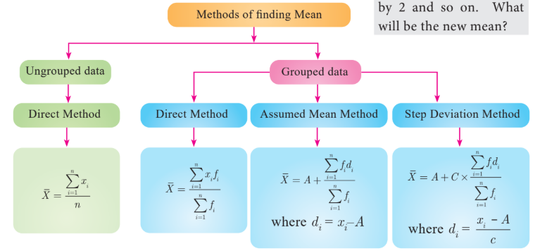

### 8.1 Introduction

'STATISTICS' is derived from the Latin word 'status' which means a political state. Today, statistics has become an integral part of everyone's life, unavoidable whether making a plan for our future, doing a business, a marketing research or preparing economic reports. It is also extensively used in opinion polls, doing advanced research. The study of statistics is concerned with scientific methods for collecting, organising, summarising, presenting, analysing data and making meaningful decisions. In earlier classes we have studied about collection of data, presenting the data in tabular form, graphical form and calculating the Measures of Central Tendency. Now, in this class, let us study about the Measures of Dispersion.

---

##### Thinking Corner

1. Does the mean, median and mode are same for a given data?

2. What is the difference between the arithmetic mean and average?

---

## Recall

### Measures of Central Tendency

It is often convenient to have one number that represent the whole data. Such a number is called a Measures of Central Tendency.

The Measures of Central Tendency usually will be near to the middle value of the data. For a given data there exist several types of measures of central tendencies.

The most common among them are:

- Arithmetic Mean
- Median
- Mode

---

**Note**

**Data:** The numerical representation of facts is called data.

**Observation:** Each entry in the data is called an observation.

**Variable:** The quantities which are being considered in a survey are called variables. Variables are generally denoted by \(x_i, i = 1, 2, 3, \ldots, n\).

**Frequencies:** The number of times, a variable occurs in a given data is called the frequency of that variable. Frequencies are generally denoted as \(f_i, i = 1, 2, 3, \ldots, n\).

In this class we have to recall the Arithmetic Mean.

---

## Arithmetic Mean

The Arithmetic Mean or Mean of the given values is sum of all the observations divided by the total number of observations. It is denoted by \(\bar{x}\) (pronounced as \(x\) bar).

$$\overline{x} = \frac{\text{Sum of all the observations}}{\text{Number of observations}}$$

We apply the respective formulae depending upon the information provided in the problem.

##### Thinking Corner:

The mean of $n$ observations is $\overline{x}$ , if first term is increased by 1 second term is increased by 2 and so on. What will be the new mean?

---

##### Progress Check

1. The sum of all the observations divided by number of observations is ______.

2. If the sum of 10 data values is 265 then their mean is ______.

3. If the sum and mean of a data are 407 and 11 respectively, then the number of observations in the data are ______.

---