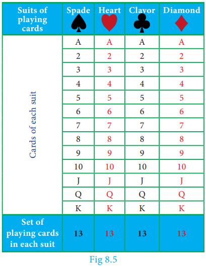
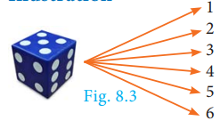
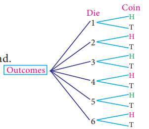
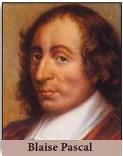
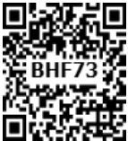
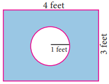

T# 8.4 Probability

Few centuries ago, gambling and gaming were considered to be fashionable and became widely popular among many men. As the games became more complicated, players were interested in knowing the chances of winning or losing a game from a given situation. In 1654, Chevalier de Mere, a French nobleman with a taste of gambling, wrote a letter to one of the prominent mathematician of the time, Blaise Pascal, seeking his advice about how much dividend he would get for a gambling game played by paying money. Pascal worked this problem mathematically but thought of sharing this problem and see how his good friend and mathematician Pierre de Fermat could solve. Their subsequent correspondences on the issue represented the birth of Probability Theory as a new branch of mathematics.

---

### Random Experiment

A random experiment is an experiment in which

(i) The set of all possible outcomes are known

(ii) Exact outcome is not known.

**Example :** 1. Tossing a coin.  2. Rolling a die.

---

### Sample space

The set of all possible outcomes in a random experiment is called a **sample space**. It is generally denoted by S.

**Example :** When we roll a die, the possible outcomes are the face numbers 1, 2, 3, 4, 5, 6 of the die. Therefore the sample space is S = {1, 2, 3, 4, 5, 6}

**Sample point** Each element of a sample space is called a sample point.

---

## 8.4.1 Tree diagram

Tree diagram allow us to see visually all possible outcomes of an random experiment. Each branch in a tree diagram represent a possible outcome.

### Illustration

**(i)** When we throw a die, then from the tree diagram (Fig. 8.3), the sample space can be written as S = {1, 2, 3, 4, 5, 6}

**(ii)** When we toss two coins, then from the tree diagram (Fig. 8.4), the sample space can be written as S = {HH, HT, TH, TT}

> **Progress Check**
>
> 1. An experiment in which a particular outcome cannot be predicted is called \_\_\_\_\_\_\_.
> 2. The set of all possible outcomes is called \_\_\_\_\_\_\_.

---

### Example 8.17

Express the sample space for rolling two dice using tree diagram.

**Solution**

When we roll two dice, since each die contain 6 faces marked with 1, 2, 3, 4, 5, 6 the tree diagram will look like

Hence, the sample space can be written as

S = {(1,1), (1,2), (1,3), (1,4), (1,5), (1,6)

(2,1), (2,2), (2,3), (2,4), (2,5), (2,6)

(3,1), (3,2), (3,3), (3,4), (3,5), (3,6)

(4,1), (4,2), (4,3), (4,4), (4,5), (4,6)

(5,1), (5,2), (5,3), (5,4), (5,5), (5,6)

(6,1), (6,2), (6,3), (6,4), (6,5), (6,6)}

---

**Event:** In a random experiment, each possible outcome is called an event. Thus, an event will be a subset of the sample space.

**Example :** Getting two heads when we toss two coins is an event.

**Trial :** Performing an experiment once is called a trial.

**Example :** When we toss a coin thrice, then each toss of a coin is a trial.

---

| Events | Explanation | Example |
|---|---|---|
| Equally likely events | Two or more events are said to be equally likely if each one of them has an equal chance of occurring. | Head and tail are equally likely events in tossing a coin. |
| Certain events | In an experiment, the event which surely occur is called certain event. | When we roll a die, the event of getting any natural number from one to six is a certain event. |
| Impossible events | In an experiment if an event has no scope to occur then it is called an impossible event. | When we toss two coins, the event of getting three heads is an impossible event. |
| Mutually exclusive events | Two or more events are said to be mutually exclusive if they don't have common sample points. i.e., events A, B are said to be mutually exclusive if A ∩ B = ϕ. | When we roll a die the events of getting odd numbers and even numbers are mutually exclusive events. |
| Exhaustive events | The collection of events whose union is the whole sample space are called exhaustive events. | When we toss a coin twice, the collection of events of getting two heads, exactly one head, no head are exhaustive events. |
| Complementary events | The complement of an event A is the event representing collection of sample points not in A. It is denoted A' or Aᶜ or Ā. The event A and its complement A' are mutually exclusive and exhaustive. | When we roll a die, the event 'rolling a 5 or 6' and the event of rolling a 1, 2, 3 or 4 are complementary events. |

> **Note**
>
> **Elementary event:** If an event E consists of only one outcome then it is called an elementary event.

> **Do You Know?**
>
> In 1713, Bernoulli was the first to recognise the wide-range applicability of probability in fields outside gambling.

---

## 8.4.2 Probability of an Event

In a random experiment, let S be the sample space and E ⊆ S. Then if E is an event, the probability of occurrence of E is defined as

P(E) = Number of outcomes favourable to occurence of E / Number of all possible outcomes = n(E) / n(S)

This way of defining the probability is applicable only to finite sample spaces. So in this chapter, we will be dealing problems only with finite sample spaces.

> **Note**
>
> - P(E) = n(E) / n(S)
> - P(S) = n(S) / n(S) = 1. The probability of sure event is 1.
> - P(ϕ) = n(ϕ) / n(S) = 0 / n(S) = 0. The probability of impossible event is 0.
> - Since E is a subset of S and ϕ is a subset of any set, ϕ ⊆ E ⊆ S
>
>   P(ϕ) ≤ P(E) ≤ P(S)
>
>   0 ≤ P(E) ≤ 1
>
>   Therefore, the probability value always lies from 0 to 1.
>
> - The complement event of E is Ē.
>
>   Let P(E) = m/n (where m is the number of favourable outcomes of E and n is the total number of possible outcomes).
>
>   P(Ē) = Number of outcomes unfavourable to occurance of E / Number of all possible outcomes
>
>   P(Ē) = (n − m) / n = 1 − m/n
>
>   P(Ē) = 1 − P(E)
>
> - P(E) + P(Ē) = 1

> **Progress Check**
>
> Which of the following values cannot be a probability of an event?
>
> (a) −0.0001  (b) 0.5  (c) 1.001  (d) 1
>
> (e) 20%  (f) 0.253  (g) (1 − √5) / 2  (h) (√3 + 1) / 4

---

### Example 8.18

A bag contains 5 blue balls and 4 green balls. A ball is drawn at random from the bag. Find the probability that the ball drawn is (i) blue (ii) not blue.

**Solution**

Total number of possible outcomes n(S) = 5 + 4 = 9

**(i)** Let A be the event of getting a blue ball.

Number of favourable outcomes for the event A. Therefore, n(A) = 5

Probability that the ball drawn is blue. Therefore, P(A) = n(A) / n(S) = 5/9

**(ii)** Ā will be the event of not getting a blue ball.

P(Ā) = 1 − P(A) = 1 − 5/9 = **4/9**

---

### Example 8.19

Two dice are rolled. Find the probability that the sum of outcomes is (i) equal to 4  (ii) greater than 10  (iii) less than 13

**Solution**

When we roll two dice, the sample space is given by

S = {(1,1), (1,2), (1,3), (1,4), (1,5), (1,6)

(2,1), (2,2), (2,3), (2,4), (2,5), (2,6)

(3,1), (3,2), (3,3), (3,4), (3,5), (3,6)

(4,1), (4,2), (4,3), (4,4), (4,5), (4,6)

(5,1), (5,2), (5,3), (5,4), (5,5), (5,6)

(6,1), (6,2), (6,3), (6,4), (6,5), (6,6)}; n(S) = 36

**(i)** Let A be the event of getting the sum of outcome values equal to 4.

Then A = {(1,3), (2,2), (3,1)}; n(A) = 3.

Probability of getting the sum of outcomes equal to 4 is P(A) = n(A) / n(S) = 3/36 = **1/12**

**(ii)** Let B be the event of getting the sum of outcome values greater than 10.

Then B = {(5,6), (6,5), (6,6)}; n(B) = 3

Probability of getting the sum of outcomes greater than 10 is P(B) = n(B) / n(S) = 3/36 = **1/12**

**(iii)** Let C be the event of getting the sum of outcomes less than 13. Here all the outcomes have the sum value less than 13. Hence C = S.

Therefore, n(C) = n(S) = 36

Probability of getting the total value less than 13 is P(C) = n(C) / n(S) = 36/36 = **1**.

---

### Example 8.20

Two coins are tossed together. What is the probability of getting different faces on the coins?

**Solution**

When two coins are tossed together, the sample space is

S = {HH, HT, TH, TT}; n(S) = 4

Let A be the event of getting different faces on the coins.

A = {HT, TH}; n(A) = 2

Probability of getting different faces on the coins is P(A) = n(A) / n(S) = 2/4 = **1/2**

---

### Example 8.21

What is the probability that a leap year selected at random will contain 53 Saturdays?

**Solution**

A leap year has 366 days. So it has 52 full weeks and 2 days. 52 Saturdays must be in 52 full weeks.

The possible chances for the remaining two days will be the sample space.

S = {Sun-Mon, Mon-Tue, Tue-Wed, Wed-Thu, Thu-Fri, Fri-Sat, Sat-Sun}

n(S) = 7

Let A be the event of getting 53rd Saturday.

Then A = {Fri-Sat, Sat-Sun}; n(A) = 2

Probability of getting 53 Saturdays in a leap year is P(A) = n(A) / n(S) = **2/7**

> **Thinking Corner**
>
> What will be the probability that a non-leap year will have 53 Saturdays?

---

### Example 8.22

A die is rolled and a coin is tossed simultaneously. Find the probability that the die shows an odd number and the coin shows a head.

**Solution**

Sample space S = {1H, 1T, 2H, 2T, 3H, 3T, 4H, 4T, 5H, 5T, 6H, 6T}; n(S) = 12

Let A be the event of getting an odd number and a head.

A = {1H, 3H, 5H}; n(A) = 3

P(A) = n(A) / n(S) = 3/12 = **1/4**

---

> **Activity 3**
>
> There are three routes R₁, R₂ and R₃ from Madhu's home to her place of work. There are four parking lots P₁, P₂, P₃, P₄ and three entrances B₁, B₂, B₃ into the office building. There are two elevators E₁ and E₂ to her floor. Using the tree diagram explain how many ways can she reach her office?

> **Activity 4**
>
> Collect the details and find the probabilities of
>
> (i) selecting a boy from your class.
>
> (ii) selecting a girl from your class.
>
> (iii) selecting a student from tenth standard in your school.
>
> (iv) selecting a boy from tenth standard in your school.
>
> (v) selecting a girl from tenth standard in your school.

---

### Example 8.23

A bag contains 6 green balls, some black and red balls. Number of black balls is as twice as the number of red balls. Probability of getting a green ball is thrice the probability of getting a red ball. Find (i) number of black balls  (ii) total number of balls.

**Solution**

Number of green balls is n(G) = 6

Let number of red balls is n(R) = x

Therefore, number of black balls is n(B) = 2x

Total number of balls n(S) = 6 + x + 2x = 6 + 3x

It is given that, P(G) = 3 × P(R)

6 / (6 + 3x) = 3 × x / (6 + 3x)

3x = 6 gives, x = 2

**(i)** Number of black balls = 2 × 2 = **4**

**(ii)** Total number of balls = 6 + (3 × 2) = **12**

---

### Example 8.24

A game of chance consists of spinning an arrow which is equally likely to come to rest pointing to one of the numbers 1, 2, 3, …12. What is the probability that it will point to (i) 7  (ii) a prime number  (iii) a composite number?

**Solution**

Sample space S = {1, 2, 3, 4, 5, 6, 7, 8, 9, 10, 11, 12}; n(S) = 12

**(i)** Let A be the event of resting in 7. n(A) = 1

P(A) = n(A) / n(S) = **1/12**

**(ii)** Let B be the event that the arrow will come to rest in a prime number.

B = {2, 3, 5, 7, 11}; n(B) = 5

P(B) = n(B) / n(S) = **5/12**

**(iii)** Let C be the event that arrow will come to rest in a composite number.

C = {4, 6, 8, 9, 10, 12}; n(C) = 6

P(C) = n(C) / n(S) = 6/12 = **1/2**

> **Thinking Corner**
>
> What is the complement event of an impossible event?

---

## Exercise 8.3

1. Write the sample space for tossing three coins using tree diagram.

2. Write the sample space for selecting two balls at a time from a bag containing 6 balls numbered 1 to 6 (using tree diagram).

3. If A is an event of a random experiment such that P(A) : P(Ā) = 17:15 and n(S) = 640 then find (i) P(Ā)  (ii) n(A).

4. A coin is tossed thrice. What is the probability of getting two consecutive tails?

5. At a fete, cards bearing numbers 1 to 1000, one number on one card are put in a box. Each player selects one card at random and that card is not replaced. If the selected card has a perfect square number greater than 500, the player wins a prize. What is the probability that (i) the first player wins a prize  (ii) the second player wins a prize, if the first has won?

6. A bag contains 12 blue balls and x red balls. If one ball is drawn at random (i) what is the probability that it will be a red ball? (ii) If 8 more red balls are put in the bag, and if the probability of drawing a red ball will be twice that of the probability in (i), then find x.

7. Two unbiased dice are rolled once. Find the probability of getting

   (i) a doublet (equal numbers on both dice)

   (ii) the product as a prime number

   (iii) the sum as a prime number

   (iv) the sum as 1

8. Three fair coins are tossed together. Find the probability of getting

   (i) all heads

   (ii) atleast one tail

   (iii) atmost one head

   (iv) atmost two tails

9. A bag contains 5 red balls, 6 white balls, 7 green balls, 8 black balls. One ball is drawn at random from the bag. Find the probability that the ball drawn is

   (i) white

   (ii) black or red

   (iii) not white

   (iv) neither white nor black

10. In a box there are 20 non-defective and some defective bulbs. If the probability that a bulb selected at random from the box found to be defective is 3/8 then, find the number of defective bulbs.

11. Some boys are playing a game, in which the stone thrown by them landing in a circular region (given in the figure) is considered as win and landing other than the circular region is considered as loss. What is the probability to win the game? (π = 3.14)

12. Two customers Priya and Amuthan are visiting a particular shop in the same week (Monday to Saturday). Each is equally likely to visit the shop on any one day as on another day. What is the probability that both will visit the shop on

    (i) the same day  (ii) different days  (iii) consecutive days?

13. In a game, the entry fee is ₹150. The game consists of tossing a coin 3 times. Dhana bought a ticket for entry. If one or two heads show, she gets her entry fee back. If she throws 3 heads, she receives double the entry fees. Otherwise she will lose. Find the probability that she (i) gets double entry fee  (ii) just gets her entry fee  (iii) loses the entry fee.