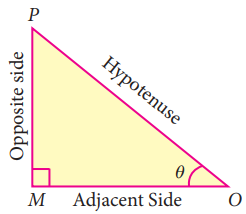

# UNIT 6: Trigonometry
> "The deep study of nature is the most fruitful source of mathematical discoveries"
> — Joseph Fourier

French mathematician Francois Viete used trigonometry in the study of Algebra for solving certain equations by making suitable trigonometric substitutions. His famous formula for π can be derived with repeated use of trigonometric ratios. One of his famous works titled Canon Mathematics covers trigonometry; it contains trigonometric tables, it also gives the mathematics behind the construction of the tables, and it details how to solve both plane and spherical triangles. He also provided the means for extracting roots and solutions of equations of degree atmost six. Viete introduced the term "coefficient" in mathematics.

He provided a simple formula relating the roots of a equation with its coefficients. He also provided geometric methods to solve doubling the cube and trisecting the angle problems. He was also involved in deciphering codes.

## Learning Outcomes

- To recall trigonometric ratios.
- To recall fundamental relations between the trigonometric ratios of an angle.
- To recall trigonometric ratios of complementary angles.
- To understand trigonometric identities.
- To know methods of solving problems concerning heights and distances of various objects.

## 6.1 Introduction

From very ancient times surveyors, navigators and astronomers have made use of triangles to determine distances that could not be measured directly. This gave birth to the branch of mathematics what we call today as "Trigonometry".

Hipparchus of Rhodes around 200BC(BCE), constructed a table of chord lengths for a circle of circumference 360×60=21600 units which corresponds to one unit of circumference for each minute of arc. For this achievement, Hipparchus is considered as "The Father of Trigonometry" since it became the basis for further development.

Indian scholars of the 5th century AD(CE), realized that working with half-chords for half-angles greatly simplified the theory of chords and its application to astronomy. Mathematicians like Aryabhata, the two Bhaskaras and several others developed astonishingly sophisticated techniques for calculating half-chord (Jya) values.

Mathematician Abu Al-Wafa of Baghdad believed to have invented the tangent function, which he called the "Shadow". Arabic scholars did not know how to translate the word Jya, into their texts and simply wrote jiba as a close approximate word.

Misinterpreting the Arabic word 'jiba' for 'cove' or 'bay', translators wrote the Arabic word 'jiba' as 'sinus' in Latin to represent the half-chord. From this, we have the name 'sine' used to this day. The word "Trigonometry" itself was invented by German mathematician Bartholomaeus Pitiscus in the beginning of 17th century AD(CE).

## Recall

### Trigonometric Ratios

Let 0° < θ < 90°

**Fig. 6.1**

Let us take right triangle OMP

sin θ = Opposite side/Hypotenuse = MP/OP

cos θ = Adjacent side/Hypotenuse = OM/OP

From the above two ratios we can obtain other four trigonometric ratios as follows.

tan θ = sin θ/cos θ;    cot θ = cos θ/sin θ;

cosec θ = 1/sin θ;    sec θ = 1/cos θ

> **Note:** All right triangles with θ as one of the angle are similar. Hence the trigonometric ratios defined through such right angle triangles do not depend on the triangle chosen.

### Trigonometric ratios of complementary angle

sin(90° − θ) = cos θ

cos(90° − θ) = sin θ

tan(90° − θ) = cot θ

cosec(90° − θ) = sec θ

sec(90° − θ) = cosec θ

cot(90° − θ) = tan θ

### Visual proof of trigonometric complementary angle

Consider a semicircle of radius 1 as shown in the figure.

Let ∠QOP = θ.

Then ∠QOR = 90°−θ, so that OPQR forms a rectangle.

From triangle OPQ,

OP/OQ = cos θ

But OQ = radius = 1

∴ OP = OQ cos θ = cos θ

PQ/OQ = sin θ

PQ = OQ sin θ = sin θ    (∵ OQ = 1)

∴ OP = cos θ, PQ = sin θ ... (1)

Now, from triangle QOR,

OR/OQ = cos(90°−θ)

∴ OR = OQ cos(90°−θ) = cos(90°−θ)

Similarly,

RQ/OQ = sin(90°−θ)

Then, RQ = sin(90°−θ)

∴ OR = cos(90°−θ), RQ = sin(90°−θ) ... (2)

OPQR is a rectangle,

OP = RQ and OR = PQ

Therefore, from (1) and (2) we get,

**sin(90° − θ) = cos θ**    and    **cos(90° − θ) = sin θ**

> **Note:**
> (sin θ)² = sin² θ    (cosec θ)² = cosec² θ
> (cos θ)² = cos² θ    (sec θ)² = sec² θ
> (tan θ)² = tan² θ    (cot θ)² = cot² θ

### Table of Trigonometric Ratios for 0°, 30°, 45°, 60°, 90°

| θ | 0° | 30° | 45° | 60° | 90° |
|:---|:---|:---|:---|:---|:---|
| **Trigonometric Ratio** | | | | | |
| sin θ | 0 | 1/2 | 1/√2 | √3/2 | 1 |
| cos θ | 1 | √3/2 | 1/√2 | 1/2 | 0 |
| tan θ | 0 | 1/√3 | 1 | √3 | undefined |
| cosec θ | undefined | 2 | √2 | 2/√3 | 1 |
| sec θ | 1 | 2/√3 | √2 | 2 | undefined |
| cot θ | undefined | √3 | 1 | 1/√3 | 0 |

### Thinking Corner

1. When will the values of sin θ and cos θ be equal?
2. For what values of θ, sin θ = 2?
3. Among the six trigonometric quantities, as the value of angle increase from 0° to 90°, which of the six trigonometric quantities has undefined values?
4. Is it possible to have eight trigonometric ratios?
5. Let 0° ≤ θ ≤ 90°. For what values of θ does
   - (i) sin θ > cos θ
   - (ii) cos θ > sin θ
   - (iii) sec θ = 2 tan θ
   - (iv) cosec θ = 2 cot θ

## 6.2 Trigonometric Identities

For all real values of θ, we have the following three identities.

(i) sin²θ + cos²θ = 1

(ii) 1 + tan²θ = sec²θ

(iii) 1 + cot²θ = cosec²θ

These identities are termed as three fundamental identities of trigonometry. We will now prove them as follows.

| Picture | Identity | Proof |
|:---|:---|:---|
|  | sin²θ + cos²θ = 1 | In the right angled ΔOMP, we have OM/OP = cos θ, PM/OP = sin θ ... (1) By Pythagoras theorem MP² + OM² = OP² ... (2) Dividing each term on both sides of (2) by OP², (OP ≠ 0) we get, MP²/OP² + OM²/OP² = OP²/OP² sin²θ + cos²θ = 1 Hence sin²θ + cos²θ = 1 |
| | 1 + tan²θ = sec²θ | In the right angled ΔOMP, we have MP/OM = tan θ, OP/OM = sec θ ... (3) From (2), MP² + OM² = OP² Dividing each term on both sides of (2) by OM², (OM ≠ 0) we get, MP²/OM² + OM²/OM² = OP²/OM² tan²θ + 1 = sec²θ Hence 1 + tan²θ = sec²θ |
| | 1 + cot²θ = cosec²θ | In the right angled ΔOMP, we have OM/MP = cot θ, OP/MP = cosec θ ... (4) From (2), MP² + OM² = OP² Dividing each term on both sides of (2) by MP², (MP ≠ 0) we get, MP²/MP² + OM²/MP² = OP²/MP² 1 + cot²θ = cosec²θ Hence, 1 + cot²θ = cosec²θ |

These identities can also be rewritten as follows.

| Identity | Equal forms |
|:---|:---|
| sin²θ + cos²θ = 1 | sin²θ = 1 − cos²θ or cos²θ = 1 − sin²θ |
| 1 + tan²θ = sec²θ | tan²θ = sec²θ − 1 or sec²θ − tan²θ = 1 |
| 1 + cot²θ = cosec²θ | cot²θ = cosec²θ − 1 or cosec²θ − cot²θ = 1 |

> **Note:** Though the above identities are true for any angle θ, we will consider the six trigonometric ratios only for 0° < θ < 90°

### Activity 1

Take a white sheet of paper. Construct two perpendicular lines OX, OY which meet at O, as shown in the Fig.6.4(a).

Considering OX as X axis, OY as Y axis.

We will verify the values of sin θ and cos θ for certain angles θ.

Let θ = 30°

Construct a line segment OA of any length such that ∠AOX = 30°, as shown in the Fig.6.4(b).

Draw a perpendicular from A to OX, meeting at B.

.png)

.png)

**Fig. 6.4**

Now using scale, measure the lengths of AB, OB and OA.

Find the ratios AB/OA, OB/OA and AB/OB.

What do you get? Can you compare these values with the trigonometric table values? What is your conclusion?

Carry out the same procedure for θ = 45° and θ = 60°. What are your conclusions?

### Example 6.1

Prove that tan²θ − sin²θ = tan²θ sin²θ

**Solution:**

tan²θ − sin²θ = tan²θ − (sin²θ/cos²θ)·cos²θ

= tan²θ − tan²θ cos²θ

= tan²θ(1 − cos²θ)

= tan²θ sin²θ

### Example 6.2

Prove that (sin A)/(1 + cos A) = (1 − cos A)/sin A

**Solution:**

(sin A)/(1 + cos A) = (sin A)/(1 + cos A) × (1 − cos A)/(1 − cos A)

[multiply numerator and denominator by the conjugate of 1+cos A]

= sin A(1 − cos A)/(1 − cos²A)

= sin A(1 − cos A)/sin²A

= (1 − cos A)/sin A

### Example 6.3

Prove that 1 + (cot²θ)/(1 + cosec θ) = cosec θ

**Solution:**

1 + (cot²θ)/(1 + cosec θ) = 1 + (cosec²θ − 1)/(cosec θ + 1)    [∵ cosec²θ − 1 = cot²θ]

= 1 + ((cosec θ + 1)(cosec θ − 1))/(cosec θ + 1)

= 1 + (cosec θ − 1)

= cosec θ

### Example 6.4

Prove that sec θ − cos θ = tan θ sin θ

**Solution:**

sec θ − cos θ = (1/cos θ) − cos θ

= (1 − cos²θ)/cos θ

= sin²θ/cos θ

= (sin θ/cos θ) × sin θ

= tan θ sin θ

### Example 6.5

Prove that (1 + cos θ)/(1 − cos θ) = (cosec θ + cot θ)²

**Solution:**

(1 + cos θ)/(1 − cos θ) = (1 + cos θ)/(1 − cos θ) × (1 + cos θ)/(1 + cos θ)

[multiply numerator and denominator by the conjugate of 1−cos θ]

= (1 + cos θ)²/(1 − cos²θ)

= (1 + cos θ)²/sin²θ

= ((1 + cos θ)/sin θ)²

= (cosec θ + cot θ)²

### Example 6.6

Prove that (sec θ)/(sin θ) − (sin θ)/(cos θ) = cot θ

**Solution:**

(sec θ)/(sin θ) − (sin θ)/(cos θ) = (1/cos θ)/(sin θ) − (sin θ)/(cos θ)

= 1/(sin θ cos θ) − (sin θ)/(cos θ)

= (1 − sin²θ)/(sin θ cos θ)

= cos²θ/(sin θ cos θ)

= cos θ/sin θ

= cot θ

### Example 6.7

Prove that sin²A cos²B + cos²A sin²B + cos²A cos²B + sin²A sin²B = 1

**Solution:**

sin²A cos²B + cos²A sin²B + cos²A cos²B + sin²A sin²B

= sin²A cos²B + sin²A sin²B + cos²A sin²B + cos²A cos²B

= sin²A(cos²B + sin²B) + cos²A(sin²B + cos²B)

= sin²A(1) + cos²A(1)

= sin²A + cos²A

= 1

### Example 6.8

If cos θ + sin θ = √2 cos θ, then prove that cos θ − sin θ = √2 sin θ

**Solution:**

Now, cos θ + sin θ = √2 cos θ.

Squaring both sides,

(cos θ + sin θ)² = (√2 cos θ)²

cos²θ + sin²θ + 2 sin θ cos θ = 2 cos²θ

2 cos²θ − cos²θ − sin²θ = 2 sin θ cos θ

cos²θ − sin²θ = 2 sin θ cos θ

(cos θ + sin θ)(cos θ − sin θ) = 2 sin θ cos θ

cos θ − sin θ = (2 sin θ cos θ)/(cos θ + sin θ)

= (2 sin θ cos θ)/(√2 cos θ)

= √2 sin θ

Therefore, cos θ − sin θ = √2 sin θ.

### Example 6.9

Prove that (cosec θ − sin θ)(sec θ − cos θ)(tan θ + cot θ) = 1

**Solution:**

(cosec θ − sin θ)(sec θ − cos θ)(tan θ + cot θ)

= ((1/sin θ) − sin θ)((1/cos θ) − cos θ)((sin θ/cos θ) + (cos θ/sin θ))

= ((1 − sin²θ)/sin θ)((1 − cos²θ)/cos θ)((sin²θ + cos²θ)/(sin θ cos θ))

= (cos²θ/sin θ)(sin²θ/cos θ)(1/(sin θ cos θ))

= (cos²θ sin²θ)/(sin²θ cos²θ)

= 1

### Example 6.10

Prove that (sin A)/(1 + cos A) + (sin A)/(1 − cos A) = 2 cosec A

**Solution:**

(sin A)/(1 + cos A) + (sin A)/(1 − cos A)

= (sin A(1 − cos A) + sin A(1 + cos A))/((1 + cos A)(1 − cos A))

= (sin A − sin A cos A + sin A + sin A cos A)/(1 − cos²A)

= (2 sin A)/(sin²A)

= 2 cosec A

### Example 6.11

If cosec θ + cot θ = P, then prove that cos θ = (P² − 1)/(P² + 1)

**Solution:**

Given cosec θ + cot θ = P ... (1)

cosec²θ − cot²θ = 1 (identity)

(cosec θ + cot θ)(cosec θ − cot θ) = 1

cosec θ − cot θ = 1/P ... (2)

Adding (1) and (2) we get,

2 cosec θ = P + 1/P = (P² + 1)/P

cosec θ = (P² + 1)/(2P) ... (3)

Subtracting (2) from (1), we get,

2 cot θ = P − 1/P = (P² − 1)/P

cot θ = (P² − 1)/(2P) ... (4)

Dividing (4) by (3) we get,

(2 cot θ)/(2 cosec θ) = ((P² − 1)/P) × (P/(P² + 1))

cos θ = (P² − 1)/(P² + 1)

### Example 6.12

Prove that tan²A − tan²B = (sin²A − sin²B)/(cos²A cos²B)

**Solution:**

tan²A − tan²B = (sin²A/cos²A) − (sin²B/cos²B)

= (sin²A cos²B − sin²B cos²A)/(cos²A cos²B)

= (sin²A(1 − sin²B) − sin²B(1 − sin²A))/(cos²A cos²B)

= (sin²A − sin²A sin²B − sin²B + sin²A sin²B)/(cos²A cos²B)

= (sin²A − sin²B)/(cos²A cos²B)

### Example 6.13

Prove that (cos³A − sin³A)/(cos A − sin A) − (cos³A + sin³A)/(cos A + sin A) = 2 sin A cos A

**Solution:**

(cos³A − sin³A)/(cos A − sin A) − (cos³A + sin³A)/(cos A + sin A)

= (cos A − sin A)(cos²A + cos A sin A + sin²A)/(cos A − sin A) − (cos A + sin A)(cos²A − cos A sin A + sin²A)/(cos A + sin A)

= (cos²A + cos A sin A + sin²A) − (cos²A − cos A sin A + sin²A)

= (1 + cos A sin A) − (1 − cos A sin A)

= 2 cos A sin A

= 2 sin A cos A

### Example 6.14

Prove that (sin A + sec A)/(sec A − tan A + 1) = (cos A + cosec A)/(cosec A − cot A + 1)

**Solution:**

LHS = (sin A + sec A)/(sec A − tan A + 1)

= (sin A + 1/cos A)/((1/cos A) − (sin A/cos A) + 1)

= ((sin A cos A + 1)/cos A)/((1 − sin A + cos A)/cos A)

= (sin A cos A + 1)/(1 − sin A + cos A)

RHS = (cos A + cosec A)/(cosec A − cot A + 1)

= (cos A + 1/sin A)/((1/sin A) − (cos A/sin A) + 1)

= ((sin A cos A + 1)/sin A)/((1 − cos A + sin A)/sin A)

= (sin A cos A + 1)/(1 − cos A + sin A)

= LHS

Hence proved.

### Example 6.15

Show that (1 + tan²A)/(1 + cot²A) = ((1 − tan A)/(1 − cot A))² = tan²A

**Solution:**

LHS = (1 + tan²A)/(1 + cot²A)

= sec²A/cosec²A

= (1/cos²A)/(1/sin²A)

= sin²A/cos²A

= tan²A ... (1)

RHS = ((1 − tan A)/(1 − cot A))²

= ((1 − tan A)/(1 − 1/tan A))²

= ((1 − tan A)/((tan A − 1)/tan A))²

= ((1 − tan A) × tan A/(tan A − 1))²

= (−tan A)²

= tan²A ... (2)

From (1) and (2), LHS = RHS.

Hence proved.

### Example 6.16

Prove that (cot A + tan A)(sin⁴A + cos⁴A) = sec A cosec A − 2 sin A cos A

**Solution:**

(cot A + tan A)(sin⁴A + cos⁴A)

= ((cos A/sin A) + (sin A/cos A))(sin⁴A + cos⁴A)

= ((cos²A + sin²A)/(sin A cos A))(sin⁴A + cos⁴A)

= (1/(sin A cos A))((sin²A + cos²A)² − 2 sin²A cos²A)

= (1/(sin A cos A))(1 − 2 sin²A cos²A)

= 1/(sin A cos A) − 2 sin A cos A

= sec A cosec A − 2 sin A cos A

### Example 6.17

If (cos²θ)/(sin θ) = p and (sin²θ)/(cos θ) = q, then prove that p²q²(p² + q² + 3) = 1

**Solution:**

(cos²θ)/(sin θ) = p ... (1)    and    (sin²θ)/(cos θ) = q ... (2)

p²q²(p² + q² + 3)

= (cos⁴θ/sin²θ)(sin⁴θ/cos²θ)((cos⁴θ/sin²θ) + (sin⁴θ/cos²θ) + 3)

= (cos²θ sin²θ) × ((cos⁶θ + sin⁶θ + 3 sin²θ cos²θ)/(sin²θ cos²θ))

= cos⁶θ + sin⁶θ + 3 sin²θ cos²θ

= (cos²θ + sin²θ)³ − 3 cos²θ sin²θ(cos²θ + sin²θ) + 3 sin²θ cos²θ

= 1 − 3 cos²θ sin²θ + 3 sin²θ cos²θ

= 1

### Progress Check

1. The number of trigonometric ratios is _____.
2. 1 − cos²θ is _____.
3. (sec θ + tan θ)(sec θ − tan θ) is _____.
4. (cot θ + cosec θ)(cot θ − cosec θ) is _____.
5. cos 60° sin 30° + cos 30° sin 60° is _____.
6. tan 60° cos 60° + cot 60° sin 60° is _____.
7. (tan 45° + cot 45°) + (sec 45° − cosec 45°) is _____.
8. (i) sec θ = cosec θ if θ is _____.
   (ii) cot θ = tan θ if θ is _____.

## Exercise 6.1

1. Prove the following identities.
   - (i) cot θ + tan θ = sec θ cosec θ
   - (ii) tan⁴θ + tan²θ = sec⁴θ − sec²θ

2. Prove the following identities.
   - (i) (1 − tan²θ)/(cot²θ − 1) = tan²θ
   - (ii) (cos θ)/(1 + sin θ) = sec θ − tan θ

3. Prove the following identities.
   - (i) √((1 + sin θ)/(1 − sin θ)) = sec θ + tan θ
   - (ii) √((1 + sin θ)/(1 − sin θ)) + √((1 − sin θ)/(1 + sin θ)) = 2 sec θ

4. Prove the following identities.
   - (i) sec⁶θ = tan⁶θ + 3 tan²θ sec²θ + 1
   - (ii) (sin θ + sec θ)² + (cos θ + cosec θ)² = 1 + (sec θ + cosec θ)²

5. Prove the following identities.
   - (i) sec⁴θ(1 − sin⁴θ) − 2 tan²θ = 1
   - (ii) (cot θ − cos θ)/(cot θ + cos θ) = (cosec θ − 1)/(cosec θ + 1)

6. Prove the following identities.
   - (i) (sin A − sin B)/(cos A + cos B) + (cos A − cos B)/(sin A + sin B) = 0
   - (ii) (sin³A + cos³A)/(sin A + cos A) + (sin³A − cos³A)/(sin A − cos A) = 2

7. (i) If sin θ + cos θ = √3, then prove that tan θ + cot θ = 1
   (ii) If √3 sin θ − cos θ = 0, then show that tan 3θ = (3 tan θ − tan³θ)/(1 − 3 tan²θ)

8. (i) If (cos α)/(cos β) = m and (cos α)/(sin β) = n, then prove that (m² + n²)cos²α = n²
   (ii) If cot θ + tan θ = x and sec θ − cos θ = y, then prove that (x²y)^(2/3) − (xy²)^(2/3) = 1

9. (i) If sin θ + cos θ = p and sec θ + cosec θ = q, then prove that q(p² − 1) = 2p
   (ii) If sin θ(1 + sin²θ) = cos²θ, then prove that cos⁶θ − 4 cos⁴θ + 8 cos²θ = 4

10. If (cos θ)/(1 + sin θ) = 1/a, then prove that (a² − 1)/(a² + 1) = sin θ