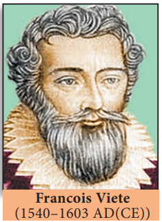
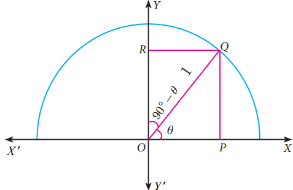

French mathematician Francois Viete used trigonometry in the study of Algebra for solving certain equations by making suitable trigonometric substitutions. His famous formula for \pi can be derived with repeated use of trigonometric ratios. One of his famous works titled Canon Mathematics covers trigonometry; it contains trigonometric tables, it also gives the mathematics behind the construction of the tables, and it details how to solve both plane and spherical triangles. He also provided the means for extracting roots and solutions of equations of degree atmost six. Viete introduced the term "coefficient" in mathematics.

Francois Viete (1540-1603 \mathrm{AD}(\mathrm{CE})) He provided a simple formula relating the roots of a equation with its coefficients. He also provided geometric methods to solve doubling the cube and trisecting the angle problems. He was also involved in deciphering codes.

**Learning Outcomes** 

- To recall trigonometric ratios.
- To recall fundamental relations between the trigonometric ratios of an angle.

- To recall trigonometric ratios of complementary angles.
- To understand trigonometric identities.
- To know methods of solving problems concerning heights and distances of various objects.

# Introduction

From very ancient times surveyors, navigators and astronomers have made use of triangles to determine distances that could not be measured directly. This gave birth to the branch of mathematics what we call today as "Trigonometry".

Hipparchus of Rhodes around 200 BC(BCE), constructed a table of chord lengths for a circle of circumference 360 \times 60=21600 units which corresponds to one unit of circumference for each minute of arc. For this achievement, Hipparchus is considered as "The Father of Trigonometry" since it became the basis for further development.

Indian scholars of the 5th century \mathrm{AD}(\mathrm{CE}), realized that working with half-chords for half-angles greatly simplified the theory of chords and its application to astronomy. Mathematicians like Aryabhata, the two Bhaskaras and several others developed astonishingly sophisticated techniques for calculating half-chord (Jya) values.

Mathematician Abu Al-Wafa of Baghdad believed to have invented the tangent function, which he called the "Shadow". Arabic scholars did not know how to translate the word Jya, into their texts and simply wrote jiba as a close approximate word.

Misinterpreting the Arabic word 'jiba' for 'cove' or 'bay', translators wrote the Arabic word 'jiba' as 'sinus' in Latin to represent the half-chord. From this, we have the name 'sine' used to this day. The word "Trigonometry" itself was invented by German mathematician Bartholomaeus Pitiscus in the beginning of 17 th century \mathrm{AD}(\mathrm{CE}).

**Recall**

**Trigonometric Ratios**

Let 0^{\circ}<\theta<90^{\circ}

| Let us take right triangle O M P |  |
| :---: | :---: |
| \sin \theta=\frac{\text { Opposite side }}{\text { Hypotenuse }}=\frac{M P}{O P} |  |
| Fig. 6.1 | \cos \theta=\frac{\text { Adjacent side }}{\text { Hypotenuse }}=\frac{O M}{O P} |

From the above two ratios we can obtain other four trigonometric ratios as follows.


\begin{aligned}
\tan \theta & =\frac{\sin \theta}{\cos \theta} ; \cot \theta=\frac{\cos \theta}{\sin \theta} \\
\operatorname{cosec} \theta & =\frac{1}{\sin \theta} ; \sec \theta=\frac{1}{\cos \theta}
\end{aligned}


 **Note**

All right triangles with \theta as one of the angle are similar. Hence the trigonometric ratios defined through such right angle triangles do not depend on the triangle chosen.

Trigonometric ratios of complementary angle

| \sin \left(90^{\circ}-\theta\right)=\cos \theta | \cos \left(90^{\circ}-\theta\right)=\sin \theta | \tan \left(90^{\circ}-\theta\right)=\cot \theta |
| :--- | :--- | :--- |
| \operatorname{cosec}\left(90^{\circ}-\theta\right)=\sec \theta | \sec \left(90^{\circ}-\theta\right)=\operatorname{cosec} \theta | \cot \left(90^{\circ}-\theta\right)=\tan \theta |

Visual proof of trigonometric complementary angle

Consider a semicircle of radius 1 as shown in the figure.

Let \angle Q O P=\theta.

Then \angle Q O R=90^{\circ}-\theta, so that O P Q R forms a rectangle.

From triangle O P Q, \frac{O P}{O Q}=\cos \theta

But \quad O Q= radius =1


\therefore \quad O P=O Q \cos \theta=\cos \theta


Similarly, \quad \frac{P Q}{O Q}=\sin \theta

\Rightarrow P Q=O Q \sin \theta=\sin \theta(\because O Q=1)


O P=\cos \theta, P Q=\sin \theta


Now, from triangle Q O R,


\text { we have } \begin{aligned}
\frac{O R}{O Q} & =\cos \left(90^{\circ}-\theta\right) \\
\therefore O R & =O Q \cos \left(90^{\circ}-\theta\right) \\
O R & =\cos \left(90^{\circ}-\theta\right)
\end{aligned}


Fig. 6.2

Similarly, \frac{R Q}{O Q}=\sin \left(90^{\circ}-\theta\right)

Then, R Q=\sin \left(90^{\circ}-\theta\right)


O R=\cos \left(90^{\circ}-\theta\right), R Q=\sin \left(90^{\circ}-\theta\right) \ldots(2)


\because O P Q R is a rectangle,

O P=R Q and O R=P Q

Therefore, from (1) and (2) we get,

\sin \left(90^{\circ}-\theta\right)=\cos \theta and \cos \left(90^{\circ}-\theta\right)=\sin \theta

 **Note**

Table of Trigonometric Ratios for 0^{\circ}, 3^{\circ}, 45^{\circ}, 60^{\circ}, 90^{\circ}

| Trigonometric   Ratio | \mathbf{0}^{\circ} | \mathbf{3 0 ^ { \circ }} | \mathbf{4 5}^{\circ} | \mathbf{6 0}^{\circ} | \mathbf{9 0}^{\circ} |
| :---: | :---: | :---: | :---: | :---: | :---: |
| \sin \theta | 0 | \frac{1}{2} | \frac{1}{\sqrt{2}} | \frac{\sqrt{3}}{2} | 1 |
| \cos \theta | 1 | \frac{\sqrt{3}}{2} | \frac{1}{\sqrt{2}} | \frac{1}{2} | 0 |
| \tan \theta | 0 | \frac{1}{\sqrt{3}} | 1 | \sqrt{3} | undefined |
| \operatorname{cosec} \theta | undefined | 2 | \sqrt{2} | \frac{2}{\sqrt{3}} | 1 |
| \sec \theta | 1 | \frac{2}{\sqrt{3}} | \sqrt{2} | 2 | undefined |
| \cot \theta | undefined | \sqrt{3} | 1 | \frac{1}{\sqrt{3}} | 0 |

 **Thinking Corner**

1. When will the values of \sin \theta and \cos \theta be equal?
2. For what values of \theta, \sin \theta=2 ?
3. Among the six trigonometric quantities, as the value of angle \theta increase from 0^{\circ} to 90^{\circ}, which of the six trigonometric quantities has undefined values?
4. Is it possible to have eight trigonometric ratios?
5. Let 0^{\circ} \leq \theta \leq 90^{\circ}. For what values of \theta does
(i) \sin \theta>\cos \theta
(ii) \cos \theta>\sin \theta
(iii) \sec \theta=2 \tan \theta
(iv) \operatorname{cosec} \theta=2 \cot \theta