# 6 Trigonometry

> “The deep study of nature is the most fruitful source of mathematical discoveries” — Joseph Fourier

French mathematician Francois Viete used trigonometry in the study of Algebra for solving certain equations by making suitable trigonometric substitutions. His famous formula for $\pi$ can be derived with repeated use of trigonometric ratios. One of his famous works titled Canon Mathematics covers trigonometry; it contains trigonometric tables, it also gives the mathematics behind the construction of the tables, and it details how to solve both plane and spherical triangles. He also provided the means for extracting roots and solutions of equations of degree atmost six. Viete introduced the term “coefficient” in mathematics. He provided a simple formula relating the roots of a equation with its coefficients. He also provided geometric methods to solve doubling the cube and trisecting the angle problems. He was also involved in deciphering codes.

## Learning Outcomes

- To recall trigonometric ratios.
- To recall fundamental relations between the trigonometric ratios of an angle.
- To recall trigonometric ratios of complementary angles.
- To understand trigonometric identities.
- To know methods of solving problems concerning heights and distances of various objects.

## 6.1 Introduction

From very ancient times surveyors, navigators and astronomers have made use of triangles to determine distances that could not be measured directly. This gave birth to the branch of mathematics what we call today as “Trigonometry”.

Hipparchus of Rhodes around 200 BC(BCE), constructed a table of chord lengths for a circle of circumference $360\times 60 = 21600$ units which corresponds to one unit of circumference for each minute of arc. For this achievement, Hipparchus is considered as “The Father of Trigonometry” since it became the basis for further development.

Indian scholars of the 5th century AD(CE), realized that working with half-chords for half-angles greatly simplified the theory of chords and its application to astronomy. Mathematicians like Aryabhata, the two Bhaskaras and several others developed astonishingly sophisticated techniques for calculating half-chord (Jya) values.

Mathematician Abu Al-Wafa of Baghdad believed to have invented the tangent function, which he called the “Shadow”. Arabic scholars did not know how to translate the word Jya, into their texts and simply wrote jiba as a close approximate word.

Misinterpreting the Arabic word ‘jiba’ for ‘cove’ or ‘bay’, translators wrote the Arabic word ‘jiba’ as ‘sinus’ in Latin to represent the half-chord. From this, we have the name ‘sine’ used to this day. The word “Trigonometry” itself was invented by German mathematician Bartholomaeus Pitiscus in the beginning of 17th century AD(CE).

### Recall

##### Trigonometric Ratios

Let $0^\circ < \theta < 90^\circ$

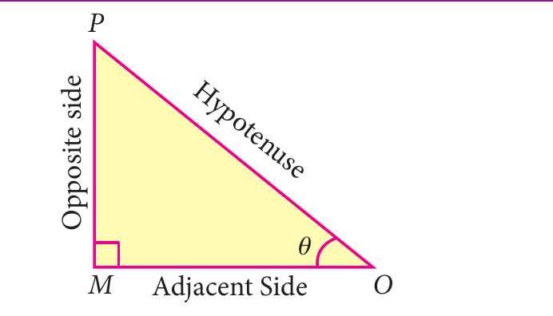

Let us take right triangle $OMP$

$$\sin\theta = \frac{\text{Opposite side}}{\text{Hypotenuse}} = \frac{MP}{OP}$$

$$\cos\theta = \frac{\text{Adjacent side}}{\text{Hypotenuse}} = \frac{OM}{OP}$$

From the above two ratios we can obtain other four trigonometric ratios as follows.

$$\tan\theta = \frac{\sin\theta}{\cos\theta};\ \cot\theta = \frac{\cos\theta}{\sin\theta};\ \operatorname{cosec}\theta = \frac{1}{\sin\theta};\ \sec\theta = \frac{1}{\cos\theta}$$

>**Note**
>
>All right triangles with $\theta$ as one of the angle are similar. Hence the trigonometric ratios defined through such right angle triangles do not depend on the triangle chosen.

##### Trigonometric ratios of complementary angle

| | | |
|---|---|---|
| $\sin(90^\circ-\theta) = \cos\theta$ | $\cos(90^\circ-\theta) = \sin\theta$ | $\tan(90^\circ-\theta) = \cot\theta$ |
| $\operatorname{cosec}(90^\circ-\theta) = \sec\theta$ | $\sec(90^\circ-\theta) = \operatorname{cosec}\theta$ | $\cot(90^\circ-\theta) = \tan\theta$ |

##### Visual proof of trigonometric complementary angle

Consider a semicircle of radius 1 as shown in the figure.

Let $\angle QOP = \theta$.

Then $\angle QOR = 90^\circ - \theta$, so that $OPQR$ forms a rectangle.

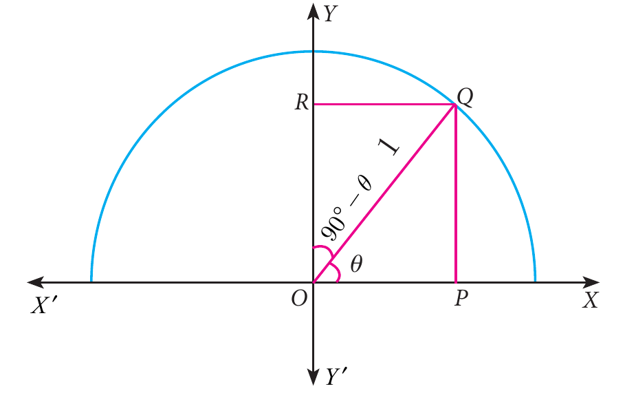

From triangle $OPQ$, $\dfrac{OP}{OQ} = \cos\theta$

But $OQ = \text{radius} = 1$

$\therefore\ OP = OQ\cos\theta = \cos\theta$

Similarly, $\dfrac{PQ}{OQ} = \sin\theta$

$\Rightarrow PQ = OQ\sin\theta = \sin\theta\ (\because OQ = 1)$

$OP = \cos\theta,\ PQ = \sin\theta \quad \ldots(1)$

Now, from triangle $QOR$,

we have $\dfrac{OR}{OQ} = \cos(90^\circ-\theta)$

$\therefore\ OR = OQ\cos(90^\circ-\theta)$

$OR = \cos(90^\circ-\theta)$

Similarly, $\dfrac{RQ}{OQ} = \sin(90^\circ-\theta)$

Then, $RQ = \sin(90^\circ-\theta)$

$OR = \cos(90^\circ-\theta),\ RQ = \sin(90^\circ-\theta) \quad \ldots(2)$

$\because OPQR$ is a rectangle,

$OP = RQ$ and $OR = PQ$

Therefore, from (1) and (2) we get,

$$\boxed{\sin(90^\circ-\theta) = \cos\theta} \text{ and } \boxed{\cos(90^\circ-\theta) = \sin\theta}$$

>**Note**
>
>| | |
>|---|---|
>| $(\sin\theta)^2 = \sin^2\theta$ | $(\operatorname{cosec}\theta)^2 = \operatorname{cosec}^2\theta$ |
>| $(\cos\theta)^2 = \cos^2\theta$ | $(\sec\theta)^2 = \sec^2\theta$ |
>| $(\tan\theta)^2 = \tan^2\theta$ | $(\cot\theta)^2 = \cot^2\theta$ |

##### Table of Trigonometric Ratios for $0^\circ, 30^\circ, 45^\circ, 60^\circ, 90^\circ$

| Trigonometric Ratio \ $\theta$ | $0^\circ$ | $30^\circ$ | $45^\circ$ | $60^\circ$ | $90^\circ$ |
|---|---|---|---|---|---|
| $\sin\theta$ | $0$ | $\frac{1}{2}$ | $\frac{1}{\sqrt{2}}$ | $\frac{\sqrt{3}}{2}$ | $1$ |
| $\cos\theta$ | $1$ | $\frac{\sqrt{3}}{2}$ | $\frac{1}{\sqrt{2}}$ | $\frac{1}{2}$ | $0$ |
| $\tan\theta$ | $0$ | $\frac{1}{\sqrt{3}}$ | $1$ | $\sqrt{3}$ | undefined |
| $\operatorname{cosec}\theta$ | undefined | $2$ | $\sqrt{2}$ | $\frac{2}{\sqrt{3}}$ | $1$ |
| $\sec\theta$ | $1$ | $\frac{2}{\sqrt{3}}$ | $\sqrt{2}$ | $2$ | undefined |
| $\cot\theta$ | undefined | $\sqrt{3}$ | $1$ | $\frac{1}{\sqrt{3}}$ | $0$ |

>**Thinking Corner**
>
>1. When will the values of $\sin\theta$ and $\cos\theta$ be equal?
>2. For what values of $\theta$, $\sin\theta = 2$?
>3. Among the six trigonometric quantities, as the value of angle $\theta$ increase from $0^\circ$ to $90^\circ$, which of the six trigonometric quantities has undefined values?
>4. Is it possible to have eight trigonometric ratios?
>5. Let $0^\circ \le \theta \le 90^\circ$. For what values of $\theta$ does
>
>   (i) $\sin\theta > \cos\theta$ &emsp; (ii) $\cos\theta > \sin\theta$ &emsp; (iii) $\sec\theta = 2\tan\theta$ &emsp; (iv) $\operatorname{cosec}\theta = 2\cot\theta$

## 6.2 Trigonometric Identities

For all real values of $\theta$, we have the following three identities.

(i) $\sin^2\theta + \cos^2\theta = 1$ &emsp; (ii) $1 + \tan^2\theta = \sec^2\theta$ &emsp; (iii) $1 + \cot^2\theta = \operatorname{cosec}^2\theta$

These identities are termed as three fundamental identities of trigonometry.

We will now prove them as follows.

| Picture | Identity | Proof |
|---|---|---|
| 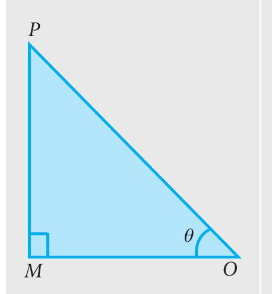 | $\sin^2\theta + \cos^2\theta = 1$ | In the right angled $\Delta OMP$, we have $\dfrac{OM}{OP} = \cos\theta,\ \dfrac{PM}{OP} = \sin\theta \ \ldots(1)$ By Pythagoras theorem $MP^2 + OM^2 = OP^2 \ \ldots(2)$ Dividing each term on both sides of (2) by $OP^2$, $(\because OP \neq 0)$ we get, $\dfrac{MP^2}{OP^2} + \dfrac{OM^2}{OP^2} = \dfrac{OP^2}{OP^2}$ $\Rightarrow \left(\dfrac{MP}{OP}\right)^2 + \left(\dfrac{OM}{OP}\right)^2 = \left(\dfrac{OP}{OP}\right)^2$ From (1), $(\sin\theta)^2 + (\cos\theta)^2 = 1^2$ Hence $\sin^2\theta + \cos^2\theta = 1$ |
| | $1 + \tan^2\theta = \sec^2\theta$ | In the right angled $\Delta OMP$, we have $\dfrac{MP}{OM} = \tan\theta,\ \dfrac{OP}{OM} = \sec\theta \ \ldots(3)$ From (2), $MP^2 + OM^2 = OP^2$ Dividing each term on both sides of (2) by $OM^2$, $(\because OM \neq 0)$ we get, $\dfrac{MP^2}{OM^2} + \dfrac{OM^2}{OM^2} = \dfrac{OP^2}{OM^2}$ $\Rightarrow \left(\dfrac{MP}{OM}\right)^2 + \left(\dfrac{OM}{OM}\right)^2 = \left(\dfrac{OP}{OM}\right)^2$ From (3), $(\tan\theta)^2 + 1^2 = (\sec\theta)^2$ Hence $1 + \tan^2\theta = \sec^2\theta$. |
| | $1 + \cot^2\theta = \operatorname{cosec}^2\theta$ | In the right angled $\Delta OMP$, we have $\dfrac{OM}{MP} = \cot\theta,\ \dfrac{OP}{MP} = \operatorname{cosec}\theta \ \ldots(4)$ From (2), $MP^2 + OM^2 = OP^2$ Dividing each term on both sides of (2) by $MP^2$, $(\because MP \neq 0)$ we get, $\dfrac{MP^2}{MP^2} + \dfrac{OM^2}{MP^2} = \dfrac{OP^2}{MP^2}$ $\Rightarrow \left(\dfrac{MP}{MP}\right)^2 + \left(\dfrac{OM}{MP}\right)^2 = \left(\dfrac{OP}{MP}\right)^2$ From (4), $1^2 + (\cot\theta)^2 = (\operatorname{cosec}\theta)^2$ Hence, $1 + \cot^2\theta = \operatorname{cosec}^2\theta$ |

**These identities can also be rewritten as follows.**

| Identity | Equal forms |
|---|---|
| $\sin^2\theta + \cos^2\theta = 1$ | $\sin^2\theta = 1 - \cos^2\theta$ (or) $\cos^2\theta = 1 - \sin^2\theta$ |
| $1 + \tan^2\theta = \sec^2\theta$ | $\tan^2\theta = \sec^2\theta - 1$ (or) $\sec^2\theta - \tan^2\theta = 1$ |
| $1 + \cot^2\theta = \operatorname{cosec}^2\theta$ | $\cot^2\theta = \operatorname{cosec}^2\theta - 1$ (or) $\operatorname{cosec}^2\theta - \cot^2\theta = 1$ |

>**Note**
>
>Though the above identities are true for any angle $\theta$, we will consider the six trigonometric ratios only for $0^\circ < \theta < 90^\circ$

>**Activity 1**
>
>Take a white sheet of paper. Construct two perpendicular lines $OX$, $OY$ which meet at $O$, as shown in the Fig. 6.4(a).
>
>
>
>Considering $OX$ as $X$ axis, $OY$ as $Y$ axis.
>
>We will verify the values of $\sin\theta$ and $\cos\theta$ for certain angles $\theta$.
>
>Let $\theta = 30^\circ$
>
>Construct a line segment $OA$ of any length such that $\angle AOX = 30^\circ$, as shown in the Fig. 6.4(b).
>
>
>
>Draw a perpendicular from $A$ to $OX$, meeting at $B$.
>
>Now using scale, measure the lengths of $AB$, $OB$ and $OA$.
>
>Find the ratios $\dfrac{AB}{OA}$, $\dfrac{OB}{OA}$ and $\dfrac{AB}{OB}$.
>
>What do you get? Can you compare these values with the trigonometric table values? What is your conclusion? Carry out the same procedure for $\theta = 45^\circ$ and $\theta = 60^\circ$. What are your conclusions?

#### Example 6.1

Prove that $\tan^2\theta - \sin^2\theta = \tan^2\theta\sin^2\theta$

**Solution**

$$\begin{aligned}
\tan^2\theta - \sin^2\theta &= \tan^2\theta - \frac{\sin^2\theta}{\cos^2\theta}.\cos^2\theta \\
&= \tan^2\theta(1-\cos^2\theta) = \tan^2\theta\sin^2\theta
\end{aligned}$$

#### Example 6.2

Prove that $\dfrac{\sin A}{1+\cos A} = \dfrac{1-\cos A}{\sin A}$

**Solution**

$$\begin{aligned}
\frac{\sin A}{1+\cos A} &= \frac{\sin A}{1+\cos A}\times\frac{1-\cos A}{1-\cos A} \quad \text{[multiply numerator and denominator by the conjugate of } 1+\cos A\text{]} \\
&= \frac{\sin A(1-\cos A)}{(1+\cos A)(1-\cos A)} = \frac{\sin A(1-\cos A)}{1-\cos^2 A} \\
&= \frac{\sin A(1-\cos A)}{\sin^2 A} = \frac{1-\cos A}{\sin A}
\end{aligned}$$

#### Example 6.3

Prove that $1 + \dfrac{\cot^2\theta}{1+\operatorname{cosec}\theta} = \operatorname{cosec}\theta$

**Solution**

$$\begin{aligned}
1 + \frac{\cot^2\theta}{1+\operatorname{cosec}\theta} &= 1 + \frac{\operatorname{cosec}^2\theta - 1}{\operatorname{cosec}\theta + 1} \quad \left[\because \operatorname{cosec}^2\theta - 1 = \cot^2\theta\right] \\
&= 1 + \frac{(\operatorname{cosec}\theta+1)(\operatorname{cosec}\theta-1)}{\operatorname{cosec}\theta+1} \\
&= 1 + (\operatorname{cosec}\theta - 1) = \operatorname{cosec}\theta
\end{aligned}$$

#### Example 6.4

Prove that $\sec\theta - \cos\theta = \tan\theta\sin\theta$

**Solution**

$$\begin{aligned}
\sec\theta - \cos\theta &= \frac{1}{\cos\theta} - \cos\theta = \frac{1-\cos^2\theta}{\cos\theta} \\
&= \frac{\sin^2\theta}{\cos\theta} \quad \left[\because 1-\cos^2\theta = \sin^2\theta\right] \\
&= \frac{\sin\theta}{\cos\theta}\times\sin\theta = \tan\theta\sin\theta
\end{aligned}$$

#### Example 6.5

Prove that $\sqrt{\dfrac{1+\cos\theta}{1-\cos\theta}} = \operatorname{cosec}\theta + \cot\theta$

**Solution**

$$\begin{aligned}
\sqrt{\frac{1+\cos\theta}{1-\cos\theta}} &= \sqrt{\frac{1+\cos\theta}{1-\cos\theta}\times\frac{1+\cos\theta}{1+\cos\theta}} \quad \text{[multiply numerator and denominator by the conjugate of } 1-\cos\theta\text{]} \\
&= \sqrt{\frac{(1+\cos\theta)^2}{1-\cos^2\theta}} = \frac{1+\cos\theta}{\sqrt{\sin^2\theta}} \quad \left[\because \sin^2\theta + \cos^2\theta = 1\right] \\
&= \frac{1+\cos\theta}{\sin\theta} = \operatorname{cosec}\theta + \cot\theta
\end{aligned}$$

#### Example 6.6

Prove that $\dfrac{\sec\theta}{\sin\theta} - \dfrac{\sin\theta}{\cos\theta} = \cot\theta$

**Solution**

$$\begin{aligned}
\frac{\sec\theta}{\sin\theta} - \frac{\sin\theta}{\cos\theta} &= \frac{\frac{1}{\cos\theta}}{\sin\theta} - \frac{\sin\theta}{\cos\theta} = \frac{1}{\sin\theta\cos\theta} - \frac{\sin\theta}{\cos\theta} \\
&= \frac{1-\sin^2\theta}{\sin\theta\cos\theta} = \frac{\cos^2\theta}{\sin\theta\cos\theta} = \cot\theta
\end{aligned}$$

#### Example 6.7

Prove that $\sin^2 A\cos^2 B + \cos^2 A\sin^2 B + \cos^2 A\cos^2 B + \sin^2 A\sin^2 B = 1$

**Solution**

$$\begin{aligned}
&\sin^2 A\cos^2 B + \cos^2 A\sin^2 B + \cos^2 A\cos^2 B + \sin^2 A\sin^2 B \\
&= \sin^2 A\cos^2 B + \sin^2 A\sin^2 B + \cos^2 A\sin^2 B + \cos^2 A\cos^2 B \\
&= \sin^2 A(\cos^2 B + \sin^2 B) + \cos^2 A(\sin^2 B + \cos^2 B) \\
&= \sin^2 A(1) + \cos^2 A(1) \quad (\because \sin^2 B + \cos^2 B = 1) \\
&= \sin^2 A + \cos^2 A = 1
\end{aligned}$$

#### Example 6.8

If $\cos\theta + \sin\theta = \sqrt{2}\cos\theta$, then prove that $\cos\theta - \sin\theta = \sqrt{2}\sin\theta$

**Solution**

Now, $\cos\theta + \sin\theta = \sqrt{2}\cos\theta$.

Squaring both sides,

$$\begin{aligned}
(\cos\theta + \sin\theta)^2 &= (\sqrt{2}\cos\theta)^2 \\
\cos^2\theta + \sin^2\theta + 2\sin\theta\cos\theta &= 2\cos^2\theta \\
2\cos^2\theta - \cos^2\theta - \sin^2\theta &= 2\sin\theta\cos\theta \\
\cos^2\theta - \sin^2\theta &= 2\sin\theta\cos\theta \\
(\cos\theta + \sin\theta)(\cos\theta - \sin\theta) &= 2\sin\theta\cos\theta \\
\cos\theta - \sin\theta = \frac{2\sin\theta\cos\theta}{\cos\theta + \sin\theta} &= \frac{2\sin\theta\cos\theta}{\sqrt{2}\cos\theta} \quad [\because \cos\theta + \sin\theta = \sqrt{2}\cos\theta] \\
&= \sqrt{2}\sin\theta
\end{aligned}$$

Therefore, $\cos\theta - \sin\theta = \sqrt{2}\sin\theta$.

#### Example 6.9

Prove that $(\operatorname{cosec}\theta - \sin\theta)(\sec\theta - \cos\theta)(\tan\theta + \cot\theta) = 1$

**Solution**

$$\begin{aligned}
&(\operatorname{cosec}\theta - \sin\theta)(\sec\theta - \cos\theta)(\tan\theta + \cot\theta) \\
&= \left(\frac{1}{\sin\theta} - \sin\theta\right)\left(\frac{1}{\cos\theta} - \cos\theta\right)\left(\frac{\sin\theta}{\cos\theta} + \frac{\cos\theta}{\sin\theta}\right) \\
&= \frac{1-\sin^2\theta}{\sin\theta}\times\frac{1-\cos^2\theta}{\cos\theta}\times\frac{\sin^2\theta + \cos^2\theta}{\sin\theta\cos\theta} \\
&= \frac{\cos^2\theta\sin^2\theta\times 1}{\sin^2\theta\cos^2\theta} = 1
\end{aligned}$$

#### Example 6.10

Prove that $\dfrac{\sin A}{1+\cos A} + \dfrac{\sin A}{1-\cos A} = 2\operatorname{cosec}\text{A}$.

**Solution**

$$\begin{aligned}
&\frac{\sin A}{1+\cos A} + \frac{\sin A}{1-\cos A} \\
&= \frac{\sin A(1-\cos A) + \sin A(1+\cos A)}{(1+\cos A)(1-\cos A)} \\
&= \frac{\sin A - \sin A\cos A + \sin A + \sin A\cos A}{1-\cos^2 A} \\
&= \frac{2\sin A}{1-\cos^2 A} = \frac{2\sin A}{\sin^2 A} = 2\operatorname{cosec}\text{A}
\end{aligned}$$

#### Example 6.11

If $\operatorname{cosec}\theta + \cot\theta = P$, then prove that $\cos\theta = \dfrac{P^2-1}{P^2+1}$

**Solution**

Given $\operatorname{cosec}\theta + \cot\theta = P \quad \ldots(1)$

$$\begin{aligned}
\operatorname{cosec}^2\theta - \cot^2\theta &= 1 \text{ (identity)} \\
\operatorname{cosec}\theta - \cot\theta &= \frac{1}{\operatorname{cosec}\theta + \cot\theta} \\
\operatorname{cosec}\theta - \cot\theta &= \frac{1}{P} \quad \ldots(2)
\end{aligned}$$

Adding (1) and (2) we get, $2\operatorname{cosec}\theta = P + \dfrac{1}{P}$

$$2\operatorname{cosec}\theta = \frac{P^2+1}{P} \quad \ldots(3)$$

Subtracting (2) from (1), we get, $2\cot\theta = P - \dfrac{1}{P}$

$$2\cot\theta=\frac{P^2-1}{P}\qquad\ldots(4)$$

Dividing (4) by (3) we get, $\dfrac{2\cot\theta}{2\operatorname{cosec}\theta}=\dfrac{P^2-1}{P}\times\dfrac{P}{P^2+1}\quad\Rightarrow\cos\theta=\dfrac{P^2-1}{P^2+1}$

#### Example 6.12

Prove that $\tan^2 A-\tan^2 B=\dfrac{\sin^2 A-\sin^2 B}{\cos^2 A\cos^2 B}$

**Solution**

$$\begin{aligned}\tan^2 A-\tan^2 B&=\frac{\sin^2 A}{\cos^2 A}-\frac{\sin^2 B}{\cos^2 B}\\&=\frac{\sin^2 A\cos^2 B-\sin^2 B\cos^2 A}{\cos^2 A\cos^2 B}\\&=\frac{\sin^2 A(1-\sin^2 B)-\sin^2 B(1-\sin^2 A)}{\cos^2 A\cos^2 B}\\&=\frac{\sin^2 A-\sin^2 A\sin^2 B-\sin^2 B+\sin^2 A\sin^2 B}{\cos^2 A\cos^2 B}=\frac{\sin^2 A-\sin^2 B}{\cos^2 A\cos^2 B}\end{aligned}$$

#### Example 6.13

Prove that $\left(\dfrac{\cos^3 A-\sin^3 A}{\cos A-\sin A}\right)-\left(\dfrac{\cos^3 A+\sin^3 A}{\cos A+\sin A}\right)=2\sin A\cos A$

**Solution**

$$\begin{aligned}&\left(\frac{\cos^3 A-\sin^3 A}{\cos A-\sin A}\right)-\left(\frac{\cos^3 A+\sin^3 A}{\cos A+\sin A}\right)\\&=\left(\frac{(\cos A-\sin A)(\cos^2 A+\sin^2 A+\cos A\sin A)}{\cos A-\sin A}\right)\qquad\left[\because\ \begin{aligned}a^3-b^3&=(a-b)(a^2+b^2+ab)\\a^3+b^3&=(a+b)(a^2+b^2-ab)\end{aligned}\right]\\&\quad-\left(\frac{(\cos A+\sin A)(\cos^2 A+\sin^2 A-\cos A\sin A)}{\cos A+\sin A}\right)\\&=(1+\cos A\sin A)-(1-\cos A\sin A)\\&=2\cos A\sin A\end{aligned}$$

#### Example 6.14

Prove that $\dfrac{\sin A}{\sec A+\tan A-1}+\dfrac{\cos A}{\operatorname{cosec}A+\cot A-1}=1$

**Solution**

$$\begin{aligned}&\frac{\sin A}{\sec A+\tan A-1}+\frac{\cos A}{\operatorname{cosec}A+\cot A-1}\\&=\frac{\sin A(\operatorname{cosec}A+\cot A-1)+\cos A(\sec A+\tan A-1)}{(\sec A+\tan A-1)(\operatorname{cosec}A+\cot A-1)}\\&=\frac{\sin A\operatorname{cosec}A+\sin A\cot A-\sin A+\cos A\sec A+\cos A\tan A-\cos A}{(\sec A+\tan A-1)(\operatorname{cosec}A+\cot A-1)}\\&=\frac{1+\cos A-\sin A+1+\sin A-\cos A}{\left(\dfrac{1}{\cos A}+\dfrac{\sin A}{\cos A}-1\right)\left(\dfrac{1}{\sin A}+\dfrac{\cos A}{\sin A}-1\right)}\\&=\frac{2}{\left(\dfrac{1+\sin A-\cos A}{\cos A}\right)\left(\dfrac{1+\cos A-\sin A}{\sin A}\right)}\\&=\frac{2\sin A\cos A}{(1+\sin A-\cos A)(1+\cos A-\sin A)}\\&=\frac{2\sin A\cos A}{[1+(\sin A-\cos A)][1-(\sin A-\cos A)]}=\frac{2\sin A\cos A}{1-(\sin A-\cos A)^2}\\&=\frac{2\sin A\cos A}{1-(\sin^2 A+\cos^2 A-2\sin A\cos A)}\qquad=\frac{2\sin A\cos A}{1-(1-2\sin A\cos A)}\\&=\frac{2\sin A\cos A}{1-1+2\sin A\cos A}=\frac{2\sin A\cos A}{2\sin A\cos A}=1.\end{aligned}$$

#### Example 6.15

Show that $\left(\dfrac{1+\tan^2 A}{1+\cot^2 A}\right)=\left(\dfrac{1-\tan A}{1-\cot A}\right)^2$

**Solution**

| LHS | RHS |
|---|---|
| $\left(\dfrac{1+\tan^2 A}{1+\cot^2 A}\right)=\dfrac{1+\tan^2 A}{1+\dfrac{1}{\tan^2 A}}$ | $\left(\dfrac{1-\tan A}{1-\cot A}\right)^2=\left(\dfrac{1-\tan A}{1-\dfrac{1}{\tan A}}\right)^2$ |
| $=\dfrac{1+\tan^2 A}{\dfrac{\tan^2 A+1}{\tan^2 A}}=\tan^2 A\ \ldots(1)$ | $=\left(\dfrac{1-\tan A}{\dfrac{\tan A-1}{\tan A}}\right)^2=(-\tan A)^2=\tan^2 A\ \ldots(2)$ |

From (1) and (2), $\left(\dfrac{1+\tan^2 A}{1+\cot^2 A}\right)=\left(\dfrac{1-\tan A}{1-\cot A}\right)^2$

#### Example 6.16

Prove that $\dfrac{(1+\cot A+\tan A)(\sin A-\cos A)}{\sec^3 A-\operatorname{cosec}^3 A}=\sin^2 A\cos^2 A$

**Solution**

$$\begin{aligned}&\frac{(1+\cot A+\tan A)(\sin A-\cos A)}{\sec^3 A-\operatorname{cosec}^3 A}\\&=\frac{\left(1+\dfrac{\cos A}{\sin A}+\dfrac{\sin A}{\cos A}\right)(\sin A-\cos A)}{(\sec A-\operatorname{cosec}A)(\sec^2 A+\sec A\operatorname{cosec}A+\operatorname{cosec}^2 A)}\\&=\frac{\dfrac{(\sin A\cos A+\cos^2 A+\sin^2 A)(\sin A-\cos A)}{\sin A\cos A}}{(\sec A-\operatorname{cosec}A)\left(\dfrac{1}{\cos^2 A}+\dfrac{1}{\cos A\sin A}+\dfrac{1}{\sin^2 A}\right)}\\&=\frac{(\sin A\cos A+1)\left(\dfrac{\sin A}{\sin A\cos A}-\dfrac{\cos A}{\sin A\cos A}\right)}{(\sec A-\operatorname{cosec}A)\left(\dfrac{\sin^2 A+\sin A\cos A+\cos^2 A}{\sin^2 A\cos^2 A}\right)}\\&=\frac{(\sin A\cos A+1)(\sec A-\operatorname{cosec}A)}{(\sec A-\operatorname{cosec}A)(1+\sin A\cos A)}\times\sin^2 A\cos^2 A=\sin^2 A\cos^2 A\end{aligned}$$

#### Example 6.17

If $\dfrac{\cos^2\theta}{\sin\theta}=p$ and $\dfrac{\sin^2\theta}{\cos\theta}=q$, then prove that $p^2q^2(p^2+q^2+3)=1$

**Solution**

We have $\dfrac{\cos^2\theta}{\sin\theta}=p\ \ldots(1)\qquad$ and $\qquad\dfrac{\sin^2\theta}{\cos\theta}=q\ \ldots(2)$

$$\begin{aligned}p^2q^2(p^2+q^2+3)&=\left(\frac{\cos^2\theta}{\sin\theta}\right)^2\left(\frac{\sin^2\theta}{\cos\theta}\right)^2\times\left[\left(\frac{\cos^2\theta}{\sin\theta}\right)^2+\left(\frac{\sin^2\theta}{\cos\theta}\right)^2+3\right]\quad[\text{from (1) and (2)}]\\&=\left(\frac{\cos^4\theta}{\sin^2\theta}\right)\left(\frac{\sin^4\theta}{\cos^2\theta}\right)\times\left[\frac{\cos^4\theta}{\sin^2\theta}+\frac{\sin^4\theta}{\cos^2\theta}+3\right]\\&=(\cos^2\theta\times\sin^2\theta)\times\left[\left(\frac{\cos^6\theta+\sin^6\theta+3\sin^2\theta\cos^2\theta}{\sin^2\theta\cos^2\theta}\right)\right]\\&=\cos^6\theta+\sin^6\theta+3\sin^2\theta\cos^2\theta\\&=(\cos^2\theta)^3+(\sin^2\theta)^3+3\sin^2\theta\cos^2\theta\\&=[(\cos^2\theta+\sin^2\theta)^3-3\cos^2\theta\sin^2\theta(\cos^2\theta+\sin^2\theta)]+3\sin^2\theta\cos^2\theta\\&=1-3\cos^2\theta\sin^2\theta(1)+3\cos^2\theta\sin^2\theta\ =1\end{aligned}$$

> **Progress Check**
>
> 1. The number of trigonometric ratios is \_\_\_\_\_\_.
> 2. $1-\cos^2\theta$ is \_\_\_\_\_\_.
> 3. $(\sec\theta+\tan\theta)(\sec\theta-\tan\theta)$ is \_\_\_\_\_\_.
> 4. $(\cot\theta+\operatorname{cosec}\theta)(\cot\theta-\operatorname{cosec}\theta)$ is \_\_\_\_\_\_.
> 5. $\cos 60^\circ\sin 30^\circ+\cos 30^\circ\sin 60^\circ$ is \_\_\_\_\_\_.
> 6. $\tan 60^\circ\cos 60^\circ+\cot 60^\circ\sin 60^\circ$ is \_\_\_\_\_\_.
> 7. $(\tan 45^\circ+\cot 45^\circ)+(\sec 45^\circ\operatorname{cosec}45^\circ)$ is \_\_\_\_\_\_.
> 8. (i) $\sec\theta=\operatorname{cosec}\theta$ if $\theta$ is \_\_\_\_\_\_. &emsp; (ii) $\cot\theta=\tan\theta$ if $\theta$ is \_\_\_\_\_.

### Exercise 6.1

1. Prove the following identities.

   (i) $\cot\theta+\tan\theta=\sec\theta\operatorname{cosec}\theta$ &emsp; (ii) $\tan^4\theta+\tan^2\theta=\sec^4\theta-\sec^2\theta$

2. Prove the following identities.

   (i) $\dfrac{1-\tan^2\theta}{\cot^2\theta-1}=\tan^2\theta$ &emsp; (ii) $\dfrac{\cos\theta}{1+\sin\theta}=\sec\theta-\tan\theta$

3. Prove the following identities.

   (i) $\sqrt{\dfrac{1+\sin\theta}{1-\sin\theta}}=\sec\theta+\tan\theta$ &emsp; (ii) $\sqrt{\dfrac{1+\sin\theta}{1-\sin\theta}}+\sqrt{\dfrac{1-\sin\theta}{1+\sin\theta}}=2\sec\theta$

4. Prove the following identities.

   (i) $\sec^6\theta=\tan^6\theta+3\tan^2\theta\sec^2\theta+1$

   (ii) $(\sin\theta+\sec\theta)^2+(\cos\theta+\operatorname{cosec}\theta)^2=1+(\sec\theta+\operatorname{cosec}\theta)^2$

5. Prove the following identities.

   (i) $\sec^4\theta(1-\sin^4\theta)-2\tan^2\theta=1$ &emsp; (ii) $\dfrac{\cot\theta-\cos\theta}{\cot\theta+\cos\theta}=\dfrac{\operatorname{cosec}\theta-1}{\operatorname{cosec}\theta+1}$

6. Prove the following identities.

   (i) $\dfrac{\sin A-\sin B}{\cos A+\cos B}+\dfrac{\cos A-\cos B}{\sin A+\sin B}=0$ &emsp; (ii) $\dfrac{\sin^3 A+\cos^3 A}{\sin A+\cos A}+\dfrac{\sin^3 A-\cos^3 A}{\sin A-\cos A}=2$

7. (i) If $\sin\theta+\cos\theta=\sqrt{3}$, then prove that $\tan\theta+\cot\theta=1$.

   (ii) If $\sqrt{3}\sin\theta-\cos\theta=0$, then show that $\tan 3\theta=\dfrac{3\tan\theta-\tan^3\theta}{1-3\tan^2\theta}$

8. (i) If $\dfrac{\cos\alpha}{\cos\beta}=m$ and $\dfrac{\cos\alpha}{\sin\beta}=n$, then prove that $(m^2+n^2)\cos^2\beta=n^2$

   (ii) If $\cot\theta+\tan\theta=x$ and $\sec\theta-\cos\theta=y$, then prove that $(x^2y)^{\frac{2}{3}}-(xy^2)^{\frac{2}{3}}=1$

9. (i) If $\sin\theta+\cos\theta=p$ and $\sec\theta+\operatorname{cosec}\theta=q$, then prove that $q(p^2-1)=2p$

   (ii) If $\sin\theta(1+\sin^2\theta)=\cos^2\theta$, then prove that $\cos^6\theta-4\cos^4\theta+8\cos^2\theta=4$

10. If $\dfrac{\cos\theta}{1+\sin\theta}=\dfrac{1}{a}$, then prove that $\dfrac{a^2-1}{a^2+1}=\sin\theta$

## 6.3 Heights and Distances

In this section, we will see how trigonometry is used for finding the heights and distances of various objects without actually measuring them. For example, the height of a tower, mountain, building or tree, distance of a ship from a light house, width of a river, etc. can be determined by using knowledge of trigonometry. The process of finding Heights and Distances is the best example of applying trigonometry in real-life situations. We would explain these applications through some examples. Before studying methods to find heights and distances, we should understand some basic definitions.

##### Line of Sight

The line of sight is the line drawn from the eye of an observer to the point in the object viewed by the observer.

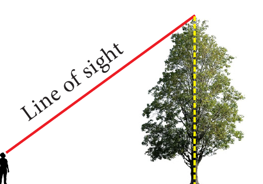

##### Theodolite

Theodolite is an instrument which is used in measuring the angle between an object and the eye of the observer. A theodolite consists of two graduated wheels placed at right angles to each other and a telescope. The wheels are used for the measurement of horizontal and vertical angles. The angle to the desired point is measured by positioning the telescope towards that point. The angle can be read on the telescope scale.

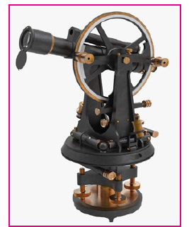

##### Angle of Elevation

The angle of elevation is an angle formed by the line of sight with the horizontal when the point being viewed is above the horizontal level. That is, the case when we raise our head to look at the object. (see Fig. 6.7)

##### Angle of Depression

The angle of depression is an angle formed by the line of sight with the horizontal when the point is below the horizontal level. That is, the case when we lower our head to look at the point being viewed. (see Fig. 6.8)

##### Clinometer

The angle of elevation and depression are usually measured by a device called clinometer.

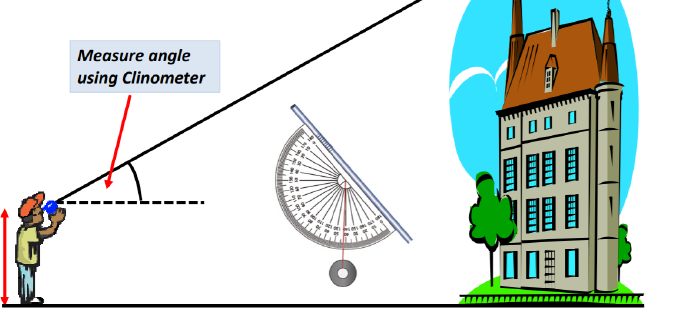

> **Note**
>
> - From a given point, when height of an object increases the angle of elevation increases.
>
>   If $h_1>h_2$ then $\alpha>\beta$
>
>   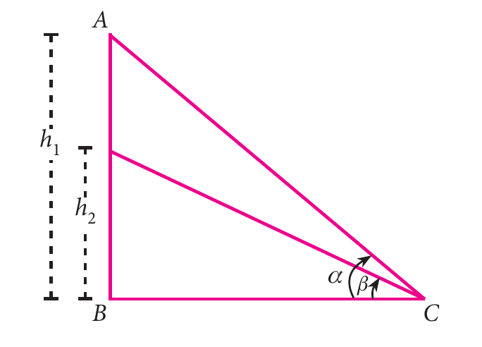
>
> - The angle of elevation increases as we move towards the foot of the vertical object like tower or building.
>
>   If $d_2<d_1$ then $\beta>\alpha$
>
>   

> **Activity 2**
>
> Representation of situations through right triangles. Draw a figure to illustrate the situation.
>
> | Situations | Draw a figure |
> |---|---|
> | A tower stands vertically on the ground. From a point on the ground, which is 20m away from the foot of the tower, the angle of elevation of the top of the tower is found to be 45°. | 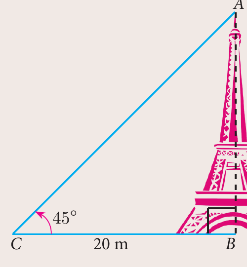 Fig. 6.11 |
> | An observer of 1.8 m tall is 25.2 m away from a chimney. The angle of elevation of the top of the chimney from her eyes is 45°. | ……………………………… |
> | From a point $P$ on the ground the angle of elevation of the top of a 20 m tall building is 30°. A flag is hoisted at the top of the building and the angle of elevation of the top of the flagstaff from $P$ is 55° . | ……………………………… |
> | The shadow of a tower standing on a level ground is found to be 40 m longer when the Sun's altitude is 30° than when it is 60°. | ………………………………… |

### 6.3.1 Problems involving Angle of Elevation

In this section, we try to solve problems when Angle of elevation are given.

#### Example 6.18

Calculate $\angle BAC$ in the given triangles. ($\tan 38.7^\circ=0.8011$, $\tan 69.4^\circ=2.6604$)

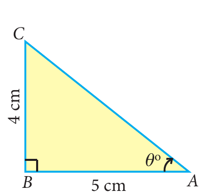

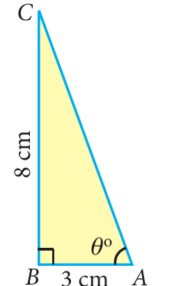

**Solution**

| (i) In the right angled $\Delta ABC$ [see Fig.6.12(a)] | (ii) In the right angled $\Delta ABC$ [see Fig.6.12(b)] |
|---|---|
| $\tan\theta=\dfrac{\text{opposite side}}{\text{adjacent side}}=\dfrac{4}{5}$ | $\tan\theta=\dfrac{8}{3}$ |
| $\tan\theta=0.8$ | $\tan\theta=2.66$ |
| $\Rightarrow\theta=38.7^\circ$ ($\because\tan 38.7^\circ=0.8011$) | $\Rightarrow\theta=69.4^\circ$ ($\because\tan 69.4^\circ=2.6604$) |
| $\therefore\angle BAC=38.7^\circ$ | $\therefore\angle BAC=69.4^\circ$ |

#### Example 6.19

A tower stands vertically on the ground. From a point on the ground, which is 48 m away from the foot of the tower, the angle of elevation of the top of the tower is $30^\circ$. Find the height of the tower.

**Solution**

Let $PQ$ be the height of the tower.

Take $PQ=h$ and $QR$ is the distance between the tower and the point $R$. In the right angled $\Delta PQR$, $\angle PRQ=30^\circ$

$$\begin{aligned}\tan\theta&=\frac{PQ}{QR}\\\tan 30^\circ&=\frac{h}{48}\Rightarrow\frac{1}{\sqrt{3}}=\frac{h}{48}\Rightarrow h=16\sqrt{3}\end{aligned}$$

Therefore, the height of the tower is $16\sqrt{3}$ m

#### Example 6.20

A kite is flying at a height of 75 m above the ground. The string attached to the kite is temporarily tied to a point on the ground. The inclination of the string with the ground is $60^\circ$. Find the length of the string, assuming that there is no slack in the string.

**Solution**

Let $AB$ be the height of the kite above the ground. Then, $AB=75$.

Let $AC$ be the length of the string.

In the right angled $\Delta ABC$, $\angle ACB=60^\circ$

$$\begin{aligned}\sin\theta&=\frac{AB}{AC}\\\sin 60^\circ&=\frac{75}{AC}\\\Rightarrow\quad\frac{\sqrt{3}}{2}&=\frac{75}{AC}\Rightarrow AC=\frac{150}{\sqrt{3}}=50\sqrt{3}\end{aligned}$$

Hence, the length of the string is $50\sqrt{3}$ m.

#### Example 6.21

Two ships are sailing in the sea on either sides of a lighthouse. The angle of elevation of the top of the lighthouse as observed from the ships are $30^\circ$ and $45^\circ$ respectively. If the lighthouse is 200 m high, find the distance between the two ships. ($\sqrt{3}=1.732$)

**Solution**

Let $AB$ be the lighthouse. Let $C$ and $D$ be the positions of the two ships.

Then, $AB=200$ m.

$\angle ACB=30^\circ$, $\angle ADB=45^\circ$

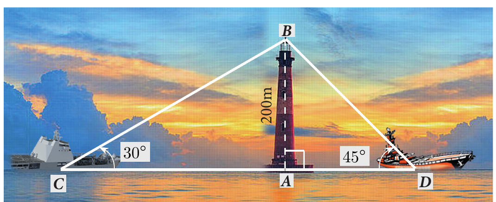

In the right angled $\Delta BAC$, $\tan 30^\circ=\dfrac{AB}{AC}$

$$\frac{1}{\sqrt{3}}=\frac{200}{AC}\Rightarrow AC=200\sqrt{3}\qquad\ldots(1)$$

In the right angled $\Delta BAD$, $\tan 45^\circ=\dfrac{AB}{AD}$

$$1=\frac{200}{AD}\Rightarrow AD=200\qquad\ldots(2)$$

$$\begin{aligned}\text{Now,}\qquad CD&=AC+AD=200\sqrt{3}+200\qquad[\text{by (1) and (2)}]\\CD&=200(\sqrt{3}+1)=200\times 2.732=546.4\end{aligned}$$

Distance between two ships is 546.4 m.

#### Example 6.22

From a point on the ground, the angles of elevation of the bottom and top of a tower fixed at the top of a 30 m high building are $45^\circ$ and $60^\circ$ respectively. Find the height of the tower. ($\sqrt{3}=1.732$)

**Solution**

Let $AC$ be the height of the tower.

Let $AB$ be the height of the building.

Then, $AC=h$ metres, $AB=30$ m

In the right angled $\Delta CBP$, $\angle CPB=60^\circ$

$$\begin{aligned}\tan\theta&=\frac{BC}{BP}\\\tan 60^\circ&=\frac{AB+AC}{BP}\Rightarrow\sqrt{3}=\frac{30+h}{BP}\qquad\ldots(1)\end{aligned}$$

In the right angled $\Delta ABP$, $\angle APB=45^\circ$

$$\begin{aligned}\tan\theta&=\frac{AB}{BP}\\\tan 45^\circ&=\frac{30}{BP}\Rightarrow BP=30\qquad\ldots(2)\end{aligned}$$

Substituting (2) in (1), we get $\sqrt{3}=\dfrac{30+h}{30}$

$$h=30(\sqrt{3}-1)=30(1.732-1)=30(0.732)=21.96$$

Hence, the height of the tower is 21.96 m.

#### Example 6.23

A TV tower stands vertically on a bank of a canal. The tower is watched from a point on the other bank directly opposite to it. The angle of elevation of the top of the tower is 58°. From another point 20 m away from this point on the line joining this point to the foot of the tower, the angle of elevation of the top of the tower is 30°. Find the height of the tower and the width of the canal. ($\tan 58^\circ=1.6003$)

**Solution**

Let $AB$ be the height of the TV tower.

$CD = 20$ m.

Let $BC$ be the width of the canal.

In the right angled $\Delta ABC$, $\tan 58^\circ = \frac{AB}{BC}$

$$1.6003 = \frac{AB}{BC} \quad \ldots(1)$$

In the right angled $\Delta ABD$, $\tan 30^\circ = \frac{AB}{BD} = \frac{AB}{BC+CD}$

$$\frac{1}{\sqrt{3}} = \frac{AB}{BC+20} \quad \ldots(2)$$

Dividing (1) by (2) we get, $\frac{1.6003}{\frac{1}{\sqrt{3}}} = \frac{BC+20}{BC}$

$$BC = \frac{20}{1.7717} = 11.29\text{ m} \quad \ldots(3)$$

$$1.6003 = \frac{AB}{11.29} \text{ [from (1) and (3)]}$$

$$AB = 18.07$$

Hence, the height of the tower is $18.07$ m and the width of the canal is $11.29$ m.

#### Example 6.24

An aeroplane sets off from $G$ on a bearing of $24^\circ$ towards $H$, a point $250$ km away. At $H$ it changes course and heads towards $J$ deviates further by $55^\circ$ and a distance of 180 km away.

(i) How far is $H$ to the North of $G$? &emsp; (ii) How far is $H$ to the East of $G$?

(iii) How far is $J$ to the North of $H$? &emsp; (iv) How far is $J$ to the East of $H$?

$$\begin{pmatrix} \sin 24^\circ = 0.4067 & \sin 11^\circ = 0.1908 \\ \cos 24^\circ = 0.9135 & \cos 11^\circ = 0.9816 \end{pmatrix}$$

**Solution**

(i) In the right angled $\Delta GOH$, $\cos 24^\circ = \frac{OG}{GH}$

$0.9135 = \frac{OG}{250}$ ; $OG = 228.38$ km

Distance of $H$ to the North of $G = 228.38$ km

(ii) In the right angled $\Delta GOH$,

$\sin 24^\circ = \frac{OH}{GH}$

$0.4067 = \frac{OH}{250}$ ; $OH = 101.68$

Distance of $H$ to the East of $G = 101.68$ km

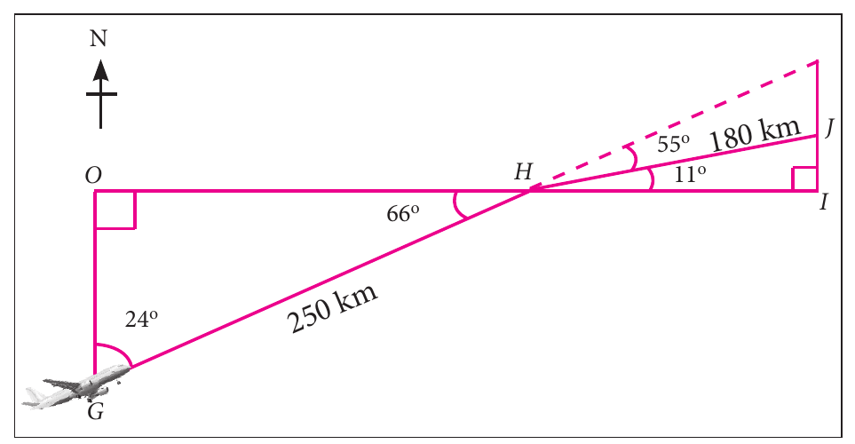

(iii) In the right angled $\Delta HIJ$,

$\sin 11^\circ = \frac{IJ}{HJ}$

$0.1908 = \frac{IJ}{180}$ ; $IJ = 34.34$ km

Distance of $J$ to the North of $H = 34.34$ km

(iv) In the right angled $\Delta HIJ$,

$\cos 11^\circ = \frac{HI}{HJ}$

$0.9816 = \frac{HI}{180}$ ; $HI = 176.69$ km

Distance of $J$ to the East of $H = 176.69$ km

#### Example 6.25

As shown in the figure, two trees are standing on flat ground. The angle of elevation of the top of both the trees from a point $X$ on the ground is $40^\circ$. If the horizontal distance between $X$ and the smaller tree is 8 m and the distance of the top of the two trees is 20 m, calculate

(i) the distance between the point $X$ and the top of the smaller tree.

(ii) the horizontal distance between the two trees.

$(\cos 40^\circ = 0.7660)$

**Solution**

Let $AB$ be the height of the bigger tree and $CD$ be the height of the smaller tree and $X$ is the point on the ground.

(i) In the right angled $\Delta XCD$, $\cos 40^\circ = \frac{CX}{XD}$

$XD = \frac{8}{0.7660} = 10.44$ m

Therefore, the distance between $X$ and top of the smaller tree $= XD = 10.44$ m

(ii) In the right angled $\Delta XAB$,

$\cos 40^\circ = \frac{AX}{BX} = \frac{AC+CX}{BD+DX}$

$0.7660 = \frac{AC+8}{20+10.44} \Rightarrow AC = 23.32 - 8 = 15.32$ m

Therefore, the horizontal distance between two trees $= AC = 15.32$ m

> **Thinking Corner**
>
> 1. What type of triangle is used to calculate heights and distances?
> 2. When the height of the building and distances from the foot of the building is given, which trigonometric ratio is used to find the angle of elevation?
> 3. If the line of sight and angle of elevation is given, then which trigonometric ratio is used
>
>    (i) to find the height of the building
>
>    (ii) to find the distance from the foot of the building.

### Exercise 6.2

1. Find the angle of elevation of the top of a tower from a point on the ground, which is 30 m away from the foot of a tower of height $10\sqrt{3}$ m.

2. A road is flanked on either side by continuous rows of houses of height $4\sqrt{3}$ m with no space in between them. A pedestrian is standing on the median of the road facing a row house. The angle of elevation from the pedestrian to the top of the house is $30^\circ$. Find the width of the road.

3. To a man standing outside his house, the angles of elevation of the top and bottom of a window are $60^\circ$ and $45^\circ$ respectively. If the height of the man is 180 cm and if he is 5 m away from the wall, what is the height of the window? $(\sqrt{3} = 1.732)$

4. A statue 1.6 m tall stands on the top of a pedestal. From a point on the ground, the angle of elevation of the top of the statue is $60^\circ$ and from the same point the angle of elevation of the top of the pedestal is $40^\circ$. Find the height of the pedestal. $(\tan 40^\circ = 0.8391,\ \sqrt{3} = 1.732)$

5. A flag pole of height '$h$' metres is on the top of the hemispherical dome of radius '$r$' metres. A man is standing 7 m away from the dome. Seeing the top of the pole at an angle $45^\circ$ and moving 5 m away from the dome and seeing the bottom of the pole at an angle $30^\circ$. Find (i) the height of the pole (ii) radius of the dome. $(\sqrt{3} = 1.732)$

   

6. The top of a $15$ m high tower makes an angle of elevation of $60^\circ$ with the bottom of an electronic pole and angle of elevation of $30^\circ$ with the top of the pole. What is the height of the electric pole?

### 6.3.2 Problems involving Angle of Depression

In this section, we try to solve problems when Angles of depression are given.

> **Note**
>
> Angle of Depression and Angle of Elevation are equal because they are alternative angles.
>
> 

#### Example 6.26

A player sitting on the top of a tower of height $20$ m observes the angle of depression of a ball lying on the ground as $60^\circ$. Find the distance between the foot of the tower and the ball. $(\sqrt{3} = 1.732)$

**Solution**

Let $BC$ be the height of the tower and $A$ be the position of the ball lying on the ground. Then,

$BC = 20$ m and $\angle XCA = 60^\circ = \angle CAB$

Let $AB = x$ metres.

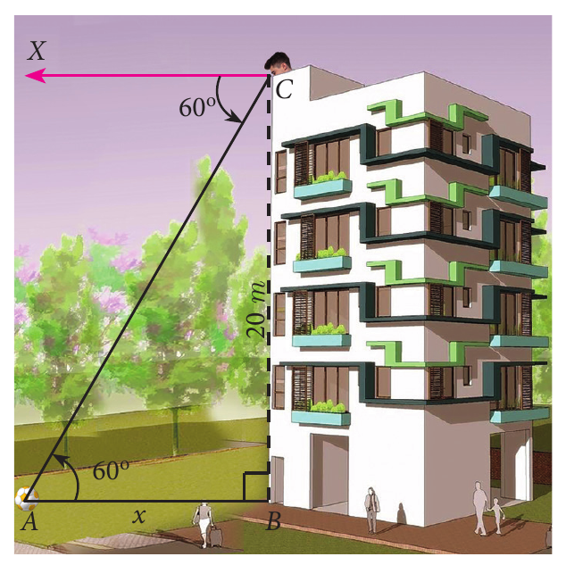

In the right angled $\Delta ABC$,

$$\tan 60^\circ = \frac{BC}{AB}$$

$$\sqrt{3} = \frac{20}{x}$$

$$x = \frac{20 \times \sqrt{3}}{\sqrt{3} \times \sqrt{3}} = \frac{20 \times 1.732}{3} = 11.55 \text{ m.}$$

Hence, the distance between the foot of the tower and the ball is 11.55 m.

#### Example 6.27

The horizontal distance between two buildings is 140 m. The angle of depression of the top of the first building when seen from the top of the second building is $30^\circ$. If the height of the first building is 60 m, find the height of the second building. $(\sqrt{3} = 1.732)$

**Solution**

The height of the first building $AB = 60$ m. Now, $AB = MD = 60$ m

Let the height of the second building $CD = h$. Distance $BD = 140$ m

Now, $AM = BD = 140$ m

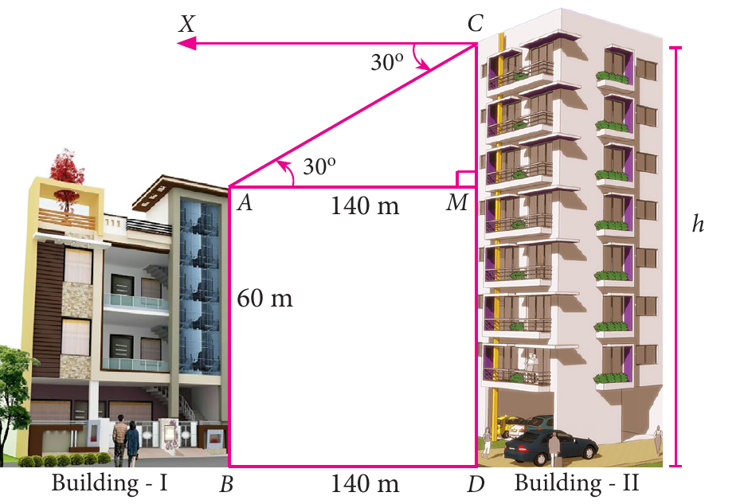

From the diagram,

$\angle XCA = 30^\circ = \angle CAM$

In the right angled $\Delta AMC$, $\tan 30^\circ = \frac{CM}{AM}$

$$\frac{1}{\sqrt{3}} = \frac{CM}{140}$$

$$CM = \frac{140}{\sqrt{3}} = \frac{140\sqrt{3}}{3}$$

$$= \frac{140 \times 1.732}{3}$$

$$CM = 80.83$$

Now, $h = CD = CM + MD = 80.83 + 60 = 140.83$

Therefore, the height of the second building is $140.83$ m

#### Example 6.28

From the top of a tower $50$ m high, the angles of depression of the top and bottom of a tree are observed to be $30^\circ$ and $45^\circ$ respectively. Find the height of the tree. $(\sqrt{3} = 1.732)$

**Solution**

The height of the tower $AB = 50$ m

Let the height of the tree $CD = y$ and $BD = x$

From the diagram, $\angle XAC = 30^\circ = \angle ACM$ and $\angle XAD = 45^\circ = \angle ADB$

In the right angled $\Delta ABD$,

$$\tan 45^\circ = \frac{AB}{BD}$$

$$1 = \frac{50}{x} \Rightarrow x = 50 \text{ m}$$

In the right angled $\Delta AMC$,

$$\tan 30^\circ = \frac{AM}{CM}$$

$$\frac{1}{\sqrt{3}} = \frac{AM}{50} \quad [\because DB = CM]$$

$$AM = \frac{50}{\sqrt{3}} = \frac{50\sqrt{3}}{3} = \frac{50 \times 1.732}{3} = 28.87 \text{ m.}$$

Therefore, height of the tree $= CD = MB = AB - AM = 50 - 28.87 = 21.13$ m

#### Example 6.29

As observed from the top of a $60$ m high lighthouse from the sea level, the angles of depression of two ships are $28^\circ$ and $45^\circ$. If one ship is exactly behind the other on the same side of the lighthouse, find the distance between the two ships. $(\tan 28^\circ = 0.5317)$

**Solution**

Let the observer on the lighthouse $CD$ be at $D$.

Height of the lighthouse $CD = 60$ m

From the diagram,

$\angle XDA = 28^\circ = \angle DAC$ and

$\angle XDB = 45^\circ = \angle DBC$

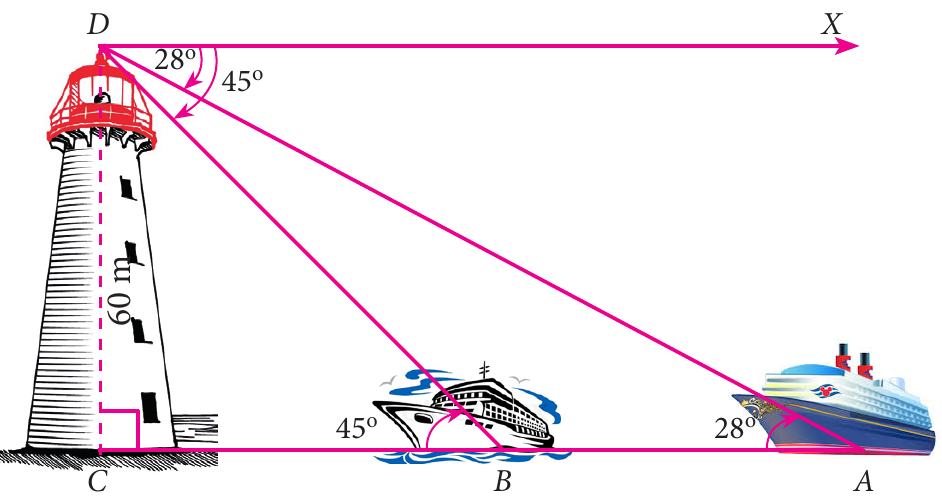

In the right angled $\Delta DCB$, $\tan 45^\circ = \frac{DC}{BC}$

$$1 = \frac{60}{BC} \Rightarrow BC = 60 \text{ m}$$

In the right angled $\Delta DCA$, $\tan 28^\circ = \frac{DC}{AC}$

$$0.5317 = \frac{60}{AC} \Rightarrow AC = \frac{60}{0.5317} = 112.85$$

Distance between the two ships $AB = AC - BC = 52.85$ m

#### Example 6.30

A man is watching a boat speeding away from the top of a tower. The boat makes an angle of depression of $60^\circ$ with the man's eye when at a distance of $200$ m from the tower. After $10$ seconds, the angle of depression becomes $45^\circ$. What is the approximate speed of the boat (in km / hr), assuming that it is sailing in still water? $(\sqrt{3} = 1.732)$

**Solution**

Let $AB$ be the tower.

Let $C$ and $D$ be the positions of the boat.

From the diagram,

$\angle XAC = 60^\circ = \angle ACB$ and

$\angle XAD = 45^\circ = \angle ADB$, $BC = 200$ m

In the right angled $\Delta ABC$, $\tan 60^\circ = \frac{AB}{BC}$

$$\Rightarrow \quad \sqrt{3} = \frac{AB}{200}$$

we get $\quad AB = 200\sqrt{3} \quad \ldots(1)$

In the right angled $\Delta ABD$, $\tan 45^\circ = \frac{AB}{BD}$

$$\Rightarrow \quad 1 = \frac{200\sqrt{3}}{BD} \quad \text{[by (1)]}$$

we get, $BD = 200\sqrt{3}$

Now, $CD = BD - BC$

$$CD = 200\sqrt{3} - 200 = 200(\sqrt{3} - 1) = 146.4$$

It is given that the distance $CD$ is covered in 10 seconds.

That is, the distance of $146.4$ m is covered in 10 seconds.

Therefore, speed of the boat $= \frac{\text{distance}}{\text{time}}$

$$= \frac{146.4}{10} = 14.64 \text{ m/s} \Rightarrow 14.64 \times \frac{3600}{1000} \text{ km/hr} = 52.704 \text{ km/hr}$$

### Exercise 6.3

1. From the top of a rock $50\sqrt{3}$ m high, the angle of depression of a car on the ground is observed to be $30^\circ$. Find the distance of the car from the rock.

2. The horizontal distance between two buildings is $70$ m. The angle of depression of the top of the first building when seen from the top of the second building is $45^\circ$. If the height of the second building is $120$ m, find the height of the first building.

3. From the top of the tower $60$ m high the angles of depression of the top and bottom of a vertical lamp post are observed to be $38^\circ$ and $60^\circ$ respectively. Find the height of the lamp post. $(\tan 38^\circ = 0.7813,\ \sqrt{3} = 1.732)$

4. An aeroplane at an altitude of $1800$ m finds that two boats are sailing towards it in the same direction. The angles of depression of the boats as observed from the aeroplane are $60^\circ$ and $30^\circ$ respectively. Find the distance between the two boats. $(\sqrt{3} = 1.732)$

5. From the top of a lighthouse, the angle of depression of two ships on the opposite sides of it are observed to be $30^\circ$ and $60^\circ$. If the height of the lighthouse is $h$ meters and the line joining the ships passes through the foot of the lighthouse, show that the distance between the ships is $\frac{4h}{\sqrt{3}}$ m.

6. A lift in a building of height $90$ feet with transparent glass walls is descending from the top of the building. At the top of the building, the angle of depression to a fountain in the garden is $60^\circ$. Two minutes later, the angle of depression reduces to $30^\circ$. If the fountain is $30\sqrt{3}$ feet from the entrance of the lift, find the speed of the lift which is descending.

### 6.3.3 Problems involving Angle of Elevation and Depression

Let us consider the following situation.

A man standing at a top of lighthouse located in a beach watch on aeroplane flying above the sea. At the same instant he watch a ship sailing in the sea. The angle with which he watch the plane correspond to angle of elevation and the angle of watching the ship corresponding to angle of depression. This is one example were one oberseves both angle of elevation and angle of depression.

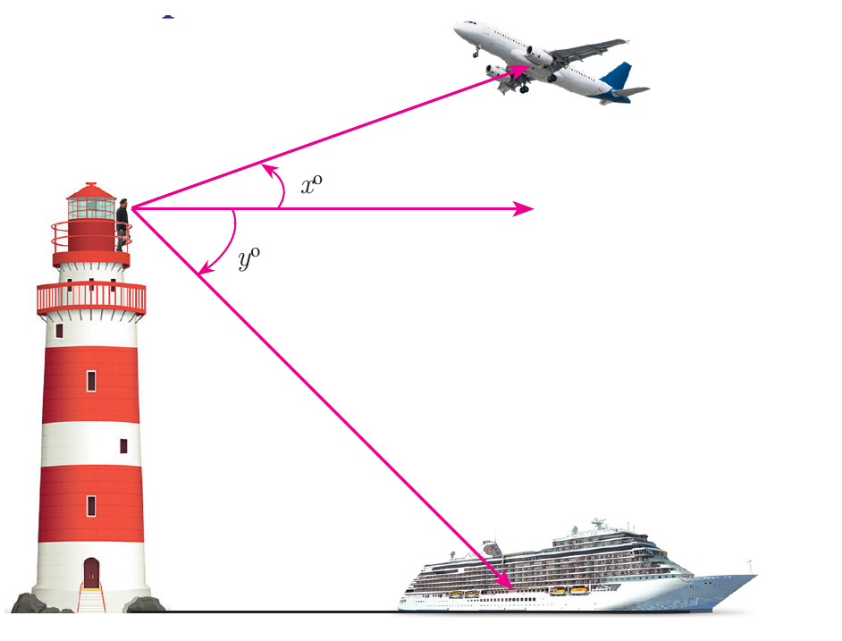

In the Fig.6.26, $x^\circ$ is the angle of elevation and $y^\circ$ is the angle of depression.

In this section, we try to solve problems when Angles of elevation and depression are given.

#### Example 6.31

From the top of a $12$ m high building, the angle of elevation of the top of a cable tower is $60^\circ$ and the angle of depression of its foot is $30^\circ$. Determine the height of the tower.

**Solution**

As shown in Fig.6.27, $OA$ is the building, $O$ is the point of observation on the top of the building $OA$. Then, $OA = 12$ m.

$PP'$ is the cable tower with $P$ as the top and $P'$ as the bottom.

Then the angle of elevation of $P$, $\angle MOP = 60^\circ$.

And the angle of depression of $P'$, $\angle MOP' = 30^\circ$.

Suppose, height of the cable tower $PP' = h$ metres.

Through $O$, draw $OM \perp PP'$

$$MP = PP' - MP' = h - OA = h - 12$$

In the right angled $\Delta OMP$, $\dfrac{MP}{OM} = \tan 60^\circ$

$$\Rightarrow \quad \frac{h-12}{OM} = \sqrt{3}$$

$$OM = \frac{h-12}{\sqrt{3}} \qquad \ldots(1)$$

In the right angled $\Delta OMP'$, $\dfrac{MP'}{OM} = \tan 30^\circ$

$$\Rightarrow \quad \frac{12}{OM} = \frac{1}{\sqrt{3}}$$

$$OM = 12\sqrt{3} \qquad \ldots(2)$$

From (1) and (2) we have, $\dfrac{h-12}{\sqrt{3}} = 12\sqrt{3}$

$$\Rightarrow \quad h - 12 = 12\sqrt{3} \times \sqrt{3} \quad \text{we get, } h = 48$$

Hence, the required height of the cable tower is $48$ m.

#### Example 6.32

A pole 5 m high is fixed on the top of a tower. The angle of elevation of the top of the pole observed from a point '$A$' on the ground is $60^\circ$ and the angle of depression to the point '$A$' from the top of the tower is $45^\circ$. Find the height of the tower. $(\sqrt{3} = 1.732)$

**Solution**

Let $BC$ be the height of the tower and $CD$ be the height of the pole.

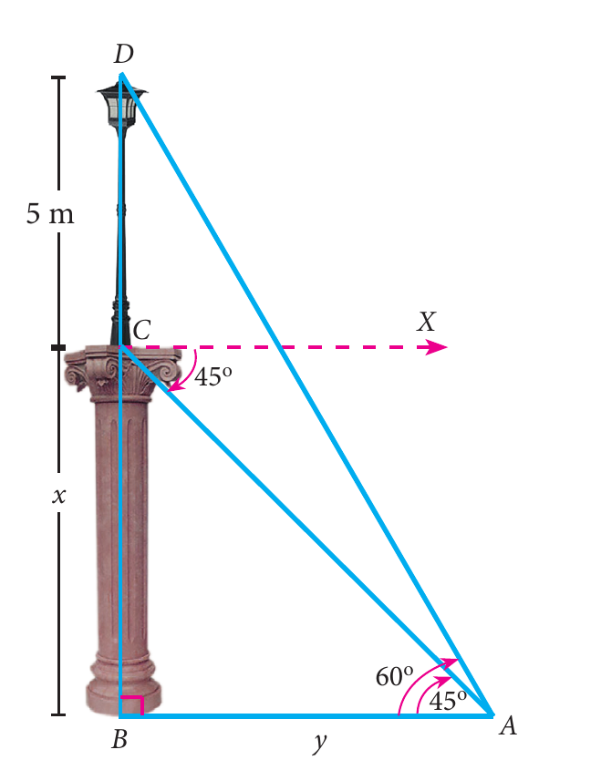

Let '$A$' be the point of observation.

Let $BC = x$ and $AB = y$.

From the diagram,

$\angle BAD = 60^\circ$ and $\angle XCA = 45^\circ = \angle BAC$

In the right angled $\Delta ABC$, $\tan 45^\circ = \dfrac{BC}{AB}$

$$\Rightarrow 1 = \frac{x}{y} \Rightarrow x = y \qquad \ldots(1)$$

In the right angled $\Delta ABD$, $\tan 60^\circ = \dfrac{BD}{AB} = \dfrac{BC+CD}{AB}$

$$\Rightarrow \sqrt{3} = \frac{x+5}{y} \Rightarrow \sqrt{3}\,y = x+5$$

we get, $\sqrt{3}\,x = x + 5$ &emsp; [From (1)]

$$x = \frac{5}{\sqrt{3}-1} = \frac{5}{\sqrt{3}-1} \times \frac{\sqrt{3}+1}{\sqrt{3}+1} = \frac{5(1.732+1)}{2} = 6.83$$

Hence, height of the tower is $6.83$ m.

#### Example 6.33

From a window ($h$ metres high above the ground) of a house in a street, the angles of elevation and depression of the top and the foot of another house on the opposite side of the street are $\theta_1$ and $\theta_2$ respectively. Show that the height of the opposite house is $h\left(1 + \dfrac{\cot\theta_2}{\cot\theta_1}\right)$.

**Solution**

Let $W$ be the point on the window where the angles of elevation and depression are measured. Let $PQ$ be the house on the opposite side.

Then $WA$ is the width of the street.

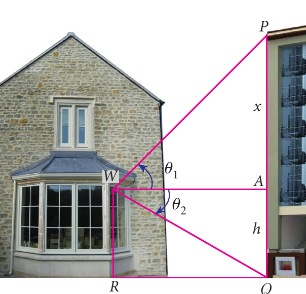

Height of the window $= h$ metres $= AQ$ $(WR = AQ)$

Let $PA = x$ metres.

In the right angled $\Delta PAW$, $\tan\theta_1 = \dfrac{AP}{AW}$

$$\Rightarrow \quad \tan\theta_1 = \frac{x}{AW}$$

$$AW = \frac{x}{\tan\theta_1}$$

$$\text{we get,} \quad AW = x\cot\theta_1 \qquad \ldots(1)$$

In the right angled $\Delta QAW$, $\tan\theta_2 = \dfrac{AQ}{AW}$

$$\Rightarrow \quad \tan\theta_2 = \frac{h}{AW}$$

$$\text{we get,} \quad AW = h\cot\theta_2 \qquad \ldots(2)$$

From (1) and (2) we get, $x\cot\theta_1 = h\cot\theta_2$

$$\Rightarrow \quad x = h\frac{\cot\theta_2}{\cot\theta_1}$$

Therefore, height of the opposite house $= PA + AQ = x + h = h\dfrac{\cot\theta_2}{\cot\theta_1} + h = h\left(1 + \dfrac{\cot\theta_2}{\cot\theta_1}\right)$

Hence Proved.

> **Thinking Corner**
>
> What is the minimum number of measurements required to determine the height or distance or angle of elevation?

> **Progress Check**
>
> 1. The line drawn from the eye of an observer to the point of object is \_\_\_\_\_\_\_\_\_\_.
> 2. Which instrument is used in measuring the angle between an object and the eye of the observer?
> 3. When the line of sight is above the horizontal level, the angle formed is \_\_\_\_\_\_\_\_.
> 4. The angle of elevation \_\_\_\_\_\_\_\_\_\_ as we move towards the foot of the vertical object (tower).
> 5. When the line of sight is below the horizontal level, the angle formed is \_\_\_\_\_\_\_\_.

### Exercise 6.4

1. From the top of a tree of height $13$ m the angle of elevation and depression of the top and bottom of another tree are $45^\circ$ and $30^\circ$ respectively. Find the height of the second tree. $(\sqrt{3} = 1.732)$

2. A man is standing on the deck of a ship, which is 40 m above water level. He observes the angle of elevation of the top of a hill as $60^\circ$ and the angle of depression of the base of the hill as $30^\circ$. Calculate the distance of the hill from the ship and the height of the hill. $(\sqrt{3} = 1.732)$

3. If the angle of elevation of a cloud from a point '$h$' metres above a lake is $\theta_1$ and the angle of depression of its reflection in the lake is $\theta_2$. Prove that the height that the cloud is located from the ground is $\dfrac{h(\tan\theta_1 + \tan\theta_2)}{\tan\theta_2 - \tan\theta_1}$.

4. The angle of elevation of the top of a cell phone tower from the foot of a high apartment is $60^\circ$ and the angle of depression of the foot of the tower from the top of the apartment is $30^\circ$. If the height of the apartment is $50$ m, find the height of the cell phone tower. According to radiations control norms, the minimum height of a cell phone tower should be $120$ m. State if the height of the above mentioned cell phone tower meets the radiation norms.

5. The angles of elevation and depression of the top and bottom of a lamp post from the top of a $66$ m high apartment are $60^\circ$ and $30^\circ$ respectively. Find

   (i) The height of the lamp post.

   (ii) The difference between height of the lamp post and the apartment.

   (iii) The distance between the lamp post and the apartment. $(\sqrt{3} = 1.732)$

6. Three villagers $A$, $B$ and $C$ can see each other using telescope across a valley. The horizontal distance between $A$ and $B$ is $8$ km and the horizontal distance between $B$ and $C$ is $12$ km. The angle of depression of B from $A$ is $20^\circ$ and the angle of elevation of $C$ from $B$ is $30^\circ$. Calculate : (i) the vertical height between $A$ and $B$. (ii) the vertical height between $B$ and $C$. $(\tan 20^\circ = 0.3640,\ \sqrt{3} = 1.732)$

   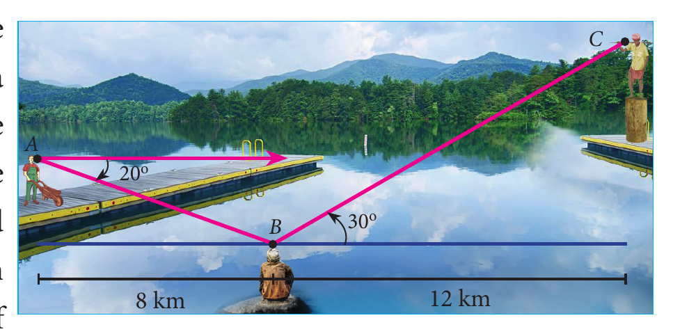

### Exercise 6.5

##### Multiple choice questions

1. The value of $\sin^2\theta + \dfrac{1}{1+\tan^2\theta}$ is equal to

   (A) $\tan^2\theta$ &emsp; (B) $1$ &emsp; (C) $\cot^2\theta$ &emsp; (D) $0$

2. $\tan\theta\,\text{cosec}^2\theta - \tan\theta$ is equal to

   (A) $\sec\theta$ &emsp; (B) $\cot^2\theta$ &emsp; (C) $\sin\theta$ &emsp; (D) $\cot\theta$

3. If $(\sin\alpha + \text{cosec}\,\alpha)^2 + (\cos\alpha + \sec\alpha)^2 = k + \tan^2\alpha + \cot^2\alpha$, then the value of $k$ is equal to

   (A) $9$ &emsp; (B) $7$ &emsp; (C) $5$ &emsp; (D) $3$

4. If $\sin\theta + \cos\theta = a$ and $\sec\theta + \text{cosec}\,\theta = b$, then the value of $b(a^2-1)$ is equal to

   (A) $2a$ &emsp; (B) $3a$ &emsp; (C) $0$ &emsp; (D) $2ab$

5. If $5x = \sec\theta$ and $\dfrac{5}{y} = \tan\theta$, then $x^2 - \dfrac{1}{y^2}$ is equal to

   (A) $25$ &emsp; (B) $\dfrac{1}{25}$ &emsp; (C) $5$ &emsp; (D) $1$

6. If $\sin\theta = \cos\theta$, then $2\tan^2\theta + \sin^2\theta - 1$ is equal to

   (A) $\dfrac{-3}{2}$ &emsp; (B) $\dfrac{3}{2}$ &emsp; (C) $\dfrac{2}{3}$ &emsp; (D) $\dfrac{-2}{3}$

7. If $x = a\tan\theta$ and $y = b\sec\theta$ then

   (A) $\dfrac{y^2}{b^2} - \dfrac{x^2}{a^2} = 1$ &emsp; (B) $\dfrac{x^2}{a^2} - \dfrac{y^2}{b^2} = 1$ &emsp; (C) $\dfrac{x^2}{a^2} + \dfrac{y^2}{b^2} = 1$ &emsp; (D) $\dfrac{x^2}{a^2} - \dfrac{y^2}{b^2} = 0$

8. $(1 + \tan\theta + \sec\theta)(1 + \cot\theta - \text{cosec}\,\theta)$ is equal to

   (A) $0$ &emsp; (B) $1$ &emsp; (C) $2$ &emsp; (D) $-1$

9. $a\cot\theta + b\,\text{cosec}\,\theta = p$ and $b\cot\theta + a\,\text{cosec}\,\theta = q$ then $p^2 - q^2$ is equal to

   (A) $a^2 - b^2$ &emsp; (B) $b^2 - a^2$ &emsp; (C) $a^2 + b^2$ &emsp; (D) $b - a$

10. If the ratio of the height of a tower and the length of its shadow is $\sqrt{3} : 1$, then the angle of elevation of the sun has measure

    (A) $45^\circ$ &emsp; (B) $30^\circ$ &emsp; (C) $90^\circ$ &emsp; (D) $60^\circ$

11. The electric pole subtends an angle of $30^\circ$ at a point on the same level as its foot. At a second point '$b$' metres above the first, the depression of the foot of the pole is $60^\circ$. The height of the pole (in metres) is equal to

    (A) $\sqrt{3}\,b$ &emsp; (B) $\dfrac{b}{3}$ &emsp; (C) $\dfrac{b}{2}$ &emsp; (D) $\dfrac{b}{\sqrt{3}}$

12. A tower is 60 m heigh. Its shadow reduces by $x$ metres when the angle of elevation of the sun increases from $30^\circ$ to $45^\circ$ then $x$ is equal to

    (A) $41.92$ m &emsp; (B) $43.92$ m &emsp; (C) $43$ m &emsp; (D) $45.6$ m

13. The angle of depression of the top and bottom of 20 m tall building from the top of a multistoried building are $30^\circ$ and $60^\circ$ respectively. The height of the multistoried building and the distance between two buildings (in metres) is

    (A) $20,\ 10\sqrt{3}$ &emsp; (B) $30,\ 5\sqrt{3}$ &emsp; (C) $20,\ 10$ &emsp; (D) $30,\ 10\sqrt{3}$

14. Two persons are standing '$x$' metres apart from each other and the height of the first person is double that of the other. If from the middle point of the line joining their feet an observer finds the angular elevations of their tops to be complementary, then the height of the shorter person (in metres) is

    (A) $\sqrt{2}\,x$ &emsp; (B) $\dfrac{x}{2\sqrt{2}}$ &emsp; (C) $\dfrac{x}{\sqrt{2}}$ &emsp; (D) $2x$

15. The angle of elevation of a cloud from a point $h$ metres above a lake is $\beta$. The angle of depression of its reflection in the lake is $45^\circ$. The height of location of the cloud from the lake is

    (A) $\dfrac{h(1+\tan\beta)}{1-\tan\beta}$ &emsp; (B) $\dfrac{h(1-\tan\beta)}{1+\tan\beta}$ &emsp; (C) $h\tan(45^\circ - \beta)$ &emsp; (D) none of these

## Unit Exercise - 6

1. Prove that (i) $\cot^2 A\left(\dfrac{\sec A - 1}{1 + \sin A}\right) + \sec^2 A\left(\dfrac{\sin A - 1}{1 + \sec A}\right) = 0$ &emsp; (ii) $\dfrac{\tan^2\theta - 1}{\tan^2\theta + 1} = 1 - 2\cos^2\theta$

2. Prove that $\left(\dfrac{1 + \sin\theta - \cos\theta}{1 + \sin\theta + \cos\theta}\right)^2 = \dfrac{1 - \cos\theta}{1 + \cos\theta}$

3. If $x\sin^3\theta + y\cos^3\theta = \sin\theta\cos\theta$ and $x\sin\theta = y\cos\theta$, then prove that $x^2 + y^2 = 1$.

4. If $a\cos\theta - b\sin\theta = c$, then prove that $(a\sin\theta + b\cos\theta) = \pm\sqrt{a^2 + b^2 - c^2}$.

5. A bird is sitting on the top of a 80 m high tree. From a point on the ground, the angle of elevation of the bird is $45^\circ$. The bird flies away horizontally in such away that it remained at a constant height from the ground. After 2 seconds, the angle of elevation of the bird from the same point is $30^\circ$. Determine the speed at which the bird flies. $(\sqrt{3} = 1.732)$

6. An aeroplane is flying parallel to the Earth's surface at a speed of 175 m/sec and at a height of 600 m. The angle of elevation of the aeroplane from a point on the Earth's surface is $37^\circ$. After what period of time does the angle of elevation increase to $53^\circ$? $(\tan 53^\circ = 1.3270,\ \tan 37^\circ = 0.7536)$

7. A bird is flying from $A$ towards $B$ at an angle of $35^\circ$, a point 30 km away from $A$. At $B$ it changes its course of flight and heads towards $C$ on a bearing of $48^\circ$ and distance $32$ km away.

   (i) How far is $B$ to the North of $A$? &emsp; (ii) How far is $B$ to the West of $A$?

   (iii) How far is $C$ to the North of $B$? &emsp; (iv) How far is $C$ to the East of $B$?

   $(\sin 55^\circ = 0.8192,\ \cos 55^\circ = 0.5736,\ \sin 42^\circ = 0.6691,\ \cos 42^\circ = 0.7431)$

8. Two ships are sailing in the sea on either side of the lighthouse. The angles of depression of two ships as observed from the top of the lighthouse are $60^\circ$ and $45^\circ$ respectively. If the distance between the ships is $200\left(\dfrac{\sqrt{3}+1}{\sqrt{3}}\right)$ metres, find the height of the lighthouse.

9. A building and a statue are in opposite side of a street from each other 35 m apart. From a point on the roof of building the angle of elevation of the top of statue is $24^\circ$ and the angle of depression of base of the statue is $34^\circ$. Find the height of the statue. $(\tan 24^\circ = 0.4452,\ \tan 34^\circ = 0.6745)$

## Points to Remember

- An equation involving trigonometric ratios of an angle is called a trigonometric identity if it is true for all values of the angle.
- Trigonometric identities

  (i) $\sin^2\theta + \cos^2\theta = 1$ &emsp; (ii) $1 + \tan^2\theta = \sec^2\theta$ &emsp; (iii) $1 + \cot^2\theta = \text{cosec}^2\theta$

- The line of sight is the line drawn from the eye of an observer to the point in the object viewed by the observer.
- The angle of elevation of an object viewed is the angle formed by the line of sight with the horizontal when it is above the horizontal level.
- The angle of depression of an object viewed is the angle formed by the line of sight with the horizontal when it is below the horizontal level.
- The height or length of an object or distance between two distant objects can be determined with the help of trigonometric ratios.

## ICT CORNER

### ICT 6.1

**Step 1:** Open the Browser type the URL Link given below (or) Scan the QR Code. Chapter named **"Trigonometry"** will open. Select the work sheet **"Basic Identity"**

**Step 2:** In the given worksheet you can change the triangle by dragging the point "B". Check the identity for each angle of the right angled triangle in the unit circle.

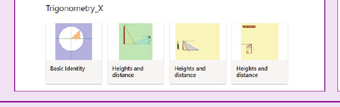

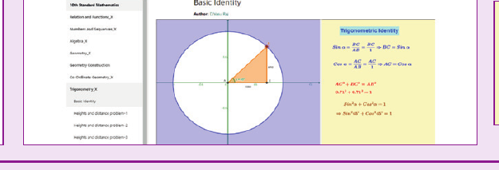

### ICT 6.2

**Step 1:** Open the Browser type the URL Link given below (or) Scan the QR Code. Chapter named **"Trigonometry"** will open. Select the work sheet **"Heights and distance problem-1"**

**Step 2:** In the given worksheet you can change the Question by clicking on "New Problem". Move the slider, to view the steps. Workout the problem yourself and verify the answer.

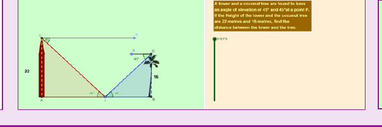

*You can repeat the same steps for other activities*

[https://www.geogebra.org/m/jfr2zzgy#chapter/356196](https://www.geogebra.org/m/jfr2zzgy#chapter/356196)

or Scan the QR Code.

