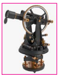
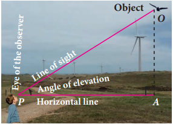
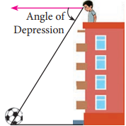
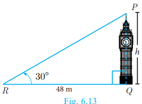
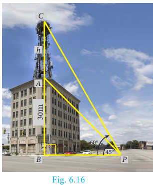
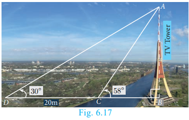
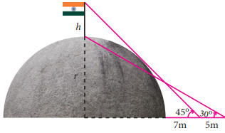
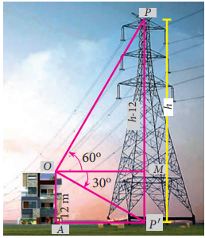
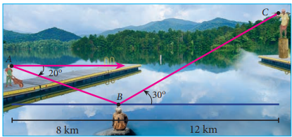
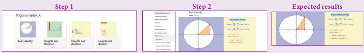

 
# **Heights and Distances**

In this section, we will see how trigonometry is used for finding the heights and distances of various objects without actually measuring them. For example, the height of a tower, mountain, building or tree, distance of a ship from a light house, width of a river, etc. can be determined by using knowledge of trigonometry. The process of finding Heights and Distances is the best example of applying trigonometry in real-life situations. We would explain these applications through some examples. Before studying methods to find heights and distances, we should understand some basic definitions.

## Line of Sight

The line of sight is the line drawn from the eye of an observer to the point in the object viewed by the observer.

Fig. 6.5

## Theodolite

Theodolite is an instrument which is used in measuring the angle between an object and the eye of the observer. A theodolite consists of two graduated wheels placed at right angles to each other and a telescope. The wheels are used for the measurement of horizontal and vertical angles. The angle to the desired point is measured by positioning the telescope towards that point. The angle can be read on the telescope scale.

Fig. 6.6

Fig. 6.7

## Angle of Depression

The angle of depression is an angle formed by the line of sight with the horizontal when the point is below the horizontal level. That is, the case when we lower our head to look at the point being viewed. (see Fig. 6.8)

## Angle of Elevation

The angle of elevation is an angle formed by the line of sight with the horizontal when the point being viewed is above the horizontal level. That is, the case when we raise our head to look at the object. (see Fig. 6.7)

Fig. 6.8

## Clinometer

The angle of elevation and depression are usually measured by a device called clinometer.

 **Note**

Fig. 6.9

| From a given point, when height of an object   increases the angle of elevation increases. | The angle of elevation increases as we   move towards the foot of the vertical   object like tower or building.   If h_{1}>h_{2} then \alpha>\beta |
| :--- | :--- |

 **Activity 2**

Representation of situations through right triangles. Draw a figure to illustrate the situation.

| Situations |
| :--- |
| A tower stands vertically on the ground. |
| From a point on the ground, which is 20 \mathrm{~m} |
| away from the foot of the tower, the angle |
| of elevation of the top of the tower is found |
| to be 45^{\circ}. |
| An observer of 1.8 \mathrm{~m} tall is 25.2 \mathrm{~m} away   from a chimney. The angle of elevation of   the top of the chimney from her eyes is 45^{\circ}. |
| From a point P on the ground the angle of |
| elevation of the top of a 20 \mathrm{~m} tall building |
| is 30^{\circ}. A flag is hoisted at the top of the |
| building and the angle of elevation of the |
| top of the flagstaff from P is 55^{\circ}. |
| The shadow of a tower standing on a level   ground is found to be 40 \mathrm{~m} longer when   the Sun's altitude is 30^{\circ} than when it is 60^{\circ}. |

# Problems involving Angle of Elevation

In this section, we try to solve problems when Angle of elevation are given.

 **Example 6.18**

Calculate \angle B A C in the given triangles. (tan \left.38.7^{\circ}=0.8011, \tan 69.4^{\circ}=2.6604\right)

__Solution__

.png)

Fig. 6.12(a)

.png)

Fig. 6.12(b)

(i) In the right angled \triangle A B C [see Fig.6.12(a)] (ii) In the right angled \triangle A B C [see Fig.6.12(b)] \tan \theta=\frac{\text { opposite side }}{\text { adjacent side }}=\frac{4}{5}

\tan \theta=0.8

\Rightarrow \theta=38.7^{\circ}\left(\because \tan 38.7^{\circ}=0.8011\right)

\therefore \angle B A C=38.7^{\circ}

**Example 6.19** A tower stands vertically on the ground. From a point on the ground, which is 48 \mathrm{~m} away from the foot of the tower, the angle of elevation of the top of the tower is 30^{\circ}. Find the height of the tower.

__Solution__ Let P Q be the height of the tower.

Take P Q=h and Q R is the distance between the tower and the point R. In the right angled \triangle P Q R, \angle P R Q=30^{\circ}


\begin{aligned}
\tan \theta & =\frac{P Q}{Q R} \\
\tan 30^{\circ} & =\frac{h}{48} \Rightarrow \frac{1}{\sqrt{3}}=\frac{h}{48} \Rightarrow h=16 \sqrt{3}
\end{aligned}


Therefore, the height of the tower is 16 \sqrt{3} \mathrm{~m}

**Example 6.20** A kite is flying at a height of 75 \mathrm{~m} above the ground. The string attached to the kite is temporarily tied to a point on the ground. The inclination of the string with the ground is 60^{\circ}. Find the length of the string, assuming that there is no slack in the string.

__Solution__ Let A B be the height of the kite above the ground. Then, A B=75.

Let A C be the length of the string.

In the right angled \triangle A B C, \angle A C B=60^{\circ}


\begin{aligned}
\sin \theta & =\frac{A B}{A C} \\
\sin 60^{\circ} & =\frac{75}{A C} \\
\Rightarrow \quad \frac{\sqrt{3}}{2} & =\frac{75}{A C} \Rightarrow A C=\frac{150}{\sqrt{3}}=50 \sqrt{3}
\end{aligned}


Hence, the length of the string is 50 \sqrt{3} \mathrm{~m}.

**Example 6.21** Two ships are sailing in the sea on either sides of a lighthouse. The angle of elevation of the top of the lighthouse as observed from the ships are 30^{\circ} and 45^{\circ} respectively. If the lighthouse is 200 \mathrm{~m} high, find the distance between the two ships. (\sqrt{3}=1.732)

__Solution__ Let A B be the lighthouse. Let C and D be the positions of the two ships.

Then, A B=200 \mathrm{~m}.

\angle A C B=30^{\circ}, \angle A D B=45^{\circ}

Fig. 6.15

In the right angled \triangle B A C, \tan 30^{\circ}=\frac{A B}{A C}


\frac{1}{\sqrt{3}}=\frac{200}{A C} \Rightarrow A C=200 \sqrt{3}


In the right angled \triangle B A D, \tan 45^{\circ}=\frac{A B}{A D}


1=\frac{200}{A D} \Rightarrow A D=200


Now,


\begin{aligned}
& C D=A C+A D=200 \sqrt{3}+200 \quad[\text { by }(1) \text { and }(2)] \\
& C D=200(\sqrt{3}+1)=200 \times 2.732=546.4
\end{aligned}


Distance between two ships is 546.4 \mathrm{~m}.

**Example 6.22** From a point on the ground, the angles of elevation of the bottom and top of a tower fixed at the top of a 30 \mathrm{~m} high building are 45^{\circ} and 60^{\circ} respectively. Find the height of the tower. (\sqrt{3}=1.732)

__Solution__ Let A C be the height of the tower.

Let A B be the height of the building.

Then, A C=h metres, A B=30 \mathrm{~m}

In the right angled \triangle C B P, \angle C P B=60^{\circ}


\begin{aligned}
\tan \theta & =\frac{B C}{B P} \\
\tan 60^{\circ} & =\frac{A B+A C}{B P} \Rightarrow \sqrt{3}=\frac{30+h}{B P}
\end{aligned}


In the right angled \triangle A B P, \angle A P B=45^{\circ}


\begin{aligned}
\tan \theta & =\frac{A B}{B P} \\
\tan 45^{\circ} & =\frac{30}{B P} \Rightarrow B P=30
\end{aligned}


Fig. 6.16

Substituting (2) in (1), we get \sqrt{3}=\frac{30+h}{30}


h=30(\sqrt{3}-1)=30(1.732-1)=30(0.732)=21.96


Hence, the height of the tower is 21.96 \mathrm{~m}.

**Example 6.23** A TV tower stands vertically on a bank of a canal. The tower is watched from a point on the other bank directly opposite to it. The angle of elevation of the top of the tower is 58^{\circ}. From another point 20 \mathrm{~m} away from this point on the line joining this point to the foot of the tower, the angle of elevation of the top of the tower is 30^{\circ}. Find the height of the tower and the width of the canal. \left(\tan 58^{\circ}=1.6003\right)

__Solution__

Let A B be the height of the TV tower.

C D=20 \mathrm{~m}.

Let B C be the width of the canal.

In the right angled \triangle A B C, \tan 58^{\circ}=\frac{A B}{B C}


1.6003=\frac{A B}{B C}


Fig. 6.17

In the right angled \triangle A B D, \tan 30^{\circ}=\frac{A B}{B D}=\frac{A B}{B C+C D}


\frac{1}{\sqrt{3}}=\frac{A B}{B C+20}


Dividing (1) by (2) we get, \frac{1.6003}{\frac{1}{\sqrt{3}}}=\frac{B C+20}{B C}


\begin{aligned}
B C & =\frac{20}{1.7717}=11.29 \mathrm{~m} \\
1.6003 & =\frac{A B}{11.29}[\text { from (1) and (3)] } \\
A B & =18.07
\end{aligned}


.png)

(ii) In the right angled \triangle G O H,

\sin 24^{\circ}=\frac{O H}{G H}

0.4067=\frac{O H}{250} ; O H=101.68

Distance of H to the East of

G=101.68 \mathrm{~km}

(iii) In the right angled \triangle H I J, \sin 11^{\circ}=\frac{I J}{H J}

.png)

Fig. 6.18 (b)

0.1908=\frac{I J}{180} ; I J=34.34 \mathrm{~km}

Distance of J to the North of H=34.34 \mathrm{~km}

(iv) In the right angled \Delta H I J,

\cos 11^{\circ}=\frac{H I}{H J}

0.9816=\frac{H I}{180} ; H I=176.69 \mathrm{~km}

Distance of J to the East of H=176.69 \mathrm{~km}

**Example 6.25** As shown in the figure, two trees are standing on flat ground. The angle of elevation of the top of both the trees from a point X on the ground is 40^{\circ}. If the horizontal distance between X and the smaller tree is 8 \mathrm{~m} and the distance of the top of the two trees is 20 \mathrm{~m}, calculate

(i) the distance between the point X and the top of the smaller tree.

(ii) the horizontal distance between the two trees.

\left(\cos 40^{\circ}=0.7660\right)

__Solution__ Let A B be the height of the bigger tree and C D be the height of the smaller tree and X is the point on the ground.

(i) In the right angled \triangle X C D, \cos 40^{\circ}=\frac{C X}{X D}


X D=\frac{8}{0.7660}=10.44 \mathrm{~m}


Therefore, the distance between X and top of the smaller tree =X D=10.44 \mathrm{~m}

(ii) In the right angled \triangle X A B,


\cos 40^{\circ}=\frac{A X}{B X}=\frac{A C+C X}{B D+D X}


Fig. 6.19


0.7660=\frac{A C+8}{20+10.44} \Rightarrow A C=23.32-8=15.32 \mathrm{~m}


Therefore, the horizontal distance between two trees =A C=15.32 \mathrm{~m}

 **Thinking Corner**

1. What type of triangle is used to calculate heights and distances?
2. When the height of the building and distances from the foot of the building is given, which trigonometric ratio is used to find the angle of elevation?
3. If the line of sight and angle of elevation is given, then which trigonometric ratio is used

(i) to find the height of the building

(ii) to find the distance from the foot of the building.

 **Exercise 6.2**

1. Find the angle of elevation of the top of a tower from a point on the ground, which is 30 \mathrm{~m} away from the foot of a tower of height 10 \sqrt{3} \mathrm{~m}.
2. A road is flanked on either side by continuous rows of houses of height 4 \sqrt{3} \mathrm{~m} with no space in between them. A pedestrian is standing on the median of the road facing a row house. The angle of elevation from the pedestrian to the top of the house is 30^{\circ}. Find the width of the road.
3. To a man standing outside his house, the angles of elevation of the top and bottom of a window are 60^{\circ} and 45^{\circ} respectively. If the height of the man is 180 \mathrm{~cm} and if he is 5 \mathrm{~m} away from the wall, what is the height of the window? (\sqrt{3}=1.732)
4. A statue 1.6 \mathrm{~m} tall stands on the top of a pedestal. From a point on the ground, the angle of elevation of the top of the statue is 60^{\circ} and from the same point the angle of elevation of the top of the pedestal is 40^{\circ}. Find the height of the pedestal. \left(\tan 40^{\circ}=0.8391, \sqrt{3}=1.732\right)
5. A flag pole of height ' h ' metres is on the top of the hemispherical dome of radius ' r ' metres. A man is standing 7 \mathrm{~m} away from the dome. Seeing the top of the pole at an angle 45^{\circ} and moving 5 \mathrm{~m} away from the dome and seeing the bottom of the pole at an angle 30^{\circ}. Find

(i) the height of the pole
(ii) radius of the dome. (\sqrt{3}=1.732)

6. The top of a 15 \mathrm{~m} high tower makes an angle of elevation of 60^{\circ} with the bottom of an electronic pole and angle of elevation of 30^{\circ} with the top of the pole. What is the height of the electric pole?

 # Problems involving Angle of Depression

 **Note**

In this section, we try to solve problems when Angles of depression are given.

Angle of Depression and Angle of Elevation are equal become they are alternative angles.

**Example 6.26** A player sitting on the top of a tower of height 20 \mathrm{~m} observes the angle of depression of a ball lying on the ground as 60^{\circ}. Find the distance between the foot of the tower and the ball. (\sqrt{3}=1.732)

__Solution__ Let B C be the height of the tower and A be the position of the ball lying on the ground. Then,


B C=20 \mathrm{~m} \text { and } \angle X C A=60^{\circ}=\angle C A B


Let A B=x metres.

In the right angled \triangle A B C,


\begin{aligned}
\tan 60^{\circ} & =\frac{B C}{A B} \\
\sqrt{3} & =\frac{20}{x} \\
x & =\frac{20 \times \sqrt{3}}{\sqrt{3} \times \sqrt{3}}=\frac{20 \times 1.732}{3}=11.55 \mathrm{~m} .
\end{aligned}


Fig. 6.21

Hence, the distance between the foot of the tower and the ball is 11.55 \mathrm{~m}.

**Example 6.27** The horizontal distance between two buildings is 140 \mathrm{~m}. The angle of depression of the top of the first building when seen from the top of the second building is 30^{\circ}. If the height of the first building is 60 \mathrm{~m}, find the height of the second building. (\sqrt{3}=1.732)

__Solution__ The height of the first building A B=60 \mathrm{~m}. Now, A B=M D=60 \mathrm{~m}

Let the height of the second building

C D=h. Distance B D=140 \mathrm{~m}

Now, A M=B D=140 \mathrm{~m}

From the diagram,


\angle X C A=30^{\circ}=\angle C A M


Fig. 6.22

In the right angled \triangle A M C, \tan 30^{\circ}=\frac{C M}{A M}


\begin{aligned}
\frac{1}{\sqrt{3}} & =\frac{C M}{140} \\
C M & =\frac{140}{\sqrt{3}}=\frac{140 \sqrt{3}}{3} \\
& =\frac{140 \times 1.732}{3} \\
C M & =80.83
\end{aligned}


Now, h=C D=C M+M D=80.83+60=140.83

Therefore, the height of the second building is 140.83 \mathrm{~m}

**Example 6.28** From the top of a tower 50 \mathrm{~m} high, the angles of depression of the top and bottom of a tree are observed to be 30^{\circ} and 45^{\circ} respectively. Find the height of the tree. (\sqrt{3}=1.732)

__Solution__ The height of the tower A B=50 \mathrm{~m}

Let the height of the tree C D=y and B D=x

From the diagram, \angle X A C=30^{\circ}=\angle A C M and \angle X A D=45^{\circ}=\angle A D B

In the right angled \triangle A B D,


\begin{aligned}
\tan 45^{\circ} & =\frac{A B}{B D} \\
1 & =\frac{50}{x} \Rightarrow x=50 \mathrm{~m}
\end{aligned}


In the right angled \triangle A M C,


\begin{aligned}
\tan 30^{\circ} & =\frac{A M}{C M} \\
\frac{1}{\sqrt{3}} & =\frac{A M}{50}[\because D B=C M] \\
A M & =\frac{50}{\sqrt{3}}=\frac{50 \sqrt{3}}{3}=\frac{50 \times 1.732}{3}=28.87 \mathrm{~m} .
\end{aligned}


Fig. 6.23

Therefore, height of the tree =C D=M B=A B-A M=50-28.87=21.13 \mathrm{~m}

**Example 6.29** As observed from the top of a 60 \mathrm{~m} high lighthouse from the sea level, the angles of depression of two ships are 28^{\circ} and 45^{\circ}. If one ship is exactly behind the other on the same side of the lighthouse, find the distance between the two ships. \left(\tan 28^{\circ}=0.5317\right)

__Solution__ Let the observer on the lighthouse C D be at D.

Height of the lighthouse C D=60 \mathrm{~m}

From the diagram,


\begin{aligned}
& \angle X D A=28^{\circ}=\angle D A C \text { and } \\
& \angle X D B=45^{\circ}=\angle D B C
\end{aligned}


Fig. 6.24

In the right angled \triangle D C B, \tan 45^{\circ}=\frac{D C}{B C}


1=\frac{60}{B C} \Rightarrow B C=60 \mathrm{~m}


In the right angled \triangle D C A, \tan 28^{\circ}=\frac{D C}{A C}


0.5317=\frac{60}{A C} \Rightarrow A C=\frac{60}{0.5317}=112.85


Distance between the two ships A B=A C-B C=52.85 \mathrm{~m}

**Example 6.30** A man is watching a boat speeding away from the top of a tower. The boat makes an angle of depression of 60^{\circ} with the man's eye when at a distance of 200 \mathrm{~m} from the tower. After 10 seconds, the angle of depression becomes 45^{\circ}. What is the approximate speed of the boat (in \mathrm{km} / \mathrm{hr} ), assuming that it is sailing in still water? (\sqrt{3}=1.732)

__Solution__ Let A B be the tower.

Let C and D be the positions of the boat.

From the diagram,


\begin{aligned}
& \angle X A C=60^{\circ}=\angle A C B \text { and } \\
& \angle X A D=45^{\circ}=\angle A D B, B C=200 \mathrm{~m}
\end{aligned}


In the right angled \triangle A B C, \tan 60^{\circ}=\frac{A B}{B C}


\Rightarrow \quad \sqrt{3}=\frac{A B}{200}


we get \quad A B=200 \sqrt{3}

In the right angled \triangle A B D, \tan 45^{\circ}=\frac{A B}{B D}


\begin{aligned}
\Rightarrow & 1 & =\frac{200 \sqrt{3}}{B D} \quad[\text { by }(1)] \\
\text { we get, } & B D & =200 \sqrt{3} \\
\text { Now, } & C D & =B D-B C \\
& C D & =200 \sqrt{3}-200=200(\sqrt{3}-1)=146.4
\end{aligned}


It is given that the distance C D is covered in 10 seconds.

That is, the distance of 146.4 \mathrm{~m} is covered in 10 seconds.

Therefore, speed of the boat =\frac{\text { distance }}{\text { time }}


=\frac{146.4}{10}=14.64 \mathrm{~m} / \mathrm{s} \Rightarrow 14.64 \times \frac{3600}{1000} \mathrm{~km} / \mathrm{hr}=52.704 \mathrm{~km} / \mathrm{hr}


 **Exercise 6.3**

1. From the top of a rock 50 \sqrt{3} \mathrm{~m} high, the angle of depression of a car on the ground is observed to be 30^{\circ}. Find the distance of the car from the rock.
2. The horizontal distance between two buildings is 70 \mathrm{~m}. The angle of depression of the top of the first building when seen from the top of the second building is 45^{\circ}. If the height of the second building is 120 \mathrm{~m}, find the height of the first building.
3. From the top of the tower 60 \mathrm{~m} high the angles of depression of the top and bottom of a vertical lamp post are observed to be 38^{\circ} and 60^{\circ} respectively. Find the height of the lamp post. \left(\tan 38^{\circ}=0.7813, \sqrt{3}=1.732\right)
4. An aeroplane at an altitude of 1800 \mathrm{~m} finds that two boats are sailing towards it in the same direction. The angles of depression of the boats as observed from the aeroplane are 60^{\circ} and 30^{\circ} respectively. Find the distance between the two boats. (\sqrt{3}=1.732)
5. From the top of a lighthouse, the angle of depression of two ships on the opposite sides of it are observed to be 30^{\circ} and 60^{\circ}. If the height of the lighthouse is h meters and the line joining the ships passes through the foot of the lighthouse, show that the distance between the ships is \frac{4 h}{\sqrt{3}} \mathrm{~m}.
6. A lift in a building of height 90 feet with transparent glass walls is descending from the top of the building. At the top of the building, the angle of depression to a fountain in the garden is 60^{\circ}. Two minutes later, the angle of depression reduces to 30^{\circ}. If the fountain is 30 \sqrt{3} feet from the entrance of the lift, find the speed of the lift which is descending.

# Problems involving Angle of Elevation and Depression

Let us consider the following situation.

A man standing at a top of lighthouse located in a beach watch on aeroplane flying above the sea. At the same instant he watch a ship sailing in the sea. The angle with which he watch the plane correspond to angle of elevation and the angle of watching the ship corresponding to angle of depression. This is one example were one oberseves both angle of elevation and angle of depression.

In the Fig.6.26, x^{\circ} is the angle of

Fig. 6.26 elevation and y^{\circ} is the angle of depression.

In this section, we try to solve problems when Angles of elevation and depression are given.

**Example 6.31** From the top of a 12 \mathrm{~m} high building, the angle of elevation of the top of a cable tower is 60^{\circ} and the angle of depression of its foot is 30^{\circ}. Determine the height of the tower.

_Solution_ As shown in Fig.6.27, O A is the building, O is the point of observation on the top of the building O A. Then, O A=12 \mathrm{~m}.

P P^{\prime} is the cable tower with P as the top and P^{\prime} as the bottom.

Then the angle of elevation of P, \angle M O P=60^{\circ}.

And the angle of depression of P^{\prime}, \angle M O P^{\prime}=30^{\circ}.

Suppose, height of the cable tower P P^{\prime}=h metres.

Through O, draw O M \perp P P^{\prime}

M P=P P^{\prime}-M P^{\prime}=h-O A=h-12

In the right angled \triangle O M P, \frac{M P}{O M}=\tan 60^{\circ}


\begin{aligned}
\Rightarrow \quad \frac{h-12}{O M} & =\sqrt{3} \\
O M & =\frac{h-12}{\sqrt{3}}
\end{aligned}


Fig. 6.27

In the right angled \triangle O M P^{\prime}, \frac{M P^{\prime}}{O M}=\tan 30^{\circ}


\Rightarrow \quad \frac{12}{O M}=\frac{1}{\sqrt{3}}



O M=12 \sqrt{3}


From (1) and (2) we have, \frac{h-12}{\sqrt{3}}=12 \sqrt{3}


\Rightarrow \quad h-12=12 \sqrt{3} \times \sqrt{3} \text { we get, } h=48


Hence, the required height of the cable tower is 48 \mathrm{~m}.

**Example 6.32** A pole 5 \mathrm{~m} high is fixed on the top of a tower. The angle of elevation of the top of the pole observed from a point ' A ' on the ground is 60^{\circ} and the angle of depression to the point ' A ' from the top of the tower is 45^{\circ}. Find the height of the tower. (\sqrt{3}=1.732)

_Solution_ Let B C be the height of the tower and C D be the height of the pole.

Let ' A ' be the point of observation.

Let B C=x and A B=y.

From the diagram,

\angle B A D=60^{\circ} and \angle X C A=45^{\circ}=\angle B A C

In the right angled \triangle A B C, \tan 45^{\circ}=\frac{B C}{A B}


\Rightarrow 1=\frac{x}{y} \Rightarrow x=y


In the right angled \triangle A B D, \tan 60^{\circ}=\frac{B D}{A B}=\frac{B C+C D}{A B}


\Rightarrow \sqrt{3}=\frac{x+5}{y} \Rightarrow \sqrt{3} y=x+5


we get, \sqrt{3} x=x+5 \quad [From (1)]

Fig. 6.28


x=\frac{5}{\sqrt{3}-1}=\frac{5}{\sqrt{3}-1} \times \frac{\sqrt{3}+1}{\sqrt{3}+1}=\frac{5(1.732+1)}{2}=6.83


Hence, height of the tower is 6.83 \mathrm{~m}.

**Example 6.33** From a window ( h metres high above the ground) of a house in a street, the angles of elevation and depression of the top and the foot of another house on the opposite side of the street are \theta_{1} and \theta_{2} respectively. Show that the height of the opposite house is h\left(1+\frac{\cot \theta_{2}}{\cot \theta_{1}}\right).

_Solution_ Let W be the point on the window where the angles of elevation and depression are measured. Let P Q be the house on the opposite side.

Then W A is the width of the street.

Height of the window =h metres


=A Q(W R=A Q)


Let P A=x metres.

In the right angled \triangle P A W, \tan \theta_{1}=\frac{A P}{A W}


\begin{aligned}
\Rightarrow \quad \tan \theta_{1} & =\frac{x}{A W} \\
A W & =\frac{x}{\tan \theta_{1}}
\end{aligned}


we get, \quad A W=x \cot \theta_{1}

In the right angled \triangle Q A W, \tan \theta_{2}=\frac{A Q}{A W}


\Rightarrow \quad \tan \theta_{2}=\frac{h}{A W}



\text { we get, } \quad A W=h \cot \theta_{2}


From (1) and (2) we get, \quad x \cot \theta_{1}=h \cot \theta_{2}


\Rightarrow \quad x=h \frac{\cot \theta_{2}}{\cot \theta_{1}}


 **Thinking Corner**

What is the minimum number of measurements required to determine the height or distance or angle of elevation?

Therefore, height of the opposite house =P A+A Q=x+h=h \frac{\cot \theta_{2}}{\cot \theta_{1}}+h=h\left(1+\frac{\cot \theta_{2}}{\cot \theta_{1}}\right) Hence Proved.

 **Progress Check**

1. The line drawn from the eye of an observer to the point of object is
2. Which instrument is used in measuring the angle between an object and the eye of the observer?
3. When the line of sight is above the horizontal level, the angle formed is
4. The angle of elevation object (tower). as we move towards the foot of the vertical
5. When the line of sight is below the horizontal level, the angle formed is

 **Exercise 6.4**

1. From the top of a tree of height 13 \mathrm{~m} the angle of elevation and depression of the top and bottom of another tree are 45^{\circ} and 30^{\circ} respectively. Find the height of the second tree. (\sqrt{3}=1.732)
2. A man is standing on the deck of a ship, which is 40 \mathrm{~m} above water level. He observes the angle of elevation of the top of a hill as 60^{\circ} and the angle of depression of the base of the hill as 30^{\circ}. Calculate the distance of the hill from the ship and the height of the hill. (\sqrt{3}=1.732)
3. If the angle of elevation of a cloud from a point ' h ' metres above a lake is \theta_{1} and the angle of depression of its reflection in the lake is \theta_{2}. Prove that the height that the cloud is located from the ground is \frac{h\left(\tan \theta_{1}+\tan \theta_{2}\right)}{\tan \theta_{2}-\tan \theta_{1}}.
4. The angle of elevation of the top of a cell phone tower from the foot of a high apartment is 60^{\circ} and the angle of depression of the foot of the tower from the top of the apartment is 30^{\circ}. If the height of the apartment is 50 \mathrm{~m}, find the height of the cell phone tower. According to radiations control norms, the minimum height of a cell phone tower should be 120 \mathrm{~m}. State if the height of the above mentioned cell phone tower meets the radiation norms.
5. The angles of elevation and depression of the top and bottom of a lamp post from the top of a 66 \mathrm{~m} high apartment are 60^{\circ} and 30^{\circ} respectively. Find

(i) The height of the lamp post.

(ii) The difference between height of the lamp post and the apartment.

(iii) The distance between the lamp post and the apartment. (\sqrt{3}=1.732)

6. Three villagers A, B and C can see each other using telescope across a valley. The horizontal distance between A and B is 8 \mathrm{~km} and the horizontal distance between B and C is 12 \mathrm{~km}. The angle of depression of \mathrm{B} from A is 20^{\circ} and the angle of

elevation of C from B is 30^{\circ}. Calculate : (i) the vertical height between A and B. (ii) the vertical height between B and C . \quad\left(\tan 20^{\circ}=0.3640, \sqrt{3}=1.732\right)

 **Exercise 6.5**

 **Multiple choice questions**

1. The value of \sin ^{2} \theta+\frac{1}{1+\tan ^{2} \theta} is equal to

(A) \tan ^{2} \theta
(B) 1
(C) \cot ^{2} \theta
(D) 0
2. \tan \theta \operatorname{cosec}^{2} \theta-\tan \theta is equal to
(A) \sec \theta
(B) \cot ^{2} \theta
(C) \sin \theta
(D) \cot \theta

3. If (\sin \alpha+\operatorname{cosec} \alpha)^{2}+(\cos \alpha+\sec \alpha)^{2}=k+\tan ^{2} \alpha+\cot ^{2} \alpha, then the value of k is equal to
(A) 9
(B) 7
(C) 5
(D) 3
4. If \sin \theta+\cos \theta=a and \sec \theta+\operatorname{cosec} \theta=b, then the value of b\left(a^{2}-1\right) is equal to
(A) 2 a
(B) 3 a
(C) 0
(D) 2 a b
5. If 5 x=\sec \theta and \frac{5}{x}=\tan \theta, then x^{2}-\frac{1}{x^{2}} is equal to
(A) 25
(B) \frac{1}{25}
(C) 5
(D) 1
6. If \sin \theta=\cos \theta, then 2 \tan ^{2} \theta+\sin ^{2} \theta-1 is equal to
(A) \frac{-3}{2}
(B) \frac{3}{2}
(C) \frac{2}{3}
(D) \frac{-2}{3}
7. If x=a \tan \theta and y=b \sec \theta then
(A) \frac{y^{2}}{b^{2}}-\frac{x^{2}}{a^{2}}=1
(B) \frac{x^{2}}{a^{2}}-\frac{y^{2}}{b^{2}}=1
(C) \frac{x^{2}}{a^{2}}+\frac{y^{2}}{b^{2}}=1
(D) \frac{x^{2}}{a^{2}}-\frac{y^{2}}{b^{2}}=0
8. (1+\tan \theta+\sec \theta)(1+\cot \theta-\operatorname{cosec} \theta) is equal to
(A) 0
(B) 1
(C) 2
(D) -1
9. a \cot \theta+b \operatorname{cosec} \theta=p and b \cot \theta+a \operatorname{cosec} \theta=q then p^{2}-q^{2} is equal to
(A) a^{2}-b^{2}
(B) b^{2}-a^{2}
(C) a^{2}+b^{2}
(D) b-a
10. If the ratio of the height of a tower and the length of its shadow is \sqrt{3}: 1, then the angle of elevation of the sun has measure
(A) 45^{\circ}
(B) 30^{\circ}
(C) 90^{\circ}
(D) 60^{\circ}
11. The electric pole subtends an angle of 30^{\circ} at a point on the same level as its foot. At a second point ' b ' metres above the first, the depression of the foot of the pole is 60^{\circ}. The height of the pole (in metres) is equal to
(A) \sqrt{3} b
(B) \frac{b}{3}
(C) \frac{b}{2}
(D) \frac{b}{\sqrt{3}}
12. A tower is 60 \mathrm{~m} heigh. Its shadow is x metres shorter when the sun's altitude is 45^{\circ} than when it has been 30^{\circ}, then x is equal to
(A) 41.92 \mathrm{~m}
(B) 43.92 \mathrm{~m}
(C) 43 \mathrm{~m}
(D) 45.6 \mathrm{~m}
13. The angle of depression of the top and bottom of 20 \mathrm{~m} tall building from the top of a multistoried building are 30^{\circ} and 60^{\circ} respectively. The height of the multistoried building and the distance between two buildings (in metres) is
(A) 20,10 \sqrt{3}
(B) 30,5 \sqrt{3}
(C) 20,10
(D) 30,10 \sqrt{3}
14. Two persons are standing ' x ' metres apart from each other and the height of the first person is double that of the other. If from the middle point of the line joining their feet an observer finds the angular elevations of their tops to be complementary, then the height of the shorter person (in metres) is
(A) \sqrt{2} x
(B) \frac{x}{2 \sqrt{2}}
(C) \frac{x}{\sqrt{2}}
(D) 2 x
15. The angle of elevation of a cloud from a point h metres above a lake is \beta. The angle of depression of its reflection in the lake is 45^{\circ}. The height of location of the cloud from the lake is
(A) \frac{h(1+\tan \beta)}{1-\tan \beta}
(B) \frac{h(1-\tan \beta)}{1+\tan \beta}
(C) h \tan \left(45^{\circ}-\beta\right)
(D) none of these

 **Unit Exercise - 6**

1. Prove that (i) \cot ^{2} A\left(\frac{\sec A-1}{1+\sin A}\right)+\sec ^{2} A\left(\frac{\sin A-1}{1+\sec A}\right)=0 \quad (ii) \frac{\tan ^{2} \theta-1}{\tan ^{2} \theta+1}=1-2 \cos ^{2} \theta
2. Prove that \left(\frac{1+\sin \theta-\cos \theta}{1+\sin \theta+\cos \theta}\right)^{2}=\frac{1-\cos \theta}{1+\cos \theta}
3. If x \sin ^{3} \theta+y \cos ^{3} \theta=\sin \theta \cos \theta and x \sin \theta=y \cos \theta, then prove that x^{2}+y^{2}=1.
4. If a \cos \theta-b \sin \theta=c, then prove that (a \sin \theta+b \cos \theta)= \pm \sqrt{a^{2}+b^{2}-c^{2}}.
5. A bird is sitting on the top of a 80 \mathrm{~m} high tree. From a point on the ground, the angle of elevation of the bird is 45^{\circ}. The bird flies away horizontally in such away that it remained at a constant height from the ground. After 2 seconds, the angle of elevation of the bird from the same point is 30^{\circ}. Determine the speed at which the bird flies. (\sqrt{3}=1.732)
6. An aeroplane is flying parallel to the Earth's surface at a speed of 175 \mathrm{~m} / \mathrm{sec} and at a height of 600 \mathrm{~m}. The angle of elevation of the aeroplane from a point on the Earth's surface is 37^{\circ}. After what period of time does the angle of elevation increase to 53^{\circ} ? \left(\tan 53^{\circ}=1.3270, \tan 37^{\circ}=0.7536\right)
7. A bird is flying from A towards B at an angle of 35^{\circ}, a point 30 \mathrm{~km} away from A. At B it changes its course of flight and heads towards C on a bearing of 48^{\circ} and distance 32 \mathrm{~km} away.

(i) How far is B to the North of A ? (ii) How far is B to the West of A ?

(iii) How far is C to the North of B ? (iv) How far is C to the East of B ?

\left(\sin 55^{\circ}=0.8192, \cos 55^{\circ}=0.5736, \sin 42^{\circ}=0.6691, \cos 42^{\circ}=0.7431\right)

8. Two ships are sailing in the sea on either side of the lighthouse. The angles of depression of two ships as observed from the top of the lighthouse are 60^{\circ} and 45^{\circ} respectively. If the distance between the ships is 200\left(\frac{\sqrt{3}+1}{\sqrt{3}}\right) metres, find the height
of the lighthouse.
9. A building and a statue are in opposite side of a street from each other 35 \mathrm{~m} apart. From a point on the roof of building the angle of elevation of the top of statue is 24^{\circ} and the angle of depression of base of the statue is 34^{\circ}. Find the height of the statue. \left(\tan 24^{\circ}=0.4452, \tan 34^{\circ}=0.6745\right)

     **Points to Remember**

- An equation involving trigonometric ratios of an angle is called a trigonometric identity if it is true for all values of the angle.
- Trigonometric identities
(i) \sin ^{2} \theta+\cos ^{2} \theta=1
(ii) 1+\tan ^{2} \theta=\sec ^{2} \theta
(iii) 1+\cot ^{2} \theta=\operatorname{cosec}^{2} \theta
- The line of sight is the line drawn from the eye of an observer to the point in the object viewed by the observer.
- The angle of elevation of an object viewed is the angle formed by the line of sight with the horizontal when it is above the horizontal level.
- The angle of depression of an object viewed is the angle formed by the line of sight with the horizontal when it is below the horizontal level.
- The height or length of an object or distance between two distant objects can be determined with the help of trigonometric ratios.

   **ICT CORNER**

**ICT 6.1**

**Step 1**: Open the Browser type the URL Link given below (or) Scan the QR Code. Chapter named "Trigonometry" will open. Select the work sheet "Basic Identity"

**Step 2**: In the given worksheet you can change the triangle by dragging the point "B". Check the identity for each angle of the right angled triangle in the unit circle.

**ICT 6.2**

**Step 1**: Open the Browser type the URL Link given below (or) Scan the QR Code. Chapter named "Trigonometry" will open. Select the work sheet "Heights and distance problem-1"

**Step 2**: In the given worksheet you can change the Question by clicking on "New Problem". Move the slider, to view the steps. Workout the problem yourself and verify the answer.

You can repeat the same steps for other activities

https://www.geogebra.org/m/jfr2zzgy\#chapter/356196

