# Geometry
## Similarity

Two figures are said to be similar if every

aspect of one figure is proportional to other
figure. For example:
The above houses look the same but
different in size. Both the mobile phones are the same but they vary

in their sizes. Therefore, mathematically we say that two objects are
similar if they are of same shape but not necessarily they need to have
the same size. The ratio of the corresponding measurements of two similar objects must be proportional.

Here is a box of geometrical shapes. Collect the similar objects and
list out.

In this chapter, we will be discussing specifically the
use of similar triangles which is of utmost importance
where if it is beyond our reach to physically measure the
distance and height with simple measuring instruments.
The concept of similarity is widely used in the fields of
engineering, architecture and construction.
Here are few applications of similarity

1. By analyzing the shadows that make triangles,
we can determine the actual height of the objects.
2. Used in aerial photography to determine the distance from sky to a particular
location on the ground.
3. Used in Architecture to aid in design of their work.

### Similar triangles

In class IX, we have studied congruent triangles. We can say that two geometrical figures 
are congruent, if they have same size and shape. But, here we shall study about geometrical 
figures which have same shape but proportional sizes. These figures are called “similar”.

**Congruency and similarity of triangles**

Congruency is a particular case of similarity. In 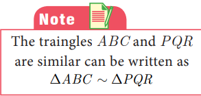
both the cases, three angles of one triangle are equal 
to the three corresponding angles of the other triangle. 
But in congruent triangles, the corresponding sides are 
equal. While in similar triangles, the corresponding sides are proportional.
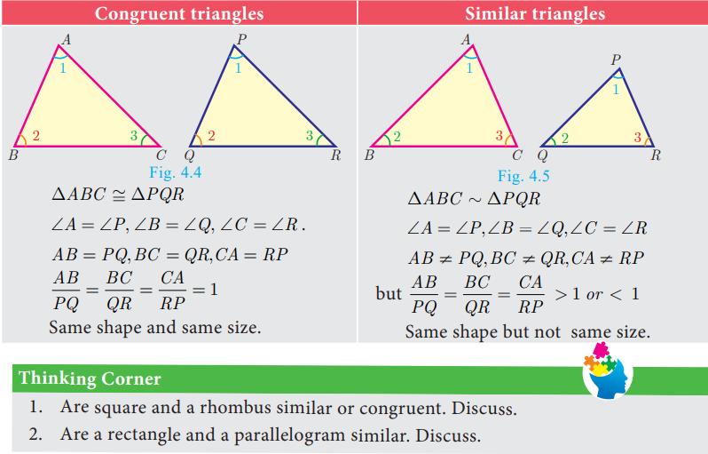

### Criteria of Similarity

The following criteria are sufficient to prove that two triangles are similar.

#### AA Criterion of similarity

If two angles of one triangle are respectively 

equal to two angles of another triangle, then the two 
triangles are similar, because the third angle in both 
triangles must be equal. Therefore, AA similarity 
criterion is same as the AAA similarity criterion.

So if ∠A= ∠P = 1 and ∠B = ∠Q = 2 then ∆ ABC ~ ∆ PQR .

**SAS Criterion of similarity**

If one angle of a triangle is equal to one angle of another

triangle and if the sides including them are proportional then 
the two triangles are similar.
Thus if ∠A = ∠P = 1 and
      AB/PQ =AC/PR then ∆ABC ~ ∆PQR
        

  

**SSS Criterion of similarity**

If three sides of a triangle are proportional to the 
three corresponding sides of another triangle, 
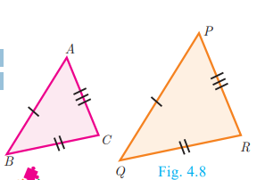then the 
two triangles are similar. 
So if,AB/PQ=AC/PR=BC/QR then ∆ABC ~ ∆PQR

 
 **Some useful results on similar triangles**

 1. A perpendicular line drawn from the vertex of a right angled 
triangle divides the triangle into two triangles similar to 
each other and also to original triangle.
   
     ∆ADB ~ ∆BDC,∆ABC ~ ∆ADB,∆ABC ~∆BDC
 

2. If two triangles are similar, then the ratio of 

the corresponding sides are equal to the ratio 
of their corresponding altitudes.

     i.e. if ∆ABC ~ ∆PQR then
    AB/PQ=BC/QR=CA/RP=AD/PS=BE/QT=CF/RU

3. If two triangles are similar, then the ratio of 

the corresponding sides are equal to the ratio 
of the corresponding perimeters.

      ∆ABC ~ ∆DEF then
AB/DE=BC/EF=CA/FD=AB+BC+CA/DE+EF+FD

4. The ratio of the area of two similar triangles are equal 
to the ratio of the squares of their corresponding sides.

     area(∆ABC)/area(∆PQR)=AB^2/PQ^2=BC^2/QR^2=AC^2/PR^2

5. If two triangles have common vertex and their bases are on the same straight line, the ratio between their
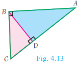areas is equal to the ratio between the length of their bases. 
   
   Here,area(∆ABC)/area(∆PQR)=AD/DC

**Illustration** Two triangles, ∆XYZ and ∆LMN are similar because the corresponding angles 
are equal.

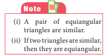

     

 (i) ∠X = ∠L,∠Y=∠M,∠Z=∠N(by angles) 

 (ii) XY/LM=YZ/MN=XZ/LN(by sides)
 Here the vertices X, Y, Z correspond to the vertices L, M, N respectively. Thus in symbol ∆XYZ~ ∆LMN

 **Example 4.1** Show that ∆PST ~ ∆PQR

 

     

**Solution**
(i) In ∆PST AND ∆PQR,
    PS/PQ=2/2+1=2/3,PT/PR=4/4+2=2/3
 Thus,PS/PQ=PT/PR and ∠P is common
 Therefore, by SAS similarity,
      ∆PST ~ ∆PQR

(ii) In ∆PST AND ∆PQR,
     PS/PQ=2/2+3=2/5,PT/PR=2/2+3=2/5
Thus,PS/PQ=PT/PR and ∠P is common
Therefore, by SAS similarity, 
       ∆PST ~ ∆PQR 

**Example 4.2** Is ∆ABC ~ ∆PQR ?

**Solution** In ∆ABC and ∆PQR ,
PQ/AB =3/6=1/2; QR/BC = 4/10=2/5
 
since 1/2=2/5, PQ/AB=QR/BC

The corresponding sides are not proportional. 
Therefore ∆ABC is not similar to ∆PQR .

**Example 4.3** Observe Fig.4.18 and find ∠P.

**Solution** In ∆BAC and ∆PRQ, AB/RQ=3/6=1/2;
            
  BC/QP=6/12=1/2;CA/PR=\(3 \sqrt{3}\)/\(6 \sqrt{3}\)=1/2
   Therefore,AB/RQ=BC/QP=CA/PR

   By SSS similarity, we have ∆BAC~ ∆QRP
   
   ∠P = ∠C (since the corresponding parts of similar triangle)
     ∠P=∠C = 180°− (∠A + ∠B) = 180°-(90°+60°)
     ∠P = 180°-150° = 30°

**Example 4.4** A boy of height 90cm is walking away from the base of a lamp post at a 
speed of 1.2m/sec. If the lamppost is 3.6m
 
above the ground, find the length of his 
shadow cast after 4 seconds.

**Solution** Given, speed = 1.2 m/s, 
 time = 4 seconds
 distance = speed*time
          = 1.2×4 = 4.8 m
Let x be the length of the shadow 
after 4 seconds 

Since, ∆ABE ~ ∆CDE , BE/DE=AB/CD = gives 4.8+X/X=3.6/0.9=4 (since 90 cm = 0.9 m)
 4.8 +x = 4x. gives 3x = 4.8 so, x =1.6 m
The length of his shadow DE =1.6 m

**Example 4.5** In Fig.4.20 ∠A =∠CED prove that ∆CAB ~ ∆CED .Also find the value of x.
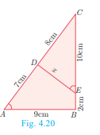

**Solution** In ∆CAB and ∆CED , ∠C is common, ∠A =∠CED
Therefore, ∆CAB ~ ∆CED (By AA similarity) 
Hence, CA/CE=AB/DE=CB/CD
 AB/DE=CB/CD gives 9/x= 10+2/8

 so, x = 8*9/12= 6 cm.

**Example 4.6** In Fig.4.21, QA and PB are perpendiculars to AB. If AO = 10 cm, 
BO=6 cm and PB=9cm. Find AQ.

**Solution** In ∆AOQ and ∆BOP , ∠OAQ = ∠OBP = 90°

∠AOQ = ∠BOP (Vertically opposite angles)
Therefore, by AA Criterion of similarity, 
∆AOQ ~ ∆BOP
 AO/BO=OQ/OP=AQ/BP
 10/6= AQ/9 ⇒ AQ =10*9/6=15 cm 

**Example 4.7** The perimeters of two similar triangles ABC and PQR are 
respectively 36 cm and 24 cm. If PQ =10 cm, find AB.

**Solution** The ratio of the corresponding sides 
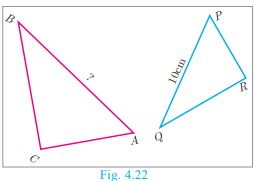
of similar triangles is same as the ratio of their 
perimeters. 
     Since ∆ABC ~ PQR , 
 AB/PQ=BC/QR=AC/PR = 36/24
 AB/PQ = 36 ⇒AB/10=36/24 
 AB = 36 × 10/24 = 15 cm

**Example 4.8** If ∆ABC is similar to ∆DEF such that BC=3 cm, EF=4 cm and area of 
∆ABC = 54 cm2. Find the area of ∆DEF .

**Solution** Since the ratio of area of two similar triangles is equal to the ratio of the squares of any two corresponding sides, we have
Area(∆ABC)/Area(∆DEF)=BC^2/EF^2 ⇒ 54/Area(∆DEF)=3^2/4^2

Area(∆DEF)=16*54/9=96 Cm2

**Example 4.9** Two poles of height ‘a’ metres 
and ‘b’ metres are ‘p’ metres apart. Prove that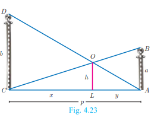
the height of the point of intersection of the lines joining the top of each pole to the foot of the opposite pole is given by ab/a+b metres.

**Solution** Let AB and CD be two poles of height ‘a’ metres and ‘b’ metres respectively such that 
the poles are ‘p’ metres apart. That is AC=p
metres. Suppose the lines AD and BC meet at O, such that OL=h metres 

Let CL = x and LA = y. 
Then, x+y = p
In ∆ABC and ∆LOC , we have 

∠CAB = ∠CLO [each equal to 90°]
 ∠C=∠C [C is common]
∆CAB ~ ∆CLO [By AA similarity]
CA/CL=AB/LO ⇒ p/x = a/h 
 so, x=ph/a   …(1)
In ∆ALO and ∆ACD , we have
∠ALO = ∠ACD [each equal to 90°]
 ∠A = ∠A [A is common]
∆ALO ~ ∆ACD [by AA similarity]
AL/AC=OL/DC ⇒ y/p = h/b we get, y = ph/b  …(2)
 (1)+(2) ⇒ x+y =  ph/a + ph/b

p = ph(1/a + 1/b)      (Since y + = p )
              
1=h(a+b/ab)                         

 Therefore, h=ab/a+b

Hence, the height of the intersection of the lines joining the top of each pole to the 
foot of the opposite pole is ab/a+b metres.

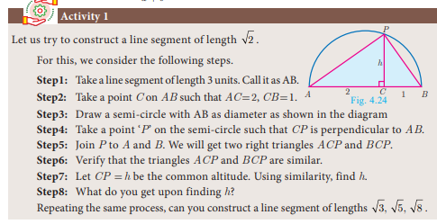

**4.2.3 Construction of similar triangles**
      So far we have discussed the theoretical approach of similar triangles and their properties. 
Now we shall discuss the geometrical construction of a triangle similar to a given triangle 
whose sides are in a given ratio with the corresponding sides of the given triangle.
This construction includes two different cases. In one, the triangle to be constructed 
is smaller and in the other it is larger than the given triangle. So, we use the following term 
called “scale factor” which measures the ratio of the sides of the triangle to be constructed 
with the corresponding sides of the given triangle. Let us take the following examples 
involving the two cases:

**Example 4.10** Construct a triangle similar to a given triangle PQR with its sides equal to 3/5
 of the corresponding sides of the triangle PQR (scale factor 3/5< 1)
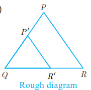

**Solution** Given a triangle PQR we are required to construct 
another triangle whose sides are 3/5
 of the corresponding sides 
of the triangle PQR.

Steps of construction

1. Construct a ∆PQR with any measurement.

2. Draw a ray QX making an acute angle with QR on the
side opposite to vertex P.

1. Locate 5 (the greater of 3 and 5 in 3/5) points.
   Q1,Q2,Q3,Q4 AND Q5 ON QX so that
   QQ1 = Q1Q2 = Q2Q3 = Q3Q4 = Q4Q5

2. Join Q5R and draw a line through Q3 (the third 
point, 3 being smaller of 3 and 5 in 3/5
) parallel to 
Q5R to intersect QR at R' .

1. Draw line through R' parallel to the line RP to 
intersect QP at P'. 
 Then, ∆P'QR' is the required triangle each of whose sides is three-fifths of the corresponding sides of ∆PQR .

**Example 4.11** Construct a triangle similar to a given triangle PQR with 
its sides equal to 7/4
 of the corresponding sides of the triangle PQR
(scale factor 7/4 > 1)

**Solution**  Given a triangle PQR, we are required to construct
another triangle whose sides are 7/4 of the corresponding sides of the 
triangle PQR.

     

**Steps of construction**

1. Construct a ∆PQR with any measurement.

2. Draw a ray QX making an acute angle with QR on the side 
opposite to vertex P.

3. Locate 7 points (the greater of 7 and 4 in 7/4 )
  Q1,Q2,Q3,Q4,Q5,Q6 and Q7 ON QX so that 
   
   QQ1 = Q1Q2 = Q2Q3 = Q3Q4 = Q4Q5 = Q5Q6 = Q6Q7

4. Join Q4 (the 4th point, 4 being smaller of 4 and 7 in 7/4) 
to R and draw a line through Q7 parallel to Q4R,
intersecting the extended line segment QR at R'.
5. Draw a line through R' parallel to RP intersecting the 
extended line segment QP at P'
 Then ∆P'QR' is the required triangle each of whose sides 
is seven-fourths of the corresponding sides of ∆PQR .

**Exercise 4.1**

1. Check whether the which triangles are similar and find the value of x.
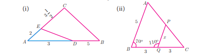

2. A girl looks the reflection of the top of the lamp post on the mirror which is 6.6 m away 
from the foot of the lamppost. The girl whose height is 1.25 m is standing 2.5 m away 
from the mirror. Assuming the mirror is placed on the ground facing the sky and the girl, 
mirror and the lamppost are in a same line, find the height of the lamp post.

3. A vertical stick of length 6 m casts a shadow 400 cm long on the ground and at the same 
time a tower casts a shadow 28 m long. Using similarity, find the height of the tower.

4. Two triangles QPR and QSR, right angled at P and S respectively are drawn on the same base QR and on the same side of QR. If PR
and SQ intersect at T, prove that PT × TR = ST × TQ.

5. In the adjacent figure, ∆ABC is right angled at C and 
DE ^ AB . Prove that ∆ABC  ~ ∆ADE and hence find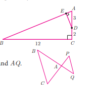 
the lengths of AE and DE.

6. In the adjacent figure, ∆ACB ~ ∆APQ . If BC = 8 cm, 
PQ = 4 cm, BA = 6.5 cm and AP = 2.8 cm, find CA and AQ.

7. If figure OPRQ is a square and ∠MLN = 90°. Prove that 
(i) ∆LOP ~ ∆QMO (ii) ∆LOP ~ ∆RPN (iii) 
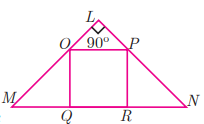
∆QMO ~ ∆RPN (iv) QR^2= MQ*RN

8. If ∆ABC ~ ∆DEF such that area of ∆ABC is 9cm2
 and the 
area of ∆DEF is 16cm2
 and BC = 2.1 cm. Find the length of EF.

9. Two vertical poles of heights 6 m and 3 m are erected above a 

horizontal ground AC. Find the value of y. 

10. Construct a triangle similar to a given triangle PQR with its 
sides equal to 2/3
 of the corresponding sides of the triangle PQR (scale factor 2/3< 1).

11. Construct a triangle similar to a given triangle LMN with its sides equal to 4/5
 of the 
corresponding sides of the triangle LMN (scale factor 4/5< 1)

12. Construct a triangle similar to a given triangle ABC with its sides equal to 6/5
 of the 
corresponding sides of the triangle ABC (scale factor 6/5> 1).

13. Construct a triangle similar to a given triangle PQR with its sides equal to 7/3
 of the 
corresponding sides of the triangle PQR (scale factor 7/3> 1).