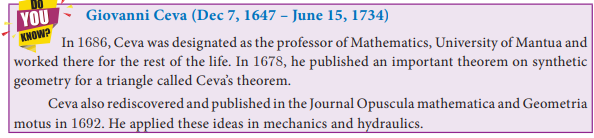
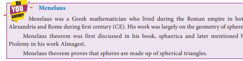
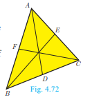
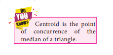
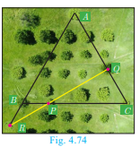

# Geometry

## Concurrency Theorems

Definition

A cevian is a line segment that extends from one vertex of a triangle to the opposite side. In the diagram, AD is a cevian, from $A$.

**Special cevians**

1. A median is a cevian that divides the opposite side into two congruent(equal) lengths.
2. An altitude is a cevian that is perpendicular to the opposite side.
3. An angle bisector is a cevian that bisects the corresponding angle.

**Ceva's Theorem (without proof)**

**Statement**

Let $\mathrm{ABC}$ be a triangle and let $D, E, F$ be points on lines $B C$, $C A, A B$ respectively. Then the cevians $A D, B E, C F$ are concurrent if and only if $\frac{B D}{D C} \times \frac{C E}{E A} \times \frac{A F}{F B}=1$ where the lengths are directed. This also works for the reciprocal of each of the ratios as the reciprocal of 1 is 1 .

**Note**

The cevians do not necessarily lie within the triangle, although they do in the diagram.

**Menelaus Theorem (without proof) Statement**

A necessary and sufficient condition for points $P, Q, R$ on the respective sides $\mathrm{BC}, C A, A B$ (or their extension) of a triangle $A B C$ to be collinear is that $\frac{B P}{P C} \times \frac{C Q}{Q A} \times \frac{A R}{R B}=-1$ where all segments in the formula are directed segments.

**Note**

Menelaus theorem can also be given as $B P \times C Q \times A R=-P C \times Q A \times R B$.

If $\mathrm{BP}$ is replaced by $P B$ (or) $C Q$ by $Q C$ (or) $A R$ by $R A$, or if any one of the six directed line segments $B P, P C, C Q, Q A, A R, R B$ is interchanged, then the product will be 1 .

**Example 4.32** Show that in a triangle, the medians are concurrent. 

**Solution** Medians are line segments joining each vertex to the midpoint of the corresponding opposite sides.

Thus medians are the cevians where $D, E, F$ are midpoints of $B C, C A$ and $A B$ respectively.

Since $D$ is a midpoint of $B C, B D=D C$ so $\frac{B D}{D C}=1$

Since, $E$ is a midpoint of $C A, C E=E A$ so $\frac{C E}{E A}=1 \ldots$

Since, $F$ is a midpoint of $A B, A F=F B$ so $\frac{A F}{F B}=1$

Thus, multiplying (1), (2) and (3) we get,

$$
\frac{B D}{D C} \times \frac{C E}{E A} \times \frac{A F}{F B}=1 \times 1 \times 1=1
$$

And so, Ceva's theorem is satisfied.
Hence the Medians are concurrent.

**Example 4.33** In $\triangle A B C$, points $D, E, F$ lies on $B C, C A, A B$ respectively. Suppose $A B, A C$ and $B C$ have lengths 13,14 and 15 respectively. If $\frac{A F}{F B}=\frac{2}{5}$ and $\frac{C E}{E A}=\frac{5}{8}$. Find $B D$ and $D C$.

**Solution** Given that $A B=13, A C=14$ and $B C=15$.

Let $B D=x$ and $D C=y$

Using Ceva's theorem, we have, $\frac{B D}{D C} \times \frac{C E}{E A} \times \frac{A F}{F B}=1$

Substitute the values of $\frac{A F}{F B}$ and $\frac{C E}{E A}$ in (1),

we have $\frac{B D}{D C} \times \frac{5}{8} \times \frac{2}{5}=1$

$$
\begin{aligned}
& \frac{x}{y} \times \frac{10}{40}=1 \text { we get, } \frac{x}{y} \times \frac{1}{4}=1 . \text { Hence, } x=4 y \\
& B C=B D+D C=15 \text { so, } x+y=15
\end{aligned}
$$

From (2), using $x=4 y$ in (3) we get, $4 y+y=15$ gives $5 y=15$ then $y=3$

Substitute $y=3$ in (3) we get, $x=12$. Hence $B D=12, D C=3$.

**Example 4.34** In a garden containing several trees, three particular trees $P, Q, R$ are located in the following way, $B P=2 \mathrm{~m}, C Q=3 \mathrm{~m}, R A=10 \mathrm{~m}, P C=6 \mathrm{~m}, Q A=5 \mathrm{~m}$, $R B=2 \mathrm{~m}$, where $A, B, C$ are points such that $P$ lies on $B C$, $Q$ lies on $A C$ and $R$ lies on $A B$. Check whether the trees $\mathrm{P}, Q$, $R$ lie on a same straight line.

**Solution** By Meanlau's theorem, the trees $P, Q, R$ will be collinear (lie on same straight line)

$$
\text { if } \frac{B P}{P C} \times \frac{C Q}{Q A} \times \frac{R A}{R B}=1
$$

Given $B P=2 \mathrm{~m}, C Q=3 \mathrm{~m}, R A=10 \mathrm{~m}, P C=6 \mathrm{~m}, Q A=5 \mathrm{~m}$ and $R B=2 \mathrm{~m}$

Substituting these values in (1) we get, $\frac{B P}{P C} \times \frac{C Q}{Q A} \times \frac{R A}{R B}=\frac{2}{6} \times \frac{3}{5} \times \frac{10}{2}=\frac{60}{60}=1$

Hence the trees $\mathrm{P}, Q, R$ lie on a same straight line.

**Excercise 4.4**

1. The length of the tangent to a circle from a point P, which is 25 cm away from the 
centre is 24 cm. What is the radius of the circle?
2. ∆LMN is a right angled triangle with ∠L = 90°. A circle is inscribed in it. The 
lengths of the sides containing the right angle are 6 cm and 8 cm. Find the radius of 
the circle.

4. $P Q$ is a tangent drawn from a point $P$ to a circle with centre $O$ and $Q O R$ is a diameter of the circle such that $\angle P O R=120^{\circ}$. Find $\angle O P Q$.

5. A tangent $S T$ to a circle touches it at $B . A B$ is a chord such that $\angle A B T=65^{\circ}$. Find $\angle A O B$, where " $O$ " is the centre of the circle.
6. In figure, $O$ is the centre of the circle with radius $5 \mathrm{~cm} . T$ is a point such that $O T=13 \mathrm{~cm}$ and $O T$ intersects the circle $E$, if $A B$ is the tangent to the circle at $E$, find the lenght of $A B$.

7. In two concentric circles, a chord of length $16 \mathrm{~cm}$ of larger circle becomes a tangent to the smaller circle whose radius is $6 \mathrm{~cm}$. Find the radius of the larger circle.
8. Two circles with centres $O$ and $O^{\prime}$ of radii $3 \mathrm{~cm}$ and $4 \mathrm{~cm}$, respectively intersect at two points $P$ and $Q$, such that $O P$ and $O^{\prime} P$ are tangents to the two circles. Find the length of the common chord $P Q$.
9. Show that the angle bisectors of a triangle are concurrent.
10. An artist has created a triangular stained glass window and has one strip of small length left before completing the window. She needs to figure out the length of left out portion based on the lengths of the other sides as shown in the figure.
11. Draw a tangent at any point $R$ on the circle of radius $3.4 \mathrm{~cm}$ and centre at $P$ ?

12. Draw a circle of radius $4.5 \mathrm{~cm}$. Take a point on the circle. Draw the tangent at that point using the alternate segment theorem.
13. Draw the two tangents from a point which is $10 \mathrm{~cm}$ away from the centre of a circle of radius $5 \mathrm{~cm}$. Also, measure the lengths of the tangents.
14. Take a point which is $11 \mathrm{~cm}$ away from the centre of a circle of radius $4 \mathrm{~cm}$ and draw the two tangents to the circle from that point.
15. Draw the two tangents from a point which is $5 \mathrm{~cm}$ away from the centre of a circle of diameter $6 \mathrm{~cm}$. Also, measure the lengths of the tangents.
16. Draw a tangent to the circle from the point $P$ having radius $3.6 \mathrm{~cm}$, and centre at $O$. Point $P$ is at a distance $7.2 \mathrm{~cm}$ from the centre.