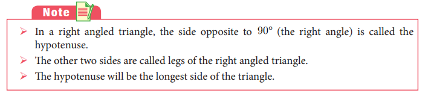
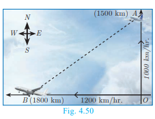
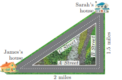
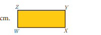

# Geometry

## Pythagoras Theorem

Among all existing theorems in mathematics, Pythagoras theorem is considered to be the most important because it has maximum number of proofs. There are more than 350 ways of proving Pythagoras theorem through different methods. Each of these proofs was discovered by eminent mathematicians, scholars, engineers and math enthusiasts, including one by the $20^{\text {th }}$ American president James Garfield. The book titled "The Pythagorean Proposition" written by Elisha Scott Loomis, published by the National Council of Teaching of Mathematics (NCTM) in America contains 367 proofs of Pythagoras Theorem.

Three numbers $(a, b, c)$ are said to form Pythagorean Triplet, if they form sides of a right triangle. Thus $(a, b, c)$ is a Pythagorean Triplet if and only if $c^{2}=a^{2}+b^{2}$.

Now we are in a position to study this most famous and important theorem not only in Geometry but in whole of mathematics.

**Theorem 5** : Pythagoras Theorem

**Statement**

In a right angle triangle, the square on the hypotenuse is equal to the sum of the squares on the other two sides.

**Proof**

Given $\quad$ : In $\triangle A B C, \angle A=90^{\circ}$

To prove $\quad: A B^{2}+A C^{2}=B C^{2}$

Construction : Draw $A D \perp B C$

| No. | Statement | Reason |
| :---: | :---: | :---: |
| 1. | Compare $\triangle A B C$ and $\triangle D B A$ | Given $\angle B A C=90^{\circ}$ and by |
| $\angle B$ is common | construction $\angle B D A=90^{\circ}$ |  |
| $\angle B A C=\angle B D A=90^{\circ}$ |  |  |
| Therefore, $\triangle A B C \sim \triangle D B A$ | By AA similarity |  |
| $\frac{A B}{B D}=\frac{B C}{A B}$ |  |  |
| $A B^{2}=B C \times B D$ | $\ldots(1)$ |  |
| 2. | Compare $\triangle A B C$ and $\triangle D A C$ | construction $\angle A D C=90^{\circ}$ |
| $\angle C$ is common |  |  |
| $\angle B A C=\angle A D C=90^{\circ}$ |  |  |
| Therefore, $\triangle A B C \sim \triangle D A C$ | By AA similarity |  |
| $\frac{B C}{A C}=\frac{A C}{D C}$ |  |  |
| $A C^{2}$ | $=B C \times D C$ | $\ldots(2)$ |

[^0]Adding (1) and (2) we get

$$
\begin{aligned}
A B^{2}+A C^{2} & =B C \times B D+B C \times D C \\
& =B C(B D+D C)=B C \times B C \\
A B^{2}+A C^{2} & =B C^{2} .
\end{aligned}
$$
Hence the theorem is proved.

**Thinking Corner**

1. Write down any five Pythagorean triplets?
2. In a right angle triangle the sum of other two angles is

**Converse of Pythagoras Theorem**

**Statement**

If the square of the longest side of a triangle is equal to sums of squares of other two sides, then the triangle is a right angle triangle.

**Activity 5**

1. Take two consecutive odd numbers.
2. Write the reciprocals of the above numbers and add them. You will get a number of the form $\frac{p}{q}$.
3. Add 2 to the denominator of $\frac{p}{q}$ to get $q+2$.
4. Now consider the numbers $p, q, q+2$. What relation you get between these three numbers?

Try for three pairs of consecutive odd numbers and conclude your answer.

**Thinking Corner**

Can all the three sides of a right angled triangle be odd numbers? Why?

**Example 4.20** An insect $8 \mathrm{~m}$ away initially from the foot of a lamp post which is $6 \mathrm{~m}$ tall, crawls towards it moving through a distance. If its distance from the top of the lamp post is equal to the distance it has moved, how far is the insect away from the foot of the lamp post?

**Solution** Distance between the insect and the foot of the lamp post $B D=8 \mathrm{~m}$

The height of the lamp post, $A B=6 \mathrm{~m}$

After moving a distance of $x \mathrm{~m}$, let the insect be at $C$

Let, $A C=C D=x$. Then $B C=B D-C D=8-x$

In $\triangle A B C, \angle B=90^{\circ}$

$$
\begin{gathered}
A C^{2}=A B^{2}+B C^{2} \text { gives } x^{2}=6^{2}+(8-x)^{2} \\
x^{2}=36+64-16 x+x^{2} \\
16 x=100 \text { then } x=6.25
\end{gathered}
$$

Then, $\quad B C=8-x=8-6.25=1.75 \mathrm{~m}$

Therefore the insect is $1.75 \mathrm{~m}$ away from the foot of the lamp post.

**Example 4.21** $P$ and $Q$ are the mid-points of the sides $C A$ and $C B$ respectively of a $\triangle A B C$, right angled at $C$. Prove that $4\left(A Q^{2}+B P^{2}\right)=5 A B^{2}$.

**Solution** $\triangle A Q C$ is a right triangle at $\mathrm{C}, A Q^{2}=A C^{2}+Q C^{2}$ $\triangle B P C$ is a right triangle at $C, \quad B P^{2}=B C^{2}+C P^{2}$ $\triangle A B C$ is a rignt triangle at $\mathrm{C}, A B^{2}=A C^{2}+B C^{2}$

From (1) and (2), $A Q^{2}+B P^{2}=A C^{2}+Q C^{2}+B C^{2}+C P^{2}$

$$
\begin{aligned}
4\left(A Q^{2}+B P^{2}\right) & =4 A C^{2}+4 Q C^{2}+4 B C^{2}+4 C P^{2} \\
& =4 A C^{2}+(2 Q C)^{2}+4 B C^{2}+(2 C P)^{2} \\
& =4 A C^{2}+B C^{2}+4 B C^{2}+A C^{2} \quad \text { (Since } P \text { and } Q \text { are mid points) } \\
& =5\left(A C^{2}+B C^{2}\right) \quad \text { (From equation (3)) }
\end{aligned}
$$

**Example 4.22** What length of ladder is needed to reach a height of $7 \mathrm{ft}$ along the wall when the base of the ladder is $4 \mathrm{ft}$ from the wall? Round off your answer to the next tenth place.

**Solution** Let $x$ be the length of the ladder. $B C=4 \mathrm{ft}, A C=7 \mathrm{ft}$.

By Pythagoras theorem we have, $A B^{2}=A C^{2}+B C^{2}$

$$
\begin{aligned}
& x^{2}=7^{2}+4^{2} \Rightarrow x^{2}=49+16 \\
& x^{2}=65 . \quad \text { Hence, } x=\sqrt{65}
\end{aligned}
$$

The number $\sqrt{65}$ is between 8 and 8.1.

$$
8^{2}=64<65<65.61=8.1^{2}
$$

Therefore, the length of the ladder is approximately $8.1 \mathrm{ft}$.

**Example 4.23** An Aeroplane after take off from an airport and flies due north at a speed of $1000 \mathrm{~km} / \mathrm{hr}$. At the same time, another aeroplane take off from the same airport and flies due west at a speed of $1200 \mathrm{~km} / \mathrm{hr}$. How far apart will be the two planes after $1 \frac{11}{2}$ hours?

**Solution** Let the first aeroplane starts from $O$ and goes upto $A$ towards north, $($ Distance $=$ Speed $\times$ time $)$

where $O A=\left(1000 \times \frac{3}{2}\right) \mathrm{km}=1500 \mathrm{~km}$

Let the second aeroplane starts from $O$ at the same time and goes upto $B$ towards west, where $O B=\left(1200 \times \frac{3}{2}\right)=1800 \mathrm{~km}$

The required distance to be found is $B A$.

In right angled tirangle $A O B, A B^{2}=O A^{2}+O B^{2}$

$$
\begin{aligned}
A B^{2} & =(1500)^{2}+(1800)^{2}=100^{2}\left(15^{2}+18^{2}\right) \\
& =100^{2} \times 549=100^{2} \times 9 \times 61 \\
\mathrm{AB} & =100 \times 3 \times \sqrt{61}=300 \sqrt{61} \mathrm{kms} .
\end{aligned}
$$

**Progress Check**

1. is the longest side of the right angled triangle.
2. The first theorem in mathematics is
3. If the square of the longest side of a triangle is equal to sums of squares of other two sides, then the triangle is
4. State True or False. Justify them.

(i) Pythagoras Theorem is applicable to all triangles.

(ii) One side of a right angled triangle must always be a multiple of 4 .

**Exercise 4.3**

1. A man goes $18 \mathrm{~m}$ due east and then $24 \mathrm{~m}$ due north. Find the distance of his current position from the starting point?
2. There are two paths that one can choose to go from Sarah's house to James house. One way is to take $C$ street, and the other way requires to take $B$ street and then $A$ street. How much shorter is the direct path along $C$ street? (Using figure).

3. To get from point $A$ to point $B$ you must avoid walking through a pond. You must walk $34 \mathrm{~m}$ south and $41 \mathrm{~m}$ east. To the nearest meter, how many meters would be saved if it were possible to make a way through the pond?
4. In the rectangle $W X Y Z, X Y+Y Z=17 \mathrm{~cm}$, and $X Z+Y W=26 \mathrm{~cm}$. Calculate the length and breadth of the rectangle?

5. The hypotenuse of a right triangle is $6 \mathrm{~m}$ more than twice of the shortest side. If the third side is $2 \mathrm{~m}$ less than the hypotenuse, find the sides of the triangle.
6. $5 \mathrm{~m}$ long ladder is placed leaning towards a vertical wall such that it reaches the wall at a point $4 \mathrm{~m}$ high. If the foot of the ladder is moved $1.6 \mathrm{~m}$ towards the wall, then find the distance by which the top of the ladder would slide upwards on the wall.
7. The perpendicular $P S$ on the base $Q R$ of a $\triangle P Q R$ intersects $Q R$ at $S$, such that $Q S=3 S R$. Prove that $2 P Q^{2}=2 P R^{2}+Q R^{2}$
8. In the adjacent figure, $A B C$ is a right angled triangle with right angle at $B$ and points $D, E$ trisect $B C$. Prove that $8 A E^{2}=3 A C^{2}+5 A D^{2}$

