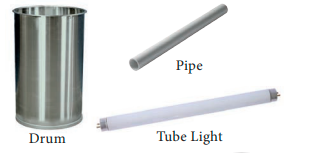
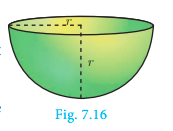
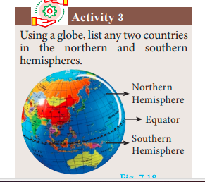
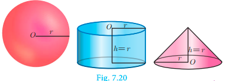
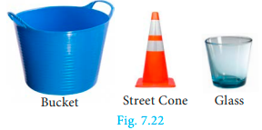
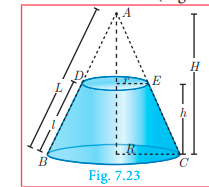
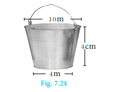

# Surface Area

Surface area is the measurement of all exposed area of a solid object.

<!--  -->

### Right Circular Cylinder

Observe the given figures in Fig.7.2 and 
identify the shape.

These objects resemble the shape of a 
cylinder.

Definition : A right circular cylinder is a solid generated by the revolution 
of a rectangle about one of its sides as axis.

<!--  -->

If the axis is perpendicular to the radius then the cylinder is called 
a right circular cylinder. In the Fig.7.3, AB = h represent the height and 
AD = r represent the radius of the cylinder.

<!-- A solid cylinder is an object bounded by two  -->

circular plane surfaces and a curved surface. The 
area between the two circular bases is called its 
‘Lateral Surface Area’ (L.S.A.) or ‘Curved Surface 
Area’ (C.S.A.).

**Formation of a Right Circular Cylinder – Demonstration**

1. Take a rectangle sheet of a paper of length l and breadth b.

<!-- 2. Revolve the paper about one of its  -->

sides, say b to complete a full rotation 
(without overlapping).

3. The shape thus formed will be 
a right circular cylinder whose 
circumference of the base is l and the height is b.

---

**Surface Area of a Right Circular Cylinder**

1. Curved surface area

Curved surface area (C.S.A.) of a right circular cylinder

 = Area of the corresponding rectangle

 = l x b
 
 =  2&#960;r x h ( l is the circumference 
 
 = 2&#960;rh of the base, b is the height)[see Fig. 7.5]

C.S.A. of a right circular cylinder = 2&#960;rh sq. units.

2. Total surface area

Total surface area refers to the sum of areas of the curved surface area and the two 
circular regions at the top and bottom.

That is, total surface area (T.S.A.) of right circular cylinder

 = C.S.A + Area of top circular region
 +Area of bottom circular region.

 = 2&#960;rh+&#960;$r^{2}$+&#960;$r^{2}$ (Refer Fig7.4)

 =2&#960;rh+2&#960;$r^{2}$

 = 2&#960;r(h+r)

 
T.S.A. of a right circular cylinder =  2&#960;r(h+r) sq. units 

<ul style="color:red;">
 <li>We always consider p = 22/7 , unless otherwise stated. </li>
 <li> The term ‘surface area’ refers to ‘total surface area’</li></ul>
 

**Example 7.1**   A cylindrical drum has a height of 20 cm and base radius of 14 cm. Find its 
curved surface area and the total surface area.

**Solution**  Given that, height of the cylinder h = 20 cm ; radius r =14 cm

Now, C.S.A. of the cylinder = 2&#960;rh sq. units

 C.S.A. of the cylinder = 2 × 22/7 × 14 × 20

= 2 x 22 x 2 x 20= 1760 $cm^{2}$

 T.S.A. of the cylinder =  2&#960;r(h + r)  sq. units

 = 2x 22/7x14x(20+14)=2 x 22/7 x 14 x 34 
 = 2992 $cm^{2}$ 

Therefore, C.S.A. = 1760 $cm^{2}$ and T.S.A. = 2992 $cm^{2}$ 

---

**Example 7.2**  The curved surface area of a right circular cylinder of height 14 cm is 
88 $cm^{2}$  . Find the diameter of the cylinder.
**Solution** Given that, C.S.A. of the cylinder =88 sq. cm 
 2&#960;rh = 88

 2 x 22/7 x r x 14 = 88 (h=14 cm)

 2r = 
$ \frac{88x18}{22x14} = 2$
 Therefore, diameter = 2 cm

**Example 7.3**   A garden roller whose length is 3 m long and whose diameter is 2.8 m is 
rolled to level a garden. How much area will it cover in 8 revolutions?
<!--  -->

**Solution** Given that, diameter d = 2.8 m and height = 3 m

 radius r = 1.4 m

 Area covered in one revolution = curved surface area of the cylinder

 = 2&#960;rh sq. units

 = 2 x 22/7 x 1.4 x 3 =26.4

 Area covered in 1 revolution = 26.4 $m^{2}$  

Area covered in 8 revolutions = 8 x 26.4 = 211.2

Therefore, area covered is 211.2 m2

**Thinking Corner**

1. When ‘h’ coins each of radius ‘r’ units and thickness 1 unit is stacked one upon the 
other, what would be the solid object you get? Also find its C.S.A. 
2. When the radius of a cylinder is double its height, find the relation between its 
C.S.A. and base area.
3. Two circular cylinders are formed by rolling two rectangular aluminum sheets each 
of dimensions 12 m length and 5 m breadth, one by rolling along its length and the 
other along its width. Find the ratio of their curved surface areas.

### Hollow Cylinder

An object bounded by two co-axial cylinders of the same height and 
different radii is called a ‘hollow cylinder’. 
Let R and r be the outer and inner radii of the cylinder. Let h be its height.
<!--  -->

C.S.A of the hollow cylinder = outer C.S.A. of the cylinder + inner C.S.A. of the cylinder

 = 2&#960;Rh + 2&#960;rh

 
C.S.A of a hollow cylinder= 2&#960;(R+r)h sq. units

---

T.S.A. of the hollow cylinder =C.S.A. + Area of two rings at the top and bottom.

 = 2&#960;(R+r)h + 2&#960;($R^{2} - r^{2}$)

T.S.A. of a hollow cylinder= 2&#960;(R+r)(R-r+h) sq. units. 

**Example 7.4**   If one litre of paint covers 10 m2, how many litres of paint is required to 
paint the internal and external surface areas of a cylindrical tunnel whose 
thickness is 2 m, internal radius is 6 m and height is 25 m. 

<!--  -->

**Solution**   Given that, height h = 25 m; thickness = 2 m

 internal radius r = 6 m

Now, external radius R = 6 + 2 = 8 m

 C.S.A. of the cylindrical tunnel = C.S.A. of the hollow cylinder

 C.S.A. of the hollow cylinder = + 2&#960;(R+r) h sq. units

 = 2 x 22/7(8+6) x 25

 Hence, C.S.A. of the cylindrical tunnel = 2200 $m^{2}$ 

 Area covered by one litre of paint = 10 m2

Number of litres required to paint the tunnel = 2200/10=220

Therefore, 220 litres of paint is needed to paint the tunnel.

**Progress Check**

1. Right circular cylinder is a solid obtained by revolving _______ about _______.
2. In a right circular cylinder the axis is _______to the diameter.
3. The difference between the C.S.A. and T.S.A. of a right circular cylinder is ______.
4. The C.S.A. of a right circular cylinder of equal radius and height is ________ the 
area of its base.

### Right Circular Cone
<!--  -->

Observe the given figures in Fig.7.9 
and identify which solid shape they 
represent?

These objects resemble the shape of 
a cone.

---

Definition : A right circular cone is a solid generated by the revolution of a 
right angled triangle about one of the sides containing the right angle as axis.

**Formation of a Right Circular Cone - Demonstration**

<!-- In Fig. 7.10, if the right triangle ABC revolves about AB as axis, the  -->

hypotenuse AC generates the curved surface of the cone represented in the 
diagram. The height of the cone is the length of the axis AB, and the slant 
height is the length of the hypotenuse AC.

**Surface area of a right circular cone**

Suppose the surface area of the cone is cut 
along the hypotenuse AC and then unrolled on 
a plane, the surface area will take the form of 
a sector ACD, of which the radius AC and the 
arc CD are respectively the slant height and the 
circumference of the base of the cone.
Here the sector of radius ‘l’ and arc length ‘s’ will be similar to a circle of radius l .

1. Curved surface area

$\displaystyle \frac{Area  of  the sector}{Area of the circle} = \frac{Arc length of the sector}{Circumference of the circle }$

Area of the sector = $ \frac{Arc length of the sector}{Circumference of the circle }$ x Area of the circle 
= s/2&#960;l x &#960;$ l^{2}$ =s/2 x l = 2&#960;r / 2 x l   (s=2&#960;r)

∴ Curved Surface Area of the cone = Area of the Sector = &#960;rl sq. units.

C.S.A. of a right circular cone = &#960;rl sq. units.

**Thinking Corner**

1. Give practical example of solid cone.
2. Find surface area of a cone in terms of its radius when height is equal to radius.
3. Compare the above surface area with the area of the base of the cone.
 
 
 **Activity 1**

1. Take a semi-circular paper with radius 7 cm and make it a cone. Find the C.S.A. 
of the cone.

2. Take a quarter circular paper with radius 3.5 cm and make it a cone. Find the 
C.S.A. of the cone.

---

Derivation of slant height ‘l’  

<!-- ABC is a right angled triangle, right angled at B. The hypotenuse,  -->

base and height of the triangle are represented by l, r and h respectively.

Now, using Pythagoras theorem in DABC,
$
 AC^{2} =  AB^{2} + BC^{2}$

 $l^{2} =  h^{2} + r^{2}$

 $ l = \sqrt{(h^{2}+r^{2})}$ units

2. Total surface area
 Total surface area of a cone =C.S.A. + base area of the cone

 = &#960;rl+ &#960;r^2 ( the base is a circle)

T.S.A. of a right circular cone= &#960;r (l+r) sq. units. 

**Example 7.5**  The radius of a conical tent is 7 m and the height is 24 m. Calculate the 
length of the canvas used to make the tent if the width of the rectangular canvas is 4 m?

**Solution**  Let r and h be the radius and height of the cone respectively.
Given that, radius r =7 m and height h = 24 m

 Hence, $ l= \sqrt{(h^{2}+r^{2})}$
        
   $    = \sqrt{49 + 576}$

 l = 625 = 25 m

 C.S.A. of the conical tent = &#960;rl sq. units

 Area of the canvas = 22/7 x 7 x 25 = 550 m2

 Now, length of the canvas =$ \frac{Area of the canvas}{width}$  
 = 550 /4
= 137.5 m

Therefore, the length of the canvas is 137.5 m

**Example 7.6**   If the total surface area of a cone of radius 7cm is 704 $cm^{2}$ , then find its 
slant height.

**Solution**   Given that, radius r = 7 cm
Now, total surface area of the cone = &#960;r(l+r) sq. units
 T.S.A. = 704 $cm^{2}$ 

 704 = 22/7x 7(l+7)

 32 = l+ 7 ⇒ l = 25 cm

Therefore, slant height of the cone is 25 cm.

---

<!-- **Example 7.7**   From a solid cylinder whose height is 2.4 cm and  -->

diameter 1.4 cm, a conical cavity of the same height and base is hollowed 
out (Fig.7.13). Find the total surface area of the remaining solid.

**Solution**  Let h and r be the height and radius of the cone and cylinder.
Let l be the slant height of the cone.
Given that, h = 2.4 cm and d = 1.4 cm ; r = 0.7 cm

Total surface area of the 
remaining solid = C.S.A. of the cylinder + C.S.A. of the cone 
+ area of the bottom

 = 2&#960;rh + &#960;rl + &#960;$r^{2} sq. units

 =&#960;r(2h+l+r) sq. units

Now,$ l  = \sqrt{(h^{2}+r^{2})}$
= $\sqrt{(0.49+5.76)}$ = $\sqrt{(6.25)}$ = 2.5 cm

 l = 2.5 cm

 Area of the remaining solid = &#960;r(2h+l+r) sq. units

 = 22/7x0.7x[(2x2.4)+2.5+0.7]

 = 17.6

Therefore, total surface area of the remaining solid is 17.6 $cm^{2}$  

**Progress Check**
1. Right circular cone is a solid obtained by revolving ____ about ____.
2. In a right circular cone the axis is ____ to the diameter.
3. The difference between the C.S.A. and T.S.A. of a cone is ____.
4. When a sector of a circle is transformed to form a cone, then match the conversions 
taking place between the sector and the cone.

| Sector | Cone |
| ----------- | ----------- |
| Radius | Circumference of the base|
| Area | Slant height |
| Arc | length Curved surface area|

### The Sphere

Definition : A sphere is a solid generated by the revolution of a semicircle about its diameter as axis.

---

Every plane section of a sphere is a circle. The line of section of a sphere by a plane 
<!-- passing through the centre of the sphere is called a great circle  --> 

all other plane sections are called small circles.
As shown in the diagram, circle with CD as diameter is a 
great circle, whereas, the circle with QR as diameter is a small 
circle.

**Surface area of a sphere**

**Archimedes Proof**

Place a sphere inside a right circular cylinder of equal diameter 
and height. Then the height of the cylinder will be the diameter of 
the sphere. In this case, Archimedes proved that the outer area of 
the sphere is same as curved surface area of the cylinder.

Surface area of sphere =curved surface area of cylinder

 = 2&#960;rh = 2 &#960;r (2r)

Surface area of a sphere = 4&#960;$r^{2}$ sq.units 

 **Activity 2**

(i) Take a sphere of radius ‘r’. 

(ii) Take a cylinder whose base diameter and height are equal to the diameter of the 
sphere.

(iii) Now, roll thread around the surface of the sphere and the cylinder without 
overlapping and leaving space between the threads.

(iv) Now compare the length of the two threads in both the cases.

(v) Use this information to find surface area of sphere.

### Hemisphere

A section of the sphere cut by a plane through any of its great 
circle is a hemisphere.

By doing this, we observe that a hemisphere is exactly half the 
portion of the sphere.

 Curved surface area of hemisphere = C.S.A. of the sphere /2 = 4&#960;$r^{2}/2$
 
C.S.A. of a hemisphere = 2&#960;$r^{2}$  sq.units 

 Total surface area of hemisphere = C.S.A. +Area of top circular region 
 
 = 2&#960;r^2 + &#960;r^2

T.S.A. of a hemisphere = 3&#960;$r^{2}$ sq.units 

---

### Hollow Hemisphere

Let the inner radius be r and outer radius be R, 
 then thickness = R−r 

Therefore, C.S.A. = Area of external hemisphere 
 + Area of internal hemisphere
 = 2&#960;R^2 + 2&#960;r^2

C.S.A. of a hollow hemisphere = 2&#960;(R^2 + r^2) sq. units 

 T.S.A. = C.S.A. + Area of annulus region
 = 2&#960;($R^{2}$ + $r^{2}$) + &#960;($R^{2}$ - $r^{2}$)
 = &#960;[$2R^{2}$ + $2r^{2}$ + $R^{2}$ - $r^{2}$]

$ T.S.A. of a hollow hemisphere = &#960; (3R^{2} + r^{2})sq. units  

**Example 7.8**   Find the diameter of a sphere whose surface area is 154 m2.

<!-- **Solution**   Let r be the radius of the sphere.  -->

Given that, surface area of sphere = 154 m2

 4&#960;$r^{2}$ = 154
 4 x 22/7 x $r^{2}$ = 154

 ⇒ r2 = 154 × 1 / 4 x 7/22

 r2 = 49 / 4  we get r = 7/2

 Therefore, diameter is 7 m

**Example 7.9**  The radius of a spherical balloon increases from 12 cm to 16 cm as air 
being pumped into it. Find the ratio of the surface area of the balloons in the two cases.

**Solution**  Let r
1 and r2 be the radii of the balloons. 
 Given that, r1/r2 = 12/16=3/4

 Now, ratio of C.S.A. of balloons = 
 4&#960;$r1^{2}$/ 4&#960;$r2^{2}$ = $r1^{2}$ / $r2^{2}$ = $(r1/r2)^{2}$ = $(3/4)^{2}$ 
= 9/16

Therefore, ratio of C.S.A. of balloons is 9:16.

**Thinking Corner**

1. Find the value of the radius of a sphere whose surface area is 36&#960; sq. units.
2. How many great circles can a sphere have? 
3. Find the surface area of the earth whose diameter is 12756 kms.

---

**Progress Check**

1. Every section of a sphere by a plane is a ____________.
2. The centre of a great circle is at the ____________ of the sphere.
3. The difference between the T.S.A. and C.S.A. of hemisphere is ______.
4. The ratio of surface area of a sphere and C.S.A. of hemisphere is _________.
5. A section of the sphere by a plane through any of its great circle is ________.

**Example 7.10**  If the base area of a hemispherical solid is 1386 sq. metres, then find its 
total surface area?

**Solution**  Let r be the radius of the hemisphere.

 Given that, base area = &#960;$r^{2}$ = 1386 sq. m

NOTE :

 For finding the C.S.A. 
and T.S.A. of a hollow 
sphere, the formulla for 
finding the surface area 
of a sphere can be used.

 T.S.A. = 3&#960;$r^{2}$ sq.m

 = 3 x 1386 = 4158

Therefore, T.S.A. of the hemispherical solid is 4158 $m^{2}$.

**Thinking Corner**

1. Shall we get a hemisphere when a sphere is cut along the small circle?
2. T.S.A of a hemisphere is equal to how many times the area of its base? 
3. How many hemispheres can be obtained from a given sphere?

**Example 7.11**   The internal and external radii of a hollow hemispherical shell are 3 m and 
5 m respectively. Find the T.S.A. and C.S.A. of the shell.
 <!--  -->
 

**Solution**   Let the internal and external radii of the hemispherical shell be r and R
respectively.

 Given that, R = 5 m, r =3 m

 C.S.A. of the shell = 2&#960;($R^{2}$ + $r^{2}$) sq. units
 = 2 x 22/7 x (25+ 9) = 213.71

 T.S.A. of the shell = &#960;($3R^{2}$ + $r^{2}$) sq. units
 =  22/7(75+9) = 264

Therefore, C.S.A.= 213.71 m
2 and T.S.A. = 264 $m^{2}$.

<!-- **Example 7.12**   A sphere, a cylinder  -->

and a cone are of the same height 
which is equal to its radius, where as 
cone and cylinder are of same height. 
Find the ratio of their curved surface 
areas

---

**Solution**   Required Ratio = C.S.A. of the sphere: C.S.A. of the cylinder : C.S.A. of the cone

 = 4&#960;$r^{2}$ : 2&#960;rh : &#960;rl     ( $ l = \sqrt{(h^{2}+r^{2})}$ = $\sqrt{2r^{2}}$ = $\sqrt{2r}$ )

 = 4&#960;$r^{2}$ : 2&#960;$r^{2}$ : &#960;$r \sqrt{2}$ r

 = 4&#960;$r^{2}$ : 2&#960;$r^{2}$ : $\sqrt{2}$&#960;$r^{2}$
 
 = 4 : 2: $\sqrt{2}$ = $2\sqrt{2}$ : $\sqrt{2}$ : 1

 ### Frustum of a right circular cone

<!-- In olden days a cone shaped buckets  -->

[Fig.7.21(a)] filled with sand / water were used 
to extinguish fire during fire accidents. Later, 
it was reshaped to a round shaped bottom 
[Fig.7.21(b)] to increase its volume. 
The shape in [Fig.7.21(c)] resembling a 
inverted bucket is called as a frustrum of a cone. 
The objects which we use in our daily life 
such as glass, bucket, street cone are examples of 
frustum of a cone. (Fig.7.22)

<!--  --> 

 Definition 

When a cone ABC is cut through by a plane parallel to its 
base, the portion of the cone DECB between the cutting plane 
and the base is called a frustum of the cone.

**Surface area of a frustum**

Let R and r be radii of the base and top region of the frustum DECB respectively, h
is the height and l is the slant height of the same.

Therefore, C.S.A. = 1/2
 (sum of the perimeters of base and top region) × slant height
 =1/2(2&#960;R + 2&#960;r) l

C.S.A. of a frustum= &#960;(R +r)l sq. units      where, l= \sqrt {($h^{2}$ + $(R-r)^{2}$)}

 T.S.A. = C.S.A. + Area of the bottom circular region 
 + Area of the top circular region.

T.S.A. of a frustum= &#960;(R+r)l + &#960;$R^{2}$ + &#960;$r^{2}$ sq. units
  
  where, l= (h^2 + (R-r)^2)^1/2

  ---

  **Example 7.13**   The slant height of a frustum of a cone is 5 cm and the radii of its ends are 
4 cm and 1 cm. Find its curved surface area.

**Solution**   Let l, R and r be the slant height, top radius and bottom radius of the frustum.

 Given that, l=5 cm, R =4 cm, r =1 cm

Now, C.S.A. of the frustum = &#960;(R+r)l sq. units

 = 22/7 x (4+1) x 5

 = 550/7

 Therefore, C.S.A. = 78.57 $cm^{2}$ 

 **Thinking Corner**

1. Give two real life examples 
for a frustum of a cone.
2. Can a hemisphere be 
considered as a frustum of 
a sphere.

**Example 7.14**   An industrial metallic bucket is in the shape of the frustum of a right 
circular cone whose top and bottom diameters are 10 m and 4 m and whose height is 4 m. 
Find the curved and total surface area of the bucket.

**Solution**   Let h, l, R and r be the height, slant height, top radius and bottom radius of the 
frustum.

Given that, diameter of the top =10 m; radius of the top R = 5 m. 
diameter of the bottom = 4 m; radius of the bottom r = 2 m, height h= 4 m

 Now, l =  (h^2+ (R −r)^2)^1/2

 = ($4^{2}$ + $(5 -2)^{2}$)^ 1/2

 l = (16+ 9)^1/2 = 25 =5m

 C.S.A. = &#960;(R+r)l sq. units

 = 22/7 (5+2)x5 
 = 110 m2

 T.S.A. = &#960;(R+r)l + &#960;$R^{2}$ + &#960;$r^{2}$ sq. units
 =22/7[(5+2)5+25+4] = 1408/7
= 201.14

 Therefore, C.S.A. = 110 m2 and T.S.A. = 201.14 m2

**Progress Check**

1. The portion of a right circular cone intersected between two parallel planes is 
_________.
2. How many frustums can a right circular cone have

---

**Exercise 7.1**

1. The radius and height of a cylinder are in the ratio 5:7 and its curved surface area is 
5500 sq.cm. Find its radius and height.
2. A solid iron cylinder has total surface area of 1848 sq.m. Its curved surface area is 
five – sixth of its total surface area. Find the radius and height of the iron cylinder.
3. The external radius and the length of a hollow wooden log are 16 cm and 13 cm 
respectively. If its thickness is 4 cm then find its T.S.A.
4. A right angled triangle PQR where ∠ = Q 90 is rotated about QR and PQ. If 
QR=16 cm and PR=20 cm, compare the curved surface areas of the right circular 
cones so formed by the triangle.
5. 4 persons live in a conical tent whose slant height is 19 m. If each person require 
22 m2 of the floor area, then find the height of the tent.
6. A girl wishes to prepare birthday caps in the form of right circular cones for her 
birthday party, using a sheet of paper whose area is 5720 $cm^{2}$ , how many caps can be 
made with radius 5 cm and height 12 cm.
7. The ratio of the radii of two right circular cones of same height is 1:3. Find the ratio 
of their curved surface area when the height of each cone is 3 times the radius of the 
smaller cone.
8. The radius of a sphere increases by 25%. Find the percentage increase in its surface area.
9. The internal and external diameters of a hollow hemispherical vessel are 20 cm and 
28 cm respectively. Find the cost to paint the vessel all over 
at Rs. 0.14 per $cm^{2}$  .
10. The frustum shaped outer portion of the table lamp has to be 
painted including the top part. Find the total cost of painting 
the lamp if the cost of painting 1 sq.cm is Rs. 2.

