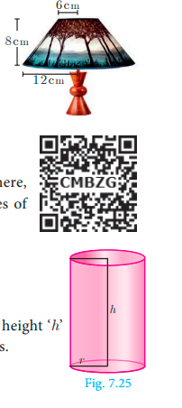
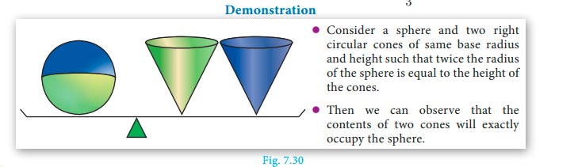
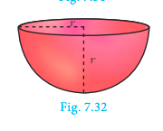
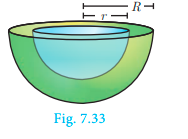

# Mensuration

“Nature is an infinite sphere of which the centre is everywhere and 
the circumference nowhere”.
                                               
                                         - Blaise Pascal

  Pappus
290 - 350 AD(CE) 

   Pappus, born at Alexandria, Egypt is the last of the great Greek 
geometers. Pappus major work ‘Synagoge’ or ‘The Mathematical 
Collection’ is a collection of mathematical writings in eight books. 

He described the principles of levers, pulleys, wedges, axles 
and screws. These concepts are widely applied in Physics and 
modern Engineering Science.

## Introduction

The ancient cultures throughout the world sought the idea of measurements for 
<!-- satisfying their daily needs.  -->

For 
example, they had to know how 
much area of crops needed to be 
grown in a given region; how 
much could a container hold? 
etc. These questions were very 
important for making decisions 
in agriculture and trade. They 
needed efficient and compact 
way of doing this. It is for this 
reason, mathematicians thought 
of applying geometry to real life 
situations to attain useful results. 
This was the reason for the origin 
of mensuration. Thus, mensuration can be thought as applied geometry.

---

We are already familiar with the areas of plane figures like square, rectangle, triangle, 
circle etc. These figures are called 2-dimensional shapes as they can be drawn in a plane. 
But most of the objects which we come across in our daily life cannot be represented in a 
plane. For example, tubes, water tanks, bricks, ice-cream cones, football etc. These objects 
are called solid shapes or 3-dimensional shapes.

We often see solids like cube, cuboid, prism and pyramid. For three dimensional 
objects measurements like surface area and volume exist.

In this chapter, we shall study about the surface area and volume 
of some of the standard solid shapes such as cylinder, cone, sphere, 
hemisphere and frustum.

## Surface Area

Surface area is the measurement of all exposed area of a solid object.

<!--  -->

### Right Circular Cylinder

Observe the given figures in Fig.7.2 and 
identify the shape.

These objects resemble the shape of a 
cylinder.

Definition : A right circular cylinder is a solid generated by the revolution 
of a rectangle about one of its sides as axis.

<!--  -->

If the axis is perpendicular to the radius then the cylinder is called 
a right circular cylinder. In the Fig.7.3, AB = h represent the height and 
AD = r represent the radius of the cylinder.

<!-- A solid cylinder is an object bounded by two  -->

circular plane surfaces and a curved surface. The 
area between the two circular bases is called its 
‘Lateral Surface Area’ (L.S.A.) or ‘Curved Surface 
Area’ (C.S.A.).

**Formation of a Right Circular Cylinder – Demonstration**

1. Take a rectangle sheet of a paper of length l and breadth b.

<!-- 2. Revolve the paper about one of its  -->

sides, say b to complete a full rotation 
(without overlapping).

3. The shape thus formed will be 
a right circular cylinder whose 
circumference of the base is l and the height is b.

---

**Surface Area of a Right Circular Cylinder**

1. Curved surface area

Curved surface area (C.S.A.) of a right circular cylinder

 = Area of the corresponding rectangle

 = l x b
 
 =  2&#960;r x h ( l is the circumference 
 
 = 2&#960;rh of the base, b is the height)[see Fig. 7.5]

C.S.A. of a right circular cylinder = 2&#960;rh sq. units.

2. Total surface area

Total surface area refers to the sum of areas of the curved surface area and the two 
circular regions at the top and bottom.

That is, total surface area (T.S.A.) of right circular cylinder

 = C.S.A + Area of top circular region
 +Area of bottom circular region.

 = 2&#960;rh+&#960;rr+&#960;rr (Refer Fig7.4)

 =2&#960;rh+2&#960;rr

 = 2&#960;r(h+r)

 
T.S.A. of a right circular cylinder =  2&#960;r(h+r) sq. units 

<ul style="color:red;">
 <li>We always consider p = 22/7 , unless otherwise stated. </li>
 <li> The term ‘surface area’ refers to ‘total surface area’</li></ul>
 

**Example 7.1**   A cylindrical drum has a height of 20 cm and base radius of 14 cm. Find its 
curved surface area and the total surface area.

**Solution**  Given that, height of the cylinder h = 20 cm ; radius r =14 cm

Now, C.S.A. of the cylinder = 2prh sq. units

 C.S.A. of the cylinder = 2×22/7×14 ×20

= 2 x 22 x 2 x 20= 1760 cm2

 T.S.A. of the cylinder = + 2pr(h +r)  sq. units

 = 2x 22/7x14x(20+14)=2x22/7x14x34 
 = 2992 cm2 

Therefore, C.S.A. = 1760 cm2 and T.S.A. = 2992 cm2

---

**Example 7.2**  The curved surface area of a right circular cylinder of height 14 cm is 
88 cm2 . Find the diameter of the cylinder.
**Solution** Given that, C.S.A. of the cylinder =88 sq. cm 
 2&#960;rh = 88

 2x 22/7xrx14 = 88 (h=14 cm)

 2r = 88x 7 / 22x 14 = 2

 Therefore, diameter = 2 cm

**Example 7.3**   A garden roller whose length is 3 m long and whose diameter is 2.8 m is 
rolled to level a garden. How much area will it cover in 8 revolutions?
<!--  -->

**Solution** Given that, diameter d = 2.8 m and height = 3 m

 radius r = 1.4 m

 Area covered in one revolution = curved surface area of the cylinder

 = 2&#960;rh sq. units

 = 2x22/7x1.4x3 =26.4

 Area covered in 1 revolution = 26.4 m2 

Area covered in 8 revolutions = ×8 26 4. = 211.2

Therefore, area covered is 211.2 m2

**Thinking Corner**

1. When ‘h’ coins each of radius ‘r’ units and thickness 1 unit is stacked one upon the 
other, what would be the solid object you get? Also find its C.S.A. 
2. When the radius of a cylinder is double its height, find the relation between its 
C.S.A. and base area.
3. Two circular cylinders are formed by rolling two rectangular aluminum sheets each 
of dimensions 12 m length and 5 m breadth, one by rolling along its length and the 
other along its width. Find the ratio of their curved surface areas.

### Hollow Cylinder

An object bounded by two co-axial cylinders of the same height and 
different radii is called a ‘hollow cylinder’. 
Let R and r be the outer and inner radii of the cylinder. Let h be its height.
<!--  -->

C.S.A of the hollow cylinder = outer C.S.A. of the cylinder 
 + inner C.S.A. of the cylinder

 = 2&#960;Rh+2&#960;rh

 
C.S.A of a hollow cylinder= 2&#960;(R+r)h sq. units

---

T.S.A. of the hollow cylinder =C.S.A. + Area of two rings at the top and bottom.

 = 2&#960;(R+r)h+ 2&#960;(R^2 - r^2)

T.S.A. of a hollow cylinder= 2&#960;(R+r)(R-r+h) sq. units. 

**Example 7.4**   If one litre of paint covers 10 m2, how many litres of paint is required to 
paint the internal and external surface areas of a cylindrical tunnel whose 
thickness is 2 m, internal radius is 6 m and height is 25 m. 

<!--  -->

**Solution**   Given that, height h = 25 m; thickness = 2 m

 internal radius r = 6 m

Now, external radius R = +6 2 = 8 m

 C.S.A. of the cylindrical tunnel = C.S.A. of the hollow cylinder

 C.S.A. of the hollow cylinder = + 2&#960;( R+r) h sq. units

 = 2x22/7(8+6)x25

 Hence, C.S.A. of the cylindrical tunnel = 2200 m2 

 Area covered by one litre of paint = 10 m2

Number of litres required to paint the tunnel = 2200/10=220

Therefore, 220 litres of paint is needed to paint the tunnel.

**Progress Check**

1. Right circular cylinder is a solid obtained by revolving _______ about _______.
2. In a right circular cylinder the axis is _______to the diameter.
3. The difference between the C.S.A. and T.S.A. of a right circular cylinder is ______.
4. The C.S.A. of a right circular cylinder of equal radius and height is ________ the 
area of its base.

### Right Circular Cone
<!--  -->

Observe the given figures in Fig.7.9 
and identify which solid shape they 
represent?

These objects resemble the shape of 
a cone.

---

Definition : A right circular cone is a solid generated by the revolution of a 
right angled triangle about one of the sides containing the right angle as axis.

**Formation of a Right Circular Cone - Demonstration**

<!-- In Fig. 7.10, if the right triangle ABC revolves about AB as axis, the  -->

hypotenuse AC generates the curved surface of the cone represented in the 
diagram. The height of the cone is the length of the axis AB, and the slant 
height is the length of the hypotenuse AC.

**Surface area of a right circular cone**

Suppose the surface area of the cone is cut 
along the hypotenuse AC and then unrolled on 
a plane, the surface area will take the form of 
a sector ACD, of which the radius AC and the 
arc CD are respectively the slant height and the 
circumference of the base of the cone.
Here the sector of radius ‘l’ and arc length ‘s’ will be similar to a circle of radius l .

(i) Curved surface area

Area of sector          Arc length of the sector
__________________  =  ____________________________
Area of the circle       Circumference of the circle

 Area of the sector = Arc length of the sector
                     ____________________________ x Area of the circle       Circumference of the circle

= s/2&#960;l x &#960;l^2 =s/2xl = 2&#960;r/2 xl   (s=2&#960;r)

∴ Curved Surface Area of the cone = Area of the Sector = &#960;rl sq. units.

C.S.A. of a right circular cone = &#960;rl sq. units.

**Thinking Corner**

1. Give practical example of solid cone.
2. Find surface area of a cone in terms of its radius when height is equal to radius.
3. Compare the above surface area with the area of the base of the cone.
 
 
 **Activity 1**

(i) Take a semi-circular paper with radius 7 cm and make it a cone. Find the C.S.A. 
of the cone.

(ii) Take a quarter circular paper with radius 3.5 cm and make it a cone. Find the 
C.S.A. of the cone.

---

Derivation of slant height ‘l’  

<!-- ABC is a right angled triangle, right angled at B. The hypotenuse,  -->

base and height of the triangle are represented by l, r and h respectively.

Now, using Pythagoras theorem in DABC,

 AC 2 = + AB^2 + BC ^2

 l^2 = + h^2 + r^2

 l = (h^2+r^2)^(1/2) units

(ii) Total surface area
 Total surface area of a cone =C.S.A. + base area of the cone

 = &#960;rl+ &#960;r^2 ( the base is a circle)

T.S.A. of a right circular cone= &#960;r (l+r) sq. units. 

**Example 7.5**  The radius of a conical tent is 7 m and the height is 24 m. Calculate the 
length of the canvas used to make the tent if the width of the rectangular canvas is 4 m?

**Solution**  Let r and h be the radius and height of the cone respectively.
Given that, radius r =7 m and height h = 24 m

 Hence, l = (r^2+ h^2)^(1/2)
        
        = (49+ 576)^(1/2)

 l = 625 = 25 m

 C.S.A. of the conical tent = &#960;rl sq. units

 Area of the canvas = 22/7x7x25 = 550 m2

 Now, length of the canvas = Area of the canvas
 _______________________ = 
      width
 = 550 /4
= 137.5 m

Therefore, the length of the canvas is 137.5 m

**Example 7.6**   If the total surface area of a cone of radius 7cm is 704 cm2, then find its 
slant height.

**Solution**   Given that, radius r = 7 cm
Now, total surface area of the cone = &#960;r(l+r) sq. units
 T.S.A. = 704 cm2

 704 = 22/7x 7(l+7)

 32 = l+ 7 ⇒ l = 25 cm

Therefore, slant height of the cone is 25 cm.

---

<!-- **Example 7.7**   From a solid cylinder whose height is 2.4 cm and  -->

diameter 1.4 cm, a conical cavity of the same height and base is hollowed 
out (Fig.7.13). Find the total surface area of the remaining solid.

**Solution**  Let h and r be the height and radius of the cone and cylinder.
Let l be the slant height of the cone.
Given that, h = 2.4 cm and d = 1.4 cm ; r = 0.7 cm

Total surface area of the 
remaining solid = C.S.A. of the cylinder + C.S.A. of the cone 
+ area of the bottom

 = 2&#960;rh + &#960;rl + &#960;r^2 sq. units

 =&#960;r(2h+l+r) sq. units

Now, l  = (r^2+h^2)^(1/2)
= (0.49+5.76)^(1/2) = (.25)^(1/2) = 2 5. cm

 l = 2.5 cm

 Area of the remaining solid = &#960;r(2h+l+r) sq. units

 = 22/7x0.7x[(2x2.4)+2.5+0.7]

 = 17.6

Therefore, total surface area of the remaining solid is 17.6 cm2 

**Progress Check**
1. Right circular cone is a solid obtained by revolving ____ about ____.
2. In a right circular cone the axis is ____ to the diameter.
3. The difference between the C.S.A. and T.S.A. of a cone is ____.
4. When a sector of a circle is transformed to form a cone, then match the conversions 
taking place between the sector and the cone.

| Sector | Cone |
| ----------- | ----------- |
| Radius | Circumference of the base|
| Area | Slant height |
| Arc | length Curved surface area|

### The Sphere

Definition : A sphere is a solid generated by the revolution of a semicircle about its diameter as axis.

---

Every plane section of a sphere is a circle. The line of section of a sphere by a plane 
<!-- passing through the centre of the sphere is called a great circle  --> 
all other plane sections are called small circles.
As shown in the diagram, circle with CD as diameter is a 
great circle, whereas, the circle with QR as diameter is a small 
circle.

**Surface area of a sphere**

**Archimedes Proof**

Place a sphere inside a right circular cylinder of equal diameter 
and height. Then the height of the cylinder will be the diameter of 
the sphere. In this case, Archimedes proved that the outer area of 
the sphere is same as curved surface area of the cylinder.

Surface area of sphere =curved surface area of cylinder

 = 2&#960;rh = 2 &#960;r (2r)

Surface area of a sphere = 4&#960;r^2 sq.units 

 **Activity 2**

(i) Take a sphere of radius ‘r’. 

(ii) Take a cylinder whose base diameter and height are equal to the diameter of the 
sphere.

(iii) Now, roll thread around the surface of the sphere and the cylinder without 
overlapping and leaving space between the threads.

(iv) Now compare the length of the two threads in both the cases.

(v) Use this information to find surface area of sphere.

### Hemisphere

A section of the sphere cut by a plane through any of its great 
circle is a hemisphere.

By doing this, we observe that a hemisphere is exactly half the 
portion of the sphere.

 Curved surface area of hemisphere = C.S.A. of the sphere /2 = 4&#960;r^2/2
 
C.S.A. of a hemisphere = 2&#960;r^2  sq.units 

 Total surface area of hemisphere = C.S.A. +Area of top circular region 
 
 = 2&#960;r^2 + &#960;r^2

T.S.A. of a hemisphere = 3&#960;r^2 sq.units 

---

### Hollow Hemisphere

Let the inner radius be r and outer radius be R, 
 then thickness = R−r 

Therefore, C.S.A. = Area of external hemisphere 
 + Area of internal hemisphere
 = 2&#960;R^2 + 2&#960;r^2

C.S.A. of a hollow hemisphere = 2&#960;(R^2 + r^2) sq. units 

 T.S.A. = C.S.A. + Area of annulus region
 = 2&#960;(R^2 + r^2) + &#960;(R^2 - r^2)
 = &#960;[2R^2 +2r^2 + R^2 - r^2]

T.S.A. of a hollow hemisphere = &#960;(3R^2+r^2) sq. units 

**Example 7.8**   Find the diameter of a sphere whose surface area is 154 m2.

<!-- **Solution**   Let r be the radius of the sphere.  -->

Given that, surface area of sphere = 154 m2

 4&#960;r^2 = 154
 4x 22/7xr^2 = 154

 ⇒ r2 = 154 × 1 / 4 x 7/22

 r2 = 49 /4  we get r = 7/2

 Therefore, diameter is 7 m

**Example 7.9**  The radius of a spherical balloon increases from 12 cm to 16 cm as air 
being pumped into it. Find the ratio of the surface area of the balloons in the two cases.

**Solution**  Let r
1 and r2 be the radii of the balloons. 
 Given that, r1/r2 = 12/16=3/4

 Now, ratio of C.S.A. of balloons = 
 4&#960;r1^2/ 4&#960;r2^2 = r1^2 / r2^2 = (r1/r2)^2 = (3/4)^2 
= 9/16

Therefore, ratio of C.S.A. of balloons is 9:16.

**Thinking Corner**

1. Find the value of the radius of a sphere whose surface area is 36p sq. units.
2. How many great circles can a sphere have? 
3. Find the surface area of the earth whose diameter is 12756 kms.

---

**Progress Check**

1. Every section of a sphere by a plane is a ____________.
2. The centre of a great circle is at the ____________ of the sphere.
3. The difference between the T.S.A. and C.S.A. of hemisphere is ______.
4. The ratio of surface area of a sphere and C.S.A. of hemisphere is _________.
5. A section of the sphere by a plane through any of its great circle is ________.

**Example 7.10**  If the base area of a hemispherical solid is 1386 sq. metres, then find its 
total surface area?

**Solution**  Let r be the radius of the hemisphere.

 Given that, base area = &#960;r^2 = 1386 sq. m

NOTE :

 For finding the C.S.A. 
and T.S.A. of a hollow 
sphere, the formulla for 
finding the surface area 
of a sphere can be used.

 T.S.A. = 3&#960;r^2 sq.m

 = 3 x 1386 = 4158

Therefore, T.S.A. of the hemispherical solid is 4158 m2.

**Thinking Corner**

1. Shall we get a hemisphere when a sphere is cut along the small circle?
2. T.S.A of a hemisphere is equal to how many times the area of its base? 
3. How many hemispheres can be obtained from a given sphere?

**Example 7.11**   The internal and external radii of a hollow hemispherical shell are 3 m and 
5 m respectively. Find the T.S.A. and C.S.A. of the shell.
 <!--  -->
 
**Solution**   Let the internal and external radii of the hemispherical shell be r and R
respectively.

 Given that, R = 5 m, r =3 m

 C.S.A. of the shell = 2&#960;(R^2 + r^2) sq. units
 = 2 x 22/7 x (25+ 9) = 213.71

 T.S.A. of the shell = &#960;(3R^2 + r^2) sq. units
 =  22/7(75+9) = 264

Therefore, C.S.A.= 213.71 m
2 and T.S.A. = 264 m2.

<!-- **Example 7.12**   A sphere, a cylinder  -->

and a cone are of the same height 
which is equal to its radius, where as 
cone and cylinder are of same height. 
Find the ratio of their curved surface 
areas

---

**Solution**   Required Ratio = C.S.A. of the sphere: C.S.A. of the cylinder : C.S.A. of the cone
 = 4&#960;r^2 : 2&#960;rh : &#960;rl     (l=((r^2+h^2)^(1/2)= (2r^2)/(1/2)) = 2r^(1/2) )

 = 4&#960;r^2 : 2&#960;r^2 : &#960;r(1/2)^2 r

 = 4&#960;r^2 : 2&#960;r^2 : 2^(1/2)&#960;r^2
 
 = 4: 2: 2^(1/2) = 2^(1/2)2: 2^(1/2) :1

 ### Frustum of a right circular cone

<!-- In olden days a cone shaped buckets  -->
[Fig.7.21(a)] filled with sand / water were used 
to extinguish fire during fire accidents. Later, 
it was reshaped to a round shaped bottom 
[Fig.7.21(b)] to increase its volume. 
The shape in [Fig.7.21(c)] resembling a 
inverted bucket is called as a frustrum of a cone. 
The objects which we use in our daily life 
such as glass, bucket, street cone are examples of 
frustum of a cone. (Fig.7.22)

<!--  --> 
 Definition 

When a cone ABC is cut through by a plane parallel to its 
base, the portion of the cone DECB between the cutting plane 
and the base is called a frustum of the cone.

**Surface area of a frustum**

Let R and r be radii of the base and top region of the frustum DECB respectively, h
is the height and l is the slant height of the same.

Therefore, C.S.A. = 1/2
 (sum of the perimeters of base and top region) × slant height
 =1/2(2&#960;R + 2&#960;r) l

C.S.A. of a frustum= &#960;(R +r)l sq. units      where, l= (h^2 + (R-r)^2)^1/2

 T.S.A. = C.S.A. + Area of the bottom circular region 
 + Area of the top circular region.

T.S.A. of a frustum= &#960;(R+r)l + &#960;R^2 + &#960;r^2 sq. units
  
  where, l= (h^2 + (R-r)^2)^1/2

  ---

  **Example 7.13**   The slant height of a frustum of a cone is 5 cm and the radii of its ends are 
4 cm and 1 cm. Find its curved surface area.

**Solution**   Let l, R and r be the slant height, top radius and bottom radius of the frustum.

 Given that, l=5 cm, R =4 cm, r =1 cm

Now, C.S.A. of the frustum = &#960;(R+r)l sq. units

 = 22/7 x (4+1) x 5

 = 550/7

 Therefore, C.S.A. = 78.57 cm2

 **Thinking Corner**

1. Give two real life examples 
for a frustum of a cone.
2. Can a hemisphere be 
considered as a frustum of 
a sphere.

**Example 7.14**   An industrial metallic bucket is in the shape of the frustum of a right 
circular cone whose top and bottom diameters are 10 m and 4 m and whose height is 4 m. 
Find the curved and total surface area of the bucket.

**Solution**   Let h, l, R and r be the height, slant height, top radius and bottom radius of the 
frustum.

Given that, diameter of the top =10 m; radius of the top R = 5 m. 
diameter of the bottom = 4 m; radius of the bottom r = 2 m, height h= 4 m

 Now, l =  (h^2+ (R −r)^2)^1/2

 = (4^2 + (5 -2)^2)^ 1/2

 l = (16+ 9)^1/2 = 25 =5m

 C.S.A. = &#960;(R+r)l sq. units

 = 22/7 (5+2)x5 
 = 110 m2

 T.S.A. = &#960;(R+r)l + &#960;R^2 + &#960;r^2 sq. units
 =22/7[(5+2)5+25+4] = 1408/7
= 201.14

 Therefore, C.S.A. = 110 m2 and T.S.A. = 201.14 m2

**Progress Check**

1. The portion of a right circular cone intersected between two parallel planes is 
_________.
2. How many frustums can a right circular cone have

---

**Exercise 7.1**

1. The radius and height of a cylinder are in the ratio 5:7 and its curved surface area is 
5500 sq.cm. Find its radius and height.
2. A solid iron cylinder has total surface area of 1848 sq.m. Its curved surface area is 
five – sixth of its total surface area. Find the radius and height of the iron cylinder.
3. The external radius and the length of a hollow wooden log are 16 cm and 13 cm 
respectively. If its thickness is 4 cm then find its T.S.A.
4. A right angled triangle PQR where ∠ = Q 90 is rotated about QR and PQ. If 
QR=16 cm and PR=20 cm, compare the curved surface areas of the right circular 
cones so formed by the triangle.
5. 4 persons live in a conical tent whose slant height is 19 m. If each person require 
22 m2 of the floor area, then find the height of the tent.
6. A girl wishes to prepare birthday caps in the form of right circular cones for her 
birthday party, using a sheet of paper whose area is 5720 cm2, how many caps can be 
made with radius 5 cm and height 12 cm.
7. The ratio of the radii of two right circular cones of same height is 1:3. Find the ratio 
of their curved surface area when the height of each cone is 3 times the radius of the 
smaller cone.
8. The radius of a sphere increases by 25%. Find the percentage increase in its surface area.
9. The internal and external diameters of a hollow hemispherical vessel are 20 cm and 
28 cm respectively. Find the cost to paint the vessel all over 
at Rs. 0.14 per cm2 .
10. The frustum shaped outer portion of the table lamp has to be 
painted including the top part. Find the total cost of painting 
the lamp if the cost of painting 1 sq.cm is Rs. 2.

## Volume

Having discussed about the surface areas of cylinder, cone, sphere, 
hemisphere and frustum, we shall now discuss about the volumes of 
these solids.

Volume refers to the amount of space occupied by an object.
The volume is measured in cubic units.

### Volume of a solid right circular cylinder

The volume of a right circular cylinder of base radius ‘r’ and height ‘h’ 
is given by V = (Base Area) × (Height) =&#960;r^2 x h  = &#960;r^2h cubic units.

Therefore, Volume of a cylinder = &#960;r^2h cu. units

---

### 7.3.2 Volume of a hollow cylinder (volume of the material used)

Let the internal and external radii of a hollow cylinder be r and R
units respectively. If the height of the cylinder is h units then
 
The volume V =( volume of the 
outer cylinder) - (
volume of the 
inner cylinder)
 
 V = &#960;R^2h - &#960;r^2h = &#960;(R^2 - r^2)h

Volume of a hollow cylinder =&#960;(R^2 - r^2)h  cu. units.

**Example 7.15**   Find the volume of a cylinder whose height is 2 m and whose base area 
is 250 m2.

**Solution**   Let r and h be the radius and height of the cylinder respectively.

 Given that, height h = 2 m, base area = 250 m2 

Now, volume of a cylinder = &#960;r^2h cu. units
 =  base area x h
 =  250 x 2 = 500 m3 

Therefore, volume of the cylinder = 500 m3 

**Thinking Corner**

1. If the height is inversely proportional to the square of its radius, the volume of the 
cylinder is ____________.
2. What happens to the volume of the cylinder with radius r and height h, when its 
(a) radius is halved (b) height is halved.

**Example 7.16**   The volume of a cylindrical water tank is 1.078 × 106 litres. If the diameter 
of the tank is 7 m, find its height.

**Solution**   Let r and h be the radius and height of the cylinder respectively.

Given that, volume of the tank = 1.078 x 10^6 = 1078000 litre
 = 1078 m3 ( 1l = 1/1000 m3)

 diameter = 7m  => radius = 7/2 m

 volume of the tank = &#960;r^2h cu. units
 1078 = 22/7 x 7/2 x 7/2 x h

Therefore, height of the tank is 28 m

---

**Example 7.17**   Find the volume of the iron used to make a hollow cylinder of height 9 cm 
and whose internal and external radii are 21 cm and 28 cm respectively.

**Solution**   Let r, R and h be the internal radius, external radius and height of the hollow 
cylinder respectively.

Given that, r =21cm, R = 28 cm, h = 9 cm

 Now, volume of hollow cylinder = &#960;(R^2 - r^2)h cu. units

 = 22/7 (28^2 - 21 ^2) x 9

 = 22/7 (784 - 441) x 9
  = 9702

Therefore, volume of iron used = 9702 cm3

**Example 7.18**   For the cylinders A and B (Fig. 7.27), 
(i) find out the cylinder whose volume is greater.
(ii) verify whether the cylinder with greater volume has greater total surface area.
(iii) find the ratios of the volumes of the cylinders A and B.

**Solution** 

(i) Volume of cylinder = &#960;r^2h cu. units

Volume of cylinder A= 22/7 x 7/2 x 7/2 x 21

 = 808.5 cm3

Volume of cylinder B= 22/7 x 21/2 x 21/2 x 7

= 2425.5 cm3

Therefore, volume of cylinder B is greater 
than volume of cylinder A.

(ii) T.S.A. of cylinder = 2&#960;r(h + r) sq. units

 T.S.A. of cylinder A = 2 x 22/7 x 7/2 x (21 + 3.5)= 539 cm2

 T.S.A. of cylinder B = 2 x 22/7 x 21/2 x (7 + 10.5) = 1155 cm2

Hence verified that cylinder B with greater volume has a greater surface area.

(iii) Volume of cylinder A /
Volume of cylinder
 = 808.5 / 2425.5 = 1/3

Therefore, ratio of the volumes of cylinders A and B is 1:3.

---

### 7.3.3 Volume of a right circular cone

Let r and h be the radius and height of a cone then its volume 
 V  = 1/3 &#960;r^2h cu. units.

 <!--  -->
 

 From, Fig.7.28 we see that,
 3× (Volume of a cone) = Volume of cylinder
 = &#960;r^2h  cu. units

Volume of a cone = 1/3&#960;r^2h cu. units

**Example 7.19**  The volume of a solid right circular cone is 11088 cm3. If its height is 24 cm 
then find the radius of the cone.

**Solution**   Let r and h be the radius and height of the cone respectively.

 Given that, volume of the cone =11088 cm3 

1/3&#960;r^2h = 11088
1/3 x 22/7 x r^2 x 24 = 11088

r^2 = 441

Therefore, radius of the cone r = 21 cm

**Thinking Corner**

1. Is it possible to find a right circular cone with equal
(a) height and slant height (b) radius and slant height (c) height and radius.
2. There are two cones with equal volumes. What will be the ratio of their radius and 
height?

---

**Example 7.20**  
The ratio of the volumes of two cones is 2:3. Find the ratio of their radii if 
the height of second cone is double the height of the first.

**Solution**   Let r
1 and h1 be the radius and height of the cone-I and let r2 and h2 be the 
radius and height of the cone-II.

Given that, h2 = 2h1  and 
(Volume of the cone I) / (Volume of the cone II)
= 2/3
1/3 &#960;r1^2h1 / 1/3 &#960; r2^2h2 = 2/3

 ⇒ r1^2 / r2^2 x h1 / 2h1 = 2/3

r1^2 / r2^2 = 4 / 3 ⇒ r1 / r2 = 2/ 3^(1/2)

 Therefore, ratio of their radii = 2 : 3^(1/2)

**Progress Check**

1. Volume of a cone is the product of its base area and ______.
2. If the radius of the cone is doubled, the new volume will be ______ times the 
original volume. 
3. Consider the cones given in Fig.7.29 
(i) Without doing any calculation, 
find out whose volume is 
greater?
(ii) Verify whether the cone with 
greater volume has greater 
surface area.
(iii) Volume of cone A : Volume of cone B =?

### 7.3.4 Volume of sphere 

Let r be the radius of a sphere then its volume is given by V  = 4/3&#960;r^3 cu. units.
 
 

 ---

 From the Fig.7.30, we see that 
 Volume of a sphere = 2 × (Volume of a cone)
where the diameters of sphere and cone are equal 
to the height of the cone.
 =2 (1/3&#960;r^2h)

 = 2/3&#960;r^2(2r),
( h  = 2 r)

 Volume of a sphere = 4/3&#960;r^3 cu. units

### 7.3.5 Volume of a hollow sphere / spherical shell (volume of the material used)

Let r and R be the inner and outer radius of the hollow sphere.

Volume enclosed between the outer and inner spheres
 = 4/3&#960;R^3 - 4/3&#960;r^3

Volume of a hollow sphere =  4/3&#960;(R^3 - r^3) cu. units

### 7.3.6 Volume of solid hemisphere

Let r be the radius of the solid hemisphere.

Volume of the solid hemisphere = 1/2 (volume of sphere)
 = 1/2(4/3&#960;r^3)

Volume of a solid hemisphere = 2/3 &#960;r^3  cu. units

### 7.3.7 Volume of hollow hemisphere (volume of the material used)
 
 

Let r and R be the inner and outer radius of the hollow hemisphere.

 Volume of hollow
hemisphere = (Volume of outer
hemisphere) −(Volume of inner
hemisphere)

 = 2/3 &#960;R^3 - 2/3 &#960;r^3

Volume of a hollow hemisphere = 2/3 &#960;(R^3 -r^3) cu. units

**Thinking Corner**

A cone, a hemisphere and a cylinder have equal bases. The heights of the cone and 
cylinder are equal and are same as the common radius. Are they equal in volume?

---

**Example 7.21**  The volume of a solid hemisphere is 29106 cm3. Another hemisphere whose 
volume is two-third of the above is carved out. Find the radius of the new hemisphere.

**Solution**   Let r be the radius of the hemisphere.

Given that, volume of the hemisphere = 29106 cm3 

 Now, volume of new hemisphere = 2/3
(Volume of original sphere)

 = 2/3 x 29106

 Volume of new hemisphere = 19404 cm3 

 2/3&#960;r^3 = 19404

 r3 = (19404 x 3 x 7) / (2 x 22)
 = 9261

 r = 9261^(1/3) = 21 cm

Therefore, r = 21 cm

**Thinking Corner**

1. Give any two real life examples of sphere and hemisphere.
2. A plane along a great circle will split the sphere into _____ parts.
3. If the volume and surface area of a sphere are numerically equal, then the radius 
of the sphere is ________.

**Example 7.22**   Calculate the mass of a hollow brass sphere if the inner diameter is 14 cm 
and thickness is 1mm, and whose density is 17.3 g/ cm3. (Hint: mass = density × volume)

**Solution**   Let r and R be the inner and outer radii of the hollow sphere.

Given that, inner diameter d =14 cm; inner radius r = 7 cm; thickness = 1 mm = 1/10cm

 Outer radius R = 7+1/10 = = 71/10 = 7.1 cm

 Volume of hollow sphere = 4/3&#960;(R^3 - r^3) cu. units
 = 4/3 x 22/7(357.91 - 343 )
  = 62.48 cm3 

But, density of brass in 1 cm3 = 17.3 gm

Total mass = 17.3 x 62.48 = 1080.90 gm

 Therefore, total mass is 1080.90 grams.

---

**Progress Check**

1. What is the ratio of volume to surface area of a sphere?
2. The relationship between the height and radius of the hemisphere is ________.
3. The volume of a sphere is the product of its surface area and _______.

### 7.3.8 Volume of frustum of a cone

Let H and h be the height of cone and frustum respectively, 
L and l be the slant height of the same.

If R, r are the radii of the circular bases of the frustum, 
then volume of the frustum of the cone is the difference of the 
volumes of the two cones. 

 V  = 1/3&#960;R^2H - 1/3&#960;(H-h)

Since the triangles ABC and ADE are similar, the ratio of their corresponding sides 
are proportional.

Therefore, H-h / H = ⇒
r / R ⇒ H = hR /R-r …(1)

 V = 1/3&#960;R^2H - 1/3&#960;(H-h)
 =&#960;H(R^2 - r^2) + 1/3&#960;r^2h
 =&#960;/3 hR/ R-r (R^2 - r^2) + &#960;r^2h    [using (1)]
 =&#960;/3hR(R+r)+&#960;/3r^2h
 

Volume of a frustum = &#960;h/3(R^2+Rr+r^2) cu. units

**Example 7.23** If the radii of the circular ends of a frustum which is 45 cm high are 28 cm 
and 7 cm, find the volume of the frustum.

**Solution**  Let h, r and R be the height, top and bottom radii of the frustum.

Given that, h = 45 cm, R = 28 cm, r = 7 cm

Volume = &#960;1/3(R^2+Rr+r^2)h cu. units
 = 1/3 x 22/7 x [28^2 + (28 x 7)+ 7^2] x 45

=1/3 x 22/7 x 1029 x 45 = 48510

Therefore, volume of the frustum is 48510 cm3

---

**Exercise 7.2**

1. A 14 m deep well with inner diameter 10 m is dug and the earth taken out is evenly 
spread all around the well to form an embankment of width 5 m. Find the height of 
the embankment.
2. A cylindrical glass with diameter 20 cm has water to a height of 9 cm. A small 
cylindrical metal of radius 5 cm and height 4 cm is immersed completely. Calculate 
the raise of the water in the glass?
3. If the circumference of a conical wooden piece is 484 cm then find its volume when 
its height is 105 cm.
4. A conical container is fully filled with petrol. The radius is 10m and the height is 
15 m. If the container can release the petrol through its bottom at the rate of 25 cu. 
meter per minute, in how many minutes the container will be emptied. Round off 
your answer to the nearest minute.
5. A right angled triangle whose sides are 6 cm, 8 cm and 10 cm is revolved about the 
sides containing the right angle in two ways. Find the difference in volumes of the 
two solids so formed.
6. The volumes of two cones of same base radius are 3600 cm3 and 5040 cm3. Find the 
ratio of heights.
7. If the ratio of radii of two spheres is 4:7, find the ratio of their volumes.
8. A solid sphere and a solid hemisphere have equal total surface area. Prove that the 
ratio of their volume is (3^1/2)3 : 4.
9. The outer and the inner surface areas of a spherical copper shell are 576&#960; cm2 and 
324&#960; cm2 respectively. Find the volume of the material required to make the shell.
10. A container open at the top is in the form of a frustum of a cone of height 16 cm with 
radii of its lower and upper ends are 8 cm and 20 cm respectively. Find the cost of 
milk which can completely fill a container at the rate of Rs.40 per litre.

## 7.4 Volume and Surface Area of Combined Solids

Observe the shapes given (Fig.7.37).

The shapes provided lead to the following definitions of ‘Combined Solid’.

---

A combined solid is said to be a solid 
formed by combining two or more solids.
The concept of combined solids is 
useful in the fields like doll making, building 
construction, carpentry, etc.

To calculate the surface area of the 
combined solid, we should only calculate the 
areas that are visible to our eyes. For example, if 
a cone is surmounted by a hemisphere, we need 
to just find out the C.S.A. of the hemisphere and C.S.A. of the cone separately and add 
them together. Note that we are leaving the base area of both the cone and the hemisphere 
since both the bases are attached together and are not visible.
But, the volume of the solid formed by joining two basic solids will be the sum of the 
volumes of the individual solids.

**Example 7.24**  A toy is in the shape of a cylinder surmounted by a 
hemisphere. The height of the toy is 25 cm. Find the total surface 
area of the toy if its common diameter is 12 cm.

**Solution**   Let r and h be the radius and height of the cylinder 
respectively.

 Given that, diameter d = 12 cm, radius r = 6 cm

Total height of the toy is 25 cm

Therefore, height of the cylindrical portion = − 25 6 = 19 cm

 T.S.A. of the toy =C.S.A. of the cylinder + C.S.A. of the hemisphere
 +Base Area of the cylinder

 = 2&#960;rh + 2&#960;r^2 + &#960;r^2

 = &#960;rh (2h+ 3r) sq.units

 = 22/7 x 6 x (38 + 18)
 
 =22/7 x 6 x 56 = 1056

Therefore, T.S.A. of the toy is 1056 cm2

**Example 7.25**  A jewel box (Fig. 7.39) is in the shape of a cuboid of 
dimensions 30 cm x 15 cm x 10 cm surmounted by a half part of 
a cylinder as shown in the figure. Find the volume of the box.

**Solution**  Let l, b and h1 be the length, breadth and height of the 
cuboid. Also let us take r and h2 be the radius and height of the 
cylinder.