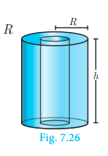
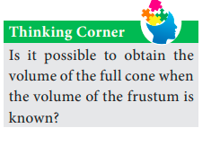
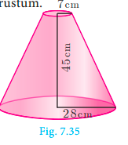

# Volume

Having discussed about the surface areas of cylinder, cone, sphere, 
hemisphere and frustum, we shall now discuss about the volumes of 
these solids.

Volume refers to the amount of space occupied by an object.
The volume is measured in cubic units.

### Volume of a solid right circular cylinder

The volume of a right circular cylinder of base radius ‘r’ and height ‘h’ 
is given by V = (Base Area) × (Height) =&#960;$r^{2}$ x h  = &#960;$r^{2}$h cubic units.

Therefore, Volume of a cylinder = &#960;$r^{2}$ h cu. units

---

### Volume of a hollow cylinder (volume of the material used)

Let the internal and external radii of a hollow cylinder be r and R
units respectively. If the height of the cylinder is h units then
 

The volume V =( volume of the 
outer cylinder) - (
volume of the 
inner cylinder)
 
 V = &#960;$R^{2}$ h - &#960;$r^{2}$ h = &#960;($R^{2}$ - $r^{2}$)h

Volume of a hollow cylinder =&#960;($R^{2}$ - $r^{2}$)h  cu. units.

**Example 7.15**   Find the volume of a cylinder whose height is 2 m and whose base area 
is 250 m2.

**Solution**   Let r and h be the radius and height of the cylinder respectively.

 Given that, height h = 2 m, base area = 250 m2 

Now, volume of a cylinder = &#960;$r^{2}$ h cu. units
 =  base area x h
 =  250 x 2 = 500 m3 

Therefore, volume of the cylinder = 500 $m^{3}$ 

**Thinking Corner**

1. If the height is inversely proportional to the square of its radius, the volume of the 
cylinder is ____________.
2. What happens to the volume of the cylinder with radius r and height h, when its 
(a) radius is halved (b) height is halved.

**Example 7.16**   The volume of a cylindrical water tank is 1.078 × 106 litres. If the diameter 
of the tank is 7 m, find its height.

**Solution**   Let r and h be the radius and height of the cylinder respectively.

Given that, volume of the tank = 1.078 x $10^{6}$ = 1078000 litre
 = 1078 m3 ( 1l = 1/1000 $m^{3}$)

 diameter = 7m  => radius = 7/2 m

 volume of the tank = &#960;$r^{2}$ h cu. units
 1078 = 22/7 x 7/2 x 7/2 x h

Therefore, height of the tank is 28 m

---

**Example 7.17**   Find the volume of the iron used to make a hollow cylinder of height 9 cm 
and whose internal and external radii are 21 cm and 28 cm respectively.

**Solution**   Let r, R and h be the internal radius, external radius and height of the hollow 
cylinder respectively.

Given that, r =21cm, R = 28 cm, h = 9 cm

 Now, volume of hollow cylinder = &#960;($R^{2}$ - $r^{2}$)h cu. units

 = 22/7 ($28^{2}$ - $21 ^{2}$) x 9

 = 22/7 (784 - 441) x 9
  = 9702

Therefore, volume of iron used = 9702 $cm^{3}$

**Example 7.18**   For the cylinders A and B (Fig. 7.27), 
(i) find out the cylinder whose volume is greater.
(ii) verify whether the cylinder with greater volume has greater total surface area.
(iii) find the ratios of the volumes of the cylinders A and B.

**Solution** 

(i) Volume of cylinder = &#960;$r^{2}$h cu. units

Volume of cylinder A= 22/7 x 7/2 x 7/2 x 21

 = 808.5 $cm^{3}$

Volume of cylinder B= 22/7 x 21/2 x 21/2 x 7

= 2425.5 $cm^{3}$

Therefore, volume of cylinder B is greater 
than volume of cylinder A.

(ii) T.S.A. of cylinder = 2&#960;r(h + r) sq. units

 T.S.A. of cylinder A = 2 x 22/7 x 7/2 x (21 + 3.5)= 539 $cm^{2}$

 T.S.A. of cylinder B = 2 x 22/7 x 21/2 x (7 + 10.5) = 1155 $cm^{2}$

Hence verified that cylinder B with greater volume has a greater surface area.

(iii) Volume of cylinder A /
Volume of cylinder
 = 808.5 / 2425.5 = 1/3

Therefore, ratio of the volumes of cylinders A and B is 1:3.

---

### Volume of a right circular cone

Let r and h be the radius and height of a cone then its volume 
 V  = 1/3 &#960;$r^{2}$ h cu. units.

 <!--  -->
 

 From, Fig.7.28 we see that,
 3× (Volume of a cone) = Volume of cylinder
 = &#960;$r^{2}$ h  cu. units

Volume of a cone = 1/3&#960;$r^{2}$ h cu. units

**Example 7.19**  The volume of a solid right circular cone is 11088 $cm^{3}$. If its height is 24 cm 
then find the radius of the cone.

**Solution**   Let r and h be the radius and height of the cone respectively.

 Given that, volume of the cone =11088 $cm^{3}$ 

1/3&#960;$r^{2}$h = 11088
1/3 x 22/7 x $r^{2}$ x 24 = 11088

$r^{2}$ = 441

Therefore, radius of the cone r = 21 cm

**Thinking Corner**

1. Is it possible to find a right circular cone with equal
(a) height and slant height (b) radius and slant height (c) height and radius.
2. There are two cones with equal volumes. What will be the ratio of their radius and 
height?

---

**Example 7.20**  
The ratio of the volumes of two cones is 2:3. Find the ratio of their radii if 
the height of second cone is double the height of the first.

**Solution**   Let r
1 and h1 be the radius and height of the cone-I and let r2 and h2 be the 
radius and height of the cone-II.

Given that, h2 = 2h1  and 
(Volume of the cone I) / (Volume of the cone II)
= 2/3
1/3 &#960;$r1^{2}$ h1 / 1/3 &#960; $r2^{2}$ h2 = 2/3

 ⇒ $r1^{2}$ / $r2^{2}$ x h1 / 2h1 = 2/3

$r1^{2}$ / $r2^{2}$ = 4 / 3 ⇒ r1 / r2 = 2/ $ \sqrt{3}$

 Therefore, ratio of their radii = 2 : $ \sqrt{3}$

**Progress Check**

1. Volume of a cone is the product of its base area and ______.
2. If the radius of the cone is doubled, the new volume will be ______ times the 
original volume. 
3. Consider the cones given in Fig.7.29
 <!--  -->
 
(i) Without doing any calculation, 
find out whose volume is 
greater?
(ii) Verify whether the cone with 
greater volume has greater 
surface area.
(iii) Volume of cone A : Volume of cone B =?

### Volume of sphere 

Let r be the radius of a sphere then its volume is given by V  = 4/3&#960;$r^{3}$ cu. units.
 
 <!--  -->
 

 ---

 From the Fig.7.30, we see that 
 Volume of a sphere = 2 × (Volume of a cone)
where the diameters of sphere and cone are equal 
to the height of the cone.
 =2 (1/3&#960;$r^{2}$ h)

 = 2/3&#960;$r^{2}$(2r),
( h  = 2 r)

 Volume of a sphere = 4/3&#960;$r^{3}$ cu. units

### 7.3.5 Volume of a hollow sphere / spherical shell (volume of the material used)
<!--  -->

Let r and R be the inner and outer radius of the hollow sphere.

Volume enclosed between the outer and inner spheres
 = 4/3&#960;$R^{3}$ - 4/3&#960;$r^{3}$

Volume of a hollow sphere =  4/3&#960;($R^{3}$ - $r^{3}$) cu. units

### Volume of solid hemisphere
<!--  -->

Let r be the radius of the solid hemisphere.

Volume of the solid hemisphere = 1/2 (volume of sphere)
 = 1/2(4/3&#960;$r^{3}$)

Volume of a solid hemisphere = 2/3 &#960;$r^{3}$  cu. units

### Volume of hollow hemisphere (volume of the material used)
 
 <!--  -->
 

Let r and R be the inner and outer radius of the hollow hemisphere.

 Volume of hollow
hemisphere = (Volume of outer
hemisphere) −(Volume of inner
hemisphere)

 = 2/3 &#960;$R^{3}$ - 2/3 &#960;$r^{3}$

Volume of a hollow hemisphere = 2/3 &#960;($R^{3}$ - $r^{3}$) cu. units

**Thinking Corner**

A cone, a hemisphere and a cylinder have equal bases. The heights of the cone and 
cylinder are equal and are same as the common radius. Are they equal in volume?

---

**Example 7.21**  The volume of a solid hemisphere is 29106 $cm^{3}$. Another hemisphere whose 
volume is two-third of the above is carved out. Find the radius of the new hemisphere.

**Solution**   Let r be the radius of the hemisphere.

Given that, volume of the hemisphere = 29106 $cm^{3}$ 

 Now, volume of new hemisphere = 2/3
(Volume of original sphere)

 = 2/3 x 29106

 Volume of new hemisphere = 19404 $cm^{3}$ 

 2/3&#960;$r^{3}$ = 19404

 $r^{3}$ = (19404 x 3 x 7) / (2 x 22)
 = 9261

 r =$3 \sqrt{9261}$  = 21 cm

Therefore, r = 21 cm

**Thinking Corner**

1. Give any two real life examples of sphere and hemisphere.
2. A plane along a great circle will split the sphere into _____ parts.
3. If the volume and surface area of a sphere are numerically equal, then the radius 
of the sphere is ________.

**Example 7.22**   Calculate the mass of a hollow brass sphere if the inner diameter is 14 cm 
and thickness is 1mm, and whose density is 17.3 g/ $cm^{3}$. (Hint: mass = density × volume)

**Solution**   Let r and R be the inner and outer radii of the hollow sphere.

Given that, inner diameter d =14 cm; inner radius r = 7 cm; thickness = 1 mm = 1/10cm

 Outer radius R = 7+1/10 = = 71/10 = 7.1 cm

 Volume of hollow sphere = 4/3&#960;($R^{3}$ - $r^{3}$) cu. units
 = 4/3 x 22/7(357.91 - 343 )
  = 62.48 $cm^{3}$ 

But, density of brass in 1 $cm^{3}$ = 17.3 gm

Total mass = 17.3 x 62.48 = 1080.90 gm

 Therefore, total mass is 1080.90 grams.

---

**Progress Check**

1. What is the ratio of volume to surface area of a sphere?
2. The relationship between the height and radius of the hemisphere is ________.
3. The volume of a sphere is the product of its surface area and _______.

### Volume of frustum of a cone
<!--  -->

Let H and h be the height of cone and frustum respectively, 
L and l be the slant height of the same.

If R, r are the radii of the circular bases of the frustum, 
then volume of the frustum of the cone is the difference of the 
volumes of the two cones. 

 V  = 1/3&#960;$r^{2}$ H - 1/3&#960;(H-h)

Since the triangles ABC and ADE are similar, the ratio of their corresponding sides 
are proportional.

Therefore, H-h / H = ⇒
r / R ⇒ H = hR /R-r …(1)
<!--  -->

 V = 1/3&#960; $r^{2}$ H - 1/3&#960;(H-h)
 =&#960;H( $R^{2}$ - $r^{2}$) + 1/3&#960; $r^{2}$ h

 =&#960;/3 (hR/ R-r) ( $R^{2}$ - $r^{2}$) + &#960;$r^{2}$ h      [using (1)]

 =&#960;/3 hR (R+r)+&#960;/3 $r^{2}$ h
 

Volume of a frustum = &#960;h/3($r^{2}$+Rr+$r^{2}$) cu. units

**Example 7.23** If the radii of the circular ends of a frustum which is 45 cm high are 28 cm 
and 7 cm, find the volume of the frustum.
<!--  -->

**Solution**  Let h, r and R be the height, top and bottom radii of the frustum.

Given that, h = 45 cm, R = 28 cm, r = 7 cm

Volume = &#960;1/3($r^{2}$+Rr+$r^{2}$)h cu. units
 = 1/3 x 22/7 x [$28^{2}$ + (28 x 7)+ $7^{2}$] x 45

=1/3 x 22/7 x 1029 x 45 = 48510

Therefore, volume of the frustum is 48510 $cm^{3}$

---

**Exercise 7.2**

1. A 14 m deep well with inner diameter 10 m is dug and the earth taken out is evenly 
spread all around the well to form an embankment of width 5 m. Find the height of 
the embankment.
2. A cylindrical glass with diameter 20 cm has water to a height of 9 cm. A small 
cylindrical metal of radius 5 cm and height 4 cm is immersed completely. Calculate 
the raise of the water in the glass?
3. If the circumference of a conical wooden piece is 484 cm then find its volume when 
its height is 105 cm.
4. A conical container is fully filled with petrol. The radius is 10m and the height is 
15 m. If the container can release the petrol through its bottom at the rate of 25 cu. 
meter per minute, in how many minutes the container will be emptied. Round off 
your answer to the nearest minute.
5. A right angled triangle whose sides are 6 cm, 8 cm and 10 cm is revolved about the 
sides containing the right angle in two ways. Find the difference in volumes of the 
two solids so formed.
6. The volumes of two cones of same base radius are 3600 $cm^{3}$ and 5040 $cm^{3}$. Find the 
ratio of heights.
7. If the ratio of radii of two spheres is 4:7, find the ratio of their volumes.
8. A solid sphere and a solid hemisphere have equal total surface area. Prove that the 
ratio of their volume is 3 $ \sqrt{3}$ : 4.
9. The outer and the inner surface areas of a spherical copper shell are 576&#960; $cm^{2}$ and 
324&#960; $cm^{2}$ respectively. Find the volume of the material required to make the shell.
10. A container open at the top is in the form of a frustum of a cone of height 16 cm with 
radii of its lower and upper ends are 8 cm and 20 cm respectively. Find the cost of 
milk which can completely fill a container at the rate of Rs.40 per litre.
