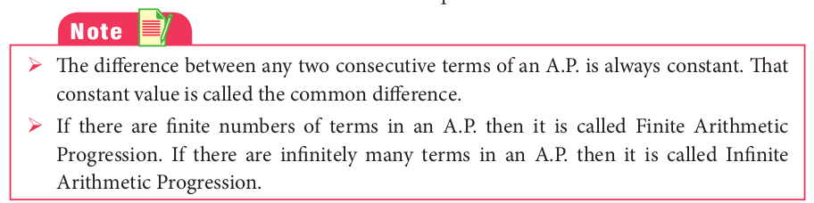
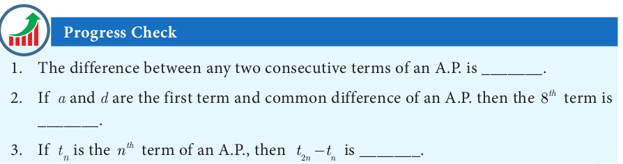

# Arithmetic Progression
Let us begin with the following two illustrations.

**Illustration 1** 

Make the following figures using match sticks 
(i). How many match sticks are required for each figure? 3, 5, 7 and 9. 
(ii). Can we find the difference between the successive numbers? 5 - 3=7-5=9-7=2 
Therefore, the difference between successive numbers is always 2.

**Illustration 2** 

A man got a job whose initial monthly salary is fixed at ₹10,000  with an annual increment of ₹2000. His salary during  1^{st}  ,  2^{nd}  and  3^{rd}  years will be ₹10000, ₹12000 and ₹14000 respectively.

If we now calculate the difference of the salaries for the successive years, we get 12000 - 10000 = 2000; 14000 - 12000 = 2000. Thus the difference between the successive numbers (salaries) is always 2000.

Did you observe the common property behind these two illustrations? In these two examples, the difference between successive terms always remains constant. Moreover, each term is obtained by adding a fixed number (2 and 2000 in illustrations 1 and 2 presented above) to the preceding term except the first term. This fixed number which is a constant for the differences between successive terms is called the “common difference”.

**Definition**

    Let a and d be real numbers. Then the numbers of the form a, a+d, a+2d, a+3d, a+4d, ... is said to form Arithmetic Progression denoted by A.P. The number ‘a’ is called the first term and ‘d’ is called the common difference.

Simply, an Arithmetic Progression is a sequence whose successive terms differ by a constant number. Thus, for example, the set of even positive integers 2, 4, 6, 8, 10, 12 … is an A.P. whose first term is a = 2 and common difference is also d = 2 since 4-2 =2, 6-4 = 2, 8 - 6 =2, …

Most of common real−life situations often produce numbers in A.P.

## Terms and Common Difference of an A.P

1. The terms of an A.P. can be written as

t_{1}= a= a+ (1-1)d, t_{2}= a+d = a+ (2-1)d,  
t_{3}= a+2d = a+ (3-1)d, t_{4}= a+3d = a+ (4-1)d

In general, the  n^{th}   term denoted by t_{n} can be written as t_{n}= a+(n-1)d.

In an AP,  n^{th}   term is t_{n}= a+(n-1)d, here, a is the first term, d is the common difference.

2. In general to find the common difference of an A.P. we should subtract first term from the second term, second from the third and so on.

For example, t_{1}= a, t_{2}= a+d 
t_{2}- t_{1} = (a+d) - a = d 
Similarly t_{2}= a+d, t_{3}= a+2d,.... 
t_{3}- t_{2}= (a+2d) - (a+d) =d  
In general,d= t_{2}-t_{1} = t_{3}-t_{2}= t_{4}-t_{3} = ..... 
d= t_{n}-t_{n-1} for n= 2, 3, 4, ...

Let us try to find the common differences of the following A.P.’s 
(i). 1, 4, 7, 10,... 
d= 4-1 = 7-4 = 10 - 7 = ...3 
(ii). 6, 2, -2, -6, ... 
d= 2 -6 = -2 -2 = -6-(-2)= ...= -4 

**Example 2.23**