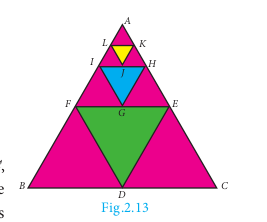
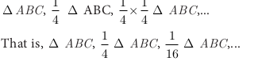
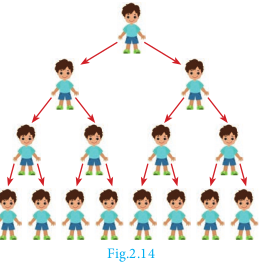
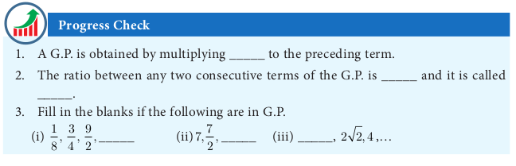
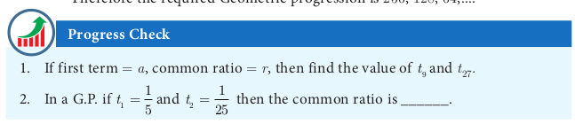
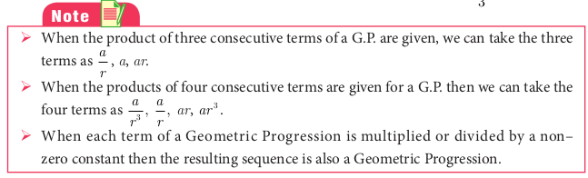

# Geometric Progression

In the diagram given in Fig.2.13, \Delta DEF is formed by joining the mid points of the sides AB, BC and CA of  \Delta ABC . Then the size of the triangle  \Delta DEF is exactly one-fourth of the size of  \Delta ABC . Similarly  \Delta GHI is also one-fourth of  \Delta DEF and so on. In general, the successive areas are one-fourth of the previous areas.

The area of these triangles are

In this case, we see that beginning with  \Delta ABC, we see that the successive triangles are formed whose areas are precisely one-fourth the area of the previous triangle. So, each term is obtained by multiplying 1/4 to the previous term.

As another case, let us consider that a viral disease is spreading in a way such that at any stage two new persons get affected from an affected person. At
first stage, one person is affected, at second stage two persons are affected and is spreading to four persons and so on. Then, number of persons affected at each stage are 1 , 2 , 4 , 8 , ... where except the first term, each term is precisely twice the previous term.

From the above examples, it is clear that each term is got by multiplying a fixed number to the preceding number. This idea leads us to the concept of Geometric Progression.

**Definition**
A Geometric Progression is a sequence in which each term is obtained by multiplying a fixed non-zero number to the preceding term except the first term. The fixed number is called common ratio. The common ratio is usually denoted by r.

**2.9.1** General form of Geometric Progression
Let a and r!=10 be real numbers. Then the numbers of the form a, ar, ar^{2} , ... ar^{n-1} ... is called a Geometric Progression. The number ‘ a ’ is called the first term and number ‘ r ’ is called the common ratio.

We note that beginning with first term a , each term is obtained by multiplied with
the common ratio ‘ r ’ to give ar , ar^{2} , ar^{3} ,...
**2.9.2** General term of Geometric Progression
We try to find a formula for n th term or general term of Geometric Progression (G P.) whose terms are in the common ratio.

a, a r, a r^{2}, \ldots, a r^{n-1}, \ldots where a is the first term and ' r ' is the common ratio. Let t_{n} be the n^{\text {th }} term of the G.P.


\begin{aligned}
& t_{1}=a=a \times r^{0}=a \times r^{1-1} \\
& t_{2}=t_{1} \times r=a \times r=a \times r^{2-1} \\
& t_{3}=t_{2} \times r=a r \times r=a r^{2}=a r^{3-1} \\
& \vdots \\
& \quad \vdots \\
& t_{n}=t_{n-1} \times r=a r^{n-2} \times r=a r^{n-2+1}=a r^{n-1}
\end{aligned}


Thus, the general term or n^{\text {th }} term of a G.P. is t_{n}=a r^{n-1}

Note

If we consider the ratio of successive terms of the G.P. then we have


\frac{t_{2}}{t_{1}}=\frac{a r}{a}=r, \frac{t_{3}}{t_{2}}=\frac{a r^{2}}{a r}=r, \frac{t_{4}}{t_{3}}=\frac{a r^{3}}{a r^{2}}=r, \frac{t_{5}}{t_{4}}=\frac{a r^{4}}{a r^{3}}=r, \ldots


Thus, the ratio between any two consecutive terms of the Geometric Progression is always constant and that constant is the common ratio of the given Progression.

Example 2.40 Which of the following sequences form a Geometric Progression?
(i) 7,14,21,28, \ldots
(ii) \frac{1}{2}, 1,2,4, \ldots
(iii) 5,25,50,75, \ldots

Solution To check if a given sequence form a G.P. we have to see if the ratio between successive terms are equal.

(i) 7,14,21,28, \ldots


\frac{t_{2}}{t_{1}}=\frac{14}{7}=2 ; \quad \frac{t_{3}}{t_{2}}=\frac{21}{14}=\frac{3}{2} ; \quad \frac{t_{4}}{t_{3}}=\frac{28}{21}=\frac{4}{3}


Since the ratios between successive terms are not equal, the sequence 7, 14, 21, 28, \ldots is not a Geometric Progression.

(ii) \frac{1}{2}, 1,2,4, \ldots


\frac{t_{2}}{t_{1}}=\frac{1}{\frac{1}{2}}=2 ; \quad \frac{t_{3}}{t_{2}}=\frac{2}{1}=2 ; \quad \frac{t_{4}}{t_{3}}=\frac{4}{2}=2


Here the ratios between successive terms are equal. Therefore the sequence \frac{1}{2}, 1,2,4, \ldots is a Geometric Progression with common ratio r=2.

(iii) 5,25,50,75, \ldots

\frac{t_{2}}{t_{1}}=\frac{25}{5}=5 ; \quad \frac{t_{3}}{t_{2}}=\frac{50}{25}=2 ; \quad \frac{t_{4}}{t_{3}}=\frac{75}{50}=\frac{3}{2}

**Example 2.41** Find the geometric progression whose first term and common ratios are given by (i) a=-7, r=6 (ii) a=256, r=0.5

*Solution* (i) The general form of Geometric progression is a, a r, a r^{2}, \ldots

a=-7, ar =-7 \times 6=-42, a r^{2}=-7 \times 6^{2}=-252

Therefore the required Geometric Progression is -7,-42,-252, \ldots

(ii) The general form of Geometric progression is a, a r, a r^{2}, \ldots

a=256, a r=256 \times 0.5=128, a r^{2}=256 \times(0.5)^{2}=64

Therefore the required Geometric progression is 256,128,64, \ldots.

**Example 2.42** Find the 8^{\text {th }} term of the G.P. 9, 3, 1,...

Solution To find the 8^{\text {th }} term we have to use the n^{\text {th }} term formula t_{n}=a r^{n-1}

First term a=9, Common ratio r=\frac{t_{2}}{t_{1}}=\frac{3}{9}=\frac{1}{3}


t_{8}=9 \times\left(\frac{1}{3}\right)^{8-1}=9 \times\left(\frac{1}{3}\right)^{7}=\frac{1}{243}


Therefore the 8^{\text {th }} term of the G.P. is \frac{1}{243}.

**Example 2.43** In a Geometric progression, the 4^{\text {th }} term is \frac{8}{9} and the 7^{\text {th }} term is \frac{64}{243}. Find the Geometric Progression.

*Solution* 4^{\text {th }} term, t_{4}=\frac{8}{9} \Rightarrow a r^{3}=\frac{8}{9}


7^{\text {th }} \text { term, } t_{7}=\frac{64}{243} \Rightarrow a r^{6}=\frac{64}{243}


Dividing (2) by (1) we get, \frac{a r^{6}}{a r^{3}}=\frac{\frac{64}{243}}{\frac{8}{9}}


r^{3}=\frac{8}{27} \Rightarrow r=\frac{2}{3}


Substituting the value of r in (1), we get a \times\left[\frac{2}{3}\right]^{3}=\frac{8}{9} \Rightarrow a=3

Therefore the Geometric Progression is a, a r, a r^{2}, \ldots That is, 3,2, \frac{4}{3}, \ldots

**Example 2.44** The product of three consecutive terms of a Geometric Progression is 343 and their sum is \frac{91}{3}. Find the three terms.

*Solution* Since the product of 3 consecutive terms is given.

we can take them as \frac{a}{r}, a, a r.

Product of the terms =343


\begin{aligned}
\frac{a}{r} \times a \times a r & =343 \\
a^{3}=7^{3} \Rightarrow a & =7
\end{aligned}


Sum of the terms =\frac{91}{3}

Hence a\left(\frac{1}{r}+1+r\right)=\frac{91}{3} \Rightarrow 7\left(\frac{1+r+r^{2}}{r}\right)=\frac{91}{3}

3+3 r+3 r^{2}=13 r \Rightarrow 3 r^{2}-10 r+3=0

(3 r-1)(r-3)=0 \Rightarrow r=3 or r=\frac{1}{3}

If a=7, r=3 then the three terms are \frac{7}{3}, 7,21.

If a=7, r=\frac{1}{3} then the three terms are 21,7, \frac{7}{3}.

**Condition for three numbers to be in G.P.**

If a, b, c are in G.P. then b=a r, c=a r^{2}. So a c=a \times a r^{2}=(a r)^{2}=b^{2}. Thus b^{2}=a c

Similarly, if b^{2}=a c, then \frac{b}{a}=\frac{c}{b}. So a, b, c are in G.P.

Thus three non-zero numbers a, b, c are in G.P. if and only if b^{2}=a c.

**Example 2.45** The present value of a machine is ₹40,000 and its value depreciates each year by 10 \%. Find the estimated value of the machine in the 6^{\text {th }} year.

*Solution* The value of the machine at present is ₹40,000. Since it is depreciated at the rate of 10 \% after one year the value of the machine is 90 \% of the initial value.

That is the value of the machine at the end of the first year is 40,000 \times \frac{90}{100}

After two years, the value of the machine is 90 \%$of the value in the first year.

Value of the machine at the end of the 2^{\text {nd }} year is 40,000 \times\left(\frac{90}{100}\right)^{2}

Continuing this way, the value of the machine depreciates in the following way as


40000,40000 \times \frac{90}{100}, 40000 \times\left(\frac{90}{100}\right)^{2} \ldots


This sequence is in the form of G.P. with first term 40,000 and common ratio \frac{90}{100}. For finding the value of the machine at the end of 5^{\text {th }} year (i.e. in 6^{\text {th }} year), we need to find the sixth term of this G.P.

Thus, n=6, a=40,000, r=\frac{90}{100}.

Using \quad t_{n}=a r^{n-1}, we have t_{6}=40,000 \times\left(\frac{90}{100}\right)^{6-1}=40000 \times\left(\frac{90}{100}\right)^{5}


t_{6}=40,000 \times \frac{9}{10} \times \frac{9}{10} \times \frac{9}{10} \times \frac{9}{10} \times \frac{9}{10}=23619.6


Therefore the value of the machine in 6^{\text {th }} year =₹ 23619.60

**Exercise 2.7**

1. Which of the following sequences are in G.P.?
(i) 3,9,27,81, \ldots
(ii) 4,44,444,4444, \ldots
(iii) 0.5,0.05,0.005, \ldots
(iv) \frac{1}{3}, \frac{1}{6}, \frac{1}{12}, \ldots
(v) 1,-5,25,-125, \ldots
(vi) 120,60,30,18, \ldots
(vii) 16,4,1, \frac{1}{4}, \ldots
2. Write the first three terms of the G.P. whose first term and the common ratio are given below.
(i) a=6, r=3
(ii) a=\sqrt{2}, r=\sqrt{2}
(iii) a=1000, r=\frac{2}{5}
3. In a G.P. 729,243,81, \ldots find t_{7}.
4. Find x so that x+6, x+12 and x+15 are consecutive terms of a Geometric Progression.
5. Find the number of terms in the following G.P.
(i) 4,8,16, \ldots, 8192 ?
(ii) \frac{1}{3}, \frac{1}{9}, \frac{1}{27}, \ldots, \frac{1}{2187}
6. In a G.P. the 9^{\text {th }} term is 32805 and 6^{\text {th }} term is 1215 . Find the 12^{\text {th }} term.
7. Find the 10^{\text {th }} term of a G.P. whose 8^{\text {th }} term is 768 and the common ratio is 2.
8. If a, b, c are in A.P. then show that 3^{a}, 3^{b}, 3^{c} are in G.P.
9. In a G.P. the product of three consecutive terms is 27 and the sum of the product of two terms taken at a time is \frac{57}{2}. Find the three terms.
10.  A man joined a company as Assistant Manager. The company gave him a starting salary of ₹ 60,000 and agreed to increase his salary 5 \% annually. What will be his salary after 5 years?
11. Sivamani is attending an interview for a job and the company gave two offers to him. Offer A: ₹20,000 to start with followed by a guaranteed annual increase of 6 \% for the first 5 years.

Offer B: ₹22,000 to start with followed by a guaranteed annual increase of $3 \%$ for the first 5 years.

What is his salary in the 4^{\text {th }} year with respect to the offers A and B ?

12. If a, b, c are three consecutive terms of an A.P. and x, y, z are three consecutive terms of a G.P. then prove that x^{b-c} \times y^{c-a} \times z^{a-b}=1.