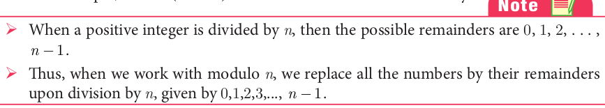
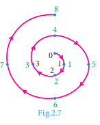
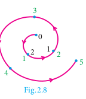
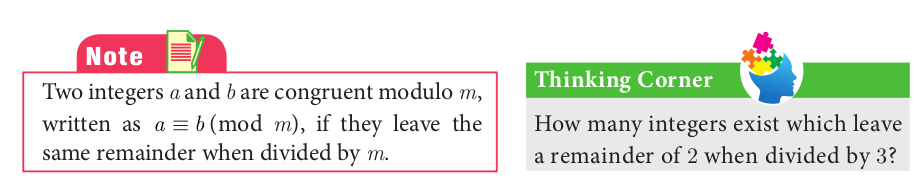
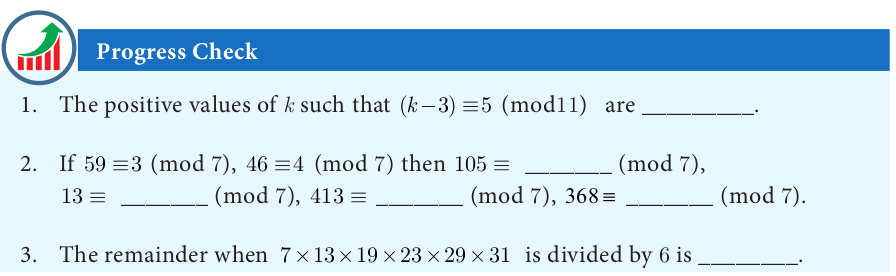
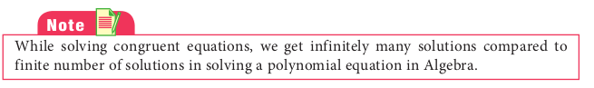

 

# Modular Arithmetic

<!--  -->

In a clock, we use the numbers 1 to 12 to represent the time period of 24 hours. How is it possible to represent the 24 hours of a day in a 12 number format? We use 1 , 2, 3, 4, 5, 6, 7, 8, 9, 10, 11, 12 and after 12, we use 1 instead of 13 and 2 instead of 14 and so on. That is after 12 we again start from 1 , 2 , 3 ,... In this system the numbers wrap around 1 to 12 . This type of wrapping around after
hitting some value is called Modular Arithmetic. 

In Mathematics, modular arithmetic is a system of arithmetic for integers where numbers wrap around a certain value. Unlike normal arithmetic, Modular Arithmetic process cyclically. The ideas of Modular arithmetic was developed by great German
mathematician Carl Friedrich Gauss, who is hailed as the “Prince of mathematicians”.

**Examples**
1. The day and night change repeatedly.
2. The days of a week occur cyclically from Sunday to Saturday. Life Cycle of Plant
3. The life cycle of a plant.
4. The seasons of a year change cyclically. (Summer, Autumn, Winter, Spring)
5. The railway and aeroplane timings also work cyclically. The railway time starts at 00 : 00 and continue. After reaching 23 : 59 , the next minute will become 00 : 00 instead of 24 : 00 .

## Congruence Modulo
Two integers a and b are congruence modulo n if they differ by an integer multiple of n. That a − b = kn for some integer k. This can also be written as a \equiv b (mod n ). Here the number n is called modulus. In other words, a \equiv b(mod n ) means a - b is divisible by n .
For example, 61 \equiv 5 (mod 7 ) because 61 – 5 = 56 is divisible by 7 .
 
Two illustrations are provided to understand modulo concept more clearly.

**
Illustration 1
**

To find 8 ( mod 4) 
With a modulus of 4 (since the possible remainders are 0, 1, 2, 3 ) we make a diagram like a clock with numbers 0, 1, 2, 3. We start at 0 and go through 8 numbers in a clockwise sequence 1, 2, 3, 0, 1, 2, 3, 0. After doing so cyclically, we end at 0. 
Therefore, 8 \equiv 0 (mod 4 )

**
Illustration 2
**

To find -5 ( mod 3) 
With a modulus of 3 (since the possible remainders are 0, 1, 2 )
we make a diagram like a clock with numbers 0, 1, 2. We start at 0 and go through 8 numbers in a anti-clockwise sequence 2, 1, 0, 2, 1. After doing so cyclically, we end at 1. 
Therefore, -5 \equiv 1  (mod 3 )

## Connecting Euclid’s Division lemma and Modular Arithmetic
Let m and n be integers, where m is positive. Then by Euclid’s division lemma, we can write n = mq + r where 0 ≤ r < m and q is an integer. Instead of writing n = mq + r we can use the congruence notation in the following way.
We say that n is congruent to r modulo m ,if n = mq + r for some integer q . 
n = mq + r 		
n–r = mq 			
n–r ≡  0 (mod m ) 
n ≡  r (mod m )
Thus the equation n = mq + r through Euclid’s Division lemma can also be written as n ≡ r (mod m ).

## Modulo operations

Similar to basic arithmetic operations like addition, subtraction and multiplication performed on numbers we can think of performing same operations in modulo arithmetic.
The following theorem provides the information of doing this.

**Theorem 5**
a, b, c and d are integers and m is a positive integer such that if a≡b (mod m ) and
c≡d (mod m ) then
(i) ( a + c ) ≡ ( b + d ) (mod m )
(ii) ( a − c ) ≡ ( b − d ) (mod m )
(iii) ( a × c ) ≡ ( b × d ) (mod m )

**
Illustration 3
**

If 17≡4 (mod 13 ) and 42≡3 (mod 13 ) then from theorem 5, 
(i). 17 + 42 ≡ 4+3(mod13)
59 ≡ 7(mod 13) 
(ii). 17 - 42 ≡ 4 - 3 (mod 13)
-25 ≡ 1 (mod 13) 
(iii). 17*42 ≡ 4*3 (mod 13)
714 ≡ 12(mod 13)

**theorem 6**

If a ≡ b (mod m ) then
(i) ac ≡ bc (mod m ) (ii) a ± c ≡ b ± c (mod m ) for any integer c

**Example 2.11** Find the remainders when 70004 and 778 is divided by 7 
*Solution* Since 70000 is divisible by 7 
70000 \equiv 0 (mod 7) 
70000+4 \equiv 0 +4(mod 7) 
70004 \equiv 4 (mod 7) 
Therefore, the remainder when 70004 is divided by 7 is 4. 
\therefore 777 is divisible by 7

777 \equiv 0 (mod 7) 
777+1 \equiv 0 +1(mod 7) 
778 \equiv 1 (mod 7) 

Therefore, the remainder when 778 is divided by 7 is 1

**Example 2.12** Determine the value of d such that 15 \equiv 3 (mod d) 
*Solution* 15 \equiv 3 (mod d) means 15-3=kd, for some integer k.  
12 = kd 
\implies d divides 12

The divisors of 12 are 1,2,3,4,6,12. But d should be larger than 3 and so the possible values for d are 4,6,12

**Example 2.13** Find the least positive value of x such that 
(i). 67+x \equiv 1(\bmod 4)      ( ii) 98 \equiv(x+4)(\bmod 5)

Solution (i) \quad 67+x \equiv 1(\bmod 4)


\begin{aligned}
67+x-1 & =4 n, \text { for some integer } n \\
66+x & =4 n
\end{aligned}


66+x is a multiple of 4 .

Therefore, the least positive value of x must be 2 , since 68 is the nearest multiple of 4 more than 66 .

(ii). 98 \equiv(x+4)(\bmod 5)
98-(x+4) = 5n , for some integer n, 
94 - x = 5n 
94 - x is a multiple of 5. 
Therefore, the least positive value of x must be 4
\because 94-4=90  is the nearest multiple of 5 less than 94.

**Example 2.14** Solve 8 x \equiv 1(\bmod 11) 
*Solution* 8 x \equiv 1(\bmod 11) can be written as 8x-1= 11k, for some integer k. 

x=\frac{11 k+1}{8} 
When we put k = 5, 13, 21, 29,... then 11k+1 is divisible by 8. 
x=\frac{11 \times 5+1}{8}=7 

x=\frac{11 \times 13+1}{8}=18 

\therefore solutions are 7,18,29,40, …

**Example 2.15** Compute x, such that 10^{4} \equiv x(\bmod 19)

*Solution*


\begin{aligned}
& 10^{2}=100 \equiv 5(\bmod 19) \\
& 10^{4}=\left(10^{2}\right)^{2} \equiv 5^{2}(\bmod 19) \\
& 10^{4} \equiv 25(\bmod 19) \\
& 10^{4} \equiv 6(\bmod 19) \quad(\because 25 \equiv 6(\bmod 19)) \\
& \therefore x=6 .
\end{aligned}


**Example 2.16** Find the number of integer solutions of 3 x \equiv 1(\bmod 15).

*Solution* \quad 3 x \equiv 1(\bmod 15) can be written as

3 x-1=15 k for some integer k

3 x=15 k+1

x=\frac{15 k+1}{3}

x=5 k+\frac{1}{3}

\because 5 k is an integer, 5 k+\frac{1}{3} cannot be an integer.

So there is no integer solution.

**Example 2.17** A man starts his journey from Chennai to Delhi by train. He starts at 22.30 hours on Wednesday. If it takes 32 hours of travelling time and assuming that the train is not late, when will he reach Delhi?

*Solution* Starting time 22.30, Travelling time 32 hours. Here we use modulo 24.

The reaching time is


\begin{aligned}
22.30+32(\bmod 24) & \equiv 54.30(\bmod 24) \\
& \equiv 6.30(\bmod 24)(\because 32=(1 \times 24)+8
\end{aligned}


Thursday Friday)

Thus, he will reach Delhi on Friday at 6.30 hours.

**Example 2.18** Kala and Vani are friends. Kala says, "Today is my birthday" and she asks Vani, "When will you celebrate your birthday?" Vani replies, "Today is Monday and I celebrated my birthday 75 days ago". Find the day when Vani celebrated her birthday.

*Solution* Let us associate the numbers 0,1,2,3,4,5,6 to represent the weekdays from Sunday to Saturday respectively.

Vani says today is Monday. So the number for Monday is 1. Since Vani's birthday was 75 days ago, we have to subtract 75 from 1 and take the modulo 7 , since a week contain 7 days.


\begin{array}{r}
-74(\bmod 7) \equiv-4(\bmod 7) \equiv 7-4(\bmod 7) \equiv 3(\bmod 7) \\
(\because-74-3=-77 \text { is divisible by } 7)
\end{array}


Thus, 1-75 \equiv 3(\bmod 7)

The day for the number 3 is Wednesday.

Therefore, Vani's birthday must be on Wednesday.

1. Find the least positive value of $x$ such that
(i) 71 \equiv x(\bmod 8)
(ii) 78+x \equiv 3(\bmod 5)
(iii) 89 \equiv(x+3)(\bmod 4)
(iv) 96 \equiv \frac{x}{7}(\bmod 5)(\mathrm{v}) 5 x \equiv 4(\bmod 6)
2. If x is congruent to 13 modulo 17 then 7 x-3 is congruent to which number modulo 17 ?
3. Solve 5 x \equiv 4(\bmod 6)
4. Solve 3 x-2 \equiv 0(\bmod 11)
5. What is the time 100 hours after 7 a.m.?
6. What is the time 15 hours before 11 p.m.?
7. Today is Tuesday. My uncle will come after 45 days. In which day my uncle will be coming?
8. Prove that 2^{n}+6 \times 9^{n} is always divisible by 7 for any positive integer n.
9. Find the remainder when 2^{81} is divided by 17 .
10. The duration of flight travel from Chennai to London through British Airlines is approximately 11 hours. The airplane begins its journey on Sunday at 23:30 hours. If the time at Chennai is four and half hours ahead to that of London's time, then find the time at London, when will the flight lands at London Airport.

