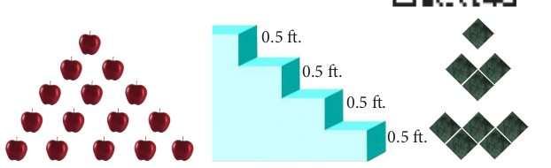
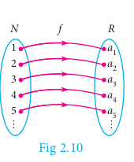
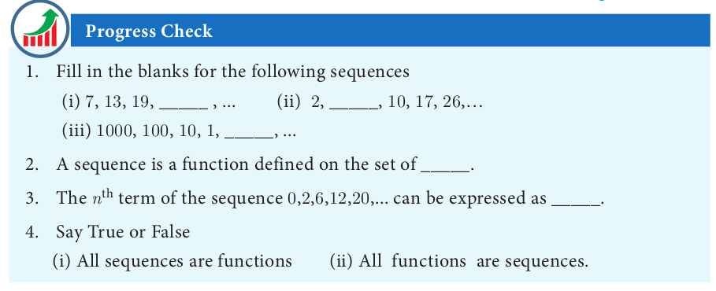
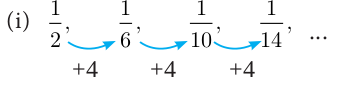
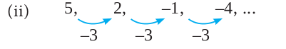
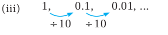
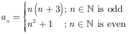

# Sequences

Consider the following pictures.

There is some pattern or arrangement in these pictures. In the first picture, the first row contains one apple, the second row contains two apples and in the third row there are three apples etc... The number of apples in each of the rows are 1, 2, 3, ...

In the second picture each step have 0 . 5 feet height. The total height of the steps from the base are 0 . 5 feet, 1 feet, 1 . 5 feet,... In the third picture one square, 3 squares, 5 squares,These numbers belong to category called **"sequences"**

**Definition**

A **real valued sequence** is a function defined on the set of natural numbers and taking real values.

Each element in the sequence is called a term of the sequence. The element in the first position is called the first term of the sequence. The element in the second position is called second term of the sequence and so on.

If the n^{th} term is denoted by a^{n} , then a^{1} is the first term, a^{2} is the second term, and so on.
A sequence can be written as a^{1}, a^{2}, a^{3} ,..., a^{n} ,...

**Illustration**

1. 1, 3, 5, 7 ,... is a sequence with general term a_{n} = 2n − 1 . When we put n = 1, 2, 3 ,..., we get a_{1} =1, a_{2} = 3, a_{3} = 5 , a_{n}= 7 ,...
2. 1/2,1/3,1/4,1/5,....is a sequence with general term 1/(n+1). When we put n = 1, 2, 3,.... we get a_{1}=1/2, a_{2}=1/3, a_{3}=1/4, a_{4}=1/5,......

If the number of elements in a sequence is finite then it is called a Finite sequence.

If the number of elements in a sequence is infinite then it is called an Infinite sequence.

**Sequence as a Function**

A sequence can be considered as a function defined on the set of natural numbers **N** . In particular, a sequence is a function

f:**N->R**, where **R** is the set of all real numbers.

If the sequence is of the form a1, a2, a3,... then we can associate the function to the sequence a_{1}, a_{2}, a_{3},... by f ( k ) = a_{k}, k =1 ,2 ,3 ,...

**Example 2.19**  Find the next three terms of the sequences

(i) \frac{1}{2}, \frac{1}{6}, \frac{1}{10}, \frac{1}{14}, \ldots
(ii) 5,2,-1,-4, \ldots
(iii) 1,0.1,0.01, \ldots

***Solution***

(i) 

In the above sequence the numerators are same and the denominator is increased by 4 .

So the next three terms are a_{5}=\frac{1}{14+4}=\frac{1}{18}


\begin{gathered}
a_{6}=\frac{1}{18+4}=\frac{1}{22}\\
a_{7}=\frac{1}{22+4}=\frac{1}{26}
\end{gathered}


(ii).

Here each term is decreased by 3. So the next three terms are -7, -10, -13.

(iii).

Here each term is divided by 10. Hence, the next three terms are


\begin{aligned}
& a_{4}=\frac{0.01}{10}=0.001 \\
& a_{5}=\frac{0.001}{10}=0.0001 \\
& a_{6}=\frac{0.0001}{10}=0.00001
\end{aligned}


**Example 2.20** Find the general term for the following sequences
(i) 3,6,9, \ldots
(ii) \frac{1}{2}, \frac{2}{3}, \frac{3}{4}, \ldots
(iii) 5,-25,125, \ldots

***Solution*** 
(i) 3,6,9, \ldots

Here the terms are multiples of 3 . So the general term is a_{n}=3 n,

(ii) \frac{1}{2}, \frac{2}{3}, \frac{3}{4}, \ldots

a_{1}=\frac{1}{2} ; a_{2}=\frac{2}{3} ; a_{3}=\frac{3}{4}

We see that the numerator of n^{\text {th }} term is n, and the denominator is one more than the numerator. Hence, a_{n}=\frac{n}{n+1}, n \in \mathbb{N}

(iii) 5,-25,125, \ldots

The terms of the sequence have + and - sign alternatively and also they are in powers of 5 .

So the general term a_{n}=(-1)^{n+1} 5^{n}, n \in \mathbb{N}

**Example 2.21** The general term of a sequence is defined as

<!-- 
a_{n}=\left\{\begin{array}{l}
n(n+3) ; n \in \mathbb{N} \text { is odd } \\
n^{2}+1 \quad ; n \in \mathbb{N} \text { is even }
\end{array}}\right.
 -->

Find the eleventh and eighteenth terms.

***Solution*** To find a_{11}, since 11 is odd, we put n=11 in a_{n}=n(n+3)

Thus, the eleventh term \quad a_{11}=11(11+3)=154.

To find a_{18}, since 18 is even, we put \quad n=18 in a_{n}=n^{2}+1

Thus, the eighteenth term \quad a_{18}=18^{2}+1=325

**Example 2.22** Find the first five terms of the following sequence.


a_{1}=1, a_{2}=1, a_{n}=\frac{a_{n-1}}{a_{n-2}+3} ; n \geq 3, n \in \mathbb{N}


***Solution*** The first two terms of this sequence are given by a_{1}=1, a_{2}=1. The third term a_{3} depends on the first and second terms.


a_{3}=\frac{a_{3-1}}{a_{3-2}+3}=\frac{a_{2}}{a_{1}+3}=\frac{1}{1+3}=\frac{1}{4}


Similarly the fourth term a_{4} depends upon a_{2} and a_{3}.


a_{4}=\frac{a_{4-1}}{a_{4-2}+3}=\frac{a_{3}}{a_{2}+3}=\frac{\frac{1}{4}}{1+3}=\frac{\frac{1}{4}}{4}=\frac{1}{4} \times \frac{1}{4}=\frac{1}{16}


In the same way, the fifth term a_{5} can be calculated as


a_{5}=\frac{a_{5-1}}{a_{5-2}+3}=\frac{a_{4}}{a_{3}+3}=\frac{\frac{1}{16}}{\frac{1}{4}+3}=\frac{1}{16} \times \frac{4}{13}=\frac{1}{52}


Therefore, the first five terms of the sequence are 1,1, \frac{1}{4}, \frac{1}{16} and \frac{1}{52}

1. Find the next three terms of the following sequence.
(i) 8,24,72, \ldots
(ii) 5,1,-3, \ldots
(iii) \frac{1}{4}, \frac{2}{9}, \frac{3}{16}, \ldots
1. Find the first four terms of the sequences whose n^{\text {th }} terms are given by
(i) a_{n}=n^{3}-2
(ii) a_{n}=(-1)^{n+1} n(n+1)
(iii) a_{n}=2 n^{2}-6
1. Find the n^{\text {th }} term of the following sequences
(i) 2,5,10,17, \ldots
(ii) 0, \frac{1}{2}, \frac{2}{3}, \ldots
(iii) 3,8,13,18, \ldots
1. Find the indicated terms of the sequences whose n^{\text {th }} terms are given by
(i) a_{n}=\frac{5 n}{n+2} ; a_{6} and a_{13}
(ii) a_{n}=-\left(n^{2}-4\right) ; a_{4} and a_{11}
1. Find a_{8} and a_{15} whose n^{\text {th }} term is a_{n}= \begin{cases}\frac{n^{2}-1}{n+3} & ; n \text { is even, } n \in \mathbb{N} \\ \frac{n^{2}}{2 n+1} & ; n \text { is odd, } n \in \mathbb{N}\end{cases}
2. If a_{1}=1, a_{2}=1 and a_{n}=2 a_{n-1}+a_{n-2,} n \geq 3, n \in \mathbb{N}, then find the first six terms of the sequence.

