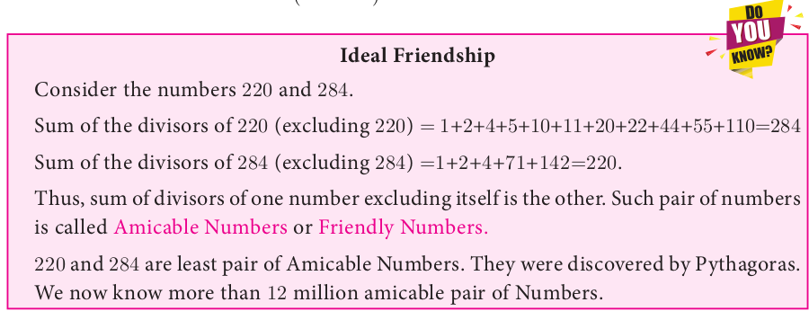

<!-- ---
title: 'Special Series'
weight: 11
---

# Special Series

There are some series whose sum can be expressed by explicit formulae. Such series are called special series.

Here we study some common special series like          
1. Sum of first ‘n’ natural numbers.             
2. Sum of first ‘n’ odd natural numbers.
3. Sum of squares of first ‘n’ natural numbers.
4. Sum of cubes of first ‘n’ natural numbers.
   
We can derive the formula for sum of any powers of first n natural numbers using the expression (x+1)^{k+1} - (x)^{k+1}. That is to find 1^{k} + 2^{k} + 3^{k} + \cdots + n^{k} we can use the expression (x+1)^{k+1}  -  (x)^{k+1}.

## Sum of first n natural numbers

To find 1+2+3+4+ ...+ n , let us consider the identity (x+1)^{2}-x^{2} = 2x+1
Where x = 1, 2, 3,.....n – 1, n  
x = 1 , 2^{2}-1^{2} = 2(1)+1 
x = 2 , 3^{2}-2^{2} = 2(2)+1 
x = 3 , 4^{2}-3^{2} = 2(3)+1 .....
x= n - 1, n^{2}-(n-1)^{2} = 2(n-1) +1 
x= n, (n+1)^2-n^{2}= 2n+1 
Adding all these equations and cancelling the terms on the Left Hand side, we get, 
(n+1)^2 - 1^{2} = 2(1+2+3+....+n)+n 
n^{2}+2n = 2(1+2+3+....+n)+n 
2(1+2+3+....+n) = n^{2}+n=n(n+1) 
1+2+3+....+n =  \frac{n(n+1)}{2} 

Here is a summary of list of some useful summation formulae which we discussed. These formulae are used in solving summation problems with finite terms.

**Example 2.54** Find the value of (i) 1 + 2 + 3 + ... + 50 (ii) 16 + 17 + 18 + ... + 75

*Solution* (i) 1 + 2 + 3 + .... + 50

1. Find the sum of the following series
    (i). 1+2+3+....+60  (ii). 3+6+9+....+96
    (iii). 51+52+53+....+92     (iv). 1+4+9+16+.....+ 225
    (v). \def\foo{6^2} \foo + \def\foo{7^2} \foo + \def\foo{8^2} \foo  + ......+ \def\foo{21^2} \foo
    (vii). 1+3+5+7+....+71
2. If 1+2+3+...+k =325, then find   
3. 
4. 
5. The sum of the cubes of the first n natural numbers is 2025, then find the value of n.
6. Rekha has 15 square colour papers of sizes 10 cm, 11 cm, 12 cm,..., 24 cm. How much area can be decorated with these colour papers?

1. Euclid’s division lemma states that for positive integers a and b , there exist unique integers q and r such that a = bq + r , where r must satisfy.
    (A). 1 < r < b  (B). 0 < r < b  (C). 
 0 \le r < b  (D).  0 < r \le b 
1. Using Euclid’s division lemma, if the cube of any positive integer is divided by 9 then the possible remainders are
(A) 0 , 1 , 8 (B) 1 , 4 , 8 (C) 0 , 1 , 3 (D) 1 , 3 , 5
1. If the HCF of 65 and 117 is expressible in the form of 65 m - 117 , then the value of m is
(A) 4 (B) 2 (C) 1 (D) 3
1. The sum of the exponents of the prime factors in the prime factorization of 1729 is
(A) 1 (B) 2 (C) 3 (D) 4
1. The least number that is divisible by all the numbers from 1 to 10 (both inclusive) is
(A) 2025 (B) 5220 (C) 5025 (D) 2520
1. 7^{4k} \equiv __________(mod 100)
2. Given  F_{1}=1, F_{2}=3 and F_{n}=F_{n-1}+F_{n-2}=1 then F_{5} is
   (A). 3   (B). 5      (C). 8      (D). 11
3. The first term of an arithmetic progression is unity and the common difference is 4. Which of the following will be a term of this A.P.
(A) 4551 (B) 10091 (C) 7881 (D) 13531
1. The 6^{th} term of an A.P. is equal to 7 times the 7^{th} term, then the 13^{th} term of the A.P. is
    (A). 0  (B). 6      (C). 7      (D). 13
2.  An A.P. consists of 31 terms. If it's 16^{th} term is m, then the sum of all the terms of this A.P. is
    (A). 16m    (B). 62m    (C). 31     (D). \frac{31}{2}
3.  In an A.P., the first term is 1 and the common difference is 4 . How many terms of the A.P. must be taken for their sum to be equal to 120 ?
(A) 6 (B) 7 (C) 8 (D) 9
1.   If A= 2^{65} and B= x2^{64} + 2^{63} + \cdots + 2^{0}  which of the following is true?
    (A). B is 2^{64} more than A
    (B). A and B are equal
    (C). A and B are equal
    (D).  A is larger than B by 1
2.  The next term of the sequence \frac{3}{16}, \frac{1}{8}, \frac{1}{12}, \frac{1}{18},....... is
    (A). \frac{1}{24}
    (B). \frac{1}{27}
    (C). \frac{2}{3}
    (D). \frac{1}{81}

14. If the sequence t_{1}, t_{2}, t_3

1. Prove that n^{2}-n divisible by 2 for every positive integer n .
2. A milk man has 175 litres of cow’s milk and 105 litres of buffalow’s milk. He wishes to sell the milk by filling the two types of milk in cans of equal capacity. Calculate the following (i) Capacity of a can (ii) Number of cans of cow’s milk (iii) Number of cans of buffalow’s milk.
3. When the positive integers a , b and c are divided by 13 the respective remainders are 9 , 7 and 10 . Find the remainder when a + 2b + 3c is divided by 13 .
4. Show that 107 is of the form 4 q + 3 for any integer q .
5. If ( m + 1 )^{th} term of an A.P. is twice the ( n + 1 )^{th} term, then prove that ( 3m+1 )^{th} term is twice the ( m + n + 1 )^{th} term.
6. Find the 12^{th} term from the last term of the A. P -2 , -4 , -6 ,... -100 .
7. Two A.P.’s have the same common difference. The first term of one A.P. is 2 and that of the other is 7 . Show that the difference between their 10^{th}  terms is the same as the difference between their 21^{st} terms, which is the same as the difference between any two corresponding terms.
8. A man saved ₹ 16500 in ten years. In each year after the first he saved ₹ 100 more than he did in the preceding year. How much did he save in the first year?
9. Find the G.P. in which the 2^{nd}  term is \sqrt{x} and the 6^{th}  term is \sqrt[9]{6}.
10. The value of a motor cycle depreciates at the rate of 15 % per year. What will be the value of the motor cycle 3 year hence, which is now purchased for ₹ 45,000 ?

 -->
