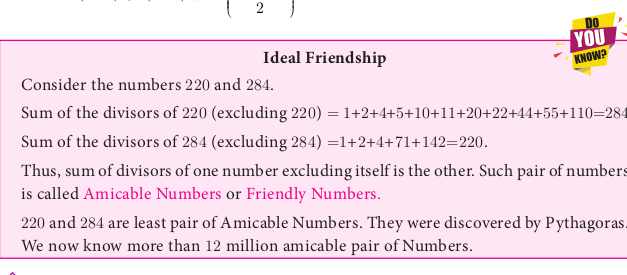
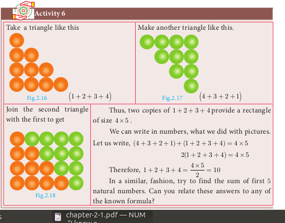
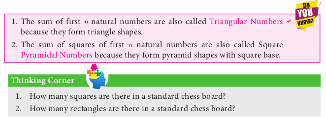
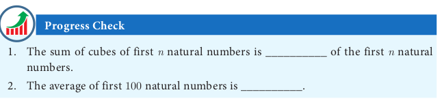
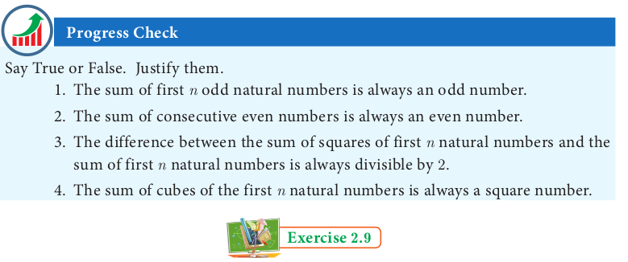
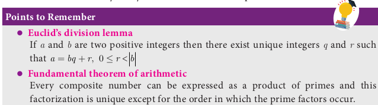
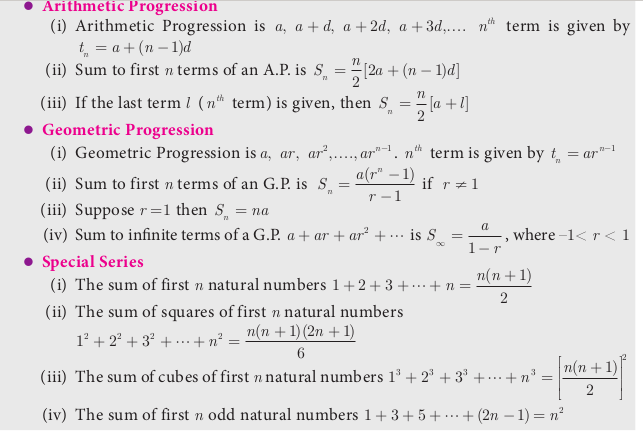

# Special Series

There are some series whose sum can be expressed by explicit formulae. Such series are called special series.

Here we study some common special series like          
1. Sum of first ‘n’ natural numbers.             
2. Sum of first ‘n’ odd natural numbers.
3. Sum of squares of first ‘n’ natural numbers.
4. Sum of cubes of first ‘n’ natural numbers.
   
We can derive the formula for sum of any powers of first n natural numbers using the expression (x+1)^{k+1} - (x)^{k+1}. That is to find 1^{k} + 2^{k} + 3^{k} + \cdots + n^{k} we can use the expression (x+1)^{k+1}  -  (x)^{k+1}.

## Sum of first n natural numbers

To find 1+2+3+4+ ...+ n , let us consider the identity (x+1)^{2}-x^{2} = 2x+1
Where x = 1, 2, 3,.....n – 1, n  
x = 1 , 2^{2}-1^{2} = 2(1)+1 
x = 2 , 3^{2}-2^{2} = 2(2)+1 
x = 3 , 4^{2}-3^{2} = 2(3)+1 .....
x= n - 1, n^{2}-(n-1)^{2} = 2(n-1) +1 
x= n, (n+1)^2-n^{2}= 2n+1 
Adding all these equations and cancelling the terms on the Left Hand side, we get, 
(n+1)^2 - 1^{2} = 2(1+2+3+....+n)+n 
n^{2}+2n = 2(1+2+3+....+n)+n 
2(1+2+3+....+n) = n^{2}+n=n(n+1) 
1+2+3+....+n =  \frac{n(n+1)}{2}

## Sum of first *n* odd natural numbers

1+3+5+\cdots+(2 n-1)

It is an A.P. with a=1, d=2 and l=2 n-1


\begin{aligned}
S_{n} & =\frac{n}{2}[a+l] \\
& =\frac{n}{2}[1+2 n-1] \\
S_{n} & =\frac{n}{2} \times 2 n=n^{2}
\end{aligned}


## Sum of squares of first $\boldsymbol{n}$ natural numbers

To find 1^{2}+2^{2}+3^{2}+\cdots+n^{2}, let us consider the identity (x+1)^{3}-x^{3}=3 x^{2}+3 x+1

Where x=1,2,3, \ldots . . \mathrm{n}-1, \mathrm{n}


\begin{aligned}
& x=1,2^{3}-1^{3}=3(1)^{2}+3(1)+1 \\
& x=2,3^{3}-2^{3}=3(2)^{2}+3(2)+1 \\
& x=3,4^{3}-3^{3}=3(3)^{2}+3(3)+1 \\
& x=n-1, n^{3}-(n-1)^{3}=3(n-1)^{2}+3(n-1)+1 \\
& x=n,(n+1)^{3}-n^{3}=3 n^{2}+3 n+1
\end{aligned}


Adding all these equations and cancelling the terms on the Left Hand side, we get,


\begin{aligned}
(n+1)^{3}-1^{3} & =3\left(1^{2}+2^{2}+3^{2}+\cdots+n^{2}\right)+3(1+2+3+\cdots+n)+n \\
n^{3}+3 n^{2}+3 n & =3\left(1^{2}+2^{2}+3^{2}+\cdots+n^{2}\right)+\frac{3 n(n+1)}{2}+n \\
3\left(1^{2}+2^{2}+3^{2}+\cdots+n^{2}\right) & =n^{3}+3 n^{2}+2 n-\frac{3 n(n+1)}{2}=\frac{2 n^{3}+6 n^{2}+4 n-3 n^{2}-3 n}{2} \\
3\left(1^{2}+2^{2}+3^{2}+\ldots+n^{2}\right) & =\frac{2 n^{3}+3 n^{2}+n}{2}=\frac{n\left(2 n^{2}+3 n+1\right)}{2}=\frac{n(n+1)(2 n+1)}{2} \\
1^{2}+2^{2}+3^{2}+\cdots+n^{2} & =\frac{n(n+1)(2 n+1)}{6}
\end{aligned}


## Sum of cubes of first $\boldsymbol{n}$ natural numbers

To find 1^{3}+2^{3}+3^{3}+\cdots+n^{3}/, let us consider the identity (x+1)^{4}-x^{4}=4 x^{3}+6 x^{2}+4 x+1

Where x=1,2,3, \ldots . . \mathrm{n}-1, \mathrm{n}


\begin{gathered}
x=1,2^{4}-1^{4}=4(1)^{3}+6(1)^{2}+4(1)+1 \\
x=2,3^{4}-2^{4}=4(2)^{3}+6(2)^{2}+4(2)+1 \\
x=3,4^{4}-3^{4}=4(3)^{3}+6(3)^{2}+4(3)+1 \\
\vdots \quad \vdots \quad \vdots \\
x=n-1, n^{4}-(n-1)^{4}=4(n-1)^{3}+6(n-1)^{2}+4(n-1)+1 \\
x=n,(n+1)^{4}-n^{4}=4 n^{3}+6 n^{2}+4 n+1
\end{gathered}


Adding all these equations and cancelling the terms on the Left Hand side, we get,


\begin{gathered}
(n+1)^{4}-1^{4}=4\left(1^{3}+2^{3}+3^{3}+\cdots+n^{3}\right)+6\left(1^{2}+2^{2}+3^{2}+\cdots+n^{2}\right)+4(1+2+3+\cdots+n)+n \\
n^{4}+4 n^{3}+6 n^{2}+4 n=4\left(1^{3}+2^{3}+3^{3}+\cdots+n^{3}\right)+6 \times \frac{n(n+1)(2 n+1)}{6}+4 \times \frac{n(n+1)}{2}+n \\
4\left(1^{3}+2^{3}+3^{3}+\cdots+n^{3}\right)=n^{4}+4 n^{3}+6 n^{2}+4 n-2 n^{3}-n^{2}-2 n^{2}-n-2 n^{2}-2 n-n \\
4\left(1^{3}+2^{3}+3^{3}+\cdots+n^{3}\right)=n^{4}+2 n^{3}+n^{2}=n^{2}\left(n^{2}+2 n+1\right)=n^{2}(n+1)^{2} \\
1^{3}+2^{3}+3^{3}+\cdots+n^{3}=\left(\frac{n(n+1)}{2}\right)^{2}
\end{gathered}


[3](3.png)

Here is a summary of list of some useful summation formulae which we discussed. These formulae are used in solving summation problems with finite terms.

**Example 2.54** Find the value of (i) 1+2+3+\ldots+50 (ii) 16+17+18+\ldots+75

*Solution* (i) 1+2+3+\cdots+50


\text { Using, } \begin{aligned}
1+2+3+\cdots+n & =\frac{n(n+1)}{2} \\
1+2+3+\cdots+50 & =\frac{50 \times(50+1)}{2}=1275
\end{aligned}


(ii) 16+17+18+\cdots+75=(1+2+3+\cdots+75)-(1+2+3+\cdots+15)


=\frac{75(75+1)}{2}-\frac{15(15+1)}{2}



=2850-120=2730


**Example 2.55** Find the sum of

(i) 1+3+5+\cdots to 40 terms

(ii) 2+4+6+\cdots+80

(iii) 1+3+5+\cdots+55

*Solution*
(i) 1+3+5+\cdots 40 terms =40^{2}=1600
(ii) 2+4+6+\cdots+80=2(1+2+3+\cdots+40)=2 \times \frac{40 \times(40+1)}{2}=1640
(iii) 1+3+5+\cdots+55

Here the number of terms is not given. Now we have to find the number of terms

using the formula, n=\frac{(l-a)}{d}+1 \Rightarrow n=\frac{(55-1)}{2}+1=28

Therefore, 1+3+5+\cdots+55=(28)^{2}=784

**Example 2.56** Find the sum of

(i) 1^{2}+2^{2}+\cdots+19^{2}

(ii) 5^{2}+10^{2}+15^{2}+\cdots+105^{2}

(iii) 15^{2}+16^{2}+17^{2}+\cdots+28^{2}

*Solution* (i) 1^{2}+2^{2}+\cdots+19^{2}=\frac{19 \times(19+1)(2 \times 19+1)}{6}=\frac{19 \times 20 \times 39}{6}=2470

(ii) 5^{2}+10^{2}+15^{2}+\cdots+105^{2}=5^{2}\left(1^{2}+2^{2}+3^{2}+\cdots+21^{2}\right)


\begin{aligned}
& =25 \times \frac{21 \times(21+1)(2 \times 21+1)}{6} \\
& =\frac{25 \times 21 \times 22 \times 43}{6}=82775
\end{aligned}


(iii) 15^{2}+16^{2}+17^{2}+\cdots+28^{2}=\left(1^{2}+2^{2}+3^{2}+\cdots+28^{2}\right)-\left(1^{2}+2^{2}+3^{2}+\cdots+14^{2}\right)


=\frac{28 \times 29 \times 57}{6}-\frac{14 \times 15 \times 29}{6}=7714-1015=6699


**Example 2.57** Find the sum of (i) 1^{3}+2^{3}+3^{3}+\cdots+16^{3} \quad (ii) 9^{3}+10^{3}+\cdots+21^{3}

*Solution* (i) 1^{3}+2^{3}+3^{3}+\cdots+16^{3}=\left[\frac{16 \times(16+1)}{2}\right]^{2}=(136)^{2}=18496

(ii) 9^{3}+10^{3}+\cdots+21^{3}=\left(1^{3}+2^{3}+3^{3}+\cdots+21^{3}\right)-\left(1^{3}+2^{3}+3^{3}+\cdots+8^{3}\right)


=\left[\frac{21 \times(21+1)}{2}\right]^{2}-\left[\frac{8 \times(8+1)}{2}\right]^{2}=(231)^{2}-(36)^{2}=52065


**Example 2.58** If 1+2+3+\cdots+n=666 then find n.

*Solution* Since, 1+2+3+\ldots+n=\frac{n(n+1)}{2}, we have \frac{n(n+1)}{2}=666


n^{2}+n-1332=0 \Rightarrow(n+37)(n-36)=0


So, n=-37 or n=36

But n \neq-37(\because n is a natural number ); Hence n=36.

1. Find the sum of the following series
(i) 1+2+3+\cdots+60
(ii) 3+6+9+\cdots+96
(iii) 51+52+53+\cdots+92
(iv) 1+4+9+16+\cdots+225
(v) 6^{2}+7^{2}+8^{2}+\cdots+21^{2}
(vi) 10^{3}+11^{3}+12^{3}+\cdots+20^{3}
(vii) 1+3+5+\cdots+71
2. If 1+2+3+\cdots+k=325, then find 1^{3}+2^{3}+3^{3}+\cdots+k^{3}.
3. If 1^{3}+2^{3}+3^{3}+\cdots+k^{3}=44100 then find 1+2+3+\cdots+k.
4. How many terms of the series 1^{3}+2^{3}+3^{3}+\cdots should be taken to get the sum 14400 ?
5. The sum of the cubes of the first n natural numbers is 2025 , then find the value of n.
6. Rekha has 15 square colour papers of sizes 10 \mathrm{~cm}, 11 \mathrm{~cm}, 12 \mathrm{~cm}, \ldots, 24 \mathrm{~cm}. How much area can be decorated with these colour papers?
7. Find the sum of the series \left(2^{3}-1^{3}\right)+\left(4^{3}-3^{3}\right)+\left(6^{3}-5^{3}\right)+\cdots to
(i) n terms
(ii) 8 terms

1. Euclid's division lemma states that for positive integers a and b, there exist unique integers q and r such that a=b q+r, where r must satisfy.
(A) 1<r<b
(B) 0<r<b
(C) 0 \leq r<b
(D) 0<r \leq b
2. Using Euclid's division lemma, if the cube of any positive integer is divided by 9 then the possible remainders are
(A) 0,1,8
(B) 1,4,8
(C) 0,1,3
(D) 1,3,5
3. If the HCF of 65 and 117 is expressible in the form of 65m-117, then the value of m is
(A) 4
(B) 2
(C) 1
(D) 3
4. The sum of the exponents of the prime factors in the prime factorization of 1729 is
(A) 1
(B) 2
(C) 3
(D) 4
5. The least number that is divisible by all the numbers from 1 to 10 (both inclusive) is
(A) 2025
(B) 5220
(C) 5025
(D) 2520
6. 7^{4 k} \equiv(\bmod 100)
(A) 1
(B) 2
(C) 3
(D) 4
7. Given F_{1}=1, F_{2}=3 and F_{n}=F_{n-1}+F_{n-2} then F_{5} is
(A) 3
(B) 5
(C) 8
(D) 11
8. The first term of an arithmetic progression is unity and the common difference is 4 . Which of the following will be a term of this A.P.
(A) 4551
(B) 10091
(C) 7881
(D) 13531
9. If 6 times of 6^{\text {th }} term of an A.P. is equal to 7 times the 7^{\text {th }} term, then the 13^{\text {th }} term of the A.P. is
(A) 0
(B) 6
(C) 7
(D) 13
10.  An A.P. consists of 31 terms. If its 16^{\text {th }} term is m, then the sum of all the terms of this A.P. is
(A) 16 \mathrm{~m}
(B) 62 \mathrm{~m}
(C) 31 \mathrm{~m}
(D) \frac{31}{2} \mathrm{~m}
11.  In an A.P., the first term is 1 and the common difference is 4 . How many terms of the A.P. must be taken for their sum to be equal to 120 ?
(A) 6
(B) 7
(C) 8
(D) 9
12.  If A=2^{65} and B=2^{64}+2^{63}+2^{62}+\cdots+2^{0} which of the following is true?
(A) B is 2^{64} more than A
(B) A and B are equal
(C) B is larger than A by 1
(D) A is larger than B by 1
13. The next term of the sequence \frac{3}{16}, \frac{1}{8}, \frac{1}{12}, \frac{1}{18}, \cdots is
(A) \frac{1}{24}
(B) \frac{1}{27}
(C) \frac{2}{3}
(D) \frac{1}{81}
14. If the sequence t_{1}, t_{2}, t_{3}, \ldots are in A.P. then the sequence t_{6}, t_{12}, t_{18}, \ldots is
(A) a Geometric Progression
(B) an Arithmetic Progression
(C) neither an Arithmetic Progression nor a Geometric Progression
(D) a constant sequence
15. The value of \left(1^{3}+2^{3}+3^{3}+\cdots+15^{3}\right)-(1+2+3+\cdots+15) is
(A) 14400
(B) 14200
(C) 14280
(D) 14520

Unit Exercise - 2

1. Prove that n^{2}-n divisible by 2 for every positive integer n.
2. A milk man has 175 litres of cow's milk and 105 litres of buffalow's milk. He wishes to sell the milk by filling the two types of milk in cans of equal capacity. Calculate the following (i) Capacity of a can (ii) Number of cans of cow's milk (iii) Number of cans of buffalow's milk.
3. When the positive integers a, b and c are divided by 13 the respective remainders are 9,7 and 10 . Find the remainder when a+2 b+3 c is divided by 13 .
4. Show that 107 is of the form 4q+3 for any integer q.
5. If (m+1)^{t h} term of an A.P. is twice the (n+1)^{\text {th }} term, then prove that (3 m+1)^{\text {th }} term is twice the (m+n+1)^{\text {th }} term.
6. Find the 12^{\text {th }} term from the last term of the A. P -2,-4,-6, \ldots-100.
7. Two A.P.'s have the same common difference. The first term of one A.P. is 2 and that of the other is 7 . Show that the difference between their 10^{\text {th }} terms is the same as the difference between their 21^{\text {st }} terms, which is the same as the difference between any two corresponding terms.
8. A man saved ₹ 16500 in ten years. In each year after the first he saved ₹ 100 more than he did in the preceding year. How much did he save in the first year?
9. Find the G.P. in which the 2^{\text {nd }} term is \sqrt{6} and the 6^{\text {th }} term is 9 \sqrt{6}.
10. The value of a motor cycle depreciates at the rate of 15 \% per year. What will be the value of the motor cycle 3 year hence, which is now purchased for ₹ 45,000 ?

