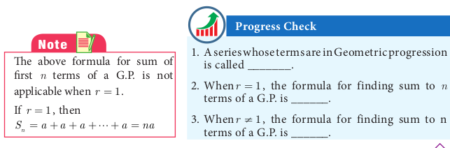

# Sum to n terms of a Geometric progression
A series whose terms are in Geometric progression is called Geometric series.

Let a, a r, a r^{2}, \ldots a r^{n-1}, \ldots be the Geometric Progression.

The sum of first n terms of the Geometric progression is


S_{n}=a+a r+a r^{2}+\cdots+a r^{n-2}+a r^{n-1}


The sum of first n terms of the Geometric progression is


\begin{aligned}
(2)-(1) \Rightarrow & r S_{n}-S_{n}=a r^{n}-a \\
& S_{n}(r-1)=a\left(r^{n}-1\right)
\end{aligned}


Thus, the sum to n terms is S_{n}=\frac{a\left(r^{n}-1\right)}{r-1}, r \neq 1.

## Sum to infinite terms of a G.P.

The sum of infinite terms of a G.P. is given by S_{\infty}=a+a r+a r^{2}+a r^{3}+\cdots=\frac{a}{1-r},-1<r<1

**Example 2.46** Find the sum of 8 terms of the G.P. 1,-3,9,-27 \ldots

*Solutions* Here, the first term a=1, common ratio r=\frac{-3}{1}=-3<1, Here, n=8.

Sum to n terms of a G.P. is S_{n}=\frac{a\left(r^{n}-1\right)}{r-1} if r \neq 1


\text { Hence, } \quad S_{8}=\frac{1\left((-3)^{8}-1\right)}{(-3)-1}=\frac{6561-1}{-4}=-1640


**Example 2.47** Find the first term of a G.P. in which S_{6}=4095 and r=4.

*Solution* Common ratio =4>1, Sum of first 6 terms S_{6}=4095


\begin{gathered}
\text { Hence, } \quad S_{6}=\frac{a\left(r^{n}-1\right)}{r-1}=4095 \\
\because \quad r=4, \frac{a\left(4^{6}-1\right)}{4-1}=4095 \Rightarrow a \times \frac{4095}{3}=4095
\end{gathered}



\text { First term } \quad a=3 \text {. }


**Example 2.48** How many terms of the series 1+4+16+\cdots make the sum 1365 ?

*Solution* Let n be the number of terms to be added to get the sum 1365


\begin{aligned}
& a=1, r=\frac{4}{1}=4>1 \\
& S_{n}=1365 \Rightarrow \frac{a\left(r^{n}-1\right)}{r-1}=1365 \\
& \frac{1\left(4^{n}-1\right)}{4-1}=1365 \text { so, }\left(4^{n}-1\right)=4095 \\
& 4^{n}=4096 \text { then } 4^{n}=4^{6} \\
& n=6
\end{aligned}


**Example 2.49** Find the sum 3+1+\frac{1}{3}+\ldots \infty

*Solution* Here a=3, \quad r=\frac{t_{2}}{t_{1}}=\frac{1}{3}

Sum of infinite terms S_{\infty}=\frac{a}{1-r}=\frac{3}{1-\frac{1}{3}}=\frac{9}{2}

1. Sum to infinite number of terms of a G.P. is
2. For what values of r, does the formula for infinite G.P. valid?

**Example 2.50** Find the rational form of the number 0.6666 \ldots

Solution We can express the number 0.6666 \ldots as follows


0.6666 \ldots=0.6+0.06+0.006+0.0006+\cdots


We now see that numbers 0.6,0.06,0.006 \ldots form a G.P. whose first term a=0.6 and common ratio r=\frac{0.06}{0.6}=0.1. Also -1<r=0.1<1

Using the infinite G.P. formula, we have


0.6666 \ldots=0.6+0.06+0.006+0.0006+\cdots=\frac{0.6}{1-0.1}=\frac{0.6}{0.9}=\frac{2}{3}


Thus the rational number equivalent of 0.6666 \ldots is \frac{2}{3}
1.  10^{\text {th }} Standard Mathematics

The sides of a given square is 10 \mathrm{~cm}. The mid points of its sides are joined to form a new square. Again, the mid points of the sides of this new square are joined to form another square. This process is continued indefinitely. Find the sum of the areas and the sum of the perimeters of the squares formed through this process.

**Example 2.51** Find the sum to n terms of the series 5+55+555+\cdots

*Solution* The series is neither Arithmetic nor Geometric series. So it can be split into two series and then find the sum.


\begin{aligned}
& 5+55+555+\cdots+n \text { terms }=5[1+11+111+\cdots+n \text { terms }] \\
& =\frac{5}{9}[9+99+999+\cdots+n \text { terms }] \\
& =\frac{5}{9}[(10-1)+(100-1)+(1000-1)+\cdots+n \text { terms }] \\
& =\frac{5}{9}[(10+100+1000+\cdots+n \text { terms })-n] \\
& =\frac{5}{9}\left[\frac{10\left(10^{n}-1\right)}{(10-1)}-n\right]=\frac{50\left(10^{n}-1\right)}{81}-\frac{5 n}{9}
\end{aligned}


**Example 2.52** Find the least positive integer n such that 1+6+6^{2}+\cdots+6^{n}>5000

*Solution* We have to find the least number of terms for which the sum must be greater than 5000 .

That is, to find the least value of n. such that S_{n}>5000


\text { We have, } \begin{aligned}
S_{n} & =\frac{a\left(r^{n}-1\right)}{r-1}=\frac{1\left(6^{n}-1\right)}{6-1}=\frac{6^{n}-1}{5} \\
S_{n} & >5000 \Rightarrow \frac{6^{n}-1}{5}>5000 \\
6^{n}-1 & >25000 \Rightarrow 6^{n}>25001 \\
\because \quad 6^{5} & =7776 \text { and } 6^{6}=46656
\end{aligned}


The least positive value of $n$ is 6 such that 1+6+6^{2}+\cdots+6^{n}>5000.

**Example 2.53** A person saved money every year, half as much as he could in the previous year. If he had totally saved ₹ 7875 in 6 years then how much did he save in the first year? Solution Total amount saved in 6 years is S_{6}=7875

Since he saved half as much money as every year he saved in the previous year,

We have r=\frac{1}{2}<1


\begin{aligned}
\frac{a\left(1-r^{n}\right)}{1-r} & =\frac{a\left(1-\left(\frac{1}{2}\right)^{6}\right)}{1-\frac{1}{2}}=7875 \\
\frac{a\left(1-\frac{1}{64}\right)}{\frac{1}{2}} & =7875 \Rightarrow a \times \frac{63}{32}=7875 \\
a & =\frac{7875 \times 32}{63} \\
a & =4000
\end{aligned}


The amount saved in the first year is ₹ 4000 .

**Exercise 2.8**

1. Find the sum of first $n$ terms of the G.P. (i) 5,-3, \frac{9}{5},-\frac{27}{25}, \ldots (ii) 256,64,16, \ldots
2. Find the sum of first six terms of the G.P. 5,15,45, \ldots
3. Find the first term of the G.P. whose common ratio 5 and whose sum to first 6 terms is 46872 .
4. Find the sum to infinity of (i) 9+3+1+\cdots \quad (ii) 21+14+\frac{28}{3}+\cdots
5. If the first term of an infinite G.P. is 8 and its sum to infinity is \frac{32}{3} then find the common ratio.
6. Find the sum to n terms of the series
(i) 0.4+0.44+0.444+\cdots to n terms
(ii) 3+33+333+\cdots to n terms
7. Find the sum of the Geometric series 3+6+12+\cdots+1536.
8. Kumar writes a letter to four of his friends. He asks each one of them to copy the letter and mail to four different persons with the instruction that they continue the process similarly. Assuming that the process is unaltered and it costs ₹2 to mail one letter, find the amount spent on postage when 8^{\text {th }} set of letters is mailed.
9. Find the rational form of the number 0 . \overline{123}.
10. If S_{n}=(x+y)+\left(x^{2}+x y+y^{2}\right)+\left(x^{3}+x^{2} y+x y^{2}+y^{3}\right)+\cdots n terms then prove that (x-y) S_{n}=\left[\frac{x^{2}\left(x^{n}-1\right)}{x-1}-\frac{y^{2}\left(y^{n}-1\right)}{y-1}\right]

