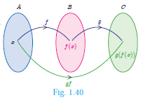
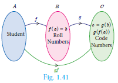
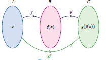
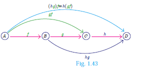

# Composition of Functions 

When a car driver depresses the accelerator pedal, it controls the flow of fuel which in turn influences the speed of the car. Likewise, the composition of two functions is a kind of 'chain reaction', where the functions act upon one after another (Fig.1.40).

We can explain this further with the concept that a function is a 'process'. If f and g are two functions then the composition g(f(x))(Fig.1.41) is formed in two steps.
 
 1. Feed an input ( say x ) to f;

 2. Feed the output f(x) to g to get g(f(x)) and call it g f(x).

 Illustration

Consider the set A of all students, who appeared in class X of Board Examination. Each student appearing in the Board Examination is assigned a roll number. In order to have confidentiality, the Board arranges to deface the roll number of each student and assigns a code number to each roll number.

 
 Let A be the set of all students appearing for the board exam. B \subseteq \mathbb{N} be the set all roll numbers and C \subseteq \mathbb{N} be the set of all code numbers (Fig.1.41). This gives rise to two functions f: A \rightarrow B and g: B \rightarrow C given by b=f(a) be the roll number assigned to student a, c=g(b) be the code number assigned to roll number b, where a \in A, b \in B and c \in C.

We can write c=g(b)=g(f(a)).

Thus, by the combination of these two functions, each student is eventually attached a code number. This idea leads to the following definition.

>Definition
> Let f: A -> B and g: B -> C be two functions (Fig.1.42). Then the composition of f and g denoted by g.f is defined as the function  g \circ f(x)=g(f(x)) forall x in A 

Example 1.19 Find f \circ g and g \circ f when f(x)=2 x+1 and g(x)=x^{2}-2
 
Fig. 1.42

> Note
> Generally, f \circ g \neq g \circ f for any two functions f and g. So, composition of functions is not commutative.

Example 1.20 Represent the function f(x)=\sqrt{2 x^{2}-5 x+3} as a composition of two functions.

Solution f_{2}(x)=2 x^{2}-5 x+3 and f_{1}(x)=\sqrt{x}

\begin{aligned}
f(x)=\sqrt{2 x^{2}-5 x+3} & =\sqrt{f_{2}(x)} \\
& =f_{1}\left[f_{2}(x)\right] \quad=f_{1} f_{2}(x)
\end{aligned}


Example 1.21 If f(x)=3 x-2, g(x)=2 x+k and if f \circ g=g \circ f, then find the value of k.

Solution f(x)=3 x-2, g(x)=2 x+k


f \circ g(x)=f(g(x))=f(2 x+k)=3(2 x+k)-2=6 x+3 k-2


f \circ g(x)=6 x+3 k-2.
g \circ f(x)=g(3 x-2)=2(3 x-2)+k
g \circ f(x)=6 x-4+k.

Given that  f \circ g=g \circ f


\begin{aligned}
\therefore 6 x+3 k-2 & =6 x-4+k \\
6 x-6 x+3 k-k & =-4+2 \Rightarrow k=-1
\end{aligned}

 

Example 1.22 Find k if f \circ f(k)=5 where f(k)=2 k-1

Solution  f \circ f(k)=f(f(k))


\begin{aligned}
& =2(2 k-1)-1=4 k-3 . \\
f \circ f(k) & =4 k-3
\end{aligned}


But, f \circ f(k)=5


\therefore 4 k-3=5 \Rightarrow k=2 \text {. }


## Composition of three functions

Let A, B, C, D be four sets and let f: A \rightarrow B, g: B \rightarrow C and h: C \rightarrow D be three functions (Fig.1.43). Using composite functions f \circ g and g \circ h, we get two new functions like (f \circ g) \circ h and f \circ(g \circ h)
 
We observed that the composition of functions is not commutative. The natural question is about the associativity of the operation.

> Note
>Composition of three functions is always associative. That is,  f \circ(g \circ h)=(f \circ g) \circ h

Example 1.23 If f(x)=2 x+3, g(x)=1-2 x and h(x)=3 x Prove that f \circ(g \circ h)=(f \circ g) \circ h

Solution f(x)=2 x+3, g(x)=1-2 x, h(x)=3 x


\text { Now, }(f \circ g)(x)=f(g(x))=f(1-2 x)=2(1-2 x)+3=5-4 x


Then, (f \circ g) \circ h(x)=(f \circ g)(h(x))=(f \circ g)(3 x)=5-4(3 x)=5-12 x


\begin{aligned}
(g \circ h)(x) & =g(h(x))=g(3 x)=1-2(3 x)=1-6 x \\
\Rightarrow f \circ(g \circ h)(x) & =f(1-6 x)=2(1-6 x)+3=5-12 x
\end{aligned}


From (1) and (2),we get (f \circ g) \circ h=f \circ(g \circ h)

Example 1.24 Find x if g f f(x)=f g g(x), given f(x)=3 x+1$ and $g(x)=x+3

Solution


\begin{aligned}
g f f(x) & =g[f\{f(x)\}](\text { This means " } g \text { of } f \text { of } f \text { of } x \text { ") } \\
& =g[f(3 x+1)]=g[3(3 x+1)+1]=g(9 x+4) \\
g(9 x+4) & =[(9 x+4)+3]=9 x+7 \\
f g g(x) & =f[g\{g(x)\}](\text { This means " } f \text { of } g \text { of } g \text { of } x \text { ") } \\
& =f[g(x+3)]=f[(x+3)+3]=f(x+6) \\
f(x+6) & =[3(x+6)+1]=3 x+19
\end{aligned}


These two quantities being equal, we get 9x+7=3 x+19. Solving this equation we obtain x=2. 

>Progress Check
>State your answer for the following questions by selecting the correct option.
>1. Composition of functions is commutative
(a) Always true
(b) Never true
(c) Sometimes true
>2. Composition of functions is associative
(a) Always true
(b) Never true
(c) Sometimes true 

 Activity 4

Given that h(x)=f \circ g(x) fill in the table for h(x)

| x | f(x) |
| :---: | :---: |
| 1 | 2 |
| 2 | 3 |
| 3 | 1 |
| 4 | 4 |

| x | g(x) |
| :---: | :---: |
| 1 | 2 |
| 2 | 4 |
| 3 | 3 |
| 4 | 1 |

| x | h(x) |
| :---: | :---: |
| 1 | 3 |
| 2 | - |
| 3 | - |
| 4 | - |

How to find h(1) ?

\begin{aligned}
h(x) & =f \circ g(x) \\
h(1) & =f \circ g(1) \\
& =f(2)=3 \\
\therefore h(1) & =3
\end{aligned}
 

