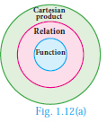
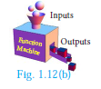
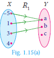

# Functions

Among several relations that exist between two non-empty sets, some special relations are important for further exploration. Such relations are called“Functions”. 

**Illustration 8**

A company has 5 employees in different categories. If we consider their salary distribution for a month as shown by arrow diagram in Fig.1.11, we see that there is only one salary associated for every employee of the company.

Here are various real life situations illustrating some special relations:

* Consider the set A of all of your classmates; corresponding to each student, there is only one age.
* You go to a shop to buy a book. If you take out a book, there is only one price corresponding to it; it does not have two prices corresponding to it. (of course, many books may have the same price).
* You are aware of Boyle’s law. Corresponding to a given value of pressure P, there is only one value of volume V.
* In Economics, the quantity demanded can be expressed as Q = 360−4P , where P is the price of the commodity. We see that for each value of P, there is only one value of Q. Thus the quantity demanded Q depend on the price P of the commodity.

We often come across certain relations, in which, for each element of a set A, there is only one corresponding element of a set B. Such relations are called functions. We usually use the symbol f to denote a functional relation.       

> Definition
> A relation f between two non-empty sets X and Y is called a
function from X to Y if, for each x ∈  X there exists only one y ∈ Y
such that (x,y) ∈  f
That is, f ={(x,y)| for all x ∈  X, y ∈ Y }.

A function f from X to Y is written as f : X -> Y . 

 
Comparing the definitions of relation and function, we see that
every function is a relation. Thus, functions are subsets of relations
and relations are subsets of cartesian product. (Fig.1.12(a))

A function f can be thought as a mechanism (or device) (Fig.1.12(b)), which gives a unique output f(x) to every input x.

> Definition
>A function is also called as a mapping or transformation.

> Note
> If f : X ->Y is a function then 
> * The set X is called the domain of the function f and the set Y is called its co-domain.
> * If f (a) = b, then b is called ‘image’ of a under f and a is called a ‘pre-image’ of b.  
>* The set of all images of the elements of X under f is called the ‘range’ of f.
> * f : X ®Y is a function only if
(i) every element in the domain of f has an image.
(ii) the image is unique.
>* If A and B are finite sets such that n(A) = p , n(B) = q then the total number of functions that exist from A to B is q^p.
> * In this chapter we always consider f to be a real valued function.

 Illustration 9 - Testing for functions

Representation by Arrow diagram 

Functions play very important role in the understanding of higher ideas in mathematics. They are basic tools to convert from one form to another form. In this sense, functions are widely applied in Engineering Sciences.

> Note
> The range of a function is a subset of its co-domain.

**Example 1.6** Let X = {1,2, 3, 4} and Y = {2, 4,6, 8,10} and R = {(1,2),(2,4),(3,6),(4,8)}.
Show that R is a function and find its domain, co-domain and range?

Solution: Pictorial representation of R is given in Fig.1.14. From the diagram, we see that for each x ∈ X , there exists only one y ∈ Y . Thus all elements in X have only one image in Y. Therefore R is a function. Domain X = {1,2,3,4}; Co-domain Y = {2,4,6,8,10}; Range of f = {2,4,6,8}.

**Example 1.7**  A relation f :X →Y is defined by f (x) =x2 −2 where, X = {−2,−1, 0, 3} and Y = R.
(i) List the elements of f (ii) Is f a function?
Solution f (x) = x^2 – 2 where X = {−2,−1, 0, 3}
(i) f (-2) = (−2)2 – 2 = 2 ; f (-1) = (−1)2 – 2 = −1
f (0) = (0)2 – 2 = −2 ; f (3) =(3)^2 – 2 =7
∴ f = {(−2,2),(−1,−1),(0,−2),(3,7)}
(ii) We note that each element in the domain of f has a unique image.
Therefore, f is a function.

> Thinking Corner
> Is the relation representing the association between planets and their respective moons
a function?

Example 1.8 If X = {–5,1,3,4} and Y = {a,b,c}, then which of the following relations are
functions from X to Y ?

(i) R_{1}={(-5, a),(1, a),(3, b)}  (ii) R_{2}={(-5, b),(1, b),(3, a),(4, c)}

(iii) R_{3}={(-5, a),(1, a),(3, b),(4, c),(1, b)}

 Solution : 

(i) quad R_{1}={(-5, a),(1, a),(3, b)}

We may represent the relation R_{1} in an arrow diagram (Fig.1.15(a)).

R_{1} is not a function as 4 in X does not have an image in Y.

(ii) R_{2}={(-5, b),(1, b),(3, a),(4, c)}

Arrow diagram of R_{2} is shown in Fig.1.15(b).

R_{2} is a function as each element of X has an unique image in Y.

(iii) R_{3}={(-5, a),(1, a),(3, b),(4, c),(1, b)}

Representing R_{3} in an arrow diagram (Fig.1.15(c)).

R_{3} is not a function as 1 in X has two images a in Y and b in Y.

Note that the image of an element should always be unique.

Example 1.9 Given f(x)=2 x-x^{2},


\text { find (i) } f(1) \text { (ii) } f(x+1) \text { (iii) } f(x)+f(1)


Solution (i) x=1, we get


f(1)=2(1)-(1)^{2}=2-1=1


(ii) x=x+1, we get


f(x+1)=2(x+1)-(x+1)^{2}=2 x+2-\left(x^{2}+2 x+1\right)=-x^{2}+1


(iii) f(x)+f(1)=\left(2 x-x^{2}\right)+1=-x^{2}+2 x+1

[Note that f(x)+f(1) \neq f(x+1). In general f(a+b) is not equal to f(a)+f(b) ]

Exercise 1.3

1. Let f={(x, y)  x, y  N and y=2 x} be a relation on N. Find the domain, co-domain and range. Is this relation a function?
2. Let X={3,4,6,8}. Determine whether the relation R=\left\{(x, f(x)) \mid x \in X, f(x)=x^{2}+1\right\} is a function from X to N ?
3. Given the functionf: x \rightarrow x^{2}-5 x+6, evaluate
(i) f(-1)
(ii) f(2 a)
(iii) f(2)
(iv) f(x-1)
4. A graph representing the function f(x) is given in Fig.1.16 it is clear that f(9)=2.

(i) Find the following values of the function
(a) f(0)
(b) f(7)
(c) f(2)
(d) f(10)

(ii) For what value of x  is f(x)=1 ?

(iii) Describe the following (i) Domain (ii) Range.

7. An open box is to be made from a square piece of material,  24 \mathrm{~cm} on a side, by cutting equal squares from the corners and turning up the sides as shown (Fig.1.17). Express the volume V of the box as a function of x.
8. A function f is defined by f(x)=3-2 x. Find x such that f\left(x^{2}\right)=(f(x))^{2}
9. A plane is flying at a speed of 500 \mathrm{~km} per hour. Express the distance ' d ' travelled by the plane as function of time t in hours.
10. The data in the adjacent table depicts the length of a person forehand and their corresponding height. Based on this data, a student finds a

| Length ‘x’ of forehand (in cm) | Height ‘y’ (in inches) |
|----------|----------|
| 35| 56 |
|45 | 65 |
| 50 | 69.5 | 
|55 | 74 |

(i) Check if this relation is a function.

(ii) Find a and b.
14) 10^{\text {th }} Standard Mathematics
(iii) Find the height of a person whose forehand length is 40 \mathrm{~cm}.
(iv) Find the length of forehand of a person if the height is 53.3 inches.

