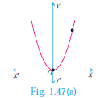
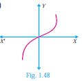
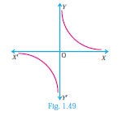
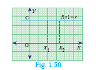

# Identifying the Graphs of Linear, Quadratic, Cubic and Reciprocal Functions 

Graphs provide visualization of curves and functions. Hence, graphs help a lot in understanding the concepts in a much efficient way.

In this section, we will be discussing about the identification of some of the functions through their graphs. In particular, we discuss graphs of Linear, Quadratic, Cubic and Reciprocal functions.

## Linear Function

A function f: \mathbb{R} \rightarrow \mathbb{R} defined by f(x)=m x+c, m \neq 0 is called a linear function. Geometrically this represents a straight line in the graph.

Some Specific Linear Functions and their graphs are given below.

| No. | Function | Domain and Definition | Graph |
| :---: | :---: | :---: | :---: |
| 1 | The identity   function | f: \mathbb{R} \rightarrow \mathbb{R} defined by   f(x)=x |  |
| 2 | Additive inverse   function | $: \mathbb{R} \rightarrow \mathbb{R} defined by   f(x)=-x | |

## Modulus or Absolute valued Function


\begin{aligned}
f: \mathbb{R} \rightarrow[0, \infty) \text { defined by } f(x) & =|x| \\
& = \begin{cases}x ; & x \geq 0 \\
-x ; & x<0\end{cases}
\end{aligned}


 

>Note
>* Modulus function is not a linear function but it is composed of two linear functions x and -x.
> * Linear functions are always one-one functions and has applications in Cryptography as well as in several branches of Science and Technology.

##  Quadratic Function

A function f: \mathbb{R} \rightarrow \mathbb{R} defined by f(x)=a x^{2}+b x+c,(a \neq 0) is called a quadratic function.

Some specific quadratic functions and their graphs

| Function, Domain, Range and Definition | Graph |
| :--- | :--- |
| f: \mathbb{R} \rightarrow \mathbb{R} defined by f(x)=x^{2}, x \in \mathbb{R} . f(x) \in[0, \infty) |  |
| f: \mathbb{R} \rightarrow \mathbb{R} defined by f(x)=-x^{2}, x \in \mathbb{R} |  |
| f(x) \in(-\infty, 0] |  |

The equations of motion of a particle travelling under the influence of gravity is a quadratic function of time. These functions are not one - one. (Why?) 

## Cubic Function

A function f: \mathbb{R} \rightarrow \mathbb{R} defined by

f(x)=a x^{3}+b x^{2}+c x+d,(a \neq 0) is called a cubic function.

The graph of f(x)=x^{3} is shown in Fig.1.48. 
 

## Reciprocal Function

A function f: \mathbb{R}-\{0\} \rightarrow \mathbb{R} defined by f(x)=\frac{1}{x} is called a reciprocal function (Fig.1.49).
 

## Constant Function

A function f: \mathbb{R} \rightarrow \mathbb{R} defined by f(x)=c, \forall x \in \mathbb{R} is called a constant function (Fig.1.50).
 

>Progress Check
>1. Is a constant function a linear function?
>2. Is quadratic function a one - one function?
>3. Is cubic function a one - one function?
>4. Is the reciprocal function a bijection?
>5. If f: A \rightarrow B is a constant function, then the range of f will have elements.

Exercise 1.5

1. Using the functions f and g given below, find f \circ g and g \circ f. Check whether f \circ g=g \circ f.

(i) f(x)=x-6, g(x)=x^{2}
(ii) f(x)=\frac{2}{x}, g(x)=2 x^{2}-1
(iii) f(x)=\frac{x+6}{3}, g(x)=3-x
(iv) f(x)=3+x, g(x)=x-4
(v) f(x)=4 x^{2}-1, g(x)=1+x
2. Find the value of k, such that f \circ g=g \circ f
(i) f(x)=3 x+2, g(x)=6 x-k
(ii) f(x)=2 x-k, g(x)=4 x+5
3. If f(x)=2 x-1, g(x)=\frac{x+1}{2}, show that f \circ g=g \circ f=x
4. If f(x)=x^{2}-1, g(x)=x-2 find a, if g \circ f(a)=1.
5. Let A, B, C \subseteq \mathbb{N} and a function f: A \rightarrow B be defined by f(x)=2 x+1 and g: B \rightarrow C be defined by g(x)=x^{2}. Find the range of f \circ g and g \circ f.
6. Let f(x)=x^{2}-1. Find (i) f \circ f (ii) f \circ f \circ f
7. If f: \mathbb{R} \rightarrow \mathbb{R} and g: \mathbb{R} \rightarrow \mathbb{R} are defined by f(x)=x^{5} and g(x)=x^{4} then check if f, g are one-one and f \circ g is one-one?
8. Consider the functions f(x), g(x), h(x) as given below. Show that (f \circ g) \circ h=f \circ(g \circ h) in each case.

(i) \quad f(x)=x-1, g(x)=3 x+1 and h(x)=x^{2}

(ii) f(x)=x^{2}, g(x)=2 x and h(x)=x+4

(iii) f(x)=x-4, g(x)=x^{2} and h(x)=3 x-5

9. Let f=\{(-1,3),(0,-1),(2,-9)\} be a linear function from \mathbb{Z} into \mathbb{Z} Find f(x)
10. In electrical circuit theory, a circuit C(t) is called a linear circuit if it satisfies the superposition principle given by C\left(a t_{1}+b t_{2}\right)=a C\left(t_{1}\right)+b C\left(t_{2}\right), where a, b are constants. Show that the circuit C(t)=3 t is linear. 

 **Exercise 1.6**

 Multiple choice questions

1. If n(A \times B)=6 and A=\{1,3\} then n(B) is
(A) 1
(B) 2
(C) 3
(D) 6

2. A=\{a, b, p\}, B=\{2,3\}, C=\{p, q, r, s\} then n[(A \cup C) \times B] is
(A) 8
(B) 20
(C) 12
(D) 16

3. If A=\{1,2\}, B=\{1,2,3,4\}, C=\{5,6\} and D=\{5,6,7,8\} then state which of the following statement is true.
(A) (A \times C) \subset(B \times D)
(B) (B \times D) \subset(A \times C)
(C) (A \times B) \subset(A \times D)
(D) (D \times A) \subset(B \times A)
4. If there are 1024 relations from a set A=\{1,2,3,4,5\} to a set B, then the number of elements in B is
(A) 3
(B) 2
(C) 4
(D) 8
5. The range of the relation R=\left\{\left(x, x^{2}\right) \mid x\right. is a prime number less than 13} is
(A) \{2,3,5,7\}
(B) \{2,3,5,7,11\}
(C) \{4,9,25,49,121\}
(D) \{1,4,9,25,49,121\}
6. If the ordered pairs (a+2,4) and (5,2 a+b) are equal then (a, b) is
(A) (2,-2)
(B) (5,1)
(C) (2,3)
(D) (3,-2)
7. Let n(A)=m and n(B)=n then the total number of non-empty relations that can be defined from A to B is
(A) m^{n}
(B) n^{m}
(C) 2^{m n}-1
(D) 2^{m n}
8. If \{(a, 8),(6, b)\} represents an identity function, then the value of a and b are respectively
(A) (8,6)
(B) (8,8)
(C) (6,8)
(D) (6,6)

