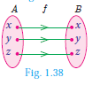
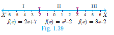

# Special Cases of Functions

There are some special cases of a function which will be very useful. We discuss some of them below

(i) Constant function
(ii) Identity function
(iii) Real - valued function

(i) Constant function
A function f: A \rightarrow B is called a constant function if the range of f contains only one element. That is, f(x)=c, for all x \in A and for some fixed c \in B.

**Illustration 16**

From Fig.1.37, A=\{a, b, c, d\}, B=\{1,2,3\} and f=\{(a, 3),(b, 3),(c, 3),(d, 3)\} . \because f(x)=3 \forall x \in ARange of f=\{3\} f is a constant function.

(ii) Identity function

Let A be a non-empty set. Then the function f: A -> A defined by f(x)=x for all  x \in A is called an identity function on A and is denoted by  I_{\mathrm{A}}
 

**Illustration 17**

If   A=\{a, b, c\} then  f=I_{A}=\{(a, a),(b, b),(c, c)\} is an identity function on A.

(iii) Real valued function

> **Thinking Corner**
>Is an identity function one to one function?
>A function  f: A \rightarrow B is called a real valued function if the range of f is a subset of the set of all real numbers  \mathbb{R}. That is,  f(a) \subseteq \mathbb{R}, \forall a \in A.

>Progress Check
>State True or False.
>1. All one - one functions are onto functions.
>2. There will be no one - one function from A to B when n(A)=4, n(B)=3.
>3. All onto functions are one - one functions.
>4. There will be no onto function from A to B when n(A)=4, n(B)=5.
>5. If f is a bijection from A to B, then n(A)=n(B).
>6. If n(A)=n(B), then f is a bijection from A to B.
>7. All constant functions are bijections.

**Example 1.17** Let f be a function from R to R defined by f(x)=3 x-5. Find the values of a and b given that (a, 4) and (1, b) belong to f.

Solution f(x)=3 x-5 can be written as f=\{(x, 3 x-5) \mid x \in R\}

(a, 4) means the image of a is 4 . i.e., f(a)=4


3 \mathrm{a}-5=4 \Rightarrow a=3


(1, b) means the image of 1 is b. i.e., f(1)=b


3(1)-5=b \Rightarrow b=-2


**Example 1.18**
 If the function f: \mathbb{R} \rightarrow \mathbb{R} is defined by f(x)=\left\{\begin{array}{cc}2 x+7 ; & x<-2 \\ x^{2}-2 ; & -2 \leq x<3 \\ 3 x-2 ; & x \geq 3\end{array}\right.
(i) f(4)
(ii) f(-2)
(iii) f(4)+2 f(1)
(iv) \frac{f(1)-3 f(4)}{f(-3)}

**Solution**

The function f is defined by three values in intervals I, II, III as shown by the side
 
For a given value of x=a, find out the interval at which the point a is located, there after find f(a) using the particular value defined in that interval.

(i) First, we see that, x=4 lie in the third interval.

\therefore f(x)=3 x-2 ; f(4)=3(4)-2=10

(ii) x=-2 lies in the second interval.

 \therefore f(x)=x^{2}-2 ; f(-2)=(-2)^{2}-2=2

(iii) From (i), f(4)=10.

To find f(1), first we see that x=1 lies in the second interval.


\begin{aligned}
\therefore f(x)=x^{2}-2 & \Rightarrow f(1)=1^{2}-2=-1 \\
f(4)+2 f(1) & =10+2(-1)=8
\end{aligned}


(iv) We know thatf(1)=-1 and f(4)=10.

For finding f(-3), we see that x=-3, lies in the first interval.

therefore f(x)=2 x+7; thus, f(-3)=2(-3)+7=1

Hence,  \quad \frac{f(1)-3 f(4)}{f(-3)}=\frac{-1-3(10)}{1}=-31

**Exercise 1.4**

1. Determine whether the graph given below represent functions. Give reason for your answers concerning each graph.

 
2. Let f: A -> B be a function defined by f(x)=\frac{x}{2}-1, where A={2,4,6,10,12}, B={0,1,2,4,5,9}. Represent f by
(i) set of ordered pairs
(ii) a table
(iii) an arrow diagram
(iv) a graph
3. Represent the function f={(1,2),(2,2),(3,2),(4,3),(5,4)} through
(i) an arrow diagram
(ii) a table form
(iii) a graph
4. Show that the function f: \mathbb{N} \rightarrow \mathbb{N} defined by f(x)=2x-1 is one-one but not onto.
5. Show that the function f: \mathbb{N} \rightarrow \mathbb{N} defined by f(m)=m^{2}+m+3 is one-one function.
6. Let A=\{1,2,3,4\} and B=\mathbb{N}. Let f: A \rightarrow B be defined by f(x)=x^{3} then,
(i) find the range of f
(ii) identify the type of function
7. In each of the following cases state whether the function is bijective or not. Justify your answer.
(i) f: \mathbb{R} \rightarrow \mathbb{R} defined by f(x)=2 x+1
(ii) f: \mathbb{R} \rightarrow \mathbb{R} defined by f(x)=3-4 x^{2}
8. Let A={-1,1} and B={0,2}. If the function f: A \rightarrow B defined by f(x)=a x+b is an onto function? Find a and b.
9. If the function f is defined by  f(x)=\left\{\begin{array}{ll}x+2 ; & x>1 \\ 2 ; & -1 \leq x \leq 1 \\ x-1 ; & -3<x<-1\end{array}\right. find the values of
(i) f(3)
(ii) f(0)
(iii) f(-1 \cdot 5)
(iv) f(2)+f(-2)
10. A function f:[-5,9] \rightarrow \mathbb{R} is defined as follows:

f(x)=\left\{\begin{array}{lr}6 x+1 ; & -5 \leq x<2 \\ 5 x^{2}-1 ; & 2 \leq x<6 \\ 3 x-4 ; & 6 \leq x \leq 9\end{array}\right.

Find
(i) f(-3)+f(2)
(ii) f(7)-f(1)
(iii) 2 f(4)+f(8)
(iv) \frac{2 f(-2)-f(6)}{f(4)+f(-2)}

11. The distance S an object travels under the influence of gravity in time t seconds is given by S(t)=\frac{1}{2} g t^{2}+a t+b where, ( g is the acceleration due to gravity), a, b are constants. Verify wheather the function S(t) is one-one or not.
12. The function ' t ' which maps temperature in Celsius (C) into temperature in Fahrenheit (F) is defined by t(C)=F where F=\frac{9}{5} C+32. Find,
(i) t(0)
(ii) t(28)
(iii) t(-10)

(iv) the value of C when t(C)=212

(v) the temperature when the Celsius value is equal to the Farenheit value. 

