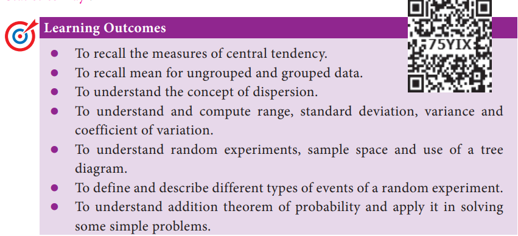
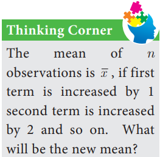
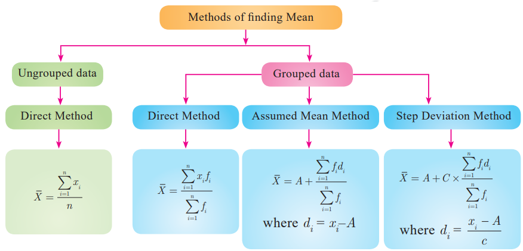

# Introduction
‘STATISTICS’ is derived from the Latin word ‘status’ which means a political state. 
Today, statistics has become an integral part of everyone’s life, unavoidable whether making a plan for our future, doing a business, a marketing research or preparing economic 
reports. It is also extensively used in opinion polls, doing advanced research. The study of statistics is concerned with scientific methods for collecting, organising, summarising, 
presenting, analysing data and making meaningful decisions. In earlier classes we have studied about collection of data, presenting the data in tabular form, graphical form and calculating the Measures of Central Tendency. Now, in this class, let us study about the Measures of Dispersion.

#### Recall
#### Measures of Central Tendency

It is often convenient to have one number that represent the whole data. Such a number is called a **Measures of Central Tendency.**

The Measures of Central Tendency usually will be 
near to the middle value of the data. For a given data there 
exist several types of measures of central tendencies.

The most common among them are
• Arithmetic Mean • Median • Mode

In this class we have to recall the Arithmetic Mean.

**Arithmetic Mean**
The Arithmetic Mean or Mean of the given values is "/> sum of all the observations divided by the total number of observations. It is denoted by $x$ (pronounced as $x$ bar)
$x$ = $\displaystyle \frac{Sum of all the observations}{Number of observations}$

We apply the respective formulae depending upon the information provided in the problem.
 

