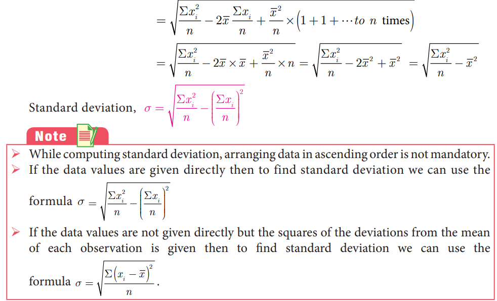
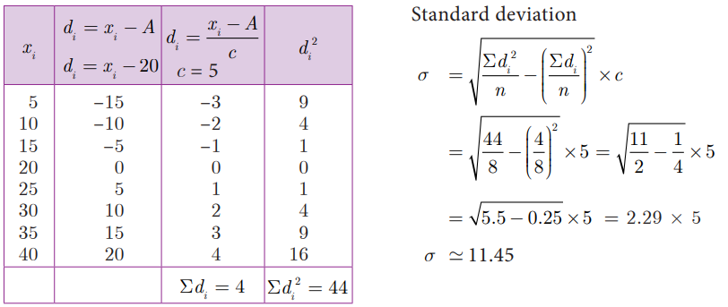

# Measures of Dispersion
The following data provide the runs scored by two batsmen in the last 10 matches.
Batsman A: 25, 20, 45, 93, 8, 14, 32, 87, 72, 4
Batsman B: 33, 50, 47, 38, 45, 40, 36, 48, 37, 26

Mean of Batsman $\mathrm{A}=\frac{25+20+45+93+8+14+32+87+72+4}{10}=40$

Mean of Batsman B $=\frac{33+50+47+38+45+40+36+48+37+26}{10}=40$

The mean of both datas are same (40), but they differ significantly.

From the above diagrams, we see that runs of batsman B are grouped around the mean. But the runs of batsman A are scattered from 0 to 100, though they both have same mean.

Thus, some additional statistical information may be required to determine how the values are spread in data. For this, we shall discuss **Measures of Dispersion.**

Dispersion is a measure which gives an idea about the scatteredness of the values.

**Measures of Variation** (or) Dispersion of a data provide an idea of how observations spread out (or) scattered throughout the data.

#### Different Measures of Dispersion are
1. Range 
2. Mean deviation 
3. Quartile deviation
4. Standard deviation 
5. Variance 
6. Coefficient of Variation

## Range

The difference between the largest value and the smallest value is called Range.
**Range R = L– S**

$$\begin{aligned}
\text { Coefficient of range } & =\frac{L-S}{L+S}
\end{aligned}
$$

where $L$ - Largest value; $S$ - Smallest value
**Example 8.1** Find the range and coefficient of range of
the following data: 25, 67, 48, 53, 18, 39, 44.
**Solution** Largest value L = 67; Smallest value S =18
$$
\begin{aligned}
\text { Range R }=L-S & =67-18=49 \\
\text { Coefficient of range } & =\frac{L-S}{L+S} \\
\text { Coefficient of range } & =\frac{67-18}{67+18}=\frac{49}{85}=0.576
\end{aligned}
$$ 

**Example 8.2** Find the range of the following distribution.

<!--  -->
| Age (in years) | $16-18$ | $18-20$ | $20-22$ | $22-24$ | $24-26$ | $26-28$ |
| :--- | :---: | :---: | :---: | :---: | :---: | :---: |
| Number of students | 0 | 4 | 6 | 8 | 2 | 2 |

**Solution** Here Largest value $L = 28$
             Smallest value $S=18$

Range $R \quad=L-S$

$R \quad=28-18=10$ Years
**Example 8.3** The range of a set of data is 13.67 and the largest value is 70.08. Find the smallest value.
**Solution** Range $R$ = 13.67
 Largest value $L$ = 70.08
         Range $R = L - S$
           13.67 = − 70.08 - $S$
               $S$ = 70.08 - 13.67 = 56.41
Therefore, the smallest value is 56.41.

## Deviations from the mean
For a given data with $n$ observations $x_{1}, x_{2}, \ldots x_{n}$, the deviations from the mean $\bar{x}$ are $x_{1}-\bar{x}, x_{2}-\bar{x}, \ldots, x_{n}-\bar{x}$.

## Squares of deviations from the mean
The squares of deviations from the mean $\bar{x}$ of the observations $x_{1}, x_{2}, \ldots, x_{n}$ are $\left(x_{1}-\bar{x}\right)^{2},\left(x_{2}-\bar{x}\right)^{2}, \ldots,\left(x_{n}-\bar{x}\right)^{2}$ or $\sum_{i=1}^{n}\left(x_{i}-\bar{x}\right)^{2}$

## Variance
The mean of the squares of the deviations from the mean is called **Variance**. It is denoted by $\sigma^{2}$ (read as sigma square).
Variance $=$ Mean of squares of deviations

$$
=\frac{\left(x_{1}-\bar{x}\right)^{2}+\left(x_{2}-\bar{x}\right)^{2}+\ldots+\left(x_{n}-\bar{x}\right)^{2}}{n}
$$

Variance $\sigma^{2}=\frac{\sum_{i=1}^{n}\left(x_{i}-\bar{x}\right)^{2}}{n}$

$$
\begin{gathered}
\text { Thinking Corner } \\
\text { Can variance be } \\
\text { negative? }
\end{gathered}
$$

## Standard Deviation
The positive square root of Variance is called **Standard deviation**. That is, standard deviation is the positive square root of the mean of the squares of deviations of the given values from their mean. It is denoted by $\sigma$.

**Calculation of Standard Deviation for ungrouped data**

#### 1. Direct Method
#### Note
The standard deviation and mean have same units in which the data are given.

Standard deviation, 
$$
\begin{aligned}
\sigma & =\sqrt{\frac{\sum\left(x_{i}-\bar{x}\right)^{2}}{n}} \\
& =\sqrt{\frac{\sum\left(x_{i}^{2}-2 x_{i} \bar{x}+\bar{x}^{2}\right)}{n}}\\
& =\sqrt{\frac{\sum x_{i}^{2}}{n}-2 \bar{x} \frac{\sum x_{i}}{n}+\frac{\bar{x}^{2}}{n} \times(1+1+\cdots \text { to } n \text { times })} \\
& =\sqrt{\frac{\Sigma x_{i}^{2}}{n}-2 \bar{x} \times \bar{x}+\frac{\bar{x}^{2}}{n} \times n}=\sqrt{\frac{\sum x_{i}^{2}}{n}-2 \bar{x}^{2}+\bar{x}^{2}}=\sqrt{\frac{\sum x_{i}^{2}}{n}-\bar{x}^{2}}
\end{aligned}
$$
Standard deviation, $\sigma=\sqrt{\frac{\Sigma x_{i}^{2}}{n}-\left(\frac{\Sigma x_{i}}{n}\right)^{2}}$

<!--  -->

#### Note

$>$ While computing standard deviation, arranging data in ascending order is not mandatory. If the data values are given directly then to find standard deviation we can use the formula $\sigma=\sqrt{\frac{\Sigma x_{i}^{2}}{n}-\left(\frac{\Sigma x_{i}}{n}\right)^{2}}$

If the data values are not given directly but the squares of the deviations from the mean of each observation is given then to find standard deviation we can use the formula $\sigma=\sqrt{\frac{\Sigma\left(x_{i}-\bar{x}\right)^{2}}{n}}$.

**Example 8.4** The number of televisions sold in each day of a week are 13, 8, 4, 9, 7, 12, 10. Find its standard deviation.

| $x_{i}$ | $x_{i}^{2}$ |
| :---: | :---: |
| 13 | 169 |
| 8 | 64 |
| 4 | 16 |
| 9 | 81 |
| 7 | 49 |
| 12 | 144 |
| 10 | 100 |
| $\Sigma x_{i}=63$ | $\Sigma x_{i}^{2}=623$ |

Standard deviation $\sigma=\sqrt{\frac{\Sigma x_{i}^{2}}{n}-\left(\frac{\Sigma x_{i}}{n}\right)^{2}}$

$=\sqrt{\frac{623}{7}-\left(\frac{63}{7}\right)^{2}}$

$=\sqrt{89-81}=\sqrt{8}$

Hence, $\sigma \simeq 2.83$

#### Thinking Corner
Can the standard deviation be more than the variance?

#### Progress Check
If the variance is 0.49 then the standard deviation is __________.

##### 2. Mean method
Another convenient way of finding standard deviation is to use the following formula.
Standard deviation (by mean method) $\sigma=\sqrt{\frac{\sum\left(x_{i}-\bar{x}\right)^{2}}{n}}$

If $d_{i}=x_{i}-\bar{x}$ are the deviations, then $\sigma=\sqrt{\frac{\sum d_{i}^{2}}{n}}$

**Example 8.5** The amount of rainfall in a particular season for 6 days are given as 17.8 cm, 19.2 cm, 16.3 cm, 12.5 cm, 12.8 cm and 11.4 cm. Find its standard deviation.
**Solution**  Arranging the numbers in ascending order we get, 11.4, 12.5, 12.8, 16.3, 17.8, 19.2. Number of observations n = 6

Mean $=\frac{11.4+12.5+12.8+16.3+17.8+19.2}{6}=\frac{90}{6}=15$

| $x_{i}$ | $d_{i}=x_{i}-\bar{x}$   $=x-15$ | $d_{i}^{2}$ |
| :---: | :---: | :---: |
| 11.4 | -3.6 | 12.96 |
| 12.5 | -2.5 | 6.25 |
| 12.8 | -2.2 | 4.84 |
| 16.3 | 1.3 | 1.69 |
| 17.8 | 2.8 | 7.84 |
| 19.2 | 4.2 | 17.64 |
|  |  | $\Sigma d_{i}^{2}=51.22$ |

Standard deviation $\sigma=\sqrt{\frac{\sum d_{i}^{2}}{n}}$

$=\sqrt{\frac{51.22}{6}}=\sqrt{8.53}$

Hence, $\quad \sigma \simeq 2.9$

##### 3. Assumed Mean method  
When the mean value is not an integer (since calculations are very tedious in decimal form) then it is better to use the assumed mean method to find the standard deviation.

Let $x_{1}, x_{2}, x_{3}, \ldots, x_{n}$ be the given data values and let $\bar{x}$ be their mean.

Let $d_{i}$ be the deviation of $x_{i}$ from the assumed mean $A$, which is usually the middle value or near the middle value of the given data.

$$
\begin{aligned}
d_{i} & =x_{i}-A \text { gives, } x_{i}=d_{i}+A \\
\Sigma d_{i} & =\Sigma\left(x_{i}-A\right) \\
& =\Sigma x_{i}-(A+A+A+\cdots \text { to } n \text { times }) \\
\Sigma d_{i} & =\Sigma x_{i}-A \times n \\
\frac{\Sigma d_{i}}{n_{\bar{d}}} & =\frac{\Sigma x_{i}}{n}-A \\
\bar{d} & =\bar{x}-A \text { (or) } \bar{x}=\bar{d}+A
\end{aligned}
$$

Standard deviation $\sigma=\sqrt{\frac{\sum\left(x_{i}-\bar{x}\right)^{2}}{n}}=\sqrt{\frac{\sum\left(d_{i}+A-\bar{d}-A\right)^{2}}{n}} \quad$ (using (1) and (2))

$$
\begin{aligned}
& =\sqrt{\frac{\sum\left(d_{i}-\bar{d}\right)^{2}}{n}}=\sqrt{\frac{\sum\left(d_{i}^{2}-2 d_{i} \times \bar{d}+\bar{d}^{2}\right)}{n}} \\
& =\sqrt{\frac{\sum d_{i}^{2}}{n}-2 \bar{d} \frac{\sum d_{i}}{n}+\frac{\bar{d}^{2}}{n}(1+1+1+\cdots \text { to } n \text { times) }} \\
& =\sqrt{\frac{\sum d_{i}^{2}}{n}-2 \bar{d} \times \bar{d}+\frac{\bar{d}^{2}}{n} \times n} \quad \text { (since } \bar{d} \text { is a constant) } \\
& =\sqrt{\frac{\sum d_{i}^{2}}{n}-\bar{d}^{2}}
\end{aligned}
$$

Standard deviation $\sigma=\sqrt{\frac{\sum d_{i}^{2}}{n}-\left(\frac{\sum d_{i}}{n}\right)^{2}}$

#### Thinking Corner
For any collection of $n$ values, can you find the value of
(i) $\Sigma\left(x_{i}-\bar{x}\right)$
(ii) $\left(\Sigma x_{i}\right)-\bar{x}$

**Example 8.6**  The marks scored by 10 students in a class test are 25, 29, 30, 33, 35, 37, 38, 40, 44, 48. Find the standard deviation.
**Solution** The mean of marks is 35.9 which is not an integer Hence we take assumed mean, $A$ = 35, $n$ = 10.

| $x_{i}$ | $d_{i}=x_{i}-A$   $d_{i}=x_{i}-35$ | $d_{i}^{2}$ |
| :---: | :---: | :---: |
| 25 | -10 | 100 |
| 29 | -6 | 36 |
| 30 | -5 | 25 |
| 33 | -2 | 4 |
| 35 | 0 | 0 |
| 37 | 2 | 4 |
| 38 | 3 | 9 |
| 40 | 5 | 25 |
| 44 | 9 | 81 |
| 48 | 13 | 169 |
|  | $\Sigma d_{i}=9$ | $\Sigma d_{i}^{2}=453$ |

Standard deviation

$$
\begin{aligned}
\sigma & =\sqrt{\frac{\Sigma d_{i}^{2}}{n}-\left(\frac{\Sigma d_{i}}{n}\right)^{2}} \\
& =\sqrt{\frac{453}{10}-\left(\frac{9}{10}\right)^{2}} \\
& =\sqrt{45.3-0.81} \\
& =\sqrt{44.49} \\
\sigma & \simeq 6.67
\end{aligned}
$$

##### 2. Step deviation method
Let $x_{1}, x_{2}, x_{3}, \ldots x_{n}$ be the given data. Let $\mathrm{A}$ be the assumed mean.

Let $c$ be the common divisor of $x_{i}-A$.

##### Note

$$
\begin{aligned}
& \text { Let } \quad d_{i}=\frac{x_{i}-A}{c} \\
& \text { Then } \quad x_{i}=d_{i} c+A \\
& \Sigma x_{i}=\Sigma\left(d_{i} c+A\right)=c \Sigma d_{i}+A \times n \\
& \frac{\Sigma x_{i}}{n}=c \frac{\Sigma d_{i}}{n}+A \\
& \bar{x}=c \bar{d}+A \\
& x_{i}-\bar{x}=c d_{i}+A-c \bar{d}-A=c\left(d_{i}-\bar{d}\right) \quad(\text { using (1) and (2)) } \\
& \sigma=\sqrt{\frac{\sum\left(x_{i}-\bar{x}\right)^{2}}{n}}=\sqrt{\frac{\sum\left(c\left(d_{i}-\bar{d}\right)\right)^{2}}{n}}=\sqrt{\frac{c^{2} \Sigma\left(d_{i}-\bar{d}\right)^{2}}{n}} \\
& \sigma=c \times \sqrt{\frac{\Sigma d_{i}^{2}}{n}-\left(\frac{\Sigma d_{i}}{n}\right)^{2}}
\end{aligned}
$$

##### Note
We can use any of the above methods for finding the standard deviation

##### Activity 1

Find the standard deviation of the marks obtained by you in all five subjects in the quarterly examination and in the midterm test separately. What do you observe from your results.

 

**Example 8.7** The amount that the children have spent for purchasing some eatables in 
one day trip of a school are 5, 10, 15, 20, 25, 30, 35, 40. Using step deviation method, find 
the standard deviation of the amount they have spent.
**Solution** We note that all the observations are divisible by 5. Hence we can use the step 
deviation method. Let the Assumed mean $A$ = 20, $n$ = 8.

**Example 8.8** Find the standard deviation of the following data 7, 4, 8, 10, 11. Add 3 to all the values then find the standard deviation for the new values.
**Solution** Arranging the values in ascending order we get, 4, 7, 8, 10, 11 and $n$ = 5

| $x_{i}$ | $x_{i}^{2}$ |
| :---: | :---: |
| 4 | 16 |
| 7 | 49 |
| 8 | 64 |
| 10 | 100 |
| 11 | 121 |
| $\Sigma x_{i}=40$ | $\Sigma x_{i}^{2}=350$ |

Standard deviation

$$
\begin{aligned}
\sigma & =\sqrt{\frac{\Sigma x_{i}^{2}}{n}-\left(\frac{\Sigma x_{i}}{n}\right)^{2}} \\
& =\sqrt{\frac{350}{5}-\left(\frac{40}{5}\right)^{2}} \\
\sigma & =\sqrt{6} \simeq 2.45
\end{aligned}
$$

When we add 3 to all the values, we get the new values as $7,10,11,13,14$.

| $x_{i}$ | $x_{i}^{2}$ |
| :---: | :---: |
| 7 | 49 |
| 10 | 100 |
| 11 | 121 |
| 13 | 169 |
| 14 | 196 |
| $\Sigma x_{i}=55$ | $\Sigma x_{i}^{2}=635$ |

Standard deviation

$$
\begin{aligned}
\sigma & =\sqrt{\frac{\Sigma x_{i}^{2}}{n}-\left(\frac{\Sigma x_{i}}{n}\right)^{2}} \\
& =\sqrt{\frac{635}{5}-\left(\frac{55}{5}\right)^{2}} \\
\sigma & =\sqrt{6} \simeq 2.45
\end{aligned}
$$

We see that the standard deviation will not change when we add some fixed constant $k$ to all the values.

**Example 8.9** Find the standard deviation of the data 2, 3, 5, 7, 8. Multiply each data by 4.
Find the standard deviation of the new values.
**Solution** Given, $n$ = 5
| $x_{i}$ | $x_{i}^{2}$ |
| :---: | :---: |
| 2 | 4 |
| 3 | 9 |
| 5 | 25 |
| 7 | 49 |
| 8 | 64 |
| $\Sigma x_{i}=25$ | $\Sigma x_{i}^{2}=151$ |

$$
\begin{aligned}
& \text { Standard deviation } \sigma=\sqrt{\frac{\sum x_{i}^{2}}{n}-\left(\frac{\Sigma x_{i}}{n}\right)^{2}} \\
& \sigma=\sqrt{\frac{151}{5}-\left(\frac{25}{5}\right)^{2}}=\sqrt{30.2-25}=\sqrt{5.2} \simeq 2.28
\end{aligned}
$$

When we multiply each data by 4 , we get the new values as $8,12,20,28,32$.

| $x_{i}$ | $x_{i}^{2}$ |
| :---: | :---: |
| 8 | 64 |
| 12 | 144 |
| 20 | 400 |
| 28 | 784 |
| 32 | 1024 |
| $\Sigma x_{i}=100$ | $\Sigma x_{i}^{2}=2416$ |

$$
\begin{aligned}
& \text { Standard deviation } \sigma=\sqrt{\frac{\Sigma x_{i}^{2}}{n}-\left(\frac{\Sigma x_{i}}{n}\right)^{2}} \\
& =\sqrt{\frac{2416}{5}-\left(\frac{100}{5}\right)^{2}}=\sqrt{483.2-400}=\sqrt{83.2} \\
& \sigma=\sqrt{16 \times 5.2}=4 \sqrt{5.2} \simeq 9.12
\end{aligned}
$$

We see that when we multiply each data by some fixed constant $k$ the standard deviation also get multiplied by $k$.
**Example 8.10** Find the mean and variance of the first n natural numbers.
**Solution**
$$
\begin{aligned}
\text { Mean } \bar{x} & =\frac{\text { Sum of all the observations }}{\text { Number of observations }} \\
& =\frac{\Sigma x_{i}}{n}=\frac{1+2+3+\ldots+n}{n}=\frac{n(n+1)}{2 \times n} \\
\text { Mean } \bar{x} & =\frac{n+1}{2} \\
\text { Variance } \sigma^{2} & =\frac{\Sigma x_{i}^{2}}{n}-\left(\frac{\Sigma x_{i}}{n}\right)^{2}\left[\begin{array}{l}
\Sigma x_{i}^{2}=1^{2}+2^{2}+3^{2}+\ldots+n^{2} \\
\left(\Sigma x_{i}\right)^{2}=(1+2+3+\ldots+n)^{2}
\end{array}\right] \\
& =\frac{n(n+1)(2 n+1)}{6 \times n}-\left[\frac{n(n+1)}{2 \times n}\right]^{2} \\
& =\frac{2 n^{2}+3 n+1}{6}-\frac{n^{2}+2 n+1}{4} \\
\text { Variance } \sigma^{2} & =\frac{4 n^{2}+6 n+2-3 n^{2}-6 n-3}{12}=\frac{n^{2}-1}{12} .
\end{aligned}
$$
**Calculation of Standard deviation for grouped data**

1. Mean method

Standard deviation $\sigma=\sqrt{\frac{\Sigma f_{i}\left(x_{i}-\bar{x}\right)^{2}}{N}}$

$$
\begin{aligned}
d_{i} & =x_{i}-\bar{x} \\
\sigma & =\sqrt{\frac{\sum f_{i} d_{i}^{2}}{N}}, \text { where, } N=\sum_{i=1}^{n} f_{i}
\end{aligned}
$$

( $f_{i}$ are frequency values of the corresponding data points $x_{i}$ )