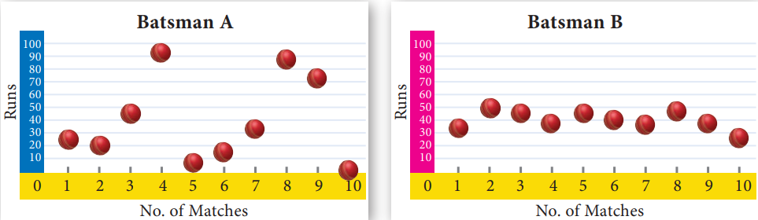
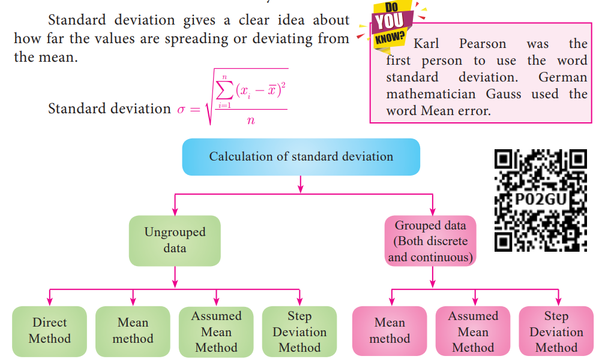

# Measures of Dispersion
The following data provide the runs scored by two batsmen in the last 10 matches.
Batsman A: 25, 20, 45, 93, 8, 14, 32, 87, 72, 4
Batsman B: 33, 50, 47, 38, 45, 40, 36, 48, 37, 26

Mean of Batsman \mathrm{A}=\frac{25+20+45+93+8+14+32+87+72+4}{10}=40

Mean of Batsman \mathrm{B}=\frac{33+50+47+38+45+40+36+48+37+26}{10}=40

The mean of both datas are same (40), but they differ significantly.

From the above diagrams, we see that runs of batsman B are grouped around the mean. But the runs of batsman A are scattered from 0 to 100, though they both have same mean.

Thus, some additional statistical information may be required to determine how the values are spread in data. For this, we shall discuss Measures of Dispersion.

Dispersion is a measure which gives an idea about the scatteredness of the values.

Measures of Variation (or) Dispersion of a data provide an idea of how observations spread out (or) scattered throughout the data.

**Different Measures of Dispersion are**
1. Range 
2. Mean deviation 
3. Quartile deviation
4. Standard deviation 
5. Variance 
6. Coefficient of Variation

## Range

The difference between the largest value and the smallest value is called Range.
\text{Range R} = L– S

\begin{aligned}
\text { Coefficient of range } & =\frac{L-S}{L+S}
\end{aligned}


where L - Largest value; S - Smallest value

**Progress Check**

The range of first 10 prime numbers is \_\_\_\_\_\_\_.

**Example 8.1** Find the range and coefficient of range of the following data: 25, 67, 48, 53, 18, 39, 44.

**Solution** Largest value L = 67; Smallest value S =18


\begin{aligned}
\text { Range R }=L-S & =67-18=49 \\
\text { Coefficient of range } & =\frac{L-S}{L+S} \\
\text { Coefficient of range } & =\frac{67-18}{67+18}=\frac{49}{85}=0.576
\end{aligned}


**Example 8.2** Find the range of the following distribution.

| Age (in years) | 16-18 | 18-20 | 20-22 | 22-24 | 24-26 | 26-28 |
| :--- | :---: | :---: | :---: | :---: | :---: | :---: |
| Number of students | 0 | 4 | 6 | 8 | 2 | 2 |

**Note**

If the frequency of initial class is 
zero, then the next class will be 
considered for the calculation of 
range.

**Solution** Here Largest value L = 28
Smallest value S=18

Range R \quad=L-S

R \quad=28-18=10 Years
**Example 8.3** The range of a set of data is 13.67 and the largest value is 70.08. Find the smallest value.

**Note**

The range of a set of data does 
not give the clear idea about 
the dispersion of the data from 
measures of Central Tendency. 
For this, we need a measure which 
depend upon the deviation from 
the measures of Central Tendency.

**Solution** Range R = 13.67
 Largest value L = 70.08
         Range R = L - S
           13.67 = − 70.08 - S
               S = 70.08 - 13.67 = 56.41
Therefore, the smallest value is 56.41.

## Deviations from the mean
For a given data with n observations x_{1}, x_{2}, \ldots x_{n}, the deviations from the mean \bar{x} are x_{1}-\bar{x}, x_{2}-\bar{x}, \ldots, x_{n}-\bar{x}.

## Squares of deviations from the mean
The squares of deviations from the mean \bar{x} of the observations x_{1}, x_{2}, \ldots, x_{n} are 
\left(x_{1}-\bar{x}\right)^{2},\left(x_{2}-\bar{x}\right)^{2}, \ldots,\left(x_{n}-\bar{x}\right)^{2} or \sum_{i=1}^{n}\left(x_{i}-\bar{x}\right)^{2}

**Note**

We note that (x_{i}-\bar{x}) \geq 0  for all observations \bar{x} of the observations x_{i}, i=1,2,3, \ldots, n. If the deviations from the mean (x_{i}-\bar{x}) are small, then the squares of the deviations will be very small.

## Variance
The mean of the squares of the deviations from the mean is called Variance. It is denoted by  \sigma^{2} (read as sigma square).
Variance  = Mean of squares of deviations

 
=\frac{\left(x_{1}-\bar{x}\right)^{2}+\left(x_{2}-\bar{x}\right)^{2}+\ldots+\left(x_{n}-\bar{x}\right)^{2}}{n}


Variance  \sigma^{2}=\frac{\sum_{i=1}^{n}\left(x_{i}-\bar{x}\right)^{2}}{n}


\begin{gathered}
\text { Thinking Corner } \\
\text { Can variance be } \\
\text { negative? }
\end{gathered}


## Standard Deviation
The positive square root of Variance is called Standard deviation. That is, standard deviation is the positive square root of the mean of the squares of deviations of the given values from their mean. It is denoted by \sigma. 

**Calculation of Standard Deviation for ungrouped data**

**1. Direct Method**

**Note**
The standard deviation and mean have same units in which the data are given.
Standard deviation, 

\begin{aligned}
\sigma & =\sqrt{\frac{\sum\left(x_{i}-\bar{x}\right)^{2}}{n}} \\
& =\sqrt{\frac{\sum\left(x_{i}^{2}-2 x_{i} \bar{x}+\bar{x}^{2}\right)}{n}}\\
& =\sqrt{\frac{\sum x_{i}^{2}}{n}-2 \bar{x} \frac{\sum x_{i}}{n}+\frac{\bar{x}^{2}}{n} \times(1+1+\cdots \text { to } n \text { times })} \\
& =\sqrt{\frac{\Sigma x_{i}^{2}}{n}-2 \bar{x} \times \bar{x}+\frac{\bar{x}^{2}}{n} \times n}=\sqrt{\frac{\sum x_{i}^{2}}{n}-2 \bar{x}^{2}+\bar{x}^{2}}=\sqrt{\frac{\sum x_{i}^{2}}{n}-\bar{x}^{2}}
\end{aligned}

Standard deviation, \sigma=\sqrt{\frac{\Sigma x_{i}^{2}}{n}-\left(\frac{\Sigma x_{i}}{n}\right)^{2}}

**Note**

\blacktriangleright While computing standard deviation, arranging data in ascending order is not mandatory. 

\blacktriangleright If the data values are given directly then to find standard deviation we can use the 
formula \sigma=\sqrt{\frac{\Sigma x_{i}^{2}}{n}-\left(\frac{\Sigma x_{i}}{n}\right)^{2}}

\blacktriangleright If the data values are not given directly but the squares of the deviations from the mean of each observation is given then to find standard deviation we can use the 
formula \sigma=\sqrt{\frac{\Sigma\left(x_{i}-\bar{x}\right)^{2}}{n}}.

**Example 8.4** The number of televisions sold in each day of a week are 13, 8, 4, 9, 7, 12, 10. Find its standard deviation.

| x_{i} | x_{i}^{2} |
| :---: | :---: |
| 13 | 169 |
| 8 | 64 |
| 4 | 16 |
| 9 | 81 |
| 7 | 49 |
| 12 | 144 |
| 10 | 100 |
| \Sigma x_{i}=63 | \Sigma x_{i}^{2}=623 |

Standard deviation \sigma=\sqrt{\frac{\Sigma x_{i}^{2}}{n}-\left(\frac{\Sigma x_{i}}{n}\right)^{2}}

=\sqrt{\frac{623}{7}-\left(\frac{63}{7}\right)^{2}}

=\sqrt{89-81}=\sqrt{8}

Hence, \sigma \simeq 2.83

**Thinking Corner**

Can the standard deviation be more than the variance?

**Progress Check**

If the variance is 0.49 then the standard deviation is __________.

**2. Mean method**

Another convenient way of finding standard deviation is to use the following formula.
Standard deviation (by mean method) \sigma=\sqrt{\frac{\sum\left(x_{i}-\bar{x}\right)^{2}}{n}}

If d_{i}=x_{i}-\bar{x} are the deviations, then \sigma=\sqrt{\frac{\sum d_{i}^{2}}{n}}

**Example 8.5** The amount of rainfall in a particular season for 6 days are given as 17.8 cm, 19.2 cm, 16.3 cm, 12.5 cm, 12.8 cm and 11.4 cm. Find its standard deviation.

**Solution**  Arranging the numbers in ascending order we get, 11.4, 12.5, 12.8, 16.3, 17.8, 19.2. Number of observations n = 6
Mean =\frac{11.4+12.5+12.8+16.3+17.8+19.2}{6}=\frac{90}{6}=15

| x_{i} | d_{i}=x_{i}-\bar{x}   =x-15 | d_{i}^{2} |
| :---: | :---: | :---: |
| 11.4 | -3.6 | 12.96 |
| 12.5 | -2.5 | 6.25 |
| 12.8 | -2.2 | 4.84 |
| 16.3 | 1.3 | 1.69 |
| 17.8 | 2.8 | 7.84 |
| 19.2 | 4.2 | 17.64 |
|  |  | \Sigma d_{i}^{2}=51.22 |

Standard deviation \sigma=\sqrt{\frac{\sum d_{i}^{2}}{n}}

=\sqrt{\frac{51.22}{6}}=\sqrt{8.53}

Hence, \quad \sigma \simeq 2.9

**3. Assumed Mean method**  

When the mean value is not an integer (since calculations are very tedious in decimal form) then it is better to use the assumed mean method to find the standard deviation.
Let x_{1}, x_{2}, x_{3}, \ldots, x_{n} be the given data values and let \bar{x} be their mean.
Let d_{i} be the deviation of x_{i} from the assumed mean A, which is usually the middle value or near the middle value of the given data.

\begin{aligned}
d_{i} & =x_{i}-A \text { gives, } x_{i}=d_{i}+A \\
\Sigma d_{i} & =\Sigma\left(x_{i}-A\right) \\
& =\Sigma x_{i}-(A+A+A+\cdots \text { to } n \text { times }) \\
\Sigma d_{i} & =\Sigma x_{i}-A \times n \\
\frac{\Sigma d_{i}}{n_{\bar{d}}} & =\frac{\Sigma x_{i}}{n}-A \\
\bar{d} & =\bar{x}-A \text { (or) } \bar{x}=\bar{d}+A
\end{aligned}


Standard deviation \sigma=\sqrt{\frac{\sum\left(x_{i}-\bar{x}\right)^{2}}{n}}=\sqrt{\frac{\sum\left(d_{i}+A-\bar{d}-A\right)^{2}}{n}} \quad (using (1) and (2))


\begin{aligned}
& =\sqrt{\frac{\sum\left(d_{i}-\bar{d}\right)^{2}}{n}}=\sqrt{\frac{\sum\left(d_{i}^{2}-2 d_{i} \times \bar{d}+\bar{d}^{2}\right)}{n}} \\
& =\sqrt{\frac{\sum d_{i}^{2}}{n}-2 \bar{d} \frac{\sum d_{i}}{n}+\frac{\bar{d}^{2}}{n}(1+1+1+\cdots \text { to } n \text { times })} \\
& =\sqrt{\frac{\sum d_{i}^{2}}{n}-2 \bar{d} \times \bar{d}+\frac{\bar{d}^{2}}{n} \times n} \quad (\text { since } \bar{d} \text { is a constant }) \\
& =\sqrt{\frac{\sum d_{i}^{2}}{n}-\bar{d}^{2}}
\end{aligned}


Standard deviation \sigma=\sqrt{\frac{\sum d_{i}^{2}}{n}-\left(\frac{\sum d_{i}}{n}\right)^{2}}

**Thinking Corner**

For any collection of n values, can you find the value of
1. \Sigma\left(x_{i}-\bar{x}\right)
2. \left(\Sigma x_{i}\right)-\bar{x}

**Example 8.6**  The marks scored by 10 students in a class test are 25, 29, 30, 33, 35, 37, 38, 40, 44, 48. Find the standard deviation.

**Solution** The mean of marks is 35.9 which is not an integer Hence we take assumed mean, A = 35, n = 10.

| x_{i} | d_{i}=x_{i}-A   d_{i}=x_{i}-35 | d_{i}^{2} |
| :---: | :---: | :---: |
| 25 | -10 | 100 |
| 29 | -6 | 36 |
| 30 | -5 | 25 |
| 33 | -2 | 4 |
| 35 | 0 | 0 |
| 37 | 2 | 4 |
| 38 | 3 | 9 |
| 40 | 5 | 25 |
| 44 | 9 | 81 |
| 48 | 13 | 169 |
|  | \Sigma d_{i}=9 | \Sigma d_{i}^{2}=453 |


\begin{aligned}
\text {Standard deviation }
\sigma & =\sqrt{\frac{\Sigma d_{i}^{2}}{n}-\left(\frac{\Sigma d_{i}}{n}\right)^{2}} \\
& =\sqrt{\frac{453}{10}-\left(\frac{9}{10}\right)^{2}} \\
& =\sqrt{45.3-0.81} \\
& =\sqrt{44.49} \\
\sigma & \simeq 6.67
\end{aligned}


**2. Step deviation method**

Let x_{1}, x_{2}, x_{3}, \ldots x_{n} be the given data. Let \mathrm{A} be the assumed mean.

Let c be the common divisor of x_{i}-A.

**Note**


\begin{aligned}
& \text { Let } \quad d_{i}=\frac{x_{i}-A}{c} \\
& \text { Then } \quad x_{i}=d_{i} c+A \\
& \Sigma x_{i}=\Sigma\left(d_{i} c+A\right)=c \Sigma d_{i}+A \times n \\
& \frac{\Sigma x_{i}}{n}=c \frac{\Sigma d_{i}}{n}+A \\
& \bar{x}=c \bar{d}+A \\
& x_{i}-\bar{x}=c d_{i}+A-c \bar{d}-A=c\left(d_{i}-\bar{d}\right) \quad(\text { using (1) and (2) }) \\
& \sigma=\sqrt{\frac{\sum\left(x_{i}-\bar{x}\right)^{2}}{n}}=\sqrt{\frac{\sum\left(c\left(d_{i}-\bar{d}\right)\right)^{2}}{n}}=\sqrt{\frac{c^{2} \Sigma\left(d_{i}-\bar{d}\right)^{2}}{n}} \\
& \sigma=c \times \sqrt{\frac{\Sigma d_{i}^{2}}{n}-\left(\frac{\Sigma d_{i}}{n}\right)^{2}}
\end{aligned}


**Note**

We can use any of the above methods for finding the standard deviation

**Activity 1**

Find the standard deviation of the marks obtained by you in all five subjects in the quarterly examination and in the midterm test separately. What do you observe from your results.

**Example 8.7** The amount that the children have spent for purchasing some eatables in 
one day trip of a school are 5, 10, 15, 20, 25, 30, 35, 40. Using step deviation method, find 
the standard deviation of the amount they have spent.

**Solution** We note that all the observations are divisible by 5. Hence we can use the step 
deviation method. Let the Assumed mean A = 20, n = 8.

| x_{i} | d_{i}=x_{i}-A   d_{i}=x_{i}-20 | d_{i}=\frac{x_{i}-A}{c}   c=5 | d_{i}^{2} |
| :---: | :---: | :---: | :---: |
| 5 | -15 | -3 | 9 |
| 10 | -10 | -2 | 4 |
| 15 | -5 | -1 | 1 |
| 20 | 0 | 0 | 0 |
| 25 | 5 | 1 | 1 |
| 30 | 10 | 2 | 4 |
| 35 | 15 | 3 | 9 |
| 40 | 20 | 4 | 16 |
|  |  | \Sigma d_{i}=4 | \Sigma d_{i}^{2}=44 |


\begin{aligned}
\text {Standard deviation }
\sigma & =\sqrt{\frac{\Sigma d_{i}^{2}}{n}-\left(\frac{\Sigma d_{i}}{n}\right)^{2}} \times c  
& =\sqrt{\frac{44}{8}-\left(\frac{4}{8}\right)^{2}} \times 5 \\ 
& =\sqrt{\frac{11}{2}-\left(\frac{1}{4}\right)} \times 5 \\
& = \sqrt{5.5-0.25} \times 5 \\
& = 2.29 \times 5 \\
& \sigma = \simeq 11.45
\end{aligned}


**Example 8.8** Find the standard deviation of the following data 7, 4, 8, 10, 11. Add 3 to all the values then find the standard deviation for the new values.

**Solution** Arranging the values in ascending order we get, 4, 7, 8, 10, 11 and n = 5

| x_{i} | x_{i}^{2} |
| :---: | :---: |
| 4 | 16 |
| 7 | 49 |
| 8 | 64 |
| 10 | 100 |
| 11 | 121 |
| \Sigma x_{i}=40 | \Sigma x_{i}^{2}=350 |


\begin{aligned}
\text{ Standard deviation }
\sigma & =\sqrt{\frac{\Sigma x_{i}^{2}}{n}-\left(\frac{\Sigma x_{i}}{n}\right)^{2}} \\
& =\sqrt{\frac{350}{5}-\left(\frac{40}{5}\right)^{2}} \\
\sigma & =\sqrt{6} \simeq 2.45
\end{aligned}


When we add 3 to all the values, we get the new values as 7,10,11,13,14.

| x_{i} | x_{i}^{2} |
| :---: | :---: |
| 7 | 49 |
| 10 | 100 |
| 11 | 121 |
| 13 | 169 |
| 14 | 196 |
| \Sigma x_{i}=55 | \Sigma x_{i}^{2}=635 |


\begin{aligned}
\text{ Standard deviation } 
\sigma & =\sqrt{\frac{\Sigma x_{i}^{2}}{n}-\left(\frac{\Sigma x_{i}}{n}\right)^{2}} \\
& =\sqrt{\frac{635}{5}-\left(\frac{55}{5}\right)^{2}} \\
\sigma & =\sqrt{6} \simeq 2.45
\end{aligned}


We see that the standard deviation will not change when we add some fixed constant k to all the values.

**Example 8.9** Find the standard deviation of the data 2, 3, 5, 7, 8. Multiply each data by 4.
Find the standard deviation of the new values.

**Solution** Given, n = 5
| x_{i} | x_{i}^{2} |
| :---: | :---: |
| 2 | 4 |
| 3 | 9 |
| 5 | 25 |
| 7 | 49 |
| 8 | 64 |
| \Sigma x_{i}=25 | \Sigma x_{i}^{2}=151 |


\begin{aligned}
& \text { Standard deviation } \sigma=\sqrt{\frac{\sum x_{i}^{2}}{n}-\left(\frac{\Sigma x_{i}}{n}\right)^{2}} \\
& \sigma=\sqrt{\frac{151}{5}-\left(\frac{25}{5}\right)^{2}}=\sqrt{30.2-25}=\sqrt{5.2} \simeq 2.28
\end{aligned}


When we multiply each data by 4 , we get the new values as 8,12,20,28,32.

| x_{i} | x_{i}^{2} |
| :---: | :---: |
| 8 | 64 |
| 12 | 144 |
| 20 | 400 |
| 28 | 784 |
| 32 | 1024 |
| \Sigma x_{i}=100 | \Sigma x_{i}^{2}=2416 |


\begin{aligned}
& \text { Standard deviation } \sigma=\sqrt{\frac{\Sigma x_{i}^{2}}{n}-\left(\frac{\Sigma x_{i}}{n}\right)^{2}} \\
& =\sqrt{\frac{2416}{5}-\left(\frac{100}{5}\right)^{2}}=\sqrt{483.2-400}=\sqrt{83.2} \\
& \sigma=\sqrt{16 \times 5.2}=4 \sqrt{5.2} \simeq 9.12
\end{aligned}


We see that when we multiply each data by some fixed constant $k$ the standard deviation also get multiplied by k.

**Example 8.10** Find the mean and variance of the first n natural numbers.

**Solution**


\begin{aligned}
\text { Mean } \bar{x} & =\frac{\text { Sum of all the observations }}{\text { Number of observations }} \\
& =\frac{\Sigma x_{i}}{n}=\frac{1+2+3+\ldots+n}{n}=\frac{n(n+1)}{2 \times n} \\
\text { Mean } \bar{x} & =\frac{n+1}{2} \\
\text { Variance } \sigma^{2} & =\frac{\Sigma x_{i}^{2}}{n}-\left(\frac{\Sigma x_{i}}{n}\right)^{2}\left[\begin{array}{l}
\Sigma x_{i}^{2}=1^{2}+2^{2}+3^{2}+\ldots+n^{2} \\
\left(\Sigma x_{i}\right)^{2}=(1+2+3+\ldots+n)^{2}
\end{array}\right] \\
& =\frac{n(n+1)(2 n+1)}{6 \times n}-\left[\frac{n(n+1)}{2 \times n}\right]^{2} \\
& =\frac{2 n^{2}+3 n+1}{6}-\frac{n^{2}+2 n+1}{4} \\
\text { Variance } \sigma^{2} & =\frac{4 n^{2}+6 n+2-3 n^{2}-6 n-3}{12}=\frac{n^{2}-1}{12} .
\end{aligned}


**Calculation of Standard deviation for grouped data**

**1. Mean method**

Standard deviation \sigma=\sqrt{\frac{\Sigma f_{i}\left(x_{i}-\bar{x}\right)^{2}}{N}}


\begin{aligned}
d_{i} & =x_{i}-\bar{x} \\
\sigma & =\sqrt{\frac{\sum f_{i} d_{i}^{2}}{N}}, \text { where, } N=\sum_{i=1}^{n} f_{i}
\end{aligned}


( f_{i} are frequency values of the corresponding data points x_{i} )

**Example 8.11** 48 students were asked to write the total number of hours per week they spent on watching television. With this information find the standard deviation of hours spent for watching television.

| x | 6 | 7 | 8 | 9 | 10 | 11 | 12 |
| :--- | :---: | :---: | :---: | :---: | :---: | :---: | :---: |
| f | 3 | 6 | 9 | 13 | 18 | 5 | 4 |

**_Solution_**

| x_{i} | f_{i} | x_{i}f_{i} | d_{i}=x_{i}-\bar{x} | d_{i}^{2} | f_{i}d_{i}^{2} |
| :---: | :---: | :---: | :---: | :---: | :---: |
| 6 | 3 | 18 | -3 | 9 | 27 |
| 7 | 6 | 42 | -2 | 4 | 24 |
| 8 | 9 | 72 | -1 | 1 | 9 |
| 9 | 13 | 117 | 0 | 0 | 0 |
| 10 | 8 | 80 | 1 | 1 | 8 |
| 11 | 5 | 55 | 2 | 4 | 20 |
| 12 | 4 | 48 | 3 | 9 | 36 |
|  | n = 48  | \Sigma x_{i}f_{i}=432 | \Sigma d_{i}=0 |  | \Sigma f_{i}d_{i}^{2}=124 |

Mean 
\begin{aligned}
\bar{x}=\Sigma \frac{x_{i}f_{i}}{N}=\frac{432}{48}=9 (\because N=\Sigma f_{i})
\end{aligned}



\begin{aligned}
\text {Standard deviation }
\sigma = \sqrt{\frac{\Sigma f_{i} d_{i}^{2}}{N}}=\sqrt{\frac{124}{48}}=\sqrt{2.58} \\
\sigma & \simeq 1.6
\end{aligned}


**2. Assumed Mean method**

Let x_{1}, x_{2}, x_{3}, \ldots, x_{n}. be the given data with frequencies f_{1}, f_{2}, f_{3}, \ldots, f_{n} respectively. 
Let \bar{x} be their mean and A be the assumed mean

d_{i} =x_{i}-A


\begin{aligned}
\text {Standard deviation }
\sigma = \sqrt{\frac{\Sigma f_{i} d_{i}^{2}}{N}-\left(\frac{\Sigma f_{i} d_{i}}{N}\right)^{2}}
\end{aligned}


**Example 8.12** The marks scored by the students in a slip test are given below. Find the standard deviation of their marks.

| x | 4 | 6 | 8 | 10 | 12 |
| :---: | :---: | :---: | :---: | :---: | :---: |
| f | 7 | 3 | 5 | 9 | 5 |

**_Solution_** Let the assumed mean, A = 8

| x_{i} | f_{i} | d_{i}=x_{i}-A | f_{i}d_{i} | f_{i}d_{i}^{2} |
| :---: | :---: | :---: | :---: | :---: |
| 4 | 7 | -4 | -28 | 112 |
| 6 | 3 | -2 | -6 | 12 |
| 8 | 5 | 0 | 0 | 0 |
| 10 | 9 | 2 | 18 | 36 |
| 12 | 5 | 4 | 20 | 80 |
|  | n = 29 |  | \Sigma f_{i}d_{i}=4 | \Sigma f_{i}d_{i}^{2}=240 |


\begin{aligned}
\text {Standard deviation }
\sigma = \sqrt{\frac{\Sigma f_{i} d_{i}^{2}}{N}-\left(\frac{\Sigma f_{i} d_{i}}{N}\right)^{2}} \\
& = \sqrt{\frac{240}{29}-\left(\frac{4}{29}\right)^{2}} \\
& = \sqrt{\frac{240 \times 29 -16}{29 \times 29}} \\
\sigma & = \sqrt{\frac{6944}{29 \times 29}} \Rightarrow \sigma \simeq 2.87
\end{aligned}


**Calculation of Standard deviation for continuous frequency distribution** 

**1. Mean method**


\begin{aligned}
\text {Standard deviation }
\sigma = \sqrt{\frac{\Sigma f_{i}(x_{i}-\bar{x})^{2}}{N}}
\end{aligned}


where, x_{i}= Middle value of the ith class.
f_{i}= Frequency of the ith class.

**2. Shortcut method (or) Step deviation method**

To make the calculation simple, we provide the following formula. Let A  be the assumed mean, x_{i} be the middle value of the i^{th} class and c is the width of the class interval.

d_{i}^{2}=\frac{x_{i}-A}{c}


\sigma = c \times \sqrt{\frac{\Sigma f_{i} d_{i}^{2}}{N}-\left(\frac{\Sigma f_{i} d_{i}}{N}\right)^{2}}


**Example 8.13** Marks of the students in a particular subject of a class are given below. Find its standard deviation.

| Marks | 0-10 | 10-20 | 20-30 | 30-40 | 40-50 | 50-60 | 60-70 |
| :--- | :---: | :---: | :---: | :---: | :---: | :---: | :---: |
| Number of students | 8 | 12 | 17 | 14 | 9 | 7 | 4 |

**_Solution_** Let the assumed mean, _A_ = 35, _c_ = 10

| Marks | Mid valuex_{i} | f_{i} | d_{i}=x_{i}-A | d_{i}^{2}=\frac{x_{i}-A}{c} | f_{i}d_{i} | f_{i}d_{i}^{2} |
| :---: | :---: | :---: | :---: | :---: | :---: | :---: |
| 0-10 | 5 | 8 | -30 | -3 | -24 | 72 |
| 10-20 | 15 | 12 | -20 | -2 | -24 | 48 |
| 20-30 | 25 | 17 | -10 | -1 | -17| 17 |
| 30-40 | 35 | 14 | 0 | 0 | 0 | 0 |
| 40-50 | 45 | 9 | 10 | 1 | 9 | 9 |
| 50-60 | 55 | 7 | 20 | 2 | 14 | 28 |
| 60-70 | 65 | 4 | 30 | 3 | 12 | 36 |
|  |  | n = 71  |  |  | \Sigma f_{i}d_{i}=-30 | \Sigma f_{i}d_{i}^{2}=210 |


\begin{aligned}
\text {Standard deviation }
\sigma = c \times \sqrt{\frac{\Sigma f_{i} d_{i}^{2}}{N}-\left(\frac{\Sigma f_{i} d_{i}}{N}\right)^{2}}
\end{aligned}



\begin{aligned}
\sigma = 10 \times \sqrt{\frac{210}{71}-\left(-\frac{30}{71}\right)^{2}}
\end{aligned}



\begin{aligned}
\sigma = 10 \times \sqrt{\frac{210}{71}-\left(\frac{900}{5041}\right)}
\end{aligned}



\begin{aligned}
\sigma = 10 \times \sqrt{2.779};
\end{aligned}



\begin{aligned}
\sigma \simeq 16.67
\end{aligned}


**Thinking Corner**

1\. The standard deviation of a data is 2.8, if 5 is added to all the data values then the new standard deviation is \_\_\_.

2\. If _S_ is the standard deviation of values _p_, _q_, _r_ then standard deviation of _p_–3, _q_–3, _r_–3 is \_\_\_.

**Example 8.14** The mean and standard deviation of 15 observations are found to be 10 and 5** respectively. On rechecking it was found that one of the observation with value 8 was incorrect. Calculate the correct mean and standard deviation if the correct observation value was 23?

**_Solution_** n=15, \bar{x}=10, \sigma=5; \bar{x}=\frac{\Sigma x}{n}; \Sigma x=15x10=150

Wrong observation value = 8, Correct observation value = 23. Correct total = 150 - 8 + 23 = 165


\begin{aligned}
\text {Correct mean }
\bar{x} = \frac{165}{15}=11
\end{aligned}



\begin{aligned}
\text {Standard deviation }
\sigma = \sqrt{\frac{\Sigma x^{2}}{n}-\left(\frac{\Sigma x}{n}\right)^{2}}
\end{aligned}



\begin{aligned}
\text {Incorrect value of }
\sigma = 5 = \sqrt{\frac{\Sigma x^{2}}{15}-\left(10\right)^{2}}
\end{aligned}



\begin{aligned}
25 = \frac{\Sigma x^{2}}{15}-100 \Rightarrow \frac{\Sigma x^{2}}{15} = 125
\end{aligned}



\begin{aligned}
\text {Incorrect value of }
\Sigma x^{2}=1875
\end{aligned}



\begin{aligned}
\text {Correct value of }
\Sigma x^{2}=1875-8^{2}+23^{2}=2340
\end{aligned}



\begin{aligned}
\text {Correct standard deviation }
\sigma = \sqrt{\frac{2340}{15}-\left(11\right)^{2}}
\end{aligned}



\begin{aligned}
\sigma = \sqrt{156-121}=\sqrt{35}
\end{aligned}



\begin{aligned}
\sigma \simeq 5.9
\end{aligned}


**Exercise 8.1**

1\. Find the range and coefficient of range of the following data. 
1. 63, 89, 98, 125, 79, 108, 117, 68
2. 43.5, 13.6, 18.9, 38.4, 61.4, 29.8

2\. If the range and the smallest value of a set of data are 36.8 and 13.4 respectively, then find the largest value.

3\. Calculate the range of the following data.
| Income | 400-450 | 450-500 | 500-550 | 550-600 | 600-650 |
| :--- | :---: | :---: | :---: | :---: | :---: |
| Number of workers | 8 | 12 | 30 | 21 | 6 |

4\. A teacher asked the students to complete 60 pages of a record note book. Eight students have completed only 32, 35, 37, 30, 33, 36, 35 and 37 pages. Find the standard deviation of the pages completed by them.

5\. Find the variance and standard deviation of the wages of 9 workers given below: ₹310, ₹290, ₹320, ₹280, ₹300, ₹290, ₹320, ₹310, ₹280.

6\. A wall clock strikes the bell once at 1 o’ clock, 2 times at 2 o’ clock, 3 times at 3 o’ clock and so on. How many times will it strike in a particular day. Find the standard deviation of the number of strikes the bell make a day.

7\. Find the standard deviation of first 21 natural numbers. 

8\. If the standard deviation of a data is 4.5 and if each value of the data is decreased by 5, then find the new standard deviation. 

9\. If the standard deviation of a data is 3.6 and each value of the data is divided by 3, then find the new variance and new standard deviation. 

10\. The rainfall recorded in various places of five districts in a week are given below.
     Find its standard deviation.
| rainfall (in mm) | 45 | 50 | 55 | 60 | 65 | 70 |
| :--- | :---: | :---: | :---: | :---: | :---: | :---: |
| Number of places | 5 | 13 | 4 | 9 | 5 | 4 |

11\. In a study about viral fever, the number of people affected in a town were noted as Find its standard deviation.
| Age in years | 0-10 | 10-20 | 20-30 | 30-40 | 40-50 | 50-60 | 60-70 |
| :--- | :---: | :---: | :---: | :---: | :---: | :---: | :---: |
| Number of people affected | 3 | 5 | 16 | 18 | 12 | 7 | 4 |

12\. The measurements of the diameters (in cms) of the plates prepared in a factory are given below. Find its standard deviation.
| Diameter (cm) | 21-24 | 25-28 | 29-32 | 33-36 | 37-40 | 41-44 |
| :--- | :---: | :---: | :---: | :---: | :---: | :---: |
| Number of plates | 15 | 18 | 20 | 16 | 8 | 7 |

13\. The time taken by 50 students to complete a 100 meter race are given below. Find its standard deviation.
| Time taken (sec) | 8.5-9.5 | 9.5-10.5 | 10.5-11.5 | 11.5-12.5 | 12.5-13.5 |
| :--- | :---: | :---: | :---: | :---: | :---: |
| Number of students | 6 | 8 | 17 | 10 | 9 |

14\. For a group of 100 candidates the mean and standard deviation of their marks were found to be 60 and 15 respectively. Later on it was found that the scores 45 and 72 were wrongly entered as 40 and 27. Find the correct mean and standard deviation.

15\. The mean and variance of seven observations are 8 and 16 respectively. If five of these are 2, 4, 10, 12 and 14, then find the remaining two observations.

