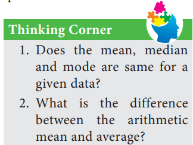
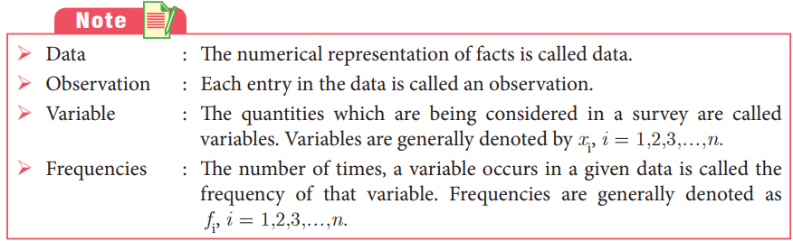
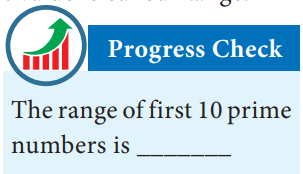
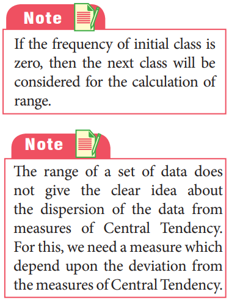
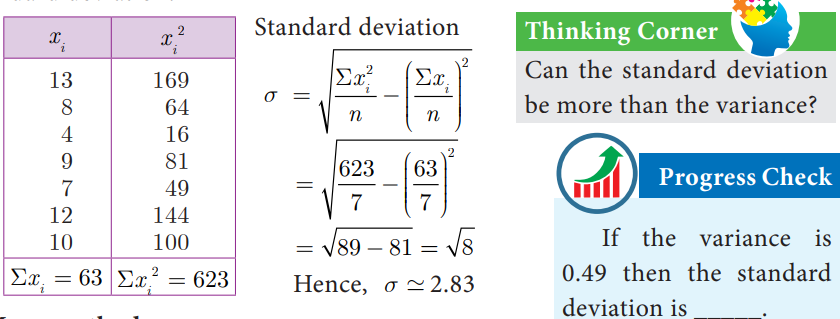
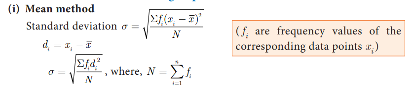



# Statistics and Probability

Prasanta Chandra Mahalanobis, born at Kolkata, was an 
Indian statistician who devised a measure of comparison between two data sets. He introduced innovative techniques for conducting large-scale sample surveys and calculated acreages and crop yields by using the method of random sampling. For his pioneering work, he was awarded the Padma Vibhushan, one of India’s highest honours, by the Indian government in 1968 and he is hailed as “Father of Indian Statistics”. The Government of India has designated 29th June every year, coinciding with his birth anniversary, as “National Statistics Day”.

## Introduction
‘STATISTICS’ is derived from the Latin word ‘status’ which means a political state. 
Today, statistics has become an integral part of everyone’s life, unavoidable whether making a plan for our future, doing a business, a marketing research or preparing economic 
reports. It is also extensively used in opinion polls, doing advanced research. The study of statistics is concerned with scientific methods for collecting, organising, summarising, 
presenting, analysing data and making meaningful decisions. In earlier classes we have studied about collection of data, presenting the data in tabular form, graphical form and calculating the Measures of Central Tendency. Now, in this class, let us study about the Measures of Dispersion.

#### Recall
#### Measures of Central Tendency

It is often convenient to have one number that represent the whole data. Such a number is called a **Measures of Central Tendency.**

The Measures of Central Tendency usually will be 
near to the middle value of the data. For a given data there 
exist several types of measures of central tendencies.

The most common among them are
• Arithmetic Mean • Median • Mode

In this class we have to recall the Arithmetic Mean.

**Arithmetic Mean**
The Arithmetic Mean or Mean of the given values is "/> sum of all the observations divided by the total number of observations. It is denoted by $x$ (pronounced as $x$ bar)
$x$ = $\displaystyle \frac{Sum of all the observations}{Number of observations}$

We apply the respective formulae depending upon the information provided in the problem.
 

<!-- **8.2 Measures of Dispersion**  -->
## Measures of Dispersion
The following data provide the runs scored by two batsmen in the last 10 matches.
Batsman A: 25, 20, 45, 93, 8, 14, 32, 87, 72, 4
Batsman B: 33, 50, 47, 38, 45, 40, 36, 48, 37, 26

Mean of Batsman A = $\displaystyle \frac{25 + 20 + 45 + 93 + 8 + 14 + 32 + 87 + 72 + 4}{10} = 40$

Mean of Batsman B = $\displaystyle \frac{33 + 50 + 47 + 38 + 45 + 40 + 36 + 48 + 37 + 26}{10} = 40$
The mean of both datas are same (40), but they differ significantly.

<!-- **Fig. 8.1(a)**  -->

<!-- **Fig. 8.1(b)** -->

From the above diagrams, we see that runs of batsman B are grouped around the mean. But the runs of batsman A are scattered from 0 to 100, though they both have same mean.

Thus, some additional statistical information may be required to determine how the values are spread in data. For this, we shall discuss **Measures of Dispersion.**

Dispersion is a measure which gives an idea about the scatteredness of the values.

**Measures of Variation** (or) Dispersion of a data provide an idea of how observations spread out (or) scattered throughout the data.

#### Different Measures of Dispersion are
1. Range 2. Mean deviation 3. Quartile deviation
4. Standard deviation 5. Variance 6. Coefficient of Variation

### Range

<!-- **8.2.1 Range** -->
The difference between the largest value and the smallest value is called Range.
**Range R = L– S**

Coefficient of range = $\displaystyle \frac{L-S}{L+S}$

where $L$ - Largest value; $S$ - Smallest value
**Example 8.1** Find the range and coefficient of range of
the following data: 25, 67, 48, 53, 18, 39, 44.
**Solution** Largest value L = 67; Smallest value S =18
Range $R= L-S = 67-18 = 49$ 
Coefficient of range = $\displaystyle \frac{L-S}{L+S}$

Coefficient of range = $\displaystyle \frac{67-18}{67+18} = \frac{49}{85}=0.576$ 

**Example 8.2** Find the range of the following distribution.

**Solution** Here Largest value $L$ = 28
             Smallest value $S$ = 18
                      Range $R = L - S$
                            $R$ = 28 - 18 = 10Years
**Example 8.3** The range of a set of data is 13.67 and the largest value is 70.08. Find the smallest value.
**Solution** Range $R$ = 13.67
 Largest value $L$ = 70.08
         Range $R = L - S$
           13.67 = − 70.08 - $S$
               $S$ = 70.08 - 13.67 = 56.41
Therefore, the smallest value is 56.41.

### Deviations from the mean
<!-- **8.2.2 Deviations from the mean** -->
For a given data with n observations $x1, x2 ...xn$, the deviations from the mean $x$ are 
$x1-x, ...,xn-x$.
### Squares of deviations from the mean
<!-- **8.2.3 Squares of deviations from the mean** -->

 
 

<!-- **8.2.4 Variance**  -->
### Variance
The mean of the squares of the deviations from the mean is called **Variance**.
It is denoted by $s^2$ (read as sigma square).

### Standard Deviation
<!-- **8.2.5 Standard Deviation** -->
The positive square root of Variance is called **Standard deviation**. That is, standard deviation is the positive square root of the mean of the squares of deviations of the given values from their mean. It is denoted by s.

**Calculation of Standard Deviation for ungrouped data**

**Example 8.4** The number of televisions sold in each day of a week are 13, 8, 4, 9, 7, 12, 10. Find its standard deviation.

##### 2. Mean method
Another convenient way of finding standard deviation is to use the following formula.

**Example 8.5** The amount of rainfall in a particular season for 6 days are given as 17.8 cm, 19.2 cm, 16.3 cm, 12.5 cm, 12.8 cm and 11.4 cm. Find its standard deviation.
**Solution**  Arranging the numbers in ascending order we get, 11.4, 12.5, 12.8, 16.3, 17.8, 19.2. Number of observations n = 6

Mean = $\displaystyle \frac{11.4 + 12.5 + 12.8 + 16.3 + 16.3 + 17.8 + 19.2}{6} = \frac{90}{6} = 15$

##### 3. Assumed Mean method  
When the mean value is not an integer (since calculations are very tedious in decimal form) then it is better to use the **assumed mean method** to find the **standard deviation**.
Let $x1, x2, x3, ...,xn$ be the given data values and let x be their mean.
Let di be the deviation of $xi$
 from the assumed mean A, which is usually the middle 
value or near the middle value of the given data.

**Example 8.6**  The marks scored by 10 students in a class test are 25, 29, 30, 33, 35, 37, 38, 40, 44, 48. Find the standard deviation.
**Solution** The mean of marks is 35.9 which is not an integer Hence we take assumed mean, A = 35, $n$ = 10.

##### 2. Step deviation method
Let $x1, x2, x3, ...,xn$ be the given data. Let A be the assumed mean.
Let $c$ be the common divisor of $xi - A$.

 

**Example 8.7** The amount that the children have spent for purchasing some eatables in 
one day trip of a school are 5, 10, 15, 20, 25, 30, 35, 40. Using step deviation method, find 
the standard deviation of the amount they have spent.
**Solution** We note that all the observations are divisible by 5. Hence we can use the step 
deviation method. Let the Assumed mean $A$ = 20, $n$ = 8.

**Example 8.8** Find the standard deviation of the following data 7, 4, 8, 10, 11. Add 3 to all the values then find the standard deviation for the new values.
**Solution** Arranging the values in ascending order we get, 4, 7, 8, 10, 11 and $n$ = 5

**Example 8.9** Find the standard deviation of the data 2, 3, 5, 7, 8. Multiply each data by 4.
Find the standard deviation of the new values.
**Solution** Given, $n$ = 5

**Example 8.10** Find the mean and variance of the first n natural numbers.
**Solution** Mean $x$ = $\displaystyle \frac{Sum of all the observations}{Number of observations}$

**Calculation of Standard deviation for grouped data**

  