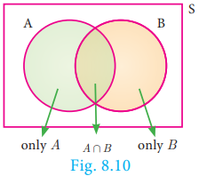
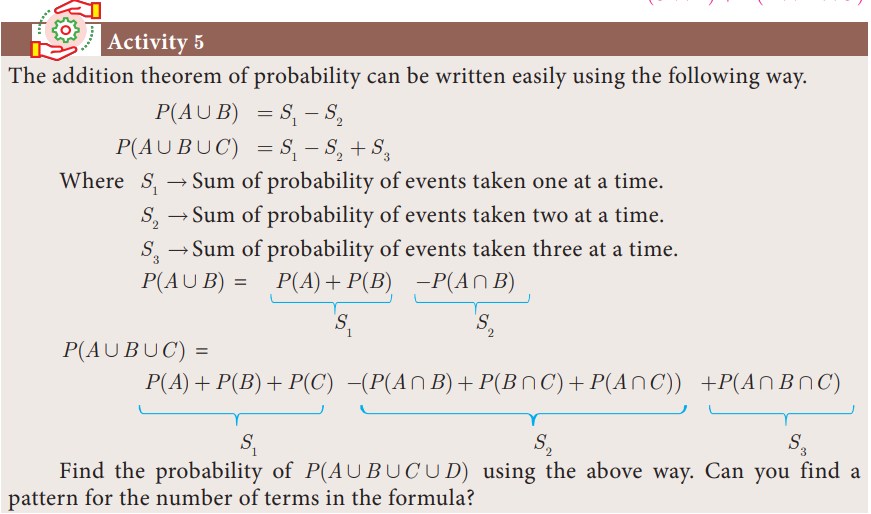
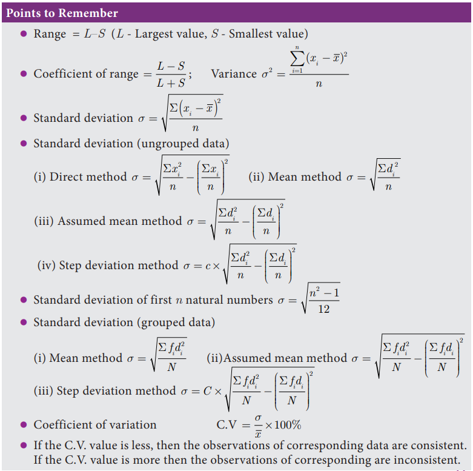
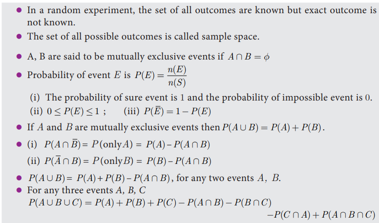

# Addition Theorem of Probability 

1. If _A_ and _B_ are any two events then

P(A \cup B) = P(A) + P(B) - P(A \cap B)

2. If _A,B_ and _C_ are any three events then

P(A \cup B \cup C) = P(A) + P(B) + P(C) - P(A \cap B) - P(B \cap C) - P(A \cap C) + P(A \cap B \cap C)

**Proof** 

1. Let _A_ and _B_ be any two events of a random experiment with sample space _S_. From the Venn diagram, we have the events only _A_, P(A \cap B) and only _B_ are mutually exclusive and their union is P(A \cup B)

Therefore, P(A \cup B) = P[(only A) \cup (A \cap B) \cup (only B)]

= P(only A) \cup P(A \cap B) + P(only B)

= [P(A) - P(A \cap B)] + P(A \cap B) + [P(B) - P(A \cap B)]

P(A \cup B) = P(A) + P(B) - P(A \cap B)
 
2. Let _A, B, C_ are any three events of a random experiment with sample space _S_.

Let D = (B \cup C)

P(A \cup B \cup C) = P(A \cup D)

= P(A) + P(D) - P(A \cap D)

= P(A) + P(B \cup C) - P[A \cap (B \cup C)]

= P(A) + P(B) + P(C) - P(B \cap C) - P[(A \cap B) \cup (A \cap C)]

= P(A) + P(B) + P(C) - P(B \cap C) - P(A \cap B) - P(A \cap C) + P[(A \cap B) \cap (A \cap C)]

P(A \cup B \cup C) = P(A) + P(B) + P(C) - P(A \cap B) - P(B \cap C) - P(A \cap C) + P(A \cap B \cap C)

**Example 8.26** If P(A)=0.37, P(B)=0.42, P(A \cap B)=0.09 then find P(A \cup B). 

**_Solution_** P(A)=0.37, P(B)=0.42, P(A \cap B)=0.09

P(A \cup B) = P(A) + P(B) - P(A \cap B)

P(A \cup B) = 0.37 + 0.42 - 0.09

**Example 8.27** What is the probability of drawing either a king or a queen in a single draw from a well shuffled pack of 52 cards? 

**Thinking Corner**

P(A \cup B) + P(A \cap B) is \_\_\_\_\_\_\_\_.

**_Solution_** Total number of cards = 52

Number of king cards = 4

Probability of drawing a king card = \frac{4}{52}

Number of queen cards = 4

Probability of drawing a queen card = \frac{4}{52}

Both the events of drawing a king and a queen are mutually exclusive ⇒ P(A \cup B) = P(A) + P(B)

\therefore Probability of drawing either a king or a queen =\frac{4}{52}+\frac{4}{52}=\frac{2}{13}

**Example 8.28** Two dice are rolled together. Find the probability of getting a doublet or sum of faces as 4. 

**_Solution_** When two dice are rolled together, there will be 6×6 = 36 outcomes. Let _S_ be the sample space. Then n(S)=36

Let _A_ be the event of getting a doublet and _B_ be the event of getting face sum 4. Then _A_ = {(1,1),(2,2),(3,3),(4,4),(5,5),(6,6)}

_B_ = {(1,3),(2,2),(3,1)}

\therefore (A \cap B) = {(2,2)}

Then, n(A)=6, n(B)=3, n(A \cap B)=1.

P(A)=\frac{n(A)}{n(S)}=\frac{6}{36}

P(B)=\frac{n(B)}{n(S)}=\frac{3}{36}

P(A \cap B)=\frac{n(A \cap B)}{n(S)}=\frac{1}{36}

\therefore P (getting a doublet or a total of 4) P(A \cup B)

P(A \cup B) = P(A) + P(B) - P(A \cap B)

=\frac{6}{36}+\frac{6}{36}-\frac{1}{36}=\frac{8}{36}=\frac{2}{9}

Hence, the required probability is \frac{2}{9}

**Example 8.29** If _A_ and _B_ are two events such that P(A)=\frac{1}{4}, P(B)=\frac{1}{2}  and P(A and B)=\frac{1}{8}, 
find 1. P(A or B) 2. P(not A and not B). 

**_Solution_** 
1. P(A or B) = P(A \cup B)
    P(A) + P(B) - P(A \cap B)
    P(A or B) = \frac{1}{4}+\frac{1}{2}-\frac{1}{8}=\frac{5}{8}

2. P(not A or not B) = P(\bar{A} \cap \bar{B})
    P(\bar{A \cup B})
    1-P(A \cup B)
    P(not A or not B) = 1-\frac{5}{8}=\frac{3}{8}

**Example 8.30** _A_ card is drawn from a pack of 52 cards. Find the probability of getting a king or a heart or a red card. 

**_Solution_** Total number of cards = 52; n(S)=52

Let _A_ be the event of getting a king card. n(A)=4

P(A)=\frac{n(A)}{n(S)}=\frac{4}{52}

Let _B_ be the event of getting a heart card. n(B)=13

P(B)=\frac{n(B)}{n(S)}=\frac{13}{52}

Let _C_ be the event of getting a red card. n(C)=26

P(C)=\frac{n(C)}{n(S)}=\frac{26}{52}

P(A \cap B) = P (getting heart king) = \frac{1}{52}

P(B \cap C) = P (getting red and heart) = \frac{13}{52}

P(A \cap C) = P (getting red king) = \frac{2}{52}

P(A \cap B \cap C) = P (getting heart, king which is red) = \frac{1}{52}

Therefore, required probability is

P(A \cup B \cup C) = P(A) + P(B) + P(C) - P(A \cap B) - P(B \cap C) - P(A \cap C) + P(A \cap B \cap C)

\frac{4}{52} + \frac{13}{52} + \frac{26}{52} - \frac{1}{52} - \frac{13}{52} - \frac{2}{52} + \frac{1}{52} = \frac{28}{52}=\frac{7}{13}

**Example 8.31** In a class of 50 students, 28 opted for NCC, 30 opted for NSS and 18 opted both NCC and NSS. One of the students is selected at random. Find the probability that

1. The student opted for NCC but not NSS.

2. The student opted for NSS but not NCC. 

3. The student opted for exactly one of them.

**_Solution_** Total number of students n(S)=50. 

Let _A_ and _B_ be the events of students opted for NCC and NSS respectively.

n(A)=28, n(B)=30, n(A \cap B)=18

P(A)=\frac{n(A)}{n(S)}=\frac{28}{50}

P(B)=\frac{n(B)}{n(S)}=\frac{30}{50}

P(A \cap B) = \frac{n(A \cap B)}{n(S)} = \frac{18}{50}

1. Probability of the students opted for NCC but not NSS

P(A \cap \bar{B}) = P(A) - P(A \cap B)

\frac{28}{50}-\frac{18}{50}=\frac{1}{5}

2. Probability of the students opted for NSS but not NCC.

P(\bar{A} \cap B) = P(A) - P(A \cap B)

\frac{30}{50}-\frac{18}{50}=\frac{6}{25}

3. Probability of the students opted for exactly one of them

= P[(A \cap \bar{B}) \cup (\bar{A} \cap B)]

= P(A \cap \bar{B}) \cup (\bar{A} \cap B)

\frac{1}{5}+\frac{6}{25}=\frac{11}{25}

(Note that (A \cap \bar{B}), (\bar{A} \cap B) are mutually exclusive events)

**Example 8.32** _A_ and _B_ are two candidates seeking admission to IIT. The probability that A getting selected is 0.5 and the probability that both _A_ and _B_ getting selected is 0.3.

Prove that the probability of _B_ being selected is atmost 0.8.

**_Solution_** P(A)=0.5, P(A \cap B)=0.3

We have P(A \cup B) \leq 1

P(A) + P(B) - P(A \cap B) \leq 1

P(B) \leq 1 - 0.2

P(B) \leq 0.8

Therefore, probability of _B_ getting selected is atmost 0.8.

**Exercise 8.4**

1\. If P(A)=\frac{2}{3}, P(B)=\frac{2}{5}, P(A \cup B)=\frac{1}{3} then find P(A \cap B).

2\. _A_ and _B_ are two events such that, P(A)=0.42, P(B)=0.48, and P(A \cap B)=0.16. Find 
1. _P_(not _A_) 
2. _P_(not _B_) 
3. _P_(_A_ or _B_)

3\. If _A_ and _B_ are two mutually exclusive events of a random experiment and _P_(not _A_) = 0.45, P(A \cup B)=0.65, then find _P_(_B_) .

4\. The probability that atleast one of _A_ and _B_ occur is 0.6. If _A_ and _B_ occur simultaneously with probability 0.2, then find P(\bar{A})+P(\bar{B}) .

5\. The probability of happening of an event _A_ is 0.5 and that of _B_ is 0.3. If _A_ and _B_ are mutually exclusive events, then find the probability that neither _A_ nor _B_ happen.

6\. Two dice are rolled once. Find the probability of getting an even number on the first die or a total of face sum 8.

7\. From a well-shuffled pack of 52 cards, a card is drawn at random. Find the probability of it being either a red king or a black queen.

8\. A box contains cards numbered 3, 5, 7, 9, … 35, 37. A card is drawn at random from the box. Find the probability that the drawn card have either multiples of 7 or a prime number.

9\. Three unbiased coins are tossed once. Find the probability of getting atmost 2 tails or atleast 2 heads.

10\. The probability that a person will get an electrification contract is \frac{3}{5} and the probability that he will not get plumbing contract is \frac{5}{8}. The probability of getting atleast one contract is \frac{5}{7}. What is the probability that he will get both? 

11\. In a town of 8000 people, 1300 are over 50 years and 3000 are females. It is known
that 30% of the females are over 50 years. What is the probability that a chosen individual from the town is either a female or over 50 years?

12\. A coin is tossed thrice. Find the probability of getting exactly two heads or atleast one tail or two consecutive heads.

13\. If _A, B, C_ are any three events such that probability of _B_ is twice as that of probability of _A_ and probability of _C_ is thrice as that of probability of _A_ and if P(A \cap B)=\frac{1}{6}, P(B \cap C)=\frac{1}{4}, P(A \cap B)=\frac{1}{8}, P(A \cup B \cup C)=\frac{9}{10}, P(A \cap B \cap C)=\frac{1}{15}, then find P(A), P(B) and P(C)?

14\. In a class of 35, students are numbered from 1 to 35. The ratio of boys to girls is 4:3. The roll numbers of students begin with boys and end with girls. Find the probability that a student selected is either a boy with prime roll number or a girl with composite roll number or an even roll number.

**Exercise 8.5**

**Multiple choice questions**

1\. Which of the following is not a measure of dispersion? 

(A) Range 

(B) Standard deviation 

(C) Arithmetic mean 

(D) Variance

2\. The range of the data 8, 8, 8, 8, 8. . . 8 is 

(A) 0 

(B) 1 

(C) 8 

(D) 3

3\. The sum of all deviations of the data from its mean is 

(A) Always positive 

(B) always negative 

(C) zero 

(D) non-zero integer

4\. The mean of 100 observations is 40 and their standard deviation is 3. The sum of squares of all observations is 

(A) 40000 

(B) 160900 

(C) 160000 

(D) 30000

5\. Variance of first 20 natural numbers is 

(A) 32.25 

(B) 44.25 

(C) 33.25 

(D) 30

6\. The standard deviation of a data is 3. If each value is multiplied by 5 then the new variance is 

(A) 3 

(B) 15 

(C) 5 

(D) 225

7\. If the standard deviation of _x, y, z_ is _p_ then the standard deviation of 3x+5, 3y+5, 3z+5 is 

(A) 3p+5 

(B) 3p 

(C) p+5 

(D) 9p+15

8\. If the mean and coefficient of variation of a data are 4 and 87.5% then the standard deviation is 

(A) 3.5 

(B) 3 

(C) 4.5 

(D) 2.5

9\. Which of the following is incorrect? 

(A) P(A)>1

(B) 0 \leq P(A) \leq 1

(C) P(\phi)=0

(D) P(A)+P(\bar{A})=1

10\. The probability a red marble selected at random from a jar containing _p_ red, _q_ blue and r green marbles is

(A) \frac{q}{p+q+q}

(B) \frac{p}{p+q+r}

(C) \frac{p+q}{p+q+r}

(D) \frac{p+r}{p+q+r}

11\. A page is selected at random from a book. The probability that the digit at units place of the page number chosen is less than 7 is

(A) \frac{3}{10}

(B) \frac{7}{10}

(C) \frac{3}{9}

(D) \frac{7}{9}

12\. The probability of getting a job for a person is \frac{x}{3}. If the probability of not getting the job is \frac{2}{3} then the value of _x_ is 

(A) 2 

(B) 1 

(C) 3 

(D) 1.5

13\. Kamalam went to play a lucky draw contest. 135 tickets of the lucky draw were sold. If the probability of Kamalam winning is \frac{1}{9}, then the number of tickets bought by Kamalam is 

(A) 5 

(B) 10 

(C) 15 

(D) 20

14\. If a letter is chosen at random from the English alphabets {_a,b,...,z_}, then the probability that the letter chosen precedes _x_

(A) \frac{12}{13}

(B) \frac{1}{13}

(C) \frac{23}{26}

(D) \frac{3}{26}

15\. A purse contains 10 notes of ₹2000, 15 notes of ₹500, and 25 notes of ₹200. One note is drawn at random. What is the probability that the note is either a ₹500 note or ₹200 note?

(A) \frac{1}{5}

(B) \frac{3}{10}

(C) \frac{2}{3}

(D) \frac{4}{5}

**Unit Exercise - 8**

1\. The mean of the following frequency distribution is 62.8 and the sum of all frequencies is 50. Compute the missing frequencies f_{1} and f_{2}

| Class Interval | 0-20 | 20-40 | 40-60 | 60-80 | 80-100 | 100-120 |
| :--- | :---: | :---: | :---: | :---: | :---: | :---: | :---: |
| Frequency | 5 | f_{1} | 10 | f_{2} | 7 | 8 |

2\. The diameter of circles (in mm) drawn in a design are given below.

| Diameters | 33-36 | 37-40 | 41-44 | 45-48 | 49-52 |
| :--- | :---: | :---: | :---: | :---: | :---: | :---: |
| Number of circles | 15 | 17 | 21 | 22 | 25 |

Calculate the standard deviation. 

3\. The frequency distribution is given below.

| Income | k | 2k | 3k | 4k | 5k | 6k |
| :--- | :---: | :---: | :---: | :---: | :---: | :---: |
| Number of workers | 2 | 1 | 1 | 1 | 1 | 1 |

In the table, _k_ is a positive integer, has a varience of 160. Determine the value of _k_.

4\. The standard deviation of some temperature data in degree celsius \d{o}C is 5. If the data were converted into degree Farenheit  then what is the variance?

5\. If for a distribution, \Sigma(x-5)=3, \Sigma(x-5)^{2}=43 and total number of observations is 18, find the mean and standard deviation. 

6\. Prices of peanut packets in various places of two cities are given below. In which city, prices were more stable?

| Prices in city A | 20 | 22 | 19 | 23 | 16 |
| :--- | :---: | :---: | :---: | :---: | :---: |
| Prices in city B | 10 | 20 | 18 | 12 | 15 |

7\. If the range and coefficient of range of the data are 20 and 0.2 respectively, then find the largest and smallest values of the data.

8\. If two dice are rolled, then find the probability of getting the product of face value 6 or the difference of face values 5.

9\. In a two children family, find the probability that there is at least one girl in a family. 10. A bag contains 5 white and some black balls. If the probability of drawing a black ball from the bag is twice the probability of drawing a white ball then find the number of black balls.

11\. The probability that a student will pass the final examination in both English and Tamil is 0.5 and the probability of passing neither is 0.1. If the probability of passing the English examination is 0.75, what is the probability of passing the Tamil examination?

12\. The King, Queen and Jack of the suit spade are removed from a deck of 52 cards. One card is selected from the remaining cards. Find the probability of getting 
1. a diamond 
2. a queen 
3. a spade 
4. a heart card bearing the number 5.

