# Chapter 3: இயற்கணிதம்

\( x^2 - 92y^2 = 1 \) எனும் சமன்பாட்டிற்கு ஓராண்டிற்குள் தீர்வு காண்பவரே கணிதவியலாளராக கருதப்படுவார் – பிரம்மகுப்தா

அன்றைய வெனிஸ் குடியரசைச் சேர்ந்த நிக்கோலா போண்டானா டார்டாக்லியா ஓர் இத்தாலியக் கணித மேதையாவார். இவர் பொறியாளர், நில அளவீட்டாளர் மற்றும் புத்தகக் காவலராகவும் திகழ்ந்தார். இவர் ஆர்க்கிமிடிஸ் மற்றும் யூக்ளிட் ஆகியோரின் படைப்புகளை முதன்முதலில் இத்தாலிய மொழியில் மொழி பெயர்ப்பு செய்தார். இவை தவிரப் பல முக்கியக் கணிதப் புத்தகங்களை இயற்றியுள்ளார். பல கணிதக் கருத்துகளைத் தொகுத்து வழங்கியுள்ளார். பீரங்கி குண்டுகளின் நகரும் பாதை குறித்த ஆய்வில் கணிதத்தை முதன் முதலில் பயன்படுத்தியவர் டார்டாக்லியா. மேலிருந்து கீழே விழும் பொருட்கள் பற்றிய இவரது ஆய்வானது பின்னாளில் கலீலியோவால் நிரூபிக்கப்பட்டது.

டார்டாக்லியா, கார்டானோவுடன் இணைந்து முப்படி சமன்பாடுகள் என அழைக்கப்படும் மூன்றாம் படி பல்லுறுப்புக் கோவைச் சமன்பாடுகளைத் தீர்ப்பதற்கான வழிமுறைகளைக் கண்டறிந்தார். மேலும் இவர் ஒரு நான்முகியின் கன அளவை அதன் நான்கு உச்சிகளுக்கிடையே உள்ள தொலைவைப் பயன்படுத்திக் கணக்கிடும் சிறப்பான சூத்திரத்தை வழங்கியுள்ளார்.

## கற்றல் விளைவுகள்

• மூன்று மாறியில் அமைந்த நேரிய ஒருங்கமை சமன்பாட்டுத் தொகுப்பிற்கு நீக்கல் முறையில் தீர்வு காணுதல்.

• பல்லுறுப்புக் கோவைகளின் மீ.ப.வ மற்றும் மீ.சி.ம ஆகியவற்றைக் கண்டறிதல்.

• இயற்கணித விகிதமுறு கோவைகளைச் சுருக்குதல்.

• பல்லுறுப்புக் கோவைகளின் வர்க்கமூலம் காணுதல்.

• இருபடிச் சமன்பாடுகளைப் பற்றி கற்றல்.

• இருபடி வளைவரைகளை வரைதல்.

• அணிகள், அவற்றின் வகைகள் மற்றும் அணிகளின் மீதான செயல்பாடுகளைக் கற்றல்.

## 3.1 அறிமுகம் (Introduction)

இயற்கணிதம் என்பது எண்களைப் பற்றி படிப்பதன் அடுத்த நிலை எனலாம். ஒரு சில தனிப்பட்ட கட்டுப்பாடுகளின் அடிப்படையில் ஏதாவது ஒன்றைத் தீர்மானிக்க நமக்கு இயற்கணிதம் தேவைப்படுகிறது. இந்த அடிப்படையில், இயற்கணிதக் கற்றலானது “தெரியாதவற்றைத் தீர்மானிக்கும் அறிவியல்” எனக் கருதப்படுகிறது. கி.பி. (பொ.ஆ) மூன்றாம் நூற்றாண்டில் அலெக்சாண்டிரியாவில் வாழ்ந்த டையோபாண்டஸ் என்ற கணித மேதை எழுதிய ‘அரித்மெடிகா’ என்ற புத்தகத்தில் உள்ள பதிமூன்று தொகுதிகளில் நமக்கு ஆறு தொகுதிகள் கிடைத்துள்ளன. இந்தப் புத்தகத்தில் தான் முதன்முதலில் ஒரு கணக்கிலுள்ள கட்டுப்பாடுகளைச் சமன்பாடுகளாக மாற்றி, அதற்குத் தீர்வும் காணப்பட்டுள்ளது. பல அன்றாட வாழ்க்கை கணக்குகளில் மாறிகள் மிகை முழுக்களாக அமைவதை டையோபாண்டஸ் உணர்ந்தார்.

அல், கிதாப் அல்-முக்தசார் பி ஹிசாப் அல்-ஜபர் வா-முகாபலா (“The Compendious Book on Calculation by Completion and Balancing”) என்ற புத்தகத்தின் தலைப்பிலுள்ள அல் ஜபர் என்ற வார்த்தையின் எழுத்துப்பிழையாக “அல்ஜீப்ரா” என்ற வார்த்தை உருவானது. அல் க்வாரிஸ்மி, தான் எழுதிய அல் ஜபர் புத்தகத்தில் சமன்பாடுகளைத் தீர்ப்பதற்கான பொருத்தமான முறைகளை வழங்கியுள்ளதால் அவர் ‘இயற்கணிதத்தின் தந்தை’ எனப் போற்றப்படுகிறார்.

முந்தைய வகுப்பில் நாம் இயற்கணிதத்தில் உள்ள பல முக்கியக் கருத்துகளைப் படித்தோம். இந்த வகுப்பில் அதிக வாய்ப்புடைய கணக்குகளைத் தீர்க்க உதவும் கருத்துகளைப் புரிந்துகொள்ள நம் பயணத்தைத் தொடர்வோம். இந்தக் கருத்துகளைப் புரிந்து கொள்வது எதிர்காலத்தில் உயர்நிலைக் கணிதத்தைக் கற்பதற்கு உங்களுக்கு உதவியாக அமையும்.

##### இரு மாறிகளில் அமைந்த நேரிய ஒருங்கமை சமன்பாடுகள்

இரு மாறிகளில் அமைந்த ஒரு சோடி நேரிய சமன்பாடுகளைத் தீர்க்கும் முறையை நினைவு கூர்வோம்.

> **வரையறை — இரு மாறிகளில் அமைந்த நேரிய சமன்பாடு**
>
> $x$ மற்றும் $y$ என்ற இரு மாறிகளில் அமைந்த ஒருபடிச் சமன்பாடு, இரு மாறிகளில் அமைந்த நேரிய சமன்பாடு எனப்படும். $x$ மற்றும் $y$ என்ற இரு மாறிகளில் அமைந்த நேரிய சமன்பாட்டின் பொது வடிவம் $ax+by+c=0$ ஆகும். இங்கு $a,b$ என்பனவற்றில் ஏதேனும் ஒன்று பூச்சியமற்றது மற்றும் $a,b,c$ ஆகியவை மெய்யெண்கள்.
>
> நேரிய சமன்பாடுகள் என்பது கொடுக்கப்பட்ட மாறிகளில் அமைந்த ஒருபடிச் சமன்பாடுகள் என்பது குறிப்பிடத்தக்கது.

> **குறிப்பு**
>
> - $xy-7=3$ என்பது இரு மாறிகளில் அமைந்த ஒரு நேரிய சமன்பாடு அல்ல. ஏனெனில், $xy$ என்ற உறுப்பின் படி 2.
> - இரு மாறிகளில் அமைந்த ஒரு நேரிய சமன்பாடு $xy$-தளத்தில் ஒரு நேர்க்கோட்டைக் குறிக்கும்.

#### எடுத்துக்காட்டு 3.1

தந்தையின் வயதானது மகனின் வயதைப் போல ஆறு மடங்கு ஆகும். ஆறு வருடங்களுக்குப் பிறகு தந்தையின் வயதானது மகனின் வயதைப்போல நான்கு மடங்கு அதிகம். தந்தை மற்றும் மகனின் தற்போதைய வயதை (வருடங்களில்) காண்க.

**தீர்வு** தந்தையின் தற்போதைய வயது $x$ மற்றும் மகனின் தற்போதைய வயது $y$ என்க.

கொடுக்கப்பட்டவை,

$$
x=6y \qquad\cdots(1)
$$

$$
x+6=4(y+6) \qquad\cdots(2)
$$

(1) ஐ (2)-யில் பிரதியிட, $6y+6=4(y+6)$.

$$
6y+6=4y+24\quad\Rightarrow\quad y=9
$$

எனவே, மகனின் வயது $9$ வருடங்கள் மற்றும் தந்தையின் வயது $54$ வருடங்கள்.

#### எடுத்துக்காட்டு 3.2

தீர்க்க $2x-3y=6$, $x+y=1$.

**தீர்வு**

$$
\begin{aligned}2x-3y&=6 &&\cdots(1)\\x+y&=1 &&\cdots(2)\end{aligned}
$$

$$
\begin{aligned}(1)\times1&\Rightarrow 2x-3y=6\\(2)\times2&\Rightarrow 2x+2y=2\end{aligned}
$$

கழிக்க, $-5y=4\Rightarrow y=-\dfrac45$.

$y=-\dfrac45$ என (2)-யில் பிரதியிட, $x-\dfrac45=1$, நாம் பெறுவது $x=\dfrac95$.

எனவே, $x=\dfrac95$, $y=-\dfrac45$.

## 3.2 மூன்று மாறிகளில் அமைந்த நேரிய ஒருங்கமை சமன்பாடுகள் (Simultaneous Linear Equations in Three Variables)

பல்பொருள் அங்காடியில் பல்வேறு பொருட்களை வாங்கும் போது மொத்தத் தொகையைக் கணக்கிடுவதில் தொடங்கி, சில குறிப்பிட்ட சூழல்களில் மனிதர்களின் வயதைக் கண்டறிதல், மேல்நோக்கி ஒரு குறிப்பிட்ட கோணத்தில் எறியப்பட்ட ஒரு பொருளின் பாதையைக் கணக்கிடுதல் வரை நம் அன்றாட வாழ்வில் பல்வேறு இடங்களில் இயற்கணிதம் முக்கியப் பங்காற்றுகிறது.

அண்டவெளியில் (Space) உள்ள எந்த ஒரு புள்ளியையும் அதன் அட்சரேகை, தீர்க்கரேகை மற்றும் உயர மதிப்புகளைக் கொண்டு சரியாகத் தீர்மானிக்கலாம். ஆகவே பூமியின் மீதுள்ள ஒரு புள்ளியின் அமைவிடத்தை அறிய, மூன்று செயற்கைக்கோள்கள் நிலைநிறுத்தப்பட்டு அதிலிருந்து மூன்று சமன்பாடுகள் பெறப்படுகின்றன. இந்த மூன்று சமன்பாடுகளில், இரு நேரிய சமன்பாடுகளும், ஓர் இருபடிச் சமன்பாடும் அடங்கும். ஆகவே, ஒரு குறிப்பிட்ட நேரத்தில் ஒரு பொருளின் அமைவிடத்தை சரியாக அறிய, நாம் அட்சரேகை, தீர்க்கரேகை, உயர மாறிகளின் மதிப்புகளை, சமன்பாடுகளைத் தீர்ப்பதன் மூலம் அறியலாம். இதுவே புவியிடங்காட்டி அமைப்பின் (GPS – Global Positioning System) அடிப்படையாகும். இதிலிருந்து, புவிநிலைப்படுத்துதல் அமைப்பில் மூன்று மாறிகளில் அமைந்த நேரிய ஒருங்கமை சமன்பாடுகள் பயன்படுவதைத் தெரிந்து கொள்ளலாம்.

### 3.2.1 மூன்று மாறிகளில் அமைந்த நேரிய சமன்பாடுகளின் தொகுப்பு (System of Linear equations in three variables)

நாம் முந்தைய வகுப்பில் இரு மாறிகளில் அமைந்த நேரிய ஒருங்கமை சமன்பாடுகளைத் தீர்ப்பதற்கான பல்வேறு முறைகளைக் கற்றோம். இங்கு நாம் $x,y$ மற்றும் $z$ என்ற மூன்று மாறிகளில் அமைந்த நேரிய சமன்பாட்டு தொகுப்பிற்குத் தீர்வு காண்போம். $x,y,z$ என்ற மூன்று மாறிகளில் அமைந்த நேரிய சமன்பாட்டின் பொது வடிவம் $ax+by+cz+d=0$, இங்கு $a,b,c,d$ என்பன மெய்யெண்கள் மற்றும் $a,b,c$ என்பனவற்றில் ஏதேனும் ஒன்றாவது பூச்சியமற்றதாக இருக்கும்.

> **குறிப்பு**
>
> - $ax+by+c=0$, என்ற வடிவில் இரு மாறிகளில் அமைந்த நேரிய சமன்பாடு ஒரு நேர்க்கோட்டைக் குறிக்கும்.
> - $ax+by+cz+d=0$, என்ற வடிவில் மூன்று மாறிகளில் அமைந்த நேரிய சமன்பாடு ஒரு தளத்தைக் குறிக்கும்.

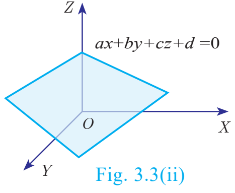

**பொது வடிவம்:** $x,y,z$ என்ற மூன்று மாறிகளில் அமைந்த நேரிய சமன்பாட்டு தொகுப்பின் பொதுவடிவம்

$$
\begin{aligned}a_1x+b_1y+c_1z+d_1&=0\\a_2x+b_2y+c_2z+d_2&=0\\a_3x+b_3y+c_3z+d_3&=0\end{aligned}
$$

இச்சமன்பாட்டு தொகுப்பில் உள்ள ஒவ்வொரு சமன்பாடும் முப்பரிமாண வெளியில் ஒரு தளத்தைக் குறிக்கும். இந்த மூன்று சமன்பாடுகளால் வரையறுக்கப்படும் மூன்று தளங்களும் சந்திக்கும் புள்ளியோ அல்லது பகுதியோ இந்தச் சமன்பாட்டு தொகுப்பின் தீர்வாகும். மூன்று மாறிகளில் அமைந்த நேரிய சமன்பாட்டு தொகுப்பிற்கு, அவை குறிக்கும் தளங்கள் ஒவ்வொன்றும் மற்றவற்றை எவ்வாறு வெட்டுகின்றன என்பதைப் பொருத்து ஒரேயொரு தீர்வு, எண்ணற்ற தீர்வுகள், தீர்வு இல்லை என்ற வகையில் தீர்வுகள் அமையும்.

பின்வரும் படங்கள் தீர்வுகளின் வாய்ப்புகளை விளக்குவதாக அமைந்துள்ளன.

##### மூன்று மாறிகளில் அமைந்த நேரிய சமன்பாட்டு தொகுப்பிற்குத் தீர்வு காணும் படிநிலைகள்

1. கொடுக்கப்பட்ட மூன்று சமன்பாடுகளில் ஏதேனும் இரண்டு சமன்பாடுகளை எடுத்து, பொருத்தமான பூச்சியமற்ற மாறிலியால் பெருக்கி அவற்றில் ஏதேனும் ஒரு மாறியின் கெழுக்களைச் சமப்படுத்துக.
2. சமன்பாடுகளைக் கழித்துக் கெழுக்கள் சமமாக உள்ள மாறியை நீக்குக.
3. வேறு ஒரு சோடி சமன்பாடுகளை எடுத்து அதே மாறியை நீக்குக.
4. தற்போது நாம் இரு மாறிகளில் அமைந்த இரு சமன்பாடுகளைப் பெறுவோம்.
5. இச்சமன்பாடுகளை முந்தைய வகுப்பில் கற்ற முறைகளைப் பயன்படுத்தித் தீர்க்க.
6. மேற்கண்ட படியில் கிடைத்த இரு மாறிகளின் தீர்வை ஏதேனும் ஒரு சமன்பாட்டில் பிரதியிட மூன்றாவது மாறியின் மதிப்பைப் பெறலாம்.

> **குறிப்பு**
>
> - மேற்கண்ட படிநிலைகளில் $0=1$ என்பது போன்ற தவறான முடிவு கிடைக்குமாயின் அந்தச் சமன்பாட்டு தொகுப்பிற்குத் தீர்வு இல்லை.
> - தவறான சமன்பாடுகள் கிடைக்காமல், $0=0$ என்பது போன்ற முற்றொருமை கிடைக்குமாயின் அந்தச் சமன்பாட்டு தொகுப்பிற்கு எண்ணற்ற தீர்வுகள் இருக்கும்.

#### எடுத்துக்காட்டு 3.3

பின்வரும் மூன்று மாறிகளில் அமைந்த நேரிய சமன்பாட்டு தொகுப்பினைத் தீர்க்க. $3x-2y+z=2$, $2x+3y-z=5$, $x+y+z=6$.

**தீர்வு**

$$
\begin{aligned}3x-2y+z&=2 &&\cdots(1)\\2x+3y-z&=5 &&\cdots(2)\\x+y+z&=6 &&\cdots(3)\end{aligned}
$$

(1) மற்றும் (2) ஐக் கூட்ட,

$$
\begin{aligned}3x-2y+z&=2\\2x+3y-z&=5\\5x+y&=7 &&\cdots(4)\end{aligned}
$$

(2) மற்றும் (3) ஐக் கூட்ட,

$$
\begin{aligned}2x+3y-z&=5\\x+y+z&=6\\3x+4y&=11 &&\cdots(5)\end{aligned}
$$

$4\times(4)-(5)$:

$$
\begin{aligned}20x+4y&=28\\3x+4y&=11\\17x&=17\quad\Rightarrow x=1\end{aligned}
$$

$x=1$ என (4)-யில் பிரதியிட, $5+y=7\Rightarrow y=2$.

$x=1,y=2$ என (3)-யில் பிரதியிட, $1+2+z=6$, நாம் பெறுவது $z=3$.

எனவே, $x=1,y=2,z=3$.

#### எடுத்துக்காட்டு 3.4

பள்ளிகளுக்கிடையேயான ஒரு தடகளப் போட்டியில், மொத்த பரிசுகள் 24 கொண்ட தனிநபர் போட்டிகளில் ஒட்டுமொத்தமாக 56 புள்ளிகள் ஒதுக்கப்பட்டுள்ளது. முதலிடம் பெறுபவருக்கு 5 புள்ளிகளும், இரண்டாமிடம் பெறுபவருக்கு 3 புள்ளிகளும், மூன்றாமிடம் பெறுபவருக்கு 1 புள்ளியும் அளிக்கப்படும். மூன்றாமிடம் பெற்றவர்களின் எண்ணிக்கை முதல் மற்றும் இரண்டாமிடம் பெற்றவர்களின் எண்ணிக்கையின் கூடுதலுக்குச் சமம் எனில், முதல், இரண்டாம் மற்றும் மூன்றாமிடம் பெற்றவர்களின் எண்ணிக்கையைக் காண்க.

**தீர்வு** முதலிடம் பெறுபவர்களின் எண்ணிக்கை $x$, இரண்டாமிடம் பெறுபவர்களின் எண்ணிக்கை $y$, மூன்றாமிடம் பெறுபவர்களின் எண்ணிக்கை $z$ என்க.

மொத்த பரிசுகள் $=24$; மொத்த புள்ளிகள் $=56$.

எனவே, மூன்று மாறிகளில் அமைந்த நேரிய சமன்பாடுகள்

$$
\begin{aligned}x+y+z&=24 &&\cdots(1)\\5x+3y+z&=56 &&\cdots(2)\\x+y&=z &&\cdots(3)\end{aligned}
$$

(3) ஐ (1)-யில் பிரதியிட, நாம் பெறுவது, $z+z=24\Rightarrow z=12$.

$\therefore$ (3) ஆனது, $x+y=12$.

$$
\begin{aligned}(2)&\Rightarrow5x+3y=44\\3\times(3)&\Rightarrow3x+3y=36\\&2x=8\quad\text{நாம் பெறுவது, }x=4\end{aligned}
$$

$x=4,z=12$ என (3)-யில் பிரதியிட நாம் பெறுவது, $y=12-4=8$.

எனவே, முதலிடம் பெற்றவர்களின் எண்ணிக்கை 4 ஆகும். இரண்டாமிடம் பெற்றவர்களின் எண்ணிக்கை 8 ஆகும். மூன்றாமிடம் பெற்றவர்களின் எண்ணிக்கை 12 ஆகும்.

#### எடுத்துக்காட்டு 3.5

தீர்க்க $x+2y-z=5$; $x-y+z=-2$; $-5x-4y+z=-11$.

**தீர்வு**

$$
\begin{aligned}x+2y-z&=5 &&\cdots(1)\\x-y+z&=-2 &&\cdots(2)\\-5x-4y+z&=-11 &&\cdots(3)\end{aligned}
$$

(1) மற்றும் (2)-ஐக் கூட்ட,

$$
\begin{aligned}x+2y-z&=5\\x-y+z&=-2\\2x+y&=3 &&\cdots(4)\end{aligned}
$$

(2)-விலிருந்து (3)-ஐக் கழிக்க,

$$
\begin{aligned}x-y+z&=-2\\-5x-4y+z&=-11\\6x+3y&=9\end{aligned}
$$

3-ஆல் வகுக்க, $2x+y=3\quad\cdots(5)$.

(4)-விலிருந்து (5)-ஐக் கழிக்க,

$$
\begin{aligned}2x+y&=3\\2x+y&=3\\0&=0\end{aligned}
$$

இங்கு $0=0$ என்ற முற்றொருமை கிடைக்கிறது.

எனவே, கொடுக்கப்பட்ட சமன்பாட்டு தொகுப்பிற்கு எண்ணற்ற தீர்வுகள் உண்டு.

#### எடுத்துக்காட்டு 3.6

தீர்க்க $3x+y-3z=1$; $-2x-y+2z=1$; $-x-y+z=2$.

**தீர்வு**

$$
\begin{aligned}3x+y-3z&=1 &&\cdots(1)\\-2x-y+2z&=1 &&\cdots(2)\\-x-y+z&=2 &&\cdots(3)\end{aligned}
$$

(1) மற்றும் (2) ஐக் கூட்ட,

$$
\begin{aligned}3x+y-3z&=1\\-2x-y+2z&=1\\ x-z&=2 &&\cdots(4)\end{aligned}
$$

(1) மற்றும் (3) ஐக் கூட்ட,

$$
\begin{aligned}3x+y-3z&=1\\-x-y+z&=2\\2x-2z&=3 &&\cdots(5)\end{aligned}
$$

$(5)-2\times(4)\Rightarrow$

$$
\begin{aligned}2x-2z&=3\\2x-2z&=4\\0&=-1\end{aligned}
$$

இங்கு நாம் $0=-1$ என்ற தவறான முடிவைப் பெறுகிறோம்.

எனவே, இந்தத் தொகுப்பானது ஒருங்கமைவற்றது. மேலும் கொடுக்கப்பட்ட சமன்பாட்டு தொகுப்பிற்குத் தீர்வு இல்லை.

#### எடுத்துக்காட்டு 3.7

தீர்க்க $\dfrac x2-1=\dfrac y6+1=\dfrac z7+2$; $\dfrac y3+\dfrac z2=13$.

**தீர்வு** $\dfrac x2-1=\dfrac y6+1$ எனக் கருதுக.

$$
\frac x2-\frac y6=1+1\Rightarrow\frac{6x-2y}{12}=2\Rightarrow 3x-y=12\quad\cdots(1)
$$

$\dfrac x2-1=\dfrac z7+2$ என்க.

$$
\frac x2-\frac z7=1+2\Rightarrow\frac{7x-2z}{14}=3\Rightarrow 7x-2z=42\quad\cdots(2)
$$

$\dfrac y3+\dfrac z2=13\ \Rightarrow\ \dfrac{2y+3z}{6}=13\Rightarrow 2y+3z=78\quad\cdots(3)$

(2) மற்றும் (3)-விலிருந்து $z$-ஐ நீக்க,

$$
\begin{aligned}(2)\times3&\Rightarrow21x-6z=126\\(3)\times2&\Rightarrow4y+6z=156\\&21x+4y=282\\(1)\times4&\Rightarrow12x-4y=48\\&33x=330\quad\Rightarrow x=10\end{aligned}
$$

$x=10$ என (1)-யில் பிரதியிட, $30-y=12\Rightarrow y=18$.

$x=10$ என (2)-யில் பிரதியிட, $70-2z=42$, $z=14$.

எனவே, $x=10,y=18,z=14$.

#### எடுத்துக்காட்டு 3.8

தீர்க்க: $\dfrac1{2x}+\dfrac1{4y}-\dfrac1{3z}=\dfrac14$; $\dfrac1x=\dfrac1{3y}$; $\dfrac1x-\dfrac1{5y}+\dfrac4z=2\dfrac2{15}$.

**தீர்வு** $\dfrac1x=p$, $\dfrac1y=q$, $\dfrac1z=r$ என்க.

கொடுக்கப்பட்ட சமன்பாடுகளை

$$
\begin{aligned}\frac p2+\frac q4-\frac r3&=\frac14\\p&=\frac q3\\p-\frac q5+4r&=2\frac2{15}=\frac{32}{15}\end{aligned}
$$

என எழுதலாம்.

இவற்றைச் சுருக்கும்போது கிடைப்பது,

$$
\begin{aligned}6p+3q-4r&=3 &&\cdots(1)\\3p&=q &&\cdots(2)\\15p-3q+60r&=32 &&\cdots(3)\end{aligned}
$$

(2)-ஐ (1) மற்றும் (3)-யில் பிரதியிட நாம் பெறுவது,

$$
15p-4r=3\quad\cdots(4)
$$

$$
6p+60r=32\ \Rightarrow\ 3p+30r=16\quad\cdots(5)
$$

(4) மற்றும் (5)-ஐத் தீர்க்க,

$$
\begin{aligned}15p-4r&=3\\15p+150r&=80\\-154r&=-77\quad\Rightarrow r=\frac12\end{aligned}
$$

$r=\dfrac12$ என (4)-யில் பிரதியிட நமக்குக் கிடைப்பது, $15p-2=3\Rightarrow p=\dfrac13$.

(2)$\Rightarrow q=3p\Rightarrow q=1$.

எனவே, $x=\dfrac1p=3$, $y=\dfrac1q=1$, $z=\dfrac1r=2$. அதாவது, $x=3,y=1,z=2$.

#### எடுத்துக்காட்டு 3.9

முதல் எண்ணின் மும்மடங்கு, இரண்டாம் எண் மற்றும் மூன்றாம் எண்ணின் இரு மடங்கு ஆகியவற்றின் கூடுதல் 5. முதல் எண் மற்றும் மூன்றாம் எண்ணின் மும்மடங்கு ஆகியவற்றின் கூடுதலிலிருந்து இரண்டாம் எண்ணின் மும்மடங்கைக் கழிக்க நாம் பெறுவது 2. முதல் எண்ணின் இரு மடங்கு மற்றும் இரண்டாம் எண்ணின் மும்மடங்கு ஆகியவற்றின் கூடுதலிலிருந்து மூன்றாம் எண்ணைக் கழிக்க நாம் பெறுவது 1. இவ்வாறு அமைந்த மூன்று எண்களைக் காண்க.

**தீர்வு** தேவையான மூன்று எண்கள் $x,y,z$ என்க.

கொடுக்கப்பட்ட விவரங்களிலிருந்து நாம் பெறுவது,

$$
\begin{aligned}3x+y+2z&=5 &&\cdots(1)\\x+3z-3y&=2 &&\cdots(2)\\2x+3y-z&=1 &&\cdots(3)\end{aligned}
$$

$$
\begin{aligned}(1)\times1&\Rightarrow3x+y+2z=5\\(2)\times3&\Rightarrow3x-9y+9z=6\\&10y-7z=-1 &&\cdots(4)\end{aligned}
$$

$$
\begin{aligned}(1)\times2&\Rightarrow6x+2y+4z=10\\(3)\times3&\Rightarrow6x+9y-3z=3\\&-7y+7z=7 &&\cdots(5)\end{aligned}
$$

(4) மற்றும் (5)ஐக் கூட்ட,

$$
\begin{aligned}10y-7z&=-1\\-7y+7z&=7\\3y&=6\quad\Rightarrow y=2\end{aligned}
$$

$y=2$ என (5)-யில் பிரதியிட, $-14+7z=7\Rightarrow z=3$.

$y=2$ மற்றும் $z=3$ என (1)-யில் பிரதியிட, $3x+2+6=5$ நாம் பெறுவது $x=-1$.

எனவே, தேவையான எண்கள் $x=-1,y=2,z=3$.

> **சிந்தனைக் களம்**
>
> 1. மூன்று மாறிகளில் அமைந்த ஒரு நேரிய சமன்பாட்டு தொகுப்பினைத் தீர்க்கும்போது கிடைக்கும் தீர்வுகளின் எண்ணிக்கை _____.
> 2. மூன்று தளங்கள் இணையாக இருப்பின் அவை சந்திக்கும் புள்ளிகளின் எண்ணிக்கை _____.

> **முன்னேற்றச் சோதனை**
>
> 1. மூன்று மாறிகளில் அமைந்த நேரிய சமன்பாட்டு தொகுப்பிற்கு ஒரேயொரு தீர்வு கிடைக்க வேண்டுமெனில் தேவைப்படும் குறைந்தபட்ச சமன்பாடுகளின் எண்ணிக்கை _______.
> 2. _______ எனில், நேரிய சமன்பாட்டு தொகுப்பு ஒரு முற்றொருமையைக் கொடுக்கும்.
> 3. _______ எனில், நேரிய சமன்பாட்டு தொகுப்பின் முடிவு பொருளற்றது.

### பயிற்சி 3.1

1. கீழ்க்காணும் மூன்று மாறிகளில் அமைந்த ஒருங்கமை நேரியல் சமன்பாட்டுத் தொகுப்புகளைத் தீர்க்க.

   (i) $x+y+z=5$; $2x-y+z=9$; $x-2y+3z=16$

   (ii) $\dfrac1x-\dfrac2y+4=0$; $\dfrac1y-\dfrac1z+1=0$; $\dfrac2z+\dfrac3x=14$

   (iii) $x+20=\dfrac{3y}2+10=2z+5=110-(y+z)$

2. கீழ்க்காணும் சமன்பாட்டுத் தொகுப்புகளின் தீர்வுகளின் தன்மையைக் காண்க.

   (i) $x+2y-z=6$; $-3x-2y+5z=-12$; $x-2z=3$

   (ii) $2y+z=3(-x+1)$; $-x+3y-z=-4$; $3x+2y+z=-\dfrac12$

   (iii) $\dfrac{y+z}4=\dfrac{z+x}3=\dfrac{x+y}2$; $x+y+z=27$

3. தாத்தா, தந்தை மற்றும் வாணி ஆகிய மூவரின் சராசரி வயது 53. தாத்தாவின் வயதில் பாதி, தந்தையின் வயதில் மூன்றில் ஒரு பங்கு மற்றும் வாணியின் வயதில் நான்கில் ஒரு பங்கு ஆகியவற்றின் கூடுதல் 65. நான்கு ஆண்டுகளுக்கு முன் தாத்தாவின் வயது வாணியின் வயதைப்போல் நான்கு மடங்கு எனில் மூவரின் தற்போதைய வயதைக் காண்க?

4. ஒரு மூவிலக்க எண்ணில், இலக்கங்களின் கூடுதல் 11. இலக்கங்களை வலமாக வரிசை மாற்றினால் புதிய எண் பழைய எண்ணின் ஐந்து மடங்கைவிட 46 அதிகம். பத்தாம் இட இலக்கத்தின் இரு மடங்கோடு நூறாம் இட இலக்கத்தைக் கூட்டினால் ஒன்றாம் இட இலக்கம் கிடைக்கும் எனில், அந்த மூவிலக்க எண்ணைக் காண்க.

5. ஐந்து, பத்து மற்றும் இருபது ரூபாய் நோட்டுகளின் மொத்த மதிப்பு ₹105 மற்றும் மொத்த நோட்டுகளின் எண்ணிக்கை 12. முதல் இரண்டு வகை நோட்டுகளின் எண்ணிக்கையை இடமாற்றம் செய்தால் மொத்த மதிப்பு ₹20 அதிகரிக்கிறது எனில், எத்தனை ஐந்து, பத்து மற்றும் இருபது ரூபாய் நோட்டுகள் உள்ளன?

## 3.3 பல்லுறுப்புக் கோவைகளின் மீ.பெ.வ மற்றும் மீ.சி.ம (GCD and LCM of Polynomials)

### 3.3.1 மீப்பெரு பொது வகுத்தி (அ) மீப்பெரு பொதுக் காரணி (Greatest Common Divisor (or) Highest Common Factor)

நாம் முந்தைய வகுப்பில் இரண்டாம் படி மற்றும் மூன்றாம் படி பல்லுறுப்புக் கோவைகளுக்குக் காரணி முறையில் மீ.பெ.வ (மீ.பொ.கா) காண்பதைக் கற்றோம். தற்போது நாம் நீள் வகுத்தல் முறையில் பல்லுறுப்புக் கோவைகளின் மீ.பெ.வ எவ்வாறு காண்பது எனக் கற்க உள்ளோம்.

இரண்டாம் பாடத்தில் (எண்களும் தொடர்வரிசைகளும்) விவாதித்தபடி, யூக்ளிடின் வகுத்தல் வழிமுறையைப் பயன்படுத்தி இரண்டு மிகை முழுக்களின் மீ.பெ.வ கண்டறிந்த அதே முறையைப் பயன்படுத்தி இரு பல்லுறுப்புக் கோவைகளின் மீ.பெ.வ கண்டறியலாம்.

$f(x)$ மற்றும் $g(x)$ என்ற பல்லுறுப்புக் கோவைகளின் **மீப்பெரு பொது வகுத்தி** காணப் பின்வரும் படிமுறைகள் உதவும்.

**படி 1:** முதலில் $f(x)$ ஐ $g(x)$ ஆல் வகுக்கும்போது $f(x)=g(x)q(x)+r(x)$, இங்கு $q(x)$ என்பது ஈவு, $r(x)$ என்பது மீதி எனக் கிடைக்கிறது. $r(x)$-யின் படி $<q(x)$-யின் படி என இருக்கும்.

**படி 2:** மீதி $r(x)$ பூச்சியமில்லையெனில், $g(x)$ ஐ $r(x)$-ஆல் வகுக்கும்போது $g(x)=r(x)q_1(x)+r_1(x)$ இங்கு $r_1(x)$ என்பது புதிய மீதி ஆகும். $r_1(x)$-யின் படி $<r(x)$-யின் படி, மீதி $r_1(x)$ பூச்சியமெனில், $r(x)$ என்பது தேவையான மீ.பெ.வ ஆகும்.

**படி 3:** $r_1(x)$ பூச்சியமில்லை எனில், இதே செயல்பாட்டை மீதி பூச்சியம் வரும் வரை தொடரவேண்டும். இந்த நிலையில் இருக்கும் வகுத்தியே கொடுக்கப்பட்ட பல்லுறுப்புக் கோவைகளின் மீ.பெ.வ ஆகும்.

$f(x),g(x)$ என்ற பல்லுறுப்புக் கோவைகளின் மீ.பெ.வ-வை மீ.பெ.வ $[f(x),g(x)]$ எனக் குறிக்கலாம்.

> **குறிப்பு**
>
> $f(x)$ மற்றும் $g(x)$ இரண்டும் ஒரே படியில் அமைந்த பல்லுறுப்புக் கோவைகள் எனில் பெரிய எண்ணைத் தலையாயக் கெழுவாகக் கொண்ட கோவையை வகுபடும் கோவையாக எடுக்க வேண்டும். ஒருவேளை, தலையாயக் கெழு சமமாக இருந்தால், அதற்குத் தொடர்ந்த படியில் அமைந்த உறுப்பின் கெழுக்களை ஒப்பிட்டு வகுத்தலைத் தொடரவேண்டும்.

> **முன்னேற்றச் சோதனை**
>
> 1. ஒரே படியுள்ள இரு பல்லுறுப்புக் கோவைகளை வகுக்கும்போது, _________ ஐப் பொறுத்து வகுபடும் மற்றும் வகுக்கும் கோவைகளைத் தீர்மானிக்க வேண்டும்.
> 2. $f(x)$ ஐ $g(x)$ ஆல் வகுக்கும்போது மீதி $r(x)=0$ எனில், $g(x)$ ஆனது அந்த இரு பல்லுறுப்புக் கோவைகளின் _________ என அழைக்கப்படும்.
> 3. $f(x)=g(x)q(x)+r(x)$, எனில், $f(x)$ ஆனது $g(x)$-ஆல் மீதியின்றி வகுபட வேண்டுமெனில், $f(x)$ உடன் _________ ஐக் கூட்ட வேண்டும்.
> 4. $f(x)=g(x)q(x)+r(x)$, எனில், $f(x)$ ஆனது $g(x)$-ஆல் மீதியின்றி வகுபட வேண்டுமெனில், $f(x)$ உடன் _________ ஐக் கழிக்க வேண்டும்.

#### எடுத்துக்காட்டு 3.10

$x^3+x^2-x+2$ மற்றும் $2x^3-5x^2+5x-3$ ஆகிய பல்லுறுப்புக் கோவைகளின் மீ.பெ.வ காண்க.

**தீர்வு** $f(x)=2x^3-5x^2+5x-3$ மற்றும் $g(x)=x^3+x^2-x+2$.

$f(x)$ ஐ $g(x)$ ஆல் வகுக்க (வகுக்கும்போது கிடைக்கும் ஈவு $2$):

$$
\begin{array}{rrrr}2x^3&-5x^2&+5x&-3\\2x^3&+2x^2&-2x&+4\\\hline&-7x^2&+7x&-7\end{array}
$$

$$
-7x^2+7x-7=-7(x^2-x+1)
$$

$-7(x^2-x+1)\ne0$, $-7$ என்பது $g(x)$-யின் ஒரு வகுத்தி அல்ல.

$g(x)=x^3+x^2-x+2$ -ஐ மீதியால் வகுக்க (மாறிலிக் காரணியை விடுத்து), நாம் பெறுவது (ஈவு $x+2$):

$$
\begin{array}{rrrr}x^3&+x^2&-x&+2\\x^3&-x^2&+x&\\\hline&2x^2&-2x&+2\\&2x^2&-2x&+2\\\hline&&0&\end{array}
$$

இங்கு, மீதி பூச்சியம் ஆகும்.

எனவே, மீ.பெ.வ $(2x^3-5x^2+5x-3,\ x^3+x^2-x+2)=x^2-x+1$.

#### எடுத்துக்காட்டு 3.11

$6x^3-30x^2+60x-48$ மற்றும் $3x^3-12x^2+21x-18$ ஆகிய பல்லுறுப்புக் கோவைகளின் மீ.பெ.வ காண்க.

**தீர்வு** $f(x)=6x^3-30x^2+60x-48=6(x^3-5x^2+10x-8)$ மற்றும்

$g(x)=3x^3-12x^2+21x-18=3(x^3-4x^2+7x-6)$ என இருப்பதால், தற்போது நாம் $x^3-5x^2+10x-8$ மற்றும் $x^3-4x^2+7x-6$ என்ற பல்லுறுப்புக் கோவைகளின் மீ.பெ.வ காண்போம்.

$$
\begin{aligned}f(x)&=6x^3-30x^2+60x-48=6(x^3-5x^2+10x-8)\\g(x)&=3x^3-12x^2+21x-18=3(x^3-4x^2+7x-6)\end{aligned}
$$

$x^3-4x^2+7x-6$ ஐ $x^3-5x^2+10x-8$ ஆல் வகுக்க (ஈவு $1$):

$$
\begin{array}{rrrr}x^3&-4x^2&+7x&-6\\x^3&-5x^2&+10x&-8\\\hline&x^2&-3x&+2\end{array}
$$

$x^3-5x^2+10x-8$ ஐ $x^2-3x+2$ ஆல் வகுக்க (ஈவு $x-2$):

$$
\begin{array}{rrrr}x^3&-5x^2&+10x&-8\\x^3&-3x^2&+2x&\\\hline&-2x^2&+8x&-8\\&-2x^2&+6x&-4\\\hline&&2x&-4\end{array}
$$

$$
2x-4=2(x-2)
$$

$x^2-3x+2$ ஐ $x-2$ ஆல் வகுக்க (ஈவு $x-1$):

$$
\begin{array}{rrr}x^2&-3x&+2\\x^2&-2x&\\\hline&-x&+2\\&-x&+2\\\hline&0&\end{array}
$$

இங்கு, மீதி பூச்சியம் ஆகும்.

தலையாயக் கெழுக்கள் 3 மற்றும் 6-ன் மீ.பெ.வ 3 ஆகும்.

எனவே, மீ.பெ.வ $\left[(6x^3-30x^2+60x-48,\ 3x^3-12x^2+21x-18)\right]=3(x-2)$.

### 3.3.2 மீச்சிறு பொது மடங்கு (மீ.சி.ம) (Least Common Multiple (LCM) of Polynomials)

இரண்டு அல்லது அதற்கு மேற்பட்ட பல்லுறுப்பு இயற்கணிதக் கோவைகளின் **மீச்சிறு பொது மடங்கு** ஆனது அவற்றால் வகுபடக் கூடிய மிகப்பெரிய படியைய (அடுக்கை) கொண்ட கோவையாகும்.

பின்வரும் எளிய கோவைகளைக் கருதுவோம் $a^3b^2$, $a^2b^3$.

இந்தக் கோவைகளின் மீ.சி.ம $=a^3b^3$.

காரணிமுறையில் மீ.சி.ம காண,

(i) முதலில் ஒவ்வொரு கோவையையும் அதன் காரணிகளாகப் பிரிக்கவும்.

(ii) அனைத்துக் காரணிகளின் மிக உயர்ந்த அடுக்கே மீ.சி.ம ஆகும்.

(iii) கோவைகளில் எண் கெழுக்கள் இருக்குமானால் அவற்றுக்கு மீ.சி.ம காண்க.

(iv) எண்கெழுக்களின் மீ.சி.ம மற்றும் கோவைகளின் மீ.சி.ம ஆகியவற்றின் பெருக்கற்பலனே தேவையான மீ.சி.ம ஆகும்.

#### எடுத்துக்காட்டு 3.12

பின்வருவனவற்றிற்கு மீ.சி.ம காண்க.

(i) $8x^4y^2$, $48x^2y^4$

(ii) $5x-10$, $5x^2-20$

(iii) $x^4-1$, $x^2-2x+1$

(iv) $x^3-27$, $(x-3)^2$, $x^2-9$

**தீர்வு**

(i) $8x^4y^2$, $48x^2y^4$

முதலில் நாம் எண் கெழுக்களின் மீ.சி.ம காண்போம்.

அதாவது, மீ.சி.ம $(8,48)=2\times2\times2\times6=48$.

இப்போது உறுப்புகளில் உள்ள மாறிகளுக்கு மீ.சி.ம காண்போம்.

அதாவது மீ.சி.ம $(x^4y^2,x^2y^4)=x^4y^4$.

எண்கெழுக்களின் மீ.சி.ம மற்றும் மாறிகளின் மீ.சி.ம ஆகியவற்றின் பெருக்கற்பலன் கொடுக்கப்பட்ட கோவைகளின் மீ.சி.ம ஆகும். எனவே, மீ.சி.ம $(8x^4y^2,48x^2y^4)=48x^4y^4$.

(ii) $(5x-10)$, $(5x^2-20)$

$$
\begin{aligned}5x-10&=5(x-2)\\5x^2-20&=5(x^2-4)=5(x+2)(x-2)\end{aligned}
$$

எனவே, மீ.சி.ம $[(5x-10),(5x^2-20)]=5(x+2)(x-2)$.

(iii) $(x^4-1)$, $x^2-2x+1$

$$
\begin{aligned}x^4-1&=(x^2)^2-1=(x^2+1)(x^2-1)=(x^2+1)(x+1)(x-1)\\x^2-2x+1&=(x-1)^2\end{aligned}
$$

எனவே, மீ.சி.ம $[(x^4-1),(x^2-2x+1)]=(x^2+1)(x+1)(x-1)^2$.

(iv) $x^3-27$, $(x-3)^2$, $x^2-9$

$$
x^3-27=(x-3)(x^2+3x+9);\quad (x-3)^2=(x-3)^2;\quad (x^2-9)=(x+3)(x-3)
$$

எனவே, மீ.சி.ம $[(x^3-27),(x-3)^2,(x^2-9)]=(x-3)^2(x+3)(x^2+3x+9)$.

> **சிந்தனைக் களம்**
>
> கொடுக்கப்பட்ட பல்லுறுப்புக்கோவைகள் $f(x)$ மற்றும் $g(x)$ ஆகியவற்றுக்கான காரணி மரத்தை நிறைவு செய்க. அதிலிருந்து அவற்றின் மீ.பெ.வ மற்றும் மீ.சி.ம காண்க.

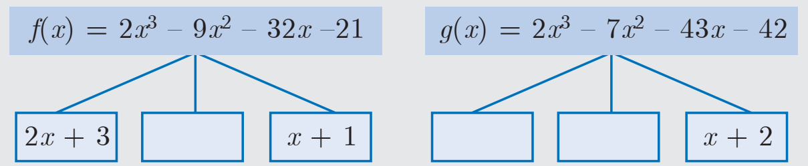

> மீ.பெ.வ $[f(x)$ மற்றும் $g(x)]=$ ______; மீ.சி.ம $[f(x)$ மற்றும் $g(x)]=$ ______.

### பயிற்சி 3.2

1. கீழ்க்காணும் பல்லுறுப்புக் கோவைகளின் மீ.பெ.வ காண்க.

   (i) $x^4+3x^3-x-3$, $x^3+x^2-5x+3$

   (ii) $x^4-1$, $x^3-11x^2+x-11$

   (iii) $3x^4+6x^3-12x^2-24x$, $4x^3+14x^2+8x-8$

   (iv) $3x^3+3x^2+3x+3$, $6x^3+12x^2+6x+12$

2. பின்வருவனவற்றிற்கு மீ.சி.ம காண்க.

   (i) $4x^2y$, $8x^3y^2$

   (ii) $9a^3b^2$, $12a^2b^2c$

   (iii) $16m$, $12m^2n^2$, $8n^2$

   (iv) $p^2-3p+2$, $p^2-4$

   (v) $2x^2-5x-3$, $4x^2-36$

   (vi) $(2x^2-3xy)^2$, $(4x-6y)^3$, $8x^3-27y^3$

### 3.3.3 மீ.சி.ம மற்றும் மீ.பெ.வ ஆகியவற்றுக்கு இடையேயான தொடர்பு (Relationship between LCM and GCD)

12 மற்றும் 18 என்ற எண்களை எடுத்துக்கொள்வோம்.

மீ.சி.ம $(12,18)=36$, மீ.பெ.வ $(12,18)=6$ என நாம் அறிவோம்.

மீ.சி.ம $(12,18)\times$ மீ.பெ.வ $(12,18)=36\times6=216=12\times18$

$\Rightarrow$ மீ.சி.ம $\times$ மீ.பெ.வ ஆனது கொடுக்கப்பட்ட இரு எண்களின் பெருக்கற்பலனாக உள்ளது என்று அறிகிறோம்.

இதைப் போலவே, இரு பல்லுறுப்புக்கோவைகளின் பெருக்கற்பலனானது அவற்றின் மீ.சி.ம மற்றும் மீ.பெ.வ ஆகியவற்றின் பெருக்கற்பலனுக்குச் சமமாகும். அதாவது

$$
f(x)\times g(x)=\text{மீ.சி.ம}[f(x),g(x)]\times\text{மீ.பெ.வ}[f(x),g(x)]
$$

##### உதாரணம்

$f(x)=12(x^2-y^2)$ மற்றும் $g(x)=8(x^3-y^3)$ என்ற கோவைகளை எடுத்துக்கொள்க.

$$
f(x)=12(x^2-y^2)=2^2\times3\times(x+y)(x-y)\quad\cdots(1)
$$

மற்றும்

$$
g(x)=8(x^3-y^3)=2^3\times(x-y)(x^2+xy+y^2)\quad\cdots(2)
$$

(1) மற்றும் (2) $\Rightarrow$

$$
\begin{aligned}\text{மீ.சி.ம}[f(x),g(x)]&=2^3\times3\times(x+y)(x-y)(x^2+xy+y^2)\\&=24\times(x^2-y^2)(x^2+xy+y^2)\\\text{மீ.பெ.வ}[f(x),g(x)]&=2^2\times(x-y)=4(x-y)\end{aligned}
$$

$$
\begin{aligned}\text{மீ.சி.ம}\times\text{மீ.பெ.வ}&=24\times4\times(x^2-y^2)\times(x^2+xy+y^2)\times(x-y)\\\text{மீ.சி.ம}\times\text{மீ.பெ.வ}&=96(x^3-y^3)(x^2-y^2)\quad\cdots(3)\end{aligned}
$$

$f(x)$ மற்றும் $g(x)$-யின் பெருக்கற்பலன்$=12(x^2-y^2)\times8(x^3-y^3)=96(x^2-y^2)(x^3-y^3)\quad\cdots(4)$.

(3) மற்றும் (4) $\Rightarrow$ நாம் பெறுவது, மீ.சி.ம $\times$ மீ.பெ.வ $=f(x)\times g(x)$.

> **சிந்தனைக் களம்**
>
> $f(x)\times g(x)\times r(x)=$ மீ.சி.ம $[f(x),g(x),r(x)]\times$ மீ.பெ.வ $[f(x),g(x),r(x)]$ என ஆகுமா?

### பயிற்சி 3.3

1. பின்வருவனவற்றில் முறையே $f(x)$ மற்றும் $g(x)$ ஆகியவற்றின் மீ.பெ.வ மற்றும் மீ.சி.ம காண்க. மேலும், $f(x)\times g(x)=$ (மீ.சி.ம) $\times$ (மீ.பெ.வ) என்பதைச் சரிபார்க்க.

   (i) $21x^2y$, $35xy^2$

   (ii) $(x^3-1)(x+1)$, $(x^3+1)$

   (iii) $(x^2y+xy^2)$, $(x^2+xy)$

2. கீழ்க்காணும் ஒவ்வொரு சோடி பல்லுறுப்புக் கோவைகளின் மீ.பெ.வ காண்க.

   (i) $a^2+4a-12$, $a^2-5a+6$ இவற்றின் மீ. பொ. வ $a-2$

   (ii) $x^4-27a^3x$, $(x-3a)^2$ இவற்றின் மீ.பொ. வ. $(x-3a)$

3. பின்வரும் ஒவ்வொரு சோடி பல்லுறுப்புக்கோவைகளின் மீ.பெ.வ காண்க.

   (i) $12(x^4-x^3)$, $8(x^4-3x^3+2x^2)$ இவற்றின் மீ.சி.ம $24x^3(x-1)(x-2)$

   (ii) $(x^3+y^3)$, $(x^4+x^2y^2+y^4)$ இவற்றின் மீ.சி.ம $(x^3+y^3)(x^2+xy+y^2)$

4. $p(x),q(x)$ என்ற இரு பல்லுறுப்புக் கோவைகளின் மீ.சி.ம மற்றும் மீ.பெ.வ கொடுக்கப்பட்டுள்ளன. இவற்றிலிருந்து கீழ்க்காண்பனவற்றைக் கண்டறிந்து நிரப்புக.

   | எண் | மீ.சி.ம | மீ.பெ.வ | $p(x)$ | $q(x)$ |
   | --- | --- | --- | --- | --- |
   | (i) | $a^3-10a^2+11a+70$ | $a-7$ | $a^2-12a+35$ | |
   | (ii) | $(x^4-y^4)(x^4+x^2y^2+y^4)$ | $(x^2-y^2)$ | | $(x^4-y^4)(x^2+y^2-xy)$ |

## 3.4 விகிதமுறு கோவைகள் (Rational Expressions)

> **வரையறை**
>
> $\dfrac{p(x)}{q(x)}$ என்ற வடிவில் எழுத இயலும் கோவைகள் **விகிதமுறு கோவைகள்** எனப்படும். இங்கு $p(x)$ மற்றும் $q(x)$ என்பவை பல்லுறுப்புக் கோவைகள் மற்றும் $q(x)\ne0$. விகிதமுறு கோவைகளை இரு பல்லுறுப்புக் கோவைகளின் விகிதமாகக் கருதலாம்.

பின்வருபவை விகிதமுறு கோவைகளுக்கு எடுத்துக்காட்டுகள் ஆகும்.

$$
\frac9x,\quad\frac{2y+1}{y^2-4y+9},\quad\frac{z^3+5}{z-4},\quad\frac a{a+10}
$$

தொலைவு — காலம் சார்ந்த கணக்கீடுகளைக் குறிப்பதற்கும், பல்முனை பணி சார்ந்த கணக்குகளுக்கான மாதிரிகளை வடிவமைத்தலுக்கும், வேலையாளர்கள் (அ) இயந்திரங்களை ஒருங்கிணைத்து ஒரு பணியை முடிப்பதற்குமாகிய எண்ணற்ற சூழல்களில் விகிதமுறு கோவைகள் பயன்படுகின்றன.

### 3.4.1 விகிதமுறு கோவைகளைச் சுருக்குதல் (Reduction of Rational Expression)

$\dfrac{p(x)}{q(x)}$ என்ற விகிதமுறு கோவையில் மீ.பெ.வ $(p(x),q(x))=1$ எனில், அது சுருங்கிய வடிவில் (அ) எளிய வடிவில் உள்ளது எனக் கூறுகிறோம்.

கொடுக்கப்பட்ட ஒரு விகிதமுறு கோவையை எளிய வடிவில் எழுதப் பின்வரும் படிநிலைகளைப் பின்பற்ற வேண்டும்.

(i) தொகுதி மற்றும் பகுதியைக் காரணிப்படுத்த வேண்டும்.

(ii) தொகுதி மற்றும் பகுதிக்குப் பொதுக்காரணி இருக்குமெனில் அவற்றை நீக்குக.

(iii) இப்போது கிடைக்கும் விகிதமுறு கோவை எளிய வடிவில் அமையும்.

#### எடுத்துக்காட்டு 3.13

விகிதமுறு கோவைகளை எளிய வடிவில் சுருக்குக.

(i) $\dfrac{x-3}{x^2-9}$

(ii) $\dfrac{x^2-16}{x^2+8x+16}$

**தீர்வு**

$$
\text{(i)}\quad\frac{x-3}{x^2-9}=\frac{x-3}{(x+3)(x-3)}=\frac1{x+3}
$$

$$
\text{(ii)}\quad\frac{x^2-16}{x^2+8x+16}=\frac{(x+4)(x-4)}{(x+4)^2}=\frac{x-4}{x+4}
$$

### 3.4.2 விலக்கப்பட்ட மதிப்பு (Excluded Value)

எந்த மெய் மதிப்பிற்கு, $\dfrac{p(x)}{q(x)}$ (சுருங்கிய வடிவில்) எனும் விகிதமுறு கோவையை வரையறுக்கப்பட முடியவில்லையோ, அம்மதிப்பு, கொடுக்கப்பட்ட விகிதமுறு கோவையின் “**விலக்கப்பட்ட மதிப்பு**” எனப்படும். $\dfrac{p(x)}{q(x)}$ என்ற எளிய வடிவில் அமைந்த ஒரு விகிதமுறு கோவையின் விலக்கப்பட்ட மதிப்பு காண, அதன் பகுதி $q(x)=0$ என எடுத்துக்கொள்ள வேண்டும்.

எடுத்துக்காட்டாக, $\dfrac5{x-10}$ என்ற விகிதமுறு கோவையை $x=10$ எனும்போது கோவை வரையறுக்க முடியாது. எனவே, $\dfrac5{x-10}$ என்பதன் விலக்கப்பட்ட மதிப்பு 10.

#### எடுத்துக்காட்டு 3.14

பின்வரும் கோவைகளின் விலக்கப்பட்ட மதிப்பு காண்க (இருப்பின்).

(i) $\dfrac{x+10}{8x}$

(ii) $\dfrac{7p+2}{8p^2+13p+5}$

(iii) $\dfrac x{x^2+1}$

**தீர்வு**

(i) $\dfrac{x+10}{8x}$ என்ற கோவையானது $8x=0$ (அ) $x=0$ எனும்போது வரையறுக்க இயலாததாகிறது. ஆகவே விலக்கப்பட்ட மதிப்பு $0$ ஆகும்.

(ii) $\dfrac{7p+2}{8p^2+13p+5}$ என்ற கோவையானது $8p^2+13p+5=0$ அதாவது $(8p+5)(p+1)=0$

$$
(8p+5)(p+1)=0
$$

$\Rightarrow p=\dfrac{-5}8$, $p=-1$ எனும்போது கோவை வரையறுக்க இயலாததாகிறது. எனவே, விலக்கப்பட்ட மதிப்புகள் $\dfrac{-5}8$ மற்றும் $-1$.

(iii) $\dfrac x{x^2+1}$

இங்கு அனைத்து $x$ மதிப்புகளுக்கும் $x^2\ge0$ எனவே $x^2+1\ge0+1=1$. ஆகவே எந்தவொரு $x$ மதிப்பிற்கும் $x^2+1\ne0$. எனவே, $\dfrac x{x^2+1}$ என்ற விகிதமுறு கோவைக்கு விலக்கப்பட்ட மெய் மதிப்புகள் ஏதுமில்லை.

> **சிந்தனைக் களம்**
>
> 1. $x^2-1$ மற்றும் $\tan x=\dfrac{\sin x}{\cos x}$ என்பவை விகிதமுறு கோவைகளா?
> 2. $\dfrac{x^3+x^2-10x+8}{x^4+8x^2-9}$ என்ற கோவையின் விலக்கப்பட்ட மதிப்புகளின் எண்ணிக்கை _______.

### பயிற்சி 3.4

1. பின்வரும் விகிதமுறு கோவைகளை எளிய வடிவிற்குச் சுருக்குக.

   (i) $\dfrac{x^2-1}{x^2+x}$

   (ii) $\dfrac{x^2-11x+18}{x^2-4x+4}$

   (iii) $\dfrac{9x^2+81x}{x^3+8x^2-9x}$

   (iv) $\dfrac{p^2-3p-40}{2p^3-24p^2+64p}$

2. கீழ்க்காணும் கோவைகளுக்கு விலக்கப்பட்ட மதிப்புகள் இருப்பின் அவற்றைக் காண்க.

   (i) $\dfrac y{y^2-25}$

   (ii) $\dfrac t{t^2-5t+6}$

   (iii) $\dfrac{x^2+6x+8}{x^2+x-2}$

   (iv) $\dfrac{x^3-27}{x^3+x^2-6x}$

### 3.4.3 விகிதமுறு கோவைகள் மீதான செயல்கள் (Operations of Rational Expressions)

முந்தைய வகுப்புகளில் நாம் விகிதமுறு எண்களின் மீதான கூட்டல், கழித்தல், பெருக்கல் மற்றும் வகுத்தல் செயல்களைப் படித்துள்ளோம். தற்போது நாம் இவற்றை விகிதமுறு கோவைகளுக்குப் பொதுமைப்படுத்துவோம்.

##### விகிதமுறு கோவைகளின் பெருக்கற்பலன்

$\dfrac{p(x)}{q(x)}$ மற்றும் $\dfrac{r(x)}{s(x)}$ என்பன இரு விகிதமுறு கோவைகள். இங்கு $q(x)\ne0$, $s(x)\ne0$ எனில், அவற்றின் பெருக்கற்பலன்

$$
\frac{p(x)}{q(x)}\times\frac{r(x)}{s(x)}=\frac{p(x)\times r(x)}{q(x)\times s(x)}
$$

இரு விகிதமுறு கோவைகளின் பெருக்கற்பலனை அவற்றின் தொகுதிகளின் பெருக்கற்பலனை பகுதிகளின் பெருக்கற்பலனால் வகுத்து எளிய வடிவில் எழுதுதல் எனவும் கூறலாம்.

##### விகிதமுறு கோவைகளின் வகுத்தல்

$\dfrac{p(x)}{q(x)}$ மற்றும் $\dfrac{r(x)}{s(x)}$ என்பன இரு விகிதமுறு கோவைகள். இங்கு $q(x),s(x)\ne0$ எனில்,

$$
\frac{p(x)}{q(x)}\div\frac{r(x)}{s(x)}=\frac{p(x)}{q(x)}\times\frac{s(x)}{r(x)}=\frac{p(x)\times s(x)}{q(x)\times r(x)}
$$

இதிலிருந்து இரு விகிதமுறு கோவைகளின் வகுத்தலானது, முதல் விகிதமுறு கோவை மற்றும் இரண்டாவது விகிதமுறு கோவையின் தலைகீழி ஆகியவற்றின் பெருக்கற்பலன் ஆகும். இப்பெருக்கற்பலன் எளிய வடிவில் இல்லையெனில் மேலும் எளிய வடிவில் மாற்றி எழுத வேண்டும்.

> **முன்னேற்றச் சோதனை**
>
> பின்வரும் படங்களில் விடுபட்ட கோவையைக் காண்க.

#### எடுத்துக்காட்டு 3.15

(i) $\dfrac{x^3}{9y^2}$ -ஐ $\dfrac{27y}{x^5}$ -ஆல் பெருக்குக.

(ii) $\dfrac{x^4b^2}{x-1}$ -ஐ $\dfrac{x^2-1}{a^4b^3}$ -ஆல் பெருக்குக.

**தீர்வு**

$$
\text{(i)}\quad\frac{x^3}{9y^2}\times\frac{27y}{x^5}=\frac3{x^2y}
$$

$$
\text{(ii)}\quad\frac{x^4b^2}{x-1}\times\frac{x^2-1}{a^4b^3}=\frac{x^4\times b^2}{x-1}\times\frac{(x+1)(x-1)}{a^4\times b^3}=\frac{x^4(x+1)}{a^4b}
$$

#### எடுத்துக்காட்டு 3.16

பின்வருவனவற்றைக் காண்க.

(i) $\dfrac{14x^4}{y}\div\dfrac{7x}{3y^4}$

(ii) $\dfrac{x^2-16}{x+4}\div\dfrac{x-4}{x+4}$

(iii) $\dfrac{16x^2-2x-3}{3x^2-2x-1}\div\dfrac{8x^2+11x+3}{3x^2-11x-4}$

**தீர்வு:**

(i) $\dfrac{14x^4}{y}\div\dfrac{7x}{3y^4}=\dfrac{14x^4}{y}\times\dfrac{3y^4}{7x}=6x^3y^3$.

(ii) $\dfrac{x^2-16}{x+4}\div\dfrac{x-4}{x+4}=\dfrac{(x+4)(x-4)}{x+4}\times\left(\dfrac{x+4}{x-4}\right)=x+4$.

(iii)
$$
\begin{aligned}
\frac{16x^2-2x-3}{3x^2-2x-1}\div\frac{8x^2+11x+3}{3x^2-11x-4}
&=\frac{16x^2-2x-3}{3x^2-2x-1}\times\frac{3x^2-11x-4}{8x^2+11x+3}\\
&=\frac{(8x+3)(2x-1)}{(3x+1)(x-1)}\times\frac{(3x+1)(x-4)}{(8x+3)(x+1)}\\
&=\frac{(2x-1)(x-4)}{(x-1)(x+1)}=\frac{2x^2-9x+4}{x^2-1}.
\end{aligned}
$$

### பயிற்சி 3.5

1. சுருக்குக
   - (i) $\dfrac{4x^2y}{2z^2}\times\dfrac{6xz^3}{20y^4}$
   - (ii) $\dfrac{p^2-10p+21}{p-7}\times\dfrac{p^2+p-12}{(p-3)^2}$
   - (iii) $\dfrac{5t^3}{4t-8}\times\dfrac{6t-12}{10t}$
2. சுருக்குக
   - (i) $\dfrac{x+4}{3x+4y}\times\dfrac{9x^2-16y^2}{2x^2+3x-20}$
   - (ii) $\dfrac{x^3-y^3}{3x^2+9xy+6y^2}\times\dfrac{x^2+2xy+y^2}{x^2-y^2}$
3. சுருக்குக
   - (i) $\dfrac{2a^2+5a+3}{2a^2+7a+6}\div\dfrac{a^2+6a+5}{-5a^2-35a-50}$
   - (ii) $\dfrac{b^2+3b-28}{b^2+4b+4}\div\dfrac{b^2-49}{b^2-5b-14}$
   - (iii) $\dfrac{x+2}{4y}\div\dfrac{x^2-x-6}{12y^2}$
   - (iv) $\dfrac{12t^2-22t+8}{3t}\div\dfrac{3t^2+2t-8}{2t^2+4t}$
4. $x=\dfrac{a^2+3a-4}{3a^2-3}$ மற்றும் $y=\dfrac{a^2+2a-8}{2a^2-2a-4}$ எனில், $x^2y^{-2}$-ன் மதிப்பைக் காண்க.
5. $p(x)=x^2-5x-14$ என்ற பல்லுறுப்புக்கோவையை $q(x)$ எனும் பல்லுறுப்புக் கோவையால் வகுக்க $\dfrac{x-7}{x+2}$ எனும் விடை கிடைக்கிறது எனில், $q(x)$-ஐக் காண்க.

> **செயல்பாடு 1**
>
> (i) ஒரு செவ்வக வடிவப் பூங்காவின் நீளமானது ஓர் எண் மற்றும் அதன் தலைகீழியின் கூடுதலாகும். அதன் அகலமானது அதே எண்ணின் வர்க்கம் மற்றும் அந்த வர்க்க எண்ணின் தலைகீழி ஆகியவற்றின் வித்தியாசம் ஆகும். செவ்வக வடிவப் பூங்காவின் நீளம், அகலம் மற்றும் நீள, அகலங்களின் விகிதம் ஆகியவற்றைக் காண்க.
>
> 
>
> (ii) கொடுக்கப்பட்டுள்ள முக்கோணத்தின் சுற்றளவிற்கும், அதன் பரப்பளவிற்கும் உள்ள விகிதம் காண்க.
>
> 

##### விகிதமுறு கோவைகளின் கூட்டல் மற்றும் கழித்தல்

##### ஒத்த பகுதிகளை உடைய விகிதமுறு கோவைகளின் கூட்டல் மற்றும் கழித்தல்

(i) தொகுதியைக் கூட்டுக (அ) கழிக்க.

(ii) தொகுதியின் கூடுதல் (அ) வித்தியாசத்தைப் பொதுப் பகுதியின் மீது தொகுதியாக எழுதுக.

(iii) இந்த விகிதமுறு கோவையை எளிய வடிவில் எழுதுக.

#### எடுத்துக்காட்டு 3.17

$\dfrac{x^2+20x+36}{x^2-3x-28}-\dfrac{x^2+12x+4}{x^2-3x-28}$ ஐக் காண்க.

**தீர்வு**

$$
\begin{aligned}
\frac{x^2+20x+36}{x^2-3x-28}-\frac{x^2+12x+4}{x^2-3x-28}
&=\frac{(x^2+20x+36)-(x^2+12x+4)}{x^2-3x-28}\\
&=\frac{8x+32}{x^2-3x-28}=\frac{8(x+4)}{(x-7)(x+4)}=\frac8{x-7}.
\end{aligned}
$$

##### மாறுபட்ட பகுதிகளை உடைய விகிதமுறு கோவைகளின் கூட்டல் மற்றும் கழித்தல்

(i) பகுதிகளின் மீச்சிறு பொது மடங்கு காண வேண்டும்.

(ii) படிநிலை (i)-யில் கண்ட மீ.சி.ம-க்குத் தகுந்தவாறு ஒவ்வொரு பின்னத்தின் சமானப் பின்னத்தையும் எழுத வேண்டும். இதனை, தொகுதி மற்றும் பகுதியில் உள்ள கோவைகளை மீ.சி.ம-விற்குத் தேவையான காரணியால் பெருக்குவதன் மூலம் பெறலாம்.

(iii) பகுதிகள் சமானதால், ஒத்த பகுதிகளை உடைய விகிதமுறு கோவைகளைக் கூட்டுவதற்கும், கழிப்பதற்கும் படிநிலைகளைப் பின்பற்ற வேண்டும்.

> **முன்னேற்றச் சோதனை**
>
> 1. முக்கோணத்தின் சுற்றளவுக்கான விகிதமுறு கோவையை எழுதிச் சுருக்குக.
> 2. சுற்றளவு $\dfrac{4x^2+10x-50}{(x-3)(x+5)}$ ஆக உள்ள இணைகரத்தின் அடிப்பக்கம் காண்க.

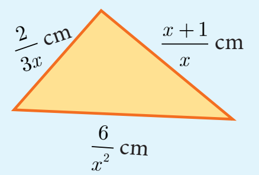

#### எடுத்துக்காட்டு 3.18

சுருக்குக $\dfrac1{x^2-5x+6}+\dfrac1{x^2-3x+2}-\dfrac1{x^2-8x+15}$.

**தீர்வு**

$$
\begin{aligned}
\frac1{x^2-5x+6}+\frac1{x^2-3x+2}-\frac1{x^2-8x+15}
&=\frac1{(x-2)(x-3)}+\frac1{(x-2)(x-1)}-\frac1{(x-5)(x-3)}\\
&=\frac{(x-1)(x-5)+(x-3)(x-5)-(x-1)(x-2)}{(x-1)(x-2)(x-3)(x-5)}\\
&=\frac{(x^2-6x+5)+(x^2-8x+15)-(x^2-3x+2)}{(x-1)(x-2)(x-3)(x-5)}\\
&=\frac{x^2-11x+18}{(x-1)(x-2)(x-3)(x-5)}=\frac{(x-9)(x-2)}{(x-1)(x-2)(x-3)(x-5)}\\
&=\frac{x-9}{(x-1)(x-3)(x-5)}.
\end{aligned}
$$

> **சிந்தனைக் களம் — சரியா, தவறா எனக் கூறுக**
>
> 1. இரு விகிதமுறு கோவைகளின் கூடுதல் எப்போதும் ஒரு விகிதமுறு கோவையே.
> 2. இரு விகிதமுறு கோவைகளின் பெருக்கற்பலன் எப்போதும் ஒரு விகிதமுறு கோவையே.

### பயிற்சி 3.6

1. கூட்டுக (i) $\dfrac{x(x+1)}{x-2}+\dfrac{x(1-x)}{x-2}$ (ii) $\dfrac{x+2}{x+3}+\dfrac{x-1}{x-2}$ (iii) $\dfrac{x^3}{x-y}+\dfrac{y^3}{y-x}$.
2. கழிக்க (i) $\dfrac{(2x+1)(x-2)}{x-4}-\dfrac{2x^2-5x+2}{x-4}$ (ii) $\dfrac{4x}{x^2-1}-\dfrac{x+1}{x-1}$.
3. $\dfrac{2x^3+x^2+3}{(x^2+2)^2}$ -யிலிருந்து $\dfrac1{x^2+2}$ -ஐக் கழிக்க.
4. $\dfrac{x^2+6x+8}{x^3+8}$ -யிலிருந்து எந்த விகிதமுறு கோவையைக் கழித்தால் $\dfrac3{x^2-2x+4}$ என்ற கோவை கிடைக்கும்.
5. $A=\dfrac{2x+1}{2x-1}$ மற்றும் $B=\dfrac{2x-1}{2x+1}$ எனில், $\dfrac1{A-B}-\dfrac{2B}{A^2-B^2}$ காண்க.
6. $A=\dfrac{x}{x+1}$ மற்றும் $B=\dfrac1{x+1}$, எனில், $\dfrac{(A+B)^2+(A-B)^2}{A\div B}=\dfrac{2(x^2+1)}{x(x+1)^2}$ என நிரூபிக்க.
7. ஒரு வேலையை 4 மணி நேரத்தில் பாரி செய்கிறார். யுவன் அதே வேலையை 6 மணி நேரத்தில் செய்கிறார் எனில் இருவரும் சேர்ந்து அந்த வேலையைச் செய்து முடிக்க எத்தனை மணி நேரமாகும்?
8. இனியா 50 கி.கி எடையுள்ள ஆப்பிள்கள் மற்றும் வாழைப்பழங்கள் வாங்கினார். ஒரு கிலோகிராமுக்கு ஆப்பிள்களின் விலை வாழைப்பழங்களின் விலையைப் போல இருமடங்கு ஆகும். வாங்கப்பட்ட ஆப்பிள்களின் விலை ₹1800 மற்றும் வாழைப்பழங்களின் விலை ₹600 எனில், இனியா வாங்கிய இருவகை பழங்களின் எடையை கிலோகிராமில் காண்க.

## 3.5 பல்லுறுப்புக் கோவையின் வர்க்கமூலம் (Square Root of Polynomials)

ஒரு மிகை மெய்யெண்ணின் வர்க்கமூலம் ஆனது, எந்த எண்ணை அதே எண்ணால் பெருக்கினால் கொடுக்கப்பட்ட மிகை மெய்யெண் கிடைக்கிறதோ அந்த எண் ஆகும்.

இதுபோலவே கொடுக்கப்பட்ட கோவை $p(x)$-யின் வர்க்கமூலம் ஆனது எந்தக் கோவையை அதே கோவையால் பெருக்கினால் கொடுக்கப்பட்ட கோவை $p(x)$ கிடைக்கிறதோ, அந்தக் கோவை ஆகும். அதாவது $p(x)$-யின் வர்க்கமூலம் $q(x)$ எனில் $q(x)\cdot q(x)=p(x)$.

ஆகவே, $|q(x)|=\sqrt{p(x)}$ இங்கு $|q(x)|$ என்பது $q(x)$-யின் மட்டு மதிப்பு ஆகும்.

பின்வரும் இரு முறைகளில் கொடுக்கப்பட்ட கோவையின் வர்க்கமூலம் காணலாம்.

(i) காரணிப்படுத்தல் முறை (Factorization method) (ii) வகுத்தல் முறை (Division method)

> **முன்னேற்றச் சோதனை**
>
> 1. $x^2+4x+4$ என்பது ஒரு முழுவர்க்கமாகுமா? 2. $3\sqrt{x}=9$ எனில் $x$-யின் மதிப்பு என்ன?
> 3. $361x^4y^2$-யின் வர்க்க மூலம் ______.
> 4. $\sqrt{a^2x^2+2abx+b^2}=$ ______.
> 5. பல்லுறுப்புக் கோவையானது முழுவர்க்கம் எனில், அதன் காரணிகள் ______ எண்ணிக்கையில் இடம்பெறும் (ஒற்றைப் படை / இரட்டைப் படை).

### 3.5.1 கரணிப்படுத்துதல் முறையில் வர்க்கமூலம் காணுதல் (Square root by factorization method)

#### எடுத்துக்காட்டு 3.19

கீழ்க்காணும் கோவைகளின் வர்க்கமூலம் காண்க.

(i) $256(x-a)^8(x-b)^4(x-c)^{16}(x-d)^{20}$

(ii) $\dfrac{144a^8b^{12}c^{16}}{81f^{12}g^4h^{14}}$

**தீர்வு**

(i) $\sqrt{256(x-a)^8(x-b)^4(x-c)^{16}(x-d)^{20}}=16\left|(x-a)^4(x-b)^2(x-c)^8(x-d)^{10}\right|$.

(ii) $\sqrt{\dfrac{144a^8b^{12}c^{16}}{81f^{12}g^4h^{14}}}=\dfrac43\left|\dfrac{a^4b^6c^8}{f^6g^2h^7}\right|$.

#### எடுத்துக்காட்டு 3.20

கீழ்க்காணும் கோவைகளின் வர்க்கமூலம் காண்க.

(i) $16x^2+9y^2-24xy+24x-18y+9$

(ii) $(6x^2+x-1)(3x^2+2x-1)(2x^2+3x+1)$

(iii) $\left[\sqrt{15}x^2+(\sqrt3+\sqrt{10})x+\sqrt2\right]\left[\sqrt5x^2+(2\sqrt5+1)x+2\right]\left[\sqrt3x^2+(\sqrt2+2\sqrt3)x+2\sqrt2\right]$

**தீர்வு**

(i)
$$
\begin{aligned}
\sqrt{16x^2+9y^2-24xy+24x-18y+9}
&=\sqrt{(4x)^2+(-3y)^2+(3)^2+2(4x)(-3y)+2(-3y)(3)+2(4x)(3)}\\
&=\sqrt{(4x-3y+3)^2}=|4x-3y+3|.
\end{aligned}
$$

(ii)
$$
\begin{aligned}
\sqrt{(6x^2+x-1)(3x^2+2x-1)(2x^2+3x+1)}
&=\sqrt{(3x-1)(2x+1)(3x-1)(x+1)(2x+1)(x+1)}\\
&=|(3x-1)(2x+1)(x+1)|.
\end{aligned}
$$

(iii) முதலில் கொடுக்கப்பட்ட பல்லுறுப்பு கோவையைக் காரணிப்படுத்தலாம்.

$$
\begin{aligned}
\sqrt{15}x^2+(\sqrt3+\sqrt{10})x+\sqrt2
&=\sqrt{15}x^2+\sqrt3x+\sqrt{10}x+\sqrt2\\
&=\sqrt3x(\sqrt5x+1)+\sqrt2(\sqrt5x+1)\\
&=(\sqrt5x+1)\times(\sqrt3x+\sqrt2).
\end{aligned}
$$

$$
\begin{aligned}
\sqrt5x^2+(2\sqrt5+1)x+2
&=\sqrt5x^2+2\sqrt5x+x+2\\
&=\sqrt5x(x+2)+1(x+2)=(\sqrt5x+1)(x+2).
\end{aligned}
$$

$$
\begin{aligned}
\sqrt3x^2+(\sqrt2+2\sqrt3)x+2\sqrt2
&=\sqrt3x^2+\sqrt2x+2\sqrt3x+2\sqrt2\\
&=x(\sqrt3x+\sqrt2)+2(\sqrt3x+\sqrt2)=(x+2)(\sqrt3x+\sqrt2).
\end{aligned}
$$

எனவே,

$$
\begin{aligned}
&\sqrt{\left[\sqrt{15}x^2+(\sqrt3+\sqrt{10})x+\sqrt2\right]\left[\sqrt5x^2+(2\sqrt5+1)x+2\right]\left[\sqrt3x^2+(\sqrt2+2\sqrt3)x+2\sqrt2\right]}\\
&=\sqrt{(\sqrt5x+1)(\sqrt3x+\sqrt2)(\sqrt5x+1)(x+2)(\sqrt3x+\sqrt2)(x+2)}\\
&=|(\sqrt5x+1)(\sqrt3x+\sqrt2)(x+2)|.
\end{aligned}
$$

### பயிற்சி 3.7

1. பின்வருவனவற்றின் வர்க்கமூலம் காண்க.
   - (i) $\dfrac{400x^4y^{12}z^{16}}{100x^8y^4z^4}$
   - (ii) $\dfrac{7x^2+2\sqrt{14}x+2}{x^2-\frac12x+\frac1{16}}$
   - (iii) $\dfrac{121(a+b)^8(x+y)^8(b-c)^8}{81(b-c)^4(a-b)^{12}(b-c)^4}$
2. கீழ்க்காணும் கோவைகளின் வர்க்கமூலம் காண்க.
   - (i) $4x^2+20x+25$
   - (ii) $9x^2-24xy+30xz-40yz+25z^2+16y^2$
   - (iii) $(4x^2-9x+2)(7x^2-13x-2)(28x^2-3x-1)$
   - (iv) $\left(2x^2+\dfrac{17}6x+1\right)\left(\dfrac32x^2+4x+2\right)\left(\dfrac43x^2+\dfrac{11}3x+2\right)$

### 3.5.2 வகுத்தல் முறையில் பல்லுறுப்புக் கோவையின் வர்க்கமூலம் காணல் (Finding the square root of a polynomial by Division method)

கொடுக்கப்பட்ட பல்லுறுப்புக் கோவையின்படி அதிகமாக இருக்கும்போது வகுத்தல் முறையைப் பயன்படுத்தி அக்கோவையின் வர்க்க மூலத்தைக் காணலாம்.

#### எடுத்துக்காட்டு 3.21

$64x^4-16x^3+17x^2-2x+1$ என்பதின் வர்க்கமூலம் காண்க.

**தீர்வு**

$$
\begin{array}{r|l}
&8x^2-x+1\\\hline
8x^2&64x^4-16x^3+17x^2-2x+1\\
&\underline{64x^4}\\
16x^2-x&-16x^3+17x^2\\
&\underline{-16x^3+x^2}\\
16x^2-2x+1&16x^2-2x+1\\
&\underline{16x^2-2x+1}\\
&0
\end{array}
$$

எனவே, $\sqrt{64x^4-16x^3+17x^2-2x+1}=|8x^2-x+1|$.

> **குறிப்பு**
>
> ஒரு பல்லுறுப்புக் கோவையின் வர்க்க மூலத்தைக் காணத் தொடங்குமுன் அப்பல்லுறுப்புக் கோவையின் மாறியின் படியானது இறங்கு வரிசையிலோ அல்லது ஏறு வரிசையிலோ அமைந்துள்ளதா என உறுதிப்படுத்திக் கொள்ளவேண்டும்.

#### எடுத்துக்காட்டு 3.22

$9x^4+12x^3+28x^2+ax+b$ ஆனது ஒரு முழுவர்க்கம் எனில், $a,b$ ஆகியவற்றின் மதிப்புகளைக் காண்க.

**தீர்வு**

$$
\begin{array}{r|l}
&3x^2+2x+4\\\hline
3x^2&9x^4+12x^3+28x^2+ax+b\\
&\underline{9x^4}\\
6x^2+2x&12x^3+28x^2\\
&\underline{12x^3+4x^2}\\
6x^2+4x+4&24x^2+ax+b\\
&\underline{24x^2+16x+16}\\
&(a-16)x+(b-16)
\end{array}
$$

கொடுக்கப்பட்ட பல்லுறுப்புக்கோவை ஒரு முழுவர்க்கம் என்பதால், $a-16=0$, $b-16=0$

எனவே, $a=16$, $b=16$.

### பயிற்சி 3.8

1. வகுத்தல் முறையில் பின்வரும் பல்லுறுப்புக்கோவைகளின் வர்க்கமூலம் காண்க.
   - (i) $x^4-12x^3+42x^2-36x+9$
   - (ii) $37x^2-28x^3+4x^4+42x+9$
   - (iii) $16x^4+8x^2+1$
   - (iv) $121x^4-198x^3-183x^2+216x+144$
2. கீழ்க்காணும் பல்லுறுப்புக்கோவைகள் முழு வர்க்கங்கள் எனில் $a$ மற்றும் $b$-யின் மதிப்பு காண்க.
   - (i) $4x^4-12x^3+37x^2+bx+a$
   - (ii) $ax^4+bx^3+361x^2+220x+100$
3. கீழ்க்காணும் பல்லுறுப்புக்கோவைகள் முழுவர்க்கங்கள் எனில், $m$ மற்றும் $n$-யின் மதிப்பு காண்க.
   - (i) $36x^4-60x^3+61x^2-mx+n$
   - (ii) $x^4-8x^3+mx^2+nx+16$

## 3.6 இருபடிச் சமன்பாடுகள் (Quadratic Equations)

##### அறிமுகம்

லத்தீனில் 'சவசோர்டா' எனும் பெயரால் அறியப்பட்ட கணிதவியலாளர் அப்ரஹாம் பார் ஹியா–நாசி என்பவர் பொ.ஆ. 1145 ஆம் ஆண்டு 'லிபர் எம்படோரம்' எனும் புத்தகத்தை ஐரோப்பாவில் முதன்முதலில் வெளியிட்டார். இந்நூலில் இருபடிச் சமன்பாடுகளின் முழுமையான தீர்வுகள் குறிப்பிடப்பட்டுள்ளது.

மூவாயிரம் ஆண்டுகளுக்கு முற்பட்ட பண்டைய காலம் முதல் இன்றைய காலம் வரை இருபடிச் சமன்பாடுகளைத் தீர்க்கும் பல்வேறு வழிமுறைகளை மக்கள் அறிந்திருந்தனர். குறிப்பாக, சமன்பாட்டில் உள்ள கெழுக்கள், நான்கு அடிப்படைச் செயலிகள் மற்றும் வர்க்க மூலங்களைக் கொண்டு தீர்வைக் கண்டனர். இவ்வாறு பெறும் தீர்வு முறைகள் "படிமுறைத் தீர்வு" என அழைக்கப்படுகிறது. இன்று வரையில், பல்வேறு சமன்பாடுகளின் தீர்வைக் காண ஆழ்ந்த ஆய்வுகள் மேற்கொள்ளப்படுகின்றன.

##### இருபடிக் கோவை

$a_0x^n+a_1x^{n-1}+a_2x^{n-2}+\cdots+a_{n-1}x+a_n$ என்பது $x$ எனும் மாறியில் $n$ படியில் அமைந்த கோவையாகும். மேலும், $a_0\ne0$ மற்றும் $a_1,a_2,\ldots,a_n$ ஆகியவை மெய் எண்கள். $a_0,a_1,a_2,\ldots,a_n$ ஆகியவற்றை கெழுக்கள் என அழைக்கிறோம். குறிப்பாக, கோவையின் படி $2$-ஆக இருப்பின் அதை 'இருபடிக் கோவை' என அழைக்கிறோம். $p(x)$ என்பது இருபடிக்கோவையெனில், அதை $p(x)=ax^2+bx+c$, $a\ne0$ மற்றும் $a,b,c$ ஆகியவற்றை மெய் எண்களாகும்.

### 3.6.1 இருபடி பல்லுறுப்புக் கோவையின் பூச்சியங்கள் (Zeroes of a Quadratic Polynomial)

$p(x)$ என்பது ஒரு பல்லுறுப்பு கோவை என்க. $p(a)=0$ எனில் $x=a$ என்பது $p(x)$-யின் ஒரு பூச்சியமாகும். எடுத்துக்காட்டாக, $p(x)=x^2-2x-8$ எனில் $p(-2)=4+4-8=0$ மற்றும் $p(4)=16-8-8=0$. எனவே, $-2$ மற்றும் $4$ என்பவை $p(x)=x^2-2x-8$ என்ற பல்லுறுப்புக் கோவையின் பூச்சியங்கள் ஆகும்.

### 3.6.2 இருபடிச் சமன்பாட்டின் மூலங்கள் (Roots of a Quadratic Equations)

$ax^2+bx+c=0$, $(a\ne0)$ என்பது ஓர் இருபடிச் சமன்பாடு என்க. $ax^2+bx+c$ என்ற கோவையின் மதிப்பைப் பூச்சியமாக்குகின்ற $x$-யின் மதிப்புகளை $ax^2+bx+c=0$ என்ற **இருபடிச் சமன்பாட்டின் மூலங்கள்** என்கிறோம்.

$ax^2+bx+c=0$ எனில்.

$$
\begin{aligned}
a\left[x^2+\frac bax+\frac ca\right]&=0\\
x^2+\frac bax+\frac ca&=0\quad(\text{ஏனெனில், }a\ne0)\\
x^2+\frac b{2a}(2x)+\left(\frac b{2a}\right)^2-\left(\frac b{2a}\right)^2+\frac ca&=0\\
\Rightarrow x^2+(2x)\left(\frac b{2a}\right)+\left(\frac b{2a}\right)^2&=\frac{b^2}{4a^2}-\frac ca\\
\left(x+\frac b{2a}\right)^2&=\frac{b^2-4ac}{4a^2}\\
x+\frac b{2a}&=\frac{\pm\sqrt{b^2-4ac}}{2a}\\
x&=\frac{-b\pm\sqrt{b^2-4ac}}{2a}.
\end{aligned}
$$

எனவே, $\dfrac{-b+\sqrt{b^2-4ac}}{2a}$ மற்றும் $\dfrac{-b-\sqrt{b^2-4ac}}{2a}$ ஆகியவை $ax^2+bx+c=0$ எனும் இருபடிச் சமன்பாட்டின் மூலங்களாகும்.

### 3.6.3 இருபடிச் சமன்பாட்டை அமைத்தல் (Formation of a Quadratic Equation)

$\alpha$ மற்றும் $\beta$ என்பன $ax^2+bx+c=0$ என்ற இருபடிச் சமன்பாட்டின் மூலங்கள் எனில்

$$
\alpha=\frac{-b+\sqrt{b^2-4ac}}{2a}\quad\text{மற்றும்}\quad\beta=\frac{-b-\sqrt{b^2-4ac}}{2a}.
$$

மேலும்,

$$
\alpha+\beta=\frac{-b+\sqrt{b^2-4ac}-b-\sqrt{b^2-4ac}}{2a}=\frac{-b}a
$$

மற்றும்

$$
\alpha\beta=\left(\frac{-b+\sqrt{b^2-4ac}}{2a}\right)\times\left(\frac{-b-\sqrt{b^2-4ac}}{2a}\right)=\frac ca.
$$

ஆகவே, $(x-\alpha)$ மற்றும் $(x-\beta)$ என்பன $ax^2+bx+c=0$-யின் காரணிகள் ஆகும்.

$$
(x-\alpha)(x-\beta)=0
$$

எனவே, $x^2-(\alpha+\beta)x+\alpha\beta=0$

அதாவது, $x^2-(\text{மூலங்களின் கூடுதல்})x+\text{மூலங்களின் பெருக்கற்பலன}=0$. இதுவே கொடுக்கப்பட்ட இரு மூலங்களைக் கொண்ட இருபடிச் சமன்பாட்டின் பொதுவடிவம் ஆகும்.

> **குறிப்பு**
>
> $ax^2+bx+c=0$ என்ற சமன்பாட்டை $(a\ne0)$ என்பதால் $x^2+\dfrac bax+\dfrac ca=0$ எனவும் எழுதலாம்.

> **செயல்பாடு 2**
>
> உன் வீட்டின் முன் $(2k+6)$ மீ மற்றும் $k$ மீ அளவுகள் கொண்ட ஒரு செவ்வக வடிவப் பூங்கா உள்ளது என்க. படத்தில் உள்ளவாறு $k$ மீ மற்றும் $3$ மீ அளவுகள் கொண்ட ஒரு சிறிய செவ்வகப் பகுதி சமன்படுத்தப்படுகிறது. மீதமுள்ள சமன்படுத்தப்படாத பூங்கா பகுதியின் பரப்பைக் காண்க.
>
> 

#### எடுத்துக்காட்டு 3.23

$x^2+8x+12$ என்ற இருபடி கோவையின் பூச்சியங்களைக் காண்க.

**தீர்வு**

$p(x)=x^2+8x+12=(x+2)(x+6)$ என்க.

$$
p(-2)=4-16+12=0
$$
$$
p(-6)=36-48+12=0
$$

எனவே, $p(x)=x^2+8x+12$-யின் பூச்சியங்கள் $-2$ மற்றும் $-6$ ஆகும்.

#### எடுத்துக்காட்டு 3.24

மூலங்களின் கூடுதல் மற்றும் பெருக்கல் கீழ்க்காணுமாறு கொடுக்கப்பட்டுள்ளன எனில், அவற்றுக்குத் தகுந்த இருபடிச் சமன்பாகளைக் கண்டறிக.

(i) $9,14$ (ii) $-\dfrac72,\dfrac52$ (iii) $-\dfrac35,-\dfrac12$.

**தீர்வு**

(i) மூலங்கள் கொடுக்கப்பட்டால், இருபடிச் சமன்பாட்டின் பொது வடிவம்

$$
x^2-(\text{மூலங்களின் கூடுதல்})x+\text{மூலங்களின் பெருக்கற்பலன்}=0
$$
$$
x^2-9x+14=0.
$$

(ii) $x^2-\left(-\dfrac72\right)x+\dfrac52=0\Rightarrow2x^2+7x+5=0$.

(iii) $x^2-\left(-\dfrac35\right)x+\left(-\dfrac12\right)=0\Rightarrow\dfrac{10x^2+6x-5}{10}=0$

$\Rightarrow10x^2+6x-5=0$.

#### எடுத்துக்காட்டு 3.25

கீழேக் கொடுக்கப்பட்டுள்ள இருபடிச் சமன்பாடுகளின் மூலங்களின் கூடுதல் மற்றும் பெருக்கற்பலன் ஆகியவற்றைக் காண்க.

(i) $x^2+8x-65=0$ (ii) $2x^2+5x+7=0$ (iii) $kx^2-k^2x-2k^3=0$

**தீர்வு** $\alpha$ மற்றும் $\beta$ என்பன கொடுக்கப்பட்ட இருபடிச் சமன்பாட்டின் மூலங்கள் என்க.

(i) $x^2+8x-65=0$ இங்கு, $a=1$, $b=8$, $c=-65$

$$
\alpha+\beta=-\frac ba=-8\quad\text{மற்றும்}\quad\alpha\beta=\frac ca=-65
$$
$$
\alpha+\beta=-8;\quad\alpha\beta=-65
$$

(ii) $2x^2+5x+7=0$ இங்கு, $a=2$, $b=5$, $c=7$

$$
\alpha+\beta=-\frac ba=\frac{-5}2\quad\text{மற்றும்}\quad\alpha\beta=\frac ca=\frac72
$$
$$
\alpha+\beta=-\frac52;\quad\alpha\beta=\frac72
$$

(iii) $kx^2-k^2x-2k^3=0$ இங்கு, $a=k$, $b=-k^2$, $c=-2k^3$

$$
\alpha+\beta=-\frac ba=\frac{-(-k^2)}k=k\quad\text{மற்றும்}\quad\alpha\beta=\frac ca=\frac{-2k^3}k=-2k^2.
$$

### பயிற்சி 3.9

1. மூலங்களின் கூடுதல் மற்றும் பெருக்கற்பலன் கொடுக்கப்பட்டுள்ளது. இருபடிச் சமன்பாடுகளைக் காண்க.
   - (i) $-9,20$
   - (ii) $\dfrac53,4$
   - (iii) $\dfrac{-3}2,-1$
   - (iv) $-(2-a)^2,(a+5)^2$
2. கீழ்க்காணும் இருபடிச் சமன்பாடுகளுக்கு மூலங்களின் கூடுதல் மற்றும் பெருக்கற்பலன் காண்க.
   - (i) $x^2+3x-28=0$
   - (ii) $x^2+3x=0$
   - (iii) $3+\dfrac1a=\dfrac{10}{a^2}$
   - (iv) $3y^2-y-4=0$

### 3.6.4 இருபடிச் சமன்பாட்டைத் தீர்த்தல் (Solving a Quadratic Equation)

ஒன்று, இரண்டு மற்றும் மூன்று மாறிகளில் அமைந்த நேரிய சமன்பாடுகளைத் தீர்க்கும் முறைகளை அறிவோம். சமன்பாட்டைப் பூர்த்தி செய்யும் மாறியின் மதிப்பே கொடுக்கப்பட்ட சமன்பாட்டின் **தீர்வு** என்பதை நினைவு கூர்வோம்.

இந்தப் பகுதியில், இருபடி சமன்பாடுகளைத் தீர்க்கும் மூன்று முறைகள் பற்றி அறிய உள்ளோம். அவையாவன, காரணிப்படுத்தல் முறை, வர்க்கப் பூர்த்தி முறை மற்றும் சூத்திர முறை போன்றவை ஆகும்.

##### காரணிப்படுத்தல் முறையில் இருபடிச் சமன்பாட்டின் தீர்வு காணுதல்

கீழ்க்காணும் படிநிலைகளைப் பயன்படுத்தித் தீர்க்கலாம்.

**படி 1:** கொடுக்கப்பட்ட சமன்பாட்டை $ax^2+bx+c=0$ எனும் பொதுவடிவில் எழுதுக.

**படி 2:** சமன்பாட்டைக் காரணிப்படுத்துக.

**படி 3:** நேரிய காரணிகளின் பெருக்கற்பலனாகச் சமன்பாட்டை எழுதுக.

**படி 4:** நேரிய காரணிகளைப் பூச்சியத்திற்குச் சமனிட்டு, $x$-யின் மதிப்புகளைப் பெறுக.

இந்த $x$ மதிப்புகளே கொடுத்த இருபடிச் சமன்பாட்டின் மூலங்களாக இருக்கும்.

#### எடுத்துக்காட்டு 3.26

தீர்க்க $2x^2-2\sqrt6x+3=0$

**தீர்வு**

$$
\begin{aligned}
2x^2-2\sqrt6x+3&=2x^2-\sqrt6x-\sqrt6x+3\quad(\text{நடு உறுப்பைப் பிரிக்க})\\
&=\sqrt2x(\sqrt2x-\sqrt3)-\sqrt3(\sqrt2x-\sqrt3)=(\sqrt2x-\sqrt3)(\sqrt2x-\sqrt3).
\end{aligned}
$$

காரணிகளைப் பூச்சியத்திற்குச் சமன்படுத்த

$$
(\sqrt2x-\sqrt3)(\sqrt2x-\sqrt3)=0
$$

மூலங்கள் சமம் எனவே, $(\sqrt2x-\sqrt3)^2=0$

$$
\sqrt2x-\sqrt3=0
$$

எனவே, $x=\dfrac{\sqrt3}{\sqrt2}$ என்பது தீர்வாகும்.

#### எடுத்துக்காட்டு 3.27

தீர்க்க $2m^2+19m+30=0$

**தீர்வு**

$$
\begin{aligned}
2m^2+19m+30&=2m^2+4m+15m+30=2m(m+2)+15(m+2)\\
&=(m+2)(2m+15).
\end{aligned}
$$

$(m+2)(2m+15)=0$-யின் காரணிகளைப் பூச்சியத்திற்குச் சமன்படுத்த

$m+2=0\Rightarrow m=-2$ அல்லது $2m+15=0\Rightarrow m=\dfrac{-15}2$

மூலங்கள் $-2$ அல்லது $\dfrac{-15}2$.

இருபடி சமன்பாடு வடிவில் அமைந்திராத சில சமன்பாடுகளைப் பொருத்தமான பிரதியில் மூலம் இருபடி சமன்பாடு வடிவத்திற்குச் சுருக்கித் தீர்வு காணலாம். இந்த வகையிலான எடுத்துக்காட்டுகள் கீழே விளக்கப்பட்டுள்ளன.

#### எடுத்துக்காட்டு 3.28

தீர்க்க $x^4-13x^2+42=0$

**தீர்வு**

$x^2=a$ என்க. ஆகவே, $(x^2)^2-13x^2+42=a^2-13a+42=(a-7)(a-6)$

$(a-7)(a-6)=0\Rightarrow a=7$ அல்லது $6$.

$a=x^2$ எனவே, $x^2=7\Rightarrow x=\pm\sqrt7$ மற்றும் $x^2=6\Rightarrow x=\pm\sqrt6$

எனவே, $x=\pm\sqrt7,\pm\sqrt6$ மூலங்கள் ஆகும்.

#### எடுத்துக்காட்டு 3.29

தீர்க்க $\dfrac{x}{x-1}+\dfrac{x-1}x=2\dfrac12$

**தீர்வு** $y=\dfrac{x}{x-1}$ எனும்போது, $\dfrac1y=\dfrac{x-1}x$ எனக் கிடைக்கும்.

கொடுக்கப்பட்ட சமன்பாட்டில் $y$-யின் மதிப்பைப் பிரதியிட,

$y+\dfrac1y=\dfrac52$ எனக் கிடைக்கும்.

$2y^2-5y+2=0\Rightarrow y=\dfrac12,2$

$\dfrac{x}{x-1}=\dfrac12$ மற்றும் $2x=x-1\Rightarrow x=-1$

$\dfrac{x}{x-1}=2$ மற்றும் $x=2x-2\Rightarrow x=2$

எனவே, $-1$ மற்றும் $2$ ஆகியவை மூலங்கள் ஆகும்.

### பயிற்சி 3.10

1. காரணிப்படுத்தல் முறையைப் பயன்படுத்திப் பின்வரும் இருபடிச் சமன்பாடுகளைத் தீர்க்க.
   - (i) $4x^2-7x-2=0$
   - (ii) $3(p^2-6)=p(p+5)$
   - (iii) $\sqrt{a(a-7)}=3\sqrt2$
   - (iv) $\sqrt2x^2+7x+5\sqrt2=0$
   - (v) $2x^2-x+\dfrac18=0$
2. $n$ அணிகள் பங்குபெறும் ஒரு கையந்துப் (Volley ball) போட்டியில் ஒவ்வோர் அணியும் மற்ற அனைத்து அணிகளோடும் விளையாட வேண்டும். $15$ போட்டிகள் கொண்ட தொடரில் மொத்தப் போட்டிகளின் எண்ணிக்கை $G(n)=\dfrac{n^2-n}2$ எனில், பங்கேற்கும் அணிகளின் எண்ணிக்கை எத்தனை?

##### வர்க்கப் பூர்த்தி முறையில் இருபடிச் சமன்பாட்டின் தீர்வு காணுதல்

கொடுக்கப்பட்ட இருபடிச் சமன்பாட்டின் தீர்வை வர்க்கப் பூர்த்தி முறையில் பெறக் கீழே தரப்பட்டுள்ள படிநிலைகளைப் பின்பற்றுவோம்.

**படி 1:** கொடுக்கப்பட்ட சமன்பாட்டை $ax^2+bx+c=0$ எனும் பொது வடிவில் எழுதுக.

**படி 2:** $x^2$-யின் கெழு $1$ என இல்லை எனில், $x^2$-யின் கெழுவால் சமன்பாட்டின் இருபுறம் வகுத்து $x^2$-யின் கெழுவை $1$ ஆக மாற்றுக.

**படி 3:** மாறிலியை வலப்புறத்தில் எழுதுக.

**படி 4:** $x$-யின் கெழுவில் பாதியின் வர்க்கத்தை இருபுறமும் கூட்டுக.

**படி 5:** இடப்புறத்தை முழு வர்க்கமாகவும், வலப்புறத்தை எளிமைப்படுத்தியும் எழுதுக.

**படி 6:** வர்க்க மூலம் காணுவதன் மூலம் $x$-யின் மதிப்பைக் காண்க.

#### எடுத்துக்காட்டு 3.30

தீர்க்க $x^2-3x-2=0$

**தீர்வு**

$$
\begin{aligned}
x^2-3x-2&=0\\
x^2-3x&=2\quad(\text{மாறிலியை வலப்புறம் மாற்றுக})\\
x^2-3x+\left(\frac32\right)^2&=2+\left(\frac32\right)^2\quad\left(\left[\frac12(x\text{-ன் கெழு})\right]^2\text{-ஐ இருபுறமும் கூட்ட}\right)\\
\left(x-\frac32\right)^2&=\frac{17}4\quad(\text{இடப்புறத்தை முழு வர்க்கமாக எழுத})\\
x-\frac32&=\pm\frac{\sqrt{17}}2\quad(\text{இருபுறமும் வர்க்கமூலம் காண})\\
x&=\frac32+\frac{\sqrt{17}}2\quad\text{அல்லது}\quad x=\frac32-\frac{\sqrt{17}}2.
\end{aligned}
$$

எனவே, $x=\dfrac{3+\sqrt{17}}2,\dfrac{3-\sqrt{17}}2$ தீர்வுகளாகும்.

#### எடுத்துக்காட்டு 3.31

தீர்க்க $2x^2-x-1=0$

**தீர்வு**

$x^2$-யின் கெழுவை $1$-ஆக மாற்ற, சமன்பாட்டை $2$-ஆல் வகுக்கவும்.

$$
\begin{aligned}
x^2-\frac x2-\frac12&=0\\
x^2-\frac x2&=\frac12\\
x^2-\frac x2+\left(\frac14\right)^2&=\frac12+\left(\frac14\right)^2\\
\left(x-\frac14\right)^2&=\frac9{16}=\left(\frac34\right)^2\\
x-\frac14&=\pm\frac34\Rightarrow x=1\text{ அல்லது }-\frac12.
\end{aligned}
$$

##### சூத்திரத்தைப் பயன்படுத்தி இருபடிச் சமன்பாட்டின் தீர்வு காணுதல்

$ax^2+bx+c=0$ எனும் இருபடிச் சமன்பாட்டின் மூலங்கள் காணுதல் சூத்திரம் (பகுதி 3.6.2 இல் தருவிக்கப்பட்டுள்ளது) $x=\dfrac{-b\pm\sqrt{b^2-4ac}}{2a}$ ஆகும்.

> **உங்களுக்குத் தெரியுமா?**
>
> பண்டைய பாபிலோனியர்கள் இருபடிச் சமன்பாடுகளின் மூலங்கள் காணும் சூத்திரங்களை அறிந்திருந்தனர். அவர்கள் செய்யுள் மற்றும் பாடல்கள் மூலமாக மூலங்களைக் காணும் படிகளை எழுதினர். விவசாயத்திற்கான நிலங்களின் அளவுகளைக் கணக்கிட, பாபிலோனியர்கள் இருபடி சமன்பாடுகளைப் பயன்படுத்தினர்.

#### எடுத்துக்காட்டு 3.32

சூத்திர முறையில் $x^2+2x-2=0$-ஐத் தீர்க்கவும்.

**தீர்வு** $x^2+2x-2=0$-ஐ $ax^2+bx+c=0$-உடன் ஒப்பிட,

$$
a=1,\quad b=2,\quad c=-2
$$

$a$, $b$ மற்றும் $c$-யின் மதிப்புகளைச் சூத்திரத்தில் பிரதியிட,

$$
x=\frac{-b\pm\sqrt{b^2-4ac}}{2a}
$$
$$
x=\frac{-2\pm\sqrt{(2)^2-4(1)(-2)}}{2(1)}=\frac{-2\pm\sqrt{12}}2=-1\pm\sqrt3
$$

எனவே, $x=-1+\sqrt3,\;-1-\sqrt3$

#### எடுத்துக்காட்டு 3.33

சூத்திர முறையைப் பயன்படுத்தி $2x^2-3x-3=0$-ஐ தீர்க்கவும்.

**தீர்வு** $2x^2-3x-3=0$-ஐ $ax^2+bx+c=0$ உடன் ஒப்பிட,

$$
a=2,\quad b=-3,\quad c=-3
$$
$$
x=\frac{-b\pm\sqrt{b^2-4ac}}{2a}
$$

$a$, $b$ மற்றும் $c$-யின் மதிப்புகளைச் சூத்திரத்தில் பிரதியிட,

$$
x=\frac{-(-3)\pm\sqrt{(-3)^2-4(2)(-3)}}{2(2)}=\frac{3\pm\sqrt{33}}4
$$

எனவே, $x=\dfrac{3+\sqrt{33}}4,\;\dfrac{3-\sqrt{33}}4$

#### எடுத்துக்காட்டு 3.34

$3p^2+2\sqrt5p-5=0$-ஐ சூத்திர முறையில் தீர்க்கவும்.

**தீர்வு** $3p^2+2\sqrt5p-5=0$-ஐ $ax^2+bx+c=0$ உடன் ஒப்பிட,

$$
a=3,\quad b=2\sqrt5,\quad c=-5.
$$
$$
p=\frac{-b\pm\sqrt{b^2-4ac}}{2a}
$$

$a$, $b$ மற்றும் $c$-யின் மதிப்புகளைச் சூத்திரத்தில் பிரதியிட,

$$
p=\frac{-2\sqrt5\pm\sqrt{\left(2\sqrt5\right)^2-4(3)(-5)}}{2(3)}=\frac{-2\sqrt5\pm\sqrt{80}}6=\frac{-\sqrt5\pm2\sqrt5}3
$$

எனவே, $x=\dfrac{\sqrt5}3,\;-\sqrt5$

#### எடுத்துக்காட்டு 3.35

தீர்க்க $pqx^2-(p+q)^2x+(p+q)^2=0$

**தீர்வு** $pqx^2-(p+q)^2x+(p+q)^2=0$-ஐ $ax^2+bx+c=0$ உடன் ஒப்பிட,

$$
a=pq,\quad b=-(p+q)^2,\quad c=(p+q)^2
$$
$$
x=\frac{-b\pm\sqrt{b^2-4ac}}{2a}
$$

$a$, $b$ மற்றும் $c$-யின் மதிப்புகளைச் சூத்திரத்தில் பிரதியிட,

$$
\begin{aligned}
x&=\frac{-\left[-(p+q)^2\right]\pm\sqrt{\left[-(p+q)^2\right]^2-4(pq)(p+q)^2}}{2pq}\\
&=\frac{(p+q)^2\pm\sqrt{(p+q)^4-4(pq)(p+q)^2}}{2pq}\\
&=\frac{(p+q)^2\pm\sqrt{(p+q)^2\left[(p+q)^2-4pq\right]}}{2pq}\\
&=\frac{(p+q)^2\pm\sqrt{(p+q)^2(p^2+q^2+2pq-4pq)}}{2pq}\\
&=\frac{(p+q)^2\pm\sqrt{(p+q)^2(p-q)^2}}{2pq}\\
&=\frac{(p+q)^2\pm(p+q)(p-q)}{2pq}=\frac{(p+q)\{(p+q)\pm(p-q)\}}{2pq}
\end{aligned}
$$

எனவே, $x=\dfrac{p+q}{2pq}\times2p,\;\dfrac{p+q}{2pq}\times2q\Rightarrow x=\dfrac{p+q}q,\;\dfrac{p+q}p$

> **செயல்பாடு 3**
>
> மீன்களுக்கு (சமன்பாடு) தகுந்த உணவுகளை (மூலங்கள்) அளியுங்களேன்! எந்த மீனுக்கு உணவு அளிக்க முடியாது?
>
> 

### பயிற்சி 3.11

1. கொடுக்கப்பட்ட இருபடிச் சமன்பாடுகளை வர்க்கப் பூர்த்தி முறையில் தீர்க்க.
   - (i) $9x^2-12x+4=0$
   - (ii) $\dfrac{5x+7}{x-1}=3x+2$
2. சூத்திர முறையைப் பயன்படுத்திப் பின்வரும் இருபடிச் சமன்பாடுகளைத் தீர்க்க.
   - (i) $2x^2-5x+2=0$
   - (ii) $\sqrt2f^2-6f+3\sqrt2=0$
   - (iii) $3y^2-20y-23=0$
   - (iv) $36y^2-12ay+(a^2-b^2)=0$
3. சாய்வு தளத்தில் $t$-வினாடிகளில் ஒரு பந்து கடக்கும் தூரம் $d=t^2-0.75t$ அடிகளாகும். $11.25$ அடி தொலைவைக் கடக்க பந்து எடுத்துக்கொள்ளும் நேரம் எவ்வளவு?

### 3.6.5 இருபடிச் சமன்பாடுகள் சார்ந்த கணக்குகளுக்குத் தீர்வு காணுதல் (Solving Problems Involving Quadratic Equations)

> **சமன்பாட்டைத் தீர்க்கும் படிகள்**
>
> **படி 1** சொற்றொடர்களால் அமைந்த கணக்கை இருபடிச் சமன்பாடாக மாற்றுக.
>
> **படி 2** மேலே குறிப்பிட்ட மூன்று முறைகளில் ஏதேனும் ஒன்றைப் பயன்படுத்தி இருபடிச் சமன்பாட்டைத் தீர்க்க.
>
> **படி 3** கணித முறையில் பெற்ற விடையை வினாவிற்கு ஏற்ப சொற்றொடரில் மாற்றி எழுதுக.

#### எடுத்துக்காட்டு 3.36

குமரனின் தற்போதைய வயதின் இருமடங்கோ ஒன்றைக் கூட்டினால் கிடைப்பது, குமரனின் இரண்டாண்டுகளுக்கு முந்தைய வயதையும் அவரின் $4$ ஆண்டுகளுக்குப் பிந்தைய வயதையும் பெருக்கக் கிடைப்பதற்குச் சமம் எனில், அவரின் தற்போதைய வயதைக் காண்க.

**தீர்வு** குமரனின் தற்போதைய வயது $x$ ஆண்டுகள் என்க.

$2$ ஆண்டுகளுக்கு முன் வயது $=(x-2)$ ஆண்டுகள்.

$4$ ஆண்டுகளுக்குப் பின் வயது $=(x+4)$ ஆண்டுகள்.

கொடுத்த தகவல்படி, $(x-2)(x+4)=1+2x$

$$
x^2+2x-8=1+2x\Rightarrow(x-3)(x+3)=0\Rightarrow x=\pm3
$$

வயது எண்ணாக இருக்க முடியாது.

எனவே, குமரனின் தற்போதைய வயது $3$ ஆண்டுகள்.

#### எடுத்துக்காட்டு 3.37

$17$ அடி நீளமுள்ள ஓர் ஏணி ஒரு சுவரின் மீது சாய்ந்துள்ளது. தரை, ஏணி மற்றும் செங்குத்துச் சுவர் மூன்றும் ஒரு செங்கோண முக்கோணத்தை உருவாக்குகின்றன. சுவரின் அடியிலிருந்து ஏணியின் அடி முனை வரை உள்ள தூரம் ஏணியின் மேல் முனை சுவரைத் தொடும் உயரத்தைவிட $7$ அடி குறைவு எனில், சுவரின் உயரம் காண்க.

**தீர்வு** சுவரின் உயரம் $AB=x$ அடி என்க

கொடுக்கப்பட்ட தகவலின்படி $BC=(x-7)$ அடி

செங்கோண முக்கோணம் $ABC$, $AC=17$ அடி $BC=(x-7)$ அடி

பித்தாகரஸ் தேற்றத்தின்படி, $AC^2=AB^2+BC^2$

$$
(17)^2=x^2+(x-7)^2;\quad289=x^2+x^2-14x+49
$$

$x^2-7x-120=0\Rightarrow(x-15)(x+8)=0$

ஆகவே, $x=15$ அல்லது $-8$

உயரம் குறை எண்ணாக இருக்க இயலாது. எனவே சுவரின் உயரம் $15$ அடி ஆகும்.

#### எடுத்துக்காட்டு 3.38

ஓர் இடத்தில் $x^2$ அன்னங்கள் கூட்டமாக இருந்தன. மேகங்கள் கூடியதால், $10x$ அன்னங்கள் ஏரிக்குச் சென்றன; எட்டில் ஒரு பங்கு தோட்டத்திற்குப் பறந்தன. மீதமுள்ள மூன்று ஜோடிகள் நீரில் விளையாடின எனில், மொத்த அன்னங்களின் எண்ணிக்கையைக் காண்க?

**தீர்வு** மந்தையில் மொத்தம் $x^2$ அன்னங்கள் உள்ளன. கொடுக்கப்பட்ட தகவல்களின்படி,

$$
x^2-10x-\frac18x^2=6\Rightarrow7x^2-80x-48=0
$$
$$
x=\frac{-b\pm\sqrt{b^2-4ac}}{2a}=\frac{80\pm\sqrt{6400-4(7)(-48)}}{14}=\frac{80\pm88}{14}
$$

எனவே, $x=12,\;-\dfrac47$.

அன்னங்களின் எண்ணிக்கை $x=-\dfrac47$ ஆக இருக்க முடியாது.

ஆகையால், $x=12$. மொத்த அன்னங்களின் எண்ணிக்கை $x^2=144$ ஆகும்.

#### எடுத்துக்காட்டு 3.39

சென்னையிலிருந்து விருதாசலத்திற்கு $240$ கி.மீ தூரத்தைக் கடக்க ஒரு பயணிகள் தொடர்வண்டிக்கு ஒரு விரைவு தொடர்வண்டியைவிட $1$ மணி நேரம் கூடுதலாகத் தேவைப்படுகிறது. விரைவு தொடர்வண்டியின் வேகம், பயணிகள் தொடர்வண்டியின் வேகத்தைவிட $20$ கி.மீ/மணி அதிகம் எனில், இரு தொடர்வண்டிகளின் சராசரி வேகங்களைக் கணக்கிடுக.

**தீர்வு** பயணிகள் தொடர்வண்டியின் சராசரி வேகம் $x$ கி.மீ/மணி என்க.

தற்போது, விரைவு தொடர்வண்டியின் சராசரி வேகம் $(x+20)$ கி.மீ/மணி ஆகும்.

$240$ கி.மீ கடக்கப் பயணிகள் தொடர்வண்டி எடுக்கும் நேரம் $=\dfrac{240}x$ மணி

$240$ கி.மீ கடக்க விரைவு தொடர்வண்டி எடுக்கும் நேரம் $=\dfrac{240}{x+20}$ மணி

கொடுக்கப்பட்ட தகவலின்படி,

$$
\frac{240}x=\frac{240}{x+20}+1
$$
$$
240\left[\frac1x-\frac1{x+20}\right]=1\Rightarrow240\left[\frac{x+20-x}{x(x+20)}\right]=1\Rightarrow4800=(x^2+20x)
$$
$$
x^2+20x-4800=0\Rightarrow(x+80)(x-60)=0\Rightarrow x=-80\text{ or }60
$$

வேகம் ஒரு குறை எண்ணாக இருக்க முடியாது.

எனவே, பயணிகள் தொடர்வண்டியின் சராசரி வேகம் $60$ கி.மீ/மணி

எனவே, விரைவு தொடர்வண்டியின் சராசரி வேகம் $80$ கி.மீ/மணி

### பயிற்சி 3.12

1. ஓர் எண் மற்றும் அதன் தலைகீழ் ஆகியவற்றின் வித்தியாசம் $\dfrac{24}5$ எனில், அந்த எண்ணைக் காண்க.
2. $12$ மீ $\times16$ மீ அளவுகள் கொண்ட ஒரு செவ்வக வடிவப் பூங்காவைச் சுற்றி $w$ மீட்டர் அகலமுள்ள நடைபாதை அமைக்கப்படும்போது, அதன் மொத்தப் பரப்பு $285$ சதுர மீட்டராக அதிகரிக்கிறது. நடைபாதையின் அகலத்தைக் கணக்கிடுக.
3. ஒரு பேருந்து $90$ கி.மீ தொலைவைச் சீரான வேகத்தில் கடக்கிறது. அதன் வேகம் $15$ கி.மீ/மணி அதிகரிக்கப்பட்டால், பயண நேரம் $30$ நிமிடங்கள் குறைகிறது எனில், பேருந்தின் வேகத்தைக் கணக்கிடுக.
4. ஒரு பெண்ணின் வயது அவள் சகோதரியின் வயதைப் போல இருமடங்கு ஆகும். ஐந்து ஆண்டுகளுக்குப் பின் இரு வயதுகளின் பெருக்கற்பலன் $375$ எனில், சகோதரிகளின் தற்போதைய வயதைக் காண்க.
5. $20$ மீ விட்டமுள்ள ஒரு வட்டத்தின் பரிதியில் கம்பம் ஒன்று பொருத்தப்பட வேண்டும். ஏதேனும் ஒரு விட்டத்தின் இரு முனைகளில் பொருத்தப்பட்டுள்ள $P$ மற்றும் $Q$ எனும் கதவுகளிலிருந்து கம்பத்திற்கு இடைப்பட்ட தொலைவுகளின் வித்தியாசம் $4$ மீ உள்ளவாறு கம்பம் நடமுடியுமா? ஆம் எனில், இரு கதவுகளிலிருந்து கம்பத்தை எவ்வளவு தொலைவில் பொருத்த வேண்டும்?
6. $2x^2$ எண்ணிக்கையுடைய கருப்பு தேனீக்களின் கூட்டத்திலிருந்து கூட்டத்தின் பாதியின் வர்க்கமூல எண்ணிக்கை கொண்ட தேனீக்கள் ஒரு மரத்துக்குச் செல்கின்றன. மீண்டும் கூட்டத்திலிருந்து ஒன்பதில் எட்டுப் பங்கு கொண்ட தேனீக்கள் அதே மரத்துக்குச் செல்கின்றன. மீதமுள்ள இரண்டு தேனீக்கள் மணம் கமழும் மலரில் சிக்கிக் கொண்டன எனில், மொத்தத் தேனீக்களின் எண்ணிக்கை எத்தனை?
7. $70$ மீ இடைப்பட்ட தொலைவில் உள்ள இரு அரங்குகளில் இசை ஒலிக்கப்படுகிறது. முதல் அரங்கில் $4$ பாடகர்களும் இரண்டாம் அரங்கில் $9$ பாடகர்களும் பாடுகிறார்கள். சம ஒலி அளவில் இசையைக் கேட்க விரும்பும் ஒரு நபர் இரு அரங்குகளுக்கு இடையில் எங்கு நிற்க வேண்டும்? (குறிப்பு: ஒலி அளவுகளின் விகிதம், இடைப்பட்ட தொலைவுகளின் வர்க்கத்தின் விகிதம் சமம்).
8. $10$ மீ பக்க அளவுள்ள சதுர வடிவ நிலத்தின் நடுவில், ஒரு சதுர மலர் மேடையும் அதனைச் சுற்றிச் சீரான அகலமுள்ள சரளை பாதையும் அமைக்கப்படுகிறது. ஒரு சதுர மீட்டர் மேடை அமைக்க முறையே ₹3 மற்றும் ₹4 என்றவாறு மொத்தச் செலவு ₹364 எனில், சரளை பாதையின் அகலம் என்ன?
9. ஒரு செங்கோண முக்கோணத்தின் கர்ணம் $25$ செ.மீ மற்றும் அதன் சுற்றளவு $56$ செ.மீ எனில், முக்கோணத்தின் சிறிய பக்கத்தின் அளவைக் காண்க.

### 3.6.6 இருபடிச் சமன்பாட்டின் மூலங்களின் தன்மை (Nature of Roots of a Quadratic Equation)

$ax^2+bx+c=0$, $a\ne0$ எனும் இருபடிச் சமன்பாட்டின் மூலங்களை $x=\dfrac{-b\pm\sqrt{b^2-4ac}}{2a}$ எனும் சூத்திரத்தைப் பயன்படுத்திக் காணலாம். இருபடிச் சமன்பாட்டின் '**தன்மைகாட்டி**' [குறியீடு $\Delta$] என அழைக்கப்படும். $b^2-4ac$ மூலங்களின் தன்மையைக் கீழ்க்காணுமாறு தெரிவிக்கிறது.

| தன்மைகாட்டியின் மதிப்பு $\Delta=b^2-4ac$ | மூலங்களின் தன்மை |
| --- | --- |
| $\Delta>0$ | மூலங்கள் மெய் மற்றும் சமமில்லை |
| $\Delta=0$ | மூலங்கள் மெய் மற்றும் சமம் |
| $\Delta<0$ | மெய் மூலம் இல்லை |

#### எடுத்துக்காட்டு 3.40

பின்வரும் இருபடிச் சமன்பாடுகளின் மூலங்களின் தன்மையைக் காண்க.

(i) $x^2-x-20=0$ (ii) $9x^2-24x+16=0$ (iii) $2x^2-2x+9=0$

**தீர்வு**

(i) $x^2-x-20=0$

இங்கு, $a=1$, $b=-1$, $c=-20$

தன்மைகாட்டி, $\Delta=b^2-4ac$

$$
\Delta=(-1)^2-4(1)(-20)=81
$$

$\Delta=81>0$. எனவே, சமன்பாட்டின் மூலங்கள் மெய் மற்றும் சமமில்லை.

(ii) $9x^2-24x+16=0$

இங்கு, $a=9$, $b=-24$, $c=16$

தன்மைகாட்டி, $\Delta=b^2-4ac=(-24)^2-4(9)(16)=0$

$\Delta=0$.

எனவே, சமன்பாட்டின் மூலங்கள் மெய் மற்றும் சமம்.

(iii) $2x^2-2x+9=0$

இங்கு, $a=2$, $b=-2$, $c=9$

தன்மைகாட்டி, $\Delta=b^2-4ac=(-2)^2-4(2)(9)=-68$

$\Delta=-68<0$.

எனவே, இருபடிச் சமன்பாட்டிற்கு மெய் மூலங்கள் இல்லை.

#### எடுத்துக்காட்டு 3.41

(i) இருபடி சமன்பாடு $kx^2-(8k+4)x+81=0$-யின் மூலங்கள் மெய் மற்றும் சமம் எனில், '$k$'-யின் மதிப்பைக் காண்க.

(ii) $(k+9)x^2+(k+1)x+1=0$-யின் மூலங்கள் மெய் இல்லை எனில், $k$-யின் மதிப்பைக் காண்க.

**தீர்வு**

(i) $kx^2-(8k+4)x+81=0$

சமன்பாட்டின் மூலங்கள் மெய் மற்றும் சமம். எனவே, $\Delta=0$.

அதாவது, $b^2-4ac=0$

இங்கு, $a=k$, $b=-(8k+4)$, $c=81$

எனவே,

$$
\left[-(8k+4)\right]^2-4(k)(81)=0
$$
$$
64k^2+64k+16-324k=0
$$
$$
64k^2-260k+16=0
$$

$4$ஆல் வகுக்க, $16k^2-65k+4=0$

$(16k-1)(k-4)=0\Rightarrow k=\dfrac1{16}$ அல்லது $k=4$

(ii) $(k+9)x^2+(k+1)x+1=0$

சமன்பாட்டின் மூலங்கள் மெய் இல்லை. எனவே, $\Delta<0$

அதாவது, $b^2-4ac<0$

இங்கு, $a=k+9$, $b=k+1$, $c=1$

எனவே,

$$
(k+1)^2-4(k+9)(1)<0
$$
$$
k^2+2k+1-4k-36<0
$$
$$
k^2-2k-35<0
$$
$$
(k+5)(k-7)<0
$$

எனவே, $-5<k<7$ $\{\alpha<\beta$ $(x-\alpha)(x-\beta)<0$ எனில், $\alpha<x<\beta\}$.

#### எடுத்துக்காட்டு 3.42

$x^2(p^2+q^2)+2x(pr+qs)+r^2+s^2=0$ எனும் சமன்பாட்டிற்கு மெய் மூலங்கள் இல்லை எனக் காட்டுக. மேலும் $ps=qr$ எனில், மூலங்கள் மெய்யானவை மற்றும் சமம் என நிறுவுக.

**தீர்வு** கொடுக்கப்பட்ட இருபடிச் சமன்பாடு, $x^2(p^2+q^2)+2x(pr+qs)+r^2+s^2=0$

இங்கு, $a=p^2+q^2$, $b=2(pr+qs)$, $c=r^2+s^2$

தன்மைகாட்டி,

$$
\begin{aligned}
\Delta=b^2-4ac&=\left[2(pr+qs)\right]^2-4(p^2+q^2)(r^2+s^2)\\
&=4\left[p^2r^2+2pqrs+q^2s^2-p^2r^2-p^2s^2-q^2r^2-q^2s^2\right]\\
&=4\left[-p^2s^2+2pqrs-q^2r^2\right]=-4\left[(ps-qr)^2\right]<0\tag{1}
\end{aligned}
$$

$\Delta=b^2-4ac<0$, எனவே, மூலங்கள் மெய் இல்லை.

மேலும், $ps=qr$ எனில், $\Delta=-4\left[ps-qr\right]^2=-4\left[qr-qr\right]^2=0$ ((1)-ஐப் பயன்படுத்தி)

ஆகவே, $\Delta=0$ எனவே, $ps=qr$ எனில், மூலங்கள் மெய்யாகவும், சமமாகவும் இருக்கும்.

### பயிற்சி 3.13

1. பின்வரும் இருபடிச் சமன்பாடுகளின் மூலங்களின் தன்மையைக் கூறுக.
   - (i) $15x^2+11x+2=0$
   - (ii) $x^2-x-1=0$
   - (iii) $\sqrt2t^2-3t+3\sqrt2=0$
   - (iv) $9y^2-6\sqrt2y+2=0$
   - (v) $9a^2b^2x^2-24abcdx+16c^2d^2=0$, $a\ne0$, $b\ne0$
2. கொடுக்கப்பட்ட சமன்பாடுகளின் மூலங்கள் மெய் மற்றும் சமம் எனில், $k$-யின் மதிப்பைக் காண்க.
   - (i) $(5k-6)x^2+2kx+1=0$
   - (ii) $kx^2+(6k+2)x+16=0$
3. $(a-b)x^2+(b-c)x+(c-a)=0$ என்ற சமன்பாட்டின் மூலங்கள் மெய் மற்றும் சமம் எனில், $b,a,c$ ஆகியவை ஒரு கூட்டுத் தொடர்வரிசையை அமைக்கும் என நிறுவுக.
4. $a$ மற்றும் $b$ மெய் எண்கள் எனில், $(a-b)x^2-6(a+b)x-9(a-b)=0$-யின் மூலங்கள் மெய் மற்றும் சமமில்லை என நிரூபிக்க.
5. $(c^2-ab)x^2-2(a^2-bc)x+b^2-ac=0$ என்ற சமன்பாட்டில் மூலங்கள் சமம் மற்றும் மெய் எனில், $a=0$ அல்லது $a^3+b^3+c^3=3abc$ என நிரூபி.

> **சிந்தனைக் களம்**
>
> கீழ்க்காணும் பல்லுறுப்புக் கோவை முழு வர்க்கமாகுமாறு, விடுபட்ட கட்டங்களை நிரப்புக
>
> (i) $x^2+14x+\boxed{\phantom{000}}$ (ii) $x^2-24x+\boxed{\phantom{000}}$ (iii) $p^2+2qp+\boxed{\phantom{000}}$

### 3.6.7 இருபடிச் சமன்பாட்டின் மூலங்களுக்கும் கெழுக்களுக்கும் இடையேயுள்ள தொடர்பு (The Relation between Roots and Coefficient of a Quadratic Equation)

$ax^2+bx+c=0$ எனும் இருபடிச் சமன்பாட்டின் மூலங்கள் $\alpha$ மற்றும் $\beta$ எனில்,

$$
\alpha=\frac{-b+\sqrt{b^2-4ac}}{2a},\quad\beta=\frac{-b-\sqrt{b^2-4ac}}{2a}
$$

3.6.3 இலிருந்து,

$$
\alpha+\beta=\frac{-b}a=\frac{-x\text{-யின் கெழு}}{x^2\text{-யின் கெழு}};\quad\alpha\beta=\frac ca=\frac{\text{மாறிலி உறுப்பு}}{x^2\text{-யின் கெழு}}
$$

> **முன்னேற்றச் சோதனை**
>
> | இருபடிச் சமன்பாடு | $x^2$ மற்றும் $x$-யின் கெழுக்கள் மற்றும் மாறிலி | மூலங்களின் கூடுதல் $\alpha+\beta$ | மூலங்களின் பெருக்கற்பலன் $\alpha\beta$ | $-\dfrac ba$ | $\dfrac ca$ | முடிவு |
> | --- | --- | --- | --- | --- | --- | --- |
> | $4x^2-9x+2=0$ | | | | | | |
> | $\left(x-\dfrac45\right)^2=0$ | | | | | | |
> | $2x^2-15x-27=0$ | | | | | | |

#### எடுத்துக்காட்டு 3.43

$x^2-13x+k=0$ என்ற சமன்பாட்டின் மூலங்களின் வித்தியாசம் $17$ எனில், $k$-யின் மதிப்புக் காண்க.

**தீர்வு** $x^2-13x+k=0$ இங்கு, $a=1$, $b=-13$, $c=k$

$\alpha$ மற்றும் $\beta$ சமன்பாட்டின் மூலங்கள் என்க.

$$
\alpha+\beta=\frac{-b}a=\frac{-(-13)}1=13\tag{1}
$$
$$
\alpha-\beta=17\tag{2}\text{ (கொடுக்கப்பட்டது)}
$$

$(1)+(2)\Rightarrow2\alpha=30$ எனவே, $\alpha=15$

$\alpha=15$ ஐ $(1)$-யில் பிரதியிட,

$15+\beta=13\Rightarrow\beta=-2$

ஆனால், $(2)\Rightarrow\alpha\beta=\dfrac ca=\dfrac k1\Rightarrow15\times(-2)=k$ எனவே, $k=-30$.

> **சிந்தனைக் களம்**
>
> $ax^2+bx+c=0$ என்ற இருபடி சமன்பாட்டில் நிலைத்த மதிப்பு $0$ வாக இருந்தால் இதன் மூலங்களின் கூடுதல் மற்றும் பெருக்கற்பலன் _______ மற்றும் _______ ஆகும்.

#### எடுத்துக்காட்டு 3.44

$x^2+7x+10=0$ எனும் சமன்பாட்டின் மூலங்கள் $\alpha$ மற்றும் $\beta$ எனில், பின்வருவனவற்றின் மதிப்புகளைக் காண்க.

(i) $(\alpha-\beta)$ (ii) $\alpha^2+\beta^2$ (iii) $\alpha^3-\beta^3$ (iv) $\alpha^4+\beta^4$ (v) $\dfrac\alpha\beta+\dfrac\beta\alpha$ (vi) $\dfrac{\alpha^2}\beta+\dfrac{\beta^2}\alpha$

**தீர்வு** $x^2+7x+10=0$ இங்கு, $a=1$, $b=7$, $c=10$

$\alpha$ மற்றும் $\beta$ சமன்பாட்டின் மூலங்கள் எனில்,

$$
\alpha+\beta=\frac{-b}a=\frac{-7}1=-7;\quad\alpha\beta=\frac ca=\frac{10}1=10
$$

(i) $\alpha-\beta=\sqrt{(\alpha+\beta)^2-4\alpha\beta}=\sqrt{(-7)^2-4\times10}=\sqrt9=3$

(ii) $\alpha^2+\beta^2=(\alpha+\beta)^2-2\alpha\beta=(-7)^2-2\times10=29$

(iii) $\alpha^3-\beta^3=(\alpha-\beta)^3+3\alpha\beta(\alpha-\beta)=(3)^3+3(10)(3)=117$

(iv) $\alpha^4+\beta^4=(\alpha^2+\beta^2)^2-2\alpha^2\beta^2$

$(ii)$-லிருந்து, $\alpha^2+\beta^2=29$ எனவே, $29^2-2\times(10)^2=641$

(v) $\dfrac\alpha\beta+\dfrac\beta\alpha=\dfrac{\alpha^2+\beta^2}{\alpha\beta}=\dfrac{(\alpha+\beta)^2-2\alpha\beta}{\alpha\beta}=\dfrac{49-20}{10}=\dfrac{29}{10}$

(vi)

$$
\frac{\alpha^2}{\beta}+\frac{\beta^2}{\alpha}=\frac{\alpha^3+\beta^3}{\alpha\beta}=\frac{(\alpha+\beta)^3-3\alpha\beta(\alpha+\beta)}{\alpha\beta}=\frac{(-343)-3\left(10\times(-7)\right)}{10}=\frac{-343+210}{10}=\frac{-133}{10}
$$

#### எடுத்துக்காட்டு 3.45

$3x^2+7x-2=0$, என்ற சமன்பாட்டின் மூலங்கள் $\alpha$ மற்றும் $\beta$ எனில் கொடுக்கப்பட்ட மதிப்புகளைக் காண்க.

(i) $\dfrac{\alpha}{\beta}+\dfrac{\beta}{\alpha}$ (ii) $\dfrac{\alpha^2}{\beta}+\dfrac{\beta^2}{\alpha}$

**தீர்வு** $3x^2+7x-2=0$ இங்கு, $a=3$, $b=7$, $c=-2$

$\alpha$ மற்றும் $\beta$ சமன்பாட்டின் மூலங்கள்; எனவே,

$$
\alpha+\beta=\frac{-b}a=\frac{-7}3;\quad\alpha\beta=\frac ca=\frac{-2}3
$$

(i)

$$
\frac{\alpha}{\beta}+\frac{\beta}{\alpha}=\frac{\alpha^2+\beta^2}{\alpha\beta}=\frac{(\alpha+\beta)^2-2\alpha\beta}{\alpha\beta}=\frac{\left(\frac{-7}3\right)^2-2\left(\frac{-2}3\right)}{\frac{-2}3}=\frac{-61}6
$$

(ii)

$$
\frac{\alpha^2}{\beta}+\frac{\beta^2}{\alpha}=\frac{\alpha^3+\beta^3}{\alpha\beta}=\frac{(\alpha+\beta)^3-3\alpha\beta(\alpha+\beta)}{\alpha\beta}=\frac{\left(-\frac73\right)^3-3\left(-\frac23\right)\left(-\frac73\right)}{-\frac23}=\frac{469}{18}
$$

#### எடுத்துக்காட்டு 3.46

$2x^2-x-1=0$, என்ற சமன்பாட்டின் மூலங்கள் $\alpha$ மற்றும் $\beta$ எனில், கீழே கொடுக்கப்பட்ட மூலங்களையுடைய இருபடிச் சமன்பாட்டைக் காண்க.

(i) $\dfrac1\alpha,\dfrac1\beta$ (ii) $\alpha^2\beta,\beta^2\alpha$ (iii) $2\alpha+\beta,2\beta+\alpha$

**தீர்வு** $2x^2-x-1=0$ இங்கு, $a=2$, $b=-1$, $c=-1$

$$
\alpha+\beta=\frac{-b}a=\frac{-(-1)}2=\frac12;\quad\alpha\beta=\frac ca=-\frac12
$$

(i) கொடுக்கப்பட்ட மூலங்கள் $\dfrac1\alpha,\dfrac1\beta$

மூலங்களின் கூடுதல் $=\dfrac1\alpha+\dfrac1\beta=\dfrac{\alpha+\beta}{\alpha\beta}=\dfrac{\frac12}{-\frac12}=-1$

மூலங்களின் பெருக்கற்பலன் $=\dfrac1\alpha\times\dfrac1\beta=\dfrac1{\alpha\beta}=\dfrac1{-\frac12}=-2$

தேவையான சமன்பாடு, $x^2-(\text{மூலங்களின் கூடுதல்})x+(\text{மூலங்களின் பெருக்கற்பலன்})=0$

$$
x^2-(-1)x-2=0\Rightarrow x^2+x-2=0
$$

(ii) கொடுக்கப்பட்ட மூலங்கள் $\alpha^2\beta,\beta^2\alpha$

மூலங்களின் கூடுதல் $\alpha^2\beta+\beta^2\alpha=\alpha\beta(\alpha+\beta)=-\dfrac12\left(\dfrac12\right)=-\dfrac14$

மூலங்களின் பெருக்கற்பலன் $(\alpha^2\beta)\times(\beta^2\alpha)=\alpha^3\beta^3=(\alpha\beta)^3=\left(-\dfrac12\right)^3=-\dfrac18$

தேவையான சமன்பாடு, $x^2-(\text{மூலங்களின் கூடுதல்})x+(\text{மூலங்களின் பெருக்கற்பலன்})=0$

$$
x^2-\left(-\frac14\right)x-\frac18=0\Rightarrow8x^2+2x-1=0
$$

(iii) $2\alpha+\beta,2\beta+\alpha$

மூலங்களின் கூடுதல் $2\alpha+\beta+2\beta+\alpha=3(\alpha+\beta)=3\left(\dfrac12\right)=\dfrac32$

$$
\begin{aligned}
\text{மூலங்களின் பெருக்கற்பலன்}&=(2\alpha+\beta)(2\beta+\alpha)=4\alpha\beta+2\alpha^2+2\beta^2+\alpha\beta\\
&=5\alpha\beta+2(\alpha^2+\beta^2)=5\alpha\beta+2\left[(\alpha+\beta)^2-2\alpha\beta\right]\\
&=5\left(-\frac12\right)+2\left[\frac14-2\times-\frac12\right]=0
\end{aligned}
$$

தேவையான சமன்பாடு, $x^2-(\text{மூலங்களின் கூடுதல்})x+(\text{மூலங்களின் பெருக்கற்பலன்})=0$

$$
x^2-\frac32x+0=0\Rightarrow2x^2-3x=0
$$

### பயிற்சி 3.14

1. கீழேக் கொடுக்கப்பட்ட கோவைகளை $\alpha+\beta$ மற்றும் $\alpha\beta$ வாயிலாக மாற்றி எழுதுக.

   (i) $\dfrac{\alpha}{3\beta}+\dfrac{\beta}{3\alpha}$ (ii) $\dfrac1{\alpha^2\beta}+\dfrac1{\beta^2\alpha}$ (iii) $(3\alpha-1)(3\beta-1)$ (iv) $\dfrac{\alpha+3}{\beta}+\dfrac{\beta+3}{\alpha}$

2. $2x^2-7x+5=0$ என்ற சமன்பாட்டின் மூலங்கள் $\alpha$ மற்றும் $\beta$ எனில், பின்வருவனவற்றின் மதிப்புகளைக் காண்க. [குறிப்பு: தீர்வு தேவையில்லை]

   (i) $\dfrac1\alpha+\dfrac1\beta$ (ii) $\dfrac\alpha\beta+\dfrac\beta\alpha$ (iii) $\dfrac{\alpha+2}{\beta+2}+\dfrac{\beta+2}{\alpha+2}$

3. $x^2+6x-4=0$-யின் மூலங்கள் $\alpha,\beta$ எனில், கீழ்க்காண்பனவற்றை மூலங்களாகக் கொண்ட இருபடிச் சமன்பாட்டைக் காண்க.

   (i) $\alpha^2$ மற்றும் $\beta^2$ (ii) $\dfrac2\alpha$ மற்றும் $\dfrac2\beta$ (iii) $\alpha^2\beta$ மற்றும் $\beta^2\alpha$

4. $\alpha,\beta$ என்பன $7x^2+ax+2=0$-யின் மூலங்கள் மற்றும் $\beta-\alpha=\dfrac{-13}7$ எனில், $a$-யின் மதிப்புக் காண்க.
5. $2y^2-ay+64=0$ என்ற சமன்பாட்டின் ஒரு மூலம் மற்றொன்றைப் போல இருமடங்கு எனில், $a$-யின் மதிப்புக் காண்க.
6. மெய்யெண்களை மூலங்களாகக் கொண்ட $3x^2+kx+81=0$ என்ற சமன்பாட்டின் ஒரு மூலம் மற்றொரு மூலத்தின் வர்க்கம் எனில், $k$-யின் மதிப்புக் காண்க.

## 3.7 மாறுபாடுகளின் வரைபடங்கள் (Graph of Variations)

##### மாறிகள்:

ஒவ்வொரு நாளும் தனது பள்ளிக்குச் சென்றடைய ஹறிணி சீரான வேகத்தில் தனது வீட்டிலிருந்து மிதிவண்டியில் செல்கிறாள். இதனை $d=rt$ என்ற கணிதச் சமன்பாடாக கூறலாம். இங்கு, $d$ என்பது, $t$ நேரத்தில், $r$ எனும் சீரான வேகத்தில் பயணித்த தூரமாகும்.

ஒருவேளை அவள் $20$ கி.மீ/மணி வேகத்தில் $15$ நிமிடங்கள் மிதிவண்டி ஓட்டினால், அடையும் தூரத்தைக் கணக்கிடுவோம்.

இங்கு, $r=20$ மற்றும் $t=\dfrac14$ (எப்படி), மேலும் $rt=20\times\dfrac14=5$ கி.மீ.

$d$ ஆனது சார்பு மாறி (dependent variable) எனவும், $r$ மற்றும் $t$ ஆனது தற்சார்பு மாறிகள் (independent variable) எனவும் நாம் கூறுகிறோம். ஏனெனில், பயணித்த தூரம் '$d$' ஆனது வேகம் $r$ மற்றும் எடுத்துக்கொள்ளப்பட்ட நேரம் $t$-ஐ சார்ந்து இருக்கும்.

ஆகவே, கொடுக்கப்பட்ட ஒரு சூழ்நிலையில் கையாளப்படும் அளவானது ஒரு தற்சார்பு மாறியையும், தற்சார்பு மாறியானது கையாளப்பட்டதைப் பொருத்த மதிப்பைப் பெறும் அளவானது ஒரு சார்பு மாறியையும் குறிக்கும்.

ஓர் உணவகத்தில் வேலை செய்யும் சர்வர் சுரேஷ் ஒரு மணி நேரத்திற்கு ₹50 வழங்கப்படுகிறது எனில், அவரின் மாத வருமானத்தைக் கணக்கில் கொள்வோம்.

இங்கு, இரண்டு மாறிகள் உள்ளன. ஒன்று அவரது மாத வருமாணம், மற்றொன்று அவர் எத்தனை மணிநேரம் வேலை செய்தார் என்பதாகும். இவை இரண்டில் எது தற்சார்பு மாறியாகும்?

##### மாறிலிகள்:

ஒரு வட்டத்தின் ஆரம் கொடுக்கப்பட்டால், அந்த வட்டத்தின் பரப்பளவை கணக்கிடும் முறையை நீ அறிவாய், ஆரம் $r$, பரப்பளவு $A$ எனில் தேவையான சூத்திரம், $A=\pi r^2$ ஆகும்.

இங்கு, பரப்பளவு $A$ என்பது, ஆரம் $r$-ன் நீளத்தை சார்ந்து இருக்கிறது. ஆகவே, $A$ ஆனது சார்பு மாறியாகும் (dependent variable). $r$ ஆனது தற்சார்பு மாறியாகும் (independent variable). ஆனால், $\pi$ ஐப் பற்றி நாம் என்ன கூற முடியும்? அது அனைத்து சூழல்களிலும் மாறாமல் உள்ள ஓர் எண்ணாகும். அது ஒரு மாறிலி ஆகும்.

ஒரு குறிப்பிட்ட கணிதச் சூழல் முழுவதும் ஒரு நிலையான மதிப்பை எடுத்துக் கொள்ளும் அளவானது ஒரு மாறிலி எனப்படும்.

##### இரண்டு வகையான மாறுபாடுகள்:

விகித தொடர்பில் இருக்கும் இரு பொருள்களில், ஒன்றின் மதிப்பு மாறும்போது, மற்றொன்றின் மதிப்பும் மாறுபடும். இவ்வாறாக மாறுபடும் விகிதங்களின் இரு வகைகளை நாம் இங்கு காண்போம்.

(i) நேர் மாறுபாடு (Direct variation)

(ii) எதிர் மாறுபாடு (Indirect variation)

##### (i) நேர் மாறுபாடு (Direct variation):

நீங்கள் அங்காடிக்குச் சென்று அதிக ஆப்பிள்களை வாங்க நினைத்தால், அதிகமான பணத்தைச் செலவு செய்ய வேண்டியிருக்கும். உதாரணமாக, ஒரு கிலோ ஆப்பிள் ₹200 எனில், பின்வருமாறு செலவு செய்ய வேண்டும்.

| எடை (கி.கி) | 1 | 2 | 3 | 4 | 5 |
| --- | --- | --- | --- | --- | --- |
| விலை (₹) | 200 | 400 | 600 | 800 | 1000 |

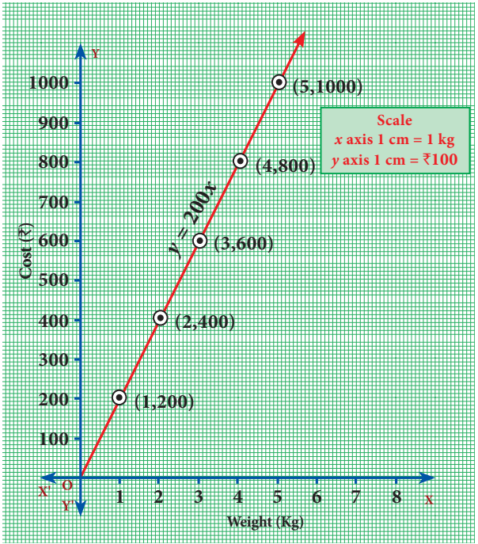

எனவே, $\dfrac1{200}=\dfrac2{400}=\dfrac3{600}=\dfrac4{800}=\dfrac5{1000}=\cdots$.

எனவே, இத்தகைய மாறுபடும் விகிதத்தையே **நேர் மாறுபாடு** என்கிறோம். இங்கு விலையைக் காண, எடையானது 200 என்ற மாறிலியால் பெருக்கப்படுகிறது.

இங்கு, மாற்கூடிய எடையை $x$ எனவும், மாற்கூடிய விலையை $y$ எனவும் கொண்டால், இதனை $y=200x$ என்ற இயற்கணித சமன்பாடாக விவரிக்கலாம். இங்கு, பெருக்கல் காரணி 200 ஆகும்.

> $\dfrac yx=k$, $k$ ஆனது ஒரு மிகை எண் (மாறிலி) எனில், $x$ மற்றும் $y$ ஆனது **நேர் மாறுபாட்டில்** இருக்கும். இங்கு, $k$ ஆனது விகிதசம மாறிலி எனப்படும்.

> **அன்றாட வாழ்வில் கணிதம்:** இந்தப் படமானது விசையினை இரட்டிப்பாக்கினால் இடப்பெயர்ச்சியானது இரட்டிப்பாகும் என்பதை விளக்குகிறது. இது **ஹூக்ஸ் விதியின்** விளைவு ஆகும். இதனை $F=kx$ என குறிப்பிடுவோம். இங்கு, திருகு சுருளின் நிலையில் $x$ என்ற இடப்பெயர்ச்சியை ஏற்படுத்த $F$ என்ற விசையானது தேவைப்படுகிறது. இடப்பெயர்ச்சியை இரட்டிப்பாக்க, நாம் விசையினை இரட்டிப்பாக்குகிறோம். இங்கு விகிதசம மாறிலியான $k$ ஆனது திருகு சுருளின் விறைப்புத்தன்மையைப் பொருத்து இருக்கும். ஆகவே, இது நேர்மாறுபாட்டிற்கான எடுத்துக்காட்டாகும்.
>
> 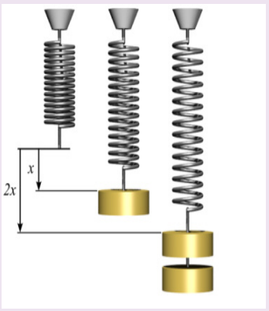

**நேர்மாறுபாட்டைக் காட்சிப்படுத்துதல்:**

ஒரு சமன்பாடானது நேர்மாறுபாட்டில் உள்ளதா என்பதை அறிய, அது $y=kx$ என்ற வடிவத்தில் உள்ளதா என ஆராய வேண்டும். இங்கு, $k$ ஆனது விகிதசம மாறிலி ஆகும். ஆகவே, மாறிகளில் $y=5x$ என்ற சமன்பாடானது எப்போதும் நேர்மாறுபாட்டையே குறிக்கும்.

> **சிந்தனைக் களம்**
>
> $x$ மற்றும் $y$ ஆகிய மாறிகள், $3y-7x=0$ என்ற சமன்பாட்டின் மூலம் தொடர்புபடுத்தப்பட்டிருந்தால், நாம் என்ன கூற இயலும்? அதுவும், நேர்மாறுபாட்டையே குறிப்பிடும். எப்படி என்பதை சிந்திக்கவும்? அவ்வகையில், விகிதசம மாறிலி என்ன?

இந்த வரைபடத்தை கவனிக்கவும்:

பயணித்த தூரமும், எடுத்துக் கொண்ட நேரமும் விகிதசமத்தில் உள்ளன. இதனை எவ்வாறு கண்டறிவது?

(i) வரைபடமானது ஒரு நேர்க்கோடு ஆகும்.

(ii) நேர்க்கோடானது ஆதிப்புள்ளி வழியாக செல்கிறது என்பதை நினைவில் கொள்க. இந்த இரு பண்புகளையும் நிறைவு செய்யும் வண்ணம் அமைந்த இரு அளவுகளின் மீதான வரைபடம், நேர் விகிதத்தில் தான் அமையும்.

இந்த வரைபடத்தின் மூலம் நாம் அறிந்து கொள்வது என்ன?

| நேரம் (நிமிடங்களில்) | 4 | 8 | 12 | 16 |
|---|---|---|---|---|
| தூரம் (கி.மீ.) | 8 | 16 | 24 | 32 |

ஒரு மாறி இருமடங்காகும்போது, மற்றொன்றும் இருமடங்காகும். இதிலிருந்து $d=rt$ என்னும் தொடர்பு அமைகிறது. மேலும், மாறுபாட்டின் மாறிலியை எளிதில் கண்டறியலாம்.

#### எடுத்துக்காட்டு 3.47

வர்ஷிகா வெவ்வேறு அளவுகளில் 6 வட்டங்களை வரைந்தாள். அட்டவணையில் உள்ளவாறு, ஒவ்வொரு வட்டத்தின் விட்டத்திற்கும் அதன் சுற்றளவிற்கும் உள்ள தோராயத் தொடர்புக்கு ஒரு வரைபடம் வரையவும். அதனைப் பயன்படுத்தி, விட்டமானது 6 செமீ ஆக இருக்கும்போது வட்டத்தின் சுற்றளவைக் காண்க.

| விட்டம் ($x$) செமீ | 1 | 2 | 3 | 4 | 5 |
|---|---|---|---|---|---|
| சுற்றளவு ($y$) செமீ | 3.1 | 6.2 | 9.3 | 12.4 | 15.5 |

**தீர்வு**

அட்டவணையிலிருந்து, $x$ அதிகரிக்க $y$ யும் அதிகரிக்கிறது என நாம் காண்கிறோம். ஆகவே, இது நேர்மாறுபாடு ஆகும்.

ஆகவே, $y=kx$ என்க. இங்கு, $k$ ஆனது விகிதசம மாறிலி ஆகும்.

கொடுக்கப்பட்ட மதிப்புகளைக் கொண்டு நாம் பெறுவது,

$$
k=\frac{3.1}1=\frac{6.2}2=\frac{9.3}3=\frac{12.4}4=\cdots=3.1.
$$

நாம் $(1,3.1)$, $(2,6.2)$, $(3,9.3)$, $(4,12.4)$, $(5,15.5)$ ஆகிய புள்ளிகளை வரைபடத்தில் குறித்தால், $y=(3.1)x$ ஆனது ஒரு நேர்க்கோட்டு வரைபடத்தை அமைக்கிறது எனக் காண்கிறோம்.

எனவே, வரைபடத்திலிருந்து, விட்டம் 6 செமீ ஆக இருக்கும் வட்டத்தின் சுற்றளவு 18.6 செமீ ஆகும்.

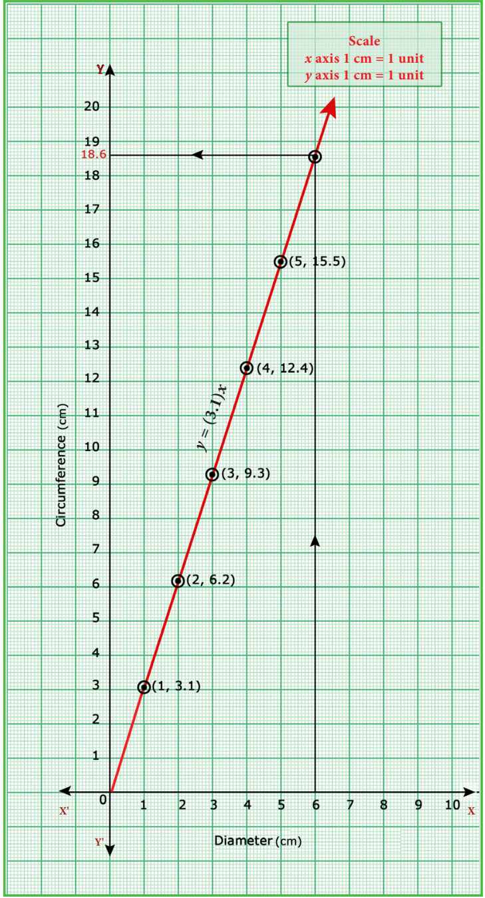

#### எடுத்துக்காட்டு 3.48

ஒரு பேருந்து 50 கி.மீ/மணி என்ற சீரான வேகத்தில் பயணிக்கிறது. இத்தொடர்புக்கான நேரம் – தூரம் வரைபடம் வரைந்து, பின்வருவனவற்றைக் காண்க.

(i) விகிதசம மாறிலியைக் காண்க

(ii) 90 நிமிடங்களில் பயணிக்கும் தூரம் எவ்வளவு?

(iii) 300 கி.மீ. தூரத்தை பயணிக்க எவ்வளவு நேரம் ஆகும்?

**தீர்வு**

$x$ ஆனது நேரத்தையும் (நிமிடங்களில்), $y$ ஆனது பயணித்த தூரத்தையும் (கி.மீ–ல்) குறிப்பதாகக் கொள்வோம்.

| பயண நேரம் ($x$) நிமிடங்களில் | 60 | 120 | 180 | 240 |
|---|---|---|---|---|
| பயண தூரம் ($y$) கி.மீ–ல் | 50 | 100 | 150 | 200 |

(i) நேரம் அதிகரிக்கும்போது பயணித்த தூரமும் அதிகரிப்பதை கவனிக்கவும். ஆகவே, இது $y=kx$ என்ற வடிவம் கொண்ட நேர்மாறுபாட்டைக் குறிக்கிறது.

விகிதசம மாறிலி,

$$
k=\frac yx=\frac{50}{60}=\frac{100}{120}=\frac{150}{180}=\frac{200}{240}=\frac56.
$$

கொடுக்கப்பட்டுள்ள விவரங்களின்படி, ஆகவே,

$$
y=kx\Rightarrow y=\frac56x.
$$

(ii) $y=\dfrac{5x}6$ என்ற வரைபடத்திலிருந்து, $x=90$ எனில், $y=\dfrac56\times90=75$ கி.மீ.

எனவே, 90 நிமிடங்களில் பயணித்த தூரமானது 75 கி.மீ ஆகும்.

(iii) $y=\dfrac{5x}6$ என்ற வரைபடத்திலிருந்து, $y=300$ எனில், $x=\dfrac{6y}5=\dfrac65\times300=360$ நிமிடங்கள் (அல்லது) 6 மணி நேரம் ஆகும்.

300 கி.மீ தூரம் பயணிக்க எடுத்துக்கொண்ட நேரம் அதாவது, 360 நிமிடங்கள் (அல்லது) 6 மணி நேரம் ஆகும்.

##### எதிர்மாறுபாடு:

சென்னைக்கும் மதுரைக்கும் இடையேயான தூரம் சுமார் 480 கி.மீ ஆகும். ஒரு தொடர்வண்டியானது சென்னையிலிருந்து புறப்பட்டு மதுரையை நோக்கி செல்வதாக கருதுவோம். அதன் வேகத்தை அதிகரிக்கும்போது, பயணிக்கும் நேரமானது குறையும். பின்வரும் அட்டவணையில் வேகம் $v$ ஆனது கி.மீ லும் நேரம் $t$ ஆனது மணியிலும் கொடுக்கப்பட்டுள்ளது.

| வேகம் ($v$) கி.மீ/மணி | 30 | 40 | 60 | 80 |
|---|---|---|---|---|
| நேரம் ($t$) மணி | 16 | 12 | 8 | 6 |

நாம் குறைந்த வேகத்தில் பயணித்தால், நேரம் அதிகரிப்பதையும், தொடர்வண்டியானது வேகமாக சென்றால் நேரம் குறைவதையும், அட்டவணையிலிருந்து தெளிவாகக் காண்கிறோம். $30\times16=40\times12=60\times8=80\times6$ என நாம் காண்கிறோம். இது $vt$ ஆனது ஒரு மாறிலி எனக் காட்டுகிறது. இங்கு $vt=480$ ஆகும். இந்தச் சூழலில், நாம் $v$ மற்றும் $t$ ஆகியன எதிர்மாறுபாட்டில் உள்ளது. $vt=480$ என்ற சமன்பாட்டின் வரைபடமானது ஒரு நேர்க்கோடாக இருக்காது என்பதைக் கவனிக்கவும். ஆகவே, எதிர்மாறுபாட்டில் ஒரு மாறியானது அதிகரிக்க மற்றொரு மாறியானது குறையும்.

**எதிர்மாறுபாட்டைக் காட்சிப்படுத்துதல்:**

வரைபடத்தைக் (படம் 3.12) காண். இது $xy=8$ என்ற சமன்பாட்டின் வரைபடம் ஆகும். இங்கு நாம் $x,y$ இன் மிகை மதிப்புகளை மட்டுமே எடுத்துக்கொள்கிறோம்.

அட்டவணையின் மதிப்புகள்

| $x$ | 1 | 2 | 4 | 8 |
|---|---|---|---|---|
| $y=\dfrac8x$ | 8 | 4 | 2 | 1 |

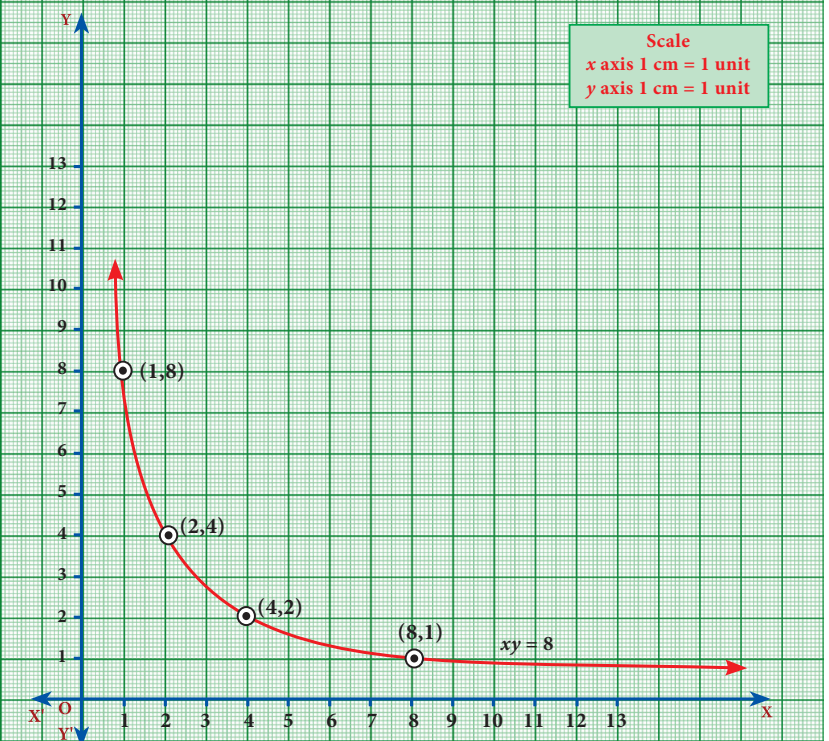

இது எதிர்மாறுபாட்டிற்கு ஒரு விளக்கமாகும். இந்த வரைபடமானது செவ்வக அதிபரவளையம் (Rectangular Hyperbola) என்ற வளைவரையின் ஒரு பகுதியாகும்.

#### எடுத்துக்காட்டு 3.49

ஒரு நிறுவனமானது தொடக்கத்தில் 40 வேலையாள்களுடன் 150 நாள்களில் ஒரு வேலையை முடிக்க தொடங்கியது. பிறகு, வேலையை விரைவாக முடித்திட பின்வருமாறு வேலையாள்களை அதிகரித்தது.

| வேலையாள்களின் எண்ணிக்கை ($x$) | 40 | 50 | 60 | 75 |
|---|---|---|---|---|
| நாள்களின் எண்ணிக்கை ($y$) | 150 | 120 | 100 | 80 |

(i) மேலேக் கொடுக்கப்பட்டுள்ள தரவுகளுக்கு வரைபடம் வரைந்து மாறுபாட்டின் வகையை அடையாளம் காண்க.

(ii) வரைபடத்திலிருந்து, நிறுவனமானது 120 வேலையாள்களை வேலைக்கு அமர்த்த விரும்பினால், வேலை முடிய எத்தனை நாள்கள் ஆகும் எனக் காண்க.

(iii) வேலையானது 200 நாள்களில் முடிய வேண்டும் எனில், எத்தனை வேலையாள்கள் தேவை?

(i)

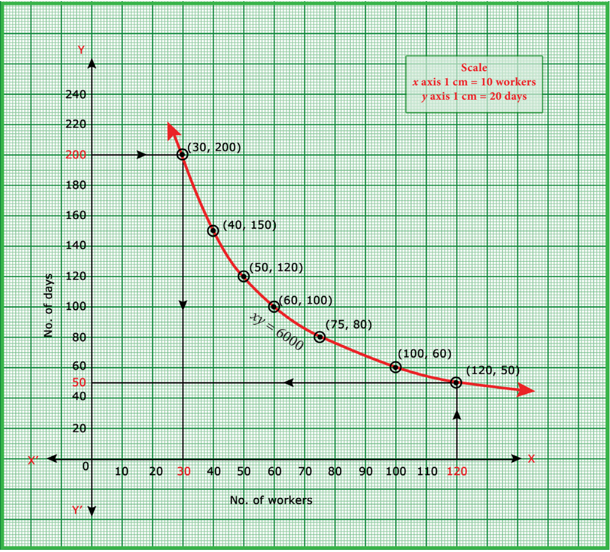

கொடுக்கப்பட்டுள்ள அட்டவணையிலிருந்து, $x$ அதிகரிக்கும் போது $y$ குறைவதைக் காண்கிறோம். ஆகவே, இது எதிர் மாறுபாடு ஆகும்.

$$
y=\frac kx\ என்க.
$$

$$
\Rightarrow xy=k,\ k>0\ ஆனது\ விகிதசம\ மாறிலி\ ஆகும்.
$$

அட்டவணையிலிருந்து, $k=40\times150=50\times120=\cdots=75\times80=6000\Rightarrow xy=6000$ ஆகும்.

$(40,150)$, $(50,120)$, $(60,100)$, $(75,80)$ ஆகிய புள்ளிகளைக் குறித்து, அவற்றை நேர்க்கோடற்ற இழைவான வளைவரையாக வரையவும். (செவ்வக அதிபரவளையம்)

(ii) வரைபடத்திலிருந்து, நிறுவனமானது 120 வேலையாள்களுடன் வேலை செய்ய முடிவு செய்தால், அவ்வேலையானது 50 நாள்களில் முடிவடையும்.

மேலும், $xy=6000$, $x=120$ எனில், $y=\dfrac{6000}{120}=50$ ஆகும்.

(iii) வரைபடத்திலிருந்து, 200 நாள்களில் வேலையை முடிக்க வேண்டும் எனில், தேவையான வேலையாள்களின் எண்ணிக்கை 30 ஆகும்.

மேலும், $xy=6000$, $y=200$ எனில், $x=\dfrac{6000}{200}=30$ ஆகும்.

#### எடுத்துக்காட்டு 3.50

நிஷாந்த், 12 கி.மீ தூரத்திற்கான மாரத்தான் ஓட்டத்தின் வெற்றியாளர் ஆவார். அவர் மணிக்கு 12 கி.மீ என்ற சீரான வேகத்தில் ஓடி, இலக்கினை 1 மணி நேரத்தில் அடைந்தார். அவரைத் தொடர்ந்து ஆராதனா, ஜெயந்த், சத்யா மற்றும் சுவேதா ஆகியோர் முறையே 6 கி.மீ/மணி, 4 கி.மீ/மணி, 3 கி.மீ/மணி மற்றும் 2 கி.மீ/மணி என்ற வேகத்தில் ஓடி வந்தனர். அவர்கள் அந்த தூரத்தை முறையே 2 மணி, 3 மணி, 4 மணி மற்றும் 6 மணி நேரத்தில் அடைந்தனர்.

வேகம் – நேரம், வரைபடம் வரைந்து அதனைப் பயன்படுத்தி, மணிக்கு 2.4 கி.மீ/மணி வேகத்தில் சென்ற கௌசிக் எடுத்துக்கொண்ட நேரத்தைக் காண்க.

**தீர்வு**

கொடுக்கப்பட்ட விவரங்களிலிருந்து நாம் ஒரு அட்டவணையை அமைப்போம்.

| வேகம் $x$ (கி.மீ/மணி) | 12 | 6 | 4 | 3 | 2 |
|---|---|---|---|---|---|
| நேரம் $y$ (மணி) | 1 | 2 | 3 | 4 | 6 |

அட்டவணையிலிருந்து, $x$ குறையும் போது $y$ ஆனது அதிகரிப்பதை நாம் காண்கிறோம். ஆகவே, இது **எதிர் மாறுபாடு** ஆகும்.

$$
y=\frac kx\ என்க.
$$

$$
\Rightarrow xy=k,\ k>0\ ஆனது\ விகிதசம\ மாறிலி\ ஆகும்.
$$

இங்கு, $k=12\times1=6\times2=\cdots=2\times6=12\Rightarrow xy=12$ ஆகும்.

$(12,1)$, $(6,2)$, $(4,3)$, $(3,4)$, $(2,6)$ ஆகிய புள்ளிகளைக் குறித்து, அவற்றை நேர்க்கோடற்ற இழைவான வளைவரையாக வரையவும்.

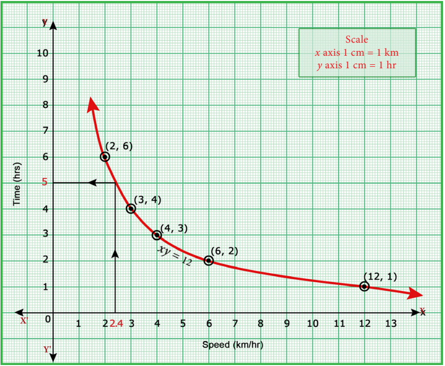

வரைபடத்திலிருந்து, மணிக்கு 2.4 கி.மீ/மணி வேகத்தில் கௌசிக் எடுத்துக்கொண்ட நேரம் 5 மணி ஆகும்.

> **குறிப்பு**
>
> ஒரு நேர்க்கோட்டின் நேரிய சமன்பாடானது $y=mx+c$ என நாம் ஏற்கனவே கற்றிருக்கிறோம். இதில் $m$ ஆனது நேர்க்கோட்டின் சாய்வு மற்றும் $c$ ஆனது $y$ வெட்டுத்துண்டு ஆகும். மேலும், இந்த நேர்க்கோடானது. ஆதிப்புள்ளி வழியேச் சென்றால் $y=mx$ ஆகும். நேர்மாறுபாட்டின் வரைபடமானது ஒரு நேர்க்கோட்டைக் குறிப்பதால், அதன் பொது வடிவம் $y=kx$ ஆகும். மேலும், விகிதசம மாறிலியான $k$ ஆனது, நேர்க்கோட்டின் சாய்வு என அறியலாம்.

### பயிற்சி 3.15

1. ஒரு துணிக்கடையானது தனது வாடிக்கையாளர்களுக்கு வாங்கும் ஒவ்வொரு பொருளின் மீதும் 50 % தள்ளுபடியை அறிவிக்கிறது. குறித்த விலைக்கும் தள்ளுபடிக்குமான வரைபடம் வரைக. மேலும்,

   (i) வரைபடத்திலிருந்து, ஒரு வாடிக்கையாளர் ₹3250 –ஐ தள்ளுபடியாகப் பெற்றால், குறித்த விலையைக் காண்க.

   (ii) குறித்த விலையானது ₹2500 எனில், தள்ளுபடியைக் காண்க.

2. $xy=24$, $x,y>0$ என்ற வரைபடத்தை வரைக. வரைபடத்தைப் பயன்படுத்தி, (i) $x=3$ எனில் $y$ –ஐக் காண்க மற்றும் (ii) $y=6$ எனில் $x$ –ஐக் காண்க.
3. $y=\dfrac12x$ என்ற நேரிய சமன்பாட்டின் / சார்பின் வரைபடம் வரைக. விகிதசம மாறிலியை அடையாளம் கண்டு, அதனை வரைபடத்துடன் சரிபார்க்க. மேலும், (i) $x=9$ எனில் $y$ –ஐக் காண்க. (ii) $y=7.5$ எனில் $x$ –ஐக் காண்க.
4. ஒரு தொட்டியை நிரப்பத் தேவையான குழாய்களின் எண்ணிக்கையும் அவை எடுத்துக் கொள்ளும் நேரமும் பின்வரும் அட்டவணையில் கொடுக்கப்பட்டுள்ளது

   | குழாய்களின் எண்ணிக்கை ($x$) | 2 | 3 | 6 | 9 |
   |---|---|---|---|---|
   | எடுத்துக் கொள்ளும் நேரம் ($y$) நிமிடங்களில் | 45 | 30 | 15 | 10 |

   மேற்கண்ட தரவுகளுக்கு வரைபடம் வரைந்து,

   (i) 5 குழாய்களை பயன்படுத்தினால், தொட்டி நிரம்ப எடுத்துக் கொள்ளப்பட்ட நேரத்தைக் காண்க.

   (ii) 9 நிமிடங்களில் தொட்டி நிரம்பினால், பயன்படுத்தப்பட்ட குழாய்களின் எண்ணிக்கையைக் காண்க.

5. ஒரு பள்ளியானது, குறிப்பிட்ட சில போட்டிகளுக்கு, பரிசுத் தொகையினை எல்லா பங்கேற்பாளர்களுக்கும் பின்வருமாறு சமமாக பிரித்து வழங்குவதாக அறிவிக்கிறது.

   | பங்கேற்பாளர்களின் எண்ணிக்கை ($x$) | 2 | 4 | 6 | 8 | 10 |
   |---|---|---|---|---|---|
   | ஒவ்வொரு பங்கேற்பாளரின் தொகை ₹ ($y$) | 180 | 90 | 60 | 45 | 36 |

   (i) விகிதசம மாறிலியைக் காண்க.

   (ii) மேற்கண்ட தரவுகளுக்கு வரைபடம் வரைந்து, 12 பங்கேற்பாளர்கள் பங்கெடுத்துக் கொண்டால் ஒவ்வொரு பங்கேற்பாளரும் பெறும் பரிசுத் தொகை எவ்வளவு என்பதைக் காண்க.

6. பேருந்து நிலையம் அருகே உள்ள இரு சக்கர வாகனம் நிறுத்துமிடத்தில் பெறப்படும் கட்டணத் தொகை பின்வருமாறு.

   | நேரம் (மணியில்)($x$) | 4 | 8 | 12 | 24 |
   |---|---|---|---|---|
   | கட்டணத் தொகை ₹ ($y$) | 60 | 120 | 180 | 360 |

   பெறப்படும் கட்டணத் தொகையானது வாகனம் நிறுத்தப்படும் நேரத்திற்கு நேர் மாறுபாட்டில் உள்ளதா அல்லது எதிர் மாறுபாட்டில் உள்ளதா என ஆராய்க. கொடுக்கப்பட்ட தரவுகளை வரைபடத்தில் குறிக்கவும். மேலும், (i) நிறுத்தப்படும் நேரம் 6 மணி எனில், கட்டணத் தொகையைக் காண்க. (ii) ₹150 ஐ கட்டணத் தொகையாகச் செலுத்தி இருந்தால், நிறுத்தப்பட்ட நேரத்தின் அளவைக் காண்க.

## 3.8 இருபடிச் சமன்பாடுகளின் வரைபடங்கள் (Quadratic Graphs)

##### அறிமுகம்

ஒரு பொருளை (பந்து போல) மேல் நோக்கி எறியும்போது ஏற்படும் ஒரு கோணத்திலிருந்து உருவாகும் பாதை பரவளையம் எனும் வளைவரை ஆகும். நீரூற்றிலிருந்து வெளிப்படும் தண்ணீரின் பாதை போன்றவை பரவளைய பாதையாகும். பரவளையமானது ஒரு சமன்பாட்டை குறிக்கும்.

$f(x)=ax^2+bx+c$ என்பது இருபடிச் சார்புகளின் பொது வடிவம் ஆகும். இங்கு $a,b,c$ என்பன மாறிலிகள் மற்றும் $a\ne0$.

பல இருபடிச் சார்புகளின் வரைபடங்களை பரவளையத்தை அடிப்படையாக வைத்து நேர்த்தியாகக் கையால் வரைய முடியும். $y=x^2$ என்ற வளைவரையை வரையலாம். படம் 3.16 –யில் காட்டியுள்ளபடி பரவளையம் $y=x^2$ தோன்றும்.

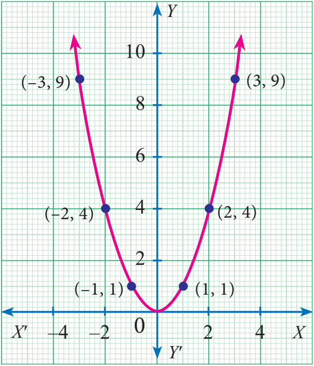

பொதுச் சமன்பாட்டின் கெழு $a$-ஐ பொறுத்து திறந்த பரவளையமானது மேல்நோக்கி அல்லது கீழ்நோக்கி இருக்கும். அதேபோல் '$a$'-வின் மதிப்பைக் கொண்டு பரவளையம் விரிந்துள்ளதா அல்லது குறுகியுள்ளதா (அகலத்தை) என முடிவு செய்யலாம். அனைத்துப் பரவளையங்களுமே அடிப்படையில் "$\cup$" என்ற அமைப்பில் இருக்கும்.

இருபடிச் சமன்பாட்டின் $x^2$-ன் கெழு $a$ அதிகமாக இருந்தால் பரவளையம் குறுகியதாக இருக்கும். இருபடிச் சமன்பாட்டின் $x^2$-ன் கெழு $a$ சிறியதாக இருந்தால் பரவளையம் விரிந்து காணப்படும்.

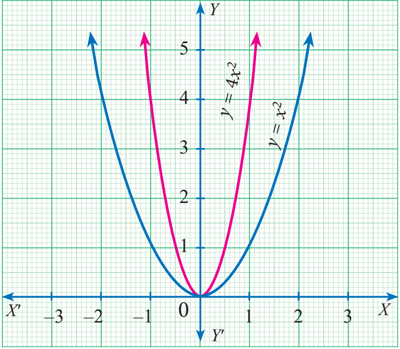

$y=x^2$ என்ற வரைபடம் $y=4x^2$ என்ற வரைபடத்தை விட அகலமாக உள்ளது.

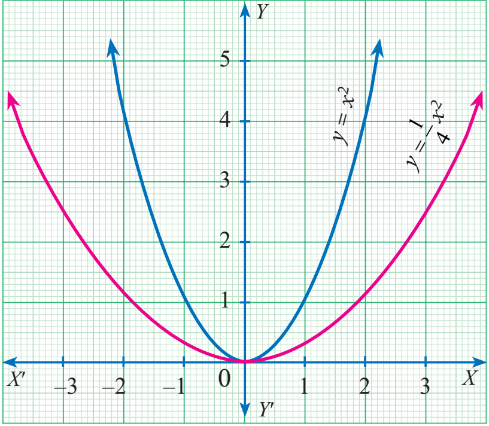

$y=x^2$ என்ற வரைபடம் $y=\dfrac14x^2$ என்ற வரைபடத்தை விட குறுகியதாக உள்ளது.

ஒரு குறிப்பிட்ட கோட்டினைப் பொறுத்துப் பரவளையம் சமச்சீராக இருக்கும் அக்கோடு '**சமச்சீர் அச்சுக்கோடு**' எனப்படும். பரவளையமும் சமச்சீர் அச்சும் வெட்டிக்கொள்வது பரவளையத்தின் '**உச்சி**' எனப்படும். இருபடி பல்லுறுப்புக்கோவையை வரைபடத்தில் பொருத்தும்போது ஏற்படும் வளைவரையானது "**பரவளையம்**" என அழைக்கப்படுகிறது.

> **குறிப்பு :** ஓர் இருபடிச் சமன்பாட்டின் வரைபடத்தில் அச்சுக் கோடு $x=\dfrac{-b}{2a}$ மற்றும் அதன் உச்சி $\left(\dfrac{-b}{2a},\dfrac{-\Delta}{4a}\right)$, ($\Delta=b^2-4ac$ என்பது $ax^2+bx+c=0$ என்ற இருபடிச் சமன்பாட்டின் தன்மைகாட்டி) என்றவாறு அமைந்துள்ளது. இங்கு, $a\ne0$.

$ax^2+bx+c=0$ இங்கு, $a,b,c\in\mathbb R$ மற்றும் $a\ne0$ என்ற இருபடிச் சமன்பாட்டின் மூலங்களை எவ்வாறு கண்டுபிடிப்பது என ஏற்கனவே கருத்தியலாகப் படித்து இருக்கிறோம். இந்தப் பகுதியில் வரைபடத்தின் மூலம் இருபடிச் சமன்பாட்டின் மூலங்களை எவ்வாறு கண்டுபிடிப்பது எனக் கற்க இருக்கிறோம்.

### 3.8.1 இருபடிச் சமன்பாடுகளின் தீர்வுகளின் தன்மையை வரைபடம் வாயிலாக அறிதல் (Finding the Nature of Solution of Quadratic Equations Graphically)

$ax^2+bx+c=0$ என்ற இருபடிச் சமன்பாட்டின் மூலங்களை வரைபடத்தின் மூலம் காண முதலில் $y=ax^2+bx+c$ என்பதன் வரைபடத்தை வரைய வேண்டும்.

இருபடிச் சமன்பாட்டின் தீர்வானது, வரைபடம் $X$-அச்சை வெட்டும் புள்ளிகளில் உள்ள $x$-ஆய தொலைவுகளாகும்.

பின்வரும் படிநிலைகளைக் கொண்டு வரைபட முறையில் இருபடிச் சமன்பாகுளின் தீர்வுகளின் தன்மையைக் காணலாம்.

(i) இருபடிச் சமன்பாட்டின் வளைவரையானது $X$-அச்சை இரு வெவ்வேறு புள்ளிகளில் வெட்டினால் கொடுக்கப்பட்ட இருபடிச் சமன்பாட்டிற்கு **இரண்டு சமமில்லாத மெய்யெண் தீர்வுகள்** கிடைக்கும்.

(ii) இருபடிச் சமன்பாட்டின் வளைவரையானது $X$-அச்சை ஒரே ஒரு புள்ளியில் தொடால் கொடுக்கப்பட்ட இருபடிச் சமன்பாட்டிற்குச் **சமமான மெய்யெண் தீர்வுகள்** கிடைக்கும்.

(iii) இருபடிச் சமன்பாட்டின் வளைவரையானது $X$-அச்சை எந்த ஒரு புள்ளியிலும் வெட்டவில்லை எனில், கொடுக்கப்பட்ட இருபடிச் சமன்பாட்டிற்கு **மெய்யெண் தீர்வுகள் இல்லை**.

#### எடுத்துக்காட்டு 3.51

பின்வரும் இருபடிச் சமன்பாடுகளின் தீர்வுகளின் தன்மையை வரைபடம் மூலம் ஆராய்க. (i) $x^2+x-12=0$ (ii) $x^2-8x+16=0$ (iii) $x^2+2x+5=0$

**தீர்வு** (i) $x^2+x-12=0$

**படி 1** $y=x^2+x-12$ என்ற சமன்பாட்டின் மதிப்புகளை அட்டவணைப்படுத்துக.

| $x$ | $-5$ | $-4$ | $-3$ | $-2$ | $-1$ | 0 | 1 | 2 | 3 | 4 |
|---|---|---|---|---|---|---|---|---|---|---|
| $y$ | 8 | 0 | $-6$ | $-10$ | $-12$ | $-12$ | $-10$ | $-6$ | 0 | 8 |

**படி 2** $(x,y)$ என்ற வரிசைச் சோடி உடைய புள்ளிகளை வரைபடத் தாளில் குறிக்கவும்.

**படி 3** பரவளையம் வரைந்து அது $X$-அச்சை வெட்டும் புள்ளிகளைக் குறிக்கவும்.

**படி 4** பரவளையம் $X$-அச்சை $(-4,0)$ மற்றும் $(3,0)$ என்ற புள்ளிகளில் வெட்டுகிறது. இப்புள்ளிகளின் $x$-ஆயத் தொலைவுகள் $-4$ மற்றும் 3 ஆகும்.

இங்கு $x^2+x-12=0$ என்ற இருபடிச் சமன்பாடு $X$-அச்சை இருவேறு புள்ளிகளில் வெட்டுகிறது. எனவே, இருபடிச் சமன்பாட்டின் மூலங்கள் **இரு சமமற்ற மெய்யெண்களாக** இருக்கும்.

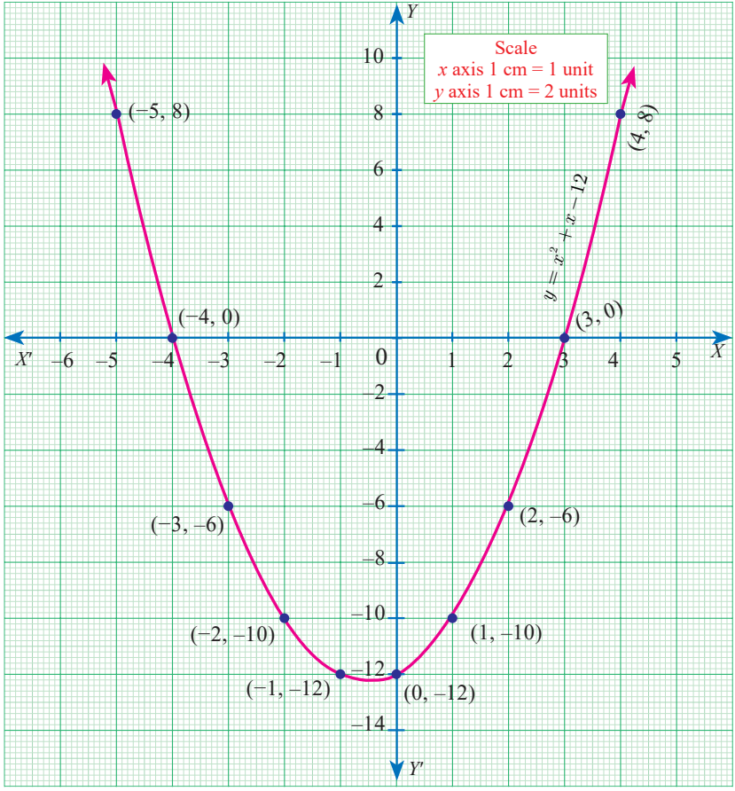

(ii) $x^2-8x+16=0$

**படி 1** $y=x^2-8x+16$ என்ற சமன்பாட்டின் மதிப்புகளை அட்டவணைப்படுத்துக.

| $x$ | $-1$ | 0 | 1 | 2 | 3 | 4 | 5 | 6 | 7 | 8 |
|---|---|---|---|---|---|---|---|---|---|---|
| $y$ | 25 | 16 | 9 | 4 | 1 | 0 | 1 | 4 | 9 | 16 |

**படி 2** $(x,y)$ என்ற வரிசை சோடி உடைய புள்ளிகளை வரைபடத்தாளில் குறிக்கவும்.

**படி 3** பரவளையம் வரைந்து அது $X$-அச்சை வெட்டும் புள்ளிகளைக் குறிக்கவும்.

**படி 4** பரவளையம் $X$-அச்சை $(4,0)$ என்ற புள்ளியில் வெட்டுகிறது. இப்புள்ளியின் $x$ ஆயத்தொலைவு 4.

$X$-அச்சை ஒரே புள்ளியில் வெட்டுவதால் $x^2-8x+16=0$ என்ற இருபடிச் சமன்பாட்டிற்கு **மெய் மற்றும் சமமான தீர்வுகள்** உண்டு.

(iii) $x^2+2x+5=0$

$y=x^2+2x+5$ என்க.

**படி 1** $y=x^2+2x+5$ என்ற சமன்பாட்டின் மதிப்புகளை அட்டவணைப்படுத்துக.

| $x$ | $-3$ | $-2$ | $-1$ | 0 | 1 | 2 | 3 |
|---|---|---|---|---|---|---|---|
| $y$ | 8 | 5 | 4 | 5 | 8 | 13 | 20 |

**படி 2** $(x,y)$ என்ற வரிசைச் சோடி உடைய புள்ளிகளை வரைபடத்தாளில் குறிக்கவும்.

**படி 3** இப்புள்ளிகளை நேர்க்கோடற்ற இழைவான வளைவரையில் (Smooth Curve) இணைத்து பெறப்பட்ட வளைவரை $y=x^2+2x+5$-ன் வரைபடம் ஆகும்.

**படி 4** கொடுக்கப்பட்ட சமன்பாட்டின் பரவளையமானது $X$-அச்சை எந்தப் புள்ளியிலும் வெட்டவில்லை/தொட்டு செல்லவில்லை.

எனவே, கொடுக்கப்பட்ட இருபடிச் சமன்பாட்டிற்கு **மெய்யெண் மூலங்கள் இல்லை**.

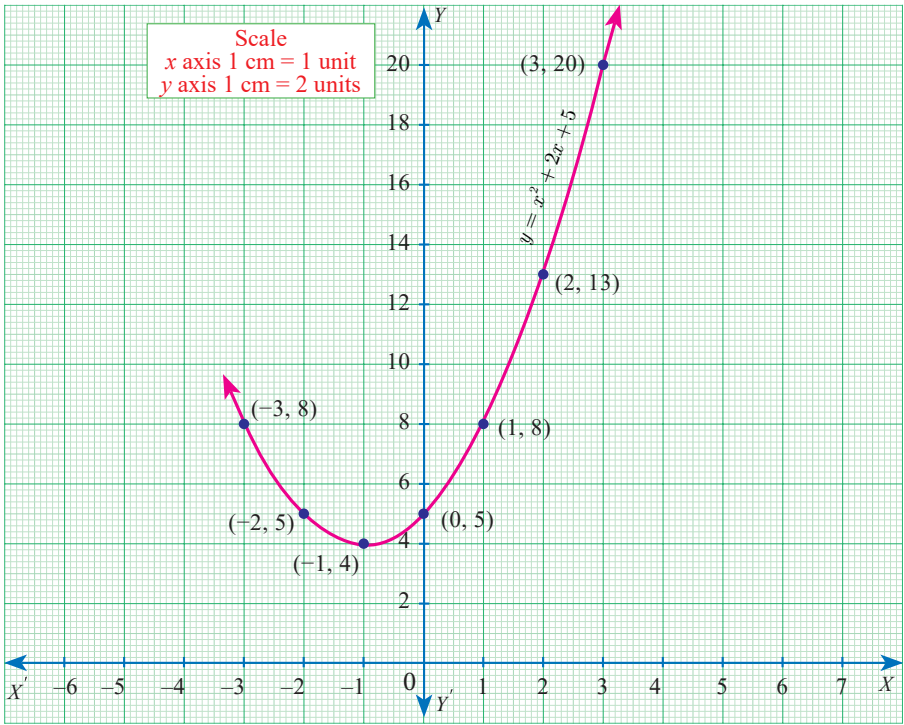

> **முன்னேற்றச் சோதனை**
>
> கொடுக்கப்பட்ட வரைபடங்கள் $X$-அச்சை வெட்டும் போது உண்டாகும் புள்ளிகளின் எண்ணிக்கை மற்றும் அதற்கு உண்டான தீர்வுகளின் தன்மையையும் இணைக்கவும்.

| வ. எண் | வரைபடங்கள் | $X$-அச்சை வெட்டும் புள்ளிகளின் எண்ணிக்கை | தீர்வுகளின் தன்மை |
|---|---|---|---|
| 1. |  | 2 | மெய் மற்றும் சமமான மூலங்கள் |
| 2. |  | 1 | மெய்யெண் மூலங்கள் இல்லை |
| 3. | 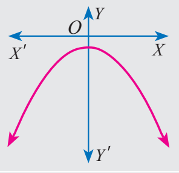 | 2 | மெய்யெண் மூலங்கள் இல்லை |
| 4. | 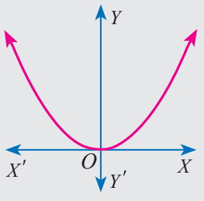 | 0 | மெய் மற்றும் சமமான மூலங்கள் |
| 5. | 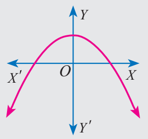 | 0 | மெய் மற்றும் சமம் இல்லாத மூலங்கள் |
| 6. |  | 1 | மெய் மற்றும் சமம் இல்லாத மூலங்கள் |

### 3.8.2 இருபடிச் சமன்பாடுகளின் தீர்வுகளை வெட்டுக் கோடுகளின் மூலம் காணுதல் (Solving quadratic equations through intersection of lines)

கொடுக்கப்பட்ட பரவளையத்தை வெட்டுகின்ற பொருத்தமான நேர்க்கோட்டின் மூலம் இருபடிச் சமன்பாடுகளின் தீர்வுகளைக் காணலாம்.

(i) பரவளையத்தை நேர்க்கோடு ஆனது **இருவேறு புள்ளிகளில்** வெட்டினால் அப்புள்ளிகளின் $x$-ன் ஆயத் தொலைவுகள் அந்த இருபடிச் சமன்பாட்டின் **மூலங்கள்** ஆகும்.

(ii) பரவளையத்தை நேர்க்கோடானது **ஒரே புள்ளியில் தொட்டுச் சென்றால்**, அப்புள்ளியின் $x$-ன் ஆயத்தொலைவு அச்சமன்பாட்டின் **ஒரே ஒரு மூலம்** ஆகும்.

(iii) பரவளையத்தை நேர்க்கோடு **வெட்டிக் கொள்ளாமல் சென்றால்** அச்சமன்பாட்டிற்கு **மெய்யெண் மூலங்கள் இல்லை**.

#### எடுத்துக்காட்டு 3.52

$y=2x^2$ என்ற வரைபடம் வரைந்து அதன் மூலம் $2x^2-x-6=0$ என்ற சமன்பாட்டைத் தீர்க்க.

**தீர்வு** **படி 1** $y=2x^2$ -ன் வரைபடம் வரைவதற்கு மதிப்புகளைக் கீழ்க்காணுமாறு அட்டவணைப்படுத்த வேண்டும்.

| $x$ | $-2$ | $-1$ | 0 | 1 | 2 |
|---|---|---|---|---|---|
| $y$ | 8 | 2 | 0 | 2 | 8 |

**படி 2** $2x^2-x-6=0$ என்ற சமன்பாட்டின் தீர்வு காண்பதற்கு, முதலில் $y=2x^2$ –லிருந்து $2x^2-x-6=0$ ஐ கழிக்க வேண்டும்.

எனவே,

$$
\begin{array}{rcl}y&=&2x^2\\0&=&2x^2-x-6\quad(-)\\\hline y&=&x+6\end{array}
$$

$y=x+6$ என்பது ஒரு நேர்க்கோட்டின் சமன்பாடு ஆகும். $y=x+6$ நேர்க்கோட்டின் வரைபடம் வரைவதற்கு மதிப்புகளைக் கீழ்க்காணுமாறு அட்டவணைப்படுத்த வேண்டும்.

| $x$ | $-2$ | $-1$ | 0 | 1 | 2 |
|---|---|---|---|---|---|
| $y$ | 4 | 5 | 6 | 7 | 8 |

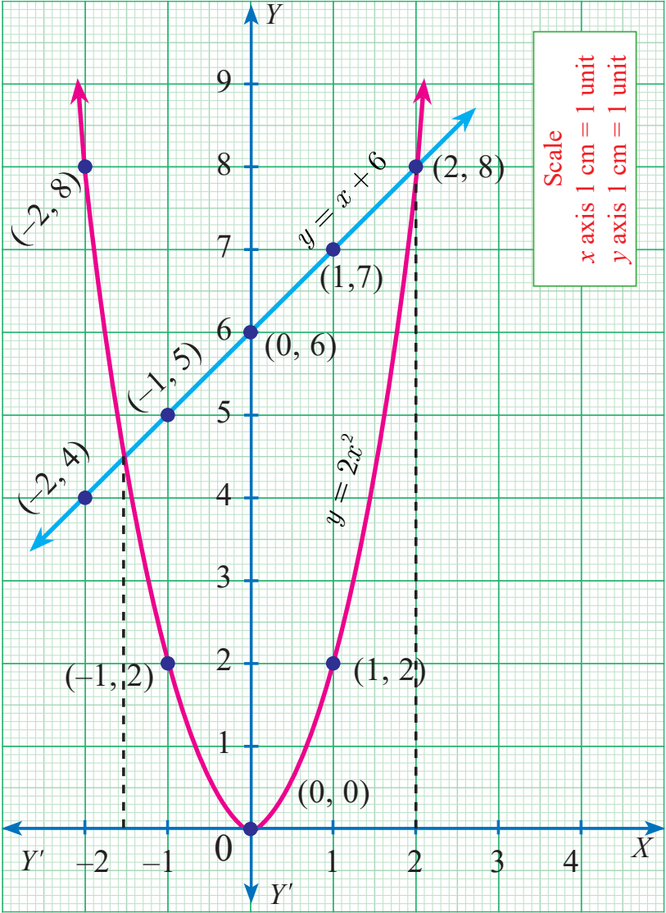

**படி 3** $y=2x^2$ என்ற பரவளையம் மற்றும் $y=x+6$ என்ற நேர்க்கோடு வெட்டும் புள்ளிகள் $(-1.5,4.5)$ மற்றும் $(2,8)$.

**படி 4** இப்புள்ளிகளின் $x$– ஆயத் தொலைவுகள் $-1.5$ மற்றும் 2 ஆகும்.

எனவே, சமன்பாடு $2x^2-x-6=0$ –யின் தீர்வுகள் $-1.5$ மற்றும் 2 ஆகும்.

#### எடுத்துக்காட்டு 3.53

$y=x^2+4x+3$ –ன் வரைபடம் வரைந்து அதனைப் பயன்படுத்தி $x^2+x+1=0$ என்ற சமன்பாட்டின் தீர்வைக் காண்க.

**தீர்வு**

**படி 1** $y=x^2+4x+3$ –ன் வரைபடம் வரைவதற்கு மதிப்புகளைக் கீழ்க்காணுமாறு அட்டவணைப்படுத்த வேண்டும்.

| $x$ | $-4$ | $-3$ | $-2$ | $-1$ | 0 | 1 | 2 |
|---|---|---|---|---|---|---|---|
| $y$ | 3 | 0 | $-1$ | 0 | 3 | 8 | 15 |

**படி 2** $y=x^2+x+1=0$ என்ற சமன்பாட்டின் தீர்வு காண்பதற்கு, முதலில் $y=x^2+4x+3$ -லிருந்து $x^2+x+1=0$-ஐ கழிக்க வேண்டும்.

$$
\begin{array}{rcl}y&=&x^2+4x+3\\0&=&x^2+x+1\quad(-)\\\hline y&=&3x+2\end{array}
$$

இங்கு, $y=3x+2$ என்பது ஒரு நேர்க்கோட்டின் சமன்பாடு ஆகும். இதன் வரைபடம் வரைவதற்கு மதிப்புகளைக் கீழ்க்காணுமாறு அட்டவணைப்படுத்த வேண்டும்.

| $x$ | $-2$ | $-1$ | 0 | 1 | 2 |
|---|---|---|---|---|---|
| $y$ | $-4$ | $-1$ | 2 | 5 | 8 |

**படி 3** $y=3x+2$ என்ற நேர்க்கோட்டின் வரைபடம் $y=x^2+4x+3$ என்ற பரவளையத்தை எந்த ஒரு புள்ளியிலும் வெட்டாமல்/தொடாமல் செல்கிறது.

எனவே, $x^2+x+1=0$ என்ற இருபடிச் சமன்பாட்டிற்கு மெய்யெண் தீர்வுகள் இல்லை.

#### எடுத்துக்காட்டு 3.54

$y=x^2+x-2$ –ன் வரைபடம் வரைந்து அதன் மூலம் $x^2+x-2=0$ என்ற சமன்பாட்டினைத் தீர்க்கவும்.

**தீர்வு**

**படி 1** $y=x^2+x-2$ –ன் வரைபடம் வரைவதற்குக் கீழ்காணுமாறு அட்டவணை மதிப்புகளைத் தயார் செய்க.

| $x$ | $-3$ | $-2$ | $-1$ | 0 | 1 | 2 |
|---|---|---|---|---|---|---|
| $y$ | 4 | 0 | $-2$ | $-2$ | 0 | 4 |

**படி 2** $x^2+x-2=0$ என்ற சமன்பாட்டை தீர்வு காண்பதற்கு, $y=x^2+x-2$-யிலிருந்து $x^2+x-2=0$-ஐ கழிக்க வேண்டும்.

எனவே

$$
\begin{array}{rcl}y&=&x^2+x-2\\0&=&x^2+x-2\quad(-)\\\hline y&=&0\end{array}
$$

இங்கு, $y=0$ என்பது $X$-அச்சு ஆகும்.

**படி 3** $y=x^2+x-2$ என்ற பரவளையம் $X$-அச்சை $(-2,0)$ மற்றும் $(1,0)$ என்ற புள்ளிகளில் வெட்டுகிறது.

**படி 4** இப்புள்ளிகளின் $x$-ஆயத்தொலைவுகள் $-2$ மற்றும் 1 ஆகும். எனவே, சமன்பாடு $x^2+x-2=0$-ன் தீர்வுகள் $-2$ மற்றும் 1.

#### எடுத்துக்காட்டு 3.55

$y=x^2-4x+3$ - யின் வரைபடம் வரைந்து அதன்மூலம் $x^2-6x+9=0$ என்ற சமன்பாட்டைத் தீர்க்கவும்.

**தீர்வு**

**படி 1** $y=x^2-4x+3$-யின் வரைபடம் வரைவதற்குக் கீழ்காணும் மதிப்புகளை அட்டவணைப்படுத்த வேண்டும்.

| $x$ | $-2$ | $-1$ | 0 | 1 | 2 | 3 | 4 |
|---|---|---|---|---|---|---|---|
| $y$ | 15 | 8 | 3 | 0 | $-1$ | 0 | 3 |

**படி 2** $x^2-6x+9=0$ என்ற சமன்பாட்டைத் தீர்வு காண்பதற்கு, $y=x^2-4x+3$-லிருந்து $x^2-6x+9=0$ –ஐக் கழிக்க வேண்டும்.

எனவே $y=x^2-4x+3$

$$
\begin{array}{rcl}y&=&x^2-4x+3\\0&=&x^2-6x+9\quad(-)\\\hline y&=&2x-6\end{array}
$$

$y=2x-6$ என்பது ஒரு நேர்க்கோட்டின் சமன்பாடு ஆகும். $y=2x-6$-யின் வரைபடம் வரைவதற்கு மதிப்புகளைக் கீழ்க்காணுமாறு அட்டவணைப்படுத்த வேண்டும்.

| $x$ | 0 | 1 | 2 | 3 | 4 | 5 |
|---|---|---|---|---|---|---|
| $y$ | $-6$ | $-4$ | $-2$ | 0 | 2 | 4 |

$y=2x-6$ என்ற நேர்க்கோடும் $y=x^2-4x+3$ என்ற பரவளையமும் ஒரே ஒரு புள்ளியில் சந்திக்கின்றன.

**படி 3** $y=x^2-4x+3$ என்ற பரவளையமும் $y=2x-6$ என்ற நேர்க்கோடும் $(3,0)$ என்ற புள்ளியில் தொடுகின்றன. எனவே, இதன் $x$ ஆயத் தொலைவு 3 என்பதே $x^2-6x+9=0$ என்ற சமன்பாட்டின் தீர்வு ஆகும்.

### பயிற்சி 3.16

1. கொடுக்கப்பட்ட இருபடிச் சமன்பாடுகளின் வரைபடம் வரைக. அவற்றின் தீர்வுகளின் தன்மையைக் கூறுக.

   (i) $x^2-9x+20=0$ (ii) $x^2-4x+4=0$ (iii) $x^2+x+7=0$

   (iv) $x^2-9=0$ (v) $x^2-6x+9=0$ (vi) $(2x-3)(x+2)=0$

2. $y=x^2-4$ வரைபடம் வரைந்து, அதைப் பயன்படுத்தி $x^2-x-12=0$ என்ற சமன்பாட்டைத் தீர்க்கவும்.
3. $y=x^2+x$ –யின் வரைபடம் வரைந்து, $x^2+1=0$ என்ற சமன்பாட்டைத் தீர்க்கவும்.
4. $y=x^2+3x+2$ –யின் வரைபடம் வரைந்து, அதனைப் பயன்படுத்தி $x^2+2x+1=0$ என்ற சமன்பாட்டைத் தீர்க்கவும்.
5. $y=x^2+3x-4$ –யின் வரைபடம் வரைந்து, அதனைப் பயன்படுத்தி $x^2+3x-4=0$ என்ற சமன்பாட்டைத் தீர்க்கவும்.
6. $y=x^2-5x-6$ –யின் வரைபடம் வரைந்து, அதனைப் பயன்படுத்தி $x^2-5x-14=0$ என்ற சமன்பாட்டைத் தீர்க்கவும்.
7. $y=2x^2-3x-5$–யின் வரைபடம் வரைந்து, அதனைப் பயன்படுத்தி $2x^2-4x-6=0$ என்ற சமன்பாட்டைத் தீர்க்கவும்.
8. $y=(x-1)(x+3)$ –யின் வரைபடம் வரைந்து, அதனைப் பயன்படுத்தி $x^2-x-6=0$ என்ற சமன்பாட்டைத் தீர்க்கவும்.

## 3.9 அணிகள் (Matrices)

##### அறிமுகம்

பின்வரும் தகவலைக் கருதுவோம். வனிதா என்பவர் 12 கதை புத்தகங்கள், 20 நோட்டுப் புத்தகங்கள் மற்றும் 4 பென்சில்களும், ராதா என்பவர் 27 கதை புத்தகங்கள், 17 நோட்டுப் புத்தகங்கள் மற்றும் 6 பென்சில்களும், கோகுல் என்பவர் 7 கதை புத்தகங்கள், 11 நோட்டுப் புத்தகங்கள் மற்றும் 4 பென்சில்களும், கீதா என்பவர் 10 கதை புத்தகங்கள், 12 நோட்டுப் புத்தகங்கள் மற்றும் 5 பென்சில்களும் வைத்திருக்கிறார்கள்.

| விவரம் | கதை புத்தகங்கள் | நோட்டுப் புத்தகங்கள் | பென்சில்கள் |
|---|---|---|---|
| வனிதா | 12 | 20 | 4 |
| ராதா | 27 | 17 | 6 |
| கோகுல் | 7 | 11 | 4 |
| கீதா | 10 | 12 | 5 |

கொடுக்கப்பட்ட தகவல்களைக் கொண்டு கீழ்காணுமாறு அட்டவணை தயார் செய்வோம்.

$$
\begin{array}{c}\text{முதல் நிரை}\\\text{இரண்டாம் நிரை}\\\text{மூன்றாம் நிரை}\\\text{நான்காம் நிரை}\end{array}\quad\begin{pmatrix}12&20&4\\27&17&6\\7&11&4\\10&12&5\end{pmatrix}
$$

$$
\begin{array}{ccc}\text{முதல்}&\text{இரண்டாம்}&\text{மூன்றாம்}\\\text{நிரல்}&\text{நிரல்}&\text{நிரல்}\end{array}
$$

இங்குக் கொடுக்கப்பட்ட நான்கு நபர்களின் பொருள்கள் நான்கு கிடைமட்டத்திலும், மூன்று செங்குத்து மட்டத்திலும் குறிக்கப்பட்டு ஒரு செவ்வக வடிவத்தில் அமைக்கப்பட்டுள்ளது. கிடைமட்டத்தில் உள்ள உறுப்புகள் **நிரை** என்றும் செங்குத்து மட்டத்தில் உள்ள உறுப்புகள் **நிரல்** என்றும் அழைக்கப்படும். இந்தச் செவ்வக வடிவ அமைப்பிற்கு '**அணி**' என்று பெயர். பொதுவாகப் பொருள்களைச் செவ்வக வடிவத்தில் அமைத்தால் கிடைப்பதை அணி என அழைக்கிறோம்.

அறிவியல் மற்றும் தொழில் நுட்பத் துறைகளில் அணிகளின் பயன்பாடு பெரும் பங்கு வகிக்கின்றது. மின்கலத்தில் மின்சார வெளிப்பாடு கணக்கீட்டு முறை, மின்னாற்றலிலிருந்து மற்ற வகையான ஆற்றல் பெறப்படுவதற்கும் அணிகள் உதவுகின்றன.

கணினித் துறை பயன்பாட்டில் முப்பரிமாணப் படம் இருபரிமாண திரையில் காட்டப்படும்போது உண்மையை ஒத்த நகரும் படங்களை உருவாக்குவதிலும் அணிகள் முக்கியப் பங்கு வகிக்கின்றன. கிராஃப்பிக்ஸ் வடிவமைப்பில் ஒளிப்படங்களைப் பெறுவதற்கு நேரிய உருமாற்றங்கள் பயன்படுகின்றன. இந்த நேரிய உருமாற்றத்தை அணிகள் மூலம் வெளிப்படுத்தலாம்.

குழல் குறியீட்டு முறைகளில் அணிகளின் பயன்பாடு அதிகளவில் காணப்படுகிறது. ஒரு செய்தியை இரகசியச் செய்தியாக மாற்றுவதற்கும் (encryption), மூலச் செய்தியைப் பெறுவதற்கும் (decryption) அணிகளின் பெருக்கல் மற்றும் நேர்மாறு கருத்துக்கள் தேவைப்படுகின்றன. மிக நீளமான செய்தி பரிமாற்றங்களை எளிமையாக்க அணிகள் பயன்படுத்தப்படுகின்றன. நிலவியலில் நில அதிர்வு கணக்கீடுகளுக்கு அணிகள் பயன்படுகின்றன. இயந்திரவியல் ரோபோ செயல்படும் விதத்தைக் கண்டறிய அணிகள் பயன்படுகின்றன.

> **வரையறை**
>
> செவ்வக அடுக்கு அமைப்பை '**அணி**' எனக் கூறுகிறோம். கிடைமட்டத்தில் உள்ள அடுக்கு '**நிரை**' என்றும் செங்குத்து மட்டத்தில் உள்ள அடுக்கு '**நிரல்**' என்றும் அழைக்கப்படும்.

எடுத்துக்காட்டு, $\begin{pmatrix}4&8&0\\1&9&-2\end{pmatrix}$ என்பது ஓர் அணி ஆகும்.

$A, B, C, X, Y,\ldots$ என்ற ஆங்கிலப் பெரிய எழுத்துகள் அணிகளையும் $a,b,c,l,m,n,a_{12},a_{13},\ldots$ என்பன அணிகளின் உறுப்புகளையும் குறிக்கும்.

அணிகளுக்குச் சில எடுத்துக்காட்டுகள் பின்வருமாறு கொடுக்கப்பட்டுள்ளன.

(i) $\begin{pmatrix}8&4&-1\\\frac12&5&4\\9&0&1\end{pmatrix}$ (ii) $\begin{pmatrix}1+x&x^3&\sin x\\\cos x&2&\tan x\end{pmatrix}$ (iii) $\begin{pmatrix}3+1&\sqrt2&-1\\1.5&8&9\\\frac13&13&-\frac79\end{pmatrix}$

### 3.9.1 அணியின் வரிசை (Order of a Matrix)

$A$ என்ற ஓர் அணியில் $m$ நிரைகளும், $n$ நிரல்களும் இருப்பின் அணி $A$-ன் வரிசை (நிரைகளின் எண்ணிக்கை) × (நிரல்களின் எண்ணிக்கை) ஆகும். இதனை $m\times n$ என எழுதலாம். இங்கு $m\times n$ என்பது $m$ குறுக்கு $n$ அல்லது $m$ பை $n$ எனப்படும். $m\times n$ என்பது $m,n$ ஆகியவற்றின் பெருக்கற்பலன் அல்ல.

பொதுவாக $m$ நிரல்களும் $n$ நிரல்களும் (வரிசை $m\times n$) உடைய $A$ என்ற அணியைப் பின்வருமாறு எழுதலாம்.

$$
A=\begin{pmatrix}a_{11}&a_{12}&\ldots&a_{1j}&\ldots&a_{1n}\\a_{21}&a_{22}&\ldots&a_{2j}&\ldots&a_{2n}\\\vdots&\vdots&\vdots&\vdots&\vdots&\vdots\\a_{m1}&a_{m2}&\ldots&a_{mj}&\ldots&a_{mn}\end{pmatrix}
$$

இங்கு, $a_{11},a_{12},\ldots$ என்பன அணியின் உறுப்புகள் ஆகும். $a_{11}$ என்பது அணியின் முதலாவது நிரை மற்றும் முதலாவது நிரல் இடத்திலுள்ள உறுப்பாகும். $a_{12}$ என்பது அணியின் முதலாவது நிரை மற்றும் இரண்டாவது நிரல் இடத்திலுள்ள உறுப்பாகும். இவற்றைப் போலவே மற்ற உறுப்புகளை எழுதலாம்.

பொதுவாக, $a_{ij}$ என்பது $i$ ஆவது நிரை மற்றும் $j$ ஆவது நிரல் இடத்திலுள்ள உறுப்பாகும்.

இதனைக் கொண்டு $A$ அணியை $A=(a_{ij})_{m\times n}$ என்று எழுதலாம். இங்கு $i=1,2,\ldots m$ மற்றும் $j=1,2,\ldots n$.

$A=(a_{ij})_{m\times n}$ ஆகிய அணியின் மொத்த உறுப்புகள் $mn$ ஆகும்.

> **முன்னேற்றச் சோதனை**
>
> 1. $\begin{pmatrix}1&-2&3\\2&1&5\end{pmatrix}$ என்ற அணியின் இரண்டாவது நிரை மற்றும் மூன்றாவது நிரலில் உள்ள உறுப்பு எது?
> 2. $\begin{pmatrix}\sin\theta\\\cos\theta\\\tan\theta\end{pmatrix}$ என்ற அணியின் வரிசை என்ன?
> 3. கீழுள்ள அணியில் $a_{11},a_{22},a_{33},a_{44}$ என்பவை குறிக்கும் மதிப்புகளை எழுதுக.
>
> $$\begin{pmatrix}2&1&3&4\\5&9&-4&\sqrt7\\3&\frac52&8&9\\7&0&1&4\end{pmatrix}$$

> **குறிப்பு**
>
> அணியின் வரிசையைக் குறிப்பிடும்போது, முதலில் நிரைகளின் எண்ணிக்கையும் அதனைத் தொடர்ந்து நிரல்களின் எண்ணிக்கையும் இருக்கும்.

எடுத்துக்காட்டாக,

| வ. எண் | அணிகள் | அணியில் உள்ள உறுப்புகள் | அணியின் வரிசை |
|---|---|---|---|
| 1. | $\begin{pmatrix}\sin\theta&-\cos\theta\\\cos\theta&\sin\theta\end{pmatrix}$ | $a_{11}=\sin\theta$, $a_{12}=-\cos\theta$, $a_{21}=\cos\theta$, $a_{22}=\sin\theta$ | $2\times2$ |
| 2. | $\begin{pmatrix}1&3\\\sqrt2&5\\\frac12&-4\end{pmatrix}$ | $a_{11}=1$, $a_{12}=3$, $a_{21}=\sqrt2$, $a_{22}=5$, $a_{31}=\frac12$, $a_{32}=-4$ | $3\times2$ |

> **செயல்பாடு 4**
>
> (i) ஒரு நாள்காட்டியில் எதாவது ஒரு குறிப்பிட்ட வருடத்தில் ஒரு குறிப்பிட்ட மாதத்தை எடுத்துக் கொள்ளவும்.
>
> (ii) நாள்காட்டி அட்டையிலுள்ள நாள்களைக் கொண்டு அணிகளை அமைக்கவும்.
>
> (iii) கீழ்க்காணும் வரிசையுடைய அனைத்து அணிகளையும் அமைக்கவும். $2\times2$, $3\times2$, $2\times3$, $3\times3$, $4\times3$.
>
> (iv) கொடுக்கப்பட்ட நாள்காட்டி அட்டையிலிருந்து மிகப் பெரிய வரிசையுடைய அணியைக் கண்டுபிடி.
>
> (v) நடைமுறை வாழ்வில் உள்ள தகவல்களைக் கையாள்வதில் அணிகள் எவ்வாறு பயன்படுகிறது என்பதைக் குறிப்பிடுக.
>
> 

### 3.9.2 அணிகளின் வகைகள் (Types of Matrices)

இப்பகுதியில், அணிகளின் வகைகள் சிலவற்றை வரையறை செய்வோம்.

**1. நிரை அணி (Row Matrix)**

ஓர் அணியில் ஒரே ஒரு நிரையும், பல நிரல்களும் இருந்தால் அவ்வணி **நிரை அணி** எனப்படும். நிரை அணியை **நிரை வெக்டர்** (row vector) எனவும் கூறலாம்.

எடுத்துக்காட்டாக, $A=(8\ 9\ 4\ 3)$, $B=\left(-\dfrac{\sqrt3}2\ \ 1\ \ \sqrt3\right)$ என்பன முறையே $1\times4$ மற்றும் $1\times3$ வரிசையுடைய நிரை அணிகள் ஆகும்.

பொதுவாக, $A=(a_{11}\ a_{12}\ a_{13}\ \ldots\ a_{1n})$ என்பது $1\times n$ வரிசையில் உள்ள நிரை அணி ஆகும்.

**2. நிரல் அணி (Column Matrix)**

ஓர் அணியில் ஒரே ஒரு நிரலும், பல நிரைகளும் இருந்தால் அவ்வணி '**நிரல் அணி**' எனப்படும். இதனை **நிரல் வெக்டர்** (column vector) எனவும் கூறலாம்.

எடுத்துக்காட்டாக, $A=\begin{pmatrix}\sin x\\\cos x\\1\end{pmatrix}$, $B=\begin{pmatrix}\sqrt5\\7\end{pmatrix}$ மற்றும் $C=\begin{pmatrix}8\\-3\\23\\17\end{pmatrix}$ என்பன $3\times1$, $2\times1$ மற்றும் $4\times1$ வரிசையுடைய நிரல் அணிகள் ஆகும்.

பொதுவாக, $A=\begin{pmatrix}a_{11}\\a_{21}\\a_{31}\\\vdots\\a_{m1}\end{pmatrix}$ என்பது $m\times1$ வரிசையுடைய நிரல் அணி ஆகும்.

**3. சதுர அணி (Square Matrix)**

ஓர் அணியின் நிரைகளின் எண்ணிக்கையானது நிரல்களின் எண்ணிக்கைக்குச் சமமாக இருப்பின் அவ்வணி **சதுர அணி** எனப்படும். $m=n$ எனில், $A=(a_{ij})_{m\times n}$ என்பது சதுர அணியைக் குறிக்கும்.

எடுத்துக்காட்டாக, $\begin{pmatrix}1&3\\4&5\end{pmatrix}_{2\times2}$, $\begin{pmatrix}-1&0&2\\3&6&8\\2&3&5\end{pmatrix}_{3\times3}$ என்பன சதுர அணிகள் ஆகும்.

பொதுவாக, $\begin{pmatrix}a_{11}&a_{12}\\a_{21}&a_{22}\end{pmatrix}_{2\times2}$, $\begin{pmatrix}b_{11}&b_{12}&b_{13}\\b_{21}&b_{22}&b_{23}\\b_{31}&b_{32}&b_{33}\end{pmatrix}_{3\times3}$ என்பன $2\times2$ மற்றும் $3\times3$ வரிசையுடைய சதுர அணிகள் ஆகும். $A=(a_{ij})_{m\times m}$ என்பது $m$ வரிசையுடைய ஒரு சதுர அணி ஆகும்.

> **வரையறை :** ஒரு சதுர அணியில், $a_{11}$, $a_{22}$, $a_{33}$, . . . என்பன சதுர அணியின் **முதன்மை மூலைவிட்ட உறுப்புகள்** எனப்படும். இவை $a_{ij}\ (i=j)$, என்ற அமைப்பில் இருக்கும் உறுப்புகளாகும்.
>
> எடுத்துக்காட்டாக, $\begin{pmatrix}1&3\\4&5\end{pmatrix}$ என்ற அணியில் 1 மற்றும் 5 என்பன முதன்மை மூலைவிட்ட உறுப்புகளாகும்.

**4. மூலைவிட்ட அணி (Diagonal Matrix)**

ஒரு சதுர அணியில் முதன்மை மூலை விட்டத்திற்கு மேலேயும் கீழேயும் உள்ள அனைத்து உறுப்புகளும் பூச்சியங்கள் எனில் அந்த அணி **மூலைவிட்ட அணி** எனப்படும்.

அதாவது, ஒரு சதுர அணி $A=(a_{ij})$ மூலைவிட்ட அணி எனில், $a_{ij}=0$, $i\ne j$ என இருக்கவேண்டும். சில மூலைவிட்ட உறுப்புகள் பூச்சியங்களாக இருக்கலாம், ஆனால் அனைத்தும் பூச்சியமாக இருக்கக்கூடாது.

எடுத்துக்காட்டாக, $\begin{pmatrix}8&0&0\\0&-3&0\\0&0&11\end{pmatrix}$, $\begin{pmatrix}1&0&0\\0&1&0\\0&0&0\end{pmatrix}$ என்பன மூலைவிட்ட அணிகள் ஆகும்.

**5. திசையிலி அணி (Scalar Matrix)**

ஒரு மூலைவிட்ட அணியில் முதன்மை மூலைவிட்ட உறுப்புகள் அனைத்தும் சமமாக இருப்பின் அந்த அணி **திசையிலி அணி** எனப்படும்.

எடுத்துக்காட்டாக $\begin{pmatrix}4&0\\0&4\end{pmatrix}$, $\begin{pmatrix}k&0&0\\0&k&0\\0&0&k\end{pmatrix}$, $\begin{pmatrix}5&0&0\\0&5&0\\0&0&5\end{pmatrix}$ என்பன திசையிலி அணிகள் ஆகும்.

பொதுவாக, $A=(a_{ij})_{m\times m}$ ஒரு திசையிலி அணி எனில்,

$$
a_{ij}=\begin{cases}0 & i\ne j\ எனும்போது\\k & i=j\ எனும்போது\end{cases}
$$

இங்கு $k$ என்பது ஒரு மாறிலி ஆகும்.

**6. சமனி (அல்லது) அலகு அணி Identity (or) Unit Matrix**

ஒரு சதுர அணியில் முதன்மை மூலைவிட்ட உறுப்புகள் ஒவ்வொன்றும் 1 ஆகவும் மற்ற அனைத்து உறுப்புகளும் பூச்சியம் எனில், அந்த அணி **சமனி அணி** அல்லது **அலகு அணி** எனப்படும்.

பொதுவாக, சதுர அணி $A=(a_{ij})$ என்பது ஓர் அலகு அணி எனில், $a_{ij}=\begin{cases}1 & i=j\ எனும்போது\\0 & i\ne j\ எனும்போது\end{cases}$

$n$ வரிசையுடைய அலகு அணியை $I_n$ எனக் குறிக்கலாம்.

$I_2=\begin{pmatrix}1&0\\0&1\end{pmatrix}$, $I_3=\begin{pmatrix}1&0&0\\0&1&0\\0&0&1\end{pmatrix}$ என்பன முறையே 2 மற்றும் 3 வரிசையுடைய அலகு அணிகள் ஆகும்.

**7. பூச்சிய அணி (அல்லது) வெற்று அணி (Zero matrix (or) Null matrix)**

ஓர் அணியிலுள்ள அனைத்து உறுப்புகளும் பூச்சியம் எனில், அந்த அணி **பூச்சிய அணி** அல்லது **வெற்று அணி** எனப்படும்.

எடுத்துக்காட்டாக, $(0)$, $\begin{pmatrix}0&0\\0&0\end{pmatrix}$, $\begin{pmatrix}0&0&0\\0&0&0\\0&0&0\end{pmatrix}$ என்பன முறையே $1\times1$, $2\times2$ மற்றும் $3\times3$ என வேறுபட்ட வரிசையுடைய பூச்சிய அணிகள் ஆகும். $n\times n$ வரிசையுடைய பூச்சிய அணியை $O_n$ எனக் குறிப்பிடலாம்.

$\begin{pmatrix}0&0&0\\0&0&0\end{pmatrix}$ என்பது $2\times3$ வரிசையுடைய பூச்சிய அணி ஆகும்.

**8. நிரை நிரல் மாற்று அணி (Transpose of a matrix)**

$A$ என்ற அணியின் நிரைகளை நிரல்களாகவும் அல்லது நிரல்களை நிரைகளாகவும் மாற்றக் கிடைக்கும் அணி $A$–யின் **நிரை நிரல் மாற்று அணி** எனப்படும். $A$–யின் நிரை நிரல் மாற்று அணியை $A^T$ எனக் குறிப்பிடலாம்.

(a) $A=\begin{pmatrix}5&3&-1\\2&8&9\\-4&7&5\end{pmatrix}_{3\times3}$ எனில், $A^T=\begin{pmatrix}5&2&-4\\3&8&7\\-1&9&5\end{pmatrix}_{3\times3}$

(b) $B=\begin{pmatrix}1&5\\8&9\\4&3\end{pmatrix}_{3\times2}$ எனில், $B^T=\begin{pmatrix}1&8&4\\5&9&3\end{pmatrix}_{2\times3}$

அணி $A$ –யின் வரிசை $m\times n$ எனில், $A^T$ –யின் வரிசை $n\times m$ ஆகும்.

$(A^T)^T=A$ எனக் கிடைக்கும்.

**9. முக்கோண அணி (Triangular Matrix)**

ஒரு சதுர அணியில் முதன்மை மூலைவிட்டத்திற்கு மேலே உள்ள உறுப்புகள் அனைத்தும் பூச்சியம் எனில், அந்த அணி **கீழ் முக்கோண அணி** எனப்படும்.

ஒரு சதுர அணியில் முதன்மை மூலைவிட்டத்திற்குக் கீழே உள்ள உறுப்புகள் அனைத்தும் பூச்சியமாக இருந்தால் அந்த அணி **மேல் முக்கோண அணி** எனப்படும்.

> **வரையறை :** ஒரு சதுர அணி $A=(a_{ij})_{n\times n}$ –யில், $i>j$ எனும்போது, $a_{ij}=0$ எனில், அது மேல் முக்கோண அணி என்றும் $i<j$ எனும்போது $a_{ij}=0$ எனில், அது கீழ் முக்கோண அணி என்றும் அழைக்கப்படுகிறது.

எடுத்துக்காட்டாக, $A=\begin{pmatrix}1&7&-3\\0&2&4\\0&0&7\end{pmatrix}$ என்பது மேல் முக்கோண அணி மற்றும்

$B=\begin{pmatrix}8&0&0\\4&5&0\\-11&3&1\end{pmatrix}$ என்பது கீழ் முக்கோண அணி ஆகும்.

**சம அணிகள் (Equal Matrices)**

அணிகள் $A$ மற்றும் $B$ ஆகியவற்றின் வரிசைகள் மற்றும் $A$–யில் உள்ள ஒவ்வோர் உறுப்பும் $B$–யில் உள்ள ஒத்த உறுப்புகளுக்குச் சமம் எனில், $A$ மற்றும் $B$ ஆகியவை **சம அணிகள்** எனப்படும். அதாவது, அனைத்து $i,j$-களுக்கும் $a_{ij}=b_{ij}$.

எடுத்துக்காட்டாக, $A=\begin{pmatrix}5&1\\0&3\end{pmatrix}$

$B=\begin{pmatrix}1^2+2^2&\sin^2\theta+\cos^2\theta\\1+\frac32-\frac52&2+\sec^2\theta-\tan^2\theta\end{pmatrix}$ எனில், $A$ மற்றும் $B$ ஒரே வரிசையைக் கொண்டும் அனைத்து $i,j$-களுக்கும் $a_{ij}=b_{ij}$ ஆகவும் உள்ளது.

ஆகவே $A$ மற்றும் $B$ என்பன சம அணிகள் ஆகும்.

## எதிர் அணி (The negative of a matrix)

அணி $-A_{m\times n}$ –யின் எதிர் அணி $A_{m\times n}$ என்றவாறு அமையும். $-A$ என்ற அணியில் உள்ள அனைத்து உறுப்புகளும் $A$ –வில் உள்ள ஒத்த உறுப்புகளின் கூட்டல் நேர்மாறுகளாக இருக்கும். $k$ என்ற எண்ணின் கூட்டல் நேர்மாறு $-k$ ஆகும். அதாவது $-A$ –யின் ஒவ்வோர் உறுப்பும் $A$-யின் ஒத்த உறுப்புகளின் கூட்டல் நேர்மாறாக இருக்கும்.

எடுத்துக்காட்டாக, $A=\begin{pmatrix}2&-4&9\\5&-3&-1\end{pmatrix}_{2\times3}$ எனில், $-A=\begin{pmatrix}-2&4&-9\\-5&3&1\end{pmatrix}_{2\times3}$

#### எடுத்துக்காட்டு 3.56

I, II, III என்ற மூன்று தொழிற்சாலைகளில் பணி புரியும் ஆண்கள், பெண்கள் பற்றிய விவரம் கீழ்க்காணுமாறு கொடுக்கப்பட்டுள்ளது.

| தொழிற்சாலை | ஆண்கள் | பெண்கள் |
|---|---|---|
| I | 23 | 18 |
| II | 47 | 36 |
| III | 15 | 16 |

மேற்கண்ட தகவலை ஓர் அணி அமைப்பில் எழுதுக. இதில் இரண்டாவது நிரை மற்றும் முதலாவது நிரல் இடத்திலுள்ள உறுப்பு எதனைக் குறிக்கிறது?

**தீர்வு** கொடுக்கப்பட்ட தகவல்களைக் கொண்டு $3\times2$ என்ற வரிசை கொண்ட அணியைப் பின்வருமாறு எழுதலாம்.

$$
A=\begin{pmatrix}23&18\\47&36\\15&16\end{pmatrix}
$$

இரண்டாவது நிரை மற்றும் முதல் நிரை இடத்தில் உள்ள உறுப்பானது II–வது தொழிற்சாலையில் 47 ஆண்கள் பணிபுரியும் விவரத்தைக் குறிக்கிறது.

#### எடுத்துக்காட்டு 3.57

ஓர் அணியானது 16 உறுப்புகளைக் கொண்டிருந்தால், அந்த அணிக்கு எத்தனை விதமான வரிசைகள் இருக்கும்?

**தீர்வு** ஓர் அணியின் வரிசை $m\times n$ எனில், அதற்கு $mn$ உறுப்புகள் இருக்கும் என்பது நமக்குத் தெரியும். 16 உறுப்புகளைக் கொண்ட அணிக்கு இருக்கக்கூடிய அனைத்து வரிசைகளையும் காண்போம்.

நிரை, நிரலைப் பெருக்கினால் 16 கிடைக்கக்கூடிய இயல் எண்களின் சோடிகளைக் காண வேண்டும். அந்த விதமான வரிசைச் சோடிகள் $(1,16)$, $(16,1)$, $(4,4)$, $(8,2)$, $(2,8)$

எனவே, நமக்குக் கிடைக்கும் அணியின் வரிசைகள் $1\times16$, $16\times1$, $4\times4$, $2\times8$, $8\times2$

> **செயல்பாடு 5**

| எண் | உறுப்புகள் | அணிகளின் வரிசைகள் | அணிகளின் எண்ணிக்கை |
|---|---|---|---|
| 1. | 4 | | 3 |
| 2. | | $1\times9$, $9\times1$, $3\times3$ | |
| 3. | 20 | | |
| 4. | 8 | | 4 |
| 5. | 1 | | |
| 6. | 100 | | |
| 7. | | $1\times10$, $10\times1$, $2\times5$, $5\times2$ | |

இரண்டாவது நிரலில் உள்ள உறுப்புகளின் எண்ணிக்கைக்கும் நான்காவது நிரலில் உள்ள அணிகளின் எண்ணிக்கைக்கும் உள்ள தொடர்பைக் காணமுடிகிறதா? ஆம் எனில், விடுபட்ட கட்டங்களை நிரப்புக.

#### எடுத்துக்காட்டு 3.58

$a_{ij}=i^2j^2$ என்ற அமைப்பைக் கொண்ட $3\times3$ வரிசையுடைய அணியைக் காண்க.

**தீர்வு** $3\times3$ வரிசையுடைய அணியின் பொது வடிவம் $A=\begin{pmatrix}a_{11}&a_{12}&a_{13}\\a_{21}&a_{22}&a_{23}\\a_{31}&a_{32}&a_{33}\end{pmatrix}$, $a_{ij}=i^2j^2$

$$
a_{11}=1^2\times1^2=1\times1=1;\qquad a_{12}=1^2\times2^2=1\times4=4;\qquad a_{13}=1^2\times3^2=1\times9=9;
$$
$$
a_{21}=2^2\times1^2=4\times1=4;\qquad a_{22}=2^2\times2^2=4\times4=16;\qquad a_{23}=2^2\times3^2=4\times9=36;
$$
$$
a_{31}=3^2\times1^2=9\times1=9;\qquad a_{32}=3^2\times2^2=9\times4=36;\qquad a_{33}=3^2\times3^2=9\times9=81
$$

எனவே, தேவையான அணி $A=\begin{pmatrix}1&4&9\\4&16&36\\9&36&81\end{pmatrix}$

#### எடுத்துக்காட்டு 3.59

$\begin{pmatrix}a-b&2a+c\\2a-b&3c+d\end{pmatrix}=\begin{pmatrix}1&5\\0&2\end{pmatrix}$ என்ற அணி சமன்பாட்டிலிருந்து $a,b,c,d$ மதிப்புகளைக் காண்க.

**தீர்வு** கொடுக்கப்பட்ட அணிகள் சமம். எனவே ஒத்த உறுப்புகள் சமம்.

ஆகையால்,
$$
\begin{aligned}
a-b&=1&&\ldots(1)\\
2a+c&=5&&\ldots(2)\\
2a-b&=0&&\ldots(3)\\
3c+d&=2&&\ldots(4)
\end{aligned}
$$

$(3)$ -லிருந்து நாம் பெறுவது $2a-b=0$
$$
2a=b\qquad\ldots(5)
$$

$2a=b$ என்பதை $(1)$ –யில் பிரதியிட, $a-2a=1\Rightarrow a=-1$

$a=-1$ என்பதை $(5)$ –யில் பிரதியிட, $2(-1)=b\Rightarrow b=-2$

$a=-1$ என்பதை $(2)$ –யில் பிரதியிட, $2(-1)+c=5\Rightarrow c=7$

$c=7$ என்பதை $(4)$ –யில் பிரதியிட, $3(7)+d=2\Rightarrow d=-19$

எனவே, $a=-1,b=-2,c=7,d=-19$

> **பயிற்சி 3.17**
>
> 1. $A=\begin{pmatrix}8&9&4&3\\-1&\sqrt7&\frac{\sqrt3}2&5\\1&4&3&0\\6&8&-11&1\end{pmatrix}$ என்ற அணியில் (i) உறுப்புகளின் எண்ணிக்கையைக் காண்க.
>
>    (ii) அணியின் வரிசையைக் காண்க.
>
>    (iii) $a_{22},a_{23},a_{24},a_{34},a_{43},a_{44}$ ஆகிய உறுப்புகளை எழுதுக.
>
> 2. 18 உறுப்புகளைக் கொண்ட ஓர் அணிக்கு எவ்வகை வரிசைகள் இருக்க இயலும்? ஓர் அணியின் உறுப்புகளின் எண்ணிக்கை 6 எனில், எவ்வகை வரிசைகள் இருக்க இயலும்?
> 3. பின்வருவனவற்றைக் கொண்டு $3\times3$ வரிசையைக் கொண்ட அணி $A=[a_{ij}]$ –யினைக் காண்க.
>
>    (i) $a_{ij}=|i-2j|$   (ii) $a_{ij}=\dfrac{(i+j)^3}3$
>
> 4. $A=\begin{pmatrix}5&4&3\\1&-7&9\\3&8&2\end{pmatrix}$ எனில், $A$-யின் நிரை நிரல் மாற்று அணியைக் காண்க.
> 5. $A=\begin{pmatrix}\sqrt7&-3\\-\sqrt5&2\\\sqrt3&-5\end{pmatrix}$ எனில், $-A$-யின் நிரை நிரல் மாற்று அணியைக் காண்க
> 6. $A=\begin{pmatrix}5&2&2\\-\sqrt{17}&0.7&\frac52\\8&3&1\end{pmatrix}$ எனில், $(A^T)^T=A$ என்பதைச் சரிபார்க்க.
> 7. கீழ்க்காணும் சமன்பாடுகளில் இருந்து $x,y$ மற்றும் $z$-யின் மதிப்பைக் காண்க.
>
>    (i) $\begin{pmatrix}12&3\\x&5\end{pmatrix}=\begin{pmatrix}y&z\\3&5\end{pmatrix}$   (ii) $\begin{pmatrix}x+y&2\\5+z&xy\end{pmatrix}=\begin{pmatrix}6&2\\5&8\end{pmatrix}$   (iii) $\begin{pmatrix}x+y+z\\x+z\\y+z\end{pmatrix}=\begin{pmatrix}9\\5\\7\end{pmatrix}$

### 3.9.3 அணிகளின் மீதான செயல்கள் (Operations on Matrices)

இப்பகுதியில் அணிகளின் கூடுதல், அணிகளின் கழித்தல், ஓர் அணியை ஒரு திசையிலியால் பெருக்குதல் மற்றும் அணிகளைப் பெருக்கல் ஆகியவற்றைக் காண்போம்.

##### அணிகளின் கூடுதல் மற்றும் கழித்தல் (Addition and subtraction of matrices)

ஒரே வரிசையுடைய இரு அணிகளைக் கூட்டவோ அல்லது கழிக்கவோ முடியும். இரு அணிகளைக் கூட்டுவதற்கோ அல்லது கழிப்பதற்கோ அந்த அணிகளில் இருக்கின்ற ஒத்த உறுப்புகளைக் கூட்டவோ அல்லது கழிக்கவோ செய்யவேண்டும்.

எடுத்துக்காட்டாக, $\begin{pmatrix}a&b&c\\d&e&f\end{pmatrix}+\begin{pmatrix}g&h&i\\j&k&l\end{pmatrix}=\begin{pmatrix}a+g&b+h&c+i\\d+j&e+k&f+l\end{pmatrix}$

$$
\begin{pmatrix}a&b\\c&d\end{pmatrix}-\begin{pmatrix}e&f\\g&h\end{pmatrix}=\begin{pmatrix}a-e&b-f\\c-g&d-h\end{pmatrix}
$$

$A=(a_{ij})$, $B=(b_{ij})$, $i=1,2,\ldots m$, $j=1,2,\ldots n$ எனில், $C=A+B$ ஆகும்.

இங்கு, $C=(c_{ij})$ மேலும், $c_{ij}=a_{ij}+b_{ij}$ அனைத்து $i=1,2,\ldots m$ மற்றும் $j=1,2,\ldots n$ மதிப்புகளுக்குமாகும்.

#### எடுத்துக்காட்டு 3.60

$A=\begin{pmatrix}1&2&3\\4&5&6\\7&8&9\end{pmatrix}$, $B=\begin{pmatrix}1&7&0\\1&3&1\\2&4&0\end{pmatrix}$ எனில், $A+B$ –ஐக் காண்க.

**தீர்வு**
$$
A+B=\begin{pmatrix}1&2&3\\4&5&6\\7&8&9\end{pmatrix}+\begin{pmatrix}1&7&0\\1&3&1\\2&4&0\end{pmatrix}=\begin{pmatrix}1+1&2+7&3+0\\4+1&5+3&6+1\\7+2&8+4&9+0\end{pmatrix}=\begin{pmatrix}2&9&3\\5&8&7\\9&12&9\end{pmatrix}
$$

#### எடுத்துக்காட்டு 3.61

குழு 1, குழு 2, குழு 3 எனும் மூன்று குழுக்களில் உள்ள மாணவர்களுக்கு இரண்டு தேர்வுகள் நடத்தப்பட்டுத் தமிழ், ஆங்கிலம், அறிவியல் மற்றும் கணிதம் ஆகிய பாடங்களில் அவர்கள் பெற்ற சராசரி மதிப்பெண்களை $A$ மற்றும் $B$ என்ற அணிகளாகக் கீழ்க்காணுமாறு கொடுக்கப்பட்டுள்ளது எனில், மூன்று குழுக்களில் உள்ள மாணவர்கள், இரண்டு தேர்வுகளிலும் பெற்ற மொத்த மதிப்பெண்களைக் காண்க.

தமிழ்&nbsp;&nbsp;ஆங்கிலம்&nbsp;&nbsp;அறிவியல்&nbsp;&nbsp;கணிதம்

$A=\begin{array}{c}\text{குழு }1\\\text{குழு }2\\\text{குழு }3\end{array}\begin{pmatrix}22&15&14&23\\50&62&21&30\\53&80&32&40\end{pmatrix}$

தமிழ்&nbsp;&nbsp;ஆங்கிலம்&nbsp;&nbsp;அறிவியல்&nbsp;&nbsp;கணிதம்

$B=\begin{array}{c}\text{குழு }1\\\text{குழு }2\\\text{குழு }3\end{array}\begin{pmatrix}20&38&15&40\\18&12&17&80\\81&47&52&18\end{pmatrix}$

**தீர்வு** மூன்று குழுவில் உள்ளவர்கள் இரண்டு தேர்வுகளிலும் பெற்ற மொத்த மதிப்பெண்களின் கூடுதலை அணி மூலம் எழுதினால்,

$$
A+B=\begin{pmatrix}22+20&15+38&14+15&23+40\\50+18&62+12&21+17&30+80\\53+81&80+47&32+52&40+18\end{pmatrix}=\begin{pmatrix}42&53&29&63\\68&74&38&110\\134&127&84&58\end{pmatrix}
$$

#### எடுத்துக்காட்டு 3.62

$A=\begin{pmatrix}1&3&-2\\5&-4&6\\-3&2&9\end{pmatrix}$, $B=\begin{pmatrix}1&8\\3&4\\9&6\end{pmatrix}$ எனில், $A+B$ –ஐக் காண்க.

**தீர்வு** $A$ மற்றும் $B$ என்ற அணிகள் வேறுபட்ட வரிசைகளைக் கொண்டிருப்பதால் இவைகளைக் கூட்ட இயலாது.

##### அணியைத் திசையிலியால் பெருக்குதல் (Multiplication of Matrix by a Scalar)

கொடுக்கப்பட்ட $A$ என்ற அணியின் உறுப்புகளைப் பூச்சியமற்ற $k$ என்ற எண்ணால் பெருக்கும்போது கிடைக்கும் புதிய அணி $kA$ ஆகும். இதன் உறுப்புகள் அனைத்தும் $k$ ஆல் பெருக்கப்பட்டிருக்கும். $kA$ என்பது $A$-யின் திசையிலி அணி பெருக்கல் எனப்படும்.

$A=(a_{ij})_{m\times n}$ எனில், $kA=(ka_{ij})_{m\times n}$, அனைத்தும் $i=1,2,\ldots,m$, $j=1,2,\ldots,n$ மதிப்புகளுக்குமாகும்.

#### எடுத்துக்காட்டு 3.63

$A=\begin{pmatrix}7&8&6\\1&3&9\\-4&3&-1\end{pmatrix}$, $B=\begin{pmatrix}4&11&-3\\-1&2&4\\7&5&0\end{pmatrix}$ எனில், $2A+B$ –ஐக் காண்க.

**தீர்வு** அணி $A$-யும் அணி $B$-யும் $3\times3$ எனும் ஒரே வரிசை உடையதால் $2A+B$ வரையறுக்கப்படுகிறது.

$$
2A+B=2\begin{pmatrix}7&8&6\\1&3&9\\-4&3&-1\end{pmatrix}+\begin{pmatrix}4&11&-3\\-1&2&4\\7&5&0\end{pmatrix}=\begin{pmatrix}14&16&12\\2&6&18\\-8&6&-2\end{pmatrix}+\begin{pmatrix}4&11&-3\\-1&2&4\\7&5&0\end{pmatrix}
$$
$$
=\begin{pmatrix}18&27&9\\1&8&22\\-1&11&-2\end{pmatrix}
$$

#### எடுத்துக்காட்டு 3.64

$A=\begin{pmatrix}5&4&-2\\\frac12&3&\sqrt2\\1&9&4\end{pmatrix}$, $B=\begin{pmatrix}-7&4&-3\\\frac14&7&3\\5&-6&9\end{pmatrix}$ எனில், $4A-3B$ –ஐக் காண்க.

**தீர்வு** அணி $A$-யும் அணி $B$-யும் $3\times3$ எனும் ஒரே வரிசை உடையதால் $4A$ –லிருந்து $3B$ –யின் கழித்தல் வரையறுக்கப்படுகிறது.

$$
4A-3B=4\begin{pmatrix}5&4&-2\\\frac12&3&\sqrt2\\1&9&4\end{pmatrix}-3\begin{pmatrix}-7&4&-3\\\frac14&7&3\\5&-6&9\end{pmatrix}
$$
$$
=\begin{pmatrix}20&16&-8\\2&3&4\sqrt2\\4&36&16\end{pmatrix}+\begin{pmatrix}21&-12&9\\-\frac34&-\frac{21}2&-9\\-15&18&-27\end{pmatrix}
$$
$$
=\begin{pmatrix}41&4&1\\\frac54&-\frac{15}2&4\sqrt2-9\\-11&54&-11\end{pmatrix}
$$

##### அணி கூட்டல் மற்றும் திசையிலி பெருக்கலின் பண்புகள் (Properties of Matrix Addition and Scalar Multiplication)

$A,B,C$ என்ற அணிகளின் வரிசை $m\times n$ மற்றும் $p,q$ இரண்டு பூச்சியமற்ற எண்கள் என்க. இதன் மூலம் பின்வரும் பண்புகளைப் பெறுலாம்.

(i) $A+B=B+A$ &nbsp;&nbsp;&nbsp;&nbsp;[அணி கூட்டல் பரிமாற்று பண்பு உடையது]

(ii) $A+(B+C)=(A+B)+C$ &nbsp;&nbsp;[அணி கூட்டல் சேர்ப்பு பண்பு உடையது]

(iii) $(pq)A=p(qA)$ &nbsp;&nbsp;&nbsp;&nbsp;&nbsp;&nbsp;&nbsp;&nbsp;&nbsp;[திசையிலி அணியின் பெருக்கல் சேர்ப்புப் பண்பு உடையது]

(iv) $IA=A$ &nbsp;&nbsp;&nbsp;&nbsp;&nbsp;&nbsp;&nbsp;&nbsp;&nbsp;&nbsp;&nbsp;&nbsp;&nbsp;&nbsp;&nbsp;&nbsp;[திசையிலி சமனிப் பண்பு. இங்கு, $I$ என்பது அலகு அணி ஆகும்]

(v) $p(A+B)=pA+pB$ &nbsp;&nbsp;&nbsp;&nbsp;[இரண்டு அணிகள் மற்றும் திசையிலியின் பங்கீட்டுப் பண்பு]

(vi) $(p+q)A=pA+qA$ &nbsp;&nbsp;&nbsp;&nbsp;[இரண்டு திசையிலி உடைய ஓர் அணியின் பங்கீட்டுப் பண்பு]

##### கூட்டல் சமனி (Additive Identity)

அணி கூட்டலில் வெற்று அணி அல்லது பூச்சிய அணியானது கூட்டல் சமனியாகும்.

$A$ என்பது ஏதாவது ஓர் அணி என்க. $A+O=O+A=A$ (கூட்டல் சமனிப் பண்பு)

இங்கு, $A$ என்ற அணியும் $O$ என்ற வெற்று அணி அல்லது பூச்சிய அணியும் ஒரே வரிசையைக் கொண்டிருக்கும்.

##### அணியின் கூட்டல் நேர்மாறு (Additive Inverse)

$A$ என்பது ஏதாவது கொடுக்கப்பட்ட அணி என்க.

$-A$ என்பது $A$-யின் கூட்டல் நேர்மாறு எனப்படும்.

இங்கு, $A+(-A)=(-A)+A=O$ எனக் கிடைக்கும்.

#### எடுத்துக்காட்டு 3.65

கீழ்க்காணும் அணிச் சமன்பாட்டிலிருந்து $a,b,c,d$ ஆகியவற்றின் மதிப்புகளைக் காண்க.

$$
\begin{pmatrix}d&8\\3b&a\end{pmatrix}+\begin{pmatrix}3&a\\-2&-4\end{pmatrix}=\begin{pmatrix}2&2a\\b&4c\end{pmatrix}+\begin{pmatrix}0&1\\-5&0\end{pmatrix}
$$

**தீர்வு**

வலப்பக்கத்தில் உள்ள இரு அணிகளையும், இடப்பக்கத்தில் உள்ள இரு அணிகளையும் கூட்டக் கிடைப்பது,

$$
\begin{pmatrix}d+3&8+a\\3b-2&a-4\end{pmatrix}=\begin{pmatrix}2&2a+1\\b-5&4c\end{pmatrix}
$$

இரு அணிகளின் ஒத்த உறுப்புகளைச் சமன்படுத்தக் கிடைப்பது,

$$
\begin{aligned}
d+3&=2&&\Rightarrow\ d=-1\\
8+a&=2a+1&&\Rightarrow\ a=7\\
3b-2&=b-5&&\Rightarrow\ b=\frac{-3}2
\end{aligned}
$$

$a=7$ என்பதை $a-4=4c$ –யில் பிரதியிடக் கிடைப்பது $c=\dfrac34$

எனவே, $a=7,\ b=-\dfrac32,\ c=\dfrac34,\ d=-1$.

#### எடுத்துக்காட்டு 3.66

$A=\begin{pmatrix}1&8&3\\3&5&0\\8&7&6\end{pmatrix}$, $B=\begin{pmatrix}8&-6&-4\\2&11&-3\\0&1&5\end{pmatrix}$, $C=\begin{pmatrix}5&3&0\\-1&-7&2\\1&4&3\end{pmatrix}$ எனில்,

பின்வருனவற்றைக் காண்க. (i) $3A+2B-C$ &nbsp;&nbsp;(ii) $\dfrac12A-\dfrac32B$

**தீர்வு** (i)
$$
3A+2B-C=3\begin{pmatrix}1&8&3\\3&5&0\\8&7&6\end{pmatrix}+2\begin{pmatrix}8&-6&-4\\2&11&-3\\0&1&5\end{pmatrix}-\begin{pmatrix}5&3&0\\-1&-7&2\\1&4&3\end{pmatrix}
$$
$$
=\begin{pmatrix}3&24&9\\9&15&0\\24&21&18\end{pmatrix}+\begin{pmatrix}16&-12&-8\\4&22&-6\\0&2&10\end{pmatrix}+\begin{pmatrix}-5&-3&0\\1&7&-2\\-1&-4&-3\end{pmatrix}
$$
$$
=\begin{pmatrix}14&9&1\\14&44&-8\\23&19&25\end{pmatrix}
$$

(ii)
$$
\frac12A-\frac32B=\frac12(A-3B)=\frac12\left(\begin{pmatrix}1&8&3\\3&5&0\\8&7&6\end{pmatrix}-3\begin{pmatrix}8&-6&-4\\2&11&-3\\0&1&5\end{pmatrix}\right)
$$
$$
=\frac12\left(\begin{pmatrix}1&8&3\\3&5&0\\8&7&6\end{pmatrix}+\begin{pmatrix}-24&18&12\\-6&-33&9\\0&-3&-15\end{pmatrix}\right)=\frac12\begin{pmatrix}-23&26&15\\-3&-28&9\\8&4&-9\end{pmatrix}
$$
$$
=\begin{pmatrix}-\dfrac{23}2&13&\dfrac{15}2\\-\dfrac32&-14&\dfrac92\\4&2&-\dfrac92\end{pmatrix}
$$

> **பயிற்சி 3.18**
>
> 1. $A=\begin{pmatrix}1&9\\3&4\\8&-3\end{pmatrix}$, $B=\begin{pmatrix}5&7\\3&3\\1&0\end{pmatrix}$ எனில், பின்வருவனவற்றைச் சரிபார்க்க.
>
>    (i) $A+B=B+A$   (ii) $A+(-A)=(-A)+A=O$.
>
> 2. $A=\begin{pmatrix}4&3&1\\2&3&-8\\1&0&-4\end{pmatrix}$, $B=\begin{pmatrix}2&3&4\\1&9&2\\-7&1&-1\end{pmatrix}$ மற்றும் $C=\begin{pmatrix}8&3&4\\1&-2&3\\2&4&-1\end{pmatrix}$ எனில்,
>
>    $A+(B+C)=(A+B)+C$ என்பதைச் சரிபார்க்க.
>
> 3. $X+Y=\begin{pmatrix}7&0\\3&5\end{pmatrix}$ மற்றும் $X-Y=\begin{pmatrix}3&0\\0&4\end{pmatrix}$ எனில், $X$ மற்றும் $Y$ ஆகிய அணிகளைக் காண்க.
> 4. $A=\begin{pmatrix}0&4&9\\8&3&7\end{pmatrix}$, $B=\begin{pmatrix}7&3&8\\1&4&9\end{pmatrix}$ எனில், பின்வருவனவற்றைக் காண்க. (i) $B-5A$
>
>    (ii) $3A-9B$
>
> 5. பின்வரும் அணிச் சமன்பாடுகளில் இருந்து $x,y$ மற்றும் $z$-களின் மதிப்புகளைக் காண்க.
>
>    (i) $\begin{pmatrix}x-3&3x-z\\x+y+7&x+y+z\end{pmatrix}=\begin{pmatrix}1&0\\1&6\end{pmatrix}$
>
>    (ii) $(x\ \ y-z\ \ z+3)+(y\ \ 4\ \ 3)=(4\ \ 8\ \ 16)$
>
> 6. $x\begin{pmatrix}4\\-3\end{pmatrix}+y\begin{pmatrix}-2\\3\end{pmatrix}=\begin{pmatrix}4\\6\end{pmatrix}$ எனில், $x$ மற்றும் $y$ –ன் மதிப்புகளைக் காண்க.
> 7. $x\begin{pmatrix}2x&2\\3&x\end{pmatrix}+2\begin{pmatrix}8&5x\\4&4x\end{pmatrix}=2\begin{pmatrix}x^2+8&24\\10&6x\end{pmatrix}$ என்ற அணிச் சமன்பாட்டில் $x$-ன் பூச்சியமற்ற மதிப்பைக் காண்க.
> 8. $x,y$ –ஐத் தீர்க்க. $\begin{pmatrix}x^2\\y^2\end{pmatrix}+2\begin{pmatrix}-2x\\-y\end{pmatrix}=\begin{pmatrix}5\\8\end{pmatrix}$

##### அணிகளின் பெருக்கல் (Multiplication of Matrices)

இரு அணிகளைப் பெருக்குவதற்கு, முதல் அணியின் நிரல்களின் எண்ணிக்கையானது இரண்டாவது அணியின் நிரைகளின் எண்ணிக்கைக்குச் சமமாக இருக்கவேண்டும்.

$3\times3$ மற்றும் $3\times2$ என்ற அணிகளின் பெருக்கற்பலனை எடுத்துக்கொள்க.

(இடப்பக்க அணியின் வரிசை) $\times$ (வலப்பக்க அணியின் வரிசை) $\to$ (பெருக்கற்பலன் அணியின் வரிசை).

$(3\times3)\qquad(3\times2)\qquad\to\qquad(3\times2)$

அணியின் பெருக்கல் என்பது முதல் அணியின் நிரையில் உள்ள உறுப்புகளைக் கொண்டு இரண்டாவது அணியின் நிரல்களைப் பெருக்கிப் பின் கூட்டவேண்டும்.

எடுத்துக்காட்டாக, அணியின் பெருக்கல்
$$
\begin{pmatrix}a&b\\c&d\\e&f\end{pmatrix}\times\begin{pmatrix}g&h&i\\k&l&m\end{pmatrix}=\begin{pmatrix}ag+bk&ah+bl&ai+bm\\cg+dk&ch+dl&ci+dm\\eg+fk&eh+fl&ei+fm\end{pmatrix}
$$

$A$ என்ற அணியின் நிரல்களின் எண்ணிக்கையும் $B$ – என்ற அணியின் நிரைகளின் எண்ணிக்கையும் சமமாக இருந்தால் மட்டுமே அதன் பெருக்கல் அணி $AB$ –ஐக் காண முடியும்.

$A$ என்ற அணியின் வரிசை $m\times n$ மற்றும் $B$ என்ற அணியின் வரிசை $n\times p$ எனில், $AB$ என்ற அணியின் வரிசை $m\times p$ ஆகும்.

##### அணி பெருக்கலின் பண்புகள் (Properties of Multiplication of Matrix)

**(a)** பொதுவாக அணியின் பெருக்கல் பரிமாற்றப் பண்பு உடையது அல்ல.

அணி $A$-யின் வரிசை $m\times n$ மற்றும் $B$-யின் வரிசை $n\times p$ எனில், அணியின் பெருக்கல் $AB$ என வரையறுக்கப்படுகிறது. ஆனால் அணியின் பெருக்கல் $BA$–ஐ வரையறுக்க முடியாது. அதேபோல், $AB$ மற்றும் $BA$ என்ற அணிகள் வரையறுக்கப்பட்டாலும்கூட, $AB$–யும் $BA$–யும் சமமாக இருக்க வேண்டிய அவசியமில்லை. பொதுவாக, $AB\ne BA$.

**(b)** அணியின் கூட்டலைப் பொறுத்து அணி பெருக்கலானது பங்கீட்டு பண்பு உடையது.

(i) $A,B,C$ என்ற அணிகளின் வரிசைகள் $m\times n$, $n\times p$ மற்றும் $n\times p$ எனில், $A(B+C)=AB+AC$ (வலது பங்கீட்டு விதி)

(ii) $A,B,C$ என்ற அணிகளின் வரிசைகள் $m\times n$, $m\times n$ மற்றும் $n\times p$ எனில், $(A+B)C=AC+BC$ (இடது பங்கீட்டு விதி)

**(c)** அணியின் பெருக்கல் சேர்ப்பு பண்பு உடையது

$A,B,C$ என்ற அணிகளின் வரிசைகள் $m\times n$, $n\times p$ மற்றும் $p\times q$ எனில், $(AB)C=A(BC)$ ஆகும்.

**(d)** அணிகளின் பெருக்கலுக்கான அலகு அணி

$A$ என்ற சதுர அணியின் வரிசை $n\times n$ மற்றும் அதே வரிசையுடைய அலகு அணி $I$ எனில், $AI=IA=A$.

> **குறிப்பு**
>
> - $x$ மற்றும் $y$ என்பன $xy=0$ என்றவாறு இருக்கும் இரு மெய்யெண்கள் என்க. இவற்றில் $x=0$ அல்லது $y=0$ என இருக்கவேண்டும். ஆனால் இரண்டு அணிகளுக்கு இது உண்மையாக இருக்காது.
> - $AB=0$ எனில், $A=0$ அல்லது $B=0$ அல்லது $A,B=0$ ஆக இருக்க வேண்டியதில்லை. குறிப்பாக, இரண்டு பூச்சியமற்ற அணிகளின் பெருக்கல் பூச்சிய அணியைக் கொடுக்கலாம்.

**விளக்கம்** $A=\begin{pmatrix}1&-1\\-1&1\end{pmatrix}\ne0$ மற்றும் $B=\begin{pmatrix}1&1\\1&1\end{pmatrix}\ne0$

ஆனால்,
$$
AB=\begin{pmatrix}1&-1\\-1&1\end{pmatrix}\times\begin{pmatrix}1&1\\1&1\end{pmatrix}=\begin{pmatrix}1-1&1-1\\-1+1&-1+1\end{pmatrix}=\begin{pmatrix}0&0\\0&0\end{pmatrix}=0
$$

எனவே, $A\ne0,B\ne0$ ஆனால் $AB=0$.

#### எடுத்துக்காட்டு 3.67

$A=\begin{pmatrix}1&2&0\\3&1&5\end{pmatrix}$, $B=\begin{pmatrix}8&3&1\\2&4&1\\5&3&1\end{pmatrix}$ எனில், $AB$–ஐக் காண்க.

**தீர்வு** $A$ என்ற அணியின் வரிசை $2\times3$மற்றும் $B$ என்ற அணியின் வரிசை $3\times3$ என்பதால் $AB$ என்ற அணி வரையறுக்கப்படுகிறது. மேலும் $AB$–யின் வரிசை $2\times3$ ஆகும்.

கொடுக்கப்பட்டுள்ள அணிகள் $A=\begin{pmatrix}1&2&0\\3&1&5\end{pmatrix}_{2\times3}$, $B=\begin{pmatrix}8&3&1\\2&4&1\\5&3&1\end{pmatrix}_{3\times3}$

$$
AB=\begin{pmatrix}1&2&0\\3&1&5\end{pmatrix}\times\begin{pmatrix}8&3&1\\2&4&1\\5&3&1\end{pmatrix}
$$
$$
=\begin{pmatrix}8+4+0&3+8+0&1+2+0\\24+2+25&9+4+15&3+1+5\end{pmatrix}=\begin{pmatrix}12&11&3\\51&28&9\end{pmatrix}
$$

#### எடுத்துக்காட்டு 3.68

$A=\begin{pmatrix}2&1\\1&3\end{pmatrix}$, $B=\begin{pmatrix}2&0\\1&3\end{pmatrix}$ எனில் $AB$ மற்றும் $BA$ காண்க. மேலும் $AB=BA$ என்பது சரியா என ஆராய்க.

**தீர்வு** $A$ என்ற அணியின் வரிசை $2\times2$. $B$ என்ற அணியின் வரிசை $2\times2$ எனவே, $2\times2$ என்ற வரிசையுடைய $AB$ என்ற அணி வரையறுக்கப்படுகிறது.

$$
AB=\begin{pmatrix}2&1\\1&3\end{pmatrix}\times\begin{pmatrix}2&0\\1&3\end{pmatrix}=\begin{pmatrix}4+1&0+3\\2+3&0+9\end{pmatrix}=\begin{pmatrix}5&3\\5&9\end{pmatrix}
$$
$$
BA=\begin{pmatrix}2&0\\1&3\end{pmatrix}\times\begin{pmatrix}2&1\\1&3\end{pmatrix}=\begin{pmatrix}4+0&2+0\\2+3&1+9\end{pmatrix}=\begin{pmatrix}4&2\\5&10\end{pmatrix}
$$

எனவே, $AB\ne BA$.

#### எடுத்துக்காட்டு 3.69

$A=\begin{pmatrix}2&-2\sqrt2\\\sqrt2&2\end{pmatrix}$ மற்றும் $B=\begin{pmatrix}2&2\sqrt2\\-\sqrt2&2\end{pmatrix}$ எனில், அணியின் பெருக்கலைப் பொறுத்து $A$ மற்றும் $B$ என்ற அணிகளுக்குப் பரிமாற்று விதி உண்மை எனக் காட்டுக.

**தீர்வு** $AB=BA$ என நிரூபிக்க வேண்டும்.

இடப்பக்கம்

$$
AB=\begin{pmatrix}2&-2\sqrt2\\\sqrt2&2\end{pmatrix}\times\begin{pmatrix}2&2\sqrt2\\-\sqrt2&2\end{pmatrix}
$$
$$
=\begin{pmatrix}4+4&4\sqrt2-4\sqrt2\\2\sqrt2-2\sqrt2&4+4\end{pmatrix}
$$
$$
=\begin{pmatrix}8&0\\0&8\end{pmatrix}
$$

வலப்பக்கம்

$$
BA=\begin{pmatrix}2&2\sqrt2\\-\sqrt2&2\end{pmatrix}\times\begin{pmatrix}2&-2\sqrt2\\\sqrt2&2\end{pmatrix}
$$
$$
=\begin{pmatrix}4+4&-4\sqrt2+4\sqrt2\\-2\sqrt2+2\sqrt2&4+4\end{pmatrix}
$$
$$
=\begin{pmatrix}8&0\\0&8\end{pmatrix}
$$

எனவே, இடப்பக்கம் = வலப்பக்கம்

அதாவது, $AB=BA$

#### எடுத்துக்காட்டு 3.70

தீர்க்க $\begin{pmatrix}2&1\\1&2\end{pmatrix}\begin{pmatrix}x\\y\end{pmatrix}=\begin{pmatrix}4\\5\end{pmatrix}$

**தீர்வு**
$$
\begin{pmatrix}2&1\\1&2\end{pmatrix}_{2\times2}\times\begin{pmatrix}x\\y\end{pmatrix}_{2\times1}=\begin{pmatrix}4\\5\end{pmatrix}
$$

அணியின் பெருக்கலைப் பொறுத்து $\begin{pmatrix}2x+y\\x+2y\end{pmatrix}=\begin{pmatrix}4\\5\end{pmatrix}$

> **குறிப்பு**
>
> - $A,B$ என்பன இரண்டு பூச்சியம் இல்லா இரண்டு அணிகள் எனில்
>
>   $(A+B)^2\ne A^2+2AB+B^2$
>
> - ஆனால், $AB=BA$ எனில்,
>
>   $(A+B)^2=A^2+2AB+B^2$

$$
2x+y=4\qquad\ldots(1)
$$
$$
x+2y=5\qquad\ldots(2)
$$

$(1)-2\times(2)$ எனில்,
$$
\begin{array}{rrr}2x+&y&=4\\2x+&4y&=10\\\hline&-3y&=-6\end{array}
$$
எனில், $y=2$

$y=2$ என்பதை $(1)$–யில் பிரதியிட, $2x+2=4\Rightarrow x=1$

எனவே, $x=1,y=2$.

#### எடுத்துக்காட்டு 3.71

$A=(1\ \ -1\ \ 2)$, $B=\begin{pmatrix}1&-1\\2&1\\1&3\end{pmatrix}$ மற்றும் $C=\begin{pmatrix}1&2\\2&-1\end{pmatrix}$

எனில் $(AB)C=A(BC)$ எனக் காட்டுக.

**தீர்வு** இடப்பக்கம் $=(AB)C$

$$
AB=(1\ \ -1\ \ 2)_{1\times3}\times\begin{pmatrix}1&-1\\2&1\\1&3\end{pmatrix}_{3\times2}=(1-2+2\ \ \ -1-1+6)=(1\ \ 4)
$$

$$
(AB)C=(1\ \ 4)_{1\times2}\times\begin{pmatrix}1&2\\2&-1\end{pmatrix}_{2\times2}=(1+8\ \ \ 2-4)=(9\ \ -2)\qquad\ldots(1)
$$

வலப்பக்கம் $=A(BC)$

$$
BC=\begin{pmatrix}1&-1\\2&1\\1&3\end{pmatrix}_{3\times2}\times\begin{pmatrix}1&2\\2&-1\end{pmatrix}_{2\times2}=\begin{pmatrix}1-2&2+1\\2+2&4-1\\1+6&2-3\end{pmatrix}=\begin{pmatrix}-1&3\\4&3\\7&-1\end{pmatrix}
$$

$$
A(BC)=(1\ \ -1\ \ 2)_{1\times3}\times\begin{pmatrix}-1&3\\4&3\\7&-1\end{pmatrix}_{3\times2}
$$

$$
A(BC)=(-1-4+14\ \ \ 3-3-2)=(9\ \ -2)\qquad\ldots(2)
$$

$(1)$ மற்றும் $(2)$ லிருந்து, $(AB)C=A(BC)$.

#### எடுத்துக்காட்டு 3.72

$A=\begin{pmatrix}1&1\\-1&3\end{pmatrix}$, $B=\begin{pmatrix}1&2\\-4&2\end{pmatrix}$, $C=\begin{pmatrix}-7&6\\3&2\end{pmatrix}$ எனில், $A(B+C)=AB+AC$ என்பதைச் சரிபார்க்க.

**தீர்வு** இடப்பக்கம் $=A(B+C)$
$$
B+C=\begin{pmatrix}1&2\\-4&2\end{pmatrix}+\begin{pmatrix}-7&6\\3&2\end{pmatrix}=\begin{pmatrix}-6&8\\-1&4\end{pmatrix}
$$
$$
A(B+C)=\begin{pmatrix}1&1\\-1&3\end{pmatrix}\times\begin{pmatrix}-6&8\\-1&4\end{pmatrix}=\begin{pmatrix}-6-1&8+4\\6-3&-8+12\end{pmatrix}=\begin{pmatrix}-7&12\\3&4\end{pmatrix}\qquad\ldots(1)
$$

வலப்பக்கம் $=AB+AC$
$$
AB=\begin{pmatrix}1&1\\-1&3\end{pmatrix}\times\begin{pmatrix}1&2\\-4&2\end{pmatrix}=\begin{pmatrix}1-4&2+2\\-1-12&-2+6\end{pmatrix}=\begin{pmatrix}-3&4\\-13&4\end{pmatrix}
$$
$$
AC=\begin{pmatrix}1&1\\-1&3\end{pmatrix}\times\begin{pmatrix}-7&6\\3&2\end{pmatrix}=\begin{pmatrix}-7+3&6+2\\7+9&-6+6\end{pmatrix}=\begin{pmatrix}-4&8\\16&0\end{pmatrix}
$$

எனவே,
$$
AB+AC=\begin{pmatrix}-3&4\\-13&4\end{pmatrix}+\begin{pmatrix}-4&8\\16&0\end{pmatrix}=\begin{pmatrix}-7&12\\3&4\end{pmatrix}\qquad\ldots(2)
$$

$(1),(2)$ லிருந்து, $A(B+C)=AB+AC$ என நிரூபிக்கப்பட்டது.

#### எடுத்துக்காட்டு 3.73

$A=\begin{pmatrix}1&2&1\\2&-1&1\end{pmatrix}$ மற்றும் $B=\begin{pmatrix}2&-1\\-1&4\\0&2\end{pmatrix}$ எனில் $(AB)^T=B^TA^T$ என்பதைச் சரிபார்க்க.

**தீர்வு**

இடப்பக்கம் $=(AB)^T$
$$
AB=\begin{pmatrix}1&2&1\\2&-1&1\end{pmatrix}_{2\times3}\times\begin{pmatrix}2&-1\\-1&4\\0&2\end{pmatrix}_{3\times2}
$$
$$
=\begin{pmatrix}2-2+0&-1+8+2\\4+1+0&-2-4+2\end{pmatrix}
$$
$$
=\begin{pmatrix}0&9\\5&-4\end{pmatrix}
$$

$$
(AB)^T=\begin{pmatrix}0&9\\5&-4\end{pmatrix}^T=\begin{pmatrix}0&5\\9&-4\end{pmatrix}\qquad\ldots(1)
$$

வலப்பக்கம் $=(B^TA^T)$
$$
B^T=\begin{pmatrix}2&-1&0\\-1&4&2\end{pmatrix},\quad A^T=\begin{pmatrix}1&2\\2&-1\\1&1\end{pmatrix}
$$
$$
B^TA^T=\begin{pmatrix}2&-1&0\\-1&4&2\end{pmatrix}_{2\times3}\times\begin{pmatrix}1&2\\2&-1\\1&1\end{pmatrix}_{3\times2}
$$
$$
=\begin{pmatrix}2-2+0&4+1+0\\-1+8+2&-2-4+2\end{pmatrix}
$$

$$
B^TA^T=\begin{pmatrix}0&5\\9&-4\end{pmatrix}\qquad\ldots(2)
$$

$(1),(2)$ –லிருந்து $(AB)^T=B^TA^T$ என நிரூபிக்கப்பட்டது.

> **பயிற்சி 3.19**
>
> 1. $A,B$ என்ற அணிகள் கீழ்க்காணுமாறு இருப்பின் $AB$–யின் வரிசையைக் காண்க.
>
>    | | (i) | (ii) | (iii) | (iv) | (v) |
>    |---|---|---|---|---|---|
>    | **A –யின் வரிசைகள்** | $3\times3$ | $4\times3$ | $4\times2$ | $4\times5$ | $1\times1$ |
>    | **B –யின் வரிசைகள்** | $3\times3$ | $3\times2$ | $2\times2$ | $5\times1$ | $1\times3$ |
>
> 2. அணி $A$–யின் வரிசை $p\times q$ மற்றும் அணி $B$–யின் வரிசை $q\times r$ இரு அணிகளையும் பெருக்க முடியும் எனில், $AB$ மற்றும் $BA$ ஆகியவற்றின் வரிசையைக் காண்க.
> 3. அணி $A$ –யில் '$a$' நிரைகளும் '$a+3$' நிரல்களும் மற்றும் அணி $B$ –யில் '$b$' நிரைகளும் '$17-b$' நிரல்களும் உள்ளன. பெருக்கல் அணிகள் $AB$ மற்றும் $BA$-ஐக் காண முடியும் எனில், $a$ மற்றும் $b$ –யின் மதிப்பைக் காண்க.
> 4. $A=\begin{pmatrix}2&5\\4&3\end{pmatrix}$, $B=\begin{pmatrix}1&-3\\2&5\end{pmatrix}$ எனில், $AB$ மற்றும் $BA$ -ஐக் காண்க. மேலும், $AB=BA$ சரியா என ஆராய்க.
> 5. $A=\begin{pmatrix}1&3\\5&-1\end{pmatrix}$, $B=\begin{pmatrix}1&-1&2\\3&5&2\end{pmatrix}$, $C=\begin{pmatrix}1&3&2\\-4&1&3\end{pmatrix}$ எனில், $A(B+C)=AB+AC$ –ஐச் சரிபார்க்கவும்.
> 6. $A=\begin{pmatrix}1&2\\3&1\end{pmatrix}$, $B=\begin{pmatrix}1&-2\\-3&1\end{pmatrix}$ எனில், இவ்விரு அணிகளுக்கும் பரிமாற்றுப் பண்பு $AB=BA$ உண்மை என நிறுவுக.
> 7. $A=\begin{pmatrix}1&2\\1&3\end{pmatrix}$, $B=\begin{pmatrix}4&0\\1&5\end{pmatrix}$, $C=\begin{pmatrix}2&0\\1&2\end{pmatrix}$ எனில், கீழ்க்காண்பனவற்றை நிரூபிக்கவும்.
>
>    (i) $A(BC)=(AB)C$   (ii) $(A-B)C=AC-BC$   (iii) $(A-B)^T=A^T-B^T$
>
> 8. $A=\begin{pmatrix}\cos\theta&0\\0&\cos\theta\end{pmatrix}$, $B=\begin{pmatrix}\sin\theta&0\\0&\sin\theta\end{pmatrix}$ எனில், $A^2+B^2=I$ என நிறுவுக.
> 9. $A=\begin{pmatrix}\cos\theta&\sin\theta\\-\sin\theta&\cos\theta\end{pmatrix}$ எனில், $AA^T=I$ எனக் காட்டுக.
> 10. $A=\begin{pmatrix}5&-4\\6&-5\end{pmatrix}$ எனில், $A^2=I$ என்பதைச் சரிபார்க்க.
> 11. $A=\begin{pmatrix}a&b\\c&d\end{pmatrix}$, $I=\begin{pmatrix}1&0\\0&1\end{pmatrix}$ எனில், $A^2-(a+d)A=(bc-ad)I_2$ என நிறுவுக.
> 12. $A=\begin{pmatrix}5&2&9\\1&2&8\end{pmatrix}$, $B=\begin{pmatrix}1&7\\1&2\\5&-1\end{pmatrix}$ எனில், $(AB)^T=B^TA^T$ என்பதைச் சரிபார்க்கவும்.
> 13. $A=\begin{pmatrix}3&1\\-1&2\end{pmatrix}$ எனில், $A^2-5A+7I_2=0$ என நிறுவுக.

### பயிற்சி 3.20

##### பலவுள் தெரிவு வினாக்கள்

1. மூன்று மாறிகளில் அமைந்த மூன்று நேரியல் சமன்பாடுகளின் தொகுப்பிற்குத் தீர்வுகள் இல்லையெனில், அத்தொகுப்பில் உள்ள தளங்கள்

   (அ) ஒரே ஒரு புள்ளியில் வெட்டுகின்றன &nbsp;&nbsp;(ஆ) ஒரே ஒரு கோட்டில் வெட்டுகின்றன

   (இ) ஒன்றின் மீது ஒன்று பொருந்தும் &nbsp;&nbsp;(ஈ) ஒன்றையொன்று வெட்டாது

2. $x+y-3z=-6$, $-7y+7z=7$, $3z=9$ என்ற தொகுப்பின் தீர்வு

   (அ) $x=1,y=2,z=3$ &nbsp;&nbsp;(ஆ) $x=-1,y=2,z=3$

   (இ) $x=-1,y=-2,z=3$ &nbsp;&nbsp;(ஈ) $x=1,y=-2,z=3$

3. $x^2-2x-24$ மற்றும் $x^2-kx-6$–யின் மீ.பெ.வ. $(x-6)$ எனில், $k$–யின் மதிப்பு

   (அ) 3 &nbsp;&nbsp;(ஆ) 5 &nbsp;&nbsp;(இ) 6 &nbsp;&nbsp;(ஈ) 8

4. $\dfrac{3y-3}y\div\dfrac{7y-7}{3y^2}$ என்பது

   (அ) $\dfrac{9y}7$ &nbsp;&nbsp;(ஆ) $\dfrac{9y^3}{21y-21}$ &nbsp;&nbsp;(இ) $\dfrac{21y^2-42y+21}{3y^3}$ &nbsp;&nbsp;(ஈ) $\dfrac{7(y^2-2y+1)}{y^2}$

5. கீழ்க்காண்பனவற்றுள் எது $y^2+\dfrac1{y^2}$ –க்குச் சமம் இல்லை.

   (அ) $\dfrac{y^4+1}{y^2}$ &nbsp;&nbsp;(ஆ) $\left(y+\dfrac1y\right)^2$ &nbsp;&nbsp;(இ) $\left(y-\dfrac1y\right)^2+2$ &nbsp;&nbsp;(ஈ) $\left(y+\dfrac1y\right)^2-2$

6. $\dfrac x{x^2-25}-\dfrac8{x^2+6x+5}$ –யின் சுருங்கிய வடிவம்

   (அ) $\dfrac{x^2-7x+40}{(x-5)(x+5)}$ &nbsp;&nbsp;(ஆ) $\dfrac{x^2+7x+40}{(x-5)(x+5)(x+1)}$

   (இ) $\dfrac{x^2-7x+40}{(x^2-25)(x+1)}$ &nbsp;&nbsp;(ஈ) $\dfrac{x^2+10}{(x^2-25)(x+1)}$

7. $\dfrac{256x^8y^4z^{10}}{25x^6y^6z^6}$ –யின் வர்க்கமூலம்

   (அ) $\dfrac{16}5\left|\dfrac{x^2z^4}{y^2}\right|$ &nbsp;&nbsp;(ஆ) $16\left|\dfrac{y^2}{x^2z^4}\right|$ &nbsp;&nbsp;(இ) $\dfrac{16}5\left|\dfrac y{xz^2}\right|$ &nbsp;&nbsp;(ஈ) $\dfrac{16}5\left|\dfrac{xz^2}y\right|$

8. $x^4+64$ முழு வர்க்கமாக மாற்ற அதனுடன் பின்வருவனவற்றுள் எதைக் கூட்ட வேண்டும்?

   (அ) $4x^2$ &nbsp;&nbsp;(ஆ) $16x^2$ &nbsp;&nbsp;(இ) $8x^2$ &nbsp;&nbsp;(ஈ) $-8x^2$

9. $(2x-1)^2=9$ –யின் தீர்வு

   (அ) $-1$ &nbsp;&nbsp;(ஆ) 2 &nbsp;&nbsp;(இ) $-1,2$ &nbsp;&nbsp;(ஈ) இதில் எதுவும் இல்லை

10. $4x^4-24x^3+76x^2+ax+b$ ஒரு முழு வர்க்கம் எனில், $a$ மற்றும் $b$–யின் மதிப்பு

    (அ) $100,120$ &nbsp;&nbsp;(ஆ) $10,12$ &nbsp;&nbsp;(இ) $-120,100$ &nbsp;&nbsp;(ஈ) $12,10$

11. $q^2x^2+p^2x+r^2=0$ என்ற சமன்பாட்டின் மூலங்களின் வர்க்கங்கள், $qx^2+px+r=0$ என்ற சமன்பாட்டின் மூலங்கள் எனில், $q,p,r$ என்பன

    (அ) ஒரு கூட்டுத் தொடர்வரிசையில் உள்ளன

    (ஆ) ஒரு பெருக்குத் தொடர்வரிசையில் உள்ளன

    (இ) கூட்டுத் தொடர் வரிசை மற்றும் பெருக்குத் தொடர்வரிசை இரண்டிலும் உள்ளன

    (ஈ) இதில் எதுவும் இல்லை

12. ஒரு நேரிய சமன்பாட்டின் வரைபடம் ஒரு ________ ஆகும்.

    (அ) நேர்க்கோடு &nbsp;&nbsp;(ஆ) வட்டம் &nbsp;&nbsp;(இ) பரவளையம் &nbsp;&nbsp;(ஈ) அதிபரவளையம்

13. $x^2+4x+4$ என்ற இருபடி பல்லுறுப்புக் கோவை $X$ அச்சோடு வெட்டும் புள்ளிகளின் எண்ணிக்கை

    (அ) 0 &nbsp;&nbsp;(ஆ) 1 &nbsp;&nbsp;(இ) 0 அல்லது 1 &nbsp;&nbsp;(ஈ) 2

14. கொடுக்கப்பட்ட அணி $A=\begin{pmatrix}1&3&5&7\\2&4&6&8\\9&11&13&15\end{pmatrix}$ –க்கான நிரை நிரல் மாற்று அணியின் வரிசை

    (அ) $2\times3$ &nbsp;&nbsp;(ஆ) $3\times2$ &nbsp;&nbsp;(இ) $3\times4$ &nbsp;&nbsp;(ஈ) $4\times3$

15. $A$ என்ற அணியின் வரிசை $2\times3$, $B$ என்ற அணியின் வரிசை $3\times4$ எனில், $AB$ என்ற அணியின் நிரல்களின் எண்ணிக்கை

    (அ) 3 &nbsp;&nbsp;(ஆ) 4 &nbsp;&nbsp;(இ) 2 &nbsp;&nbsp;(ஈ) 5

16. நிரல்கள் மற்றும் நிரைகள் சம எண்ணிக்கையில் இல்லாத அணி

    (அ) மூலைவிட்ட அணி &nbsp;&nbsp;(ஆ) செவ்வக அணி &nbsp;&nbsp;(இ) சதுர அணி &nbsp;&nbsp;(ஈ) அலகு அணி

17. ஒரு நிரல் அணியின், நிரை நிரல் மாற்று அணி

    (அ) அலகு அணி &nbsp;&nbsp;(ஆ) மூலைவிட்ட அணி &nbsp;&nbsp;(இ) நிரல் அணி &nbsp;&nbsp;(ஈ) நிரை அணி

18. $2X+\begin{pmatrix}1&3\\5&7\end{pmatrix}=\begin{pmatrix}5&7\\9&5\end{pmatrix}$ எனில், $X$ என்ற அணியைக் காண்க.

    (அ) $\begin{pmatrix}-2&-2\\2&-1\end{pmatrix}$ &nbsp;&nbsp;(ஆ) $\begin{pmatrix}2&2\\2&-1\end{pmatrix}$ &nbsp;&nbsp;(இ) $\begin{pmatrix}1&2\\2&2\end{pmatrix}$ &nbsp;&nbsp;(ஈ) $\begin{pmatrix}2&1\\2&2\end{pmatrix}$

19. $A=\begin{pmatrix}1&2\\3&4\\5&6\end{pmatrix}$, $B=\begin{pmatrix}1&2&3\\4&5&6\\7&8&9\end{pmatrix}$ ஆகிய அணிகளைக் கொண்டு எவ்வகை அணிகளைக் கணக்கிட முடியும்? (i) $A^2$ &nbsp;&nbsp;(ii) $B^2$ &nbsp;&nbsp;(iii) $AB$ &nbsp;&nbsp;(iv) $BA$

    (அ) (i), (ii) மட்டும் &nbsp;&nbsp;(ஆ) (ii), (iii) மட்டும்

    (இ) (ii), (iv) மட்டும் &nbsp;&nbsp;(ஈ) அனைத்தும்

20. $A=\begin{pmatrix}1&2&3\\3&2&1\end{pmatrix}$, $B=\begin{pmatrix}1&0\\2&-1\\0&2\end{pmatrix}$ மற்றும் $C=\begin{pmatrix}0&1\\-2&5\end{pmatrix}$ எனில், பின்வருவனவற்றுள் எவை சரி?

    (i) $AB+C=\begin{pmatrix}5&5\\5&5\end{pmatrix}$ &nbsp;&nbsp;(ii) $BC=\begin{pmatrix}0&1\\2&-3\\-4&10\end{pmatrix}$

    (iii) $BA+C=\begin{pmatrix}2&5\\3&0\end{pmatrix}$ &nbsp;&nbsp;(iv) $(AB)C=\begin{pmatrix}-8&20\\-8&13\end{pmatrix}$

    (அ) (i) மற்றும் (ii) மட்டும் &nbsp;&nbsp;(ஆ) (ii) மற்றும் (iii) மட்டும்

    (இ) (iii) மற்றும் (iv) மட்டும் &nbsp;&nbsp;(ஈ) அனைத்தும்

### அலகுப் பயிற்சி- 3

1. தீர்க்க $\dfrac13(x+y-5)=y-z=2x-11=9-(x+2z)$
2. ஒரு பள்ளியில் $A,B$ மற்றும் $C$ என்ற மூன்று பிரிவுகளில் 150 மாணவர்கள் புதிதாகச் சேர்க்கப்படுகின்றனர். பிரிவு $A$–யிலிருந்து பிரிவு $C$–க்கு 6 மாணவர்கள் மாற்றப்பட்டால், இரு பிரிவுகளிலும் சமமான மாணவர்கள் இருப்பர். $C$ பிரிவு மாணவர்களின் எண்ணிக்கையின் 4 மடங்கு மற்றும் $A$ பிரிவு மாணவர்களின் எண்ணிக்கை இவற்றின் வித்தியாசம் $B$ பிரிவு மாணவர்களின் எண்ணிக்கைக்குச் சமம் எனில், மூன்று பிரிவுகளில் உள்ள மாணவர்களின் எண்ணிக்கையைக் காண்க
3. ஒரு மூன்றிலக்க எண்ணின், பத்தாம் இட மற்றும் நூறாம் இட இலக்கங்களை இடமாற்றுவதன் மூலம் கிடைக்கும் புதிய எண், கொடுக்கப்பட்ட எண்ணின் மும்மடங்கைவிட 54 அதிகம். கொடுக்கப்பட்ட எண்ணோடு 198 –ஐ கூட்டினால் இலக்கங்கள் இட-வலப்பக்கமாக வரிசை மாறும். ஒன்றாம் இட இலக்கத்தைவிட அதிகமுள்ள பத்தாம் இட இலக்கத்தின் இரு மடங்கு, நூறாம் இட இலக்கத்தை விட அதிகமுள்ள பத்தாம் இட இலக்கத்திற்குச் சமம் எனில், கொடுக்கப்பட்ட எண்ணைக் காண்க.
4. $xy(k^2+1)+k(x^2+y^2)$ மற்றும் $xy(k^2-1)+k(x^2-y^2)$ ஆகியவற்றின் மீ.சி.ம. காண்க
5. வகுத்தல் படிமுறையைப் பயன்படுத்தி $2x^4+13x^3+27x^2+23x+7$, $x^3+3x^2+3x+1$, $x^2+2x+1$ ஆகியவற்றின் மீ.பெ.வ. காண்க.
6. பின்வரும் விகிதமுறு கோவைகளை எளிய வடிவில் சுருக்குக.

   (i) $\dfrac{x^{3a}-8}{x^{2a}+2x^a+4}$   (ii) $\dfrac{10x^3-25x^2+4x-10}{-4-10x^2}$

7. சுருக்குக $\dfrac{\dfrac1p+\dfrac1{q+r}}{\dfrac1p-\dfrac1{q+r}}\times\left(1+\dfrac{q^2+r^2-p^2}{2qr}\right)$
8. அருள், மதன் மற்றும் ராம் மூவரும் இணைந்து ஒரு கடையை 6 மணி நேரத்தில் சுத்தம் செய்கின்றனர். தனித்தனியாகச் சுத்தம் செய்தால் அருளைப் போல இருமடங்கு நேரம் மதன் எடுத்துக் கொள்கிறார், மேலும் ராம், அருளின் நேரத்தைப்போல மும்மடங்கு எடுத்துக்கொள்கிறார் எனில், மூவரும் தனித்தனியாக எவ்வளவு நேரம் எடுத்துக் கொள்வார்கள்.
9. $289x^4-612x^3+970x^2-684x+361$ –யின் வர்க்கமூலம் காண்க..
10. தீர்க்க $\sqrt{y+1}+\sqrt{2y-5}=3$
11. 36 கி.மீ தூரத்தை ஒரு படகு நீரோட்டத்தின் திசையில் கடக்கும் நேரத்தைவிட எதிர்திசையில் கடக்கும் நேரம் 1.6 மணி நேரம் அதிகமாக எடுத்துக்கொள்கிறது. நீரோட்டத்தின் வேகம் 4 கி.மீ/மணி எனில், அசைவற்ற நீரில் படகின் வேகம் என்ன?
12. 320 மீ சுற்றளவும் 4800 ச.மீ பரப்பளவும் கொண்ட செவ்வக வடிவப் பூங்காவை அமைக்க முடியுமா? ஆம் எனில், அதன் நீளம், அகலம் காண்க.
13. ஒரு கடிகாரத்தில் பிற்பகல் 2 மணியிலிருந்து $t$ நிமிடங்களுக்குப் பிறகு 3 மணியை அடைவதற்குரிய கால அளவானது $\dfrac{t^2}4$–ஐ விட மூன்று நிமிடங்கள் குறைவு எனில், $t$–யின் மதிப்பைக் காண்க.
14. ஓர் அரங்கில், ஒரு வரிசையில் உள்ள இருக்கைகளின் எண்ணிக்கை அந்த அரங்கில் உள்ள மொத்த வரிசைகளின் எண்ணிக்கைக்குச் சமம். ஒவ்வொரு வரிசையில் உள்ள இருக்கைகளை 5 குறைத்து மொத்த வரிசைகளின் எண்ணிக்கையை இரட்டிப்பாக்கினால் அரங்கில் உள்ள இருக்கைகளின் எண்ணிக்கை முன்பைவிட 375 அதிகரிக்கும். அரங்கில் துவக்கத்தில் இருந்த வரிசைகளின் எண்ணிக்கையைக் காண்க.
15. $f(x)=x^2-2x+3$, என்ற பல்லுறுப்புக் கோவையின் மூலங்கள் $\alpha$ மற்றும் $\beta$ எனில், கீழ்க்காண்பனவற்றை மூலங்களாகக் கொண்ட பல்லுறுப்புக் கோவையைக் காண்க.

    (i) $\alpha+2,\ \beta+2$   (ii) $\dfrac{\alpha-1}{\alpha+1},\ \dfrac{\beta-1}{\beta+1}$

16. $x^2+px-4=0$ என்ற சமன்பாட்டின் மூலம் $-4$ மற்றும் $x^2+px+q=0$ –யின் மூலங்கள் சமம் எனில், $p$ மற்றும் $q$–யின் மதிப்புக் காண்க
17. திலகன், கௌசிகன் என்ற இரு விவசாயிகள் அரிசி, கோதுமை மற்றும் கேழ்வரகு ஆகிய மூன்று தானியங்களைப் பயிரிட்டார். ஏப்ரல் மாதத்தில் இருவருக்குமான தானியங்களின் விற்பனை விலை கீழ்க்காணும் அணியில் கொடுக்கப்பட்டுள்ளது.

    ஏப்ரல் மாத விற்பனை (ரூபாயில்)

    &nbsp;&nbsp;&nbsp;&nbsp;&nbsp;&nbsp;&nbsp;&nbsp;&nbsp;&nbsp;&nbsp;&nbsp;&nbsp;&nbsp;&nbsp;அரிசி&nbsp;&nbsp;&nbsp;&nbsp;கோதுமை&nbsp;&nbsp;&nbsp;&nbsp;கேழ்வரகு

    $A=\begin{pmatrix}500&1000&1500\\2500&1500&500\end{pmatrix}\begin{array}{l}\text{திலகன்}\\\text{கௌசிகன்}\end{array}$

    மேலும் மே மாத விலை ஏப்ரல் மாத விலையின் இருமடங்கு எனில், கீழ்க்காண்பனவற்றைக் காண்க.

    (i) ஏப்ரல், மே மாதங்களின் சராசரி விற்பனை யாது?

    (ii) இதேபோல் விலை தொடர்ந்து வரும் மாதங்களில் ஏற்றமடைந்தால் ஆகஸ்ட் மாத விலையைக் காண்க.

18. $\cos\theta\begin{pmatrix}\cos\theta&\sin\theta\\-\sin\theta&\cos\theta\end{pmatrix}+\sin\theta\begin{pmatrix}x&-\cos\theta\\\cos\theta&x\end{pmatrix}=I_2$ எனில், $x$–ஐக் காண்க.
19. $A=\begin{pmatrix}p&0\\0&2\end{pmatrix}$, $B=\begin{pmatrix}0&-q\\1&0\end{pmatrix}$, $C=\begin{pmatrix}2&-2\\2&2\end{pmatrix}$ மற்றும் $BA=C^2$ எனில், $p,q$–ஐக் காண்க.
20. $A=\begin{pmatrix}3&0\\4&5\end{pmatrix}$, $B=\begin{pmatrix}6&3\\8&5\end{pmatrix}$, $C=\begin{pmatrix}3&6\\1&1\end{pmatrix}$ எனில், $CD-AB=0$ எனுமாறு அணி $D$–ஐக் காண்க.

## நினைவு கூர்வதற்கான கருத்துகள்

- மூன்று மாறிகளில் அமைந்த நேரிய சமன்பாடு தொகுப்பிற்குப் பின்வருமாறு தீர்வுகள் அமையலாம்.

  (i) ஒரே ஒரு தீர்வு &nbsp;&nbsp;(ii) எண்ணற்ற தீர்வு &nbsp;&nbsp;(iii) தீர்வு இல்லை

- கோவையின் படி இரண்டாக இருப்பின் அக்கோவையை இருபடி கோவை என அழைக்கிறோம். ஓர் இருபடி கோவைக்கு அதிகபட்சமாக இரண்டு பூச்சியங்கள் உண்டு. மேலும் இந்தப் பூச்சியங்கள் $X$ அச்சைச் சந்திக்கும்.
- $ax^2+bx+c=0$, $(a\ne0)$ என்ற இருபடிச் சமன்பாட்டின் மூலங்கள் $\dfrac{-b\pm\sqrt{b^2-4ac}}{2a}$
- $ax^2+bx+c=0$, $a\ne0$ என்ற இருபடிச் சமன்பாட்டிற்கு,

  மூலங்களின் கூடுதல் $\alpha+\beta=\dfrac{-b}a=\dfrac{-x\text{–யின் கெழு}}{x^2\text{–யின் கெழு}}$

  மூலங்களின் பெருக்கற்பலன் $\alpha\beta=\dfrac ca=\dfrac{\text{மாறிலி உறுப்பு}}{x^2\text{–யின் கெழு}}$

- $\alpha,\beta$ –வை மூலங்களாக உடைய இருபடிச் சமன்பாடு $x^2-(\alpha+\beta)x+\alpha\beta=0$.
- ஓர் இருபடிச் சமன்பாட்டின் மூலங்களைப் பற்றி தன்மை காட்டி மூலம் $(\Delta=b^2-4ac)$ பின்வருமாறு அறியலாம்.

  (i) $\Delta>0$ எனில், மூலங்கள் மெய், சமமல்ல.

  (ii) $\Delta=0$ எனில், மூலங்கள் மெய் மற்றும் சமம்.

  (iii) $\Delta<0$ எனில், மூலங்கள் மெய் எண்கள் அல்ல.

- இருபடிச் சமன்பாட்டை வரைபடம் மூலம் தீர்த்தல்.
- செவ்வக வடிவில் நிரை மற்றும் நிரல்களால் உறுப்புகளை வரிசைப்படுத்தும் அமைப்பு அணி எனப்படும்.
- '$A$' என்ற அணியில் $m$ நிரைகளும் $n$ நிரல்களும் இருப்பின் '$A$' –யின் வரிசை (நிரைகளின் எண்ணிக்கை) $\times$ (நிரல்களின் எண்ணிக்கை) ஆகும். இதனை $m\times n$ என எழுதலாம். $m\times n$ என்பது $m$ மற்றும் $n$–யின் பெருக்கற்பலன் அல்ல என்பது குறிப்பிடத்தக்கது.
- அணிகளின் வகைகள்

  (i) ஓர் அணியில் ஒரே ஒரு நிரையும், பல நிரல்களும் இருந்தால் அவ்வணி **நிரை அணி** எனப்படும். நிரை அணியை **நிரை வெக்டர்** (row vector) எனவும் கூறலாம்.

  (ii) ஓர் அணியில் ஒரே ஒரு நிரலும், பல நிரைகளும் இருந்தால், அவ்வணி **நிரல் அணி** எனப்படும். நிரல் அணியை **நிரல் வெக்டர்** எனவும் கூறலாம்.

  (iii) ஓர் அணியின் நிரைகளின் எண்ணிக்கையானது நிரல்களின் எண்ணிக்கைக்குச் சமமாக இருப்பின் அவ்வணி **சதுர அணி** எனப்படும்.

  (iv) ஓர் அணியிலுள்ள அனைத்து உறுப்புகளும் பூச்சியம் எனில், அந்த அணி **பூச்சிய அணி** அல்லது **வெற்று அணி** எனப்படும்.

  (v) $A$ என்ற அணியின் நிரைகளை நிரல்களாகவும் அல்லது நிரல்களை நிரைகளாகவும் மாற்றக் கிடைக்கும் அணி $A$–யின் **நிரை நிரல் மாற்று அணி** எனப்படும். இதனை $A^T$ எனக் குறிக்கலாம்.

  (vi) ஒரு சதுர அணியில் முதன்மை மூலை விட்டத்திற்கு மேலேயும் கீழேயும் உள்ள அனைத்து உறுப்புகளும் பூச்சியங்கள் எனில் அந்த அணி **மூலைவிட்ட அணி** எனப்படும்.

  (vii) ஒரு மூலைவிட்ட அணியில் முதன்மை மூலைவிட்ட உறுப்புகள் அனைத்தும் சமமாக இருப்பின் அந்த அணி **திசையிலி அணி** எனப்படும்.

  (viii) ஒரு சதுர அணியில் முதன்மை மூலைவிட்ட உறுப்புகள் ஒவ்வொன்றும் 1 ஆகவும் மற்ற அனைத்து உறுப்புகளும் பூச்சியம் எனில், அந்த அணி **சமனி அணி** அல்லது **அலகு அணி** எனப்படும்.

  (ix) ஒரு சதுர அணியில் முதன்மை மூலைவிட்டத்திற்கு மேலே உள்ள உறுப்புகள் அனைத்தும் பூச்சியம் எனில், அந்த அணி **கீழ்முக்கோண அணி** எனப்படும். ஒரு சதுர அணியில் முதன்மை மூலைவிட்டத்திற்குக் கீழே உள்ள உறுப்புகள் அனைத்தும் பூச்சியமாக இருந்தால் அந்த அணி **மேல் முக்கோண அணி** எனப்படும்.

  (x) அணிகள் $A$ மற்றும் $B$ ஆகியவற்றின் வரிசைகள் மற்றும் $A$–யில் உள்ள ஒவ்வோர் உறுப்பும் $B$–யில் உள்ள ஒத்த உறுப்புகளுக்குச் சமம் எனில், $A$ மற்றும் $B$ ஆகியவை சம அணிகள் எனப்படும். அதாவது, $a_{ij}=b_{ij}\ \forall\ i,j$.

- அணி $A_{m\times n}$–யின் எதிர் அணி $-A_{m\times n}$ என்றவாறு அமையும். $-A$ என்ற அணியில் உள்ள அனைத்து உறுப்புகளும் $A$ –வில் உள்ள ஒத்த உறுப்புகளின் கூட்டல் நேர்மாறல்களாக இருக்கும்.
- அணிகளின் கூடுதல் மற்றும் கழித்தல்

  ஒரே வரிசையுடைய இரு அணிகளைக் கூட்டவோ அல்லது கழிக்கவோ முடியும். இரு அணிகளைக் கூட்டுவதற்கோ அல்லது கழிப்பதற்கோ அந்த அணிகளில் இருக்கின்ற ஒத்த உறுப்புகளைக் கூட்டவோ அல்லது கழிக்கவோ செய்ய வேண்டும்.

- அணியைத் திசையிலியால் பெருக்குதல்

  கொடுக்கப்பட்ட $A$ என்ற அணியின் உறுப்புகளைப் பூச்சியமற்ற $k$ என்ற எண்ணால் பெருக்கும்போது கிடைக்கும் புதிய அணி $kA$ ஆகும். இதன் உறுப்புகள் அனைத்தும் $k$ ஆல் பெருக்கப்பட்டிருக்கும். $kA=(ka_{ij})_{m\times n}$ என்பது $A$–யின் திசையிலி அணி பெருக்கல் எனப்படும். $A=(a_{ij})_{m\times n}$ எனில், $kA$ அனைத்தும் $i=1,2,\ldots,m$; $j=1,2,\ldots,n$ ஆகும்.

## இணையச் செயல்பாடு (ICT)

### ICT 3.1

**படி 1:** கீழ்காணும் உரலி/ விரைவுக் குறியீட்டைப் பயன்படுத்தி அல்லது ஸ்கேன் செய்வதன் மூலம் "Algebra" பக்கத்திற்கு் செல்க "Simultaneous Equations" எனும் பயிற்சித்தாளைத் தேர்வு செய்க.

**படி 2:** கொடுக்கப்பட்ட பயிற்சித் தாளில் நீங்கள் மூன்று நேரிய சமன்பாடுகளைக் காணலாம் மற்றும் a, b, c வெவ்வேறு மதிப்புகளைக் கொடுப்பதன் மூலம் சமன்பாடுகளை மாற்றலாம். 3D வரைபடத்தைச் சுற்றி உற்றுநோக்கலாம். சமன்பாடுகளை மாறுவதற்கு கிடைக்கும் தீர்வுகளின் தன்மையை உற்றுநோக்கலாம்.

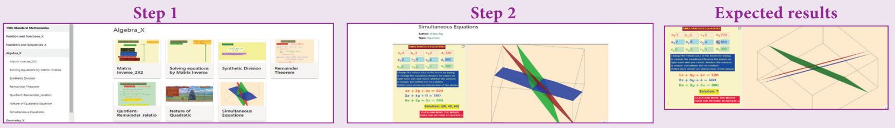

### ICT 3.2

**படி 1:** கீழ்காணும் உரலி/ விரைவுக் குறியீட்டைப் பயன்படுத்தி அல்லது ஸ்கேன் செய்வதன் மூலம் "Algebra" பக்கத்திற்கு் செல்க "Nature of Quadratic Equations" எனும் பயிற்சித்தாளைத் தேர்வு செய்க.

**படி 2:** கொடுக்கப்பட்ட பயிற்சிதாளாளில் கொடுக்கப்பட்ட நழுவலை நகர்த்துவதன் மூலம் குணகத்தை மாற்றலாம். 'New Position' – ஐ சொடுக்க, நழுவலை நகர்த்தி எல்லைகளைத் தீர்மானிக்கலாம். Gell ball மற்றும் fire –ஐ சொடுக்கவதன் மூலம் எல்லையைத் தகர்க்கலாம். இங்கு, ஒவ்வொரு கெழு மாறும் போதும் வளைவரை எவ்வாறு மாறுகிறது என்பதைத் தெரிந்து கொள்ளலாம்.

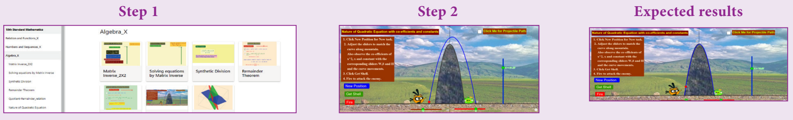

*இந்தப் படிகளைக் கொண்டு மற்ற செயல்பாடுகளைச் செய்க.*

[https://www.geogebra.org/m/jfr2zzgy#chapter/356193](https://www.geogebra.org/m/jfr2zzgy#chapter/356193)

அல்லது விரைவுச் செயலியை ஸ்கேன் செய்யவும்

