## Chapter 5 - Coordinate Geometry (ஆயத்தொலை வடிவியல்)

> "கோடு என்பது அகலமில்லா நீளமாகும்" —யூக்ளிட்

இன்றைய துருக்கியின் பெர்காவில் பிறந்தவர் அப்போலோனியஸ் ஆவார். இவரது சிறந்த படைப்பாக் கருதப்படும் "கூம்புகள்" மூலம் வட்டங்கள் மற்றும் பரவளையங்களை வடிவியல் ரீதியாக அறிமுகப்படுத்தினார். அவர் அடிப்படை நவீன ஆயத்தொலை வடிவியலோடு தொடர்புடைய ஆறு புத்தகங்களை எழுதியுள்ளார்.

கிரகத் தேற்றத்தையும், நடைமுறைக் கணக்குகளையும் தீர்ப்பதற்கு இவரது கருத்துகள் பயன்படுத்தப்படுகின்றன. சூரியக் கடிகாரத்தை உருவாக்கித் தனது வடிவியல் திறன்களை அறிவியலின் மற்ற பிரிவுகளுக்கும் பயன்படுத்தினார். அப்போலோனியஸ் வடிவியலைப் பல துறைகளுக்குப் பயன்படுத்திய காரணத்தால் "மாபெரும் வடிவியலாளர்" எனப் போற்றப்படுகிறார்.

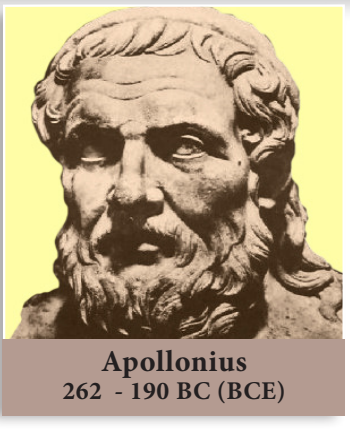

### கற்றல் விளைவுகள்

● கொடுக்கப்பட்ட மூன்று புள்ளிகளால் உருவான முக்கோணத்தின் பரப்பைக் காணுதல்.

● கொடுக்கப்பட்ட நான்கு புள்ளிகளால் உருவான நாற்கரத்தின் பரப்பைக் காணுதல்.

● ஒரு நேர்க்கோட்டின் சாய்வைக் காணுதல்.

● பல்வேறு வகைகளில் நேர்க்கோட்டின் சமன்பாடுகளைக் கண்டறிதல்.

● \( ax + by + c = 0 \) என்ற கோட்டிற்கு இணையான நேர்க்கோட்டின் சமன்பாட்டைக் கண்டறிதல்.

● \( ax + by + c = 0 \) என்ற கோட்டிற்குச் செங்குத்தான நேர்க்கோட்டின் சமன்பாட்டைக் கண்டறிதல்.

## 5.1 அறிமுகம் (Introduction)

ஆயத்தொலை வடிவியல் ஆனது பகுமுறை வடிவியல் என்றும் அழைக்கப்படுகிறது. இதில் ஒரு தளத்தின் வளைவரையானது இயற்கணிதச் சமன்பாடுகள் மூலம் குறிப்பிடப்படுகின்றது. எடுத்துக்காட்டாக, $x^2+y^2=1$ என்பது தளத்தில் ஓரலகு ஆரம் உடைய வட்டத்தின் சமன்பாடு ஆகும். இயற்கணிதச் சமன்பாடுகளை வடிவியல் வளைவரைகள் மூலம் குறிப்பதால் ஆயத்தொலை வடிவியல் என்பது வடிவியல் மற்றும் இயற்கணிதத்தை இணைக்கும் பாலமாகக் கருதப்படுகிறது. இந்தத் தொடர்பே வடிவியல் கணக்குகளை இயற்கணிதக் கணக்குகளாகவும், இயற்கணிதக் கணக்குகளை வடிவியல் கணக்குகளாகவும் மறு வடிவமைக்க உதவுகிறது. ஆயத்தொலை வடிவியலில் இயற்கணிதச் சமன்பாடுகளைக் காட்சி வடிவில் காண்பதால் ஆழமான புரிதல் ஏற்படுகிறது. எடுத்துக்காட்டாக, இரு மாறிலிகளில் அமைந்த ஒருபடிச் சமன்பாடு $ax+by+c=0$ ஒரு தளத்தில் நேர்கோட்டைக் குறிக்கும். மொத்தத்தில் கருத்துகளைக் காட்சி வழியாகப் புரிந்துகொள்ளவும், கணிதத்தில் புதிய கிளைகளை உருவாக்கவும் ஆயத்தொலை வடிவியல் ஒரு கருவியாகிறது.

முந்தைய வகுப்புகளில் ஆயத்தொலை வடிவியலின் அடிப்படைக் கருத்துகளான ஆயஅச்சு, ஆயதளம், புள்ளிகளைத் தளத்தில் குறித்தல், இரு புள்ளிகளுக்கு இடைப்பட்ட தொலைவு, பிரிவுச்சூத்திரம் ஆகியவை பற்றி பயின்றோம். இப்பொழுது, சில அடிப்படைச் சூத்திரங்களை நினைவு கூர்வோம்.

### நினைவு கூர்தல்

##### இரு புள்ளிகளுக்கு இடைப்பட்ட தொலைவு

$A(x_1,y_1)$ மற்றும் $B(x_2,y_2)$ என்ற இரு புள்ளிகளுக்கு இடைப்பட்ட தொலைவு

$$
|AB|=d=\sqrt{(x_2-x_1)^2+(y_2-y_1)^2}.
$$

##### ஒரு கோட்டுத் துண்டின் நடுப்புள்ளி

$A(x_1,y_1)$ மற்றும் $B(x_2,y_2)$ ஆகிய புள்ளிகளை இணைக்கும் கோட்டுத்துண்டின் நடுப்புள்ளி $M$ ஆனது

$$
\left(\frac{x_1+x_2}2,\frac{y_1+y_2}2\right).
$$

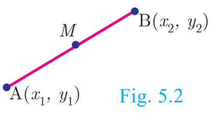

##### பிரிவுச்சூத்திரம்

**உட்புறமாகப் பிரிக்கும் புள்ளி**

$A(x_1,y_1)$ மற்றும் $B(x_2,y_2)$ ஆகிய இருவேறுபட்ட புள்ளிகளை இணைக்கும் $AB$ என்ற கோட்டுத்துண்டை உட்புறமாக $m:n$ என்ற விகிதத்தில் பிரிக்கும் புள்ளி $P(x,y)$ என்பது

$$
\left(\frac{mx_2+nx_1}{m+n},\frac{my_2+ny_1}{m+n}\right)
$$

ஆகும்.

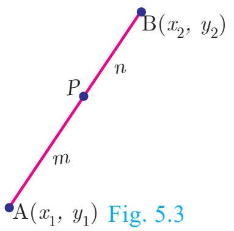

**வெளிப்புறமாகப் பிரிக்கும் புள்ளி**

$A(x_1,y_1)$ மற்றும் $B(x_2,y_2)$ ஆகிய இருவேறுபட்ட புள்ளிகளை இணைக்கும் $AB$ என்ற கோட்டுத்துண்டை வெளிப்புறமாக $m:n$ என்ற விகிதத்தில் பிரிக்கும் புள்ளி $P(x,y)$

என்பது

$$
\left(\frac{mx_2-nx_1}{m-n},\frac{my_2-ny_1}{m-n}\right)
$$

ஆகும்.

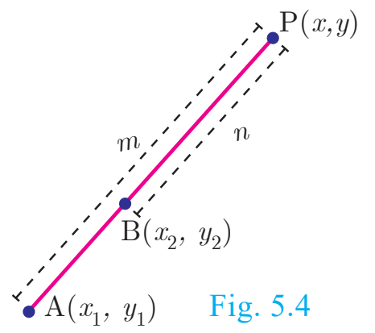

##### முக்கோணத்தின் நடுக்கோட்டு மையம்

$A(x_1,y_1)$, $B(x_2,y_2)$ மற்றும் $C(x_3,y_3)$ ஆகிய முனைகளைக் கொண்ட முக்கோணத்தின் நடுக்கோட்டு மையம் $G$

$$
\left(\frac{x_1+x_2+x_3}3,\frac{y_1+y_2+y_3}3\right)
$$

ஆகும்.

> **முன்னேற்றச் சோதனை**
>
> 1. அட்டவணையைப் பூர்த்தி செய்க.
>
> | எண் | புள்ளிகள் | தொலைவு | நடுப்புள்ளி | உட்புறம் புள்ளி | உட்புறம் விகிதம் | வெளிப்புறம் புள்ளி | வெளிப்புறம் விகிதம் |
> | --- | --- | --- | --- | --- | --- | --- | --- |
> | (i) | $(3,4),(5,5)$ | | | | $2:3$ | | $2:3$ |
> | (ii) | $(-7,13),(-3,1)$ | | | $\left(-\dfrac{13}3,5\right)$ | | $(-13,15)$ | |
>
> 2. $A(0,5)$, $B(5,0)$ மற்றும் $C(-4,-7)$-ஐ முனைகளாகக் கொண்ட முக்கோணத்தின் நடுக்கோட்டு மையம்___________.

## 5.2 முக்கோணத்தின் பரப்பு (Area of a Triangle)

முக்கோணத்தின் அடிப்பக்கம் மற்றும் உயரம் (குத்துயரம்) கொடுக்கப்பட்டால் அதன் பரப்பைக் காணும் முறையை முந்தைய வகுப்புகளில் கற்றுள்ளோம்.

முக்கோணத்தின் பரப்பு $=\dfrac12\times$ அடிப்பக்கம் $\times$ குத்துயரம் ச.அ. என்ற சூத்திரத்தைப் பயன்படுத்தினோம். ஒரு கோட்டில் அமையாத புள்ளிகளான $A(x_1,y_1)$, $B(x_2,y_2)$ மற்றும் C$(x_3,y_3)$-ஐக் கொண்டு $ABC$ என்ற முக்கோணத்தை அமைக்கலாம்.

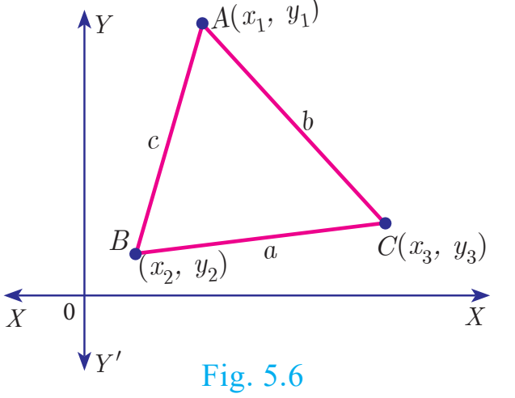

$a$, $b$, $c$ என்பன முக்கோணம் $ABC$-யின் பக்கங்களின் நீளங்கள் என்க. இங்கு, இரு புள்ளிகளுக்கு இடைப்பட்ட தொலைவைக் காணும் சூத்திரத்தைப் பயன்படுத்தி $AB=c$, $BC=a$, $CA=b$ ஆகியவற்றைக் கண்டுபிடிக்கிறோம்.

$2S=a+b+c$, எனக் கொண்டு, $\sqrt{s(s-a)(s-b)(s-c)}$ எனும் ஹெரோன்ஸ் சூத்திரத்தைப் பயன்படுத்தி முக்கோணம் $ABC$-யின் பரப்பளவைக் காணலாம். இம்முறையில் முக்கோணத்தின் பரப்பு காண்பது சற்று கடினமாகும்.

மூன்று முனைப் புள்ளிகளைப் பயன்படுத்தி முக்கோணம் பரப்பினைக் (அதன் பக்க அளவுகள் இல்லாமல்) கணக்கிடும் நேர்த்தியான முறையைப் பற்றி இங்கு விவரிப்போம்.

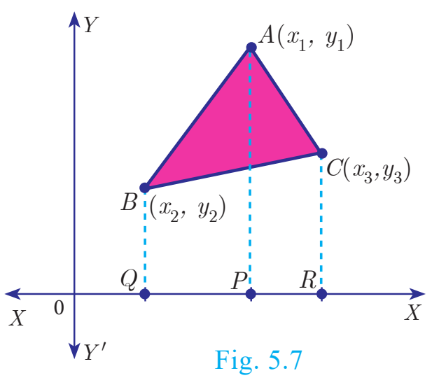

$A(x_1,y_1)$, $B(x_2,y_2)$ மற்றும் $C(x_3,y_3)$ என்பன முக்கோணம் $ABC$-யின் முனைப் புள்ளிகள் என்க. புள்ளிகள் $A$, $B$, $C$-லிருந்து $X$ அச்சுக்குச் செங்குத்தாக முறையே $AP$, $BQ$ மற்றும் $CR$ வரைக. $ABQP$, $APRC$ மற்றும் $BQRC$ ஆகியவை சரிவங்கள் ஆகும்.

இப்பொழுது படம் 5.7-லிருந்து, முக்கோணம் $ABC$-யின் பரப்பு

$=$ சரிவகம் $ABQP$-யின் பரப்பு $+$ சரிவகம் $APRC$-யின் பரப்பு$-$ சரிவகம் $BQRC$-யின் பரப்பு.

சரிவகத்தின் பரப்பு $=\dfrac12\times$ (இணைப் பக்கங்களின் கூடுதல்) $\times$ (இணைப் பக்கங்களுக்கு இடைப்பட்ட குத்துயரம்).

எனவே, $\triangle ABC$-யின் பரப்பு

$$
\begin{aligned}
&=\frac12(BQ+AP)QP+\frac12(AP+CR)PR-\frac12(BQ+CR)QR\\
&=\frac12(y_2+y_1)(x_1-x_2)+\frac12(y_1+y_3)(x_3-x_1)-\frac12(y_2+y_3)(x_3-x_2)\\
&=\frac12\{x_1(y_2-y_3)+x_2(y_3-y_1)+x_3(y_1-y_2)\}.
\end{aligned}
$$

இதிலிருந்து, $\triangle ABC$ யின் பரப்பானது கீழ்க்காணும் கோவையின் மிகை மதிப்பாகும்.

$$
\frac12\{x_1(y_2-y_3)+x_2(y_3-y_1)+x_3(y_1-y_2)\}\text{ சதுர அலகுகள்}
$$

புள்ளிகள் $A$, $B$, $C$-ஐ கடிகாரத்தின் எதிர் திசையில் எடுத்துக்கொண்டால், $\triangle ABC$-யின் முனைகள் $A(x_1,y_1)$, $B(x_2,y_2)$ மற்றும் $C(x_3,y_3)$ என்பவை "வரிசையாக எடுக்கப்பட்டவை" எனலாம். இவ்வாறு வரிசையாக எடுக்கப்பட்டால் முக்கோணத்தின் பரப்பு எப்பொழுதும் குறை எண்ணாக அமையாது.

##### மற்றொரு வடிவம்

கீழ்க்காணும் பட விளக்கமானது மேற்கண்ட சூத்திரத்தை மிக எளிதாகப் பெறுவதற்கு உதவிகரமாக இருக்கும்.

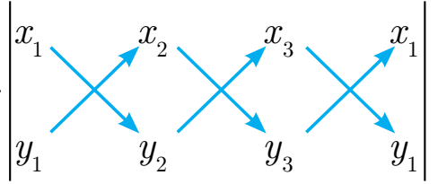

$$
\triangle ABC\text{ யின் பரப்பு}=\frac12\{(x_1y_2+x_2y_3+x_3y_1)-(x_2y_1+x_3y_2+x_1y_3)\}\text{ சதுர அலகுகள்}.
$$

> **குறிப்பு**
>
> முக்கோணத்தின் பரப்பு குறை எண்ணாக இருக்க இயலாது. எனவே குறை எண்ணாக இருந்தால் அதனை மிகை எண்ணாக எடுத்துக்கொள்ள வேண்டும்.

> **முன்னேற்றச் சோதனை**
>
> $P(0,-4)$, $Q(3,1)$ மற்றும் $R(-8,1)$ என்பன $\triangle PQR$-யின் முனைப் புள்ளிகள் எனில்
>
> 1. வரைபடத்தாளில் $\triangle PQR$-ஐ வரைக.
> 2. $\triangle PQR$ ஆனது சம பக்கம் உடையதா எனச் சோதிக்க.
> 3. $\triangle PQR$-யின் பரப்பைக் காண்க.
> 4. $QP$-யின் நடுப்புள்ளி $M$-யின் ஆயப் புள்ளிகளைக் காண்க.
> 5. $QR$ யின் நடுப்புள்ளி $N$-யின் ஆயப் புள்ளிகளைக் காண்க.
> 6. $\triangle MPN$-யின் பரப்பைக் காண்க.
> 7. $\triangle MPN$ மற்றும் $\triangle PQR$-யின் பரப்புகளின் விகிதம் என்ன?

### 5.2.1 ஒரு கோடமைந்த மூன்று புள்ளிகள் (Collinearity of three points)

$A(x_1,y_1)$, $B(x_2,y_2)$ மற்றும் $C(x_3,y_3)$ என்ற வெவ்வேறான மூன்று புள்ளிகள் ஒரு கோடமைந்ததாக இருந்தால் அவைகள் ஒரு முக்கோணத்தை அமைக்காது. ஏனெனில் இம்முக்கோணத்திற்குக் குத்துயரம் (உயரம்) இல்லை. எனவே $A(x_1,y_1)$, $B(x_2,y_2)$ மற்றும் $C(x_3,y_3)$ என்ற மூன்று புள்ளிகள் ஒரு கோடமைந்தவை எனில், $\triangle ABC$-யின் பரப்பு $=0$.

இதுபோல, $\triangle ABC$-யின் பரப்பு பூச்சியம் எனில், கொடுக்கப்பட்ட மூன்று புள்ளிகள் ஒரே நேர்க்கோட்டில் அமையும்.

இதிலிருந்து $A(x_1,y_1)$, $B(x_2,y_2)$ மற்றும் $C(x_3,y_3)$ என்ற மூன்று வெவ்வேறு புள்ளிகள் ஒரு கோடமைந்தவையாக இருந்தால், இருந்தால் மட்டுமே $\triangle ABC$-யின் பரப்பு $=0$

> **குறிப்பு — ஒரு கோடமை புள்ளிகளுக்கான மற்றொரு நிபந்தனை**
>
> $A(x_1,y_1)$, $B(x_2,y_2)$ மற்றும் $C(x_3,y_3)$ என்பன ஒரே கோடமைந்த புள்ளிகள் எனில்
>
> $x_1(y_2-y_3)+x_2(y_3-y_1)+x_3(y_1-y_2)=0$ அல்லது $x_1y_2+x_2y_3+x_3y_1=x_1y_3+x_2y_1+x_3y_2$.

## 5.3 நாற்கரத்தின் பரப்பு (Area of a Quadrilateral)

மூலைவிட்டம் $AC$ மூலம் நாற்கரம் $ABCD$-யை $ABC$ மற்றும் $ACD$ என்ற இரு முக்கோணங்களாகப் பிரிக்கிறோம்.

கொடுக்கப்பட்ட சூத்திரத்தைக் கொண்டு முக்கோணம் $ABC$ மற்றும் $ACD$-யின் பரப்பைக் கணக்கிடுகிறோம்.

இப்பொழுது, நாற்கரம் $ABCD$-யின் பரப்பு $=\triangle ABC$-யின் பரப்பு $+\triangle ACD$-யின் பரப்பு, இந்த முறையைப் பயன்படுத்திக் கொடுக்கப்பட்ட முனைப் புள்ளிகளை உடைய நாற்கரத்தின் பரப்பைக் கணக்கிடலாம்.

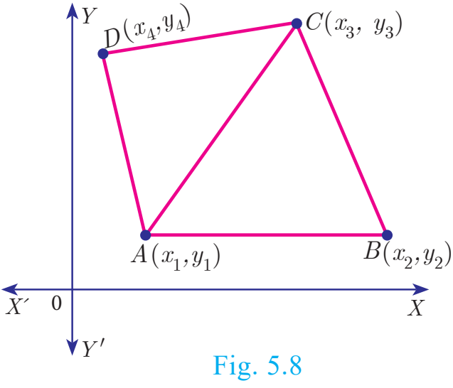

> **சிந்தனைக் களம்**
>
> பரப்பு பூச்சியமாக உள்ளவாறு எத்தனை முக்காணங்கள் அமைக்க முடியும்?

$A(x_1,y_1)$, $B(x_2,y_2)$, $C(x_3,y_3)$ மற்றும் $D(x_4,y_4)$ என்பன நாற்கரம் $ABCD$-யின் முனைப் புள்ளிகள் என்க.

நாற்கரம் $ABCD$-யின் பரப்பு $=\triangle ABD$-யின் பரப்பு $+\triangle BCD$-யின் பரப்பு (படம் 5.9)

$$
\begin{aligned}
&=\frac12\{(x_1y_2+x_2y_4+x_4y_1)-(x_2y_1+x_4y_2+x_1y_4)\}\\
&\quad+\frac12\{(x_2y_3+x_3y_4+x_4y_2)-(x_3y_2+x_4y_3+x_2y_4)\}\\
&=\frac12\{(x_1y_2+x_2y_3+x_3y_4+x_4y_1)-(x_2y_1+x_3y_2+x_4y_3+x_1y_4)\}\\
&=\frac12\{(x_1-x_3)(y_2-y_4)-(x_2-x_4)(y_1-y_3)\}\text{ சதுர அலகுகள்}.
\end{aligned}
$$

மேற்கண்ட சூத்திரத்தைப் பின்வரும் படவிளக்கம் மூலம் எளிதில் நினைவிற் கொள்ளலாம். $A(x_1,y_1)$, $B(x_2,y_2)$, $C(x_3,y_3)$ மற்றும் $D(x_4,y_4)$ என்ற புள்ளிகளைக் கடிகார முள்ளின் எதிர் திசையில் அமையுமாறு எடுத்துக்கொண்டு முக்கோணத்தின் பரப்பு காணும் முறை போலப் பின்வருமாறு எழுதலாம்.

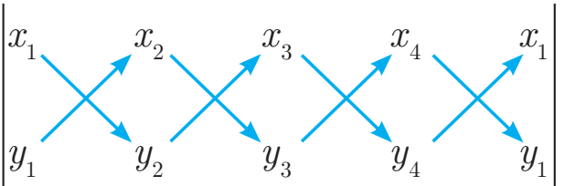

$$
\text{நாற்கரம் }ABCD\text{ யின் பரப்பு}=\frac12\{(x_1y_2+x_2y_3+x_3y_4+x_4y_1)-(x_2y_1+x_3y_2+x_4y_3+x_1y_4)\}\text{ சதுர அலகுகள்}.
$$

> **குறிப்பு**
>
> - ஒரு நாற்கரத்தைப் பொதுவான பரப்பு இல்லாத இரு முக்கோணங்களாகப் பிரித்து அம்முக்கோணங்களின் பரப்புகளைக் கூட்டினால் நாற்கரத்தின் பரப்பு கிடைக்கும்.
> - நாற்கரத்தின் பரப்பு ஒருபோதும் குறை எண்ணாக இருக்க இயலாது. எனவே இதன் பரப்பை மிகை எண்ணாக எடுத்துக்கொள்ள வேண்டும்.

> **சிந்தனைக் களம்**
>
> 1. $(a,a)$, $(-a,a)$, $(a,-a)$ மற்றும் $(-a,-a)$, (இங்கு $a\ne0$) ஆகியவற்றை முனைப்புள்ளிகளாகக் கொண்ட நாற்கரத்தின் பரப்பு $64$ ச. அலகுகள் எனில், அந்த நாற்கரத்தின் பெயர் என்ன?
> 2. $a$-யின் அனைத்து மதிப்புகளையும் காண்க.

#### எடுத்துக்காட்டு 5.1

$(-3,5)$, $(5,6)$ மற்றும் $(5,-2)$ ஆகியவற்றை முனைகளாகக் கொண்ட முக்கோணத்தின் பரப்பைக் காண்க.

**தீர்வு** படத்தில், கொடுக்கப்பட்ட புள்ளிகளைக் கடிகார முள்ளின் எதிர் திசையில் அமையுமாறு குறிக்கவும்.

$A(-3,5)$, $B(5,-2)$, $C(5,6)$ என்பன முக்கோணத்தின் முனைகள் என்க.

$(x_1,y_1)$ $(x_2,y_2)$ $(x_3,y_3)$

$\triangle ABC$-யின் பரப்பு

$$
\begin{aligned}
&=\frac12\{(x_1y_2+x_2y_3+x_3y_1)-(x_2y_1+x_3y_2+x_1y_3)\}\\
&=\frac12\{(6+30+25)-(25-10-18)\}\\
&=\frac12\{61+3\}\\
&=\frac12(64)=32\text{ சதுர அலகுகள்}
\end{aligned}
$$

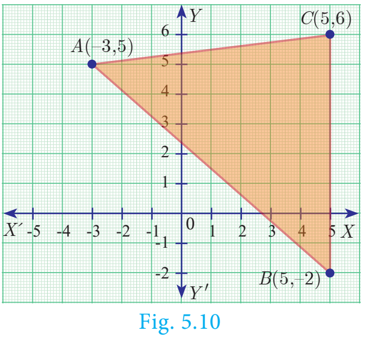

#### எடுத்துக்காட்டு 5.2

$P(-1.5,3)$, $Q(6,-2)$ மற்றும் $R(-3,4)$ ஆகிய புள்ளிகள் ஒரே நேர்க்கோட்டில் அமையும் எனக் காட்டுக.

**தீர்வு** $P(-1.5,3)$, $Q(6,-2)$, $R(-3,4)$ ஆகியன கொடுக்கப்பட்ட புள்ளிகள் ஆகும்.

$$
\begin{aligned}
\triangle PQR\text{-யின் பரப்பு}&=\frac12\{(x_1y_2+x_2y_3+x_3y_1)-(x_2y_1+x_3y_2+x_1y_3)\}\\
&=\frac12\{(3+24-9)-(18+6-6)\}=\frac12\{18-18\}=0.
\end{aligned}
$$

எனவே, கொடுக்கப்பட்ட புள்ளிகள் ஒரே நேர்க்கோட்டில் அமைந்துள்ளன.

#### எடுத்துக்காட்டு 5.3

$A(-1,2)$, $B(k,-2)$ மற்றும் $C(7,4)$ ஆகியவற்றை வரிசையான முனைப் புள்ளிகளாகக் கொண்ட முக்கோணத்தின் பரப்பு $22$ சதுர அலகுகள் எனில், $k$-யின் மதிப்புக் காண்க.

**தீர்வு** $A(-1,2)$, $B(k,-2)$ மற்றும் $C(7,4)$ ஆகியன முனைப் புள்ளிகள் ஆகும்.

$\triangle ABC$-யின் பரப்பு $22$ சதுர அலகுகள்.

$$
\begin{aligned}
\frac12\{(x_1y_2+x_2y_3+x_3y_1)-(x_2y_1+x_3y_2+x_1y_3)\}&=22\\
\frac12\{(2+4k+14)-(2k-14-4)\}&=22\\
2k+34&=44\\
2k=10\ \Rightarrow\ k&=5
\end{aligned}
$$

#### எடுத்துக்காட்டு 5.4

$P(-1,-4)$, $Q(b,c)$ மற்றும் $R(5,-1)$ என்பன ஒரே நேர்க்கோட்டில் அமையும் புள்ளிகள் என்க. மேலும் $2b+c=4$ எனில், $b$ மற்றும் $c$-யின் மதிப்பு காண்க.

**தீர்வு** $P(-1,-4)$, $Q(b,c)$ மற்றும் $R(5,-1)$ என்ற புள்ளிகள் ஒரே நேர்க்கோட்டில் அமைவதால்

$$
\begin{aligned}
\triangle PQR\text{-யின் பரப்பு}&=0\\
\frac12\{(x_1y_2+x_2y_3+x_3y_1)-(x_2y_1+x_3y_2+x_1y_3)\}&=0\\
\frac12\{(-c-b-20)-(-4b+5c+1)\}&=0\\
-c-b-20+4b-5c-1&=0\\
b-2c&=7\quad\cdots(1)
\end{aligned}
$$

மேலும், $2b+c=4\quad\cdots(2)$ (கொடுக்கப்பட்டது)

$(1)$ மற்றும் $(2)$-ஐ தீர்ப்பதன் மூலம் $b=3$, $c=-2$

#### எடுத்துக்காட்டு 5.5

ஓர் அறையின் தளமானது ஒரே மாதிரியான முக்கோண வடிவத் தரை ஓடுகளைக் கொண்டு (tiles) அமைக்கப்படுகிறது. அதில் ஓர் ஓட்டின் முனைகள் $(-3,2)$, $(-1,-1)$ மற்றும் $(1,2)$ ஆகும். தரைத்தளத்தை முழுமையாக அமைக்க $110$ ஓடுகள் தேவைப்படுகின்றது எனில், அதன் பரப்பைக் காண்க.

**தீர்வு** ஓர் ஓட்டின் முனைப் புள்ளிகள் $(-3,2)$, $(-1,-1)$ மற்றும் $(1,2)$ ஆகும்.

இந்த ஓட்டின் பரப்பு

$$
\begin{aligned}
&=\frac12\{(3-2+2)-(-2-1-6)\}\text{ ச. அலகுகள்}\\
&=\frac12(12)=6\text{ ச. அலகுகள்}
\end{aligned}
$$

தரைத்தளமானது ஒரே மாதிரியான $110$ ஓடுகளால் நிரப்பப்படுவதால்,

$$
\text{தரைத்தளத்தின் பரப்பு}=110\times6=660\text{ ச. அலகுகள்}.
$$

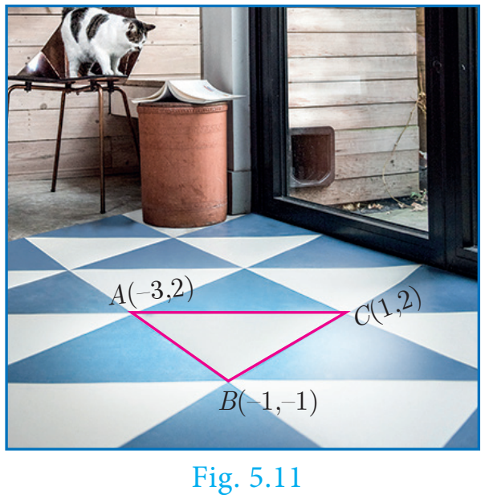

#### எடுத்துக்காட்டு 5.6

$(8,6)$, $(5,11)$, $(-5,12)$ மற்றும் $(-4,3)$ ஆகிய புள்ளிகளை முனைகளாகக் கொண்ட நாற்கரத்தின் பரப்பைக் காண்க.

**தீர்வு** நாற்கரத்தின் பரப்பைக் காண்பதற்கு முன்பாகக் கொடுக்கப்பட்ட புள்ளிகளை வரைபடத்தில் குறிக்கவேண்டும்.

$A(8,6)$, $B(5,11)$, $C(-5,12)$ மற்றும் $D(-4,3)$ என்பன முனைப் புள்ளிகள் ஆகும்.

எனவே, நாற்கரம் $ABCD$-யின் பரப்பு

$$
\begin{aligned}
&=\frac12\{(x_1y_2+x_2y_3+x_3y_4+x_4y_1)-(x_2y_1+x_3y_2+x_4y_3+x_1y_4)\}\\
&=\frac12\{(88+60-15-24)-(30-55-48+24)\}\\
&=\frac12\{109+49\}\\
&=\frac12\{158\}=79\text{ ச. அலகுகள்}
\end{aligned}
$$

> **முன்னேற்றச் சோதனை**
>
> கொடுக்கப்பட்ட நாற்கரம் $ABCD$-யின் முனைகள் $A(-3,-8)$, $B(6,-6)$, $C(4,2)$, $D(-8,2)$ ஆகும்
>
> 1. $\triangle ABC$-யின் பரப்பு காண்க.
> 2. $\triangle ACD$-யின் பரப்பு காண்க.
> 3. $\triangle ABC$-யின் பரப்பு $+\triangle ACD$-யின் பரப்பு காண்க.
> 4. நாற்கரம் $ABCD$-யின் பரப்பு காண்க.
> 5. கேள்வி $3$ மற்றும் $4$-யின் விடைகளை ஒப்பிடுக.
>
> 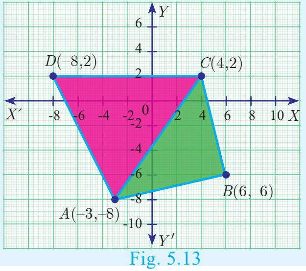

#### எடுத்துக்காட்டு 5.7

கொடுக்கப்பட்ட படமானது ஒரு வளாகத்தில் புதிய வாகன நிறுத்தம் ஏற்படுத்த அமைக்கப்பட்ட பகுதியைக் காட்டுகிறது. இதை அமைப்பதற்கு ஒரு சதுர அடிக்கு ₹1300 செலவாகும் என மதிப்பிடப்படுகிறது எனில், வாகன நிறுத்தம் ஏற்படுத்துவதற்குத் தேவையான மொத்தச் செலவைக் கணக்கிடவும்.

**தீர்வு** $A(2,2)$, $B(5,5)$, $C(4,9)$ மற்றும் $D(1,7)$ என்பது நாற்கர வடிவ வாகன நிறுத்தத்தின் முனைப் புள்ளிகள் ஆகும்.

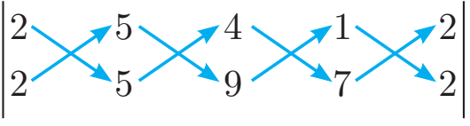

$$
\begin{aligned}
\text{வாகன நிறுத்தத்தின் பரப்பு}&=\frac12\{(x_1y_2+x_2y_3+x_3y_4+x_4y_1)-(x_2y_1+x_3y_2+x_4y_3+x_1y_4)\}\\
&=\frac12\{(10+45+28+2)-(10+20+9+14)\}\\
&=\frac12\{85-53\}\\
&=\frac12(32)=16\text{ சதுர அலகுகள்}.
\end{aligned}
$$

வாகன நிறுத்தத்தின் பரப்பு $=16$ சதுர அடிகள்

ஒரு சதுர அடி அமைக்க ஆகும் செலவு $=₹1300$

வாகன நிறுத்தம் அமைக்க ஆகும் மொத்தச் செலவு $=16\times1300=₹20800$

> **செயல்பாடு 1**
>
> (i) ஒரு வரைபடத்தாளை எடுத்துக்கொள்க.
>
> (ii) $(0,0)$ மற்றும் $(6,0)$ என்ற புள்ளிகளால் இணைக்கப்பட்ட அடிக்கோட்டினைக் கொண்ட முக்கோணத்தினைக் கருதுக.
>
> (iii) $(1,1)$, $(2,2)$, $(3,3)$, $(4,4)$, $(5,5)$ ஆகியவற்றை, மேற்கூறிய முக்கோணத்தின் மூன்றாவது முனைகளாகக் கொண்டு கிடைக்கும் முக்கோணங்களின் பரப்பு காண்க. விவரங்களை அட்டவணையில் நிரப்புக.
>
> (iv) $A_1,A_2,A_3,A_4,A_5$-லிருந்து நீங்கள் காணும் அமைப்பை எழுதுக.
>
> | மூன்றாவது முனை | முக்கோணத்தின் பரப்பு |
> | --- | --- |
> | $(1,1)$ | $A_1=$ |
> | $(2,2)$ | $A_2=$ |
> | $(3,3)$ | $A_3=$ |
> | $(4,4)$ | $A_4=$ |
> | $(5,5)$ | $A_5=$ |
>
> (v) மூன்றாவது முனைப் புள்ளிகளாக $(1,2)$, $(2,4)$, $(3,8)$, $(4,16)$, $(5,32)$ ஆகியவற்றைக் கொண்டு படி (iii)-ஐ மீண்டும் செய்க.
>
> (vi) புதிய விவரங்களைக் கொண்டு அட்டவணையை நிரப்புக.
>
> (vii) $A_1,A_2,A_3,A_4,A_5$ உருவாக்கும் அமைப்பு என்ன?
>
> | மூன்றாவது முனை | முக்கோணத்தின் பரப்பு |
> | --- | --- |
> | $(1,2)$ | $A_1=$ |
> | $(2,4)$ | $A_2=$ |
> | $(3,8)$ | $A_3=$ |
> | $(4,16)$ | $A_4=$ |
> | $(5,32)$ | $A_5=$ |

> **செயல்பாடு 2**
>
> நிழலிட்ட பகுதியின் பரப்பைக் காண்க.
>
> 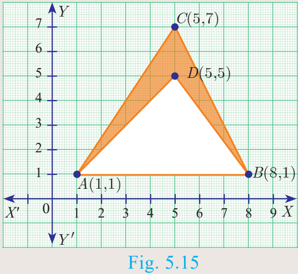

> **உங்களுக்குத் தெரியுமா?**
>
> 1630-களில் நவீன ஆயத்தொலை வடிவியல் பற்றிய கருத்துகளை உருவாக்கியவர்கள் இரு பிரஞ்சு கணிதவியலாளர்களான ரானே டெஸ்கார்டிஸ் மற்றும் பியரி டீ·பெர்மா ஆவர்.

### பயிற்சி 5.1

1. கீழ்க்காணும் புள்ளிகளால் அமைக்கப்படும் முக்கோணத்தின் பரப்பு காண்க.

   (i) $(1,-1)$, $(-4,6)$ மற்றும் $(-3,-5)$

   (ii) $(-10,-4)$, $(-8,-1)$ மற்றும் $(-3,-5)$

2. கீழ்க்காணும் புள்ளிகள் ஒரே நேர்க்கோட்டில் அமையுமா எனத் தீர்மானிக்கவும்.

   (i) $\left(-\dfrac12,3\right)$, $(-5,6)$ மற்றும் $(-8,8)$

   (ii) $(a,b+c)$, $(b,c+a)$ மற்றும் $(c,a+b)$

3. வரிசையில் அமைந்த முக்கோணத்தின் முனைப் புள்ளிகளும், அதன் பரப்பளவுகளும் அட்டவணையில் கொடுக்கப்பட்டுள்ளன. '$p$'-யின் மதிப்பைக் காண்க.

   | எண் | முனைப் புள்ளிகள் | பரப்பு (சதுர அலகில்) |
   | --- | --- | --- |
   | (i) | $(0,0),(p,8),(6,2)$ | 20 |
   | (ii) | $(p,p),(5,6),(5,-2)$ | 32 |

4. கொடுக்கப்பட்ட புள்ளிகள் ஒரு கோட்டில் அமைந்தவை எனில், '$a$'-யின் மதிப்பைக் காண்க.

   (i) $(2,3)$, $(4,a)$ மற்றும் $(6,-3)$

   (ii) $(a,2-2a)$, $(-a+1,2a)$ மற்றும் $(-4-a,6-2a)$

5. கொடுக்கப்பட்ட புள்ளிகளை முனைகளாகக் கொண்ட நாற்கரத்தின் பரப்பைக் காண்க.

   (i) $(-9,-2)$, $(-8,-4)$, $(2,2)$ மற்றும் $(1,-3)$

   (ii) $(-9,0)$, $(-8,6)$, $(-1,-2)$ மற்றும் $(-6,-3)$

6. $(-4,-2)$, $(-3,k)$, $(3,-2)$ மற்றும் $(2,3)$ ஆகிய முனைகளை வரிசையாக கொண்ட நாற்கரத்தின் பரப்பு $28$ ச. அலகுகள் எனில், $k$-யின் மதிப்புக் காண்க.

7. $A(-3,9)$, $B(a,b)$ மற்றும் $C(4,-5)$ என்பன ஒரு கோடமைந்த புள்ளிகள் மற்றும் $a+b=1$ எனில், $a$ மற்றும் $b$-யின் மதிப்புக் காண்க.

8. $\triangle ABC$-யின் பக்கங்கள் $AB$, $BC$ மற்றும் $AC$ ஆகியவற்றின் நடுப்புள்ளிகள் முறையே $P(11,7)$, $Q(13.5,4)$ மற்றும் $R(9.5,4)$ என்க. முக்கோணத்தின் முனைப் புள்ளிகள் $A,B$ மற்றும் $C$ காண்க. மேலும், $\triangle ABC$-யின் பரப்பை $\triangle PQR$-யின் பரப்புடன் ஒப்பிடுக.

9. நாற்கர வடிவ நீச்சல்குளத்தின் கான்கிரீட் உள்முற்றமானது படத்தில் காட்டியுள்ளபடி அமைக்கப்பட்டுள்ளது எனில், உள்முற்றத்தின் பரப்பு காண்க.

   

10. $A(-5,-4)$, $B(1,6)$ மற்றும் $C(7,-4)$ ஆகியவற்றை முனைப் புள்ளிகளாகக் கொண்ட முக்கோண வடிவக் கண்ணாடிக்கு வர்ணம் பூசப்படுகிறது. 6 சதுர அடி பரப்புக்கு வர்ணம் பூச ஒரு வாளி தேவைப்படுகிறது எனில் கண்ணாடியின் முழுப் பகுதியையும் ஒரு முறை வர்ணம் பூச எத்தனை வாளிகள் தேவைப்படும்?

11. படத்தைப் பயன்படுத்திப் பரப்பைக் காண்க. (i) முக்கோணம் $AGF$ (ii) முக்கோணம் $FED$ (iii) நாற்கரம் $BCEG$.

    

## 5.4 கோட்டின் சாய்வு (Inclination of a line)

கோட்டின் சாய்வு அல்லது **சாய்வுக் கோணம்** (inclination of a line) என்பது $X$ அச்சின் மிகை திசைக்கும், நேர்க்கோட்டிற்கும் இடையே, கடிகார முள்ளின் எதிர் திசையில் அமைந்த கோணம் ஆகும். சாய்வுக் கோணம் $\theta$ எனக் குறிக்கப்படுகிறது.

> **குறிப்பு**
>
> - $X$ அச்சு மற்றும் $X$ அச்சுக்கு இணையான நேர்க்கோடுகளின் சாய்வுக்கோணம் $0^\circ$ ஆகும்.
> - $Y$ அச்சு மற்றும் $Y$ அச்சுக்கு இணையான நேர்க்கோடுகளின் சாய்வுக் கோணம் $90^\circ$ ஆகும்.

### 5.4.1 நேர்க்கோட்டின் சாய்வு (Slope of a Straight line)

சாலைகளை அமைக்கும்போது, எவ்வளவு சாய்வாகச் சாலை இருக்கவேண்டும் என்பதை அறிந்துகொள்ளவேண்டும். அதேபோல மாடிப் படிக்கட்டுகள் அமைக்கும்போதும், அதன் சாய்வுத் தன்மையைக் கருத்தில் கொள்ள வேண்டும். இந்தச் சாய்வுத் தன்மையினால் சாதாரணச் சாலையில் பயணிப்பதைவிட மலை அல்லது மேம்பாலம் ஆகியவற்றில் பயணிப்பது கடினமானதாக உணர்கிறோம். இவையனைவிலும் முக்கிய அம்சமாக இருப்பது "சாய்வுத் தன்மை" (steepness) ஆகும். இந்தச் சாய்வுத் தன்மையானது சாய்வு அல்லது சாய்வின் அளவு (Slope or gradiant) என்று அழைக்கப்படுகிறது.

சாய்வு என்ற கருத்தானது பொருளாதாரத்தில் முக்கியப் பங்கு வகிக்கிறது. ஒரு குறிப்பிட்ட காலத்தில் ஒரு பொருளின் விலைக்கேற்ப அதன் தேவை மாறுபடுவதைக் கணக்கிடுவதில் இந்தக் கருத்து பயன்படுத்தப்படுகிறது. சாய்வானது சாய்வுத் தன்மை (steepness) மற்றும் திசை (Direction) என்ற இரு காரணிகளை உள்ளடக்கியதாகும்.

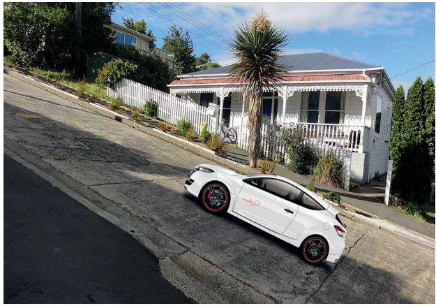

> **வரையறை**
>
> நேர்குத்தற்ற நேர்க்கோட்டின் (non-vertical line) சாய்வுக் கோணம் $\theta$ எனில், $\tan\theta$ என்பது அக்கோட்டின் சாய்வு ஆகும். இதை $m$ எனக் குறிக்கலாம்.
>
> எனவே, நேர்க்கோட்டின் சாய்வு $m=\tan\theta$, $0\leq\theta\leq180^\circ$, $\theta\neq90^\circ$ ஆகும்.

##### இரு புள்ளிகள் கொடுக்கப்பட்டால் நேர்க்கோட்டின் சாய்வைக் காணல்

$$
\begin{aligned}
\text{சாய்வு }m&=\tan\theta\\
&=\frac{\text{எதிர் பக்கம்}}{\text{அடுத்துள்ள பக்கம்}}\\
&=\frac{BC}{AC}\\
m&=\frac{y_2-y_1}{x_2-x_1}.
\end{aligned}
$$

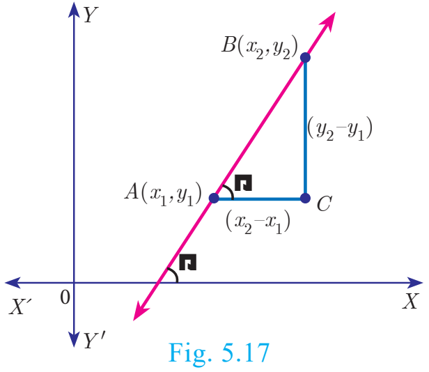

$$
\boxed{\text{சாய்வு }m=\dfrac{y\text{ ஆயத்தொலைவில் ஏற்படும் வித்தியாசம்}}{x\text{ ஆயத்தொலைவில் ஏற்படும் வித்தியாசம்}}}
$$

> **குறிப்பு**
>
> செங்குத்துக் கோட்டின் சாய்வு வரையறுக்கப்பட இயலாது (Undefined).

$(x_1,y_1)$ மற்றும் $(x_2,y_2)$, $x_1\neq x_2$ என்ற புள்ளிகள் வழியாகச் செல்லும் நேர்க்கோட்டின் சாய்வு $\dfrac{y_2-y_1}{x_2-x_1}$ ஆகும்.

##### சாய்வுகளின் மதிப்புகள்

| வ. எண் | நிபந்தனை | சாய்வு | வரைபடம் |
| --- | --- | --- | --- |
| (i) | $\theta=0^\circ$ | நேர்க்கோடானது $X$ அச்சின் மிகை திசையில் இணையாக அமையும். | 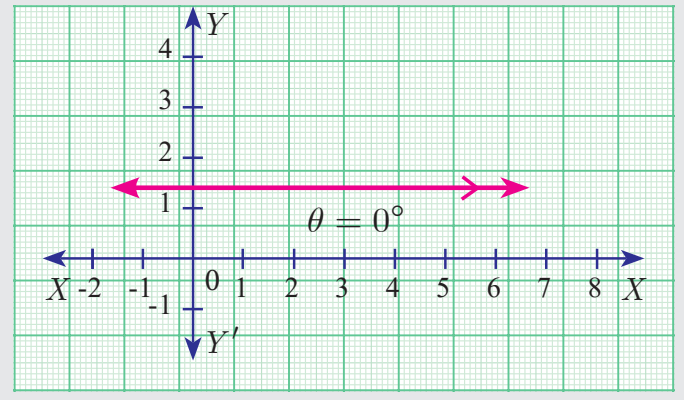 |
| (ii) | $0<\theta<90^\circ$ | நேர்க்கோட்டின் சாய்வு ஒரு மிகை எண் ஆகும். (நேர்க்கோடானது இடமிருந்து வலது நோக்கி உயரும்போது சாய்வானது மிகை எண் ஆகும்) | 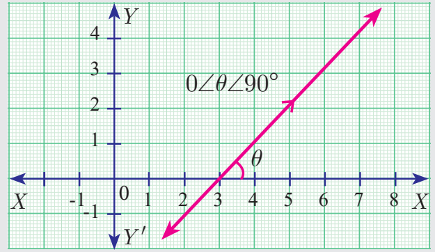 |
| (iii) | $90^\circ<\theta<180^\circ$ | நேர்க்கோட்டின் சாய்வு ஒரு குறை எண் ஆகும். (நேர்க்கோடானது இடமிருந்து வலது நோக்கி இறங்கும் போது சாய்வானது குறை எண் ஆகும்). | 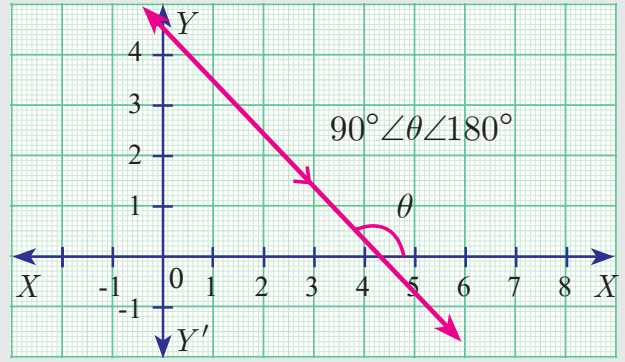 |
| (iv) | $\theta=180^\circ$ | நேர்க்கோடானது $X$ அச்சின் குறை திசையில் இணையாக இருக்கும். |  |
| (v) | $\theta=90^\circ$ | சாய்வை வரையறுக்க இயலாது. | 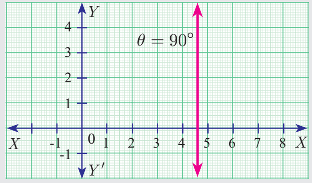 |

> **செயல்பாடு 3**
>
> வரைபடமானது $l_1$, $l_2$, $l_3$ மற்றும் $l_4$ என்ற நான்கு நேர்க்கோடுகளைக் கொண்டுள்ளது.
>
> (i) மிகைச் சாய்வு கொண்ட நேர்க்கோடுகள் எவை?
>
> (ii) குறைச் சாய்வு கொண்ட நேர்க்கோடுகள் எவை?
>
> 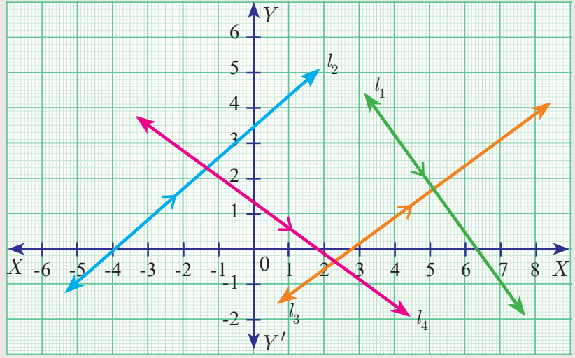

> **முன்னேற்றச் சோதனை**
>
> கீழே கொடுக்கப்பட்ட நேர்க்கோடுகளின் சாய்வைக் கண்டுபிடிக்க. கணக்கு (iii)-ன் தீர்வு தரப்பட்டுள்ளது.
>
> 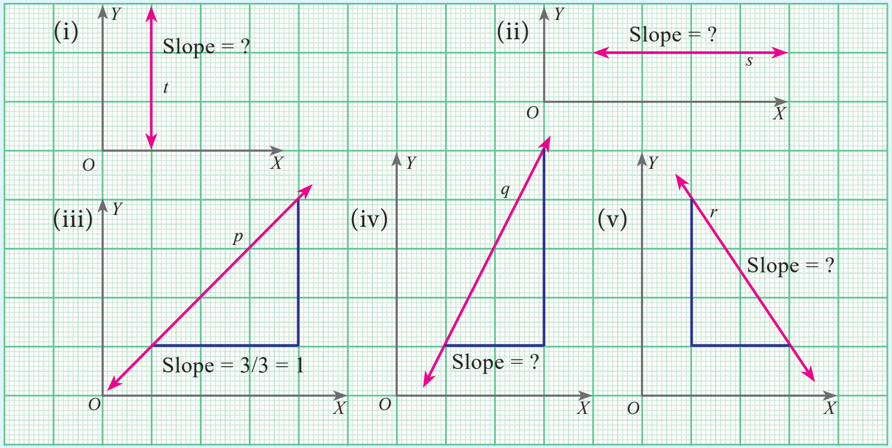
>
> **தீர்வு** (iii) நேர்க்கோடு $p$-யின் சாய்வு $=\dfrac{y\text{ ஆயத்தொலைவில் ஏற்படும் வித்தியாசம்}}{x\text{ ஆயத்தொலைவில் ஏற்படும் வித்தியாசம்}}=\dfrac{3}{3}=1$.

### 5.4.2 இணைகோடுகளின் சாய்வுகள் (Slopes of parallel lines)

இரண்டு நேர்குத்தற்ற கோடுகளின் சாய்வுகள் சமமாக இருந்தால், இருந்தால் மட்டுமே அவை இணையாக இருக்கும்.

$l_1$ மற்றும் $l_2$ என்ற இரு நேர்குத்தற்ற கோடுகளின் சாய்வுகள் முறையே $m_1$ மற்றும் $m_2$ என்க.

நேர்க்கோடுகள் $X$ அச்சின் மிகை திசையில் ஏற்படுத்தும் சாய்வுக் கோணம் $\theta_1$ மற்றும் $\theta_2$ என்க.

$l_1$ மற்றும் $l_2$ இணை கோடுகள் எனக் கொள்க.

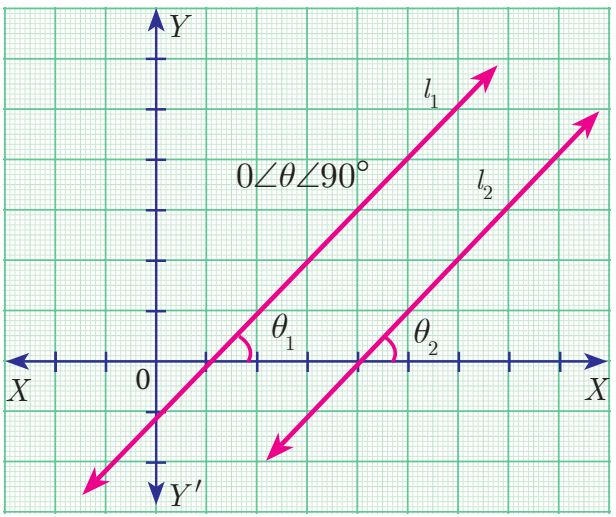

$$
\begin{aligned}
\theta_1&=\theta_2\quad(\theta_1,\theta_2\text{ என்பன ஒத்த கோணங்கள் என்பதால்})\\
\tan\theta_1&=\tan\theta_2\\
m_1&=m_2
\end{aligned}
$$

ஆகவே, சாய்வுகள் சமம்.

எனவே, நேர்குத்தற்ற இணையான கோடுகளின் சாய்வுகள் சமம்.

##### மறுதலையாக

சாய்வுகள் சமம் என்க. ஆகவே

$$
\begin{aligned}
m_1&=m_2\\
\tan\theta_1&=\tan\theta_2\\
\theta_1&=\theta_2\quad(0\leq\theta_1\leq180^\circ,\ 0\leq\theta_2\leq180^\circ\text{ என்பதால்})
\end{aligned}
$$

அதாவது ஒத்த கோணங்கள் சமம்.

எனவே, இரு நேர்குத்தற்ற கோடுகளின் சாய்வுகள் சமமெனில் அக்கோடுகள் இணையாகும்.

ஆகையினால் நேர்குத்தற்ற இரு கோடுகள் இணையாக இருக்க வேண்டுமாயின், அக்கோடுகளின் சாய்வுகள் சமமாக இருக்க வேண்டும்.

### 5.4.3 செங்குத்துக்கோடுகளின் சாய்வுகள் (Slopes of perpendicular lines)

இரண்டு நேர்குத்தற்ற கோடுகளின் சாய்வுகளான $m_1$, $m_2$ இவற்றின் பெருக்கல் பலன் அதாவது $m_1m_2=-1$ ஆக இருந்தால், இருந்தால் மட்டுமே, அக்கோடுகள் செங்குத்தாக இருக்கும்.

$l_1$ மற்றும் $l_2$ ஆகிய நேர்குத்தற்ற இருகோடுகளின் சாய்வுகள் முறையே $m_1$ மற்றும் $m_2$ என்க. அவற்றின் சாய்வுக் கோணங்கள் முறையே $\theta_1$ மற்றும் $\theta_2$ என்க.

மேலும் $m_1=\tan\theta_1$ மற்றும் $m_2=\tan\theta_2$

முதலில், $l_1$ மற்றும் $l_2$ ஒன்றுக்கொன்று செங்குத்து எனக் கொள்க.

$\angle ABC=90^\circ-\theta_1$ ($\triangle ABC$-யின் கோணங்களின் கூடுதல் $180^\circ$)

அடுத்தருந்த கோணங்கள் $\theta_2$ மற்றும் $90^\circ-\theta_1$ ஆகியவற்றைக் கொண்டு $l_2$ என்ற நேர்க்கோட்டின் சாய்வைக் கணக்கிடுக.

$$
\begin{aligned}
\tan\theta_2&=-\tan(90^\circ-\theta_1)\\
&=\frac{-\sin(90^\circ-\theta_1)}{\cos(90^\circ-\theta_1)}=\frac{-\cos\theta_1}{\sin\theta_1}=-\cot\theta_1\quad\text{எனவே,}\ \tan\theta_2=-\frac{1}{\tan\theta_1}
\end{aligned}
$$

$$
\begin{aligned}
\tan\theta_1\tan\theta_2&=-1\\
m_1m_2&=-1.
\end{aligned}
$$

இதிலிருந்து, $l_1$, $l_2$ என்ற இரு கோடுகள் ஒன்றுக்கொன்று செங்குத்து எனில், $m_1m_2=-1$ ஆகும்.

##### மறுதலையாக,

$l_1$, $l_2$ என்ற நேர்குத்தற்ற இரு கோடுகளின் சாய்வுகள் முறையே $m_1$ மற்றும் $m_2$ என்க. மேலும், $m_1m_2=-1$ எனக் கொள்க.

$m_1=\tan\theta_1$, $m_2=\tan\theta_2$ என்பதால்

நாம் பெறுவது, $\tan\theta_1\tan\theta_2=-1$

$$
\begin{aligned}
\tan\theta_1&=-\frac{1}{\tan\theta_2}\\
\tan\theta_1&=-\cot\theta_2\\
\tan\theta_1&=-\tan(90^\circ-\theta_2)\\
\tan\theta_1&=\tan\bigl(-(90^\circ-\theta_2)\bigr)=\tan(\theta_2-90^\circ)\\
\theta_1&=\theta_2-90^\circ\quad(0\leq\theta_1\leq180^\circ,\ 0\leq\theta_2\leq180^\circ\text{ என்பதால்})\\
\theta_2&=90^\circ+\theta_1
\end{aligned}
$$

ஆனால், $\triangle ABC$யில், $\theta_2=\angle C+\theta_1$

எனவே, $\angle C=90^\circ$

ஆகவே $l_1$ மற்றும் $l_2$ ஆகிய கோடுகள் ஒன்றுக்கொன்று செங்குத்து ஆகும்.

> **உங்களுக்குத் தெரியுமா?**
>
> எந்த ஒரு முக்கோணத்திற்கும் அதன் வெளிக்கோணமானது உள் எதிர் கோணங்களின் கூடுதலுக்குச் சமம்.

> **குறிப்பு**
>
> நேர்குத்தற்ற இரு நேர்க்கோடுகள் $l_1$, $l_2$ ஆகியவற்றின் சாய்வுகள் முறையே $m_1$, $m_2$ எனில்,
>
> (i) $l_1$ ஆனது $l_2$-க்கு இணை எனில், எனில் $m_1=m_2$
>
> (ii) $l_1$, $l_2$ ஒன்றுக்கொன்று செங்குத்து எனில், $m_1m_2=-1$

#### எடுத்துக்காட்டு 5.8

(i) ஒரு கோட்டின் சாய்வுக் கோணம் $30^\circ$ எனில், அக்கோட்டின் சாய்வைக் காண்க.

(ii) ஒரு கோட்டின் சாய்வு $\sqrt3$ எனில், அக்கோட்டின் சாய்வுக் கோணத்தைக் காண்க.

**தீர்வு**

(i) இங்கு $\theta=30^\circ$

சாய்வு $m=\tan\theta$

எனவே, சாய்வு $m=\tan30^\circ=\dfrac{1}{\sqrt3}$

(ii) சாய்வு $m=\sqrt3$, $\theta$ என்பது கோட்டின் சாய்வுக் கோணம் என்க.

$$
\tan\theta=\sqrt3
$$

$$
\Rightarrow\theta=60^\circ
$$

> **சிந்தனைக் களம்**
>
> $X$ அச்சு மற்றும் $Y$ அச்சு ஆனது ஒன்றுக்கொன்று செங்குத்தானவை. இங்கு $m_1m_2=-1$ என்ற நிபந்தனை உண்மையாகுமா?

#### எடுத்துக்காட்டு 5.9

கொடுக்கப்பட்ட புள்ளிகளை இணைக்கும் நேர்க்கோட்டின் சாய்வைக் காண்க.

(i) $(-6,1)$ மற்றும் $(-3,2)$

(ii) $\left(-\dfrac13,\dfrac12\right)$ மற்றும் $\left(\dfrac27,\dfrac37\right)$

(iii) $(14,10)$ மற்றும் $(14,-6)$

**தீர்வு**

(i) $(-6,1)$ மற்றும் $(-3,2)$

$$
\text{சாய்வு}=\frac{y_2-y_1}{x_2-x_1}=\frac{2-1}{-3+6}=\frac13.
$$

(ii) $\left(-\dfrac13,\dfrac12\right)$ மற்றும் $\left(\dfrac27,\dfrac37\right)$

$$
\begin{aligned}
\text{சாய்வு}&=\frac{\frac37-\frac12}{\frac27+\frac13}=\frac{\frac{6-7}{14}}{\frac{6+7}{21}}\\
&=-\frac1{14}\times\frac{21}{13}=-\frac{3}{26}.
\end{aligned}
$$

(iii) $(14,10)$ மற்றும் $(14,-6)$

$$
\text{சாய்வு}=\frac{-6-10}{14-14}=\frac{-16}{0}.
$$

$\therefore$ சாய்வை வரையறுக்க இயலாது.

> **முன்னேற்றச் சோதனை**
>
> விடுபட்டவற்றைப் பூர்த்தி செய்க.
>
> | வ. எண் | புள்ளிகள் | சாய்வு |
> | --- | --- | --- |
> | 1 | $A(-a,b)$, $B(3a,-b)$ | |
> | 2 | $A(2,3)$, $B(\_,\_)$ | $2$ |
> | 3 | $A(\_,\_)$, $B(\_,\_)$ | $0$ |
> | 4 | $A(\_,\_)$, $B(\_,\_)$ | வரையறுக்கப்படவில்லை |

#### எடுத்துக்காட்டு 5.10

$(-2,2)$, $(5,8)$ என்ற புள்ளிகள் வழிச் செல்லும் நேர்க்கோடு $r$ மற்றும் $(-8,7)$, $(-2,0)$ ஆகிய புள்ளிகள் வழிச் செல்லும் நேர்க்கோடு $s$ ஆகும் எனில், நேர்க்கோடு $r$-ஆனது நேர்க்கோடு $s$-க்குச் செங்குத்தாக அமையுமா?

**தீர்வு** நேர்க்கோடு $r$-யின் சாய்வு

$$
m_1=\frac{8-2}{5+2}=\frac67
$$

நேர்க்கோடு $s$-யின் சாய்வு

$$
m_2=\frac{0-7}{-2+8}=\frac{-7}6
$$

$$
\text{சாய்வுகளின் பெருக்கல்}=\frac67\times\frac{-7}6=-1
$$

அதாவது, $m_1m_2=-1$

எனவே, நேர்க்கோடு $r$ ஆனது, நேர்க்கோடு $s$-க்குச் செங்குத்தாக அமையும்.

#### எடுத்துக்காட்டு 5.11

$(3,-2)$, $(12,4)$ என்ற புள்ளிகள் வழிச் செல்லும் நேர்க்கோடு $p$ மற்றும் $(6,-2)$ மற்றும் $(12,2)$ என்ற புள்ளிகள் வழிச் செல்லும் நேர்க்கோடு $q$ ஆகும். $p$ ஆனது $q$-க்கு இணையாகுமா?

**தீர்வு** $p$-யின் சாய்வு

$$
m_1=\frac{4+2}{12-3}=\frac69=\frac23
$$

$q$-யின் சாய்வு

$$
m_2=\frac{2+2}{12-6}=\frac46=\frac23
$$

இதிலிருந்து, நேர்க்கோடு $p$-யின் சாய்வு $=$ நேர்க்கோடு $q$-யின் சாய்வு. எனவே, நேர்க்கோடு $p$-யானது நேர்க்கோடு $q$-க்கு இணை ஆகும்.

#### எடுத்துக்காட்டு 5.12

$(-2,5)$, $(6,-1)$ மற்றும் $(2,2)$ ஆகிய புள்ளிகள் ஒரு கோடமைந்த புள்ளிகள் எனக் காட்டு.

**தீர்வு** $A(-2,5)$, $B(6,-1)$ மற்றும் $C(2,2)$ என்பன கொடுக்கப்பட்ட புள்ளிகள் ஆகும்.

$$
AB\text{-யின் சாய்வு}=\frac{-1-5}{6+2}=\frac{-6}8=\frac{-3}4
$$

$$
BC\text{-யின் சாய்வு}=\frac{2+1}{2-6}=\frac3{-4}=\frac{-3}4
$$

$AB$-யின் சாய்வு $=BC$-யின் சாய்வு

எனவே, $A$, $B$, $C$ என்ற புள்ளிகள் ஒரே நேர்க்கோட்டின் மேல் அமைந்துள்ளன. ஆகவே, $A$, $B$, $C$ என்பன ஒரு கோடமைந்த புள்ளிகள் ஆகும்.

#### எடுத்துக்காட்டு 5.13

$A(1,-2)$, $B(6,-2)$, $C(5,1)$ மற்றும் $D(2,1)$ என்பன நான்கு புள்ளிகள் எனில்,

(i) (a) $AB$ (b) $CD$ என்ற கோட்டுத் துண்டுகளின் சாய்வுகளைக் காண்க

(ii) (a) $BC$ (b) $AD$ என்ற கோட்டுத் துண்டுகளின் சாய்வுகளைக் காண்க

(iii) விடைகளிலிருந்து நீங்கள் அறிவது என்ன?

**தீர்வு**

(i) (a) $AB$-யின் சாய்வு $=\dfrac{y_2-y_1}{x_2-x_1}=\dfrac{-2+2}{6-1}=0$

(b) $CD$-யின் சாய்வு $=\dfrac{1-1}{2-5}=\dfrac0{-3}=0$

(ii) (a) $BC$-யின் சாய்வு $=\dfrac{1+2}{5-6}=\dfrac3{-1}=-3$

(b) $AD$-யின் சாய்வு $=\dfrac{1+2}{2-1}=\dfrac31=3$

(iii) $AB$-யின் சாய்வும், $CD$-ன் சாய்வும் சமமாக இருப்பதால், அவைகள் இணையாகும். இதேபோல $AD$-யின் சாய்வும், $BC$-யின் சாய்வும் சம இல்லை. எனவே, இவை இணை இல்லை.

ஆகையால், நாற்கரம் $ABCD$ ஆனது ஒரு சரிவகம் என அறியலாம்.

> **உங்களுக்குத் தெரியுமா?**
>
> நாற்கரத்தின் எதிரெதிரே உள்ள பக்கங்களின் சாய்வுகள் சமமாக இருந்தால், அந்நாற்கரமானது இணைகரம் ஆகும்.

#### எடுத்துக்காட்டு 5.14

கீழே கொடுக்கப்பட்ட மக்கள் தொகைப் பெருக்கம் (கோடிகளில்) மற்றும் ஆண்டிற்கான வரைபடத்தில் $AB$ என்ற நேர்க்கோட்டின் சாய்வைக் காண்க. மேலும் 2030-ம் ஆண்டிற்கான மக்கள் தொகையையும் கணக்கிடுக.

**தீர்வு** $A(2005,96)$ மற்றும் $B(2015,100)$ என்பன நேர்க்கோடு $AB$-யின் புள்ளிகள் ஆகும்.

$$
AB\text{-யின் சாய்வு}=\frac{100-96}{2015-2005}=\frac4{10}=\frac25
$$

$2030$ யில் மக்கள் தொகை வளர்ச்சி $k$ கோடிகள் என்க.

$C(2030,k)$ என்பது $AB$-யின் மீதுள்ள புள்ளி எனக் கொள்க

$AC$-யின் சாய்வு $=AB$-யின் சாய்வு

$$
\frac{k-96}{2030-2005}=\frac25\ \Rightarrow\ \frac{k-96}{25}=\frac25
$$

$$
\begin{aligned}
k-96&=10\\
k&=106
\end{aligned}
$$

எனவே, $2030$-யில் மக்கள் தொகை $106$ கோடிகள்

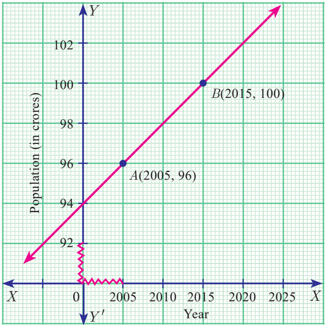

#### எடுத்துக்காட்டு 5.15

பிதாகரஸ் தேற்றத்தைப் பயன்படுத்தாமல், $(1,-4)$, $(2,-3)$ மற்றும் $(4,-7)$ என்ற முனைப் புள்ளிகள் ஒரு செங்கோண முக்கோணத்தை அமைக்கும் எனக் காட்டுக.

**தீர்வு** $A(1,-4)$, $B(2,-3)$ மற்றும் $C(4,-7)$ ஆகிய முக்கோணத்தின் முனைப் புள்ளிகள் என்க.

$$
AB\text{-யின் சாய்வு}=\frac{-3+4}{2-1}=\frac11=1
$$

$$
BC\text{-யின் சாய்வு}=\frac{-7+3}{4-2}=\frac{-4}2=-2
$$

$$
AC\text{-யின் சாய்வு}=\frac{-7+4}{4-1}=\frac{-3}3=-1
$$

$AB$-யின் சாய்வு $\times$ $AC$-யின் சாய்வு $=(1)(-1)=-1$

ஆகவே, $AB$ ஆனது $AC$-க்குச் செங்குத்தாகும். $\angle A=90^\circ$

எனவே, $\triangle ABC$ ஆனது செங்கோண முக்கோணம் ஆகும்.

> **சிந்தனைக் களம்**
>
> நமது அன்றாட வாழ்வில் சாய்வுகள் பயன்படுத்தப்படும் மூன்று சூழ்நிலைகளைக் குறிப்பிடுக.

#### எடுத்துக்காட்டு 5.16

ஒரு முக்கோணத்தின் இரு பக்கங்களின் மையப்புள்ளிகளை இணைக்கும் கோட்டுத் துண்டானது, மூன்றாவது பக்கத்திற்கு இணையாகவும் மூன்றாவது பக்கத்தின் பாதியாகவும் இருக்கும் எனத் தொலைவு மற்றும் சாய்வு கருத்தைப் பயன்படுத்தி நிரூபிக்க.

**தீர்வு** $P(a,b)$ $Q(c,d)$ மற்றும் $R(e,f)$ என்பன ஒரு முக்கோணத்தின் முனைப் புள்ளிகள் என்க.

$PQ$-யின் மையப்புள்ளி $S$ மற்றும் $PR$-யின் மையப்புள்ளி $T$ என்க.

எனவே, $S=\left(\dfrac{a+c}2,\dfrac{b+d}2\right)$ மற்றும் $T=\left(\dfrac{a+e}2,\dfrac{b+f}2\right)$

$$
ST\text{-யின் சாய்வு}=\frac{\frac{b+f}2-\frac{b+d}2}{\frac{a+e}2-\frac{a+c}2}=\frac{f-d}{e-c}
$$

மற்றும் $QR$-யின் சாய்வு $=\dfrac{f-d}{e-c}$

எனவே, $ST$ ஆனது $QR$-க்கு இணை ஆகும். (ஏனெனில், இவற்றின் சாய்வுகள் சமம்)

மேலும்

$$
\begin{aligned}
ST&=\sqrt{\left(\frac{a+e}2-\frac{a+c}2\right)^2+\left(\frac{b+f}2-\frac{b+d}2\right)^2}\\
&=\frac12\sqrt{(e-c)^2+(f-d)^2}
\end{aligned}
$$

$$
ST=\frac12QR
$$

இதிலிருந்து, $ST$ ஆனது $QR$-க்கு இணையாகவும் அதன் பாதியாகவும் இருக்கிறது.

> **குறிப்பு**
>
> வடிவியல் தேற்றத்தை ஆயத்தொலை வடிவியல் மூலம் நிரூபிக்கலாம் என்பதற்கு மேற்கண்ட எடுத்துக்காட்டு ஓர் உதாரணம் ஆகும்.

### பயிற்சி 5.2

1. $X$ அச்சுடன் மிகை திசையில் சாய்வு கோணத்தைக் கொண்ட கோட்டின் சாய்வு என்ன?

   (i) $90^\circ$ (ii) $0^\circ$

2. பின்வரும் சாய்வுகளைக் கொண்ட நேர்க்கோடுகளின் சாய்வுக் கோணம் என்ன? (i) $0$ (ii) $1$

3. கொடுக்கப்பட்ட புள்ளிகளை இணைக்கும் நேர்க்கோட்டின் சாய்வைக் காண்க.

   (i) $(5,\sqrt5)$ மற்றும் ஆதிப்புள்ளி

   (ii) $(\sin\theta,-\cos\theta)$ மற்றும் $(-\sin\theta,\cos\theta)$

4. $A(5,1)$ மற்றும் $P$ ஆகியவற்றை இணைக்கும் கோட்டிற்குச் செங்குத்தான கோட்டின் சாய்வு என்ன? இதில் $P$ என்பது $(4,2)$ மற்றும் $(-6,4)$ என்ற புள்ளிகளை இணைக்கும் கோட்டுத் துண்டின் நடுப்புள்ளி ஆகும்.

5. $(-3,-4)$, $(7,2)$ மற்றும் $(12,5)$ என்ற புள்ளிகள் ஒரு கோடமைந்தவை எனக் காட்டுக.

6. $(3,-1)$, $(a,3)$ மற்றும் $(1,-3)$ ஆகிய மூன்று புள்ளிகள் ஒரு கோடமைந்தவை எனில் $a$-யின் மதிப்புக் காண்க.

7. $(-2,a)$ மற்றும் $(9,3)$ என்ற புள்ளிகள் வழிச் செல்லும் நேர்க்கோட்டின் சாய்வு $-\dfrac12$ எனில், $a$-யின் மதிப்புக் காண்க.

8. $(-2,6)$ மற்றும் $(4,8)$ என்ற புள்ளிகள் வழிச் செல்லும் நேர்க்கோடானது $(8,12)$ மற்றும் $(x,24)$ என்ற புள்ளிகள் வழிச் செல்லும் நேர்க்கோட்டிற்குச் செங்குத்து எனில், $x$-யின் மதிப்புக் காண்க.

9. கொடுக்கப்பட்ட புள்ளிகள் செங்கோண முக்கோணத்தை அமைக்கும் எனக் காட்டுக.

   (i) $A(1,-4)$, $B(2,-3)$ மற்றும் $C(4,-7)$

   (ii) $L(0,5)$, $M(9,12)$ மற்றும் $N(3,14)$

10. $A(2.5,3.5)$, $B(10,-4)$, $C(2.5,-2.5)$ மற்றும் $D(-5,5)$ ஆகியன இணைகரத்தின் முனைப் புள்ளிகள் எனக் காட்டுக.

11. $A(2,2)$, $B(-2,-3)$, $C(1,-3)$ மற்றும் $D(x,y)$ ஆகிய புள்ளிகள் இணைகரத்தை அமைக்கும் எனில், $x$ மற்றும் $y$-யின் மதிப்பைக் காண்க.

12. $A(3,-4)$, $B(9,-4)$, $C(5,-7)$ மற்றும் $D(7,-7)$ ஆகியன $ABCD$ என்ற சரிவகத்தை அமைக்கும் எனக் காட்டுக.

13. $A(-4,-2)$, $B(5,-1)$, $C(6,5)$ மற்றும் $D(-7,6)$ ஆகியவற்றை முனைப் புள்ளிகளாகக் கொண்ட நாற்கரத்தின் பக்கங்களின் நடுப்புள்ளிகள் ஓர் இணைகரத்தை அமைக்கும் எனக் காட்டுக.

## 5.5 நேர்க்கோடு (Straight line)

$x$, $y$ எனும் இரு மாறிலிகளில் அமைந்த ஒருபடிச் சமன்பாடு $ax+by+c=0$ …(1) என்பது $xy$ தளத்தில் அமைந்த ஒரு நேர்க்கோடாகும். இங்கு, $a$, $b$, $c$ ஆகியன மெய்யெண்கள் மற்றும் $a,b$-யில் ஏதேனும் ஒன்றாவது பூச்சியமற்றதாகும்.

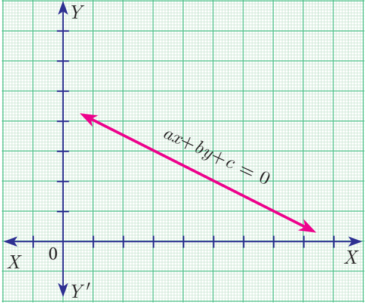

### 5.5.1 ஆய அச்சுகளின் சமன்பாடு (Equation of coordinate axes)

$X$ மற்றும் $Y$ அச்சுகளை ஆய அச்சுகள் என அழைக்கிறோம். $OY$-ன் ($Y$ அச்சு) மீதுள்ள $x$-ஆயப் புள்ளியின் ஒவ்வொரு புள்ளியும் பூச்சியம் ஆகும். எனவே, $OY$ ($Y$ அச்சு)-ன் சமன்பாடு $x=0$ (படம் 5.27)

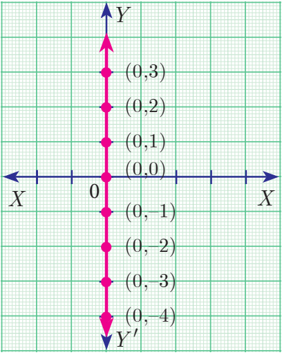

$OX$-ன் ($X$ அச்சு) மீதுள்ள $y$-ஆயப் புள்ளியின் ஒவ்வொரு புள்ளியும் பூச்சியம் ஆகும். எனவே, $OX$ ($X$ அச்சு)-ன் சமன்பாடு $y=0$ (படம் 5.28)

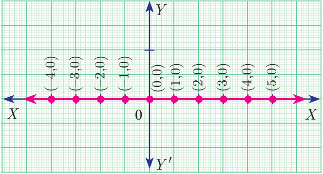

### 5.5.2 $X$ அச்சுக்கு இணையான நேர்க்கோட்டின் சமன்பாடு (Equation of a straight line parallel to $X$ axis)

$AB$ என்ற நேர்க்கோடானது $X$ அச்சுக்கு இணையாக, '$b$' அலகு தொலைவில் உள்ளது என்க. $AB$-யின் மீதுள்ள ஒவ்வொரு புள்ளியின் $y$ ஆயத்தொலைவு '$b$'-ஆக இருக்கும். (படம் 5.29)

எனவே, $AB$-யின் சமன்பாடு $y=b$ ஆகும்.

> **குறிப்பு**
>
> - $b>0$ எனில், $y=b$ எனும் கோடானது $X$ அச்சுக்கு மேற்புறம் அமையும்.
> - $b<0$ எனில், $y=b$ எனும் கோடானது $X$ அச்சுக்கு கீழ்ப்புறம் அமையும்.
> - $b=0$ எனில், $y=b$ எனும் கோடானது $X$ அச்சு ஆகும்.

### 5.5.3 $Y$ அச்சுக்கு இணையான நேர்க்கோட்டின் சமன்பாடு (Equation of a Straight line parallel to the $Y$ axis)

$CD$ என்ற நேர்க்கோடானது $Y$ அச்சுக்கு இணையாக, ‘$c$’ அலகு தூரத்தில் உள்ளது எனக். $CD$-யின் மீதுள்ள ஒவ்வொரு புள்ளியின் $x$-ன் ஆயத் தொலைவு ‘$c$’ ஆக இருக்கும். எனவே $CD$-யின் சமன்பாடு $x=c$ ஆகும். (படம் 5.30).

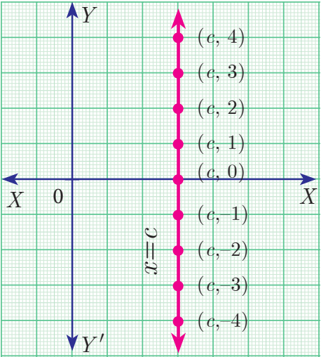

> **குறிப்பு**
>
> - $c>0$ எனில், $x=c$ எனும் கோடானது $Y$ அச்சுக்கு வலப்பக்கம் அமையும்.
> - $c<0$ எனில், $x=c$ எனும் கோடானது $Y$ அச்சுக்கு இடப்பக்கம் அமையும்.
> - $c=0$ எனில், $x=c$ எனும் கோடானது $Y$ அச்சு ஆகும்.

**எடுத்துக்காட்டு 5.17** $(5,7)$ என்ற புள்ளி வழி செல்வதும் (i) $X$ அச்சுக்கு இணையாகவும் (ii) $Y$ அச்சுக்கு இணையாகவும் அமைந்த நேர்க்கோட்டின் சமன்பாட்டைக் காண்க.

**தீர்வு** (i) $X$ அச்சுக்கு இணையான நேர்க்கோட்டின் சமன்பாடு $y=b$.

இது $(5,7)$ வழி செல்வதால், $b=7$.

எனவே, தேவையான நேர்க்கோட்டின் சமன்பாடு $y=7$.

(ii) $Y$ அச்சுக்கு இணையான நேர்க்கோட்டின் சமன்பாடு $x=c$

இது $(5,7)$ வழி செல்வதால், $c=5$

எனவே, தேவையான நேர்க்கோட்டின் சமன்பாடு $x=5$.

### 5.5.4 சாய்வு– வெட்டுத்துண்டு வடிவம் (Slope-Intercept Form)

நேர்குத்தற்ற அனைத்து நேர்க்கோடுகளும் $Y$ அச்சை ஒரு புள்ளியில் வெட்டும். இப்புள்ளியின் $y$ ஆயத்தொலைவை $y$ வெட்டுத்துண்டு என்று அழைக்கிறோம். ஒரு கோடின் சாய்வு $m$ மற்றும் $y$ வெட்டுத்துண்டு $c$ எனில், அந்த நேர்க்கோட்டின் சமன்பாடு $y=mx+c$.

இச்சமன்பாடு சாய்வு– வெட்டுத்துண்டு வடிவம் ஆகும்.

> **உங்களுக்குத் தெரியுமா?**
>
> - ஒரு கோடின் சாய்வு $m$, $m\ne0$ மற்றும் $x$ வெட்டுத்துண்டு $d$ எனில், அந்த நேர்க்கோட்டின் சமன்பாடு $y=m(x-d)$.
> - சாய்வு $m$ உடைய ஆதிப்புள்ளி வழிச் செல்லும் நேர்க்கோட்டின் சமன்பாடு $y=mx$.

**எடுத்துக்காட்டு 5.18** பின்வரும் விவரங்களைப் பயன்படுத்தி நேர்க்கோட்டின் சமன்பாடு காண்க.

(i) சாய்வு $5$ மற்றும் $y$ வெட்டுத்துண்டு $-9$ (ii) சாய்வு கோணம் $45^\circ$ மற்றும் $y$ வெட்டுத்துண்டு $11$

**தீர்வு** (i) இங்கு சாய்வு $=5$, $y$ வெட்டுத்துண்டு $c=-9$

எனவே, நேர்க்கோட்டின் சமன்பாடு $y=mx+c$

$$
y=5x-9\Rightarrow5x-y-9=0
$$

(ii) இங்கு, $\theta=45^\circ$, $y$ வெட்டுத்துண்டு $c=11$

சாய்வு $m=\tan\theta=\tan45^\circ=1$

எனவே, நேர்க்கோட்டின் சமன்பாடு $y=mx+c$

$$
y=x+11\Rightarrow x-y+11=0
$$

**எடுத்துக்காட்டு 5.19** $8x-7y+6=0$ என்ற கோட்டின் சாய்வு மற்றும் $y$ வெட்டுத்துண்டு ஆகியவற்றைக் கணக்கிடுக.

**தீர்வு** கொடுக்கப்பட்ட நேர்க்கோட்டின் சமன்பாடு $8x-7y+6=0$

$$
7y=8x+6\quad\text{(இதனை }y=mx+c\text{ வடிவத்திற்கு மாற்றுவது)}
$$

$$
y=\frac87x+\frac67\qquad\ldots(1)
$$

$(1)$ ஐ $y=mx+c$ உடன் ஒப்பிட,

சாய்வு $m=\dfrac87$ மற்றும் $y$ வெட்டுத்துண்டு $c=\dfrac67$

> **உங்களுக்குத் தெரியுமா?**
>
> $xy$ தளத்தின் மீதுள்ள $(x,y)$ எனும் புள்ளியில் $x$ என்பது “கிடைஅச்சு தொலைவு” (Abscissa) என்றும் $y$ என்பது “செங்குத்து அச்சு தொலைவு” (Ordinate) என்றும் அழைக்கப்படுகிறது.

**எடுத்துக்காட்டு 5.20** வரைபடமானது $y$ அச்சில் பாரன்ஃபீட் டிகிரி வெப்பநிலையையும் $x$ அச்சில் செல்சியஸ்டிகிரி வெப்பநிலையையும் குறிக்கிறது எனில், (a) கோட்டின் சாய்வு மற்றும் $y$ வெட்டுத்துண்டு காண்க. (b) கோட்டின் சமன்பாட்டை எழுதுக. (c) பூமியின் சராசரி வெப்பநிலை $25^\circ$ செல்சியஸாக இருக்கும்போது பூமியின் சராசரி வெப்பநிலையைப் பாரன்ஃபீட்டில் காணவும்.

**தீர்வு** (a) படத்திலிருந்து, சாய்வு $=\dfrac{y\text{ ஆயத்தொலைவில் ஏற்படும் வித்தியாசம்}}{x\text{ ஆயத்தொலைவில் ஏற்படும் வித்தியாசம்}}$

$$
=\frac{68-32}{20-0}=\frac{36}{20}=\frac95=1.8
$$

கோடானது $y$–அச்சினை $(0,32)$–யில் சந்திக்கிறது.

ஆகையால் சாய்வு $\dfrac95$ மற்றும் $y$ வெட்டுத்துண்டு $32$ ஆகும்.

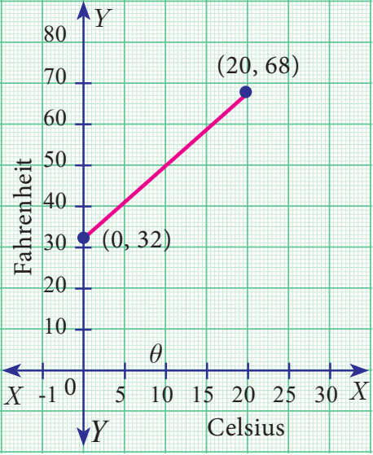

(b) சாய்வு மற்றும் $y$ வெட்டுத்துண்டு வடிவத்தைப் பயன்படுத்தி, நேர்க்கோட்டின் சமன்பாட்டை எழுதலாம்.

நேர்க்கோட்டின் சமன்பாடு $y=\dfrac95x+32$

(c) பூமியின் சராசரி வெப்பநிலை $25^\circ$ செல்சியஸ் ஆக இருக்கும்போது $y$–ஐ பாரன்ஃபீட் டிகிரியில் காண $x=25$ எனக் கொள்க.

$$
y=\frac95x+32
$$

$$
y=\frac95(25)+32
$$

$$
y=77
$$

எனவே, பூமியின் சராசரி வெப்பநிலை $77^\circ\mathrm{F}$ ஆகும்.

> **குறிப்பு**
>
> செல்சியஸைப் பாரன்ஃபீட்டாக மாற்றத் தேவையான சூத்திரம் $F=\dfrac95C+32$ ஆகும். இந்த எடுத்துக்காட்டின் மூலம் ஒரு நேர்க்கோட்டினை ஒரு நேரிய சமன்பாடாக எழுதமுடியும் என அறிகிறோம்.

### 5.5.5 புள்ளி –சாய்வு வடிவம் (Point-Slope form)

$A(x_1,y_1)$ என்ற புள்ளி வழியாகச் செல்வதும் மற்றும் சாய்வு $m$ உடையதுமான ஒரு நேர்க்கோட்டின் சமன்பாட்டைக் காண்போம்.

கோட்டின்மீது $A$ இல்லாத மற்றொரு புள்ளி $P(x,y)$ எனக். $A(x_1,y_1)$ மற்றும் $P(x,y)$ என்ற புள்ளிகளை இணைக்கும் கோட்டின் சாய்வு

$$
m=\tan\theta=\frac{y-y_1}{x-x_1}
$$

எனவே, தேவையான நேர்க்கோட்டின் சமன்பாடு $y-y_1=m(x-x_1)$ (புள்ளி– சாய்வு வடிவம்)

**எடுத்துக்காட்டு 5.21** $(3,-4)$ என்ற புள்ளியின் வழி செல்வதும், $\dfrac{-5}{7}$-ஐ சாய்வாக உடையதுமான நேர்க்கோட்டின் சமன்பாட்டைக் காண்க.

**தீர்வு** $(x_1,y_1)=(3,-4)$ மற்றும் $m=\dfrac{-5}{7}$ எனக் கொடுக்கப்பட்டுள்ளது.

புள்ளி-சாய்வு வடிவில் நேர்க்கோட்டின் சமன்பாடு

$$
y-y_1=m(x-x_1)
$$

$$
y+4=-\frac57(x-3)
$$

இதிலிருந்து $5x+7y+13=0$

> **சிந்தனைக் களம்**
>
> $Y$ அச்சுக்கு இணையாக இருக்கும் நேர்க்கோடுகளைச் சாய்வு– வெட்டுத்துண்டு வடிவில் எழுத முடியுமா?

**எடுத்துக்காட்டு 5.22** $(2,5)$ மற்றும் $(4,7)$ என்ற புள்ளிகளைச் சேர்க்கும் நேர்க்கோட்டிற்குச் செங்குத்தாகவும், $A(1,4)$ என்ற புள்ளி வழி செல்லுவதுமான நேர்க்கோட்டின் சமன்பாட்டைக் காண்க.

**தீர்வு** கொடுக்கப்பட்ட புள்ளிகள் $A(1,4)$, $B(2,5)$ மற்றும் $C(4,7)$.

$$
BC\text{ –யின் சாய்வு}=\frac{7-5}{4-2}=\frac{2}{2}=1
$$

தேவையான நேர்க்கோட்டின் சாய்வு $m$ எனக.

இந்த நேர்க்கோடு $BC$-க்கு செங்குத்தாக உள்ளது.

எனவே,

$$
m\times1=-1
$$

$$
m=-1
$$

இக்கோடானது $A(1,4)$ வழி செல்வதால்,

தேவையான நேர்க்கோட்டின் சமன்பாடு $y-y_1=m(x-x_1)$

$$
y-4=-1(x-1)
$$

$$
y-4=-x+1
$$

எனவே, $x+y-5=0$

> **உங்களுக்குத் தெரியுமா?**
>
> மாபெரும் கணிதவியல் மற்றும் இயற்பியல் மேதைகளாகத் திகழ்ந்த கலீலியோ மற்றும் நியூட்டன் போன்றோர் ஒரு தளம் மற்றும் வெளியில் பொருட்களின் இயக்கத்தை விவரிக்க ஆயத்தொலை வடிவியலைப் பயன்படுத்தியுள்ளனர்.

### 5.5.6 இரு புள்ளி வடிவம் (Two Point form)

$A(x_1,y_1)$ மற்றும் $B(x_2,y_2)$ என்பன இரு வெவ்வேறான புள்ளிகள் எனக். கொடுக்கப்பட்ட இந்த இரு புள்ளிகள் வழிச் செல்லும் நேர்க்கோட்டின் சாய்வு $m=\dfrac{y_2-y_1}{x_2-x_1}$, $(x_2\ne x_1)$.

புள்ளி– சாய்வு வடிவத்தின் மூலம், நேர்க்கோட்டின் சமன்பாடு

$$
y-y_1=\frac{y_2-y_1}{x_2-x_1}(x-x_1)
$$

ஆகவே, $\dfrac{y-y_1}{y_2-y_1}=\dfrac{x-x_1}{x_2-x_1}$ (இரு புள்ளி வடிவில் நேர்க்கோட்டின் சமன்பாடு ஆகும்)

**எடுத்துக்காட்டு 5.23** $(5,-3)$ மற்றும் $(7,-4)$ என்ற இரு புள்ளிகள் வழிச் செல்லும் நேர்க்கோட்டின் சமன்பாடு காண்க.

**தீர்வு** $(x_1,y_1)$ மற்றும் $(x_2,y_2)$ என்ற இரு புள்ளிகள் வழிச் செல்லும் நேர்க்கோட்டின் சமன்பாடு

$$
\frac{y-y_1}{y_2-y_1}=\frac{x-x_1}{x_2-x_1}
$$

கொடுக்கப்பட்ட புள்ளிகளைப் பிரதியிட நாம் பெறுவது,

$$
\frac{y+3}{-4+3}=\frac{x-5}{7-5}
$$

$$
\Rightarrow2y+6=-x+5
$$

$\therefore x+2y+1=0$ என்பது தேவையான நேர்க்கோட்டின் சமன்பாடு ஆகும்.

**எடுத்துக்காட்டு 5.24** வெவ்வேறு உயரங்கள் கொண்ட இரண்டு கட்டடங்களை ஒன்றுக்கொன்று எதிரெதிராக உள்ளன. ஒரு கனமான கம்பியானது கட்டடங்களின் மேற்புறங்களில் உள்ள புள்ளிகள் $(6,10)$ என்ற புள்ளியிலிருந்து $(14,12)$ என்ற புள்ளி வரை இணைக்கிறது எனில், கம்பியின் சமன்பாட்டைக் காண்க.

**தீர்வு** கட்டடங்களின் மேற்புறங்களில் உள்ள புள்ளிகள் $A(6,10)$ மற்றும் $B(14,12)$ எனக.

$A(6,10)$ மற்றும் $B(14,12)$ என்ற புள்ளி வழிச் செல்லும் இரும்புக் கம்பியின் நேர்க்கோட்டுச் சமன்பாடு

$$
\frac{y-y_1}{y_2-y_1}=\frac{x-x_1}{x_2-x_1}\text{ ஆகும்}
$$

$$
\frac{y-10}{12-10}=\frac{x-6}{14-6}
$$

$$
\frac{y-10}{2}=\frac{x-6}{8}
$$

எனவே, $x-4y+34=0$. ஆகவே, இரும்புக் கம்பியின் சமன்பாடு $x-4y+34=0$

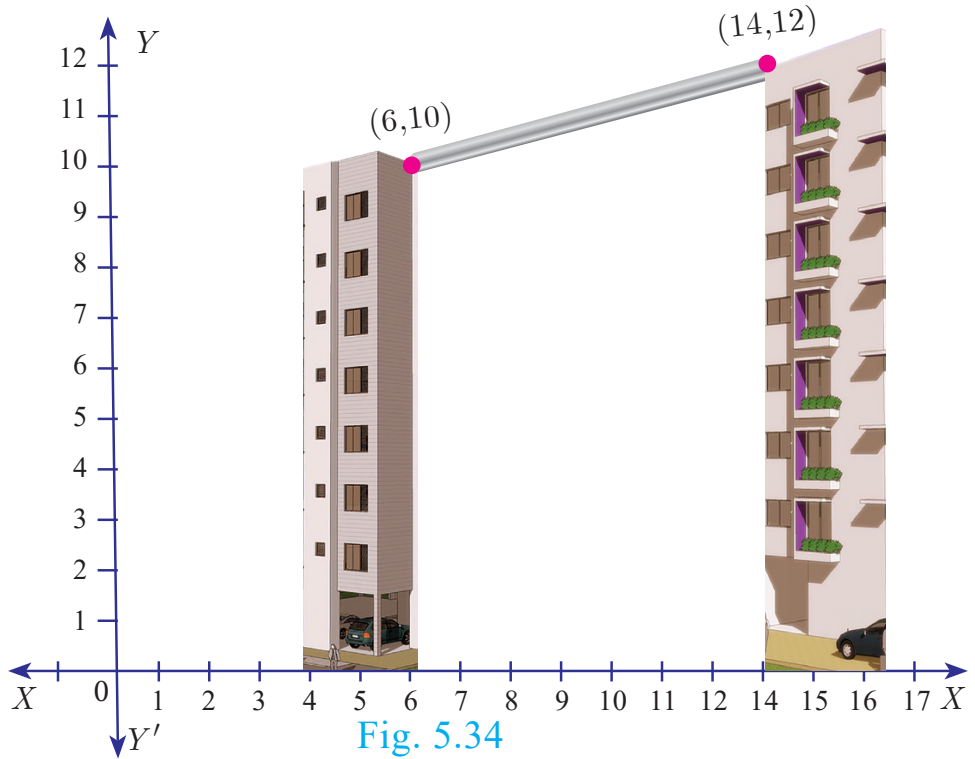

### 5.5.7 வெட்டுத்துண்டு வடிவம் (Intercept Form)

ஒரு நேர்க்கோடானது ஆய அச்சுகளில் முறையே $a$ மற்றும் $b$ என்ற வெட்டுத்துண்டுகளை ஏற்படுத்தினால், அந்நேர்க்கோட்டின் சமன்பாட்டை நாம் கண்டறியலாம்.

$PQ$ என்ற நேர்க்கோடானது $X$ அச்சை $A$–யிலும், $Y$ அச்சை $B$–யிலும் சந்திக்கிறது. $OA=a$, $OB=b$ எனக்.

எனவே, $A$ மற்றும் $B$–யின் ஆயப் புள்ளிகள் முறையே $(a,0)$ மற்றும் $(0,b)$ ஆகும். $A$ மற்றும் $B$ என்ற புள்ளிகளை இணைக்கும் கோட்டின் சமன்பாடு

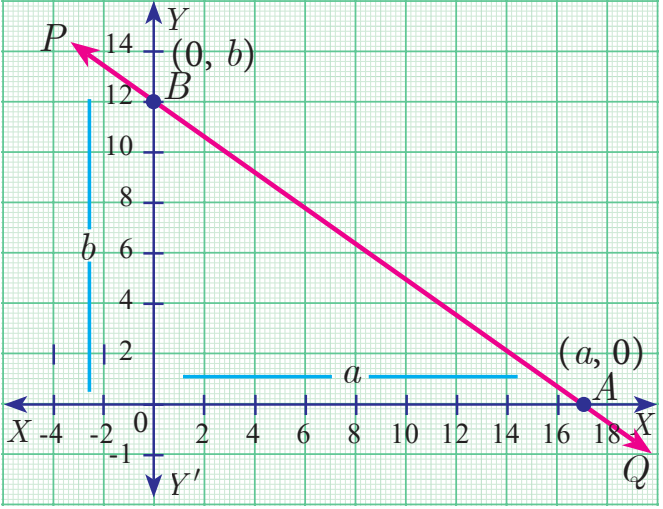

$$
\frac{y-0}{b-0}=\frac{x-a}{0-a}\Rightarrow\frac{y}{b}=\frac{x-a}{-a}\quad\text{ஆகவே,}\quad\frac yb=\frac{-x}{a}+1
$$

$$
\frac xa+\frac yb=1\quad\text{(ஒரு நேர்க்கோட்டின் வெட்டுத்துண்டு வடிவம் ஆகும்)}
$$

> **முன்னேற்றச் சோதனை**
>
> அட்டவணையில் விடுபட்ட இடங்களைப் பூர்த்தி செய்க.
>
> | நேர்க்கோடு வடிவத்தின் சமன்பாடு | கொடுக்கப்பட்ட விவரங்கள் | நேர்க்கோடு வடிவத்தின் பெயர் |
> | --- | --- | --- |
> | $y=mx+c$ | சாய்வு$=m$, $y$ வெட்டுத்துண்டு$=c$ | |
> | $\dfrac{y-y_1}{y_2-y_1}=\dfrac{x-x_1}{x_2-x_1}$ | | |
> | | வெட்டுத்துண்டுகள் | வெட்டுத்துண்டு வடிவம் |

**எடுத்துக்காட்டு 5.25** ஆய அச்சுகளுடன் சமமாகவும், எதிர் குறியும் உடைய வெட்டுத்துண்டுகளை ஏற்படுத்தி, $(5,7)$ என்ற புள்ளி வழி செல்லும் நேர்க்கோட்டின் சமன்பாட்டைக் காண்க.

**தீர்வு** $x$- வெட்டுத்துண்டு $a$ மற்றும் $y$- வெட்டுத்துண்டு ‘$-a$’ எனக்.

வெட்டுத்துண்டு வடிவில் நேர்க்கோட்டின் சமன்பாடு $\dfrac xa+\dfrac yb=1$

$$
\frac xa+\frac y{-a}=1\quad\text{(இங்கே }b=-a\text{)}
$$

எனவே, $x-y=a$ $\ldots(1)$

$(1)$ ஆனது $(5,7)$ வழிச் செல்வதால், $5-7=a\Rightarrow a=-2$

ஆகவே, தேவையான நேர்க்கோட்டின் சமன்பாடு $x-y=-2$ அதாவது $x-y+2=0$

**எடுத்துக்காட்டு 5.26** $4x-9y+36=0$ என்ற நேர்க்கோடு ஆய அச்சுகளில் ஏற்படுத்தும் வெட்டுத்துண்டுகளைக் காண்க.

**தீர்வு** கொடுக்கப்பட்ட நேர்க்கோட்டின் சமன்பாடு $4x-9y+36=0$

எனவே $4x-9y=-36$

இருபுறமும் $-36$ ஆல் வகுக்க,

$$
\frac x{-9}+\frac y4=1\qquad\ldots(1)
$$

$(1)$–ஐ வெட்டுத்துண்டு வடிவத்துடன் ஒப்பிட, $x$–வெட்டுத்துண்டு $a=-9$; $y$ – வெட்டுத்துண்டு $b=4$

**எடுத்துக்காட்டு 5.27** ஓர் அலைபேசி மின்கலத்தின் சக்தி $100\%$ இருக்கும்போது (battery power) அலைபேசியைப் பயன்படுத்தத் தொடங்குகிறோம். $x$ மணி நேரம் பயன்படுத்திய பிறகு மீதி இருக்கும் மின்கலத்தின் சக்தி $y$ சதவீதம் (தசமத்தில்) ஆனது $y=-0.25x+1$ ஆகும்.

(i) எத்தனை மணி நேரத்திற்குப் பிறகு மின்கலத்தின் சக்தி $40\%$ ஆகக் குறைந்திருக்கும் எனக் காண்க.

(ii) மின்கலம் தனது முழுச் சக்தியை இழக்க எடுத்துக்கொள்ளும் கால அளவு எவ்வளவு?

**தீர்வு** (i) மின்கலச் சக்தி $40\%$ எனில், நேரத்தைக் கணக்கிட, $y=0.40$ என எடுத்து கொள்க.

$$
0.40=-0.25x+1\Rightarrow0.25x=0.60
$$

$$
x=\frac{0.60}{0.25}=2.4\text{ மணி.}
$$

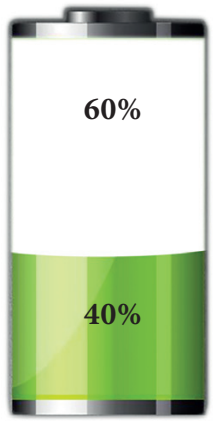

(ii) மின்கலம் தனது முழுச் சக்தியை இழந்துவிட்டால் $y=0$ எனக் கிடைக்கும்.

எனவே, $0=-0.25x+1\Rightarrow0.25x=1$ எனவே, $x=4$ மணி.

$\therefore$ நான்கு மணி நேரத்திற்குப் பின்பு அலைபேசியின் மின்கலம் தனது முழுச் சக்தியையும் இழக்கிறது.

**எடுத்துக்காட்டு 5.28** $(-3,8)$ என்ற புள்ளி வழி செல்வதும், ஆய அச்சுகளின் மிகை வெட்டுத்துண்டுகளின் கூடுதல் $7$ உடையதுமான நேர்க்கோட்டின் சமன்பாட்டைக் காண்க.

**தீர்வு** $a,b$ என்பன வெட்டுத்துண்டுகள் எனில் $a+b=7$ அல்லது $b=7-a$

வெட்டுத்துண்டு வடிவம் $\dfrac xa+\dfrac yb=1$

ஆகவே, $\dfrac xa+\dfrac y{7-a}=1$

இக்கோடானது $(-3,8)$, என்ற புள்ளி வழிச் செல்வதால்

$$
\frac{-3}{a}+\frac8{7-a}=1\Rightarrow-3(7-a)+8a=a(7-a)
$$

$$
-21+3a+8a=7a-a^2
$$

ஆகவே, $a^2+4a-21=0$

இதனைத் தீர்ப்பதன் மூலம் $(a-3)(a+7)=0$

$$
a=3\quad\text{அல்லது}\quad a=-7
$$

$a$ என்பது மிகை எண் என்பதால் $a=3$ மற்றும் $b=7-a=7-3=4$.

எனவே, $\dfrac x3+\dfrac y4=1$

ஆகவே, தேவையான நேர்க்கோட்டின் சமன்பாடு $4x+3y-12=0$.

**எடுத்துக்காட்டு 5.29** கிழக்கு நிழற்சாலை மற்றும் குறுக்குச் சாலைகளால் ஒரு வட்ட வடிவத் தோட்டம் சூழப்பட்டுள்ளது. குறுக்குச் சாலையானது வடக்கு தெருவை $D$-யிலும் கிழக்குச் சாலையை $E$–யிலும் சந்திக்கிறது. தோட்டத்திற்கு $A(3,10)$ என்ற புள்ளியில் $AD$ ஆனது தொடுகோடாக அமைகிறது. படத்தைப் பயன்படுத்தி

(a) பின்வருவனவற்றின் சமன்பாட்டினைக் காண்க.

&nbsp;&nbsp;&nbsp;&nbsp;(i) கிழக்கு நிழற்சாலை

&nbsp;&nbsp;&nbsp;&nbsp;(ii) வடக்குத் தெரு

&nbsp;&nbsp;&nbsp;&nbsp;(iii) குறுக்குச்சாலை

(b) குறுக்குச்சாலை கீழ்க்காண்பனவற்றைச் சந்திக்கின்ற புள்ளியைக் காண்க

&nbsp;&nbsp;&nbsp;&nbsp;(i) வடக்குத் தெரு &nbsp;&nbsp;&nbsp;&nbsp;(ii) கிழக்கு நிழற்சாலை

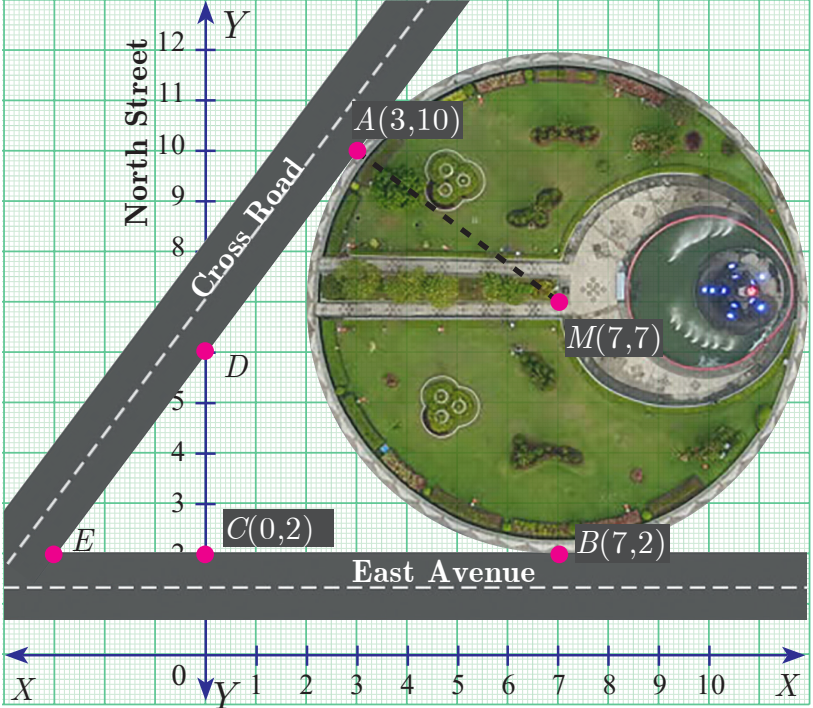

**தீர்வு** (a) (i) கிழக்கு நிழற்சாலையானது $C(0,2)$ மற்றும் $B(7,2)$ என்ற புள்ளிகளை இணைக்கும் நேர்க்கோடாகும். எனவே இரு புள்ளி வடிவத்தைப் பயன்படுத்திக் கிழக்கு நிழற்சாலையின் சமன்பாடு,

$$
\frac{y-2}{2-2}=\frac{x-0}{7-0}
$$

$$
\frac{y-2}{0}=\frac x7\Rightarrow y=2\text{ ஆகும்.}
$$

(ii) $D$ மற்றும் $C(0,2)$ என்ற புள்ளிகள் ஒரே நேர்க்கோட்டில் அமைகிறது எனில் புள்ளி $D$–யின் $x$ ஆயத் தொலைவு $=0$ ஆகும்.

ஆகவே, வடக்கு தெருவிலுள்ள எந்தப் புள்ளிக்கும் $x$–யின் ஆயத் தொலைவு $=0$ ஆகும்.

எனவே, வடக்கு தெருவின் சமன்பாடு $x=0$.

(iii) குறுக்குச் சாலையின் சமன்பாட்டைக் காணுதல்.

வட்டவடிவத் தோட்டத்தின் மையம் $M$–யின் ஆயப் புள்ளி $(7,7)$ மற்றும் $A$- யின் ஆயப் புள்ளி $(3,10)$ ஆகும்.

$MA$–யின் சாய்வு $m_1$ எனில், $m_1=\dfrac{10-7}{3-7}=\dfrac{-3}{4}$.

குறுக்குச் சாலையானது $MA$-க்கு செங்குத்தாக உள்ளது. எனவே குறுக்குச் சாலையின் சாய்வு $m_2$ எனில், $m_1m_2=-1\Rightarrow\dfrac{-3}{4}m_2=-1\therefore,m_2=\dfrac43$.

குறுக்குச் சாலையானது, சாய்வு $\dfrac43$ மற்றும் $A(3,10)$ என்ற புள்ளி வழியாகவும் செல்கிறது

எனவே, குறுக்குச் சாலையின் சமன்பாடு $y-10=\dfrac43(x-3)$

$$
3y-30=4x-12
$$

$$
4x-3y+18=0
$$

(b) (i) குறுக்குச் சாலை மற்றும் வடக்குத் தெரு சந்திக்கும் புள்ளியைக் காணுதல்.

$D(0,k)$ என்பது குறுக்குச் சாலையின் மேல் உள்ள புள்ளி ஆகும்.

எனவே, $x=0$, $y=k$ என குறுக்கு சாலையின் சமன்பாட்டில் பிரதியிட, நாம் பெறுவது

$$
0-3k+18=0
$$

$$
\Rightarrow k=6
$$

எனவே, $D$ ஆனது $(0,6)$ ஆகும்.

(ii) குறுக்குச் சாலை மற்றும் கிழக்கு நிழற்சாலை சந்திக்கும் புள்ளியைக் காணுதல்.

$E$–யின் ஆயப் புள்ளி $(q,2)$ எனக்.

$x=q$, $y=2$ எனக் குறுக்குச் சாலை சமன்பாட்டில் பிரதியிட,

$$
4q-6+18=0
$$

$$
4q=-12\quad\text{எனவே}\quad q=-3
$$

ஆகவே, $E$ என்ற புள்ளி $(-3,2)$ ஆகும்.

ஆதலால், குறுக்கு சாலையானது வடக்கு தெருவை $D(0,6)$ என்ற புள்ளியிலும், கிழக்கு நிழற்சாலையை $E(-3,2)$ என்ற புள்ளியிலும் சந்திக்கிறது.

> **முன்னேற்றச் சோதனை**
>
> விடுப்பட்ட பகுதியை பூர்த்தி செய்க
>
> | எண் | சமன்பாடு | சாய்வு | $x$ வெட்டுத்துண்டு | $y$ வெட்டுத்துண்டு |
> | --- | --- | --- | --- | --- |
> | 1 | $3x-4y+2=0$ | —— | —— | —— |
> | 2 | $y=14x$ | —— | —— | $0$ |
> | 3 | —— | —— | $2$ | $-3$ |

> **செயல்பாடு 4**
>
> $l_1$ மற்றும் $l_2$ என்ற கோடுகள் செங்குத்தானவை. கோடு $l_3$–யின் சாய்வு $3$ எனில்,
>
> (i) $l_1$ என்ற கோட்டின் சமன்பாட்டைக் காண்க.
>
> (ii) $l_2$ என்ற கோட்டின் சமன்பாட்டைக் காண்க.
>
> (iii) $l_3$ என்ற கோட்டின் சமன்பாட்டைக் காண்க.
>
> 

> **செயல்பாடு 5**
>
> ஓர் ஏணியானது செங்குத்துச் சுவரின் மீது அதன் அடிப்பகுதி தரையைத் தொடுமாறு சாய்த்து வைக்கப்பட்டுள்ளது. கீழே கொடுக்கப்பட்ட நிபந்தனைகளின்படி ஏணியின் சமன்பாட்டைக் காண்க.
>
> | எண் | நிபந்தனை | படம் | ஏணியின் சமன்பாடு |
> |---|---|---|---|
> | (i) | ஏணியானது தரையுடன் ஏற்படுத்தும் சாய்வுக் கோணம் $60^\circ$ மற்றும் ஏணி சுவரைத் தொடும் புள்ளி $(0,8)$ |  | —— |
> | (ii) | ஏணியின் உச்சி மற்றும் அடிப் புள்ளிகள் முறையே $(2,4)$ மற்றும் $(5,1)$ | —— | —— |

### பயிற்சி 5.3

1. $(1,-5)$ மற்றும் $(4,2)$ என்ற புள்ளிகளை இணைக்கும் கோட்டுத்துண்டின் நடுப்புள்ளி வழியாகச் செல்வதும், கீழ்க்காண்பனவற்றிற்கு இணையானதுமான நேர்க்கோட்டின் சமன்பாட்டைக் காண்க. (i) $X$ அச்சு (ii) $Y$ அச்சு

2. $2(x-y)+5=0$ என்ற நேர்க்கோடு சமன்பாட்டின் சாய்வு, சாய்வு கோணம் மற்றும் $y$-வெட்டுத்துண்டு ஆகியவற்றைக் காண்க.

3. சாய்வு கோணம் $30^\circ$ மற்றும் $y$-வெட்டுத்துண்டு $-3$ ஆகியவற்றைக் கொண்ட நேர்க்கோட்டின் சமன்பாட்டைக் காண்க.

4. $\sqrt3x+(1-\sqrt3)y=3$ என்ற நேர்க்கோடு சமன்பாட்டின் சாய்வு, $y$-வெட்டுத்துண்டு ஆகியவற்றைக் காண்க.

5. $(-2,3)$ மற்றும் $(8,5)$ என்ற புள்ளிகள் வழிச் செல்லும் கோடானது, $y=ax+2$ என்ற நேர்க்கோட்டிற்குச் செங்குத்தானது எனில், ‘$a$’ –யின் மதிப்பு காண்க.

6. $(19,3)$ என்ற புள்ளியை அடியாகக் கொண்ட குன்றானது செங்கோண முக்கோண வடிவில் உள்ளது. தரையுடன் குன்று ஏற்படுத்தும் சாய்வுக் கோணம் $45^\circ$ எனில், குன்றின் அடி மற்றும் உச்சியை இணைக்கும் கோட்டின் சமன்பாட்டைக் காண்க.

7. கொடுக்கப்பட்ட இரு புள்ளிகள் வழிச் செல்லும் நேர்க்கோட்டின் சமன்பாட்டைக் காண்க.

   (i) $\left(2,\dfrac{2}{3}\right)$ மற்றும் $\left(\dfrac{-1}{2},-2\right)$

   (ii) $(2,3)$ மற்றும் $(-7,-1)$

8. ஒரு பூனை $xy$-தளத்தில் $(-6,-4)$ என்ற புள்ளியில் உள்ளது. $(5,11)$ என்ற புள்ளியில் ஒரு பால் புட்டி வைக்கப்பட்டுள்ளது. பூனை மிகக் குறைந்த தூரம் பயணித்துப் பால் அருந்த விரும்புகிறது எனில், பாலைப் பருகுவதற்குத் தேவையான பாதையின் சமன்பாட்டைக் காண்க.

9. $A(6,2)$, $B(-5,-1)$ மற்றும் $C(1,9)$ –ஐ முனைகளாகக் கொண்ட $\triangle ABC$ –யின் முனை $A$–யிலிருந்து வரையப்படும் (i) நடுக்கோட்டின் சமன்பாட்டைக் காண்க (ii) குத்துக் கோட்டின் சமன்பாட்டைக் காண்க

10. $(-1,2)$ என்ற புள்ளி வழி செல்வதும், சாய்வு $\dfrac{-5}{4}$ உடையதுமான நேர்க்கோட்டின் சமன்பாட்டைக் காண்க.

11. நீங்கள் ஒரு பாடலைப் பதிவிறக்கம் செய்யும்போது, $x$ வினாடிகளுக்குப் பிறகு பதிவிறக்கம் செய்யவேண்டிய மீதமுள்ள பாடலின் சதவீதம் (மெகா பைட்டில்) $y$–ஆனது (தசமத்தில்) $y=-0.1x+1$ என்ற சமன்பாட்டின் மூலம் குறிக்கப்பட்டால்,

    (i) பாடலின் மொத்த $MB$ அளவைக் காண்க.

    (ii) $75\%$ பாடலைப் பதிவிறக்கம் செய்ய எவ்வளவு வினாடிகள் ஆகும்?

    (iii) எத்தனை வினாடிகள் கழித்துப் பாடல் முழுமையாகப் பதிவிறக்கம் செய்யப்படும்?

12. கீழே கொடுக்கப்பட்டுள்ள $x$, $y$ வெட்டுத்துண்டுகளைக் கொண்ட நேர்க்கோடுகளின் சமன்பாடுகளைக் காண்க.

    (i) $4,-6$ &nbsp;&nbsp;&nbsp;&nbsp;(ii) $-5,\dfrac{3}{4}$

13. கொடுக்கப்பட்ட நேர்க்கோடுகளின் சமன்பாட்டிலிருந்து ஆய அச்சுகளின் மேல் ஏற்படுத்தும் வெட்டுத்துண்டுகளைக் காண்க.

    (i) $3x-2y-6=0$ &nbsp;&nbsp;&nbsp;&nbsp;(ii) $4x+3y+12=0$

14. நேர்க்கோட்டின் சமன்பாட்டினைக் காண்க.

    (i) $(1,-4)$ என்ற புள்ளி வழிச் செல்வதும், வெட்டுத்துண்டுகளின் விகிதம் $2:5$

    (ii) $(-8,4)$ என்ற புள்ளி வழிச் செல்வதும், ஆய அச்சுகளின் வெட்டுத்துண்டுகள் சமம்

## 5.6 நேர்க்கோட்டு சமன்பாட்டின் பொது வடிவம் (General Form of a Straight Line)

$x$, $y$ என்ற இரு மாறிகளில் அமைந்த ஒருபடி பல்லுறுப்புக் கோவை $ax+by+c=0$ –ஐ ஒரு நேரிய சமன்பாடு என அழைக்கலாம் ($a$, $b$, $c$ என்பன மெய்யெண்கள் மற்றும் $a$, $b$–யில் ஏதேனும் ஒன்று பூச்சியமற்றது). இதுவே நேர்க்கோட்டு சமன்பாட்டின் பொது வடிவமாகும். இப்பொழுது கீழ்க்காணும் தகவல்களுக்கு ஏற்ற நேர்க்கோட்டின் சமன்பாட்டைக் காண்போம்.

(i) $ax+by+c=0$ –க்கு இணையான கோடு

(ii) $ax+by+c=0$ –க்கு செங்குத்தான கோடு

### 5.6.1 $ax+by+c=0$ என்ற கோட்டிற்கு இணையான நேர்க்கோட்டின் சமன்பாடு (Equation of a line parallel to the line $ax+by+c=0$)

$ax+by+c=0$ என்ற நேர்க்கோட்டிற்கு இணையாக உள்ள கோடுகளின் சமன்பாடு $ax+by+k=0$ ஆகும். இங்கு $k$-ன் மதிப்பு வெவ்வேறு மதிப்புகளைக் கொண்டிருக்கலாம்.

### 5.6.2 $ax+by+c=0$ என்ற கோட்டிற்குச் செங்குத்தான நேர்க்கோட்டின் சமன்பாடு (Equation of a line perpendicular to the line $ax+by+c=0$)

$ax+by+c=0$ என்ற கோட்டிற்குச் செங்குத்தாக உள்ள கோடுகளின் சமன்பாடு $bx-ay+k=0$ ஆகும். இங்கு $k$-ன் மதிப்பு வெவ்வேறு மதிப்புகளைக் கொண்டிருக்கலாம்.

> **உங்களுக்குத் தெரியுமா?**
>
> $a_1x+b_1y+c_1=0$ மற்றும் $a_2x+b_2y+c_2=0$ என்ற இரு நேர்க்கோடுச் சமன்பாடுகளின் கெழுக்கள் பூச்சியமற்றவை எனில், அந்த நேர்க்கோடுகள்
>
> (i) இணை என இருந்தால், இருந்தால் மட்டுமே $\dfrac{a_1}{a_2}=\dfrac{b_1}{b_2}$ அதாவது, $a_1b_2-a_2b_1=0$
>
> (ii) செங்குத்து என இருந்தால், இருந்தால் மட்டுமே $a_1a_2+b_1b_2=0$.

> **முன்னேற்றச் சோதனை**
>
> விடுபட்ட கட்டங்களைப் பூர்த்தி செய்க
>
> | எண் | சமன்பாடுகள் | இணையானதா அல்லது செங்குத்தானதா? | எண் | சமன்பாடுகள் | இணையானதா அல்லது செங்குத்தானதா? |
> |---|---|---|---|---|---|
> | 1 | $5x+2y+5=0$ $5x+2y-3=0$ | —— | 3 | $8x-10y+11=0$ $4x-5y+16=0$ | —— |
> | 2 | $3x-7y-6=0$ $7x+3y+8=0$ | —— | 4 | $2y-9x-7=0$ $27y+6x-21=0$ | —— |

### 5.6.3 நேர்க்கோட்டின் சாய்வு (Slope of a straight line)

$ax+by+c=0$ என்பது நேர்க்கோடு சமன்பாட்டின் பொது வடிவம் ஆகும். ($a$, $b$–யில் ஏதேனும் ஒன்றாவது பூச்சியம் அற்றது)

$x$–யின் கெழு $=a$, $y$–யின் கெழு $=b$, மாறிலி $=c$,

மேலே உள்ள சமன்பாட்டை $by=-ax-c$ என மாற்றி எழுதலாம்

எனவே $y=-\dfrac{a}{b}x-\dfrac{c}{b}$, ($b\ne0$ எனில்) $\ldots(1)$

$(1)$ ஐ $y=mx+l$ உடன் ஒப்பிட

சாய்வு $m=-\dfrac{a}{b}$

$$
m=\frac{-x\text{–ன் கெழு}}{y\text{–ன் கெழு}}
$$

$y$ -வெட்டுத்துண்டு $l=-\dfrac{c}{b}$

$$
y\text{ -வெட்டுத்துண்டு}=\frac{\text{மாறிலி}}{y\text{–ன் கெழு}}
$$

> **சிந்தனைக்களம்**
>
> சாய்வு $1$ என இருக்குமாறு எத்தனை நேர்க்கோடுகள் இருக்கும்?

**எடுத்துக்காட்டு 5.30** $6x+8y+7=0$ என்ற நேர்க்கோட்டின் சாய்வைக் காண்க.

**தீர்வு** கொடுக்கப்பட்ட நேர்க்கோட்டின் சமன்பாடு $6x+8y+7=0$

$$
\text{சாய்வு }m=\frac{-x\text{–ன் கெழு}}{y\text{–ன் கெழு}}=-\frac68=-\frac34
$$

எனவே நேர்க்கோட்டின் சாய்வு $-\dfrac34$ ஆகும்.

**எடுத்துக்காட்டு 5.31** (i) $3x-7y=11$ –க்கு இணையான (ii) $2x-3y+8=0$ –க்கு செங்குத்தான நேர்க்கோட்டின் சாய்வைக் காண்க

**தீர்வு** (i) கொடுக்கப்பட்ட நேர்க்கோட்டின் சமன்பாடு $3x-7y=11$

$$
3x-7y-11=0
$$

சாய்வு $m=\dfrac{-3}{-7}=\dfrac37$

இணை கோடுகளின் சாய்வுகள் சமம் என்பதால் $3x-7y=11$ என்ற நேர்க்கோட்டிற்கு இணையான கோட்டின் சாய்வு $\dfrac37$ ஆகும்.

(ii) கொடுக்கப்பட்ட நேர்க்கோட்டின் சமன்பாடு $2x-3y+8=0$

$$
\text{சாய்வு }m=\frac{-2}{-3}=\frac23
$$

ஒன்றுக்கொன்று செங்குத்தான நேர்க்கோடு சாய்வுகளின் பெருக்கற்பலன் $-1$ என்பதால், $2x-3y+8=0$ என்ற நேர்க்கோட்டிற்குச் செங்குத்தான கோட்டின் சாய்வு $=\dfrac{-1}{\frac23}=\dfrac{-3}{2}$

**எடுத்துக்காட்டு 5.32** $2x+3y-8=0$, $4x+6y+18=0$ ஆகிய நேர்க்கோடுகள் இணை எனக் காட்டுக.

**தீர்வு** $2x+3y-8=0$ என்ற நேர்க்கோட்டின் சாய்வு

$$
m_1=\frac{-x\text{–ன் கெழு}}{y\text{–ன் கெழு}}
$$

$$
m_1=\frac{-2}{3}
$$

$4x+6y+18=0$ என்ற நேர்க்கோட்டின் சாய்வு

$$
m_2=\frac{-4}{6}=\frac{-2}{3}
$$

இங்கு, $m_1=m_2$

அதாவது, சாய்வுகள் சமம். எனவே இவ்விரு நேர்க்கோடுகளும் இணையாகும்.

> **மாற்று முறை**
>
> $a_1=2$, $b_1=3$
>
> $a_2=4$, $b_2=6$
>
> $\dfrac{a_1}{a_2}=\dfrac24=\dfrac12$
>
> $\dfrac{b_1}{b_2}=\dfrac36=\dfrac12$
>
> எனவே, $\dfrac{a_1}{a_2}=\dfrac{b_1}{b_2}$
>
> ஆகவே, இவ்விரு நேர்க்கோடுகளும் இணையாகும்.

**எடுத்துக்காட்டு 5.33** $x-2y+3=0$, $6x+3y+8=0$ ஆகிய நேர்க்கோடுகள் ஒன்றுக்கொன்று செங்குத்தானவை எனக் காட்டுக.

**தீர்வு** $x-2y+3=0$ என்ற நேர்க்கோட்டின் சாய்வு

$$
m_1=\frac{-1}{-2}=\frac12
$$

$6x+3y+8=0$ என்ற நேர்க்கோட்டின் சாய்வு

$$
m_2=\frac{-6}{3}=-2
$$

இங்கு, $m_1\times m_2=\dfrac12\times(-2)=-1$

சாய்வுகளின் பெருக்கற்பலன் $-1$ ஆகும்.

ஆகவே, இவ்விரு நேர்க்கோடுகளும் ஒன்றுக்கொன்று செங்குத்தானவையாகும்.

> **மாற்று முறை**
>
> $a_1=1$, $b_1=-2$;
>
> $a_2=6$, $b_2=3$
>
> $a_1a_2+b_1b_2=6-6=0$
>
> ஆகவே, நேர்க்கோடுகள் செங்குத்தானவையாகும்.

**எடுத்துக்காட்டு 5.34** $3x-7y=12$ என்ற நேர்க்கோட்டிற்கு இணையாகவும் $(6,4)$ என்ற புள்ளிவழி செல்வதுமான நேர்க்கோட்டின் சமன்பாட்டைக் காண்க.

**தீர்வு** $3x-7y-12=0$ என்ற நேர்க்கோட்டிற்கு இணையான நேர்க்கோட்டின் சமன்பாடு $3x-7y+k=0$.

இந்த நேர்க்கோடானது $(6,4)$ என்ற புள்ளி வழிச் செல்வதால்,

$$
3(6)-7(4)+k=0
$$

$$
k=28-18=10
$$

எனவே, தேவையான நேர்க்கோட்டின் சமன்பாடு $3x-7y+10=0$.

**எடுத்துக்காட்டு 5.35** $y=\dfrac43x-7$ என்ற நேர்க்கோட்டிற்குச் செங்குத்தானதும், $(7,-1)$ என்ற புள்ளிவழி செல்லுவதுமான நேர்க்கோட்டின் சமன்பாட்டைக் காண்க.

**தீர்வு** $y=\dfrac{4x}3-7$ என்ற நேர்க்கோட்டின் சமன்பாட்டை $4x-3y-21=0$ என மாற்றி எழுதலாம்.

$4x-3y-21=0$ என்ற நேர்க்கோட்டிற்குச் செங்குத்தான நேர்க்கோட்டின் சமன்பாடு $3x+4y+k=0$

இது $(7,-1)$ என்ற புள்ளி வழிச் செல்வதால் $21-4+k=0\Rightarrow k=-17$

ஆகவே, தேவையான நேர்க்கோட்டின் சமன்பாடு $3x+4y-17=0$ ஆகும்.

**எடுத்துக்காட்டு 5.36** $4x+5y=13$, $x-8y+9=0$ ஆகிய நேர்க்கோடுகள் சந்திக்கும் புள்ளி வழியாகவும், $Y$–அச்சுக்கு இணையாகவும் உள்ள நேர்க்கோட்டின் சமன்பாட்டைக் காண்க.

**தீர்வு** கொடுக்கப்பட்ட நேர்க்கோடுகள் $4x+5y-13=0$ $\ldots(1)$

$$
x-8y+9=0\qquad\ldots(2)
$$

$(1)$ மற்றும் $(2)$ -ஐ தீர்ப்பதின் மூலம் இக்கோடுகள் சந்திக்கும் புள்ளியைக் காணலாம்.

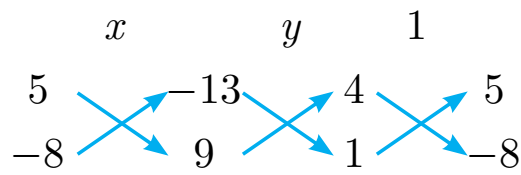

$$
\frac{x}{45-104}=\frac{y}{-13-36}=\frac{1}{-32-5}
$$

$$
\frac{x}{-59}=\frac{y}{-49}=\frac{1}{-37}
$$

$$
x=\frac{59}{37},\quad y=\frac{49}{37}
$$

எனவே, இரு நேர்க்கோடுகள் வெட்டிக்கொள்ளும் புள்ளி $(x,y)=\left(\dfrac{59}{37},\dfrac{49}{37}\right)$

$Y$–அச்சுக்கு இணையான நேர்க்கோட்டின் சமன்பாடு $x=c$.

இக்கோடானது $(x,y)=\left(\dfrac{59}{37},\dfrac{49}{37}\right)$ வழிச் செல்கிறது. எனவே, $c=\dfrac{59}{37}$

நேர்க்கோட்டின் சமன்பாடு $x=\dfrac{59}{37}$. எனவே, $37x-59=0$.

**எடுத்துக்காட்டு 5.37** $A(0,5)$ மற்றும் $B(4,1)$ ஆகிய புள்ளிகளை இணைக்கும் கோடானது $C(4,4)$– ஐ மையமாகக் கொண்ட வட்டத்தின் தொடுகோடு எனில்,

(i) $AB$ என்ற கோடானது சமன்பாட்டைக் காண்க.

(ii) $C$ வழியாகவும் $AB$ என்ற கோட்டிற்குச் செங்குத்தாக உள்ள நேர்க்கோட்டின் சமன்பாட்டைக் காண்க.

(iii) $AB$ என்ற கோடானது வட்டத்தைத் தொடும் புள்ளியைக் காண்க.

**தீர்வு** (i) $A(0,5)$ மற்றும் $B(4,1)$ என்ற புள்ளிகள் வழிச் செல்லும் $AB$ என்ற கோட்டின் சமன்பாடு

$$
\frac{y-y_1}{y_2-y_1}=\frac{x-x_1}{x_2-x_1}
$$

$$
\frac{y-5}{1-5}=\frac{x-0}{4-0}
$$

$$
4(y-5)=-4x\quad\text{ஆகவே,}\quad y-5=-x
$$

$$
x+y-5=0
$$

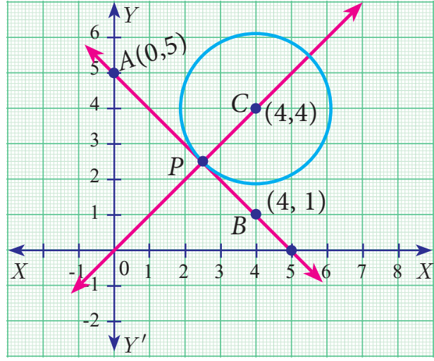

(ii) $AB$-என்ற கோட்டின் சமன்பாடு $x+y-5=0$. இந்த நேர்க்கோட்டிற்குச் செங்குத்தான கோட்டின் சமன்பாடு $x-y+k=0$ ஆகும்.

இக்கோடானது மையம் $(4,4)$ என்ற புள்ளி வழிச் செல்வதால்,

$$
4-4+k=0\quad\text{எனவே,}\quad k=0
$$

$C$ வழியாக $AB$-க்கு செங்குத்தாக அமையும் நேர்க்கோட்டின் சமன்பாடு $x-y=0$

(iii) $x+y-5=0$ மற்றும் $x-y=0$ ஆகிய நேர்க்கோடுகள் சந்திக்கும் புள்ளியே $AB$ என்ற கோடானது வட்டத்தைத் தொடும் புள்ளி ஆகும்.

$x+y-5=0$ மற்றும் $x-y=0$ இவற்றைத் தீர்ப்பதின் மூலம்,

$$
x=\frac52\quad\text{மற்றும்}\quad y=\frac52
$$

எனவே, தொடுபுள்ளி $P$–யின் ஆயப் புள்ளிகள் $\left(\dfrac52,\dfrac52\right)$ ஆகும்.

> **சிந்தனைக் களம்**
>
> 1. இரு நேர்க்கோடுகள் வெட்டிக்கொள்ளும் புள்ளிகளின் எண்ணிக்கையைக் காண்க.
>
> 2. $2x-3y+6=0$ என்ற நேர்க்கோட்டிற்குச் செங்குத்தாக அமையும் கோடுகளின் எண்ணிக்கையைக் காண்க.

> **செயல்பாடு 6**
>
> கொடுக்கப்பட்ட வரைபடங்களில் உள்ள நேர்க்கோடுகளின் சமன்பாட்டைக் காண்க.
>
> 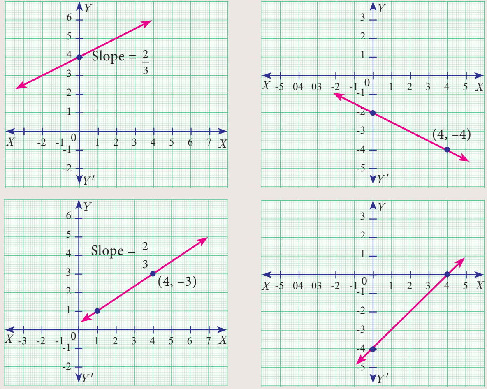

### பயிற்சி 5.4

1. பின்வரும் நேர்க்கோடுகளின் சாய்வைக் காண்க. (i) $5y-3=0$ &nbsp;&nbsp;&nbsp;&nbsp;(ii) $7x-\dfrac{3}{17}=0$

2. (i) $y=0.7x-11$ க்கு இணையான (ii) $x=-11$ –க்கு செங்குத்தாக அமையும் நேர்க்கோட்டின் சாய்வைக் காண்க.

3. கொடுக்கப்பட்ட நேர்க்கோடுகள் இணையானவையா அல்லது செங்குத்தானவையா எனச் சோதிக்கவும்.

   (i) $\dfrac x3+\dfrac y4+\dfrac17=0$ மற்றும் $\dfrac{2x}3+\dfrac y2+\dfrac1{10}=0$

   (ii) $5x+23y+14=0$ மற்றும் $23x-5y+9=0$

4. $12y=-(p+3)x+12$, $12x-7y=16$ ஆகிய நேர்க்கோடுகள் ஒன்றுக்கொன்று செங்குத்தி எனில் ‘$p$’.–யின் மதிப்பைக் காண்க.

5. $Q(3,-2)$ மற்றும் $R(-5,4)$ ஆகியபுள்ளிகளை இணைக்கும் நேர்க்கோட்டிற்கு இணையானதும், $P(-5,2)$ என்ற புள்ளி வழி செல்வதுமான நேர்க்கோட்டின் சமன்பாட்டைக் காண்க.

6. $(6,7)$ மற்றும் $(2,-3)$ ஆகிய புள்ளிகளை இணைக்கும் நேர்க்கோட்டிற்குச் செங்குத்தானதும் $(6,-2)$ என்ற புள்ளி வழி செல்வதுமான நேர்க்கோட்டின் சமன்பாட்டைக் காண்க.

7. $\triangle ABC$ –யின் முனைகள் $A(-3,0)$ $B(10,-2)$ மற்றும் $C(12,3)$ எனில், $A$ மற்றும் $B$–யிலிருந்து முக்கோணத்தின் எதிர்பக்கத்திற்கு வரையப்படும் குத்துக்கோடுகளின் சமன்பாடுகளைக் காண்க.

8. $A(-4,2)$ மற்றும் $B(6,-4)$ என்ற புள்ளிகளை இணைக்கும் மையக் குத்துக்கோட்டின் சமன்பாட்டைக் காண்க.

9. $7x+3y=10$, $5x-4y=1$ ஆகிய நேர்க்கோடுகள் சந்திக்கும் புள்ளி வழியாகவும், $13x+5y+12=0$ என்ற நேர்க்கோட்டிற்கு இணையாகவும் அமையும் நேர்க்கோட்டின் சமன்பாட்டைக் காண்க.

10. $5x-6y=2$, $3x+2y=10$ ஆகிய நேர்க்கோடுகள் சந்திக்கும் புள்ளி வழியாகவும் $4x-7y+13=0$ என்ற நேர்க்கோட்டிற்குச் செங்குத்தாகவும் அமையும் நேர்க்கோட்டின் சமன்பாட்டைக் காண்க.

11. $3x+y+2=0$ மற்றும் $x-2y-4=0$ ஆகிய நேர்க்கோடுகள் சந்திக்கும் புள்ளியையும், $7x-3y=-12$ மற்றும் $2y=x+3$ ஆகிய நேர்க்கோடுகள் சந்திக்கும் புள்ளியையும் இணைக்கும் நேர்க்கோட்டின் சமன்பாட்டைக் காண்க.

12. $8x+3y=18$, $4x+5y=9$ ஆகிய நேர்க்கோடுகள் சந்திக்கும் புள்ளியின் வழியாகவும், $(5,-4)$ மற்றும் $(-7,6)$ ஆகிய புள்ளிகளை இணைக்கும் நேர்க்கோடுத் துண்டின் நடுப்புள்ளி வழியாகச் செல்லும் நேர்க்கோட்டின் சமன்பாட்டைக் காண்க.

### பயிற்சி 5.5

##### பலவுள் தெரிவு வினாக்கள்

1. $(-5,0)$, $(0,-5)$ மற்றும் $(5,0)$ ஆகிய புள்ளிகளால் அமைக்கப்படும் முக்கோணத்தின் பரப்பு

   (அ) $0$ ச.அலகுகள் &nbsp;&nbsp;(ஆ) $25$ ச.அலகுகள் &nbsp;&nbsp;(இ) $5$ ச.அலகுகள் &nbsp;&nbsp;(ஈ) எதுவுமில்லை

2. ஒரு சுவரின் அருகே நடந்து சென்று கொண்டிருக்கும் ஒரு நபருக்கு சுவருக்கும் இடையே உள்ள தூரம் $10$ அலகுகள். சுவரை $Y$–அச்சாக கருதினால், அந்த நபர் செல்லும் பாதை என்பது

   (அ) $x=10$ &nbsp;&nbsp;(ஆ) $y=10$ &nbsp;&nbsp;(இ) $x=0$ &nbsp;&nbsp;(ஈ) $y=0$

3. $x=11$ எனக் கொடுக்கப்பட்ட நேர்க்கோட்டின் சமன்பாடானது

   (அ) $X$ –அச்சுக்கு இணை &nbsp;&nbsp;(ஆ) $Y$ –அச்சுக்கு இணை &nbsp;&nbsp;(இ) ஆதிப் புள்ளி வழிச் செல்லும் &nbsp;&nbsp;(ஈ) $(0,11)$ என்ற புள்ளி வழிச் செல்லும்

4. $(5,7)$, $(3,p)$ மற்றும் $(6,6)$ என்பன ஒரு கோடமைந்தவை எனில், $p$–யின் மதிப்பு

   (அ) $3$ &nbsp;&nbsp;(ஆ) $6$ &nbsp;&nbsp;(இ) $9$ &nbsp;&nbsp;(ஈ) $12$

5. $3x-y=4$ மற்றும் $x+y=8$ ஆகிய நேர்க்கோடுகள் சந்திக்கும் புள்ளி

   (அ) $(5,3)$ &nbsp;&nbsp;(ஆ) $(2,4)$ &nbsp;&nbsp;(இ) $(3,5)$ &nbsp;&nbsp;(ஈ) $(4,4)$

6. $(12,3)$, $(4,a)$ என்ற புள்ளிகளை இணைக்கும் கோட்டின் சாய்வு $\dfrac18$ எனில், ‘$a$’ –யின் மதிப்பு.

   (அ) $1$ &nbsp;&nbsp;(ஆ) $4$ &nbsp;&nbsp;(இ) $-5$ &nbsp;&nbsp;(ஈ) $2$

7. $(0,0)$ மற்றும் $(-8,8)$ என்ற புள்ளிகளை இணைக்கும் கோட்டிற்குச் செங்குத்தான கோட்டின் சாய்வு

   (அ) $-1$ &nbsp;&nbsp;(ஆ) $1$ &nbsp;&nbsp;(இ) $\dfrac13$ &nbsp;&nbsp;(ஈ) $-8$

8. கோட்டுத்துண்டு $PQ$–யின் சாய்வு $\dfrac1{\sqrt3}$ எனில், $PQ$-க்கு செங்குத்தான இரு சம வெட்டியின் சாய்வு

   (அ) $\sqrt3$ &nbsp;&nbsp;(ஆ) $-\sqrt3$ &nbsp;&nbsp;(இ) $\dfrac1{\sqrt3}$ &nbsp;&nbsp;(ஈ) $0$

9. $Y$ அச்சில் அமையும் புள்ளி $A$ –யின் செங்குத்துத் தொலைவு $8$ மற்றும் $X$ அச்சில் அமையும் புள்ளி $B$–யின் கிடைமட்டத் தொலைவு $5$ எனில், $AB$ என்ற நேர்க்கோட்டின் சமன்பாடு

   (அ) $8x+5y=40$ &nbsp;&nbsp;(ஆ) $8x-5y=40$ &nbsp;&nbsp;(இ) $x=8$ &nbsp;&nbsp;(ஈ) $y=5$

10. $7x-3y+4=0$ என்ற நேர்க்கோட்டிற்குச் செங்குத்தாகவும், ஆதிப்புள்ளி வழிச் செல்லும் நேர்க்கோட்டின் சமன்பாடு

    (அ) $7x-3y+4=0$ &nbsp;&nbsp;(ஆ) $3x-7y+4=0$ &nbsp;&nbsp;(இ) $3x+7y=0$ &nbsp;&nbsp;(ஈ) $7x-3y=0$

11. (i) $l_1$; $3y=4x+5$ &nbsp;&nbsp;(ii) $l_2$; $4y=3x-1$ &nbsp;&nbsp;(iii) $l_3$; $4y+3x=7$ &nbsp;&nbsp;(iv) $l_4$; $4x+3y=2$

    எனக் கொடுக்கப்பட்ட நான்கு நேர்க்கோடுகளுக்கு கீழ்காணும் கூற்றுகளில் எது உண்மை

    (அ) $l_1$ மற்றும் $l_4$ செங்குத்தானவை &nbsp;&nbsp;(ஆ) $l_1$ மற்றும் $l_4$ இணையானவை &nbsp;&nbsp;(இ) $l_2$ மற்றும் $l_4$ செங்குத்தானவை &nbsp;&nbsp;(ஈ) $l_2$ மற்றும் $l_3$ இணையானவை

12. $8y=4x+21$ என்ற நேர்க்கோட்டின் சமன்பாட்டிற்குக் கீழ்காண்பனவற்றில் எது உண்மை

    (அ) சாய்வு $0.5$ மற்றும் $y$ வெட்டுத்துண்டு $2.6$ &nbsp;&nbsp;(ஆ) சாய்வு $5$ மற்றும் $y$ வெட்டுத்துண்டு $1.6$ &nbsp;&nbsp;(இ) சாய்வு $0.5$ மற்றும் $y$ வெட்டுத்துண்டு $1.6$ &nbsp;&nbsp;(ஈ) சாய்வு $5$ மற்றும் $y$ வெட்டுத்துண்டு $2.6$

13. ஒரு நாற்கரமானது ஒரு சரிவகமாக அமைய தேவையான நிபந்தனை

    (அ) இரு பக்கங்கள் இணை.

    (ஆ) இரு பக்கங்கள் இணை மற்றும் இரு பக்கங்கள் இணையற்றவை.

    (இ) எதிரெதிர் பக்கங்கள் இணை.

    (ஈ) அனைத்துப் பக்கங்களும் சமம்.

14. சாய்வைப் பயன்படுத்தி நாற்கரமானது ஓர் இணைகரமாக உள்ளது எனக் கூற நாம் காண வேண்டியவை

    (அ) இரு பக்கங்களின் சாய்வுகள்

    (ஆ) இரு சோடி எதிர் பக்கங்களின் சாய்வுகள்

    (இ) அனைத்துப் பக்கங்களின் நீளங்கள்

    (ஈ) இரு பக்கங்களின் சாய்வுகள் மற்றும் நீளங்கள்

15. $(2,1)$ ஐ சந்திப்புப் புள்ளியாக கொண்ட இரு நேர்க்கோடுகள்

    (அ) $x-y-3=0$; $3x-y-7=0$ &nbsp;&nbsp;(ஆ) $x+y=3$; $3x+y=7$

    (இ) $3x+y=3$; $x+y=7$ &nbsp;&nbsp;(ஈ) $x+3y-3=0$; $x-y-7=0$

### அலகுப் பயிற்சி- 5

1. $P(-1,-1)$, $Q(-1,4)$, $R(5,4)$ மற்றும் $S(5,-1)$ ஆகிய புள்ளிகளால் ஆன செவ்வகம் $PQRS$–யில் $A$, $B$, $C$ மற்றும் $D$ என்பன முறையே பக்கங்கள் $PQ$, $QR$, $RS$ மற்றும் $SP$–யின் நடுப்புள்ளிகள் ஆகும். $ABCD$ என்ற நாற்கரமானது ஒரு சதுரம், செவ்வகம் அல்லது சாய்சதுரமா? உங்கள் விடையைக் காரணத்தோடு விளக்குக.

2. ஒரு முக்கோணத்தின் பரப்பு $5$ ச. அலகுகள். $(2,1)$ மற்றும் $(3,-2)$ என்பன முக்கோணத்தின் இரண்டு முனைப் புள்ளிகள் ஆகும். மூன்றாம் முனைப் புள்ளி $(x,y)$ என்பதில் $y=x+3$ என இருந்தால் அப்புள்ளியைக் காண்க.

3. $3x+y-2=0$, $5x+2y-3=0$ மற்றும் $2x-y-3=0$ ஆகிய கோடுகளால் அமைக்கப்படும் முக்கோணத்தின் பரப்பு காண்க.

4. $A(-5,7)$, $B(-4,k)$, $C(-1,-6)$ மற்றும் $D(4,5)$ ஆகியவற்றை முனைகளாகக் கொண்ட நாற்கரத்தின் பரப்பு $72$ ச. அலகுகள் எனில், $k$–யின் மதிப்பைக் காண்க.

5. தொலைவு காணும் சூத்திரத்தைப் பயன்படுத்தாமல், $(-2,-1)$, $(4,0)$, $(3,3)$ மற்றும் $(-3,2)$ என்பன இணைகரத்தின் முனைப் புள்ளிகள் எனக் காட்டுக.

6. இரு வெட்டுத்துண்டுகளின் கூடுதல் மற்றும் அவற்றின் பெருக்கற்பலன் முறையே $1$, $-6$ எனில், நேர்க்கோடுகளின் சமன்பாட்டைக் காண்க.

7. ஒரு பால்கடை உரிமையாளர் $1$ லிட்டர் ₹$16$ வீதம் ஒரு வாரத்திற்கு $1220$ லிட்டரும், $1$ லிட்டர் ₹$14$ வீதம் ஒரு வாரத்திற்கு $980$ லிட்டரும் விற்பனை செய்கிறார். விற்பனை விலையானது தேவையோடு நேரிய தொடர்பு உடையது என ஊகித்துக் கொண்டால், $1$ லிட்டர் விற்பனை செய்வார்?

8. $x+3y=7$ என்ற நேர்க்கோட்டினைச் சமதள கடியாகக் கொண்டு $(3,8)$ என்ற புள்ளியின் பிம்பப் புள்ளியைக் காண்க.

9. $4x+7y-3=0$ மற்றும் $2x-3y+1=0$ ஆகிய நேர்க்கோடுகள் சந்திக்கும் புள்ளி வழியாகவும், ஆய அச்சுகளின் வெட்டுத் துண்டுகள் சமானதுமான நேர்க்கோட்டின் சமன்பாட்டைக் காண்க.

10. $2x-3y+4=0$ மற்றும் $3x+4y-5=0$ என்ற நேர்க்கோடுகளால் குறிக்கப்படும் இரண்டு பாதைகள் சந்திக்கும் புள்ளியில் நிற்கும் ஒருவர் $6x-7y+8=0$ என்ற நேர்க்கோட்டால் குறிக்கப்படும் பாதையைக் குறுகிய நேரத்தில் சென்றடைய விரும்புகிறார் எனில், அவர் செல்ல வேண்டிய பாதையின் சமன்பாட்டினைக் காண்க.

##### நினைவில் கொள்ளவேண்டியவை

- $(x_1,y_1)$, $(x_2,y_2)$ மற்றும் $(x_3,y_3)$ ஆகிய புள்ளிகளால் அமைக்கப்படும் முக்கோணத்தின் பரப்பு

  $$
  \frac{1}{2}\left\{(x_1y_2+x_2y_3+x_3y_1)-(x_2y_1+x_3y_2+x_1y_3)\right\}\text{ ச. அலகுகள்.}
  $$

- $A(x_1,y_1)$, $B(x_2,y_2)$ மற்றும் $C(x_3,y_3)$ என்ற மூன்று புள்ளிகள் ஒரே நேர்க்கோட்டில் அமைந்துள்ளது எனில், எனில் மட்டுமே (i) $\triangle ABC$ –யின் பரப்பு $=0$ அல்லது $x_1y_2+x_2y_3+x_3y_1=x_2y_1+x_3y_2+x_1y_3$

  (ii) $AB$ –யின் சாய்வு $=BC$ –யின் சாய்வு அல்லது $AC$ –யின் சாய்வு

- $(x_1,y_1)$, $(x_2,y_2)$, $(x_3,y_3)$ மற்றும் $(x_4,y_4)$ ஆகிய நான்கு புள்ளிகளால் அமைக்கப்படும் நாற்கரத்தின் பரப்பு

  $$
  \frac{1}{2}\left\{(x_1y_2+x_2y_3+x_3y_4+x_4y_1)-(x_2y_1+x_3y_2+x_4y_3+x_1y_4)\right\}\text{ ச. அலகுகள்.}
  $$

- ஒரு நேர்க்கோடானது மிகை $X$அச்சுடன் ஏற்படுத்தும் கோணம் $\theta$ எனில், அந்நேர்க்கோட்டின் சாய்வு $m=\tan\theta$ ஆகும்.

- $A(x_1,y_1)$, $B(x_2,y_2)$ ஆகிய புள்ளிகளை இணைக்கும் $AB$ என்ற நேர்க்கோட்டின் சாய்வு $\dfrac{y_2-y_1}{x_2-x_1}$.

- $ax+by+c=0$ என்ற நேர்க்கோட்டின் சாய்வு $m=\dfrac{-a}{b}$.

##### வெவ்வேறு வடிவில் உள்ள நேர்க்கோட்டின் சமன்பாடு

| வடிவம் | பெயர் | வடிவம் | பெயர் |
|---|---|---|---|
| $ax+by+c=0$ | பொது வடிவம் | $\dfrac xa+\dfrac yb=1$ | வெட்டுத்துண்டு வடிவம் |
| $y-y_1=m(x-x_1)$ | புள்ளி–சாய்வு வடிவம் | $x=c$ | $Y$ அச்சுக்கு இணை |
| $y=mx+c$ | சாய்வு–வெட்டுத்துண்டு வடிவம் | $y=b$ | $X$ அச்சுக்கு இணை |
| $\dfrac{y-y_1}{y_2-y_1}=\dfrac{x-x_1}{x_2-x_1}$ | இரு புள்ளி வடிவம் | | |

- இரண்டு நேர்க்கோடுகள் ஒன்றுக்கொன்று இணை என இருந்தால், இருந்தால் மட்டுமே அந்நேர்க்கோடுகளின் சாய்வுகள் சமம்.

- $m_1$, $m_2$ என்ற சாய்வுகள் கொண்ட இரு நேர்க்கோடுகள் ஒன்றுக்கொன்று செங்குத்து என இருந்தால், இருந்தால் மட்டுமே $m_1\times m_2=-1$.

##### இணையச் செயல்பாடு (ICT)

##### ICT 5.1

**படி 1:** கீழ்க்காணும் உரலி / விரைவுக் குறியீட்டைப் பயன்படுத்தி Geogebra-வில் “Co-ordinate Geometry” பக்கத்திற்குச் செல்க. “Area of Quadrilateral” எனும் பயிற்சி தாளைத் தேர்வு செய்க.

**படி 2:** “New problem” ஐ click செய்வதன் மூலம் புதிய கணக்குகளைப் பெற முடியும். கணக்குகளைத் தீர்த்தபின் விடையைச் சரிபார்க்க.

படி 1 &nbsp;&nbsp;&nbsp;&nbsp; படி 2 &nbsp;&nbsp;&nbsp;&nbsp; முடிவுகள்

##### ICT 5.2

**படி 1:** கீழ்க்காணும் உரலி / விரைவுக் குறியீட்டைப் பயன்படுத்தி “Geogebra” –வில் “Co-ordinate Geometry” பக்கத்திற்குச் செல்க. “Slope_Equation of a Straight Line” எனும் பக்கத்திற்குச் செல்க.

**படி 2:** வரைபடத் தாளில் $A$ மற்றும் $B$ எனும் புள்ளிகளை நகர்த்துவதன் மூலம் கோட்டை மாற்றி அமைக்கலாம். இடப்புறமுள்ள பல பெட்டகங்களை ‘Click’ செய்து ஒரே நேர்க்கோட்டின் பல வடிவங்களைக் காணலாம்.

படி 1 &nbsp;&nbsp;&nbsp;&nbsp; படி 2 &nbsp;&nbsp;&nbsp;&nbsp; முடிவுகள்

இந்தப் படிகளைக் கொண்டு மற்ற செயல்பாடுகளைச் செய்க.

[https://www.geogebra.org/m/jfr2zzgy#chapter/356195](https://www.geogebra.org/m/jfr2zzgy#chapter/356195)

அல்லது விரைவுக் குறியீட்டை ஸ்கேன் செய்யவும்.

