# Chapter 4 - Geometry (வடிவியல்)

> "அளவிட முடியாத நிலையைப் புரிந்துகொள்வதே வடிவியல் பற்றிய அறிதலின் நோக்கமாகும்" —பிளேட்டோ

ஒமர் கயாம் ஒரு பாரசீகக் கணிதவியலாளர், வானியல் வல்லுநர் மற்றும் கவிஞர் ஆவார். இவரது உன்னதப் படைப்பான "ருபாயத்" (Rubaiyat) உலகப்புகழ் பெற்ற கவிதைத் தொகுப்பாகும்.

இயற்கணிதம் மற்றும் வடிவியலை ஒருங்கிணைப்பதற்குக் கயாம் முயற்சித்தார். முப்படிச் சமன்பாடுகளைத் தீர்ப்பதற்கு இவர் அளித்த கருத்துகளே முறையானதாகவும், துல்லியமாகவும் இருந்ததாக அறியப்படுகிறது. இதற்கு இவர் வடிவியலைப் பயன்படுத்தியுள்ளார். 'யூக்ளிட்' உருவாக்கிய வடிவியல் கொள்கைகளைப் பொதுமைப்படுத்த இவர் மேற்கொண்ட பணிகள் பல ஐரோப்பியக் கணிதவியலாளர்களுக்கு ஒரு தூண்டுகோலாக அமைந்தது. இதுவே "யூக்ளிடியன் அல்லாத வடிவியல்" கண்டுபிடிக்கப்படுவதற்கு வழிவகை செய்தது. பலரும் அடைய முடியாத சாதனைகளைப் படைத்த சிறந்த கவிஞரும், குறிப்பிடத்தக்க அறிவியல் விஞ்ஞானியுமாகத் திகழ்வதற்கு இவர் மிகச் சரியான உதாரணமாக விளங்கினார்.

## கற்றல் விளைவுகள்

● சர்வசம முக்கோணங்களை நினைவு கூர்தல் மற்றும் வடிவொத்த முக்கோணங்களின் வரையறையைப் புரிந்து கொள்ளுதல்.

● வடிவொத்த முக்கோணங்களின் பண்புகள் மற்றும் அவற்றை உருவாக்கும் முறைகளை அறிதல். இக்கருத்துகளைப் பயன்படுத்திக் கணக்குகளுக்குத் தீர்வு காணுதல்.

● அடிப்படை விகிதசம தேற்றம், கோண இருசமவெட்டித் தேற்றத்தை நிரூபித்து அவற்றின் பயன்பாடுகளை அறிதல் மற்றும் கொடுத்த கட்டுப்பாடுகளை வைத்து முக்கோணங்கள் வரைதல்.

● பிதாகரஸ் தேற்றத்தை நிரூபித்து, அதன் பயன்பாட்டைத் தெரிந்து கொள்ளுதல்.

● வட்டத்தின் தொடுகோடுகள் பற்றிய கருத்தைப் புரிந்து கொள்ளுதல் மற்றும் வட்டத்திற்குத் தொடுகோடுகள் வரைதல்.

● ஒருங்கிசைவு தேற்றங்களைப் புரிந்து கொள்ளுதல் மற்றும் பயன்படுத்துதல்.

## 4.1 அறிமுகம் (Introduction)

பல்வேறு வடிவங்களையும், உருவங்களையும் கவனமாக அறிந்து கொள்ள வடிவியல் சிந்தனை முக்கியமானது. எண் கணிதம் மற்றும் வடிவியலானது கணிதத்தின் பழமையான இரு பிரிவுகள் ஆகும். கிரேக்கர்கள் வடிவியலை உயர்ந்த இடத்தில் வைத்திருந்தனர். வடிவியலின் தன்மைகளை நேர்த்தியாகப் பயன்படுத்திப் பல அறிவியல் கோட்பாடுகளை கிரேக்கர்கள் உருவாக்கினர். வடிவியல் இல்லையென்றால் இந்த முன்னேற்றங்கள் சாத்தியப்பட்டிருக்காது எனக் கூறும் அளவிற்கு வடிவியலை வாழ்க்கை செய்திகளோடு ஒப்பிட்டுப் பயனடைந்தனர். வட்டத்தின் வடிவொத்த தன்மையைப் பயன்படுத்தி எரோடோதினிஸ் (Eratosthenes) பூமியின் சுற்றளவையும், பூமியிலிருந்து நிலவு மற்றும் சூரியனுக்கு இடையேயுள்ள தொலைவையும் மிகத் துல்லியமாகக் கண்டறிந்தார். இந்த சாதனைகளைத் தவிர ஆறுகளின் அகலம், மரங்களின் உயரம் என பலவற்றையும் துல்லியமாகக் கணக்கிட வடிவியலை பயன்படுத்தியுள்ளனர்.

இப்பாடப் பகுதியில், முந்தைய வகுப்பில் கற்றவற்றின் தொடர்ச்சியான கருத்துகளை நாம் விவாதிப்போம். அதிலும் மிக முக்கியமானதான கருத்துகளான வடிவொத்த முக்கோணங்கள், அடிப்படை விகிதசம தேற்றம், கோண இருசமவெட்டித் தேற்றம், மிகவும் முக்கியமான பிதாகரஸ் தேற்றம் பற்றியும் கற்க உள்ளோம். மேலும் சீவாஸ் தேற்றம் (Ceva's theorem) மற்றும் மெனிலாஸ் தேற்றம் (Menelaus theorem) முதல் முறையாகக் கற்கப் போகிறோம். இந்த இரண்டு தேற்றங்களும் நாம் அறிந்த அனைத்து ஒருங்கிசைவுத் தேற்றங்களையும் பொதுமைப்படுத்துகின்றன.

வடிவியலைப் பற்றிய கற்றலானது, நம்மைச் சுற்றியுள்ள பொருள்களைப் பற்றி ஆழ்ந்து புரிந்து கொள்ளுவதற்கான ஆர்வத்தை உருவாக்குகிறது. அறிவியல், பொறியியல் மற்றும் கட்டிடக்கலைத் துறையில் வடிவியல் மிக முக்கியப் பங்காற்றுகிறது. இயற்கையில் நாம் பல வடிவியல் அமைப்புகளைக் காண்கிறோம். முக்கோணங்களைப் பற்றியும், அவற்றின் பண்புகளைப் பற்றியும் முந்தைய வகுப்புகளிலேயே நாம் அறிந்திருக்கிறோம்.

## 4.2 வடிவொத்தவை (Similarity)

ஓர் உருவத்தின் ஒவ்வோர் அளவும் மற்றொரு உருவத்தின் அளவுக்கு விகிதச் சமமாக இருந்தால் அந்த இரு உருவங்களும் வடிவொத்தவை ஆகும். எடுத்துக்காட்டாக, மேலே உள்ள வீடு, அலைபேசி ஆகிய இரு உருவங்களும் ஒரே மாதிரியாகவும் அளவில் விகிதச் சமமாகவும் இருக்கின்றன. இதிலிருந்து கணித ரீதியாக, இரு உருவங்களும் ஒரே மாதிரியாகவும் அதனுடைய அளவுகள் விகிதசமமாகவும் இருந்தால் அவை வடிவொத்தவை ஆகும்.

படம் 4.2-ல் கொடுக்கப்பட்டுள்ள வடிவியல் உருவங்களில் வடிவொத்தவைகளைப் பட்டியலிடுக.

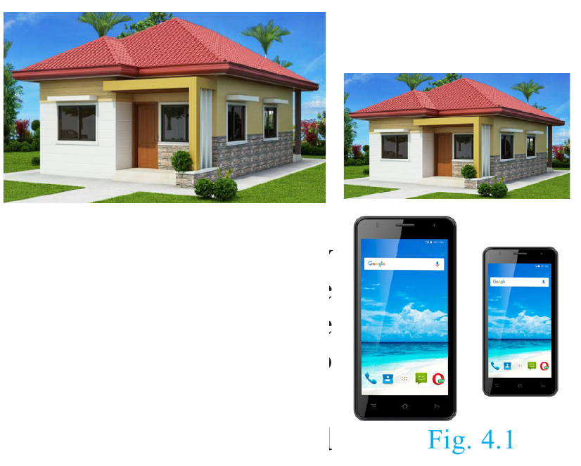

இந்தப் பாடப்பகுதியில் வடிவொத்த முக்கோணங்களின் பயன்பாட்டைப் பற்றி விவாதிக்க உள்ளோம். நம்மால் எளிமையாகக் கணக்கிட இயலாத தொலைவையும், உயரத்தையும் சாதாரண அளவீட்டு கருவிகளை வைத்துக் கண்டறிய இந்தக் கருத்துகள் உதவுகின்றன. வடிவொத்தவையைக் குறித்த கருத்தானது பரவலாகப் பொறியியல், கட்டிடக்கலை மற்றும் கட்டுமானத் துறையில் பயன்படுத்தப்படுகிறது.

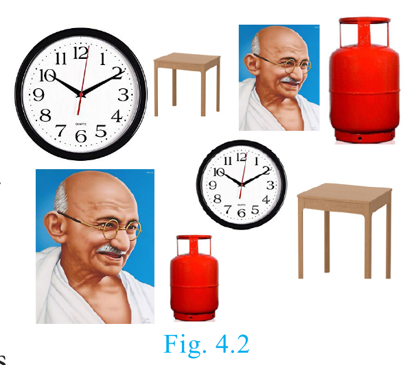

வடிவொத்தவையின் சில பயன்பாடுகள்

- (i) பொருட்களின் நிழல்களை ஆய்வு செய்து ஏற்படும் முக்கோணத்தைப் பயன்படுத்தி பொருள்களின் சரியான உயரத்தைக் கண்டறியலாம்.
- (ii) வான்வெளியிலிருந்து தரையிலுள்ள ஓர் இடத்தை புகைப்படம் எடுக்கும்போது புகைப்படக் கருவிக்கு அந்த இடத்திற்கு உள்ள தொலைவைத் தீர்மானிக்கப் பயன்படுகிறது.
- (iii) கட்டிடக்கலை துறையில் கட்டிடங்களின் வடிவமைப்புகளை உருவாக்குவதற்குப் பயன்படுகிறது.

### 4.2.1 வடிவொத்த முக்கோணங்கள் (Similar triangles)

ஒன்பதாம் வகுப்பில் சர்வசம முக்கோணத்தைப் பற்றி கற்றோம். ஒரே அளவையும் வடிவத்தையும் கொண்ட இரு வடிவியல் உருவங்களைச் சர்வசமம் என அழைக்கலாம். இங்கே, வேறுபட்ட அளவுகள் கொண்ட ஒரே மாதிரியான உருவங்களைப் பற்றி கற்க உள்ளோம். இவற்றை **வடிவொத்த உருவங்கள்** என்கிறோம்.

##### சர்வசம மற்றும் வடிவொத்த முக்கோணங்கள்

சர்வசமமானது, வடிவொத்தவையின் ஒரு பகுதியாகும். இவ்விரண்டிலும் ஒரு முக்கோணத்தின் மூன்று கோணங்களும் மற்ற முக்கோணத்தின் மூன்று ஒத்த கோணங்களுக்குச் சமமாக இருக்கும். ஆனால் சர்வசம முக்கோணங்களில் ஒத்த பக்கங்கள் சமமாக இருக்கும். வடிவொத்த முக்கோணங்களில் ஒத்த பக்கங்கள் விகிதசமமாக இருக்கும்.

> **குறிப்பு**
>
> முக்கோணம் $ABC$ மற்றும் $PQR$ இரண்டும் வடிவொத்தவை. இதை $\triangle ABC \sim \triangle PQR$ என எழுதலாம்.

| சர்வசம முக்கோணங்கள் | வடிவொத்த முக்கோணங்கள் |
| --- | --- |
| 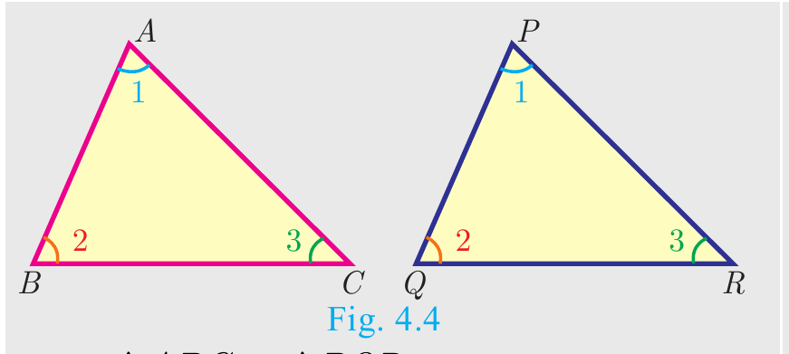 | 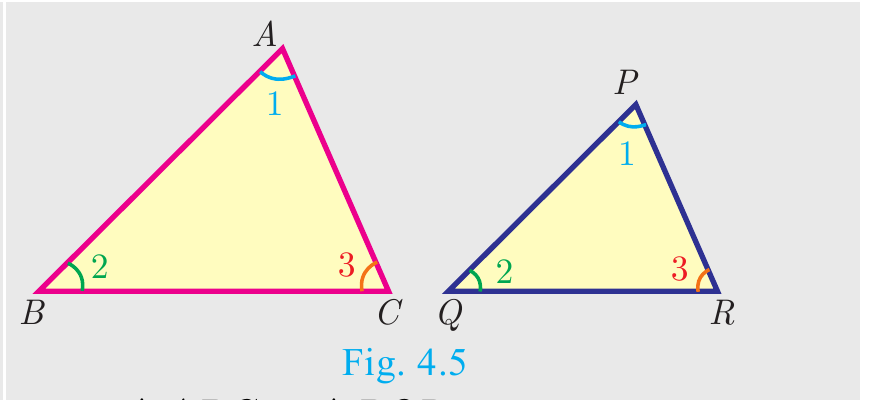 |
| $\triangle ABC \cong \triangle PQR$ | $\triangle ABC \sim \triangle PQR$ |
| $\angle A=\angle P,\ \angle B=\angle Q,\ \angle C=\angle R$. | $\angle A=\angle P,\ \angle B=\angle Q,\ \angle C=\angle R$ |
| $AB=PQ,\ BC=QR,\ CA=RP$ | $AB\neq PQ,\ BC\neq QR,\ CA\neq RP$ ஆனால் |
| $\dfrac{AB}{PQ}=\dfrac{BC}{QR}=\dfrac{CA}{RP}=1$ | $\dfrac{AB}{PQ}=\dfrac{BC}{QR}=\dfrac{CA}{RP}>1$ அல்லது $<1$ |
| ஒத்த வடிவமும் ஒரே அளவும். | ஒரே வடிவமும் வேறுபட்ட அளவும். |

> **சிந்தனைக் களம்**
>
> 1. சதுரமும், சாய்சதுரமும் சர்வசம உருவங்களா அல்லது வடிவொத்த உருவங்களா என்பதை விவாதிக்கவும்.
> 2. செவ்வகமும், இணைகரமும் வடிவொத்த உருவங்களா என்பதை விவாதிக்கவும்.

### 4.2.2 வடிவொத்த முக்கோணங்களுக்கான விதிமுறைகள் (Criteria of Similarity)

பின்வரும் அடிப்படை விதிமுறைகள் முக்கோணங்கள் வடிவொத்தவை என்பதை நிரூபிக்கப் போதுமானவை.

##### வடிவொத்தவைக்கான AA விதிமுறை (Criterion of similarity)

ஒரு முக்கோணத்தின் இரண்டு கோணங்கள் முறையே மற்றொரு முக்கோணத்தின் இரண்டு கோணங்களுக்குச் சமமானால், அவ்விரு முக்கோணங்களும் வடிவொத்தவை ஆகும். ஏனெனில் இரு முக்கோணங்களிலும் மூன்றாவது கோணம் சமமாக இருக்கும். எனவே வடிவொத்தவைக்கான $AA$-விதிமுறையானது வடிவொத்தவைக்கான $AAA$-விதிமுறை போலவே உள்ளது.

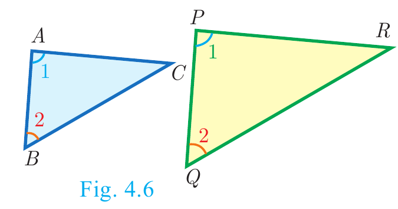

$\angle A=\angle P=1$ மற்றும் $\angle B=\angle Q=2$ எனில், $\triangle ABC\sim\triangle PQR$.

##### வடிவொத்தவைக்கான SAS விதிமுறை (SAS Criterion of similarity)

ஒரு முக்கோணத்தின் ஒரு கோணம் மற்றொரு முக்கோணத்தின் ஒரு கோணத்திற்குச் சமமாகவும், அவை உள்ளிட்ட பக்கங்களும் விகிதசமமாக இருந்தால், அவ்விரண்டு முக்கோணங்களும் வடிவொத்தவை ஆகும்.

எனவே $\angle A=\angle P=1$ மற்றும்

$$\frac{AB}{PQ}=\frac{AC}{PR}$$

எனில், $\triangle ABC\sim\triangle PQR$.

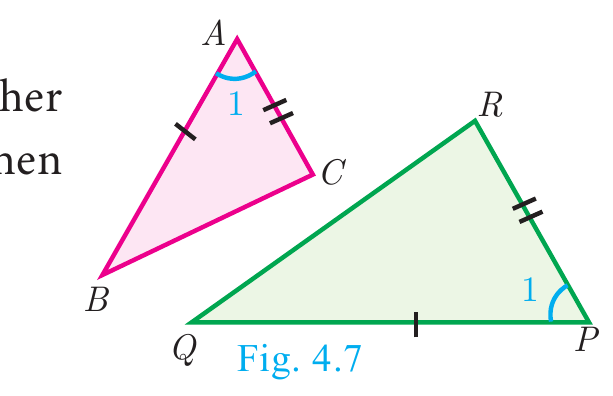

##### வடிவொத்தவைக்கான SSS விதிமுறை (SSS Criterion of similarity)

ஒரு முக்கோணத்தின் மூன்று பக்கங்கள் முறையே மற்றொரு முக்கோணத்தின் மூன்று பக்கங்களுக்கு விகிதசமம் எனில், அவ்விரு முக்கோணங்களும் வடிவொத்தவை ஆகும்.

எனவே, $\dfrac{AB}{PQ}=\dfrac{AC}{PR}=\dfrac{BC}{QR}$ எனில், $\triangle ABC\sim\triangle PQR$.

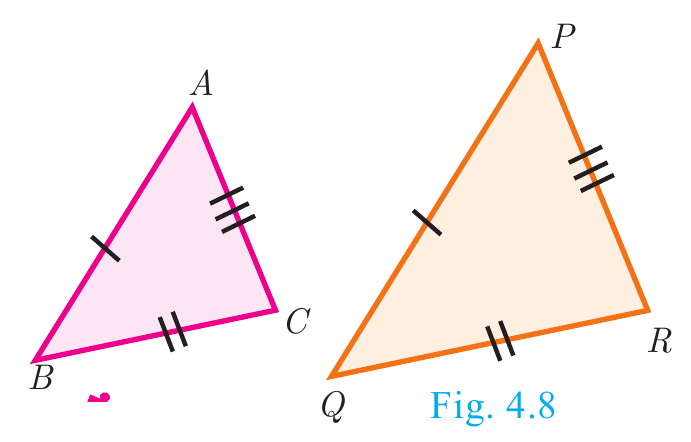

> **சிந்தனைக் களம்**
>
> இரு செங்கோண முக்கோணங்கள் வடிவொத்தவையாக இருக்குமா? ஏன்?

##### வடிவொத்த முக்கோணங்களுக்கான சில பயனுள்ள முடிவுகள்

1. செங்கோண முக்கோணத்தின் உச்சியிலிருந்து வரையப்படும் செங்குத்து கோட்டினால் பிரிக்கப்படும் இரு சிறிய முக்கோணங்களும் வடிவொத்தவையாக இருக்கும். மேலும் அச்சிறிய முக்கோணங்கள் கொடுக்கப்பட்ட முக்கோணத்திற்கும் வடிவொத்தவையாகவே இருக்கும்.

   $\triangle ADB\sim\triangle BDC,\ \triangle ABC\sim\triangle ADB,\ \triangle ABC\sim\triangle BDC$

   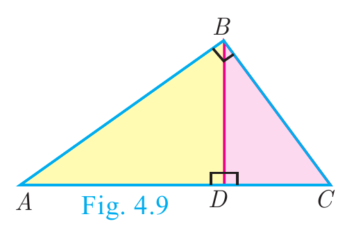

2. இரு முக்கோணங்கள் வடிவொத்தவை எனில், ஒத்த பக்கங்களின் விகிதம் அவற்றின் ஒத்த குத்துயரங்களின் விகிதத்திற்குச் சமம்.

   எனவே, $\triangle ABC\sim\triangle PQR$ எனில்,

   $$\frac{AB}{PQ}=\frac{BC}{QR}=\frac{CA}{RP}=\frac{AD}{PS}=\frac{BE}{QT}=\frac{CF}{RU}$$

   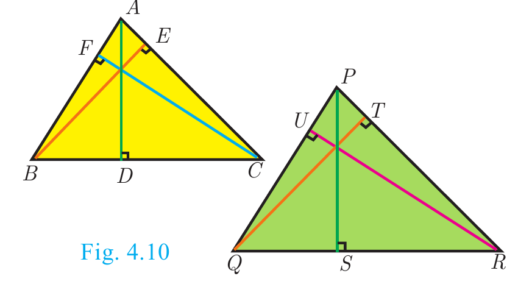

3. இரு முக்கோணங்கள் வடிவொத்தவை எனில், ஒத்த பக்கங்களின் விகிதம் அவற்றின் ஒத்த சுற்றளவுகளின் விகிதத்திற்குச் சமம்.

   $\triangle ABC\sim\triangle DEF$ எனில்,

   $$\frac{AB}{DE}=\frac{BC}{EF}=\frac{CA}{FD}=\frac{AB+BC+CA}{DE+EF+FD}$$

   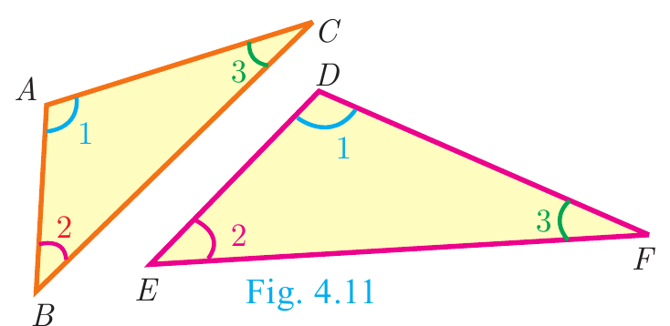

4. இரு வடிவொத்த முக்கோணங்களின் பரப்பளவுகளின் விகிதம் அவற்றின் ஒத்த பக்கங்களின் வர்க்கங்களின் விகிதத்திற்குச் சமம்.

   $$\frac{\triangle ABC\text{-யின் பரப்பளவு}}{\triangle PQR\text{-யின் பரப்பளவு}}=\frac{AB^2}{PQ^2}=\frac{BC^2}{QR^2}=\frac{AC^2}{PR^2}$$

   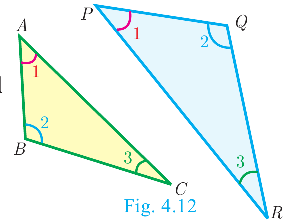

5. இரு முக்கோணங்கள் பொதுவான முனையையும் அவற்றின் அடிப்பக்கங்கள் ஒரே நேர்க்கோட்டிலும் இருந்தால், அம்முக்கோணங்களின் பரப்புகளின் விகிதம் அவற்றின் அடிப்பக்க நீளங்களின் விகிதத்திற்குச் சமமாகும்.

   $$\frac{\triangle ABD\text{-யின் பரப்பளவு}}{\triangle BDC\text{-யின் பரப்பளவு}}=\frac{AD}{DC}$$

   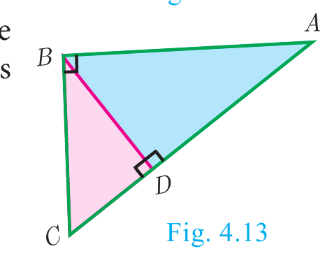

> **வரையறை 1**
>
> இரு முக்கோணங்களின் ஒத்த பக்கங்கள் விகிதசமமாக இருந்தால் அம்முக்கோணங்கள் வடிவொத்தவை.
>
> **வரையறை 2**
>
> இரு முக்கோணங்களின் ஒத்த கோணங்கள் சமம் எனில், அவை சமகோண முக்கோணங்கள் ஆகும்.

##### விளக்கம்

இரண்டு முக்கோணங்களான, $\triangle XYZ$ மற்றும் $\triangle LMN$-யின் ஒத்த கோணங்கள் சமம் என்பதால் இவை வடிவொத்த முக்கோணங்கள் ஆகும்.

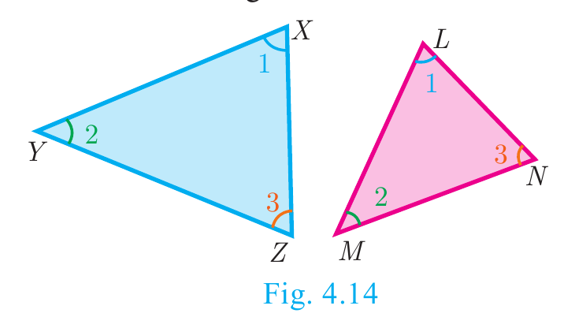

> **குறிப்பு**
>
> (i) ஒரு ஜோடி சமகோண முக்கோணங்கள் வடிவொத்தவை ஆகும்.
>
> (ii) இரு முக்கோணங்கள் வடிவொத்தவை எனில் அவை சமகோண முக்கோணங்கள் ஆகும்.

(i) $\angle X=\angle L,\ \angle Y=\angle M,\ \angle Z=\angle N$ (கோணத்தைப் பொறுத்து) (ii) $\dfrac{XY}{LM}=\dfrac{YZ}{MN}=\dfrac{XZ}{LN}$ (பக்கத்தைப் பொறுத்து)

இங்கு $X,\ Y,\ Z$-ன் ஒத்த முனைகள் $L,\ M,\ N$ ஆகும். குறியீட்டில் $\triangle XYZ\sim\triangle LMN$ எனக் கூறலாம்.

#### எடுத்துக்காட்டு 4.1

$\triangle PST \sim \triangle PQR$ எனக் காட்டுக.

(i)

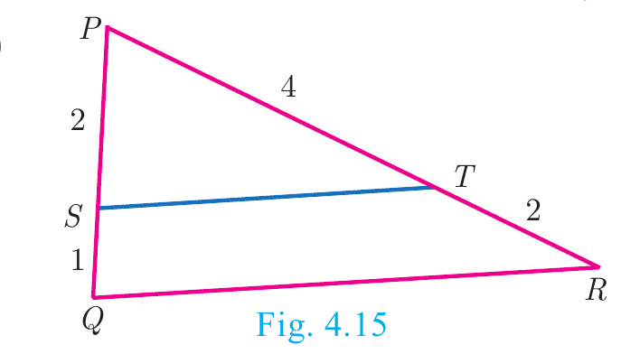

(ii)

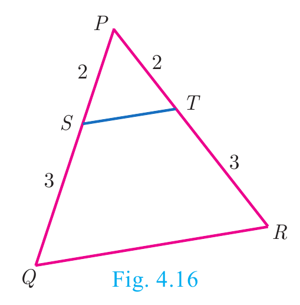

**தீர்வு**

(i) $\triangle PST$ மற்றும் $\triangle PQR$-யில்,

$$\frac{PS}{PQ}=\frac{2}{2+1}=\frac23,\quad \frac{PT}{PR}=\frac{4}{4+2}=\frac23$$

இதிலிருந்து, $\dfrac{PS}{PQ}=\dfrac{PT}{PR}$ மற்றும் $\angle P$ ஆனது பொதுக் கோணம். எனவே,

$SAS$ விதிமுறைப்படி, $\triangle PST\sim\triangle PQR$

(ii) $\triangle PST$ மற்றும் $\triangle PQR$-யில்,

$$\frac{PS}{PQ}=\frac{2}{2+3}=\frac25,\quad \frac{PT}{PR}=\frac{2}{2+3}=\frac25$$

இதிலிருந்து, $\dfrac{PS}{PQ}=\dfrac{PT}{PR}$ மற்றும் $\angle P$ ஆனது பொதுக் கோணம். எனவே,

$SAS$ விதிமுறைப்படி, $\triangle PST\sim\triangle PQR$

#### எடுத்துக்காட்டு 4.2

$\triangle ABC\sim\triangle PQR$ ஆக இருக்குமா?

**தீர்வு** $\triangle ABC$ மற்றும் $\triangle PQR$-யில்,

$$\frac{PQ}{AB}=\frac36=\frac12;\quad \frac{QR}{BC}=\frac{4}{10}=\frac25$$

$\dfrac12\neq\dfrac25$ என்பதால், $\dfrac{PQ}{AB}\neq\dfrac{QR}{BC}$

ஒத்த பக்கங்கள் விகிதச் சமமாக இல்லை.

எனவே, $\triangle ABC$ ஆனது $\triangle PQR$-க்கு வடிவொத்தவை அமையாது.

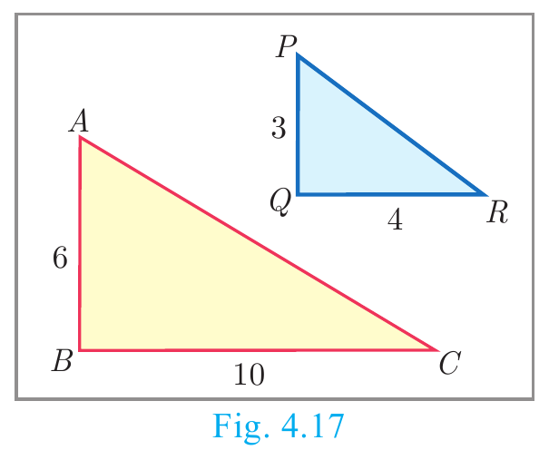

> **குறிப்பு**
>
> கொடுக்கப்பட்ட நான்கு நீளங்களில் ஒன்றை மாற்றியமைத்து வடிவொத்த முக்கோணங்களை உருவாக்கலாம்.

#### எடுத்துக்காட்டு 4.3

படம் 4.18-லிருந்து $\angle P$-ஐ காண்க.

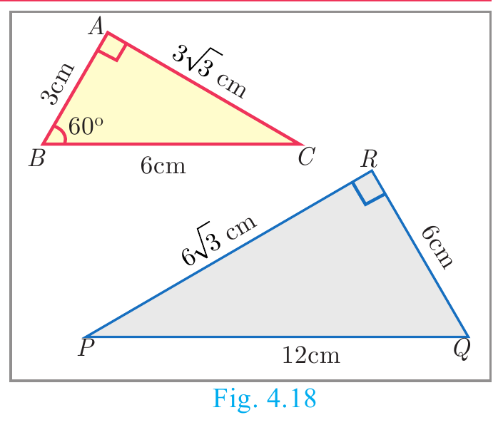

**தீர்வு** $\triangle BAC$ மற்றும் $\triangle PRQ$-ல்,

$$\frac{AB}{RQ}=\frac36=\frac12;\quad \frac{BC}{QP}=\frac{6}{12}=\frac12;\quad \frac{CA}{PR}=\frac{3\sqrt3}{6\sqrt3}=\frac12$$

எனவே, $\dfrac{AB}{RQ}=\dfrac{BC}{QP}=\dfrac{CA}{PR}$

$SSS$ விதிமுறைப்படி நாம் பெறுவது, $\triangle BAC\sim\triangle QRP$

$\angle P=\angle C$ (வடிவொத்த முக்கோணத்தின் ஒத்த கோணங்கள் சமம்)

$$\angle P=\angle C=180^\circ-(\angle A+\angle B)=180^\circ-(90^\circ+60^\circ)$$

$$\angle P=180^\circ-150^\circ=30^\circ$$

#### எடுத்துக்காட்டு 4.4

90 செ.மீ உயரமுள்ள ஒரு சிறுவன் விளக்கு கம்பத்தின் அடியிலிருந்து 1.2 மீ/வினாடி வேகத்தில் நடந்து செல்கிறான். தரையிலிருந்து விளக்கு கம்பத்தின் உயரம் 3.6 மீ எனில், 4 வினாடிகள் கழித்துச் சிறுவனுடைய நிழலின் நீளத்தைக் காண்க.

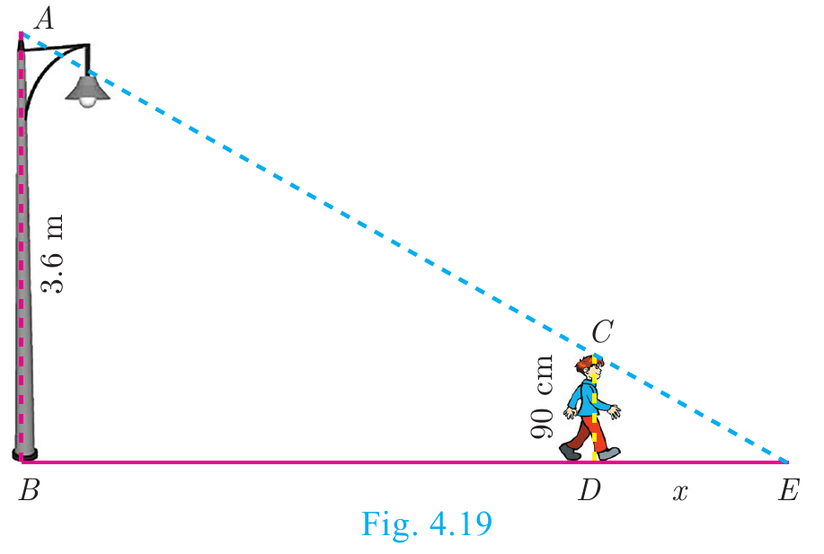

**தீர்வு** வேகம் $=1.2$ மீ/வினாடி, நேரம் $=4$ வினாடி என்பது கொடுக்கப்பட்டது.

$$\text{தொலைவு} = \text{வேகம்} \times \text{நேரம்} = 1.2\times4=4.8\text{ மீ}$$

4 வினாடிகளுக்குப் பிறகு சிறுவனுடைய நிழலின் நீளம் $x$ என்க.

$\triangle ABE\sim\triangle CDE$ ஆகையினால், $\dfrac{BE}{DE}=\dfrac{AB}{CD}$ எனவே $\dfrac{4.8+x}{x}=\dfrac{3.6}{0.9}=4$ (90 செ.மீ $=0.9$ மீ)

$4.8+x=4x \Rightarrow 3x=4.8$ ஆகவே, $x=1.6$ மீ

சிறுவனுடைய நிழலின் நீளம் $DE=1.6$ மீ

#### எடுத்துக்காட்டு 4.5

படம் 4.20-யில் $\angle A=\angle CED$ எனில், $\triangle CAB \sim \triangle CED$ என நிரூபிக்கவும். மேலும் $x$-யின் மதிப்பு காண்க.

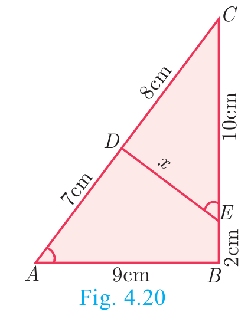

**தீர்வு** $\triangle CAB$ மற்றும் $\triangle CED$-யில், $\angle C$ பொதுவானது, $\angle A=\angle CED$

எனவே, $\triangle CAB\sim\triangle CED$ ($AA$ விதிமுறைப்படி)

ஆகவே, $\dfrac{CA}{CE}=\dfrac{AB}{DE}=\dfrac{CB}{CD}$

$\dfrac{AB}{DE}=\dfrac{CB}{CD} \Rightarrow \dfrac{9}{x}=\dfrac{10+2}{8}$ எனவே, $x=\dfrac{8\times9}{12}=6$ செ.மீ.

#### எடுத்துக்காட்டு 4.6

படம் 4.21-யில், $QA$ மற்றும் $PB$ ஆனது $AB$-க்கு செங்குத்தாகும். $AO=10$ செ.மீ, $BO=6$ செ.மீ மற்றும் $PB=9$ செ.மீ. $AQ$-ஐக் காண்க.

**தீர்வு** $\triangle AOQ$ மற்றும் $\triangle BOP$-ல், $\angle OAQ=\angle OBP=90^\circ$

$\angle AOQ=\angle BOP$ (குத்தெதிர் கோணங்கள்)

எனவே, வடிவொத்தமைக்கான $AA$ விதிமுறைப்படி, $\triangle AOQ\sim\triangle BOP$

$$\frac{AO}{BO}=\frac{OQ}{OP}=\frac{AQ}{BP}$$

எனவே, $\dfrac{10}{6}=\dfrac{AQ}{9} \Rightarrow AQ=\dfrac{10\times9}{6}=15$ செ.மீ.

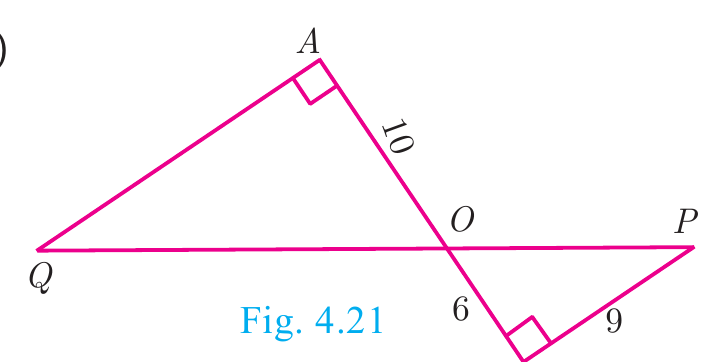

#### எடுத்துக்காட்டு 4.7

வடிவொத்த முக்கோணங்கள் $ABC$ மற்றும் $PQR$-ன் சுற்றளவுகள் முறையே 36 செ.மீ மற்றும் 24 செ.மீ ஆகும். $PQ=10$ செ.மீ எனில், $AB$-ஐக் காண்க.

**தீர்வு** வடிவொத்த முக்கோணங்களின் ஒத்த பக்கங்களின் விகிதம் அவற்றின் ஒத்த சுற்றளவுகளின் விகிதத்திற்குச் சமம்.

$\triangle ABC\sim\triangle PQR$ ஆகையினால்,

$$\frac{AB}{PQ}=\frac{BC}{QR}=\frac{AC}{PR}=\frac{36}{24}$$

$$\frac{AB}{PQ}=\frac{36}{24} \Rightarrow \frac{AB}{10}=\frac{36}{24}$$

$$AB=\frac{36\times10}{24}=15\text{ செ.மீ}$$

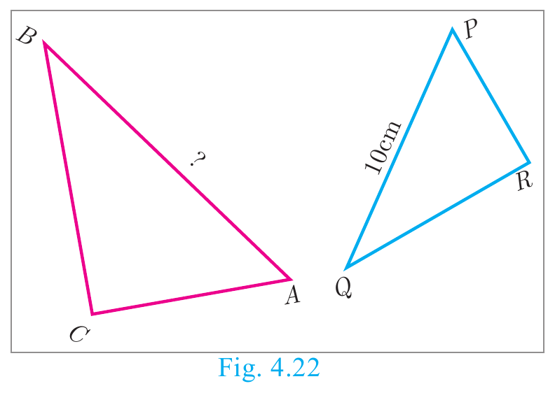

#### எடுத்துக்காட்டு 4.8

$\triangle ABC$ ஆனது $\triangle DEF$-க்கு வடிவொத்தவை. மேலும் $BC=3$ செ.மீ, $EF=4$ செ.மீ மற்றும் முக்கோணம் $ABC$-யின் பரப்பு $54$ செ.மீ$^2$ எனில், $\triangle DEF$-யின் பரப்பைக் காண்க.

**தீர்வு** இரு வடிவொத்த முக்கோணங்களுடைய பரப்புகளின் விகிதமானது அவற்றின் ஒத்த பக்கங்களுடைய வர்க்கங்களின் விகிதத்திற்குச் சமமாதால்

$$\frac{\triangle ABC\text{-ன் பரப்பளவு}}{\triangle DEF\text{-ன் பரப்பளவு}}=\frac{BC^2}{EF^2} \Rightarrow \frac{54}{\triangle DEF\text{-ன் பரப்பளவு}}=\frac{3^2}{4^2}$$

$$\triangle DEF\text{-ன் பரப்பளவு}=\frac{16\times54}{9}=96\text{ செ.மீ}^2$$

#### எடுத்துக்காட்டு 4.9

$p$ மீட்டர் இடைவெளியில் $a$ மீட்டர் மற்றும் $b$ மீட்டர் உயரமுள்ள இரண்டு தூண்கள் உள்ளன. தூண்களின் உச்சியிலிருந்து எதிரேயுள்ள தூண்களின் அடிக்கு வரையப்படும் கோடுகள் சந்திக்கும் புள்ளியின் உயரமானது $\dfrac{ab}{a+b}$ மீட்டர் என்பதை நிரூபிக்கவும்.

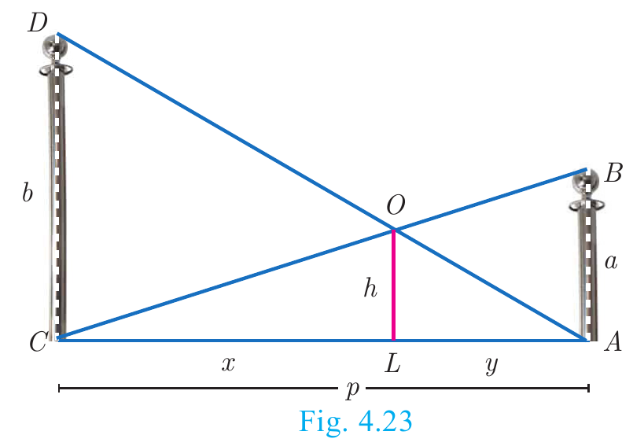

**தீர்வு** $p$ மீட்டர் இடைவெளியில் உள்ள $AB$ மற்றும் $CD$ என்ற இரு தூண்களின் உயரங்கள் முறையே '$a$' மீட்டர், '$b$' மீட்டர் என்க. அதாவது, $AC=p$ மீட்டர். $AD$ மற்றும் $BC$-யானது $O$-வில் சந்திக்கிறது எனில், $OL=h$ மீட்டர்.

$CL=x$ மற்றும் $LA=y$ என்க.

எனவே, $x+y=p$

$\triangle ABC$ மற்றும் $\triangle LOC$-யிலிருந்து,

$\angle CAB=\angle CLO$ [ஒவ்வொன்றும் $90^\circ$-க்கு சமம்]

$\angle C=\angle C$ [$C$ பொதுவானது]

$\triangle CAB\sim\triangle CLO$ [$AA$ விதிமுறைப்படி]

$$\frac{CA}{CL}=\frac{AB}{LO} \Rightarrow \frac{p}{x}=\frac{a}{h}$$

எனவே, $x=\dfrac{ph}{a}\qquad\cdots(1)$

$\triangle ALO$ மற்றும் $\triangle ACD \Rightarrow \angle ALO=\angle ACD$ [ஒவ்வொன்றும் $90^\circ$-க்கு சமம்]

$\angle A=\angle A$ [$A$ பொதுவானது]

$\triangle ALO\sim\triangle ACD$ [$AA$-விதிமுறைப்படி]

$$\frac{AL}{AC}=\frac{OL}{DC} \Rightarrow \frac{y}{p}=\frac{h}{b}$$ ஆகவே, $y=\dfrac{ph}{b}\qquad\cdots(2)$

$(1)+(2) \Rightarrow x+y=\dfrac{ph}{a}+\dfrac{ph}{b}$

$$p=ph\left(\frac1a+\frac1b\right)\qquad(\text{ஏனெனில் } x+y=p)$$

$$1=h\left(\frac{a+b}{ab}\right)$$

எனவே, $h=\dfrac{ab}{a+b}$

எனவே, இரு தூண்களின் உச்சியிலிருந்து எதிரே உள்ள தூண்களின் அடிக்கு வரையப்படும் கோடுகள் சந்திக்கும் புள்ளியின் உயரமானது $\dfrac{ab}{a+b}$ மீட்டர் ஆகும்.

> **முன்னேற்றச் சோதனை**
>
> 1. எல்லா வட்டங்களும் ________ (சர்வசம/ வடிவொத்தவை)
> 2. எல்லாச் சதுரங்களும் ________ (வடிவொத்தவை / சர்வசம)
> 3. இரு முக்கோணங்கள் வடிவொத்தவை எனில் அவற்றின் ஒத்த கோணங்கள் ________ மற்றும் அவற்றின் ஒத்த பக்கங்கள் ________.
> 4. (அ) எல்லா வடிவொத்த முக்கோணங்களும் சர்வசமமாகும்– சரி/ தவறு.
>
>    (ஆ) எல்லாச் சர்வசம முக்கோணங்களும் வடிவொத்தவையாகும்– சரி /தவறு.
> 5. வடிவொத்தவை இல்லாத உருவங்களுக்கு இரு வேறு எடுத்துக்காட்டுகள் கொடுக்கவும்.

> **செயல்பாடு 1**
>
> $\sqrt2$ நீளமுள்ள ஒரு கோட்டுத் துண்டினை வரைய முயற்சிப்போம். அதற்குக் கீழ்க்காணும் படிகளைக் கருத்தில் கொள்க.
>
> **படி 1:** 3 அலகு நீளமுள்ள ஒரு கோட்டுத்துண்டினை எடுத்துக்கொள்க. அதற்கு $AB$ என்று பெயரிடுக.
>
> **படி 2:** $AB$-யில் $C$ என்ற புள்ளியை $AC=2$, $CB=1$ எடுத்துக்கொள்க.
>
> **படி 3:** படத்தில் காட்டியுள்ளபடி $AB$-ஐ விட்டமாக உடைய ஓர் அரைவட்டம் வரைக.
>
> **படி 4:** அரைவட்டத்தின் மேல் $AB$-க்கு செங்குத்தாக $CP$ இருக்குமாறு $P$ என்ற புள்ளியை எடுத்துக்கொள்க.
>
> **படி 5:** $P$-யிலிருந்து $A$ மற்றும் $B$-ஐ இணைக்க. இப்பொழுது $ACP$ மற்றும் $BCP$ என்ற இரு செங்கோண முக்கோணங்களைப் பெறுகிறோம்.
>
> **படி 6:** முக்கோணங்கள் $ACP$ மற்றும் $BCP$ ஆனது வடிவொத்தவையாக இருக்கிறதா எனச் சரிபார்க்கவும்.
>
> **படி 7:** $CP=h$ என்பது பொதுவான செங்குத்துயரம் என்க. வடிவொத்தவையைப் பயன்படுத்தி $h$-யின் மதிப்பைக் காண்க.
>
> **படி 8:** $h$-ஐ கண்டுபிடிப்பதின் மூலம் நீ என்ன தெரிந்துகொண்டாய்?
>
> இதே செயல்முறைகளின்படி, $\sqrt3,\ \sqrt5,\ \sqrt8$ நீளமுள்ள கோட்டுத்துண்டினை உருவாக்க முடியுமா?
>
> 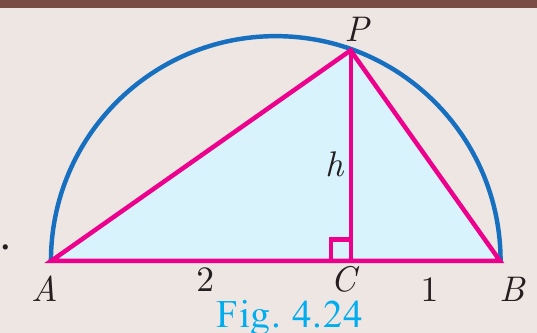

### 4.2.3 வடிவொத்த முக்கோணங்களை வரைதல் (Construction of similar triangles)

வடிவொத்த முக்கோணங்களைப் பற்றிய கருத்துகளையும் அவற்றின் பண்புகளையும் இதுவரை விவாதித்தோம். இப்பொழுது கொடுக்கப்பட்ட முக்கோணத்திற்குக் குறிப்பிட்ட விகிதத்தில் அமையும் வடிவொத்த மற்றொரு முக்கோணத்தை வரையும் முறையினைப் பற்றி காண்போம்.

இந்த வரைதல் முறையில் இரு வகை உள்ளன. அதில் ஒன்று, ஒத்த பக்கங்களின் தகவு 1-ஐ விடக் குறைவாகவும், மற்றொன்று ஒத்த பக்கங்களின் தகவு 1-ஐ விட அதிகமாகவும் உள்ள இரண்டு வாய்ப்புகளைக் கருதுவோம். ஒத்த பக்கங்களின் தகவை அளவு காரணி (scale factor) என அழைக்கலாம். பின்வரும் எடுத்துக்காட்டுகளில் ஒத்த பக்கத்தின் தகவானது மேற்கூறிய இரு வாய்ப்புகளில் இருக்குமாறு, ஒரு வடிவொத்த முக்கோணத்தை வரையும் முறையைக் காண்போம்.

#### எடுத்துக்காட்டு 4.10

கொடுக்கப்பட்ட முக்கோணம் $PQR$-க்கு ஒத்த பக்கங்களின் விகிதம் $\dfrac35$ என அமையுமாறு ஒரு வடிவொத்த முக்கோணம் வரைக. (அளவு காரணி $\dfrac35<1$)

**தீர்வு** $PQR$ ஆனது கொடுக்கப்பட்ட முக்கோணம் ஆகும். $PQR$ என்ற முக்கோணத்தின் பக்கங்களுக்கு $\dfrac35$ அளவுடைய ஒத்த பக்கங்களைக் கொண்ட மற்றொரு முக்கோணத்தை அமைப்போம்.

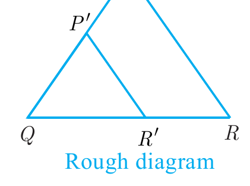

##### வரைதலின் படிகள்

1. ஏதேனும் ஓர் அளவைக் கொண்டு $\triangle PQR$ வரைக.
2. $QR$ என்ற கோட்டுத்துண்டில் குறுங்கோணத்தை ஏற்படுத்துமாறு, $QX$ என்ற கதிரை $P$ என்ற முனைப் புள்ளிக்கு எதிர் திசையில் வரைக.
3. $QX$-யின் மீது $Q_1,Q_2,Q_3,Q_4$ மற்றும் $Q_5$ என்ற 5 புள்ளிகளை ($\dfrac35$-யில் 3 மற்றும் 5 ஆகியவற்றில் பெரியது 5 என்பதால்) $QQ_1=Q_1Q_2=Q_2Q_3=Q_3Q_4=Q_4Q_5$ என்றவாறு குறிக்கவும்.
4. $Q_5R$-ஐ இணைத்து, $Q_3$-யிலிருந்து (3-வது புள்ளி, அதாவது $\dfrac35$-யில் 3 மற்றும் 5 ஆகியவற்றில் சிறியது) $Q_5R$-க்கு இணையாக ஒரு கோடு வரைக. இது $QR$-ஐ $R'$-யில் சந்திக்கிறது.
5. $R'$-லிருந்து $RP$-க்கு இணையாக வரையப்படும் கோடு $QP$-ஐ $P'$-யில் சந்திக்கிறது.

$\triangle P'QR'$-யின் பக்கங்கள் $\triangle PQR$-ன் ஒத்த பக்கங்களின் அளவில் 5-ல் 3 பங்கு ஆகும். $\triangle P'QR'$ ஆனது தேவையான வடிவொத்த முக்கோணம் ஆகும்.

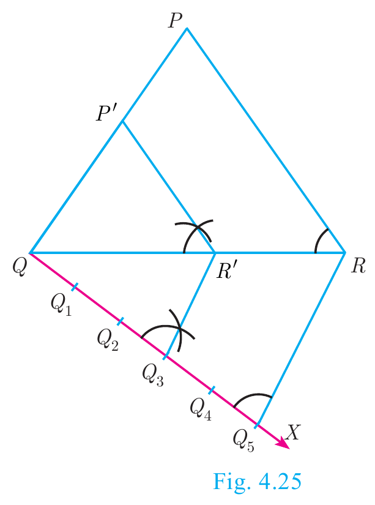

#### எடுத்துக்காட்டு 4.11

கொடுக்கப்பட்ட முக்கோணம் $PQR$-க்கு ஒத்த பக்கங்களின் விகிதம் $\dfrac74$ என அமையுமாறு ஒரு வடிவொத்த முக்கோணம் வரைக. (அளவு காரணி $\dfrac74>1$)

**தீர்வு** கொடுக்கப்பட்ட $\triangle PQR$-ன் பக்கங்களைப் போல் $\dfrac74$ பங்கு அளவுடைய ஒத்த பக்கங்களைக் கொண்ட மற்றொரு முக்கோணத்தை அமைப்போம்.

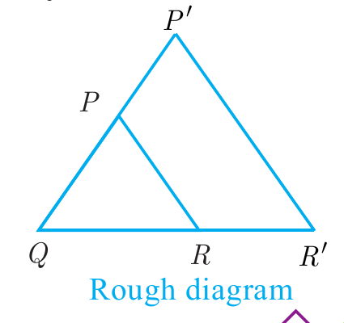

##### வரைதலின் படிகள்

1. ஏதேனும் ஓர் அளவைக் கொண்டு $\triangle PQR$ வரைக.
2. $QR$ என்ற கோட்டுத்துண்டில் குறுங்கோணத்தை ஏற்படுத்துமாறு $QX$ என்ற கதிரை $P$ என்ற முனைப் புள்ளிக்கு எதிர் திசையில் வரைக.
3. $QX$-ன் மீது $Q_1,Q_2,Q_3,Q_4,Q_5,Q_6$ மற்றும் $Q_7$ என்ற 7 புள்ளிகளை ($\dfrac74$-யில் 7 மற்றும் 4 ஆகியவற்றில் பெரியது 7 என்பதால்) $QQ_1=Q_1Q_2=Q_2Q_3=Q_3Q_4=Q_4Q_5=Q_5Q_6=Q_6Q_7$ என்றவாறு குறிக்கவும்.
4. $Q_4$-ஐ (4-வது புள்ளி, அதாவது $\dfrac74$-யில் 4 மற்றும் 7 ஆகியவற்றில் சிறியது) $R$-உடன் இணைக்க. $Q_4R$-க்கு இணையாக $Q_7$-லிருந்து வரையப்படும் கோடு $QR$-ஐ நீட்டித்த கோட்டுத்துண்டை $R'$-ல் சந்திக்கிறது.
5. $R'$-லிருந்து $RP$-க்கு இணையாக வரையப்படும் கோடு $QP$-ஐ நீட்டித்த கோட்டுத்துண்டை $P'$-ல் சந்திக்கிறது.

$\triangle P'QR'$-யின் பக்கங்கள் $\triangle PQR$-ன் ஒத்த பக்கங்களின் அளவில் 4-ல் 7 பங்கு ஆகும். $\triangle P'QR'$ ஆனது தேவையான வடிவொத்த முக்கோணம் ஆகும்.

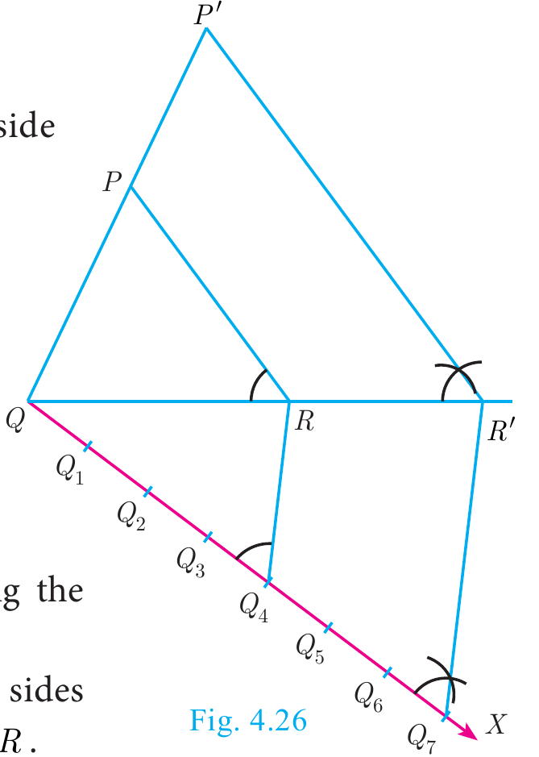

### பயிற்சி 4.1

1. கீழே கொடுக்கப்பட்டவற்றில் எந்த முக்கோணங்கள் வடிவொத்தவை என்பதைச் சோதிக்கவும். மேலும் $x$-யின் மதிப்பு காண்க.

   (i)

   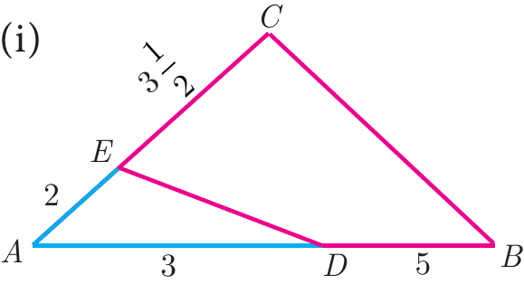

   (ii)

   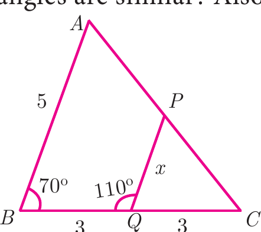

2. ஒரு பெண் விளக்கு கம்பத்தின் அடியிலிருந்து 6.6 மீ தொலைவிலுள்ள கண்ணாடியில் விளக்கு கம்ப உச்சியின் பிரதிபலிப்பைக் காண்கிறாள். 1.25மீ உயரமுள்ள அப்பெண் கண்ணாடியிலிருந்து 2.5 மீ தொலைவில் நிற்கிறாள். கண்ணாடியானது வானத்தை நோக்கி வைக்கப்பட்டுள்ளது. அப்பெண், கண்ணாடி மற்றும் விளக்கு கம்பம் ஆகியவை எல்லாம் ஒரே நேர்க்கோட்டில் அமைவதாக எடுத்துக்கொண்டால், விளக்குக் கம்பத்தின் உயரத்தைக் காண்க.
3. 6 மீ உயரமுள்ள செங்குத்தாக நிற்கும் கம்பமானது தரையில் 400 செ.மீ நீளமுள்ள நிழலை ஏற்படுத்துகிறது. ஒரு கோபுரமானது 28 மீ நீளமுள்ள நிழலை ஏற்படுத்துகிறது. கம்பம் மற்றும் கோபுரம் ஒரே நேர்க்கோட்டில் அமைவதாகக் கருதி வடிவொத்த தன்மையைப் பயன்படுத்தி, கோபுரத்தின் உயரம் காண்க.
4. $QR$ ஐ அடிப்பக்கமாகக் கொண்ட இரு முக்கோணங்கள் $QPR$ மற்றும் $QSR$-யின் புள்ளிகள் $P$ மற்றும் $S$-யில் செங்கோணங்களாக அமைந்துள்ளன. இரு முக்கோணங்களும் $QR$-யின் ஒரே பக்கத்தில் அமைந்துள்ளன. $PR$ மற்றும் $SQ$ என்ற பக்கங்கள் $T$ என்ற புள்ளியில் சந்திக்கின்றன எனில், $PT\times TR=ST\times TQ$ என நிறுவுக.
5. கொடுக்கப்பட்ட படத்தில், $C$-ஐ செங்கோணமாகக் கொண்ட $\triangle ABC$-யில் $DE \perp AB$ எனில் $\triangle ABC \sim \triangle ADE$ என நிரூபிக்க. மேலும் $AE$ மற்றும் $DE$ ஆகியவற்றின் நீளங்களைக் காண்க.

   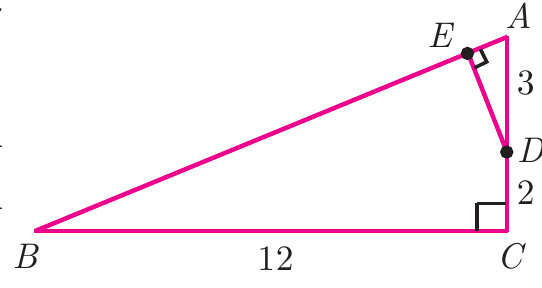

6. கொடுக்கப்பட்ட படத்தில், $\triangle ACB\sim\triangle APQ$. $BC=8$ செ.மீ, $PQ=4$ செ.மீ, $BA=6.5$ செ.மீ மற்றும் $AP=2.8$ செ.மீ எனில், $CA$ மற்றும் $AQ$-யின் மதிப்பைக் காண்க.

   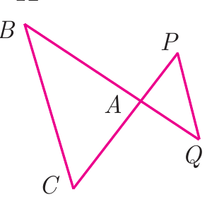

7. கொடுக்கப்பட்ட படத்தில் $OPRQ$ ஆனது சதுரம் மற்றும் $\angle MLN=90^\circ$ எனில், கீழ்க்காண்பனவற்றை நிரூபிக்கவும்.

   (i) $\triangle LOP \sim \triangle QMO$ (ii) $\triangle LOP \sim \triangle RPN$ (iii) $\triangle QMO \sim \triangle RPN$ (iv) $QR^2=MQ\times RN$

   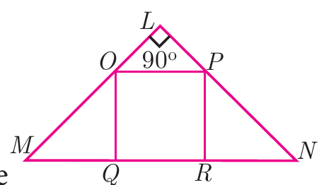

8. $\triangle ABC \sim \triangle DEF$-ல், $\triangle ABC$-யின் பரப்பு 9செ.மீ$^2$, $\triangle DEF$-யின் பரப்பு 16செ.மீ$^2$ மற்றும் $BC=2.1$ செ.மீ எனில், $EF$-யின் நீளம் காண்க.
9. 6 மீ மற்றும் 3 மீ உயரமுள்ள இரண்டு செங்குத்தான தூண்கள் $AC$ என்ற தரையின் மேல் படத்தில் காட்டியுள்ளவாறு ஊன்றப்பட்டுள்ளது எனில், $y$-யின் மதிப்பு காண்க.

   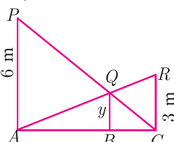

10. கொடுக்கப்பட்ட முக்கோணம் $PQR$-யின் ஒத்த பக்கங்களின் விகிதம் $\dfrac23$ என அமையுமாறு ஒரு வடிவொத்த முக்கோணம் வரைக. (அளவு காரணி $\dfrac23<1$)
11. கொடுக்கப்பட்ட முக்கோணம் $LMN$-யின் ஒத்த பக்கங்களின் விகிதம் $\dfrac45$ என அமையுமாறு ஒரு வடிவொத்த முக்கோணம் வரைக. (அளவு காரணி $\dfrac45<1$)
12. கொடுக்கப்பட்ட முக்கோணம் $ABC$-யின் ஒத்த பக்கங்களின் விகிதம் $\dfrac65$ என அமையுமாறு ஒரு வடிவொத்த முக்கோணம் வரைக. (அளவு காரணி $\dfrac65>1$)
13. கொடுக்கப்பட்ட முக்கோணம் $PQR$-ன் ஒத்த பக்கங்களின் விகிதம் $\dfrac73$ என்றவாறு ஒரு வடிவொத்த முக்கோணம் வரைக. (அளவு காரணி $\dfrac73>1$)

## 4.3 தேல்ஸ் தேற்றமும், கோண இருசமவெட்டித் தேற்றமும் (Thales Theorem and Angle Bisector Theorem)

### 4.3.1 அறிமுகம்

கி.மு ஏழாம் நூற்றாண்டில் வாழ்ந்த தேல்ஸ் (கி.மு. (பொ.ஆ.மு) 640–540) புகழ்பெற்ற கிரேக்கக் கணிதவியலாளரும், தத்துவஞானியும் ஆவார். கிரேக்க நாட்டில் வாழ்ந்த ஏழு ஞானிகளில் இவர் முதன்மையானவராகக் கருதப்படுகிறார். எந்த ஒரு புதிய கருத்தும் அறிவியல் பூர்வமாக பரிசோதித்த பின்னரே ஏற்றுக்கொள்ள வேண்டும் என்று முதன்முதலில் அறிவித்தவர் இவரே. அந்த வகையில் இவர் கணிதத்திலும், வானியியலிலும் ஆராய்ச்சிகள் மேற்கொண்டு பல கருத்துகளைக் கண்டறிந்தார். இன்றைய அடிப்படை விகிதச்சமத் தேற்றத்தின் நிரூபணத்தை முதன்முதலில் வழங்கிய பெருமைக்குரியவர் தேல்ஸ் ஆவார். எனவே, இவருடைய பெயரால் இது "தேல்ஸ் தேற்றம்" என்று அழைக்கப்படுகிறது.

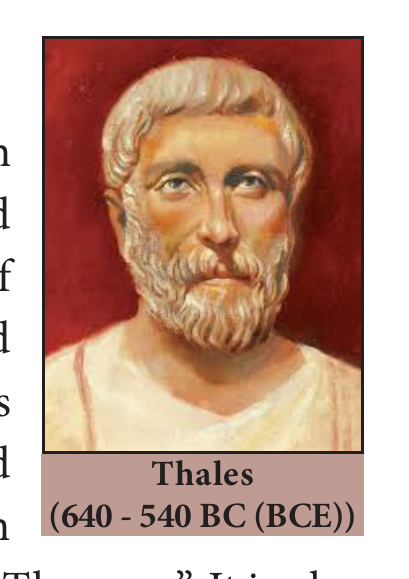

தேல்ஸ் தேற்றத்தின் கண்டுபிடிப்பே ஒரு ஆர்வத்தைத் தூண்டக்கூடிய நிகழ்வாகும். இவர் ஒருமுறை எகிப்திய நாட்டிற்குச் சென்றபோது எகிப்தியர்கள் உருவாக்கிய பல அற்புதப் பிரமிடுகளின் உயரத்தைக் கணக்கிடுமாறு சவால் விடுத்தனர். சவாலை ஏற்றுக்கொண்ட தேல்ஸ், வடிவொத்த முக்கோணக் கருத்துகளைப் பயன்படுத்திச் சவாலில் வெற்றி பெற்றார். படத்தில் $X_0$, $X_1$ மற்றும் $H_0$ ஆகியவற்றின் மதிப்புகள் தெரியும் எனில், பிரமிடின் உயரம் $H_1$-ஐக் கணக்கிடலாம். இது வடிவியலின் மற்றொரு வெற்றிகரமான பயன்பாடாகும்.

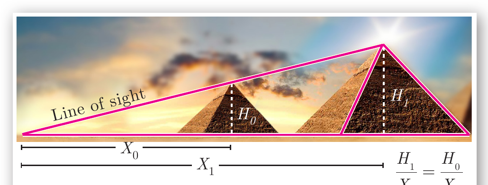

அடிப்படை விகிதச்சமத் தேற்றம் அல்லது தேல்ஸ் தேற்றத்தைப் பிரிந்து கொள்வதற்குக் கீழ்க்காணும் செயல்பாட்டை அறிவோம்.

> **செயல்பாடு 2**
>
> முக்கோணம் $ABC$-யின் அடிப்பக்கமானது கோடிட்ட காகிதத்தின் ஒரு கோட்டின் மேல் அமையுமாறு எடுத்துக்கொள்ள. பல இணை கோடுகள் முக்கோணம் $ABC$-யை வெட்டும். இந்த இணைகோடுகளில் ஏதேனும் ஓர் இணைக்கோட்டை எடுத்துக்கொள்க. மேலும் இக்கோடு பக்கங்கள் $AB$ மற்றும் $AC$-ஐ முறையே $P$ மற்றும் $Q$-யில் வெட்டுகிறது என்க.
>
> $\dfrac{AP}{PB}$ மற்றும் $\dfrac{AQ}{QC}$-யின் விகிதங்களைக் காணமுடியுமா? $AP$, $PB$, $AQ$ மற்றும் $QC$-ஐ அளவுகோலைக் கொண்டு அளவிட்டு விகிதங்கள் சமமாக உள்ளதா என்பதைச் சரிபார்க்கவும். வெவ்வேறு இணைகோடுகளுக்கு, $MN, RS$-க்கு $\dfrac{AM}{MB},\dfrac{AN}{NC}$ மற்றும் $\dfrac{AR}{RB},\dfrac{AS}{SC}$ ஆகிய விகிதங்களைக் காண்க. இவ்விகிதங்கள் சமமாக உள்ளதா?
>
> இந்த முடிவுகளிலிருந்து வடிவியலின் மிக முக்கியமான தேற்றத்தைப் பற்றி நாம் விவாதிப்போம்.
>
> 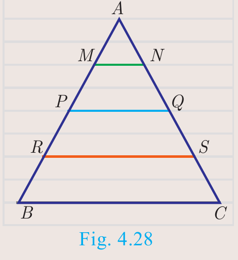

##### தேற்றம் 1: அடிப்படை விகிதச்சம தேற்றம் அல்லது தேல்ஸ் தேற்றம் (Basic Proportionality Theorem (BPT) or Thales theorem)

**கூற்று**

ஒரு நேர்கோடு முக்கோணத்தின் ஒரு பக்கத்திற்கு இணையாகவும் மற்ற இரு பக்கங்களை வெட்டுமாறு வரையப்பட்டால் அக்இரண்டு பக்கங்களையும் சம விகிதத்தில் பிரிக்கிறது.

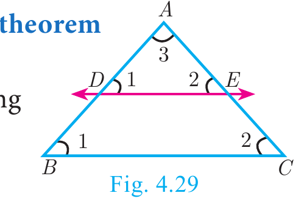

**நிருபணம்**

**கொடுக்கப்பட்டவை** : $\triangle ABC$-யில் $AB$-யின் மேலுள்ள புள்ளி $D$, $AC$-யின் மேல் உள்ள புள்ளி $E$ ஆகும்.

**நிரூபிக்க** : $\dfrac{AD}{DB}=\dfrac{AE}{EC}$

**அமைப்பு** : $DE \parallel BC$ வரைக.

| எண் | கூற்று | காரணம் |
|---|---|---|
| 1. | $\angle ABC=\angle ADE=\angle 1$ | ஒத்த கோணங்கள் சமம். ஏனெனில் $DE \parallel BC$ |
| 2. | $\angle ACB=\angle AED=\angle 2$ | ஒத்த கோணங்கள் சமம். ஏனெனில் $DE \parallel BC$ |
| 3. | $\angle DAE=\angle BAC=\angle 3$ | இரு முக்கோணங்களும் ஒரு பொதுவான கோணத்தைக் கொண்டுள்ளது |
| 4. | $\triangle ABC\sim\triangle ADE$ | $AAA$ விதிமுறைப்படி |
| | $\dfrac{AB}{AD}=\dfrac{AC}{AE}$ | ஒத்த பக்கங்கள் விகிதச்சமம் |
| | $\dfrac{AD+DB}{AD}=\dfrac{AE+EC}{AE}$ | $D$ மற்றும் $E$-ஐப் பயன்படுத்தி $AB$ மற்றும் $AC$-ஐப் பிரித்தல். |
| | $1+\dfrac{DB}{AD}=1+\dfrac{EC}{AE}$ | சுருக்குதல் |
| | $\dfrac{DB}{AD}=\dfrac{EC}{AE}$ | இரு பக்கங்களிலும் 1-ஐ நீக்குக. |
| | $\dfrac{AD}{DB}=\dfrac{AE}{EC}$ | தலைகீழாக மாற்றுக |
| | தேற்றம் நிரூபிக்கப்பட்டது | |

**கிளைத்தேற்றம்**

$\triangle ABC$-யில் $BC$-க்கு இணையான நேர்கோடு $DE$-யானது, $AB$-ஐ $D$-யிலும், $AC$-ஐ $E$-யிலும் வெட்டினால் (i) $\dfrac{AB}{AD}=\dfrac{AC}{AE}$ (ii) $\dfrac{AB}{DB}=\dfrac{AC}{EC}$.

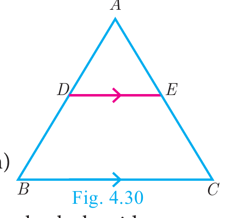

**நிருபணம் :** $\triangle ABC$-யில் $DE \parallel BC$

எனவே, $\dfrac{AD}{DB}=\dfrac{AE}{EC}$ (அடிப்படை விகிதச்சம தேற்றப்படி)

(i) தலைகீழாக எடுத்துக்கொண்டால் நாம் பெறுவது $\dfrac{DB}{AD}=\dfrac{EC}{AE}$ ஆகும்.

இருபுறமும் 1ஐ கூட்ட, $\dfrac{DB}{AD}+1=\dfrac{EC}{AE}+1$

$\dfrac{DB+AD}{AD}=\dfrac{EC+AE}{AE}$ ஆகையால், $\dfrac{AB}{AD}=\dfrac{AC}{AE}$

(ii) இருபுறமும் 1-ஐ கூட்ட,

$\dfrac{AD}{DB}+1=\dfrac{AE}{EC}+1$

எனவே, $\dfrac{AB}{DB}=\dfrac{AC}{EC}$

அடிப்படை விகிதசம தேற்றத்தின் மறுதலையும் உண்மையா? பின்வரும் விளக்கத்தின் மூலம் ஆராய்வோம்.

**விளக்கம்**

படம் 4.31-யில் காட்டியுள்ளபடி, உங்கள் குறிப்பேட்டில் $XAY$ என்ற கோணம் வரைந்து, $AX$ என்ற கதிரில் $AB_1=B_1B_2=B_2B_3=B_3B_4=B_4B=1$ செ.மீ என இருக்குமாறு $B_1,B_2,B_3,B_4,B$ என்ற புள்ளிகளைக் குறிக்கவும்.

இதேபோல் கதிர் $AY$-யில் $AC_1=C_1C_2=C_2C_3=C_3C_4=C_4C=2$ செ.மீ இருக்குமாறு $C_1,C_2,C_3,C_4,C$ என்ற புள்ளிகளைக் குறிக்கவும். $B_1C_1$ மற்றும் $BC$-ஐ இணைக்கவும்.

இதிலிருந்து $\dfrac{AB_1}{B_1B}=\dfrac{AC_1}{C_1C}=\dfrac14$ மற்றும் $B_1C_1 \parallel BC$

இதேபோல் $B_2C_2$, $B_3C_3$ மற்றும் $B_4C_4$-ஐ இணைப்பதன் மூலம்

$$\frac{AB_2}{B_2B}=\frac{AC_2}{C_2C}=\frac23 \text{ மற்றும் } B_2C_2 \parallel BC$$

$$\frac{AB_3}{B_3B}=\frac{AC_3}{C_3C}=\frac32 \text{ மற்றும் } B_3C_3 \parallel BC$$

$$\frac{AB_4}{B_4B}=\frac{AC_4}{C_4C}=\frac41 \text{ மற்றும் } B_4C_4 \parallel BC$$

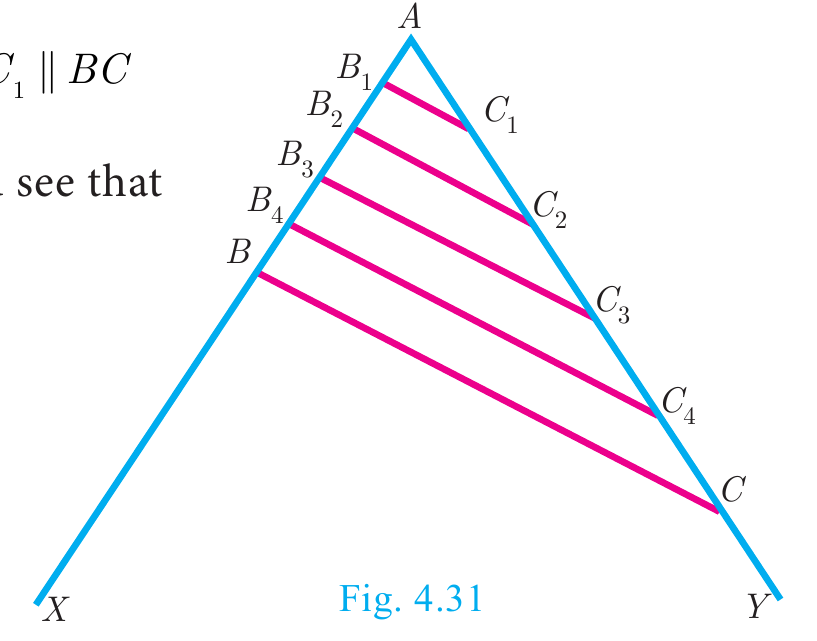

ஆகையால், ஒரு கோடு ஒரு முக்கோணத்தின் இரு பக்கங்களைச் சமவிகிதத்தில் பிரிக்கிறது எனில், அக்கோடு மூன்றாவது பக்கத்திற்கு இணையாகும் என்பதைப் புரிந்து கொள்ளலாம். இக்கருத்தை முறையாக நிரூபிக்கும் தேற்றமானது அடிப்படை விகிதசம தேற்றத்தின் மறுதலையாகும்.

##### தேற்றம் 2: அடிப்படை விகிதசம தேற்றத்தின் மறுதலை (அல்லது) தேல்ஸ் தேற்றத்தின் மறுதலை (Converse of Basic Proportionality Theorem)

**கூற்று**

ஒரு நேர்கோடு ஒரு முக்கோணத்தின் இரு பக்கங்களைச் சமவிகிதத்தில் பிரித்தால், அந்நேர்கோடானது மூன்றாவது பக்கத்திற்கு இணையாக இருக்கும்.

**நிருபணம்**

**கொடுக்கப்பட்டவை** : $\triangle ABC$-யில், $\dfrac{AD}{DB}=\dfrac{AE}{EC}$

**நிரூபிக்க** : $DE \parallel BC$

**அமைப்பு** : $DE$ ஆனது $BC$-க்கு இணையாக இல்லையெனில், $DF \parallel BC$ என்றவாறு $DF$-ஐ வரைக.

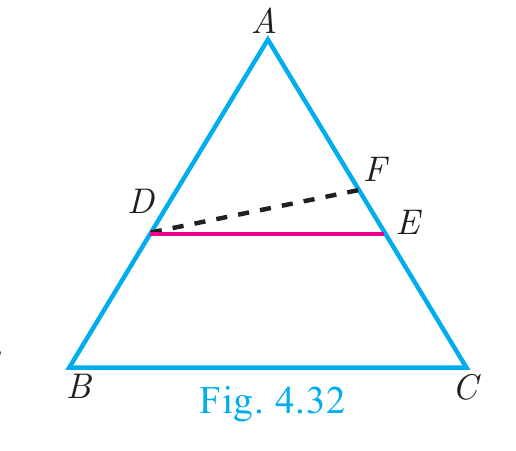

| எண் | கூற்று | காரணம் |
|---|---|---|
| 1. | $\dfrac{AD}{DB}=\dfrac{AE}{EC}\quad\cdots(1)$ | கொடுக்கப்பட்டது |
| 2. | $\triangle ABC$-யில் $DF \parallel BC$ | அமைப்பு |
| 3. | $\dfrac{AD}{DB}=\dfrac{AF}{FC}\quad\cdots(2)$ | தேல்ஸ் தேற்றத்தின்படி |
| 4. | $\dfrac{AE}{EC}=\dfrac{AF}{FC}$ | (1) மற்றும் (2)-லிருந்து |
| | $\dfrac{AE}{EC}+1=\dfrac{AF}{FC}+1$ | இருபுறமும் 1-ஐ கூட்ட |
| | $\dfrac{AE+EC}{EC}=\dfrac{AF+FC}{FC}$ | |
| | $\dfrac{AC}{EC}=\dfrac{AC}{FC}$ | |
| | $EC=FC$ | இருபுறமும் $AC$-ஐ நீக்குக |
| | ஆகவே $DE$ ஆனது $BC$-க்கு இணையாக இல்லை என்ற கருதுகோள் தவறு | |
| | எனவே, $E=F$. இதிலிருந்து, $DE \parallel BC$ | தேற்றம் நிரூபிக்கப்பட்டது |

##### தேற்றம் 3: கோண இருசமவெட்டி தேற்றம் (Angle Bisector Theorem)

**கூற்று**

ஒரு முக்கோணத்தின் ஒரு கோணத்தின் உட்புற இருசமவெட்டியானது அக்கோணத்தின் எதிர் பக்கத்தை உட்புறமாக அக்கோணத்தை அடக்கிய பக்கங்களின் விகிதத்தில் பிரிக்கும்.

**நிருபணம்**

**கொடுக்கப்பட்டவை** : $\triangle ABC$-யில் $AD$-யானது $\angle A$-யின் உட்புற இருசமவெட்டி

**நிரூபிக்க** : $\dfrac{AB}{AC}=\dfrac{BD}{CD}$

**அமைப்பு** : $AB$-க்கு இணையாக $C$ வழியாகச் ஒரு இணைகோடு வரைக. $AD$-யின் நீட்சியானது $C$ வழியாக செல்லும் கோட்டினை $E$-யில் சந்திக்கிறது.

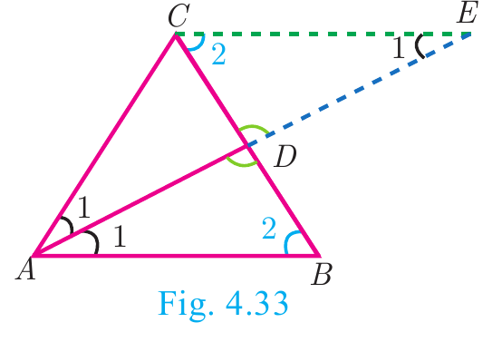

| எண் | கூற்று | காரணம் |
|---|---|---|
| 1. | $\angle AEC=\angle BAE=\angle 1$ $\angle ABD=\angle ECD=\angle 2$ | ஒரு குறுக்குவெட்டியானது இரண்டு இணைகோடுகளை வெட்டுவதால் ஏற்படும் ஒன்றுவிட்ட கோணங்கள் சமம். |
| 2. | $\triangle ACE$ என்பது ஒரு சமபக்க முக்கோணம். $AC=CE\ \cdots (1)$ | $\triangle ACE$-யில் $\angle CAE=\angle CEA$. |
| 3. | $\triangle ABD\sim\triangle ECD$ $\dfrac{AB}{CE}=\dfrac{BD}{CD}$ | $AA$ விதிமுறைப்படி. |
| 4. | $\dfrac{AB}{AC}=\dfrac{BD}{CD}$ | (1)-லிருந்து, $AC=CE$. தேற்றம் நிரூபிக்கப்பட்டது. |

> **செயல்பாடு 3**
>
> **படி 1:** படம் 4.34(i)-யில் காட்டியுள்ளபடி, வரைபட அட்டையை முக்கோண வடிவத்தில் வெட்டிக் கொள்ளவும்.
>
> **படி 2:** புள்ளிகள் $C$ மற்றும் $B$ ஆனது ஒன்றின்மீது ஒன்று பொருந்துமாறு சமச்சீர் கோடு $AD$-ஐக் கொண்டு மடிக்கவும்.
>
> **படி 3:** இதேபோல $CE$-ஐ மடிக்கும்போது, புள்ளிகள் $B$ மற்றும் $A$ ஒன்றின்மீது ஒன்று பொருந்தி இருக்கும்.
>
> **படி 4:** இதேபோல $BF$-ஐ மடிக்கும்போது, புள்ளிகள் $A$ மற்றும் $C$ ஒன்றின் மீது ஒன்று பொருந்தி இருக்கும்.
>
> அளவுகோலைப் பயன்படுத்தி $AB, AC, BD, DC$-யின் மதிப்பைக் காண்க. மேலும், $\dfrac{AB}{AC},\dfrac{BD}{DC}$ ஆனது சமமாக உள்ளதா எனச் சரிபார்க்கவும். இந்த மூன்று நிலைகளிலிருந்து, ஒரு முக்கோணத்தின் ஒரு கோணத்தின் உட்புற இருசமவெட்டியானது அதன் எதிர் பக்கத்தை உட்புறமாக அக்கோணத்தை அடக்கிய பக்கங்களின் விகிதத்தில் பிரிக்கிறது. இந்தச் செயல்பாட்டிலிருந்து நீ என்ன முடிவுக்கு வருகிறாய்?
>
> 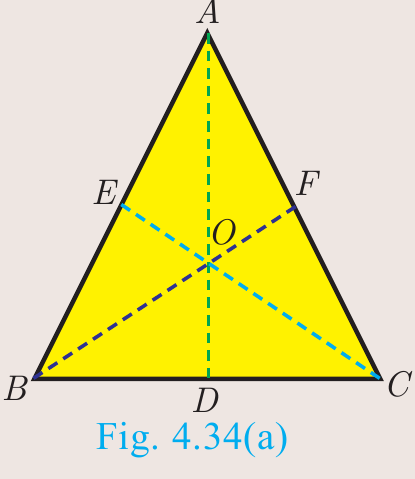
>
> 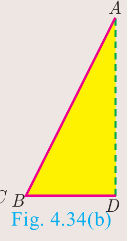

##### தேற்றம் 4: கோண இருசமவெட்டி தேற்றத்தின் மறுதலை (Converse of Angle Bisector Theorem)

**கூற்று**

ஒரு முக்கோணத்தின் ஒரு முனையிலிருந்து செல்லும் ஒரு நேர்கோடு, அதன் எதிர் பக்கத்தை உட்புறமாக மற்ற இரு பக்கங்களின் விகிதத்தில் பிரிக்குமானால், அக்கோடு அமைந்த முனைக் கோணத்தினை உட்புறமாக இரு சமமாகப் பிரிக்கும்.

**நிருபணம்**

**கொடுக்கப்பட்டது** : $ABC$ என்பது ஒரு முக்கோணம். $AD$ ஆனது பக்கம் $BC$-யை $D$ என்ற புள்ளியில் கோணம் $\angle A$-யை உள்ளடக்கிய பக்கங்களின் விகிதத்தில் பிரிக்கிறது.

அதாவது, $\dfrac{AB}{AC}=\dfrac{BD}{DC}\quad\cdots(1)$

**நிரூபிக்க** : $\angle A$-யின் உட்புற இருசமவெட்டி $AD$. அதாவது $\angle 1=\angle 2$

**அமைப்பு** : $CE \parallel DA$ வரைக. $BA$-யின் நீட்சி $E$-யில் சந்திக்கிறது.

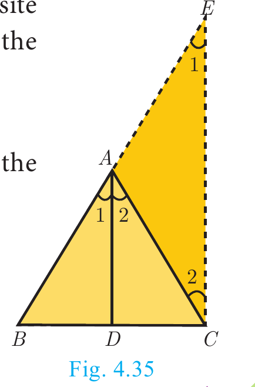

| எண் | கூற்று | காரணம் |
|---|---|---|
| 1. | $\angle BAD=\angle1$ மற்றும் $\angle DAC=\angle 2$ என்க. | அனுமானம் |
| 2. | $\angle BAD=\angle AEC=\angle 1$ | $DA \parallel CE$ மற்றும் $AC$ ஆனது குறுக்குவெட்டி. ஆகையினால், ஒன்றுவிட்ட கோணங்கள் சமம். |
| 3. | $\angle DAC=\angle ACE=\angle 2$ | $DA \parallel CE$ மற்றும் $AC$ ஆனது குறுக்குவெட்டி. ஆகையினால், ஒன்றுவிட்ட கோணங்கள் சமம். |
| 4. | $\dfrac{BA}{AE}=\dfrac{BD}{DC}\quad\cdots(2)$ | $\triangle BCE$-யில் தேல்ஸ் தேற்றத்தின்படி. |
| 5. | $\dfrac{AB}{AC}=\dfrac{BD}{DC}$ | (1)-லிருந்து |
| 6. | $\dfrac{AB}{AC}=\dfrac{BA}{AE}$ | (1) மற்றும் (2)-லிருந்து |
| 7. | $AC=AE\quad\cdots(3)$ | $AB$-ஐ நீக்குக |
| 8. | $\angle1=\angle2$ | (3)-ன்படி $\triangle ACE$ ஓர் இரு சமபக்க முக்கோணம். |
| 9. | $\angle A$-யின் உட்புற இருசமவெட்டி $AD$ | $\angle1=\angle BAD=\angle2=\angle DAC$ என்பதால், தேற்றம் நிரூபிக்கப்பட்டது. |

#### எடுத்துக்காட்டு 4.12

$\triangle ABC$-யில் $DE \parallel BC$, $AD=x$, $DB=x-2$, $AE=x+2$ மற்றும் $EC=x-1$ எனில், பக்கங்கள் $AB$ மற்றும் $AC$-யின் நீளங்களைக் காண்க.

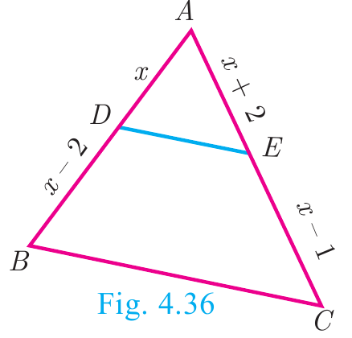

**தீர்வு** $\triangle ABC$-யில் $DE \parallel BC$.

தேல்ஸ் தேற்றத்தின் மூலம் நாம் பெறுவது, $\dfrac{AD}{DB}=\dfrac{AE}{EC}$

$$\frac{x}{x-2}=\frac{x+2}{x-1} \text{ எனில் } x(x-1)=(x-2)(x+2)$$

ஆகவே, $x^2-x=x^2-4 \Rightarrow x=4$

$x=4$ எனில், $AD=4$, $DB=x-2=2$, $AE=x+2=6$, $EC=x-1=3$.

ஆகவே, $AB=AD+DB=4+2=6$, $AC=AE+EC=6+3=9$.

எனவே, $AB=6$, $AC=9$.

#### எடுத்துக்காட்டு 4.13

$\triangle ABC$-யின் பக்கங்கள் $AB$ மற்றும் $AC$-ல் அமைந்த புள்ளிகள் முறையே $D$ மற்றும் $E$. மேலும், $AB=5.6$ செ.மீ, $AD=1.4$ செ.மீ, $AC=7.2$ செ.மீ மற்றும் $AE=1.8$ செ.மீ எனில், $DE \parallel BC$ எனக் காட்டுக.

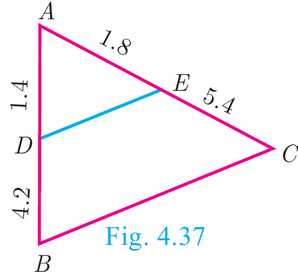

**தீர்வு** $AB=5.6$ செ.மீ, $AD=1.4$ செ.மீ, $AC=7.2$ செ.மீ மற்றும் $AE=1.8$ செ.மீ.

$$BD=AB-AD=5.6-1.4=4.2\text{ செ.மீ}$$

மற்றும் $EC=AC-AE=7.2-1.8=5.4$ செ.மீ.

$$\frac{AD}{DB}=\frac{1.4}{4.2}=\frac13 \text{ மற்றும் } \frac{AE}{EC}=\frac{1.8}{5.4}=\frac13$$

$$\frac{AD}{DB}=\frac{AE}{EC}$$

எனவே, அடிப்படை விகிதசம தேற்றத்தின் மறுதலையின்படி $DE$-யானது $BC$-க்கு இணை ஆகும்.

#### எடுத்துக்காட்டு 4.14

படம் 4.38-யில், $DE \parallel AC$ மற்றும் $DC \parallel AP$ எனில், $\dfrac{BE}{EC}=\dfrac{BC}{CP}$ என நிறுவுக.

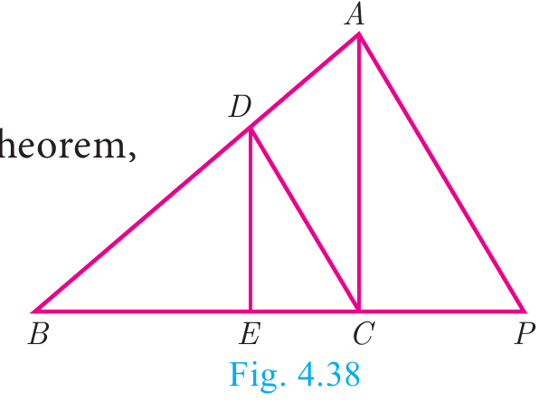

**தீர்வு** $\triangle BPA$-யில், $DC \parallel AP$ என்பதால், அடிப்படை விகிதசம தேற்றத்தின்படி,

$$\frac{BC}{CP}=\frac{BD}{DA}\qquad\cdots(1)$$

$\triangle BCA$-யில், $DE \parallel AC$ என்பதால், அடிப்படை விகிதசம தேற்றத்தின்படி,

$$\frac{BE}{EC}=\frac{BD}{DA}\qquad\cdots(2)$$

(1) மற்றும் (2)-லிருந்து நாம் பெறுவது, $\dfrac{BE}{EC}=\dfrac{BC}{CP}$. நிறுவப்பட்டது.

#### எடுத்துக்காட்டு 4.15

படம் 4.39-யில், $AD$ ஆனது $\angle A$-யின் இருசமவெட்டி. $BD=4$ செ.மீ, $DC=3$ செ.மீ மற்றும் $AB=6$ செ.மீ எனில், $AC$-ஐக் காண்க.

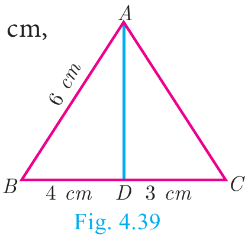

**தீர்வு** $\triangle ABC$-யில், $\angle A$-யின் இருசமவெட்டி $AD$ ஆகும்.

கோண இருசமவெட்டித் தேற்றத்தின்படி,

$$\frac{BD}{DC}=\frac{AB}{AC}$$

$\dfrac43=\dfrac6{AC}$ எனில் $4AC=18$. ஆகவே, $AC=\dfrac92=4.5$ செ.மீ

#### எடுத்துக்காட்டு 4.16

படம் 4.40-யில், $AD$ என்பது $\angle BAC$-யின் இருசமவெட்டியாகும். $AB=10$ செ.மீ, $AC=14$ செ.மீ மற்றும் $BC=6$ செ.மீ எனில், $BD$ மற்றும் $DC$-ஐ காண்க.

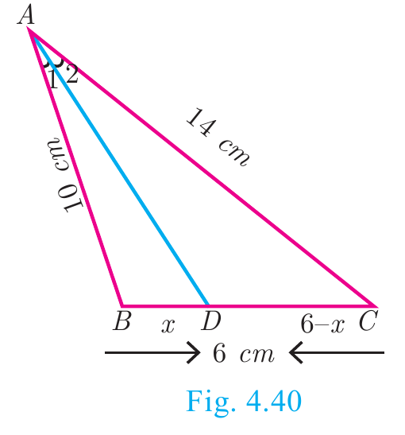

**தீர்வு** $BD=x$ செ.மீ என்க. $DC=(6-x)$செ.மீ

$\angle A$-யின் இருசமவெட்டி $AD$ ஆகும்.

கோண இருசமவெட்டித் தேற்றத்தின்படி,

$$\frac{AB}{AC}=\frac{BD}{DC}$$

$$\frac{10}{14}=\frac{x}{6-x} \text{ எனில் } \frac57=\frac{x}{6-x}$$

$$12x=30 \text{ ஆகவே, } x=\frac{30}{12}=2.5\text{ செ.மீ}$$

எனவே, $BD=2.5$ செ.மீ, $DC=6-x=6-2.5=3.5$ செ.மீ

> **முன்னேற்றச் சோதனை**
>
> 1. முக்கோணத்தின் ஒரு பக்கத்திற்கு ________ வரையப்படும் நேர்கோடு மற்ற இரு பக்கங்களை விகிதசமத்தில் பிரிக்கும்.
> 2. அடிப்படை விகிதசம தேற்றம் ________ என்றும் அழைக்கப்படுகிறது.
> 3. $\triangle ABC$ என்பது ஒரு சமபக்க முக்கோணம் என்க. $D$ என்பது $BC$-யின் மேலுள்ள ஒரு புள்ளி. $AD$ ஆனது $\angle A$-யின் உட்புற இருசமவெட்டி எனில், கோண இருசமவெட்டித் தேற்றத்தைப் பயன்படுத்தினால் $\dfrac{BD}{DC}$ என்பது ________ ஆகும்.
> 4. ஒரு முக்கோணத்தின் ஒரு கோணத்தின் ________ ஆனது அக்கோணத்தின் எதிர் பக்கத்தை உட்புறமாக அக்கோணத்தை அடக்கிய பக்கங்களின் விகிதத்தில் பிரிக்கும்.
> 5. $\triangle ABC$-யில் பக்கம் $BC$-யின் நடுக்கோடு $AD$-யானது $\angle A$-யின் இருசமவெட்டியாகவும் இருந்தால், $\dfrac{AB}{AC}$ ஆனது ________.

### 4.3.2 முக்கோணங்கள் வரைதல் (Construction of triangle)

முந்தைய வகுப்பில் பக்கங்கள் மற்றும் கோணங்கள் கொடுக்கப்பட்டால் எவ்வாறு முக்கோணங்கள் வரைவது எனக் கற்றுள்ளோம். இப்பகுதியில்

(i) அடிப்பக்கம், உச்சிக்கோணம் மற்றும் அடிப்பக்கத்திற்கு வரையப்படும் நடுக்கோடு

(ii) அடிப்பக்கம், உச்சிக்கோணம் மற்றும் அடிப்பக்கத்திற்கு வரையப்படும் குத்துக்கோடு

(iii) அடிப்பக்கம், உச்சிக்கோணம் மற்றும் உச்சிக் கோணத்தின் இருசமவெட்டி அடிப்பக்கத்தைச் சந்திக்கும் புள்ளி

ஆகியன கொடுக்கப்பட்டால் எவ்வாறு முக்கோணம் வரைவது எனக் காண்போம். கீழ்க்காணும் வரைதலை முதலில் காண்போம்.

##### கோணம் $\theta$-வை உள்ளடக்கிய கொடுக்கப்பட்ட கோட்டுத் துண்டின் மேல் அமைந்த வட்டப்பகுதியை வரைதல்

**வரைமுறை**

**படி 1:** $\overline{AB}$ என்ற கோட்டுத் துண்டு வரைக.

**படி 2:** புள்ளி $A$-யில் $\angle BAE=\theta$ என அமையுமாறு $AE$ வரைக.

**படி 3:** $AF \perp AE$ வரைக.

**படி 4:** $AB$-க்கு வரையப்படும் மையக் குத்துக்கோடானது $AF$-யை $O$-யில் சந்திக்கிறது.

**படி 5:** $O$-வை மையமாகவும், $OA$-வை ஆரமாகவும் கொண்டு, ஒரு வட்டம் வரைக.

**படி 6:** வட்டத்தின்மேல் ஏதேனும் ஒரு புள்ளி $C$ ஆகும். மாற்று வட்டத் துண்டு தேற்றத்தின்படி பெரிய வில் $ACB$ ஆனது கோணம் $\theta$-வை உள்ளடக்கிய தேவையான வட்டப்பகுதி ஆகும்.

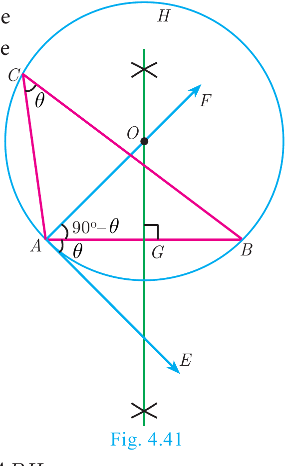

> **குறிப்பு**
>
> $C_1,C_2,\ldots$ என்பன வட்டத்தின் மீதுள்ள புள்ளிகள் எனில், $\triangle BAC_1$, $\triangle BAC_2,\ldots$ ஆகியவை ஒரே அடிப்பக்கமும், ஒரே உச்சிக் கோணமும் கொண்ட முக்கோணங்களாகும்.

##### அடிப்பக்கம், உச்சிக்கோணம் மற்றும் அடிப்பக்கத்திற்கு வரையப்படும் நடுக்கோடு தரப்பட்டால் முக்கோணம் வரைதல்.

#### எடுத்துக்காட்டு 4.17

$PQ=8$ செ.மீ, $\angle R=60^\circ$ உச்சி $R$-லிருந்து $PQ$-க்கு வரையப்பட்ட நடுக்கோட்டின் நீளம் $RG=5.8$ செ.மீ. என இருக்குமாறு $\triangle PQR$ வரைக. $R$-லிருந்து $PQ$-க்கு வரையப்பட்ட குத்துக்கோட்டின் நீளம் காண்க.

**தீர்வு**

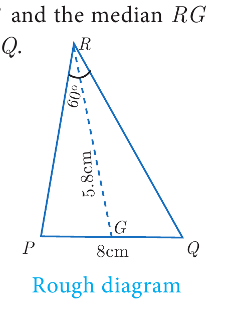

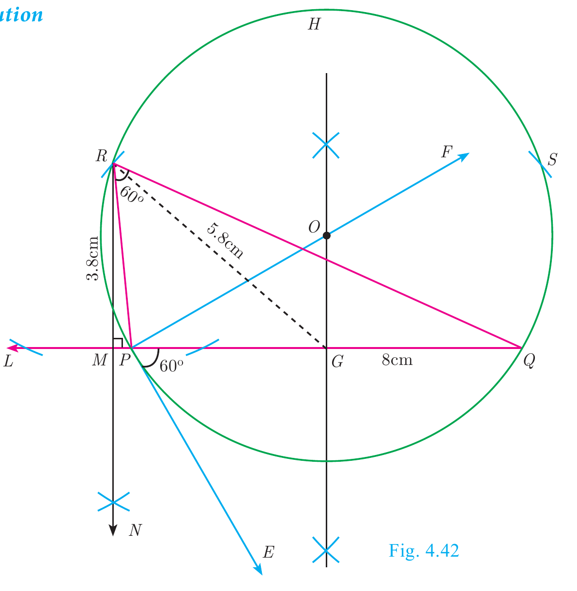

**வரைமுறை**

**படி 1:** $PQ=8$செ.மீ என்ற கோட்டுத்துண்டு வரைக.

**படி 2:** புள்ளி $P$ வழியே $\angle QPE=60^\circ$ என இருக்கும்படி $PE$ வரைக.

**படி 3:** புள்ளி $P$ வழியே $\angle EPF=90^\circ$ என இருக்கும்படி $PF$ வரைக.

**படி 4:** $PQ$-க்கு வரையப்படும் மையக்குத்துக் கோடு $PF$-ஐ $O$-விலும், $PQ$-ஐ $G$-யிலும் சந்திக்கிறது.

**படி 5:** $O$-வை மையமாகவும், $OP$-ஐ ஆரமாகவும் கொண்டு ஒரு வட்டம் வரைக.

**படி 6:** $G$-யிலிருந்து 5.8 செ.மீ ஆரமுள்ள வில்களை வட்டத்தில் வெட்டுமாறு வரைக. அவை வெட்டும் புள்ளிகளை $R$ மற்றும் $S$ எனக் குறிக்கவும்.

**படி 7:** $PR$ மற்றும் $RQ$-ஐ இணைக்கவும். $\triangle PQR$ தேவையான முக்கோணம் ஆகும்.

**படி 8:** $R$-லிருந்து $LQ$-க்கு செங்குத்துக்கோடு $RN$ வரைக. $RN$ ஆனது $LQ$-வை $M$-யில் சந்திக்கிறது.

**படி 9:** குத்துக்கோடு $RM$-யின் நீளம் 3.8 செ.மீ.

> **குறிப்பு**
>
> கொடுக்கப்பட்ட அளவுகளுக்கு $\triangle PQS$ என்பது தேவையான மற்றொரு முக்கோணம் ஆகும்.

##### அடிப்பக்கம், உச்சிக்கோணம் மற்றும் அடிப்பக்கத்திற்கு வரையப்பட்ட குத்துக்கோடு தரப்பட்டால் முக்கோணம் வரைதல்.

#### எடுத்துக்காட்டு 4.18

$QR=5$ செ.மீ, $\angle P=30^\circ$ மற்றும் $P$-யிலிருந்து $QR$-க்கு வரையப்பட்ட குத்துக்கோட்டின் நீளம் 4.2 செ.மீ கொண்ட $\triangle PQR$ வரைக.

**தீர்வு**

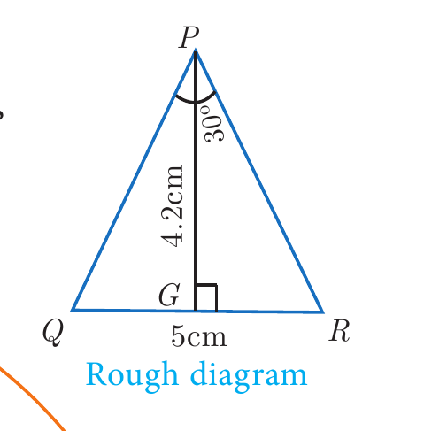

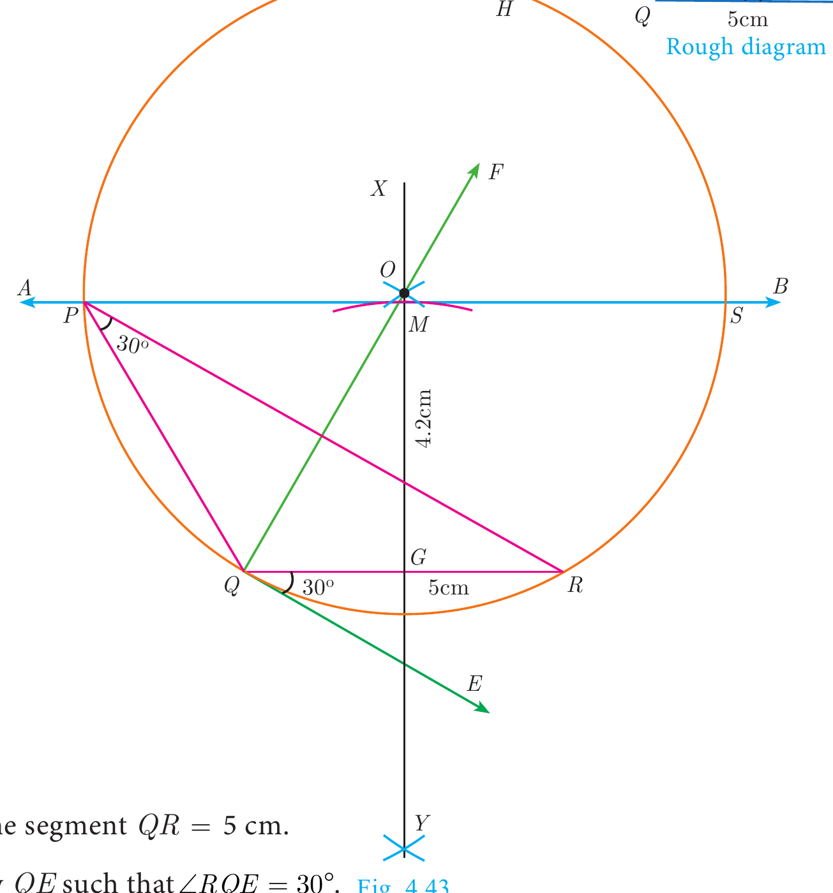

**வரைமுறை**

**படி 1:** $QR=5$ செ.மீ என்ற கோட்டுத்துண்டு வரைக.

**படி 2:** புள்ளி $Q$ வழியே $\angle RQE=30^\circ$ என இருக்கும்படி $QE$ வரைக.

**படி 3:** புள்ளி $Q$ வழியே $\angle EQF=90^\circ$ என இருக்கும்படி $QF$ வரைக.

**படி 4:** $QR$-க்கு வரையப்படும் மையக்குத்துக் கோடு $XY$-யானது $QF$-ஐ $O$-விலும், $QR$-ஐ $G$-யிலும் சந்திக்கிறது.

**படி 5:** $O$-வை மையமாகவும், $OQ$-ஐ ஆரமாகவும் கொண்டு ஒரு வட்டம் வரைக.

**படி 6:** $G$-யிலிருந்து மையக்குத்துக் கோடு $XY$-ல் $M$ வழியே $GM=4.2$ செ.மீ இருக்குமாறு ஒரு வில் வரைக.

**படி 7:** $QR$-க்கு இணையாக $M$ வழியே $AB$ என்ற கோடு வரைக.

**படி 8:** $AB$-யானது வட்டத்தை $P$ மற்றும் $S$-யில் சந்திக்கிறது.

**படி 9:** $QP$ மற்றும் $RP$-ஐ இணைக்கவும். $\triangle PQR$ ஆனது தேவையான முக்கோணம் ஆகும்.

> **குறிப்பு**
>
> கொடுக்கப்பட்ட அளவுகளுக்கு $\triangle SQR$ என்பது தேவையான மற்றொரு முக்கோணம் ஆகும்.

##### அடிப்பக்கம், உச்சிக்கோணம் மற்றும் உச்சிக்கோணத்தின் இருசமவெட்டி அடிப்பக்கத்தைத் தொடும் புள்ளி தரப்பட்டால் முக்கோணம் வரைதல்.

#### எடுத்துக்காட்டு 4.19

அடிப்பக்கம் $BC=8$ செ.மீ, $\angle A=60^\circ$ மற்றும் $\angle A$-யின் இருசமவெட்டியானது $BC$-ஐ $D$ என்ற புள்ளியில் $BD=6$ செ.மீ என்றவாறு சந்திக்கிறது எனில், முக்கோணம் $ABC$ வரைக.

**தீர்வு**

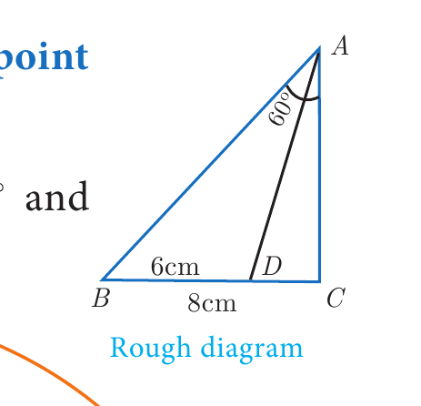

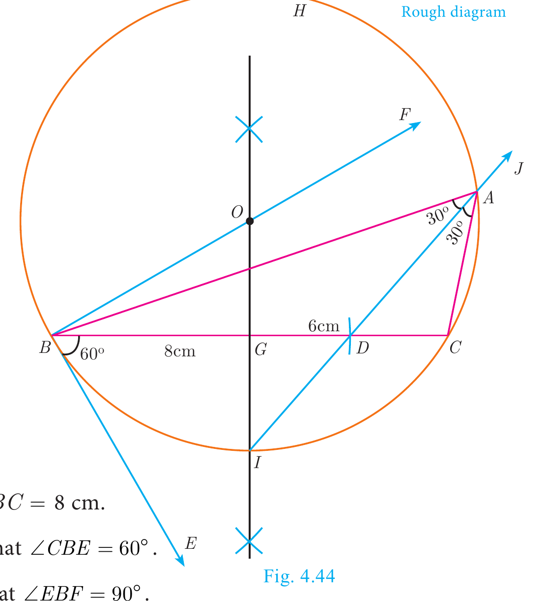

**வரைமுறை**

**படி 1:** $BC=8$ செ.மீ என்ற கோட்டுத்துண்டு வரைக.

**படி 2:** புள்ளி $B$ வழியே $\angle CBE=60^\circ$ என இருக்கும்படி $BE$ வரைக.

**படி 3:** புள்ளி $B$ வழியே $\angle EBF=90^\circ$ என இருக்கும்படி $BF$ வரைக.

**படி 4:** $BC$-க்கு வரையப்படும் மையக்குத்துக்கோடானது $BF$-ஐ $O$-விலும், $BC$-ஐ $G$-யிலும் சந்திக்கிறது.

**படி 5:** $O$-வை மையமாகவும், $OB$-ஐ ஆரமாகவும் கொண்டு ஒரு வட்டம் வரைக.

**படி 6:** புள்ளி $B$-யிலிருந்து $BC$-யில் 6 செ.மீ தொலைவில் $D$ என்ற புள்ளிக்கு ஒரு வில் வரைக.

**படி 7:** மையக்குத்துக்கோடானது வட்டத்தை $I$ என்ற புள்ளியில் சந்திக்கிறது. $ID$-ஐ இணைக்கவும்.

**படி 8:** $ID$-ஐ வட்டத்தில் $A$-யில் சந்திக்குமாறு நீட்டவும். $AB$ மற்றும் $AC$-ஐ இணைக்கவும். $\triangle ABC$ என்பது தேவையான முக்கோணம் ஆகும்.

### பயிற்சி 4.2

1. $\triangle ABC$-யின் பக்கங்கள் $AB$ மற்றும் $AC$-யின் மீதுள்ள புள்ளிகள் முறையே $D$ மற்றும் $E$ ஆனது $DE \parallel BC$ என்றவாறு அமைந்துள்ளது. (i) $\dfrac{AD}{DB}=\dfrac34$ மற்றும் $AC=15$ செ.மீ எனில் $AE$-யின் மதிப்பு காண்க. (ii) $AD=8x-7$, $DB=5x-3$, $AE=4x-3$ மற்றும் $EC=3x-1$ எனில், $x$-ன் மதிப்பு காண்க.

2. $ABCD$ என்ற ஒரு சரிவகத்தில் $AB \parallel DC$ மற்றும் $P, Q$ என்பன முறையே பக்கங்கள் $AD$ மற்றும் $BC$-யின் மீது அமைந்துள்ள புள்ளிகள் ஆகும். மேலும் $PQ \parallel DC$, $PD=18$ செ.மீ, $BQ=35$ செ.மீ மற்றும் $QC=15$ செ.மீ எனில், $AD$ காண்க.

3. $\triangle ABC$-யில் $D$ மற்றும் $E$ என்ற புள்ளிகள் முறையே பக்கங்கள் $AB$ மற்றும் $AC$ ஆகியவற்றின் மீது அமைந்துள்ளன. $AB=12$ செ.மீ, $AD=8$ செ.மீ, $AE=12$ செ.மீ மற்றும் $AC=18$ செ.மீ எனில் $DE \parallel BC$ என நிறுவுக.

4. படத்தில் $PQ \parallel BC$ மற்றும் $PR \parallel CD$ எனில்

   (i) $\dfrac{AR}{AD}=\dfrac{AQ}{AB}$ &emsp; (ii) $\dfrac{QB}{AQ}=\dfrac{DR}{AR}$ என நிறுவுக.

   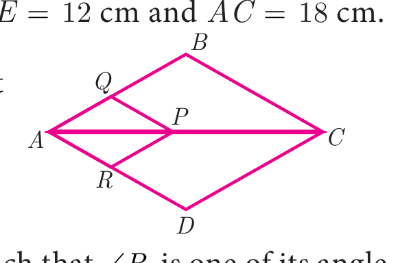

5. $\triangle ABC$-யின் உள்ளே $\angle B$ ஐ ஒரு கோணமாகக் கொண்ட சாய்சதுரம் $PQRB$ அமைந்துள்ளது. $P$, $Q$ மற்றும் $R$ என்பன முறையே பக்கங்கள் $AB$, $AC$ மற்றும் $BC$ மீது அமைந்துள்ள புள்ளிகள் ஆகும். $AB=12$ செ.மீ மற்றும் $BC=6$ செ.மீ எனில், சாய்சதுரத்தின் பக்கங்கள் $PQ$, $RB$-யைக் காண்க.

6. சரிவகம் $ABCD$-யில் $AB \parallel DC$, $E$ மற்றும் $F$ என்பன முறையே இணையற்ற பக்கங்கள் $AD$ மற்றும் $BC$-ன் மீது அமைந்துள்ள புள்ளிகள், மேலும் $EF \parallel AB$ என அமைந்தால் $\dfrac{AE}{ED}=\dfrac{BF}{FC}$ என நிறுவுக.

   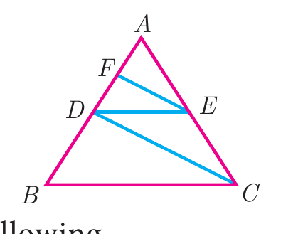

7. படத்தில் $DE \parallel BC$ மற்றும் $CD \parallel EF$ எனில் $AD^2=AB\times AF$ என நிறுவுக.

8. பின்வருவனவற்றுள் $\triangle ABC$-யில் $AD$ ஆனது $\angle A$-யின் இருசமவெட்டி ஆகுமா எனச் சோதிக்கவும்.

   (i) $AB=5$ செ.மீ, $AC=10$ செ.மீ, $BD=1.5$ செ.மீ மற்றும் $CD=3.5$ செ.மீ.

   (ii) $AB=4$ செ.மீ, $AC=6$ செ.மீ, $BD=1.6$ செ.மீ மற்றும் $CD=2.4$ செ.மீ.

9. படத்தில் $\angle QPR=90^\circ$, $PS$ ஆனது $\angle P$-யின் இருசமவெட்டி மேலும், $ST \perp PR$ எனில், $ST\times(PQ+PR)=PQ\times PR$ என நிறுவுக.

   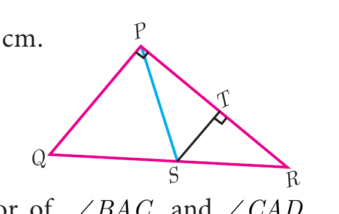

10. நாற்கரம் $ABCD$-யில் $AB=AD$, $\angle BAC$ மற்றும் $\angle CAD$-யின் கோண இருசமவெட்டிகள் $BC$ மற்றும் $CD$ ஆகிய பக்கங்களை முறையே $E$ மற்றும் $F$ என்ற புள்ளிகளில் சந்திக்கின்றன எனில், $EF \parallel BD$ என நிறுவுக.

11. $PQ=4.5$ செ.மீ, $\angle R=35^\circ$ மற்றும் உச்சி $R$-யிலிருந்து வரையப்பட்ட நடுக்கோட்டின் நீளம் $RG=6$ செ.மீ என அமையுமாறு $\triangle PQR$ வரைக.

12. $QR=5$ செ.மீ, $\angle P=40^\circ$ மற்றும் உச்சி $P$-யிலிருந்து $QR$-க்கு வரையப்பட்ட நடுக்கோட்டின் நீளம் $PG=4.4$ செ.மீ என இருக்கும்படி $\triangle PQR$ வரைக. மேலும் $P$-லிருந்து $QR$-க்கு வரையப்பட்ட குத்துக்கோட்டின் நீளம் காண்க.

13. $QR=6.5$ செ.மீ, $\angle P=60^\circ$ மற்றும் உச்சி $P$-யிலிருந்து $QR$-க்கு வரையப்பட்ட குத்துக்கோட்டின் நீளம் $4.5$ செ.மீ உடைய $\triangle PQR$ வரைக.

14. $AB=5.5$ செ.மீ, $\angle C=25^\circ$ மற்றும் உச்சி $C$-யிலிருந்து $AB$-க்கு வரையப்பட்ட குத்துக்கோட்டின் நீளம் $4$ செ.மீ உடைய $\triangle ABC$ வரைக.

15. அடிப்பக்கம் $BC=5.6$ செ.மீ, $\angle A=40^\circ$ மற்றும் $\angle A$-யின் இருசமவெட்டியானது அடிப்பக்கத்தை $CD=4$ செ.மீ என $D$-யில் சந்திக்குமாறு அமையும் முக்கோணம் $ABC$ வரைக.

16. $PQ=6.8$ செ.மீ, உச்சிக்கோணம் $50^\circ$ மற்றும் உச்சிக்கோணத்தின் இருசமவெட்டியானது அடிப்பக்கத்தை $PD=5.2$ செ.மீ என $D$-யில் சந்திக்குமாறு அமையும் $\triangle PQR$ வரைக.

## 4.4 பிதாகரஸ் தேற்றம் (Pythagoras Theorem)

கணிதத்தில் உள்ள அனைத்துத் தேற்றங்களிலும், பிதாகரஸ் தேற்றம்தான் மிகவும் முக்கியமானதாகக் கருதப்படுகிறது. ஏனெனில் இது அதிக அளவிலான நிரூபணங்களைக் கொண்டுள்ளது. பிதாகரஸ் தேற்றத்தை நிரூபிக்க $350$-க்கும் அதிகமான வெவ்வேறு வழிமுறைகள் உள்ளன. இந்த நிரூபணங்கள் ஒவ்வொன்றும் சிறந்த கணிதவியலாளர்கள், அறிஞர்கள், பொறியாளர்கள் மற்றும் கணித ஆர்வலர்கள் ஆகியோரால் கண்டுபிடிக்கப்பட்டது. இவர்களில் அமெரிக்காவின் $20$-வது ஜனாதிபதி ஜேம்ஸ் கார்ஃபீல்ட் ஒருவர். அமெரிக்காவிலுள்ள கணிதம் கற்பித்தலுக்கான தேசிய மன்றம் (NCTM) வெளியிட்டுள்ள எலிஷாஸ்காட் லூமிஸ் எழுதிய "The Pythagorean Proposition" என்ற தலைப்பிலான புத்தகத்தில் பிதாகரஸ் தேற்றத்தின் $367$ நிரூபணங்கள் உள்ளன.

மூன்று இயல் எண்கள் $(a,b,c)$ என்பன செங்கோண முக்கோணத்தின் பக்கங்கள் எனில், அந்த மூன்று எண்கள் $(a,b,c)$-ஐ பிதாகோரியனின் மூன்றின் தொகுதி என அழைக்கலாம். ஆகவே, $(a,b,c)$ என்பவை பிதாகோரியனின் மூன்றின் தொகுதி எனில், $c^2=a^2+b^2$. வடிவியல் மட்டுமல்லாது, கணிதத்தின் அனைத்துப் பிரிவுகளிலும் மிகப் பிரபலமானதும், முக்கியத்துவம் வாய்ந்ததுமான இத்தேற்றத்தைப் பற்றி இப்பொழுது கற்போம்.

> **செயல்பாடு 4**
>
> 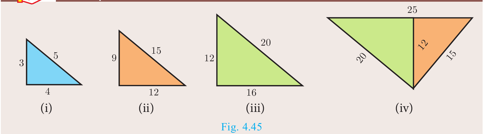
>
> **படி 1:** ஒரு வரைபடத்தாளில், முக்கோணம் (i)-யில் கொடுக்கப்பட்ட அளவுகளுக்கு ஒரு செங்கோண முக்கோணத்தை வெட்டுக.
>
> **படி 2:** மூன்று வெவ்வேறு வண்ண வரைபடத்தாள்களைக் கொண்டு முக்கோணம் (ii)-யின் பக்க அளவுகள் முக்கோணம் (i)-யின் பக்கங்களின் மூன்று மடங்காகவும், முக்கோணம் (iii)-யின் பக்க அளவுகள் முக்கோணம் (i)-யின் பக்கங்களின் நான்கு மடங்காகவும், முக்கோணம் (iv)-யின் பக்க அளவுகள் முக்கோணம் (i)-யின் பக்கங்களின் ஐந்து மடங்காகவும் இருக்குமாறு மூன்று முக்கோணங்களை வெட்டுக.
>
> **படி 3:** முக்கோணங்கள் (ii) மற்றும் (iii)-யில் பொதுவான அளவு $12$ உள்ள பக்கங்களை இணைத்து அவற்றை முக்கோணம் (iv)-யின் மீது வைக்கும்போது இவ்விரு முக்கோணங்களும் (iv)-வோடு ஒன்றின்மீது ஒன்று சரியாகப் பொருந்தியிருக்கும்.
>
> கர்ணத்தின் சமன்பாட்டை எழுதவும். இதிலிருந்து என்ன முடிவுக்கு வருகிறாய்?

> **குறிப்பு**
>
> - ஒரு செங்கோண முக்கோணத்தில் $90^\circ$ (செங்கோணம்)-க்கு எதிராக உள்ள பக்கம் கர்ணம் என்றழைக்கப்படுகிறது.
> - மற்ற இரண்டு பக்கங்கள் செங்கோண முக்கோணத்தின் பக்கங்கள் எனப்படுகிறது.
> - செங்கோண முக்கோணத்தில் மிக நீளமான பக்கமே கர்ணம் ஆகும்.

##### தேற்றம் 5 : பிதாகரஸ் தேற்றம் (Pythagoras Theorem)

**கூற்று**

ஒரு செங்கோண முக்கோணத்தில் கர்ணத்தின் வர்க்கமானது மற்ற இரு பக்கங்களின் வர்க்கங்களின் கூடுதலுக்குச் சமம்.

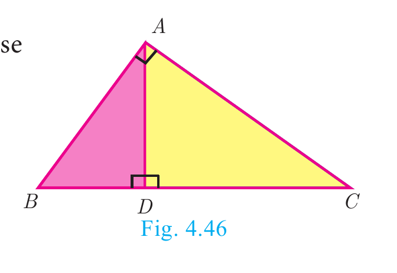

**நிரூபணம்**

**கொடுக்கப்பட்டது** : $\triangle ABC$-யில் $\angle A=90^\circ$

**நிரூபிக்க** : $AB^2+AC^2=BC^2$

**அமைப்பு** : $AD \perp BC$ வரைக.

| எண் | கூற்று | காரணம் |
|---|---|---|
| 1. | $\triangle ABC$ மற்றும் $\triangle DBA$-ஐ ஒப்பிருக. $\angle B$ பொதுவானது $\angle BAC=\angle BDA=90^\circ$ எனவே, $\triangle ABC \sim \triangle DBA$ $\dfrac{AB}{BD}=\dfrac{BC}{AB}$ $AB^2=BC\times BD \quad \ldots(1)$ | $\angle BAC=90^\circ$ கொடுக்கப்பட்டது மற்றும் $\angle BDA=90^\circ$ அமைப்பிலிருந்து   AA விதிமுறைப்படி |
| 2. | $\triangle ABC$ மற்றும் $\triangle DAC$-ஐ ஒப்பிருக $\angle C$ பொதுவானது $\angle BAC=\angle ADC=90^\circ$ எனவே, $\triangle ABC \sim \triangle DAC$ $\dfrac{BC}{AC}=\dfrac{AC}{DC}$ $AC^2=BC\times DC \quad \ldots(2)$ | $\angle BAC=90^\circ$ கொடுக்கப்பட்டது மற்றும் $\angle ADC=90^\circ$ அமைப்பிலிருந்து   AA விதிமுறைப்படி |

$(1)$ மற்றும் $(2)$-ஐக் கூட்ட நாம் பெறுவது,

$$\begin{aligned}AB^2+AC^2&=BC\times BD+BC\times DC\\&=BC(BD+DC)=BC\times BC\\AB^2+AC^2&=BC^2.\end{aligned}$$

தேற்றம் நிரூபிக்கப்பட்டது.

> **உங்களுக்குத் தெரியுமா?**
>
> இந்தியாவில் பிதாகரஸ் தேற்றமானது "பௌதயானா தேற்றம்" என்றும் அழைக்கப்படுகிறது.

> **சிந்தனைக் களம்**
>
> 1. ஐந்து பிதாகோரியனின் மூன்றன் தொகுதிகளை எழுதுக.
> 2. ஒரு செங்கோண முக்கோணத்தில் இரு குறுங்கோணங்களின் கூடுதல் ______.

##### பிதாகரஸ் தேற்றத்தின் மறுதலை (Converse of Pythagoras Theorem)

**கூற்று**

ஒரு முக்கோணத்தில் நீளமான பக்கத்தின் வர்க்கம் மற்ற இரு பக்கங்களின் வர்க்கங்களின் கூடுதலுக்குச் சமம் எனில், அந்த முக்கோணம் செங்கோண முக்கோணம் ஆகும்.

> **சிந்தனைக் களம்**
>
> செங்கோண முக்கோணத்தின் மூன்று பக்கங்களின் அளவுகளும் ஒற்றை எண்களாக இருக்க இயலுமா? ஏன்?

> **செயல்பாடு 5**
>
> (i) இரு அடுத்தடுத்த ஒற்றை எண்களை எடுத்துக்கொள்க.
>
> (ii) அந்த இரு எண்களின் தலைகீழிகளை எழுதிக் கூட்டவும். அது $\dfrac{p}{q}$ வடிவில் இருக்கும்.
>
> (iii) $\dfrac{p}{q}$-யில் பகுதியுடன் $2$ ஐக் கூட்ட நாம் பெறுவது $q+2$.
>
> (iv) இப்பொழுது $p$, $q$, $q+2$ என்ற எண்களைக் கருதுக. இந்த மூன்று எண்களுக்கு இடையேயுள்ள தொடர்பு என்ன?
>
> இந்தச் செயல்பாட்டை, மூன்று ஜோடி அடுத்தடுத்த ஒற்றை எண்களைக் கொண்டு செய்து பார்த்து உங்கள் பதிலைக் குறிப்பிடுக.

**எடுத்துக்காட்டு 4.20** ஒரு விளக்கு கம்பத்தின் உயரம் $6$ மீ. அதன் அடியிலிருந்து $8$ மீ தொலைவில் உள்ள ஒரு பூச்சி, கம்பத்தை நோக்கி ஒரு குறிப்பிட்ட தொலைவை நகர்கிறது. கம்பத்தின் உச்சிக்கும் தற்பொழுது பூச்சி இருக்கும் இடத்திற்கும் இடைப்பட்ட தொலைவை, பூச்சி கம்பத்தை நோக்கி நகர்ந்த தொலைவிற்குச் சமம் எனில், கம்பத்தின் அடியிலிருந்து பூச்சி தற்பொழுது எவ்வளவு தொலைவில் உள்ளது?

**தீர்வு** விளக்கு கம்பத்தின் அடிக்கும், பூச்சிக்கும் இடைப்பட்ட தொலைவை $BD=8$ மீ

விளக்கு கம்பத்தின் உயரம் $AB=6$ மீ

$x$ மீ தொலைவை நகர்ந்த பின்பு பூச்சி இருக்கும் இடம் $C$ என்க.

$AC=CD=x$ என்க. மேலும் $BC=BD-CD=8-x$

$\triangle ABC$-யில், $\angle B=90^\circ$

$$AC^2=AB^2+BC^2 \Rightarrow x^2=6^2+(8-x)^2$$

$$x^2=36+64-16x+x^2$$

$$16x=100 \text{ எனவே, } x=6.25$$

எனில், $BC=8-x=8-6.25=1.75$ மீ

எனவே, பூச்சியானது விளக்கு கம்பத்தின் அடியிலிருந்து $1.75$ மீ தொலைவில் உள்ளது.

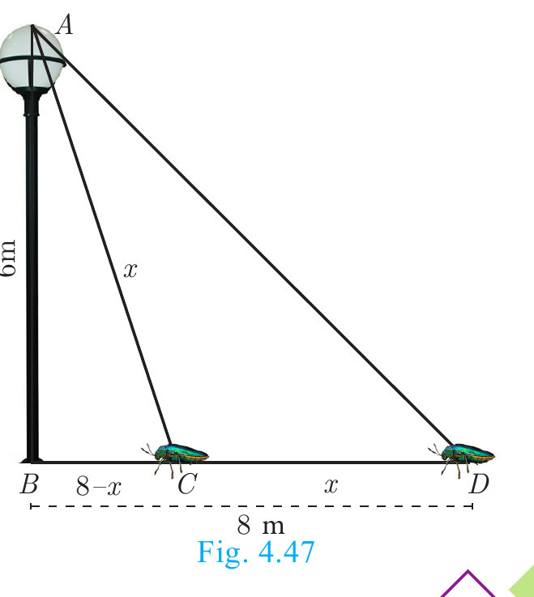

**எடுத்துக்காட்டு 4.21** $\triangle ABC$-யில் $C$ ஆனது செங்கோணம் ஆகும். பக்கங்கள் $CA$ மற்றும் $CB$-யின் நடுப்புள்ளிகள் முறையே $P$ மற்றும் $Q$ எனில் $4(AQ^2+BP^2)=5AB^2$ என நிறுவுக.

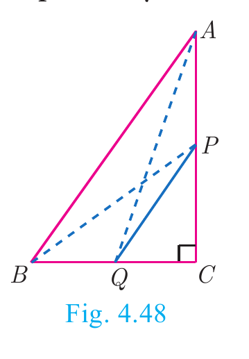

**தீர்வு** $\triangle AQC$-யில், $C$ ஆனது, செங்கோணம் என்பதால், $AQ^2=AC^2+QC^2 \quad \ldots(1)$

$\triangle BPC$-யில், $C$ ஆனது, செங்கோணம் என்பதால், $BP^2=BC^2+CP^2 \quad \ldots(2)$

$\triangle ABC$-யில், $C$ ஆனது, செங்கோணம் என்பதால், $AB^2=AC^2+BC^2 \quad \ldots(3)$

$(1)$ மற்றும் $(2)$-லிருந்து, $AQ^2+BP^2=AC^2+QC^2+BC^2+CP^2$

$$\begin{aligned}4(AQ^2+BP^2)&=4AC^2+4QC^2+4BC^2+4CP^2\\&=4AC^2+(2QC)^2+4BC^2+(2CP)^2\\&=4AC^2+BC^2+4BC^2+AC^2 &&(P \text{ மற்றும் } Q \text{ என்பது நடுப்புள்ளி என்பதால்})\\&=5(AC^2+BC^2) &&(\text{சமன்பாடு } (3)\text{-லிருந்து})\end{aligned}$$

$$4(AQ^2+BP^2)=5AB^2.$$

**எடுத்துக்காட்டு 4.22** சுவரின் அடியிலிருந்து $4$ அடி தொலைவில் உள்ள ஏணியானது சுவரின் உச்சியை $7$ அடி உயரத்தில் தொடுமெனில் தேவையான ஏணியின் நீளத்தைக் காண்க. விடையை ஒரு தசம இடத்திற்குமாக தருக.

**தீர்வு** ஏணியின் நீளம் $AB=x$ என்க. $BC=4$ அடி, $AC=7$ அடி.

பிதாகரஸ் தேற்றத்தின்படி, $AB^2=AC^2+BC^2$

$$x^2=7^2+4^2 \Rightarrow x^2=49+16$$

$$x^2=65. \text{ எனவே, } x=\sqrt{65}$$

$\sqrt{65}$ ஆனது $8$ மற்றும் $8.1$-க்கு இடையில் அமைகிறது.

$$8^2=64<65<65.61=8.1^2$$

எனவே, ஏணியின் நீளம் தோராயமாக $8.1$ அடி ஆகும்.

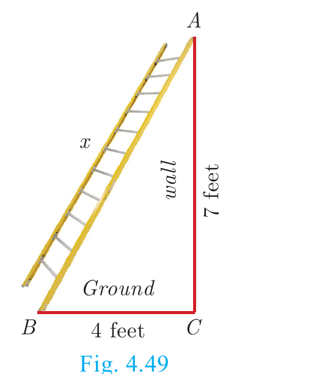

**எடுத்துக்காட்டு 4.23** ஒரு விமானம் விமான நிலையத்தை விட்டு மேலெழுந்து வடக்கு நோக்கி $1000$ கி.மீ/மணி வேகத்தில் பறக்கிறது. அதே நேரத்தில் மற்றொரு விமானம் அதே விமான நிலையத்தை விட்டு மேலெழுந்து மேற்கு நோக்கி $1200$ கி.மீ/மணி வேகத்தில் பறக்கிறது. $1\tfrac{1}{2}$ மணி நேரத்திற்குப் பிறகு இரு விமானங்களுக்கும் இடைப்பட்ட தொலைவு எவ்வளவு இருக்கும்?

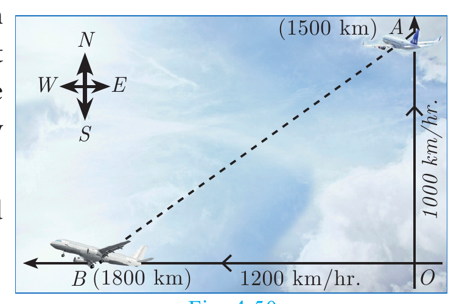

**தீர்வு** முதல் விமானம் $O$-வில் இருந்து புறப்பட்டு வடக்கு நோக்கி $A$ என்ற இடத்திற்குச் செல்கிறது என்க. (தொலைவு $=$ வேகம் $\times$ நேரம்)

எனவே $OA=\left(1000\times\dfrac{3}{2}\right)$ கி.மீ $=1500$ கி.மீ

இரண்டாவது விமானம் $O$-வில் இருந்து புறப்பட்டு மேற்கு நோக்கிச் செல்கிறது என்க. $B$ என்ற இடத்திற்குச் செல்கிறது என்க.

எனவே $OB=\left(1200\times\dfrac{3}{2}\right)=1800$ கி.மீ

கணக்கிடப்பட வேண்டிய தேவையான தொலைவு $BA$ ஆகும்.

செங்கோணம் $AOB$-யில், $AB^2=OA^2+OB^2$

$$\begin{aligned}AB^2&=(1500)^2+(1800)^2=100^2(15^2+18^2)\\&=100^2\times549=100^2\times9\times61\\AB&=100\times3\times\sqrt{61}=300\sqrt{61} \text{ கி.மீ.}\end{aligned}$$

> **முன்னேற்றச் சோதனை**
>
> 1. ________ ஆனது செங்கோண முக்கோணத்தின் நீளமான பக்கம் ஆகும்.
> 2. கணிதத்தின் முதல் தேற்றம் ________ ஆகும்.
> 3. ஒரு முக்கோணத்தின் நீளமான பக்கத்தின் வர்க்கம் மற்ற இரு பக்கங்களின் வர்க்கங்களின் கூடுதலுக்குச் சமம் எனில், அம்முக்கோணம் ________.
> 4. சரியா, தவறா எனக் கூறுக.
>    (i) எல்லா வகை முக்கோணங்களுக்கும் பிதாகரஸ் தேற்றம் பொருந்தும்.
>    (ii) செங்கோண முக்கோணத்தின் ஒரு பக்கம் $4$-ன் மடங்காக இருக்கும்.

### பயிற்சி 4.3

1. ஒரு மனிதன் $18$ மீ கிழக்கே சென்று பின்னர் $24$ மீ வடக்கே செல்கிறான். தொடக்க நிலையிலிருந்து அவர் இருக்கும் தொலைவைக் காண்க.

2. சாராவின் வீட்டிலிருந்து ஜேம்ஸின் வீட்டிற்குச் செல்ல இரண்டு வழிகள் உள்ளன. ஒரு வழி '$C$' என்ற தெரு வழியாகச் செல்வதாகும். மற்றொரு வழி $B$ மற்றும் $A$ ஆகிய தெருக்கள் வழியாகச் செல்வதாகும். நேரடி பாதை $C$ வழி செல்லும்போது தொலைவு எவ்வளவு குறையும்? (படத்தைப் பயன்படுத்துக).

   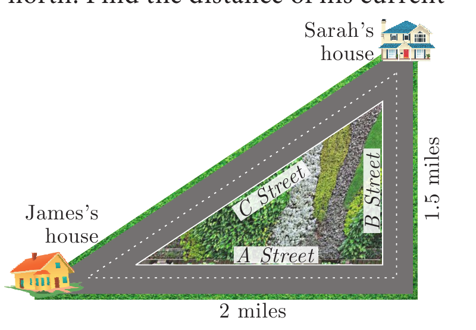

3. $A$ என்ற புள்ளியில் இருந்து $B$ என்ற புள்ளிக்குச் செல்வதற்கு ஒரு குளம் வழியாக, நடந்து செல்ல வேண்டும். குளம் வழியே செல்வதைத் தவிர்க்க $34$ மீ தெற்கேயும், $41$ மீ கிழக்கு நோக்கியும் நடக்க வேண்டும். குளம் வழியாகச் செல்வதற்குப் பாதை அமைத்து அப்பாதை வழியே சென்றால் எவ்வளவு மீட்டர் தொலைவு சேமிக்கப்படும்?

4. $WXYZ$ என்ற செவ்வகத்தில், $XY+YZ=17$ செ.மீ மற்றும் $XZ+YW=26$ செ.மீ எனில் செவ்வகத்தின் நீளம் மற்றும் அகலத்தைக் கணக்கிடுக.

   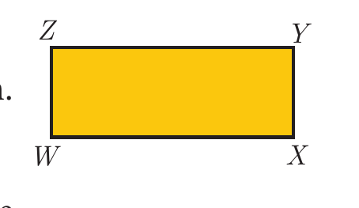

5. ஒரு செங்கோண முக்கோணத்தின் கர்ணம் சிறிய பக்கத்தின் $2$ மடங்கை விட $6$ மீ அதிகம். மேலும் மூன்றாவது பக்கமானது கர்ணத்தை விட $2$ மீ குறைவு எனில், முக்கோணத்தின் பக்கங்களைக் காண்க.

6. $5$ மீ நீளமுள்ள ஓர் ஏணியானது ஒரு செங்குத்து சுவர் மீது சாய்த்து வைக்கப்படுகிறது. ஏணியின் மேல் முனை சுவரை $4$ மீ உயரத்தில் தொடுகிறது. ஏணியின் கீழ்முனை சுவரை நோக்கி $1.6$ மீ நகர்த்தப்படும்போது, ஏணியின் மேல்முனை சுவரில் எவ்வளவு தொலைவு மேல்நோக்கி நகரும் எனக் கண்டுபிடி.

7. $\triangle PQR$-யின் அடிப்பக்கம் $QR$-க்கு செங்குத்தாக உள்ள $PS$ ஆனது $QR$-ஐ $S$-யில் சந்திக்கிறது. மேலும், $QS=3\,SR$ எனில், $2PQ^2=2PR^2+QR^2$ என நிறுவுக.

   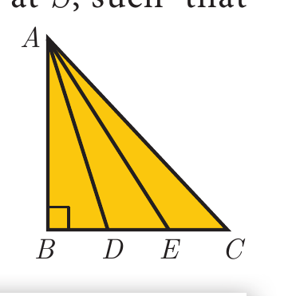

8. படத்தில், செங்கோண முக்கோணம் $ABC$-யில் கோணம் $B$ ஆனது செங்கோணம் மற்றும் $D$, $E$ என்ற புள்ளிகள் பக்கம் $BC$-ஐ மூன்று சமபகுதிகளாகப் பிரிக்கிறது எனில், $8AE^2=3AC^2+5AD^2$ என நிறுவுக.

## 4.5 வட்டங்கள் மற்றும் தொடுகோடுகள் (Circles and Tangents)

நமது அன்றாட வாழ்க்கைச் சூழல்களில், ஒரு தளத்தில் இரண்டு கோடுகள் ஒன்றையொன்று ஒரு புள்ளியில் வெட்டிக்கொள்வதை அல்லது வெட்டிக்கொள்ளாமல் செல்வதைப் பார்க்கிறோம். உதாரணமாக, இரயில் பாதையில் இரண்டு இணையான கோடுகள், ஒன்றையொன்று வெட்டிக்கொள்ளாமல் செல்கின்றன. அதே நேரத்தில் ஜன்னலில் உள்ள கம்பிகள் ஒன்றையொன்று வெட்டிக்கொள்கின்றன.

இதேபோல் ஒரு தளத்தில் ஒரு வளைவரை மற்றும் ஒரு கோடு கொடுக்கப்பட்டால் என்ன நடக்கிறது? அந்த வளைவரையானது (Curve) பரவளையமாகவோ, வட்டமாகவோ அல்லது ஏதேனும் ஒரு பொதுவான வடிவமாகவோ இருக்கலாம்.

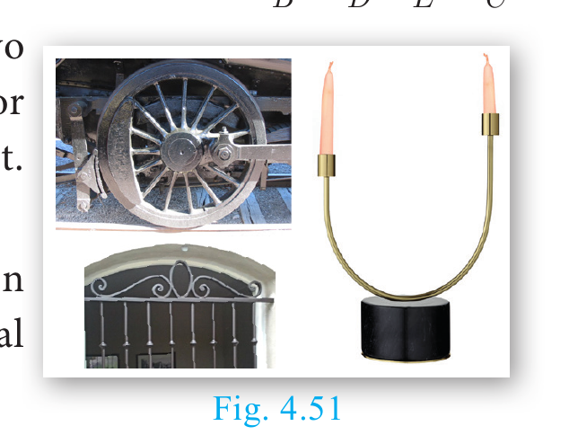

இதேபோல், ஒரு கோடும் ஒரு வட்டமும் வெட்டுவதாகக் கருதும்போது என்ன நடக்கிறது?

பின்வரும் விளக்கப்படத்தில் மூன்று சூழ்நிலைகளை நாம் பெறலாம்.

| படம் 1 | படம் 2 | படம் 3 |
|---|---|---|
| 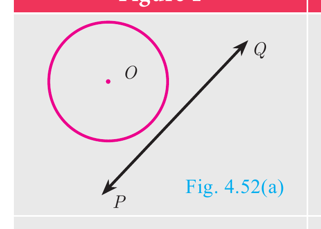 | 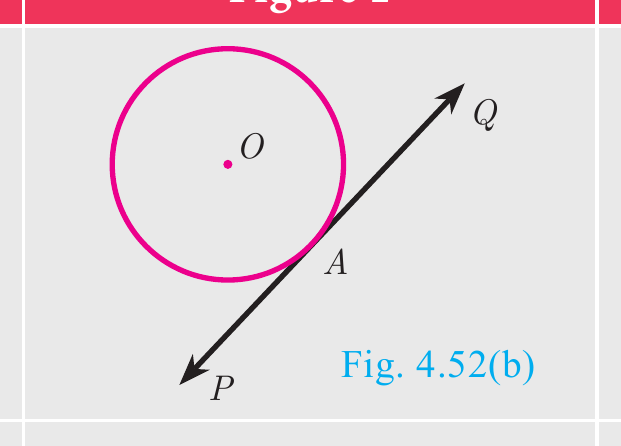 | 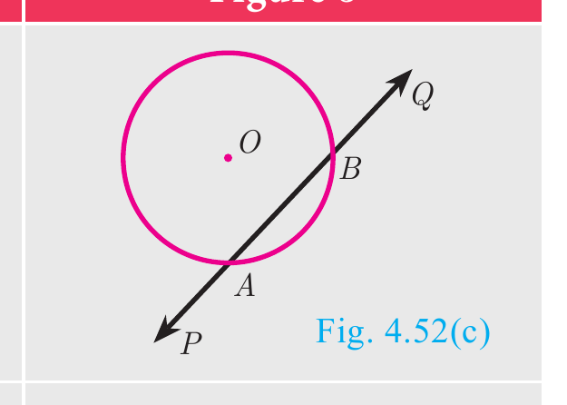 |
| (i) $PQ$ என்ற நேர்கோடு ஆனது வட்டத்தைத் தொடுவதில்லை. | (i) $PQ$ என்ற நேர்கோடு ஆனது வட்டத்தை ஒரு பொதுவான புள்ளியில் தொடுகிறது. | (i) $PQ$ என்ற நேர்கோடு ஆனது வட்டத்தை $A$ மற்றும் $B$ என்ற இரு வெவ்வேறு புள்ளிகளில் வெட்டுகிறது. |
| (ii) நேர்கோடு மற்றும் வட்டத்திற்குப் பொதுப்புள்ளி இல்லை. | (ii) $PQ$ ஆனது வட்டத்திற்கு $A$ என்ற புள்ளியில் உள்ள தொடுகோடு ஆகும். | (ii) $PQ$ என்ற கோடானது வட்டத்திற்கு ஒரு வெட்டுக்கோடு ஆகும். |
| (iii) இதனால் நேர்கோடு மற்றும் வட்டம் வெட்டிக்கொள்ளும் புள்ளிகளின் எண்ணிக்கை பூச்சியமாகும். | (iii) இதனால் நேர்கோடு மற்றும் வட்டம் வெட்டிக்கொள்ளும் புள்ளிகளின் எண்ணிக்கை ஒன்று ஆகும். | (iii) இதனால் நேர்கோடு மற்றும் வட்டம் வெட்டிக்கொள்ளும் புள்ளிகளின் எண்ணிக்கை இரண்டு ஆகும். |

> **குறிப்பு**
>
> படம் $4.52$(iii)-யில் வட்டத்தின் மீது அமைந்திருக்கும் கோடுத்துண்டுக்குள் $AB$-யானது வட்டத்தின் நாண் ஆகும். இதனால் நாண் என்பது வெட்டுக்கோட்டின் உப்குதியாகும்.

> **உங்களுக்குத் தெரியுமா?**
>
> தொடுகோடு என்பதன் ஆங்கில வார்த்தையான "tangent" என்பது இலத்தீன் மொழி வார்த்தையான டேன்ஜீர் (tangere) என்பதிலிருந்து பெறப்பட்டது. இதற்கு 'தொடுதல்' என்று பொருள். இதனை $1583$-இல் டேனிஷ் கணிதவியலாளரான தாமஸ் ஃபினேகோ அறிமுகப்படுத்தினார்.

> **வரையறை**
>
> ஒரு நேர்கோடானது கொடுக்கப்பட்ட வட்டத்தை ஒரே ஒரு புள்ளியில் மட்டுமே தொட்டால் அந்த நேர்கோடானது வட்டத்தின் தொடுகோடாகும்.

##### வட்டத்தின் தொடுகோடுகளுக்கான அன்றாட வாழ்வியல் உதாரணங்கள்

(i) ஒரு மிதிவண்டியானது சாலையில் செல்லும்போது சாலையானது சுழலக்கூடிய சக்கரங்களுக்குத் தொடுகோடாக இருக்கும்.

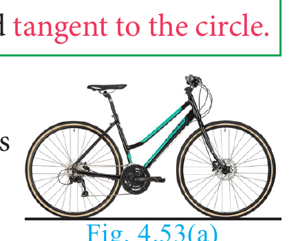

(ii) ஒரு கம்பியின் ஒரு முனையில் கல்லினைக் கட்டி, மறுமுனையினை கையினால் சுழற்றும்போது, கல்லானது ஒரு வட்டப்பாதையை ஏற்படுத்தும். திடீரென்று கையிலிருந்து கம்பியினை விடும்பொழுது கல்லானது வட்டத்தின் தொடுகோட்டின் திசையில் செல்வதைக் காணலாம்.

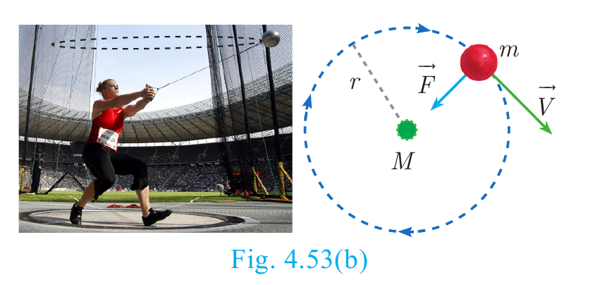

##### வட்டங்கள் மற்றும் தொடுகோடுகளுக்கான சில முடிவுகள்

1. ஒரு வட்டத்தின் ஏதேனும் ஒரு புள்ளியில் வரையப்பட்ட தொடுகோடு, அத்தொடு புள்ளி வழிச் செல்லும் ஆரத்திற்குச் செங்குத்தாக அமையும்.

   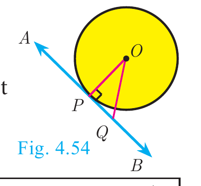

2.
   | (i) வட்டத்திற்கு உள்ளே உள்ள புள்ளியிலிருந்து அவ்வட்டத்திற்கு எந்தத் தொடுகோடும் வரைய முடியாது. | (ii) வட்டத்தின் மேலுள்ள ஒரு புள்ளியிலிருந்து அவ்வட்டத்திற்கு ஒரே ஒரு தொடுகோடு மட்டுமே வரைய முடியும். | (iii) வட்டத்திற்கு வெளியேயுள்ள புள்ளியிலிருந்து அவ்வட்டத்திற்கு இரண்டு தொடுகோடுகள் வரைய முடியும். |
   |---|---|---|
   | 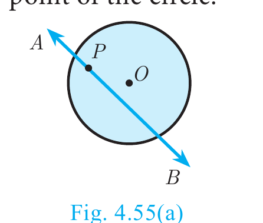 | 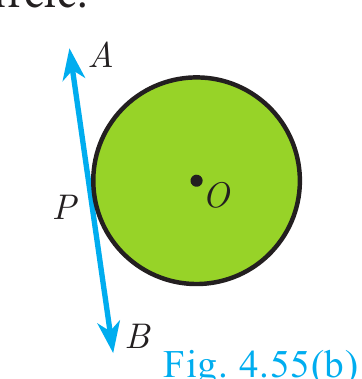 | 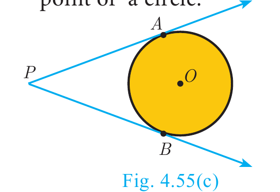 |

3. வட்டத்திற்கு வெளியே உள்ள ஏதேனும் ஒரு புள்ளியிலிருந்து அவ்வட்டத்திற்கு வரையப்படும் இரண்டு தொடுகோடுகளின் நீளங்கள் சமமாக இருக்கும்.

   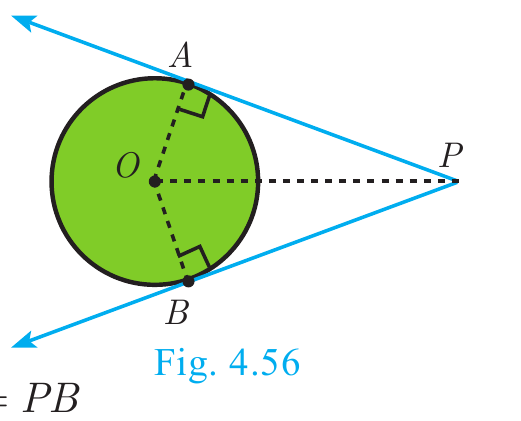

   **நிரூபணம் :** $1$-லிருந்து $OA \perp PA$, $OB \perp PB$. மேலும் $OA=OB=$ ஆரம், $OP$ ஆனது பொதுவான பக்கம், $\angle AOP=\angle BOP$

   எனவே, $\triangle OAP \cong \triangle OBP$ (பா.கோ.ப). ஆகவே $PA=PB$

4. இரு வட்டங்கள் வெளிப்புறமாகத் தொடுமானால், வட்ட மையங்களுக்கு இடையேயுள்ள தொலைவானது அவ்வட்டங்களின் ஆரங்களின் கூடுதலுக்குச் சமம். அதாவது $OP=r_1+r_2$

   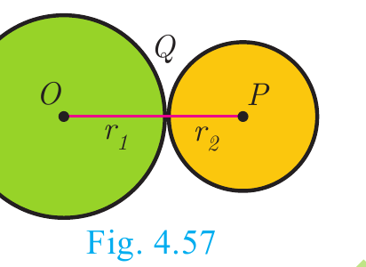

   **நிரூபணம் :** $O$ மற்றும் $P$ என்பன மையம் கொண்ட இரு வட்டங்கள் $Q$ என்ற புள்ளியில் தொட்டுக்கொள்கின்றன என்க.

   $OQ=r_1$ மற்றும் $PQ=r_2$ மற்றும் $r_1>r_2$ என்க.

   மையங்களுக்கு இடைப்பட்ட தொலைவு $OP=d$. படம் $4.57$-லிருந்து இரு வட்டங்கள் வெளிப்புறமாகத் தொட்டுக்கொள்வதால், $OP=d=OQ+PQ=r_1+r_2$.

5. இரு வட்டங்கள் உட்புறமாகத் தொடுமானால் வட்ட மையங்களுக்கு இடையேயுள்ள தொலைவானது அவற்றின் ஆரங்களின் வித்தியாசத்திற்குச் சமமாகும். அதாவது $OP=r_1-r_2$.

   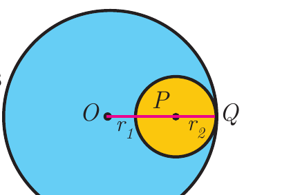

   **நிரூபணம் :** $O$ மற்றும் $P$ என்பன மையம் கொண்ட இரு வட்டங்கள் $Q$ என்ற புள்ளியில் தொட்டுக்கொள்கின்றன என்க.

   $OQ=r_1$ மற்றும் $PQ=r_2$ மற்றும் $r_1>r_2$ என்க.

   மையங்களுக்கு இடைப்பட்ட தொலைவு $OP=d$. படம் $4.58$-லிருந்து இரு வட்டங்கள் உட்புறமாகத் தொட்டுக்கொள்வதால், $OP=d=OQ-PQ$

   $$OP=r_1-r_2.$$

6. வட்டங்களுக்கு வரையப்பட்ட இரண்டு பொதுவான தொடுகோடுகளின் நீளங்கள் சமம் ஆகும். அதாவது $AB=CD$.

   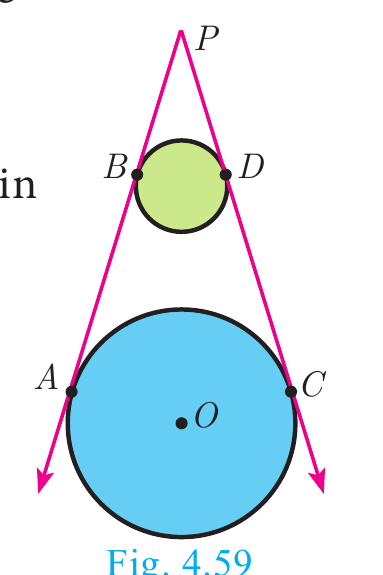

   **நிரூபணம் :**

   $P$ என்ற புள்ளியிலிருந்து இரு வட்டங்களுக்கு வரையப்பட்ட தொடுகோட்டின் நீளங்கள் சமமாக இருக்கும்.

   $$\begin{aligned}\text{எனவே,} \quad PA&=PC \text{ மற்றும் } PB=PD.\\\Rightarrow PA-PB&=PC-PD\\AB&=CD\end{aligned}$$

> **சிந்தனைக் களம்**
>
> 1. ஒன்றுக்கொன்று இணையாக ஒரு வட்டத்திற்கு இரு தொடுகோடுகள் வரைய முடியுமா?
> 2. ஒன்றுக்கொன்று செங்குத்தாக ஒரு வட்டத்திற்கு இரு தொடுகோடுகள் வரைய முடியுமா?

##### மாற்று வட்டத்துண்டு

படம் $4.60$-யில் $PQ$ என்ற நாண் வட்டத்தினை இரு துண்டுகளாகப் பிரிக்கிறது. $P$ என்ற புள்ளி வழியே வட்டத்தைத் தொட்டுக்கொண்டு செல்லுமாறு $AB$ என்ற தொடுகோடு வரைக.

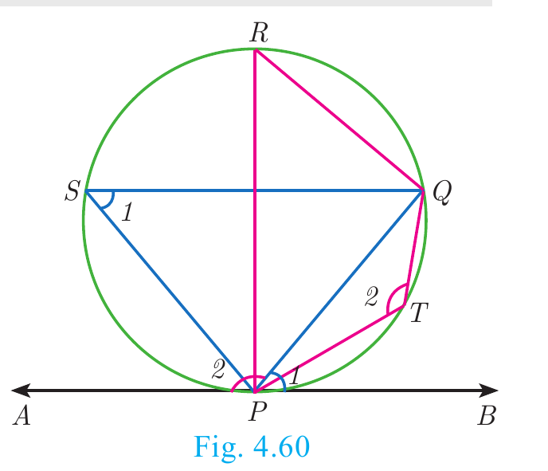

$\angle QPB$ $(\angle 1)$-யின் மாற்று வட்டத் துண்டில் உள்ள கோணம் $\angle QSP$ $(\angle 1)$ ஆகும். மற்றும் $\angle QPA$ $(\angle 2)$-யின் மாற்று வட்டத்துண்டிலுள்ள கோணம் $\angle PTQ$ $(\angle 2)$ ஆகும்.

##### தேற்றம் 6 : மாற்று வட்டத் துண்டு தேற்றம் (Alternate Segment Theorem)

**கூற்று**

வட்டத்தில் தொடுகோட்டின் தொடுபுள்ளி வழியே ஒரு நாண் வரையப்பட்டால், அந்த நாண் தொடுகோட்டுடன் ஏற்படுத்தும் கோணங்கள் முறையே ஒவ்வொன்றும் தனித்தனியாக மாற்றந்த வட்டத்துண்டுகளில் அமைந்த கோணங்களுக்குச் சமம்.

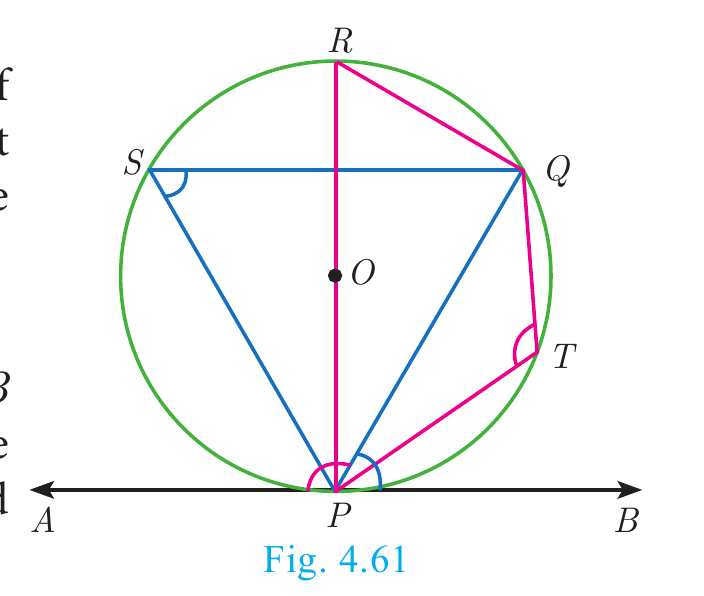

**கொடுக்கப்பட்டது** : $O$-வை மையமாகக் கொண்ட வட்டத்தில் $AB$ என்ற தொடுகோடு $P$ என்ற புள்ளி வழியே செல்கிறது. மற்றும் $PQ$ என்பது நாண் ஆகும். $S$ மற்றும் $T$ என்பன $PQ$ என்ற நாணிற்கு எதிரெதிர் பக்கங்களில் வட்டத்தின் மேல் உள்ள புள்ளிகள் ஆகும்.

**நிரூபிக்க** : (i) $\angle QPB=\angle PSQ$ மற்றும் (ii) $\angle QPA=\angle PTQ$

**அமைப்பு** : $POR$ என்ற விட்டம் வரைக. மேலும் $QR$, $QS$ மற்றும் $PS$-யை இணைக்கவும்.

| எண் | கூற்று | காரணம் |
|---|---|---|
| 1. | $\angle RPB=90^\circ$ $\angle RPQ+\angle QPB=90^\circ \quad \ldots(1)$ | விட்டம் $RP$ ஆனது தொடுகோடு $AB$-க்கு செங்குத்து ஆகும். |
| 2. | $\triangle RPQ$-வில், $\angle PQR=90^\circ \quad \ldots(2)$ | அரைவட்டத்தில் உள்ள கோணம் $90^\circ$. |
| 3. | $\angle QRP+\angle RPQ=90^\circ \quad \ldots(3)$ | ஒரு செங்கோண முக்கோணத்தில் இரு குறுங்கோணங்களின் கூடுதல் $90^\circ$ ஆகும். |
| 4. | $\angle RPQ+\angle QPB=\angle QRP+\angle RPQ$ $\angle QPB=\angle QRP \quad \ldots(4)$ | $(1)$ மற்றும் $(3)$-லிருந்து. |
| 5. | $\angle QRP=\angle PSQ \quad \ldots(5)$ | ஒரே வட்டத்துண்டிலுள்ள கோணங்கள் சமம். |
| 6. | $\angle QPB=\angle PSQ \quad \ldots(6)$ | $(4)$ மற்றும் $(5)$-லிருந்து, (i) நிரூபிக்கப்பட்டது |
| 7. | $\angle QPB+\angle QPA=180^\circ \quad \ldots(7)$ | நேர்கோட்டில் அமைந்த நேரிய இணைக் கோணங்கள். |
| 8. | $\angle PSQ+\angle PTQ=180^\circ \quad \ldots(8)$ | வட்டநாற்கரத்தின் எதிர் கோணங்களின் கூடுதல் $180^\circ$. |
| 9. | $\angle QPB+\angle QPA=\angle PSQ+\angle PTQ$ | $(7)$ மற்றும் $(8)$-லிருந்து |
| 10. | $\angle QPB+\angle QPA=\angle QPB+\angle PTQ$ | $(6)$-லிருந்து $\angle QPB=\angle PSQ$ |
| 11. | $\angle QPA=\angle PTQ$ | எனவே (ii) நிரூபிக்கப்பட்டது. தேற்றமும் நிரூபிக்கப்பட்டது. |

**எடுத்துக்காட்டு 4.24** $3$ செ.மீ ஆரமுள்ள வட்டத்தின் மையத்திலிருந்து $5$ செ.மீ தொலைவில் உள்ள புள்ளியிலிருந்து வட்டத்திற்கு வரையப்பட்ட தொடுகோட்டின் நீளம் காண்க.

**தீர்வு** கொடுக்கப்பட்டது $OP=5$ செ.மீ, ஆரம் $r=3$ செ.மீ

தொடுகோட்டின் நீளம் $PT$ ஐ காண

செங்கோண முக்காணம் $OTP$-யில்

$OP^2=OT^2+PT^2$ (பிதாகரஸ் தேற்றத்தின்படி)

$$5^2=3^2+PT^2 \Rightarrow PT^2=25-9=16$$

தொடுகோட்டின் நீளம் $PT=4$ செ.மீ

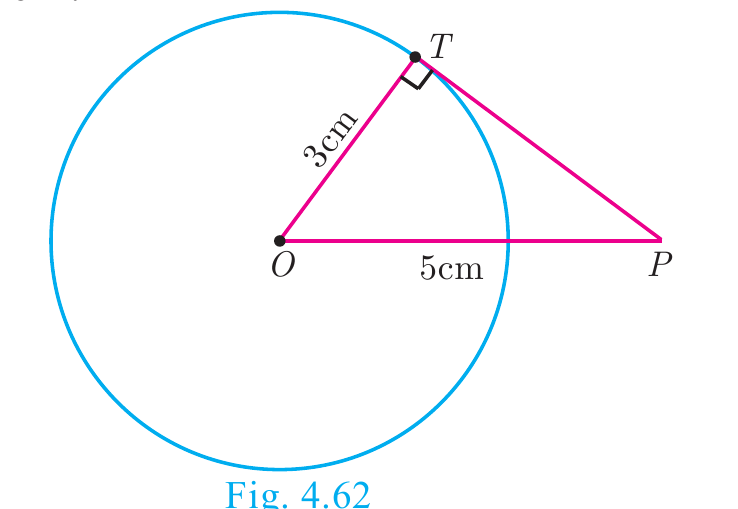

**எடுத்துக்காட்டு 4.25** $5$ செ.மீ ஆரமுள்ள வட்டத்தில் $PQ$ ஆனது $8$ செ.மீ நீளமுள்ள நாண் ஆகும். $P$ மற்றும் $Q$-வின் வழியே செல்லும் தொடுகோடுகள் $T$ என்ற புள்ளியில் சந்திக்கிறது எனில், $TP$ என்ற தொடுகோட்டின் நீளம் காண்க.

**தீர்வு** $TR=y$ என்க. $OT$ ஆனது $PQ$-யின் செங்குத்து இருசம வெட்டி ஆகும்.

$$PR=QR=4 \text{ செ.மீ}$$

$\triangle ORP$-ல், $OP^2=OR^2+PR^2$

$$OR^2=OP^2-PR^2$$

$$OR^2=5^2-4^2=25-16=9 \Rightarrow OR=3 \text{ செ.மீ}$$

$$OT=OR+RT=3+y \qquad \ldots(1)$$

$\triangle PRT$-ல், $TP^2=TR^2+PR^2 \qquad \ldots(2)$

$\triangle OPT$-ல், $OT^2=TP^2+OP^2$

$$OT^2=(TR^2+PR^2)+OP^2 \qquad ((2)\text{-லிருந்து, } TP^2\text{-ஐ பிரதியிட})$$

$$(3+y)^2=y^2+4^2+5^2 \qquad ((1)\text{-லிருந்து, } OT\text{-ஐ பிரதியிட})$$

$$9+6y+y^2=y^2+16+25$$

$$6y=41-9 \text{ எனவே, } y=\dfrac{16}{3}; \quad (2)\text{-லிருந்து, } TP^2=TR^2+PR^2$$

$$TP^2=\left(\dfrac{16}{3}\right)^2+4^2=\dfrac{256}{9}+16=\dfrac{400}{9} \text{ எனவே, } TP=\dfrac{20}{3} \text{ செ.மீ.}$$

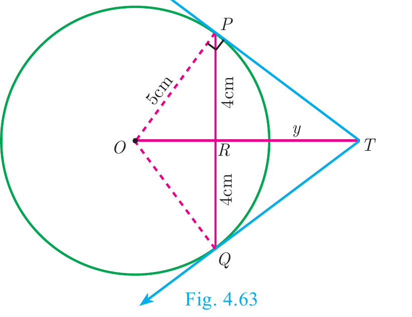

**எடுத்துக்காட்டு 4.26** படம் $4.64$-யில், $O$ ஆனது வட்டத்தின் மையம். $PQ$ ஆனது ஒரு நாண் ஆகும். தொடுகோடு $PR$ ஆனது நாண் $PQ$-வுடன் $P$-யில் $50^\circ$ கோணத்தை ஏற்படுத்தினால், $\angle POQ$ காண்க.

**தீர்வு** $\angle OPQ=90^\circ-50^\circ=40^\circ$ (தொடுகோட்டிற்கும், ஆரத்திற்கும் இடையேயுள்ள கோணம் $90^\circ$)

$$OP=OQ \qquad (\text{வட்டத்தின் ஆரங்கள் சமம்})$$

$$\angle OPQ=\angle OQP=40^\circ \qquad (\triangle OPQ \text{ ஆனது இரு சமபக்க முக்கோணம்})$$

$$\angle POQ=180^\circ-\angle OPQ-\angle OQP$$

$$\angle POQ=180^\circ-40^\circ-40^\circ=100^\circ$$

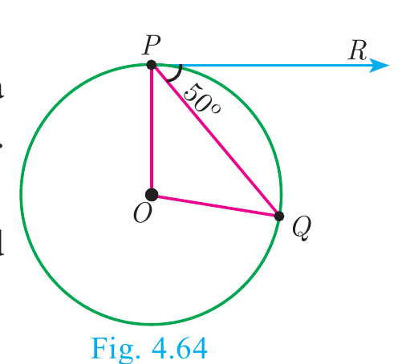

**எடுத்துக்காட்டு 4.27** அருகிலுள்ள படம் $4.65$-யில், $\triangle ABC$ ஆனது ஒரு வட்டத்தைத் தொட்டுக்கொண்டு வட்டத்தைச் சுற்றி அமைந்துள்ளது எனில், $BC$-யின் நீளத்தைக் காண்க.

**தீர்வு** $AN=AM=3$ செ.மீ (ஒரே வெளிப்புறப் புள்ளியிலிருந்து வரையப்பட்ட தொடுகோடுகள் சமம்)

$$BN=BL=4 \text{ செ.மீ}$$

$$CL=CM=AC-AM=9-3=6 \text{ செ.மீ}$$

$$BC=BL+CL=4+6=10 \text{ செ.மீ}$$

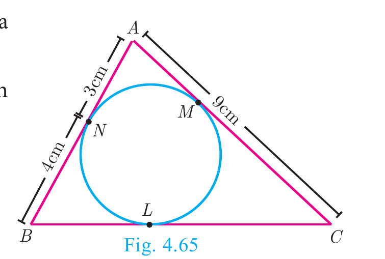

**எடுத்துக்காட்டு 4.28** இரண்டு பொது மைய வட்டங்களின் ஆரங்கள் $4$ செ.மீ, $5$ செ.மீ ஆகும். ஒரு வட்டத்தின் நாணானது மற்றொரு வட்டத்திற்குத் தொடுகோடாக அமைந்தால் அவ்வட்டத்தின் நாணின் நீளம் காண்க.

**தீர்வு** $OA=4$ செ.மீ, $OB=5$ செ.மீ, மேலும் $OA \perp BC$.

$$OB^2=OA^2+AB^2$$

$$5^2=4^2+AB^2 \Rightarrow AB^2=9$$

எனவே, $AB=3$ செ.மீ

$$BC=2AB \text{ எனவே, } BC=2\times3=6 \text{ செ.மீ}$$

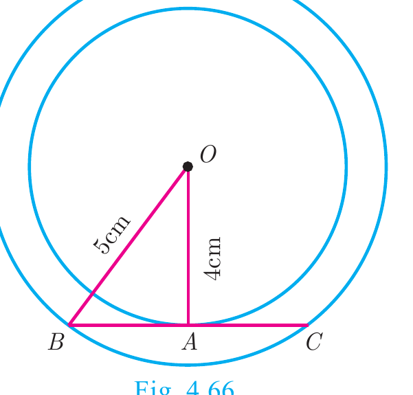

### 4.5.1 வரைபடம் வரைதல் (Construction)

##### வட்டத்திற்குத் தொடுகோடுகள் வரைதல் (Construction of tangents to a circle)

இப்பொழுது கீழ்க்காண்பனவற்றை எப்படி வரைய வேண்டும் என்று விவாதிப்போம்.

(i) மையத்தைப் பயன்படுத்தி வட்டத்திற்குத் தொடுகோடு வரைதல்

(ii) மாற்று வட்டத்துண்டு தேற்றத்தைப் பயன்படுத்தி வட்டத்திற்குத் தொடுகோடு வரைதல்

(iii) வெளிப்புறப் புள்ளியிலிருந்து வட்டத்திற்கு இரு தொடுகோடுகள் வரைதல்

##### வட்டத்திற்குத் தொடுகோடு வரைதல் (மையத்தைப் பயன்படுத்தி) (Construction of a tangent to a circle (Using the centre))

**எடுத்துக்காட்டு 4.29** $3$ செ.மீ ஆரமுள்ள வட்டம் வரைக. வட்டத்தின் மேல் $P$ என்ற புள்ளியைக் குறித்து அப்புள்ளி வழியே தொடுகோடு வரைக.

**தீர்வு** ஆரம், $r=3$ செ.மீ எனக் கொடுக்கப்பட்டுள்ளது

**வரைமுறை**

**படி 1 :** $O$-வை மையமாகக் கொண்டு $3$ செ.மீ ஆரமுள்ள வட்டம் வரைக.

**படி 2 :** வட்டத்தின் மேல் $P$ என்ற புள்ளியைக் குறித்து $OP$-ஐ இணைக்கவும்.

**படி 3 :** $P$ என்ற புள்ளி வழியே $OP$-க்கு செங்குத்தாக $TT'$ வரைக.

**படி 4 :** $TT'$ ஆனது தேவையான தொடுகோடு ஆகும்.

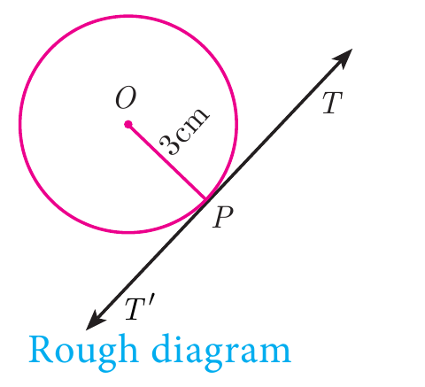

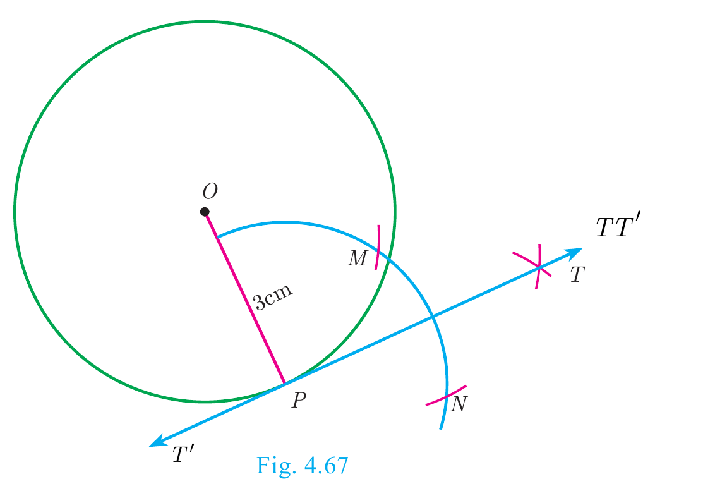

##### வட்டத்திற்குத் தொடுகோடு வரைதல் (மாற்று வட்டத்துண்டு தேற்றத்தைப் பயன்படுத்தி) (Construct of a tangent to a circle (Using alternate segment theorem))

**எடுத்துக்காட்டு 4.30** $4$ செ.மீ ஆரமுள்ள வட்டம் வரைக. வட்டத்தின் மீதுள்ள $L$ என்ற புள்ளி வழியாக மாற்று வட்டத்துண்டு தேற்றத்தைப் பயன்படுத்தி வட்டத்திற்குத் தொடுகோடு வரைக.

**தீர்வு** ஆரம் $=4$ செ.மீ எனக் கொடுக்கப்பட்டுள்ளது

**வரைமுறை**

**படி 1 :** $O$-வை மையமாகக் கொண்டு $4$ செ.மீ ஆரமுள்ள வட்டம் வரைக

**படி 2 :** வட்டத்தின் மேல் $L$ என்ற புள்ளியைக் குறிக்கவும். $L$ வழியே ஏதேனும் ஒரு நாண் $LM$ வரைக.

**படி 3 :** $L$ மற்றும் $M$-ஐ தவிர்த்து வட்டத்தின் மேல் $N$ என்ற புள்ளியைக் குறிக்கவும். $L$, $M$ மற்றும் $N$ ஆகியன கடிகார முள்ளோட்டத்தின் எதிர் திசையில் அமையுமாறு குறிக்கவும். $LN$ மற்றும் $NM$-ஐ இணைக்கவும்.

**படி 4 :** $\angle TLM=\angle MNL$ என அமையுமாறு $L$ வழியே $TT'$ என்ற தொடுகோடு வரைக.

**படி 5 :** $TT'$ என்பது தேவையான தொடுகோடாகும்.

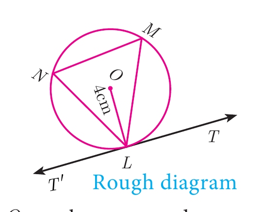

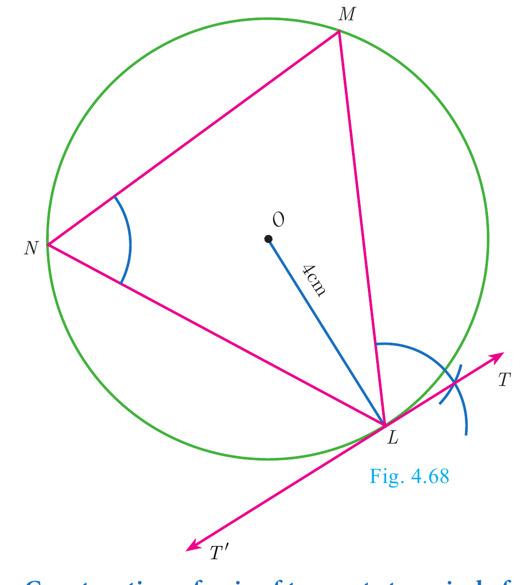

##### வெளிப்புறப் புள்ளி $P$-யிலிருந்து வட்டத்திற்கு இரு தொடுகோடுகள் வரைதல் (Construction of pair of tangents to a circle from an external point $P$)

**எடுத்துக்காட்டு 4.31** $6$ செ.மீ விட்டமுள்ள வட்டம் வரைந்து வட்டத்தின் மையத்திலிருந்து $8$ செ.மீ தொலைவில் $P$ என்ற புள்ளியைக் குறிக்கவும். அப்புள்ளியிலிருந்து $PA$ மற்றும் $PB$ என்ற இரு தொடுகோடுகள் வரைந்து அவற்றின் நீளங்களை அளவிடுக.

**தீர்வு** விட்டம் $(d)=6$ செ.மீ எனக் கொடுக்கப்பட்டுள்ளது. ஆரம் $(r)=\dfrac{6}{2}=3$ செ.மீ

**வரைமுறை**

**படி 1 :** $O$-வை மையமாகக் கொண்டு $3$ செ.மீ ஆரமுள்ள வட்டம் வரைக

**படி 2 :** $8$ செ.மீ நீளமுள்ள $OP$ என்ற ஒரு கோடு வரைக.

**படி 3 :** $OP$-க்கு மையக்குத்துக் கோடு வரைக. அது $OP$-ஐ $M$-ல் சந்திக்கும்.

**படி 4 :** $M$-யை மையமாகவும், $MO$-வை ஆரமாகவும் கொண்டு வரையப்படும் வட்டமானது முந்தைய வட்டத்தை $A$ மற்றும் $B$-யில் சந்திக்கிறது.

**படி 5 :** $AP$ மற்றும் $BP$ யை இணைக்கவும். $AP$ மற்றும் $BP$ தேவையான தொடுகோடுகள் ஆகும். தொடுகோட்டின் நீளம் $PA=PB=7.4$ செ.மீ.

**சரிபார்த்தல் :** செங்கோண முக்கோணம் $OPA$-யில், $PA^2=OP^2-OA^2=8^2-3^2=64-9=55$

$$PA=\sqrt{55}=7.4 \text{ செ.மீ (தோராயமாக).}$$

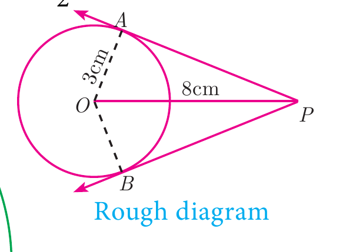

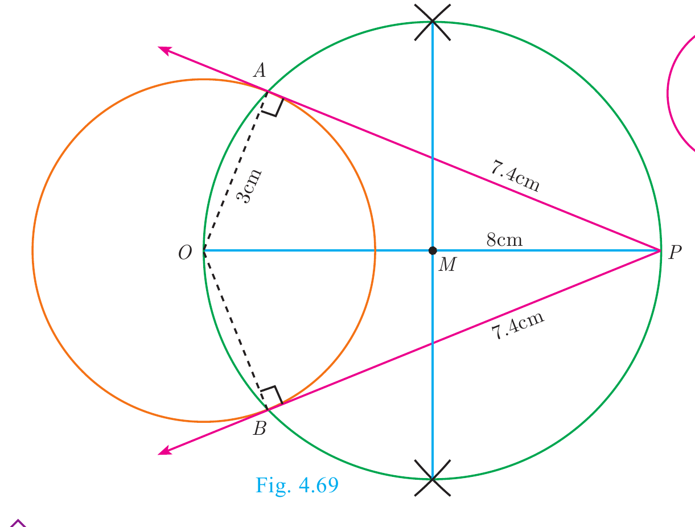

## 4.6 ஒருங்கிசைவுத் தேற்றம் (Concurrency Theorems)

> **வரையறை**
>
> ஒரு முக்கோணத்தின் ஒரு முனையிலிருந்து அதன் எதிர் பக்கத்திற்கு வரையப்படும் கோட்டுத்துண்டு சீவியன் (cevian) ஆகும். வரைபடத்தில் $AD$ ஆனது ஒரு சீவியன்.

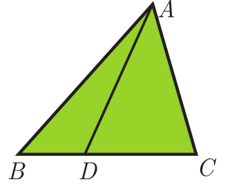

##### சிறப்பு சீவியன்கள்

(i) எதிர் பக்கத்தை இரு சர்வசம பகுதியாக (சமமாக) பிரிக்கும் நடுக்கோடானது (Median) ஒரு **சீவியன்** ஆகும்.

(ii) எதிர்பக்கத்திற்குச் செங்குத்தாக இருக்கும் குத்துக்கோடானது (altitude) ஒரு **சீவியன்** ஆகும்.

(iii) கோணத்தை இரு சமமாகப் பிரிக்கும் கோண இருசமவெட்டியானது ஒரு **சீவியன்** ஆகும்

> **உங்களுக்குத் தெரியுமா?**
>
> இத்தாலியைச் சேர்ந்த பொறியியலாளர் ஜியோவானி சீவா (Giovanni Ceva) என்பவரின் பெயரிலிருந்து சீவியன் (cevian) என்ற வார்த்தை பெறப்பட்டது. இவர் சீவியன்கள் பற்றிய தேற்றத்தை நிரூபித்தார்.

##### சீவாஸ் தேற்றம் (நிரூபணம் இல்லாமல்) (Ceva's Theorem (without proof))

**கூற்று**

$ABC$ என்பது ஒரு முக்கோணம் என்க. பக்கங்கள் $BC$, $CA$ மற்றும் $AB$-யில் உள்ள புள்ளிகள் முறையே $D, E$ மற்றும் $F$ என்க. முக்கோணத்தின் பக்கங்கள் ஒரே திசையைப் பொருத்து, $AD$, $BE$, $CF$ என்ற சீவியன்கள் ஒருங்கிசைந்துள்ளன எனில், $\dfrac{BD}{DC}\times\dfrac{CE}{EA}\times\dfrac{AF}{FB}=1$. ஒவ்வொரு விகிதத்தினையும் தலைகீழியாக மாற்றினாலும் மேற்கூறியது உண்மையே. ஏனெனில் $1$-யின் தலைகீழி ஒன்று ஆகும்.

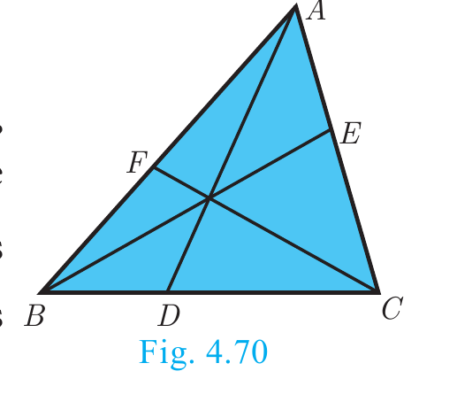

> **உங்களுக்குத் தெரியுமா? — ஜியோவானி சீவா (டிசம்பர் 7, 1647 – ஜூன் 15, 1734) (Giovanni Ceva)**
>
> $1686$-இல் கணிதப் பேராசிரியராக மான்துவா பல்கலைக்கழகத்தில் பணியில் சேர்ந்த சீவா தனது நிறைவு வாழ்நாள் வரை அங்கேயே பணிபுரிந்தார். $1678$-ம் ஆண்டில் இவர் தொகுமுறை வடிவியலில், முக்கோணம் பற்றிய ஒரு முக்கியமானத் தேற்றத்தை வெளியிட்டார். அந்தத் தேற்றம் 'சீவாவின் தேற்றம்' என்று அழைக்கப்படுகிறது.
>
> $1692$-ஆம் ஆண்டில் ஓப்ஸ்குலா மேத்தமடிக்கா மற்றும் ஜியாமன்ட்ரியா மோட்டஸ் எனும் ஆய்விதழில் மீண்டும் கண்டறிந்து வெளியிட்டார். இயக்கவியல் மற்றும் நீர்மவியல் துறைகளில் சீவா தேற்றக் கருத்துகளைப் பயன்படுத்தினார்.

> **குறிப்பு**
>
> பல சீவியன்கள் முக்கோணத்திற்கு உட்புறம் அமைந்தாலும், அனைத்து சீவியன்களும் முக்கோணத்திற்கு உள்ளேயே அமைய வேண்டிய அவசியமில்லை.

##### மெனிலாஸ் தேற்றம் (நிரூபணம் இல்லாமல்) (Menelaus Theorem (without proof))

**கூற்று**

$ABC$ என்ற முக்கோணத்தின் பக்கங்கள் $BC$, $CA$, $AB$ (அல்லது அவற்றின் நீட்சி)-யில் உள்ள புள்ளிகள் முறையே $P, Q, R$ ஆகியன ஒரு கோடமைந்த புள்ளிகளாக அமையத் தேவையான மற்றும் போதுமான நிபந்தனை $\dfrac{BP}{PC}\times\dfrac{CQ}{QA}\times\dfrac{AR}{RB}=-1$. இந்தச் சூத்திரத்தில் உள்ள கோட்டுத்துண்டுகள் அனைத்தும் திசை சார்ந்தவையாகும்.

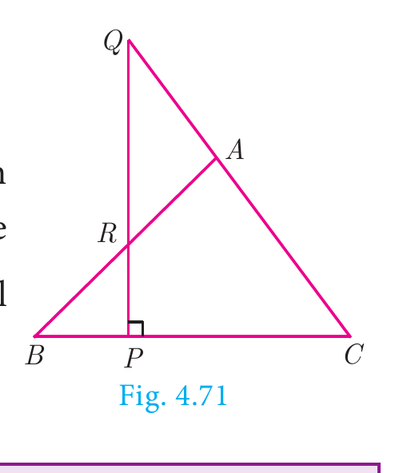

> **உங்களுக்குத் தெரியுமா? — மெனிலாஸ் (Menelaus)**
>
> இவரது "ஸ்பெரிக்கா" எனும் புத்தகத்தில் முதன்முதலில் மெனிலாஸ் தேற்றத்தைப் பற்றி குறிப்பிட்டுள்ளார். இதைப் பிற்காலத்தில் டாலமி அவரது படைப்பான ஆல்மாகெஸ்ட் எனும் நூலில் குறிப்பிட்டுள்ளார். மெனிலாஸ் தேற்றம் கோள முக்கோணங்களால் கோளங்கள் உருவாக்கப்படுகின்றன என நிரூபிக்கிறது.

> **குறிப்பு**
>
> - $BP\times CQ\times AR=-PC\times QA\times RB$ எனவும், மெனிலாஸ் தேற்றத்தைக் குறிப்பிடலாம்.
> - $BP$ ஆனது $PB$-யாகவும், $CQ$ ஆனது $QC$-யாகவும் மாற்றப்பட்டாலோ அல்லது $BP$, $PC$, $CQ$, $QA$, $AR$, $RB$ என்ற ஒரு திசையில் அமைந்த ஆறு கோட்டுத்துண்டுகளில் ஏதேனும் ஒன்றை பரிமாற்றம் செய்தாலோ மேற்கண்ட பெருக்கற்பலனின் மதிப்பு $1$ ஆகும்.

**எடுத்துக்காட்டு 4.32** ஒரு முக்கோணத்தின் நடுக்கோடுகள் ஒரு புள்ளி வழிச் செல்லும் எனக் காட்டுக.

**தீர்வு** முக்கோணத்தின் ஒவ்வொரு முனையிலிருந்தும் அதன் எதிர் பக்கத்தின் மையப்புள்ளிக்கு வரையப்படும் கோட்டுத்துண்டு நடுக்கோடு எனப்படும்.

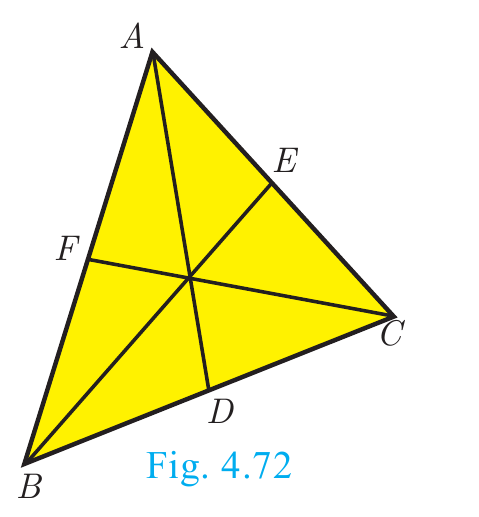

பக்கங்கள் $BC$, $CA$ மற்றும் $AB$-யின் மையப்புள்ளிகள் முறையே $D$, $E$ மற்றும் $F$-க்கு வரையப்படும் நடுக்கோடுகளானது சீவியன்களாகவும் இருக்கும்.

$BC$-ன் நடு புள்ளி $D$. எனவே, $BD=DC$ அதாவது, $\dfrac{BD}{DC}=1 \qquad \ldots(1)$

$CA$-ன் நடு புள்ளி $E$. எனவே, $CE=EA$ அதாவது, $\dfrac{CE}{EA}=1 \qquad \ldots(2)$

$AB$-ன் நடு புள்ளி $F$. எனவே, $AF=FB$ அதாவது, $\dfrac{AF}{FB}=1 \qquad \ldots(3)$

$(1)$, $(2)$ மற்றும் $(3)$-ஐ பெருக்க நாம் பெறுவது,

$$\dfrac{BD}{DC}\times\dfrac{CE}{EA}\times\dfrac{AF}{FB}=1\times1\times1=1$$

எனவே, சீவாஸ் தேற்றம் நிரூபிக்கப்பட்டது.

ஆகையால், நடுக்கோடுகள் ஒரு புள்ளி வழிச் செல்கின்றன.

> **உங்களுக்குத் தெரியுமா?**
>
> முக்கோணத்தின் நடுக்கோடுகள் சந்திக்கும் புள்ளி நடுக்கோட்டு மையம் எனப்படும்.

**எடுத்துக்காட்டு 4.33** $\triangle ABC$-ல், $D,E,F$ ஆகிய புள்ளிகள் முறையே $BC$, $CA$, $AB$ மீது உள்ளன. $AB$, $AC$ மற்றும் $BC$ ஆகியவற்றின் நீளங்கள் முறையே $13$, $14$ மற்றும் $15$ ஆகும். $\dfrac{AF}{FB}=\dfrac{2}{5}$ மற்றும் $\dfrac{CE}{EA}=\dfrac{5}{8}$ எனில், $BD$ மற்றும் $DC$ காண்க.

**தீர்வு** கொடுக்கப்பட்டது $AB=13$, $AC=14$ மற்றும் $BC=15$.

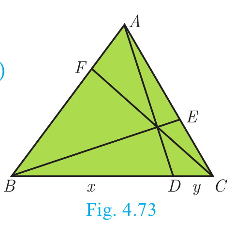

$BD=x$ மற்றும் $DC=y$ என்க

சீவாஸ் தேற்றத்தின்படி, $\dfrac{BD}{DC}\times\dfrac{CE}{EA}\times\dfrac{AF}{FB}=1 \qquad \ldots(1)$

$\dfrac{AF}{FB}$ மற்றும் $\dfrac{CE}{EA}$-யின் மதிப்புகளை $(1)$-யில் பிரதியிட,

$$\dfrac{BD}{DC}\times\dfrac{5}{8}\times\dfrac{2}{5}=1$$

$$\dfrac{x}{y}\times\dfrac{10}{40}=1 \Rightarrow \dfrac{x}{y}\times\dfrac{1}{4}=1. \text{ எனவே, } x=4y \qquad \ldots(2)$$

$BC=BD+DC=15$ எனவே, $x+y=15 \qquad \ldots(3)$

$(2)$-லிருந்து, $x=4y$-ஐ $(3)$-யில் பிரதியிட, $4y+y=15 \Rightarrow 5y=15$ எனவே $y=3$

$y=3$-ஐ $(3)$-யில் பிரதியிட, $x=12$. எனவே $BD=12$, $DC=3$.

**எடுத்துக்காட்டு 4.34** பல மரங்களைக் கொண்ட ஒரு தோட்டத்தில் $P$, $Q$, $R$ என்ற மூன்று மரங்கள் பின்வருமாறு அமைந்துள்ளன. $ABC$ என்ற முக்கோணத்தில் $BC$-யின் மீது $P$-யும், $AC$-யின் மீது $Q$-வும், $AB$-யின் மீது $R$-ம் புள்ளிகளாக உள்ளன. மேலும் $BP=2$ மீ, $CQ=3$ மீ, $RA=10$ மீ, $PC=6$ மீ, $QA=5$ மீ, $RB=2$ மீ ஆகும். மரங்கள் $P$, $Q$, $R$ ஒரே நேர்க்கோட்டில் அமைந்துள்ளனவா எனச் சோதிக்கவும்.

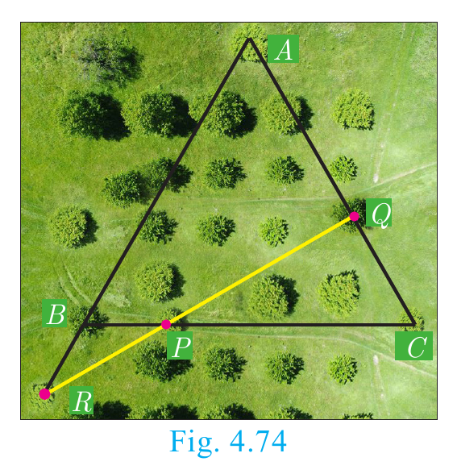

**தீர்வு** மெனிலாஸ் தேற்றத்தின்படி $P$, $Q$, $R$ என்ற மரங்கள் ஒரே நேர்க்கோட்டில் அமைய வேண்டுமெனில்,

$$\dfrac{BP}{PC}\times\dfrac{CQ}{QA}\times\dfrac{RA}{RB}=1 \qquad \ldots(1) \text{ ஆக அமைய வேண்டும்}$$

கொடுக்கப்பட்டது $BP=2$ மீ, $CQ=3$ மீ, $RA=10$ மீ, $PC=6$ மீ, $QA=5$ மீ மற்றும் $RB=2$ மீ

மதிப்புகளை $(1)$-யில் பிரதியிட, $\dfrac{BP}{PC}\times\dfrac{CQ}{QA}\times\dfrac{RA}{RB}=\dfrac{2}{6}\times\dfrac{3}{5}\times\dfrac{10}{2}=\dfrac{60}{60}=1$

எனவே, மரங்கள் $P$, $Q$, $R$ ஒரே நேர்க்கோட்டின் மீது அமைந்துள்ளன.

> **முன்னேற்றச் சோதனை**
>
> 1. நேர்க்கோடு, வட்டத்தினைத் தொட்டுச் செல்லும் பொதுவான புள்ளி ________ என்று அழைக்கப்படுகிறது.
> 2. ________-யின் ஒரு பகுதி நாண் ஆகும்.
> 3. வட்டத்திற்கு ________ உள்ள புள்ளியிலிருந்து வரையப்படும் தொடுகோட்டின் நீளங்கள் சமம்.
> 4. வட்டத்தின் ________ புள்ளியிலிருந்து எந்தத் தொடுகோடும் வரைய இயலாது.
> 5. ________ என்ற சீவியன் (Cevian) முக்கோணத்தின் கோணங்களை இரு சமபகுதிகளாகப் பிரிக்கின்றன.

### பயிற்சி 4.4

1. வட்டத்தின் மையத்திலிருந்து $25$ செ.மீ தொலைவில் உள்ள $P$ என்ற புள்ளியிலிருந்து வட்டத்திற்கு வரையப்பட்ட தொடுகோட்டின் நீளம் $24$ செ.மீ எனில், வட்டத்தின் ஆரம் என்ன?

2. செங்கோண முக்கோணம் $LMN$-யில் $\angle L=90^\circ$ ஆகும். ஒரு வட்டமானது செங்கோண முக்கோணத்தின் உள்ளே அதன் பக்கங்களைத் தொடுமாறு வரையப்படுகிறது. செங்கோணத்தைத் தாங்கும் பக்கங்களின் நீளங்கள் $6$ செ.மீ மற்றும் $8$ செ.மீ எனில், வட்டத்தின் ஆரம் காண்க.

3. படத்தில் காட்டியுள்ளபடி, $8$ செ.மீ, $10$ செ.மீ மற்றும் $12$ செ.மீ பக்கங்கள் உடைய முக்கோணத்தினுள் ஒரு வட்டம் அமைந்துள்ளது எனில், $AD$, $BE$ மற்றும் $CF$ ஐக் காண்க.

   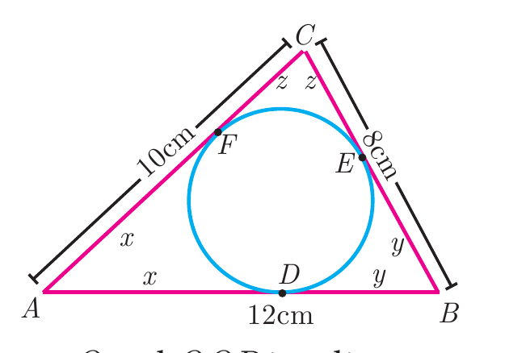

4. $O$-வை மையமாக உடைய வட்டத்திற்கு $P$-யிலிருந்து வரையப்பட்ட தொடுகோடு $PQ$. $QOR$ ஆனது விட்டம் ஆகும். வட்டத்தில் $\angle POR=120^\circ$ எனில், $\angle OPQ$-ஐக் காண்க.

5. தொடுகோடு $ST$ வட்டத்தில் $B$ என்ற புள்ளியில் தொடுகிறது. $\angle ABT=65^\circ$. $AB$ என்பது ஒரு நாண் எனில் $\angle AOB$-ஐ காண்க. இதில் 'O' என்பது வட்டத்தின் மையம் ஆகும்.

6. கொடுக்கப்பட்ட படத்தில் $O$-வை மையமாக உடைய வட்டத்தின் ஆரம் $5$ செ.மீ ஆகும். $T$-யானது $OT=13$ செ.மீ என அமைந்த ஒரு புள்ளி மற்றும் $OT$-யானது வட்டத்தை $E$-யில் வெட்டுகிறது. வட்டத்தில் $E$ என்ற புள்ளியின் வழியாகச் செல்லும் ஒரு தொடுகோடு $AB$ எனில், $AB$-யின் நீளம் காண்க.

   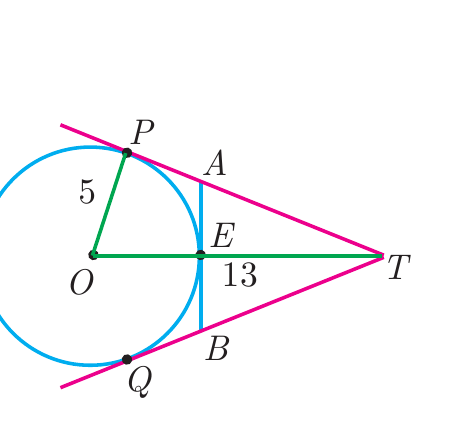

7. இரண்டு பொது மைய வட்டங்களில், $16$ செ.மீ நீளமுடைய பெரிய வட்டத்தின் நாணானது $6$ செ.மீ ஆரமுள்ள சிறிய வட்டத்திற்குத் தொடுகோடாக அமைந்தால், பெரிய வட்டத்தின் ஆரம் காண்க.

8. $O$ மற்றும் $O'$-ஐ மையப்புள்ளிகளாகக் கொண்ட இரு வட்டங்களின் ஆரங்கள் முறையே $3$ செ.மீ மற்றும் $4$ செ.மீ ஆகும். இவை இரண்டும் $P$, $Q$ என்ற புள்ளிகளில் வெட்டிக்கொள்கின்றன. $OP$ மற்றும் $O'P$ ஆகியவை வட்டங்களின் இரு தொடுகோடுகள் எனில், பொது நாண் $PQ$-யின் நீளம் காண்க.

9. ஒரு முக்கோணத்தின் கோண இருசம வெட்டிகள் ஒரு புள்ளியின் வழியாகச் செல்லும் எனக் காட்டுக.

10. படத்தில் உள்ளவாறு ஒருமுக்கோண வடிவக் கண்ணாடி ஜன்னலை முழுமையாக உருவாக்க ஒரு சிறிய கண்ணாடித்துண்டு ஒரு கலை நிபுணருக்குத் தேவைப்படும். மற்ற கண்ணாடித் துண்டுகளின் நீளங்களைப் பொருத்து அவற்றுக்குத் தேவையான கண்ணாடித் துண்டின் நீளத்தைக் கணக்கிடவும்.

    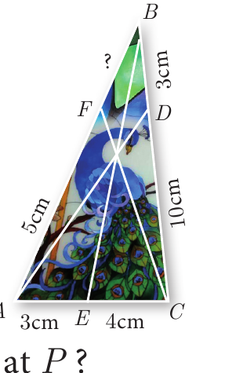

11. $P$ ஐ மையமாகக் கொண்ட $3.4$ செ.மீ ஆரமுள்ள ஒரு வட்டத்திற்கு $R$ என்ற புள்ளியில் தொடுகோடு வரைக.

12. $4.5$ செ.மீ ஆரமுள்ள வட்டம் வரைக. வட்டத்தின் மீது ஏதேனும் ஒரு புள்ளிக்கு மாற்று வட்டத்துண்டு தேற்றத்தினைப் பயன்படுத்தித் தொடுகோடு வரைக.

13. $5$ செ.மீ ஆரமுள்ள வட்டத்தின் மையத்திலிருந்து $10$ செ.மீ தொலைவிலுள்ள புள்ளியிலிருந்து வட்டத்திற்குத் தொடுகோடுகள் வரையவும். மேலும் தொடுகோட்டின் நீளங்களைக் கணக்கிடுக.

14. $4$ செ.மீ ஆரமுள்ள வட்டம் வரைந்து அதன் மையத்திலிருந்து $11$ செ.மீ தொலைவிலுள்ள ஒரு புள்ளியைக் குறித்து, அப்புள்ளியிலிருந்து வட்டத்திற்கு இரண்டு தொடுகோடுகள் வரைக.

15. $6$ செ.மீ விட்டமுள்ள வட்டம் வரைந்து வட்டத்தின் மையத்திலிருந்து $5$ செ.மீ தொலைவிலுள்ள ஒரு புள்ளியைக் குறிக்கவும். அப்புள்ளியிலிருந்து வட்டத்திற்குத் தொடுகோடுகள் வரைந்து, தொடுகோட்டின் நீளங்களைக் கணக்கிடுக.

16. $O$-வை மையமாகக் கொண்ட $3.6$ செ.மீ ஆரமுள்ள வட்டம் வரைக. வட்டத்தின் மையத்திலிருந்து $7.2$ செ.மீ தொலைவிலுள்ள $P$ என்ற புள்ளியைக் குறித்து அப்புள்ளியிலிருந்து வட்டத்திற்குத் தொடுகோடு வரைக.

### பயிற்சி 4.5

##### பலவுள் தெரிவு வினாக்கள்

1. $\dfrac{AB}{DE}=\dfrac{BC}{FD}$ எனில், $ABC$ மற்றும் $EDF$ எப்பொழுது வடிவொத்தவையாக அமையும்.

   (அ) $\angle B=\angle E$ &emsp; (ஆ) $\angle A=\angle D$ &emsp; (இ) $\angle B=\angle D$ &emsp; (ஈ) $\angle A=\angle F$

2. $\triangle LMN$-யில் $\angle L=60^\circ$, $\angle M=50^\circ$. மேலும், $\triangle LMN \sim \triangle PQR$ எனில், $\angle R$-யின் மதிப்பு

   (அ) $40^\circ$ &emsp; (ஆ) $70^\circ$ &emsp; (இ) $30^\circ$ &emsp; (ஈ) $110^\circ$

3. இருசமபக்க முக்கோணம் $\triangle ABC$-யில் $\angle C=90^\circ$ மற்றும் $AC=5$ செ.மீ, எனில் $AB$ ஆனது

   (அ) $2.5$ செ.மீ &emsp; (ஆ) $5$ செ.மீ &emsp; (இ) $10$ செ.மீ &emsp; (ஈ) $5\sqrt{2}$ செ.மீ

4. கொடுக்கப்பட்ட படத்தில் $ST \parallel QR$, $PS=2$ செ.மீ மற்றும் $SQ=3$ செ.மீ. எனில், $\triangle PQR$-யின் பரப்பளவுக்கும் $\triangle PST$-யின் பரப்பளவுக்கும் உள்ள விகிதம்

   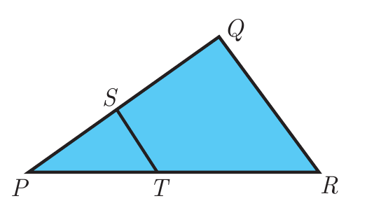

   (அ) $25:4$ &emsp; (ஆ) $25:7$ &emsp; (இ) $25:11$ &emsp; (ஈ) $25:13$

5. இரு வடிவொத்த முக்கோணங்கள் $\triangle ABC$ மற்றும் $\triangle PQR$-யின் சுற்றளவுகள் முறையே $36$ செ.மீ மற்றும் $24$ செ.மீ ஆகும். $PQ=10$ செ.மீ எனில், $AB$-யின் நீளம்

   (அ) $6\dfrac{2}{3}$ செ.மீ &emsp; (ஆ) $\dfrac{10\sqrt{6}}{3}$ செ.மீ &emsp; (இ) $66\dfrac{2}{3}$ செ.மீ &emsp; (ஈ) $15$ செ.மீ

6. $\triangle ABC$-யில் $DE \parallel BC$. $AB=3.6$ செ.மீ, $AC=2.4$ செ.மீ மற்றும் $AD=2.1$ செ.மீ எனில், $AE$-யின் நீளம்

   (அ) $1.4$ செ.மீ &emsp; (ஆ) $1.8$ செ.மீ &emsp; (இ) $1.2$ செ.மீ &emsp; (ஈ) $1.05$ செ.மீ

7. $\triangle ABC$-யில் $AD$ ஆனது, $\angle BAC$-யின் இருசமவெட்டி. $AB=8$ செ.மீ, $BD=6$ செ.மீ மற்றும் $DC=3$ செ.மீ எனில், பக்கம் $AC$-யின் நீளம்

   (அ) $6$ செ.மீ &emsp; (ஆ) $4$ செ.மீ &emsp; (இ) $3$ செ.மீ &emsp; (ஈ) $8$ செ.மீ

8. கொடுக்கப்பட்ட படத்தில் $\angle BAC=90^\circ$ மற்றும் $AD \perp BC$ எனில்,

   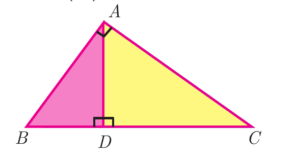

   (அ) $BD\cdot CD=BC^2$ &emsp; (ஆ) $AB\cdot AC=BC^2$ &emsp; (இ) $BD\cdot CD=AD^2$ &emsp; (ஈ) $AB\cdot AC=AD^2$

9. $6$ மீ மற்றும் $11$ மீ உயரமுள்ள இரு கம்பங்கள் சமதளத் தரையில் செங்குத்தாக உள்ளன. அவற்றின் அடிகளுக்கு இடையேயுள்ள தொலைவு $12$ மீ எனில் அவற்றின் உச்சிகளுக்கு இடையே உள்ள தொலைவு என்ன?

   (அ) $13$ மீ &emsp; (ஆ) $14$ மீ &emsp; (இ) $15$ மீ &emsp; (ஈ) $12.8$ மீ

10. கொடுக்கப்பட்ட படத்தில், $PR=26$ செ.மீ, $QR=24$ செ.மீ, $\angle PAQ=90^\circ$, $PA=6$ செ.மீ மற்றும் $QA=8$ செ.மீ எனில் $\angle PQR$-ஐக் காண்க.

    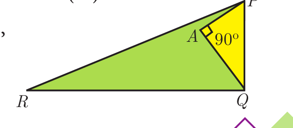

    (அ) $80^\circ$ &emsp; (ஆ) $85^\circ$ &emsp; (இ) $75^\circ$ &emsp; (ஈ) $90^\circ$

11. வட்டத்தின் தொடுகோடும் அதன் ஆரமும் செங்குத்தாக அமையும் இடம்

    (அ) மையம் &emsp; (ஆ) தொடு புள்ளி &emsp; (இ) முடிவிலி &emsp; (ஈ) நாண்

12. வட்டத்தின் வெளிப்புறப் புள்ளியிலிருந்து வட்டத்திற்கு எத்தனை தொடுகோடுகள் வரையலாம்?

    (அ) ஒன்று &emsp; (ஆ) இரண்டு &emsp; (இ) முடிவற்ற எண்ணிக்கை &emsp; (ஈ) பூஜ்ஜியம்

13. $O$-வை மையமாக உடைய வட்டத்திற்கு, வெளியேயுள்ள புள்ளி $P$-யிலிருந்து வரையப்பட்ட தொடுகோடுகள் $PA$ மற்றும் $PB$ ஆகும். $\angle APB=70^\circ$ எனில், $\angle AOB$-யின் மதிப்பு

    (அ) $100^\circ$ &emsp; (ஆ) $110^\circ$ &emsp; (இ) $120^\circ$ &emsp; (ஈ) $130^\circ$

14. படத்தில் $O$-வை மையமாக உடைய வட்டத்தின் தொடுகோடுகள் $CP$ மற்றும் $CQ$ ஆகும். $ARB$ ஆனது வட்டத்தின் மீதுள்ள புள்ளி $R$ வழியாகச் செல்லும் மற்றொரு தொடுகோடு ஆகும். $CP=11$ செ.மீ மற்றும் $BC=7$ செ.மீ எனில், $BR$-யின் நீளம்

    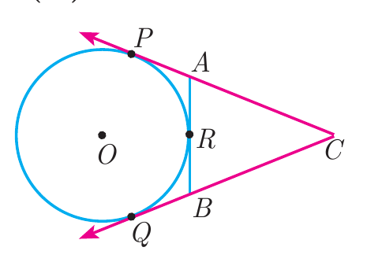

    (அ) $6$ செ.மீ &emsp; (ஆ) $5$ செ.மீ &emsp; (இ) $8$ செ.மீ &emsp; (ஈ) $4$ செ.மீ

15. படத்தில் உள்ளவாறு $O$-வை மையமாகக் கொண்ட வட்டத்தின் தொடுகோடு $PR$ எனில், $\angle POQ$ ஆனது

    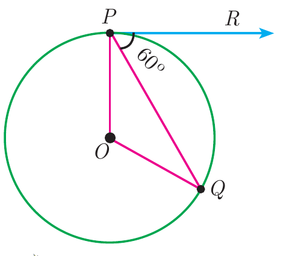

    (அ) $120^\circ$ &emsp; (ஆ) $100^\circ$ &emsp; (இ) $110^\circ$ &emsp; (ஈ) $90^\circ$

## அலகு பயிற்சி - 4

1. கொடுக்கப்பட்ட படத்தில் $BD \perp AC$ மற்றும் $CE \perp AB$, எனில்

   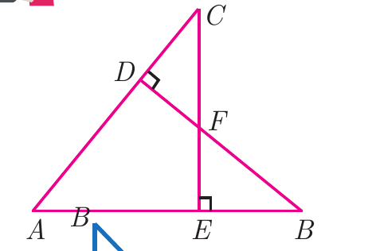

   (i) $\triangle AEC \sim \triangle ADB$ &emsp; (ii) $\dfrac{CA}{AB}=\dfrac{CE}{DB}$ என நிரூபிக்கவும்.

2. கொடுக்கப்பட்ட படத்தில் $AB \parallel CD \parallel EF$. $AB=6$ செ.மீ, $CD=x$ செ.மீ, $EF=4$ செ.மீ, $BD=5$ செ.மீ மற்றும் $DE=y$ செ.மீ எனில், $x$ மற்றும் $y$-யின் மதிப்பு காண்க.

   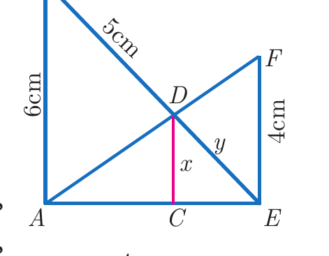

3. $O$ ஆனது முக்கோணம் $ABC$-யின் உள்ளே அமைந்த ஒரு புள்ளி ஆகும். $\angle AOB$, $\angle BOC$ மற்றும் $\angle COA$-யின் இருசமவெட்டிகள், பக்கங்கள் $AB$, $BC$ மற்றும் $CA$-வை முறையே $D$, $E$ மற்றும் $F$-ல் சந்திக்கின்றன எனில், $AD\times BE\times CF=DB\times EC\times FA$ எனக் காட்டுக.

4. கொடுக்கப்பட்ட முக்கோணம் $ABC$-யில் $AB=AC$ ஆகும். $AD=AE$ என இருக்குமாறு $D$ மற்றும் $E$ என்ற புள்ளிகள் முறையே பக்கங்கள் $AB$ மற்றும் $AC$-யின் மீது அமைந்துள்ளன. $B$, $C$, $E$ மற்றும் $D$ என்ற புள்ளிகள் ஒரே வட்டத்தில் அமையும் எனக் காட்டுக.

   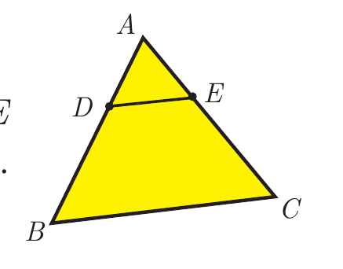

5. இரண்டு தொடர்வண்டிகள் ஒரே நேரத்தில் ஒரு தொடர்வண்டி நிலையத்திலிருந்து புறப்படுகின்றன. முதல் வண்டி மேற்கு நோக்கியும், இரண்டாவது வண்டி வடக்கு நோக்கியும் செல்கின்றன. முதல் தொடர்வண்டி $20$ கி.மீ/மணி வேகத்திலும், இரண்டாவது வண்டி $30$ கி.மீ/மணி வேகத்திலும் செல்கின்றன. $2$ மணி நேரத்திற்குப் பின்னர் அவைகளுக்கு இடையேயுள்ள தொலைவை எவ்வளவு?

6. $BC$-யின் மையப்புள்ளி $D$ மற்றும் $AE \perp BC$. $BC=a$, $AC=b$, $AB=c$, $ED=x$, $AD=p$ மற்றும் $AE=h$ எனில்,

   (i) $b^2=p^2+ax+\dfrac{a^2}{4}$ &emsp; (ii) $c^2=p^2-ax+\dfrac{a^2}{4}$ &emsp; (iii) $b^2+c^2=2p^2+\dfrac{a^2}{2}$ என நிரூபிக்க.

7. $2$ மீ உயரமுள்ள ஒரு மனிதன் மரத்தின் உயரத்தைக் கணக்கிட விரும்புகிறார். மரத்தின் அடியிலிருந்து $20$ மீ தொலைவில் $B$ என்ற புள்ளியில் ஒரு கண்ணாடி கிடமட்டமாக மேல் நோக்கி வைக்கப்படுகிறது. கண்ணாடியிலிருந்து $4$ மீ தொலைவில் $C$ என்ற புள்ளியில் நிற்கும் மனிதர் மரத்தின் உச்சியின் பிரதிபலிப்பைக் கண்ணாடியில் காண முடிகிறார் எனில், மரத்தின் உயரத்தைக் காண்க. (மரத்தின் அடி, கண்ணாடி, மனிதர் ஒரே நேர்க்கோட்டில் உள்ளதாகக் கொள்க.)

8. $30$ அடி உயரமுள்ள ஒரு தூணின் அடிப்பகுதியிலிருந்து $8$ அடி உயரமுள்ள ஒரு ஈமு கோழி விலகி நடந்து செல்கிறது. ஈமு கோழியின் நிழல் அது நடந்து செல்லும் திசையில் அதற்கு முன் விழுகிறது. ஈமு கோழியின் நிழலின் நீளத்திற்கும், தூணிலிருந்து இருக்கும் தொலைவிற்கும் இடையே உள்ள தொடர்பைக் காண்க.

9. $A$ மற்றும் $B$ என்ற புள்ளிகளில் இரு வட்டங்கள் வெட்டிக்கொள்கின்றன. ஒரு வட்டத்தின் மீதுள்ள புள்ளி $P$-யிலிருந்து வரையப்படும் $PAC$ மற்றும் $PBD$ என்ற கோடுகள் இரண்டாவது வட்டத்தினை முறையே $C$ மற்றும் $D$-யில் வெட்டுகின்றன எனில், $CD$-யானது $P$ வழியே வரையப்படும் தொடுகோட்டிற்கு இணை என நிரூபிக்கவும்.

10. $ABC$ என்ற ஒரு முக்கோணத்தின் பக்கங்கள் $AB$, $BC$, $AC$-யின் (அல்லது பக்கங்களின் நீட்சி) மீது முறையே $D$, $E$, $F$ என்ற புள்ளிகள் உள்ளன. $AD:DB=5:3$, $BE:EC=3:2$ மற்றும் $AC=21$ எனில், கோடுத்துண்டு $CF$-யின் நீளம் காண்க.

## நினைவில் கொள்ள வேண்டியவை

- இரு முக்கோணங்கள் வடிவொத்தவை எனில்,

  (i) அவற்றின் ஒத்த கோணங்கள் சமம்.

  (ii) அவற்றின் ஒத்த பக்கங்கள் சம விகிதத்தில் இருக்கும்.

- சர்வச் சம முக்கோணங்கள் அனைத்தும் வடிவொத்தவை. ஆனால் இதன் மறுதலை உண்மை இல்லை.
- $AA$ வடிவொத்த விதிமுறையானது $AAA$ வடிவொத்த விதிமுறை ஆகும்.
- ஒரு முக்கோணத்தின் ஒரு கோணம் மற்றொரு முக்கோணத்தின் ஒரு கோணத்திற்குச் சமமாகவும், அவ்விரு முக்கோணங்களிலும் அக்கோணங்களை உள்ளடக்கிய ஒத்த பக்கங்கள் விகிதச் சமத்திலும் இருந்தால், அவ்விரு முக்கோணங்கள் வடிவொத்தவை ஆகும். (SAS)
- இரு முக்கோணங்களில், ஒத்த பக்கங்களின் விகிதங்கள் சமமானால், இரு முக்கோணங்கள் வடிவொத்தவை. (SSS)
- இரு முக்கோணங்கள் வடிவொத்தவையாக இருப்பின், ஒத்த பக்கங்களின் விகிதம் அவற்றின் ஒத்த சுற்றளவுகளின் விகிதத்திற்குச் சமம்.
- இரு வடிவொத்த முக்கோணங்களின் பரப்பளவுகளின் விகிதம் அவற்றின் ஒத்த பக்கங்களின் வர்க்கங்களின் விகிதத்திற்குச் சமம்.
- வட்டத்தின் ஏதேனும் ஒரு புள்ளியில் வரையப்பட்ட தொடுகோடு, தொடுபுள்ளி வழிச் செல்லும் ஆரத்திற்குச் செங்குத்தாக அமையும்.
- வட்டத்திற்கு வெளியே அமைந்த புள்ளியிலிருந்து வட்டத்திற்கு இரண்டு தொடுகோடுகள் வரையலாம்.
- வெளிப்புறப் புள்ளியிலிருந்து வட்டத்திற்கு வரையப்பட்ட இரு தொடுகோடுகளின் நீளங்கள் சமம்.
- வட்டங்களுக்கு வரையப்பட்ட இரண்டு பொதுவான தொடுகோடுகளின் நீளங்கள் சமம்

## இணையச் செயல்பாடு (ICT)

### ICT 4.1

**படி 1:** கீழ்க்காணும் உரலி / விரைவுக் குறியீட்டைப் பயன்படுத்தி "Geometry" பக்கத்திற்குச் செல்க. "Angular bisector theorem" எனும் பயிற்சித் தாளை தேர்வு செய்க.

**படி 2:** பயிற்சித் தாளில், புள்ளிகளை மாற்றுவதன் மூலம் முக்கோணம் $ABC$ மற்றும் கோணம் $C$-யின் இருசமவெட்டி $CD$ ஆகியவற்றில் ஏற்படும் மாற்றங்களைக் காண்க. இடப்புறத்தில் உள்ள விகிதங்கள் மூலம் தேற்றத்தைப் புரிந்து கொள்ளலாம்.

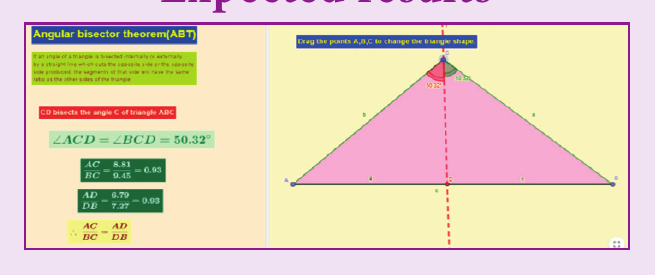

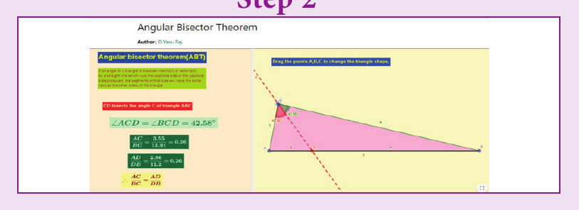

### ICT 4.2

**படி 1:** கீழ்க்காணும் உரலி / விரைவுக் குறியீட்டை பயன்படுத்தி "Geometry" பக்கத்திற்குச் செல்க. "Pair of Tangents" எனும் பயிற்சித் தாளை தேர்வு செய்க.

**படி 2:** பயிற்சித் தாளில் ஆரம் மற்றும் தொடுகோடுகளின் நீளங்களில் ஏற்படும் மாற்றங்களைக் காண்க.

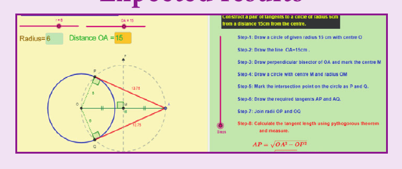

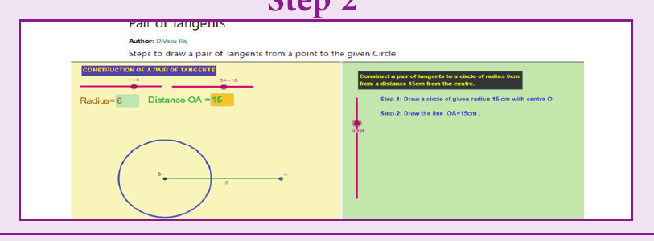

இந்தப் படிகளைக் கொண்டு மற்ற செயல்பாடுகளைச் செய்க.

[https://www.geogebra.org/m/jfr2zzgy#chapter/356194](https://www.geogebra.org/m/jfr2zzgy#chapter/356194)

அல்லது விரைவுக் குறியீட்டை ஸ்கேன் செய்க.

