## Chapter 7: அளவியல் (Mensuration)

எகிப்தில் உள்ள அலெக்ஸ்சாண்ட்ரியாவில் பிறந்த பாப்பஸ் மிகச் சிறந்த கிரேக்க வடிவியல் மேதையாவார். எட்டுப் புத்தகங்களில் அமைந்த "மசனகோத்" (Synagogue) எனும் கணிதத் தொகுப்பே இவரது சிறப்பான படைப்பாகும்.

நேர்வட்ட உருளை, கூம்பு, ஆரங்கள், அச்சுகள் போன்ற திண்ம வடிவங்களைப் பற்றி பாப்பஸ் விளக்குகிறார். இயற்கையும் நவீன தொழில்நுட்பமும் மேலும் கணித வடிவங்களைப் பற்றி பயன்படுத்துகின்றன.

---

## கற்றல் விளைவுகள்

* உருளை, கூம்பு, கோளம், அரைக்கோளம் மற்றும் இடைக்கண்டம் ஆகியவற்றின் புறப்பரப்பு மற்றும் கன அளவுகளைக் காணுதல்.

* இணைந்த திண்ம உருவங்களின் புறப்பரப்பு மற்றும் கன அளவுகளைக் கணக்கிடுதல்.

* திண்ம உருவங்களை அவற்றின் கனஅளவுகள் மாறாத வகையில் ஒன்றிலிருந்து மற்றொரு திண்ம உருவமாக மாற்றுதல் சார்ந்த கணக்குகளைத் தீர்த்தல்.

### 7.1 அறிமுகம் (Introduction)

அளவியலின் கருத்துகள் பண்டைய காலம் தொட்டு உலகின் அனைத்துக் கலாச்சாரங்களிலும் நடைமுறை வாழ்வியலில் பயன்பட்டுள்ளது. எடுத்துக்காட்டாக, விவசாயம் மற்றும் வணிகத் துறைகளில் முக்கிய முடிவுகள் எடுப்பதற்கு பயிரிட வேண்டிய நிலப்பரப்பு, ஒரு கலனின் கொள்ளளவு போன்ற விவரங்கள் பயன்படுத்தப்பட்டன. கணிதவியல் வல்லுநர்கள் வடிவியலை வாழ்வியல் சூழல்களில் மிகத் திறமையாகப் பயன்படுத்திப் பல கண்டுபிடிப்புகளை நிகழ்த்தினர். இதுவே அளவியலின் துவக்கப் புள்ளியாக அமைந்தது. எனவே பயன்பாட்டு வடிவியலை அளவியல் எனக் கருதலாம்.

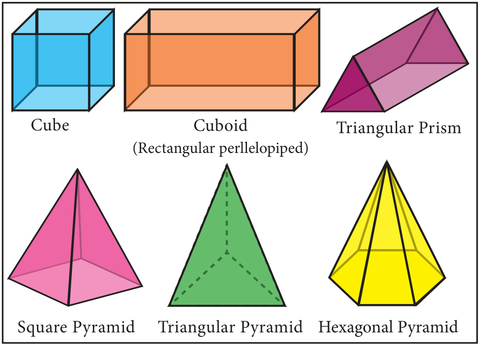

சதுரம், செவ்வகம், முக்கோணம் மற்றும் வட்டம் ஆகியவற்றின் பரப்புகளைப் பற்றி கடந்த வகுப்புகளில் கற்றுள்ளோம். இவைகள் தள உருவங்கள் ஆகும். எனவே, இவைகளை இருபரிமாண உருவங்கள் என்கிறோம். நாம் நடைமுறை வாழ்வில் காணும் பல பொருட்களை ஒரு தளத்தில் குறிக்க இயலாது. அன்றாடம் நாம் காணும் உருவங்களான குழாய்கள், தண்ணீர்த் தொட்டிகள், பனிக்கட்டிக் கூழ் கூம்புகள், கால்பந்துகள் போன்றவை திண்ம உருவங்களாகும். இவைகளை முப்பரிமாண உருவங்கள் என அழைக்கிறோம்.

கனச்சதுரம், கனச்செவ்வகம், முப்பட்டகம் மற்றும் பிரமிடு போன்ற முப்பரிமாண உருவங்களுக்குப் புறப்பரப்பு மற்றும் கன அளவு போன்ற அளவீடுகள் உண்டு.

இப்பாடப் பகுதியில் உருளை, கூம்பு, கோளம், அரைக்கோளம் மற்றும் இடைக்கண்டம் ஆகிய முப்பரிமாண உருவங்களின் புறப்பரப்பு மற்றும் கனஅளவு பற்றி விரிவாக அறியலாம்.

### 7.2 புறப்பரப்பு (Surface Area)

ஒரு திண்ம உருவத்தின் அனைத்து வெளிப்புறப் பகுதிகளின் பரப்பு அதன் புறப்பரப்பு எனப்படும்.

#### 7.2.1 நேர் வட்ட உருளை (Right Circular Cylinder)

படம் 7.2-ல் தரப்பட்ட உருவங்களை அடையாளம் காண்க.

கொடுக்கப்பட்ட உருவங்கள் ஓர் உருளையின் வடிவத்தை ஒத்துள்ளன.

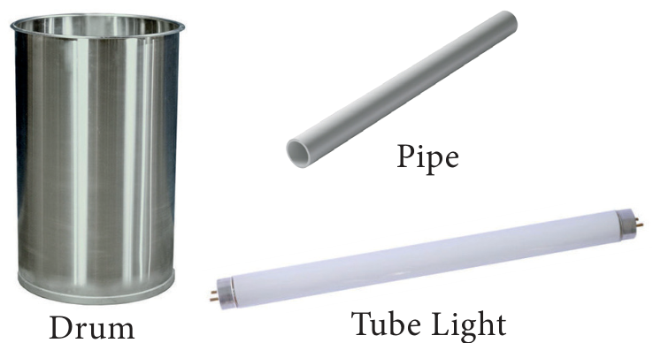

> **வரையறை** : ஒரு செவ்வகத்தை அதன் ஏதேனும் ஒரு பக்கத்தை அச்சாகக் கொண்டு ஒரு முழுச்சுற்று சுழற்றும்போது உண்டாகும் திண்ம உருவம் நேர்வட்ட உருளை எனப்படும்.

உருளையின் அச்சானது அதன் ஆரத்துக்குச் செங்குத்தாக இருப்பின் அது நேர்வட்ட உருளை (Right Circular Cylinder) ஆகும்.

(படம் 7.3-ல்), உயரம் $AB = h$ மற்றும் ஆரம் $AD = r$.

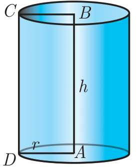

இரு தள வட்டப் பரப்புகளாலும் ஒரு வளைபரப்பாலும் உருவாக்கப்படுவது ஒரு திண்ம உருளை எனப்படும். இரு வட்டங்களுக்கு இடைப்பட்ட பகுதியை "மேற்பரப்பு" அல்லது "வளைபரப்பு" எனலாம்.

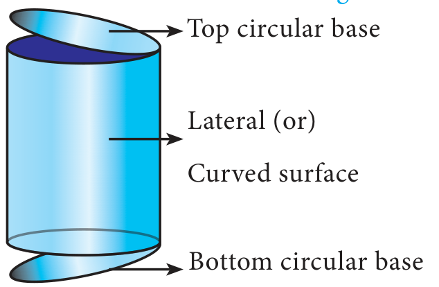

**நேர்வட்ட உருளை உருவாக்கம் – செயல் விளக்கம். (Formation of a Right Circular Cylinder – Demonstration)**

(i) நீளம் $l$ மற்றும் அகலம் $b$ உடைய செவ்வகத் தாளை எடுத்துக்கொள்க.

(ii) அகலப் பக்கங்கள் ($b$) இரண்டும் இணையுமாறு செவ்வகத் தாளைச் சுழற்றி மடிக்க (மேற்பொருந்தாதவாறு).

(iii) அடிச்சுற்றளவு $l$ மற்றும் உயரம் $b$ உடைய ஒரு நேர்வட்ட உருளை கிடைக்கிறது

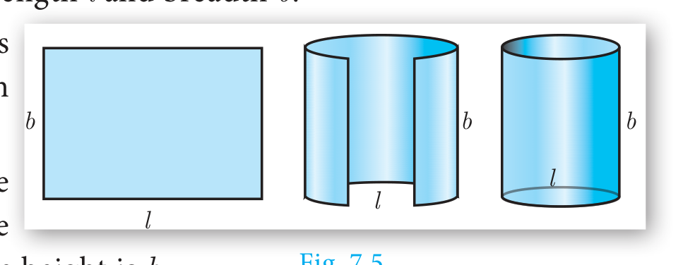

**நேர்வட்ட உருளையின் புறப்பரப்பு (Surface Area of a Right Circular Cylinder)**

**(i) வளைபரப்பு (Curved Surface Area)**

நேர் வட்ட உருளையின் வளைபரப்பு $=$ செவ்வகத்தின் பரப்பு

$$= l \times b$$
$$= 2\pi r \times h \qquad (\text{இங்கு, } l \text{ என்பது அடிப்பகுத்தின் சுற்றளவு, } b \text{ என்பது உயரம். படம் } 7.5\text{-ஐ பார்க்க})$$
$$= 2\pi rh$$

$$\boxed{\text{உருளையின் வளைபரப்பு} = 2\pi rh \text{ சதுர அலகுகள்}}$$

**(ii) மொத்தப் புறப்பரப்பு (Total Surface Area)**

மொத்தப் புறப்பரப்பு என்பது ஒரு திண்ம உருளையின் வளைபரப்போடு, அதன் அடிப்பக்க மற்றும் மேற்பக்க வட்டப் பரப்புகளைக் கூட்டக் கிடைப்பதாகும்.

அதாவது, நேர்வட்ட உருளையின் மொத்தப் புறப்பரப்பு

$$= \text{வளைபரப்பு} + \text{மேல்வட்டத்தின் பரப்பு} + \text{கீழ் வட்டத்தின் பரப்பு}$$
$$= 2\pi rh + \pi r^2 + \pi r^2 \qquad (\text{படம். } 7.4 \text{-ஐ பார்க்க})$$
$$= 2\pi rh + 2\pi r^2$$
$$= 2\pi r(h + r)$$

$$\boxed{\text{உருளையின் மொத்தப் புறப்பரப்பு} = 2\pi r(h + r) \text{ ச. அ}}$$

> **குறிப்பு**
> - மதிப்புக் கொடுக்கப்படாத போது $\pi$–யின் தோராய மதிப்பை $\pi = \dfrac{22}{7}$ எனக் கொள்க.
> - புறப்பரப்பு / மேற்பரப்பு எனும் சொல் மொத்தப் புறப்பரப்பைக் குறிக்கும்.

**எடுத்துக்காட்டு 7.1** ஓர் உருளை வடிவப் பீப்பாயின் உயரம் $20$ செ.மீ மற்றும் அடிப்புற ஆரம் $14$ செ.மீ எனில், அதன் வளைபரப்பு மற்றும் மொத்தப் புறப்பரப்பைக் காண்க.

**தீர்வு** $r$ மற்றும் $h$ என்பன முறையே உருளையின் ஆரம் மற்றும் உயரம் எனக்.

இங்கு, $h = 20$ செ.மீ ; $r = 14$ செ.மீ

$$\text{உருளையின் வளைபரப்பு} = 2\pi rh \text{ ச. அ}$$
$$= 2 \times \dfrac{22}{7} \times 14 \times 20 = 2 \times 22 \times 2 \times 20 = 1760 \text{ செ.மீ}^2$$

$$\text{உருளையின் மொத்தப் புறப்பரப்பு} = 2\pi r(h + r) \text{ ச. அ}$$
$$= 2 \times \dfrac{22}{7} \times 14 \times (20 + 14) = 2 \times \dfrac{22}{7} \times 14 \times 34$$
$$= 2992 \text{ செ.மீ}^2$$

ஆகவே, உருளையின் வளைபரப்பு $= 1760$ செ.மீ$^2$, மொத்தப் புறப்பரப்பு $= 2992$ செ.மீ$^2$

**எடுத்துக்காட்டு 7.2** $88$ ச. செ.மீ வளைபரப்புடைய ஒரு நேர்வட்ட உருளையின் உயரம் $14$ செ.மீ எனில், உருளையின் விட்டம் காண்க.

**தீர்வு** $r$ மற்றும் $h$ என்பன முறையே திண்ம நேர்வட்ட உருளையின் ஆரம் மற்றும் உயரம் எனக்.

இங்கு, உருளையின் வளைபரப்பு $= 88$ ச. செ.மீ

$$2\pi rh = 88$$
$$2 \times \dfrac{22}{7} \times r \times 14 = 88 \qquad (\text{உயரம் } h = 14 \text{ செ.மீ})$$
$$2r = \dfrac{88 \times 7}{22 \times 14} = 2$$

ஆகவே, உருளையின் விட்டம் $= 2$ செ.மீ

**எடுத்துக்காட்டு 7.3** நீளம் $3$ மீ மற்றும் விட்டம் $2.8$ மீ உடைய ஒரு சமன்படுத்தும் உருளையைக் கொண்டு ஒரு தோட்டம் சமன்படுத்தப் படுகிறது. $8$ சுற்றுகளில் எவ்வளவு பரப்பை உருளை சமன் செய்யும்?

**தீர்வு**

விட்டம் $d = 2.8$ மீ, உயரம் $h = 3$ மீ, ஆரம் $r = 1.4$ மீ

$$\text{உருளை ஒரு சுற்றில் சமன்படுத்தும் பரப்பு} = \text{சமன் படுத்தும் உருளையின் வளைபரப்பு}$$
$$= 2\pi rh \text{ ச. அ}$$
$$= 2 \times \dfrac{22}{7} \times 1.4 \times 3 = 26.4$$

உருளை ஒரு சுற்றில் சமன்படுத்தும் பரப்பு $= 26.4$ ச.மீ

ஆகவே, $8$ சுற்றுகளில் சமன்படுத்தப்படும் மொத்தப் பரப்பு $= 8 \times 26.4 = 211.2$

எனவே, உருளை சமன் படுத்தும் பரப்பு $211.2$ மீ$^2$ ஆகும்.

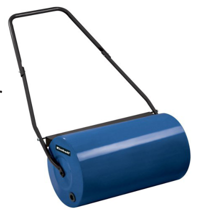

**சிந்தனைக் களம்**

1. ஓர் அலகு தடிமனும், $r$ அலகுகள் ஆரமும் கொண்ட $h$ வட்ட வில்லைகளை ஒன்றின் மீது ஒன்றாக அடுக்கும்போது தோன்றும் திண்ம உருவத்தின் வடிவம் என்ன? அதன் வளைபரப்பைக் காண்க.
2. ஓர் உருளையின் ஆரம் அதன் உயரத்தின் இரு மடங்கு எனில், வளைபரப்பிற்கும் அடிப்புறப் பரப்பிற்கும் உள்ள தொடர்புகளைக் காண்க.
3. $12$ மீ நீளமும், $5$ மீ அகலமும் கொண்ட இரண்டு செவ்வக வடிவ அலுமினியத் தாள்களை, ஒன்று நீளத்தை அடிப்படையாகக் கொண்டும், மற்றொன்று அகலத்தை அடிப்படையாகக் கொண்டும் சுழற்றுவதன் மூலம் இரு நேர்வட்ட உருளைகள் உருவாக்கப்படுகின்றன எனில் அவற்றின் வளைப்பரப்புகளுக்கு இடையே உள்ள விகிதத்தைக் காண்க.

#### 7.2.2 உள்ளீடற்ற உருளை (Hollow Cylinder)

சம உயரமும் வேறுபட்ட ஆரமும் கொண்ட இணை அச்சு (co-axial) உருளைகளுக்கு இடைப்பட்ட வெளி உள்ளீடற்ற உருளை ஆகும்.

$R$ மற்றும் $r$ என்பன உருளையின் வெளிப்புறம் மற்றும் உட்புற ஆரம் எனக். $h$ என்பது உருளையின் உயரம் எனக்.

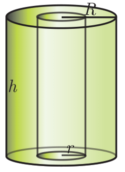

உள்ளீடற்ற உருளையின் வளைபரப்பு $=$ உருளையின் வெளிப்புற வளைபரப்பு $+$ உருளையின் உட்புற வளைபரப்பு.

$$= 2\pi Rh + 2\pi rh$$

$$\boxed{\text{உள்ளீடற்ற உருளையின் வளைபரப்பு} = 2\pi(R + r)h \text{ ச. அ.}}$$

உள்ளீடற்ற உருளையின் மொத்தப்புறப்பரப்பு $=$ வளைபரப்பு $+$ மேற்புற மற்றும் கீழ்புற வட்டப் பாதைகளின் பரப்பு

$$= 2\pi(R + r)h + 2\pi(R^2 - r^2)$$

$$\boxed{\text{உள்ளீடற்ற உருளையின் மொத்தப் புறப்பரப்பு} = 2\pi(R + r)(R - r + h) \text{ ச. அ.}}$$

**எடுத்துக்காட்டு 7.4** தடிமன் $2$ மீ, உட்புற ஆரம் $6$ மீ மற்றும் உயரம் $25$ மீ உடைய ஓர் உருளை வடிவச் சுரங்கப்பாதையின் உள் மற்றும் வெளிப்புறப் பரப்புகளுக்கு வர்ணம் பூசப்படுகிறது. ஒரு லிட்டர் வர்ணத்தைக் கொண்டு $10$ ச.மீ பூச முடியுமானால், சுரங்கப்பாதைக்கு வர்ணம் பூச எத்தனை லிட்டர் வர்ணம் தேவை?

**தீர்வு** $h, r$ மற்றும் $R$ என்பன முறையே உள்ளீடற்ற உருளையின் உயரம், உட்புற ஆரம் மற்றும் வெளிப்புற ஆரம் எனக்.

இங்கு, உயரம் $h = 25$ மீ; தடிமன் $= 2$ மீ.

உட்புற ஆரம் $r = 6$ மீ

தற்போது, வெளிப்புற ஆரம் $R = 6 + 2 = 8$ மீ

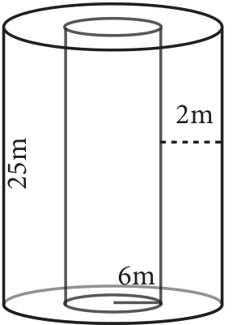

$$\text{சுரங்கப்பாதையின் வளைபரப்பு} = \text{உள்ளீடற்ற உருளையின் வளைபரப்பு}$$
$$= 2\pi(R + r)h \text{ ச.அ}$$
$$= 2 \times \dfrac{22}{7}(8 + 6) \times 25$$

எனவே, சுரங்கப்பாதையின் வளைபரப்பு $= 2200$ ச.மீ

ஒரு லிட்டர் வர்ணம் பூசக்கூடிய பரப்பு $= 10$ ச.மீ

$$\text{எனவே, தேவைப்படும் வர்ணம்} = \dfrac{2200}{10} = 220 \text{ லி.}$$

ஆகவே, சுரங்கப்பாதைக்கு வர்ணம் பூச $220$ லிட்டர் வர்ணம் தேவைப்படும்.

**முன்னேற்றச் சோதனை**

1. ஒரு __________ ஐ, அதன் __________ மைய அச்சாக கொண்டு சுழற்றுவதன் மூலம் ஒரு திண்ம நேர்வட்ட உருளையைப் பெறலாம்.
2. ஒரு நேர்வட்ட உருளையின் அச்சு அதன் விட்டத்திற்கு __________ அமையும்.
3. ஒரு நேர்வட்ட உருளையின் மொத்தப்புறப்பரப்பு மற்றும் வளைபரப்பிற்கிடையே உள்ள வித்தியாசம் __________ ஆகும்.
4. சமமான ஆரமும் உயரமும் கொண்ட ஒரு நேர்வட்ட உருளையின் வளைபரப்பு அதன் அடிப்பரப்பைப்போல் __________ ஆக இருக்கும்.

#### 7.2.3 நேர்வட்டக் கூம்பு (Right Circular Cone)

படம் 7.9-ல் கொடுக்கப்பட்ட உருவங்கள் உற்று நோக்கி வடிவங்களின் அடையாளம் காண்க.

கொடுக்கப்பட்ட உருவங்கள் ஒரு கூம்பின் வடிவத்தை ஒத்துள்ளன.

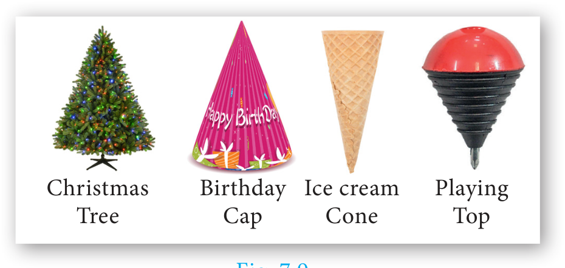

> **வரையறை** : செங்கோணத்தைத் தாங்கும் ஏதேனும் ஒரு பக்கத்தை மைய அச்சாகக் கொண்டு செங்கோண முக்கோணத்தை முழுச்சுற்று சுழற்றும்போது உண்டாகும் திண்ம உருவம் நேர்வட்டக் கூம்பு எனப்படும்.

**நேர்வட்டக் கூம்பு உருவாக்கம் – செயல் விளக்கம்**

படம் 7.10 -ல் $ABC$ ஒரு செங்கோண முக்கோணம் ஆகும். இம்முக்கோணமானது $AB$ என்ற பக்கத்தை அச்சாக கொண்டு ஒரு முழுச்சுற்று சுழற்றப்படுகிறது. இச்சுழற்சியானது, படத்தில் உள்ளவாறு ஒரு நேர்வட்டக் கூம்பை உருவாக்குகிறது. இங்கு அச்சு $AB$ கூம்பின் உயரம் எனவும், கர்ணம் $AC$ கூம்பின் சாயுயரம் எனவும் அழைக்கப்படும்.

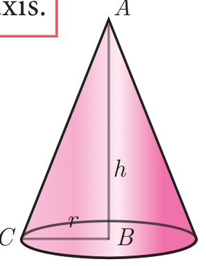

**நேர்வட்டக் கூம்பின் புறப்பரப்பு**

படத்தில் காட்டியவாறு கூம்பின் மேற்பரப்பை சாயுயரம் $AC$ வழியாக வெட்டினால் $ACD$ என்ற வட்டக்கோணப் பகுதி கிடைக்கிறது. வட்டக்கோணப் பகுதியின் ஆரம் $AC$ என்பது கூம்பின் சாயுயரம் ஆகவும் வட்டக்கோணப் பகுதியின் வில் $DC$ கூம்பின் அடிச்சுற்றளவாகவும் கிடைக்கப்பெறும்.

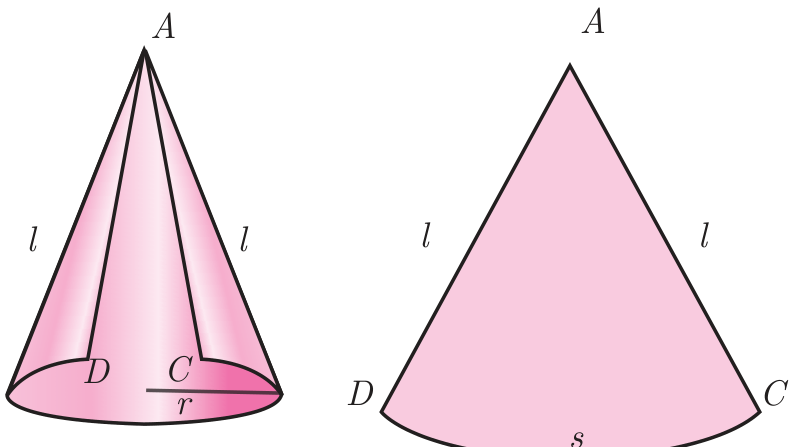

இங்கு, வில்லின் நீளம் '$s$' மற்றும் ஆரம் '$l$' உடைய வட்டக்கோணப் பகுதியும், '$l$' ஆரம் கொண்ட வட்டமும் வடிவத்தகையவாகும்.

**(i) வளைபரப்பு (Curved surface area)**

$$\dfrac{\text{வட்டக்கோணப் பகுதியின் பரப்பு}}{\text{வட்டத்தின் பரப்பு}} = \dfrac{\text{வட்டக்கோணப் பகுதியின் வில்லின் நீளம்}}{\text{வட்டத்தின் சுற்றளவு}}$$

$$\text{வட்டக்கோணப்பகுதியின் பரப்பு} = \dfrac{\text{வட்டக்கோணப்பகுதியின் வில்லின் நீளம்}}{\text{வட்டத்தின் சுற்றளவு}} \times \text{வட்டத்தின் பரப்பு}$$

$$= \dfrac{s}{2\pi l} \times \pi l^2 = \dfrac{s}{2} \times l = \dfrac{2\pi r}{2} \times l \qquad (\text{ஏனெனில் } s = 2\pi r)$$

மேலும் கூம்பின் வளைபரப்பு $=$ வட்டக்கோணப் பகுதியின் பரப்பு $= \pi rl$ ச. அ.

$$\boxed{\text{நேர்வட்டக் கூம்பின் வளைபரப்பு} = \pi rl \text{ ச. அ}}$$

**சிந்தனைக் களம்**

1. நீங்கள் அன்றாடம் பயன்படுத்தும் திண்ம கூம்பு வடிவப் பொருட்கள் சிலவற்றைக் குறிப்பிடுக.
2. சம ஆரத்தையும், உயரத்தையும் கொண்ட ஒரு கூம்பின் புறப்பரப்பை ஆரத்தின் வழியே எழுது.
3. மேலே கூறப்பட்ட பரப்பைக் கூம்பின் அடிப்புறப் பரப்புடன் ஒப்பிடு.

**செயல்பாடு 1**

(i) $7$ செ.மீ ஆரமுள்ள ஓர் அரைவட்ட வடிவத்தாளை ஒரு கூம்பாக மாற்றுக. கூம்பின் வளைபரப்பைக் காண்க.

(ii) $3.5$ செ.மீ ஆரமுள்ள ஒரு கால் வட்ட வடிவத்தாளை ஒரு கூம்பாக மாற்றுக. கூம்பின் வளைபரப்பைக் காண்க.

**சாயுயரம் '$l$' –ஐ தருவித்தல் (Derivation of Slant Height '$l$')**

$ABC$ என்ற செங்கோண முக்கோணத்தில் கோணம் $B$ என்பது செங்கோணம் ஆகும். '$l$', '$r$' மற்றும் '$h$' என்பன முறையே முக்கோணத்தின் கர்ணம், அடிப்பக்கம் மற்றும் உயரம் எனக்.

தற்போது, முக்கோணம் $ABC$ -ல் பித்தாகரஸ் தேற்றத்தின்படி,

$$AC^2 = AB^2 + BC^2$$
$$l^2 = h^2 + r^2$$
$$l = \sqrt{h^2 + r^2} \text{ அலகுகள்}$$

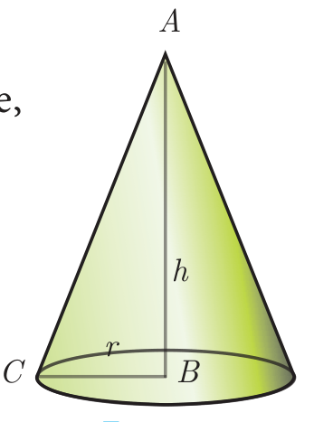

**மொத்தப் புறப்பரப்பு (Total surface area)**

கூம்பின் மொத்தப் புறப்பரப்பு $=$ கூம்பின் வளைபரப்பு $+$ கூம்பின் அடிப்பரப்பு

$$= \pi rl + \pi r^2 \qquad (\text{ஏனெனில் கூம்பின் அடிப்பகுதி ஒரு வட்டமாகும்})$$

$$\boxed{\text{நேர்வட்டக் கூம்பின் மொத்தப்புறப்பரப்பு} = \pi r(l + r) \text{ ச. அ}}$$

**எடுத்துக்காட்டு 7.5** கித்தானைக் கொண்டு $7$ மீ ஆரமும் $24$ மீ உயரமும் உடைய ஒரு கூம்பு வடிவக் கூடாரம் உருவாக்கப்படுகிறது. செவ்வக வடிவக் கித்தானின் அகலம் $4$ மீ எனில், அதன் நீளம் காண்க.

**தீர்வு** $r$ மற்றும் $h$ என்பன முறையே கூம்பின் ஆரம் மற்றும் உயரம் எனக்.

இங்கு, ஆரம் $r = 7$ மீ, உயரம் $h = 24$ மீ

தற்போது, $l = \sqrt{r^2 + h^2}$

$$= \sqrt{49 + 576}$$
$$l = \sqrt{625} = 25 \text{ மீ}$$

கூம்பின் வளைபரப்பு $= \pi rl$ ச.அ $= \dfrac{22}{7} \times 7 \times 25 = 550$ மீ$^2$

மேலும், கூம்பின் வளைபரப்பு $=$ கித்தானின் பரப்பு

$$\text{கித்தானின் நீளம்} = \dfrac{\text{கித்தானின் பரப்பு}}{\text{கித்தானின் அகலம்}} = \dfrac{550}{4} = 137.5 \text{ மீ}$$

ஆகவே, கித்தானின் நீளம் $137.5$ மீ ஆகும்.

**எடுத்துக்காட்டு 7.6** $704$ ச.செ.மீ மொத்தப் புறப்பரப்பு கொண்ட ஒரு கூம்பின் ஆரம் $7$ செ.மீ எனில், அதன் சாயுயரம் காண்க.

**தீர்வு** கூம்பின் ஆரம் $r = 7$ செ.மீ

$$\text{கூம்பின் மொத்தப் புறப்பரப்பு} = \pi r(l + r) \text{ ச. அ}$$
$$\text{மொத்தப் புறப்பரப்பு} = 704 \text{ ச. செ.மீ}$$
$$704 = \dfrac{22}{7} \times 7(l + 7)$$
$$32 = l + 7 \Rightarrow l = 25 \text{ செ.மீ.}$$

ஆகவே, கூம்பின் சாயுயரம் $25$ செ.மீ. ஆகும்.

**எடுத்துக்காட்டு 7.7** $2.4$ செ.மீ உயரமுள்ள ஒரு திண்ம உருளையின் விட்டம் $1.4$ செ.மீ ஆகும். உருளையினுள் அதே ஆரமுள்ள கூம்பு வடிவக் குழிவு (படம் 7.13) உருளையின் உயரத்திற்கு ஏற்படுத்தப்படுகிறது எனில், மீதமுள்ள திண்மத்தின் மொத்தப் புறப்பரப்பு காண்க.

**தீர்வு** $h$ மற்றும் $r$ என்பன கூம்பு மற்றும் உருளை ஆகியவற்றின் உயரம் மற்றும் ஆரம் எனக்.

$l$ என்பது கூம்பின் சாயுயரம் எனக்.

இங்கு, $h = 2.4$ செ.மீ, $d = 1.4$ செ.மீ ; $r = 0.7$ செ.மீ

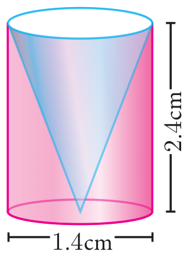

$$\text{மீதமுள்ள திண்மத்தின் மொத்தப் புறப்பரப்பு} = \text{உருளையின் வளைபரப்பு} + \text{கூம்பின் வளைபரப்பு} + \text{அடிப்பரப்பு}$$
$$= 2\pi rh + \pi rl + \pi r^2 \text{ ச. அ.}$$

தற்போது, $l = \sqrt{r^2 + h^2} = \sqrt{0.49 + 5.76} = \sqrt{6.25} = 2.5$ செ.மீ

$$l = 2.5 \text{ செ.மீ}$$

$$\text{மீதமுள்ள திண்மத்தின் மொத்தப் புறப்பரப்பு} = \pi r(2h + l + r) \text{ ச. அ.}$$
$$= \dfrac{22}{7} \times 0.7 \times \left[(2 \times 2.4) + 2.5 + 0.7\right]$$
$$= 17.6$$

ஆகவே, மீதமுள்ள திண்மத்தின் மொத்தப் புறப்பரப்பு $17.6$ ச. செ.மீ ஆகும்.

**முன்னேற்றச் சோதனை**

1. ஒரு __________, அதன் __________ மைய அச்சாகக் கொண்டு சுழற்றுவதன் மூலம் ஒரு திண்ம நேர்வட்டக் கூம்பினைப் பெறலாம்.
2. ஒரு நேர்வட்டக் கூம்பின் அச்சு அதன் விட்டத்துக்கு __________ அமையும்.
3. ஒரு கூம்பின் வளைபரப்பு மற்றும் மொத்தப் புறப்பரப்பு ஆகியவற்றின் வித்தியாசம் __________.
4. ஒரு வட்டக்கோணப்பகுதி கூம்பாக மாறும்போது ஏற்படும் மாற்றங்களைச் சரியாகப் பொருத்துக.

| வட்டக்கோணப் பகுதி | கூம்பு |
|---|---|
| ஆரம் | அடிப்புறச் சுற்றளவு |
| பரப்பு | சாயுயரம் |
| வில்லின் நீளம் | வளைபரப்பு |

#### 7.2.4 கோளம் (Sphere)

> **வரையறை** : ஓர் அரைவட்டத்தை அதன் விட்டத்தை அச்சாகக் கொண்டு ஒரு முழுச்சுற்று சுழற்றும்போது உண்டாகும் திண்ம உருவம் கோளம் ஆகும்.

ஒரு கோளத்தை எங்குக் குறுக்காக வெட்டினாலும் ஒரு வட்டம் கிடைக்கும். ஒரு கோள மையத்தின் வழியாகச் செல்லும் ஒரு தளக் குறுக்குவெட்டு மீப்பெரு வட்டமாகும். மற்ற தளக் குறுக்கு வெட்டுகள் சிறிய வட்டங்களாகும்.

படத்தில் உள்ளவாறு $CD$-ஐ விட்டமாகக் கொண்ட வட்டம் மீப்பெரு வட்டம் மற்றும் $QR$-ஐ விட்டமாகக் கொண்ட வட்டம் சிறிய வட்டமாகும்

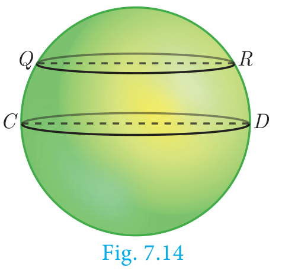

**கோளத்தின் புறப்பரப்பு (Surface area of a sphere)**

**ஆர்க்கிமெடிஸ் நிரூபணம்**

ஒரு கோளம் அதன் விட்டத்திற்குச் சமமான உயரம் உள்ள உருளையினுள் படத்தில் காட்டியுள்ளவாறு வைக்கப்படுகிறது.

கோளத்தின் புறப்பரப்பு உருளையின் வளைபரப்புக்குச் சம என ஆர்க்கிமெடிஸ் நிறுவினார்.

எனவே, கோளத்தின் புறப்பரப்பு $=$ உருளையின் வளைபரப்பு

$$= 2\pi rh$$
$$= 2\pi r(2r)$$

$$\boxed{\text{கோளத்தின் புறப்பரப்பு} = 4\pi r^2 \text{ ச. அ .}}$$

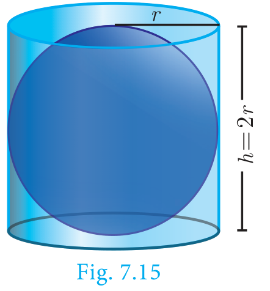

**செயல்பாடு 2**

(i) '$r$'–ஐ ஆரமாகக் கொண்ட ஒரு கோளத்தை எடுத்துக்கொள்க.

(ii) '$r$' ஆரமும், '$2r$' உயரமும் கொண்ட ஓர் உருளையை எடுத்துக்கொள்க.

(iii) கோளம் மற்றும் உருளையின் முழுப் புறப்பரப்பையும் ஒரு சீரான நூலால் இடைவெளியின்றியும் ஒன்றின்மீது ஒன்றாக இல்லாமலும் சுற்றுக.

(iv) சுற்றுவதற்குப் பயன்படுத்தப்பட்ட நூலின் நீளங்களை அளந்து ஒப்பிடுக.

(v) கோளத்தின் புறப்பரப்பைக் காண மேற்கண்ட கருத்தைப் பயன்படுத்துக.

#### 7.2.5 அரைக்கோளம் (Hemisphere)

ஒரு திண்மக் கோளத்தை அதன் ஏதேனும் ஒரு மீப்பெரு வட்டம் வழியாக ஒரு தளம் வெட்டும்போது கிடைக்கும் கோளத்தின் ஒரு பகுதி அரைக்கோளம் எனப்படும்.

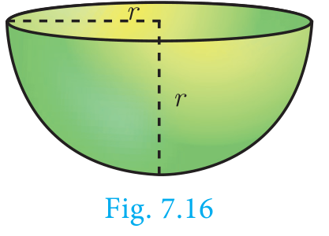

கோளத்தின் சரிபாதியை ஓர் அரைக்கோளம் என்கிறோம்.

ஆகவே, அரைக்கோளத்தின் வளைபரப்பு $= \dfrac{\text{கோளத்தின் வளைபரப்பு}}{2} = \dfrac{4\pi r^2}{2}$

$$\boxed{\text{அரைக்கோளத்தின் வளைபரப்பு} = 2\pi r^2 \text{ ச. அ.}}$$

மேலும், அரைக்கோளத்தின் மொத்தப் புறப்பரப்பு $=$ வளைபரப்பு $+$ மேல்வட்டத்தின் பரப்பு

$$= 2\pi r^2 + \pi r^2$$

$$\boxed{\text{அரைக்கோளத்தின் மொத்தப் புறப்பரப்பு} = 3\pi r^2 \text{ ச. அ.}}$$

#### 7.2.6 உள்ளீடற்ற அரைக்கோளம் (Hollow Hemisphere)

$r$ என்பது உட்புற ஆரம் எனக். $R$ என்பது வெளிப்புற ஆரம் எனக்

எனவே, தடிமன் $= R - r$

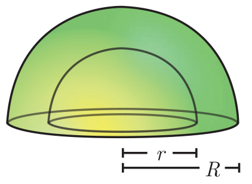

ஆகவே, வளைபரப்பு $=$ அரைக்கோளத்தின் வெளிப்புறப் பரப்பு $+$ அரைக்கோளத்தின் உட்புறப் பரப்பு

$$= 2\pi R^2 + 2\pi r^2$$

$$\boxed{\text{உள்ளீடற்ற அரைக்கோளத்தின் வளைபரப்பு} = 2\pi(R^2 + r^2) \text{ ச. அ.}}$$

மொத்தப் புறப்பரப்பு $=$ வளைபரப்பு $+$ வளையத்தின் பரப்பு

$$= 2\pi(R^2 + r^2) + \pi(R^2 - r^2)$$

$$= \pi\left[2R^2 + 2r^2 + R^2 - r^2\right]$$

$$\boxed{\text{உள்ளீடற்ற அரைக்கோளத்தின் மொத்தப் புறப்பரப்பு} = \pi(3R^2 + r^2) \text{ ச. அ.}}$$

**எடுத்துக்காட்டு 7.8** ஒரு கோளத்தின் புறப்பரப்பு $154$ ச. மீ எனில், அதன் விட்டம் காண்க.

**தீர்வு** கோளத்தின் ஆரம் '$r$' எனக்.

கோளத்தின் புறப்பரப்பு $= 154$ ச. மீ

$$4\pi r^2 = 154$$
$$4 \times \dfrac{22}{7} \times r^2 = 154$$
$$r^2 = 154 \times \dfrac{1}{4} \times \dfrac{7}{22}$$

எனவே, $r^2 = \dfrac{49}{4} \Rightarrow r = \dfrac{7}{2}$

ஆகவே, விட்டம் $7$ மீ ஆகும்.

**செயல்பாடு 3**

உலக உருண்டையின், வட மற்றும் தென் அரைக்கோளப் பகுதிகளில் தலா இரு நாடுகளின் பெயர்களைக் குறிக்க.

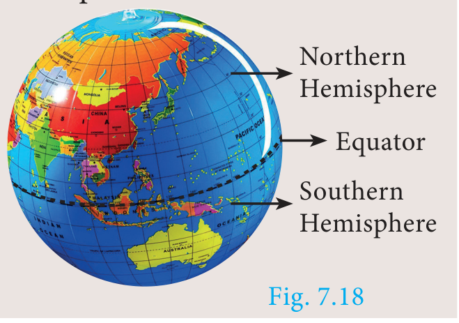

**எடுத்துக்காட்டு 7.9** ஒரு கோள வடிவ வளிக்கூண்டினுள் (balloon) காற்று உந்தப்படும்போது அதன் ஆரம் $12$ செ.மீ–லிருந்து $16$ செ.மீ ஆக உயருகிறது. இரு புறப்பரப்புகளின் விகிதம் காண்க.

**தீர்வு** $r_1$ மற்றும் $r_2$ என்பன வளிக்கூண்டுகளின் ஆரங்கள் எனக்.

இங்கு, $\dfrac{r_1}{r_2} = \dfrac{12}{16} = \dfrac{3}{4}$

எனவே, புறப்பரப்புகளின் விகிதம் $= \dfrac{4\pi r_1^2}{4\pi r_2^2} = \dfrac{r_1^2}{r_2^2} = \left(\dfrac{r_1}{r_2}\right)^2 = \left(\dfrac{3}{4}\right)^2 = \dfrac{9}{16}$

ஆகவே, புறப்பரப்புகளின் விகிதம் $9:16$ ஆகும்.

**சிந்தனைக் களம்**

1. ஒரு கோளத்தின் புறப்பரப்பு $36\pi$ ச. அலகுகள் எனில், ஆரத்தின் மதிப்பைக் காண்க.
2. ஒரு கோளத்தில் எத்தனை மீப்பெரு வட்டங்கள் உள்ளன?
3. பூமியின் விட்டம் $12756$ கி.மீ எனில், அதன் புறப்பரப்பைக் காண்க.

**முன்னேற்றச் சோதனை**

1. கோளத்தின் ஒவ்வொரு தளக் குறுக்கு வெட்டும், ஒரு __________ ஆகும்.
2. மீப்பெரு வட்டத்தின் மையப்புள்ளி, கோளத்தின் __________ ஆகும்.
3. ஓர் அரைக் கோளத்தின் மொத்தப் புறப்பரப்பிற்கும் வளைபரப்பிற்கும் இடையேயான வித்தியாசம் __________ ஆகும்.
4. ஒரு கோளத்தின் புறப்பரப்பு மற்றும் அரைக் கோளத்தின் வளைபரப்பு ஆகியவற்றின் விகிதமானது __________.
5. ஒரு கோளத்தை அதன் மீப்பெரு வட்டம் வழியாக ஒரு தளம் வெட்டும்போது கிடைக்கும் ஒரு பகுதியை __________ என்கிறோம்.

**எடுத்துக்காட்டு 7.10** ஒரு திண்ம அரைக்கோளத்தின் அடிப்பரப்பு $1386$ ச. மீ எனில், அதன் மொத்தப் புறப்பரப்பைக் காண்க.

**தீர்வு** $r$ என்பது அரைக்கோளத்தின் ஆரம் எனக்.

இங்கு, அடிப்பரப்பு $= \pi r^2$ ச. அ. $= 1386$ ச. மீ.

அரைக்கோளத்தின் மொத்தப் பரப்பு $= 3\pi r^2$ ச. அ.

$$= 3 \times 1386 = 4158$$

ஆகவே, அரைக்கோளத்தின் மொத்தப் புறப்பரப்பு $4158$ ச.மீ ஆகும்.

> **குறிப்பு** : உள்ளீடற்ற கோளத்தின் வளைபரப்பு மற்றும் மொத்தப் பரப்புக் காண, கோளத்தின் புறப்பரப்பு காணும் சூத்திரத்தை பயன்படுத்தலாம்.

**சிந்தனைக் களம்**

1. ஒரு கோளத்தை அதன் சிறிய வட்டம் வழியே ஒரு தளத்தைக் கொண்டு வெட்டும்போது அரைக்கோளம் கிடைக்குமா?
2. ஓர் அரைக்கோளத்தின் மொத்தப் புறப்பரப்பு, அதன் அடிப்பரப்பின் எத்தனை மடங்காகும்?
3. ஒரு கோளத்திலிருந்து எத்தனை அரைக்கோளங்கள் கிடைக்கும்?

**எடுத்துக்காட்டு 7.11** ஓர் உள்ளீடற்ற அரைக்கோள ஓட்டின் உள் மற்றும் வெளிப்புற ஆரங்கள் முறையே $3$ மீ மற்றும் $5$ மீ ஆகும். ஓட்டின் மொத்தப் புறப்பரப்பு மற்றும் வளைபரப்பைக் காண்க.

**தீர்வு** ஓட்டின் உள் மற்றும் வெளிப்புற ஆரங்கள் முறையே, $r$ மற்றும் $R$ எனக்.

இங்கு, $R = 5$ மீ, $r = 3$ மீ

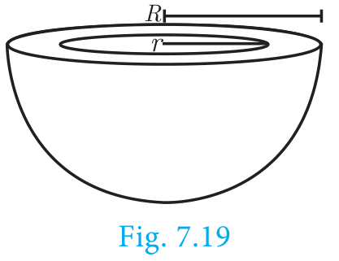

$$\text{உள்ளீடற்ற அரைக்கோளத்தின் வளைபரப்பு} = 2\pi(R^2 + r^2) \text{ ச.அ}$$
$$= 2 \times \dfrac{22}{7} \times (25 + 9) = 213.71$$

$$\text{உள்ளீடற்ற அரைக்கோளத்தின் மொத்தப் புறப்பரப்பு} = \pi(3R^2 + r^2) \text{ ச.அ}$$
$$= \dfrac{22}{7}(75 + 9) = 264$$

ஆகவே, வளைபரப்பு $213.71$ ச. மீ மற்றும் மொத்தப் புறப்பரப்பு $264$ ச. மீ ஆகும்.

**எடுத்துக்காட்டு 7.12**

ஒரு கோளம், உருளை மற்றும் கூம்பு ஆகியவற்றின் ஆரங்கள் சமம். படம் 7.20-ல் உள்ளபடி கூம்பு மற்றும் உருளையின் உயரங்கள் ஆரத்திற்குச் சம்மெனில், அவற்றின் வளைபரப்புகளின் விகிதம் காண்க.

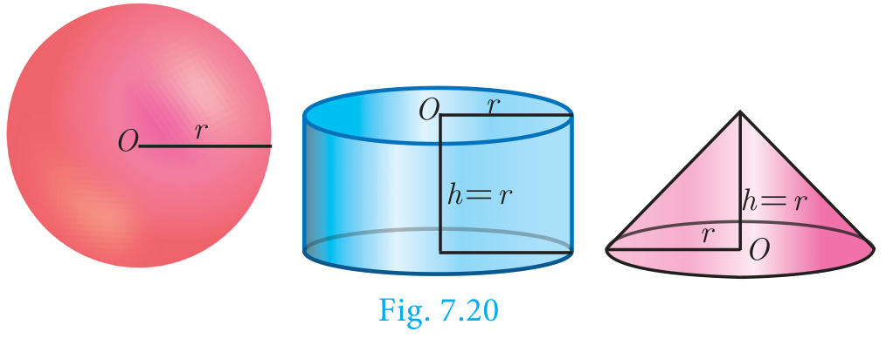

**தீர்வு** இங்கு, தேவையான விகிதம்

$=$ கோளத்தின் வளைபரப்பு : உருளையின் வளைபரப்பு : கூம்பின் வளைபரப்பு

$$= 4\pi r^2 : 2\pi rh : \pi rl, \qquad \left(l = \sqrt{r^2 + h^2} = \sqrt{2r^2} = \sqrt{2}r\right)$$
$$= 4\pi r^2 : 2\pi r^2 : \pi r\sqrt{2}\,r$$
$$= 4\pi r^2 : 2\pi r^2 : \sqrt{2}\pi r^2$$
$$= 4 : 2 : \sqrt{2} = 2\sqrt{2} : \sqrt{2} : 1$$

#### 7.2.7 ஒரு நேர்வட்டக் கூம்பின் இடைக்கண்டம் (Frustum of a Right Circular Cone)

கடந்த காலங்களில், தீ விடுத்து ஏற்படும்போது நீர் / மண் நிரப்பப்பட்ட (படம் 7.21(i)) கூம்பு வடிவத் தீயணைப்பு வாளிகள் பயன்படுத்தப்பட்டன. பின்னர் அவற்றின் வடிவம் படம் 7.21(ii)-ல் உள்ளவாறு மாற்றப்பட்டு அதிக கொள்ளளவு கொண்டதாக மாற்றம் பெற்றது.

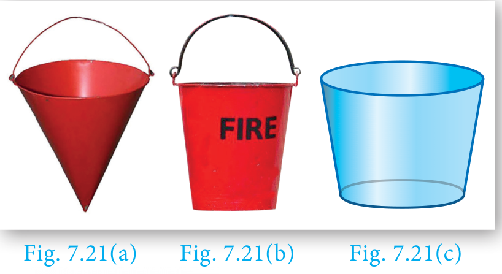

வாளியை ஒத்த வடிவம் கொண்ட படம் 7.21(iii)-ல் உள்ள உருவத்தை ஒரு கூம்பின் இடைக்கண்டம் என்றழைக்கிறோம். நாம் தினமும் பயன்படுத்தும் கண்ணாடி டம்ளர், வாளி மற்றும் சாலைக்கூம்பு (road cone) ஆகியவை இடைக்கண்டத்துக்கான சில உதாரணங்களும் ஆகும் (படம் 7.22).

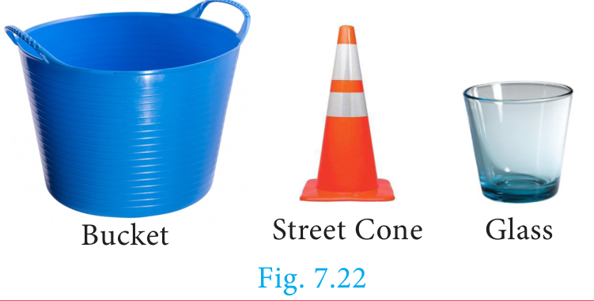

> **வரையறை** : $ABC$ என்ற கூம்பை அதன் அடிப்பகுதிக்கு இணையாக ஒரு தளம் வெட்டும்போது அதன் வெட்டு தளத்திற்கும் அடிப்புறத்திற்கும் இடைப்பட்ட $DECB$ என்னும் பகுதியைக் கூம்பின் இடைக்கண்டம் என்கிறோம்.

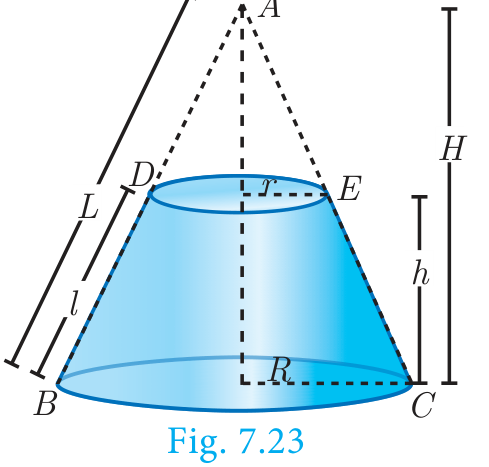

**இடைக்கண்டத்தின் புறப்பரப்பு (Surface area of a Frustum)**

$R$ மற்றும் $r$ என்பன முறையே இடைக்கண்டம் $DECB$-ன் கீழ் மற்றும் மேற்புற ஆரங்கள் எனக். மேலும், $h$ மற்றும் $l$ ஆகியவை முறையே அதன் உயரம் மற்றும் சாயுயரம் எனக்.

எனவே, இடைக்கண்டத்தின் வளைபரப்பு

$$= \dfrac{1}{2} (\text{மேல் மற்றும் கீழ் வட்டங்களின் சுற்றளவுகளின் கூடுதல}) \times \text{சாயுயரம்}$$
$$= \dfrac{1}{2}(2\pi R + 2\pi r)l$$

$$\boxed{\text{இடைக்கண்டத்தின் வளைபரப்பு} = \pi(R + r)l \text{ ச. அ.}} \qquad \text{இங்கு, } l = \sqrt{h^2 + (R - r)^2}$$

மேலும், இடைக்கண்டத்தின் மொத்தப் புறப்பரப்பு $=$ இடைக்கண்டத்தின் வளைபரப்பு $+$ மேல் வட்டப்பரப்பு $+$ கீழ் வட்டப்பரப்பு.

$$\boxed{\text{இடைக்கண்டத்தின் மொத்தப் புறப்பரப்பு} = \pi(R + r)l + \pi R^2 + \pi r^2 \text{ ச. அ.}} \qquad \text{இங்கு, } l = \sqrt{h^2 + (R - r)^2}$$

**எடுத்துக்காட்டு 7.13** ஒரு கூம்பின் இடைக்கண்டச் சாயுயரம் $5$ செ.மீ ஆகும். அதன் இரு ஆரங்கள் $4$ செ.மீ மற்றும் $1$ செ.மீ எனில், இடைக்கண்டத்தின் வளைபரப்பைக் காண்க.

**தீர்வு** $l, R$ மற்றும் $r$ ஆகியவை முறையே இடைக்கண்டத்தின் சாயுயரம், மேற்புற மற்றும் கீழ்ப்புற ஆரங்கள் எனக்.

இங்கு, $l = 5$ செ.மீ, $R = 4$ செ.மீ, $r = 1$ செ.மீ

$$\text{இடைக்கண்டத்தின் வளைபரப்பு} = \pi(R + r)l \text{ ச. அ}$$
$$= \dfrac{22}{7} \times (4 + 1) \times 5$$
$$= \dfrac{550}{7}$$

ஆகவே, இடைக்கண்டத்தின் வளைபரப்பு $= 78.57$ ச. செ.மீ

**சிந்தனைக் களம்**

1. கூம்பின் இடைக்கண்ட வடிவிலான ஏதேனும் இரு பொருட்களைக் குறிப்பிடுக.
2. ஓர் அரைக்கோளத்தைக் கோளத்தின் இடைக்கண்டமாகக் கருத முடியுமா?

**எடுத்துக்காட்டு 7.14** ஒரு தொழிற்சாலையின் உலோக வாளி, கூம்பின் இடைக்கண்ட வடிவில் உள்ளது. அதன் மேற்புற, அடிப்புற விட்டங்கள் முறையே $10$ மீ மற்றும் $4$ மீ ஆகும். அதன் உயரம் $4$ மீ எனில், இடைக்கண்டத்தின் வளைபரப்பு மற்றும் மொத்தப் புறப்பரப்பைக் காண்க.

**தீர்வு** $h, l, R$ மற்றும் $r$ என்பன முறையே இடைக்கண்டத்தின் உயரம், சாயுயரம், மேற்புற மற்றும் அடிப்புற வட்டத்தின் ஆரங்கள் எனக்.

இங்கு, மேல் விட்டம் $= 10$ மீ, $R = 5$ மீ; கீழ் விட்டம் $= 4$ மீ, $r = 2$ மீ; உயரம் $h = 4$ மீ

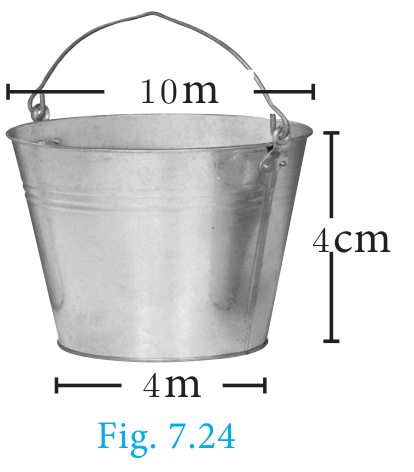

$$\text{சாயுயரம், } l = \sqrt{h^2 + (R - r)^2}$$
$$= \sqrt{4^2 + (5 - 2)^2}$$
$$l = \sqrt{16 + 9} = \sqrt{25} = 5 \text{ மீ}$$

$$\text{வளைபரப்பு} = \pi(R + r)l \text{ ச.அ}$$
$$= \dfrac{22}{7}(5 + 2) \times 5 = 110 \text{ மீ}^2$$

$$\text{மொத்தப் புறப்பரப்பு} = \pi(R + r)l + \pi r^2 \text{ ச.அ}$$
$$= \dfrac{22}{7}\left[(5 + 2)5 + 4\right] = \dfrac{858}{7} = 122.57$$

ஆகவே, வளைபரப்பு $= 110$ மீ$^2$ மற்றும் மொத்தப் புறப்பரப்பு $= 122.57$ மீ$^2$

**முன்னேற்றச் சோதனை**

1. இரு இணை தாங்கால் வெட்டப்படும் கூம்பின் ஒரு பகுதியை __________ எனலாம்.
2. ஒரு நேர்வட்டக் கூம்பில் எத்தனை இடைக்கண்டங்கள் உள்ளன?

### பயிற்சி 7.1

1. ஓர் உருளையின் ஆரம் மற்றும் உயரங்களின் விகிதம் $5:7$ ஆகும். அதன் வளைபரப்பு $5500$ ச. செ.மீ எனில், உருளையின் ஆரம் மற்றும் உயரம் காண்க.
2. ஓர் திண்ம இரும்பு உருளையின் மொத்தப் புறப்பரப்பு $1848$ ச. செ.மீ. மேலும் அதன் வளைபரப்பு, மொத்தப் புறப்பரப்பில் ஆறில் ஐந்து பங்காகும் எனில், இரும்பு உருளையின் ஆரம் மற்றும் உயரம் காணவும்.
3. ஓர் உள்ளீடற்ற மர உருளையின் வெளிப்புற ஆரம் மற்றும் நீளம் முறையே $16$ செ.மீ மற்றும் $13$ செ.மீ ஆகும். அதன் தடிமன் $4$ செ.மீ எனில் உருளையின் மொத்தப் புறப்பரப்பு எவ்வளவு?
4. $PQR$ என்ற செங்கோண முக்கோணத்தில் $QR = 16$ செ.மீ, $PR = 20$ செ.மீ மற்றும் $\angle Q = 90^\circ$ ஆகும். $QR$ மற்றும் $PQ$-ஐ மைய அச்சுகளாகக்கொண்டு சுழற்றும்போது உருவாகும் கூம்புகளின் வளைபரப்புகளை ஒப்பிடுக.
5. சாயுயரம் $19$ மீ கொண்ட கூம்பு வடிவக் கூடாரத்தில் நால்வர் உள்ளனர். ஒருவருக்கு $22$ ச. மீ பரப்பு தேவை எனில், கூடாரத்தின் உயரத்தைக் கணக்கிடவும்.
6. ஒரு சிறுமி தனது பிறந்த நாளைக் கொண்டாடக் கூம்பு வடிவத் தொப்பிகளை $5720$ ச. செ.மீ பரப்புள்ள காகிதத்தாளை பயன்படுத்தி தயாரிக்கிறாள். $5$ செ.மீ ஆரமும், $12$ செ.மீ உயரமும் கொண்ட எத்தனை தொப்பிகள் தயாரிக்க முடியும்?
7. சம உயரங்களையுடைய இரு நேர் வட்டக் கூம்புகளின் ஆரங்கள் $1:3$ என்ற விகிதத்தில் உள்ளன. கூம்புகளின் உயரம் சிறிய கூம்பின் ஆரத்தின் மூன்று மடங்கு எனில், வளைபரப்புகளின் விகிதம் காண்க.
8. ஒரு கோளத்தின் ஆரம் $25\%$ அதிகரிக்கும்போது, அதிகமாகும் புறப்பரப்பின் சதவீதம் காண்க.
9. உள்ளீற்ற ஓர் அரைக்கோள வடிவக் கிண்ணத்திற்கு ஒரு சதுர செ.மீ-க்கு வர்ணம் பூச ₹ $0.14$ வீதம் செலவாகும். அதன் உட்புற மற்றும் வெளிப்புற விட்டங்கள் முறையே $20$ செ.மீ மற்றும் $28$ செ.மீ எனில், அதனை முழுமையாக வர்ணம் பூச எவ்வளவு செலவாகும்?
10. ஒரு மேஜை விளக்கின் வெளிப்புறத்திற்கு (மேல்புகுதியுடன்) மட்டும் வர்ணம் பூசப்படுகிறது. 1 ச. செ.மீ வர்ணம் பூச ₹2 செலவாகுமெனில், விளக்கிற்கு வர்ணம் பூசுவதற்கான மொத்தச் செலவைக் கணக்கிடுக.

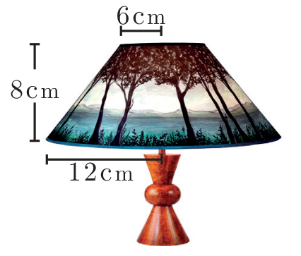

### 7.3 கன அளவு (Volume)

இதுவரை உருளை, கூம்பு, கோளம், அரைக்கோளம் மற்றும் இடைக்கண்டம் ஆகியவற்றின் புறப்பரப்புகள் பற்றி விவாதித்தோம். இனி அந்தத் திண்மங்களின் கன அளவுகள் பற்றி காண்போம்.

ஒரு பொருள் ஆக்கிரமித்துள்ள வெளியின் அளவே அதன் கன அளவு எனப்படும். கன அளவை 'கன அலகுகள்' எனும் அலகில் கணக்கிடுவோம்.

#### 7.3.1 ஒரு திண்ம நேர்வட்ட உருளையின் கன அளவு (Volume of a Solid Right Circular Cylinder)

'$r$' அலகுகள் ஆரமும், '$h$' அலகுகள் உயரமும் கொண்ட ஒரு நேர்வட்ட உருளையின் கன அளவு

$$V = (\text{அடிப்பரப்பு}) \times (\text{உயரம்}) = \pi r^2 \times h = \pi r^2 h \text{ க. அ}$$

எனவே, $\boxed{\text{உருளையின் கன அளவு} = \pi r^2 h \text{ க. அ}}$

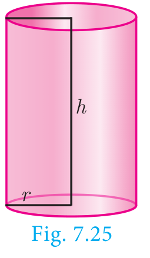

#### 7.3.2 உள்ளீடற்ற உருளையின் கன அளவு (பயன்படுத்தப்பட்ட பொருளின் கன அளவு) (Volume of a Hollow Cylinder)

$R$ மற்றும் $r$ என்பன முறையே உள்ளீடற்ற உருளையின் வெளி மற்றும் உள் ஆரங்கள் எனக். மேலும் $h$ என்பது உருளையின் உயரம் எனக்.

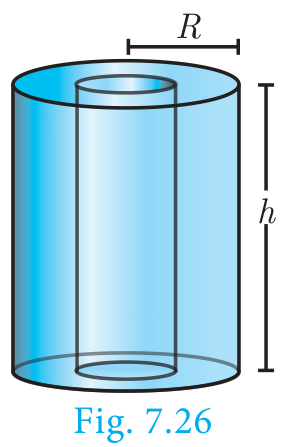

கன அளவு $V = (\text{வெளி உருளையின் கன அளவு}) - (\text{உள் உருளையின் கன அளவு})$

$$V = \pi R^2 h - \pi r^2 h = \pi(R^2 - r^2)h$$

$$\boxed{\text{உள்ளீடற்ற உருளையின் கனஅளவு} = \pi(R^2 - r^2)h \text{ க. அ}}$$

**எடுத்துக்காட்டு 7.15** உயரம் $2$ மீ மற்றும் அடிப்பரப்பு $250$ ச.மீ கொண்ட ஓர் உருளையின் கனஅளவைக் காண்க.

**தீர்வு** உருளையின் ஆரம் மற்றும் உயரம் முறையே $r$ மற்றும் $h$ எனக்.

இங்கு, உயரம் $h = 2$ மீ, அடிப்பரப்பு $= 250$ ச.மீ

$$\text{உருளையின் கனஅளவு} = \pi r^2 h = \text{அடிப்பரப்பு} \times h$$
$$= 250 \times 2 = 500 \text{ மீ}^3$$

எனவே, உருளையின் கனஅளவு $= 500$ க.மீ

**சிந்தனைக் களம்**

1. ஓர் உருளையின் உயரம் அதன் ஆரத்தின் வர்க்கத்தோடு எதிர் விகிதத் தொடர்பு உடையது எனில், அதன் கன அளவு __________ ஆகும்.
2. '$r$' ஆரமும் '$h$' உயரமும் உடைய ஒரு உருளையின் கன அளவை, அதன் (அ) ஆரம் பாதியாகும்போது காண்க. (ஆ) உயரம் பாதியாகும்போது காண்க.

**எடுத்துக்காட்டு 7.16** ஓர் உருளை வடிவ தண்ணீர் தொட்டியின் கன அளவு $1.078 \times 10^6$ லிட்டர் ஆகும். தொட்டியின் விட்டம் $7$ மீ எனில், அதன் உயரம் காண்க.

**தீர்வு** $r$ மற்றும் $h$ என்பன முறையே உருளையின் ஆரம் மற்றும் உயரம் எனக்.

தொட்டியின் கனஅளவு $= 1.078 \times 10^6 = 1078000$ லிட்டர்

$$= 1078 \text{ மீ}^3 \qquad (\text{ஏனெனில் } 1l = \dfrac{1}{1000} \text{ மீ}^3)$$

இங்கு, விட்டம் $= 7$ மீ எனில், ஆரம் $= \dfrac{7}{2}$ மீ

$$\text{தொட்டியின் கன அளவு} = \pi r^2 h \text{ க. அ}$$
$$1078 = \dfrac{22}{7} \times \dfrac{7}{2} \times \dfrac{7}{2} \times h$$

ஆகவே, தொட்டியின் உயரம் $28$ மீ ஆகும்.

**எடுத்துக்காட்டு 7.17** ஓர் உள்ளீடற்ற உருளையின் உயரம், உட்புற மற்றும் வெளிப்புற ஆரங்கள் முறையே $9$ செ.மீ, $21$ செ.மீ மற்றும் $28$ செ.மீ ஆகும். உருளையை உருவாக்கத் தேவைப்படும் இரும்பின் கன அளவைக் காண்க.

**தீர்வு** உள்ளீடற்ற உருளையின் உயரம், உட்புற ஆரம் மற்றும் வெளிப்புற ஆரம் முறையே $h, r$ மற்றும் $R$ எனக்.

இங்கு, $r = 21$ செ.மீ, $R = 28$ செ.மீ, $h = 9$ செ.மீ

$$\text{உள்ளீடற்ற உருளையின் கன அளவு} = \pi(R^2 - r^2)h \text{ க.அ}$$
$$= \dfrac{22}{7}(28^2 - 21^2) \times 9$$
$$= \dfrac{22}{7}(784 - 441) \times 9 = 9702$$

ஆகவே, தேவையான இரும்பின் கன அளவு $= 9702$ க. செ.மீ

**எடுத்துக்காட்டு 7.18** படம் 7.27-ல் உள்ள உருளை $A$ மற்றும் $B$-ல்

(i) எந்த உருளையின் கன அளவு அதிகமாக இருக்கும்?

(ii) அதிகக் கன அளவு கொண்ட உருளையின் மொத்தப்புறப்பரப்பு அதிகமாக இருக்குமா எனச் சோதிக்க.

(iii) உருளை A மற்றும் B–ன் கன அளவுகளின் விகிதம் காண்க.

**தீர்வு**

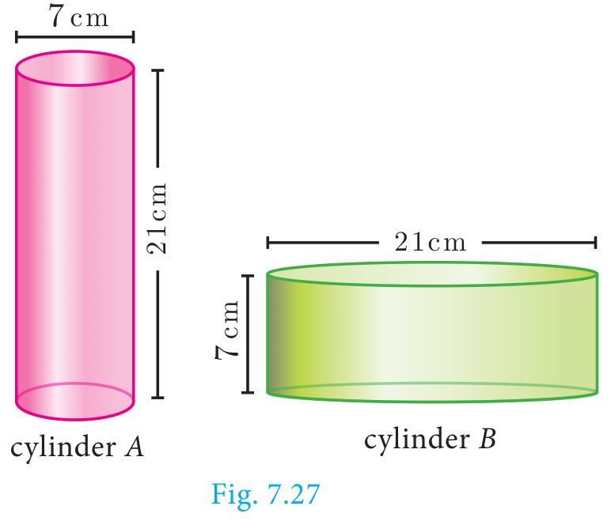

(i) உருளையின் கன அளவு $= \pi r^2 h$ க.அ

$$\text{உருளை } A \text{-ன் கனஅளவு} = \dfrac{22}{7} \times \dfrac{7}{2} \times \dfrac{7}{2} \times 21$$
$$= 808.5 \text{ செ.மீ}^3$$

$$\text{உருளை } B \text{-ன் கனஅளவு} = \dfrac{22}{7} \times \dfrac{21}{2} \times \dfrac{21}{2} \times 7$$
$$= 2425.5 \text{ செ.மீ}^3$$

ஆகவே, உருளை B–ன் கன அளவு உருளை A-ன் கன அளவை விட அதிகம் ஆகும்.

(ii) உருளையின் மொத்தப் புறப்பரப்பு $= 2\pi r(h + r)$ ச.அ

$$\text{உருளை } A \text{-ன் மொத்தப் புறப்பரப்பு} = 2 \times \dfrac{22}{7} \times \dfrac{7}{2} \times (21 + 3.5) = 539 \text{ செ.மீ}^2$$

$$\text{உருளை } B \text{-ன் மொத்தப் புறப்பரப்பு} = 2 \times \dfrac{22}{7} \times \dfrac{21}{2} \times (7 + 10.5) = 1155 \text{ செ.மீ}^2$$

ஆகவே, கன அளவு அதிகம் கொண்ட உருளை B-ன் மொத்தப் புறப்பரப்பு அதிகமாக உள்ளது.

(iii)

$$\dfrac{\text{உருளை A-ன் கனஅளவு}}{\text{உருளை B-ன் கன அளவு}} = \dfrac{808.5}{2425.5} = \dfrac{1}{3}$$

ஆகவே, உருளை $A$ மற்றும் $B$-ன் கன அளவுகளின் விகிதம் $1:3$.

#### 7.3.3 நேர்வட்டக் கூம்பின் கன அளவு (Volume of a right circular cone)

ஒரு நேர்வட்டக் கூம்பின் ஆரம் மற்றும் உயரத்தை $r$ மற்றும் $h$ என்க.

கூம்பின் கனஅளவு, $V = \dfrac{1}{3}\pi r^2 h$ க.அ

**செயல் விளக்கம்**

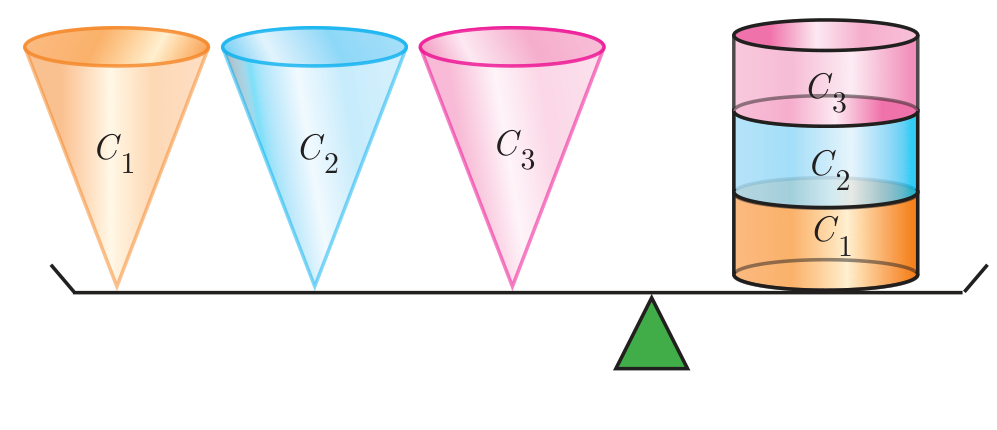

- சமஅளவு ஆரம் மற்றும் உயரம் கொண்ட ஒரு நேர்வட்ட உருளையையும், மூன்று நேர்வட்டக் கூம்புகளையும் எடுத்துக் கொள்க.
- இடப்பக்கத்தில் மூன்று கூம்புகளில் உள்ள பொருட்கள் அனைத்தும் சரியாக வலப்பக்கத்தில் இருக்கும் உருளையில் அடைபடுகிறது.

படம் 7.28-லிருந்து, $3 \times$ (ஒரு கூம்பின் கன அளவு) $=$ உருளையின் கன அளவு

$$= \pi r^2 h \text{ க.அ.}$$

$$\boxed{\text{கூம்பின் கன அளவு} = \dfrac{1}{3}\pi r^2 h \text{ க.அ.}}$$

**எடுத்துக்காட்டு 7.19** ஒரு நேர் வட்டக் கூம்பின் கன அளவு $11088$ க. செ.மீ ஆகும். கூம்பின் உயரம் $24$ செ.மீ எனில், அதன் ஆரம் காண்க.

**தீர்வு** கூம்பின் உயரம் மற்றும் ஆரம், $h$ மற்றும் $r$ என்க..

இங்கு, $h=24$ செ.மீ, கன அளவு $=11088$ க.செ.மீ

$$\dfrac{1}{3}\pi r^2 h = 11088$$
$$\dfrac{1}{3}\times\dfrac{22}{7}\times r^2 \times 24 = 11088$$
$$r^2 = 441$$

ஆகவே, கூம்பின் ஆரம் $r = 21$ செ.மீ.

> **சிந்தனைக் களம்**
>
> 1. கீழ்க்காண்பவைகள் சமமாக அமையுமாறு ஒரு நேர் வட்டக் கூம்பைக் காண முடியுமா?
>    (i) உயரம் மற்றும் சாயுயரம் &emsp; (ii) ஆரம் மற்றும் சாயுயரம் &emsp; (iii) உயரம் மற்றும் ஆரம்
> 2. இரு கூம்புகளின் கன அளவுகள் சமம் எனில், அவற்றின் ஆரம் மற்றும் உயரம் ஆகியவற்றின் விகிதம் காண்க.

**எடுத்துக்காட்டு 7.20** இரு கூம்புகளுடைய கன அளவுகளின் விகிதம் $2:3$ ஆகும். இரண்டாம் கூம்பின் உயரம் முதல் கூம்பின் உயரத்தைப் போல் இரு மடங்கு எனில், அவற்றின் ஆரங்களின் விகிதம் காண்க.

**தீர்வு** $r_1$ $h_1$ என்பன முதல் கூம்பின் ஆரம் மற்றும் உயரம் என்க. $r_2$ மற்றும் $h_2$ என்பன இரண்டாம் கூம்பின் ஆரம் மற்றும் உயரம் என்க.

இங்கு, $h_2 = 2h_1$ மற்றும் $\dfrac{\text{முதல் கூம்பின் கனஅளவு}}{\text{இரண்டாம் கூம்பின் கனஅளவு}} = \dfrac{2}{3}$

$$\dfrac{\dfrac{1}{3}\pi r_1^2 h_1}{\dfrac{1}{3}\pi r_2^2 h_2} = \dfrac{2}{3}$$

$$\dfrac{r_1^2}{r_2^2}\times\dfrac{h_1}{2h_1} = \dfrac{2}{3}$$

$$\dfrac{r_1^2}{r_2^2} = \dfrac{4}{3} \quad \text{இதிலிருந்து} \quad \dfrac{r_1}{r_2} = \dfrac{2}{\sqrt{3}}$$

ஆகவே, ஆரங்களின் விகிதம் $= 2:\sqrt{3}$

> **முன்னேற்றச் சோதனை**
>
> 1. ஒரு கூம்பின் கன அளவு என்பது அதன் அடிப்புறப்பரப்பு மற்றும் ________ -ன் பெருக்கற்பலன் ஆகும்.
> 2. ஒரு கூம்பின் ஆரம் இரு மடங்காானால் அதன் கன அளவு ________ மடங்காகும்.
> 3. படம் 7.29-ல் உள்ள கூம்புகளைக் கருதுக.
>    (i) கணக்கீடுகள் செய்யாமல் எந்தக் கூம்பின் கன அளவு அதிகம் எனக் காண்க.
>    (ii) அதிக கன அளவு உடைய கூம்பின் புறப்பரப்பு அதிகம் என்பதைச் சரிபார்க்க.
>    (iii) கூம்பு $A$-ன் கனஅளவு : கூம்பு $B$-ன் கன அளவு $= ?$
>
>    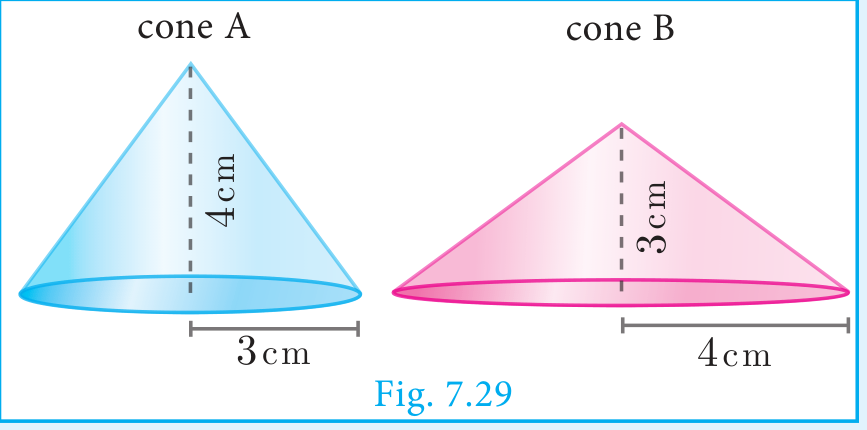

#### 7.3.4 கோளத்தின் கன அளவு (Volume of sphere)

ஒரு கோளத்தின் ஆரம் $r$ எனில், அதன் கன அளவு $V = \dfrac{4}{3}\pi r^3$ க.அ

**செயல்விளக்கம்**

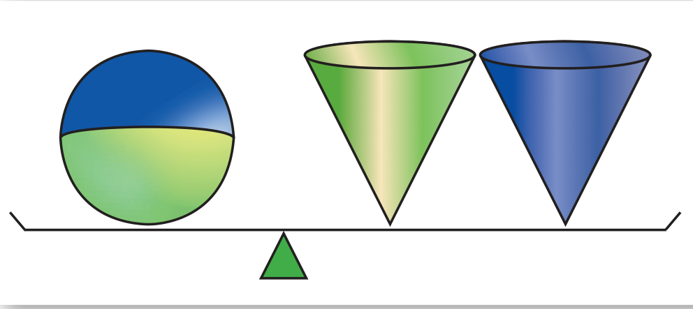

- சமமான ஆரத்தையும், உயரத்தையும் கொண்ட இரு நேர்வட்டக் கூம்புகளையும் அக்கூம்புகளின் உயரத்திற்குச் சமமான விட்டம் கொண்ட ஒரு கோளத்தையும் கருதுக.
- வலப்பக்கத்திலுள்ள இரு கூம்புகளின் பொருள்கள் முழுவதுமாக சரியாக இடப்பக்கத்திலுள்ள கோளத்தினுள் அடைபடுகிறது.

படம் 7.30-லிருந்து,

கோளத்தின் கனஅளவு $= 2 \times$ (கூம்பின் கனஅளவு)

(கோளம் மற்றும் கூம்பின் விட்டங்கள் கூம்பின் உயரத்திற்குச் சமம்)

$$= 2\left(\dfrac{1}{3}\pi r^2 h\right)$$

$$= \dfrac{2}{3}\pi r^2(2r), \quad (\text{ஏனெனில் } h = 2r)$$

$$\boxed{\text{கோளத்தின் கனஅளவு} = \dfrac{4}{3}\pi r^3 \text{ க.அ}}$$

#### 7.3.5 உள்ளீற்ற கோளத்தின் கனஅளவு (பயன்படுத்தப்பட்ட பொருளின் கனஅளவு) [Volume of a hollow sphere / spherical shell (volume of the material used)]

$r$ மற்றும் $R$ என்பன ஓர் உள்ளீற்ற கோளத்தின் உள் மற்றும் வெளிப்புற ஆரங்கள் என்க.

உட்புற மற்றும் வெளிப்புறக் கோளங்களுக்கிடையேயான கனஅளவு

$$= \dfrac{4}{3}\pi R^3 - \dfrac{4}{3}\pi r^3$$

$$\boxed{\text{உள்ளீற்ற கோளத்தின் கனஅளவு} = \dfrac{4}{3}\pi(R^3 - r^3) \text{ க.அ}}$$

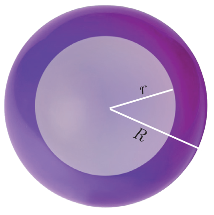

#### 7.3.6 திண்ம அரைக்கோளத்தின் கனஅளவு (Volume of solid hemisphere)

$r$ என்பது திண்ம அரைக்கோளத்தின் ஆரம் என்க.

அரைக்கோளத்தின் கன அளவு $= \dfrac{1}{2}$ (கோளத்தின் கன அளவு)

$$= \dfrac{1}{2}\left[\dfrac{4}{3}\pi r^3\right]$$

$$\boxed{\text{அரைக்கோளத்தின் கன அளவு} = \dfrac{2}{3}\pi r^3 \text{ க.அ}}$$

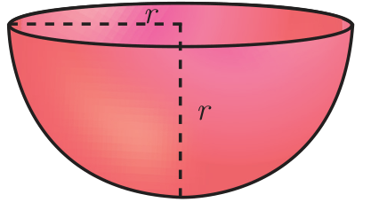

#### 7.3.7 உள்ளீற்ற அரைக்கோளத்தின் கன அளவு (பயன்படுத்தப்பட்ட பொருளின் கனஅளவு) [Volume of Hollow Hemisphere (volume of the material used)]

உள்ளீற்ற அரைக்கோளத்தின் உட்புற மற்றும் வெளிப்புற ஆரங்கள் முறையே $r$ மற்றும் $R$ என்க.

$$\left.\begin{matrix}\text{உள்ளீற்ற அரைக்} \\ \text{கோளத்தின் கன} \\ \text{அளவு}\end{matrix}\right\} = \begin{bmatrix}\text{வெளி அரைக்} \\ \text{கோளத்தின் கன} \\ \text{அளவு}\end{bmatrix} - \begin{bmatrix}\text{உள் அரைக்} \\ \text{கோளத்தின் கன} \\ \text{அளவு}\end{bmatrix}$$

$$= \dfrac{2}{3}\pi R^3 - \dfrac{2}{3}\pi r^3$$

$$\boxed{\text{உள்ளீற்ற அரைக் கோளத்தின் கனஅளவு} = \dfrac{2}{3}\pi(R^3 - r^3) \text{ க.அ}}$$

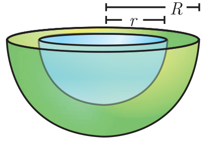

> **சிந்தனைக் களம்**
>
> ஒரு கூம்பு, ஓர் அரைக்கோளம் மற்றும் ஓர் உருளை ஆகியவற்றின் அடிப்புறப் பரப்புகள் சமம் ஆகும். உருளை மற்றும் கூம்பின் உயரங்கள் ஆரத்துக்குச் சமம் எனில், இவை மூன்றின் கன அளவுகள் சமமா?

**எடுத்துக்காட்டு 7.21** ஒரு திண்ம அரைக்கோளத்தின் கனஅளவு $29106$ க. செ.மீ. மூன்றில் இரண்டு பங்கு கன அளவுள்ள மற்றோர் அரைக்கோளம் இதிலிருந்து செதுக்கப்படுமானால் புதிய அரைக்கோளத்தின் ஆரம் என்ன?

**தீர்வு** $r$ என்பது செதுக்கப்பட்ட அரைக்கோளத்தின் ஆரம் என்க.

அரைக்கோளத்தின் கனஅளவு $= 29106$ க.செ.மீ

புதிய அரைக்கோளத்தின் கன அளவு $= \dfrac{2}{3}$ (முந்தைய அரைக்கோளத்தின் கனஅளவு)

$$= \dfrac{2}{3}\times 29106$$

புதிய அரைக்கோளத்தின் கனஅளவு $= 19404$ க.செ.மீ

$$\dfrac{2}{3}\pi r^3 = 19404$$

$$r^3 = \dfrac{19404 \times 3 \times 7}{2 \times 22} = 9261$$

$$r = \sqrt[3]{9261} = 21 \text{ செ.மீ}$$

ஆகவே, புதிய அரைக்கோளத்தின் ஆரம் $21$ செ.மீ ஆகும்.

> **சிந்தனைக் களம்**
>
> 1. கோளம் மற்றும் அரைக்கோள வடிவில் உள்ள ஏதேனும் இரு பொருட்களைக் குறிப்பிடுக.
> 2. ஒரு கோளத்தின் மீப்பெரு வட்டத்தின் வழியாகச் செல்லும் தளம் கோளத்தை ___________ பகுதிகளாகப் பிரிக்கும்.
> 3. ஒரு கோளத்தின் கன அளவு மற்றும் புறப்பரப்பு ஆகியவை சம அளவில் இருக்குமெனில், கோளத்தின் ஆரம் ___________.

**எடுத்துக்காட்டு 7.22** ஓர் உள்ளீற்ற பித்தளை கோளத்தின் உள்ளிட்டம் $14$ செ.மீ, திடிமன் $1$ மி.மீ மற்றும் பித்தளையின் அடர்த்தி $17.3$ கிராம் / க. செ.மீ எனில், கோளத்தின் நிறையைக் கணக்கிடுக. (**குறிப்பு:** நிறை $=$ அடர்த்தி $\times$ கனஅளவு)

**தீர்வு** $r$, $R$ என்பன முறையே உள்ளீற்ற கோளத்தின் உள் ஆரம் மற்றும் வெளி ஆரம் என்க.

இங்கு, உள்விட்டம் $d = 14$ செ.மீ; உள் ஆரம் $r = 7$ செ.மீ; திடிமன் $= 1$ மி.மீ $= \dfrac{1}{10}$ செ.மீ

வெளி ஆரம் $R = 7 + \dfrac{1}{10} = \dfrac{71}{10} = 7.1$ செ.மீ

உள்ளீற்ற கோளத்தின் கன அளவு $= \dfrac{4}{3}\pi(R^3 - r^3)$ க.அ.

$$= \dfrac{4}{3}\times\dfrac{22}{7}(357.91 - 343) = 62.48 \text{ க. செ.மீ}$$

ஆனால், $1$ க.செ.மீ பித்தளையின் அடர்த்தி $= 17.3$ கி

மொத்த நிறை $= 17.3 \times 62.48 = 1080.90$ கிராம்

எனவே, மொத்த நிறை $1080.90$ கிராம் ஆகும்.

> **முன்னேற்றச் சோதனை**
>
> 1. ஒரு கோளத்தின் கன அளவு மற்றும் புறப்பரப்பு ஆகியவற்றின் விகிதம் என்ன?
> 2. ஓர் அரைக்கோளத்தின் உயரம் மற்றும் ஆரத்திற்கு இடையேயுள்ள தொடர்பு ________ ஆகும்.
> 3. ஒரு கோளத்தின் கனஅளவு என்பது அதன் புறப்பரப்பு மற்றும் ____ -ன் பெருக்கற்பலன் ஆகும்.

#### 7.3.8 கூம்பினுடைய இடைக்கண்டத்தின் கன அளவு (Volume of frustum of a cone)

$H$ மற்றும் $h$ என்பன முறையே கூம்பு மற்றும் இடைக்கண்டத்தின் உயரம் என்க. இவற்றின் சாயுயரம் முறையே, $L$ மற்றும் $l$ என்க.

$R$ மற்றும் $r$ ஆகியவை இடைக்கண்டத்தின் இருபுறங்களின் ஆரங்கள் எனில், இடைக்கண்டத்தின் கன அளவு என்பது இரு கூம்புகளின் கன அளவுகளின் வித்தியாசம் ஆகும்.

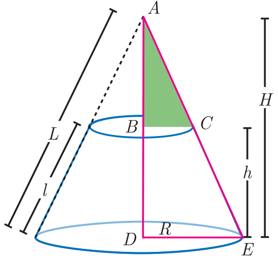

எனவே $V = \dfrac{1}{3}\pi R^2 H - \dfrac{1}{3}\pi r^2(H - h)$

முக்கோணங்கள் $ABC$ மற்றும் $ADE$ ஆகியவை வடிவொத்தவை. எனவே, ஒத்த பக்கங்களின் விகிதங்கள் சமம்.

எனவே, $\dfrac{H - h}{H} = \dfrac{r}{R}$

$$H = \dfrac{hR}{R - r} \qquad \ldots(1)$$

$$V = \dfrac{1}{3}\pi R^2 H - \dfrac{1}{3}\pi r^2(H - h)$$

$$= \dfrac{\pi}{3}H(R^2 - r^2) + \dfrac{1}{3}\pi r^2 h$$

$$= \dfrac{\pi}{3}\dfrac{hR}{R-r}(R^2 - r^2) + \dfrac{\pi}{3}r^2 h \quad [(1) \text{ஐப் பயன்படுத்த}]$$

$$= \dfrac{\pi}{3}hR(R+r) + \dfrac{\pi}{3}r^2 h$$

$$\boxed{\text{இடைக்கண்டத்தின் கன அளவு} = \dfrac{\pi h}{3}(R^2 + Rr + r^2) \text{ க.அ}}$$

> **சிந்தனைக் களம்**
>
> ஒரு கூம்பின் இடைக் கண்டத்தின் கன அளவைக் கொண்டு முழுக் கூம்பின் கன அளவைக் காண முடியுமா?

**எடுத்துக்காட்டு 7.23** $45$ செ.மீ உயரமுள்ள ஓர் இடைக்கண்டத்தின் இரு புற ஆரங்கள் முறையே $28$ செ.மீ மற்றும் $7$ செ.மீ எனில், இடைக்கண்டத்தின் கன அளவைக் காண்க.

**தீர்வு** இடைக்கண்டத்தின் உயரம் $h$ எனவும் அதன் இருபுற ஆரங்கள் $R$ மற்றும் $r$ எனவும் கொள்க.

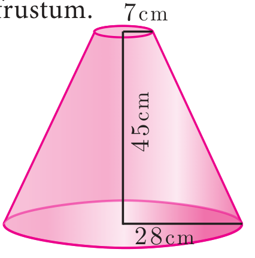

இங்கு, $h = 45$ செ.மீ, $R = 28$ செ.மீ, $r = 7$ செ.மீ

எனவே, இடைக்கண்டத்தின் கன அளவு $= \dfrac{1}{3}\pi h\left[R^2 + Rr + r^2\right]$ க.அ

$$= \dfrac{1}{3}\times\dfrac{22}{7}\times 45 \times\left[28^2 + (28\times 7) + 7^2\right]$$

$$= \dfrac{1}{3}\times\dfrac{22}{7}\times 45 \times 1029 = 48510$$

எனவே, இடைக்கண்டத்தின் கன அளவு $48510$ க. செ.மீ ஆகும்.

> **உங்களுக்குத் தெரியுமா**
>
> ஓர் உருளையின் சாய்ந்த இடைக்கண்டத்தின் படம் தரப்பட்டுள்ளது. உருளையை, $C$ வழியாக $AB$ என்ற அடிப்பரப்பிற்கு இணையில்லாத ஒரு தளம் வெட்டினால், கிடைக்கும்
>
> $$\text{இடைக்கண்டத்தின் வளைபரப்பு} = 2\pi r \times \dfrac{h_1 + h_2}{2} \text{ ச.அ}$$
>
> $h_1$ மற்றும் $h_2$ என்பன சாய்ந்த இடைக்கண்டத்தின் அதிகபட்ச மற்றும் குறைந்தபட்ச உயரங்கள் ஆகும்.
>
> மேலும், இடைக்கண்டத்தின் கன அளவு $= \pi r^2 \times \left(\dfrac{h_1 + h_2}{2}\right)$ க.அ

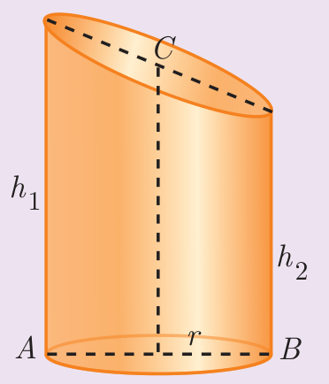

### பயிற்சி 7.2

1. $10$ மீ உட்புற விட்டம் மற்றும் $14$ மீ ஆழம் கொண்ட ஓர் உருளை வடிவக் கிணற்றிலிருந்து எடுக்கப்பட்ட மண் கொண்டு $5$ மீ அகலத்தில் கிணற்றைச் சுற்றி மேடை அமைக்கப்படுகிறது எனில், மேடையின் உயரத்தைக் காண்க.
2. விட்டம் $20$ செ.மீ உள்ள ஓர் உருளை வடிவக் கண்ணாடிக் குவளையில் $9$ செ.மீ உயரத்திற்கு நீர் உள்ளது. ஆரம் $5$ செ.மீ மற்றும் உயரம் $4$ செ.மீ உடைய ஓர் சிறிய உலோக உருளை, நீரில் முழுமையாக மூழ்கும்போது ஏற்படும் நீரின் உயர்வைக் கணக்கிடுக.
3. $484$ செ.மீ சுற்றளவுள்ள ஒரு மரக்கூம்பின் உயரம் $105$ செ.மீ எனில், கூம்பின் கன அளவைக் காண்க.
4. ஆரம் $10$ மீட்டரும், உயரம் $15$ மீட்டரும் உடைய ஒரு கூம்பு வடிவக் கொள்கலன் முழுமையாகப் பெட்ரோலால் நிரம்பியுள்ளது. நிமிடத்திற்கு $25$ கன மீட்டர் பெட்ரோல் கொள்கலனின் அடிப்புறம் வழியாக வெளியேற்றப்பட்டால் எத்தனை நிமிடங்களில் கொள்கலன் காலியாகும். விடையை நிமிடத் திருத்தமாகத் தருக.
5. $6$ செ.மீ, $8$ செ.மீ மற்றும் $10$ செ.மீ பக்க அளவுகள் கொண்ட ஒரு செங்கோண முக்கோணத்தை அதன் செங்கோணத்தைத் தாங்கும் பக்கங்களை மைய அச்சுகளாகக் கொண்டு சுழற்றும்போது ஏற்படும் திண்மங்களின் கன அளவுகளின் வித்தியாசம் காண்க.
6. சம ஆரங்கள் கொண்ட இரு கூம்புகளின் கன அளவுகள் $3600$ க. செ.மீ மற்றும் $5040$ க. செ.மீ எனில், உயரங்களின் விகிதம் காண்க.
7. இரு கோளங்களின் ஆரங்களின் விகிதம் $4:7$ எனில், அவற்றின் கன அளவுகளின் விகிதம் காண்க.
8. ஒரு திண்மக் கோளம் மற்றும் திண்ம அரைக்கோளத்தின் மொத்தப் பரப்பு சமமானதாக இருக்குமானால் அவற்றின் கன அளவுகளின் விகிதம் $3\sqrt{3} : 4$ என நிரூபி.
9. ஓர் உள்ளீற்ற தாமிரக் கோளத்தின் வெளிப்புற, உட்புறப் புறப்பரப்புகள் முறையே $576\pi$ ச. செ.மீ மற்றும் $324\pi$ ச. செ.மீ எனில், கோளத்தை உருவாக்கத் தேவையான தாமிரத்தின் கனஅளவைக் காண்க.
10. உயரம் $16$ செ.மீ உடைய ஒரு கூம்பின் இடைக்கண்ட வடிவில் அமைந்த கொள்கலன் ஒன்றின் மேற்பகுதி திறந்த நிலையில் உள்ளது. கீழ்புற ஆரம் $8$ செ.மீ மற்றும் மேற்புற ஆரம் $20$ செ.மீ கொண்ட கொள்கலனில் முழுமையாகப் பால் நிரப்பப்படுகிறது. ஒரு லிட்டர் பாலின் விலை ₹$40$ எனில், நிரப்பப்படும் பாலின் மொத்த விலையைக் காண்க.

### 7.4 இணைந்த உருவங்களின் கன அளவு மற்றும் புறப்பரப்பு (Volume and Surface Area of Combined Solids)

படம் $7.37$-ல் கொடுக்கப்பட்டுள்ள உருவங்களை உற்று நோக்குக. இவைகள் இணைந்த உருவங்கள் ஆகும். இரண்டு அல்லது அதற்கு மேற்பட்ட திண்மங்களை இணைப்பதன் மூலம் கிடைக்கும் ஒரு திண்மம் 'இணைந்த உருவம்' எனப்படும்.

இணைந்த உருவங்கள் எனும் கருத்து பொம்மைகள் செய்தல், கட்டுமானம் மற்றும் தச்சு போன்ற துறைகளில் பயன்படுகிறது.

இணைந்த உருவங்களின் புறப்பரப்பு என்பது அவற்றின் வெளியே கண்ணுக்குப் புலப்படும் புறப்பரப்பு ஆகும். எடுத்துக்காட்டாக, ஒரு கூம்பு மீது ஓர் அரைக்கோளம் பொருந்தினால் அமையும் திண்மத்தின் புறப்பரப்பு என்பது கூம்பின் வளைபரப்பு மற்றும் அரைக்கோளத்தின் வளைபரப்பு ஆகியவற்றின் கூடுதல். இங்கு கூம்பு மற்றும் அரைக்கோளம் ஆகிய இரண்டின் அடிப்பரப்புகள் சேர்க்கப்படவில்லை. ஏனெனில், கூம்பு மற்றும் அரைக்கோளம் இரண்டும் இணைந்தபின் அவற்றின் அடிப்புறப்பரப்புகள் கண்ணுக்குத் தெரிவதில்லை.

ஆனால், இரு திண்ம உருவங்களின் கன அளவுகளின் கூடுதல் இணைந்த உருவத்தின் கன அளவு ஆகும் என்பதை நினைவில் கொள்க.

**எடுத்துக்காட்டு 7.24** ஓர் உருளையின் மீது ஓர் அரைக்கோளம் இணைந்தவாறு உள்ள ஒரு பொம்மையின் மொத்த உயரம் $25$ செ.மீ ஆகும். அதன் விட்டம் $12$ செ.மீ எனில், பொம்மையின் மொத்தப் புறப்பரப்பைக் காண்க.

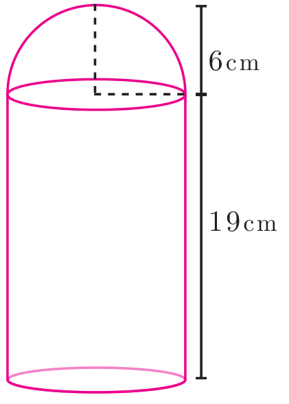

**தீர்வு** $r$ மற்றும் $h$ என்பன முறையே உருளையின் ஆரம் மற்றும் உயரம் என்க.

இங்கு, விட்டம் $d = 12$ செ.மீ அதாவது, ஆரம் $r = 6$ செ.மீ

மொத்த உயரம் $h = 25$ செ.மீ

எனவே, உருளையின் உயரம் $= 25 - 6 = 19$ செ.மீ

பொம்மையின் மொத்தப் புறப்பரப்பு $=$ உருளையின் வளைபரப்பு $+$ அரைக்கோளத்தின் வளைபரப்பு $+$ உருளையின் அடிப்பரப்பு

$$= 2\pi rh + 2\pi r^2 + \pi r^2$$

$$= \pi r(2h + 3r) \text{ ச. அ}$$

$$= \dfrac{22}{7}\times 6 \times (38 + 18)$$

$$= \dfrac{22}{7}\times 6 \times 56 = 1056$$

ஆகவே, பொம்மையின் மொத்தப் புறப்பரப்பு $1056$ ச. செ.மீ ஆகும்.

**எடுத்துக்காட்டு 7.25** ஒரு கனச்செவ்வகத்தின் மீது அரை உருளை உள்ளவாறு ஒரு நகைப்பெட்டி (படம் $7.39$) உள்ளது. கனச் செவ்வகத்தின் பரிமாணங்கள் $30$ செ.மீ $\times$ $15$ செ.மீ $\times$ $10$ செ.மீ எனில், நகைப்பெட்டியின் கன அளவு காண்க.

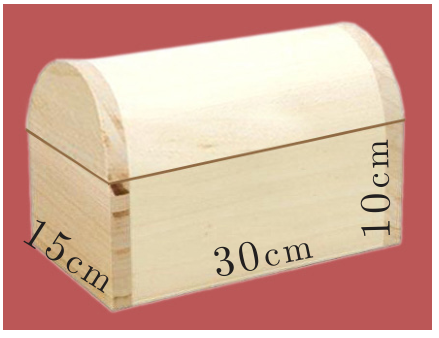

**தீர்வு** கனச்செவ்வகத்தின் நீளம், அகலம் மற்றும் உயரம் முறையே $l$, $b$ மற்றும் $h_1$ என்க.

உருளையின் ஆரம் மற்றும் உயரம் முறையே $r$ மற்றும் $h_2$ என்க.

பெட்டியின் கனஅளவு $=$ கனச்செவ்வகத்தின் கன அளவு $+ \dfrac{1}{2}$ (உருளையின் கன அளவு)

$$= \left[(l \times b \times h_1) + \dfrac{1}{2}(\pi r^2 h_2)\right] \text{ க. அ}$$

$$= (30 \times 15 \times 10) + \dfrac{1}{2}\left(\dfrac{22}{7}\times\dfrac{15}{2}\times\dfrac{15}{2}\times 30\right)$$

$$= 4500 + 2651.79 = 7151.79$$

ஆகவே, பெட்டியின் கன அளவு $7151.79$ க. செ.மீ ஆகும்.

**எடுத்துக்காட்டு 7.26** அருள் தனது குடும்ப விழாவிற்கு $150$ நபர்கள் தங்குவதற்கு ஒரு கூடாரம் அமைக்கிறார். கூடாரத்தின் அடிப்புகுதி உருளை வடிவிலும் மேற்பகுதி கூம்பு வடிவிலும் உள்ளது. ஒருவர் தங்குவதற்கு $4$ ச. மீ அடிப்பகுதி பரப்பும் $40$ க. மீ காற்றும் தேவைப்படுகிறது. கூடாரத்தில் உருளையின் உயரம் $8$ மீ எனில், கூம்பின் உயரம் காண்க.

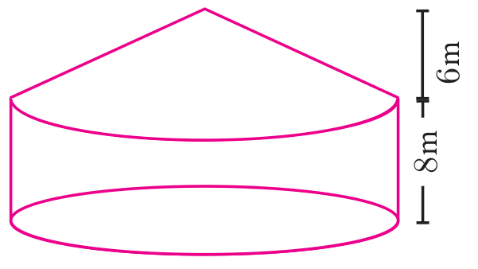

**தீர்வு** உருளை மற்றும் கூம்பின் உயரம் முறையே $h_1$ மற்றும் $h_2$ என்க.

இங்கு, ஒருவருக்குத் தேவையான பரப்பு $= 4$ ச.மீ.

நபர்களின் எண்ணிக்கை $= 150$

தேவையான மொத்த அடிப்பரப்பு $= 150 \times 4$

$$\pi r^2 = 600 \qquad \ldots (1)$$

ஒருவருக்குத் தேவையான காற்றின் கனஅளவு $= 40$ க.மீ.

$150$ நபர்களுக்குத் தேவையான காற்றின் கன அளவு $= 150 \times 40 = 6000$ க. மீ.

$$\pi r^2 h_1 + \dfrac{1}{3}\pi r^2 h_2 = 6000$$

இதிலிருந்து, $\pi r^2\left(h_1 + \dfrac{1}{3}h_2\right) = 6000$

$$(600)\left(8 + \dfrac{1}{3}h_2\right) = 6000 \qquad [(1) \text{ஐப் பிரதியிட}]$$

$$8 + \dfrac{1}{3}h_2 = \dfrac{6000}{600}$$

$$\dfrac{1}{3}h_2 = 10 - 8 = 2$$

$$h_2 = 6 \text{ மீ}$$

ஆகவே, கூம்பின் உயரம் $6$ மீ ஆகும்.

**எடுத்துக்காட்டு 7.27** ஓர் உருளையின் மீது ஓர் இடைக்கண்டம் இணைந்தவாறு அமைந்த புனலின் (funnel) மொத்த உயரம் $20$ செ.மீ. உருளையின் உயரம் $12$ செ.மீ மற்றும் விட்டம் $12$ செ.மீ ஆகும். இடைக்கண்டத்தின் மேற்புற விட்டம் $24$ செ.மீ எனில், புனலின் வெளிப்புறப் பரப்பைக் கணக்கிடுக.

**தீர்வு** $h_1$ மற்றும் $h_2$ என்பன முறையே இடைக்கண்டம் மற்றும் உருளையின் உயரம் என்க.

$R$ மற்றும் $r$ என்பன இடைக்கண்டத்தின் மேல் மற்றும் கீழ்புற ஆரங்கள் என்க.

இங்கு, $R = 12$ செ.மீ, $r = 6$ செ.மீ, $h_2 = 12$ செ.மீ $h_1 = 20 - 12 = 8$ செ.மீ

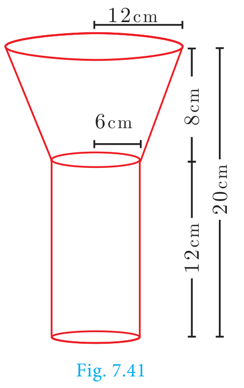

இடைக்கண்டத்தின் சாயுயரம் $l = \sqrt{(R-r)^2 + h_1^2}$ அலகுகள்

$$= \sqrt{36 + 64}$$

$$l = 10 \text{ செ.மீ}$$

வெளிப்புறப் பரப்பு $= 2\pi r h_2 + \pi(R+r)l$ ச.அலகுகள்

$$= \pi\left[2rh_2 + (R+r)l\right]$$

$$= \pi\left[(2\times 6 \times 12) + (18\times 10)\right]$$

$$= \pi\left[144 + 180\right]$$

$$= \dfrac{22}{7}\times 324 = 1018.28$$

ஆகவே, புனலின் வெளிப்புறப் பரப்பு $1018.28$ செ.மீ$^2$ ஆகும்.

**எடுத்துக்காட்டு 7.28** கனச்சதுரத்தின் ஒரு பகுதியில் $l$ அலகுகள் விட்டமுள்ள (கனசதுரத்தின் பக்கஅளவிற்குச் சமமான) ஓர் அரைக்கோளம் (படத்தில் உள்ளதுபோல) வெட்டப்பட்டால், மீதமுள்ள திண்மத்தின் புறப்பரப்பைக் காண்க.

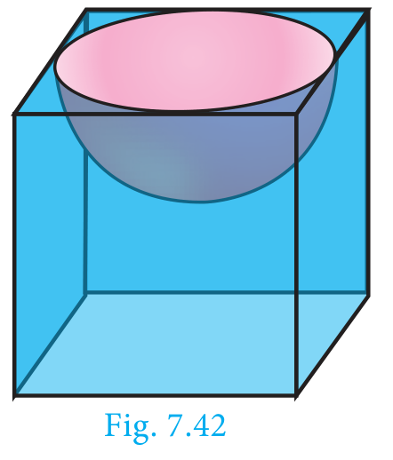

**தீர்வு** அரைக்கோளத்தின் ஆரம் $r$ என்க.

இங்கு, அரைக்கோளத்தின் விட்டம் $=$ கனச்சதுரத்தின் ஒரு பக்கம் $= l$ ஆகும்.

ஆரம் $r = \dfrac{l}{2}$ அலகு

தற்போது, மீதமுள்ள திண்மத்தின் மொத்தப்பரப்பு $=$ கனச்சதுரத்தின் மொத்தப்பரப்பு $+$ அரைக்கோளத்தின் வளைபரப்பு $-$ அரைக்கோளத்தின் அடிப்பரப்பு

$$= 6\times(\text{பக்கம})^2 + 2\pi r^2 - \pi r^2$$

$$= 6\times(\text{பக்கம})^2 + \pi r^2$$

$$= 6\times(l)^2 + \pi\left(\dfrac{l}{2}\right)^2 = \dfrac{1}{4}(24 + \pi)l^2$$

ஆகவே, மீதமுள்ள திண்மத்தின் புறப்பரப்பு $= \dfrac{1}{4}(24 + \pi)l^2$ ச. அ.

**செயல்பாடு 4**

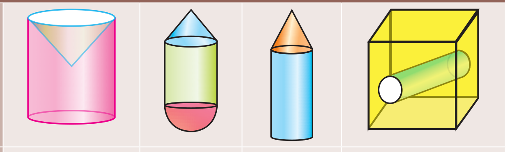

| இணைந்த உருவங்கள் | (1) | (2) | (3) | (4) |
|---|---|---|---|---|
| இணைக்கப்பட்டுள்ள திண்மங்கள் | | | | |
| இணைந்த உருவத்தின் புறப்பரப்பு | | | | |

### பயிற்சி 7.3

1. ஓர் அரைக்கோளத்தின் மேல் ஓர் உள்ளீற்ற உருளையைப் பொருத்திய வடிவத்தில் அமைந்த ஒரு கிண்ணத்தின் விட்டம் $14$ செ.மீ மற்றும் உயரம் $13$ செ.மீ எனில், அதன் கொள்ளளவைக் காண்க.
2. நாதன் என்ற பொறியியல் மாணவர் ஓர் உருளையின் இருபுறமும் கூம்புகள் உள்ளவாறு மாதிரி ஒன்றை உருவாக்கினார். மாதிரியின் நீளம் $12$ செ.மீ மற்றும் விட்டம் $3$ செ.மீ ஆகும். ஒவ்வொரு கூம்பின் உயரமும் $2$ செ.மீ இருக்குமானால் நாதன் உருவாக்கிய மாதிரியின் கனஅளவு காண்க.
3. உயரம் $2.4$ செ.மீ மற்றும் விட்டம் $1.4$ செ.மீ கொண்ட ஒரு திண்ம உருளையில் இருந்து அதே விட்டமும் உயரமும் உள்ள ஒரு கூம்பு வெட்டி எடுக்கப்பட்டால் மீதமுள்ள திண்மத்தின் கனஅளவு எவ்வளவு க. செ.மீ ஆகும்?
4. ஒரு திண்மத்தின் அடிப்புறம் $6$ செ.மீ ஆரம் உடைய அரைக்கோள வடிவிலும் மேற்புறம் $12$ செ.மீ உயரமும் $6$ செ.மீ ஆரமும் கொண்ட கூம்பு வடிவிலும் உள்ளது. முழுவதும் நீரால் நிரப்பப்பட்ட ஓர் உருளையின் அடிப்புறத்தைத் தொடுமாறு அத்திண்மம் வைக்கப்படும்போது வெளியேறும் நீரின் கனஅளவைக் காண்க. உருளையின் ஆரம் $6$ செ.மீ மற்றும் உயரம் $18$ செ.மீ எனக் கொள்க.

   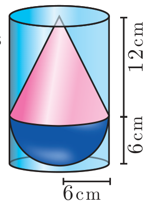
5. ஒரு மருந்து குப்பி, ஓர் உருளையின் இருபுறமும் அரைக் கோளம் இணைந்த வடிவில் உள்ளது. குப்பியின் மொத்த நீளம் $12$ மி.மீ மற்றும் விட்டம் $3$ மி.மீ எனில், அதில் அடைக்கப்படும் மருந்தின் கனஅளவைக் காண்க?
6. $7$ செ.மீ பக்க அளவுள்ள கனச்சதுரத்தின் மீது ஓர் அரைக்கோளம் படத்தில் உள்ளவாறு பொருந்தியுள்ளது. திண்மத்தின் புறப்பரப்பு காண்க.

   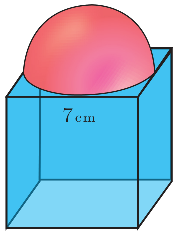
7. ஆரம் $r$ அலகுகள் கொண்ட ஒரு கோளம் ஒரு நேர் வட்ட உருளையினுள் மிகச் சரியாகப் பொருந்தப்பட்டுள்ளது எனில், கீழ்க்காண்பனவற்றைக் கணக்கிடுக.
   (i) கோளத்தின் புறப்பரப்பு &emsp; (ii) உருளையின் வளைபரப்பு &emsp; (iii) (i) மற்றும் (ii) -ல் பெறப்பட்ட பரப்புகளின் விகிதம்

### 7.5 திண்மங்களை கனஅளவுகள் மாறாமல் மற்றொரு உருவத்திற்கு மாற்றி அமைத்தல் (Conversion of Solids from one shape to another with no change in Volume)

உருமாற்றம் அல்லது மாற்றத்தை நாம் அன்றாட வாழ்வில் பல சூழ்நிலைகளில் சந்திக்கின்றோம். எடுத்துக்காட்டாக, ஒரு பொற்கொல்லர் தங்க வில்லைகளை உருக்கி அணிகலன்களாக மாற்றுகிறார். ஒரு குழந்தை களிமண்ணைப் பல பொம்மைகளாக உருவாக்குகிறது. தச்சர் மரத்துண்டுகளைப் பல வீட்டு உபயோகப் பொருட்களாக உருமாற்றுகிறார். இதுபோல ஓர் உருவத்தை மற்றோர் உருவமாக மாற்றும் கருத்தானது பல்வேறு வகைகளில் நமக்குத் தேவைப்படுகிறது.

இந்தப் பகுதியில் மாறாக் கனஅளவுகளுடன் ஓர் உருவத்தை மற்றொரு உருவமாக மாற்றுவது பற்றிக் காண்போம்.

**எடுத்துக்காட்டு 7.29** $16$ செ.மீ ஆரமுள்ள ஓர் உலோகப் பந்து, உருக்கப்பட்டு $2$ செ.மீ ஆரமுள்ள சிறு பந்துகளாக்கப்பட்டால், எத்தனை பந்துகள் கிடைக்கும்?

**தீர்வு** சிறிய உலோகப் பந்துகளின் எண்ணிக்கை $n$ என்க.

சிறிய மற்றும் பெரிய உலோகப் பந்துகளின் ஆரங்கள் முறையே $r$ மற்றும் $R$ என்க.

இங்கு, $R = 16$ செ.மீ, $r = 2$ செ.மீ.

தற்போது, $n \times$ (ஒரு சிறிய உலோகப் பந்தின் கனஅளவு) $=$ பெரிய உலோகப் பந்தின் கனஅளவு

$$n\left(\dfrac{4}{3}\pi r^3\right) = \dfrac{4}{3}\pi R^3$$

$$n\left(\dfrac{4}{3}\pi \times 2^3\right) = \dfrac{4}{3}\pi \times 16^3$$

$$8n = 4096 \quad \text{எனவே} \quad n = 512$$

ஆகவே, சிறிய உலோகப் பந்துகளின் எண்ணிக்கை $512$ ஆகும்.

**எடுத்துக்காட்டு 7.30** களிமண் கொண்டு செய்யப்பட்ட $24$ செ.மீ உயரமுள்ள ஒரு கூம்பை ஒரு குழந்தை அதே ஆரமுள்ள ஓர் உருளையாக மாற்றுகிறது எனில், உருளையின் உயரம் காண்க.

**தீர்வு** $h_1$ மற்றும் $h_2$ என்பன முறையே கூம்பு மற்றும் உருளையின் உயரம் என்க.

$r$ என்பது கூம்பின் ஆரம் என்க.

இங்கு கூம்பின் உயரம் $h = 24$ செ.மீ, கூம்பு மற்றும் உருளையின் ஆரம் $r$ செ.மீ

இங்கு, உருளையின் கனஅளவு $=$ கூம்பின் கன அளவு

$$\pi r^2 h_2 = \dfrac{1}{3}\pi r^2 h_1$$

$$h_2 = \dfrac{1}{3}\times h_1 \text{-லிருந்து} \quad h_2 = \dfrac{1}{3}\times 24 = 8$$

எனவே, உருளையின் உயரம் $8$ செ. மீ ஆகும்.

**எடுத்துக்காட்டு 7.31** $6$ செ.மீ ஆரம் மற்றும் $15$ செ.மீ உயரம் கொண்ட ஓர் உருளை வடிவப் பாத்திரம் முழுவதுமாக பனிக்கூழ் (Ice-cream) உள்ளது. அந்தப் பனிக்கூழானது, கூம்பு மற்றும் அரைக்கோளம் இணைந்த வடிவத்தில் நிரப்பப்படுகிறது. கூம்பின் உயரம் $9$ செ.மீ மற்றும் ஆரம் $3$ செ.மீ எனில், பாத்திரத்தில் உள்ள பனிக்கூழை நிரப்ப எத்தனைக் கூம்புகள் தேவை?

**தீர்வு** $h$ மற்றும் $r$ என்பன முறையே உருளையின் உயரம் மற்றும் ஆரம் என்க.

இங்கு, $h = 15$ செ.மீ, $r = 6$ செ.மீ

உருளையின் கனஅளவு $V = \pi r^2 h$ க. அ

$$= \dfrac{22}{7}\times 6 \times 6 \times 15$$

$r_1 = 3$ செ.மீ மற்றும் $h_1 = 9$ செ.மீ என்பன கூம்பின் ஆரம் மற்றும் உயரம் ஆகும்.

$r_1 = 3$ செ.மீ என்பது அரைக்காளத்தின் ஆரம் ஆகும்.

பனிக்கூழ்க் கூம்பின் கனஅளவு $=$ கூம்பின் கனஅளவு $+$ அரைக்கோளத்தின் கனஅளவு

$$= \dfrac{1}{3}\pi r_1^2 h_1 + \dfrac{2}{3}\pi r_1^3$$

$$= \dfrac{1}{3}\times\dfrac{22}{7}\times 3 \times 3 \times 9 + \dfrac{2}{3}\times\dfrac{22}{7}\times 3 \times 3 \times 3$$

ஒரு பனிக்கூழ்க் கூம்பின் கனஅளவு $= \dfrac{22}{7}\times 45$

எனவே, தேவையான கூம்புகளின் எண்ணிக்கை $= \dfrac{\text{உருளையின் கனஅளவு}}{\text{ஒரு பனிக்கூழ்க் கூம்பின் கனஅளவு}}$

$$= \dfrac{\dfrac{22}{7}\times 6 \times 6 \times 15}{\dfrac{22}{7}\times 45} = 12$$

ஆகவே, தேவையான கூம்புகளின் எண்ணிக்கை $12$ ஆகும்.

**செயல்பாடு 5**

ஓர் உருளையினுள் இரு பந்துகள் படத்தில் உள்ளவாறு சரியாகப் பொருந்தியுள்ளன. ஒரு பந்தின் ஆரம் $3$ செ.மீ எனில், கீழ்க்காண்பனவற்றைக் காண்க.

(i) உருளையின் உயரம்

(ii) உருளையின் ஆரம்

(iii) உருளையின் கன அளவு

(iv) இரு பந்துகளின் கனஅளவு

(v) பந்துகளால் அடைபடாத உருளையின் கனஅளவு

(vi) உருளையில் பந்துகளின் கனஅளவின் சதவீதம்

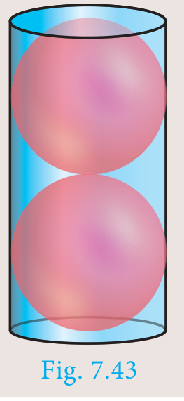

### பயிற்சி 7.4

1. $12$ செ.மீ ஆரமுள்ள ஓர் அலுமினியக் கோளம் உருக்கப்பட்டு $8$ செ.மீ ஆரமுள்ள ஓர் உருளையாக மாற்றப்படுகிறது. உருளையின் உயரம் காண்க.
2. $14$ செ.மீ விட்டமுள்ள குழாயிலிருந்து $15$ கி.மீ / மணி என்ற வேகத்தில் $50$ மீ நீளம் மற்றும் $44$ மீ அகலம் கொண்ட ஒரு செங்கோண வடிவத் தொட்டியினுள் தண்ணீர் பாய்கிறது. எவ்வளவு நேரத்தில் தண்ணீரின் மட்டம் $21$ செ.மீ-க்கு உயரும்.
3. முழுமையாக நீரால் நிரம்பியுள்ள ஒரு கூம்பு வடிவக் குடுவையின் ஆரம் $r$ அலகுகள் மற்றும் உயரம் $h$ அலகுகள் ஆகும். நீரானது $xr$ அலகுகள் ஆரமுள்ள மற்றொரு உருளை வடிவக் குடுவைக்கு மாற்றப்பட்டால் நீரின் உயரம் காண்க.
4. விட்டம் $14$ செ.மீ, உயரம் $8$ செ.மீ உடைய ஒரு திண்ம நேர்வட்டக் கூம்பு, ஓர் உள்ளீற்ற கோளமாக உருமாற்றப்படுகிறது. கோளத்தின் வெளிவிட்டம் $10$ செ.மீ எனில், உள்விட்டத்தைக் காண்க.
5. சீனு வீட்டின் மேல்நிலை நீர்த்தொட்டி உருளை வடிவில் உள்ளது. அதன் ஆரம் $60$ செ.மீ மற்றும் உயரம் $105$ செ.மீ. $2$ மீ $\times 1.5$ மீ $\times 1$ மீ பரிமாணங்களை உடைய ஒரு கனச்செவ்வகக் கீழ்நிலை நீர் தொட்டியிலிருந்து நீர் உந்தப்பட்டு மேலேயுள்ள உருளை வடிவத் தொட்டி முழுமையாக நிரப்பப்படுகிறது. தொடக்கத்தில் கீழ் தொட்டியில் நீர் முழுமையாக இருப்பதாகக் கருதுக. மேல் தொட்டிக்கு நீர் ஏற்றப்பட்ட பிறகு மீதமுள்ள நீரின் கனஅளவைக் காண்க.
6. ஓர் உள்ளீற்ற அரைக்கோள ஓட்டின் உட்புற மற்றும் வெளிப்புற விட்டங்கள் முறையே $6$ செ.மீ மற்றும் $10$ செ.மீ ஆகும். அது உருக்கப்பட்டு $14$ செ.மீ விட்டமுள்ள ஒரு திண்ம உருளையாக்கப்பட்டால், அவ்வுருளையின் உயரம் காண்க.
7. $6$ செ.மீ ஆரமுள்ள ஒரு திண்மக் கோளம் உருக்கப்பட்டுச் சீரான தடிமனுள்ள ஓர் உள்ளீற்ற உருளையாக மாற்றப்படுகிறது. உருளையின் வெளி ஆரம் $5$ செ.மீ மற்றும் உயரம் $32$ செ.மீ எனில், உருளையின் தடிமனைக் காண்க.
8. ஓர் அரைக்கோள வடிவக் கிண்ணத்தின் விளிம்பு வரையில் பழச்சாறு நிரம்பியுள்ளது. உயரத்தைவிட $50\%$ அதிக ஆரம் கொண்ட உருளை வடிவப் பாத்திரத்திற்குப் பழச்சாறு மாற்றப்படுகிறது. அரைக்கோளம் மற்றும் உருளை ஆகியவற்றின் விட்டங்கள் சமமானால் எவ்வளவு சதவீதப் பழச்சாறு உருளை வடிவப் பாத்திரத்திற்கு மாற்றப்படும்?

### பயிற்சி 7.5

**பலவுள் தெரிவு வினாக்கள்**

1. $15$ செ.மீ உயரமும் $16$ செ.மீ விட்டமும் கொண்ட ஒரு நேர்வட்டக் கூம்பின் வளைபரப்பு
   (அ) $60\pi$ ச.செ.மீ &emsp; (ஆ) $68\pi$ ச.செ.மீ &emsp; (இ) $120\pi$ ச.செ.மீ &emsp; (ஈ) $136\pi$ ச.செ.மீ
2. $r$ அலகுகள் ஆரம் உடைய இரு சம அரைக்கோளங்களின் அடிப்பகுதிகள் இணைக்கப்படும் போது உருவாகும் திண்மத்தின் புறப்பரப்பு
   (அ) $4\pi r^2$ ச. அ &emsp; (ஆ) $6\pi r^2$ ச. அ &emsp; (இ) $3\pi r^2$ ச. அ &emsp; (ஈ) $8\pi r^2$ ச. அ
3. ஆரம் $5$ செ.மீ மற்றும் சாயுயரம் $13$ செ.மீ உடைய நேர்வட்டக் கூம்பின் உயரம்
   (அ) $12$ செ.மீ &emsp; (ஆ) $10$ செ.மீ &emsp; (இ) $13$ செ.மீ &emsp; (ஈ) $5$ செ.மீ
4. ஓர் உருளையின் உயரத்தை மாற்றாமல் அதன் ஆரத்தைப் பாதியாகக் கொண்டு புதிய உருளை உருவாக்கப்படுகிறது. புதிய மற்றும் முந்தைய உருளைகளின் கன அளவுகளின் விகிதம்
   (அ) $1:2$ &emsp; (ஆ) $1:4$ &emsp; (இ) $1:6$ &emsp; (ஈ) $1:8$
5. ஓர் உருளையின் ஆரம் அதன் உயரத்தில் மூன்றில் ஒரு பங்கு எனில், அதன் மொத்தப் புறப்பரப்பு
   (அ) $\dfrac{9\pi h^2}{8}$ ச. அ &emsp; (ஆ) $24\pi h^2$ ச. அ &emsp; (இ) $\dfrac{8\pi h^2}{9}$ ச. அ &emsp; (ஈ) $\dfrac{56\pi h^2}{9}$ ச. அ
6. ஓர் உள்ளீற்ற உருளையின் வெளிப்புற மற்றும் உட்புற ஆரங்களின் கூடுதல் $14$ செ.மீ மற்றும் அதன் தடிமன் $4$ செ.மீ ஆகும். உருளையின் உயரம் $20$ செ.மீ எனில், அதனை உருவாக்கப் பயன்பட்ட பொருளின் கன அளவு
   (அ) $5600\pi$ க. செ.மீ &emsp; (ஆ) $1120\pi$ க. செ.மீ &emsp; (இ) $56\pi$ க. செ.மீ &emsp; (ஈ) $3600\pi$ க. செ.மீ
7. ஒரு கூம்பின் அடிப்புற ஆரம் மும்மடங்காகவும் உயரம் இரு மடங்காகவும் மாறினால் கன அளவு எத்தனை மடங்காக மாறும்?
   (அ) $6$ மடங்கு &emsp; (ஆ) $18$ மடங்கு &emsp; (இ) $12$ மடங்கு &emsp; (ஈ) மாற்றமில்லை
8. ஓர் அரைக்கோளத்தின் மொத்தப் பரப்பு அதன் ஆரத்தினுடைய வர்க்கத்தின் ____மடங்காகும்.
   (அ) $\pi$ &emsp; (ஆ) $4\pi$ &emsp; (இ) $3\pi$ &emsp; (ஈ) $2\pi$
9. $x$ செ.மீ ஆரமுள்ள ஒரு திண்மக் கோளம் அதே ஆரமுள்ள ஒரு கூம்பாக மாற்றப்படுகிறது எனில், கூம்பின் உயரம்
   (அ) $3x$ செ.மீ &emsp; (ஆ) $x$ செ.மீ &emsp; (இ) $4x$ செ.மீ &emsp; (ஈ) $2x$ செ.மீ
10. $16$ செ.மீ உயரமுள்ள ஒரு நேர்வட்டக் கூம்பின் இடைக்கண்ட ஆரங்கள் $8$ செ.மீ மற்றும் $20$ செ.மீ எனில், அதன் கன அளவு
    (அ) $3328\pi$ க. செ.மீ &emsp; (ஆ) $3228\pi$ க. செ.மீ &emsp; (இ) $3240\pi$ க. செ.மீ &emsp; (ஈ) $3340\pi$ க. செ.மீ
11. கீழ்க்காணும் எந்த இரு உருவங்களை இணைத்தால் ஓர் இறகுபந்தின் வடிவம் கிடைக்கும்.
    (அ) உருளை மற்றும் கோளம் &emsp; (ஆ) அரைக்கோளம் மற்றும் கூம்பு &emsp; (இ) கோளம் மற்றும் கூம்பு &emsp; (ஈ) இடைக்கண்டம் மற்றும் அரைக்கோளம்
12. $r_1$ அலகுகள் ஆரமுடைய ஒரு கோள உருண்டை உருக்கப்பட்டு $r_2$ அலகுகள் ஆரமுடைய $8$ சமகோளப் பந்துகளாக ஆக்கப்படுகிறது எனில், $r_1 : r_2$
    (அ) $2:1$ &emsp; (ஆ) $1:2$ &emsp; (இ) $4:1$ &emsp; (ஈ) $1:4$
13. $1$ செ.மீ ஆரமும் $5$ செ.மீ உயரமும் கொண்ட ஒரு மர உருளையிலிருந்து அதிகபட்சக் கன அளவு கொண்ட கோளம் வெட்டி எடுக்கப்படுகிறது எனில், அதன் கன அளவு (க. செ.மீ–ல்)
    (அ) $\dfrac{4}{3}\pi$ &emsp; (ஆ) $\dfrac{10}{3}\pi$ &emsp; (இ) $5\pi$ &emsp; (ஈ) $\dfrac{20}{3}\pi$
14. இடைக்கண்டத்தை ஒரு பகுதியாகக் கொண்ட ஒரு கூம்பின் உயரம் மற்றும் ஆரம் முறையே $h_1$ அலகுகள் மற்றும் $r_1$ அலகுகள் ஆகும். இடைக்கண்டத்தின் உயரம் மற்றும் சிறிய பக்க ஆரம் முறையே $h_2$ அலகுகள் மற்றும் $r_2$ அலகுகள் ஆகும். $h_2 : h_1 = 1:2$ எனில், $r_2:r_1$-ன் மதிப்பு
    (அ) $1:3$ &emsp; (ஆ) $1:2$ &emsp; (இ) $2:1$ &emsp; (ஈ) $3:1$
15. சமமான விட்டம் மற்றும் உயரம் உடைய ஓர் உருளை, ஒரு கூம்பு மற்றும் ஒரு கோளத்தின் கன அளவுகளின் விகிதம்
    (அ) $1:2:3$ &emsp; (ஆ) $2:1:3$ &emsp; (இ) $1:3:2$ &emsp; (ஈ) $3:1:2$

### அலகுப் பயிற்சி - 7

1. $7$ செ.மீ நீளமுள்ள ஓர் உருளை வடிவ மை குருவாயின் விட்டம் $5$ மி.மீ ஆகும். மை முழுமையாகவுள்ள உருளையைக் கொண்டு சராசரியாக $330$ வார்த்தைகள் எழுதலாம். ஒரு லிட்டரில் ஐந்தில் ஒரு பங்கு மை ஒரு பாட்டிலில் உள்ளது எனில், அதனைப் பயன்படுத்தி எத்தனை வார்த்தைகள் எழுதலாம்?
2. ஆரம் $1.75$ மீ உள்ள ஓர் அரைக்கோள வடிவத் தொட்டி முற்றிலும் நீரால் நிரப்பப்பட்டுள்ளது. ஒரு குழாயின் மூலம் விநாடிக்கு $7$ லிட்டர் வீதம் தொட்டியிலிருந்து நீர் வெளியேற்றப்படுமானால், தொட்டியை எவ்வளவு நேரத்தில் முழுவதுமாக காலி செய்யலாம்.
3. $r$ அலகுகள் ஆரம் கொண்ட ஒரு திண்ம அரைக் கோளத்திலிருந்து வெட்டி எடுக்கப்படும் மீப்பெரு கனஅளவு என்ன?
4. ஒரு கூம்பின் இடைக்கண்டம், $10$ செ.மீ நீளமுள்ள ஓர் உருளையுடன் இணைக்கப்பட்ட எண்ணெய்ப் புனலின் மொத்த உயரம் $22$ செ.மீ ஆகும். உருளையின் விட்டம் $8$ செ.மீ மற்றும் புனலின் மேற்புற விட்டம் $18$ செ.மீ எனில், புனலை உருவாக்கத் தேவையான தகர அடையின் பரப்பைக் காண்க.
5. உயரம் $10$ செ.மீ மற்றும் விட்டம் $4.5$ செ.மீ உடைய ஒரு நேர்வட்ட உருளையை உருவாக்க $1.5$ செ.மீ விட்டமும், $2$ மி.மீ தடிமன் கொண்ட எத்தனை வட்ட வில்லைகள் தேவை?
6. ஓர் உள்ளீற்ற உலோக உருளையின் வெளிப்புற ஆரம் $4.3$ செ.மீ, உட்புற ஆரம் $1.1$ செ.மீ மற்றும் நீளம் $4$ செ.மீ. உலோக உருளையை உருக்கி $12$ செ.மீ நீளமுள்ள வேறொரு திண்ம உருளை உருவாக்கப்பட்டால் புதிய உருளையின் விட்டத்தைக் கணக்கிடுக.
7. ஓர் இடைக்கண்டத்தின் இரு முனைகளின் சுற்றளவுகள் $18$ மீ, $16$ மீ மற்றும் அதன் சாயுயரம் $4$ மீ ஆகும். ஒரு சதுர மீட்டருக்கு ₹ $100$ வீதம் இடைக்கண்டத்தின் வளைபரப்பில் வர்ண பூச செலவு மொத்தம் என்ன?
8. ஓர் உள்ளீற்ற அரைக்கோளக் கிண்ணத்தை உருவாக்கப் பயன்பட்ட பொருளின் கனஅளவு $\dfrac{436\pi}{3}$ க. செ.மீ ஆகும். கிண்ணத்தின் வெளிவிட்டம் $14$ செ.மீ எனில் அதன் தடிமனைக் காண்க.
9. ஒரு கூம்பின் கன அளவு $1005\dfrac{5}{7}$ க. செ.மீ மற்றும் கீழ் வட்டப்பரப்பு $201\dfrac{1}{7}$ ச. செ.மீ எனில், அதன் சாயுயரம் காண்க.
10. ஒரு வட்டக்கோண வடிவில் உள்ள உலோகத் தகடின் ஆரம் $21$ செ.மீ மற்றும் மையக் கோணம் $216°$ ஆகும். வட்டக்கோணப் பகுதியின் ஆரங்களை இணைத்து உருவாக்கப்படும் கூம்பின் கன அளவைக் காண்க.

### நினைவில் கொள்ளவேண்டியவை

| திண்மம் | படம் | வளைபரப்பு / பக்கப்பரப்பு (ச.அ) | மொத்தப் புறப்பரப்பு (சதுர அலகுகள்) | கனஅளவு (கன அலகுகள்) |
|---|---|---|---|---|
| **கனச் செவ்வகம்** | 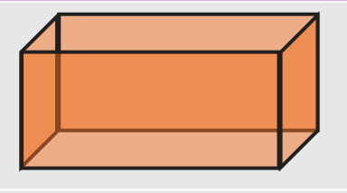 | $2h(l+b)$ | $2(lb+bh+lh)$ | $l \times b \times h$ |
| **கனச் சதுரம்** | 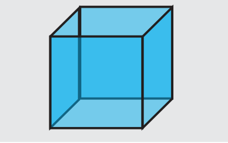 | $4a^2$ | $6a^2$ | $a^3$ |
| **நேர் வட்ட உருளை** | 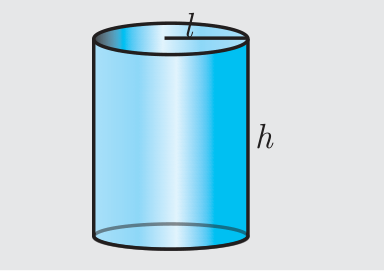 | $2\pi rh$ | $2\pi r(h+r)$ | $\pi r^2 h$ |
| **நேர் வட்டக் கூம்பு** | 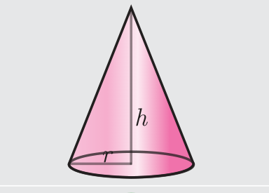 | $\pi rl$, $l = \sqrt{r^2+h^2}$, $l =$ சாயுயரம் | $\pi r(l+r)$ | $\dfrac{1}{3}\pi r^2 h$ |
| **கோளம்** | 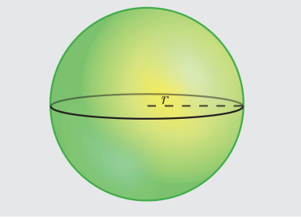 | $4\pi r^2$ | $4\pi r^2$ | $\dfrac{4}{3}\pi r^3$ |
| **அரைக் கோளம்** | 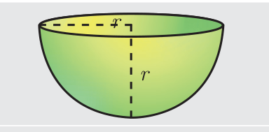 | $2\pi r^2$ | $3\pi r^2$ | $\dfrac{2}{3}\pi r^3$ |
| **உள்ளீற்ற உருளை** | 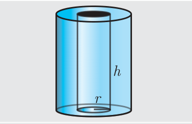 | $2\pi(R+r)h$ | $2\pi(R+r)(R-r+h)$ | $\pi(R^2-r^2)h$ |
| **உள்ளீற்ற கோளம்** | 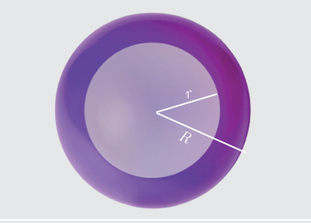 | $4\pi R^2 =$ வெளிப்புற வளைபரப்பு | $4\pi(R^2+r^2)$ | $\dfrac{4}{3}\pi(R^3-r^3)$ |
| **உள்ளீற்ற அரைக் கோளம்** | 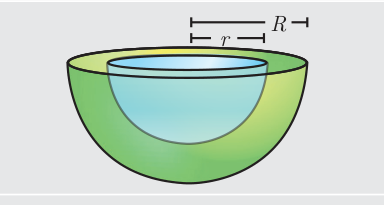 | $2\pi(R^2+r^2)$ | $\pi(3R^2+r^2)$ | $\dfrac{2}{3}\pi(R^3-r^3)$ |
| **நேர்வட்டக் கூம்பின் இடைக் கண்டம்** | 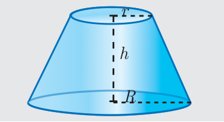 | $\pi(R+r)l$ இங்கு $l = \sqrt{h^2+(R-r)^2}$ | $\pi(R+r)l + \pi R^2 + \pi r^2$ | $\dfrac{1}{3}\pi h\left[R^2+r^2+Rr\right]$ |

### இணையச் செயல்பாடு (ICT)

**ICT 7.1**

**படி 1:** கீழ்க்காணும் இணைய உரலி / விரைவுக் குறியீட்டைப் பயன்படுத்தி "Geogebra" -வின் "Mensuration_X" பக்கத்திற்குச் செல்க. "Cone-cylinder relation" எனும் பயிற்சித் தாளைத் தேர்வு செய்க.

**படி 2:** கொடுக்கப்பட்ட பயிற்சித் தாளில் இடப்புறமுள்ள 'slider' -ஐப் பயன்படுத்திக் கூம்பு-உருளையின் ஆரம் மற்றும் உயரத்தை மாற்றுக. கூம்பு உருளையை நிரப்புவதைக் காண 'Vertical Slider' -ஐ நகர்த்துக. ஆரம் மற்றும் உயரம் சமமெனில், உருளையின் கனஅளவானது கூம்பின் கன அளவை போல் மூன்று மடங்கு என நிரூபமாகிறது.

*(படி 1, படி 2 மற்றும் "Cone-Cylinder relation" GeoGebra பயிற்சித் தாளின் முடிவுகளுக்கான திரைப்படங்கள் மூலப் பிரதியில் இங்கு தரப்பட்டுள்ளன — இவை செயலி-வழிசெலுத்தல் விளக்கப் படங்கள் என்பதால் மீண்டும் தரப்படவில்லை.)*

**ICT 7.2**

**படி 1:** கீழ்க்காணும் இணைய உரலி / விரைவுக் குறியீட்டைப் பயன்படுத்தி "Geogebra" -வின் "Mensuration_X" பக்கத்திற்குச் செல்க. "Cylinder-Hemisphere" எனும் பயிற்சித் தாளைத் தேர்வு செய்க.

**படி 2:** கொடுக்கப்பட்ட பயிற்சித் தாளில் இடப்புறமுள்ள "Slider" -ஐப் பயன்படுத்தி உருளை மற்றும் அரைக்கோளத்தின் ஆரத்தை மாற்றுக. 'Slider' -ஐ முன்பின் நகர்த்தி இணைந்த திண்மங்கள் உருவாவதைக் காண்க. திண்ம உருவங்களை முழுமையாகக் காண அவற்றைச் சுழற்றவும். இடப்புறமுள்ள படிநிலைகளை விடைகளைச் சரிபார்க்க உதவும்.

*(படி 1, படி 2 மற்றும் "Cylinder Hemisphere" GeoGebra பயிற்சித் தாளின் முடிவுகளுக்கான திரைப்படங்கள் மூலப் பிரதியில் இங்கு தரப்பட்டுள்ளன — இவை செயலி-வழிசெலுத்தல் விளக்கப் படங்கள் என்பதால் மீண்டும் தரப்படவில்லை.)*

*இதே படிகளைக் கொண்டு மற்ற செயல்பாடுகளைச் செய்க.*

[https://www.geogebra.org/m/jfr2zzgy#chapter/356197](https://www.geogebra.org/m/jfr2zzgy#chapter/356197) அல்லது விரைவுக் குறியீட்டை ஸ்கேன் செய்க.

*(GeoGebra செயல்பாட்டிற்கான QR குறியீடு இங்கு மூலப்பிரதியில் தரப்பட்டுள்ளது; குறியீட்டு லேபிள்: 8URS9.)*

