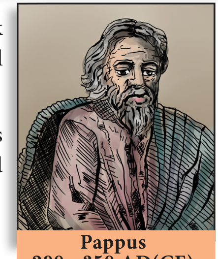

எகிப்தில் உள்ள அலெக்ஸ்சாண்ட்ரியாவில் பிறந்த பாப்பஸ் மிகச் சிறந்த கிரேக்க வடிவியல் மேதையாவார். எட்டுப் புத்தகங்களில் அமைந்த "மசனகோத்" (Synagogue) எனும் கணிதத் தொகுப்பே இவரது சிறப்பான படைப்பாகும்.

நேர்வட்ட உருளை, கூம்பு, ஆரங்கள், அச்சுகள் போன்ற திண்ம வடிவங்களைப் பற்றி பாப்பஸ் விளக்குகிறார். இயற்கையும் நவீன தொழில்நுட்பமும் மேலும் கணித வடிவங்களைப் பற்றி பயன்படுத்துகின்றன.

