# 8 புள்ளியியலும் நிகழ்தகவும்

> "வாழ்க்கையே ஒரு நிகழ்தகவின் கருத்தாக்கம்தான்" —வால்டர் பேகாட்

கொல்கத்தாவில் பிறந்த பிரசந்த சந்திர மகலெனோபிஸ் ஓர் இந்தியப் புள்ளியியலார் ஆவார். இரு தரவுத் தொகுப்புகளுக்கிடையே உள்ள ஒப்புமை அளவீட்டைக் கண்டறியும் முறையை உருவாக்கினார். அதிகளவிலான மாதிரி கொண்ட கணக்கெடுப்புகளை மேற்கொள்ள புதிய வழிமுறைகளை அறிமுகப்படுத்தினார். சமவாய்ப்பு மாதிரி முறையைப் பயன்படுத்தி நிலப்பரப்பையும் பயிர் உற்பத்தி அளவைக் கணக்கிடும் முறையை வழங்கினார். இவருடைய அளப்பரிய பணிகளுக்காக, இந்திய அரசின் மிக உயரிய விருதுகளில் ஒன்றான பத்மவிபூஷன் விருது 1968 ஆம் ஆண்டு இந்திய அரசால் வழங்கப்பட்டது. இந்திய புள்ளியியல் துறையில் இவர் நிகழ்த்திய சாதனைகளுக்காக "இந்தியப் புள்ளியியலின் தந்தை" எனப் போற்றப்படுகிறார். மேலும் இவரது பிறந்த நாளான ஜூன் மாதம் 29 -ஆம் தேதியை ஒவ்வோர் ஆண்டும் தேசிய புள்ளியியல் தினமாகக் கொண்டாடும்படி இந்திய அரசாங்கம் அறிவித்துள்ளது.

## கற்றல் விளைவுகள்

- மையப் போக்கு அளவைகளை நினைவு கூர்தல்.
- தொகுக்கப்பட்ட, தொகுக்கப்படாத விவரங்களின் சராசரியைப் பற்றி நினைவு கூர்தல்.
- பரவலின் கருத்தினைப் புரிந்து கொள்ளுதல்.
- வீச்சு, திட்ட விலக்கம், விலக்க வர்க்கச் சராசரி மற்றும் மாறுபாட்டுக் கெழு ஆகியவற்றைக் கணக்கிடுதலைப் புரிந்து கொள்ளல்.
- சமவாய்ப்புச் சோதனைகள், கூறுவெளி மற்றும் மரவரைபடம் பயன்பாடு ஆகியவற்றைப் புரிந்து கொள்ளல்.
- சமவாய்ப்புச் சோதனையின் பல்வேறு வகையான நிகழ்ச்சிகளை வரையறுத்தல் மற்றும் விளக்குதல்.
- நிகழ்தகவு கூட்டல் தேற்றத்தைப் புரிந்து கொள்ளுதல். மேலும் அதைச் சில எளிய கணக்குகளைத் தீர்ப்பதற்குப் பயன்படுத்துதல்

## 8.1 அறிமுகம் (Introduction)

புள்ளியியல் (statistics) என்ற வார்த்தையானது இலத்தீன் மொழியின் 'நிலைமை' (status) அதாவது அரசியல் நிலைமை (political status) என்ற வார்த்தையில் இருந்து வந்தது. இன்று, புள்ளியியலானது ஒவ்வொருவருடைய வாழ்க்கையிலும் எதிர்காலத் திட்டமிடுதலுக்கு, வியாபாரத்திற்கு, சந்தை ஆராய்ச்சிக்கு, பொருளாதார அறிக்கை தயாரிப்பதற்கு எனப் பல சூழல்களில் முக்கியப் பங்கு வகிக்கின்றது. மேலும் கருத்துக் கணிப்பு மற்றும் ஆழமான ஆய்வு முடிவுகளுக்கும் புள்ளியியல் பயன்படுத்தப்படுகிறது.

புள்ளியியல் என்பது அறிவியல் முறைகளைப் பயன்படுத்தித் தரவுகளைச் சேகரித்தல், ஒருங்கமைத்தல், தொகுத்தல், வழங்குதல், பகுப்பாய்வு செய்தல், அர்த்தமுள்ள முடிவுகளை ஏற்படுத்துதல் ஆகியவைகளை உள்ளடக்கியது ஆகும்.

சென்ற வகுப்பில், தரவுகளைச் சேகரித்தல், அட்டவணைப்படுத்துதல், வரைபடத்தில் குறித்தல் மற்றும் மையப்போக்கு அளவைகளைக் கணக்கிடுவது ஆகியவற்றைக் கற்றோம். தற்போது இந்த வகுப்பில், பரவல் அளவைகளைப் பற்றி கற்போம்.

### நினைவு கூர்தல்

##### மையப்போக்கு அளவைகள்

முழுப் புள்ளி விவரங்களையும் குறிக்கத்தக்கதான ஒரு தனி மதிப்பீட்டு எண்ணாகும். இந்த எண்ணை மையப் போக்கு அளவு அல்லது சராசரி எனவும் கூறலாம்.

வழக்கமாக மையப்போக்கு அளவுகள் அனைத்தும் புள்ளி விவரத்தின் மைய அளவிற்கு நெருக்கமாக இருக்கும். கொடுக்கப்பட்ட புள்ளி விவரங்களுக்கான பல்வேறு வகையான மையப்போக்கு அளவுகளில் பொதுவானவை,

(i) கூட்டுச் சராசரி

(ii) இடைநிலை அளவு

(iii) முகடு

> **சிந்தனைக் களம்**
>
> 1. கொடுக்கப்பட்ட புள்ளி விவரங்களுக்குச் சராசரி, இடைநிலை மற்றும் முகடு ஆகியவை ஒரே மதிப்பைக் கொண்டிருக்குமா?
> 2. கூட்டுச்சராசரிக்கும் சராசரிக்கும் இடையேயான வித்தியாசம் என்ன?

> **குறிப்பு**
>
> - **தரவு:** ஒரு கோட்பாட்டைத் தகுந்த எண்ணளவில் குறிப்பிடுவதைத் தரவு என்கிறோம்.
> - **தரவுப்புள்ளி:** தரவின் ஒவ்வொரு மதிப்பையும் தரவுப்புள்ளி என்கிறோம்.
> - **மாறி:** ஓர் கணக்கெடுப்பில் எடுத்துக்கொள்ளப்படும் அளவுகள் மாறிகள் எனப்படுகின்றன. மாறிகள் பொதுவாக $x_i$, $i=1,2,3,\ldots,n$. எனக் குறிக்கப்படுகின்றன.
> - **நிகழ்வெண்கள்:** ஒரு தரவில், ஒரு மாறி எவ்வளவு முறை வருகிறதோ, அந்த எண்ணிக்கையை நாம் மாறியின் நிகழ்வெண் என்கிறோம்.
>
> பொதுவாக நிகழ்வெண் என்பது $f_i$, $i=1,2,3,\ldots,n$ எனக் குறிக்கப்படுகின்றது.

இந்த வகுப்பில் கூட்டுச் சராசரியை நினைவு கூர்வோம்.

##### கூட்டுச் சராசரி

கூட்டுச் சராசரி அல்லது சராசரி என்பது கொடுக்கப்பட்ட தரவுப் புள்ளிகளின் கூடுதலை தரவுப் புள்ளிகளின் எண்ணிக்கையைக் கொண்டு வகுக்கும்போது கிடைக்கும் மதிப்பு ஆகும். இதனை $\bar x$ எனக் குறிப்பிடுவோம் ($x$ பார் என உச்சரிப்போம்).

$$
\bar x=\frac{\text{தரவுப் புள்ளிகளின் கூடுதல் மதிப்பு}}{\text{தரவுப் புள்ளிகளின் எண்ணிக்கை}}
$$

> **சிந்தனைக் களம்**
>
> $n$ தரவுப் புள்ளிகளின் சராசரியானது $\bar x$, மேலும் முதல் உறுப்புடன் ஒன்றையும், இரண்டாம் உறுப்புடன் இரண்டையும் கூட்டி இவ்வாறு தொடர்ந்து கூட்டிக் கொண்டே போனால் புதிய சராசரி என்னவாக இருக்கும்?

கணக்கீட்டில் கொடுக்கப்பட்டுள்ள தகவல்களைப் பொருத்து ஏற்ற சூத்திரங்களை நாம் பயன்படுத்துவோம்.

> **முன்னேற்றச் சோதனை**
>
> 1. எல்லாத் தரவுப் புள்ளிகளையும் கூட்டி, தரவுப் புள்ளிகளின் எண்ணிக்கையினால் வகுத்தால் கிடைப்பது ________.
> 2. 10 தரவுப் புள்ளிகளின் கூடுதல் 265 எனில், அவற்றின் சராசரியானது ________.
> 3. குறிப்பிட்ட தரவுப் புள்ளிகளின் கூடுதல் மற்றும் சராசரி ஆகியவை முறையே 407 மற்றும் 11 எனில், தரவுப் புள்ளிகளின் எண்ணிக்கையானது ________.

## 8.2 பரவல் அளவைகள் (Measures of Dispersion)

கடந்த 10 போட்டிகளில் இரண்டு மட்டைப் பந்தாட்ட வீரர்கள் எடுத்த ஓட்டங்களின் எண்ணிக்கையை பின்வரும் தரவுப் புள்ளிகள் குறிக்கின்றன.

மட்டை வீரர் A: 25, 20, 45, 93, 8, 14, 32, 87, 72, 4

மட்டை வீரர் B: 33, 50, 47, 38, 45, 40, 36, 48, 37, 26

$$
\text{மட்டை வீரர் A -யின் சராசரி}=\frac{25+20+45+93+8+14+32+87+72+4}{10}=40
$$

$$
\text{மட்டை வீரர் B -யின் சராசரி}=\frac{33+50+47+38+45+40+36+48+37+26}{10}=40
$$

இரண்டு தரவுகளின் சராசரி 40 ஆகும். ஆனால் அவை குறிப்பிடத்தக்க வேறுபாட்டினைக் கொண்டிருக்கின்றன.

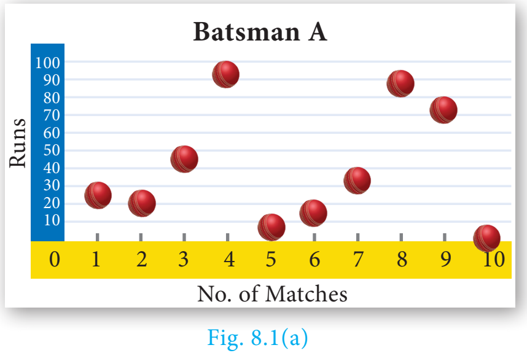

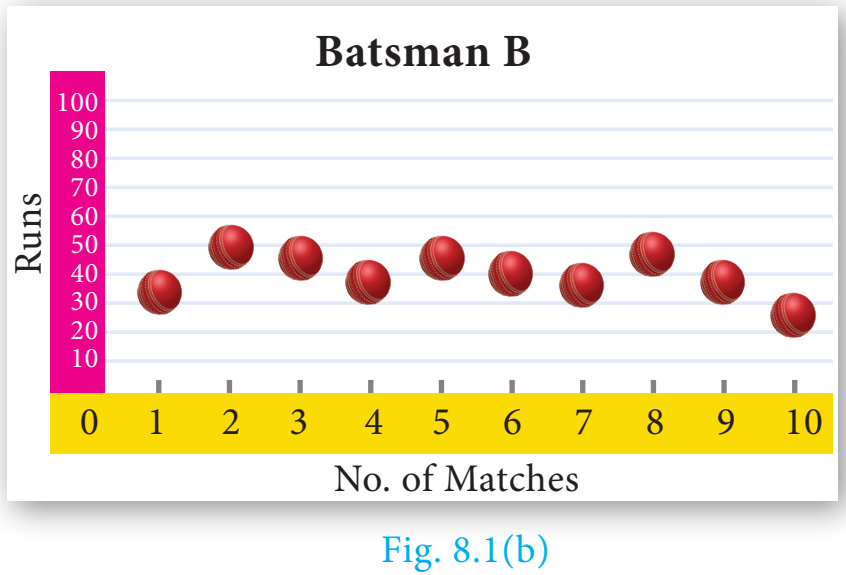

மேலேயுள்ள வரைபடத்திலிருந்து மட்டைப் பந்தாட்ட வீரர் $B$-யின் சராசரி ஓட்டங்கள் சராசரிக்கு அருகில் காணப்படுகின்றன. ஆனால் மட்டைப் பந்தாட்ட வீரர் $A$-யின் ஓட்டங்கள் 0 முதல் 100 வரை சிதறியிருக்கின்றன. எனினும் இவ்விருவரின் சராசரி சமமாகவே உள்ளது.

இதனால் தரவுகளின் மதிப்புகள் எவ்வாறு பரவுகின்றன என்பதைத் தீர்மானிக்கச் சில கூடுதல் புள்ளியியல் தகவல்கள் தேவைப்படுகிறது. இதற்காக நாம் பரவல் அளவைகளைப் பற்றி விவாதிக்கலாம்.

பரவல் அளவையானது மதிப்புகள் பரவியுள்ளதைப் பற்றி அறிய உதவும். மேலும், ஒரு தரவில் கொடுக்கப்பட்டுள்ள தரவுப் புள்ளிகள் இந்தத் தரவில் எவ்வாறு பரவியுள்ளன என்ற கருத்தைத் தெரிவிக்கும்.

##### பரவல்களின் பல்வேறு அளவைகள்

1. வீச்சு
2. சராசரி விலக்கம்
3. கால்மான விலக்கம்
4. திட்ட விலக்கம்
5. விலக்க வர்க்க சராசரி
6. மாறுபாட்டுக் கெழு

### 8.2.1 வீச்சு (Range)

தரவில் கொடுக்கப்பட்ட மிகப் பெரிய மதிப்பிற்கும் மிகச் சிறிய மதிப்பிற்கும் உள்ள வேறுபாடு வீச்சு எனப்படும்.

$$
\text{வீச்சு }R=L-S
$$

$$
\text{வீச்சின் குணகம் (அ) கெழு}=\frac{L-S}{L+S}
$$

இங்கு $L$ - தரவுப் புள்ளிகளின் மிகப் பெரிய மதிப்பு

$S$ - தரவுப் புள்ளிகளின் மிகச் சிறிய மதிப்பு

> **முன்னேற்றச் சோதனை**
>
> முதல் பத்து பகா எண்களின் வீச்சு ________ ஆகும்.

#### எடுத்துக்காட்டு 8.1

கொடுக்கப்பட்ட தரவுப் புள்ளிகளுக்கு வீச்சு மற்றும் வீச்சுக்கெழு ஆகியவற்றைக் காண்க: 25, 67, 48, 53, 18, 39, 44.

**தீர்வு** மிகப் பெரிய மதிப்பு, $L=67$; மிகச் சிறிய மதிப்பு, $S=18$

$$
\text{வீச்சு }R=L-S=67-18=49
$$

$$
\text{வீச்சுக் கெழு}=\frac{L-S}{L+S}
$$

$$
\text{வீச்சுக் கெழு}=\frac{67-18}{67+18}=\frac{49}{85}=0.576
$$

#### எடுத்துக்காட்டு 8.2

கொடுக்கப்பட்ட பரவலின் வீச்சு காண்க.

| வயது (வருடங்களில்) | 16-18 | 18-20 | 20-22 | 22-24 | 24-26 | 26-28 |
| --- | --- | --- | --- | --- | --- | --- |
| மாணவர்களின் எண்ணிக்கை | 0 | 4 | 6 | 8 | 2 | 2 |

**தீர்வு** இங்கு மிகப் பெரிய மதிப்பு $L=28$

மிகச் சிறிய மதிப்பு $S=16$

$$
\text{வீச்சு }R=L-S
$$

$$
R=28-16=12\text{ வருடங்கள்.}
$$

> **குறிப்பு**
>
> முதல் இடைவெளியின் நிகழ்வெண் ஆனது பூச்சியம் எனில், அடுத்த இடைவெளியின் நிகழ்வெண்ணைப் பயன்படுத்தி வீச்சு கணக்கிட வேண்டும்.

#### எடுத்துக்காட்டு 8.3

ஒரு தரவின் வீச்சு 13.67 மற்றும் மிகப் பெரிய மதிப்பு 70.08 எனில் மிகச் சிறிய மதிப்பைக் காண்க.

**தீர்வு**

$$
\begin{aligned}
\text{வீச்சு, }R&=13.67\\
\text{மிகப் பெரிய மதிப்பு, }L&=70.08\\
\text{வீச்சு, }R&=L-S\\
13.67&=70.08-S\\
S&=70.08-13.67=56.41
\end{aligned}
$$

எனவே, மிகச் சிறிய மதிப்பு 56.41.

> **குறிப்பு**
>
> வீச்சின் மூலமாக மையப்போக்கு அளவைகளிலிருந்து தரவுகளின் பரவலைத் துல்லியமாக அறிய முடியாது. எனவே, மையப்போக்கு அளவைகளிலிருந்து விலகல் சார்ந்த அளவு நமக்கு தேவைப்படுகிறது.

### 8.2.2 சராசரியிலிருந்து விலகல் (Deviations from the mean)

கொடுக்கப்பட்ட $x_1,x_2,\ldots x_n$ என்ற $n$ தரவுப்புள்ளிகளுக்கு $x_1-\bar x$, $x_2-\bar x$, $\ldots$, $x_n-\bar x$ என்பன சராசரி $\bar x$-லிருந்து உள்ள விலகல்கள் ஆகும்.

### 8.2.3 சராசரியிலிருந்து விலக்க வர்க்கம் (Squares of deviations from the mean)

$x_1,x_2,\ldots,x_n$ ஆகியவைகளின் சராசரி $\bar x$-லிருந்து உள்ள விலகல்களின் வர்க்கங்கள் $(x_1-\bar x)^2,(x_2-\bar x)^2,\ldots,(x_n-\bar x)^2$ அல்லது $\sum_{i=1}^n(x_i-\bar x)^2$ ஆகும்.

> **குறிப்பு**
>
> எல்லா $x_i$, $i=1,2,3,\ldots,n$ மதிப்புகளுக்கும் $(x_i-\bar x)\ge0$ என்பது குறிப்பிடத்தக்கது. சராசரியிலிருந்து உள்ள விலகல் $(x_i-\bar x)$ சிறியது எனில், சராசரி விலக்கங்களின் வர்க்கம் மிகச்சிறியது ஆகும்.

### 8.2.4 விலக்க வர்க்கச் சராசரி (Variance)

தரவுத் தொகுப்பிலுள்ள ஒவ்வொரு தரவுப் புள்ளிக்கும், அதன் கூட்டு சராசரிக்கும் இடையேயுள்ள வித்தியாசங்களை வர்க்கப்படுத்தி, அந்த வர்க்கங்களுக்கு சராசரி காண்பது விலக்க வர்க்கச் சராசரி ஆகும். இதை $\sigma^2$ என்று குறிக்கலாம்.

விலக்க வர்க்கச் சராசரி $=$ விலக்கத்தின் வர்க்கத்தின் சராசரி

$$
=\frac{(x_1-\bar x)^2+(x_2-\bar x)^2+\cdots+(x_n-\bar x)^2}{n}
$$

$$
\text{விலக்க வர்க்கச் சராசரி }\sigma^2=\frac{\sum_{i=1}^n(x_i-\bar x)^2}{n}
$$

> **சிந்தனைக் களம்**
>
> விலக்க வர்க்கச் சராசரி ஒரு குறை எண்ணாக இருக்க முடியுமா?

### 8.2.5 திட்ட விலக்கம் (Standard Deviation)

விலக்க வர்க்கச் சராசரியின் மிகை வர்க்கமூலம் திட்டவிலக்கம் எனப்படும்.

திட்ட விலக்கமானது, எவ்வாறு ஒவ்வொரு மதிப்பும் கூட்டு சராசரியிலிருந்து பரவி அல்லது விலகி உள்ளது என்பதைத் தெளிவுபடுத்துகிறது.

$$
\text{திட்ட விலக்கம }\sigma=\sqrt{\frac{\sum_{i=1}^n(x_i-\bar x)^2}{n}}
$$

> **உங்களுக்குத் தெரியுமா?**
>
> கார்ல் பியர்சன், முதன்முதலில் "திட்டவிலக்கம்" என்ற வார்த்தையைப் பயன்படுத்தியவராவார். சராசரி பிழை என்ற வார்த்தையை முதன்முதலில் பயன்படுத்தியவர் ஜெர்மன் கணிதவியலாளர் காஸ் ஆவார்.

##### தொகுக்கப்படாத தரவுகளின் திட்ட விலக்கம் காணுதல்

**(i) நேரடி முறை**

$$
\begin{aligned}
\text{திட்ட விலக்கம் }\sigma&=\sqrt{\frac{\Sigma(x_i-\bar x)^2}{n}}\\
&=\sqrt{\frac{\Sigma(x_i^2-2x_i\bar x+\bar x^2)}{n}}\\
&=\sqrt{\frac{\Sigma x_i^2}{n}-2\bar x\frac{\Sigma x_i}{n}+\frac{\bar x^2}{n}\times(1+1+\cdots n\text{ முறைகள்})}\\
&=\sqrt{\frac{\Sigma x_i^2}{n}-2\bar x\times\bar x+\frac{\bar x^2}{n}\times n}=\sqrt{\frac{\Sigma x_i^2}{n}-2\bar x^2+\bar x^2}=\sqrt{\frac{\Sigma x_i^2}{n}-\bar x^2}
\end{aligned}
$$

$$
\text{திட்ட விலக்கம், }\sigma=\sqrt{\frac{\Sigma x_i^2}{n}-\left(\frac{\Sigma x_i}{n}\right)^2}
$$

> **குறிப்பு**
>
> கொடுக்கப்பட்ட தரவுகளுக்குத் திட்டவிலக்கம் மற்றும் சராசரி ஒரே அலகில் அமையும்.

> **குறிப்பு**
>
> - திட்டவிலக்கம் காணும்போது, தரவுப் புள்ளிகள் ஏறுவரிசையில் இருக்க வேண்டிய அவசியம் இல்லை.
> - தரவுப் புள்ளிகள் நேரடியாகக் கொடுக்கப்பட்டிருந்தால் திட்ட விலக்கம் காண $\sigma=\sqrt{\dfrac{\Sigma x_i^2}{n}-\left(\dfrac{\Sigma x_i}{n}\right)^2}$ என்ற சூத்திரத்தைப் பயன்படுத்தலாம்.
> - தரவுப் புள்ளிகள் நேரடியாகக் கொடுக்கப்படவில்லை, ஆனால் சராசரியிலிருந்து பெறப்பட்ட விலக்கங்களின் வர்க்கங்கள் கொடுக்கப்பட்டிருந்தால், நாம் திட்ட விலக்கம் காண $\sigma=\sqrt{\dfrac{\Sigma(x_i-\bar x)^2}{n}}$ என்ற சூத்திரத்தைப் பயன்படுத்தலாம்

#### எடுத்துக்காட்டு 8.4

ஒரு வாரத்தின் ஒவ்வொரு நாளிலும் விற்கப்பட்ட தொலைக்காட்சிப் பெட்டிகளின் எண்ணிக்கை பின்வருமாறு 13, 8, 4, 9, 7, 12, 10. இந்தத் தரவின் திட்ட விலக்கம் காண்க.

**தீர்வு**

| $x_i$ | $x_i^2$ |
| --- | --- |
| 13 | 169 |
| 8 | 64 |
| 4 | 16 |
| 9 | 81 |
| 7 | 49 |
| 12 | 144 |
| 10 | 100 |
| $\Sigma x_i=63$ | $\Sigma x_i^2=623$ |

திட்ட விலக்கம்

$$
\sigma=\sqrt{\frac{\Sigma x_i^2}{n}-\left(\frac{\Sigma x_i}{n}\right)^2}
$$

$$
=\sqrt{\frac{623}{7}-\left(\frac{63}{7}\right)^2}
$$

$$
=\sqrt{89-81}=\sqrt8
$$

எனவே, $\sigma\simeq2.83$

> **சிந்தனைக் களம்**
>
> திட்டவிலக்கம், விலக்க வர்க்கச் சராசரியை விடப் பெரிதாக இருக்க முடியுமா?

> **முன்னேற்றச் சோதனை**
>
> விலக்க வர்க்கச் சராசரி 0.49 எனில், திட்ட விலக்கமானது ________.

**(ii) கூட்டு சராசரி முறை**

திட்ட விலக்கத்தை காண கீழ்க்காணும் மற்றொரு சூத்திரத்தையும் பயன்படுத்தலாம்.

$$
\text{திட்ட விலக்கம் (கூட்டு சராசரி முறை) }\sigma=\sqrt{\frac{\Sigma(x_i-\bar x)^2}{n}}
$$

இங்கு, $d_i=x_i-\bar x$ எனில், $\sigma=\sqrt{\dfrac{\Sigma d_i^2}{n}}$

#### எடுத்துக்காட்டு 8.5

ஒரு குறிப்பிட்ட பருவத்தில் 6 நாள்களில் பெய்யும் மழையின் அளவானது 17.8 செ.மீ, 19.2 செ.மீ, 16.3 செ.மீ, 12.5 செ.மீ, 12.8 செ.மீ, 11.4 செ.மீ எனில், இந்தத் தரவிற்குத் திட்டவிலக்கம் காண்க.

**தீர்வு** கொடுக்கப்பட்ட தரவின் ஏறுவரிசையில் எழுதக்கிடைப்பது 11.4, 12.5, 12.8, 16.3, 17.8, 19.2 ஆகும். தரவுப் புள்ளிகளின் எண்ணிக்கை $n=6$

$$
\text{சராசரி}=\frac{11.4+12.5+12.8+16.3+17.8+19.2}{6}=\frac{90}{6}=15
$$

| $x_i$ | $d_i=x_i-\bar x=x-15$ | $d_i^2$ |
| --- | --- | --- |
| 11.4 | $-3.6$ | 12.96 |
| 12.5 | $-2.5$ | 6.25 |
| 12.8 | $-2.2$ | 4.84 |
| 16.3 | 1.3 | 1.69 |
| 17.8 | 2.8 | 7.84 |
| 19.2 | 4.2 | 17.64 |
| | | $\Sigma d_i^2=51.22$ |

$$
\text{திட்ட விலக்கம் }\sigma=\sqrt{\frac{\Sigma d_i^2}{n}}=\sqrt{\frac{51.22}{6}}=\sqrt{8.53}
$$

ஆகவே, $\sigma\simeq2.9$

**(iii) ஊகச் சராசரி முறை**

சராசரியின் மதிப்பு முழுக்கணாக இல்லாதபோது, ஊகச் சராசரி முறையைப் பயன்படுத்தி திட்ட விலக்கம் காண்பது சிறந்தது (ஏனெனில் தசமக் கணக்கீடுகள் சற்று கடினமாக இருக்கும் என்பதால்).

தரவுப் புள்ளிகளை $x_1, x_2, x_3, \ldots, x_n$ என எடுத்துக் கொண்டால் $\bar x$-ஐ அதன் சராசரியாக கொள்ளலாம்.

$x_i$-யிலிருந்து ஊகச் சராசரி $(A)$ யின் விலகலே $d_i$ ஆகும். ($A$ ஆனது கொடுக்கப்பட்ட தரவுகளின் இடைப்பட்ட ஒரு தரவுப்புள்ளி).

$$
d_i=x_i-A\Rightarrow x_i=d_i+A\qquad\cdots(1)
$$

$$
\begin{aligned}
\Sigma d_i&=\Sigma(x_i-A)\\
&=\Sigma x_i-(A+A+A+\cdots to\ n\text{ முறைகள்})\\
\Sigma d_i&=\Sigma x_i-A\times n\\
\frac{\Sigma d_i}{n}&=\frac{\Sigma x_i}{n}-A\\
\bar d&=\bar x-A\text{ (அல்லது) }\bar x=\bar d+A\qquad\cdots(2)
\end{aligned}
$$

திட்ட விலக்கமானது,

$$
\begin{aligned}
\sigma&=\sqrt{\frac{\Sigma(x_i-\bar x)^2}{n}}=\sqrt{\frac{\Sigma(d_i+A-\bar d-A)^2}{n}}\quad((1),(2)\text{பயன்படுத்த})\\
&=\sqrt{\frac{\Sigma(d_i-\bar d)^2}{n}}=\sqrt{\frac{\Sigma(d_i^2-2d_i\times\bar d+\bar d^2)}{n}}\\
&=\sqrt{\frac{\Sigma d_i^2}{n}-2\bar d\frac{\Sigma d_i}{n}+\frac{\bar d^2}{n}(1+1+1+\cdots n\text{ முறைகள்})}\\
&=\sqrt{\frac{\Sigma d_i^2}{n}-2\bar d\times\bar d+\frac{\bar d^2}{n}\times n}\quad\text{(காரணம் }\bar d\text{ ஆனது ஒரு மாறிலி)}\\
&=\sqrt{\frac{\Sigma d_i^2}{n}-\bar d^2}
\end{aligned}
$$

$$
\text{திட்ட விலக்கம }\sigma=\sqrt{\frac{\Sigma d_i^2}{n}-\left(\frac{\Sigma d_i}{n}\right)^2}
$$

> **சிந்தனைக் களம்**
>
> $n$-ன் எல்லா மதிப்புகளுக்கும்
>
> (i) $\Sigma(x_i-\bar x)$ (ii) $(\Sigma x_i)-\bar x$ ஆகியவற்றின் மதிப்பைக் காண முடியுமா?

#### எடுத்துக்காட்டு 8.6

ஒரு வகுப்புத் தேர்வில், 10 மாணவர்களின் மதிப்பெண்கள் 25, 29, 30, 33, 35, 37, 38, 40, 44, 48 ஆகும். மாணவர்கள் பெற்ற மதிப்பெண்களின் திட்ட விலக்கத்தைக் காண்க.

**தீர்வு** மதிப்பெண்களின் சராசரி $=35.9$. இந்த மதிப்பானது தரவுகளின் நடுமதிப்பாக அமையும். அதனால் நாம் ஊகச் சராசரி $A=35$, என எடுத்துக் கொள்கிறோம், மேலும், $n=10$.

| $x_i$ | $d_i=x_i-A$, $d_i=x_i-35$ | $d_i^2$ |
| --- | --- | --- |
| 25 | $-10$ | 100 |
| 29 | $-6$ | 36 |
| 30 | $-5$ | 25 |
| 33 | $-2$ | 4 |
| 35 | 0 | 0 |
| 37 | 2 | 4 |
| 38 | 3 | 9 |
| 40 | 5 | 25 |
| 44 | 9 | 81 |
| 48 | 13 | 169 |
| | $\Sigma d_i=9$ | $\Sigma d_i^2=453$ |

திட்ட விலக்கம்

$$
\sigma=\sqrt{\frac{\Sigma d_i^2}{n}-\left(\frac{\Sigma d_i}{n}\right)^2}
$$

$$
=\sqrt{\frac{453}{10}-\left(\frac9{10}\right)^2}
$$

$$
=\sqrt{45.3-0.81}
$$

$$
=\sqrt{44.49}
$$

$$
\sigma\simeq6.67
$$

**(iv) படி விலக்க முறை**

கொடுக்கப்பட்ட தரவுப் புள்ளிகளை $x_1,x_2,x_3,\ldots x_n$ எனக் கருதுவோம். இதன் ஊகச் சராசரியை $A$ எனக் கொள்ளலாம்.

$x_i-A$-ன் பொது வகுத்தி $c$ என்க.

$$
\begin{aligned}
d_i&=\frac{x_i-A}{c}\text{ எனில், }x_i=d_ic+A\qquad\cdots(1)\\
\Sigma x_i&=\Sigma(d_ic+A)=c\Sigma d_i+A\times n\\
\frac{\Sigma x_i}{n}&=c\frac{\Sigma d_i}{n}+A\\
\bar x&=c\bar d+A\qquad\cdots(2)\\
x_i-\bar x&=cd_i+A-c\bar d-A=c(d_i-\bar d)\quad((1),(2)\text{ஐப் பயன்படுத்த})
\end{aligned}
$$

$$
\sigma=\sqrt{\frac{\Sigma(x_i-\bar x)^2}{n}}=\sqrt{\frac{\Sigma(c(d_i-\bar d))^2}{n}}=\sqrt{\frac{c^2\Sigma(d_i-\bar d)^2}{n}}
$$

$$
\sigma=c\times\sqrt{\frac{\Sigma d_i^2}{n}-\left(\frac{\Sigma d_i}{n}\right)^2}
$$

> **குறிப்பு**
>
> மேலே கொடுக்கப்பட்டுள்ள முறைகளில் ஏதேனும் ஒரு முறையைப் பயன்படுத்தித் திட்ட விலக்கத்தைக் காணலாம்.

> **செயல்பாடு 1**
>
> காலாண்டுத் தேர்வு மற்றும் முதல் இடைத் தேர்வு ஆகியவற்றில் ஐந்து பாடங்களில் நீங்கள் பெற்ற மதிப்பெண்களைக் கொண்டு தனித்தனியாகத் திட்டவிலக்கம் காண்க. விடைகளிலிருந்து நீங்கள் என்ன தெரிந்து கொண்டீர்கள்?

#### எடுத்துக்காட்டு 8.7

ஒரு பள்ளி சுற்றுலாவில் குழந்தைகள் தின்பண்டங்கள் வாங்குவதற்காக செலவு செய்த தொகையானது முறையே 5, 10, 15, 20, 25, 30, 35, 40 ஆகும். படி விலக்க முறையைப் பயன்படுத்தி அவர்கள் செய்த செலவிற்குத் திட்ட விலக்கம் காண்க.

**தீர்வு** கொடுக்கப்பட்ட எல்லா தரவுப் புள்ளிகளும் 5 ஆல் வகுபடும் எனக்க. அதனால் நாம் ஊகச் சராசரி முறையைப் பின்பற்றலாம். $A=20$, $n=8$.

| $x_i$ | $d_i=x_i-A$, $d_i=x_i-20$ | $d_i=\dfrac{x_i-A}{c}$, $c=5$ | $d_i^2$ |
|---|---|---|---|
| 5 | −15 | −3 | 9 |
| 10 | −10 | −2 | 4 |
| 15 | −5 | −1 | 1 |
| 20 | 0 | 0 | 0 |
| 25 | 5 | 1 | 1 |
| 30 | 10 | 2 | 4 |
| 35 | 15 | 3 | 9 |
| 40 | 20 | 4 | 16 |
| | | $\Sigma d_i=4$ | $\Sigma d_i^2=44$ |

திட்ட விலக்கம்

$$
\sigma=\sqrt{\frac{\Sigma d_i^2}{n}-\left(\frac{\Sigma d_i}{n}\right)^2}\times c
$$

$$
=\sqrt{\frac{44}{8}-\left(\frac{4}{8}\right)^2}\times5=\sqrt{\frac{11}{2}-\frac14}\times5
$$

$$
=\sqrt{5.5-0.25}\times5=2.29\times5
$$

$$
\sigma\simeq11.45
$$

#### எடுத்துக்காட்டு 8.8

கொடுக்கப்பட்டுள்ள தரவிற்குத் திட்டவிலக்கம் காண்க. 7, 4, 8, 10, 11. இதன் எல்லா மதிப்புகளுடனும் 3-ஐ கூட்டும்போது கிடைக்கும் புதிய தரவிற்குத் திட்டவிலக்கம் காண்க.

**தீர்வு** கொடுக்கப்பட்ட தரவுப் புள்ளிகளின் ஏறு வரிசை 4, 7, 8, 10, 11 மற்றும் $n=5$

| $x_i$ | $x_i^2$ |
|---|---|
| 4 | 16 |
| 7 | 49 |
| 8 | 64 |
| 10 | 100 |
| 11 | 121 |
| $\Sigma x_i=40$ | $\Sigma x_i^2=350$ |

திட்ட விலக்கம்

$$
\sigma=\sqrt{\frac{\Sigma x_i^2}{n}-\left(\frac{\Sigma x_i}{n}\right)^2}
$$

$$
=\sqrt{\frac{350}{5}-\left(\frac{40}{5}\right)^2}
$$

$$
\sigma=\sqrt6\simeq2.45
$$

அனைத்து தரவுப் புள்ளிகளையும் 3 ஆல் கூட்டும் போது, நமக்குக் கிடைக்கும் புதிய தரவுப் புள்ளிகள் 7, 10, 11, 13, 14 ஆகும்.

| $x_i$ | $x_i^2$ |
|---|---|
| 7 | 49 |
| 10 | 100 |
| 11 | 121 |
| 13 | 169 |
| 14 | 196 |
| $\Sigma x_i=55$ | $\Sigma x_i^2=635$ |

திட்ட விலக்கம்

$$
\sigma=\sqrt{\frac{\Sigma x_i^2}{n}-\left(\frac{\Sigma x_i}{n}\right)^2}
$$

$$
=\sqrt{\frac{635}{5}-\left(\frac{55}{5}\right)^2}
$$

$$
\sigma=\sqrt6\simeq2.45
$$

> கொடுக்கப்பட்ட ஒவ்வொரு தரவுப் புள்ளியுடன் ஏதேனும் மாறிலி $k$-யைக் கூட்டினால், திட்ட விலக்கம் மாறாது.

#### எடுத்துக்காட்டு 8.9

கொடுக்கப்பட்ட தரவின் திட்ட விலக்கம் காண்க. 2, 3, 5, 7, 8. ஒவ்வொரு தரவுப் புள்ளியையும் 4-ஆல் பெருக்கினால் கிடைக்கும் புதிய தரவின் மதிப்பிற்குத் திட்ட விலக்கம் காண்க.

**தீர்வு** கொடுக்கப்பட்டவை, $n=5$

| $x_i$ | $x_i^2$ |
|---|---|
| 2 | 4 |
| 3 | 9 |
| 5 | 25 |
| 7 | 49 |
| 8 | 64 |
| $\Sigma x_i=25$ | $\Sigma x_i^2=151$ |

திட்ட விலக்கம் $\sigma=\sqrt{\dfrac{\Sigma x_i^2}{n}-\left(\dfrac{\Sigma x_i}{n}\right)^2}$

$$
\sigma=\sqrt{\frac{151}{5}-\left(\frac{25}{5}\right)^2}=\sqrt{30.2-25}=\sqrt{5.2}\simeq2.28
$$

அனைத்து தரவுப் புள்ளிகளையும் 4ஆல் பெருக்கக் கிடைக்கும் புதிய தரவுப் புள்ளிகள் 8, 12, 20, 28, 32 ஆகும்.

| $x_i$ | $x_i^2$ |
|---|---|
| 8 | 64 |
| 12 | 144 |
| 20 | 400 |
| 28 | 784 |
| 32 | 1024 |
| $\Sigma x_i=100$ | $\Sigma x_i^2=2416$ |

திட்ட விலக்கம் $\sigma=\sqrt{\dfrac{\Sigma x_i^2}{n}-\left(\dfrac{\Sigma x_i}{n}\right)^2}$

$$
=\sqrt{\frac{2416}{5}-\left(\frac{100}{5}\right)^2}=\sqrt{483.2-400}=\sqrt{83.2}
$$

$$
\sigma=\sqrt{16\times5.2}=4\sqrt{5.2}\simeq9.12
$$

> கொடுக்கப்பட்ட ஒவ்வொரு தரவுப் புள்ளியையும் மாறிலி $k$-ஆல் பெருக்கும்போது கிடைக்கும் புதிய தரவின் திட்ட விலக்கம் $k$ மடங்காக அதிகரிக்கிறது.

#### எடுத்துக்காட்டு 8.10

முதல் $n$ இயல் எண்களின் சராசரி மற்றும் விலக்க வர்க்கச் சராசரிகளைக் காண்க.

**தீர்வு**

$$
\text{சராசரி }\bar x=\frac{\text{தரவுப் புள்ளிகளின் கூடுதல் மதிப்பு}}{\text{தரவுப் புள்ளிகளின் எண்ணிக்கை}}
$$

$$
=\frac{\Sigma x_i}{n}=\frac{1+2+3+\cdots+n}{n}=\frac{n(n+1)}{2\times n}
$$

$$
\text{சராசரி }\bar x=\frac{n+1}{2}
$$

$$
\text{விலக்க வர்க்கச் சராசரி }\sigma^2=\frac{\Sigma x_i^2}{n}-\left(\frac{\Sigma x_i}{n}\right)^2\quad\left[\Sigma x_i^2=1^2+2^2+3^2+\cdots+n^2,\quad(\Sigma x_i)^2=(1+2+3+\cdots+n)^2\right]
$$

$$
=\frac{n(n+1)(2n+1)}{6\times n}-\left[\frac{n(n+1)}{2\times n}\right]^2
$$

$$
=\frac{2n^2+3n+1}{6}-\frac{n^2+2n+1}{4}
$$

$$
\text{விலக்க வர்க்கச் சராசரி }\sigma^2=\frac{4n^2+6n+2-3n^2-6n-3}{12}=\frac{n^2-1}{12}.
$$

##### தொகுக்கப்பட்ட தரவின் திட்ட விலக்கத்தினைக் கணக்கிடல்

**(i) சராசரி முறை**

$$
\text{திட்ட விலக்கம் }\sigma=\sqrt{\frac{\Sigma f_i(x_i-\bar x)^2}{N}}
$$

$$
d_i=x_i-\bar x
$$

$$
\sigma=\sqrt{\frac{\Sigma f_id_i^2}{N}},\text{ இங்கு }N=\sum_{i=1}^{n}f_i
$$

> ($f_i$ என்பது $x_i$ எனும் தரவுப் புள்ளிகளின் நிகழ்வெண் மதிப்புகளாகும்)

#### எடுத்துக்காட்டு 8.11

ஒரு குறிப்பிட்ட வாரத்தில் 48 மாணவர்கள் தொலைக்காட்சி பார்ப்பதற்காகச் செலவிட்ட நேரம் கேட்டறியப்பட்டது. அந்தத் தகவலின் அடிப்படையில், கீழ்க்காணும் தரவின் திட்டவிலக்கம் காண்க.

| $x$ | 6 | 7 | 8 | 9 | 10 | 11 | 12 |
|---|---|---|---|---|---|---|---|
| $f$ | 3 | 6 | 9 | 13 | 8 | 5 | 4 |

**தீர்வு**

| $x_i$ | $f_i$ | $x_if_i$ | $d_i=x_i-\bar x$ | $d_i^2$ | $f_id_i^2$ |
|---|---|---|---|---|---|
| 6 | 3 | 18 | −3 | 9 | 27 |
| 7 | 6 | 42 | −2 | 4 | 24 |
| 8 | 9 | 72 | −1 | 1 | 9 |
| 9 | 13 | 117 | 0 | 0 | 0 |
| 10 | 8 | 80 | 1 | 1 | 8 |
| 11 | 5 | 55 | 2 | 4 | 20 |
| 12 | 4 | 48 | 3 | 9 | 36 |
| | $N=48$ | $\Sigma x_if_i=432$ | $\Sigma d_i=0$ | | $\Sigma f_id_i^2=124$ |

சராசரி $\bar x=\dfrac{\Sigma x_if_i}{N}=\dfrac{432}{48}=9$ (இங்கு $N=\sum f_i$)

திட்ட விலக்கம்

$$
\sigma=\sqrt{\frac{\Sigma f_id_i^2}{N}}=\sqrt{\frac{124}{48}}=\sqrt{2.58}
$$

$$
\sigma\simeq1.6
$$

**(ii) ஊகச் சராசரி முறை**

$x_1, x_2, x_3, \ldots x_n$ ஆகிய தரவுப் புள்ளிகளின் நிகழ்வெண்கள் முறையே $f_1, f_2, f_3, \ldots f_n$ என்றும் $\bar x$ என்பது சராசரி மற்றும் $A$ என்பது ஊகச் சராசரி என்க.

$$
d_i=x_i-A
$$

திட்ட விலக்கம், $\sigma=\sqrt{\dfrac{\Sigma f_id_i^2}{N}-\left(\dfrac{\Sigma f_id_i}{N}\right)^2}$

#### எடுத்துக்காட்டு 8.12

வகுப்புத் தேர்வில் மாணவர்கள் பெற்ற மதிப்பெண்கள் கீழே கொடுக்கப்பட்டுள்ளன. அவர்களின் மதிப்பெண்ணிற்குத் திட்ட விலக்கம் காண்க.

| $x$ | 4 | 6 | 8 | 10 | 12 |
|---|---|---|---|---|---|
| $f$ | 7 | 3 | 5 | 9 | 5 |

**தீர்வு** ஊகச்சராசரி $A=8$ என்க.

| $x_i$ | $f_i$ | $d_i=x_i-A$ | $f_id_i$ | $f_id_i^2$ |
|---|---|---|---|---|
| 4 | 7 | −4 | −28 | 112 |
| 6 | 3 | −2 | −6 | 12 |
| 8 | 5 | 0 | 0 | 0 |
| 10 | 9 | 2 | 18 | 36 |
| 12 | 5 | 4 | 20 | 80 |
| | $N=29$ | | $\Sigma f_id_i=4$ | $\Sigma f_id_i^2=240$ |

திட்ட விலக்கம்

$$
\sigma=\sqrt{\frac{\Sigma f_id_i^2}{N}-\left(\frac{\Sigma f_id_i}{N}\right)^2}
$$

$$
=\sqrt{\frac{240}{29}-\left(\frac{4}{29}\right)^2}=\sqrt{\frac{240\times29-16}{29\times29}}
$$

$$
\sigma=\sqrt{\frac{6944}{29\times29}}\Rightarrow\sigma\simeq2.87
$$

##### தொடர் நிகழ்வெண் பரவலின் திட்ட விலக்கத்தினைக் கணக்கிடுதல்

**(i) சராசரி முறை**

$$
\text{திட்ட விலக்கம் }\sigma=\sqrt{\frac{\Sigma f_i(x_i-\bar x)^2}{N}}
$$

இங்கு $x_i$ என்பது $i$-ஆவது இடைவெளியின் மைய மதிப்பு, $f_i$ என்பது $i$-ஆவது இடைவெளியின் நிகழ்வெண்.

**(ii) எளிய முறை (அல்லது) படி விலக்க முறை**

கணக்கீட்டை சுலபமாக செய்ய கீழ்க்காணும் சூத்திரம் கொடுக்கப்பட்டுள்ளது. இங்கு, $A$ என்பது ஊகச் சராசரி, $x_i$ என்பது $i$-ஆம் இடைவெளியின் மைய மதிப்பு, மேலும் $c$ என்பது இடைவெளியின் அகலம் ஆகும்.

$$
d_i=\frac{x_i-A}{c}\text{ என்க.}
$$

$$
\sigma=c\times\sqrt{\frac{\Sigma f_id_i^2}{N}-\left(\frac{\Sigma f_id_i}{N}\right)^2}
$$

#### எடுத்துக்காட்டு 8.13

ஒரு வகுப்பிலுள்ள மாணவர்கள், குறிப்பிட்ட பாடத்தில் பெற்ற மதிப்பெண்கள் கீழ்க்காணுமாறு கொடுக்கப்பட்டுள்ளன.

| மதிப்பெண்கள் | 0-10 | 10-20 | 20-30 | 30-40 | 40-50 | 50-60 | 60-70 |
|---|---|---|---|---|---|---|---|
| மாணவர்களின் எண்ணிக்கை | 8 | 12 | 17 | 14 | 9 | 7 | 4 |

இத்தரவிற்குத் திட்ட விலக்கம் காண்க.

**தீர்வு** ஊகச் சராசரி, $A=35$, $c=10$

| மதிப்பெண்கள் | மைய மதிப்பு $(x_i)$ | $f_i$ | $d_i=x_i-A$ | $d_i=\dfrac{x_i-A}{c}$ | $f_id_i$ | $f_id_i^2$ |
|---|---|---|---|---|---|---|
| 0-10 | 5 | 8 | -30 | −3 | −24 | 72 |
| 10-20 | 15 | 12 | -20 | −2 | −24 | 48 |
| 20-30 | 25 | 17 | -10 | −1 | −17 | 17 |
| 30-40 | 35 | 14 | 0 | 0 | 0 | 0 |
| 40-50 | 45 | 9 | 10 | 1 | 9 | 9 |
| 50-60 | 55 | 7 | 20 | 2 | 14 | 28 |
| 60-70 | 65 | 4 | 30 | 3 | 12 | 36 |
| | | $N=71$ | | | $\Sigma f_id_i=-30$ | $\Sigma f_id_i^2=210$ |

$$
\text{திட்ட விலக்கம் }\sigma=c\times\sqrt{\frac{\Sigma f_id_i^2}{N}-\left(\frac{\Sigma f_id_i}{N}\right)^2}
$$

$$
\sigma=10\times\sqrt{\frac{210}{71}-\left(-\frac{30}{71}\right)^2}=10\times\sqrt{\frac{210}{71}-\frac{900}{5041}}
$$

$$
=10\times\sqrt{2.779}\Rightarrow\sigma\simeq16.67
$$

> **சிந்தனைக் களம்**
>
> (1) ஒரு தரவின் திட்டவிலக்கமானது 2.8. அனைத்துத் தரவுப் புள்ளிகளுடன் 5-ஐக் கூட்டினால் கிடைக்கும் புதிய திட்ட விலக்கமானது ______.
>
> (2) $p$, $q$, $r$ ஆகியவற்றின் திட்டவிலக்கமானது $S$ எனில், $p-3$, $q-3$, $r-3$-யின் திட்டவிலக்கமானது ______ ஆகும்.

#### எடுத்துக்காட்டு 8.14

15 தரவுப் புள்ளிகளின் சராசரி மற்றும் திட்ட விலக்கம் முறையே 10, 5 என கண்டறியப்பட்டுள்ளது. அதை சரிபார்க்கும்பொழுது, கொடுக்கப்பட்ட ஒரு தரவுப் புள்ளி 8 என தவறுதலாக குறிக்கப்பட்டுள்ளது. அதன் சரியான தரவுப்புள்ளி 23 என இருந்தால் சரியான தரவின் சராசரி மற்றும் திட்ட விலக்கம் காண்க.

**தீர்வு** $n=15$, $\bar x=10$, $\sigma=5$; $\bar x=\dfrac{\Sigma x}{n}$; $\Sigma x=15\times10=150$

தவறான மதிப்பு $=8$, சரியான மதிப்பு $=23$.

$$
\text{திருத்தப்பட்ட கூடுதல}=150-8+23=165
$$

$$
\text{திருத்தப்பட்ட சராசரி }\bar x=\frac{165}{15}=11
$$

$$
\text{திட்ட விலக்கம் }\sigma=\sqrt{\frac{\Sigma x^2}{n}-\left(\frac{\Sigma x}{n}\right)^2}
$$

$$
\text{தவறான திட்ட விலக்கம் }\sigma=5=\sqrt{\frac{\Sigma x^2}{15}-(10)^2}
$$

$$
25=\frac{\Sigma x^2}{15}-100\Rightarrow\frac{\Sigma x^2}{15}=125
$$

$$
\Sigma x^2\text{-ன் தவறான மதிப்பு}=1875
$$

$$
\Sigma x^2\text{-ன் திருத்தப்பட்ட மதிப்பு}=1875-8^2+23^2=2340
$$

$$
\text{திருத்தப்பட்ட திட்ட விலக்கம் }\sigma=\sqrt{\frac{2340}{15}-(11)^2}
$$

$$
\sigma=\sqrt{156-121}=\sqrt{35}\Rightarrow\sigma\simeq5.9
$$

### பயிற்சி 8.1

1. கீழ்க்காணும் தரவுகளுக்கு வீச்சு மற்றும் வீச்சுக் கெழுவைக் காண்க.

   (i) 63, 89, 98, 125, 79, 108, 117, 68

   (ii) 43.5, 13.6, 18.9, 38.4, 61.4, 29.8

2. ஒரு தரவின் வீச்சு மற்றும் மிகச் சிறிய மதிப்பு ஆகியன முறையே 36.8 மற்றும் 13.4 எனில், மிகப்பெரிய மதிப்பைக் காண்க?

3. கொடுக்கப்பட்ட தரவின் வீச்சைக் காண்க.

   | வருமானம் | 400-450 | 450-500 | 500-550 | 550-600 | 600-650 |
   |---|---|---|---|---|---|
   | ஊழியர்களின் எண்ணிக்கை | 8 | 12 | 30 | 21 | 6 |

4. ஓர் ஆசிரியர் மாணவர்களை, அவர்களின் செய்முறை பதிவேடின் 60 பக்கங்களை நிறைவு செய்து வருமாறு கூறினார். எட்டு மாணவர்கள் முறையே 32, 35, 37, 30, 33, 36, 35, 37 பக்கங்கள் மட்டுமே நிறைவு செய்திருந்தனர். மாணவர்கள் நிறைவு செய்த பக்கங்களின் திட்டவிலக்கத்தை காண்க.

5. 10 ஊழியர்களின் ஊதியம் கீழே கொடுக்கப்பட்டுள்ளது. ஊதியங்களின் விலக்க வர்க்கச் சராசரி மற்றும் திட்ட விலக்கம் காண்க. ₹310, ₹290, ₹320, ₹280, ₹300, ₹290, ₹320, ₹310, ₹280.

6. ஒரு சுவர் கடிகாரம் 1 மணிக்கு 1 முறையும், 2 மணிக்கு 2 முறையும், 3 மணிக்கு 3 முறையும் ஒலி எழுப்புகிறது எனில், ஒரு நாளில் அக்கடிகாரம் எவ்வளவு முறை ஒலி எழுப்பும்? மேலும் கடிகாரம் எழுப்பும் ஒலி எண்ணிக்கைகளின் திட்ட விலக்கம் காண்க.

7. முதல் 21 இயல் எண்களின் திட்ட விலக்கத்தைக் காண்க.

8. ஒரு தரவின் திட்ட விலக்கம் 4.5 ஆகும். அதில் இருக்கும் தரவுப் புள்ளி ஒவ்வொன்றிலும் 5-ஐ கழிக்க கிடைக்கும் புதிய தரவின் திட்ட விலக்கம் காண்க.

9. ஒரு தரவின் திட்ட விலக்கம் 3.6 ஆகும். அதன் ஒவ்வொரு புள்ளியையும் 3 ஆல் வகுக்கும்போது கிடைக்கும் புதிய தரவின் திட்ட விலக்கம் மற்றும் விலக்க வர்க்கச் சராசரியைக் காண்க.

10. ஒரு வாரத்தில் ஐந்து மாவட்டங்களில் வெவ்வேறு இடங்களில் பெய்த மழையின் அளவானது பதிவு செய்யப்பட்டு கீழே கொடுக்கப்பட்டுள்ளது. கொடுக்கப்பட்டுள்ள மழையளவின் தரவிற்குத் திட்ட விலக்கம் காண்க.

    | மழையளவு (மி.மீ) | 45 | 50 | 55 | 60 | 65 | 70 |
    |---|---|---|---|---|---|---|
    | இடங்களின் எண்ணிக்கை | 5 | 13 | 4 | 9 | 5 | 4 |

11. வைரஸ் காய்ச்சலைப் பற்றிய கருத்துக் கணிப்பில், பாதிக்கப்பட்ட மக்களின் எண்ணிக்கை கீழேக் கொடுக்கப்பட்டுள்ளது. இத்தரவின் திட்ட விலக்கம் காண்க.

    | வயது (வருடங்களில்) | 0-10 | 10-20 | 20-30 | 30-40 | 40-50 | 50-60 | 60-70 |
    |---|---|---|---|---|---|---|---|
    | பாதிக்கப்பட்ட மக்களின் எண்ணிக்கை | 3 | 5 | 16 | 18 | 12 | 7 | 4 |

12. ஒரு தொழிற்சாலையில் தயாரிக்கப்பட்ட தட்டுகளின் விட்ட அளவுகள் (செ.மீ.-ல்) கீழே கொடுக்கப்பட்டுள்ளன. இதன் திட்ட விலக்கம் காண்க.

    | விட்டங்கள் (செ.மீ) | 21-24 | 25-28 | 29-32 | 33-36 | 37-40 | 41-44 |
    |---|---|---|---|---|---|---|
    | தட்டுகளின் எண்ணிக்கை | 15 | 18 | 20 | 16 | 8 | 7 |

13. 50 மாணவர்கள் 100 மீட்டர் தூரத்தை கடக்க எடுத்துக்கொண்ட கால அளவுகள் கீழேறி கொடுக்கப்பட்டுள்ளன. அவற்றின் திட்ட விலக்கம் காண்க.

    | எடுத்துக்கொண்ட நேரம் (வினாடியில்) | 8.5-9.5 | 9.5-10.5 | 10.5-11.5 | 11.5-12.5 | 12.5-13.5 |
    |---|---|---|---|---|---|
    | மாணவர்களின் எண்ணிக்கை | 6 | 8 | 17 | 10 | 9 |

14. 100 மாணவர்கள் கொண்ட ஒரு குழுவில், அவர்கள் எடுத்த மதிப்பெண்களின் சராசரி மற்றும் திட்டவிலக்கமானது முறையே 60 மற்றும் 15 ஆகும். பின்னர் 45 மற்றும் 72 என்ற இரு மதிப்பெண்களுக்குப் பதிலாக முறையே 40 மற்றும் 27 என்ற தவறாகப் பதிவு செய்யப்பட்டது தெரிய வந்தது. அவற்றைச் சரி செய்தால் கிடைக்கப்பெறும் புதிய தரவின் சராசரியும் திட்ட விலக்கமும் காண்க.

15. ஏழு தரவுப் புள்ளிகளின் சராசரி மற்றும் விலக்க வர்க்கச் சராசரி முறையே 8, 16 ஆகும். அதில் ஐந்து தரவுப் புள்ளிகள் 2, 4, 10, 12 மற்றும் 14 எனில் மீது உள்ள இரு தரவுப் புள்ளிகளைக் கண்டறிக.

## 8.3 மாறுபாட்டுக் கெழு (Coefficient of Variation)

இரண்டு தரவுகளின், மையப்போக்கு அளவைகள் மற்றும் பரவல் அளவைகளை ஒப்பிடும்போது அவை அர்த்தமற்றதாக உள்ளன. ஏனெனில் தரவில் கருதும் மாறிகள் வெவ்வேறு அலகுகளைக் கொண்டிருக்கலாம்.

எடுத்துக்காட்டாக, இந்த இரண்டு தரவுகளை எடுத்துக்கொள்வோம்

| | எடை | விலை |
|---|---|---|
| சராசரி | 8 கி.கி | ₹85 |
| திட்ட விலக்கம் | 1.5 கி.கி | ₹21.60 |

இரண்டு அல்லது அதற்கு மேற்பட்ட தரவுகளின் ஒத்த மாற்றங்களை ஒப்பிட திட்டவிலக்கத்திற்கு தொடர்புடைய அளவான, மாறுபாட்டுக் கெழு பயன்படுத்தப்படுகிறது.

ஒரு தரவின் மாறுபாட்டுக் கெழுவானது, அதன் திட்டவிலக்கத்தை சராசரியினால் வகுக்கும்போது கிடைப்பதாகும். இதைப் பொதுவாகச் சதவீதத்தில் குறிப்பிடலாம். இந்தக் கருத்தை நமக்கு அளித்தவர் மிகவும் புகழ்பெற்ற புள்ளியியலாளர் கார்ல் பியர்சன் ஆவார்.

எனவே, முதல் தரவின் மாறுபாட்டுக் கெழு $(\mathrm{C.V}_1)=\dfrac{\sigma_1}{\bar x_1}\times100\%$

இரண்டாம் தரவின் மாறுபாட்டுக் கெழு $(\mathrm{C.V}_2)=\dfrac{\sigma_2}{\bar x_2}\times100\%$

> எந்தத் தரவின் மாறுபாட்டுக் கெழு குறைவாக உள்ளதோ அது அதிகச் சீர்மைத் தன்மை உடையது அல்லது அதிக நிலைப்புத் தன்மை உடையது எனலாம்.

இரண்டு தரவுகளை எடுத்துக் கொள்வோம்

| | | | | | | |
|---|---|---|---|---|---|---|
| A | 500 | 900 | 800 | 900 | 700 | 400 |
| B | 300 | 540 | 480 | 540 | 420 | 240 |

| | சராசரி | திட்ட விலக்கம் |
|---|---|---|
| A | 700 | 191.5 |
| B | 420 | 114.9 |

இந்த இரண்டு தரவுகளின் சராசரி மற்றும் திட்ட விலக்கங்களை ஒப்பிடும்போது, அவை முற்றிலும் வேறுபட்டது என நினைக்கத் தோன்றும். ஆனால் $B$-யின் சராசரி மற்றும் திட்டவிலக்கமானது $A$-ஐப் போல $60\%$ ஆக இருக்கிறது. எனவே இரு தரவுகளுக்கும் வேறுபாடு இல்லை. சிறிய சராசரி, சிறிய திட்ட விலக்கமானது தவறான முடிவிற்கு வழிவகுக்கின்றன.

இரண்டு தரவுகளின் விலக்கங்களை ஒப்பிடும்போது, மாறுபாட்டுக் கெழு $=\dfrac{\sigma}{\bar x}\times100\%$

$$
A\text{ -யின் மாறுபாட்டுக் கெழு}=\frac{191.5}{700}\times100\%=27.4\%
$$

$$
B\text{ -யின் மாறுபாட்டுக் கெழு}=\frac{114.9}{420}\times100\%=27.4\%
$$

எனவே, இரண்டு தரவுகளும் ஒரே மாறுபாட்டுக் கெழுவைக் கொண்டுள்ளன. இரண்டு தரவுகளின் மாறுபாட்டுக் கெழுக்கள் சமமாக இருந்தால், அவை ஒன்றையொன்று சார்ந்துள்ளன என்ற முடிவிற்கு வரலாம். இங்கு, $B$-யின் தரவுப்புள்ளி மதிப்புகள் $A$-யின் தரவுப்புள்ளி மதிப்புகளுக்குச் $60\%$ சரியாக உள்ளன. எனவே அவை ஒன்றையொன்று சார்ந்தவை. ஆனால் இரு தரவுகளின் சராசரி மற்றும் திட்ட விலக்க மதிப்புகளைக் கருதினால் ஒன்றையொன்று சார்ந்தவையல்ல என்ற முடிவிற்கு வருவோம். எனவே, நமக்கு மிகவும் குழப்பமான ஒரு சூழ்நிலை ஏற்படுகிறது.

கொடுக்கப்பட்ட தரவுகளைப் பற்றிய தகவல்களை மிகச் சரியாகத் தெரிந்துகொள்ள நாம் மாறுபாட்டுக் கெழுவைப் பயன்படுத்தலாம். இதற்காகவே, நமக்கு மாறுபாட்டுக் கெழு அவசியமாகின்றது.

> **முன்னேற்றச் சோதனை**
>
> (i) மாறுபாட்டுக் கெழுவானது ________ சார்ந்த மாற்றத்தை கணக்கிட உதவும்.
>
> (ii) திட்டவிலக்கத்தை, சராசரியால் வகுத்தால் கிடைப்பது ________.
>
> (iii) மாறுபாட்டுக் கெழுவானது ________ மற்றும் ________ ஆகியவற்றை சார்ந்து இருக்கும்.
>
> (iv) ஒரு தரவின், சராசரி மற்றும் திட்ட விலக்கமானது 8 மற்றும் 2 எனில், அதன் மாறுபாட்டுக் கெழுவானது ________ ஆகும்.
>
> (v) இரண்டு தரவுகளை ஒப்பிடும்போது, எந்தத் தரவின் மாறுபாட்டுக் கெழு ________ இருக்குமோ அது சீர்மைத் தன்மையற்றதாக இருக்கும்.

#### எடுத்துக்காட்டு 8.15

தரவின் சராசரியானது 25.6 மற்றும் அதன் மாறுபாட்டுக் கெழுவானது 18.75 எனில், அதன் திட்ட விலக்கத்தைக் காண்க.

**தீர்வு** சராசரி $\bar x=25.6$, மாறுபாட்டுக் கெழு, C.V. $=18.75$

மாறுபாட்டுக் கெழு, C.V. $=\dfrac{\sigma}{\bar x}\times100\%$

$$
18.75=\frac{\sigma}{25.6}\times100\Rightarrow\sigma=4.8
$$

#### எடுத்துக்காட்டு 8.16

பின்வரும் அட்டவணையில் ஒரு பள்ளியின் பத்தாம் வகுப்பு மாணவர்களின் உயரம் மற்றும் எடைகளின் சராசரி மற்றும் விலக்க வர்க்க சராசரி ஆகிய மதிப்புகள் கொடுக்கப்பட்டுள்ளன.

| | உயரம் | எடை |
|---|---|---|
| சராசரி | 155 செ.மீ | 46.50 கி.கி |
| விலக்க வர்க்கச் சராசரி | 72.25 செ.மீ$^2$ | 28.09 கி.கி$^2$ |

இவற்றில் எது அதிக நிலைப்புத் தன்மை உடையது?

**தீர்வு** இரண்டு தரவுகளை ஒப்பிட, முதலில் இரண்டிற்கும் மாறுபாட்டுக் கெழு காண வேண்டும்.

சராசரி $\bar x_1=155$ செ.மீ, விலக்க வர்க்கச் சராசரி $\sigma_1^2=72.25$ செ.மீ$^2$

எனவே திட்ட விலக்கம் $\sigma_1=8.5$

மாறுபாட்டுக் கெழு $C.V_1=\dfrac{\sigma_1}{\bar x_1}\times100\%$

$$
C.V_1=\frac{8.5}{155}\times100\%=5.48\%\quad\text{(உயரங்களுக்கானது)}
$$

சராசரி $\bar x_2=46.50$ கி.கி

விலக்க வர்க்கச் சராசரி $\sigma_2^2=28.09$ கி.கி$^2$

திட்ட விலக்கம் $\sigma_2=5.3$ கி.கி

மாறுபாட்டுக் கெழு $C.V_2=\dfrac{\sigma_2}{\bar x_2}\times100\%$

$$
C.V_2=\frac{5.3}{46.50}\times100\%=11.40\%\quad\text{(எடைகளுக்கானது)}
$$

$C.V_1=5.48\%$ மற்றும் $C.V_2=11.40\%$

எனவே, உயரம் அதிக நிலைப்புத் தன்மை உடையது.

### பயிற்சி 8.2

1. ஒரு தரவின் திட்ட விலக்கம் மற்றும் சராசரி ஆகியன முறையே 6.5 மற்றும் 12.5 எனில் மாறுபாட்டுக் கெழுவைக் காண்க.

2. ஒரு தரவின் திட்ட விலக்கம் மற்றும் மாறுபாட்டுக் கெழு ஆகியன முறையே 1.2 மற்றும் 25.6 எனில் அதன் சராசரியைக் காண்க.

3. ஒரு தரவின் சராசரி மற்றும் மாறுபாட்டுக் கெழு முறையே 15 மற்றும் 48 எனில் அதன் திட்ட விலக்கத்தைக் காண்க.

4. $n=5$, $\bar x=6$, $\Sigma x^2=765$ எனில், மாறுபாட்டுக் கெழுவைக் காண்க.

5. 24, 26, 33, 37, 29, 31 ஆகியவற்றின் மாறுபாட்டுக் கெழுவைக் காண்க.

6. $8$ மாணவர்கள் ஒரு நாளில் வீட்டுப் பாடத்தை முடிப்பதற்கு எடுத்துக் கொள்ளும் கால அளவுகள் (நிமிடங்களில்) பின்வருமாறு கொடுக்கப்பட்டுள்ளது. $38, 40, 47, 44, 46, 43, 49, 53$. இத்தரவின் மாறுபாட்டுக் கெழுவைக் காண்க.

7. சத்யா மற்றும் வித்யா இருவரும் $5$ பாடங்களில் பெற்ற மொத்த மதிப்பெண்கள் முறையே $460$ மற்றும் $480$ ஆகும். மேலும் அதன் திட்ட விலக்கங்கள் முறையே $4.6$ மற்றும் $2.4$ எனில், யாருடைய செயல்திறன் மிகுந்த நிலைத் தன்மை கொண்டது?

8. ஒரு வகுப்பில் உள்ள $40$ மாணவர்கள், கணிதம், அறிவியல் மற்றும் சமூக அறிவியல் ஆகிய மூன்று பாடங்களில் பெற்ற மதிப்பெண்களின் சராசரி மற்றும் திட்ட விலக்கம் கீழே கொடுக்கப்பட்டுள்ளன.

   | பாடங்கள் | சராசரி | திட்ட விலக்கம் |
   |---|---|---|
   | கணிதம் | 56 | 12 |
   | அறிவியல் | 65 | 14 |
   | சமூக அறிவியல் | 60 | 10 |

   இந்த மூன்று பாடங்களில் எது அதிக நிலைத் தன்மை கொண்டது மற்றும் எது குறைந்த நிலைத்தன்மை கொண்டது?

## 8.4 நிகழ்தகவு (Probability)

சில நூற்றாண்டுகளுக்கு முன்பு, சூதாடம் மற்றும் கேமிங் போன்றவை நாகரிகமாக் கருதப்பட்டு பல ஆண்டுகள் மக்கள் மத்தியில் பரவலாகப் பிரபலமடைந்தன. அவ்வாறு விளையாடுபவர்கள் குறிப்பிட்ட தருணத்தில் தங்களது வெற்றி தோல்வி வாய்ப்புகளை அறிந்து கொள்ள மிகவும் ஆர்வம் கொண்டதால் இந்த விளையாட்டுகள் மாறத் தொடங்கின. 1654ஆம் ஆண்டில் செவாலியர் டீ மெரி என்பார் சூதாட்டத்தில் ஆர்வம் கொண்ட ஒரு பிரெஞ்சு மேலதிகாரி. அக்காலத்தில் மிகவும் முக்கிய கணிதவியலாளராக திகழ்ந்த பிளைஸ் பாஸ்கல் அவர்களுக்குக் கடிதம் எழுதினார். அதில் சூதாட்டத்தின் மூலம் எவ்வளவு லாபத்தை பெற முடியும் என்ற முடிவைத் தெரிவிக்குமாறு குறிப்பிட்டிருந்தார். பாஸ்கல் இந்தப் புதிரை கணிதமுறையில் செய்துபார்த்து, அவரது நல்ல நண்பரும் கணிதவியலாளருமான பியரி டி·பெர்மா எப்படித் தீர்ப்பார் எனக் கண்டறிய முற்பட்டு அவரிடம் தெரிவித்தார். இவர்கள் இருவரிடையே ஏற்பட்ட கணிதச் சிந்தனையே "நிகழ்தகவு" எனும் கணித உட்பிரிவு தோன்ற வழிவகுத்தது.

#### சமவாய்ப்புச் சோதனை

ஒரு சமவாய்ப்புச் சோதனை என்பதில்

(i) மொத்த வாய்ப்புகள் அறியப்படும்　(ii) குறிப்பிட்ட வாய்ப்புகள் அறியப்படாது.

**எடுத்துக்காட்டு:** 1. ஒரு நாணயத்தை சுண்டுதல்.

2. ஒரு பகடையை உருட்டுதல்.

#### கூறுவெளி (Sample space)

ஒரு சமவாய்ப்புச் சோதனையில் கிடைக்கப்பெறும் அனைத்துச் சாத்தியமான விளைவுகளின் தொகுப்பு கூறுவெளி எனப்படுகிறது. இதைப் பொதுவாக $S$ என்று குறிப்பிடலாம்.

**எடுத்துக்காட்டு:** நாம் ஒரு பகடையை உருட்டும்போது, அனைத்துச் சாத்தியமான விளைவுகள் அதன் முக மதிப்புகளாக $1, 2, 3, 4, 5, 6$ எனக் கிடைக்கும். எனவே, கூறுவெளி $S=\{1,2,3,4,5,6\}$

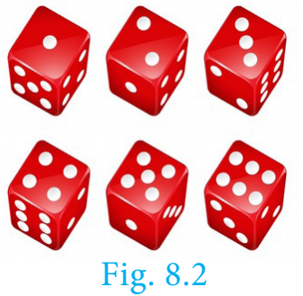

**கூறு புள்ளி (Sample point)** ஒரு கூறுவெளியிலுள்ள ஒவ்வொரு உறுப்பும் **கூறு புள்ளி** என்று அழைக்கப்படுகிறது.

### 8.4.1 மர வரைபடம் (Tree diagram)

ஒரு சமவாய்ப்புச் சோதனையின் அனைத்து சாத்தியமான விளைவுகளையும் மர வரைபடம் மூலம் எளிதாக வெளிப்படுத்தலாம். ஒரு மர வரைபடத்தில் உள்ள ஒவ்வொரு கிளையும் சாத்தியமான விளைவை பிரதிபலிக்கிறது.

##### விளக்கம்

(i) நாம் ஒரு பகடையை உருட்டும்போது, மர வரைபடத்திலிருந்து கூறுவெளியை, $S=\{1,2,3,4,5,6\}$ (படம்.8.3) என எழுதலாம்.

(ii) நாம் இரண்டு நாணயங்களைச் சுண்டும்போது, மர வரைபடத்திலிருந்து கூறுவெளியை $S=\{HH,HT,TH,TT\}$ என எழுதலாம். (படம்.8.4)

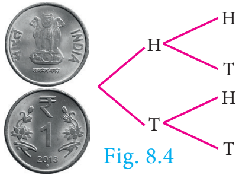

> **முன்னேற்றச் சோதனை**
>
> 1. ஒரு குறிப்பிட்ட விளைவைக் கணிக்க முடியாமல் இருக்கும் ஒரு சோதனையை ________ என்போம்.
> 2. அனைத்துச் சாத்தியமானக் கூறுகளின் தொகுப்பையும் ________ என அழைக்கிறோம்.

#### எடுத்துக்காட்டு 8.17

மர வரைபடத்தைப் பயன்படுத்தி இரண்டு பகடைகள் உருட்டப்படும்போது கிடைக்கும் கூறுவெளியை எழுதுக.

**தீர்வு** இரண்டு பகடைகள் உருட்டப்படும்போது, ஒவ்வொரு பகடையிலும் $6$ முக மதிப்புகள் $1, 2, 3, 4, 5, 6$ என உள்ளதால் கீழ்க்காணும் மர வரைபடத்தைப் பெறலாம்

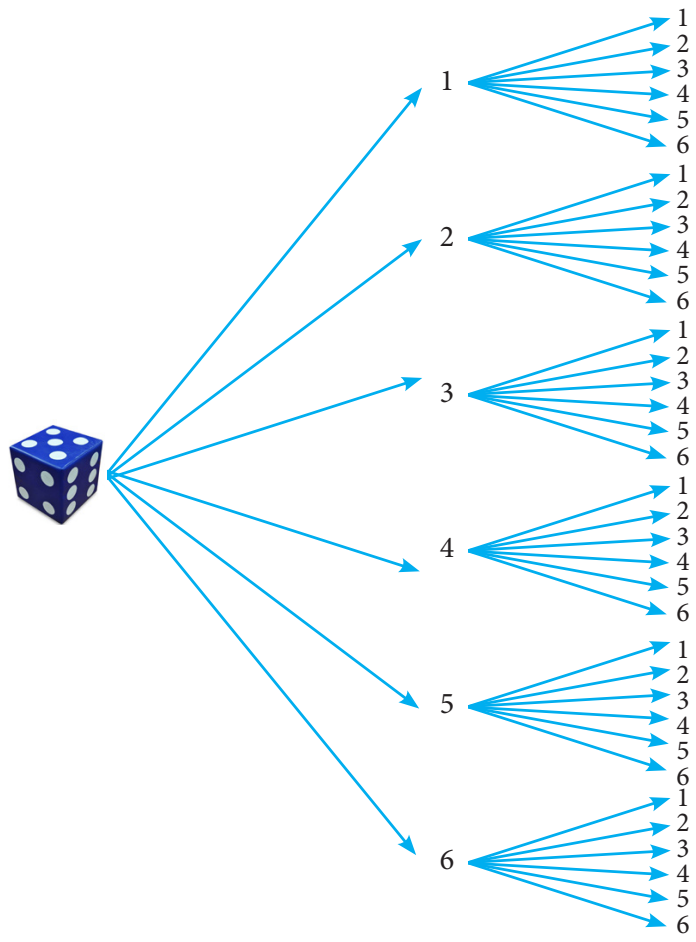

அதனால், கூறுவெளியை

$$
S=\left\{\begin{array}{l}
(1,1),(1,2),(1,3),(1,4),(1,5),(1,6),\\
(2,1),(2,2),(2,3),(2,4),(2,5),(2,6),\\
(3,1),(3,2),(3,3),(3,4),(3,5),(3,6),\\
(4,1),(4,2),(4,3),(4,4),(4,5),(4,6),\\
(5,1),(5,2),(5,3),(5,4),(5,5),(5,6),\\
(6,1),(6,2),(6,3),(6,4),(6,5),(6,6)
\end{array}\right\}
$$

என எழுதலாம்.

**நிகழ்ச்சி:** ஒரு சமவாய்ப்புச் சோதனையில் கிடைக்கும் ஒவ்வொரு விளைவும் **நிகழ்ச்சி** என்கிறோம். எனவே, ஒரு நிகழ்ச்சி கூறுவெளியின் உட்கணமாக இருக்கும்.

**எடுத்துக்காட்டு:** இரண்டு நாணயங்களை சுண்டும்பொழுது, இரண்டும் தலைகளாகக் பெறுவது ஒரு நிகழ்ச்சி.

**முயற்சி:** ஒரு சோதனையை ஒரு முறை செய்வது **முயற்சி**யாகும்.

**எடுத்துக்காட்டு:** ஒரு நாணயத்தை மூன்றுமுறை சுண்டும்பொழுது, ஒவ்வொருமுறை சுண்டுதலும் ஒரு முயற்சியாகும்.

| நிகழ்ச்சி | விளக்கம் | எடுத்துக்காட்டு |
|---|---|---|
| சமவாய்ப்பு நிகழ்ச்சிகள் | இரண்டு அல்லது அதற்கு மேற்பட்ட நிகழ்ச்சிகள் ஒவ்வொன்றும் நிகழ்வதற்கு சமவாய்ப்புகள் இருந்தால் அவற்றைச் சமவாய்ப்பு நிகழ்ச்சிகள் என்கிறோம். | ஒரு நாணயத்தை சுண்டும்போது கிடைக்கும் தலை மற்றும் பூ ஆகியவை சமவாய்ப்பு நிகழ்ச்சிகள். |
| உறுதியான நிகழ்ச்சிகள் | ஒரு சோதனையில் நிச்சயமாக நிகழும் நிகழ்ச்சியை உறுதியான நிகழ்ச்சி என்கிறோம். | ஒரு பகடையை உருட்டும்போது 1-லிருந்து 6 வரை உள்ள இயல் எண்களில் ஏதேனும் ஒரு எண் கிடைக்கும் நிகழ்ச்சி உறுதியான நிகழ்ச்சியாகும். |
| இயலா நிகழ்ச்சிகள் | ஒரு சோதனையில், ஒரு போதும் நடைபெற முடியாத நிகழ்ச்சி இயலா நிகழ்ச்சி எனப்படும். | இரண்டு நாணயங்களை சுண்டும்போது மூன்று தலைகள் கிடைக்கும் நிகழ்ச்சி இயலா நிகழ்ச்சியாகும். |
| ஒன்றையொன்று விலக்கும் நிகழ்ச்சிகள் | இரண்டு அல்லது அதற்கு மேற்பட்ட நிகழ்ச்சிகளுக்கு பொதுவான கூறுபுள்ளிகள் இருக்காது. அந்த நிகழ்ச்சிகளை ஒன்றையொன்று விலக்கும் நிகழ்ச்சிகள் என்கிறோம். $A,B$ ஆகியவை ஒன்றையொன்று விலக்கும் நிகழ்ச்சிகள் என்றால் $A\cap B=\phi$. | ஒரு பகடையை உருட்டும்போது ஒற்றைப்படை எண்கள் மற்றும் இரட்டைப்படை எண்கள் கிடைக்கும் நிகழ்ச்சிகள் ஒன்றையொன்று விலக்கும் நிகழ்ச்சிகள். |
| நிறைவு செய் நிகழ்ச்சிகள் | நிகழ்ச்சிகளின் சேர்ப்பு கணம் கூறுவெளியாக இருப்பின் அவற்றை நிறைவு செய் நிகழ்ச்சிகள் என்கிறோம். | ஒரு நாணயத்தை இருமுறை சுண்டும்போது இரண்டு தலைகள், ஒரே ஒரு தலை, தலை இல்லாமல் கிடைக்கும் நிகழ்ச்சிகள் நிறைவு செய் நிகழ்ச்சிகள். |
| நிரப்பு நிகழ்ச்சிகள் | $A$-யின் நிரப்பு நிகழ்ச்சியானது $A$-யில் இல்லாத மற்ற விளைவுகளைக் கொண்ட கூறு புள்ளிகள் ஆகும். இதை $A'$ அல்லது $A^c$ அல்லது $\overline A$ எனக் குறிக்கலாம். $A$ மற்றும் $A'$ ஆகியவை ஒன்றையொன்று விலக்கும் மற்றும் நிறைவு செய்யும் நிகழ்ச்சிகளாக இருக்கும். | ஒரு பகடையை உருட்டும்போது 5, 6 கிடைப்பதற்கான நிகழ்ச்சியும் மற்றும் 1, 2, 3, 4 கிடைப்பதற்கான நிகழ்ச்சியும் நிரப்பு நிகழ்ச்சிகளாகும். |

> **குறிப்பு**
>
> **ஒரே ஒரு விளைவு நிகழ்ச்சி:** $E$ என்ற நிகழ்ச்சியில் ஒரேயொரு விளைவு மட்டும் இருந்தால் அதற்கு ஒரேயொரு விளைவு நிகழ்ச்சி என்று பெயர்

> **உங்களுக்குத் தெரியுமா**
>
> 1713-ல் பெர்னோலி முதன்முதலில் நிகழ்தகவைச் சூதாட்டத்தைத் தவிர பல இடங்களில் மிகப்பரிய அளவில் பயன்படுத்திக்காட்டினார்

### 8.4.2 ஒரு நிகழ்ச்சியின் நிகழ்தகவு (Probability of an Event)

ஒரு சம வாய்ப்பு சோதனையில், $S$ என்பது கூறுவெளி மற்றும் $E\subseteq S$. இங்கு, $E$ ஆனது ஒரு நிகழ்ச்சி. $E$ என்ற நிகழ்ச்சி நிகழ்வதற்கான நிகழ்தகவானது,

$$
P(E) = \frac{E\text{ நிகழ்வதற்கு சாதகமான வாய்ப்புகள்}}{\text{மொத்த வாய்ப்புகள்}} = \frac{n(E)}{n(S)}
$$

நிகழ்தகவின் இந்த வரையறையானது முடிவுறு கூறுவெளிகளுக்கு மட்டுமே பொருந்தும். எனவே இந்தப் பாடப்பகுதியில் முடிவுறு கூறுவெளியை உடைய கணக்குகளையே கருத்தில் கொள்கிறோம்.

> **குறிப்பு**
>
> - $P(E)=\dfrac{n(E)}{n(S)}$
> - $P(S)=\dfrac{n(S)}{n(S)}=1$. உறுதியான நிகழ்ச்சியின் நிகழ்தகவானது $1$ ஆகும்.
> - $P(\phi)=\dfrac{n(\phi)}{n(s)}=\dfrac{0}{n(s)}=0$. இயலா நிகழ்ச்சியின் நிகழ்தகவானது $0$ ஆகும்.
> - $E$ ஆனது, $S$-ன் உட்கணமாகும். மேலும் $\phi$ ஆனது எல்லா கணங்களின் உட்கணமாகும். எனவே
>
>  $$
>  \phi\subseteq E\subseteq S
>  $$
>
>  $$
>  P(\phi)\leq P(E)\leq P(S)
>  $$
>
>  $$
>  0\leq P(E)\leq1
>  $$
>
>  ஆகையால், நிகழ்தகவு மதிப்பு எப்பொழுதும் $0$ முதல் $1$ வரை இருக்கும்.
> - $E$-ன் நிரப்பு நிகழ்ச்சி $\overline E$ ஆகும்.
>
>  $P(E)=\dfrac mn$ என்க. ($m$-ஆனது $E$-யின் சாதகமான வாய்ப்புகள் மற்றும் $n$-ஆனது மொத்த வாய்ப்புகள்).
>
>  $$
>  P(\overline E) = \frac{E\text{ நிகழ சாதகமற்ற வாய்ப்புகள்}}{\text{மொத்த வாய்ப்புகள்}}
>  $$
>
>  $$
>  P(\overline E)=\frac{n-m}{n}=1-\frac mn
>  $$
>
>  $$
>  P(\overline E)=1-P(E)
>  $$
>
>  
>
> - $P(E)+P(\overline E)=1$

> **முன்னேற்றச் சோதனை**
>
> கொடுக்கப்பட்ட எண்களில் எவை நிகழ்தகவாக இருக்க முடியாது?
>
> (a) $-0.0001$　(b) $0.5$　(c) $1.001$　(d) $1$
>
> (e) $20\%$　(f) $0.253$　(g) $\dfrac{1-\sqrt5}{2}$　(h) $\dfrac{\sqrt3+1}{4}$

#### எடுத்துக்காட்டு 8.18

ஒரு பையில் $5$ நீல நிறப்பந்துகளும், $4$ பச்சை நிறப்பந்துகளும் உள்ளன. பையிலிருந்து சமவாய்ப்பு முறையில் ஒரு பந்து எடுக்கப்படுகிறது. எடுக்கப்படும் பந்தானது (i) நீலமாக (ii) நீலமாக இல்லாமல் இருப்பதற்கான நிகழ்தகவைக் காண்க.

**தீர்வு** மொத்த வாய்ப்புகளின் எண்ணிக்கை $n(S)=5+4=9$

(i) $A$ என்பது நீல நிறப்பந்தை பெறுவதற்கான நிகழ்ச்சி என்க.

$A$ நிகழ்வதற்கான வாய்ப்புகளின் எண்ணிக்கை, $n(A)=5$

நீலநிறப் பந்து கிடைப்பதற்கான நிகழ்தகவு,

$$
P(A)=\frac{n(A)}{n(S)}=\frac59
$$

(ii) $\overline A$ ஆனது நீல நிறப்பந்து கிடைக்காமல் இருக்கும் நிகழ்ச்சி. எனவே,

$$
P(\overline A)=1-P(A)
$$

$$
=1-\frac59=\frac49
$$

#### எடுத்துக்காட்டு 8.19

இரண்டு பகடைகள் உருட்டப்படுகின்றன. கிடைக்கப்பெறும் முக மதிப்புகளின் கூடுதல் (i) $4$-க்குச் சமமாக (ii) $10$-ஐ விடப் பெரிதாக (iii) $13$-ஐ விடக் குறைவாக இருப்பதற்கான நிகழ்தகவு காண்க.

**தீர்வு** இரண்டு பகடைகள் உருட்டப்படும்பொழுது, கூறுவெளியானது

$$
\begin{aligned}
S=\{&(1,1),(1,2),(1,3),(1,4),(1,5),(1,6),\\
&(2,1),(2,2),(2,3),(2,4),(2,5),(2,6),\\
&(3,1),(3,2),(3,3),(3,4),(3,5),(3,6),\\
&(4,1),(4,2),(4,3),(4,4),(4,5),(4,6),\\
&(5,1),(5,2),(5,3),(5,4),(5,5),(5,6),\\
&(6,1),(6,2),(6,3),(6,4),(6,5),(6,6)\}.
\end{aligned}
$$

எனவே, $n(S)=36$

(i) $A$ ஆனது முக மதிப்புகளின் கூடுதல் $4$-ஆக இருப்பதற்கான நிகழ்ச்சி என்க.

$$
A=\{(1,3),(2,2),(3,1)\};\quad n(A)=3.
$$

முகமதிப்புகளின் கூடுதல் $4$ கிடைப்பதற்கான நிகழ்தகவானது

$$
P(A)=\frac{n(A)}{n(S)}=\frac3{36}=\frac1{12}
$$

(ii) $B$ ஆனது முக மதிப்புகளின் கூடுதல் $10$-ஐ விட பெரிய எண்ணாக இருப்பதற்கான நிகழ்ச்சி என்க.

$$
B=\{(5,6),(6,5),(6,6)\};\quad n(B)=3.
$$

கூடுதல் $10$ஐ விட பெரிதாக கிடைப்பதற்கான நிகழ்தகவானது $P(B)=\dfrac{n(B)}{n(S)}=\dfrac3{36}=\dfrac1{12}$

(iii) $C$ ஆனது முக மதிப்புகளின் கூடுதல் $13$-ஐ விட குறைவாக இருப்பதற்கான நிகழ்ச்சி என்க. எனவே $C=S$.

ஆகவே, $n(C)=n(S)=36$

ஆகையால், முக மதிப்புகளின் கூடுதல் $13$-ஐ விடக் குறைவானதாக இருப்பதற்கான நிகழ்தகவு $P(C)=\dfrac{n(C)}{n(S)}=\dfrac{36}{36}=1$.

#### எடுத்துக்காட்டு 8.20

இரண்டு நாணயங்கள் ஒன்றாகச் சுண்டப்படுகின்றன. இரண்டு நாணயங்களிலும் வெவ்வேறு முகங்கள் கிடைப்பதற்கான நிகழ்தகவு என்ன?

**தீர்வு** இரண்டு நாணயங்கள் சுண்டப்படும்பொழுது அதன் கூறுவெளியானது

$$
S=\{HH,HT,TH,TT\};
$$

$$
n(S)=4
$$

$A$ ஆனது நாணயங்களில் வெவ்வேறு முகங்கள் கொண்ட நிகழ்ச்சி என்க.

$$
A=\{HT,TH\};
$$

$$
n(A)=2
$$

நாணயங்களில் வெவ்வேறு முகங்கள் கிடைப்பதற்கான நிகழ்தகவானது

$$
P(A)=\frac{n(A)}{n(S)}=\frac24=\frac12
$$

#### எடுத்துக்காட்டு 8.21

ஒரு நெட்டாண்டில் (leap year) $53$ சனிக்கிழமைகள் கிடைப்பதற்கான நிகழ்தகவு என்ன?

**தீர்வு** ஒரு நெட்டாண்டில் $366$ நாள்கள் உள்ளன. எனவே $52$ முழு வாரங்களும் மற்றும் $2$ நாள்களும் உள்ளன.

$52$ வாரங்களில், $52$ சனிக்கிழமைகள் கிடைத்து விடும். மீதமுள்ள இரண்டு நாள்களுக்கான வாய்ப்புகள் கீழ்க்காணும் கூறுவெளியில் கிடைக்கும்.

$$
S= \{\text{ஞாயிறு–திங்கள், திங்கள்–செவ்வாய், செவ்வாய்–புதன், புதன்–வியாழன், வியாழன்–வெள்ளி, வெள்ளி–சனி, சனி–ஞாயிறு}\}.
$$

$$
n(S)=7
$$

$A$ என்பது $53$-வது சனிக்கிழமை கிடைக்கும் நிகழ்ச்சி என்க.

எனவே $A=\{\text{வெள்ளி–சனி, சனி–ஞாயிறு}\}$

$$
n(A)=2
$$

$53$ சனிக்கிழமைகள் கிடைப்பதற்கான நிகழ்தகவானது

$$
P(A)=\frac{n(A)}{n(S)}=\frac27
$$

$$
P(A)=\frac27
$$

> **சிந்தனைக் களம்**
>
> சாதாரண ஆண்டில், $53$ சனிக்கிழமைகள் வருவதற்கான நிகழ்தகவு என்ன?

#### எடுத்துக்காட்டு 8.22

ஒரு பகடை உருட்டப்படும் அதே நேரத்தில் ஒரு நாணயமும் சுண்டப்படுகிறது. பகடையில் ஒற்றைப்படை எண் கிடைப்பதற்கும், நாணயத்தில் தலைக் கிடைப்பதற்குமான நிகழ்தகவைக் காண்க.

**தீர்வு** கூறுவெளி, $S = \{1H,1T,2H,2T,3H,3T,4H,4T,5H,5T,6H,6T\};$

$$
n(S) = 12
$$

$A$ ஆனது ஒற்றைப்படை எண் மற்றும் தலைக் கிடைப்பதற்கான நிகழ்ச்சி என்க.

$$
A=\{1H,3H,5H\}
$$

$$
n(A)=3
$$

$$
P(A)=\frac{n(A)}{n(S)}=\frac3{12}=\frac14
$$

$$
P(A)=\frac14
$$

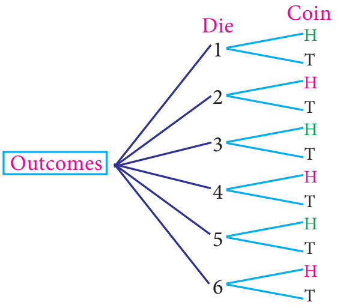

> **செயல்பாடு 3**
>
> மதுவின் வீட்டிலிருந்து அவள் பணியாற்றும் இடத்திற்கு செல்ல மூன்று வழிகள் $R_1, R_2$ மற்றும் $R_3$ உள்ளன. அவளுடைய அலுவலகத்தில் $P_1, P_2, P_3, P_4$ என்ற நான்கு வாகன நிறுத்துமிடங்களும், $B_1, B_2, B_3$ என்ற மூன்று நுழைவாயில்களும் உள்ளன. அங்கிருந்து அவள் பணிபுரியும் தளத்திற்குச் செல்ல $E_1, E_2$ என்ற இரண்டு மின்தூக்கிகள் உள்ளன. மர வரைபடத்தைப் பயன்படுத்தி அவளுடைய வீட்டிலிருந்து அலுவலகத் தளத்தை அடைய எத்தனை வழிகள் உள்ளன எனக் காண்க?

> **செயல்பாடு 4**
>
> தேவையான தகவல்களைச் சேகரித்துக் கீழ்க்காண்பனவற்றின் நிகழ்தகவுகளைக் காண்க.
>
> (i) உன்னுடைய வகுப்பிலுள்ள ஒரு மாணவனைத் தேர்ந்தெடுக்க.
>
> (ii) உன்னுடைய வகுப்பிலுள்ள ஒரு மாணவியைத் தேர்ந்தெடுக்க.
>
> (iii) உனது பள்ளியில் பத்தாம் வகுப்பு பயில்பவர்களில் ஒருவரைத் தேர்வு செய்ய.
>
> (iv) உனது பள்ளியில் பத்தாம் வகுப்பில் பயிலும் ஒரு மாணவனைத் தேர்வு செய்ய.
>
> (v) உனது பள்ளியில் பத்தாம் வகுப்பில் பயிலும் ஒரு மாணவியைத் தேர்வு செய்ய.

#### எடுத்துக்காட்டு 8.23

ஒரு பையில் $6$ பச்சை நிறப்பந்துகளும், சில கருப்பு மற்றும் சிவப்பு நிறப்பந்துகளும் உள்ளன. கருப்பு பந்துகளின் எண்ணிக்கை, சிவப்பு பந்துகளை போல் இருமடங்காகும். பச்சை பந்து கிடைப்பதற்கான நிகழ்தகவு சிவப்பு பந்து கிடைப்பதற்கான நிகழ்தகவைப் போல் மூன்று மடங்காகும். இவ்வாறெனில், (i) கருப்பு பந்துகளின் எண்ணிக்கை (ii) மொத்தப் பந்துகளின் எண்ணிக்கை ஆகியவற்றைக் காண்க.

**தீர்வு** பச்சை பந்துகளின் எண்ணிக்கை $n(G)=6$

சிவப்பு பந்துகளின் எண்ணிக்கை $n(R)=x$ என்க

எனவே, கருப்பு பந்துகளின் எண்ணிக்கை $n(B)=2x$

மொத்தப் பந்துகளின் எண்ணிக்கை $n(S)=6+x+2x=6+3x$

கொடுக்கப்பட்டது, $P(G)=3\times P(R)$

$$
\frac6{6+3x}=3\times\frac{x}{6+3x}
$$

$3x=6$ லிருந்து, $x=2$

(i) கருப்பு பந்துகளின் எண்ணிக்கை $=2\times2=4$

(ii) மொத்தப் பந்துகளின் எண்ணிக்கை $=6+(3\times2)=12$

#### எடுத்துக்காட்டு 8.24

படத்தில் காட்டியுள்ள அம்புக்குறி சுழற்றும் விளையாட்டில் $1, 2, 3, \ldots 12$ என்ற எண்கள் சமவாய்ப்பு முறையில் கிடைக்க வாய்ப்புள்ளன. அம்புக்குறியானது (i) $7$ (ii) பகா எண் (iii) கூட்டு எண் ஆகியவற்றில் நிற்பதற்கான நிகழ்தகவுகளைக் கண்டறிக.

**தீர்வு** கூறுவெளி $S=\{1,2,3,4,5,6,7,8,9,10,11,12\};\ n(S)=12$

(i) $A$ ஆனது, அம்புக்குறி எண் $7$-ல் நிற்பதற்கான நிகழ்ச்சி என்க.

$n(A)=1$

$$
P(A) = \frac{n(A)}{n(S)}=\frac1{12}
$$

(ii) $B$ ஆனது அம்புக்குறி பகா எண்ணில் நிற்பதற்கான நிகழ்ச்சி என்க.

$$
B=\{2,3,5,7,11\};\quad n(B)=5
$$

$$
P(B)=\frac{n(B)}{n(S)}=\frac5{12}
$$

(iii) $C$ ஆனது அம்புக்குறி கூட்டு எண்ணில் நிற்பதற்கான நிகழ்ச்சி என்க.

$$
C=\{4,6,8,9,10,12\};\quad n(C)=6
$$

$$
P(C)=\frac{n(C)}{n(S)}=\frac6{12}=\frac12
$$

> **சிந்தனைக் களம்**
>
> இயலா நிகழ்ச்சியின் நிரப்பு நிகழ்ச்சி எது?

### பயிற்சி 8.3

1. மூன்று நாணயங்கள் சுண்டப்படும்பொழுது கிடைக்கும் கூறுவெளியை மர வரைபடத்தைப் பயன்படுத்தி எழுதுக.

2. ஒரு பையிலுள்ள $1$ முதல் $6$ வரை எண்கள் குறிக்கப்பட்ட $6$ பந்துகளிலிருந்து, ஒரே நேரத்தில் இரண்டு பந்துகள் எடுப்பதற்கான கூறுவெளியை மர வரைபடம் மூலமாகக் குறிப்பிடுக.

3. ஒரு சமவாய்ப்புச் சோதனையில் ஒரு நிகழ்ச்சி $A$ என்க. இங்கு $P(A):P(\overline A)=17:15$ மற்றும் $n(S)=640$ எனில், (i) $P(\overline A)$ (ii) $n(A)$-ஐக் காண்க.

4. ஒரு நாணயம் மூன்று முறை சுண்டப்படுகிறது. இரண்டு அடுத்தடுத்த பூக்கள் கிடைப்பதற்கான நிகழ்தகவு என்ன?

5. ஒரு பொது விழாவில், $1$ முதல் $1000$ வரை எண்களிட்ட அட்டைகள் ஒரு பெட்டியில் வைக்கப்பட்டுள்ளன. விளையாடும் ஒவ்வொருவரும் ஒரு அட்டையைச் சமவாய்ப்பு முறையில் எடுக்கிறார்கள். எடுத்த அட்டை திரும்ப வைக்கப்படவில்லை. தேர்ந்தெடுக்கப்பட்ட அட்டையில் எண் $500$-ஐ விட அதிகமாக உள்ள வர்க்க எண் இருந்தால், அவர் வெற்றிக்கான பரிசைப் பெறுவார். (i) முதலில் விளையாடுபவர் பரிசு பெற (ii) முதலாமவர் வெற்றி பெற்ற பிறகு, இரண்டாவதாக விளையாடுபவர் வெற்றி பெற ஆகிய நிகழ்ச்சிகளுக்கான நிகழ்தகவுகளைக் காண்க.

6. ஒரு பையில் $12$ நீல நிறப்பந்துகளும், $x$ சிவப்பு நிறப்பந்துகளும் உள்ளன. சமவாய்ப்பு முறையில் ஒரு பந்து தேர்ந்தெடுக்கப்படுகிறது. (i) அது சிவப்பு நிறப்பந்தாக இருப்பதற்கான நிகழ்தகவைக் காண்க (ii) $8$ புதிய சிவப்பு நிறப்பந்தை அப்பையில் வைத்த பின்னர், ஒரு சிவப்பு நிறப்பந்தை தேர்ந்தெடுப்பதற்கான நிகழ்தகவானது (i)-யில் பெறப்பட்ட நிகழ்தகவை போல இருமடங்கு எனில், $x$-ன் மதிப்பினைக் காண்க.

7. இரண்டு சீரான பகடைகள் முறையாக ஒரே நேரத்தில் உருட்டப்படுகின்றன.

   (i) இரண்டு பகடைகளிலும் ஒரே முக மதிப்பு கிடைக்க

   (ii) முக மதிப்புகளின் பெருக்கற்பலன் பகா எண்ணாகக் கிடைக்க

   (iii) முக மதிப்புகளின் கூடுதல் பகா எண்ணாகக் கிடைக்க

   (iv) முக மதிப்புகளின் கூடுதல் $1$-ஆக இருக்க

   ஆகிய நிகழ்ச்சிகளின் நிகழ்தகவுகளைக் காண்க.

8. மூன்று சீரான நாணயங்கள் முறையாக ஒரே நேரத்தில் சுண்டப்படுகின்றன.

   (i) அனைத்தும் தலையாகக் கிடைக்க　(ii) குறைந்தபட்சம் ஒரு பூ கிடைக்க

   (iii) அதிகபட்சம் ஒரு தலை கிடைக்க　(iv) அதிகபட்சம் இரண்டு பூக்கள் கிடைக்க

   ஆகியவற்றிற்கான நிகழ்தகவுகளைக் காண்க.

9. ஒரு பையில் $5$ சிவப்பு நிறப் பந்துகளும், $6$ வெள்ளை நிறப் பந்துகளும், $7$ பச்சை நிறப் பந்துகளும் $8$ கருப்பு நிறப் பந்துகளும் உள்ளன. சமவாய்ப்பு முறையில் பையிலிருந்து ஒரு பந்து எடுக்கப்படுகிறது. அந்தப் பந்து (i) வெள்ளை (ii) கருப்பு அல்லது சிவப்பு (iii) வெள்ளையாக இல்லாமல் (iv) வெள்ளையாகவும், கருப்பாகவும் இல்லாமல் இருப்பதற்கான நிகழ்தகவுகளைக் காண்க.

10. ஒரு பெட்டியில் $20$ குறைபாடில்லாத விளக்குகளும், ஒரு சில குறைபாடுடைய விளக்குகளும் உள்ளன. பெட்டியிலிருந்து சமவாய்ப்பு முறையில் தேர்ந்தெடுக்கப்படும் ஒரு விளக்கானது குறைபாடுடையதாக இருப்பதற்கான வாய்ப்பு $\dfrac38$ எனில், குறைபாடுடைய விளக்குகளின் எண்ணிக்கையைக் காண்க.

11. மாணவர்கள் விளையாடும் ஒரு விளையாட்டில் அவர்களால் எறியப்படும் கல்லானது வட்டப்பரிதிக்குள் விழுந்தால் அதை வெற்றியாகவும், வட்டப்பரிதிக்கு வெளியே செவ்வகத்திற்குள் விழுந்தால் அதைத் தோல்வியாகவும் கருதப்படுகிறது. விளையாட்டில் வெற்றி கொள்வதற்கான நிகழ்தகவு என்ன? $(\pi=3.14)$

    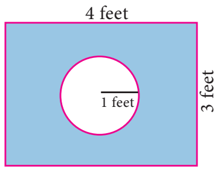

12. இரண்டு நுகர்வோர்கள், பிரியா மற்றும் அமுதன் ஒரு குறிப்பிட்ட அங்காடிக்கு, குறிப்பிட்ட வாரத்தில் (திங்கள் முதல் சனி வரை) செல்கிறார்கள். அவர்கள் அங்காடிக்குச் சமவாய்ப்பு முறையில் ஒவ்வொரு நாளும் செல்கிறார்கள். இருவரும் அங்காடிக்கு, (i) ஒரே நாளில் (ii) வெவ்வேறு நாள்களில் (iii) அடுத்தடுத்த நாள்களில் செல்வதற்கான நிகழ்தகவுகளைக் காண்க.

13. ஒரு விளையாட்டிற்கான, நுழைவுக் கட்டணம் ₹150. அந்த விளையாட்டில் ஒரு நாணயம் மூன்று முறை சுண்டப்படுகிறது. தனா, ஒரு நுழைவுச் சீட்டு வாங்கினாள். அவ்விளையாட்டில் ஒன்று அல்லது இரண்டு தலைகள் விழுந்தால் அவள் செலுத்திய நுழைவுக் கட்டணம் திரும்பக் கிடைத்துவிடும். மூன்று தலைகள் கிடைத்தால் அவளது நுழைவுக் கட்டணம் இரண்டு மடங்காகக் கிடைக்கும். இல்லையெனறால் அவளுக்கு எந்தக் கட்டணமும் திரும்பப் கிடைக்காது. இவ்வாறெனில், (i) இரண்டு மடங்காக (ii) நுழைவுக் கட்டணம் திரும்பப்பெற (iii) நுழைவுக் கட்டணத்தை இழப்பதற்கு, ஆகிய நிகழ்ச்சிகளுக்கான நிகழ்தகவுகளைக் காண்க.

## 8.5 நிகழ்ச்சிகளின் செயல்பாடுகள் (Algebra of Events)

ஒரு சமவாய்ப்பு சோதனையில் $S$ ஆனது கூறுவெளி என்க. $A\subseteq S$ மற்றும் $B\subseteq S$ ஆகியவை, கூறுவெளி $S$-ன் நிகழ்ச்சிகள் என்க. மேலும்,

(i) $A$ மற்றும் $B$ ஆகிய இரண்டு நிகழ்ச்சிகளும் சேர்ந்து நடைபெற்றால் அந்த நிகழ்ச்சியானது $(A\cap B)$ என்ற நிகழ்ச்சியாகும்.

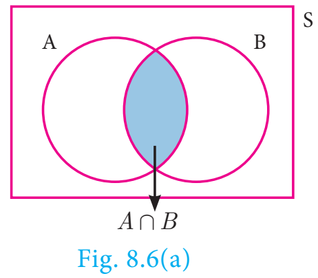

(ii) $A$ அல்லது $B$-யில் ஏதாவது ஒன்று நடைபெற்றால் அந்த நிகழ்ச்சியானது $(A\cup B)$ என்ற நிகழ்ச்சியாகும்.

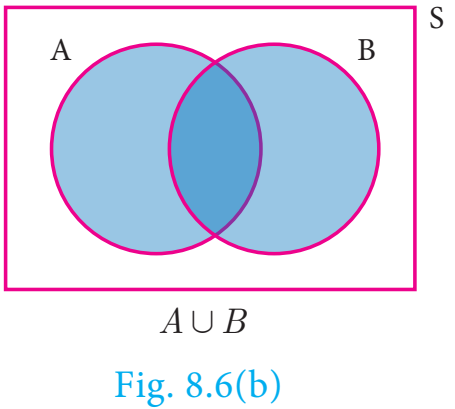

(iii) $\overline A$ என்ற நிகழ்ச்சியானது, $A$ என்ற நிகழ்ச்சி நடைபெறாத பொழுது நடைபெறும் நிகழ்ச்சியாகும்.

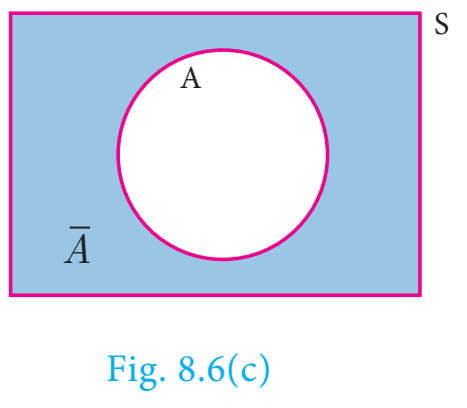

> **குறிப்பு**
>
> - $A\cap\overline A=\phi$
> - $A\cup\overline A=S$
> - $A, B$ ஆகியன ஒன்றையொன்று விலக்கும் நிகழ்ச்சிகள் எனில் $P(A\cup B)=P(A)+P(B)$
> - $P($ ஒன்றையொன்று விலக்கும் நிகழ்ச்சிகளின் சேர்ப்பு$)=\sum($நிகழ்ச்சிகளின் நிகழ்தகவு$)$

##### தேற்றம் 1

$A$ மற்றும் $B$ ஆகியவை ஒரு சமவாய்ப்பு சோதனையின் இரண்டு நிகழ்ச்சிகள் எனில்

(i) $P(A\cap\overline B)=P(A\text{ மட்டும})=P(A)-P(A\cap B)$

(ii) $P(\overline A\cap B)=P(B\text{ மட்டும})=P(B)-P(A\cap B)$ என நிறுவுக.

**நிருபணம்**

(i) கணங்களின் பங்கீட்புப் பண்பின்படி,

1. $(A\cap B)\cup(A\cap\overline B)=A\cap(B\cup\overline B)=A\cap S=A$

2. $(A\cap B)\cap(A\cap\overline B)=A\cap(B\cap\overline B)=A\cap\phi=\phi$

எனவே, $A\cap B$ மற்றும் $A\cap\overline B$ ஆகியவை ஒன்றையொன்று விலக்கும் நிகழ்ச்சிகள் மற்றும் அவைகளின் சேர்ப்பு $A$ ஆகும்.

ஆகையால்,

$$
P(A) = P\left[(A\cap B)\cup(A\cap\overline B)\right]
$$

$$
P(A) = P(A\cap B)+P(A\cap\overline B)
$$

$$
P(A\cap\overline B) = P(A)-P(A\cap B)
$$

அதாவது, $P(A\cap\overline B)=P(A\text{ மட்டும})=P(A)-P(A\cap B)$

(ii) கணங்களின் பங்கீட்புப் பண்பின்படி,

1. $(A\cap B)\cup(\overline A\cap B)=(A\cup\overline A)\cap B=S\cap B=B$

2. $(A\cap B)\cap(\overline A\cap B)=(A\cap\overline A)\cap B=\phi\cap B=\phi$

எனவே, $A\cap B$ மற்றும் $\overline A\cap B$ ஆகியவை ஒன்றையொன்று விலக்கும் நிகழ்ச்சிகள் மற்றும் அவைகளின் சேர்ப்பு $B$ ஆகும்.

ஆகையால், $P(B) = P\left[(A\cap B)\cup(\overline A\cap B)\right]$

$$
P(B) = P(A\cap B)+P(\overline A\cap B)
$$

$$
P(\overline A\cap B) = P(B)-P(A\cap B)
$$

அதாவது, $P(\overline A\cap B)=P(B\text{ மட்டும})=P(B)-P(A\cap B)$

> **முன்னேற்றச் சோதனை**
>
> 1. $P(A\text{ மட்டும})=$ ________.
>
> 2. $P(\overline A\cap B)=$ ________.
>
> 3. $A\cap B$ மற்றும் $\overline A\cap B$ ஆகியவை ________ நிகழ்ச்சிகள்.
>
> 4. $P(\overline A\cap\overline B)=$ ________.
>
> 5. $A$ மற்றும் $B$ ஆகியவை ஒன்றையொன்று விலக்கும் நிகழ்ச்சிகள் எனில், $P(A\cap B)=$ ______.
>
> 6. $P(A\cap B)=0.3$, $P(\overline A\cap B)=0.45$ எனில், $P(B)=$________.

## 8.6 நிகழ்தகவின் கூட்டல் தேற்றம் (Addition Theorem of Probability)

(i) $A$ மற்றும் $B$ ஆகியவை ஏதேனும் இரு நிகழ்ச்சிகள் எனில்,

$$
P(A\cup B)=P(A)+P(B)-P(A\cap B)
$$

(ii) $A,B$ மற்றும் $C$ ஆகியன ஏதேனும் மூன்று நிகழ்ச்சிகள் எனில்,

$$
\begin{aligned}
P(A\cup B\cup C)={}&P(A)+P(B)+P(C)-P(A\cap B)-P(B\cap C)\\
&-P(A\cap C)+P(A\cap B\cap C)
\end{aligned}
$$

**நிருபணம்**

(i) $S$- ஐ கூறுவெளியாக உடைய ஒரு சமவாய்ப்பு சோதனையில் $A$ மற்றும் $B$ ஆகியன ஏதேனும் இரண்டு நிகழ்ச்சிகள் என்க.

வென் படத்திலிருந்து $A$ மட்டும், $A\cap B$ மற்றும் $B$ மட்டும் ஆகியவை ஒன்றையொன்று விலக்கும் நிகழ்ச்சிகள். மேலும் அவைகளின் சேர்ப்பு ஆனது $A\cup B$ ஆகும்.

ஆகையால், $P(A\cup B)=P[(A\text{ மட்டும})\cup(A\cap B)\cup(B\text{ மட்டும})]$

$$
=P(A\text{ மட்டும})+P(A\cap B)+P(B\text{ மட்டும})
$$

$$
=[P(A)-P(A\cap B)]+P(A\cap B)+[P(B)-P(A\cap B)]
$$

$$
P(A\cup B)=P(A)+P(B)-P(A\cap B)
$$

(ii) $A, B, C$ ஆகியன சமவாய்ப்பு சோதனையில் $S$ என்ற கூறுவெளியின் ஏதேனும் மூன்று நிகழ்ச்சிகள் என்க.

$D=B\cup C$ என்க.

$$
\begin{aligned}
P(A\cup B\cup C) &= P(A\cup D)\\
&=P(A)+P(D)-P(A\cap D)\\
&=P(A)+P(B\cup C)-P[A\cap(B\cup C)]\\
&=P(A)+P(B)+P(C)-P(B\cap C)-P[(A\cap B)\cup(A\cap C)]\\
&=P(A)+P(B)+P(C)-P(B\cap C)-P(A\cap B)-P(A\cap C)+P[(A\cap B)\cap(A\cap C)]
\end{aligned}
$$

$$
\begin{aligned}
P(A\cup B\cup C)={}&P(A)+P(B)+P(C)-P(A\cap B)-P(B\cap C)\\
&-P(C\cap A)+P(A\cap B\cap C)
\end{aligned}
$$

> **செயல்பாடு 5**
>
> நிகழ்தகவின் கூட்டல் தேற்றத்தை பின்வரும் முறையில் சுலபமாக எழுதலாம்.
>
> $$
> P(A\cup B) = S_1-S_2
> $$
>
> $$
> P(A\cup B\cup C) = S_1-S_2+S_3
> $$
>
> இங்கே, $S_1\rightarrow$ ஒரு நிகழ்ச்சி மட்டும் நடப்பதற்கான நிகழ்தகவுகளின் கூடுதல்.
>
> $S_2\rightarrow$ இரண்டு நிகழ்ச்சிகள் மட்டும் நடப்பதற்கான நிகழ்தகவுகளின் கூடுதல்.
>
> $S_3\rightarrow$ மூன்று நிகழ்ச்சிகள் மட்டும் நடப்பதற்கான நிகழ்தகவுகளின் கூடுதல்.
>
> $$
> P(A\cup B) = \underbrace{P(A)+P(B)}_{S_1}\underbrace{-P(A\cap B)}_{S_2}
> $$
>
> $$
> \begin{aligned}
> P(A\cup B\cup C)={}&\underbrace{P(A)+P(B)+P(C)}_{S_1}\\
> &\underbrace{-(P(A\cap B)+P(B\cap C)+P(A\cap C))}_{S_2}+\underbrace{P(A\cap B\cap C)}_{S_3}
> \end{aligned}
> $$
>
> மேற்கண்ட அமைப்பு முறையில் $P(A\cup B\cup C\cup D)$-யின் நிகழ்தகவைக் காண்க.

#### எடுத்துக்காட்டு 8.25

$P(A)=0.37$, $P(B)=0.42$, $P(A\cap B)=0.09$ எனில், $P(A\cup B)$-ஐக் காண்க.

**தீர்வு** $P(A)=0.37$, $P(B)=0.42$, $P(A\cap B)=0.09$

$$
P(A\cup B) = P(A)+P(B)-P(A\cap B)
$$

$$
P(A\cup B)=0.37+0.42-0.09=0.7
$$

#### எடுத்துக்காட்டு 8.26

ஒரு கூடையிலுள்ள $80$ மஞ்சள், $70$ சிவப்பு மற்றும் $50$ வெள்ளை பூக்களிலிருந்து சம வாய்ப்பு முறையில் ஒரு பூ தேர்ந்தெடுக்கப்படும் போது அது மஞ்சள் அல்லது சிவப்பு நிறப் பூவாக இருக்க நிகழ்தகவு என்ன?

**தீர்வு:**

மொத்தப் பூக்களின் எண்ணிக்கை $n(S)=80+70+50=200$

மஞ்சள் பூக்களின் எண்ணிக்கை $n(Y)=80\ \therefore P(Y)=\dfrac{n(Y)}{n(S)}=\dfrac{80}{200}$

சிவப்பு பூக்களின் எண்ணிக்கை $n(R)=70\ \therefore P(R)=\dfrac{n(R)}{n(S)}=\dfrac{70}{200}$

$Y$ மற்றும் $R$ என்பன ஒன்றையொன்று விலக்கும் நிகழ்ச்சிகள் $P(Y\cup R)=P(Y)+P(R)$

> **சிந்தனைக் களம்**
>
> $P(A\cup B)+P(A\cap B)$ என்பது ___.

மஞ்சள் அல்லது சிவப்பு நிறப் பூவாக இருக்க நிகழ்தகவு

$$
P(Y\cup R)=\frac{80}{200}+\frac{70}{200}=\frac{150}{200}=\frac34
$$

#### எடுத்துக்காட்டு 8.27

இரண்டு பகடைகள் உருட்டப்படுகின்றன. இரண்டு முக மதிப்புகளும் சமமாக இருக்க அல்லது முக மதிப்புகளின் கூடுதல் $4$ ஆக இருப்பதற்கான நிகழ்தகவைக் காண்க?

**தீர்வு** இரண்டு பகடைகள் ஒன்றாக உருட்டப்படும் பொழுது அதன் கூறுவெளியில் $6\times6=36$ உறுப்புகள் இருக்கும். எனவே, $n(S)=36$

$A$-ஆனது இரண்டு பகடைகளிலும் ஒரே முக மதிப்புகள் மற்றும் $B$-ஆனது இரண்டு பகடைகளின் முக மதிப்புகளின் கூடுதல் $4$-ஆக கிடைக்கப்பெறும் நிகழ்ச்சிகள் என்க.

எனவே, $A=\{(1,1),(2,2),(3,3),(4,4),(5,5),(6,6)\}$

$$
B=\{(1,3),(2,2),(3,1)\}
$$

$A\cap B=\{(2,2)\}$

எனவே, $n(A)=6$, $n(B)=3$, $n(A\cap B)=1$.

$$
P(A) = \frac{n(A)}{n(S)}=\frac6{36}
$$

$$
P(B) = \frac{n(B)}{n(S)}=\frac3{36}
$$

$$
P(A\cap B) = \frac{n(A\cap B)}{n(S)}=\frac1{36}
$$

$P($ஒரே முக மதிப்புகள் அல்லது முக மதிப்புகளின் கூடுதல் $4$ கிடைக்க$)=P(A\cup B)$

$$
P(A\cup B) = P(A)+P(B)-P(A\cap B)
$$

$$
=\frac6{36}+\frac3{36}-\frac1{36}=\frac8{36}=\frac29
$$

எனவே, தேவையான நிகழ்தகவு $\dfrac29$ ஆகும்.

#### எடுத்துக்காட்டு 8.28

$A$ மற்றும் $B$ ஆகியவை $P(A)=\dfrac14$, $P(B)=\dfrac12$ மற்றும் $P(A\text{ மற்றும் }B)=\dfrac18$ என இருக்குமாறு அமைந்த இரண்டு நிகழ்ச்சிகள் எனில், பின்வருவனவற்றைக் காண்க.

(i) $P(A\text{ அல்லது }B)$　(ii) $P(A\text{-ம் இல்லை மற்றும் }B\text{-ம் இல்லை})$

**தீர்வு** (i)

$$
P(A\text{ அல்லது }B) = P(A\cup B)
$$

$$
=P(A)+P(B)-P(A\cap B)
$$

$$
P(A\text{ அல்லது }B) = \frac14+\frac12-\frac18=\frac58
$$

(ii) $P(A\text{-ம் இல்லை மற்றும் }B\text{-ம் இல்லை}) = P(\overline A\cap \overline B)$

$$
=P\left(\overline{A\cup B}\right)=1-P\left(A\cup B\right)
$$

$$
P(A\text{-ம் இல்லை மற்றும் }B\text{-ம் இல்லை}) = 1-\frac58=\frac38
$$

#### எடுத்துக்காட்டு 8.29

ஒரு குடியிருப்பில் $1$ முதல் $100$ வரை உள்ள கதவு எண் கொண்ட வீடுகளிலிருந்து சமவாய்ப்பு முறையில் ஒன்றைத் தேர்ந்தெடுக்கும் போது அந்த வீட்டின் கதவு எண், ஓர் இரட்டை எண் அல்லது முழுவர்க்க எண் அல்லது முழு கன எண்ணாக கிடைப்பதற்கான நிகழ்தகவு காண்க.

**தீர்வு:** மொத்த வீடுகளின் எண்ணிக்கை $n(S)=100$

கதவு எண் இரட்டை எண்ணாக கிடைப்பதற்கான நிகழ்ச்சி $A$ என்க.

$$
A=\{2,4,6,8,\ldots,100\}
$$

$$
n(A)=50
$$

$$
P(A)=\frac{n(A)}{n(S)}=\frac{50}{100}
$$

கதவு எண் முழுவர்க்க எண்ணாக கிடைப்பதற்கான நிகழ்ச்சி $B$ என்க.

$$
B=\{1,4,9,16,25,36,49,64,81,100\}
$$

$$
\therefore n(B)=10
$$

$$
P(B)=\frac{n(B)}{n(S)}=\frac{10}{100}
$$

கதவு எண் முழு கன எண்ணாக கிடைப்பதற்கான நிகழ்ச்சி $C$ என்க.

$$
C=\{1,8,27,64\}
$$

$$
\therefore n(C)=4
$$

$$
P(C)=\frac{n(C)}{n(S)}=\frac4{100}
$$

$$
P(A\cap B)=P(\text{இரட்டை எண் மற்றும் முழுவர்க்க எண் கிடைக்க})=\frac5{100}
$$

$$
P(B\cap C)=P(\text{முழுவர்க்க எண் மற்றும் முழு கன எண் கிடைக்க})=\frac2{100}
$$

$$
P(A\cap C)=P(\text{இரட்டை எண் மற்றும் முழு கன எண் கிடைக்க})=\frac2{100}
$$

$$
P(A\cap B\cap C)=P(\text{இரட்டை எண், முழுவர்க்க எண், முழு கன எண் கிடைக்க})=\frac1{100}
$$

தேவையான நிகழ்தகவு,

$$
P(A\cup B\cup C)=P(A)+P(B)+P(C)-P(A\cap B)-P(B\cap C)-P(A\cap C)+P(A\cap B\cap C)
$$

$$
=\frac{50}{100}+\frac{10}{100}+\frac4{100}-\frac5{100}-\frac2{100}-\frac2{100}+\frac1{100}=\frac{65}{100}-\frac9{100}=\frac{56}{100}=\frac{14}{25}
$$

#### எடுத்துக்காட்டு 8.30

$50$ மாணவர்கள் உள்ள ஒரு வகுப்பில், $28$ பேர் NCC-யிலும், $30$ பேர் NSS-லும் மற்றும் $18$ பேர் NCC மற்றும் NSS-லும் சேர்கிறார்கள். ஒரு மாணவர் சமவாய்ப்பு முறையில் தேர்ந்தெடுக்கப்படுகிறார். அவர்

(i) NCC-யில் இருந்து, ஆனால் NSS-ல் இல்லாமல்

(ii) NSS-ல் இருந்து, ஆனால் NCC-யில் இல்லாமல்

(iii) ஒன்றே ஒன்றில் மட்டும் சேர்ந்து இருப்பதற்கான நிகழ்தகவுகளைக் காண்க.

**தீர்வு** மொத்த மாணவர்களின் எண்ணிக்கை $n(S)=50$.

$A$ மற்றும் $B$ ஆகியவை முறையே $NCC$ மற்றும் $NSS$-யில் சேர்ந்த மாணவர்கள் என்க.

$n(A)=28$, $n(B)=30$, $n(A\cap B)=18$

$$
P(A) = \frac{n(A)}{n(S)}=\frac{28}{50};\quad P(B)=\frac{n(B)}{n(S)}=\frac{30}{50};\quad P(A\cap B)=\frac{n(A\cap B)}{n(S)}=\frac{18}{50}
$$

(i) NCC யில் சேர்ந்து NSS-யில் சேராமல் உள்ள மாணவர்களைத் தேர்ந்தெடுப்பதற்கான நிகழ்தகவு

$$
P(A\cap\overline B) = P(A)-P(A\cap B) = \frac{28}{50}-\frac{18}{50}=\frac15
$$

(ii) NSS-யில் சேர்ந்து NCC-யில் சேராமல் உள்ள மாணவர்களைத் தேர்ந்தெடுப்பதற்கான நிகழ்தகவு

$$
P(\overline A\cap B) = P(B)-P(A\cap B) = \frac{30}{50}-\frac{18}{50}=\frac6{25}
$$

(iii) ஏதாவது ஒன்றில் மட்டுமே சேர்ந்த மாணவரைத் தேர்ந்தெடுப்பதற்கான நிகழ்தகவு

$$
P(A\text{ மட்டும அல்லது }B\text{ மட்டும}) = P[(A\cap\overline B)\cup(\overline A\cap B)]
$$

$$
=P(A\cap\overline B)+P(\overline A\cap B)=\frac15+\frac6{25}=\frac{11}{25}
$$

(குறிப்பு: $(A\cap\overline B),(\overline A\cap B)$ ஆகியவை ஒன்றையொன்று விலக்கும் நிகழ்ச்சிகள்)

#### எடுத்துக்காட்டு 8.31

$A$ மற்றும் $B$ ஆகிய இரு விண்ணப்பதாரர்கள் IIT-யில் சேர்வதற்காகக் காத்திருப்பவர்கள். இவர்களில் $A$ தேர்ந்தெடுக்கப்படுவதற்கான நிகழ்தகவு $0.5$, $A$ மற்றும் $B$ இருவரும் தேர்ந்தெடுக்கப்படுவதற்கான நிகழ்தகவு $0.3$ எனில், $B$ தேர்ந்தெடுக்கப்படுவதற்கான அதிகபட்ச நிகழ்தகவு $0.8$ என நிரூபிக்க.

**தீர்வு** $P(A)=0.5$, $P(A\cap B)=0.3$

$P(A\cup B)\leq1$ என அறிவோம்.

$$
P(A)+P(B)-P(A\cap B) \leq1
$$

$$
0.5+P(B)-0.3 \leq1
$$

$$
P(B) \leq1-0.2
$$

$$
P(B) \leq0.8
$$

எனவே, $B$ தேர்ந்தெடுக்கப்படுவதற்கான அதிகபட்ச நிகழ்தகவு $0.8$ ஆகும்.

### பயிற்சி 8.4

1. $P(A)=\dfrac23$, $P(B)=\dfrac25$, $P(A\cup B)=\dfrac13$ எனில், $P(A\cap B)$ காண்க.

2. $A$ மற்றும் $B$ ஆகியவை இரு நிகழ்ச்சிகள். மேலும், $P(A)=0.42$, $P(B)=0.48$ மற்றும் $P(A\cap B)=0.16$ எனில்

   (i) $P(A\text{ இல்லை})$　(ii) $P(B\text{ இல்லை})$

   (iii) $P(A\text{ அல்லது }B)$ ஆகியவற்றைக் காண்க.

3. ஒரு சமவாய்ப்புச் சோதனையில் $A, B$ ஆகியவை ஒன்றையொன்று விலக்கும் நிகழ்ச்சிகள். மேலும் $P(A\text{ இல்லை})=0.45$, $P(A\cup B)=0.65$ எனில், $P(B)$-ஐக் காண்க.

4. $A$ மற்றும் $B$-யில், குறைந்தது ஏதாவது ஒன்று நிகழ்வதற்கான நிகழ்தகவு $0.6$. $A$ மற்றும் $B$ ஒரே நேரத்தில் நடைபெறுவதற்கான நிகழ்தகவு $0.2$ எனில், $P(\overline A)+P(\overline B)$-ஐக் காண்க.

5. நிகழ்ச்சி $A$-க்கான நிகழ்தகவு $0.5$ மற்றும் $B$-க்கான நிகழ்தகவு $0.3$. $A$ மற்றும் $B$ ஆகியவை ஒன்றையொன்று விலக்கும் நிகழ்ச்சிகள் எனில், $A$-ம், $B$-ம் நிகழாமல் இருப்பதற்கான நிகழ்தகவைக் காண்க.

6. இரண்டு பகடைகள் ஒரு முறை உருட்டப்படுகின்றன. முதல் பகடையில் முக மதிப்பு இரட்டைப் படை எண் அல்லது முக மதிப்புகளின் கூடுதல் $8$ ஆகக் கிடைப்பதற்கான நிகழ்தகவைக் காண்க.

7. ஒரு பெட்டியில் $3, 5, 7, 9, \ldots 35, 37$ என்ற எண்கள் குறிக்கப்பட்ட அட்டைகள் உள்ளன. சமவாய்ப்பு முறையில் எடுக்கப்படும் ஒரு அட்டை ஆனது $7$-ன் மடங்காக அல்லது பகா எண்ணாக இருப்பதற்கான நிகழ்தகவைக் காண்க.

8. சீரான மூன்று நாணயங்கள் ஒரு முறை சுண்டப்படுகின்றன. அதிகபட்சம் $2$ பூக்கள் அல்லது குறைந்தபட்சம் $2$ தலைகள் கிடைப்பதற்கான நிகழ்தகவைக் காண்க.

9. ஒருவருக்கு மின்சார ஒப்பந்தம் கிடைப்பதற்கான நிகழ்தகவு $\frac35$ மற்றும் குழாய்கள் பொருத்துவதற்கான ஒப்பந்தம் கிடைக்காமல் இருப்பதற்கான நிகழ்தகவு $\frac58$ ஆகும். மேலும் குறைந்தபட்சம் ஏதாவது ஒரு ஒப்பந்தம் கிடைக்கப்பெறுவதற்கான நிகழ்தகவு $\frac57$ எனில், இரண்டு ஒப்பந்தங்களும் கிடைப்பதற்கான நிகழ்தகவு என்ன?

10. 8000 மக்கள்தொகை கொண்ட ஒரு நகரத்தில், 1300 பேர் 50 வயதிற்கு மேற்பட்டவர்கள் மற்றும் 3000 பேர் பெண்ணினர். மேலும் 50 வயதிற்கு மேற்பட்ட பெண்கள் 30% உள்ளனர் எனவும் தெரியவருகிறது. தேர்ந்தெடுக்கப்படும் ஒரு நபர், பெண்ணாக அல்லது 50 வயதிற்கு மேற்பட்டவராக இருப்பதற்கான நிகழ்தகவைக் காண்க.

11. ஒரு நாணயம் மூன்று முறை சுண்டப்படுகிறது. சரியாக இரண்டு தலைகள் அல்லது குறைந்தபட்சம் ஒரு பூ அல்லது அடுத்தடுத்து இரண்டு தலைகள் கிடைப்பதற்கான நிகழ்தகவைக் காண்க.

12. $A,B,C$ என்பன ஏதேனும் மூன்று நிகழ்ச்சிகள். மேலும் $B$ கிடைப்பதற்கான நிகழ்தகவு $A$-ன் நிகழ்தகவைப் போல இருமடங்காகவும், $C$ கிடைப்பதற்கான நிகழ்தகவு $A$-ஐ விட மூன்று மடங்காகவும் உள்ளன. மேலும் $P(A\cap B)=\frac16$, $P(B\cap C)=\frac14$, $P(A\cap C)=\frac18$, $P(A\cup B\cup C)=\frac9{10}$, $P(A\cap B\cap C)=\frac1{15}$ எனில், $P(A),P(B)$ மற்றும் $P(C)$-ஐக் காண்க?

13. 35 மாணவர்கள் உள்ள ஒரு வகுப்பில், ஒவ்வொருவருக்கும் 1 முதல் 35 வரை எண்கள் கொடுக்கப்பட்டுள்ளன. மாணவர்களுக்கும் மாணவிகளுக்கும் உள்ள விகிதமானது 4:3 ஆகும். வரிசை எண்கள் மாணவர்களில் தொடங்கி மாணவிகளில் முடிவடைகிறது. ஒருவர் வகுப்பிலிருந்து தேர்ந்தெடுக்கப்படுகிறார். அவர் பகா எண்ணை வரிசை எண்ணாகக் கொண்ட மாணவராகவோ அல்லது பகு எண்ணை வரிசை எண்ணாகக் கொண்ட மாணவியாகவோ அல்லது இரட்டை எண்ணை வரிசை எண்ணாகக் கொண்டவராகவோ இருப்பதற்கான நிகழ்தகவைக் காண்க.

### Exercise 8.5

##### பலவுள் தெரிவு வினாக்கள்

1. கீழே கொடுக்கப்பட்டவைகளில் எது பரவல் அளவை இல்லை?

   (அ) வீச்சு  (ஆ) திட்டவிலக்கம்  (இ) கூட்டுச் சராசரி  (ஈ) விலக்க வர்க்கச் சராசரி

2. $8,8,8,8,8,\ldots,8$ ஆகிய தரவின் வீச்சு

   (அ) 0  (ஆ) 1  (இ) 8  (ஈ) 3

3. சராசரியிலிருந்து கிடைக்கப் பெற்ற தரவுப் புள்ளிகளுடைய விலக்கங்களின் கூடுதலானது ______.

   (அ) எப்பொழுதும் மிகை எண்  (ஆ) எப்பொழுதும் குறை எண்  (இ) பூச்சியம்  (ஈ) பூச்சியமற்ற முழுக்கள்

4. 100 தரவுப் புள்ளிகளின் சராசரி 40 மற்றும் திட்டவிலக்கம் 3 எனில், தரவுகளின் வர்க்கங்களின் கூடுதலானது

   (அ) 40000  (ஆ) 160900  (இ) 160000  (ஈ) 30000

5. முதல் 20 இயல் எண்களின் விலக்க வர்க்கச் சராசரியானது

   (அ) 32.25  (ஆ) 44.25  (இ) 33.25  (ஈ) 30

6. ஒரு தரவின் திட்டவிலக்கமானது 3. ஒவ்வொரு மதிப்பையும் 5-ஆல் பெருக்கினால் கிடைக்கும் புதிய தரவின் விலக்க வர்க்கச் சராசரியானது

   (அ) 3  (ஆ) 15  (இ) 5  (ஈ) 225

7. $x,y,z$ ஆகியவற்றின் திட்டவிலக்கமானது $p$-எனில், $3x+5$, $3y+5$, $3z+5$ ஆகியவற்றின் திட்டவிலக்கமானது

   (அ) $3p+5$  (ஆ) $3p$  (இ) $p+5$  (ஈ) $9p+15$

8. ஒரு தரவின் சராசரி மற்றும் மாறுபாட்டுக் கெழு முறையே 4 மற்றும் 87.5% எனில் திட்டவிலக்கமானது

   (அ) 3.5  (ஆ) 3  (இ) 4.5  (ஈ) 2.5

9. கொடுக்கப்டடவைகளில் எது தவறானது?

   (அ) $P(A)>1$  (ஆ) $0\leq P(A)\leq1$  (இ) $P(\phi)=0$  (ஈ) $P(A)+P(\overline{A})=1$

10. $p$ சிவப்பு, $q$ நீல, $r$ பச்சை நிறக் கூழாங்கற்கள் உள்ள ஒரு குடுவையில் இருந்து ஒரு சிவப்பு கூழாங்கல் எடுப்பதற்கான நிகழ்தகவானது

    (அ) $\dfrac{q}{p+q+r}$  (ஆ) $\dfrac{p}{p+q+r}$  (இ) $\dfrac{p+q}{p+q+r}$  (ஈ) $\dfrac{p+r}{p+q+r}$

11. ஒரு புத்தகத்திலிருந்து சமவாய்ப்பு முறையில் ஒரு பக்கம் தேர்ந்தெடுக்கப்படுகிறது. அந்தப் பக்க எண்ணின் ஒன்றாம் இட மதிப்பானது 7-ஐ விடக் குறைவாக இருப்பதற்கான நிகழ்தகவானது

    (அ) $\dfrac3{10}$  (ஆ) $\dfrac7{10}$  (இ) $\dfrac39$  (ஈ) $\dfrac79$

12. ஒரு நபருக்கு வேலை கிடைப்பதற்கான நிகழ்தகவானது $\dfrac{x}{3}$. வேலை கிடைக்காமல் இருப்பதற்கான நிகழ்தகவு $\dfrac23$ எனில் $x$-யின் மதிப்பானது

    (அ) 2  (ஆ) 1  (இ) 3  (ஈ) 1.5

13. கமலம், குலுக்கல் போட்டியில் கலந்துகொண்டாள். அங்கு மொத்தம் 135 சீட்டுகள் விற்கப்பட்டன. கமலம் வெற்றி பெறுவதற்கான வாய்ப்பு $\dfrac19$ எனில், கமலம் வாங்கிய சீட்டுகளின் எண்ணிக்கை,

    (அ) 5  (ஆ) 10  (இ) 15  (ஈ) 20

14. ஆங்கில எழுத்துகள் $\{a,b,\ldots,z\}$-யிலிருந்து ஓர் எழுத்து சமவாய்ப்பு முறையில் தேர்வு செய்யப்படுகிறது. அந்த எழுத்து $x$-க்கு முந்தைய எழுத்துகளில் ஒன்றாக இருப்பதற்கான நிகழ்தகவு

    (அ) $\dfrac{12}{13}$  (ஆ) $\dfrac1{13}$  (இ) $\dfrac{23}{26}$  (ஈ) $\dfrac3{26}$

15. ஒரு பணப்பையில் ₹2000 நோட்டுகள் 10-ம், ₹500 நோட்டுகள் 15-ம், ₹200 நோட்டுகள் 25-ம் உள்ளன. ஒரு நோட்டு சமவாய்ப்பு முறையில் எடுக்கப்படுகின்றது எனில், அந்த நோட்டு ₹500 நோட்டாகவோ அல்லது ₹200 நோட்டாகவோ இருப்பதற்கான நிகழ்தகவு என்ன?

    (அ) $\dfrac15$  (ஆ) $\dfrac3{10}$  (இ) $\dfrac23$  (ஈ) $\dfrac45$

### அலகு பயிற்சி - 8

1. பின்வரும் நிகழ்வெண் பரவலின் சராசரியானது 62.8 மற்றும் அனைத்து நிகழ்வெண்களின் கூடுதல் 50. விடுபட்ட நிகழ்வெண்கள் $f_1$ மற்றும் $f_2$-ஐக் கணக்கிடுக.

   | பிரிவு இடைவெளி | 0-20 | 20-40 | 40-60 | 60-80 | 80-100 | 100-120 |
   |---|---|---|---|---|---|---|
   | நிகழ்வெண் | 5 | $f_1$ | 10 | $f_2$ | 7 | 8 |

2. ஒரு வடிவமைப்பில் வரையப்பட்ட வட்டங்களின் விட்ட அளவுகள் (மி.மீ-ல்) கீழே கொடுக்கப்பட்டுள்ளன.

   | விட்டங்கள் | 33-36 | 37-40 | 41-44 | 45-48 | 49-52 |
   |---|---|---|---|---|---|
   | வட்டங்களின் எண்ணிக்கை | 15 | 17 | 21 | 22 | 25 |

   திட்டவிலக்கத்தைக் கணக்கிடுக.

3. ஒரு நிகழ்வெண் பரவல் கீழே கொடுக்கப்பட்டுள்ளது.

   | $x$ | $k$ | $2k$ | $3k$ | $4k$ | $5k$ | $6k$ |
   |---|---|---|---|---|---|---|
   | $f$ | 2 | 1 | 1 | 1 | 1 | 1 |

   அட்டவணையில், $k$ ஒரு மிகை முழு. விலக்க வர்க்கச் சராசரியானது 160 எனில், $k$-ன் மதிப்பைக் காண்க.

4. செல்சியஸில் குறிக்கப்பட்ட வெப்பநிலை தரவின் திட்டவிலக்கமானது 5. இந்த வெப்பநிலை தரவை ஃபாரன்ஹீட் ஆக மாற்றும்பொழுது கிடைக்கும் தரவின் விலக்க வர்க்கச் சராசரியைக் காண்க.

5. ஒரு பரவலில் $\sum(x-5)=3$, $\sum(x-5)^2=43$, மற்றும் மொத்த தரவுப் புள்ளிகளின் எண்ணிக்கை 18 எனில் சராசரி, திட்ட விலக்கத்தைக் காண்க.

6. இரண்டு நகரங்களின் பல்வேறு இடங்களில் விற்பனை செய்யும் நிலக்கடலை பொட்டலங்களின் விலைகள் கொடுக்கப்பட்டுள்ளன. எந்த நகரத்தில் விலைகளானது மிகவும் நிலையானதாக உள்ளது?

   | நகரம் $A$-ன் விலைகள் | 20 | 22 | 19 | 23 | 16 |
   |---|---|---|---|---|---|
   | நகரம் $B$-ன் விலைகள் | 10 | 20 | 18 | 12 | 15 |

7. ஒரு புள்ளி விவரத்தின் வீச்சு மற்றும் வீச்சுக்கெழு முறையே 20 மற்றும் 0.2 எனில், விவரங்களின் மிகப்பெரிய மதிப்பு மற்றும் மிகச்சிறிய மதிப்புகளைக் காண்க.

8. இரண்டு முறையான பகடைகள் உருட்டப்படும் பொழுது, முக மதிப்புகளின் பெருக்கல் 6 ஆகவோ அல்லது முக மதிப்புகளின் வித்தியாசம் 5 ஆகவோ இருப்பதற்கான நிகழ்தகவைக் காண்க?

9. இரண்டு குழந்தைகள் உள்ள ஒரு குடும்பத்தில், குறைந்தது ஒரு பெண் குழந்தையாவது இருப்பதற்கான நிகழ்தகவைக் காண்க.

10. ஒரு பையில் 5 வெள்ளை மற்றும் சில கருப்பு பந்துகள் உள்ளன. பையிலிருந்து கருப்பு பந்து கிடைப்பதற்கான நிகழ்தகவானது வெள்ளைப் பந்து கிடைப்பதற்கான நிகழ்தகவைப்போல் இரு மடங்கு எனில், கருப்புப் பந்துகளின் எண்ணிக்கையைக் காண்க.

11. ஒரு மாணவன் இறுதித் தேர்விலில் ஆங்கிலம் மற்றும் தமிழில் தேர்ச்சி பெறுவதற்கான நிகழ்தகவு 0.5, ஒன்றிலும் தேர்ச்சி அடையாமல் இருப்பதற்கான நிகழ்தகவு 0.1 ஆங்கிலத் தேர்விலில் தேர்ச்சி அடைவதற்கான நிகழ்தகவு 0.75 எனில், தமிழ் தேர்வில் தேர்ச்சி பெறுவதற்கான நிகழ்தகவு என்ன?

### நினைவில் கொள்ள வேண்டியவை

- வீச்சு $=L-S$ ($L$ - மிகப்பெரிய எண், $S$ - மிகச்சிறிய எண்)

- வீச்சுக்கெழு $=\dfrac{L-S}{L+S}$ ; விலக்க வர்க்கச் சராசரி $\sigma^2=\dfrac{\sum_{i=1}^{n}(x_i-\overline{x})^2}{n}$

- திட்டவிலக்கம் $\sigma=\sqrt{\dfrac{\sum(x_i-\overline{x})^2}{n}}$

- திட்டவிலக்கம் (தொகுக்கப்படாதவை)

  (i) நேரடி முறை $\sigma=\sqrt{\dfrac{\sum x_i^2}{n}-\left(\dfrac{\sum x_i}{n}\right)^2}$      (ii) சராசரி முறை $\sigma=\sqrt{\dfrac{\sum d_i^2}{n}}$

  (iii) ஊகச் சராசரி முறை $\sigma=\sqrt{\dfrac{\sum d_i^2}{n}-\left(\dfrac{\sum d_i}{n}\right)^2}$

  (iv) படிவிலக்க முறை $\sigma=c\times\sqrt{\dfrac{\sum d_i^2}{n}-\left(\dfrac{\sum d_i}{n}\right)^2}$

- முதல் $n$ இயல் எண்களின் திட்டவிலக்கம் $\sigma=\sqrt{\dfrac{n^2-1}{12}}$

- திட்டவிலக்கம் (தொகுக்கப்பட்டவை)

  (i) சராசரி முறை $\sigma=\sqrt{\dfrac{\sum f_id_i^2}{N}}$      (ii) ஊகச் சராசரி முறை $\sigma=\sqrt{\dfrac{\sum f_id_i^2}{N}-\left(\dfrac{\sum f_id_i}{N}\right)^2}$

  (iii) படி விலக்க முறை $\sigma=C\times\sqrt{\dfrac{\sum f_id_i^2}{N}-\left(\dfrac{\sum f_id_i}{N}\right)^2}$

- மாறுபாட்டுக் கெழு C.V $=\dfrac{\sigma}{\overline{x}}\times100\%$

- மாறுபாட்டுக் கெழுவின் மதிப்பு சிறியதாக இருந்தால், அத்தரவு அதிக நிலைத் தன்மையுடையது. மாறுபாட்டுக் கெழுவின் மதிப்பு பெரியதாக இருந்தால் அத்தரவு குறைந்த நிலைத் தன்மையுடன் இருக்கும்.

- ஒரு சம வாய்ப்புச் சோதனையில் அனைத்து வாய்ப்புகளையும் அறிந்து கொள்ள முடியும். ஆனால், குறிப்பிட்ட வாய்ப்புகள் அறியப்படாது.

- ஒரு சமவாய்ப்பு சோதனையில் கிடைக்கப்பெறும் அனைத்து சாத்திய விளைவுகளின் தொகுப்பைக் கூறுவெளி என்கிறோம்.

- A, B என்பன ஒன்றையொன்று விலக்கும் நிகழ்ச்சிகள் எனில், $A\cap B=\phi$

- $E$ என்ற நிகழ்ச்சியின் நிகழ்தகவானது $P(E)=\dfrac{n(E)}{n(S)}$

  (i) உறுதியாகக் கிடைக்கப்பெறும் நிகழ்ச்சியின் நிகழ்தகவானது 1 மற்றும் இயலாத நிகழ்ச்சியின் நிகழ்தகவானது 0 ஆகும்.

  (ii) $0\leq P(E)\leq1$ ;      (iii) $P(\overline{E})=1-P(E)$

- $A$ மற்றும் $B$ ஆனவை ஒன்றையொன்று விலக்கும் நிகழ்ச்சிகள் எனில், $P(A\cup B)=P(A)+P(B)$.

- (i) $P(A\cap\overline{B})=P(A \text{ மட்டும்})=P(A)-P(A\cap B)$

  (ii) $P(\overline{A}\cap B)=P(B \text{ மட்டும்})=P(B)-P(A\cap B)$

- $A$ மற்றும் $B$ ஆனவை ஏதேனும் இரண்டு நிகழ்ச்சிகள் எனில், $P(A\cup B)=P(A)+P(B)-P(A\cap B)$.

- $A, B, C$ என்பன ஏதேனும் மூன்று நிகழ்ச்சிகள் எனில்,

  $$
  P(A\cup B\cup C)=P(A)+P(B)+P(C)-P(A\cap B)-P(B\cap C)-P(C\cap A)+P(A\cap B\cap C)
  $$

### இணையச் செயல்பாடு (ICT)

##### ICT 8.1

**படி 1:** கீழ்க்காணும் உரலி / விரைவுக் குறியீட்டைத் தட்டச்சு செய்க அல்லது துரித துலங்கள் குறியீட்டை ஸ்கேன் செய்க. Probability என்ற தலைப்பில் ஒரு பணித்தாள் தோன்றும். அதில் Probability Addition law என்ற தலைப்பைத் தேர்வு செய்க.

**படி 2:** கொடுக்கப்பட்ட பணித்தாளில் New problem என்பதை சொடுக்குவதன் மூலம் பணித்தாளின் கேள்வியை மாற்ற முடியும். பின்னர் வலை நகர்த்தி கணக்கின் படிகளை காணலாம்.

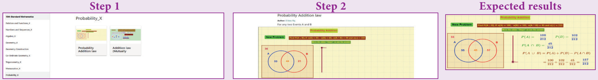

##### ICT 8.2

**படி 1:** கீழ்க்காணும் உரலி / விரைவுக் குறியீட்டைத் தட்டச்சு செய்க அல்லது துரித துலங்கள் குறியீட்டை ஸ்கேன் செய்க. Probability என்ற தலைப்பில் ஒரு பணித்தாள் தோன்றும். அதில் Addition law mutually exclusive என்ற தலைப்பைத் தேர்வு செய்க.

**படி 2:** கொடுக்கப்பட்ட பணித்தாளில் New problem என்பதை சொடுக்குவதன் மூலம் பணித்தாளின் கேள்வியை மாற்ற முடியும். பின்னர் வலை நகர்த்தி கணக்கின் படிகளை காணலாம். சிறார்க்கும் பட்டியலைச் சொடுக்கி சரியான விடையைப் பார்க்கவும்.

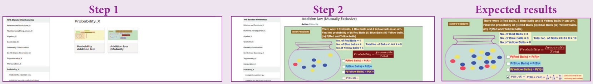

இந்தப் படிகளைக் கொண்டு மற்ற செயல்பாடுகளைச் செய்க.

[https://www.geogebra.org/m/jfr2zzgy#chapter/359554](https://www.geogebra.org/m/jfr2zzgy#chapter/359554)

அல்லது விரைவுக் குறியீட்டை ஸ்கேன் செய்க.

