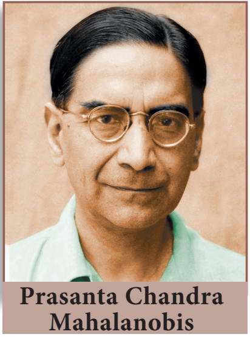

> "வாழ்க்கையே ஒரு நிகழ்தகவின் கருத்தாக்கம்தான்" —வால்டர் பேகாட்

கொல்கத்தாவில் பிறந்த பிரசந்த சந்திர மகலெனோபிஸ் ஓர் இந்தியப் புள்ளியியலார் ஆவார். இரு தரவுத் தொகுப்புகளுக்கிடையே உள்ள ஒப்புமை அளவீட்டைக் கண்டறியும் முறையை உருவாக்கினார். அதிகளவிலான மாதிரி கொண்ட கணக்கெடுப்புகளை மேற்கொள்ள புதிய வழிமுறைகளை அறிமுகப்படுத்தினார். சமவாய்ப்பு மாதிரி முறையைப் பயன்படுத்தி நிலப்பரப்பையும் பயிர் உற்பத்தி அளவைக் கணக்கிடும் முறையை வழங்கினார். இவருடைய அளப்பரிய பணிகளுக்காக, இந்திய அரசின் மிக உயரிய விருதுகளில் ஒன்றான பத்மவிபூஷன் விருது 1968 ஆம் ஆண்டு இந்திய அரசால் வழங்கப்பட்டது. இந்திய புள்ளியியல் துறையில் இவர் நிகழ்த்திய சாதனைகளுக்காக "இந்தியப் புள்ளியியலின் தந்தை" எனப் போற்றப்படுகிறார். மேலும் இவரது பிறந்த நாளான ஜூன் மாதம் 29 -ஆம் தேதியை ஒவ்வோர் ஆண்டும் தேசிய புள்ளியியல் தினமாகக் கொண்டாடும்படி இந்திய அரசாங்கம் அறிவித்துள்ளது.

